<br>

<div align="center">
  
</div>

### **Facultad**: Ingeniería

### **Carrera**: Ingeniería de Software

### **Curso**: Desarrollo de aplicaciones Open Source (**NRC**: 11990)

### **Docente**: Juan Antonio Flores Moroco

<br>

---

<br>

<h1 align="center">Informe del Trabajo final</h1>

<table>
  <tr>
    <td width="30%" align="center">
      
    </td>
    <td width="70%">
      <h3><b>Nombre de la Startup</b>: Chronos</h3>
      <h3><b>Nombre del producto</b>: SafeStep</h3>
      <p>
        SafeStep es una aplicación web interactiva que revoluciona la forma en que las personas aprenden primeros auxilios. A través de simulaciones ramificadas y escenarios realistas, el usuario toma decisiones en tiempo real para resolver emergencias comunes como RCP, quemaduras, cortes o atragantamientos.
      </p>
      <br/>
    </td>
  </tr>
</table>

## 👥 Integrantes:

- **Ayala Fernandez, Jorge Brayan** — u20241c030
- **Flores Eusebio, Angel Thyago** — u20231b781
- **Melgarejo Quiroz Josep Eliu** — u202315165
- **Miraval Pomalaya, Rodrigo Jesus** — u202311082
- **Sanchez Espinoza, Mathias Enrique** — u20231c524

<div align="center">

### **Ciclo Académico**: 2026 - 1

### Abril - 2026

</div>

# Registro de Versiones del informe

<table>
    <tr>
        <td align="center"><b>Versión</b></td>
        <td align="center"><b>Fecha</b></td>
        <td align="center"><b>Autor</b></td>
        <td align="center"><b>Descripción de la modificación</b></td>
    </tr>
    <tr>
        <td align="center">1</td>
        <td align="center">20/04/26</td>
        <td>
            <ul>
                <li>Ayala Fernandez, Jorge Brayan</li>
                <li>Flores Eusebio, Angel Thyago</li>
                <li>Melgarejo Quiroz Josep Eliu</li>
                <li>Miraval Pomalaya, Rodrigo Jesus</li>
                <li>Sanchez Espinoza, Mathias Enrique</li>
            </ul>
        </td>
        <td>
            <ul>
                <li>Capítulo I: Introducción</li>
                <li>Capítulo II: Requirements Elicitation & Analysis.</li>
                <li>Capítulo III: Requirements Specification.</li>
                <li>Capítulo IV: Product Design.</li>
                <li>Capítulo V: Product Implementation, Validation & Deployment.</li>
                <li>5.1. Software Configuration Management.</li>
                <li>5.1.1. Software Development Environment Configuration.</li>
                <li>5.1.2. Source Code Management.</li>
                <li>5.1.3. Source Code Style Guide & Conventions.</li>
                <li>5.1.4. Software Deployment Configuration.</li>
                <li>5.2. Landing Page, Services & Applications Implementation.</li>
                <li>5.2.1. Sprint 1</li>
                <li>5.2.1.1. Sprint Planning 1.</li>
                <li>5.2.1.2. Aspect Leaders and Collaborators.</li>
                <li>5.2.1.3. Sprint Backlog 1.</li>
                <li>5.2.1.4. Development Evidence for Sprint Review.</li>
                <li>5.2.1.5. Execution Evidence for Sprint Review.</li>
                <li>5.2.1.6. Services Documentation Evidence for Sprint Review.</li>
                <li>5.2.1.7. Software Deployment Evidence for Sprint Review.</li>
                <li>5.2.1.8. Team Collaboration Insights during Sprint.</li>
                <li>Conclusiones</li>
                <li>Bibliografía</li>
                <li>Anexos</li>
            </ul>
        </td>
    </tr>
</table>

# Project Report Collaboration Insights

**Nombre de la organización**: Chronos

**Nombre del producto**: SafeStep

**URL de la organización**: 

https://github.com/upc-1asi0729-2610-11990-chronos-team-3

**URL del reporte de SafeStep**:

https://github.com/upc-1asi0729-2610-11990-chronos-team-3/safestep-report

**URL del landing page de SafeStep**:

https://github.com/upc-1asi0729-2610-11990-chronos-team-3/safestep-landing-page

**URL del frontend de SafeStep**:

https://github.com/upc-1asi0729-2610-11990-chronos-team-3/safestep-frontend

**URL del backend de SafeStep**:

https://github.com/upc-1asi0729-2610-11990-chronos-team-3/safestep-backend

## Avance 1 (AV1)

En esta sección se hizo el avance de las 5 secciones importantes del informe donde se destacó la naturaleza de la Startup SafeStep, a partir de la identificación de todas sus componentes el equipo se siente preparado para poder ejecutar e implementar la solución vía código en el primer Sprint presupuestado.

### Analytics de colaboración:

<div align="center">
  <p>
    <b>Gráfico 1</b>: Analytics AV1
  </p>
  
  <p>
    <i><b>Fuente</b>: Elaboración propia.</i>
  </p>
</div>

# Student Outcome

<table>
    <tr>
        <td align="center"><b>Criterio específico</b></td>
        <td align="center"><b>Acciones realizadas</b></td>
        <td align="center"><b>Conclusiones</b></td>
    </tr>
    <tr>
        <td rowspan="5">
            <b>Comunica oralmente con efectividad a diferentes rangos de audiencia.</b>
        </td>
        <td>
            <b>Ayala Fernandez, Jorge Brayan</b> <br/>
            <i>AV1</i>
            <ul>
                <li>Me encargué de exponer el capítulo I. Introducción</li>
            </ul>
        </td>
        <td rowspan="5">
            <i>AV1</i>
            <ul>
                <li>Pudimos exponer satisfactoriamente todo nuestro avance N°1</li>
            </ul>
        </td>
    </tr>
    <tr>
        <td>
            <b>Flores Eusebio, Angel Thyago</b> <br/>
            <i>AV1</i>
            <ul>
                <li>Me encargué de exponer el capítulo II. Requirements Elicitation & Analysis</li>
            </ul>
        </td>
    </tr>
    <tr>
        <td>
            <b>Melgarejo Quiroz Josep Eliu</b> <br/>
            <i>AV1</i>
            <ul>
                <li>Me encargué de exponer el capítulo III. Requirements Specification</li>
            </ul>
        </td>
    </tr>
    <tr>
        <td>
            <b>Miraval Pomalaya, Rodrigo Jesus</b> <br/>
            <i>AV1</i>
            <ul>
                <li>Me encargué de exponer el capítulo IV. Product Design</li>
            </ul>
        </td>
    </tr>
    <tr>
        <td>
            <b>Sanchez Espinoza, Mathias Enrique</b> <br/>
            <i>AV1</i>
            <ul>
                <li>Me encargué de exponer el capítulo V. Product Implementation, Validation & Deployment</li>
            </ul>
        </td>
    </tr>
    <tr>
        <td rowspan="5">
            <b>Comunica por escrito con efectividad a diferentes rangos de audiencia.</b>
        </td>
        <td>
            <b>Ayala Fernandez, Jorge Brayan</b> <br/>
            <i>AV1</i>
            <ul>
                <li>Me encargué de redactar el capítulo I. Introducción</li>
            </ul>
        </td>
        <td rowspan="5">
            <i>AV1</i>
            <ul>
                <li>Pudimos redactar satisfactoriamente todo nuestro avance N°1</li>
            </ul>
        </td>
    </tr>
    <tr>
        <td>
            <b>Flores Eusebio, Angel Thyago</b> <br/>
            <i>AV1</i>
            <ul>
                <li>Me encargué de redactar el capítulo II. Requirements Elicitation & Analysis</li>
            </ul>
        </td>
    </tr>
    <tr>
        <td>
            <b>Melgarejo Quiroz Josep Eliu</b> <br/>
            <i>AV1</i>
            <ul>
                <li>Me encargué de redactar el capítulo III. Requirements Specification</li>
            </ul>
        </td>
    </tr>
    <tr>
        <td>
            <b>Miraval Pomalaya, Rodrigo Jesus</b> <br/>
            <i>AV1</i>
            <ul>
                <li>Me encargué de redactar el capítulo IV. Product Design</li>
            </ul>
        </td>
    </tr>
    <tr>
        <td>
            <b>Sanchez Espinoza, Mathias Enrique</b> <br/>
            <i>AV1</i>
            <ul>
                <li>Me encargué de redactar el capítulo V. Product Implementation, Validation & Deployment</li>
            </ul>
        </td>
    </tr>
</table>

<br>

---

<br>

<div align="center">

# Índice general

</div>

### [Registro de Versiones del Informe](./markdown/content/registro-versiones.md)

### [Project Report Collaboration Insights](./markdown/content/report-collaboration.md)

### [Tabla de contenidos](./README.md#índice-general)

### [Student Outcome](./markdown/content/student-outcome.md)

## Capítulo I: Introducción

- 1.1. [Startup Profile](./markdown/content/chapter-1/1-1-startup-profile.md)
  - 1.1.1. [Descripción de la Startup](./markdown/content/chapter-1/1-1-startup-profile.md#111-descripción-de-la-startup)
  - 1.1.2. [Perfiles de los integrantes del equipo](./markdown/content/chapter-1/1-1-startup-profile.md#112-perfiles-de-integrantes-del-equipo)

- 1.2. [Solution Profile](./markdown/content/chapter-1/1-2-solution-profile.md)
  - 1.2.1. [Antecedentes y problemática](./markdown/content/chapter-1/1-2-solution-profile.md#121-antecedentes-y-problemática)
  - 1.2.2. [Lean UX Process](./markdown/content/chapter-1/1-2-solution-profile.md#122-lean-ux-process)
    - 1.2.2.1. [Lean UX Problem Statements](./markdown/content/chapter-1/1-2-solution-profile.md#1221-lean-ux-problem-statements)
    - 1.2.2.2. [Lean UX Assumptions](./markdown/content/chapter-1/1-2-solution-profile.md#1222-lean-ux-assumptions)
    - 1.2.2.3. [Lean UX Hypothesis Statements](./markdown/content/chapter-1/1-2-solution-profile.md#1223-lean-ux-hypothesis-statements)
    - 1.2.2.4. [Lean UX Canvas](./markdown/content/chapter-1/1-2-solution-profile.md#1224-lean-ux-canvas)

- 1.3. [Segmentos objetivo](./markdown/content/chapter-1/1-3-segmentos-objetivo.md)

## Capítulo II: Requirements Elicitation & Analysis

- 2.1. [Competidores](./markdown/content/chapter-2/2-1-competidores.md)
  - 2.1.1. [Análisis competitivo](./markdown/content/chapter-2/2-1-competidores.md#211-análisis-competitivo)
  - 2.1.2. [Estrategias y tácticas frente a competidores](./markdown/content/chapter-2/2-1-competidores.md#212-estrategias-y-tácticas-frente-a-competidores)

- 2.2. [Entrevistas](./markdown/content/chapter-2/2-2-entrevistas.md)
  - 2.2.1. [Diseño de entrevistas](./markdown/content/chapter-2/2-2-entrevistas.md#221-diseño-de-entrevistas)
  - 2.2.2. [Registro de entrevistas](./markdown/content/chapter-2/2-2-entrevistas.md#222-registro-de-entrevistas)
  - 2.2.3. [Análisis de entrevistas](./markdown/content/chapter-2/2-2-entrevistas.md#223-análisis-de-entrevistas)

- 2.3. [Needfinding](./markdown/content/chapter-2/2-3-needfinding.md)
  - 2.3.1. [User personas](./markdown/content/chapter-2/2-3-needfinding.md#231-user-personas)
  - 2.3.2. [User Task Matrix](./markdown/content/chapter-2/2-3-needfinding.md#232-user-task-matrix)
  - 2.3.3. [User Journey Mapping](./markdown/content/chapter-2/2-3-needfinding.md#233-user-journey-mapping)
  - 2.3.4. [Empathy Mapping](./markdown/content/chapter-2/2-3-needfinding.md#234-empathy-mapping)

- 2.4. [Big Picture Event Storming](./markdown/content/chapter-2/2-4-big-picture-event-storming.md)

- 2.5. [Ubiquitous Language](./markdown/content/chapter-2/2-5-ubiquitous-language.md) 

## Capítulo III: Requirements Specification

- 3.1. [User Stories](./markdown/content/chapter-3/3-1-user-stories.md)

- 3.2. [Impact Mapping](./markdown/content/chapter-3/3-2-impact-mapping.md)

- 3.3. [Product Backlog](./markdown/content/chapter-3/3-3-product-backlog.md)

## Capítulo IV: Product Design

- 4.1. [Style Guidelines](./markdown/content/chapter-4/4-1-style-guidelines.md)
  - 4.1.1. [General Style Guidelines](./markdown/content/chapter-4/4-1-style-guidelines.md#411-general-style-guidelines)
  - 4.1.2. [Web Style Guidelines](./markdown/content/chapter-4/4-1-style-guidelines.md#412-web-style-guidelines)

- 4.2. [Information Architecture](./markdown/content/chapter-4/4-2-information-architecture.md)
  - 4.2.1. [Organization Systems](./markdown/content/chapter-4/4-2-information-architecture.md#421-organization-systems)
  - 4.2.2. [Labeling Systems](./markdown/content/chapter-4/4-2-information-architecture.md#422-labeling-systems)
  - 4.2.3. [SEO Tags and Meta Tags](./markdown/content/chapter-4/4-2-information-architecture.md#423-seo-tags-and-meta-tags)
  - 4.2.4. [Searching Systems](./markdown/content/chapter-4/4-2-information-architecture.md#424-searching-systems)
  - 4.2.5. [Navigation Systems](./markdown/content/chapter-4/4-2-information-architecture.md#425-navigation-ssytems)

- 4.3. [Landing Page UI Design](./markdown/content/chapter-4/4-3-landing-page-ui-design.md)
  - 4.3.1. [Landing Page Wireframe](./markdown/content/chapter-4/4-3-landing-page-ui-design.md#431-landing-page-wireframe)
  - 4.3.2. [Landing Page Mock-up](./markdown/content/chapter-4/4-3-landing-page-ui-design.md#432-landing-page-mock-up)

- 4.4. [Web Applications UX/UI Design](./markdown/content/chapter-4/4-4-web-applications-ux-ui-design.md)
  - 4.4.1. [Web Applications Wireframes](./markdown/content/chapter-4/4-4-web-applications-ux-ui-design.md#441-web-applications-wireframes)
  - 4.4.2. [Web Applications Wireflow Diagrams](./markdown/content/chapter-4/4-4-web-applications-ux-ui-design.md#442-web-applications-wireflow-diagrams)
  - 4.4.3. [Web Applications Mock-ups](./markdown/content/chapter-4/4-4-web-applications-ux-ui-design.md#443-web-applications-mock-ups)
  - 4.4.4. [Web Applications User Flow Diagrams](./markdown/content/chapter-4/4-4-web-applications-ux-ui-design.md#444-web-applications-user-flow-diagrams)

- 4.5. [Web Applications Prototyping](./markdown/content/chapter-4/4-5-web-applications-prototyping.md)

- 4.6. [Domain-Driven Software Architecture](./markdown/content/chapter-4/4-6-domain-driven-software-architecture.md)
  - 4.6.1. [Design-Level Event Storming](./markdown/content/chapter-4/4-6-domain-driven-software-architecture.md#461-design-level-event-storming)
  - 4.6.2. [Software Architecture Context Diagram](./markdown/content/chapter-4/4-6-domain-driven-software-architecture.md#462-software-architecture-context-diagram)
  - 4.6.3. [Software Architecture Container Diagrams](./markdown/content/chapter-4/4-6-domain-driven-software-architecture.md#463-software-architecture-container-diagrams)
  - 4.6.4. [Software Architecture Components Diagrams](./markdown/content/chapter-4/4-6-domain-driven-software-architecture.md#464-software-architecture-components-diagrams)

- 4.7. [Software Object-Oriented Design](./markdown/content/chapter-4/4-7-software-object-oriented-design.md)
  - 4.7.1. [Class Diagrams](./markdown/content/chapter-4/4-7-software-object-oriented-design.md#471-class-diagrams)

- 4.8. [Database Design](./markdown/content/chapter-4/4-8-database-design.md)
  - 4.8.1. [Database Diagrams](./markdown/content/chapter-4/4-8-database-design.md#481-database-diagrams)

## Capítulo V: Product Implementation, Validation & Deployment

- 5.1. [Software Configuration Management](./markdown/content/chapter-5/5-1-software-configuration-management.md)
  - 5.1.1. [Software Development Environment Configuration](./markdown/content/chapter-5/5-1-software-configuration-management.md#511-software-development-environment-configuration)
  - 5.1.2. [Source Code Management](./markdown/content/chapter-5/5-1-software-configuration-management.md#512-source-code-management)
  - 5.1.3. [Source Code Style Guide & Conventions](./markdown/content/chapter-5/5-1-software-configuration-management.md#513-source-code-style-guide--conventions)
  - 5.1.4. [Software Deployment Configuration](./markdown/content/chapter-5/5-1-software-configuration-management.md#514-software-deployment-configuration)

- 5.2. [Landing Page, Services & Applications Implementation](./markdown/content/chapter-5/5-2-landing-service-applications.md)
  - 5.2.1. [Sprint 1](./markdown/content/chapter-5/5-2-landing-service-applications.md#521-sprint-1)
    - 5.2.1.1. [Sprint Planning 1](./markdown/content/chapter-5/5-2-landing-service-applications.md#5211-sprint-planning-1)
    - 5.2.1.2. [Aspect Leaders and Collaborators](./markdown/content/chapter-5/5-2-landing-service-applications.md#5212-aspect-leaders-and-collaborators)
    - 5.2.1.3. [Sprint Backlog 1](./markdown/content/chapter-5/5-2-landing-service-applications.md#5213-sprint-backlog-1)
    - 5.2.1.4. [Development Evidence for Sprint Review](./markdown/content/chapter-5/5-2-landing-service-applications.md#5214-development-evidence-for-sprint-review)
    - 5.2.1.5. [Execution Evidence for Sprint Review](./markdown/content/chapter-5/5-2-landing-service-applications.md#5215-execution-evidence-for-sprint-review)
    - 5.2.1.6. [Services Documentation Evidence for Sprint Review](./markdown/content/chapter-5/5-2-landing-service-applications.md#5216-services-documentation-evidence-for-sprint-review)
    - 5.2.1.7. [Software Deployment Evidence for Sprint Review](./markdown/content/chapter-5/5-2-landing-service-applications.md#5217-software-deployment-evidence-for-sprint-review)
    - 5.2.1.8. [Team Collaboration Insights during Sprint](./markdown/content/chapter-5/5-2-landing-service-applications.md#5218-team-collaboration-insights-during-sprint)

  - 5.2.2. [Sprint 2](./markdown/content/chapter-5/5-2-landing-service-applications.md#522-sprint-2)
    - 5.2.2.1. [Sprint Planning 2](./markdown/content/chapter-5/5-2-landing-service-applications.md#5221-sprint-planning-2)
    - 5.2.2.2. [Aspect Leaders and Collaborators](./markdown/content/chapter-5/5-2-landing-service-applications.md#5222-aspect-leaders-and-collaborators)
    - 5.2.2.3. [Sprint Backlog 2](./markdown/content/chapter-5/5-2-landing-service-applications.md#5223-sprint-backlog-2)
    - 5.2.2.4. [Development Evidence for Sprint Review](./markdown/content/chapter-5/5-2-landing-service-applications.md#5224-development-evidence-for-sprint-review)
    - 5.2.2.5. [Execution Evidence for Sprint Review](./markdown/content/chapter-5/5-2-landing-service-applications.md#5225-execution-evidence-for-sprint-review)
    - 5.2.2.6. [Services Documentation Evidence for Sprint Review](./markdown/content/chapter-5/5-2-landing-service-applications.md#5226-services-documentation-evidence-for-sprint-review)
    - 5.2.2.7. [Software Deployment Evidence for Sprint Review](./markdown/content/chapter-5/5-2-landing-service-applications.md#5227-software-deployment-evidence-for-sprint-review)
    - 5.2.2.8. [Team Collaboration Insights during Sprint](./markdown/content/chapter-5/5-2-landing-service-applications.md#5228-team-collaboration-insights-during-sprint)

  - 5.2.3. [Sprint 3](./markdown/content/chapter-5/5-2-landing-service-applications.md#523-sprint-3)
    - 5.2.3.1. [Sprint Planning 3](./markdown/content/chapter-5/5-2-landing-service-applications.md#5231-sprint-planning-3)
    - 5.2.3.2. [Aspect Leaders and Collaborators](./markdown/content/chapter-5/5-2-landing-service-applications.md#5232-aspect-leaders-and-collaborators)
    - 5.2.3.3. [Sprint Backlog 3](./markdown/content/chapter-5/5-2-landing-service-applications.md#5233-sprint-backlog-3)
    - 5.2.3.4. [Development Evidence for Sprint Review](./markdown/content/chapter-5/5-2-landing-service-applications.md#5234-development-evidence-for-sprint-review)
    - 5.2.3.5. [Execution Evidence for Sprint Review](./markdown/content/chapter-5/5-2-landing-service-applications.md#5235-execution-evidence-for-sprint-review)
    - 5.2.3.6. [Services Documentation Evidence for Sprint Review](./markdown/content/chapter-5/5-2-landing-service-applications.md#5236-services-documentation-evidence-for-sprint-review)
    - 5.2.3.7. [Software Deployment Evidence for Sprint Review](./markdown/content/chapter-5/5-2-landing-service-applications.md#5237-software-deployment-evidence-for-sprint-review)
    - 5.2.3.8. [Team Collaboration Insights during Sprint](./markdown/content/chapter-5/5-2-landing-service-applications.md#5238-team-collaboration-insights-during-sprint)

  - 5.2.4. [Sprint 4](./markdown/content/chapter-5/5-2-landing-service-applications.md#524-sprint-4)
    - 5.2.4.1. [Sprint Planning 4](./markdown/content/chapter-5/5-2-landing-service-applications.md#5241-sprint-planning-4)
    - 5.2.4.2. [Aspect Leaders and Collaborators](./markdown/content/chapter-5/5-2-landing-service-applications.md#5242-aspect-leaders-and-collaborators)
    - 5.2.4.3. [Sprint Backlog 4](./markdown/content/chapter-5/5-2-landing-service-applications.md#5243-sprint-backlog-4)
    - 5.2.4.4. [Development Evidence for Sprint Review](./markdown/content/chapter-5/5-2-landing-service-applications.md#5244-development-evidence-for-sprint-review)
    - 5.2.4.5. [Execution Evidence for Sprint Review](./markdown/content/chapter-5/5-2-landing-service-applications.md#5245-execution-evidence-for-sprint-review)
    - 5.2.4.6. [Services Documentation Evidence for Sprint Review](./markdown/content/chapter-5/5-2-landing-service-applications.md#5246-services-documentation-evidence-for-sprint-review)
    - 5.2.4.7. [Software Deployment Evidence for Sprint Review](./markdown/content/chapter-5/5-2-landing-service-applications.md#5247-software-deployment-evidence-for-sprint-review)
    - 5.2.4.8. [Team Collaboration Insights during Sprint](./markdown/content/chapter-5/5-2-landing-service-applications.md#5248-team-collaboration-insights-during-sprint)

- 5.3. [Validation Interviews](./markdown/content/chapter-5/5-3-validation-interviews.md)
  - 5.3.1. [Diseño de Entrevistas](./markdown/content/chapter-5/5-3-validation-interviews.md#531-diseño-de-entrevistas)
  - 5.3.2. [Registro de Entrevistas](./markdown/content/chapter-5/5-3-validation-interviews.md#532-registro-de-entrevistas)
  - 5.3.3. [Evaluaciones según heurísticas](./markdown/content/chapter-5/5-3-validation-interviews.md#533-evaluaciones-según-heurísticas)

- 5.4. [Video About-the-Product](./markdown/content/chapter-5/5-4-video-about-the-product.md)

### [Conclusiones](./markdown/content/conclusiones.md)

### [Bibliografía](./markdown/content/bibliografia.md)

### [Anexos](./markdown/content/anexos.md)

<br>
<br>

<div align="center">
  
</div>

<br>
<br>

# 1.1. Startup Profile

## 1.1.1. Descripción de la Startup

**SafeStep** es una aplicación web interactiva que revoluciona la forma en que las personas aprenden primeros auxilios. A través de una estructura pedagógica organizada en módulos y lecciones, los usuarios pueden capacitarse de manera autónoma y práctica. Cada módulo contiene múltiples lecciones, y cada lección sigue una metodología de aprendizaje en tres etapas: primero se presenta la teoría escrita con pasos detallados para resolver emergencias específicas, luego se refuerza el aprendizaje mediante videos demostrativos que muestran la aplicación práctica de los procedimientos, y finalmente se evalúa el conocimiento adquirido a través de pruebas interactivas que verifican la comprensión del usuario. Los módulos incluyen temas fundamentales como RCP (reanimación cardio-pulmonar), quemaduras, cortes y hemorragias, atragantamientos, fracturas y lesiones traumáticas, emergencias médicas comunes como ataques cardíacos o convulsiones, y situaciones específicas según el entorno (hogar, trabajo, vía pública).

La plataforma ofrece una tienda virtual integrada donde los usuarios pueden adquirir productos de primeros auxilios directamente desde la aplicación. Esta funcionalidad permite que, después de aprender los procedimientos teóricos y prácticos, los usuarios puedan Equiparse con los elementos necesarios para estar preparados ante cualquier emergencia. La tienda ofrece productos seleccionados especialmente para complementar el aprendizaje: botiquines de primeros auxilios de diferentes tamaños y capacidades, vendas, gasas, antisépticos, tijeras de emergencia, guantes descartables, termómetros, dispositivos de RCP (bolsas de resucitación), y kits especializados para el hogar, el auto o la oficina.

### Modelo de Negocio

SafeStep implementa un modelo de negocio híbrido que combina dos fuentes de ingresos complementarias. La primera fuente es similar al modelo de Coursera: la plataforma ofrece cursos gratuitos con contenido básico de primeros auxilios, mientras que los módulos avanzados, certificaciones oficiales y contenido premium requieren suscripción. Este modelo permite democratizar el acceso a la educación en primeros auxilios para todo público, generando ingresos recurrentes mediante suscripciones mensuales o anuales. La segunda fuente de ingresos proviene de la tienda virtual integrada, donde se comercializan productos físicos de primeros auxilios. Esta integración vertical permite ofrecer una experiencia completa al usuario: aprende los procedimientos y, si lo desea, adquiere los productos necesarios para aplicarlos en la vida real. La combinación de ambos modelos crea un ciclo virtuoso donde el aprendizaje genera necesidad de Equipamiento, y el equipamiento motiva a completar el aprendizaje.

### Misión

Brindar a comunidades, familias, estudiantes y trabajadores una herramienta digital accesible y práctica que permita aprender primeros auxilios mediante una metodología estructurada de módulos y lecciones con teoría, videos y evaluaciones, complementada con una tienda virtual que ofrece productos de calidad para que estén preparados ante cualquier emergencia cotidiana, contribuyendo a salvar vidas en Latinoamérica.

### Visión

Ser la plataforma líder en capacitación en primeros auxilios en Latinoamérica, reconocida por innovar en educación preventiva mediante metodologías interactivas y por ofrecer productos de calidad que permitan a las personas estar verdaderamente preparadas ante cualquier emergencia, desde el hogar hasta los espacios públicos.

## 1.1.2. Perfiles de integrantes del equipo

<table>
  <tr>
    <td width="30%" align="center">
      
    </td>
    <td width="70%">
      <h3>Desarrollador frontend</h3>
      <h4>Ayala Fernandez, Jorge Brayan (U20241C030)</h4>
      <p>
        Soy estudiante de Ingeniería de Software en la Universidad Peruana de Ciencias Aplicadas (UPC). Tengo conocimientos en Especificación y Análisis de Requerimientos, desarrollo UI/UX y desarrollo Frontend aplicaré lo aprendido para aportar en UX, diseño de interfaces y prototipado dentro del proyecto.
      </p>
    </td>
  </tr>
  <tr>
    <td width="30%" align="center">
      
    </td>
    <td width="70%">
      <h3>Desarrollador backend</h3>
      <h4>Sanchez Espinoza, Mathias Enrique (U20231C524)</h4>
      <p>
        Soy estudiante de Ingeniería de Software. Tengo conocimientos en Diseño y Patrones de Software, Especificación y Análisis de Requerimientos y desarrollo de Base de Datos.
      </p>
    </td>
  </tr>
  <tr>
    <td width="30%" align="center">
      
    </td>
    <td width="70%">
      <h3>Diseñador UI/UX</h3>
      <h4>Josep Eliu Melgarejo Quiroz ([u202315165])</h4>
      <p>
        Soy estudiante de la carrera de ingenieria de software de la UPC, lidero el diseño UI/UX de SafeStep fusionando la estructura técnica de la ingeniería con una visión centrada en el usuario. Mi labor se enfoca en traducir protocolos médicos de alta complejidad en interfaces intuitivas y accesibles, garantizando que la plataforma sea fácil de usar incluso en situaciones de emergencia.
      </p>
    </td>
  </tr>
  <tr>
    <td width="30%" align="center">
      
    </td>
    <td width="70%">
      <h3>Desarrollador de Base de Datos</h3>
      <h4>Angel Thyago Flores Eusebio ([u20231b781])</h4>
      <p>
        Soy estudiante de la carrera de ingenieria de software de la UPC, soy el encargado de diseñar el modelo de base de datos para nuestro proyecto SafeStep aplicando las 3 principales formas de normalizacion. 
      </p>
    </td>
  </tr>
  <tr>
    <td width="30%" align="center">
      
    </td>
    <td width="70%">
      <h3>Desarrollador frontend</h3>
      <h4>Rodrigo Jesus Miraval Pomalaya ([u202311082])</h4>
      <p>
        Soy estudiante de Ingeniería de Software en la UPC. Tengo conocimientos en desarrollo frontend y manejo de bases de datos con SQL Server.
      </p>
    </td>
  </tr>
</table>

# 1.2. Solution Profile

## 1.2.1. Antecedentes y problemática

Estudios recientes en Perú y a nivel internacional confirman que el desconocimiento en primeros auxilios sigue afectando a distintos grupos de la población —conductores, trabajadores de construcción, madres de familia, ciudadanía en general y profesionales de la salud en formación—, generando riesgos importantes de lesiones graves y muertes prevenibles.

En Lima, una intervención educativa aplicada en estudiantes de secundaria en 2023 mostró que, aunque las capacitaciones iniciales mejoran el conocimiento, la retención disminuye significativamente si no se refuerza con práctica continua y metodologías activas. Este hallazgo coincide con evaluaciones internacionales que señalan que la mayoría de participantes pierde habilidades críticas de RCP y control de hemorragias a los pocos meses de la capacitación.

Asimismo, un estudio de 2023 en España evidenció que los estudiantes de enfermería que participaron en proyectos de aprendizaje-servicio lograron mejoras en conocimientos teóricos y prácticos de primeros auxilios, pero también mostraron la necesidad de reforzar la práctica para garantizar la transferencia a situaciones reales. En Chile, se ha destacado la urgencia de incluir primeros auxilios en la formación curricular de docentes y profesionales de la salud, dado que la falta de preparación limita la capacidad de respuesta en contextos escolares y comunitarios.

A nivel global, el informe de la Federación Internacional de la Cruz Roja (IFRC) señala que en 2022 más de 12,4 millones de personas fueron capacitadas en primeros auxilios, pero advierte que la calidad y continuidad de la formación son variables y que la falta de actualización reduce la efectividad en emergencias.

En conjunto, la evidencia científica reciente confirma que la falta de formación adecuada, la baja retención del conocimiento y la ausencia de actualización continua afectan la capacidad de la población para actuar correctamente en emergencias. Esto representa un riesgo constante de accidentes y complicaciones médicas que podrían prevenirse con preparación adecuada. Sin embargo, existe una oportunidad adicional que no se ha abordado adecuadamente: la brecha entre el conocimiento teórico y la disponibilidad real de materiales para aplicar esos conocimientos. Muchas personas aprenden los procedimientos de primeros auxilios pero no cuentan con los productos necesarios (botiquines, vendas, antisépticos, guantes) para aplicar esos conocimientos cuando ocurre una emergencia.

Por ello, existe una necesidad urgente de herramientas digitales, accesibles, prácticas e interactivas que permitan a la población general y a los profesionales en formación reforzar sus conocimientos y habilidades en primeros auxilios, garantizando que puedan responder de manera efectiva ante emergencias comunes. Esta necesidad se复合ica con una oportunidad de negocio única: integrar la educación con la modalidad de adquirir los productos necesarios para estar verdaderamente preparado, creando un ecosistema completo que va desde el aprendizaje hasta la preparación física.

---

### Objetivo general

Desarrollar y validar una herramienta digital de capacitación en primeros auxilios que combine una plataforma educativa interactiva con una tienda virtual integrada, mejorando tanto la preparación y retención del conocimiento como el acceso a productos de primeros auxilios de calidad en estudiantes universitarios, comunidad vecinal y brigadistas, mediante experiencias prácticas accesibles, guiadas y basadas en evidencia científica reciente.

### Objetivos Específicos

- Analizar las necesidades, brechas y dificultades en la formación de primeros auxilios en los tres segmentos objetivo (estudiantes, comunidad vecinal, brigadistas) mediante entrevistas, observación contextual y revisión de literatura científica reciente.
  - **Indicadores:**
    - % de usuarios que reportan falta de práctica
    - Principales brechas identificadas
    - Factores críticos de olvido y errores comunes

- Diseñar la arquitectura de información y experiencia de usuario de una plataforma de simulación interactiva basada en metodologías de IHC, gamificación y escenarios ramificados, que incluya además una tienda virtual integrada para la venta de productos de primeros auxilios.

- Desarrollar un prototipo funcional multiplataforma (web/móvil) con escenarios básicos de primeros auxilios y retroalimentación inmediata integrada, junto con un catálogo de productos básicos de primeros auxilios.
  - **Indicadores:**
    - Nº de escenarios funcionales (mínimo 5)
    - Disponibilidad en modo offline
    - Nº de productos listados en el catálogo inicial

- Validar la usabilidad, aceptación y efectividad pedagógica del prototipo mediante pruebas con usuarios representativos, utilizando métricas cuantitativas de retención, confianza, satisfacción y reducción de errores, así como la tasa de conversión de la tienda virtual.
  - **Indicadores:**
    - Diferencia entre pretest y postest
    - % de reducción de errores en simulaciones
    - Tasa de compra de productos después de completar módulos

### Restricciones

- La solución debe ser completamente digital, accesible para distintos perfiles de usuario y no depender de equipamiento físico especializado para la parte educativa.

- El prototipo debe funcionar en dispositivos móviles y web, con capacidad de uso offline para zonas con conectividad limitada.

- La tienda virtual debe cumplir con las regulaciones locales de comercio electrónico y protección al consumidor en Perú.

- Los productos vendidos en la tienda deben cumplir con certificación sanitaria vigente y estándares de calidad aplicables.

---

### Técnica de The 5 'W's y 2 'H's

#### What (Qué)

- **_¿Cuál es el problema?_**
- La población general, incluyendo estudiantes, familias, trabajadores y profesionales de la salud en formación, carece de conocimientos prácticos en primeros auxilios. Existe un nivel inadecuado de conocimientos prácticos en primeros auxilios en la población general y, alarmantemente, incluso entre profesionales de la salud en formación. Esto resulta en una incapacidad para responder de manera efectiva ante emergencias médicas comunes (como RCP, atragantamientos, quemaduras o hemorragias), aumentando el riesgo de lesiones graves, complicaciones y muertes que podrían prevenirse con una intervención inmediata y correcta.

- **_¿Cuál es la relación con la persona en cuestión?_**
- Las personas que necesitan o desean estar preparadas para una emergencia, tendrán contacto con escenarios de emergencia virtuales que simulan situaciones reales, lo que les permite aprender a tomar decisiones críticas y recibir retroalimentación inmediata. Esto fortalece la confianza y capacidad de respuesta en emergencias, mejorando la preparación de la población general y profesionales de la salud en formación.

- **_¿Cuál es el problema secundario relacionado con la tienda?_**
- Existe una desconexión entre quienes aprenden primeros auxilios y quienes realmente tienen los productos necesarios para actuar en una emergencia. Muchas personas capaces de realizar RCP no tienen un dispositivo de RCP nearby; quienes saben tratar quemaduras no tienen gasas o cremas especializadas; quienes pueden ayudar con hemorragias no tienen vendas o antisépticos disponibles. Esta brecha entre conocimiento y equipamiento reduce significativamente la efectividad de la primera respuesta.

#### When (Cuándo)

- **_¿Cuándo sucede el problema?_**
- El problema ocurre en cualquier momento, ya que las emergencias pueden presentarse sin previo aviso. La falta de preparación solo se nota durante la emergencia, momento en el que la capacidad de acción rápida puede determinar la diferencia entre la vida y la muerte.

- **_¿Cuándo utiliza el cliente el producto?_**
- El cliente utilizará SafeStep para capacitarse de manera proactiva en cualquier momento (24/7), desde su hogar, trabajo o centro de estudios. También lo usará para entrenamientos periódicos de refuerzo que combaten el olvido del conocimiento, y para prepararse específicamente antes de realizar actividades de riesgo, viajes o eventos masivos. Adicionalmente, utilizará la tienda virtual cuando necesite adquirir o reponer productos de primeros auxilios para su hogar, vehículo o lugar de trabajo.

- **_¿Cuándo realiza compras en la tienda?_**
- Las compras en la tienda virtual se realizan principalmente en tres contextos: al completar un módulo de aprendizaje (cuando el usuario identifica que necesita los productos enseñados), de manera preventive (para estar preparado antes de que ocurra una emergencia), y de reposición (cuando los productos del botiquín existente se agotan o caducan).

#### Where (Dónde)

- **_¿Dónde está el cliente cuando usa el producto?_**

El cliente estará en entornos cotidianos con conexión a internet: principalmente en su hogar, pero también en su lugar de trabajo, en la universidad, o en cualquier lugar donde necesite acceder a los materiales de aprendizaje.

- **_¿Dónde surge el problema?_**

El problema surge en los mismos entornos cotidianos: hogares, escuelas, vías públicas, centros laborales y comunidades. Lugares donde los servicios de emergencia médica no están disponibles de inmediato y la primera respuesta depende de los presentes.

- **_¿Dónde realiza las compras?_**
- Las compras se realizan a través de la plataforma web o aplicación móvil, con entrega a domicilio en todo el territorio nacional peruano. Esto elimina la barrera de ubicación geográfica para acceder a productos de calidad.

#### Who (Quién)

- **_¿Quiénes están involucrados?_**
- Esta problemática afecta directamente a múltiples grupos que, por su contexto, rol o exposición, tienen alta probabilidad de enfrentar emergencias y necesitan estar preparados: Estudiantes Universitarios, Comunidades Vecinales y Brigadistas.

- **_¿A quiénes les sucede el problema?_**
- El impacto recae en las víctimas de accidentes o emergencias médicas que no reciben una primera ayuda adecuada durante los minutos críticos, aumentando el riesgo de complicaciones, secuelas permanentes o mortalidad evitable. La falta de preparación de quienes los rodean convierte a estos incidentes en situaciones de alto riesgo.

- **_¿Quién utiliza la tienda virtual?_**
- Los mismos segmentos que aprenden en la plataforma también constituyen el mercado de la tienda virtual: estudiantes que quieran un botiquín para su dormitorio o mochila, familias que necesitan un botiquín completo para el hogar, y brigadistas que requieren equipos profesionales de emergencia.

#### Why (Por qué)

- **_¿Cuál es la causa del problema?_**
- La causa principal radica en la falta de efectividad de los métodos de capacitación tradicionales:
  - **Capacitaciones obsoletas:** Charlas presenciales y videos lineales que son pasivos y no simulan el estrés de una emergencia real.
  - **Falta de práctica:** No se ofrece un espacio para practicar la toma de decisiones en un entorno seguro, por lo que no se genera memoria muscular ni confianza.
  - **Mala retención:** El conocimiento se olvida rápidamente si no se practica. Estudios indican que la retención decae a partir del primer mes post-capacitación.
  - **Baja accesibilidad:** Los cursos presenciales son costosos, requieren tiempo y logística, lo que limita el acceso masivo.
  - **Desconexión educación-productos:** Los cursos enseñan qué hacer pero no facilitan el acceso a los productos necesarios para hacerlo.

- **_¿Por qué el modelo de negocio de SafeStep es innovador?_**
- SafeStep combina por primera vez la educación interactiva en primeros auxilios (modelo Coursera) con una tienda virtual especializada (e-commerce), creando un ecosistema donde el aprendizaje genera necesidad de equipamiento, y el equipamiento motiva a completar el aprendizaje. Este modelo de negocio ofrece ventajas significativas: mayor retención de clientes (los usuarios regresan para aprender y comprar), flujo de ingresos multiple (suscripciones + ventas), y propuesta de valor diferenciada (aprender y Equiparse en un solo lugar).

#### How (Cómo)

- **_¿En qué condiciones los clientes usan nuestros productos?_**
- Los clientes usan SafeStep cuando identifican que su conocimiento actual es insuficiente, cuando tienen poco tiempo o recursos para acceder a cursos presenciales, o cuando sus instituciones buscan una solución de capacitación escalable y efectiva. También usan la tienda cuando necesitan productos específicos que complementen su aprendizaje.

- **_¿Cómo prefieren los clientes acceder a nuestro producto?_**
- Los usuarios acceden a SafeStep a través de la web, utilizando computadoras, tablets o smartphones, con una experiencia responsiva y dinámica. La tienda virtual está integrada en la misma plataforma, facilitando el proceso de compra mientras el usuario está en contexto de aprendizaje.

- **_¿Qué llevó al cliente a llegar a esta situación?_**
- La falta de entrenamiento práctico, la baja retención del conocimiento en cursos previos, la ausencia de simulaciones interactivas, y la dificultad para encontrar productos de calidad confiables en un solo lugar motivaron la necesidad de una herramienta accesible y gamificada para entrenar en primeros auxilios, complementada con una tienda especializada que ofreciera productos seleccionados por expertos.

- **_¿Cómo funciona la integración entre educación y tienda?_**
- Después de completar cada lección, el usuario recibe recomendaciones personalizadas de productos relevantes para esa técnica específica. Por ejemplo, después de aprender RCP, se sugiere un kit de RCP o bolsa de resucitación; después de aprender sobre quemaduras, se sugiere un gel quemaduras y gasas estériles. Esta integración contextual aumenta significativamente las tasas de conversión.

#### How much (Cuánto)

- **_¿Cuánto afecta el problema al usuario?_**
- El problema del cliente se da cuando desconoce por completo cómo actuar ante una emergencia, lo que se traduce en tiempo perdido crítico, acciones incorrectas que empeoran la situación y, en última instancia, en un mayor riesgo de lesiones permanentes o muerte evitable.

- **_¿Cuánto estarían dispuestos a pagar los usuarios por productos de calidad?_**
- Los estudios de mercado demuestran que las personas están dispuestas a invertir en su seguridad y la de su familia. El mercado de productos de primeros auxilios en Perú representa una oportunidad significativa, con familias que anualmente gastan en pharmacies locales sin acceso a orientación experta. SafeStep ofrece productos curados por especialistas, con educación incluida, lo que justifica un premium en precio.

- **_¿Cuánto representa el mercado potencial de la tienda virtual?_**
- Considerando los tres segmentos objetivo y sus necesidades específicas de equipamiento, el mercado potencial incluye: estudiantes que necesitan botiquines portátiles (S/ 50-150 por unidad), familias que necesitan botiquines domésticos (S/ 100-300 por unidad), y brigadistas que requieren equipos profesionales (S/ 200-500 por unidad). El mercado total representa millones de soles anuales en Perú.

<div align="center">
  <p>
    <b>Gráfico 1</b>: Caracterización de los encuestados según indicadores referidos a capacitación, motivación y autopercepción del conocimiento sobre primeros auxilios
  </p>
  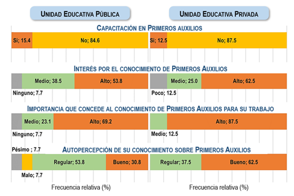
  <p>
    <i><b>Fuente</b>: Caicedo Vega, J. L. & Zumbado Fernández, H. M. (2023).</i>
  </p>
</div>

El **Gráfico 1** evidencia que, si bien existe una alta motivación por aprender primeros auxilios (más del 85% de los docentes en los niveles medio y alto de interés) y se reconoce su importancia para el desempeño profesional (87.5% en instituciones privadas y 69.2% en públicas), existe una clara desconexión con la preparación real. El 86% de los educadores evaluados no había recibido capacitación alguna en primeros auxilios, lo que se refleja en que la mayoría subestima su propia falta de preparación: mientras el 62.5% de los docentes de instituciones privadas percibía su autopreparación como "buena", en la realidad sus resultados de conocimiento fueron predominantemente insuficientes.

Este punto es crítico, ya que demuestra que el problema no es la falta de interés, sino la ausencia de acceso a herramientas de capacitación efectivas y accesibles que cierran la brecha entre la teoría y la práctica. Además, evidencia que existe una oportunidad adicional: personas motivadas que, además de querer aprender, estarán interesadas en adquirir los productos necesarios para put into practice lo que aprendan.

---

## 1.2.2. Lean UX Process

### 1.2.2.1. Lean UX Problem Statements

Nuestra plataforma se encuentra en el dominio de la capacitación en primeros auxilios a través de medios digitales interactivos, complementada con una tienda virtual especializada. Está dirigido principalmente a estudiantes y comunidades vecinales, segmentos que actualmente carecen de formación práctica en emergencias cotidianas como RCP, cortes, quemaduras o atragantamientos, y que además tienen dificultades para acceder a productos de primeros auxilios de calidad.

Hemos identificado como principales problemas la falta de acceso a cursos presenciales, los altos costos de capacitaciones tradicionales, la escasez de tiempo que impide a las personas asistir a entrenamientos formales, y la dificultad para encontrar productos confiables de primeros auxilios en un solo lugar. Aunque existen recursos en línea, la mayoría se limita a videos o charlas teóricas sin brindar experiencias interactivas que simulen escenarios reales, y el acceso a productos de calidad requiere visitar múltiples tiendas o farmacias sin garantía de especialización.

Nuestra visión es ofrecer una aplicación web con simulaciones ramificadas que permitan al usuario practicar decisiones en tiempo real, reduciendo la inseguridad y el desconocimiento ante una emergencia, complementada con una tienda virtual que ofrezca productos seleccionados por especialistas en primeros auxilios. El primer público al que apuntamos son estudiantes universitarios, quienes representan un grupo receptivo a nuevas tecnologías y con alta necesidad de este tipo de aprendizaje.

¿Cómo podemos mejorar la preparación de las personas ante emergencias cotidianas, logrando que actúen de manera rápida, segura y efectiva en los primeros auxilios, y al mismo tiempo tengan acceso a los productos necesarios para hacerlo?

### 1.2.2.2. Lean UX Assumptions.

#### User

- **Estudiantes Universitarios:** Jóvenes con alta afinidad digital, motivados para aprender habilidades prácticas, pero con acceso limitado a capacitación formal y capacidad de pago reducida. Representan también un mercado para botiquines estudiantiles portátiles.
- **Comunidades Vecinales:** Familias, padres y cuidadores en zonas urbanas y semi-urbanas que buscan proteger a sus seres queridos. Interesados en botiquines domésticos completos y productos de seguridad familiar.
- **Instructores y Entidades:** Brigadistas, profesionales de salud, universidades y centros comunitarios que buscan una herramienta escalable para capacitar a sus alumnos o comunidades, además de equipos profesionales de emergencia.

#### User Outcomes

- Para **Estudiantes y Comunidades**:
  - Sentirse preparado para actuar ante una emergencia común (RCP, atragantamiento, quemadura).
  - Aprender de forma rápida y práctica, sin las barreras de costo, tiempo y logística de los cursos presenciales.
  - Recordar los procedimientos clave gracias a la práctica mediante simulaciones interactivas.
  - Adquirir productos de calidad directamente desde la plataforma, con la confianza de que están seleccionados por especialistas.

- Para **Instructores y Entidades**:
  - Llegar a más personas con sus programas de capacitación de manera digital.
  - Utilizar una herramienta pedagógica probada que mejora los resultados de aprendizaje comparada con charlas teóricas.
  - Facilitar el seguimiento del progreso de sus alumnos o comunidad.
  - Ofrecer productos profesionales a sus brigadistas o equipos de emergencia.

#### Features

- Simulaciones ramificadas basadas en escenarios reales y cotidianos (hogar, calle, universidad).
- Diseño responsive para acceso desde cualquier dispositivo (móvil, tablet, computadora), crucial para estudiantes y familias.
- Micro-lecciones y retroalimentación inmediata para adaptarse a tiempos limitados y reforzar el aprendizaje.
- Modo sin conexión o de bajo consumo de datos para comunidades con conectividad limitada.
- Certificados digitales de finalización para motivar a los usuarios y validar el aprendizaje.
- Catálogo de productos de primeros auxilios integrado en la plataforma.
- Recomendaciones contextualizadas de productos al completar cada lección.
- Carrito de compras y proceso de pago integrado.
- Sistema de entrega a domicilio con seguimiento de pedidos.

#### Needings

1. Las personas presentan una deficiencia en la capacidad de respuesta ante emergencias, causada por métodos de enseñanza poco prácticos, manuales extensos y una falta de entrenamiento interactivo que fomente la acción rápida y segura.

2. Los usuarios necesitan superar esa deficiencia aprendiendo a reaccionar de manera segura, confiable y práctica, sin depender de materiales teóricos difíciles de comprender o recordar en situaciones de estrés.

3. Una aplicación interactiva que simule emergencias reales, ofrezca retroalimentación inmediata y permita acceso multiplataforma (móvil, tablet, web) para practicar y reforzar conocimientos de primeros auxilios.

4. Personas con interés en mejorar su preparación ante emergencias (estudiantes, padres, trabajadores, voluntarios), así como instructores y centros de salud que buscan digitalizar su enseñanza y hacerla más accesible.

5. El cliente espera corregir su deficiencia de reacción mediante un aprendizaje práctico, confiable y accesible, que lo prepare de verdad para actuar correctamente en situaciones críticas.

6. Los usuarios también necesitan acceso a productos de calidad para estar verdaderamente preparados: botiquines, vendas, antisépticos, guantes, y equipos especializados que no siempre están disponibles o que son difíciles de encontrar.

7. Redes sociales de alta difusión y aprendizaje visual (Facebook, Instagram, TikTok, YouTube) para captar usuarios interesados en educación rápida, práctica y digital.

8. Plataformas de salud y educación como Cruz Roja Digital, First Aid by British Red Cross, o Udemy, que ofrecen formación teórica, pero con limitada interactividad y sin integración de productos.

9. El mayor riesgo es la deficiencia funcional del producto (errores, fallas de compatibilidad o simulaciones imprecisas), lo cual se abordará con test de usuarios, control de calidad previo al lanzamiento y actualizaciones continuas basadas en retroalimentación real.

10. Asumimos que la falta de entrenamiento práctico puede ser compensada eficazmente mediante simulaciones digitales interactivas, capaces de replicar la toma de decisiones y la presión emocional de una emergencia real, ayudando así a reducir la deficiencia de reacción ante situaciones críticas.

11. Asumimos que la integración de tienda virtual incrementará el valor percibido de la plataforma y generará un flujo de ingresos adicional que hará sostenible el modelo de negocio.

#### Main quests

1. **_¿Quién es el usuario?_**

- Por una parte, las personas que desean aprender primeros auxilios de manera práctica. Por otra parte, instructores y centros de salud que quieren usar la app para ofrecer cursos y comunicarse con estudiantes. Adicionalmente, los mismos usuarios son potenciales compradores de la tienda virtual.

2. **_¿Dónde encaja nuestro producto? ¿En su trabajo o vida?_**

- Encaja en la vida diaria de las personas, ya que las emergencias ocurren en cualquier momento y la app les permitirá estar preparados. También encaja en el trabajo de instructores y profesionales de salud que deseen enseñar de forma digital. La tienda encaja en la necesidad de mantener un botiquín actualizado y completo.

3. **_¿Qué problema tiene nuestro producto?_**

- El riesgo de fallos técnicos en la simulación y la dificultad de posicionar la app en un mercado donde existen aplicaciones conocidas. Además, la gestión de inventario y logística de la tienda virtual representa un desafío operativo. Esto se soluciona con pruebas constantes, actualizaciones, alianzas con proveedores confiables y estrategias de drop shipping initially.

4. **_¿Cómo debe reflejarse nuestro producto?_**

- Como una fuente de conocimiento confiable, práctica y accesible que permita a los usuarios aprender y practicar primeros auxilios de forma segura, complementada por una tienda especializada que ofrezca productos curados por expertos.

5. **_¿Cuál es la intención de nuestra aplicación?_**

- Satisfacer a los usuarios con un método de capacitación innovador que los prepare para responder en emergencias reales y, al mismo tiempo, brindar un espacio a instructores para difundir su conocimiento y una plataforma de compras para adquirir los productos necesarios.

6. **_¿Qué características son importantes?_**

- Compatibilidad con cualquier dispositivo móvil (iOS, Android) y versión web.
- Simulaciones interactivas fáciles de usar.
- Diseño minimalista y claro para no abrumar al usuario.
- Información validada por expertos en primeros auxilios.
- Catálogo de productos con descripciones detalladas y precios competitivos.
- Proceso de compra seguro y entrega confiable.

### 1.2.2.3. Lean UX Hypothesis Statements.

**Creemos** que incorporar simulaciones que reproduzcan emergencias reales evolucionará la enseñanza tradicional de primeros auxilios, pasando de la teoría a la práctica digital guiada.
**Sabremos** que esto es cierto
**Cuando** el 80% de los usuarios logre ejecutar correctamente protocolos básicos (RCP, Heimlich, control de hemorragias) en una prueba posterior al uso de la app.

**Creemos** que un sistema de retroalimentación inmediata, adaptado a las decisiones del usuario, potenciará la autoconfianza y la retención práctica del conocimiento, transformando la app en un entrenador digital personalizado.
**Sabremos** que esto es cierto
**Cuando** los usuarios reporten un incremento del 30% en su autoconfianza y una reducción del 40% en errores repetidos entre sesiones consecutivas.

**Creemos** que ofrecer una plataforma ligera, responsive y de bajo consumo de datos permitirá que comunidades con recursos limitados accedan a capacitación práctica sin barreras tecnológicas, lo cual representa una evolución inclusiva en la educación en salud.
**Sabremos** que esto es cierto
**Cuando** más del 70% de las interacciones provengan de dispositivos móviles y se mantenga una tasa de retención mensual superior al 60% en zonas con conectividad baja.

**Creemos** que integrar un sistema de microlecciones personalizadas y recordatorios automáticos basados en el desempeño del usuario mantendrá el aprendizaje activo a largo plazo, una evolución frente a la capacitación puntual y olvidadiza.
**Sabremos** que esto es cierto
**Cuando** el 50% de los usuarios complete al menos una sesión de refuerzo dentro de los 30 días posteriores a la primera práctica.

**Creemos** que integrar un espacio para instructores afiliados con paneles de seguimiento y analítica de progreso permitirá escalar la formación sin perder personalización.
**Sabremos** que esto es cierto
**Cuando** el 70% de los instructores adopten la plataforma y reporten una reducción del 40% en la gestión de cursos junto con un aumento del 50% en estudiantes capacitados.

**Creemos** que un modelo freemium con acceso gratuito a simulaciones básicas y certificados digitales mediante suscripción hará sostenible la expansión del aprendizaje y democratizará la capacitación práctica.
**Sabremos** que esto es cierto
**Cuando** al menos el 15% de los usuarios gratuitos se conviertan en suscriptores premium en seis meses, motivados por la certificación digital y los escenarios avanzados.

**Creemos** que permitir entrenar sin conexión y sincronizar avances automáticamente expandirá el alcance de la educación en primeros auxilios a zonas rurales o semi-urbanas, fortaleciendo la misión social del proyecto.
**Sabremos** que esto es cierto
**Cuando** el 25% de las sesiones de práctica se realicen en modo offline y los usuarios reporten una satisfacción mayor al 85% con la funcionalidad.

**Creemos** que integrar un sistema de analítica del desempeño que mida el tiempo de reacción, decisiones tomadas y errores más frecuentes permitirá ajustar la dificultad de las simulaciones y ofrecer recomendaciones personalizadas.
**Sabremos** que esto es cierto
**Cuando** los datos muestren que el 70% de los usuarios reduce sus errores en simulaciones consecutivas, y el 60% de ellos mejore sus tiempos de respuesta tras recibir sugerencias automáticas de la plataforma.

**Creemos** que la integración de una tienda virtual con recomendaciones contextualizadas de productos incrementará las tasas de conversión y hará sostenible el modelo de negocio.
**Sabremos** que esto es cierto
**Cuando** al menos el 10% de los usuarios que completen un módulo realicen al menos una compra en la tienda virtual dentro de los 30 días siguientes.

**Creemos** que ofrecer productos seleccionados por especialistas en primeros auxilios generará mayor confianza y lealtad que las compras en farmacias tradicionales.
**Sabremos** que esto es cierto
**Cuando** el 70% de los compradores reporten satisfacción superior al 85% con la calidad de los productos recibidos y el 60% realicen una compra de repetición en seis meses.

### 1.2.2.4. Lean UX Canvas

<div align="center">
  <p>
    <b>Gráfico 2</b>: Lean UX Canvas
  </p>
  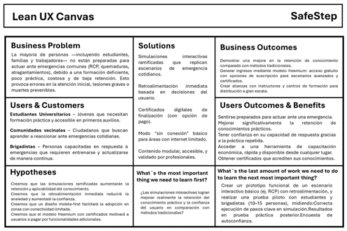
  <p>
    <i><b>Fuente</b>: Elaboración propia</i>
  </p>
</div>

# 1.3. Segmentos objetivo

## 1.3.1. Estudiantes Universitarios

### Características demográficas

- **Edad**: 16–25 años.
- **Nivel educativo**: Estudiantes de universidad.
- **Ubicación**: Zonas urbanas, principalmente donde hay acceso a internet y tecnología digital.
- **Ingreso promedio**: Bajo a medio (capacidad limitada para pagar cursos presenciales costosos).
- **Tecnología**: Alta familiaridad con dispositivos móviles y plataformas digitales.

Este segmento está conformado por jóvenes que cursan estudios universitarios en diversas facultades, principalmente Ciencias, Ingenierías y Letras, en universidades peruanas. Según datos de la Universidad Ricardo Palma, el 43,2% tiene entre 18 y 20 años, mientras que el 56,8% supera los 20 años; el 51,4% son mujeres y el 48,6% hombres. La mayoría (79,1%) reside con sus padres, y el 86,3% recibe financiamiento familiar para sus estudios, aunque solo el 26,7% trabaja. Respecto a experiencias previas, solo el 29,6% ha tomado algún curso de primeros auxilios, aunque un 95,6% muestra interés en capacitarse en esta área. Este perfil evidencia un grupo de estudiantes motivados por adquirir habilidades prácticas, con disponibilidad para cursos complementarios y necesidad de herramientas educativas accesibles y de fácil uso.

### Comportamiento de compra en la tienda virtual

Los estudiantes universitarios constituyen uno de los segmentos con mayor potencial de conversión en la tienda virtual de SafeStep por múltiples razones que se derivan de su situación de vida particular y sus necesidades específicas. En primer lugar, muchos estudiantes universitarios viven fuera de casa por primera vez, ya sea en residencias estudiantiles, pisos compartidos o apartamientos pequeños, lo que significa que deben encargarse de su propia seguridad y la de sus compañeros de vivienda sin la red de apoyo familiar inmediata. Esta transición a la vida independiente genera una necesidad concreta de contar con un botiquín de primeros auxilios básico y funcional para el espacio que habitan.

En segundo lugar, el estilo de vida estudiantil implica actividades de alto riesgo relativo que incrementan la probabilidad de necesitar primeros auxilios: accidentes en fiestas universitaria donde el consumo de alcohol puede llevar a caídas, cortes o vómitos; practicas deportivas en gyms o canchas universitarias donde lesiones musculares o trauma son comunes; largas horas de estudio que pueden causar agotamiento, mareos o convulsiones por posiciones incorrectas; donde accidentes de tránsito o dolores pueden ocurrir con mayor frecuencia.

En tercer lugar, los estudiantes tienen una alta familiaridad con el comercio electrónico y realizan compras frecuentes en plataformas como Mercado Libre, Amazon y tiendas locales en línea. Ya están acostumbrados al proceso de compra digital y confían en este canal para adquirir productos de diversa naturaleza, lo que reduce la barrera de adopción para la tienda de SafeStep.

Los productos más relevantes para este segmento incluyen botiquines portátil compactos diseñados específicamente para contusiones o mochilas, con dimensiones reducidas que caben en cualquier backpack. Estos kits tienen un precio accesible (S/ 50-100) que se ajusta a presupuestos estudiantiles y incluyen lo básico: gasas, vendas, antiséptico, tijeras, guantes y cinta adhesiva médica.

También son relevantes los paquetes de venda elástica y compress para lesiones deportivas, gels冷却antes para traumatismos, y kits de alivio para quemaduras menores que son comunes en residency o lugares donde se cocina de manera básica. Los guantes descartables representan un producto de compras recurrentes dado su uso frecuente en limpiezas y actividades de laboratorio.

La propuesta de valor para estudiantes como compradores se basa en tres pilares: la conveniencia de comprar sin salir del campus o residence hall, la garantía de calidad de productos seleccionados por especialistas en primeros auxilios (no productos genéricos de pharmacy), y la integración con el aprendizaje que les da confianza sobre cuándo y cómo usar cada producto.

---

## 1.3.2. Comunidades vecinales

### Características demográficas

- **Edad**: 25–60 años.
- **Nivel educativo**: Desde educación secundaria hasta universitaria.
- **Ubicación**: Principalmente zonas urbanas y semi-urbanas, donde los servicios médicos no siempre están disponibles de inmediato.
- **Ingreso promedio**: Bajo a medio.
- **Composición familiar**: Padres, madres o cuidadores que buscan proteger a sus hijos y familiares.

Según el Gobierno Regional de La Libertad, el 70% de los peruanos no tiene conocimientos en primeros auxilios para actuar ante víctimas de accidentes de tránsito. La capacitación de la población en primeros auxilios es limitada, y muchas personas desconocen cómo actuar frente a accidentes, desde la correcta inmovilización de heridos hasta la utilización de sistemas de emergencia médica.

Las comunidades vecinales están Conformadas por familias completas que residen en urbanizaciones, residential buildings o barrios donde la vida comunitaria es activa y donde existe interacción frecuente entre vecinos. Este segmento incluye padres de familia de todas las edades, desde jóvenes parejas con niños pequeños hasta adultos mayores que viven con sus hijos adultos. La característica común es el sentido de responsabilidad hacia la familia y el deseo de tener un hogar seguro.

### Comportamiento de compra en la tienda virtual

Las comunidades vecinales representan el segmento con mayor potencial de ingresos para la tienda virtual de SafeStep debido al tamaño promedio de los hogares peruanos ya la diversidad de productos que pueden necesitar. Una familia típico con niños, adultos y posiblemente adultos mayores tiene necesidades de primeros auxilios muy diversas que pueden atenderse desde una sola plataforma.

Para las familias con niños pequeños, los riesgos más comunes incluyen caídas durante el juego, cortaduras con juguetes o objetos cortantes, quemaduras por contacto con superficies calientes o líquidos hirviendo, atragantamientos con piezas pequeñas de juguetes o alimentos, y reacciones alérgicas a picaduras de insectos o Certain alimentos. Cada uno de estos escenarios requiere productos específicos que los padres quieren tener disponibles de manera preventiva.

Para las familias con adultos mayores, los productos necesarios incluyen-botiquines especializados para movilidad reducida, suplementos para personas mayores, equipos de detección temprana de emergencias cardíaca, y MATERIALES para caídas que son comunes en esta edad. La preocupación de los hijos adultos por la seguridad de sus padres se traduce en disposición a invertir en productos de calidad.

La propuesta de valor para familias como compradores es particularmente fuerte porque SafeStep no solo ofrece productos aislados, sino un ecosistema completo: primero aprenden los procedimientos para cada tipo de emergencia, luego reciben recomendaciones específicas de los productos que deben tener, y finalmente pueden adquirirlos sin necesidad de investigar qué producto específico necesitan entre cientos de opciones en una pharmacy.

Los productos más relevantes para este segmento incluyen botiquines domésticos completos de nivel intermedio (100-200 S/) que contienen todo lo necesario para las emergencias más comunes en el hogar: vendas de diferentes tamaños, gasas estériles, solución antiséptica, crema para quemaduras, suero fisiológico, termómetro digital, tensiómetro básico, y guía visual de primeros auxilios.

También son muy relevantes los kits especializados por tipo de emergencia: kit para quemaduras (gel específico, gasas no adherentes, vendas especializadas), kit para fracturas (férulas inflables), vendas de yeso, kit para RCP (máscara de barrera, guantes, toallas desinfectantes), y kit para emergencias alérgicas (antihistamínicos básicos, autoinyector de epinefrina para familias con miembros alérgicos).

Las familias también valoran los productos de prevención: detectores de humo, extintores portátiles, linternas de emergencia, y botiquines para el vehículo. La oportunidad de adquirir todo este ecosistema desde una sola plataforma con la garantía de que los productos están curados por especialistas representa una propuesta de valor diferenciada significativa.

El modelo de compra para este segmento puede ser tanto compras único (botiquín completo) como suscripción (reposición automática de productos que se agotan o caducan). La opción de suscripción genera ingresos recurrentes predecibles y facilita la prevención, algo que muchas familias negligentes por falta de tiempo para revisar sus botiquines regularmente.

---

## 1.3.3. Brigadistas

### Características demográficas

- **Edad**: 22–55 años.
- **Nivel educativo**: Profesionales con educación universitaria o técnica en salud, educación o brigadismo.
- **Ubicación**: Zonas urbanas y semi-urbanas, donde se requiere entrenamiento frecuente en primeros auxilios.
- **Experiencia**: Profesionales con exposición a situaciones de emergencia o formación en prevención de riesgos.
- **Tecnología**: Conocimiento básico de plataformas digitales; buscan métodos prácticos de capacitación continua.

Según la preparación de brigadas de emergencia, los brigadistas deben tener entre 18 y 40 años y haber recibido capacitación teórica y práctica en primeros auxilios y gestión de emergencias.

El Ministerio de Salud del Perú informa que los brigadistas de primera respuesta en salud participan en programas de formación estandarizados a nivel nacional, que incluyen conocimientos teóricos y prácticos sobre gestión de riesgos, atención sanitaria básica, primeros auxilios y transporte asistido de víctimas. Estos programas aseguran que más de 4000 brigadistas estén preparados para actuar de manera adecuada y oportuna ante emergencias y desastres, motivados por valores de solidaridad y compromiso con la comunidad.

Los brigadistas son profesionales o voluntarios que forman parte de equipos de emergencia en empresas, universidades, municipalidades u organizaciones comunitaria. Su rol les requiere estar preparados para responder ante emergencias de mayor complejidad que una emergencia doméstica, lo que implica necesidades de equipamiento profesional.

### Comportamiento de compra en la tienda virtual

Los brigadistas constituyen el segmento con el ticket promedio de compra más alto y el potencial de compra recurrente más significativo. Este segmento ya tiene formación en primeros auxilios y understands la importancia crítica de contar con equipamiento de calidad, lo que los hace particularmente receptivos a productos especializados que van más allá del botiquín básico.

La propuesta de valor para brigadistas se basa en la especialización: mientras que las tiendas generales ofrecen productos de nivel consumidor, SafeStep ofrece productos de nivel semi-profesional seleccionados específicamente para las técnicas que los brigadistas aprenden en la plataforma. Esto incluye dispositivos de RCP profesionales (no las máscaras básicas), kits de inmovilización completos, vendas de grado médico, y equipos de tracción.

Los brigadistas de empresa representan un caso de compra corporativa donde SafeStep puede ofrecer precios competitivos por volumen, órdenes de compra con facturación directa, y programas de capacitación para todos los brigadistas de una organización con descuentos group.

Además de la compra individual, los brigadistas pueden actuar como embajadores en sus organizaciones, generando ventas institucionales significativas. Un solo brigadista que recomienda SafeStep a su empresa puede generar compras de docenas de botiquines profesionales para el workplace.

Los productos más relevantes para este segmento incluyen kits de respuesta rápida profesionales que se carry en la cintura o en mochilas de emergencia, con organización modular que permite acceder rápidamente al producto necesario según el tipo de emergencia. Estos kits tienen precios de S/ 200-500 e incluyen equipos de nivel superior.

También son relevantes los equipos de evaluación inicial (estetoscopios básicos, tensiómetros digitales de grado profesional, pulsiometro), equipos de inmovilización (férulas de aluminio, collars cervicales, camillas de emergencia), y equipos de protección personal (mascarillas N95, protectores oculares, guantes de nivel profesional).

La reposición de productos es frecuente en este segmento debido al alto uso: vendas, gasas y guantes se agotan rápidamente con la práctica, y los productos tienen fecha de vencimiento que requiere renovación periódica. Esto genera un modelo de suscripción natural para brigadistas.

---

## 1.3.4. Resumen del potencial de compra por segmento

| Segmento | Potencial de compra | Productos clave | Frecuencia de compra |
|----------|---------------------|------------------|---------------------|
| Estudiantes | Bajo-medio (S/ 50-200) | Botiquín portátil, vendas, guantes | Mensual-trimestral |
| Comunidades vecinales | Medio-alto (S/ 100-500) | Botiquín doméstico, kits especializados | Trimestral-semestral |
| Brigadistas | Alto (S/ 200-1000+) | Equipos profesionales, kits de respuesta | Mensual (suscripción) |

La integración de la tienda virtual con la plataforma de aprendizaje crea una propuesta de valor única donde cada segmento puede aprender los procedimientos correctos y simultáneamente adquirir los productos necesarios para aplicarlos, generando una experiencia completa de preparación ante emergencias.

<br>
<br>

<div align="center">
    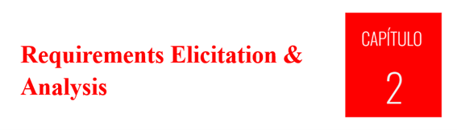
</div>

<br>
<br>

# 2.1. Competidores

1. **Cruz Roja Digital (Cursos Online)**

- Ofrece programas de capacitación virtual con certificación oficial en primeros auxilios. Incluye material en video, manuales PDF y evaluaciones finales. Sin embargo, sus cursos tienen horarios establecidos y suelen ser de pago, lo que limita su disponibilidad masiva.

2. **First Aid by British Red Cross (App)**

- Aplicación móvil en inglés que enseña procedimientos de primeros auxilios mediante texto, imágenes y videos cortos. Está diseñada como guía de bolsillo, pero carece de simulaciones interactivas o retroalimentación dinámica.

3. **Primeros Auxilios – IFRC (App)**

- App oficial de la Federación Internacional de Sociedades de la Cruz Roja y de la Media Luna Roja. Brinda información paso a paso para distintas emergencias y cuenta con recursos multimedia. Sin embargo, el aprendizaje es pasivo y no entrena la toma de decisiones en tiempo real.

4. **Cursos en Plataformas MOOC (Coursera, Udemy, EdX)**

- Brindan formación teórica en primeros auxilios con módulos pregrabados y certificados opcionales. Son útiles como complemento, pero no ofrecen interacción práctica ni simulaciones.

## 2.1.1. Análisis competitivo

<table>
    <tr>
        <td colspan="6" align="center">
            <b>Competitive Analysis Landscape</b>
        </td>
    </tr>
    <tr>
        <td colspan="2" align="center">
            ¿Porqué llevar a cabo este análisis?
        </td>
        <td colspan="4">
        El objetivo de este análisis es identificar las fortalezas, debilidades, oportunidades y amenazas del entorno competitivo en el sector de capacitación en primeros auxilios digital, con el fin de definir la ventaja competitiva de SafeStep frente a las alternativas existentes y orientar las estrategias de diferenciación e innovación.</td>
    </tr>
    <tr>
        <td colspan="2" align="center">
            <b>Competidores</b>
        </td>
        <td align="center">
            <p><b>SafeStep</b></p>
            
        </td>
        <td align="center">
            <p><b>Cruz Roja Digital</b></p>
            
        </td>
        <td align="center">
            <p><b>First Aid</b></p>
            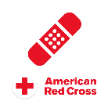
        </td>
        <td align="center">
            <p><b>IFRC</b></p>
            
        </td>
    </tr>
    <tr>
        <td rowspan="2" align="center">
            <b>Perfil</b>
        </td>
        <td align="center">
            <b>Overview</b>
        </td>
        <td align="center">
            <p>
                Plataforma web y móvil que enseña primeros auxilios mediante simulaciones interactivas ramificadas y retroalimentación inmediata, disponible 24/7.
            </p>
        </td>
        <td align="center">
            <p>
                Plataforma de cursos virtuales y presenciales con certificación oficial. Acceso limitado y de pago.
            </p>
        </td>
        <td align="center">
            <p>
                Aplicación móvil en inglés con guías y videos educativos de primeros auxilios.
            </p>
        </td>
        <td align="center">
            <p>
                Aplicación móvil en inglés con guías y videos educativos de primeros auxilios.
            </p>
        </td>
    </tr>
    <tr>
        <td align="center">
            <b>Ventaja competitiva ¿Qué valor ofrece a los clientes?</b>
        </td>
        <td align="center">
            <p>
                Entrenamiento práctico, accesible y gamificado, con enfoque en toma de decisiones en tiempo real y certificación digital.
            </p>
        </td>
        <td align="center">
            <p>
                Certificación oficial reconocida internacionalmente.
            </p>
        </td>
        <td align="center">
            <p>
                Contenido confiable y sencillo, validado por expertos.
            </p>
        </td>
        <td align="center">
            <p>
                Alcance global, gratuito y contenido validado por la Cruz Roja.
            </p>
        </td>
    </tr>
    <tr>
        <td rowspan="2" align="center">
            <b>Perfil de Marketing</b>
        </td>
        <td align="center">
            <b>Mercado objetivo</b>
        </td>
        <td align="center">
            <p>
                Estudiantes, comunidades vecinales y brigadistas que buscan aprender de manera práctica y flexible.
            </p>
        </td>
        <td align="center">
            <p>
                Profesionales y empresas que requieren certificaciones formales.
            </p>
        </td>
        <td align="center">
            <p>
                Público general de habla inglesa.
            </p>
        </td>
        <td align="center">
            <p>
                Público global que busca información básica de emergencia.
            </p>
        </td>
    </tr>
    <tr>
        <td align="center">
            <b>Estrategias de marketing</b>
        </td>
        <td align="center">
            <p>
                Estrategia freemium, gamificación, alianzas con universidades y campañas en redes sociales enfocadas en prevención y educación.
            </p>
        </td>
        <td align="center">
            <p>
                Promoción institucional y convenios con organismos oficiales.
            </p>
        </td>
        <td align="center">
            <p>
                Posicionamiento en tiendas de apps y uso de la reputación de la Cruz Roja.
            </p>
        </td>
        <td align="center">
            <p>
                Difusión a través de la red internacional de la Cruz Roja.
            </p>
        </td>
    </tr>
    <tr>
        <td rowspan="3" align="center">
            <b>Perfil de Producto</b>
        </td>
        <td align="center">
            <b>Productos & Servicios</b>
        </td>
        <td align="center">
            <p>
                Simulaciones interactivas, microlecciones, módulos comunitarios, certificados digitales y estadísticas de desempeño.
            </p>
        </td>
        <td align="center">
            <p>
                Cursos virtuales y presenciales con exámenes y certificaciones.
            </p>
        </td>
        <td align="center">
            <p>
                Guías y videos cortos educativos.
            </p>
        </td>
        <td align="center">
            <p>
                Guías paso a paso, videos y listas de chequeo.
            </p>
        </td>
    </tr>
    <tr>
        <td align="center">
            <b>Precios & costos</b>
        </td>
        <td align="center">
            <p>
                Modelo freemium: acceso básico gratuito y plan premium (S/100 – S/150).
            </p>
        </td>
        <td align="center">
            <p>
                Pago por curso (medio a alto).
            </p>
        </td>
        <td align="center">
            <p>
                Gratuito.
            </p>
        </td>
        <td align="center">
            <p>
                Gratuito.
            </p>
        </td>
    </tr>
    <tr>
        <td align="center">
            <b>Canales y distribución (Web y/o móvil)</b>
        </td>
        <td align="center">
            <p>
                Web responsive y app móvil (Android/iOS).
            </p>
        </td>
        <td align="center">
            <p>
                Web y sesiones presenciales.
            </p>
        </td>
        <td align="center">
            <p>
                App móvil (Android/iOS).
            </p>
        </td>
        <td align="center">
            <p>
                App móvil (Android/iOS).
            </p>
        </td>
    </tr>
    <tr>
        <td rowspan="4" align="center">
            <b>Análisis SWOT</b>
        </td>
        <td align="center">
            <b>Fortalezas</b>
        </td>
        <td align="center">
            <p>
                Simulaciones interactivas y ramificadas; gamificación; feedback inmediato; accesibilidad multiplataforma; modelo freemium.
            </p>
        </td>
        <td align="center">
            <p>
                Certificación oficial; respaldo institucional; contenido validado.
            </p>
        </td>
        <td align="center">
            <p>
                Interfaz simple; alta confiabilidad; posicionamiento sólido.
            </p>
        </td>
        <td align="center">
            <p>
                Acceso gratuito; respaldo global; contenidos validados.
            </p>
        </td>
    </tr>
    <tr>
        <td align="center">
            <b>Debilidades</b>
        </td>
        <td align="center">
            <p>
                Falta de certificación oficial internacional; dependencia de conexión a internet; necesidad de actualización constante.
            </p>
        </td>
        <td align="center">
            <p>
                Alto costo de cursos; poca flexibilidad digital.
            </p>
        </td>
        <td align="center">
            <p>
                En inglés; aprendizaje pasivo sin práctica.
            </p>
        </td>
        <td align="center">
            <p>
                Sin interactividad ni evaluación; enfoque informativo.
            </p>
        </td>
    </tr>
    <tr>
        <td align="center">
            <b>Oportunidades</b>
        </td>
        <td align="center">
            <p>
                Creciente interés en e-learning y capacitación preventiva; alianzas con ONGs y universidades; expansión en Latinoamérica.
            </p>
        </td>
        <td align="center">
            <p>
                Integrar simuladores y experiencias interactivas.
            </p>
        </td>
        <td align="center">
            <p>
                Ampliar idiomas y contenido práctico.
            </p>
        </td>
        <td align="center">
            <p>
                Asociarse con startups tecnológicas para modernizar su experiencia.
            </p>
        </td>
    </tr>
    <tr>
        <td align="center">
            <b>Amenazas</b>
        </td>
        <td align="center">
            <p>
                Competidores con mayor financiamiento; desconfianza inicial hacia métodos digitales; saturación de apps educativas.
            </p>
        </td>
        <td align="center">
            <p>
                Aparición de plataformas más ágiles como SafeStep.
            </p>
        </td>
        <td align="center">
            <p>
                Pérdida de relevancia frente a apps gamificadas.
            </p>
        </td>
        <td align="center">
            <p>
                Pérdida de interés por falta de innovación.
            </p>
        </td>
    </tr>
</table>

## 2.1.2. Estrategias y tácticas frente a competidores

<table>
    <tr>
        <td align="center">
        <b>Estrategia / Táctica</b>
        </td>
        <td align="center">
        <b>Descripción</b>
        </td>
    </tr>
    <tr>
        <td align="center">
        <b>Innovación en UX</b>
        </td>
        <td>
        <p>Crear simulaciones ramificadas con decisiones en tiempo real y visuales, ofreciendo una experiencia de usuario única.</p>
        </td>
    </tr>
    <tr>
        <td align="center">
        <b>Modelo freemium</b>
        </td>
        <td>
        <p>Ofrecer escenarios básicos gratis para atraer usuarios y planes premium con certificaciones y reportes para monetización.</p>
        </td>
    </tr>
    <tr>
        <td align="center">
        <b>Gamificación</b>
        </td>
        <td>
        <p>Integrar puntos, logros y niveles que motiven la práctica constante y el aprendizaje progresivo.</p>
        </td>
    </tr>
    <tr>
        <td align="center">
        <b>Alianzas estratégicas</b>
        </td>
        <td>
        <p>Colaborar con universidades, colegios, empresas y ONGs para integrar SafeStep en programas de capacitación y RSE.</p>
        </td>
    </tr>
    <tr>
        <td align="center">
        <b>Marketing segmentado</b>
        </td>
        <td>
        <p>Diseñar campañas digitales para redes sociales, enfocadas en familias, jóvenes y empresas, destacando el impacto social y el bajo costo.</p>
        </td>
    </tr>
    <tr>
        <td align="center">
        <b>Actualización continua</b>
        </td>
        <td>
        <p>Mantener la plataforma actualizada con nuevos escenarios y contenido validado por profesionales de salud.</p>
        </td>
    </tr>
</table>

# 2.2. Entrevistas

## 2.2.1. Diseño de entrevistas

### Guía de preguntas para Estudiantes.

1. ¿Cuál es tu nombre y cuántos años tienes?
2. ¿Dónde vives y a qué te dedicas?
3. ¿Has recibido alguna capacitación en primeros auxilios dentro de tu Universidad? ¿Cómo fue esa experiencia?
4. ¿Qué tan preparado te sientes actualmente para actuar en una emergencia dentro o fuera del campus?
5. ¿Qué tan importante consideras que es que un estudiante tenga conocimientos de primeros auxilios?
6. ¿Qué tipo de emergencias te preocupan más dentro de tu entorno estudiantil (ej. desmayos, accidentes en laboratorios, deportes)?
7. ¿Qué dispositivos usas más para estudiar (celular, laptop, tablet)?
8. ¿Qué aplicaciones o plataformas usas para capacitarte o estudiar en línea?
9. ¿Qué elemento te generaría más confianza para usar esta aplicación: certificación, facilidad de uso, o calidad de la simulación?
10. ¿Prefieres aprender de manera individual, en grupo o mediante simulaciones interactivas? ¿Por qué?
11. ¿Cómo imaginas que una app o web de simulaciones podría ayudarte a aprender mejor primeros auxilios?
12. Si tuvieras esta app, ¿la recomendarías a tus compañeros? ¿Qué parte crees que les llamaría más la atención?
13. ¿Cuánto estarías dispuesto a pagar por un curso virtual con simulaciones interactivas (rango en soles)?

### Guía de preguntas para comunidades vecinales.

1. ¿Cuál es tu edad, nombre y cuántos años tienes?
2. ¿Dónde vives y a qué te dedicas?
3. ¿Has recibido alguna vez una capacitación en primeros auxilios por parte de tu comunidad, municipalidad o Defensa Civil?
4. ¿Qué tan preparado crees que está tu vecindario frente a una emergencia como incendios, sismos o accidentes domésticos?
5. ¿Qué tipo de emergencias son más frecuentes en tu comunidad?
6. ¿Tienes algún rol en la organización vecinal (ej. dirigente, voluntario, participante en actividades de seguridad)?
7. ¿Usas con frecuencia un smartphone o computadora? ¿Qué tipo de aplicaciones sueles usar más?
8. ¿Qué limitaciones o barreras crees que tendrías para capacitarte en primeros auxilios (tiempo, costo, falta de información, tecnología)?
9. ¿Te interesa más aprender individualmente o en talleres grupales con tus vecinos? ¿Por qué?
10. ¿Crees que tu comunidad estaría dispuesta a pagar una suscripción o licencia para tener acceso a este tipo de capacitaciones?
11. ¿Qué tan cómodo te sentirías usando una aplicación de simulaciones de primeros auxilios en tu celular?
12. ¿Qué esperas de una capacitación digital en primeros auxilios para tu comunidad?
13. ¿Qué te motivaría más a recomendar esta aplicación a otros vecinos?
14. ¿Cómo crees que esta aplicación podría fortalecer la unión y preparación de tu comunidad frente a emergencias?

### Guía de preguntas para brigadistas.

1. ¿Podría indicarme su nombre completo, edad y lugar de procedencia?
2. ¿Cuál es su ocupación actual y en qué tipo de institución se desempeña como brigadista?
3. ¿Qué nivel de formación en primeros auxilios posee hasta el momento?
4. ¿Con qué frecuencia recibe capacitaciones o actualizaciones en primeros auxilios?
5. Según su experiencia, ¿qué tan efectivas han sido las capacitaciones presenciales que ha recibido?
6. ¿Qué tipo de emergencias atiende con mayor frecuencia en su institución?
7. ¿Suele utilizar aplicaciones móviles o plataformas web para reforzar sus conocimientos en primeros auxilios?
8. ¿Qué tan útil considera que sería una aplicación con simulaciones para mejorar sus habilidades como brigadista?
9. Desde su experiencia, ¿qué limitaciones identifica en las capacitaciones actuales (por ejemplo, costos, tiempo, logística, escasa práctica realista)?
10. ¿Qué funcionalidades le gustaría que incluya una aplicación digital de primeros auxilios (por ejemplo, escenarios realistas, certificaciones, evaluaciones, ranking)?
11. ¿Prefiere realizar simulaciones prácticas en grupo o de manera individual? ¿Por qué?
12. ¿Qué importancia tendría para usted que la aplicación ofrezca certificaciones válidas reconocidas por su institución?
13. ¿Estaría dispuesto a pagar personalmente o recomendar a su institución que invierta en una licencia para este servicio?
14. ¿Qué rango de precios consideraría razonable para este tipo de capacitación digital?
15. ¿Qué institución o respaldo considera fundamental para confiar en una aplicación de primeros auxilios (por ejemplo, Ministerio de Salud, Cruz Roja, Defensa Civil)?

## 2.2.2. Registro de entrevistas

A continuación, se muestra la transcripción, evidencia y resumen de cada entrevista realizada a estudiantes universitarios.

<table align="center">
    <tr>
        <td colspan="2" align="center">
            <b>Entrevista N° 1</b>
        </td>
    </tr>
    <tr>
        <td width="30%" align="center">
            
        </td>
        <td width="70%">
            <b>Entrevistado</b>: Nataly Aguilar Ortiz <br/>
            <b>Entrevistador</b>: Jorge Brayan Ayala Fernandez <br/>
            <b>Duración</b>:  00:04:15 <br/>
            <b>Género</b>: Femenino <br/>
            <b>Edad</b>: 23 años <br/>
            <b>Segmento</b>: Estudiante <br/>
            <b>Lugar de Residencia</b>: Callao <br/>
        </td>
    </tr>
    <tr>
        <td colspan="2" align="center">
            Link de la entrevista: <a href="https://youtu.be/DEq_rtuM_Ng" target="_blank" rel="noopener noreferrer">https://youtu.be/DEq_rtuM_Ng</a>
        </td>
    </tr>
    <tr>
        <td colspan="2" align="center">
            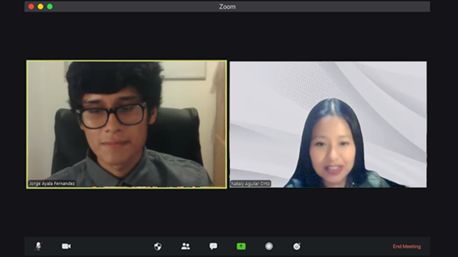
        </td>
    </tr>
    <tr>
        <td colspan="2" align="center">
            <b>Transcripción:</b>
        </td>
    </tr>
    <tr>
        <td colspan="2">
            <b>¿Cuál es tu nombre y cuántos años tienes?</b> <br/>
            Mi nombre es Nataly Aguilar y tengo 23 años<br/>
            <br/>
            <b>¿Dónde vives  y a qué te dedicas?</b> <br/>
            Vivo en el Callao y soy estudiante de Psicología.<br/>
            <br/>
            <b>¿Has recibido alguna capacitación en primeros auxilios dentro de tu Universidad? ¿Cómo fue esa experiencia?</b> <br/>
            Si he recibido una capacitación, fue muy enriquecedora porque enseñaron primeros auxilios, y cómo actuar ante una emergencia en nuestra casa o institución educativa.<br/>
            <br/>
            <b>¿Qué tan preparado te sientes actualmente para actuar en una emergencia dentro o fuera del campus?</b> <br/>
            En realidad creo que nunca estamos 100% preparados, por eso debemos estar constantemente capacitándolos o averiguando algunas cosas para poder estar a la vanguardia.<br/>
            <br/>
            <b>¿Qué tan importante consideras que es que un estudiante tenga conocimientos de primeros auxilios?</b> <br/>
            Yo creo que es muy importante, no solo para los estudiantes, sino también para todas las personas en general, debemos saber primeros auxilios ya que es esencial.<br/>
            <br/>
            <b>¿Qué tipo de emergencias te preocupan más dentro de tu entorno estudiantil (ej. desmayos, accidentes en laboratorios, deportes)?</b> <br/>
            Yo creo que los accidentes que ocurren en los laboratorios, nosotros como estudiantes debemos saber cómo actuar ante una emergencia y poder brindar los primeros auxilios a nuestros compañeros o maestros.<br/>
            <br/>
            <b>¿Qué dispositivos usas más para estudiar (celular, laptop, tablet)?</b> <br/>
            Uso una laptop.<br/>
            <br/>
            <b>¿Qué aplicaciones o plataformas usas para capacitarte o estudiar en línea?</b> <br/>
            Uso zoom, meet y teams.<br/>
            <br/>
            <b>¿Qué elemento te generaría más confianza para usar esta aplicación: certificación, facilidad de uso, o calidad de la simulación?</b> <br/>
            Yo creo que tenga certificación y que sea de fácil uso.<br/>
            <br/>
            <b>¿Prefieres aprender de manera individual, en grupo o mediante simulaciones interactivas? ¿Por qué?</b> <br/>
            Yo prefiero aprender de manera grupal ya que así podemos compartir algunas experiencias, ya que algunos compañeros pueden saber más del tema y podemos intercambiar opiniones.<br/>
            <br/>
            <b>¿Cómo imaginas que una app o web de simulaciones podría ayudarte a aprender mejor primeros auxilios?</b> <br/>
            Que sea de fácil uso e interactiva para que podamos participar.<br/>
            <br/>
            <b>Si tuvieras esta app, ¿la recomendarías a tus compañeros? ¿Qué parte crees que les llamaría más la atención?</b> <br/>
            Claro que sí la recomendaría, yo creo que llamaría más la atención que sea de fácil uso para que cualquier persona pueda utilizar y puedan dar sus opiniones, compartir experiencias y  opiniones.<br/>
            <br/>
            <b>¿Cuánto estarías dispuesto a pagar por un curso virtual con simulaciones interactivas (rango en soles)?</b> <br/>
            Yo creo que sí es un curso que es bueno, puedo pagar entre 100 y 150 soles.<br/>
        </td>
    </tr>
</table>

<table align="center">
    <tr>
        <td colspan="2" align="center">
            <b>Entrevista N° 2</b>
        </td>
    </tr>
    <tr>
        <td width="30%" align="center">
            
        </td>
        <td width="70%">
            <b>Entrevistado</b>: Maria Elena Gamboa Azabache <br/>
            <b>Entrevistador</b>: Jorge Brayan Ayala Fernandez <br/>
            <b>Duración</b>:  00:04:00 <br/>
            <b>Género</b>: Femenino <br/>
            <b>Edad</b>: 21 años <br/>
            <b>Segmento</b>: Estudiante <br/>
            <b>Lugar de Residencia</b>: Comas <br/>
        </td>
    </tr>
    <tr>
        <td colspan="2" align="center">
            Link de la entrevista: <a href="https://www.youtube.com/watch?v=5td3gHjUBVw" target="_blank" rel="noopener noreferrer">https://www.youtube.com/watch?v=5td3gHjUBVw</a>
        </td>
    </tr>
    <tr>
        <td colspan="2" align="center">
            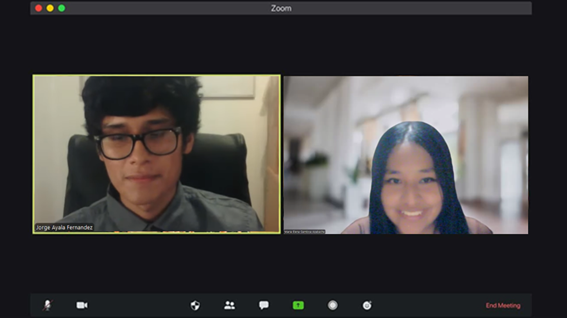
        </td>
    </tr>
    <tr>
        <td colspan="2" align="center">
            <b>Transcripción:</b>
        </td>
    </tr>
    <tr>
        <td colspan="2">
            <b>¿Cuál es tu nombre y cuántos años tienes?</b> <br/>
            Mi nombre es Mari Elena y tengo 21 años<br/>
            <br/>
            <b>¿Dónde vives  y a qué te dedicas?</b> <br/>
            Vivo en Comas y soy estudiante de la universidad<br/>
            <br/>
            <b>¿Has recibido alguna capacitación en primeros auxilios dentro de tu Universidad? ¿Cómo fue esa experiencia?</b> <br/>
            No he recibido capacitación en la universidad, solo algo básico antes, pero muy breve.<br/>
            <br/>
            <b>¿Qué tan preparado te sientes actualmente para actuar en una emergencia dentro o fuera del campus?</b> <br/>
            Me siento algo preparada pero me faltaría un poco de práctica y seguridad.<br/>
            <br/>
            <b>¿Qué tan importante consideras que es que un estudiante tenga conocimientos de primeros auxilios?</b> <br/>
            Sería muy importante porque cualquiera podría enfrentar una emergencia y poder ayudar a sus compañeros dependiendo de qué caso sea.<br/>
            <br/>
            <b>¿Qué tipo de emergencias te preocupan más dentro de tu entorno estudiantil (ej. desmayos, accidentes en laboratorios, deportes)?</b> <br/>
            Creo que serían todos, en especial los accidentes en laboratorios, porque en los trabajos grupales que hacen hay aparatos que son a prueba y pueden lastimar a algunos estudiantes.<br/>
            <br/>
            <b>¿Qué dispositivos usas más para estudiar (celular, laptop, tablet)?</b> <br/>
            Uso mi laptop y mi celular.<br/>
            <br/>
            <b>¿Qué aplicaciones o plataformas usas para capacitarte o estudiar en línea?</b> <br/>
            Entro mediante el aula virtual, también uso el Classroom y el Meet.<br/>
            <br/>
            <b>¿Qué elemento te generaría más confianza para usar esta aplicación: certificación, facilidad de uso, o calidad de la simulación?</b> <br/>
            Creo que sería la calidad de la simulación, porque me hace sentir que practico en una situación real y la certificación porque respalda lo aprendido.<br/>
            <br/>
            <b>¿Prefieres aprender de manera individual, en grupo o mediante simulaciones interactivas? ¿Por qué?</b> <br/>
            Sería con simulaciones, porque se aprende practicando mediante los tutoriales, videos.<br/>
            <br/>
            <b>¿Cómo imaginas que una app o web de simulaciones podría ayudarte a aprender mejor primeros auxilios?</b> <br/>
            Mostrándome casos prácticos y vídeos cortos, de acuerdo a eso ya podría llover y aprender.<br/>
            <br/>
            <b>Si tuvieras esta app, ¿la recomendarías a tus compañeros? ¿Qué parte crees que les llamaría más la atención?</b> <br/>
            Sí la recomendaría, creo que le llamaría más la atención acerca de las simulaciones.<br/>
            <br/>
            <b>¿Cuánto estarías dispuesto a pagar por un curso virtual con simulaciones interactivas (rango en soles)?</b> <br/>
            Primero  comprobaría en una prueba gratuita cómo es el desarrollo de esa app, de acuerdo a eso, le pondría un costo.<br/>
        </td>
    </tr>
</table>

<table align="center">
    <tr>
        <td colspan="2" align="center">
            <b>Entrevista N° 3</b>
        </td>
    </tr>
    <tr>
        <td width="30%" align="center">
            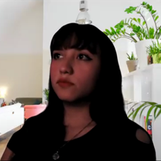
        </td>
        <td width="70%">
            <b>Entrevistado</b>: Luciana Celeste, Sanchez Silva <br/>
            <b>Entrevistador</b>: Josep Eliu, Melgarejo Quiroz <br/>
            <b>Duración</b>:  00:06:03 <br/>
            <b>Género</b>: Femenino <br/>
            <b>Edad</b>: 20 años <br/>
            <b>Segmento</b>: Estudiante <br/>
            <b>Lugar de Residencia</b>: San Miguel <br/>
        </td>
    </tr>
    <tr>
        <td colspan="2" align="center">
            Link de la entrevista: <a href="https://youtu.be/N1L3TChMK6w" target="_blank" rel="noopener noreferrer">https://youtu.be/N1L3TChMK6w</a>
        </td>
    </tr>
    <tr>
        <td colspan="2" align="center">
            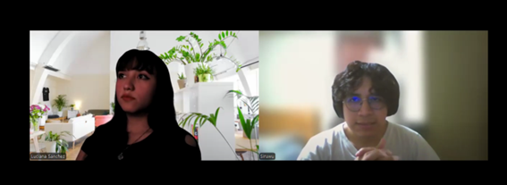
        </td>
    </tr>
    <tr>
        <td colspan="2" align="center">
            <b>Transcripción:</b>
        </td>
    </tr>
    <tr>
        <td colspan="2">
            <b>¿Cuál es tu nombre y cuántos años tienes?</b> <br/>
            Mi nombre es Luciana Sanchez y tengo 20 años.<br/>
            <br/>
            <b>¿Dónde vives  y a qué te dedicas?</b> <br/>
            Vivo en San Miguel y soy estudiante de ingeniería de software.<br/>
            <br/>
            <b>¿Has recibido alguna capacitación en primeros auxilios dentro de tu Universidad? ¿Cómo fue esa experiencia?</b> <br/>
            No recibí ninguna capacitación, pero si se de la existencia de ello.<br/>
            <br/>
            <b>¿Qué tan preparado te sientes actualmente para actuar en una emergencia dentro o fuera del campus?</b> <br/>
            Me siento poco preparada debido a que no tiene mucho conocimiento en el tema.<br/>
            <br/>
            <b>¿Qué tan importante consideras que es que un estudiante tenga conocimientos de primeros auxilios?</b> <br/>
            Lo considero muy importante.<br/>
            <br/>
            <b>¿Qué tipo de emergencias te preocupan más dentro de tu entorno estudiantil (ej. desmayos, accidentes en laboratorios, deportes)?</b> <br/>
            Me preocupan mas cuando ocurre un atoramiento mientra una persona come.<br/>
            <br/>
            <b>¿Qué dispositivos usas más para estudiar (celular, laptop, tablet)?</b> <br/>
            Uso más mi laptop y tablet.<br/>
            <br/>
            <b>¿Qué aplicaciones o plataformas usas para capacitarte o estudiar en línea?</b> <br/>
            Uso en general el coursera y blackboard.<br/>
            <br/>
            <b>¿Qué elemento te generaría más confianza para usar esta aplicación: certificación, facilidad de uso, o calidad de la simulación?</b> <br/>
            Lo que me genera más confianza sería la calidad de la simulación y la certificación.<br/>
            <br/>
            <b>¿Prefieres aprender de manera individual, en grupo o mediante simulaciones interactivas? ¿Por qué?</b> <br/>
            Todas me parecen bien, porque en todas se fomenta los primeros auxilios y me siento cómoda en todos los casos.<br/>
            <br/>
            <b>¿Cómo imaginas que una app o web de simulaciones podría ayudarte a aprender mejor primeros auxilios?</b> <br/>
            Si, ayudaría mucho, ya que lo podría usar en todos lados, como cuando voy a la universidad o cuando no tengo nada que haces.<br/>
            <br/>
            <b>Si tuvieras esta app, ¿la recomendarías a tus compañeros? ¿Qué parte crees que les llamaría más la atención?</b> <br/>
            Si, claro que lo recomendaría, y lo que más destacaría sería las simulaciones interactivas.<br/>
            <br/>
            <b>¿Cuánto estarías dispuesto a pagar por un curso virtual con simulaciones interactivas (rango en soles)?</b> <br/>
            No estaría dispuesta a pagar más de 18 soles.<br/>
        </td>
    </tr>
</table>

<table align="center">
    <tr>
        <td colspan="2" align="center">
            <b>Entrevista N° 4</b>
        </td>
    </tr>
    <tr>
        <td width="30%" align="center">
            
        </td>
        <td width="70%">
            <b>Entrevistado</b>: Alessandro Daniel, Bravo Castillo <br/>
            <b>Entrevistador</b>: Rodrigo Jesus, Miraval Pomalaya <br/>
            <b>Duración</b>:  00:04:20 <br/>
            <b>Género</b>: Masculino <br/>
            <b>Edad</b>: 20 años <br/>
            <b>Segmento</b>: Estudiante <br/>
            <b>Lugar de Residencia</b>: San martin de Porres <br/>
        </td>
    </tr>
    <tr>
        <td colspan="2" align="center">
            Link de la entrevista: <a href="https://youtu.be/qjcDbt8-Obk" target="_blank" rel="noopener noreferrer">https://youtu.be/N1L3TChMK6w</a>
        </td>
    </tr>
    <tr>
        <td colspan="2" align="center">
            
        </td>
    </tr>
    <tr>
        <td colspan="2" align="center">
            <b>Transcripción:</b>
        </td>
    </tr>
    <tr>
        <td colspan="2">
            <b>¿Cuál es tu nombre y cuántos años tienes?</b> <br/>
            Mi nombre es Alessandro Daniel Bravo Castillo y tengo 20 años.<br/>
            <br/>
            <b>¿Dónde vives  y a qué te dedicas?</b> <br/>
            Vivo en San martin de Porres y actualmente soy estudiante de Ciencias de la computacion en la UPC.<br/>
            <br/>
            <b>¿Has recibido alguna capacitación en primeros auxilios dentro de tu Universidad? ¿Cómo fue esa experiencia?</b> <br/>
            Hasta ahora no he recibido una capacitación formal dentro de la universidad, aunque sí he tenido algunas charlas informativas. Me parecieron útiles, pero siento que fueron muy generales y que me gustaría tener algo más práctico y realista.<br/>
            <br/>
            <b>¿Qué tan preparado te sientes actualmente para actuar en una emergencia dentro o fuera del campus?</b> <br/>
            Me siento medianamente preparado. Conozco lo básico, pero creo que en una situación real podría ponerme nervioso y no saber exactamente qué hacer.<br/>
            <br/>
            <b>¿Qué tan importante consideras que es que un estudiante tenga conocimientos de primeros auxilios?</b> <br/>
            Lo considero muy importante. Nunca sabemos cuándo puede ocurrir un accidente o una emergencia, y tener esos conocimientos puede marcar la diferencia entre ayudar realmente o no saber cómo reaccionar.<br/>
            <br/>
            <b>¿Qué tipo de emergencias te preocupan más dentro de tu entorno estudiantil (ej. desmayos, accidentes en laboratorios, deportes)?</b> <br/>
            Me preocupan más los desmayos o mareos, porque suelen pasar de manera inesperada en clases o en el transporte. También los accidentes en talleres o laboratorios, ya que en Diseño Industrial usamos materiales y herramientas que podrían ser riesgosas.<br/>
            <br/>
            <b>¿Qué dispositivos usas más para estudiar (celular, laptop, tablet)?</b> <br/>
            Principalmente uso mi laptop para trabajos y presentaciones, pero también el celular porque es más práctico para revisar información rápida o ver videos.<br/>
            <br/>
            <b>¿Qué aplicaciones o plataformas usas para capacitarte o estudiar en línea?</b> <br/>
            Uso Google Classroom, Canva, YouTube para tutoriales y en algunos cursos Moodle. Para temas específicos me gusta buscar cursos en Coursera o Udemy.<br/>
            <br/>
            <b>¿Qué elemento te generaría más confianza para usar esta aplicación: certificación, facilidad de uso, o calidad de la simulación?</b> <br/>
            Creo que la calidad de la simulación sería lo más importante, porque me daría la sensación de estar realmente practicando. Aunque si además hay certificación, sería un plus enorme.<br/>
            <br/>
            <b>¿Prefieres aprender de manera individual, en grupo o mediante simulaciones interactivas? ¿Por qué?</b> <br/>
            Me gustan más las simulaciones interactivas, porque me ayudan a ponerme en el papel y a practicar como si fuera real. Aprender en grupo también me gusta, pero siento que en emergencias la práctica individual es clave.<br/>
            <br/>
            <b>¿Cómo imaginas que una app o web de simulaciones podría ayudarte a aprender mejor primeros auxilios?</b> <br/>
            Me la imagino como una forma de entrenar en diferentes escenarios sin necesidad de un instructor presente. Sería como un espacio seguro para equivocarme y aprender qué hacer en distintas situaciones.<br/>
            <br/>
            <b>Si tuvieras esta app, ¿la recomendarías a tus compañeros? ¿Qué parte crees que les llamaría más la atención?</b> <br/>
            Sí, definitivamente. Creo que lo que más les llamaría la atención sería poder practicar casos reales desde su celular o laptop, y ver qué tan preparados están para responder.<br/>
            <br/>
            <b>¿Cuánto estarías dispuesto a pagar por un curso virtual con simulaciones interactivas (rango en soles)?</b> <br/>
            Creo que entre 40 a 80 soles sería un rango justo, siempre que el curso sea completo, interactivo y ofrezca algún tipo de certificado.<br/>
        </td>
    </tr>
</table>

<table align="center">
    <tr>
        <td colspan="2" align="center">
            <b>Entrevista N° 5</b>
        </td>
    </tr>
    <tr>
        <td width="30%" align="center">
            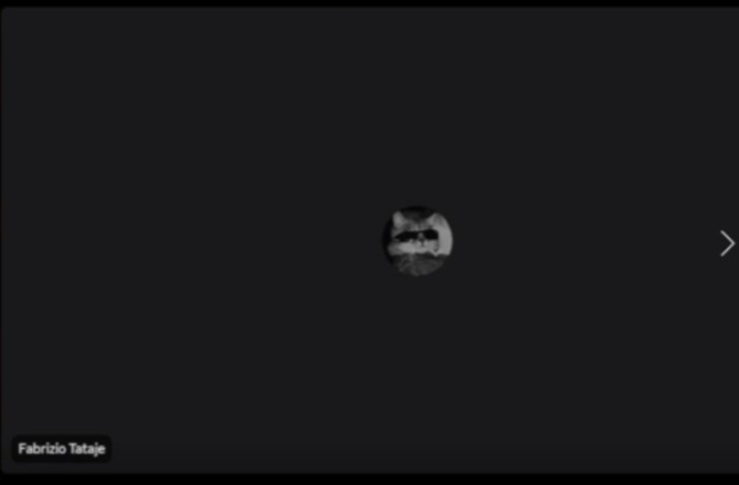
        </td>
        <td width="70%">
            <b>Entrevistado</b>: Fabrizio Ernesto Tataje <br/>
            <b>Entrevistador</b>: Rodrigo Jesus, Miraval Pomalaya <br/>
            <b>Duración</b>:  00:03:28 <br/>
            <b>Género</b>: Masculino <br/>
            <b>Edad</b>: 27 años <br/>
            <b>Segmento</b>: Comunidad vecinal <br/>
            <b>Lugar de Residencia</b>: San Miguel <br/>
        </td>
    </tr>
    <tr>
        <td colspan="2" align="center">
            Link de la entrevista: <a href="https://youtu.be/r7HQDIlXcsA" target="_blank" rel="noopener noreferrer">https://youtu.be/r7HQDIlXcsA</a>
        </td>
    </tr>
    <tr>
        <td colspan="2" align="center">
            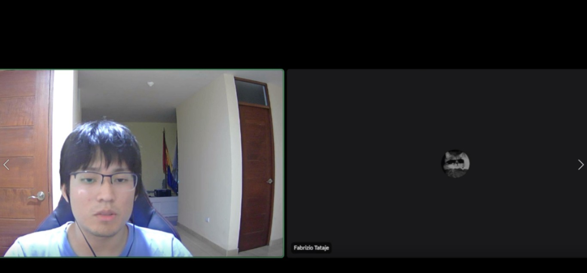
        </td>
    </tr>
    <tr>
        <td colspan="2" align="center">
            <b>Transcripción:</b>
        </td>
    </tr>
    <tr>
        <td colspan="2">
            <b>¿Cuál es tu nombre y cuántos años tienes?</b> <br/>
            Mi nombre es Fabrizio Tataje y tengo 27 años..<br/>
            <br/>
            <b>¿Dónde vives  y a qué te dedicas?</b> <br/>
            Vivo en calle Yungas y soy programador independiente y trabajo desde casa.<br/>
            <br/>
            <b>¿Has recibido alguna vez una capacitación en primeros auxilios por parte de tu comunidad, municipalidad o Defensa Civil?</b> <br/>
            De parte de la municipalidad sí.<br/>
            <br/>
            <b>¿Qué tan preparado crees que está tu vecindario frente a una emergencia  como incendios, sismos o accidentes domésticos?</b> <br/>
            No estamos preparados definitivamente como debe ser. Diría que “estamos” preparados un 30-40%.<br/>
            <br/>
            <b>¿Qué tipo de emergencias son más frecuentes en tu comunidad?</b> <br/>
            Por el momento no hay emergencias tan riesgosas.<br/>
            <br/>
            <b>¿Tienes algún rol en la organización vecinal (ej. dirigente, voluntario, participante en actividades de seguridad)?</b> <br/>
            No, por el momento no.<br/>
            <br/>
            <b>¿Usas con frecuencia un smartphone o computadora? ¿Qué tipo de aplicaciones sueles usar más?</b> <br/>
            Sí, uso mi iphone y la aplicación que mas uso es instagram.<br/>
            <br/>
            <b>¿Qué limitaciones o barreras crees que tendrías para capacitarte en primeros auxilios (tiempo, costo, falta de información, tecnología)?</b> <br/>
            El tiempo y la falta de información.<br/>
            <br/>
            <b>¿Te interesa más aprender individualmente o en talleres grupales con tus vecinos? ¿Por qué?</b> <br/>
            Me interesa más en talleres con mis vecinos porque creo yo que en grupal sería mejor el aprendizaje.<br/>
            <br/>
            <b>¿Crees que tu comunidad estaría dispuesta a pagar una suscripción o licencia para tener acceso a este tipo de capacitaciones?</b> <br/>
            Sí, sí me parece correcto que tendríamos que pagar un porcentaje para que mejor sea el aprendizaje para cada uno de nosotros.<br/>
            <br/>
            <b>¿Qué tan cómodo te sentirías usando una aplicación de simulaciones de primeros auxilios en tu celular?</b> <br/>
            Sí, me parece muy efectivo, muy conveniente para cada uno de nosotros, para poder actuar en casos de emergencia y creo yo que con unión de todos los vecinos, de toda mi comunidad, es mejor.<br/>
            <br/>
            <b>¿Qué esperas de una capacitación digital en primeros auxilios para tu comunidad?</b> <br/>
            Creo que sería de mejor aprendizaje, para mí y para todos, sería más conveniente, para poder apoyarnos entre toda mi comunidad en casos, de que suceda emergencias, que sea necesario, y conveniente para la protección de cada uno de nosotros o de nuestros hijos.<br/>
            <br/>
            <b>¿Qué te motivaría más a recomendar esta aplicación a otros vecinos?</b> <br/>
            Porque como lo vuelvo a repetir me motivaría porque es conveniente de que deberíamos saber, cada uno de nosotros y estar preparados en casos de emergencia. No solamente incendios, también terremotos o temblores fuertísimos de que a veces hay personas que se caen y necesitamos ahí los primeros auxilios.<br/>
            <br/>
            <b>¿Cómo crees que esta aplicación podría fortalecer la unión y preparación de tu comunidad frente a emergencias?</b> <br/>
            Nos podría fortalecer porque, como la misma  pregunta lo dice, la unión hace la fuerza y el estar preparados en comunidad, estar preparados entre todos nosotros, teniendo el aprendizaje virtualmente, como en la anterior pregunta me hiciste, ya tendríamos la capacitación de cada uno de nosotros poder defendernos en esos casos, de poder apoyarnos.<br/>
        </td>
    </tr>
</table>

<table align="center">
    <tr>
        <td colspan="2" align="center">
            <b>Entrevista N° 6</b>
        </td>
    </tr>
    <tr>
        <td width="30%" align="center">
            
        </td>
        <td width="70%">
            <b>Entrevistado</b>: Rodrigo Nicolas, Alfaro Mancilla <br/>
            <b>Entrevistador</b>: Josep Eliu, Melgarejo Quiroz <br/>
            <b>Duración</b>:  00:05:24 <br/>
            <b>Género</b>: Masculino <br/>
            <b>Edad</b>: 27 años <br/>
            <b>Segmento</b>: Comunidad vecinal <br/>
            <b>Lugar de Residencia</b>: Chorrillos <br/>
        </td>
    </tr>
    <tr>
        <td colspan="2" align="center">
            Link de la entrevista: <a href="https://youtu.be/tcYkW5-9Oh" target="_blank" rel="noopener noreferrer">https://youtu.be/tcYkW5-9Oh</a>
        </td>
    </tr>
    <tr>
        <td colspan="2" align="center">
            
        </td>
    </tr>
    <tr>
        <td colspan="2" align="center">
            <b>Transcripción:</b>
        </td>
    </tr>
    <tr>
        <td colspan="2">
            <b>¿Cuál es tu nombre y cuántos años tienes?</b> <br/>
            Mi nombre es Rodrigo Alfaro y tengo 27 años.<br/>
            <br/>
            <b>¿Dónde vives  y a qué te dedicas?</b> <br/>
            Vivo en chorrillos y en estos momentos trabajo en una tienda de reparación de equipos electrónicos.<br/>
            <br/>
            <b>¿Has recibido alguna vez una capacitación en primeros auxilios por parte de tu comunidad, municipalidad o Defensa Civil?</b> <br/>
            No, nunca recibí ninguna capacitación en esos temas.<br/>
            <br/>
            <b>¿Qué tan preparado crees que está tu vecindario frente a una emergencia  como incendios, sismos o accidentes domésticos?</b> <br/>
            Yo creo que no está muy preparado debido a que viven muchas personas mayores que no tienen conocimiento del tema.<br/>
            <br/>
            <b>¿Qué tipo de emergencias son más frecuentes en tu comunidad?</b> <br/>
            Los más frecuentes son accidentes domésticos y algún que otro robo.<br/>
            <br/>
            <b>¿Tienes algún rol en la organización vecinal (ej. dirigente, voluntario, participante en actividades de seguridad)?</b> <br/>
            Solo soy voluntario en cualquier actividad importante que haya.<br/>
            <br/>
            <b>¿Usas con frecuencia un smartphone o computadora? ¿Qué tipo de aplicaciones sueles usar más?</b> <br/>
            Si, uso con frecuencia lo que es Instagram, TikTok y WhatsApp.<br/>
            <br/>
            <b>¿Qué limitaciones o barreras crees que tendrías para capacitarte en primeros auxilios (tiempo, costo, falta de información, tecnología)?</b> <br/>
            Más que todo el tiempo, ya que paro ocupado con mi trabajo aun cuando estoy fuera de horario laboral.<br/>
            <br/>
            <b>¿Te interesa más aprender individualmente o en talleres grupales con tus vecinos? ¿Por qué?</b> <br/>
            Me gustaria mas aprender individualmente, ya que me siento mas en paz.<br/>
            <br/>
            <b>¿Crees que tu comunidad estaría dispuesta a pagar una suscripción o licencia para tener acceso a este tipo de capacitaciones?</b> <br/>
            Yo creo que si se habla bien del tema y se informa bien, si estarían dispuestos a pagar una suscripción.<br/>
            <br/>
            <b>¿Qué tan cómodo te sentirías usando una aplicación de simulaciones de primeros auxilios en tu celular?</b> <br/>
            Me sentiría muy cómodo, ya que llevo mi celular a todos lados y podría usar la aplicación cuando yo quiera.<br/>
            <br/>
            <b>¿Qué esperas de una capacitación digital en primeros auxilios para tu comunidad?</b> <br/>
            Espero que se enseñe con calidad y buenos ejemplos de situaciones que podrían evitarse con el debido conocimiento del tema.<br/>
            <br/>
            <b>¿Qué te motivaría más a recomendar esta aplicación a otros vecinos?</b> <br/>
            Me motivaria si la aplicación cuenta con una buena calidad en las simulaciones de primeros auxilios.<br/>
            <br/>
            <b>¿Cómo crees que esta aplicación podría fortalecer la unión y preparación de tu comunidad frente a emergencias?</b> <br/>
            Yo creo que fortalece el aspecto de confianza, ya que si un vecino sufre algun accidente, puede ir corriendo a pedir ayuda a sus vecinos sabiendo que ya tienen conocimiento de cómo solucionar su problema.<br/>
        </td>
    </tr>
</table>

<table align="center">
    <tr>
        <td colspan="2" align="center">
            <b>Entrevista N° 7</b>
        </td>
    </tr>
    <tr>
        <td width="30%" align="center">
            
        </td>
        <td width="70%">
            <b>Entrevistado</b>: Rodrigo Andres Gonzales Portugal<br/>
            <b>Entrevistador</b>: Angel Thyago Flores Eusebio <br/>
            <b>Duración</b>:  00:05:34 <br/>
            <b>Género</b>: Masculino <br/>
            <b>Edad</b>: 20 años <br/>
            <b>Segmento</b>: Comunidad vecinal <br/>
            <b>Lugar de Residencia</b>: San Miguel <br/>
        </td>
    </tr>
    <tr>
        <td colspan="2" align="center">
            Link de la entrevista: <a href="https://upcedupe-my.sharepoint.com/:v:/g/personal/u20231b781_upc_edu_pe/IQDbFlhEINQvT45Otx80J_hnAbtQ9dRFtdzn2oUHG5tSYJQ?e=AZkgmM&nav=eyJyZWZlcnJhbEluZm8iOnsicmVmZXJyYWxBcHAiOiJTdHJlYW1XZWJBcHAiLCJyZWZlcnJhbFZpZXciOiJTaGFyZURpYWxvZy1MaW5rIiwicmVmZXJyYWxBcHBQbGF0Zm9ybSI6IldlYiIsInJlZmVycmFsTW9kZSI6InZpZXcifX0%3D" target="_blank" rel="noopener noreferrer">Click aquí</a>
        </td>
    </tr>
    <tr>
        <td colspan="2" align="center">
            
        </td>
    </tr>
    <tr>
        <td colspan="2" align="center">
            <b>Transcripción:</b>
        </td>
    </tr>
    <tr>
        <td colspan="2">
            <b>¿Cuál es tu nombre y cuántos años tienes?</b> <br/>
            Mi nombre es Rodrigo Andres Gonzales Portugal, tengo 20 años.<br/>
            <br/>
            <b>¿Dónde vives  y a qué te dedicas?</b> <br/>
            Vivo en San Miguel, Lima, y soy estudiante de Comunicación Audiovisual.<br/>
            <br/>
            <b>¿Has recibido alguna vez una capacitación en primeros auxilios por parte de tu comunidad, municipalidad o Defensa Civil?</b> <br/>
            No de manera formal, aunque sí he participado en charlas o simulacros de sismos organizados por el colegio y la municipalidad. Pero siento que faltan talleres más prácticos y constantes.<br/>
            <br/>
            <b>¿Qué tan preparado crees que está tu vecindario frente a una emergencia  como incendios, sismos o accidentes domésticos?</b> <br/>
            Creo que estoy medianamente preparado. Todos sabemos lo básico de evacuar en un sismo, pero si ocurriera un incendio o un accidente doméstico grave, no estoy seguro de que sepamos actuar rápido y de la mejor manera.<br/>
            <br/>
            <b>¿Qué tipo de emergencias son más frecuentes en tu comunidad?</b> <br/>
            Lo más común son los sismos, por el contexto del país, y también algunos accidentes domésticos como caídas o cortes.<br/>
            <br/>
            <b>¿Tienes algún rol en la organización vecinal (ej. dirigente, voluntario, participante en actividades de seguridad)?</b> <br/>
            No tengo un rol fijo, pero sí participo en simulacros y actividades que organiza la comunidad cuando me entero.<br/>
            <br/>
            <b>¿Usas con frecuencia un smartphone o computadora? ¿Qué tipo de aplicaciones sueles usar más?</b> <br/>
            Sí, uso bastante ambos. Principalmente redes sociales como Instagram y TikTok, además de plataformas educativas como Google Drive o Zoom para mis estudios.<br/>
            <br/>
            <b>¿Qué limitaciones o barreras crees que tendrías para capacitarte en primeros auxilios (tiempo, costo, falta de información, tecnología)?</b> <br/>
            La principal barrera sería el tiempo, porque entre la universidad y mis proyectos a veces se me complica. El costo también podría ser un factor, pero más que nada la falta de información sobre dónde capacitarse.<br/>
            <br/>
            <b>¿Te interesa más aprender individualmente o en talleres grupales con tus vecinos? ¿Por qué?</b> <br/>
            Creo que talleres grupales serían mejores, porque permiten practicar juntos, aprender del error de otros y además fortalecen la unión entre vecinos.<br/>
            <br/>
            <b>¿Crees que tu comunidad estaría dispuesta a pagar una suscripción o licencia para tener acceso a este tipo de capacitaciones?</b> <br/>
            Algunos sí, sobre todo si el precio es accesible y ven el valor real. Pero pienso que muchos preferirían que fuera apoyado por la municipalidad o alguna institución.<br/>
            <br/>
            <b>¿Qué tan cómodo te sentirías usando una aplicación de simulaciones de primeros auxilios en tu celular?</b> <br/>
            Bastante cómodo, porque ya estoy acostumbrado a usar apps para casi todo. Mientras sea fácil de usar y práctica, me parecería útil.<br/>
            <br/>
            <b>¿Qué esperas de una capacitación digital en primeros auxilios para tu comunidad?</b> <br/>
            Espero que sea interactiva, que muestre casos reales y que nos enseñe qué hacer paso a paso. Algo que no sea solo teoría, sino práctica aplicada a situaciones comunes.<br/>
            <br/>
            <b>¿Qué te motivaría más a recomendar esta aplicación a otros vecinos?</b> <br/>
            Que realmente funcione, es decir, que nos dé seguridad y confianza para actuar. Si además ofrece certificación o reconocimiento, creo que muchos la recomendaríamos.<br/>
            <br/>
            <b>¿Cómo crees que esta aplicación podría fortalecer la unión y preparación de tu comunidad frente a emergencias?</b> <br/>
            Podría ser un punto de encuentro digital que nos permita capacitarnos juntos, compartir experiencias y sentirnos más preparados como grupo. Eso generaría más confianza entre vecinos y una mejor respuesta en emergencias.<br/>
        </td>
    </tr>
</table>

<table align="center">
    <tr>
        <td colspan="2" align="center">
            <b>Entrevista N° 8</b>
        </td>
    </tr>
    <tr>
        <td width="30%" align="center">
            
        </td>
        <td width="70%">
            <b>Entrevistado</b>: Gian Marco Chavez Lopez <br/>
            <b>Entrevistador</b>: Angel Thyago Flores Eusebio <br/>
            <b>Duración</b>:  00:06:46 <br/>
            <b>Género</b>: Masculino <br/>
            <b>Edad</b>: 20 años <br/>
            <b>Segmento</b>: Brigadista / Bombero <br/>
            <b>Lugar de Residencia</b>: Independencia <br/>
        </td>
    </tr>
    <tr>
        <td colspan="2" align="center">
            Link de la entrevista: <a href="https://upcedupe-my.sharepoint.com/:v:/g/personal/u20231b781_upc_edu_pe/IQCciLTZaWZVSo2Byxy3vkGYATEv5m3SAtT56hPzhOW7qjc?e=nUtcma&nav=eyJyZWZlcnJhbEluZm8iOnsicmVmZXJyYWxBcHAiOiJTdHJlYW1XZWJBcHAiLCJyZWZlcnJhbFZpZXciOiJTaGFyZURpYWxvZy1MaW5rIiwicmVmZXJyYWxBcHBQbGF0Zm9ybSI6IldlYiIsInJlZmVycmFsTW9kZSI6InZpZXcifX0%3D" target="_blank" rel="noopener noreferrer">Click aquí</a>
        </td>
    </tr>
    <tr>
        <td colspan="2" align="center">
            
        </td>
    </tr>
    <tr>
        <td colspan="2" align="center">
            <b>Transcripción:</b>
        </td>
    </tr>
    <tr>
        <td colspan="2">
            <b>¿Podría indicarme su nombre completo, edad y lugar de procedencia?</b> <br/>
            Mi nombre es Gian Marco Chavez Lopez tengo 20 años y vivo en Independencia.<br/>
            <br/>
            <b>¿Cuál es su ocupación actual y en qué tipo de institución se desempeña como brigadista?</b> <br/>
            Actualmente soy teniente del cuerpo general de bomberos voluntarios del Perú, y pertenezco a la Compañía de Bomberos France 3.<br/>
            <br/>
            <b>¿Qué nivel de formación en primeros auxilios posee hasta el momento?</b> <br/>
            Hasta el momento tengo la certificación de soporte básico de vida en primeros auxilios.<br/>
            <br/>
            <b>¿Con qué frecuencia recibe capacitaciones o actualizaciones en primeros auxilios?</b> <br/>
            No tenemos una frecuencia, ya que como bomberos no nos destacamos en un solo ámbito, tenemos que llevar cursos a lo largo del tiempo de diferentes áreas.<br/>
            <br/>
            <b>Según su experiencia, ¿qué tan efectivas han sido las capacitaciones presenciales que ha recibido?</b> <br/>
            Bastantes buenas, enriquecedoras.<br/>
            <br/>
            <b>¿Qué tipo de emergencias atiende con mayor frecuencia en su institución?</b> <br/>
            Incendios, rescates vehiculares, emergencias médicas y rescates en altura.<br/>
            <br/>
            <b>¿Suele utilizar aplicaciones móviles o plataformas web para reforzar sus conocimientos en primeros auxilios?</b> <br/>
            Suelo usar aplicaciones pero no son precisas para primeros auxilios sino que me permiten acceder a documentos, PDF, y demás.<br/>
            <br/>
            <b>¿Qué tan útil considera que sería una aplicación con simulaciones para mejorar sus habilidades?</b> <br/>
            Sería bastante bueno, ya que pues dentro del proceso de aprendizaje después de haber recibido una capacitación ya sea teórico o práctico, lo que queremos después es contrastar esos conocimientos con algún tipo de prueba y a la mayoría de bomberos están mal acostumbrados a esperar a que la emergencia ocurra para recién poner en práctica lo aprendido, sin darse cuenta que esto puede y es peligroso porque ya en el momento hay mucho en riesgo como para llegar a ese punto a practicar recién, deberíamos tener una forma de poder practicar sin necesidad de llegar a esos riesgos.<br/>
            <br/>
            <b>Desde su experiencia, ¿qué limitaciones identifica en las capacitaciones actuales?</b> <br/>
            Que la mayoría de personas no vienen con las mismas ganas de aprender, algunas ya tienen un conocimiento mucho más amplio del tema y eso hace que le presten poca atención, por ejemplo: venga un enfermero o un doctor y que menosprecie quizás la capacitación o la herramienta.<br/>
            <br/>
            <b>¿Qué funcionalidades le gustaría que incluya una aplicación digital de primeros auxilios?</b> <br/>
            Que tenga la capacidad de bajar el contenido, que pueda funcionar sin conexión a internet para evitar distracciones, que ofrezca diferentes tipos de herramientas educativas para poder absorber mejor la información y que permita en una modalidad quizás en línea poder a través de un juego lúdico e interactivo poder también interactuar con otro estudiante y reforzar entre dos el tema.<br/>
            <br/>
            <b>¿Prefiere realizar simulaciones prácticas en grupo o de manera individual? ¿Por qué?</b> <br/>
            Yo creo que cada modalidad tiene sus ventajas y desventajas, y también cada una tiene un impacto distinto, no se puede descartar una u otra, tienen que ir de la mano.<br/>
            <br/>
            <b>¿Qué importancia tendría para usted que la aplicación ofrezca certificaciones válidas reconocidas por su institución?</b> <br/>
            Sería muy importante porque hoy en día existe algo que se llama “trazabilidad de la información” y también como en todos lados hay una mezcla de ideas, desconocimientos también que necesita un curso para ser válido, quizás una certificación a nivel internacional o nivel nacional reconocida por alguna institución no solamente le da validez al estudio sino también le brinden al estudiante las ganas de querer aprender por esa compensación, que es la certificación.<br/>
            <br/>
            <b>¿Estaría dispuesto a pagar personalmente o recomendar a su institución que invierta en una licencia para este servicio?</b> <br/>
            Por supuesto que sí.<br/>
            <br/>
            <b>¿Qué rango de precios consideraría razonable para este tipo de capacitación digital?</b> <br/>
            Creo que si la modalidad es híbrida, osea clases en línea y ya clases pregrabadas, yo pienso que de entre 10 a 20 dólares mensuales puede ser un buen inicio.<br/>
            <br/>
            <b>¿Qué institución o respaldo considera fundamental para confiar en una aplicación de primeros auxilios?</b> <br/>
            Puede ser la AHA, puede ser también instituciones nacionales como el Ministerio de Salud, internacionales como NFPA.<br/>
        </td>
    </tr>
</table>

<table align="center">
    <tr>
        <td colspan="2" align="center">
            <b>Entrevista N° 9</b>
        </td>
    </tr>
    <tr>
        <td width="30%" align="center">
            
        </td>
        <td width="70%">
            <b>Entrevistado</b>: Juan Miguel Barrios Casanova <br/>
            <b>Entrevistador</b>: Mathias Enrique Sanchez Espinoza <br/>
            <b>Duración</b>:  00:07:14 <br/>
            <b>Género</b>: Masculino <br/>
            <b>Edad</b>: 20 años <br/>
            <b>Segmento</b>: Brigadista <br/>
            <b>Lugar de Residencia</b>: Lima<br/>
        </td>
    </tr>
    <tr>
        <td colspan="2" align="center">
            Link de la entrevista: <a href="https://youtu.be/lpGebdtVGkM" target="_blank" rel="noopener noreferrer">https://youtu.be/lpGebdtVGkM</a>
        </td>
    </tr>
    <tr>
        <td colspan="2" align="center">
            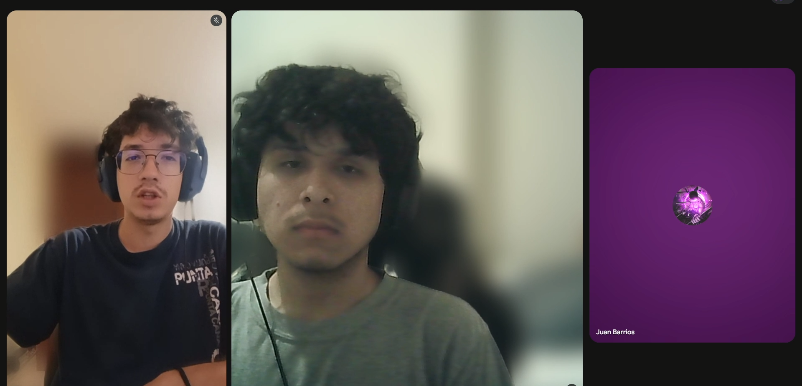
        </td>
    </tr>
    <tr>
        <td colspan="2" align="center">
            <b>Transcripción:</b>
        </td>
    </tr>
    <tr>
        <td colspan="2">
            <b>¿Podría indicarme su nombre completo, edad y lugar de procedencia?</b> <br/>
            Mi nombre es Juan Miguel Barrios Casanova, tengo 20 años y actualmente vivo en Lima-Perú.<br/>
            <br/>
            <b>¿Cuál es su ocupación actual y en qué tipo de institución se desempeña como brigadista?</b> <br/>
            Bueno, actualmente soy estudiante, pero he realizazdo como brigadista en la Municipalidad de Lima anteriormente.<br/>
            <br/>
            <b>¿Qué nivel de formación en primeros auxilios posee hasta el momento?</b> <br/>
            Bueno, hasta el momento llevé la formación básica, cómo reanimnación y en casos de no peligro. <br/>
            <br/>
            <b>¿Con qué frecuencia recibe capacitaciones o actualizaciones en primeros auxilios?</b> <br/>
            Bueno, actualmente recibo capacitaciones 2 veces al mes.<br/>
            <br/>
            <b>Según su experiencia, ¿qué tan efectivas han sido las capacitaciones presenciales que ha recibido?</b> <br/>
            Bueno, han sido muy efectivas en cuánto a la explicación y el aprendizaje.<br/>
            <br/>
            <b>¿Qué tipo de emergencias atiende con mayor frecuencia en su institución?</b> <br/>
            En eventos organizados por la municipalidad misma, las emergencias que atendí fueron descomposición, deshidratación o insolación.<br/>
            <br/>
            <b>¿Suele utilizar aplicaciones móviles o plataformas web para reforzar sus conocimientos en primeros auxilios?</b> <br/>
            He usado algunos vídeos explicativos.<br/>
            <br/>
            <b>¿Qué tan útil considera que sería una aplicación con simulaciones para mejorar sus habilidades?</b> <br/>
            Bueno, sería muy útil la verdad, ya que a veces los videos en los que recibimos capacitaciones no terminan de explicar de buena manera ciertas circunstancias.<br/>
            <br/>
            <b>Desde su experiencia, ¿qué limitaciones identifica en las capacitaciones actuales?</b> <br/>
            Pues, principalmente diría la práctica realista, ya que normalmente las capacitaciones que recibo son más teóricas que prácticas.<br/>
            <br/>
            <b>¿Qué funcionalidades le gustaría que incluya una aplicación digital de primeros auxilios?</b> <br/>
            Bueno más que nada, modelado 3D, es decir, que la aplicación me muestre como actuar ante una circunstancia o emergencias en la que yo puedo comprender correctamente como actuar.<br/>
            <br/>
            <b>¿Prefiere realizar simulaciones prácticas en grupo o de manera individual? ¿Por qué?</b> <br/>
            Bueno, yo prefiero practicar en grupo, ya que individualmente no he sentido un avance en tema de aprendizaje, en este caso en el tema de primeros auxilios. <br/>
            <br/>
            <b>¿Qué importancia tendría para usted que la aplicación ofrezca certificaciones válidas reconocidas por su institución?</b> <br/>
            Sería muy importante, ya que sería una forma de validad el como yo u otros brigadistas han tomado las capacitaciones correctas.<br/>
            <br/>
            <b>¿Estaría dispuesto a pagar personalmente o recomendar a su institución que invierta en una licencia para este servicio?</b> <br/>
            Por supuesto que sí.<br/>
            <br/>
            <b>¿Qué rango de precios consideraría razonable para este tipo de capacitación digital?</b> <br/>
            Dependería un poco en que esté centrano la aplicación, pero yo diría que entre unos 20 soles aproximandamente.<br/>
            <br/>
            <b>¿Qué institución o respaldo considera fundamental para confiar en una aplicación de primeros auxilios?</b> <br/>
            Bueno, diría que sería la MINSA, ya que se encarga de controlar y estandarizar el sistema de salud a nivel nacional, y con el respaldo de esta institución pública sería una forma sencilla que se estandarice el uso de un aplicativo para capacitaciones de primeros auxilios.<br/>
        </td>
    </tr>
</table>

<table align="center">
    <tr>
        <td colspan="2" align="center">
            <b>Entrevista N° 10</b>
        </td>
    </tr>
    <tr>
        <td width="30%" align="center">
            
        </td>
        <td width="70%">
            <b>Entrevistado</b>: Diego Alonso León Lino <br/>
            <b>Entrevistador</b>: Mathias Enrique Sanchez Espinoza <br/>
            <b>Duración</b>:  00:06:42 <br/>
            <b>Género</b>: Masculino <br/>
            <b>Edad</b>: 20 años <br/>
            <b>Segmento</b>: Brigadista <br/>
            <b>Lugar de Residencia</b>: Lima, Perú <br/>
        </td>
    </tr>
    <tr>
        <td colspan="2" align="center">
            Link de la entrevista: <a href="https://youtu.be/itTG0QX_dkg" target="_blank" rel="noopener noreferrer"> https://youtu.be/itTG0QX_dkg </a>
        </td>
    </tr>
    <tr>
        <td colspan="2" align="center">
            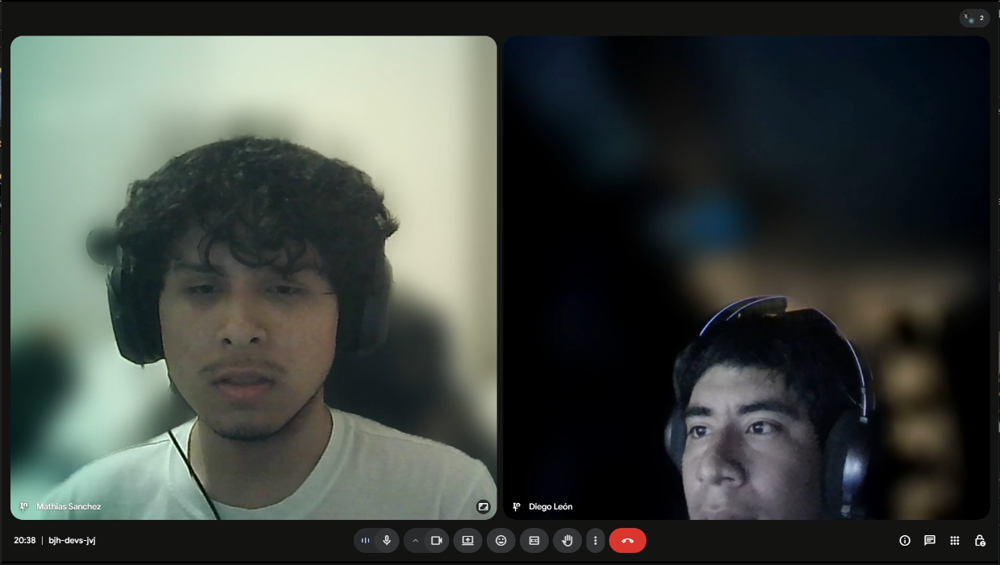
        </td>
    </tr>
    <tr>
        <td colspan="2" align="center">
            <b>Transcripción:</b>
        </td>
    </tr>
    <tr>
        <td colspan="2">
            <b>¿Podría indicarme su nombre completo, edad y lugar de procedencia?</b> <br/>
            Mi nombre es Diego Alonso León Lino, tengo 20 años y soy de Lima, Perú.<br/>
            <br/>
             <b>¿Cuál es su ocupación actual y en qué tipo de institución se desempeña como brigadista?</b> <br/>
             Actualmente soy estudiante universitario y me encuentro cursando mi carrera profesional. Anteriormente fui brigadista en mi colegio, donde participé en actividades relacionadas con primeros auxilios, apoyo en emergencias y prevención de riesgos.
            <br/>
            <br/>
            <b>¿Qué nivel de formación en primeros auxilios posee hasta el momento?</b> <br/>
            Hasta el momento he llevado una capacitación de nivel intermedio en primeros auxilios, donde aprendí temas importantes como RCP, control de hemorragias, atención ante desmayos, fracturas leves y respuesta inicial frente a diferentes tipos de emergencia.<br/>
            <br/>
            <b>¿Con qué frecuencia recibe capacitaciones o actualizaciones en primeros auxilios?</b> <br/>
            Normalmente recibimos capacitaciones cada 4 o 6 meses, aunque depende bastante de la programación institucional. A veces también se realizan pequeños refuerzos cuando ocurre alguna situación importante o cuando se actualizan los protocolos.<br/>
            <br/>
            <b>Según su experiencia, ¿qué tan efectivas han sido las capacitaciones presenciales que ha recibido?</b> <br/>
            Considero que las capacitaciones presenciales han sido bastante efectivas porque permiten practicar directamente y eso ayuda mucho más que solo la teoría.<br/>
            <br/>
            <b>¿Qué tipo de emergencias atiende con mayor frecuencia en su institución?</b> <br/>
            Las emergencias que más atendemos suelen ser desmayos, caídas, golpes leves, cortes pequeños, crisis nerviosas y algunos casos de problemas respiratorios.<br/>
            <br/>
            <b>¿Suele utilizar aplicaciones móviles o plataformas web para reforzar sus conocimientos en primeros auxilios?</b> <br/>
            No suelo utilizar aplicaciones móviles ni plataformas web para reforzar primeros auxilios, porque considero que aprender de forma práctica y presencial es mucho más útil. Pienso que practicar directamente ayuda a reaccionar mejor en una emergencia real, ya que no es lo mismo leer un procedimiento que aplicarlo en el momento cuando alguien necesita ayuda.<br/>
            <br/>
            <b>¿Qué tan útil considera que sería una aplicación con simulaciones para mejorar sus habilidades como profesional del sector salud?</b> <br/>
            Creo que una aplicación con simulaciones sería muy útil porque ayudaría a practicar cómo actuar en una emergencia sin esperar que pase una de verdad. Eso serviría para reaccionar más rápido, tener más seguridad y no quedarse en blanco en el momento.<br/>
            <br/>
            <b>Desde su experiencia, ¿qué limitaciones identifica en las capacitaciones actuales (por ejemplo, costos, tiempo, logística, escasa práctica realista)?</b> <br/>
            Las principales limitaciones que veo son el poco tiempo disponible, la baja frecuencia de las capacitaciones y la falta de simulaciones realmente realistas. En muchos casos, todo se enfoca más en la explicación y casi no se practica como sería en una situación real.<br/>
            <br/>
            <b>¿Qué funcionalidades le gustaría que incluya una aplicación digital de primeros auxilios (por ejemplo, escenarios realistas, certificaciones, evaluaciones, ranking)?</b></b> <br/>
            Me gustaría que la aplicación tenga evaluaciones prácticas, respuestas inmediatas sobre los errores o aciertos, certificaciones válidas y una actualización constante de los protocolos de primeros auxilios.<br/>
            <br/>
            <b>¿Prefiere realizar simulaciones prácticas en grupo o de manera individual? ¿Por qué?</b> <br/>
            Prefiero las simulaciones en grupo porque ayudan al trabajo en equipo durante una emergencia.
            <br/>
            <br/>
            <b>¿Qué importancia tendría para usted que la aplicación ofrezca certificaciones válidas reconocidas por su institución?</b> <br/>
            Sería muy importante que la aplicación ofrezca certificaciones reconocidas por la institución, porque eso genera mayor confianza.<br/>
            <br/>
            <b>¿Estaría dispuesto a pagar personalmente o recomendar a su institución que invierta en una licencia para este servicio?</b> <br/>
            Sí, estaría dispuesto a recomendarlo e incluso sugerir a mi institución que invierta en este tipo de servicio, ya que sería una buena forma de mejorar la preparación en primeros auxilios.<br/>
            <br/>
            <b>¿Qué rango de precios consideraría razonable para este tipo de capacitación digital?</b> <br/>
            Considero que un rango razonable estaría entre 30 y 80 soles mensuales por usuario, dependiendo de lo que ofrezca la aplicación.
            <br/>
            <br/>
            <b>¿Qué institución o respaldo considera fundamental para confiar en una aplicación de primeros auxilios?</b> <br/>
            Considero que el respaldo del Ministerio de Salud garantizaría la validez del contenido y daría mayor confianza al momento de utilizar la aplicación.<br/>
        </td>
    </tr>
</table>

## 2.2.3. Análisis de entrevistas

Se realizaron 10 entrevistas semiestructuradas distribuidas en tres segmentos objetivo identificados previamente: Estudiantes Universitarios (4 entrevistas), Comunidad Vecinal (3 entrevistas) y Brigadistas/Profesionales de Salud (3 entrevistas). El análisis cuantifica las respuestas para identificar patrones representativos que sustenten la construcción de arquetipos de usuario.

### Segmento: Estudiantes universitarios

**Total entrevistados**: 4

#### _Características objetivas_

- **Edad**: 19-23 años (promedio 21 años)
- **Dispositivos de estudio**: 100% usa laptop (4/4), 75% complementa con celular (3/4)
- **Capacitación previa en Primeros Auxilios**: 25% recibió capacitación (1/4), 75% no recibió formación completa (3/4)
- **Plataformas digitales utilizadas**: 100% usa plataformas educativas (Zoom, Meet, Teams, Classroom, Coursera).
- **Tipo de emergencia que más preocupa**: Accidentes en laboratorios (3 de 4 lo mencionan) que es el 75 %.
- **Elemento que genera más confianza en una app**: El 100% menciona que la certificación y calidad de simulación.
- **Disposición a pagar**: Entre 18 y 150 soles (promedio: 72 soles).
- **Preferencias de aprendizaje**: 50% prefiere simulaciones interactivas, 25% prefiere aprendizaje grupal, 25% se siente cómoda con todas las modalidades

#### _Características subjetivas_

- **Se sienten poco o medianamente preparadas ante emergencias**: 75% (3/4)
  - "Me siento poco preparada debido a que no tengo mucho conocimiento en el tema" – Luciana (Entrevista 3)
  - "Me siento medianamente preparada. Conozco lo básico, pero creo que en una situación real podría ponerme nerviosa" – Sofía (Entrevista 4)

- **Importancia atribuida**: 100% considera "muy importante" tener conocimientos de primeros auxilios (4/4)
  - "Lo considero muy importante. Nunca sabemos cuándo puede ocurrir un accidente" – Sofía (Entrevista 4)

- **Factores de confianza en la app**: 75% valora certificación + calidad de simulación (3/4)
  - "La calidad de la simulación me hace sentir que practico en una situación real y la certificación porque respalda lo aprendido" – María Elena (Entrevista 2)

- **Disposición de pago**: variación significativa según la percepción de valor.

### Segmento: Comunidad vecinal

**Total entrevistados**: 3

#### _Características objetivas_

- **Edad**: 20-42 años (promedio 29 años)
- **Han recibido capacitación en primeros auxilios**: 33% (1/3) recibió capacitación municipal
- **Tipo de emergencias más comunes**: 100% coincide en accidentes domésticos, sismos, incendios.
- **Acceso tecnológico**: 100% usa smartphone (3/3), 67% usa redes sociales diariamente (2/3)
- **Barreras principales para capacitarse**: 67% menciona falta de tiempo (2/3), 33% falta de información (1/3)
- **Preferencia de aprendizaje**: 67% talleres grupales (2/3), 33% individual (1/3)
- **Modelo de pago preferido**: 100% prefiere modelos comunitarios o institucionales (3/3)

#### _Características subjetivas_

- **Consideran a su comunidad poco preparada ante emergencias**: 100% (3/3)
- **Disposición a pagar por capacitación**: todos sí estarían dispuestos, pero condicionado a que tenga valor real o apoyo municipal
  - "Más que todo el tiempo, ya que paro ocupado con mi trabajo" – Rodrigo (Entrevista 6)
  - "Me interesa más en talleres con mis vecinos porque creo yo que en grupal sería mejor el aprendizaje" – Janeth (Entrevista 5)
  - "Sí, sí me parece correcto que tendríamos que pagar un porcentaje" – Janeth (Entrevista 5)

- **Expectativas de la app**: 100% busca fortalecer la unión comunitaria (3/3)
  - "Podría ser un punto de encuentro digital que nos permita capacitarnos juntos" – Josemaría (Entrevista 7)

### Segmento: Brigadistas / Profesionales del sector salud

**Total entrevistados**: 3

#### _Características objetivas_

- **Edad**: 20-42 años (promedio 27 años)
- **Capacitación formal en primeros auxilios**: 100% tiene capacitación formal en PA (3/3)
- **Frecuencia de actualización**: Cada 6-12 meses (2/3 mencionan esta frecuencia)
- **Tipo de emergencias más frecuentes**: Incendios, desmayos, contusiones, fracturas, rescates.
- **Uso de herramientas digitales**: 2 de 3 usan plataformas o videos de refuerzo (67 %).
- **Elemento más valorado en una app**: 100% valora certificaciones con aval institucional y simulaciones realistas (3/3).
- **Disposición a pagar**: Entre 20 y 100 soles (promedio: 60 soles).
- **Preferencias de uso**: 67% valora ambas modalidades (individual/grupal), 33% prefiere simulaciones grupales.

#### _Características subjetivas_

- **Limitaciones identificadas**:
  - 67% menciona escasez de práctica realista (2/3)
  - "La escasez de clases prácticas" – Andy (Entrevista 9)
  - "Deberíamos tener una forma de poder practicar sin necesidad de llegar a los riesgos reales" – Héctor (Entrevista 8)

- **Funcionalidades deseadas**:
  - Sería muy importante porque hoy en día existe algo que se llama 'trazabilidad de la información'" - Héctor (Entrevista 8).
  - "Me gustaría recibir escenarios realistas para que los conocimientos sean efectivos" - Marjori (Entrevista 10).

- **Elemento más valorado en una app**: simulaciones realistas y certificación oficial.
- **Disposición de pago**: alta, con expectativa de S/20-50 mensual o S/50-100 por curso.
- **Instituciones de respaldo requeridas**: MINSA, Cruz Roja, AHA, Defensa Civil (mencionadas por 100%).

# 2.3. Needfinding

El proceso de needfinding permitió identificar las necesidades reales, motivaciones, dificultades y oportunidades relacionadas con la capacitación en primeros auxilios en los tres segmentos objetivo de SafeStep: estudiantes universitarios, comunidad vecinal y brigadistas o profesionales de la salud.

Estudios contemporáneos demuestran que, si bien las capacitaciones iniciales pueden mejorar el conocimiento técnico, la retención disminuye significativamente con el tiempo sin métodos de práctica continua. Un estudio mixto realizado en una comunidad remota evidenció que la formación inicial mejora las puntuaciones de conocimiento, pero la retención cae cuando no existen mecanismos de refuerzo accesibles, especialmente en poblaciones no profesionales (Do Thi et al., 2024).

Del mismo modo, una investigación de 2025 examinó el nivel de conocimientos de primeros auxilios en distintos niveles educativos (secundaria, bachillerato y universidad), encontrando brechas importantes en comprensión y aplicación práctica, lo que refuerza la necesidad de herramientas educativas adaptadas a diferentes perfiles (García-Blaya et al., 2025).

Asimismo, evidencia reciente señala que los métodos tradicionales (charlas, diapositivas, demostraciones aisladas) no generan suficiente transferencia a situaciones reales de estrés. En contraste, un estudio comparativo de 2024 mostró que las metodologías basadas en gamificación y simulación producen mejor rendimiento práctico, mayor confianza y una retención más efectiva del aprendizaje (Navarro-Patón & Mecías-Calvo, 2024).

En conjunto, esta literatura reciente confirma que existe una necesidad sostenida de herramientas interactivas, accesibles y orientadas a la práctica —como simulaciones digitales— que permitan a las personas responder adecuadamente ante emergencias cotidianas, coincidiendo con los hallazgos obtenidos en entrevistas y análisis de campo.

## Análisis Estructural de la Problemática

### Árbol de Problemas

El Árbol de Problemas fue elaborado para jerarquizar visualmente la problemática, estableciendo una relación de causalidad entre el problema central –Desconocimiento práctico en primeros auxilios en población general y grupos de riesgo– y sus efectos. Las Causas (raíces) y los Efectos (impactos) identificados fueron validados mediante la triangulación de los hallazgos del trabajo de campo y la literatura científica reciente, la cual subraya la insuficiencia de los métodos de enseñanza pasivos y la baja retención sin práctica continua (Do Thi et al., 2024; Navarro-Patón & Mecías-Calvo, 2024).

<div align="center">
  <p>
    <b>Gráfico 1</b>: Árbol de problemas
  </p>
  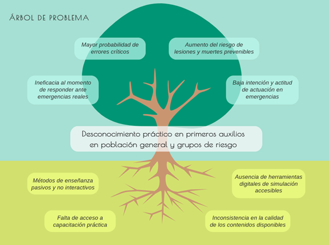
  <p>
    <i><b>Fuente</b>: Elaboración propia.</i>
  </p>
</div>

### Diagrama de Ishikawa

Para complementar el análisis estructural, se aplicó el Diagrama de Ishikawa (Espina de Pescado) categorizando las causas raíz en seis ejes fundamentales: Proceso, Personas, Tecnología, Información, Entorno y Gestión. Este desglose sistemático no solo demuestra el rigor metodológico, sino que también justifica la multidimensionalidad de la solución SafeStep al validar las causas con la literatura (p. ej., la necesidad de Tecnología para superar las limitaciones de Proceso y la importancia de Gestión para las certificaciones).

<div align="center">
  <p>
    <b>Gráfico 2</b>: Diagrama de Ishikawa
  </p>
  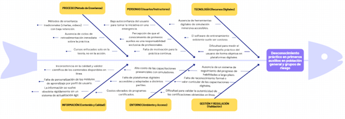
  <p>
    <i><b>Fuente</b>: Elaboración propia.</i>
  </p>
</div>

## 2.3.1. User Personas

En esta sección se presentan las fichas de User Persona desarrolladas a partir del análisis de entrevistas y del análisis competitivo. Se tomó en cuenta la información estadística obtenida en las entrevistas a los segmentos estudiados, donde se identificaron las características objetivas y subjetivas más comunes, complementado con el análisis competitivo del mercado de capacitación en primeros auxilios.

### Segmento: Estudiantes universitarios

<div align="center">
  <p>
    <b>Gráfico 3</b>: User Person del segmento Estudiantes universitarios
  </p>
  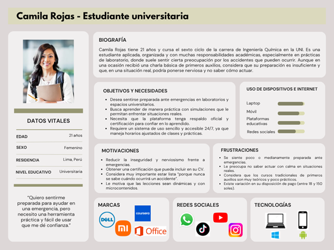
  <p>
    <i><b>Fuente</b>: Elaboración propia.</i>
  </p>
</div>

### Segmento: Comunidad vecinal

<div align="center">
  <p>
    <b>Gráfico 4</b>: User Person del segmento Comunidad vecinal
  </p>
  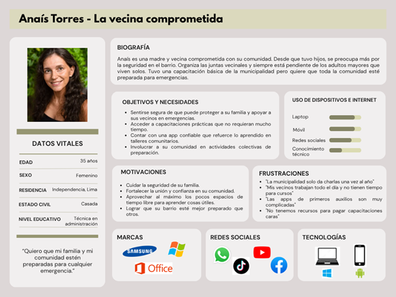
  <p>
    <i><b>Fuente</b>: Elaboración propia.</i>
  </p>
</div>

### Segmento: Brigadistas / Profesionales del sector salud

<div align="center">
  <p>
    <b>Gráfico 5</b>: User Person del segmento Brigadistas / Profesionales del sector salud
  </p>
  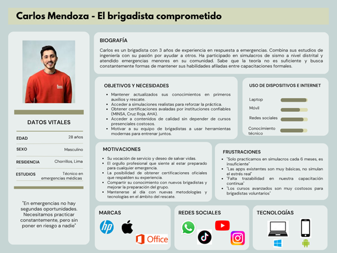
  <p>
    <i><b>Fuente</b>: Elaboración propia.</i>
  </p>
</div>

## 2.3.2. User Task Matrix

El presente User Task Matrix reúne las tareas principales que los User Persona (representativos de los tres segmentos objetivo de SafeStep) realizan para alcanzar sus metas relacionadas con la capacitación en primeros auxilios.

Cada tarea fue evaluada según dos criterios:

- **Frecuencia (Frc)**: qué tan a menudo el usuario realiza la tarea (Alta / Media / Baja).
- **Importancia (Imp)**: qué tan relevante considera el usuario dicha tarea para cumplir su objetivo (Alta / Media / Baja).

Los segmentos considerados son:

- Estudiantes universitarios
- Comunidad vecinal
- Brigadistas / profesionales de salud

<table>
    <tr>
        <td rowspan="2" align="center">
            <b>Tareas principales</b>
        </td>
        <td colspan="2" align="center">
            <b>Estudiantes</b>
        </td>
        <td colspan="2" align="center">
            <b>Comunidad vecinal</b>
        </td>
        <td colspan="2" align="center">
            <b>Brigadistas / profesionales</b>
        </td>
    </tr>
    <tr>
        <td align="center"><b>Frc</b></td>
        <td align="center"><b>Imp</b></td>
        <td align="center"><b>Frc</b></td>
        <td align="center"><b>Imp</b></td>
        <td align="center"><b>Frc</b></td>
        <td align="center"><b>Imp</b></td>
    </tr>
    <tr>
        <td align="center">
            <b>Buscar información sobre primeros auxilios</b>
        </td>
        <td align="center">Alta</td>
        <td align="center">Alta</td>
        <td align="center">Media</td>
        <td align="center">Alta</td>
        <td align="center">Media</td>
        <td align="center">Alta</td>
    </tr>
    <tr>
        <td align="center">
            <b>Participar en capacitaciones o simulaciones</b>
        </td>
        <td align="center">Media</td>
        <td align="center">Alta</td>
        <td align="center">Media</td>
        <td align="center">Alta</td>
        <td align="center">Alta</td>
        <td align="center">Alta</td>
    </tr>
    <tr>
        <td align="center">
            <b>Consultar materiales de apoyo (videos, guías)</b>
        </td>
        <td align="center">Alta</td>
        <td align="center">Media</td>
        <td align="center">Media</td>
        <td align="center">Media</td>
        <td align="center">Alta</td>
        <td align="center">Media</td>
    </tr>
    <tr>
        <td align="center">
            <b>Practicar casos de emergencia</b>
        </td>
        <td align="center">Media</td>
        <td align="center">Alta</td>
        <td align="center">Media</td>
        <td align="center">Alta</td>
        <td align="center">Alta</td>
        <td align="center">Alta</td>
    </tr>
    <tr>
        <td align="center">
            <b>Compartir experiencias o dudas con otros usuarios</b>
        </td>
        <td align="center">Media</td>
        <td align="center">Media</td>
        <td align="center">Alta</td>
        <td align="center">Alta</td>
        <td align="center">Media</td>
        <td align="center">Alta</td>
    </tr>
    <tr>
        <td align="center">
            <b>Obtener certificaciones o constancias</b>
        </td>
        <td align="center">Alta</td>
        <td align="center">Alta</td>
        <td align="center">Baja</td>
        <td align="center">Media</td>
        <td align="center">Alta</td>
        <td align="center">Alta</td>
    </tr>
    <tr>
        <td align="center">
            <b>Revisar su progreso o desempeño</b>
        </td>
        <td align="center">Media</td>
        <td align="center">Alta</td>
        <td align="center">Media</td>
        <td align="center">Media</td>
        <td align="center">Alta</td>
        <td align="center">Alta</td>
    </tr>
    <tr>
        <td align="center">
            <b>Enseñar o replicar conocimientos adquiridos</b>
        </td>
        <td align="center">Baja</td>
        <td align="center">Media</td>
        <td align="center">Media</td>
        <td align="center">Alta</td>
        <td align="center">Alta</td>
        <td align="center">Alta</td>
    </tr>
    <tr>
        <td align="center">
            <b>Organizar o participar en eventos de seguridad</b>
        </td>
        <td align="center">Baja</td>
        <td align="center">Media</td>
        <td align="center">Alta</td>
        <td align="center">Alta</td>
        <td align="center">Alta</td>
        <td align="center">Alta</td>
    </tr>
    <tr>
        <td align="center">
            <b>Acceder desde dispositivos móviles para aprender</b>
        </td>
        <td align="center">Alta</td>
        <td align="center">Alta</td>
        <td align="center">Alta</td>
        <td align="center">Alta</td>
        <td align="center">Media</td>
        <td align="center">Media</td>
    </tr>
    <tr>
        <td align="center">
            <b>Validar información o cursos (autenticidad)</b>
        </td>
        <td align="center">Media</td>
        <td align="center">Alta</td>
        <td align="center">Baja</td>
        <td align="center">Media</td>
        <td align="center">Alta</td>
        <td align="center">Alta</td>
    </tr>
    <tr>
        <td align="center">
            <b>Coordinar actividades grupales o roles</b>
        </td>
        <td align="center">Media</td>
        <td align="center">Media</td>
        <td align="center">Alta</td>
        <td align="center">Alta</td>
        <td align="center">Alta</td>
        <td align="center">Alta</td>
    </tr>
</table>

### Análisis de resultados

#### Tareas más frecuentes:

Entre los tres segmentos, las tareas “Buscar información sobre primeros auxilios”, “Acceder desde dispositivos móviles para aprender” y “Participar en capacitaciones o simulaciones” presentan alta frecuencia, reflejando el interés general por la formación práctica y accesible.

#### Tareas más importantes:

En todos los casos, las tareas “Participar en simulaciones”, “Obtener certificaciones”, y “Practicar casos de emergencia” destacan con alta importancia, evidenciando que los usuarios valoran el aprendizaje aplicado y la validación de sus conocimientos.

#### Diferencias entre segmentos:

- Los estudiantes priorizan la facilidad de acceso, la certificación y el aprendizaje interactivo.
- La comunidad vecinal da más peso a la colaboración y organización de eventos grupales.
- Los brigadistas concentran sus tareas en la práctica avanzada, validación institucional y monitoreo de desempeño.

#### Coincidencias clave:

Todos los perfiles coinciden en la necesidad de capacitaciones accesibles, certificadas y prácticas, lo que valida el enfoque de SafeStep hacia una experiencia transversal de simulación interactiva con respaldo formal.

## 2.3.3. User Journey Mapping

Los siguientes User Journey Mapping describen las experiencia actuales (As-Is) de los tres segmentos principales de SafeStep: estudiantes universitarios, comunidad vecinal y brigadistas.

El objetivo es comprender las motivaciones, frustraciones y oportunidades que surgen en cada etapa del proceso de aprendizaje, desde la búsqueda de información hasta la aplicación de conocimientos, con el fin de identificar puntos críticos que servirán de base para diseñar una experiencia más efectiva, práctica y accesible.

<div align="center">
  <p>
    <b>Gráfico 6</b>: User Journey Map – Camila Rojas (Estudiante universitaria)
  </p>
  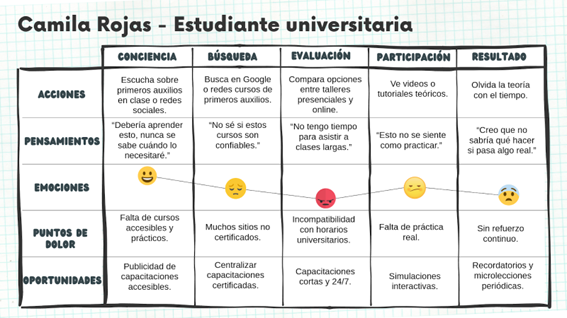
  <p>
    <i><b>Fuente</b>: Elaboración propia.</i>
  </p>
</div>

<div align="center">
  <p>
    <b>Gráfico 7</b>: User Journey Map – Anaís Torres (Vecina comprometida)
  </p>
  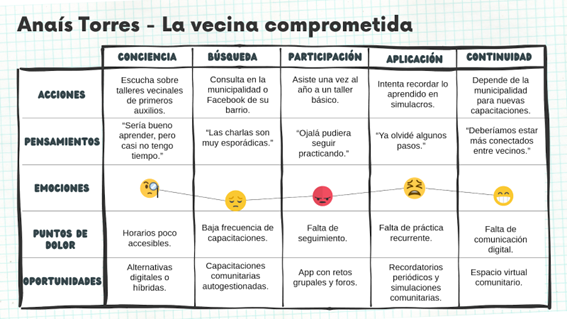
  <p>
    <i><b>Fuente</b>: Elaboración propia.</i>
  </p>
</div>

<div align="center">
  <p>
    <b>Gráfico 8</b>: User Journey Map – Carlos Mendoza (Brigadista comprometido)
  </p>
  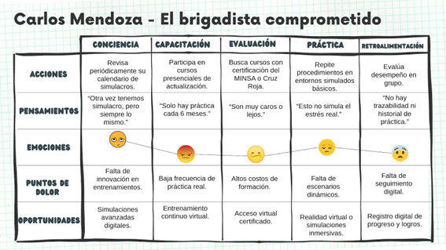
  <p>
    <i><b>Fuente</b>: Elaboración propia.</i>
  </p>
</div>

## 2.3.4. Empathy Mapping

El proceso de Empathy Mapping permitió comprender de manera más profunda los pensamientos, emociones, necesidades y motivaciones de los tres User Persona de SafeStep.

Cada mapa busca responder las preguntas centrales del diseño centrado en el usuario: ¿con quién estamos empatizando?, ¿qué necesita?, ¿qué piensa y siente?, ¿qué ve, dice, hace y escucha?, además de identificar sus pains (frustraciones o dificultades) y gains (motivaciones y oportunidades).

<div align="center">
  <p>
    <b>Gráfico 9</b>: Empathy Map de estudiante
  </p>
  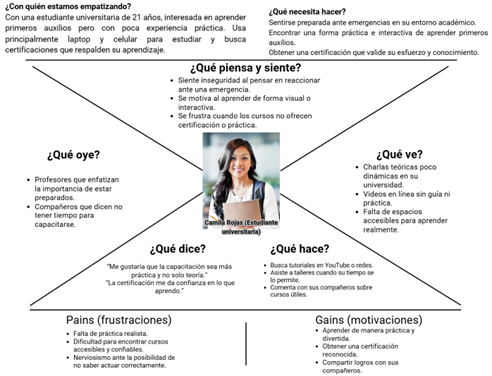
  <p>
    <i><b>Fuente</b>: Elaboración propia.</i>
  </p>
</div>

<div align="center">
  <p>
    <b>Gráfico 10</b>: Empathy Map de comunidad vecinal
  </p>
  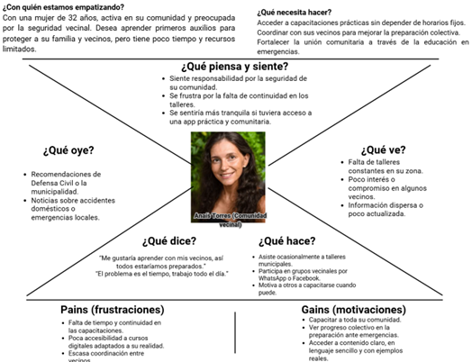
  <p>
    <i><b>Fuente</b>: Elaboración propia.</i>
  </p>
</div>

<div align="center">
  <p>
    <b>Gráfico 11</b>: Empathy Map de brigadista
  </p>
  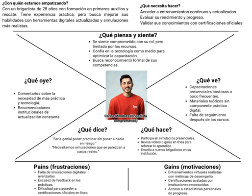
  <p>
    <i><b>Fuente</b>: Elaboración propia.</i>
  </p>
</div>

# 2.4. Big Picture Event Storming

El Big Picture EventStorming consiste en una exploración de alto nivel que busca alinear a los involucrados mediante el mapeo de eventos de dominio en una línea de tiempo extensa. Su propósito es capturar la narrativa completa del negocio para identificar puntos de fricción y establecer los límites preliminares de los Bounded Contexts antes de realizar un diseño técnico detallado

<div align="center">
    <a href="https://miro.com/app/live-embed/uXjVGlN0dvA=/?focusWidget=3458764667285676558&embedMode=view_only_without_ui&embedId=610945114680" target="_blank">
        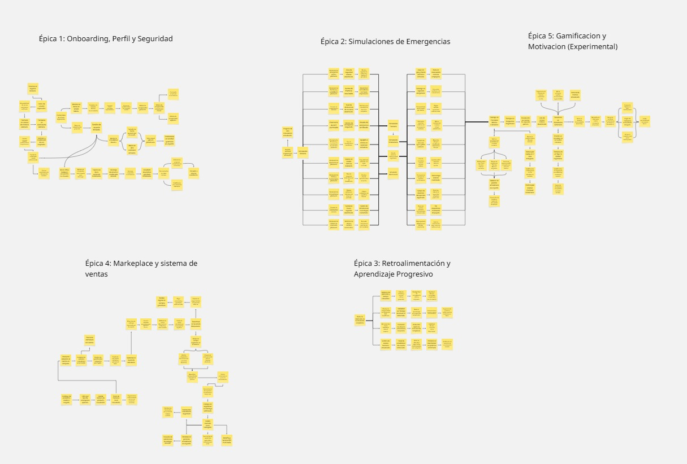
    </a>
    <br>
    <sub><em>Haz clic en la imagen para ver el tablero en Miro</em></sub>
</div>

# 2.5. Ubiquitous Language

Es el lenguaje común compartido entre desarrolladores y expertos del negocio que se formula durante el EventStorming para alinear modelos mentales y eliminar ambigüedades. Este lenguaje asegura que tanto la documentación técnica como el código final de SafeStep utilicen exactamente los mismos términos definidos para el dominio empresarial.

| Concepto | Definición |
| --- | --- |
| Alumno | Usuario del sistema con rol académico que busca inscribirse en cursos. |
| Docente | Actor del sistema que tiene acceso a gestionar el silabo y la asistencia en sus cursos asignados. |
| Administrador | Usuario con permisos para gestionar la configuración global de cursos y periodos. |
| Curso | Unidad curricular básica que posee créditos, syllabus y requisitos. |
| Ciclo Académico | Periodo de tiempo específico (ej. 2026-I) durante el cual se desarrollan los cursos. |
| Cupo | Cantidad limitada de vacantes disponibles para un curso en un horario específico. |
| Silabo | Documento oficial que contiene el contenido, objetivos y evaluación de un curso. |
| Matrícula | Proceso formal de inscripción de un alumno en un conjunto de cursos. |
| Pre-requisito | Curso previo que debe estar aprobado antes de inscribir el curso actual. |
| Estado de Pago | Condición financiera del alumno que habilita o bloquea su proceso de matrícula. |
| Módulo de Pagos | Sistema encargado de validar la deuda y procesar transacciones para habilitar la matrícula. |
| Historial Académico | Registro histórico de cursos aprobados y desaprobados que determina la elegibilidad para futuros cursos. |
| Solicitud de Matrícula | Registro temporal generado por el alumno que inicia el proceso antes de la confirmación final. |
| Reporte de Matrícula | Documento o dashboard generado para el administrador con métricas de cupos y alumnos inscritos. |
| Ventanilla única | Canal centralizado de atención donde el alumno puede resolver incidencias técnicas o administrativas. |

<br>
<br>

<div align="center">
    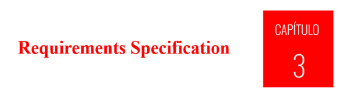
</div>

<br>
<br>

# 3.1. User Stories

## Epics

<table align="center">
    <tr>
        <td align="center">
        <b>Epic ID</b>
        </td>
        <td align="center">
        <b>Descripción de la épica</b>
        </td>
    </tr>
    <tr>
        <td align="center"><b>EP01</b></td>
        <td align="center">Onboarding y Accesibilidad</td>
    </tr>
    <tr>
        <td align="center"><b>EP02</b></td>
        <td align="center">Simulaciones de Emergencias</td>
    </tr>
    <tr>
        <td align="center"><b>EP03</b></td>
        <td align="center">Retroalimentación y Aprendizaje Progresivo</td>
    </tr>
    <tr>
        <td align="center"><b>EP04</b></td>
        <td align="center">Comercio electrónico</td>
    </tr>
    <tr>
        <td align="center"><b>EP05</b></td>
        <td align="center">Gamificación y recompensas</td>
    </tr>
    <tr>
        <td align="center"><b>EP06</b></td>
        <td align="center">Captación y conversión de usuarios nuevos</td>
    </tr>
    <tr>
        <td align="center"><b>EP07</b></td>
        <td align="center">Seguridad, Estabilidad y Rendimiento de la Plataforma</td>
    </tr>
</table>

## User Stories

<table align="center">
    <tr>
        <td><b>User Story ID</b></td>
        <td>US01</b></td>
        <td><b>Epic ID</b></td>
        <td>EP01</b></td>
    </tr>
    <tr>
        <td><b>Título</b></td>
        <td colspan="3">Registro de nuevo usuario</b></td>
    </tr>
    <tr>
        <td><b>Descripción</b></td>
        <td colspan="3">Como nuevo usuario, quiero registrarme en SafeStep de forma rápida y segura utilizando mi correo electrónico, número de teléfono o cuentas de redes sociales (Google, Facebook, Apple), para crear mi perfil personalizado, acceder a todas las funcionalidades de la plataforma y comenzar mi aprendizaje en primeros auxilios sin demoras innecesarias.</b></td>
    </tr>
    <tr>
        <td colspan="4">
            <b>Criterios de aceptación:</b> <br/>
            <ol>
                <li>El sistema debe ofrecer múltiples opciones de registro: correo electrónico + contraseña, número de teléfono + SMS, o autenticación mediante OAuth (Google, Facebook, Apple).</li>
                <li>Para registro con correo, debe validar que el correo no esté previamente registrado y que la contraseña cumpla requisitos mínimos (mínimo 8 caracteres, al menos una letra mayúscula, un número y un carácter especial).</li>
                <li>Para registro con teléfono, debe enviar un código de verificación SMS de 6 dígitos con vigencia de 5 minutos, y solicitar al usuario que lo ingrese para activar la cuenta.</li>
                <li>Para registro con OAuth, debe completarse en menos de 10 segundos, solicitando solo los permisos mínimos necesarios (nombre, correo electrónico, foto de perfil).</li>
                <li>Durante el registro, el sistema debe solicitar información básica del perfil: nombre completo (obligatorio), fecha de nacimiento (opcional, para personalizar contenido por edad), país y ciudad (opcional, para recomendar eventos locales).</li>
                <li>El usuario debe aceptar los términos y condiciones y la política de privacidad antes de completar el registro, con enlaces visibles y legibles.</li>
                <li>En caso de error (correo duplicado, teléfono ya registrado, contraseña débil), la aplicación debe mostrar mensajes claros y específicos, indicando cómo corregir el problema.</li>
                <li>Después del registro exitoso, el sistema debe enviar un correo electrónico de bienvenida con un enlace de verificación (opcional, para confirmar la dirección) y mostrar un tour guiado opcional del dashboard.</li>
                <li>Los datos del usuario deben almacenarse cumpliendo con los lineamientos de protección de datos personales (GDPR, CCPA o equivalentes locales), con opción de solicitar la eliminación de la cuenta en cualquier momento.</li>
                <li>El sistema debe implementar mecanismos anti-bots (reCAPTCHA o similar) en el formulario de registro para prevenir registros automatizados.</li>
            </ol>
            <b>Escenario 1 (Registro exitoso con correo electrónico):</b> <br/>
            <ul>
                <li><b>Given</b> que una persona abre la aplicación SafeStep por primera vez en su dispositivo,</li>
                <li><b>And</b> selecciona la opción "Registrarse" en la pantalla de bienvenida,</li>
                <li><b>When</b> completa el formulario con nombre completo "Juan Pérez", correo "juan@example.com", teléfono opcional y contraseña segura "Juan2024*",</li>
                <li><b>And</b> acepta los términos y condiciones,</li>
                <li><b>Then</b> el sistema valida que el correo no existe previamente,</li>
                <li><b>And</b> crea la cuenta exitosamente,</li>
                <li><b>And</b> redirige al usuario al dashboard principal ya autenticado,</li>
                <li><b>And</b> envía un correo de bienvenida a juan@example.com con un enlace de verificación.</li>
            </ul>
            <b>Escenario 2 (Registro con Google OAuth):</b> <br/>
            <ul>
                <li><b>Given</b> que el usuario está en la pantalla de registro,</li>
                <li><b>When</b> selecciona la opción "Continuar con Google",</li>
                <li><b>Then</b> el sistema abre la ventana emergente de autenticación de Google,</li>
                <li><b>When</b> el usuario selecciona su cuenta y autoriza el acceso,</li>
                <li><b>Then</b> el sistema recibe los datos básicos (nombre, correo, foto de perfil),</li>
                <li><b>And</b> crea automáticamente la cuenta asociada a ese correo,</li>
                <li><b>And</b> redirige al usuario al dashboard principal ya autenticado,</li>
                <li><b>And</b> el proceso completo dura menos de 10 segundos.</li>
            </ul>
            <b>Escenario 3 (Registro con número de teléfono y SMS):</b> <br/>
            <ul>
                <li><b>Given</b> que el usuario selecciona la opción "Registrarse con teléfono",</li>
                <li><b>When</b> ingresa su número "+51 987654321" y presiona "Enviar código",</li>
                <li><b>Then</b> el sistema envía un código SMS de 6 dígitos al número proporcionado,</li>
                <li><b>When</b> el usuario ingresa el código correctamente dentro de los 5 minutos,</li>
                <li><b>Then</b> el sistema completa el registro, solicita el nombre completo del usuario,</li>
                <li><b>And</b> crea la cuenta exitosamente,</li>
                <li><b>And</b> redirige al dashboard principal ya autenticado.</li>
            </ul>
            <b>Escenario 4 (Error - correo ya registrado):</b> <br/>
            <ul>
                <li><b>Given</b> que un usuario intenta registrarse con un correo que ya existe en la base de datos,</li>
                <li><b>When</b> completa el formulario y presiona "Registrarse",</li>
                <li><b>Then</b> el sistema detecta el correo duplicado,</li>
                <li><b>And</b> muestra un mensaje claro: "Este correo electrónico ya está registrado. ¿Deseas iniciar sesión o recuperar tu contraseña?",</li>
                <li><b>And</b> ofrece enlaces directos a "Iniciar sesión" y "¿Olvidaste tu contraseña?" para ayudar al usuario a recuperar el acceso.</li>
            </ul>
            <b>Escenario 5 (Error - contraseña débil):</b> <br/>
            <ul>
                <li><b>Given</b> que el usuario intenta registrarse con una contraseña débil,</li>
                <li><b>When</b> ingresa "12345" en el campo de contraseña,</li>
                <li><b>Then</b> el sistema muestra un mensaje de error en tiempo real: "La contraseña debe tener al menos 8 caracteres, una mayúscula, un número y un carácter especial",</li>
                <li><b>And</b> el botón "Registrarse" permanece deshabilitado hasta que la contraseña cumpla los requisitos.</li>
            </ul>
        </b></td>
    </tr>
</table>

<table align="center">
    <tr>
        <td><b>User Story ID</b></td>
        <td>US02</b></td>
        <td><b>Epic ID</b></td>
        <td>EP01</b></td>
    </tr>
    <tr>
        <td><b>Título</b></td>
        <td colspan="3">Inicio de sesión</b></td>
    </tr>
    <tr>
        <td><b>Descripción</b></td>
        <td colspan="3">Como usuario registrado, quiero iniciar sesión en SafeStep de forma rápida, segura y sin fricciones, utilizando mis credenciales (correo/contraseña, teléfono/SMS o redes sociales), para acceder a mi dashboard personalizado, retomar mis simulaciones donde las dejé y continuar mi progreso de aprendizaje sin interrupciones.</b></td>
    </tr>
    <tr>
        <td colspan="4">
            <b>Criterios de aceptación:</b> <br/>
            <ol>
                <li>El sistema debe ofrecer múltiples métodos de inicio de sesión: correo electrónico + contraseña, número de teléfono + código SMS, o autenticación mediante OAuth (Google, Facebook, Apple).</li>
                <li>El proceso de inicio de sesión no debe exceder los 5 segundos en condiciones normales de red.</li>
                <li>El sistema debe incluir una opción "Recordarme" que mantenga la sesión activa durante 30 días (o el tiempo configurado por el administrador).</li>
                <li>Después de 3 intentos fallidos consecutivos de inicio de sesión, el sistema debe mostrar un captcha (reCAPTCHA o similar) para verificar que no es un bot.</li>
                <li>Después de 5 intentos fallidos consecutivos, el sistema debe bloquear temporalmente la cuenta durante 15 minutos y notificar al usuario por correo electrónico o SMS sobre el intento de acceso sospechoso.</li>
                <li>Los mensajes de error de inicio de sesión deben ser genéricos para proteger la privacidad: "Correo electrónico o contraseña incorrectos" (sin revelar si el correo existe o no).</li>
                <li>El sistema debe ofrecer la opción "¿Olvidaste tu contraseña?" visible desde la pantalla de inicio de sesión, que inicie el flujo de recuperación (US03).</li>
                <li>Una vez autenticado, el sistema debe mostrar el nombre y avatar del usuario en la barra de navegación del dashboard.</li>
                <li>El sistema debe implementar autenticación de dos factores (2FA) opcional para usuarios que deseen mayor seguridad, utilizando una app autenticadora (Google Authenticator, Authy) o SMS.</li>
                <li>El sistema debe registrar la dirección IP, el dispositivo y la fecha/hora de cada inicio de sesión, permitiendo al usuario ver esta información en la sección "Seguridad" de su perfil.</li>
            </ol>
            <b>Escenario 1 (Inicio de sesión exitoso con correo y contraseña):</b> <br/>
            <ul>
                <li><b>Given</b> que el usuario ya tiene una cuenta creada en SafeStep,</li>
                <li><b>When</b> ingresa su correo "juan@example.com" y su contraseña válida,</li>
                <li><b>And</b> pulsa el botón "Iniciar sesión",</li>
                <li><b>Then</b> el sistema valida las credenciales en menos de 3 segundos,</li>
                <li><b>And</b> crea un token de sesión activo,</li>
                <li><b>And</b> redirige al usuario a su dashboard personalizado,</li>
                <li><b>And</b> muestra en la barra superior "Hola, Juan" junto con su foto de perfil.</li>
            </ul>
            <b>Escenario 2 (Inicio de sesión con "Recordarme"):</b> <br/>
            <ul>
                <li><b>Given</b> que el usuario marca la opción "Recordarme" antes de iniciar sesión,</li>
                <li><b>When</b> ingresa sus credenciales correctamente y presiona "Iniciar sesión",</li>
                <li><b>Then</b> el sistema crea una sesión persistente,</li>
                <li><b>And</b> cuando el usuario cierra el navegador o la aplicación y vuelve a abrirla dentro de los próximos 30 días,</li>
                <li><b>Then</b> el sistema lo mantiene autenticado sin solicitar nuevamente sus credenciales,</li>
                <li><b>And</b> muestra un mensaje: "Sesión reanudada. ¿No eres tú? Cierra sesión aquí".</li>
            </ul>
            <b>Escenario 3 (Inicio de sesión fallido - bloqueo temporal):</b> <br/>
            <ul>
                <li><b>Given</b> que un usuario intenta iniciar sesión con credenciales incorrectas,</li>
                <li><b>When</b> realiza 3 intentos fallidos,</li>
                <li><b>Then</b> en el cuarto intento, el sistema muestra un captcha para verificar que no es un bot,</li>
                <li><b>When</b> el usuario continúa fallando hasta 5 intentos,</li>
                <li><b>Then</b> el sistema bloquea temporalmente la cuenta durante 15 minutos,</li>
                <li><b>And</b> envía un correo de alerta a la dirección registrada: "Se detectaron múltiples intentos fallidos de inicio de sesión en tu cuenta. Si no fuiste tú, contacta a soporte",</li>
                <li><b>And</b> después de 15 minutos, la cuenta se desbloquea automáticamente.</li>
            </ul>
            <b>Escenario 4 (Inicio de sesión con autenticación de dos factores - 2FA):</b> <br/>
            <ul>
                <li><b>Given</b> que el usuario tiene habilitada la autenticación de dos factores en su perfil,</li>
                <li><b>When</b> ingresa su correo y contraseña correctamente,</li>
                <li><b>Then</b> el sistema solicita un código de verificación de 6 dígitos,</li>
                <li><b>When</b> el usuario ingresa el código generado por su app autenticadora (Google Authenticator),</li>
                <li><b>Then</b> el sistema completa la autenticación y redirige al dashboard,</li>
                <li><b>And</b> registra el dispositivo como "confiable" si el usuario lo autoriza, evitando solicitar 2FA en ese dispositivo durante 30 días.</li>
            </ul>
            <b>Escenario 5 (Inicio de sesión con teléfono y SMS):</b> <br/>
            <ul>
                <li><b>Given</b> que el usuario tiene registrado su número de teléfono en SafeStep,</li>
                <li><b>When</b> selecciona la opción "Iniciar sesión con teléfono", ingresa su número "+51 987654321" y presiona "Enviar código",</li>
                <li><b>Then</b> el sistema envía un código SMS de 6 dígitos con vigencia de 5 minutos,</li>
                <li><b>When</b> el usuario ingresa el código correctamente,</li>
                <li><b>Then</b> el sistema autentica al usuario y redirige al dashboard,</li>
                <li><b>And</b> este método de inicio de sesión es útil para usuarios que olvidaron su contraseña o prefieren no usar correo.</li>
            </ul>
        </b></td>
    </tr>
</table>

<table align="center">
    <tr>
        <td><b>User Story ID</b></td>
        <td>US03</b></td>
        <td><b>Epic ID</b></td>
        <td>EP01</b></td>
    </tr>
    <tr>
        <td><b>Título</b></td>
        <td colspan="3">Recuperación de contraseña</b></td>
    </tr>
    <tr>
        <td><b>Descripción</b></td>
        <td colspan="3">Como usuario registrado, quiero poder recuperar mi contraseña olvidada de forma rápida, segura y sin complicaciones, utilizando mi correo electrónico o número de teléfono registrado, para restablecer el acceso a mi cuenta sin necesidad de crear un nuevo perfil ni perder mi progreso de aprendizaje.</b></td>
    </tr>
    <tr>
        <td colspan="4">
            <b>Criterios de aceptación:</b> <br/>
            <ol>
                <li>El sistema debe ofrecer la opción "¿Olvidaste tu contraseña?" desde la pantalla de inicio de sesión, visible y accesible.</li>
                <li>La recuperación debe poder realizarse mediante correo electrónico (envío de enlace único) o número de celular registrado previamente (envío de código SMS).</li>
                <li>El enlace de restablecimiento (correo) o código SMS debe tener una vigencia máxima de 15 minutos y ser de un solo uso.</li>
                <li>El sistema debe validar que el correo o número ingresado estén asociados a una cuenta activa antes de enviar el enlace o código, pero sin revelar si la cuenta existe (para evitar enumeración de usuarios).</li>
                <li>La nueva contraseña debe cumplir con los requisitos de seguridad establecidos (mínimo 8 caracteres, al menos una mayúscula, un número y un carácter especial).</li>
                <li>Una vez restablecida la contraseña, el sistema debe invalidar automáticamente cualquier enlace o código de restablecimiento anterior no utilizado.</li>
                <li>El sistema debe notificar al usuario por correo electrónico y/o SMS que su contraseña ha sido cambiada, incluyendo la fecha, hora y dispositivo desde el que se realizó el cambio (con advertencia de contactar a soporte si no fue el usuario).</li>
                <li>Después de 3 solicitudes de restablecimiento en menos de 1 hora para la misma cuenta, el sistema debe bloquear temporalmente nuevos intentos durante 30 minutos (para prevenir ataques de spam).</li>
                <li>El sistema debe permitir al usuario cancelar una solicitud de restablecimiento pendiente desde el correo o SMS recibido.</li>
                <li>Si el usuario restablece su contraseña, debe cerrar sesión en todos los dispositivos activos (excepto el actual) por seguridad.</li>
            </ol>
            <b>Escenario 1 (Recuperación exitosa por correo electrónico):</b> <br/>
            <ul>
                <li><b>Given</b> que el usuario se encuentra en la pantalla de inicio de sesión,</li>
                <li><b>When</b> pulsa la opción "¿Olvidaste tu contraseña?" e ingresa su correo electrónico "juan@example.com",</li>
                <li><b>Then</b> el sistema valida que el correo existe en la base de datos (sin revelarlo al usuario),</li>
                <li><b>And</b> envía un correo electrónico con un enlace único de restablecimiento (ejemplo: https://safestep.com/reset?token=abc123),</li>
                <li><b>When</b> el usuario hace clic en el enlace dentro de los 15 minutos,</li>
                <li><b>Then</b> se abre una página segura donde puede ingresar su nueva contraseña (con validación de requisitos de seguridad),</li>
                <li><b>When</b> confirma la nueva contraseña,</li>
                <li><b>Then</b> el sistema actualiza la contraseña, invalida el token, y redirige al usuario a la pantalla de inicio de sesión con un mensaje: "Contraseña restablecida exitosamente. Inicia sesión con tu nueva contraseña".</li>
            </ul>
            <b>Escenario 2 (Recuperación por SMS - código de verificación):</b> <br/>
            <ul>
                <li><b>Given</b> que el usuario selecciona la opción "Recuperar por SMS" en la pantalla de recuperación,</li>
                <li><b>When</b> ingresa su número de teléfono registrado "+51 987654321",</li>
                <li><b>Then</b> el sistema envía un código SMS de 6 dígitos con vigencia de 15 minutos,</li>
                <li><b>When</b> el usuario ingresa el código correctamente en la aplicación,</li>
                <li><b>Then</b> se habilita el formulario para ingresar una nueva contraseña,</li>
                <li><b>When</b> el usuario establece y confirma la nueva contraseña válida,</li>
                <li><b>Then</b> el sistema actualiza la contraseña y redirige al inicio de sesión con un mensaje de éxito.</li>
            </ul>
            <b>Escenario 3 (Enlace expirado - solicitar nuevo):</b> <br/>
            <ul>
                <li><b>Given</b> que el usuario solicitó un restablecimiento de contraseña por correo,</li>
                <li><b>When</b> hace clic en el enlace después de 20 minutos (excediendo la vigencia de 15 minutos),</li>
                <li><b>Then</b> el sistema muestra un mensaje: "El enlace de restablecimiento ha expirado por seguridad. Por favor, solicita un nuevo enlace",</li>
                <li><b>And</b> ofrece un botón "Enviar nuevo enlace" que reenvía el correo con un token fresco,</li>
                <li><b>When</b> el usuario solicita un nuevo enlace,</li>
                <li><b>Then</b> el sistema invalida el token anterior y envía uno nuevo.</li>
            </ul>
            <b>Escenario 4 (Notificación de cambio de contraseña - seguridad):</b> <br/>
            <ul>
                <li><b>Given</b> que el usuario ha restablecido su contraseña exitosamente,</li>
                <li><b>Then</b> el sistema envía un correo electrónico de notificación a la dirección registrada (y SMS opcional),</li>
                <li><b>And</b> el mensaje incluye: "Tu contraseña fue cambiada el [fecha] a las [hora] desde la IP [xxx.xxx.xxx.xxx]. Si no realizaste este cambio, contacta inmediatamente a soporte@SafeStep.com",</li>
                <li><b>And</b> el sistema cierra todas las sesiones activas del usuario en otros dispositivos, solicitando iniciar sesión nuevamente con la nueva contraseña.</li>
            </ul>
            <b>Escenario 5 (Límite de solicitudes - prevención de spam):</b> <br/>
            <ul>
                <li><b>Given</b> que un usuario solicita restablecimiento de contraseña 3 veces en menos de 1 hora para la misma cuenta,</li>
                <li><b>When</b> intenta una cuarta solicitud,</li>
                <li><b>Then</b> el sistema muestra un mensaje: "Has excedido el número de solicitudes de restablecimiento. Por favor, espera 30 minutos antes de intentar nuevamente",</li>
                <li><b>And</b> el contador se reinicia después del tiempo de espera.</li>
            </ul>
        </b></td>
    </tr>
</table>

<table align="center">
    <tr>
        <td><b>User Story ID</b></td>
        <td>US04</b></td>
        <td><b>Epic ID</b></td>
        <td>EP01</b></td>
    </tr>
    <tr>
        <td><b>Título</b></td>
        <td colspan="3">Dashboard principal y personalización</b></td>
    </tr>
    <tr>
        <td><b>Descripción</b></td>
        <td colspan="3">Como usuario autenticado, quiero acceder a un dashboard principal personalizado que muestre mi progreso de aprendizaje, simulaciones recomendadas, estadísticas clave y accesos rápidos a las funcionalidades más importantes, para tener una visión clara de mi estado actual y poder navegar eficientemente por la plataforma.</b></td>
    </tr>
    <tr>
        <td colspan="4">
            <b>Criterios de aceptación:</b> <br/>
            <ol>
                <li>El dashboard debe ser la pantalla principal después del inicio de sesión, con una estructura clara y responsiva (adaptable a móvil, tablet y escritorio).</li>
                <li>Debe mostrar un saludo personalizado con el nombre del usuario y, opcionalmente, una frase motivacional diaria (ejemplo: "¡Hola, Juan! Sigue así, llevas 5 días de racha").</li>
                <li>El dashboard debe incluir un resumen visual del progreso general: porcentaje de avance en el plan de aprendizaje, número de simulaciones completadas, certificaciones obtenidas y racha actual de práctica.</li>
                <li>Debe mostrar las simulaciones recomendadas (basadas en US12 - Recomendaciones personalizadas) con acceso directo a cada una.</li>
                <li>Debe incluir una sección "Continuar donde lo dejaste" que muestre la última simulación o lección no completada, permitiendo reanudarla con un solo clic.</li>
                <li>El dashboard debe mostrar notificaciones recientes (actividad de la comunidad, logros desbloqueados, nuevos contenidos) en una sección colapsable o feed.</li>
                <li>Debe incluir accesos rápidos a las secciones principales: "Simulaciones", "Mi Progreso", "Certificaciones", "Tienda" (EP04), "Comunidad" (EP05), y "Configuración".</li>
                <li>El usuario debe poder personalizar el dashboard: elegir qué widgets mostrar (progreso, recomendaciones, actividad reciente, insignias), reordenarlos mediante arrastrar y soltar, y ocultar los que no le interesen.</li>
                <li>El dashboard debe mostrar insignias o logros recientemente desbloqueados con animación de celebración.</li>
                <li>Debe incluir un banner rotativo con noticias o promociones relevantes (nuevos módulos, ofertas en la tienda, eventos comunitarios) que el usuario pueda cerrar si no le interesan.</li>
                <li>El tiempo de carga del dashboard no debe exceder los 2 segundos en condiciones normales de red.</li>
            </ol>
            <b>Escenario 1 (Vista general del dashboard al iniciar sesión):</b> <br/>
            <ul>
                <li><b>Given</b> que el usuario "Juan Pérez" ha iniciado sesión correctamente,</li>
                <li><b>When</b> es redirigido a su dashboard principal,</li>
                <li><b>Then</b> ve un saludo personalizado: "¡Hola, Juan! ¡Buenos días! Tu racha actual es de 7 días",</li>
                <li><b>And</b> un widget de progreso muestra un gráfico circular con "Avance general: 65%",</li>
                <li><b>And</b> una sección "Continuar donde lo dejaste" muestra la simulación "Control de hemorragias - Paso 3/5" con un botón "Reanudar",</li>
                <li><b>And</b> una sección "Recomendado para ti" muestra dos tarjetas: "Refuerza RCP" y "Práctica de torniquete",</li>
                <li><b>And</b> en la parte inferior, las insignias desbloqueadas: "Primera simulación", "Racha de 7 días", "Maestro de RCP".</li>
            </ul>
            <b>Escenario 2 (Personalización del dashboard - ocultar/mostrar widgets):</b> <br/>
            <ul>
                <li><b>Given</b> que el usuario accede a su dashboard y no le interesa ver la sección "Actividad de la comunidad",</li>
                <li><b>When</b> hace clic en el ícono de configuración del widget (tres puntos) y selecciona "Ocultar esta sección",</li>
                <li><b>Then</b> el widget desaparece del dashboard,</li>
                <li><b>And</b> la preferencia se guarda en el perfil del usuario,</li>
                <li><b>When</b> el usuario vuelve a iniciar sesión en otro dispositivo,</li>
                <li><b>Then</b> el dashboard mantiene la misma configuración de widgets (sincronizada en la nube).</li>
            </ul>
            <b>Escenario 3 (Reordenamiento de widgets mediante arrastrar y soltar):</b> <br/>
            <ul>
                <li><b>Given</b> que el usuario está en su dashboard y desea que el widget "Mi progreso" aparezca antes que "Recomendaciones",</li>
                <li><b>When</b> mantiene presionado el widget "Mi progreso" (en móvil) o hace clic y arrastra (en web) hacia la posición superior,</li>
                <li><b>Then</b> el sistema permite reordenar los widgets visualmente,</li>
                <li><b>And</b> al soltar, la nueva posición se guarda automáticamente,</li>
                <li><b>And</b> el orden se mantiene en futuras sesiones.</li>
            </ul>
            <b>Escenario 4 (Acceso rápido a secciones principales):</b> <br/>
            <ul>
                <li><b>Given</b> que el usuario está en el dashboard,</li>
                <li><b>When</b> toca o hace clic en el acceso rápido "Simulaciones",</li>
                <li><b>Then</b> el sistema navega al catálogo de simulaciones (EP02),</li>
                <li><b>And</b> cuando regresa al dashboard usando el botón "Atrás" o el menú principal, el dashboard se muestra exactamente como estaba antes de navegar.</li>
            </ul>
            <b>Escenario 5 (Banner de promociones - cierre temporal):</b> <br/>
            <ul>
                <li><b>Given</b> que el sistema muestra un banner promocional: "¡Nuevo módulo de RCP avanzado disponible!",</li>
                <li><b>When</b> el usuario hace clic en el ícono "X" para cerrar el banner,</li>
                <li><b>Then</b> el banner desaparece del dashboard,</li>
                <li><b>And</b> no se muestra nuevamente durante 7 días (a menos que el administrador marque la promoción como "urgente"),</li>
                <li><b>And</b> el usuario puede volver a ver el banner desde la sección "Notificaciones" si lo desea.</li>
            </ul>
        </b></td>
    </tr>
</table>

<table align="center">
    <tr>
        <td><b>User Story ID</b></td>
        <td>US05</b></td>
        <td><b>Epic ID</b></td>
        <td>EP01</b></td>
    </tr>
    <tr>
        <td><b>Título</b></td>
        <td colspan="3">Gestión de perfil y preferencias</b></td>
    </tr>
    <tr>
        <td><b>Descripción</b></td>
        <td colspan="3">Como usuario registrado, quiero poder gestionar mi perfil (datos personales, foto, preferencias de aprendizaje, notificaciones y seguridad) desde una sección centralizada, para mantener mi información actualizada, controlar mi privacidad y personalizar mi experiencia en SafeStep según mis necesidades.</b></td>
    </tr>
    <tr>
        <td colspan="4">
            <b>Criterios de aceptación:</b> <br/>
            <ol>
                <li>El sistema debe incluir una sección "Mi Perfil" accesible desde el dashboard (clic en avatar o menú lateral).</li>
                <li>El usuario debe poder editar su información personal: nombre completo, fecha de nacimiento, país, ciudad, idioma preferido (español, inglés, portugués, etc.).</li>
                <li>El usuario debe poder cambiar su foto de perfil (subir imagen o usar avatar generado por iniciales), con opción de recortar y ajustar la imagen antes de guardar.</li>
                <li>El usuario debe poder cambiar su contraseña (ingresando la actual y luego la nueva, con validación de requisitos de seguridad).</li>
                <li>El usuario debe poder gestionar métodos de autenticación adicionales: vincular/desvincular cuentas de Google/Facebook/Apple, habilitar/deshabilitar 2FA (autenticación de dos factores).</li>
                <li>El usuario debe poder configurar preferencias de notificaciones: push (móvil), correo electrónico, o ambas, con opciones específicas para: nuevas simulaciones, eventos comunitarios, ofertas de tienda, recordatorios de práctica, logros desbloqueados.</li>
                <li>El usuario debe poder gestionar su privacidad: permitir o no que su progreso sea visible para la comunidad, permitir o no recibir correos promocionales, solicitar exportación de sus datos (GDPR) o eliminar su cuenta permanentemente.</li>
                <li>El sistema debe mostrar una sección "Dispositivos conectados" con lista de sesiones activas (dispositivo, ubicación aproximada, fecha/hora), permitiendo al usuario cerrar sesión remotamente en cualquier dispositivo.</li>
                <li>El sistema debe mostrar estadísticas de actividad: fecha de registro, última conexión, total de horas de aprendizaje, simulaciones completadas.</li>
                <li>Todos los cambios en el perfil deben requerir confirmación de contraseña para acciones sensibles (cambio de correo, eliminación de cuenta, desvinculación de método de autenticación).</li>
                <li>Los datos deben actualizarse en tiempo real y reflejarse en todas las sesiones activas del usuario.</li>
            </ol>
            <b>Escenario 1 (Edición de perfil - cambio de foto y nombre):</b> <br/>
            <ul>
                <li><b>Given</b> que el usuario accede a la sección "Mi Perfil" desde el dashboard,</li>
                <li><b>When</b> edita su nombre de "Juan Pérez" a "Juan Carlos Pérez",</li>
                <li><b>And</b> sube una nueva foto de perfil desde su dispositivo (recortándola a un cuadrado),</li>
                <li><b>Then</b> el sistema guarda los cambios,</li>
                <li><b>And</b> el nombre actualizado y la nueva foto se reflejan inmediatamente en el dashboard y en todas las secciones de la aplicación,</li>
                <li><b>And</b> se muestra un mensaje: "Perfil actualizado exitosamente".</li>
            </ul>
            <b>Escenario 2 (Cambio de contraseña - con verificación):</b> <br/>
            <ul>
                <li><b>Given</b> que el usuario accede a la pestaña "Seguridad" dentro de Mi Perfil,</li>
                <li><b>When</b> ingresa su contraseña actual, luego una nueva contraseña válida "NuevaClave2024*", y la confirma,</li>
                <li><b>Then</b> el sistema valida la contraseña actual, verifica que la nueva cumpla requisitos, y actualiza la contraseña,</li>
                <li><b>And</b> envía un correo de notificación de cambio de contraseña,</li>
                <li><b>And</b> cierra sesión en todos los demás dispositivos, manteniendo solo la sesión actual.</li>
            </ul>
            <b>Escenario 3 (Configuración de notificaciones - preferencias detalladas):</b> <br/>
            <ul>
                <li><b>Given</b> que el usuario accede a la pestaña "Preferencias / Notificaciones",</li>
                <li><b>When</b> activa "Notificaciones push" y desactiva "Correos promocionales",</li>
                <li><b>And</b> dentro de "Recordatorios de práctica", selecciona "Diario a las 9:00 AM",</li>
                <li><b>Then</b> el sistema guarda las preferencias,</li>
                <li><b>And</b> al día siguiente a las 9:00 AM, el usuario recibe una notificación push: "¡Es hora de tu práctica diaria! Completa una micro-lección hoy".</li>
            </ul>
            <b>Escenario 4 (Gestión de dispositivos conectados - cierre remoto):</b> <br/>
            <ul>
                <li><b>Given</b> que el usuario olvidó cerrar sesión en un dispositivo público (biblioteca),</li>
                <li><b>When</b> accede a "Mi Perfil / Seguridad / Dispositivos conectados",</li>
                <li><b>Then</b> ve una lista: "Dispositivo actual: Mi iPhone - Lima, Perú", "Otro dispositivo: Chrome en Biblioteca Pública - IP 190.xxx.xxx.xxx - última actividad hace 2 horas",</li>
                <li><b>When</b> selecciona "Cerrar sesión" junto al dispositivo de la biblioteca,</li>
                <li><b>Then</b> el sistema invalida la sesión remota inmediatamente,</li>
                <li><b>And</b> muestra un mensaje: "Sesión cerrada exitosamente en el dispositivo remoto".</li>
            </ul>
            <b>Escenario 5 (Eliminación de cuenta - proceso con confirmación):</b> <br/>
            <ul>
                <li><b>Given</b> que el usuario desea eliminar su cuenta de SafeStep permanentemente,</li>
                <li><b>When</b> accede a "Mi Perfil / Privacidad / Eliminar cuenta",</li>
                <li><b>Then</b> el sistema muestra una advertencia: "Esta acción es irreversible. Se eliminarán todos tus datos: progreso, certificaciones, historial de compras (excepto facturas por requisitos legales). ¿Continuar?",</li>
                <li><b>When</b> el usuario confirma e ingresa su contraseña nuevamente,</li>
                <li><b>Then</b> el sistema programa la eliminación de la cuenta después de un período de gracia de 7 días (durante el cual el usuario puede cancelar la solicitud),</li>
                <li><b>And</b> envía un correo de confirmación con un enlace para cancelar la eliminación,</li>
                <li><b>And</b> después de 7 días sin cancelación, la cuenta y todos los datos asociados se eliminan permanentemente.</li>
            </ul>
        </b></td>
    </tr>
</table>

<table align="center">
    <tr>
        <td><b>User Story ID</b></td>
        <td>US06</b></td>
        <td><b>Epic ID</b></td>
        <td>EP02</b></td>
    </tr>
    <tr>
        <td><b>Título</b></td>
        <td colspan="3">Escenario de RCP básico</b></td>
    </tr>
    <tr>
        <td><b>Descripción</b></td>
        <td colspan="3">Como estudiante, quiero practicar un escenario de RCP (Reanimación cardio pulmonar) básico para aprender a reaccionar correctamente ante un paro cardio respiratorio, siguiendo los pasos recomendados por guías internacionales, recibiendo retroalimentación en tiempo real y obteniendo una puntuación que refleje mi nivel de desempeño y áreas de mejora.</b></td>
    </tr>
    <tr>
        <td colspan="4">
            <b>Criterios de aceptación:</b> <br/>
            <ol>
                <li>La simulación debe presentar un escenario realista de paro cardio respiratorio (víctima inconsciente, sin respiración o con respiración agónica).</li>
                <li>El sistema debe guiar al usuario paso a paso: verificar escena segura, evaluar conciencia, pedir ayuda, verificar respiración y pulso, iniciar compresiones torácicas y ventilaciones de rescate.</li>
                <li>La app debe permitir al usuario realizar las compresiones mediante interacción táctil (clic, teclas o sensores de dispositivo móvil) indicando profundidad, frecuencia (100-120 compresiones por minuto) y posición correcta.</li>
                <li>El sistema debe evaluar cada acción en tiempo real, indicando si es correcta o incorrecta, y mostrando retroalimentación inmediata con mensajes claros y explicativos.</li>
                <li>La simulación debe incluir ciclos de 30 compresiones por 2 ventilaciones, repitiendo hasta que la víctima muestre signos de vida o llegue ayuda profesional.</li>
                <li>Al finalizar, la aplicación debe mostrar una puntuación total basada en: tiempo de respuesta, efectividad de compresiones (ritmo y profundidad), ventilaciones correctas y secuencia de pasos.</li>
                <li>El sistema debe generar recomendaciones personalizadas de mejora, señalando los errores cometidos y ofreciendo micro-lecciones o videos de refuerzo.</li>
                <li>Debe existir una modalidad práctica (con sugerencias visuales y auditivas) y una modalidad evaluativa (sin ayudas, registrando puntaje).</li>
                <li>Los resultados (puntuación, errores y tiempo) deben almacenarse en el historial del usuario y permitir reintentos para mejorar la calificación.</li>
                <li>La simulación debe incluir señales multimodales (audio, visual y texto) para accesibilidad, con opción de activar un metrónomo audible para guiar el ritmo de compresiones.</li>
                <li>La experiencia debe ser responsiva para web y móvil, con tiempos de respuesta menores a 0.5 segundos al registrar cada acción.</li>
            </ol>
            <b>Escenario 1 (Ciclo completo exitoso):</b> <br/>
            <ul>
                <li><b>Given</b> que el usuario ha iniciado sesión y selecciona el escenario "RCP básico" en el catálogo de simulaciones,</li>
                <li><b>And</b> el sistema presenta una víctima inconsciente en el suelo,</li>
                <li><b>When</b> el usuario sigue correctamente los pasos: verifica la escena, llama al 911 (o servicio de emergencia simulado), inicia compresiones torácicas a un ritmo de 110 por minuto con profundidad adecuada, realiza 2 ventilaciones de rescate, y completa 5 ciclos de 30:2,</li>
                <li><b>Then</b> la aplicación evalúa cada paso como correcto,</li>
                <li><b>And</b> muestra feedback positivo ("¡Excelente ritmo de compresiones!", "Ventilación correcta"),</li>
                <li><b>And</b> al finalizar, entrega una puntuación del 95% y recomienda seguir practicando para mejorar la técnica de apertura de vía aérea.</li>
            </ul>
            <b>Escenario 2 (Error en compresiones):</b> <br/>
            <ul>
                <li><b>Given</b> que el usuario está realizando la simulación de RCP básico,</li>
                <li><b>When</b> realiza las compresiones demasiado lentas (menos de 90 por minuto) o demasiado superficiales,</li>
                <li><b>Then</b> la aplicación detecta el error y muestra un mensaje de alerta: "Las compresiones son demasiado lentas. Aumenta la frecuencia a 100-120 por minuto",</li>
                <li><b>And</b> activa un metrónomo audible opcional para ayudar al usuario a mantener el ritmo correcto,</li>
                <li><b>And</b> solo permite avanzar al siguiente ciclo cuando el usuario corrige la frecuencia.</li>
            </ul>
            <b>Escenario 3 (Secuencia incorrecta de pasos):</b> <br/>
            <ul>
                <li><b>Given</b> que el usuario inicia la simulación de RCP,</li>
                <li><b>When</b> intenta comenzar las compresiones sin verificar la escena ni la conciencia de la víctima,</li>
                <li><b>Then</b> la aplicación pausa la simulación y muestra un mensaje explicativo: "Antes de iniciar RCP, debes asegurarte de que la escena sea segura y verificar si la víctima responde",</li>
                <li><b>And</b> ofrece una guía visual paso a paso con la secuencia correcta (seguridad, evaluación, pedir ayuda, compresiones, ventilaciones),</li>
                <li><b>And</b> permite al usuario reiniciar el escenario o continuar desde el paso omitido después de revisar la guía.</li>
            </ul>
            <b>Escenario 4 (Modalidad evaluativa):</b> <br/>
            <ul>
                <li><b>Given</b> que el usuario selecciona la modalidad "Evaluación" en lugar de "Práctica",</li>
                <li><b>When</b> realiza la simulación completa sin sugerencias visuales ni auditivas,</li>
                <li><b>Then</b> el sistema registra cada acción sin intervenir,</li>
                <li><b>And</b> al finalizar, muestra la puntuación obtenida (ejemplo: 82%), desglosando aciertos y errores,</li>
                <li><b>And</b> almacena el resultado en el historial del usuario para seguimiento de progreso.</li>
            </ul>
            <b>Escenario 5 (Reintento y mejora):</b> <br/>
            <ul>
                <li><b>Given</b> que el usuario completó la simulación con una puntuación baja (ejemplo: 45%),</li>
                <li><b>When</b> accede a la sección "Mis resultados" y selecciona "Reintentar simulación",</li>
                <li><b>Then</b> el sistema reinicia el escenario,</li>
                <li><b>And</b> muestra un resumen rápido de los errores anteriores antes de comenzar,</li>
                <li><b>And</b> al finalizar el segundo intento, compara ambas puntuaciones y muestra un mensaje motivacional si hubo mejora ("¡Has mejorado tu puntuación en un 20%! Sigue así").</li>
            </ul>
        </td>
    </tr>
</table>

<table align="center">
    <tr>
        <td><b>User Story ID</b></td>
        <td>US07</b></td>
        <td><b>Epic ID</b></td>
        <td>EP02</b></td>
    </tr>
    <tr>
        <td><b>Título</b></td>
        <td colspan="3">Escenario de atragantamiento</b></td>
    </tr>
    <tr>
        <td><b>Descripción</b></td>
        <td colspan="3">Como usuario, quiero practicar cómo reaccionar ante un caso de atragantamiento mediante una simulación interactiva, para aprender a seleccionar y ejecutar las maniobras correctas (por ejemplo, Heimlich o golpes en la espalda), ganar confianza y saber cómo actuar en una emergencia real.</b></td>
    </tr>
    <tr>
        <td colspan="4">
            <b>Criterios de aceptación:</b> <br/>
            <ol>
                <li>La simulación debe presentar un escenario realista con síntomas claros de atragantamiento (tosiendo poco, incapacidad para respirar, pérdida de conciencia, cianosis).</li>
                <li>El sistema debe permitir seleccionar distintas maniobras según la víctima: golpes en la espalda (5 golpes), compresiones abdominales (maniobra de Heimlich), o protocolos específicos para bebés (menores de 1 año: golpes en la espalda y compresiones torácicas).</li>
                <li>El sistema debe adaptar el escenario según el tipo de víctima: adulto, niño (1-8 años) o bebé (menor de 1 año), mostrando las maniobras apropiadas para cada caso.</li>
                <li>Al ejecutar una maniobra, la app debe simular el resultado (éxito/parcial/fracaso) en tiempo real y ofrecer retroalimentación inmediata explicando por qué la acción fue correcta o incorrecta.</li>
                <li>Si la maniobra es incorrecta o no resuelve la obstrucción, la app debe pausar la simulación y mostrar la secuencia correcta paso a paso antes de permitir continuar.</li>
                <li>El sistema debe verificar que el usuario aplique la fuerza y posición correcta (simulada mediante controles táctiles o selección de opciones) para cada maniobra.</li>
                <li>Debe existir una modalidad práctica (con sugerencias visuales y auditivas, ejemplos animados) y una modalidad evaluativa (sin ayudas, registrando puntuación y tiempo de respuesta).</li>
                <li>Los resultados (puntuación, errores, tiempo de respuesta, maniobras aplicadas) deben almacenarse en el historial del usuario y permitir reintentos para mejorar la puntuación.</li>
                <li>La simulación debe incluir señales multimodales (audio, visual y texto) para accesibilidad y claridad, incluyendo animaciones que muestren la posición correcta de las manos.</li>
                <li>La experiencia debe ser responsiva para web y móvil y mantener tiempos de respuesta adecuados (sin latencia perceptible al ejecutar acciones).</li>
                <li>El sistema debe incluir un caso especial para cuando la víctima está embarazada o con obesidad (compresiones torácicas en lugar de abdominales).</li>
                <li>Si la víctima pierde el conocimiento, el sistema debe guiar al usuario para realizar RCP y activar emergencias.</li>
            </ol>
            <b>Escenario 1 (Maniobra de Heimlich exitosa en adulto):</b> <br/>
            <ul>
                <li><b>Given</b> que el usuario ha iniciado sesión y selecciona el escenario "Atragantamiento" desde el menú de simulaciones,</li>
                <li><b>And</b> el sistema presenta una víctima adulta consciente que no puede hablar ni toser, con las manos en el cuello (signo universal de atragantamiento),</li>
                <li><b>When</b> el usuario selecciona la maniobra de Heimlich, se coloca detrás de la víctima, posiciona correctamente los puños y aplica 5 compresiones abdominales rápidas hacia adentro y arriba,</li>
                <li><b>Then</b> la aplicación simula que el objeto obstruyente es expulsado,</li>
                <li><b>And</b> muestra retroalimentación positiva: "¡Excelente! Has realizado correctamente la maniobra de Heimlich. La víctima ahora puede respirar",</li>
                <li><b>And</b> otorga una puntuación del 100% en ese paso y permite continuar o finalizar la simulación.</li>
            </ul>
            <b>Escenario 2 (Error crítico - posición incorrecta de manos):</b> <br/>
            <ul>
                <li><b>Given</b> que el usuario está realizando la simulación de atragantamiento en un adulto,</li>
                <li><b>When</b> intenta aplicar la maniobra de Heimlich pero coloca sus manos demasiado arriba (sobre el esternón) o demasiado abajo (sobre la pelvis),</li>
                <li><b>Then</b> la app detecta el error y pausa la simulación,</li>
                <li><b>And</b> muestra un mensaje explicativo: "Posición incorrecta de manos. Colocar el puño en la línea media, justo encima del ombligo y debajo del esternón para evitar dañar órganos internos",</li>
                <li><b>And</b> despliega una animación o diagrama mostrando la posición correcta,</li>
                <li><b>And</b> permite al usuario reintentar la maniobra antes de continuar.</li>
            </ul>
            <b>Escenario 3 (Atragantamiento en bebé - golpes en la espalda):</b> <br/>
            <ul>
                <li><b>Given</b> que el usuario selecciona el escenario "Atragantamiento" y el sistema presenta un caso con un bebé menor de 1 año que no llora ni respira,</li>
                <li><b>When</b> el usuario posiciona al bebé boca abajo sobre su antebrazo, sosteniendo la cabeza, y aplica 5 golpes firmes en la espalda entre los omóplatos,</li>
                <li><b>Then</b> la aplicación simula que el objeto es expulsado,</li>
                <li><b>And</b> muestra retroalimentación: "¡Correcto! Los golpes en la espalda son la primera línea de acción para bebés atragantados",</li>
                <li><b>And</b> explica que si no funciona, se deben alternar con 5 compresiones torácicas (dos dedos en el centro del pecho).</li>
            </ul>
            <b>Escenario 4 (Secuencia completa fallida - pérdida de conciencia):</b> <br/>
            <ul>
                <li><b>Given</b> que el usuario ha intentado la maniobra de Heimlich dos veces sin éxito,</li>
                <li><b>When</b> el sistema detecta que la víctima ha perdido el conocimiento y deja de responder,</li>
                <li><b>Then</b> la simulación cambia automáticamente al protocolo de víctima inconsciente,</li>
                <li><b>And</b> guía al usuario para: acostar a la víctima boca arriba, llamar a emergencias, iniciar RCP con compresiones torácicas y revisar la boca en busca del objeto obstruyente,</li>
                <li><b>And</b> evalúa cada paso y muestra feedback específico,</li>
                <li><b>And</b> al finalizar, muestra un resumen de la secuencia completa y recomienda practicar también el protocolo de RCP.</li>
            </ul>
            <b>Escenario 5 (Modalidad evaluativa - tiempo de respuesta):</b> <br/>
            <ul>
                <li><b>Given</b> que el usuario selecciona la modalidad "Evaluación" en el escenario de atragantamiento,</li>
                <li><b>When</b> el sistema presenta el caso y comienza a medir el tiempo de respuesta desde que se muestran los síntomas,</li>
                <li><b>Then</b> el usuario debe aplicar la maniobra correcta sin ayudas visuales ni sugerencias,</li>
                <li><b>And</b> el sistema registra el tiempo transcurrido hasta la primera acción (reacción inicial),</li>
                <li><b>And</b> al finalizar, muestra una puntuación compuesta por: tiempo de reacción (30%), efectividad de maniobras (50%) y secuencia de pasos (20%),</li>
                <li><b>And</b> almacena el resultado en el historial y permite comparar con intentos anteriores.</li>
            </ul>
            <b>Escenario 6 (Caso especial - víctima embarazada):</b> <br/>
            <ul>
                <li><b>Given</b> que el usuario selecciona el escenario de atragantamiento y el sistema indica que la víctima está embarazada (tercer trimestre) o tiene obesidad,</li>
                <li><b>When</b> el usuario intenta aplicar la maniobra de Heimlich estándar,</li>
                <li><b>Then</b> la app muestra una alerta: "En víctimas embarazadas, NO se deben realizar compresiones abdominales. Utiliza compresiones torácicas en su lugar",</li>
                <li><b>And</b> guía al usuario para posicionar las manos en el centro del esternón (como en RCP) y aplicar compresiones hacia adentro,</li>
                <li><b>And</b> evalúa si el usuario aplica la técnica correcta para este caso especial.</li>
            </ul>
        </td>
    </tr>
</table>

<table align="center">
    <tr>
        <td><b>User Story ID</b></td>
        <td>US08</b></td>
        <td><b>Epic ID</b></td>
        <td>EP02</b></td>
    </tr>
    <tr>
        <td><b>Título</b></td>
        <td colspan="3">Escenario de quemaduras</b></td>
    </tr>
    <tr>
        <td><b>Descripción</b></td>
        <td colspan="3">Como usuario, quiero aprender cómo atender una quemadura a través de una simulación interactiva, para comprender los pasos adecuados de primeros auxilios, evitar errores comunes y actuar correctamente ante diferentes grados de lesión.</b></td>
    </tr>
    <tr>
        <td colspan="4">
            <b>Criterios de aceptación:</b> <br/>
            <ol>
                <li>La simulación debe presentar distintos tipos y grados de quemaduras (primer grado o superficial, segundo grado o parcial, tercer grado o profunda) con sus respectivas características visuales y síntomas (enrojecimiento, ampollas, piel carbonizada, etc.).</li>
                <li>El sistema debe guiar al usuario en la toma de decisiones sobre cómo actuar según el grado de quemadura: enfriar con agua corriente (no helada), cubrir la zona con gasa estéril o apósito, evitar remedios inadecuados (hielo, cremas caseras, algodón) y buscar ayuda profesional según la gravedad.</li>
                <li>La aplicación debe evaluar las acciones del usuario en tiempo real, indicando si son correctas o incorrectas, y explicar los motivos con lenguaje claro y educativo.</li>
                <li>El sistema debe diferenciar entre quemaduras por calor (térmicas), químicas, eléctricas y por radiación solar, adaptando el protocolo de primeros auxilios según el tipo.</li>
                <li>Para quemaduras químicas, la app debe instruir sobre el lavado prolongado con abundante agua (al menos 20 minutos) y la identificación del agente causante.</li>
                <li>Para quemaduras eléctricas, debe advertir sobre el peligro de la corriente y la necesidad de desconectar la fuente antes de tocar a la víctima.</li>
                <li>La simulación debe enseñar al usuario a reconocer cuándo una quemadura requiere atención médica inmediata (tercer grado, quemaduras en cara, manos, pies, genitales, articulaciones o quemaduras grandes).</li>
                <li>Al finalizar la simulación, la app debe ofrecer material complementario (videos, infografías o artículos) sobre el tratamiento y prevención de quemaduras, incluyendo cuidados posteriores.</li>
                <li>Los resultados (aciertos, errores, nivel de desempeño y tipo de quemadura practicado) deben almacenarse en el historial del usuario.</li>
                <li>El diseño debe priorizar la accesibilidad visual, la claridad de los textos y la navegación intuitiva en dispositivos móviles y web.</li>
                <li>La simulación debe incluir retroalimentación audiovisual para mejorar la comprensión (indicadores visuales, sonidos de alerta y mensajes explicativos).</li>
                <li>Debe existir una modalidad práctica (con sugerencias paso a paso) y una modalidad evaluativa (sin ayudas, registrando puntuación y tiempo de respuesta).</li>
                <li>El usuario debe poder seleccionar entre diferentes casos de quemadura al iniciar la simulación: "quemadura en la cocina", "quemadura solar", "quemadura química en el trabajo", "quemadura eléctrica doméstica".</li>
            </ol>
            <b>Escenario 1 (Quemadura térmica de segundo grado - tratamiento correcto):</b> <br/>
            <ul>
                <li><b>Given</b> que el usuario ha accedido al escenario "Quemaduras" y selecciona el caso "Quemadura en la cocina",</li>
                <li><b>And</b> el sistema presenta una víctima con una quemadura en el antebrazo que muestra ampollas y enrojecimiento intenso (segundo grado),</li>
                <li><b>When</b> el usuario sigue correctamente los pasos sugeridos por la app: retira la fuente de calor, enfría la zona con agua corriente (no helada) durante 10-15 minutos, cubre con una gasa estéril sin romper las ampollas, y recomienda consultar a un médico,</li>
                <li><b>Then</b> la aplicación confirma que las acciones fueron adecuadas,</li>
                <li><b>And</b> muestra una explicación educativa: "Enfriar la quemadura con agua corriente detiene el daño térmico y reduce el dolor. Cubrir con gasa estéril previene infecciones. No romper las ampollas porque actúan como barrera natural",</li>
                <li><b>And</b> otorga una puntuación del 100% en ese caso.</li>
            </ul>
            <b>Escenario 2 (Error común - aplicar hielo directamente):</b> <br/>
            <ul>
                <li><b>Given</b> que el usuario ha accedido al escenario "Quemaduras" y se enfrenta a una quemadura de primer grado (enrojecimiento, piel caliente),</li>
                <li><b>When</b> decide aplicar hielo directamente sobre la lesión pensando que aliviará el dolor,</li>
                <li><b>Then</b> la aplicación muestra una alerta inmediata: "¡Acción incorrecta! El hielo directo puede causar daño adicional por congelación y empeorar la lesión",</li>
                <li><b>And</b> despliega una guía visual paso a paso explicando que se debe usar agua corriente fría (no helada) durante 10-15 minutos,</li>
                <li><b>And</b> ofrece material adicional sobre por qué el hielo está contraindicado en quemaduras,</li>
                <li><b>And</b> permite al usuario corregir la acción y continuar.</li>
            </ul>
            <b>Escenario 3 (Quemadura química - lavado prolongado):</b> <br/>
            <ul>
                <li><b>Given</b> que el usuario selecciona el caso "Quemadura química en el trabajo",</li>
                <li><b>And</b> el sistema presenta una víctima con una quemadura en la mano causada por un producto químico corrosivo,</li>
                <li><b>When</b> el usuario debe decidir cómo actuar,</li>
                <li><b>Then</b> la app evalúa si el usuario recuerda retirar la ropa contaminada, lavar con abundante agua corriente durante al menos 20 minutos, y buscar atención médica urgente,</li>
                <li><b>And</b> si el usuario intenta neutralizar el químico con otra sustancia, muestra una alerta: "¡Nunca neutralices un químico sin conocimiento específico! Esto puede generar reacciones exotérmicas. Lava con abundante agua",</li>
                <li><b>And</b> al completar correctamente, explica la importancia del lavado prolongado para diluir y eliminar el agente químico.</li>
            </ul>
            <b>Escenario 4 (Quemadura eléctrica - seguridad primero):</b> <br/>
            <ul>
                <li><b>Given</b> que el usuario selecciona el caso "Quemadura eléctrica doméstica",</li>
                <li><b>And</b> el sistema presenta a una víctima que ha tocado un cable expuesto y permanece en contacto con la fuente eléctrica,</li>
                <li><b>When</b> el usuario debe priorizar las acciones,</li>
                <li><b>Then</b> la app verifica que el usuario primero corte la corriente eléctrica (desconectar interruptor o usar un objeto no conductor) antes de tocar a la víctima,</li>
                <li><b>And</b> si el usuario intenta tocar a la víctima sin desconectar la corriente, muestra una alerta crítica: "¡Peligro! No toques a la víctima sin desconectar la fuente eléctrica. Podrías electrocutarte también",</li>
                <li><b>And</b> después de la acción correcta, guía sobre cómo atender las quemaduras de entrada y salida y la necesidad de evaluación médica urgente por posibles daños internos.</li>
            </ul>
            <b>Escenario 5 (Reconocimiento de gravedad - quemadura facial):</b> <br/>
            <ul>
                <li><b>Given</b> que el usuario accede a un caso donde la víctima tiene una quemadura en el rostro y las vías respiratorias podrían estar afectadas,</li>
                <li><b>When</b> el usuario evalúa la situación y debe decidir si es una emergencia que requiere atención médica inmediata,</li>
                <li><b>Then</b> el sistema evalúa si el usuario identifica correctamente los signos de alarma: dificultad para respirar, tos con esputo carbonáceo, vello nasal chamuscado,</li>
                <li><b>And</b> si el usuario recomienda llamar a emergencias (911 o número local) de inmediato, la app confirma: "Correcto. Las quemaduras faciales pueden comprometer las vías respiratorias. Siempre requieren evaluación médica urgente",</li>
                <li><b>And</b> si el usuario subestima la gravedad, la app muestra una advertencia y explica por qué este tipo de quemadura es crítico.</li>
            </ul>
            <b>Escenario 6 (Remedios caseros inadecuados - cremas, pasta dental, huevo):</b> <br/>
            <ul>
                <li><b>Given</b> que el usuario está atendiendo una quemadura de primer grado,</li>
                <li><b>When</b> el usuario selecciona aplicar pasta dental, crema de mantequilla, clara de huevo o algún remedio casero popular,</li>
                <li><b>Then</b> la aplicación muestra una alerta educativa: "¡Acción incorrecta! Los remedios caseros como pasta dental, mantequilla o huevo pueden atrapar el calor, empeorar la lesión y aumentar el riesgo de infección",</li>
                <li><b>And</b> explica que solo se deben usar apósitos estériles específicos para quemaduras o gasa, y que el enfriamiento con agua es el primer paso,</li>
                <li><b>And</b> despliega una infografía con los productos seguros y los prohibidos para tratar quemaduras.</li>
            </ul>
            <b>Escenario 7 (Modalidad evaluativa - múltiples casos):</b> <br/>
            <ul>
                <li><b>Given</b> que el usuario selecciona la modalidad "Evaluación" en el escenario de quemaduras,</li>
                <li><b>When</b> el sistema presenta 3 casos diferentes de quemadura (térmica leve, química, eléctrica) en secuencia,</li>
                <li><b>Then</b> el usuario debe responder cada caso sin ayudas ni sugerencias,</li>
                <li><b>And</b> el sistema registra las decisiones, el orden de acciones y el tiempo de respuesta para cada caso,</li>
                <li><b>And</b> al finalizar, muestra una puntuación global y un desglose por tipo de quemadura, identificando fortalezas y áreas de mejora,</li>
                <li><b>And</b> ofrece acceso directo a material de refuerzo para los tipos de quemadura donde el usuario tuvo errores.</li>
            </ul>
            <b>Escenario 8 (Prevención de quemaduras):</b> <br/>
            <ul>
                <li><b>Given</b> que el usuario ha completado exitosamente la simulación de quemaduras,</li>
                <li><b>When</b> accede a la sección "Material complementario",</li>
                <li><b>Then</b> el sistema muestra contenido sobre prevención de quemaduras: consejos para cocinar, manejo seguro de químicos, protección solar, instalación eléctrica segura y prevención de quemaduras en niños,</li>
                <li><b>And</b> ofrece un checklist descargable de seguridad para el hogar,</li>
                <li><b>And</b> registra que el usuario ha completado el módulo de prevención.</li>
            </ul>
        </td>
    </tr>
</table>

<table align="center">
    <tr>
        <td><b>User Story ID</b></td>
        <td>US09</b></td>
        <td><b>Epic ID</b></td>
        <td>EP02</b></td>
    </tr>
    <tr>
        <td><b>Título</b></td>
        <td colspan="3">Escenario de sismos</b></td>
    </tr>
    <tr>
        <td><b>Descripción</b></td>
        <td colspan="3">Como miembro de la comunidad, quiero practicar qué hacer durante y después de un sismo para reaccionar con seguridad, proteger mi integridad y la de los demás, y aplicar medidas de primeros auxilios si es necesario, fortaleciendo mi preparación ante emergencias sísmicas.</b></td>
    </tr>
    <tr>
        <td colspan="4">
            <b>Criterios de aceptación:</b> <br/>
            <ol>
                <li>La simulación debe presentar un escenario realista de sismo con efectos audiovisuales (vibración de pantalla, sonido de alerta sísmica, objetos que caen, luces que parpadean) para crear inmersión.</li>
                <li>El sistema debe permitir al usuario seleccionar su ubicación al inicio de la simulación (casa, oficina, escuela, vía pública, vehículo, playa) para adaptar las acciones de protección según el entorno.</li>
                <li>Durante la fase de "sismo", el usuario debe elegir entre múltiples opciones de acción (ejemplo: cubrirse bajo una mesa, alejarse de ventanas, correr hacia la salida, etc.) y el sistema evalúa la seguridad de cada decisión en tiempo real.</li>
                <li>La aplicación debe enseñar el protocolo internacional de protección sísmica "PAS" (Proteger, Agacharse, Sujetarse) como primera línea de acción.</li>
                <li>El sistema debe penalizar acciones peligrosas como correr hacia ascensores, pararse bajo marcos de puertas (mito desmentido), o salir corriendo durante el movimiento.</li>
                <li>Después del sismo, la simulación debe incluir una fase de "evaluación del entorno" donde el usuario debe identificar peligros secundarios (fugas de gas, incendios, estructuras inestables, objetos caídos).</li>
                <li>El sistema debe guiar al usuario en la verificación de lesiones propias y de terceros, aplicando conocimientos básicos de primeros auxilios (cortes, fracturas, contusiones).</li>
                <li>La simulación debe incluir la activación de números de emergencia y la evacuación segura hacia puntos de reunión designados.</li>
                <li>El sistema debe evaluar si el usuario recuerda cortar el suministro de gas y electricidad después del sismo (si es seguro hacerlo).</li>
                <li>Al finalizar, la aplicación debe generar una puntuación de seguridad basada en: acciones durante el sismo (50%), decisiones post-sismo (30%) y primeros auxilios aplicados (20%).</li>
                <li>La simulación debe ofrecer una modalidad "Entrenamiento" (con sugerencias visuales) y una modalidad "Evaluación" (sin ayudas, cronometrada).</li>
                <li>Los resultados deben almacenarse en el historial del usuario, permitiendo reintentos y mostrando progreso en preparación sísmica.</li>
                <li>La simulación debe incluir señales multimodales (audio, visual y texto) para accesibilidad, con opción de activar alertas hápticas en dispositivos móviles.</li>
            </ol>
            <b>Escenario 1 (Sismo en casa - acciones correctas durante el movimiento):</b> <br/>
            <ul>
                <li><b>Given</b> que el usuario inicia la simulación "Sismo" y selecciona la ubicación "Casa",</li>
                <li><b>When</b> el sistema activa la alerta sísmica con vibración de pantalla y sonido de alarma, simulando el inicio del movimiento,</li>
                <li><b>And</b> el usuario debe elegir rápidamente entre las opciones disponibles,</li>
                <li><b>When</b> selecciona las acciones correctas: agacharse debajo de una mesa resistente, cubrirse la cabeza y el cuello con los brazos, y sujetarse a la pata de la mesa hasta que pase el movimiento,</li>
                <li><b>Then</b> la aplicación evalúa cada decisión como segura,</li>
                <li><b>And</b> muestra mensajes de refuerzo positivo: "¡Excelente! Agacharte y cubrirte bajo una mesa resistente es una de las acciones más seguras durante un sismo",</li>
                <li><b>And</b> continúa la simulación hasta que cesa la vibración.</li>
            </ul>
            <b>Escenario 2 (Acciones peligrosas durante el sismo - penalización):</b> <br/>
            <ul>
                <li><b>Given</b> que el usuario está en la fase activa del sismo simulado,</li>
                <li><b>When</b> el usuario selecciona una acción peligrosa como: correr hacia la salida, pararse bajo un marco de puerta, usar el ascensor, o pararse cerca de ventanas o estanterías,</li>
                <li><b>Then</b> la aplicación muestra una alerta inmediata: "¡Acción peligrosa! Correr durante el sismo aumenta el riesgo de caídas y lesiones. Lo más seguro es agacharte, cubrirte y sujetarte donde estás",</li>
                <li><b>And</b> explica por qué esa acción específica es riesgosa (ejemplo: "Los marcos de puertas ya no se consideran seguros en construcciones modernas; pueden colapsar o no proteger de objetos que caen"),</li>
                <li><b>And</b> penaliza la decisión en la puntuación final, pero permite al usuario corregir la acción en el siguiente paso.</li>
            </ul>
            <b>Escenario 3 (Sismo en vía pública - diferentes reglas):</b> <br/>
            <ul>
                <li><b>Given</b> que el usuario selecciona la ubicación "Vía pública" al iniciar la simulación,</li>
                <li><b>When</b> ocurre el sismo simulado,</li>
                <li><b>Then</b> el sistema debe evaluar si el usuario se aleja de edificios, postes eléctricos, árboles y carteles publicitarios,</li>
                <li><b>And</b> si el usuario selecciona "cubrirse la cabeza y agacharse en un área abierta", la app confirma: "Correcto. En la calle, aléjate de estructuras que puedan colapsar y busca un área abierta",</li>
                <li><b>And</b> si el usuario selecciona "refugiarse bajo un puente o marquesina", la app advierte: "Las estructuras elevadas pueden colapsar durante el sismo. Busca un lugar alejado de edificios y objetos que puedan caer".</li>
            </ul>
            <b>Escenario 4 (Sismo en vehículo):</b> <br/>
            <ul>
                <li><b>Given</b> que el usuario selecciona la ubicación "Vehículo",</li>
                <li><b>When</b> comienza la simulación del sismo,</li>
                <li><b>Then</b> la app debe guiar al usuario a: reducir la velocidad, estacionar en un lugar seguro (alejado de puentes, postes y edificios), permanecer dentro del vehículo con el cinturón puesto hasta que cese el movimiento,</li>
                <li><b>And</b> evalúa si el usuario evita detenerse debajo de puentes o pasos elevados,</li>
                <li><b>And</b> muestra feedback: "Bien. Dentro del vehículo estás protegido de objetos que caen. Espera a que pase el sismo antes de continuar".</li>
            </ul>
            <b>Escenario 5 (Post-sismo - evaluación de peligros y primeros auxilios):</b> <br/>
            <ul>
                <li><b>Given</b> que el usuario ha completado la fase del sismo,</li>
                <li><b>When</b> el sistema presenta una escena post-sismo con daños visibles (objetos caídos, una persona con una herida en el brazo, olor a gas),</li>
                <li><b>Then</b> el usuario debe tomar decisiones sobre: evacuar o no, verificar lesiones, cortar suministros, llamar a emergencias,</li>
                <li><b>And</b> la aplicación evalúa si el usuario: revisa si hay fugas de gas antes de usar interruptores eléctricos, atiende a la persona herida (aplica presión sobre la herida, inmoviliza si hay fractura), y dirige la evacuación hacia un punto de reunión seguro,</li>
                <li><b>And</b> si el usuario olvida cortar el gas o intenta encender una cerilla, la app muestra una alerta crítica: "¡Peligro de explosión! Si hay fuga de gas, no enciendas ninguna llama ni uses interruptores eléctricos. Abre ventanas y evacúa".</li>
            </ul>
            <b>Escenario 6 (Réplicas - mantenerse alerta):</b> <br/>
            <ul>
                <li><b>Given</b> que el usuario está en la fase post-sismo evaluando el entorno,</li>
                <li><b>When</b> el sistema simula una réplica (segundo sismo de menor intensidad),</li>
                <li><b>Then</b> la aplicación evalúa si el usuario vuelve a aplicar el protocolo "agacharse, cubrirse, sujetarse" inmediatamente,</li>
                <li><b>And</b> muestra feedback: "¡Correcto! Las réplicas son comunes después de un sismo mayor. Siempre debes volver a protegerte durante cada movimiento",</li>
                <li><b>And</b> si el usuario ignora la réplica y continúa evacuando, la app advierte: "No ignores las réplicas. Vuelve a agacharte y cúbrete hasta que cese el movimiento".</li>
            </ul>
            <b>Escenario 7 (Modalidad evaluativa - simulación completa):</b> <br/>
            <ul>
                <li><b>Given</b> que el usuario selecciona la modalidad "Evaluación" en el escenario de sismos,</li>
                <li><b>When</b> el sistema ejecuta una simulación completa que incluye: sismo inicial, fase de protección, réplica, evaluación post-sismo, primeros auxilios y evacuación,</li>
                <li><b>Then</b> el usuario debe tomar todas las decisiones sin ayudas visuales ni sugerencias,</li>
                <li><b>And</b> el sistema cronometra el tiempo de reacción inicial (desde la alerta hasta la primera acción de protección),</li>
                <li><b>And</b> al finalizar, muestra una puntuación global (0-100) con desglose por fase,</li>
                <li><b>And</b> genera un certificado digital de "Preparación Sísmica Básica" si la puntuación supera el 80%.</li>
            </ul>
            <b>Escenario 8 (Mochila de emergencia y plan familiar):</b> <br/>
            <ul>
                <li><b>Given</b> que el usuario completa la simulación de sismo con un puntaje alto,</li>
                <li><b>When</b> accede a la sección "Material complementario",</li>
                <li><b>Then</b> el sistema muestra contenido educativo sobre: cómo preparar una mochila de emergencia (agua, alimentos no perecibles, botiquín, linterna, radio, silbato, copias de documentos),</li>
                <li><b>And</b> cómo crear un plan familiar de emergencia (puntos de reunión, contactos de emergencia, simulacros regulares),</li>
                <li><b>And</b> ofrece una lista de verificación descargable en PDF,</li>
                <li><b>And</b> permite al usuario marcar elementos como "Ya preparados" para hacer seguimiento a su preparación real.</li>
            </ul>
            <b>Escenario 9 (Primeros auxilios específicos post-sismo):</b> <br/>
            <ul>
                <li><b>Given</b> que en la fase post-simo el sistema presenta múltiples víctimas con diferentes lesiones (una persona con una fractura expuesta, otra con una herida leve, otra inconsciente),</li>
                <li><b>When</b> el usuario debe priorizar la atención,</li>
                <li><b>Then</b> la aplicación evalúa si el usuario aplica el principio de triage: atender primero a la víctima inconsciente (vía aérea, respiración), luego la fractura expuesta (inmovilizar, no reubicar el hueso), finalmente la herida leve,</li>
                <li><b>And</b> si el usuario intenta mover a un lesionado grave sin inmovilización, muestra una advertencia: "No muevas a una víctima con posible fractura de columna a menos que esté en peligro inmediato. Inmoviliza y espera ayuda profesional".</li>
            </ul>
            <b>Escenario 10 (Sismo en escuela - protección de menores):</b> <br/>
            <ul>
                <li><b>Given</b> que el usuario selecciona la ubicación "Escuela" y el rol de "docente",</li>
                <li><b>When</b> ocurre el sismo simulado,</li>
                <li><b>Then</b> la aplicación evalúa si el usuario ordena a los estudiantes agacharse bajo sus pupitres, cubrirse la cabeza y alejarse de ventanas,</li>
                <li><b>And</b> verifica que el usuario no abandone el aula antes que los estudiantes,</li>
                <li><b>And</b> después del sismo, evalúa si el usuario dirige una evacuación ordenada hacia el punto de reunión, evitando estampidas,</li>
                <li><b>And</b> muestra feedback: "Excelente liderazgo. La calma y el orden salvan vidas durante una evacuación escolar".</li>
            </ul>
        </td>
    </tr>
</table>

<table align="center">
    <tr>
        <td><b>User Story ID</b></td>
        <td>US10</b></td>
        <td><b>Epic ID</b></td>
        <td>EP02</b></td>
    </tr>
    <tr>
        <td><b>Título</b></td>
        <td colspan="3">Escenario de cortes y hemorragias</b></td>
    </tr>
    <tr>
        <td><b>Descripción</b></td>
        <td colspan="3">Como usuario, quiero aprender a detener una hemorragia para actuar de forma correcta en emergencias con cortes, aplicando técnicas como presión directa, elevación del miembro afectado y uso de torniquete en casos graves, para salvar vidas mientras llega ayuda profesional.</b></td>
    </tr>
    <tr>
        <td colspan="4">
            <b>Criterios de aceptación:</b> <br/>
            <ol>
                <li>La simulación debe presentar diferentes tipos de hemorragias: capilar (leve), venosa (sangre oscura, flujo continuo) y arterial (sangre roja brillante, flujo pulsátil o en chorro), adaptando el protocolo de atención a cada caso.</li>
                <li>El sistema debe guiar al usuario en el uso correcto de equipo de protección personal (guantes de látex o nitrilo) antes de atender la herida, para prevenir infecciones y contagios.</li>
                <li>La aplicación debe enseñar el protocolo estándar para hemorragias: aplicar presión directa con gasa estéril o tela limpia, mantener presión por al menos 5-10 minutos sin levantar para verificar, y elevar la extremidad por encima del corazón si no hay fractura.</li>
                <li>El sistema debe incluir un módulo específico sobre uso de torniquete (tourniquet) para hemorragias arteriales graves que no ceden con presión directa, enseñando la colocación correcta (5-7 cm por encima de la herida, nunca sobre articulaciones, registrar la hora de aplicación).</li>
                <li>La simulación debe advertir sobre errores comunes: retirar gasas empapadas para colocar nuevas (se debe añadir más gasa encima), aplicar torniquete demasiado flojo o demasiado apretado, olvidar registrar la hora, o no buscar atención médica para heridas profundas.</li>
                <li>El sistema debe diferenciar entre heridas con o sin objetos incrustados (cuchillo, vidrio, metal), enseñando a no retirar el objeto y a colocar apósitos alrededor para inmovilizarlo.</li>
                <li>La aplicación debe evaluar si el usuario recuerda activar el sistema de emergencias (llamar al 911 o número local) antes o después de iniciar los primeros auxilios según la gravedad.</li>
                <li>Debe existir una modalidad práctica (con sugerencias paso a paso) y una modalidad evaluativa (sin ayudas, cronometrada).</li>
                <li>Los resultados (puntuación, errores, tiempo de respuesta, tipo de hemorragia practicado) deben almacenarse en el historial del usuario.</li>
                <li>La simulación debe incluir señales multimodales (audio, visual y texto) para accesibilidad, con animaciones que muestren la posición correcta de las manos al aplicar presión.</li>
                <li>El sistema debe presentar casos específicos: hemorragia nasal (epistaxis), hemorragia en embarazadas (precaución con elevación de miembros), hemorragia en zonas de difícil acceso (cuello, ingle, axila).</li>
                <li>Al finalizar, la app debe ofrecer material complementario (videos, infografías) sobre técnicas avanzadas de control de hemorragias y contenido de botiquines.</li>
            </ol>
            <b>Escenario 1 (Hemorragia venosa moderada - presión directa correcta):</b> <br/>
            <ul>
                <li><b>Given</b> que el usuario selecciona el escenario "Cortes y hemorragias" en el menú de simulaciones,</li>
                <li><b>And</b> el sistema presenta una víctima con un corte profundo en el antebrazo que sangra con flujo continuo de sangre oscura (hemorragia venosa),</li>
                <li><b>When</b> el usuario sigue las instrucciones: se coloca guantes, aplica presión directa con una gasa estéril sobre la herida sin retirarla, mantiene presión constante durante 5 minutos, y eleva el brazo por encima del corazón,</li>
                <li><b>Then</b> la aplicación evalúa cada acción en tiempo real como correcta,</li>
                <li><b>And</b> muestra retroalimentación positiva: "¡Excelente! Aplicaste presión directa correctamente. No retirar la gasa empapada y añadir más encima si es necesario es la técnica adecuada",</li>
                <li><b>And</b> la hemorragia se detiene en la simulación, y el usuario pasa a la fase de vendaje y búsqueda de atención médica.</li>
            </ul>
            <b>Escenario 2 (Error crítico - retirar gasa empapada):</b> <br/>
            <ul>
                <li><b>Given</b> que el usuario se encuentra realizando la simulación de "Cortes y hemorragias",</li>
                <li><b>When</b> aplica presión inicial pero luego retira la gasa empapada para verificar si la hemorragia cesó,</li>
                <li><b>Then</b> la aplicación pausa la simulación inmediatamente,</li>
                <li><b>And</b> muestra una guía rápida de primeros auxilios: "¡Error! Retirar la gasa empapada interrumpe el proceso de coagulación y puede reiniciar la hemorragia. En lugar de retirarla, añade más gasa o tela limpia encima y continúa presionando",</li>
                <li><b>And</b> permite al usuario corregir la acción añadiendo una segunda gasa sin retirar la primera,</li>
                <li><b>And</b> al hacerlo correctamente, la simulación continúa y se registra el error para la puntuación final.</li>
            </ul>
            <b>Escenario 3 (Hemorragia arterial grave - uso de torniquete):</b> <br/>
            <ul>
                <li><b>Given</b> que el usuario selecciona un caso avanzado de hemorragia arterial en el muslo (sangre roja brillante que sale en chorro),</li>
                <li><b>And</b> la presión directa no ha detenido el sangrado después de 2 minutos (simulado),</li>
                <li><b>When</b> el usuario debe decidir aplicar un torniquete,</li>
                <li><b>Then</b> la aplicación evalúa si el usuario: coloca el torniquete 5-7 cm por encima de la herida (no sobre la rodilla), lo aprieta hasta detener el sangrado, y registra la hora de aplicación visiblemente,</li>
                <li><b>And</b> si el usuario olvida registrar la hora, la app muestra una alerta: "Es crítico anotar la hora de aplicación del torniquete para informar al personal médico. El torniquete no debe permanecer más de 2 horas",</li>
                <li><b>And</b> si la hemorragia se detiene, la app confirma: "Correcto. El torniquete está bien aplicado. No lo aflojes ni retires; espera ayuda profesional",</li>
                <li><b>And</b> registra la acción en el historial como "Técnica avanzada de control de hemorragias".</li>
            </ul>
            <b>Escenario 4 (Objeto incrustado - NO retirar):</b> <br/>
            <ul>
                <li><b>Given</b> que el sistema presenta una víctima con un cuchillo o vidrio incrustado en el muslo, con sangrado alrededor,</li>
                <li><b>When</b> el usuario intenta retirar el objeto para aplicar presión directa,</li>
                <li><b>Then</b> la aplicación pausa la simulación y muestra una alerta crítica: "¡PELIGRO! Nunca retires un objeto incrustado. Esto puede causar una hemorragia masiva incontrolable y dañar estructuras internas",</li>
                <li><b>And</b> muestra la guía correcta: colocar apósitos alrededor del objeto para inmovilizarlo, aplicar presión en los bordes de la herida (no sobre el objeto), y transportar a la víctima urgentemente,</li>
                <li><b>And</b> permite al usuario practicar la técnica correcta antes de continuar.</li>
            </ul>
            <b>Escenario 5 (Hemorragia nasal - epistaxis):</b> <br/>
            <ul>
                <li><b>Given</b> que el usuario selecciona el caso específico "Hemorragia nasal",</li>
                <li><b>When</b> la simulación presenta a una persona con sangrado activo por la nariz,</li>
                <li><b>Then</b> la aplicación evalúa si el usuario: inclina la cabeza ligeramente hacia adelante (no hacia atrás), pellizca las fosas nasales suavemente durante 10 minutos, aplica frío en el puente nasal, y evita introducir gasas profundamente,</li>
                <li><b>And</b> si el usuario inclina la cabeza hacia atrás, muestra una alerta: "Inclinar la cabeza hacia atrás puede causar que la sangre fluya hacia la garganta, provocando náuseas o asfixia. Inclina la cabeza hacia adelante",</li>
                <li><b>And</b> al completar correctamente, explica cuándo buscar ayuda médica (sangrado que no cede después de 20 minutos, antecedentes de presión alta, etc.).</li>
            </ul>
            <b>Escenario 6 (Hemorragia en zona de difícil acceso - ingle):</b> <br/>
            <ul>
                <li><b>Given</b> que el sistema presenta una víctima con una herida en la ingle que sangra profusamente,</li>
                <li><b>When</b> el usuario debe aplicar presión directa en una zona anatómicamente compleja,</li>
                <li><b>Then</b> la aplicación evalúa si el usuario utiliza técnica de "presión con empaquetamiento" (packing) con gasa hemostática o tela limpia, aplicando presión firme hacia el hueso,</li>
                <li><b>And</b> muestra animaciones específicas para esta zona, advirtiendo sobre los vasos femorales,</li>
                <li><b>And</b> si el usuario aplica presión inadecuada, la app ofrece una guía paso a paso con imágenes anatómicas.</li>
            </ul>
            <b>Escenario 7 (Evaluación completa - resumen y puntuación):</b> <br/>
            <ul>
                <li><b>Given</b> que el usuario completó todos los pasos de la simulación (protección personal, presión directa, elevación, torniquete si aplicó, llamado a emergencias),</li>
                <li><b>When</b> el sistema evalúa el desempeño total,</li>
                <li><b>Then</b> muestra un resumen de resultados con: puntuación total (0-100), desglose por fase (preparación 10%, presión directa 40%, torniquete 30%, llamado a emergencias 10%, cuidados post-hemorragia 10%), lista de errores cometidos con explicaciones educativas,</li>
                <li><b>And</b> ofrece la opción de "Reintentar simulación" (para mejorar puntuación) o "Pasar al siguiente nivel" (hemorragias múltiples o trauma complejo),</li>
                <li><b>And</b> si la puntuación supera el 85%, genera un certificado digital de "Control Básico de Hemorragias".</li>
            </ul>
            <b>Escenario 8 (Modalidad evaluativa - tiempo y precisión):</b> <br/>
            <ul>
                <li><b>Given</b> que el usuario selecciona la modalidad "Evaluación" en el escenario de cortes y hemorragias,</li>
                <li><b>When</b> el sistema presenta una hemorragia arterial grave con cronómetro activo,</li>
                <li><b>Then</b> el usuario debe aplicar el protocolo completo sin ayudas visuales ni sugerencias,</li>
                <li><b>And</b> el sistema mide el tiempo desde la presentación del caso hasta la aplicación efectiva del torniquete (tiempo crítico real: menos de 60 segundos ideal),</li>
                <li><b>And</b> al finalizar, muestra la puntuación y compara el tiempo del usuario con los estándares de referencia,</li>
                <li><b>And</b> ofrece retroalimentación específica sobre velocidad de respuesta y precisión técnica.</li>
            </ul>
            <b>Escenario 9 (Material complementario - botiquín y contenidos):</b> <br/>
            <ul>
                <li><b>Given</b> que el usuario ha completado exitosamente la simulación,</li>
                <li><b>When</b> accede a la sección "Material complementario",</li>
                <li><b>Then</b> el sistema muestra: lista de elementos esenciales para un botiquín de primeros auxilios (gasas estériles, vendas, guantes, torniquete, tijeras, solución salina, etc.), videos tutoriales sobre técnicas de vendaje compresivo, infografía descargable de "Pasos para controlar una hemorragia", y enlace a la tienda SafeStep (EP04) para adquirir kits de emergencia,</li>
                <li><b>And</b> permite al usuario marcar qué elementos de botiquín ya posee en su hogar.</li>
            </ul>
            <b>Escenario 10 (Hemorragia en paciente anticoagulado):</b> <br/>
            <ul>
                <li><b>Given</b> que el sistema presenta una víctima que menciona estar tomando anticoagulantes (warfarina, aspirina, etc.),</li>
                <li><b>When</b> el usuario atiende una herida que sangra abundantemente a pesar de la presión directa,</li>
                <li><b>Then</b> la aplicación evalúa si el usuario reconoce la importancia de informar al personal médico sobre la medicación, y si aplica presión por más tiempo (10-15 minutos mínimo),</li>
                <li><b>And</b> muestra información educativa: "Los anticoagulantes dificultan la coagulación. Debes mantener la presión por más tiempo y buscar atención médica urgente",</li>
                <li><b>And</b> si el usuario no ajusta su técnica, la app advierte y ofrece la opción de revisar un módulo específico sobre "Atención a pacientes con trastornos de coagulación".</li>
            </ul>
        </b></td>
    </tr>
</table>

<table align="center">
    <tr>
        <td><b>User Story ID</b></td>
        <td>US11</b></td>
        <td><b>Epic ID</b></td>
        <td>EP03</b></td>
    </tr>
    <tr>
        <td><b>Título</b></td>
        <td colspan="3">Feedback inmediato</b></td>
    </tr>
    <tr>
        <td><b>Descripción</b></td>
        <td colspan="3">Como usuario, quiero recibir retroalimentación inmediata después de cada acción que realizo durante las simulaciones, para comprender rápidamente mis errores, reforzar mis aciertos y mejorar mi desempeño en tiempo real, sin tener que esperar hasta el final de la simulación.</b></td>
    </tr>
    <tr>
        <td colspan="4">
            <b>Criterios de aceptación:</b> <br/>
            <ol>
                <li>El sistema debe evaluar cada acción del usuario en tiempo real, con un tiempo de respuesta menor a 0.5 segundos después de cada interacción.</li>
                <li>Para acciones correctas, debe mostrar un mensaje de confirmación positivo con icono verde (check o pulgar arriba), texto motivador y breve explicación de por qué la acción fue adecuada.</li>
                <li>Para acciones incorrectas, debe mostrar un mensaje de error con icono rojo (alerta o pulgar abajo), texto explicativo indicando por qué la acción fue incorrecta o peligrosa, y una sugerencia para corregirla.</li>
                <li>Los mensajes de feedback deben ser claros, concisos y educativos, adaptados al nivel de conocimiento del usuario (principiante o avanzado).</li>
                <li>El sistema debe permitir al usuario configurar la intensidad del feedback: "Detallado" (explicaciones largas y ejemplos) o "Resumido" (mensajes cortos y directos).</li>
                <li>El feedback debe incluir elementos multimodales: visual (texto y color), auditivo (sonido de éxito para acciones correctas, sonido de alerta para errores), y háptico (vibración en dispositivos móviles para errores críticos).</li>
                <li>Después de un error, el sistema debe permitir al usuario reintentar la misma acción antes de continuar (sin penalización adicional en la puntuación por el reintento).</li>
                <li>El sistema debe acumular estadísticas de errores comunes del usuario para generar recomendaciones personalizadas al final de la simulación.</li>
                <li>El feedback no debe interrumpir completamente el flujo de la simulación a menos que el error sea crítico para la seguridad de la víctima simulada.</li>
                <li>El usuario debe poder desactivar temporalmente el feedback auditivo o háptico desde el menú de configuración, manteniendo el visual.</li>
                <li>El sistema debe registrar cada feedback mostrado para análisis posterior y mejora continua de la experiencia educativa.</li>
                <li>Para acciones parcialmente correctas (ejemplo: técnica adecuada pero mala posición), el sistema debe mostrar feedback de advertencia amarilla, indicando qué parte estuvo bien y qué necesita mejora.</li>
            </ol>
            <b>Escenario 1 (Acción correcta - feedback positivo inmediato):</b> <br/>
            <ul>
                <li><b>Given</b> que el usuario está realizando una simulación de control de hemorragias,</li>
                <li><b>When</b> aplica presión directa sobre la herida con una gasa estéril durante el tiempo adecuado,</li>
                <li><b>Then</b> la aplicación evalúa la acción como correcta en menos de 0.5 segundos,</li>
                <li><b>And</b> muestra un mensaje positivo con fondo verde: "¡Excelente! Aplicaste presión directa correctamente. Mantener la presión constante es clave para detener la hemorragia",</li>
                <li><b>And</b> reproduce un sonido corto de éxito (ejemplo: "ding"),</li>
                <li><b>And</b> permite continuar con el siguiente paso sin interrupciones.</li>
            </ul>
            <b>Escenario 2 (Acción incorrecta - feedback negativo con sugerencia):</b> <br/>
            <ul>
                <li><b>Given</b> que el usuario está realizando una simulación de atención a una víctima de accidente,</li>
                <li><b>When</b> intenta mover a la víctima sin evaluar si tiene posibles fracturas o lesiones en la columna,</li>
                <li><b>Then</b> la aplicación detecta el error inmediatamente,</li>
                <li><b>And</b> muestra un mensaje con fondo rojo: "¡Cuidado! No debes mover a una víctima sin evaluar posibles fracturas o lesiones de columna. Esto podría empeorar las lesiones o causar parálisis",</li>
                <li><b>And</b> ofrece una sugerencia: "En su lugar, estabiliza la cabeza y el cuello con tus manos y espera a que llegue ayuda profesional. Solo mueve a la víctima si está en peligro inminente (incendio, derrumbe, etc.)",</li>
                <li><b>And</b> reproduce un sonido de alerta,</li>
                <li><b>And</b> pausa la simulación brevemente para que el usuario lea y comprenda el error,</li>
                <li><b>And</b> permite al usuario corregir la acción o continuar con el siguiente paso.</li>
            </ul>
            <b>Escenario 3 (Acción parcialmente correcta - feedback de advertencia amarilla):</b> <br/>
            <ul>
                <li><b>Given</b> que el usuario está realizando compresiones torácicas en una simulación de RCP,</li>
                <li><b>When</b> aplica la profundidad correcta (5-6 cm) pero la frecuencia es demasiado baja (80 compresiones por minuto en lugar de 100-120),</li>
                <li><b>Then</b> la aplicación muestra un feedback de advertencia con fondo amarillo: "¡Bien en profundidad! Pero la frecuencia es baja. Debes realizar entre 100 y 120 compresiones por minuto. ¡Aumenta el ritmo!",</li>
                <li><b>And</b> muestra un metrónomo visual o audible para guiar al usuario al ritmo correcto,</li>
                <li><b>And</b> permite continuar pero registra el error parcial para la puntuación final.</li>
            </ul>
            <b>Escenario 4 (Error crítico - feedback con bloqueo y guía obligatoria):</b> <br/>
            <ul>
                <li><b>Given</b> que el usuario está atendiendo una simulación de atragantamiento en un bebé,</li>
                <li><b>When</b> intenta aplicar la maniobra de Heimlich (compresiones abdominales) en lugar de golpes en la espalda,</li>
                <li><b>Then</b> la aplicación detecta un error crítico que podría causar daño grave en un caso real,</li>
                <li><b>And</b> muestra un mensaje con fondo rojo intenso y borde parpadeante: "¡ERROR GRAVE! En bebés menores de 1 año NO se debe aplicar la maniobra de Heimlich porque puede dañar órganos internos. La técnica correcta es: 5 golpes en la espalda seguidos de 5 compresiones torácicas",</li>
                <li><b>And</b> bloquea la simulación hasta que el usuario visualice una guía paso a paso obligatoria (video o animación de 30 segundos),</li>
                <li><b>And</b> después de ver la guía, permite al usuario reintentar la acción correctamente,</li>
                <li><b>And</b> registra el error crítico en el historial para reforzamiento posterior.</li>
            </ul>
            <b>Escenario 5 (Feedback con opción de más información - modo aprendizaje):</b> <br/>
            <ul>
                <li><b>Given</b> que el usuario tiene activado el modo "Aprendizaje detallado" en la configuración,</li>
                <li><b>When</b> comete un error, por ejemplo, aplicar hielo directamente sobre una quemadura,</li>
                <li><b>Then</b> además del mensaje de error estándar, aparece un botón adicional "¿Por qué está mal?",</li>
                <li><b>When</b> el usuario hace clic en ese botón,</li>
                <li><b>Then</b> se despliega un panel con información ampliada: "El hielo directo puede causar vasoconstricción extrema, reduciendo el flujo sanguíneo y empeorando el daño tisular. Además, puede provocar congelación en la zona quemada. Siempre usa agua corriente fría (no helada) durante 10-15 minutos",</li>
                <li><b>And</b> se incluye un enlace a un artículo o video relacionado para profundizar.</li>
            </ul>
            <b>Escenario 6 (Feedback acumulado al final de la simulación):</b> <br/>
            <ul>
                <li><b>Given</b> que el usuario ha completado una simulación completa con múltiples acciones, algunas correctas y otras incorrectas,</li>
                <li><b>When</b> finaliza la simulación,</li>
                <li><b>Then</b> el sistema muestra un resumen con: número total de aciertos, número total de errores, lista de los 3 errores más frecuentes o críticos, y recomendaciones personalizadas de micro-lecciones o simulaciones específicas para reforzar esos temas,</li>
                <li><b>And</b> ofrece la opción de "Revisar mis errores" que permite al usuario volver a cada momento de error con el feedback correspondiente,</li>
                <li><b>And</b> muestra un mensaje motivacional basado en el desempeño: "¡Mejoraste un 15% respecto a tu intento anterior!" o "¡Sigue practicando para dominar este tema!".</li>
            </ul>
            <b>Escenario 7 (Feedback configurable - modo silencioso):</b> <br/>
            <ul>
                <li><b>Given</b> que el usuario accede al menú de configuración de la aplicación,</li>
                <li><b>When</b> desactiva la opción "Feedback auditivo" y "Feedback háptico", manteniendo solo "Feedback visual",</li>
                <li><b>Then</b> durante las simulaciones posteriores, las acciones correctas solo mostrarán mensajes visuales sin sonidos ni vibración,</li>
                <li><b>And</b> las acciones incorrectas mostrarán mensajes visuales con alerta visual (color rojo) pero sin sonidos ni vibración,</li>
                <li><b>And</b> la configuración se guarda para futuras sesiones.</li>
            </ul>
            <b>Escenario 8 (Feedback positivo reforzador - racha de aciertos):</b> <br/>
            <ul>
                <li><b>Given</b> que el usuario ha realizado 5 acciones correctas consecutivas en una misma simulación,</li>
                <li><b>When</b> realiza una sexta acción correcta,</li>
                <li><b>Then</b> además del feedback positivo estándar, se muestra un mensaje especial: "¡Impresionante! Llevas 6 aciertos consecutivos. ¡Sigue así!",</li>
                <li><b>And</b> se reproduce un sonido especial de logro (ejemplo: fanfarria corta),</li>
                <li><b>And</b> se suma un bonus pequeño a la puntuación final (ejemplo: +2 puntos por racha).</li>
            </ul>
            <b>Escenario 9 (Feedback predictivo - prevención de errores comunes):</b> <br/>
            <ul>
                <li><b>Given</b> que el sistema detecta que el usuario está a punto de cometer un error común basado en su patrón de comportamiento previo,</li>
                <li><b>When</b> el usuario mueve el cursor o el dedo hacia una opción peligrosa (ejemplo: "retirar gasa empapada" en una hemorragia),</li>
                <li><b>Then</b> el sistema muestra un feedback preventivo antes de que el usuario confirme la acción: "¿Estás seguro? Retirar la gasa empapada puede reiniciar la hemorragia. Es mejor añadir más gasa encima",</li>
                <li><b>And</b> permite al usuario reconsiderar su decisión sin penalización,</li>
                <li><b>And</b> si el usuario ignora la advertencia y comete el error, se registra como error estándar.</li>
            </ul>
            <b>Escenario 10 (Feedback en tiempo real para acciones físicas - RCP):</b> <br/>
            <ul>
                <li><b>Given</b> que el usuario está practicando compresiones torácicas en una simulación de RCP que utiliza el micrófono o acelerómetro del dispositivo para medir ritmo y profundidad,</li>
                <li><b>When</b> realiza una compresión demasiado superficial (menos de 5 cm),</li>
                <li><b>Then</b> la aplicación muestra feedback inmediato durante la compresión: "Más profundidad. Las compresiones deben ser de al menos 5 cm",</li>
                <li><b>And</b> si la frecuencia es incorrecta, muestra un indicador visual en tiempo real: "Ritmo actual: 85/min → Acelera hacia 100-120/min",</li>
                <li><b>And</b> al completar el ciclo de compresiones, muestra un resumen del desempeño: "85% de compresiones con profundidad adecuada, 70% con ritmo correcto".</li>
            </ul>
        </b></td>
    </table>
</tr>

<table align="center">
    <tr>
        <td><b>User Story ID</b></td>
        <td>US12</b></td>
        <td><b>Epic ID</b></td>
        <td>EP03</b></td>
    </tr>
    <tr>
        <td><b>Título</b></td>
        <td colspan="3">Recomendaciones personalizadas</b></td>
    </tr>
    <tr>
        <td><b>Descripción</b></td>
        <td colspan="3">Como usuario, quiero recibir sugerencias de temas en los que fallé durante las simulaciones, para reforzar mi aprendizaje y mejorar mis conocimientos en primeros auxilios de manera progresiva y personalizada, enfocándome en mis áreas débiles sin perder tiempo en contenido que ya domino.</b></td>
    </tr>
    <tr>
        <td colspan="4">
            <b>Criterios de aceptación:</b> <br/>
            <ol>
                <li>El sistema debe analizar automáticamente los resultados de cada simulación realizada por el usuario, identificando errores específicos o áreas de bajo desempeño (puntuación inferior al 70% en un tema determinado).</li>
                <li>A partir del análisis, la aplicación debe generar recomendaciones personalizadas de módulos, micro-lecciones, videos o simulaciones relacionadas con los temas en los que el usuario cometió errores.</li>
                <li>Las recomendaciones deben mostrarse de manera clara al finalizar cada simulación (pantalla de resultados) y también dentro de una sección dedicada llamada "Mis Recomendaciones" accesible desde el menú principal.</li>
                <li>El usuario debe poder acceder directamente desde cada recomendación al contenido sugerido con un solo clic o toque.</li>
                <li>El sistema debe registrar el historial de refuerzos completados (qué recomendaciones aceptó y completó) para medir la mejora del desempeño en evaluaciones posteriores.</li>
                <li>Las sugerencias deben actualizarse dinámicamente conforme el usuario repite simulaciones y mejora sus resultados, eliminando temas ya dominados y añadiendo nuevos basados en errores recientes.</li>
                <li>El algoritmo de recomendación debe priorizar la relevancia (errores más críticos o frecuentes primero) y la variedad de temas, evitando repeticiones innecesarias del mismo contenido.</li>
                <li>El sistema debe permitir al usuario descartar una recomendación si no le interesa, y aprender de esa acción para futuras sugerencias.</li>
                <li>Las recomendaciones deben incluir un nivel de prioridad (Alta, Media, Baja) basado en la criticidad del tema para la seguridad en emergencias reales.</li>
                <li>El sistema debe enviar notificaciones opcionales (push o correo) cuando se generen nuevas recomendaciones importantes basadas en errores recientes.</li>
                <li>El algoritmo debe considerar el tiempo desde el último refuerzo del tema (recomendar repaso periódico aunque el usuario haya aprobado, para evitar el olvido).</li>
                <li>Las recomendaciones pueden incluir también contenido complementario (infografías, artículos, videos) no solo simulaciones, etiquetado por tipo de recurso.</li>
            </ol>
            <b>Escenario 1 (Recomendaciones post-simulación con bajo desempeño):</b> <br/>
            <ul>
                <li><b>Given</b> que el usuario completa una simulación de "Hemorragias" y obtiene una puntuación del 45%,</li>
                <li><b>When</b> el sistema analiza su desempeño y detecta debilidades específicas: "No aplicó presión el tiempo suficiente", "No elevó la extremidad", "No usó torniquete correctamente",</li>
                <li><b>Then</b> la aplicación genera una lista de módulos o simulaciones de refuerzo relacionadas,</li>
                <li><b>And</b> los presenta en la pantalla de resultados con niveles de prioridad: "Alta prioridad: Técnica de presión directa", "Alta prioridad: Uso correcto del torniquete", "Media prioridad: Elevación de extremidades",</li>
                <li><b>And</b> cada recomendación incluye un botón "Practicar ahora" que redirige directamente a la simulación o micro-lección específica,</li>
                <li><b>And</b> muestra un mensaje: "Para mejorar tu puntuación, te recomendamos reforzar estos 3 temas antes de reintentar la simulación".</li>
            </ul>
            <b>Escenario 2 (Sección "Mis Recomendaciones" - vista centralizada):</b> <br/>
            <ul>
                <li><b>Given</b> que el usuario ha realizado múltiples simulaciones durante la semana en diferentes temas (RCP, quemaduras, atragantamiento),</li>
                <li><b>When</b> accede a la sección "Mis Recomendaciones" desde el menú principal,</li>
                <li><b>Then</b> el sistema muestra un tablero personalizado con todas las recomendaciones activas, organizadas por categorías: "Pendientes de reforzar", "En progreso", "Completadas",</li>
                <li><b>And</b> cada tarjeta de recomendación muestra: tema, prioridad (color rojo/naranja/verde), fecha de generación, tiempo estimado de práctica (ejemplo: "5 min"), y un botón "Comenzar",</li>
                <li><b>And</b> se muestra un indicador de progreso general: "Has completado 4 de 7 recomendaciones esta semana".</li>
            </ul>
            <b>Escenario 3 (Actualización dinámica - mejora y reemplazo de temas):</b> <br/>
            <ul>
                <li><b>Given</b> que el usuario tenía una recomendación activa de "Maniobra de Heimlich en adultos" por haber fallado en ese tema,</li>
                <li><b>When</b> el usuario completa la micro-lección de refuerzo y luego realiza nuevamente la simulación de atragantamiento, obteniendo una puntuación del 90% en ese tema específico,</li>
                <li><b>Then</b> el sistema detecta la mejora significativa,</li>
                <li><b>And</b> actualiza la sección "Mis Recomendaciones" eliminando la recomendación de "Heimlich en adultos",</li>
                <li><b>And</b> si el usuario aún tiene debilidades en otros temas (ejemplo: "Heimlich en bebés"), mantiene esas recomendaciones o añade nuevas basadas en errores recientes,</li>
                <li><b>And</b> muestra un mensaje de logro: "¡Has dominado la maniobra de Heimlich en adultos! Pasas a la siguiente área de mejora".</li>
            </ul>
            <b>Escenario 4 (Recomendaciones basadas en errores críticos de seguridad):</b> <br/>
            <ul>
                <li><b>Given</b> que el usuario comete un error crítico durante una simulación de RCP, como no verificar la escena antes de actuar,</li>
                <li><b>When</b> el sistema analiza el error y lo clasifica como "Crítico - Seguridad del rescatista",</li>
                <li><b>Then</b> la recomendación generada tiene prioridad "Máxima" y aparece destacada en la parte superior de la lista,</li>
                <li><b>And</b> el sistema envía una notificación push opcional: "Error crítico detectado. Te recomendamos revisar el módulo 'Seguridad en la escena' antes de continuar",</li>
                <li><b>And</b> si el usuario ignora la recomendación y vuelve a cometer el mismo error crítico, el sistema puede sugerir un modo "Entrenamiento obligatorio" para ese tema específico.</li>
            </ul>
            <b>Escenario 5 (Recomendaciones variadas - no solo simulaciones):</b> <br/>
            <ul>
                <li><b>Given</b> que el usuario tiene dificultades para recordar los pasos de la maniobra de Heimlich,</li>
                <li><b>When</b> el sistema genera recomendaciones personalizadas,</li>
                <li><b>Then</b> ofrece una variedad de recursos educativos, no solo simulaciones: "Video tutorial: Maniobra de Heimlich paso a paso (3 min)", "Infografía descargable: Resumen de atragantamiento", "Micro-lección interactiva: 5 preguntas para practicar", "Simulación corta: Atragantamiento en adulto (5 min)",</li>
                <li><b>And</b> el usuario puede elegir el formato que prefiera según su estilo de aprendizaje,</li>
                <li><b>And</b> el sistema registra qué tipo de recurso completó el usuario para futuras recomendaciones similares.</li>
            </ul>
            <b>Escenario 6 (Recomendaciones periódicas por repaso - evitar olvido):</b> <br/>
            <ul>
                <li><b>Given</b> que el usuario aprobó la simulación de "Quemaduras" con un 85% hace 3 meses, pero no ha vuelto a practicar ese tema desde entonces,</li>
                <li><b>When</b> el algoritmo de recomendación detecta el tiempo transcurrido sin práctica en un tema importante,</li>
                <li><b>Then</b> el sistema genera una recomendación de "Repaso periódico": "Ha pasado tiempo desde tu última práctica en Quemaduras. ¿Recuerdas los pasos? Te sugerimos un repaso rápido de 3 minutos",</li>
                <li><b>And</b> el usuario puede completar una micro-lección de repaso o una simulación corta para mantener sus conocimientos actualizados,</li>
                <li><b>And</b> el sistema reinicia el contador de "última práctica" para ese tema.</li>
            </ul>
            <b>Escenario 7 (Usuario descarta recomendación - aprendizaje del algoritmo):</b> <br/>
            <ul>
                <li><b>Given</b> que el sistema recomienda al usuario el módulo "RCP en bebés" porque tuvo errores en ese tema,</li>
                <li><b>When</b> el usuario hace clic en "Descartar" o "No me interesa ahora",</li>
                <li><b>Then</b> la recomendación desaparece de la lista principal pero se mueve a una sección "Descartadas",</li>
                <li><b>And</b> el algoritmo registra el descarte y no recomendará el mismo tema específico durante al menos 7 días, a menos que el usuario vuelva a fallar en él,</li>
                <li><b>And</b> prioriza otras recomendaciones basadas en otros errores o áreas de mejora.</li>
            </ul>
            <b>Escenario 8 (Recomendaciones basadas en comparativa con otros usuarios):</b> <br/>
            <ul>
                <li><b>Given</b> que el usuario ha completado varias simulaciones con puntuaciones promedio del 65%,</li>
                <li><b>When</b> el sistema compara su desempeño con usuarios de perfil similar (mismo nivel, misma ubicación geográfica, etc.),</li>
                <li><b>Then</b> puede generar recomendaciones basadas en "brechas de conocimiento comunitario": "Muchos usuarios en tu comunidad han mejorado su preparación para sismos. Tú tienes un 60% en ese tema. ¿Quieres practicar 'Sismos' para estar al día?",</li>
                <li><b>And</b> muestra un gráfico comparativo anónimo: "Tu puntuación: 60% | Promedio de tu comunidad: 78%",</li>
                <li><b>And</b> ofrece un enlace directo al escenario de sismos.</li>
            </ul>
            <b>Escenario 9 (Recomendaciones para certificación - preparación de examen):</b> <br/>
            <ul>
                <li><b>Given</b> que el usuario ha activado el objetivo "Obtener certificación básica en primeros auxilios",</li>
                <li><b>When</b> el sistema analiza su progreso general y detecta que tiene cubierto el 70% de los temas necesarios para la certificación,</li>
                <li><b>Then</b> genera una lista priorizada de temas pendientes: "Para obtener tu certificación, solo te faltan estos 3 temas: Hemorragias (45%), RCP (60%), Quemaduras (75%)",</li>
                <li><b>And</b> muestra un plan de estudio personalizado con fechas sugeridas: "Semana 1: Practica Hemorragias. Semana 2: Refuerza RCP. Semana 3: Repaso general y examen final",</li>
                <li><b>And</b> ofrece la opción de añadir recordatorios al calendario del usuario.</li>
            </ul>
            <b>Escenario 10 (Recomendaciones gamificadas - retos semanales):</b> <br/>
            <ul>
                <li><b>Given</b> que el sistema detecta que el usuario tiene debilidad en tres temas específicos (torniquete, RCP, atragantamiento),</li>
                <li><b>When</b> el usuario accede a la sección "Recomendaciones" al inicio de la semana,</li>
                <li><b>Then</b> el sistema presenta un "Reto semanal personalizado": "Completa estas 3 recomendaciones antes del domingo y gana 100 puntos extra + una insignia 'Refuerzo Estrella'",</li>
                <li><b>And</b> muestra una barra de progreso del reto que se actualiza cada vez que el usuario completa una recomendación,</li>
                <li><b>And</b> al completar el reto, el sistema felicita al usuario y actualiza su perfil con la insignia y los puntos ganados.</li>
            </ul>
        </b></td>
    </tr>
</table>

<table align="center">
    <tr>
        <td><b>User Story ID</b></td>
        <td>US13</b></td>
        <td><b>Epic ID</b></td>
        <td>EP03</b></td>
    </tr>
    <tr>
        <td><b>Título</b></td>
        <td colspan="3">Progreso visual</b></td>
    </tr>
    <tr>
        <td><b>Descripción</b></td>
        <td colspan="3">Como usuario, quiero visualizar mi progreso mediante gráficos e indicadores visuales claros y atractivos, para conocer mi avance en los distintos módulos de primeros auxilios, identificar rápidamente mis fortalezas y debilidades, y mantenerme motivado para seguir aprendiendo y mejorando.</b></td>
    </tr>
    <tr>
        <td colspan="4">
            <b>Criterios de aceptación:</b> <br/>
            <ol>
                <li>El sistema debe registrar automáticamente el desempeño del usuario en cada simulación (puntaje, tiempo, aciertos y errores por tema específico).</li>
                <li>En la sección "Perfil" o "Mi progreso", deben mostrarse gráficos dinámicos (barras, anillos, líneas o radar) que representen el avance general y por módulo (RCP, hemorragias, quemaduras, atragantamiento, sismos).</li>
                <li>Los porcentajes deben calcularse según la cantidad de simulaciones completadas, puntajes promedio obtenidos, módulos aprobados (puntuación ≥ 70%) y tiempo de respuesta.</li>
                <li>El usuario debe poder filtrar la información por periodo (semanal, mensual, trimestral, anual, total) y por tipo de escenario (todos o específico).</li>
                <li>El diseño de los gráficos debe ser responsivo, accesible (con opciones de alto contraste y etiquetas claras) y fácil de interpretar tanto en web como en dispositivos móviles.</li>
                <li>Al interactuar con los gráficos (hover, clic o toque), el usuario debe poder ver información detallada como: "75% de avance en quemaduras", "2 errores en maniobra Heimlich", "Mejor tiempo: 45 segundos".</li>
                <li>Los datos deben actualizarse en tiempo real tras finalizar cada simulación o módulo, sin necesidad de recargar la página.</li>
                <li>El sistema debe mostrar una puntuación general compuesta (ejemplo: "Nivel de preparación: 68%") basada en el promedio ponderado de todos los módulos.</li>
                <li>Debe incluir un indicador visual de "rachas" (consecutive days of practice) para motivar la práctica diaria.</li>
                <li>El usuario debe poder exportar su progreso en formato PDF o CSV para compartirlo con instructores o instituciones.</li>
                <li>El sistema debe mostrar comparativas anónimas con el promedio de la comunidad (si el usuario lo permite) para contextualizar su progreso.</li>
                <li>Los gráficos deben incluir códigos de color intuitivos: verde (dominado, ≥80%), amarillo (en progreso, 50-79%), rojo (necesita mejora, &lt;50%).</li>
            </ol>
            <b>Escenario 1 (Vista general del progreso - panel principal):</b> <br/>
            <ul>
                <li><b>Given</b> que el usuario ha completado varias simulaciones en distintos módulos (RCP, hemorragias, quemaduras, atragantamiento, sismos),</li>
                <li><b>When</b> accede a la sección "Perfil / Mi progreso" desde el menú principal,</li>
                <li><b>Then</b> la aplicación muestra un panel visual con los siguientes elementos:</li>
                <li><b>And</b> un gráfico de anillo circular mostrando el nivel de preparación general (ejemplo: 68% con un arco verde-amarillo-rojo),</li>
                <li><b>And</b> un gráfico de barras horizontales con el porcentaje de avance por cada módulo (RCP: 85%, Hemorragias: 45%, Quemaduras: 70%, Atragantamiento: 60%, Sismos: 90%),</li>
                <li><b>And</b> los módulos con puntaje menor al 50% (Hemorragias: 45%) se resaltan en rojo con un mensaje: "Área crítica - Te recomendamos reforzar",</li>
                <li><b>And</b> un indicador de racha actual: "Llevas 7 días consecutivos practicando. ¡Sigue así!".</li>
            </ul>
            <b>Escenario 2 (Interacción con gráficos - vista detallada por módulo):</b> <br/>
            <ul>
                <li><b>Given</b> que el usuario se encuentra en la sección de progreso visualizando el gráfico de barras por módulo,</li>
                <li><b>When</b> hace clic o toca la barra del módulo "Atragantamiento",</li>
                <li><b>Then</b> el sistema despliega un panel lateral o modal con información detallada sobre su desempeño en ese módulo:</li>
                <li><b>And</b> "Número de simulaciones realizadas: 4",</li>
                <li><b>And</b> "Mejor puntuación: 85%", "Peor puntuación: 45%", "Promedio: 68%",</li>
                <li><b>And</b> "Errores comunes: Posición incorrecta de manos en Heimlich (2 veces), No verificar respuesta de la víctima (1 vez)",</li>
                <li><b>And</b> "Tiempo promedio de respuesta: 12 segundos",</li>
                <li><b>And</b> un botón "Reforzar este módulo" que redirige a las recomendaciones personalizadas para atragantamiento.</li>
            </ul>
            <b>Escenario 3 (Filtro por periodo - evolución temporal):</b> <br/>
            <ul>
                <li><b>Given</b> que el usuario ha estado usando la aplicación durante 3 meses y quiere ver su evolución,</li>
                <li><b>When</b> accede a la sección de progreso y selecciona el filtro "Evolución mensual" y el módulo "RCP",</li>
                <li><b>Then</b> el sistema muestra un gráfico de líneas con los puntajes obtenidos mes a mes:</li>
                <li><b>And</b> "Enero: 55%", "Febrero: 70%", "Marzo: 85%",</li>
                <li><b>And</b> una línea de tendencia que indica mejora progresiva,</li>
                <li><b>And</b> un mensaje motivacional: "¡Has mejorado un 30% en RCP en los últimos 3 meses! Excelente progreso",</li>
                <li><b>And</b> permite cambiar el filtro a "semanal" para ver detalles más finos de las últimas semanas.</li>
            </ul>
            <b>Escenario 4 (Gráfico de radar - competencias multidimensionales):</b> <br/>
            <ul>
                <li><b>Given</b> que el usuario quiere una visión holística de sus competencias en primeros auxilios,</li>
                <li><b>When</b> selecciona la vista "Gráfico de radar" en la sección de progreso,</li>
                <li><b>Then</b> el sistema muestra un gráfico radial con 5 ejes (RCP, Hemorragias, Quemaduras, Atragantamiento, Sismos),</li>
                <li><b>And</b> cada eje tiene una marca del porcentaje alcanzado (ejemplo: RCP 85%, Hemorragias 45%, etc.), formando un polígono irregular,</li>
                <li><b>And</b> se superpone un polígono de referencia "Promedio de la comunidad" (si el usuario aceptó compartir datos),</li>
                <li><b>And</b> se resalta visualmente que "Hemorragias" es el área más alejada del promedio, sugiriendo prioridad de mejora.</li>
            </ul>
            <b>Escenario 5 (Actualización en tiempo real - post-simulación):</b> <br/>
            <ul>
                <li><b>Given</b> que el usuario acaba de completar una simulación de "Hemorragias" obteniendo un puntaje del 75% (mejorando su promedio anterior del 45%),</li>
                <li><b>When</b> el sistema muestra la pantalla de resultados con el puntaje obtenido,</li>
                <li><b>Then</b> si el usuario navega inmediatamente a la sección "Mi progreso",</li>
                <li><b>And</b> el gráfico de barras del módulo "Hemorragias" se actualiza automáticamente del 45% al 58% (nuevo promedio),</li>
                <li><b>And</b> el color de la barra cambia de rojo a amarillo (de "necesita mejora" a "en progreso"),</li>
                <li><b>And</b> se muestra una notificación de logro: "¡Has mejorado tu puntuación en Hemorragias! Sigue así para alcanzar el nivel dominado (≥80%)".</li>
            </ul>
            <b>Escenario 6 (Exportación de progreso - PDF y CSV):</b> <br/>
            <ul>
                <li><b>Given</b> que el usuario necesita presentar su progreso en primeros auxilios a su empleador o institución educativa,</li>
                <li><b>When</b> accede a la sección "Mi progreso" y presiona el botón "Exportar",</li>
                <li><b>Then</b> el sistema muestra opciones de formato: "Exportar como PDF" (informe visual con gráficos) o "Exportar como CSV" (datos brutos para análisis),</li>
                <li><b>And</b> al seleccionar PDF, se genera un documento con: nombre del usuario, fecha de exportación, gráficos de progreso general y por módulo, tabla de puntuaciones históricas, resumen de certificaciones obtenidas,</li>
                <li><b>And</b> permite descargar el archivo o enviarlo por correo electrónico,</li>
                <li><b>And</b> se registra la exportación en el historial de actividad del usuario.</li>
            </ul>
            <b>Escenario 7 (Comparativa con la comunidad - opcional):</b> <br/>
            <ul>
                <li><b>Given</b> que el usuario ha habilitado en su configuración la opción "Comparar mi progreso con la comunidad",</li>
                <li><b>When</b> accede a la sección "Mi progreso" y activa el toggle "Ver comparativa comunitaria",</li>
                <li><b>Then</b> el sistema muestra, junto a sus gráficos personales, una línea o barra adicional que representa el promedio anónimo de usuarios con perfil similar (mismo país, mismo rango de edad, mismo nivel de experiencia),</li>
                <li><b>And</b> se muestran mensajes como: "Estás por encima del promedio en RCP (+12%), pero por debajo en Hemorragias (-15%)",</li>
                <li><b>And</b> se ofrece la opción de "Ver ranking comunitario" para motivar la superación.</li>
            </ul>
            <b>Escenario 8 (Indicadores de logros e insignias):</b> <br/>
            <ul>
                <li><b>Given</b> que el usuario ha alcanzado ciertos hitos en su progreso (ejemplo: completar 10 simulaciones, obtener 90% en un módulo, racha de 30 días),</li>
                <li><b>When</b> accede a la sección "Mi progreso",</li>
                <li><b>Then</b> el sistema muestra una galería de insignias desbloqueadas en la parte superior,</li>
                <li><b>And</b> cada insignia tiene un tooltip con la descripción del logro y la fecha de obtención,</li>
                <li><b>And</b> las insignias pendientes se muestran en gris con el requisito para desbloquearlas (ejemplo: "Completa el módulo de Hemorragias con ≥80%"),</li>
                <li><b>And</b> el usuario puede compartir sus insignias en redes sociales directamente desde esta sección.</li>
            </ul>
            <b>Escenario 9 (Accesibilidad - modo de alto contraste y lectores de pantalla):</b> <br/>
            <ul>
                <li><b>Given</b> que el usuario tiene activado el modo de alto contraste en la configuración de accesibilidad,</li>
                <li><b>When</b> accede a la sección "Mi progreso",</li>
                <li><b>Then</b> los gráficos se adaptan automáticamente para mantener un contraste mínimo de 4.5:1,</li>
                <li><b>And</b> las etiquetas de datos y leyendas son legibles con colores alternativos,</li>
                <li><b>And</b> los lectores de pantalla pueden interpretar los gráficos mediante texto alternativo descriptivo (ejemplo: "Gráfico de barras: RCP 85%, Hemorragias 45%..."),</li>
                <li><b>And</b> se ofrece una vista alternativa en tabla para usuarios que prefieren datos textuales.</li>
            </ul>
            <b>Escenario 10 (Recomendaciones integradas en el progreso):</b> <br/>
            <ul>
                <li><b>Given</b> que el usuario visualiza su progreso y detecta que el módulo "Hemorragias" está en rojo (45%),</li>
                <li><b>When</b> el sistema detecta esta debilidad,</li>
                <li><b>Then</b> automáticamente muestra debajo del gráfico una tarjeta de recomendación: "Basado en tu progreso, te sugerimos reforzar el módulo de Hemorragias. ¡Mejorarás tu puntuación general en un 15%!",</li>
                <li><b>And</b> incluye un botón "Ir a recomendaciones" que redirige a US12 (Recomendaciones personalizadas),</li>
                <li><b>And</b> si el usuario ya ha completado algunas recomendaciones, muestra un mensaje: "Completaste 2 de 3 recomendaciones para Hemorragias. ¡Una más y dominarás el tema!".</li>
            </ul>
        </b></td>
    </tr>
</table>

<table align="center">
    <tr>
        <td><b>User Story ID</b></td>
        <td>US14</b></td>
        <td><b>Epic ID</b></td>
        <td>EP03</b></td>
    </tr>
    <tr>
        <td><b>Título</b></td>
        <td colspan="3">Micro-lecciones de refuerzo</b></td>
    </tr>
    <tr>
        <td><b>Descripción</b></td>
        <td colspan="3">Como usuario, quiero recibir pequeñas lecciones diarias de primeros auxilios para mantener mis conocimientos actualizados, reforzar lo aprendido y conservar una rutina constante de práctica incluso cuando no realizo simulaciones completas, de manera rápida y sin necesidad de invertir mucho tiempo.</b></td>
    </tr>
    <tr>
        <td colspan="4">
            <b>Criterios de aceptación:</b> <br/>
            <ol>
                <li>El sistema debe detectar periodos de inactividad (por ejemplo, más de 3 días sin práctica de simulaciones completas) y activar automáticamente el envío o la visualización de una micro-lección al abrir la aplicación.</li>
                <li>Las micro-lecciones deben ser breves (1–3 minutos de duración estimada), centradas en un solo concepto o procedimiento específico, e incluir ejemplos visuales, animaciones simples o ilustraciones.</li>
                <li>El contenido debe actualizarse diariamente y adaptarse al historial del usuario (priorizando temas donde haya tenido errores en simulaciones anteriores o donde tenga poca práctica registrada).</li>
                <li>Las micro-lecciones deben mostrarse al abrir la aplicación, en formato de tarjeta destacada o pop-up no intrusivo, con opciones claras de "Comenzar ahora", "Ver más tarde" (posponer) o "No mostrar esta lección".</li>
                <li>Al finalizar una micro-lección, el sistema debe registrar la fecha, el tema y el tiempo invertido, y actualizar la racha (contador de días consecutivos de práctica) del usuario.</li>
                <li>El diseño debe ser accesible, claro y responsivo tanto en versión web como en dispositivos móviles, con tipografía legible y botones fáciles de tocar.</li>
                <li>La app debe ofrecer la posibilidad de acceder a un historial completo de micro-lecciones vistas, con fecha, tema y nivel de retención (opcional: mini quiz de verificación).</li>
                <li>El sistema debe permitir al usuario configurar la frecuencia de las micro-lecciones (diaria, cada 2 días, solo cuando hay inactividad, o desactivarlas).</li>
                <li>Las micro-lecciones deben incluir al final una pregunta rápida de opción múltiple (1-2 preguntas) para verificar la comprensión del concepto, con feedback inmediato.</li>
                <li>El sistema debe acumular puntos o experiencia por cada micro-lección completada, contribuyendo al nivel general del usuario y desbloqueo de insignias (ejemplo: "Racha de 7 días", "Maestro de micro-lecciones").</li>
                <li>Las micro-lecciones deben estar disponibles en modo offline si el usuario las descargó previamente (sincronización al volver a conectarse).</li>
                <li>El contenido de las micro-lecciones debe ser revisado y actualizado periódicamente por expertos en primeros auxilios para garantizar precisión médica.</li>
            </ol>
            <b>Escenario 1 (Inactividad prolongada - activación automática):</b> <br/>
            <ul>
                <li><b>Given</b> que el usuario no ha abierto la aplicación ni ha practicado ninguna simulación durante los últimos 5 días,</li>
                <li><b>When</b> finalmente abre la aplicación,</li>
                <li><b>Then</b> el sistema muestra una tarjeta destacada en la pantalla de inicio: "¡Te hemos extrañado! Aquí tienes una micro-lección de 2 minutos para retomar tu práctica",</li>
                <li><b>And</b> la micro-lección está relacionada con un tema que el usuario había dejado pendiente (ejemplo: "Repaso rápido: Pasos para controlar una hemorragia"),</li>
                <li><b>And</b> el usuario tiene las opciones: "Comenzar ahora", "Ver más tarde" (posponer 4 horas) o "No mostrar esta lección".</li>
            </ul>
            <b>Escenario 2 (Completar micro-lección - registro y actualización de racha):</b> <br/>
            <ul>
                <li><b>Given</b> que el usuario ha visualizado y completado una micro-lección diaria sobre "Maniobra de Heimlich en adultos", incluyendo la pregunta de verificación al final,</li>
                <li><b>When</b> marca la actividad como finalizada o responde correctamente la pregunta,</li>
                <li><b>Then</b> el sistema registra la fecha y tema de la micro-lección en su historial personal,</li>
                <li><b>And</b> actualiza el contador de racha (días consecutivos de práctica), mostrando un mensaje motivacional: "¡Excelente! Llevas 5 días seguidos reforzando tus conocimientos. ¡Sigue así!",</li>
                <li><b>And</b> otorga 10 puntos de experiencia al usuario, acercándolo a la siguiente insignia,</li>
                <li><b>And</b> si el usuario responde incorrectamente la pregunta de verificación, se muestra la respuesta correcta con una breve explicación y se ofrece otra pregunta similar más adelante.</li>
            </ul>
            <b>Escenario 3 (Micro-lección adaptada al historial de errores):</b> <br/>
            <ul>
                <li><b>Given</b> que el usuario ha cometido errores específicos en simulaciones anteriores, como "No verificar la escena antes de ayudar en un accidente",</li>
                <li><b>When</b> el sistema selecciona la micro-lección del día para este usuario,</li>
                <li><b>Then</b> el contenido se adapta a sus áreas débiles: "Seguridad en la escena: Antes de ayudar, verifica que no haya peligros (fuego, tráfico, cables eléctricos)",</li>
                <li><b>And</b> incluye una animación corta que muestra un ejemplo de una escena insegura vs. segura,</li>
                <li><b>And</b> al final, pregunta: "¿Qué debes hacer primero al llegar a un accidente de tránsito?" con opciones que refuerzan el concepto.</li>
            </ul>
            <b>Escenario 4 (Configuración de frecuencia - preferencias del usuario):</b> <br/>
            <ul>
                <li><b>Given</b> que el usuario accede a la sección "Configuración / Preferencias de aprendizaje",</li>
                <li><b>When</b> selecciona la opción "Micro-lecciones diarias" y elige "Recibir una micro-lección cada día (aunque haya practicado)",</li>
                <li><b>Then</b> el sistema guarda su preferencia y, a partir del día siguiente, mostrará una micro-lección diaria independientemente de su actividad de simulación,</li>
                <li><b>And</b> el usuario puede cambiar en cualquier momento a "Solo cuando esté inactivo por más de 3 días" o "Desactivar micro-lecciones",</li>
                <li><b>And</b> si elige desactivarlas, el sistema deja de mostrar las tarjetas pero mantiene el historial de lecciones previas accesible.</li>
            </ul>
            <b>Escenario 5 (Historial de micro-lecciones vistas):</b> <br/>
            <ul>
                <li><b>Given</b> que el usuario ha completado varias micro-lecciones durante las últimas semanas (ejemplo: "RCP en adultos", "Quemaduras de primer grado", "Maniobra de Heimlich", "Control de hemorragias"),</li>
                <li><b>When</b> accede a la sección "Mi progreso / Micro-lecciones",</li>
                <li><b>Then</b> el sistema muestra un historial cronológico con: fecha de visualización, título del tema, duración estimada, resultado de la pregunta de verificación (correcto/incorrecto), y un botón "Repetir lección",</li>
                <li><b>And</b> permite filtrar el historial por tema, por mes o por resultado,</li>
                <li><b>And</b> muestra estadísticas: "Has completado 12 micro-lecciones en total. Tu promedio de aciertos es del 85%".</li>
            </ul>
            <b>Escenario 6 (Modo offline - micro-lecciones descargadas):</b> <br/>
            <ul>
                <li><b>Given</b> que el usuario ha descargado previamente un paquete de micro-lecciones cuando tenía conexión a internet,</li>
                <li><b>When</b> se encuentra sin conexión (por ejemplo, en un viaje o zona sin cobertura) y abre la aplicación,</li>
                <li><b>Then</b> el sistema detecta el modo offline y muestra una micro-lección disponible localmente,</li>
                <li><b>And</b> el usuario puede completarla normalmente,</li>
                <li><b>And</b> el progreso se almacena localmente y se sincroniza automáticamente cuando el dispositivo recupera la conexión,</li>
                <li><b>And</b> se muestra un indicador: "Modo offline - Tu progreso se sincronizará al volver a conectarte".</li>
            </ul>
            <b>Escenario 7 (Gamificación - puntos e insignias por micro-lecciones):</b> <br/>
            <ul>
                <li><b>Given</b> que el usuario completa una micro-lección diaria durante 7 días consecutivos,</li>
                <li><b>When</b> alcanza el séptimo día,</li>
                <li><b>Then</b> el sistema muestra una animación de logro: "¡Insignia desbloqueada! 'Racha de una semana' - Has completado micro-lecciones durante 7 días seguidos",</li>
                <li><b>And</b> otorga 50 puntos de experiencia adicionales como bonificación por la racha,</li>
                <li><b>And</b> si el usuario continúa hasta 30 días, desbloquea la insignia "Maestro de la constancia" con 200 puntos de bonificación,</li>
                <li><b>And</b> las insignias se muestran en el perfil público del usuario (opcional).</li>
            </ul>
            <b>Escenario 8 (Contenido variado - formatos multimedia):</b> <br/>
            <ul>
                <li><b>Given</b> que el usuario recibe una micro-lección diferente cada día,</li>
                <li><b>When</b> el sistema selecciona el formato de la lección,</li>
                <li><b>Then</b> alterna entre diferentes tipos de contenido para mantener el interés: "Tarjeta didáctica" (texto + imagen), "Mini video" (15-30 segundos), "Animación interactiva" (clic para revelar pasos), "Infografía animada", o "Quiz rápido" de 3 preguntas,</li>
                <li><b>And</b> el usuario puede indicar su preferencia por un formato específico en la configuración,</li>
                <li><b>And</b> el sistema prioriza ese formato cuando sea posible.</li>
            </ul>
            <b>Escenario 9 (Micro-lecciones temáticas por temporada o campaña):</b> <br/>
            <ul>
                <li><b>Given</b> que estamos en una temporada específica (ejemplo: verano, temporada de lluvias, campaña de prevención),</li>
                <li><b>When</b> el sistema selecciona la micro-lección del día para todos los usuarios,</li>
                <li><b>Then</b> puede priorizar temas relevantes para la temporada: "Protección solar y golpe de calor" en verano, "Prevención de ahogamientos" en vacaciones, "Manejo de inundaciones" en temporada de lluvias, o "RCP" durante la campaña del mes del corazón,</li>
                <li><b>And</b> muestra un ícono temático junto a la lección,</li>
                <li><b>And</b> al finalizar, ofrece recursos adicionales relacionados con la campaña (enlaces a simulaciones, artículos, etc.).</li>
            </ul>
            <b>Escenario 10 (Notificaciones recordatorio de micro-lección):</b> <br/>
            <ul>
                <li><b>Given</b> que el usuario tiene activadas las notificaciones push en la aplicación,</li>
                <li><b>When</b> el sistema tiene una nueva micro-lección disponible para el día (por inactividad o por configuración diaria),</li>
                <li><b>Then</b> envía una notificación push al dispositivo del usuario en un horario configurable (ejemplo: 9:00 AM),</li>
                <li><b>And</b> el mensaje de la notificación es atractivo y breve: "🧠 ¡Tu micro-lección diaria te espera! Aprende algo nuevo en 2 minutos",</li>
                <li><b>And</b> al hacer clic en la notificación, la aplicación se abre directamente en la tarjeta de la micro-lección,</li>
                <li><b>And</b> si el usuario no abre la notificación, se envía un segundo recordatorio opcional 6 horas después (configurable).</li>
            </ul>
        </b></td>
    </tr>
</tr>

<table align="center">
    <tr>
        <td><b>User Story ID</b></td>
        <td>US15</b></td>
        <td><b>Epic ID</b></td>
        <td>EP03</b></td>
    </tr>
    <tr>
        <td><b>Título</b></td>
        <td colspan="3">Evaluación final por módulo</b></td>
    </tr>
    <tr>
        <td><b>Descripción</b></td>
        <td colspan="3">Como estudiante, quiero rendir una evaluación final por módulo que integre todos los temas aprendidos, para validar mi aprendizaje de manera integral, obtener una certificación que acredite mis conocimientos y recibir retroalimentación detallada sobre mi desempeño antes de avanzar al siguiente nivel.</b></td>
    </tr>
    <tr>
        <td colspan="4">
            <b>Criterios de aceptación:</b> <br/>
            <ol>
                <li>El sistema debe requerir que el usuario haya completado al menos el 80% de las simulaciones del módulo (o todas las obligatorias) antes de desbloquear la "Evaluación final".</li>
                <li>La evaluación debe incluir una combinación de formatos: preguntas de opción múltiple (teoría), escenarios interactivos ramificados (aplicación práctica) y preguntas de ordenamiento de pasos (procedimientos).</li>
                <li>El número de preguntas por evaluación debe ser proporcional a la complejidad del módulo (mínimo 10 preguntas para módulos básicos, hasta 20-25 para módulos avanzados).</li>
                <li>El sistema debe establecer un tiempo límite para la evaluación (ejemplo: 60 segundos por pregunta) y mostrar un temporizador visible.</li>
                <li>La calificación mínima aprobatoria debe ser configurable por módulo (recomendado: 70% para módulos básicos, 80% para avanzados).</li>
                <li>Al finalizar, el sistema debe mostrar la calificación obtenida (porcentaje y nota), desglose por área temática, lista de respuestas correctas e incorrectas con explicaciones educativas, y tiempo total empleado.</li>
                <li>El sistema debe ofrecer sugerencias personalizadas de refuerzo (micro-lecciones o simulaciones específicas) basadas en las áreas de menor desempeño en la evaluación.</li>
                <li>Si el usuario no aprueba, debe poder reintentar la evaluación hasta 3 veces, con un tiempo de espera de 24 horas entre intentos (para fomentar el estudio).</li>
                <li>Si el usuario aprueba, el sistema debe generar automáticamente un certificado digital con: nombre completo del usuario, nombre del módulo, fecha de aprobación, calificación obtenida, nivel de logro (Básico, Intermedio, Avanzado), y código QR de verificación.</li>
                <li>El certificado debe poder descargarse en formato PDF, compartirse en redes sociales o enviarse por correo electrónico, y almacenarse en la sección "Mis certificaciones" del perfil.</li>
                <li>El sistema debe registrar todas las evaluaciones completadas en el historial del usuario, incluyendo intentos fallidos y exitosos, para seguimiento de progreso.</li>
                <li>La evaluación debe contar con un sistema anti-trampas: prohibición de copiar/pegar, aleatorización del orden de preguntas y respuestas, y detección de cambios de pestaña (en web).</li>
                <li>El usuario debe poder pausar la evaluación una sola vez por intento (por un máximo de 10 minutos) en caso de interrupción justificada.</li>
            </ol>
            <b>Escenario 1 (Desbloqueo y inicio de evaluación - requisitos cumplidos):</b> <br/>
            <ul>
                <li><b>Given</b> que el usuario ha completado todas las simulaciones obligatorias del módulo "Primeros Auxilios Básicos" (RCP, hemorragias, atragantamiento, quemaduras), obteniendo al menos el 60% en cada una,</li>
                <li><b>When</b> accede a la sección del módulo y selecciona la opción "Evaluación final",</li>
                <li><b>Then</b> la aplicación muestra una pantalla de confirmación con: "Esta evaluación consta de 15 preguntas. Tiempo estimado: 15 minutos. Calificación mínima aprobatoria: 70%. ¿Estás listo para comenzar?",</li>
                <li><b>And</b> al confirmar, inicia la evaluación con un temporizador visible en la parte superior,</li>
                <li><b>And</b> la primera pregunta aparece con formato de opción múltiple sobre RCP.</li>
            </ul>
            <b>Escenario 2 (Evaluación completada exitosamente - resultados y certificado):</b> <br/>
            <ul>
                <li><b>Given</b> que el usuario finalizó la evaluación respondiendo 12 de 15 preguntas correctamente (80% de aciertos),</li>
                <li><b>When</b> el sistema procesa los resultados y verifica que supera el 70% mínimo,</li>
                <li><b>Then</b> muestra una pantalla de felicitaciones con: "¡Felicidades! Has aprobado el módulo 'Primeros Auxilios Básicos' con una calificación del 80%",</li>
                <li><b>And</b> muestra un desglose detallado: "RCP: 3/3 correctas", "Hemorragias: 2/4 correctas (área de mejora)", "Atragantamiento: 4/4 correctas", "Quemaduras: 3/4 correctas",</li>
                <li><b>And</b> ofrece sugerencias personalizadas: "Te recomendamos reforzar el tema de Hemorragias con la micro-lección 'Control de hemorragias: técnicas avanzadas'",</li>
                <li><b>And</b> muestra un botón "Ver certificado" y otro "Descargar certificado en PDF".</li>
            </ul>
            <b>Escenario 3 (Generación y compartición de certificado digital):</b> <br/>
            <ul>
                <li><b>Given</b> que el usuario aprobó la evaluación final del módulo y está en la pantalla de resultados,</li>
                <li><b>When</b> selecciona la opción "Ver certificado",</li>
                <li><b>Then</b> la aplicación genera un certificado digital con: nombre completo del usuario, nombre del módulo ("Primeros Auxilios Básicos"), fecha de emisión, calificación (80%), nivel de logro ("Intermedio"), código QR único de verificación, y firma digital del director de SafeStep,</li>
                <li><b>And</b> permite al usuario descargarlo como PDF, compartirlo en LinkedIn, Facebook o WhatsApp, o enviarlo por correo electrónico,</li>
                <li><b>And</b> el certificado se guarda automáticamente en la sección "Mis certificaciones" del perfil, accesible en cualquier momento,</li>
                <li><b>And</b> cualquier persona con el código QR puede verificar la autenticidad del certificado en el sitio web de SafeStep.</li>
            </ul>
            <b>Escenario 4 (Evaluación no aprobada - reintento con recomendaciones):</b> <br/>
            <ul>
                <li><b>Given</b> que el usuario finalizó la evaluación obteniendo 9 de 15 respuestas correctas (60%, por debajo del 70% mínimo),</li>
                <li><b>When</b> el sistema procesa los resultados,</li>
                <li><b>Then</b> muestra una pantalla de retroalimentación constructiva: "No alcanzaste la calificación mínima (60% vs 70% requerido). No te desanimes, ¡puedes intentarlo de nuevo!",</li>
                <li><b>And</b> detalla las áreas con errores: "RCP: 2/3 correctas (fallaste en frecuencia de compresiones)", "Hemorragias: 1/4 correctas (necesitas reforzar)", "Atragantamiento: 3/4 correctas", "Quemaduras: 3/4 correctas",</li>
                <li><b>And</b> ofrece un plan de estudio personalizado: "Te sugerimos practicar estas 2 simulaciones: 'Control de hemorragias' y 'RCP - ritmo y profundidad', y luego reintentar la evaluación",</li>
                <li><b>And</b> informa que puede reintentar en 24 horas, mostrando un contador regresivo,</li>
                <li><b>And</b> después del segundo intento fallido, sugiere contactar a un tutor o revisar el material completo del módulo antes de un tercer intento.</li>
            </ul>
            <b>Escenario 5 (Evaluación con escenarios interactivos ramificados):</b> <br/>
            <ul>
                <li><b>Given</b> que el usuario está rindiendo la evaluación final del módulo "Emergencias Complejas",</li>
                <li><b>When</b> llega a una pregunta de tipo "escenario interactivo",</li>
                <li><b>Then</b> el sistema presenta una situación realista (ejemplo: "Encuentras a una persona inconsciente en la calle. ¿Cuál es tu primera acción?"),</li>
                <li><b>And</b> el usuario debe seleccionar una opción, y dependiendo de su respuesta, el escenario se ramifica (ejemplo: si elige "verificar la escena" → sigue a "verificar respiración"; si elige "comenzar RCP inmediatamente" → se le penaliza por omitir la verificación de seguridad),</li>
                <li><b>And</b> el sistema evalúa no solo la respuesta final sino también la secuencia de decisiones,</li>
                <li><b>And</b> al finalizar el escenario, se muestra un resumen de las decisiones y su corrección.</li>
            </ul>
            <b>Escenario 6 (Anti-trampas - detección de cambio de pestaña):</b> <br/>
            <ul>
                <li><b>Given</b> que el usuario está rindiendo la evaluación en la versión web,</li>
                <li><b>When</b> intenta cambiar de pestaña o abrir una nueva ventana del navegador para buscar respuestas,</li>
                <li><b>Then</b> el sistema detecta la pérdida de foco de la ventana de la evaluación,</li>
                <li><b>And</b> muestra una advertencia: "Se ha detectado un cambio de pestaña. Esto puede afectar tu calificación. Por favor, mantén la evaluación en primer plano",</li>
                <li><b>And</b> registra el incidente, y si ocurre más de 2 veces, la evaluación se cancela automáticamente y se marca como "Intento inválido",</li>
                <li><b>And</b> el usuario debe esperar 24 horas para un nuevo intento.</li>
            </ul>
            <b>Escenario 7 (Pausa justificada - reanudación de evaluación):</b> <br/>
            <ul>
                <li><b>Given</b> que el usuario está a la mitad de la evaluación y recibe una llamada urgente,</li>
                <li><b>When</b> selecciona la opción "Pausar evaluación" (disponible solo una vez por intento),</li>
                <li><b>Then</b> el sistema guarda automáticamente el progreso (preguntas respondidas y tiempo restante),</li>
                <li><b>And</b> muestra un mensaje: "Evaluación pausada. Tienes 10 minutos para reanudar. Pasado ese tiempo, se contará como intento fallido",</li>
                <li><b>And</b> al regresar dentro del tiempo límite, la evaluación se reanuda exactamente donde se quedó, con el temporizador ajustado al tiempo restante,</li>
                <li><b>And</b> si el usuario excede los 10 minutos, la evaluación se cierra y cuenta como intento fallido.</li>
            </ul>
            <b>Escenario 8 (Historial de evaluaciones - seguimiento de intentos):</b> <br/>
            <ul>
                <li><b>Given</b> que el usuario ha realizado 3 intentos de evaluación para el módulo "RCP Avanzado" (2 fallidos, 1 exitoso),</li>
                <li><b>When</b> accede a la sección "Mi progreso / Evaluaciones",</li>
                <li><b>Then</b> el sistema muestra un historial detallado de cada intento: fecha, calificación obtenida, tiempo empleado, estado (aprobado/reprobado), y un botón "Ver detalles" que muestra las respuestas y retroalimentación de ese intento,</li>
                <li><b>And</b> muestra una gráfica de mejora: "Primer intento: 55% → Segundo intento: 68% → Tercer intento: 82% (aprobado)",</li>
                <li><b>And</b> ofrece la opción de "Repetir evaluación" solo si el usuario desea mejorar su calificación (máximo 3 intentos adicionales por módulo).</li>
            </ul>
            <b>Escenario 9 (Evaluación adaptativa - dificultad según desempeño previo):</b> <br/>
            <ul>
                <li><b>Given</b> que el usuario ha demostrado un alto desempeño en simulaciones previas del módulo (promedio >85%),</li>
                <li><b>When</b> inicia la evaluación final,</li>
                <li><b>Then</b> el sistema puede presentar una versión de la evaluación con preguntas de mayor complejidad (casos más desafiantes, escenarios con múltiples variables),</li>
                <li><b>And</b> si el usuario responde correctamente las primeras preguntas, el nivel de dificultad aumenta progresivamente,</li>
                <li><b>And</b> al finalizar, la calificación se pondera considerando la dificultad de las preguntas respondidas,</li>
                <li><b>And</b> si el usuario tiene bajo desempeño previo, la evaluación mantiene un nivel básico para no desmotivar.</li>
            </ul>
            <b>Escenario 10 (Certificado con código QR verificable):</b> <br/>
            <ul>
                <li><b>Given</b> que un empleador recibe el certificado PDF de un candidato que aprobó el módulo "Primeros Auxilios Laborales",</li>
                <li><b>When</b> escanea el código QR incluido en el certificado con su teléfono,</li>
                <li><b>Then</b> se abre una página oficial de SafeStep que muestra: nombre del certificado, nombre del usuario, fecha de emisión, calificación, y un sello de verificación "Certificado auténtico",</li>
                <li><b>And</b> si el certificado es falso o el código no existe, la página muestra "Certificado no válido",</li>
                <li><b>And</b> el empleador puede descargar una copia de verificación desde esa página.</li>
            </ul>
        </b></td>
    </tr>
</tr>

<table align="center">
    <tr>
        <td><b>User Story ID</b></td>
        <td>US16</td>
        <td><b>Epic ID</b></td>
        <td>EP04</td>
    </tr>
    <tr>
        <td><b>Título</b></td>
        <td colspan="3">Catálogo de productos</td>
    </tr>
    <tr>
        <td><b>Descripción</b></td>
        <td colspan="3">Como usuario registrado, quiero visualizar un catálogo completo de productos de primeros auxilios (torniquetes, botiquines, mochilas de emergencia, etc.) organizado por categorías, para explorar fácilmente los materiales disponibles y decidir qué comprar según mis necesidades de preparación ante emergencias.</td>
    </tr>
    <tr>
        <td colspan="4">
            <b>Criterios de aceptación:</b> <br/>
            <ol>
                <li>El sistema debe mostrar los productos en formato de cuadrícula (grid) o lista, con imagen, nombre, precio y puntuación promedio.</li>
                <li>Los productos deben estar organizados por categorías predefinidas (ejemplo: "Torniquetes", "Botiquines", "Mochilas de emergencia", "Material de curación", "Protección personal").</li>
                <li>Cada página del catálogo debe mostrar un mínimo de 12 productos, con paginación o desplazamiento infinito (lazy loading).</li>
                <li>El catálogo debe ser responsivo, adaptándose correctamente a dispositivos móviles, tablets y escritorio.</li>
                <li>Debe mostrar un indicador visual cuando un producto está agotado ("Sin stock") o en oferta ("Oferta").</li>
                <li>El tiempo de carga del catálogo no debe superar los 3 segundos en condiciones normales de red.</li>
                <li>Si no hay productos disponibles en una categoría, debe mostrarse un mensaje amigable ("No hay productos disponibles en esta categoría por el momento").</li>
            </ol>
            <b>Escenario 1:</b> <br/>
            <ul>
                <li><b>Given</b> que el usuario ha iniciado sesión en SafeStep,</li>
                <li><b>And</b> accede a la sección "Tienda" o "Comercio" desde el menú principal,</li>
                <li><b>When</b> el sistema carga la pantalla de catálogo,</li>
                <li><b>Then</b> se muestran los productos disponibles organizados por defecto en orden de popularidad o fecha de lanzamiento,</li>
                <li><b>And</b> cada tarjeta de producto incluye imagen, nombre, precio y un botón "Ver detalles".</li>
            </ul>
            <b>Escenario 2:</b> <br/>
            <ul>
                <li><b>Given</b> que el usuario navega por el catálogo,</li>
                <li><b>When</b> selecciona una categoría específica (ejemplo: "Mochilas de emergencia"),</li>
                <li><b>Then</b> el sistema filtra los productos y muestra solo aquellos pertenecientes a esa categoría,</li>
                <li><b>And</b> actualiza el título de la página para indicar la categoría seleccionada.</li>
            </ul>
        </td>
    </tr>
</table>

<table align="center">
    <tr>
        <td><b>User Story ID</b></td>
        <td>US17</td>
        <td><b>Epic ID</b></td>
        <td>EP04</td>
    </tr>
    <tr>
        <td><b>Título</b></td>
        <td colspan="3">Filtros y búsqueda de productos</td>
    </tr>
    <tr>
        <td><b>Descripción</b></td>
        <td colspan="3">Como usuario, quiero filtrar y buscar productos específicos dentro del catálogo utilizando criterios como categoría, rango de precio, calificación y disponibilidad, para encontrar rápidamente el material de primeros auxilios que necesito sin tener que revisar manualmente todos los artículos.</td>
    </tr>
    <tr>
        <td colspan="4">
            <b>Criterios de aceptación:</b> <br/>
            <ol>
                <li>El sistema debe incluir una barra de búsqueda por texto (nombre del producto o palabra clave).</li>
                <li>Debe ofrecer filtros combinables: categoría, precio mínimo y máximo, calificación (1-5 estrellas), disponibilidad (en stock / agotado).</li>
                <li>Los filtros deben aplicarse en tiempo real sin necesidad de recargar la página completa (usando AJAX o similar).</li>
                <li>El sistema debe mostrar cuántos resultados coinciden con los filtros aplicados.</li>
                <li>Debe existir un botón para "Limpiar filtros" que restablezca la vista del catálogo completo.</li>
                <li>Si la búsqueda o filtros no arrojan resultados, debe mostrarse un mensaje claro ("No se encontraron productos con esos criterios. Prueba con otros filtros").</li>
                <li>Los filtros deben ser accesibles desde dispositivos móviles (por ejemplo, mediante un botón desplegable "Filtrar").</li>
                <li>La respuesta del sistema al aplicar filtros no debe exceder los 2 segundos.</li>
            </ol>
            <b>Escenario 1:</b> <br/>
            <ul>
                <li><b>Given</b> que el usuario se encuentra en el catálogo de productos,</li>
                <li><b>When</b> escribe "torniquete" en la barra de búsqueda y presiona "Buscar",</li>
                <li><b>Then</b> el sistema muestra solo los productos cuyo nombre o descripción contengan la palabra "torniquete",</li>
                <li><b>And</b> actualiza el contador de resultados encontrados.</li>
            </ul>
            <b>Escenario 2:</b> <br/>
            <ul>
                <li><b>Given</b> que el usuario está en el catálogo,</li>
                <li><b>When</b> selecciona el filtro de precio "S/20 - S/50" y la categoría "Botiquines",</li>
                <li><b>Then</b> el sistema actualiza automáticamente la lista mostrando solo botiquines cuyo precio esté entre S/20 y S/50,</li>
                <li><b>And</b> mantiene visibles los demás filtros para que el usuario pueda seguir refinando la búsqueda.</li>
            </ul>
            <b>Escenario 3:</b> <br/>
            <ul>
                <li><b>Given</b> que el usuario aplicó varios filtros y obtuvo cero resultados,</li>
                <li><b>When</b> presiona el botón "Limpiar filtros",</li>
                <li><b>Then</b> el sistema restablece todos los filtros a su estado por defecto,</li>
                <li><b>And</b> vuelve a mostrar el catálogo completo de productos.</li>
            </ul>
        </td>
    </tr>
</table>

<table align="center">
    <tr>
        <td><b>User Story ID</b></td>
        <td>US18</td>
        <td><b>Epic ID</b></td>
        <td>EP04</td>
    </tr>
    <tr>
        <td><b>Título</b></td>
        <td colspan="3">Vista detallada del producto</td>
    </tr>
    <tr>
        <td><b>Descripción</b></td>
        <td colspan="3">Como usuario, quiero acceder a una página de detalle de cada producto que incluya información completa (descripción ampliada, especificaciones técnicas, imágenes adicionales, opiniones de otros compradores y disponibilidad de stock), para tomar una decisión informada antes de agregar el artículo a mi carrito de compras.</td>
    </tr>
    <tr>
        <td colspan="4">
            <b>Criterios de aceptación:</b> <br/>
            <ol>
                <li>Cada producto debe tener una página de detalle accesible desde el catálogo o resultados de búsqueda.</li>
                <li>La vista debe incluir: nombre del producto, precio, calificación promedio (con número de reseñas), descripción detallada, especificaciones (material, dimensiones, peso, incluidos), stock disponible ("Quedan X unidades" o "En stock").</li>
                <li>Debe mostrarse un carrusel o galería con al menos 3 imágenes del producto.</li>
                <li>El usuario debe poder seleccionar cantidad (con un selector numérico, mínimo 1, máximo hasta stock disponible).</li>
                <li>Debe incluir botones claros: "Agregar al carrito" y "Comprar ahora".</li>
                <li>Si el producto está agotado, el botón "Agregar al carrito" debe deshabilitarse y mostrar un mensaje "Sin stock" o "Notificarme cuando esté disponible".</li>
                <li>Debe mostrarse una sección de reseñas y valoraciones de otros usuarios (con opción de ordenar por más reciente o más útil).</li>
                <li>El sistema debe sugerir productos relacionados o complementarios (ejemplo: "Quienes compraron este producto también adquirieron..." o "Complementos ideales").</li>
                <li>La carga de la página de detalle no debe exceder los 2 segundos.</li>
            </ol>
            <b>Escenario 1:</b> <br/>
            <ul>
                <li><b>Given</b> que el usuario navega por el catálogo,</li>
                <li><b>When</b> hace clic en la tarjeta de un producto (por ejemplo, "Mochila de emergencia 72h") o en el botón "Ver detalles",</li>
                <li><b>Then</b> el sistema navega a la página de detalle de ese producto,</li>
                <li><b>And</b> muestra toda la información completa: imágenes, precio, descripción, especificaciones, stock y reseñas.</li>
            </ul>
            <b>Escenario 2:</b> <br/>
            <ul>
                <li><b>Given</b> que el usuario está en la página de detalle de un producto con stock disponible,</li>
                <li><b>When</b> selecciona la cantidad "2" (sin superar el stock) y presiona "Agregar al carrito",</li>
                <li><b>Then</b> el sistema agrega el producto con la cantidad seleccionada al carrito de compras,</li>
                <li><b>And</b> muestra una notificación de confirmación ("Producto agregado al carrito") con un enlace para ir al carrito o seguir comprando.</li>
            </ul>
            <b>Escenario 3:</b> <br/>
            <ul>
                <li><b>Given</b> que el usuario está en la página de detalle de un producto agotado,</li>
                <li><b>When</b> intenta agregarlo al carrito,</li>
                <li><b>Then</b> el botón "Agregar al carrito" aparece deshabilitado,</li>
                <li><b>And</b> se muestra un mensaje: "Producto agotado. Activa la notificación para recibir un aviso cuando vuelva a estar disponible",</li>
                <li><b>And</b> aparece un botón opcional "Notificarme" que registra el interés del usuario.</li>
            </ul>
        </td>
    </tr>
</table>

<table align="center">
    <tr>
        <td><b>User Story ID</b></td>
        <td>US19</b></td>
        <td><b>Epic ID</td>
        <td>EP04</b></td>
    </tr>
    <tr>
        <td><b>Título</b></td>
        <td colspan="3">Agregar productos al carrito de compras</b></td>
    </tr>
    <tr>
        <td><b>Descripción</td>
        <td colspan="3">Como usuario, quiero agregar productos al carrito de compras desde el catálogo o desde la vista detallada, seleccionando la cantidad deseada, para acumular los artículos que deseo adquirir antes de proceder al pago, de manera rápida y sin perder mi sesión de navegación.</b></td>
    </tr>
    <tr>
        <td colspan="4">
            <b>Criterios de aceptación:</b> <br/>
            <ol>
                <li>El sistema debe permitir agregar productos al carrito tanto desde la tarjeta del catálogo (con un botón rápido) como desde la página de detalle.</li>
                <li>Al agregar un producto desde el catálogo, debe usar la cantidad predeterminada de 1 unidad.</li>
                <li>Desde la vista detallada, el usuario debe poder seleccionar una cantidad específica (mínimo 1, máximo el stock disponible).</li>
                <li>El sistema debe validar que la cantidad solicitada no supere el stock disponible antes de agregar al carrito.</li>
                <li>Al agregar un producto, debe mostrarse una notificación visual clara (ejemplo: "Producto agregado al carrito") con un enlace directo al carrito y otro para "Seguir comprando".</li>
                <li>Si el usuario agrega un producto que ya existe en el carrito, el sistema debe actualizar la cantidad sumando la nueva selección (sin duplicar el ítem).</li>
                <li>El ícono del carrito en la barra de navegación debe actualizarse dinámicamente mostrando el número total de artículos agregados.</li>
                <li>El proceso de agregar al carrito no debe recargar la página completa (debe ser mediante AJAX o similar).</li>
                <li>El tiempo de respuesta al agregar un producto no debe exceder 1 segundo.</li>
            </ol>
            <b>Escenario 1:</b> <br/>
            <ul>
                <li><b>Given</b> que el usuario está navegando por el catálogo de productos,</li>
                <li><b>And</b> el producto "Torniquete táctico" tiene stock disponible,</li>
                <li><b>When</b> presiona el botón "Agregar al carrito" en la tarjeta del producto,</li>
                <li><b>Then</b> el sistema agrega 1 unidad del producto al carrito,</li>
                <li><b>And</b> muestra una notificación emergente con el mensaje "Torniquete táctico agregado al carrito",</li>
                <li><b>And</b> actualiza el contador del ícono del carrito.</li>
            </ul>
            <b>Escenario 2:</b> <br/>
            <ul>
                <li><b>Given</b> que el usuario está en la página de detalle del producto "Botiquín básico",</li>
                <li><b>And</b> el stock disponible es de 10 unidades,</li>
                <li><b>When</b> selecciona la cantidad "3" usando el selector numérico y presiona "Agregar al carrito",</li>
                <li><b>Then</b> el sistema agrega 3 unidades del botiquín al carrito,</li>
                <li><b>And</b> muestra un mensaje de confirmación con las opciones "Ver carrito" y "Seguir comprando".</li>
            </ul>
            <b>Escenario 3:</b> <br/>
            <ul>
                <li><b>Given</b> que el usuario intenta agregar un producto que ya está en el carrito,</li>
                <li><b>When</b> agrega 2 unidades adicionales del mismo producto,</li>
                <li><b>Then</b> el sistema no duplica el ítem,</li>
                <li><b>And</b> actualiza la cantidad existente sumando las 2 nuevas unidades,</li>
                <li><b>And</b> muestra una notificación indicando "Cantidad actualizada en el carrito".</li>
            </ul>
        </td>
    </tr>
</table>

<table align="center">
    <tr>
        <td><b>User Story ID</td>
        <td>US20</td>
        <td><b>Epic ID</td>
        <td>EP04</td>
    </tr>
    <tr>
        <td><b>Título</td>
        <td colspan="3">Modificar cantidades y eliminar productos del carrito</td>
    </tr>
    <tr>
        <td><b>Descripción</td>
        <td colspan="3">Como usuario, quiero poder modificar las cantidades de los productos agregados al carrito o eliminar aquellos que ya no deseo comprar, para tener control total sobre mi selección de compra antes de proceder al pago, de forma intuitiva y con actualización automática de precios.</td>
    </tr>
    <tr>
        <td colspan="4">
            <b>Criterios de aceptación:</b> <br/>
            <ol>
                <li>El carrito de compras debe mostrar una lista clara de todos los productos agregados, con imagen, nombre, precio unitario, cantidad seleccionada y subtotal por producto.</li>
                <li>Cada producto debe tener controles para aumentar/disminuir la cantidad (botones "+" y "-") y un campo numérico editable manualmente.</li>
                <li>El sistema debe validar que la cantidad no sea menor a 1 ni mayor al stock disponible.</li>
                <li>Al modificar la cantidad de un producto, el subtotal de ese producto y el total general del carrito deben actualizarse automáticamente sin recargar la página.</li>
                <li>Cada producto debe incluir un botón "Eliminar" o ícono de papelera para removerlo completamente del carrito.</li>
                <li>Al eliminar un producto, debe mostrarse un mensaje de confirmación opcional ("¿Eliminar este producto del carrito?") y actualizarse el carrito inmediatamente.</li>
                <li>Si el carrito queda vacío, debe mostrarse un mensaje amigable ("Tu carrito está vacío. ¡Explora nuestro catálogo!") con un enlace para seguir comprando.</li>
                <li>El sistema debe mostrar el subtotal, costos de envío (si aplica) y el total final actualizados en tiempo real.</li>
                <li>Todas las modificaciones deben persistir aunque el usuario cierre la sesión o el navegador (usando almacenamiento local o base de datos).</li>
            </ol>
            <b>Escenario 1:</b> <br/>
            <ul>
                <li><b>Given</b> que el usuario tiene en su carrito 2 unidades de "Mochila de emergencia" a S/120 cada una,</li>
                <li><b>When</b> presiona el botón "+" para aumentar la cantidad a 3 unidades,</li>
                <li><b>Then</b> el sistema actualiza la cantidad a 3,</li>
                <li><b>And</b> el subtotal del producto cambia de S/240 a S/360,</li>
                <li><b>And</b> el total general del carrito se actualiza automáticamente.</li>
            </ul>
            <b>Escenario 2:</b> <br/>
            <ul>
                <li><b>Given</b> que el usuario tiene un producto en su carrito,</li>
                <li><b>When</b> presiona el botón "Eliminar" o ícono de papelera junto al producto,</li>
                <li><b>Then</b> el sistema muestra un cuadro de diálogo de confirmación ("¿Eliminar este producto?"),</li>
                <li><b>And</b> al confirmar, remueve el producto del carrito,</li>
                <li><b>And</b> actualiza el total general y el contador del carrito.</li>
            </ul>
            <b>Escenario 3:</b> <br/>
            <ul>
                <li><b>Given</b> que el usuario edita manualmente el campo de cantidad de un producto,</li>
                <li><b>When</b> ingresa un número válido (ejemplo: 5) y presiona "Enter" o sale del campo,</li>
                <li><b>Then</b> el sistema valida que 5 no supere el stock disponible,</li>
                <li><b>And</b> actualiza la cantidad, el subtotal y el total general.</li>
            </ul>
        </td>
    </tr>
</table>

<table align="center">
    <tr>
        <td><b>User Story ID</b></td>
        <td>US21</b></td>
        <td><b>Epic ID</b></td>
        <td>EP04</b></td>
    </tr>
    <tr>
        <td><b>Título</b></td>
        <td colspan="3">Resumen de compra y cálculo de envío</b></td>
    </tr>
    <tr>
        <td><b>Descripción</b></td>
        <td colspan="3">Como usuario, quiero visualizar un resumen claro de mi compra (productos, cantidades, subtotal, envío e impuestos) antes de proceder al pago, y poder calcular el costo de envío según mi ubicación, para conocer el monto total a pagar y decidir si continúo con la transacción o realizo ajustes.</b></td>
    </tr>
    <tr>
        <td colspan="4">
            <b>Criterios de aceptación:</b> <br/>
            <ol>
                <li>El carrito debe incluir una sección de "Resumen de compra" con los siguientes campos: subtotal (suma de productos), costo de envío, impuestos (si aplica) y total final.</li>
                <li>El sistema debe permitir al usuario ingresar su código postal o seleccionar su ubicación (ciudad/distrito) para calcular el costo de envío en tiempo real.</li>
                <li>Deben mostrarse diferentes opciones de envío si están disponibles (estándar, express, recogida en tienda) con sus respectivos costos y tiempos estimados.</li>
                <li>El usuario debe poder aplicar un cupón de descuento (campo de texto y botón "Aplicar") con validación inmediata.</li>
                <li>El resumen debe actualizarse automáticamente al modificar cantidades, eliminar productos, cambiar ubicación o aplicar descuentos.</li>
                <li>Debe mostrarse un desglose claro de cada producto (nombre, cantidad, precio unitario y subtotal).</li>
                <li>El sistema debe indicar si se alcanza el monto mínimo para envío gratis (ejemplo: "¡Agrega S/30 más para obtener envío gratis!").</li>
                <li>Debe incluir un botón prominente "Proceder al pago" que solo se active si el carrito no está vacío y la dirección de envío es válida.</li>
                <li>El resumen debe ser visible tanto en versión escritorio (columna lateral) como en móvil (acordeón o parte inferior).</li>
            </ol>
            <b>Escenario 1:</b> <br/>
            <ul>
                <li><b>Given</b> que el usuario tiene productos en su carrito por un subtotal de S/150,</li>
                <li><b>When</b> ingresa su código postal "LIMA01" y selecciona la opción "Envío estándar (S/15, 3-5 días)",</li>
                <li><b>Then</b> el sistema calcula el costo de envío de S/15,</li>
                <li><b>And</b> muestra el total final como S/165 (más impuestos si aplica),</li>
                <li><b>And</b> actualiza el resumen automáticamente.</li>
            </ul>
            <b>Escenario 2:</b> <br/>
            <ul>
                <li><b>Given</b> que el usuario tiene un subtotal de S/200 en el carrito,</li>
                <li><b>When</b> ingresa un cupón válido "BIENVENIDO10" que otorga 10% de descuento,</li>
                <li><b>Then</b> el sistema aplica el descuento de S/20,</li>
                <li><b>And</b> actualiza el resumen mostrando "Descuento: -S/20",</li>
                <li><b>And</b> recalcula el total final.</li>
            </ul>
            <b>Escenario 3:</b> <br/>
            <ul>
                <li><b>Given</b> que el usuario no ha ingresado una ubicación válida para envío,</li>
                <li><b>When</b> intenta proceder al pago,</li>
                <li><b>Then</b> el botón "Proceder al pago" debe estar deshabilitado o mostrar un mensaje de advertencia,</li>
                <li><b>And</b> el sistema solicita al usuario que ingrese su código postal o dirección de envío antes de continuar.</li>
            </ul>
        </td>
    </tr>
</tr>

<table align="center">
    <tr>
        <td><b>User Story ID</b></td>
        <td>US22</b></td>
        <td><b>Epic ID</td>
        <td>EP04</b></td>
    </tr>
    <tr>
        <td><b>Título</td>
        <td colspan="3">Proceso de pago seguro (tarjeta, transferencia, billetera digital)</b></td>
    </tr>
    <tr>
        <td><b>Descripción</td>
        <td colspan="3">Como usuario, quiero realizar el pago de mi compra de forma segura utilizando múltiples métodos de pago (tarjeta de crédito/débito, transferencia bancaria o billetera digital), para completar mi transacción con confianza, protegendo mis datos financieros y recibiendo una confirmación inmediata.</b></td>
    </tr>
    <tr>
        <td colspan="4">
            <b>Criterios de aceptación:</b> <br/>
            <ol>
                <li>El sistema debe ofrecer al menos tres métodos de pago: tarjeta de crédito/débito, transferencia bancaria y billetera digital (ejemplo: Yape, Plin, PayPal según la región).</li>
                <li>Todo el proceso de pago debe realizarse bajo conexión cifrada (HTTPS) y cumplir con estándares PCI DSS para datos de tarjetas.</li>
                <li>Para pagos con tarjeta, el sistema debe solicitar: número de tarjeta, fecha de vencimiento, CVV y nombre del titular.</li>
                <li>Para transferencia bancaria, debe mostrar los datos de la cuenta (banco, número de cuenta, titular, RUC) y un comprobante de pago a enviar.</li>
                <li>Para billetera digital, debe redirigir al usuario a la pasarela de pago correspondiente o generar un código QR.</li>
                <li>El sistema debe validar en tiempo real los datos de la tarjeta (formato, fecha no vencida, CVV de 3 o 4 dígitos).</li>
                <li>Después de un pago exitoso, el sistema debe mostrar una pantalla de confirmación con el número de pedido y un resumen de la compra.</li>
                <li>Debe enviar un correo electrónico de confirmación con los detalles del pedido y el comprobante de pago.</li>
                <li>En caso de error en el pago, el sistema debe mostrar un mensaje claro ("Fondos insuficientes", "Tarjeta rechazada", etc.) sin revelar información sensible.</li>
                <li>El usuario debe poder reintentar el pago hasta 3 veces antes de ser redirigido a modificar su método de pago.</li>
                <li>El tiempo total del proceso de pago no debe exceder los 30 segundos en condiciones normales.</li>
            </ol>
            <b>Escenario 1:</b> <br/>
            <ul>
                <li><b>Given</b> que el usuario ha revisado el resumen de compra y está listo para pagar,</li>
                <li><b>When</b> selecciona la opción "Pagar con tarjeta", ingresa los datos de su tarjeta válida y presiona "Confirmar pago",</li>
                <li><b>Then</b> el sistema procesa el pago a través de la pasarela de pagos,</li>
                <li><b>And</b> muestra una pantalla de éxito con el número de pedido #SAF-12345,</li>
                <li><b>And</b> envía un correo de confirmación al usuario.</li>
            </ul>
            <b>Escenario 2:</b> <br/>
            <ul>
                <li><b>Given</b> que el usuario selecciona "Transferencia bancaria" como método de pago,</li>
                <li><b>When</b> el sistema muestra los datos bancarios de SafeStep y solicita subir el comprobante de transferencia,</li>
                <li><b>Then</b> el usuario puede subir una imagen o PDF del comprobante,</li>
                <li><b>And</b> el sistema registra el pedido como "Pendiente de verificación",</li>
                <li><b>And</b> notifica al usuario que recibirá una confirmación en un plazo máximo de 24 horas hábiles.</li>
            </ul>
            <b>Escenario 3:</b> <br/>
            <ul>
                <li><b>Given</b> que el usuario ingresa datos de tarjeta inválidos (ejemplo: CVV incorrecto),</li>
                <li><b>When</b> presiona "Confirmar pago",</li>
                <li><b>Then</b> el sistema rechaza la transacción,</li>
                <li><b>And</b> muestra un mensaje de error específico pero genérico ("Error en los datos de la tarjeta. Verifica e intenta nuevamente"),</li>
                <li><b>And</b> permite al usuario corregir los datos sin perder el progreso.</li>
            </ul>
        </b></td>
    </tr>
</table>

<table align="center">
    <tr>
        <td><b>User Story ID</td>
        <td>US23</td>
        <td><b>Epic ID</td>
        <td>EP04</td>
    </tr>
    <tr>
        <td><b>Título</td>
        <td colspan="3">Guardar múltiples direcciones de envío</td>
    </tr>
    <tr>
        <td><b>Descripción</td>
        <td colspan="3">Como usuario frecuente, quiero guardar múltiples direcciones de envío (casa, trabajo, domicilio de un familiar) en mi perfil, para agilizar el proceso de compra y seleccionar rápidamente la dirección deseada sin tener que escribir los datos cada vez que realizo un pedido.</td>
    </tr>
    <tr>
        <td colspan="4">
            <b>Criterios de aceptación:</b> <br/>
            <ol>
                <li>El sistema debe permitir a los usuarios registrados agregar, editar y eliminar direcciones de envío desde la sección "Mis direcciones" en su perfil.</li>
                <li>Cada dirección debe incluir: nombre de la dirección (ejemplo: "Casa", "Oficina"), destinatario, teléfono de contacto, país, región/estado, ciudad, distrito, código postal, calle y número, referencia adicional (opcional).</li>
                <li>El usuario debe poder marcar una dirección como "Predeterminada" para que aparezca automáticamente en el checkout.</li>
                <li>El sistema debe permitir guardar hasta 10 direcciones por usuario.</li>
                <li>Durante el proceso de pago, el usuario debe poder seleccionar cualquiera de sus direcciones guardadas desde un menú desplegable.</li>
                <li>También debe permitir agregar una dirección nueva y temporal sin guardarla en el perfil (opción "Usar otra dirección").</li>
                <li>El sistema debe validar que los campos obligatorios (destinatario, teléfono, ciudad, dirección) estén completos antes de guardar.</li>
                <li>Las direcciones deben almacenarse de forma segura y sincronizarse entre dispositivos (web y móvil).</li>
                <li>Al eliminar una dirección, el sistema debe mostrar una confirmación ("¿Eliminar esta dirección?") y verificar que no sea la única dirección asociada al usuario (si lo es, debe advertir que debe agregar otra antes de eliminar).</li>
            </ol>
            <b>Escenario 1:</b> <br/>
            <ul>
                <li><b>Given</b> que el usuario accede a la sección "Mis direcciones" en su perfil,</li>
                <li><b>When</b> completa el formulario con los datos de su domicilio (nombre "Casa", destinatario "Juan Pérez", dirección "Av. Siempre Viva 123", ciudad "Lima", código postal "15001") y presiona "Guardar dirección",</li>
                <li><b>Then</b> el sistema valida los campos, guarda la dirección en su lista,</li>
                <li><b>And</b> muestra la nueva dirección junto con las existentes,</li>
                <li><b>And</b> permite marcarla como predeterminada si lo desea.</li>
            </ul>
            <b>Escenario 2:</b> <br/>
            <ul>
                <li><b>Given</b> que el usuario está en el proceso de pago y ya tiene direcciones guardadas,</li>
                <li><b>When</b> selecciona la dirección "Oficina" desde el menú desplegable de direcciones,</li>
                <li><b>Then</b> el sistema autocompleta automáticamente todos los campos de envío con los datos de esa dirección,</li>
                <li><b>And</b> recalcula el costo de envío según la ubicación seleccionada,</li>
                <li><b>And</b> permite al usuario continuar con el pago sin necesidad de escribir nuevamente los datos.</li>
            </ul>
            <b>Escenario 3:</b> <br/>
            <ul>
                <li><b>Given</b> que el usuario tiene al menos una dirección guardada,</li>
                <li><b>When</b> accede a la opción "Eliminar" junto a una dirección que no es la predeterminada,</li>
                <li><b>Then</b> el sistema muestra un mensaje de confirmación,</li>
                <li><b>And</b> al confirmar, elimina la dirección de la lista,</li>
                <li><b>And</b> actualiza la vista sin afectar las demás direcciones.</li>
            </ul>
        </td>
    </tr>
</tr>

<table align="center">
    <tr>
        <td><b>User Story ID</b></td>
        <td>US24</b></td>
        <td><b>Epic ID</b></td>
        <td>EP04</b></td>
    </tr>
    <tr>
        <td><b>Título</b></td>
        <td colspan="3">Historial de pedidos y estado de envío</b></td>
    </tr>
    <tr>
        <td><b>Descripción</b></td>
        <td colspan="3">Como usuario, quiero consultar el historial completo de mis pedidos realizados en SafeStep y ver el estado actual de cada uno (confirmado, en preparación, enviado, entregado), para hacer seguimiento a mis compras y tener un registro de mis transacciones anteriores en caso de necesitar facturación o soporte.</b></td>
    </tr>
    <tr>
        <td colspan="4">
            <b>Criterios de aceptación:</b> <br/>
            <ol>
                <li>El sistema debe incluir una sección "Mis pedidos" accesible desde el perfil del usuario.</li>
                <li>Debe mostrar una lista de todos los pedidos realizados, ordenados del más reciente al más antiguo.</li>
                <li>Cada pedido en la lista debe mostrar: número de pedido, fecha de compra, total pagado, estado actual y un resumen de productos (cantidad y nombre).</li>
                <li>Los estados de pedido deben ser al menos: "Confirmado", "En preparación", "Enviado", "Entregado", "Cancelado".</li>
                <li>El usuario debe poder hacer clic en cualquier pedido para ver los detalles completos: lista de productos con precios, dirección de envío, método de pago, costo de envío, impuestos, y cualquier cupón aplicado.</li>
                <li>Para pedidos en estado "Enviado", el sistema debe mostrar un número de guía de rastreo (tracking) con un enlace a la página del transportista o un mapa de seguimiento.</li>
                <li>El usuario debe poder filtrar pedidos por estado (ejemplo: "Mostrar solo pedidos entregados") y por rango de fechas.</li>
                <li>El sistema debe permitir descargar la factura o comprobante de pago en formato PDF desde los detalles del pedido.</li>
                <li>Si un pedido está en estado "Cancelado" (por decisión del usuario o del sistema), debe mostrarse el motivo y si aplica reembolso.</li>
                <li>El historial debe cargarse de forma paginada (10 pedidos por página) y el tiempo de carga no debe superar los 2 segundos.</li>
            </ol>
            <b>Escenario 1:</b> <br/>
            <ul>
                <li><b>Given</b> que el usuario ha realizado al menos una compra anterior en SafeStep,</li>
                <li><b>When</b> accede a la sección "Mis pedidos" desde su perfil,</li>
                <li><b>Then</b> el sistema muestra una lista con todos sus pedidos ordenados cronológicamente,</li>
                <li><b>And</b> cada pedido muestra su estado actual (ejemplo: "Entregado" o "En camino"),</li>
                <li><b>And</b> el usuario puede hacer clic en "Ver detalles" para ampliar la información.</li>
            </ul>
            <b>Escenario 2:</b> <br/>
            <ul>
                <li><b>Given</b> que el usuario tiene un pedido en estado "Enviado",</li>
                <li><b>When</b> accede a los detalles de ese pedido,</li>
                <li><b>Then</b> el sistema muestra el número de guía y un enlace a la página de rastreo del transportista,</li>
                <li><b>And</b> muestra la última ubicación conocida o el estado actualizado del envío,</li>
                <li><b>And</b> permite al usuario copiar el número de guía con un botón.</li>
            </ul>
            <b>Escenario 3:</b> <br/>
            <ul>
                <li><b>Given</b> que el usuario necesita un comprobante de un pedido anterior,</li>
                <li><b>When</b> accede a los detalles del pedido y presiona "Descargar factura",</li>
                <li><b>Then</b> el sistema genera un archivo PDF con todos los detalles de la compra (productos, precios, impuestos, dirección de envío, método de pago),</li>
                <li><b>And</b> inicia la descarga automática del archivo,</li>
                <li><b>And</b> muestra una confirmación al usuario ("Factura descargada correctamente").</li>
            </ul>
        </td>
    </tr>
</table>

<table align="center">
    <tr>
        <td><b>User Story ID</b></td>
        <td>US25</b></td>
        <td><b>Epic ID</td>
        <td>EP04</b></td>
    </tr>
    <tr>
        <td><b>Título</td>
        <td colspan="3">Cancelar o devolver un pedido</b></td>
    </tr>
    <tr>
        <td><b>Descripción</td>
        <td colspan="3">Como usuario, quiero poder cancelar un pedido antes de que sea enviado o solicitar la devolución de un producto después de recibirlo, para tener flexibilidad en mis compras y garantizar mi satisfacción en caso de arrepentimiento, producto defectuoso o error en el pedido.</b></td>
    </tr>
    <tr>
        <td colspan="4">
            <b>Criterios de aceptación:</b> <br/>
            <ol>
                <li>El sistema debe permitir cancelar un pedido automáticamente si el usuario lo solicita mientras el estado es "Confirmado" o "En preparación" (antes de ser enviado).</li>
                <li>Una vez que el pedido está en estado "Enviado", el usuario no puede cancelarlo automáticamente, pero debe poder solicitar una devolución.</li>
                <li>Para solicitar una devolución, el usuario debe acceder a los detalles del pedido y seleccionar "Solicitar devolución", indicando el motivo (producto defectuoso, producto incorrecto, arrepentimiento, etc.).</li>
                <li>El sistema debe permitir seleccionar uno o varios productos del pedido para la devolución.</li>
                <li>El usuario debe poder adjuntar hasta 3 fotos o videos como evidencia (en caso de productos defectuosos o incorrectos).</li>
                <li>El sistema debe generar un número de solicitud de devolución y notificar al equipo de soporte para su revisión.</li>
                <li>El usuario debe recibir una notificación por correo y dentro de la app sobre el estado de su solicitud (aprobada, rechazada, en revisión).</li>
                <li>Si la devolución es aprobada, el sistema debe generar una guía de devolución (etiqueta de envío) y enviarla al usuario por correo.</li>
                <li>El reembolso debe procesarse según el método de pago original en un plazo máximo de 14 días hábiles después de recibir el producto devuelto.</li>
                <li>El sistema debe mostrar el historial de cancelaciones y devoluciones del usuario en la sección "Mis pedidos".</li>
                <li>El usuario no puede cancelar o devolver productos que tengan más de 30 días desde la fecha de entrega (excepto por garantía especial).</li>
            </ol>
            <b>Escenario 1:</b> <br/>
            <ul>
                <li><b>Given</b> que el usuario tiene un pedido en estado "Confirmado",</li>
                <li><b>When</b> accede a los detalles del pedido y presiona el botón "Cancelar pedido",</li>
                <li><b>Then</b> el sistema muestra un mensaje de confirmación ("¿Estás seguro de que deseas cancelar este pedido?"),</li>
                <li><b>And</b> al confirmar, el sistema cancela el pedido inmediatamente,</li>
                <li><b>And</b> envía un correo de confirmación de cancelación,</li>
                <li><b>And</b> actualiza el estado del pedido a "Cancelado" en el historial.</li>
            </ul>
            <b>Escenario 2:</b> <br/>
            <ul>
                <li><b>Given</b> que el usuario ha recibido un producto defectuoso y el pedido está en estado "Entregado",</li>
                <li><b>When</b> accede a los detalles del pedido, selecciona "Solicitar devolución", elige el producto defectuoso, indica el motivo "Producto defectuoso" y adjunta 2 fotos como evidencia,</li>
                <li><b>Then</b> el sistema genera una solicitud de devolución con número #DEV-12345,</li>
                <li><b>And</b> notifica al equipo de soporte para revisión,</li>
                <li><b>And</b> envía un correo al usuario indicando que su solicitud está siendo procesada.</li>
            </ul>
            <b>Escenario 3:</b> <br/>
            <ul>
                <li><b>Given</b> que el usuario intenta cancelar un pedido que ya está en estado "Enviado",</li>
                <li><b>When</b> accede a los detalles del pedido,</li>
                <li><b>Then</b> el botón "Cancelar pedido" no está disponible o aparece deshabilitado,</li>
                <li><b>And</b> se muestra un mensaje informativo: "Este pedido ya fue enviado. Si deseas devolverlo, utiliza la opción 'Solicitar devolución' una vez lo recibas".</li>
            </ul>
        </b></td>
    </tr>
</tr>

<table align="center">
    <tr>
        <td><b>User Story ID</td>
        <td>US26</td>
        <td><b>Epic ID</td>
        <td>EP04</td>
    </tr>
    <tr>
        <td><b>Título</td>
        <td colspan="3">Cupones de descuento y promociones</td>
    </tr>
    <tr>
        <td><b>Descripción</td>
        <td colspan="3">Como usuario, quiero aplicar cupones de descuento y aprovechar promociones especiales durante el proceso de compra, para obtener beneficios económicos en mis pedidos y sentirme incentivado a seguir comprando en SafeStep.</td>
    </tr>
    <tr>
        <td colspan="4">
            <b>Criterios de aceptación:</b> <br/>
            <ol>
                <li>El sistema debe incluir un campo para ingresar código de cupón en el carrito de compras y en la página de pago.</li>
                <li>Al ingresar un código válido y presionar "Aplicar", el sistema debe calcular el descuento y actualizar el total final inmediatamente.</li>
                <li>Los cupones pueden ser de diferentes tipos: porcentaje de descuento (ejemplo: 10% off), monto fijo (ejemplo: S/20 de descuento), envío gratis, o descuento en productos específicos.</li>
                <li>El sistema debe validar que el cupón esté vigente (fecha de inicio y fin), que no haya excedido su uso máximo, y que aplique al carrito actual (monto mínimo de compra, productos elegibles, etc.).</li>
                <li>Si el cupón no es válido, el sistema debe mostrar un mensaje claro: "Cupón inválido", "Cupón expirado", "No alcanza el monto mínimo", etc.</li>
                <li>El usuario debe poder eliminar un cupón aplicado (con un botón "Quitar" o "Eliminar") y el total debe revertirse al valor original.</li>
                <li>El sistema debe mostrar un resumen de los descuentos aplicados en el carrito (ejemplo: "Descuento por cupón: -S/15").</li>
                <li>Los administradores deben poder crear, editar y deshabilitar cupones desde un panel de gestión.</li>
                <li>Cada cupón debe tener parámetros configurables: código único o genérico, tipo de descuento, valor, fecha de inicio y fin, límite de usos totales, límite por usuario, monto mínimo de compra, productos aplicables (todos o específicos), y usuarios aplicables (todos o segmentos).</li>
                <li>El sistema debe permitir promociones automáticas como "Lleva 2 y paga 1" o "Compra arriba de S/200 y obtén envío gratis" sin necesidad de código.</li>
                <li>El usuario debe poder ver una lista de cupones disponibles en su perfil (por ejemplo, "Cupón de bienvenida", "Cupón por cumpleaños", etc.).</li>
            </ol>
            <b>Escenario 1:</b> <br/>
            <ul>
                <li><b>Given</b> que el usuario tiene un carrito con un subtotal de S/150,</li>
                <li><b>And</b> dispone de un cupón válido "BIENVENIDO10" que otorga 10% de descuento sin monto mínimo,</li>
                <li><b>When</b> ingresa el código "BIENVENIDO10" en el campo de cupón y presiona "Aplicar",</li>
                <li><b>Then</b> el sistema valida el cupón y aplica un descuento de S/15,</li>
                <li><b>And</b> actualiza el total final a S/135,</li>
                <li><b>And</b> muestra el descuento en el resumen ("Descuento: -S/15").</li>
            </ul>
            <b>Escenario 2:</b> <br/>
            <ul>
                <li><b>Given</b> que el usuario ingresa un cupón "ENVIOGRATIS" que solo aplica para compras mayores a S/100,</li>
                <li><b>When</b> su carrito tiene un subtotal de S/80 e intenta aplicar el cupón,</li>
                <li><b>Then</b> el sistema rechaza el cupón,</li>
                <li><b>And</b> muestra un mensaje: "El cupón ENVIOGRATIS requiere una compra mínima de S/100. Agrega S/20 más para obtener envío gratis".</li>
            </ul>
            <b>Escenario 3:</b> <br/>
            <ul>
                <li><b>Given</b> que el usuario ya aplicó un cupón y desea eliminarlo,</li>
                <li><b>When</b> presiona el botón "Quitar cupón" junto al descuento aplicado,</li>
                <li><b>Then</b> el sistema elimina el descuento,</li>
                <li><b>And</b> el total final vuelve al valor original sin cupón,</li>
                <li><b>And</b> el campo de cupón queda vacío y listo para ingresar otro código.</li>
            </ul>
        </td>
    </tr>
</table>

<table align="center">
    <tr>
        <td><b>User Story ID</b></td>
        <td>US27</b></td>
        <td><b>Epic ID</b></td>
        <td>EP04</b></td>
    </tr>
    <tr>
        <td><b>Título</b></td>
        <td colspan="3">Valoraciones y reseñas de productos comprados</b></td>
    </tr>
    <tr>
        <td><b>Descripción</b></td>
        <td colspan="3">Como usuario, quiero calificar y escribir reseñas sobre los productos que he comprado, para compartir mi experiencia con otros miembros de la comunidad SafeStep y ayudarles a tomar mejores decisiones de compra, además de recibir retroalimentación sobre mi propia elección.</b></td>
    </tr>
    <tr>
        <td colspan="4">
            <b>Criterios de aceptación:</b> <br/>
            <ol>
                <li>Solo los usuarios que hayan comprado un producto (pedido en estado "Entregado") pueden calificarlo y escribir una reseña.</li>
                <li>El sistema debe permitir calificar con un sistema de 1 a 5 estrellas (siendo 5 la mejor puntuación).</li>
                <li>La reseña debe incluir: título opcional, texto de comentario (mínimo 10 caracteres, máximo 500), y opción de adjuntar hasta 3 imágenes del producto recibido.</li>
                <li>El usuario puede editar o eliminar su propia reseña dentro de los primeros 30 días después de publicarla.</li>
                <li>Todas las reseñas deben ser moderadas antes de ser publicadas visiblemente (para evitar spam o lenguaje inapropiado), excepto la calificación de estrellas que puede mostrarse de inmediato.</li>
                <li>El sistema debe mostrar el promedio de calificación (promedio de estrellas) y el número total de reseñas en la página de detalle del producto.</li>
                <li>Las reseñas publicadas deben mostrarse ordenadas por "Más recientes" o "Más útiles" (con opción de filtro para el usuario).</li>
                <li>Los usuarios pueden marcar una reseña como "Útil" o "No útil" para ayudar a la comunidad.</li>
                <li>El sistema debe notificar al usuario cuando su reseña haya sido publicada o rechazada (con motivo del rechazo).</li>
                <li>El usuario debe poder ver un historial de todas sus reseñas en su perfil, con acceso directo al producto reseñado.</li>
                <li>Los administradores deben poder eliminar reseñas inapropiadas o falsas.</li>
                <li>Si un producto tiene menos de 3 reseñas, el sistema debe mostrar un mensaje motivador: "Sé el primero en calificar este producto".</li>
            </ol>
            <b>Escenario 1:</b> <br/>
            <ul>
                <li><b>Given</b> que el usuario ha recibido un pedido con el producto "Mochila de emergencia 72h",</li>
                <li><b>When</b> accede a "Mis pedidos", selecciona el pedido entregado y presiona "Calificar producto" junto a la mochila,</li>
                <li><b>Then</b> el sistema muestra un formulario con opción de calificar de 1 a 5 estrellas, un campo para comentario y para subir fotos,</li>
                <li><b>And</b> al enviar, la reseña queda pendiente de moderación,</li>
                <li><b>And</b> la calificación de estrellas se suma inmediatamente al promedio del producto.</li>
            </ul>
            <b>Escenario 2:</b> <br/>
            <ul>
                <li><b>Given</b> que un usuario visita la página de detalle del producto "Botiquín básico",</li>
                <li><b>When</b> desplaza hacia la sección de reseñas,</li>
                <li><b>Then</b> el sistema muestra el promedio de calificación (ejemplo: 4.5 estrellas basado en 23 reseñas),</li>
                <li><b>And</b> lista las reseñas publicadas ordenadas por defecto de más reciente a más antigua,</li>
                <li><b>And</b> cada reseña muestra el nombre del usuario (o seudónimo), la calificación, el comentario y las fotos adjuntas.</li>
            </ul>
            <b>Escenario 3:</b> <br/>
            <ul>
                <li><b>Given</b> que el usuario publicó una reseña que fue rechazada por contener lenguaje inapropiado,</li>
                <li><b>When</b> el administrador revisa y rechaza la reseña,</li>
                <li><b>Then</b> el sistema envía una notificación al usuario por correo y dentro de la app,</li>
                <li><b>And</b> el mensaje indica: "Tu reseña fue rechazada porque contiene lenguaje inapropiado. Por favor, edítala y vuelve a enviarla".</li>
                <li><b>And</b> el usuario puede editar su reseña original y reenviarla para moderación.</li>
            </ul>
        </td>
    </tr>
</table>

<table align="center">
    <tr>
        <td><b>User Story ID</b></td>
        <td>US28</b></td>
        <td><b>Epic ID</td>
        <td>EP04</b></td>
    </tr>
    <tr>
        <td><b>Título</td>
        <td colspan="3">Recomendaciones personalizadas según historial de simulaciones</b></td>
    </tr>
    <tr>
        <td><b>Descripción</td>
        <td colspan="3">Como usuario, quiero recibir recomendaciones de productos basadas en mi historial de simulaciones y áreas de mejora, para adquirir materiales que complementen mi aprendizaje práctico y me ayuden a estar mejor preparado ante emergencias reales según los escenarios que he practicado.</b></td>
    </tr>
    <tr>
        <td colspan="4">
            <b>Criterios de aceptación:</b> <br/>
            <ol>
                <li>El sistema debe analizar automáticamente el historial de simulaciones completadas por el usuario, identificando los tipos de emergencias practicadas (RCP, atragantamiento, quemaduras, hemorragias, sismos, etc.).</li>
                <li>Basado en ese análisis, debe generar una lista de productos recomendados que sean útiles para esas emergencias específicas (ejemplo: si practicó RCP, recomendar un maniquí de práctica o un DEA; si practicó hemorragias, recomendar torniquetes y gasas hemostáticas).</li>
                <li>Las recomendaciones deben mostrarse en una sección llamada "Para ti" o "Basado en tu práctica" dentro de la tienda y también en el dashboard principal del usuario.</li>
                <li>Si el usuario tuvo bajo desempeño en un escenario específico (ejemplo: errores en maniobra de Heimlich), el sistema debe recomendar productos relacionados con ese tema (ejemplo: cartel instructivo de primeros auxilios para atragantamiento o un maniquí de práctica).</li>
                <li>Las recomendaciones deben actualizarse dinámicamente cada vez que el usuario complete una nueva simulación o mejore su puntuación.</li>
                <li>El sistema debe mostrar un máximo de 6 productos recomendados por categoría, con opción de "Ver más".</li>
                <li>Cada recomendación debe incluir un breve mensaje explicativo (ejemplo: "Practicaste RCP - Te recomendamos este kit de entrenamiento").</li>
                <li>El usuario debe poder descartar una recomendación si no le interesa, y el sistema debe aprender de esa acción para futuras sugerencias.</li>
                <li>La sección de recomendaciones debe cargarse en menos de 2 segundos y ser responsiva para móvil y escritorio.</li>
                <li>Si el usuario no tiene suficiente historial de simulaciones, el sistema debe mostrar recomendaciones genéricas basadas en popularidad o temporada.</li>
            </ol>
            <b>Escenario 1:</b> <br/>
            <ul>
                <li><b>Given</b> que el usuario ha completado 3 simulaciones de "Hemorragias" y 2 de "RCP básico",</li>
                <li><b>When</b> accede a la sección "Tienda" o al dashboard principal,</li>
                <li><b>Then</b> el sistema muestra una sección "Basado en tu práctica" con productos recomendados,</li>
                <li><b>And</b> entre ellos aparecen: "Torniquete táctico", "Gasa hemostática" y "Maniquí de RCP portátil",</li>
                <li><b>And</b> cada producto incluye un mensaje como "Por tus prácticas en hemorragias" o "Para reforzar tu entrenamiento en RCP".</li>
            </ul>
            <b>Escenario 2:</b> <br/>
            <ul>
                <li><b>Given</b> que el usuario obtuvo una puntuación baja en la simulación de "Atragantamiento en bebés",</li>
                <li><b>When</b> el sistema analiza su desempeño y detecta errores específicos,</li>
                <li><b>Then</b> genera una recomendación personalizada como "Maniquí infantil para práctica de Heimlich" o "Guía visual de primeros auxilios para bebés",</li>
                <li><b>And</b> muestra un mensaje: "Mejora tu técnica en atragantamiento infantil con este material de práctica".</li>
            </ul>
            <b>Escenario 3:</b> <br/>
            <ul>
                <li><b>Given</b> que el usuario ha descartado una recomendación de producto en dos ocasiones,</li>
                <li><b>When</b> el sistema genera nuevas recomendaciones,</li>
                <li><b>Then</b> no debe volver a sugerir ese mismo producto a menos que el usuario cambie su comportamiento o el producto sea parte de una promoción especial,</li>
                <li><b>And</b> debe priorizar otros productos relacionados con el mismo tema o temas diferentes.</li>
            </ul>
        </b></td>
    </tr>
</table>

<table align="center">
    <tr>
        <td><b>User Story ID</td>
        <td>US29</td>
        <td><b>Epic ID</td>
        <td>EP04</td>
    </tr>
    <tr>
        <td><b>Título</td>
        <td colspan="3">Kits de emergencia pre-armados (por tipo de riesgo: sismo, incendio, RCP)</td>
    </tr>
    <tr>
        <td><b>Descripción</td>
        <td colspan="3">Como usuario, quiero comprar kits de emergencia pre-armados según el tipo de riesgo (sismo, incendio, RCP, accidentes domésticos, etc.), para adquirir de forma rápida y sencilla todos los materiales necesarios para una preparación completa sin tener que seleccionar producto por producto.</td>
    </tr>
    <tr>
        <td colspan="4">
            <b>Criterios de aceptación:</b> <br/>
            <ol>
                <li>El sistema debe ofrecer al menos 4 tipos de kits pre-armados: "Kit para sismos", "Kit para incendios", "Kit para RCP y paros cardíacos", "Kit básico de primeros auxilios para hogar".</li>
                <li>Cada kit debe mostrar una lista detallada de los productos incluidos, con imágenes, cantidades y especificaciones.</li>
                <li>El precio del kit debe ser menor a la suma de los productos individuales (descuento por paquete del 10% al 20%).</li>
                <li>El usuario debe poder ver el ahorro total al comprar el kit en lugar de los productos por separado.</li>
                <li>Cada kit debe tener una descripción clara de para qué tipo de emergencia está diseñado y qué nivel de preparación ofrece (básico, intermedio, avanzado).</li>
                <li>El sistema debe permitir al usuario personalizar el kit: agregar o quitar productos de la lista base, manteniendo el descuento proporcional.</li>
                <li>Los kits deben tener un stock independiente o calcularse según el stock de los productos individuales (si un producto está agotado, el kit muestra "Disponibilidad limitada" o se actualiza automáticamente).</li>
                <li>En la página de detalle del kit, el sistema debe mostrar productos relacionados o complementarios (ejemplo: "Agrega una linterna recargable a tu kit de sismo").</li>
                <li>El usuario debe poder guardar kits como favoritos para comprarlos después.</li>
                <li>Los kits deben tener imágenes atractivas que muestren todos los productos juntos (foto grupal) y un video explicativo opcional del contenido.</li>
                <li>El sistema debe recomendar kits según la ubicación geográfica del usuario (ejemplo: zonas sísmicas → kit para sismos, zonas con riesgo de incendios forestales → kit para incendios).</li>
                <li>El usuario debe poder comparar hasta 3 kits lado a lado (tabla comparativa de contenidos y precios).</li>
            </ol>
            <b>Escenario 1:</b> <br/>
            <ul>
                <li><b>Given</b> que el usuario vive en una zona de alta actividad sísmica,</li>
                <li><b>When</b> accede a la sección "Kits de emergencia" en la tienda,</li>
                <li><b>Then</b> el sistema destaca el "Kit para sismos" como recomendación principal,</li>
                <li><b>And</b> muestra el contenido del kit: mochila de emergencia, botiquín, linterna, radio portátil, agua purificada, alimentos no perecibles, silbato, manta térmica, etc.,</li>
                <li><b>And</b> el precio del kit es S/249, mostrando que comprando por separado costaría S/310 (ahorro de S/61).</li>
            </ul>
            <b>Escenario 2:</b> <br/>
            <ul>
                <li><b>Given</b> que el usuario está viendo el "Kit básico de primeros auxilios para hogar",</li>
                <li><b>When</b> selecciona la opción "Personalizar kit",</li>
                <li><b>Then</b> el sistema muestra la lista de productos incluidos con casillas de verificación para quitar productos y botones "+" para agregar productos adicionales,</li>
                <li><b>And</b> actualiza el precio en tiempo real según las modificaciones,</li>
                <li><b>And</b> mantiene el descuento porcentual sobre los productos finales seleccionados.</li>
            </ul>
            <b>Escenario 3:</b> <br/>
            <ul>
                <li><b>Given</b> que el usuario quiere decidir entre dos kits diferentes,</li>
                <li><b>When</b> selecciona "Comparar" en el "Kit para RCP" y el "Kit avanzado de primeros auxilios",</li>
                <li><b>Then</b> el sistema abre una vista comparativa mostrando lado a lado: precio, número de productos, lista de contenidos y especificaciones,</li>
                <li><b>And</b> permite al usuario agregar cualquiera de los dos al carrito directamente desde la comparación.</li>
            </ul>
        </td>
    </tr>
</table>

<table align="center">
    <tr>
        <td><b>User Story ID</b></td>
        <td>US30</b></td>
        <td><b>Epic ID</b></td>
        <td>EP04</b></td>
    </tr>
    <tr>
        <td><b>Título</b></td>
        <td colspan="3">Notificaciones de ofertas y stock bajo</b></td>
    </tr>
    <tr>
        <td><b>Descripción</b></td>
        <td colspan="3">Como usuario, quiero recibir notificaciones push y por correo electrónico sobre ofertas especiales, descuentos por tiempo limitado y productos con stock bajo que sean de mi interés, para aprovechar oportunidades de compra y no quedarme sin productos importantes para mi preparación en emergencias.</b></td>
    </tr>
    <tr>
        <td colspan="4">
            <b>Criterios de aceptación:</b> <br/>
            <ol>
                <li>El sistema debe permitir al usuario activar o desactivar las notificaciones de ofertas y stock bajo desde el panel de configuración de la app (opciones separadas para "Ofertas" y "Stock bajo").</li>
                <li>El usuario debe poder elegir el canal de notificación: push (app móvil), correo electrónico, o ambos.</li>
                <li>Cuando un producto que el usuario ha marcado como "favorito" o "interesado" entra en oferta (descuento ≥15%), el sistema debe enviar una notificación automática.</li>
                <li>Cuando el stock de un producto favorito baja de 5 unidades, el sistema debe enviar una alerta de "Stock bajo - ¡Últimas unidades!".</li>
                <li>El sistema debe enviar notificaciones masivas sobre ofertas generales (Cyber Monday, Black Friday, aniversario de SafeStep) solo a usuarios que tengan activada la opción de "Ofertas".</li>
                <li>Las notificaciones deben incluir: nombre del producto, precio original, precio con descuento (si aplica), stock restante (si aplica) y un enlace directo a la página del producto.</li>
                <li>El usuario debe poder hacer clic en la notificación y ser redirigido automáticamente a la página del producto o a la sección de ofertas.</li>
                <li>El sistema no debe enviar más de 3 notificaciones por día al mismo usuario para evitar saturación.</li>
                <li>El usuario debe poder ver un historial de notificaciones recibidas dentro de la app en una sección "Mis alertas".</li>
                <li>Si el usuario ha estado inactivo por más de 30 días, el sistema debe pausar las notificaciones automáticamente (requiriendo re-confirmación).</li>
                <li>Las notificaciones de stock bajo deben cesar una vez que el producto se agota o el usuario lo compra.</li>
                <li>El sistema debe permitir al usuario silenciar notificaciones por un período específico (1 día, 1 semana, 1 mes).</li>
            </ol>
            <b>Escenario 1:</b> <br/>
            <ul>
                <li><b>Given</b> que el usuario ha marcado como favorito el producto "Mochila de emergencia 72h",</li>
                <li><b>And</b> tiene activadas las notificaciones de ofertas,</li>
                <li><b>When</b> el administrador aplica un descuento del 20% a ese producto por tiempo limitado,</li>
                <li><b>Then</b> el sistema envía una notificación push al dispositivo del usuario,</li>
                <li><b>And</b> el mensaje dice: "¡Oferta! Mochila de emergencia 72h con 20% de descuento. S/240 → S/192. ¡Aprovecha esta oferta por tiempo limitado!",</li>
                <li><b>And</b> al hacer clic, el usuario es redirigido a la página del producto.</li>
            </ul>
            <b>Escenario 2:</b> <br/>
            <ul>
                <li><b>Given</b> que el usuario tiene activadas las notificaciones de stock bajo para sus productos favoritos,</li>
                <li><b>And</b> el producto "Torniquete táctico" tiene un stock de 4 unidades,</li>
                <li><b>When</b> el sistema detecta que el stock bajó a 4 (umbral configurado en 5),</li>
                <li><b>Then</b> envía una alerta: "¡Stock bajo! Torniquete táctico - Solo quedan 4 unidades. ¡Compra ahora antes de que se agoten!",</li>
                <li><b>And</b> no vuelve a enviar otra notificación por el mismo producto a menos que el stock baje a 2 o 1 unidad después de un tiempo.</li>
            </ul>
            <b>Escenario 3:</b> <br/>
            <ul>
                <li><b>Given</b> que el usuario recibe notificaciones pero considera que son demasiado frecuentes,</li>
                <li><b>When</b> accede a "Configuración → Notificaciones" y selecciona "Silenciar por 7 días",</li>
                <li><b>Then</b> el sistema pausa el envío de cualquier notificación de ofertas y stock bajo durante 7 días,</li>
                <li><b>And</b> muestra un mensaje de confirmación: "Las notificaciones estarán silenciadas hasta el [fecha]",</li>
                <li><b>And</b> al finalizar el período, las notificaciones se reactivan automáticamente.</li>
            </ul>
        </td>
    </tr>
</table>

<table align="center">
    <tr>
        <td><b>User Story ID</b></td>
        <td>US31</b></td>
        <td><b>Epic ID</b></td>
        <td>EP05</b></td>
    </tr>
    <tr>
        <td><b>Título</b></td>
        <td colspan="3">Sistema de puntos y experiencia (XP)</b></td>
    </tr>
    <tr>
        <td><b>Descripción</b></td>
        <td colspan="3">Como usuario, quiero ganar puntos de experiencia (XP) por cada actividad que realizo en SafeStep (simulaciones, micro-lecciones, evaluaciones, participación comunitaria), para ver mi progreso reflejado numéricamente, subir de nivel y sentirme motivado a seguir aprendiendo y practicando primeros auxilios.</b></td>
    </tr>
    <tr>
        <td colspan="4">
            <b>Criterios de aceptación:</b> <br/>
            <ol>
                <li>El sistema debe asignar puntos de experiencia (XP) por cada acción completada, con valores diferenciados según el tipo y dificultad: simulación básica (50 XP), simulación avanzada (100 XP), micro-lección (20 XP), evaluación final aprobada (200 XP), participar en foro (10 XP), completar evento comunitario (150 XP).</li>
                <li>El sistema debe mostrar un contador de XP total acumulado en el dashboard, junto con el nivel actual del usuario.</li>
                <li>Cada vez que el usuario gana XP, debe mostrarse una notificación emergente no intrusiva (ejemplo: "+50 XP por completar RCP Básico") con una animación de número flotante.</li>
                <li>El sistema debe definir una tabla de niveles (ejemplo: Nivel 1: 0 XP, Nivel 2: 500 XP, Nivel 3: 1200 XP, etc., hasta Nivel 50 o más), calculando automáticamente el progreso hacia el siguiente nivel con una barra de progreso visual.</li>
                <li>El usuario debe poder ver un desglose de XP ganados por categoría (simulaciones, aprendizaje, comunidad) en la sección "Mi progreso / Gamificación".</li>
                <li>El sistema debe otorgar XP bonus por rachas: +10 XP por día adicional de racha (acumulativo hasta un máximo de +100 XP diarios después de 10 días).</li>
                <li>Los XP deben registrarse en tiempo real y sincronizarse entre dispositivos, sin pérdida de datos por problemas de conexión (sincronización offline al reconectar).</li>
                <li>El sistema debe evitar que el usuario pueda "farmear" XP repitiendo la misma simulación fácil, estableciendo un límite de XP por simulación (ejemplo: la primera vez otorga XP completo, las repeticiones otorgan 50% menos, y después de 5 repeticiones ya no otorgan XP).</li>
                <li>El sistema debe mostrar una tabla de líderes (Leaderboard) semanal y general basada en XP acumulado, con opción de filtrar por amigos, comunidad o global.</li>
                <li>El usuario debe poder compartir su nivel y XP en redes sociales con un mensaje predefinido: "¡Acabo de alcanzar el nivel X en SafeStep! Aprende primeros auxilios conmigo".</li>
            </ol>
            <b>Escenario 1 (Ganar XP por completar simulación):</b> <br/>
            <ul>
                <li><b>Given</b> que el usuario "Juan" tiene 320 XP acumulados (Nivel 1, próximo nivel en 500 XP),</li>
                <li><b>When</b> completa exitosamente la simulación "RCP Básico" por primera vez,</li>
                <li><b>Then</b> el sistema otorga 100 XP,</li>
                <li><b>And</b> muestra una notificación: "+100 XP por completar RCP Básico",</li>
                <li><b>And</b> el contador de XP se actualiza a 420 XP,</li>
                <li><b>And</b> la barra de progreso hacia el Nivel 2 avanza del 64% al 84% (faltan 80 XP).</li>
            </ul>
            <b>Escenario 2 (Subir de nivel - celebración y recompensa):</b> <br/>
            <ul>
                <li><b>Given</b> que el usuario tiene 480 XP (faltan 20 XP para Nivel 2),</li>
                <li><b>When</b> completa una micro-lección que otorga 20 XP, alcanzando 500 XP,</li>
                <li><b>Then</b> el sistema muestra una animación de celebración en pantalla completa: "¡FELICIDADES! Has alcanzado el Nivel 2",</li>
                <li><b>And</b> reproduce un sonido de logro,</li>
                <li><b>And</b> otorga una recompensa adicional: 50 XP bonus y un descuento del 5% en la tienda (EP04),</li>
                <li><b>And</b> desbloquea una insignia especial "Aprendiz constante",</li>
                <li><b>And</b> muestra el nuevo nivel y la barra de progreso hacia el Nivel 3 (requiere 1200 XP).</li>
            </ul>
            <b>Escenario 3 (Desglose de XP por categoría):</b> <br/>
            <ul>
                <li><b>Given</b> que el usuario ha completado múltiples actividades durante el mes,</li>
                <li><b>When</b> accede a la sección "Mi progreso / Gamificación" y selecciona "Desglose de XP",</li>
                <li><b>Then</b> el sistema muestra un gráfico circular con: "Simulaciones: 1200 XP (60%)", "Micro-lecciones: 400 XP (20%)", "Evaluaciones: 300 XP (15%)", "Participación comunitaria: 100 XP (5%)",</li>
                <li><b>And</b> una tabla detallada con cada actividad, fecha y XP otorgado,</li>
                <li><b>And</b> permite filtrar por período (semanal, mensual, total).</li>
            </ul>
            <b>Escenario 4 (Límite de XP por repetición - evitar farmeo):</b> <br/>
            <ul>
                <li><b>Given</b> que el usuario completa la simulación "Quemaduras Básico" por primera vez y gana 50 XP,</li>
                <li><b>When</b> repite la misma simulación por segunda vez,</li>
                <li><b>Then</b> el sistema otorga 25 XP (50% del original),</li>
                <li><b>And</b> muestra un mensaje: "+25 XP por repaso (la primera vez otorga XP completo)",</li>
                <li><b>When</b> repite la simulación por sexta vez (después de 5 repeticiones),</li>
                <li><b>Then</b> el sistema no otorga XP, mostrando: "Ya no ganas XP por esta simulación. ¡Prueba nuevos escenarios para seguir ganando XP!",</li>
                <li><b>And</b> el contador de XP no se modifica.</li>
            </ul>
            <b>Escenario 5 (Tabla de líderes - Leaderboard semanal):</b> <br/>
            <ul>
                <li><b>Given</b> que el usuario accede a la sección "Ranking" desde el menú de gamificación,</li>
                <li><b>When</b> selecciona "Leaderboard Semanal - Amigos",</li>
                <li><b>Then</b> el sistema muestra una lista de hasta 20 amigos del usuario ordenados por XP ganados en la semana actual,</li>
                <li><b>And</b> resalta la posición del usuario (ejemplo: "3° lugar - 450 XP esta semana"),</li>
                <li><b>And</b> muestra un botón "Ver ranking global" que muestra a todos los usuarios de la comunidad,</li>
                <li><b>And</b> si el usuario está entre los 10 primeros del ranking global al final de la semana, recibe una insignia especial "Top 10 semanal" y XP bonus.</li>
            </ul>
        </b></td>
    </tr>
</table>

<table align="center">
    <tr>
        <td><b>User Story ID</b></td>
        <td>US32</b></td>
        <td><b>Epic ID</b></td>
        <td>EP05</b></td>
    </tr>
    <tr>
        <td><b>Título</b></td>
        <td colspan="3">Insignias y logros</b></td>
    </tr>
    <tr>
        <td><b>Descripción</b></td>
        <td colspan="3">Como usuario, quiero desbloquear insignias y logros al alcanzar hitos específicos en mi aprendizaje (completar módulos, mantener rachas, obtener altas calificaciones, participar en eventos), para sentirme reconocido por mis logros, coleccionar trofeos virtuales y compartir mis avances con la comunidad.</b></td>
    </tr>
    <tr>
        <td colspan="4">
            <b>Criterios de aceptación:</b> <br/>
            <ol>
                <li>El sistema debe definir un catálogo de insignias clasificadas por categorías: "Aprendizaje" (completar módulos), "Constancia" (rachas), "Excelencia" (calificaciones altas), "Comunidad" (participación), "Especiales" (eventos limitados).</li>
                <li>Cada insignia debe tener: nombre único, descripción del requisito para desbloquearla, icono o imagen representativa, rareza (común, rara, épica, legendaria) y fecha de obtención.</li>
                <li>El sistema debe mostrar una "Vitrina de insignias" en el perfil del usuario, organizada visualmente (ejemplo: cuadrícula de iconos) con insignias desbloqueadas en color y bloqueadas en gris/oscuro.</li>
                <li>Al desbloquear una insignia, el sistema debe mostrar una animación de celebración (efecto de confeti, sonido de logro) y una notificación destacada: "¡Nueva insignia desbloqueada: [Nombre]!", con opción de compartir automáticamente en redes sociales.</li>
                <li>El sistema debe notificar al usuario cuando está cerca de desbloquear una insignia (ejemplo: "¡Estás a solo 2 días de racha para desbloquear la insignia 'Constancia Semanal'!").</li>
                <li>Las insignias deben ser acumulativas y visibles para otros usuarios en el perfil público, con opción de privacidad (mostrar/ocultar vitrina).</li>
                <li>El sistema debe permitir a los usuarios "fijar" hasta 3 insignias destacadas en su perfil público para mostrar sus mayores logros.</li>
                <li>Las insignias de eventos especiales (ejemplo: "Semana de la RCP", "Día Mundial de los Primeros Auxilios") deben estar disponibles solo durante períodos limitados, incentivando la participación oportuna.</li>
                <li>El sistema debe otorgar XP bonus adicional al desbloquear insignias (ejemplo: insignia común: +50 XP, rara: +100 XP, épica: +250 XP, legendaria: +500 XP).</li>
                <li>El usuario debe poder ver una lista de todas las insignias disponibles (incluso las no desbloqueadas) con sus requisitos, para saber qué debe hacer para obtenerlas.</li>
            </ol>
            <b>Escenario 1 (Desbloqueo de insignia por completar módulo):</b> <br/>
            <ul>
                <li><b>Given</b> que el usuario "María" ha completado todas las simulaciones del módulo "RCP Básico" y aprobado la evaluación final con 85%,</li>
                <li><b>When</b> el sistema procesa la finalización del módulo,</li>
                <li><b>Then</b> detecta que cumple los requisitos para la insignia "Socorrista en RCP" (rareza común),</li>
                <li><b>And</b> muestra una animación de confeti en pantalla con el mensaje: "¡Nueva insignia desbloqueada: Socorrista en RCP!",</li>
                <li><b>And</b> la insignia aparece en color en su vitrina de insignias,</li>
                <li><b>And</b> otorga 50 XP bonus,</li>
                <li><b>And</b> pregunta si desea compartir el logro en redes sociales.</li>
            </ul>
            <b>Escenario 2 (Insignia de racha - constancia):</b> <br/>
            <ul>
                <li><b>Given</b> que el usuario ha practicado en SafeStep durante 7 días consecutivos (sin falta),</li>
                <li><b>When</b> completa una actividad en el séptimo día,</li>
                <li><b>Then</b> el sistema desbloquea la insignia "Constancia Semanal" (rareza común),</li>
                <li><b>And</b> al alcanzar 30 días consecutivos, desbloquea la insignia "Constancia Mensual" (rareza rara),</li>
                <li><b>And</b> al alcanzar 100 días consecutivos, desbloquea la insignia "Leyenda de la Constancia" (rareza legendaria),</li>
                <li><b>And</b> cada una otorga XP bonus progresivo (50, 150, 500 XP respectivamente).</li>
            </ul>
            <b>Escenario 3 (Insignia de excelencia - calificación perfecta):</b> <br/>
            <ul>
                <li><b>Given</b> que el usuario "Carlos" completa la evaluación final del módulo "Hemorragias" obteniendo un 100% de respuestas correctas,</li>
                <li><b>When</b> el sistema registra el resultado,</li>
                <li><b>Then</b> desbloquea la insignia "Maestro en Hemorragias" (rareza rara),</li>
                <li><b>And</b> muestra un mensaje especial: "¡Perfecto! Obtuviste el 100%. Eres un Maestro en Hemorragias",</li>
                <li><b>And</b> otorga 150 XP bonus y un descuento del 10% en productos relacionados en la tienda,</li>
                <li><b>And</b> la insignia aparece con un borde dorado para denotar su rareza.</li>
            </ul>
            <b>Escenario 4 (Vitrina de insignias - visualización y filtros):</b> <br/>
            <ul>
                <li><b>Given</b> que el usuario accede a su perfil público,</li>
                <li><b>When</b> selecciona la pestaña "Insignias",</li>
                <li><b>Then</b> el sistema muestra una cuadrícula con todas las insignias que ha desbloqueado (en color) y las que le faltan (en gris, con el requisito escrito al hacer hover o clic),</li>
                <li><b>And</b> permite filtrar por categoría: "Todas", "Aprendizaje", "Constancia", "Excelencia", "Comunidad", "Especiales",</li>
                <li><b>And</b> muestra un contador: "12/50 insignias desbloqueadas".</li>
            </ul>
            <b>Escenario 5 (Insignia de evento especial - tiempo limitado):</b> <br/>
            <ul>
                <li><b>Given</b> que SafeStep organiza la "Semana de la RCP" del 1 al 7 de junio,</li>
                <li><b>When</b> el usuario completa al menos 3 simulaciones de RCP durante esa semana,</li>
                <li><b>Then</b> el sistema desbloquea la insignia especial "Campeón de la RCP 2025" (rareza épica),</li>
                <li><b>And</b> esta insignia solo está disponible durante ese período, volviéndose "no obtenible" después del 7 de junio,</li>
                <li><b>And</b> los usuarios que no participaron ven la insignia en gris con el texto: "Disponible solo durante la Semana de la RCP 2025",</li>
                <li><b>And</b> otorga 250 XP bonus por ser un evento especial.</li>
            </ul>
        </b></td>
    </tr>
</table>

<table align="center">
    <tr>
        <td><b>User Story ID</b></td>
        <td>US33</b></td>
        <td><b>Epic ID</b></td>
        <td>EP05</b></td>
    </tr>
    <tr>
        <td><b>Título</b></td>
        <td colspan="3">Rachas de práctica (Streaks)</b></td>
    </tr>
    <tr>
        <td><b>Descripción</b></td>
        <td colspan="3">Como usuario, quiero mantener una racha de práctica diaria (streak) en SafeStep, para desarrollar el hábito de aprender primeros auxilios de manera constante, recibir recompensas por mi consistencia y sentirme motivado a no romper mi cadena de días consecutivos de aprendizaje.</b></td>
    </tr>
    <tr>
        <td colspan="4">
            <b>Criterios de aceptación:</b> <br/>
            <ol>
                <li>El sistema debe registrar automáticamente la actividad diaria del usuario (completar cualquier simulación, micro-lección, evaluación o participar en comunidad) y contar un día de racha por cada día calendario con al menos una actividad completada.</li>
                <li>El contador de racha debe mostrarse prominentemente en el dashboard, con un ícono de fuego o llama, el número de días consecutivos y un mensaje motivacional (ejemplo: "🔥 7 días de racha. ¡Sigue así!").</li>
                <li>El sistema debe otorgar XP bonus diarios por mantener la racha: Día 1-3: +5 XP, Día 4-7: +10 XP, Día 8-14: +15 XP, Día 15-30: +20 XP, Día 30+: +25 XP.</li>
                <li>Si el usuario completa actividades en diferentes horarios pero dentro del mismo día calendario (00:00 a 23:59), solo cuenta como un día de racha (no se acumulan múltiples por día).</li>
                <li>El sistema debe permitir al usuario usar un "Escudo de racha" (item consumible obtenible por logros o compra en tienda) para proteger su racha en caso de un día de inactividad, manteniendo el contador sin reiniciarse.</li>
                <li>Si el usuario pierde un día sin actividad y no tiene escudo de racha, el contador se reinicia a 0, mostrando un mensaje: "Tu racha de X días terminó. ¡Comienza una nueva racha hoy!", pero sin penalizar XP ni niveles.</li>
                <li>El sistema debe mostrar un calendario visual de racha en la sección "Mi progreso", marcando los días con actividad (verde) e inactividad (gris), permitiendo al usuario ver su historial.</li>
                <li>El sistema debe enviar notificaciones recordatorio opcionales: "¡No rompas tu racha! Completa una actividad hoy para mantener tus X días consecutivos".</li>
                <li>Al alcanzar hitos de racha (7, 14, 30, 60, 100, 365 días), el sistema debe desbloquear insignias especiales y otorgar XP bonus significativos.</li>
                <li>El usuario debe poder compartir su racha actual en redes sociales con un mensaje automático: "¡Llevo X días seguidos aprendiendo primeros auxilios en SafeStep! Únete a mí".</li>
            </ol>
            <b>Escenario 1 (Inicio y mantenimiento de racha):</b> <br/>
            <ul>
                <li><b>Given</b> que el usuario "Ana" completa una micro-lección el lunes,</li>
                <li><b>Then</b> el sistema registra el día 1 de racha, mostrando "🔥 1 día",</li>
                <li><b>When</b> completa una simulación el martes,</li>
                <li><b>Then</b> la racha aumenta a 2 días, mostrando "🔥 2 días",</li>
                <li><b>And</b> otorga +5 XP bonus por mantener la racha,</li>
                <li><b>When</b> continúa hasta el séptimo día consecutivo,</li>
                <li><b>Then</b> al alcanzar el día 7, desbloquea la insignia "Racha Semanal" y otorga +50 XP bonus adicional.</li>
            </ul>
            <b>Escenario 2 (Pérdida de racha por inactividad):</b> <br/>
            <ul>
                <li><b>Given</b> que el usuario tenía una racha de 15 días,</li>
                <li><b>When</b> no realiza ninguna actividad durante el día 16,</li>
                <li><b>Then</b> al día siguiente (día 17), el sistema detecta la inactividad del día anterior,</li>
                <li><b>And</b> muestra un mensaje en el dashboard: "¡Oh no! Tu racha de 15 días terminó. ¡Comienza una nueva racha hoy!",</li>
                <li><b>And</b> el contador se reinicia a 0,</li>
                <li><b>And</b> el usuario conserva todas sus insignias y XP previamente ganados (no hay penalización).</li>
            </ul>
            <b>Escenario 3 (Uso de escudo de racha):</b> <br/>
            <ul>
                <li><b>Given</b> que el usuario tiene una racha de 30 días y posee un "Escudo de racha" en su inventario (ganado por un logro previo),</li>
                <li><b>When</b> no puede practicar durante un día por motivos personales,</li>
                <li><b>Then</b> al día siguiente, el sistema detecta la inactividad pero automáticamente consume un escudo de racha,</li>
                <li><b>And</b> muestra un mensaje: "Tu racha está protegida. Has usado 1 Escudo de racha. Tu racha continúa en 31 días",</li>
                <li><b>And</b> el contador no se reinicia,</li>
                <li><b>And</b> el usuario recibe una notificación: "Se ha consumido un escudo. Puedes obtener más escudos completando logros o en la tienda".</li>
            </ul>
            <b>Escenario 4 (Calendario visual de racha):</b> <br/>
            <ul>
                <li><b>Given</b> que el usuario accede a la sección "Mi progreso / Racha",</li>
                <li><b>When</b> selecciona la vista "Calendario mensual",</li>
                <li><b>Then</b> el sistema muestra un calendario donde cada día tiene un color: verde (actividad completada), gris (sin actividad), dorado (día con racha protegida por escudo),</li>
                <li><b>And</b> al hacer clic en un día verde, muestra las actividades realizadas ese día y el XP ganado,</li>
                <li><b>And</b> permite navegar a meses anteriores para ver el historial completo.</li>
            </ul>
            <b>Escenario 5 (Notificaciones recordatorio de racha):</b> <br/>
            <ul>
                <li><b>Given</b> que el usuario tiene activadas las notificaciones push y tiene una racha activa de 10 días,</li>
                <li><b>When</b> son las 8:00 PM y el usuario aún no ha completado ninguna actividad en el día actual,</li>
                <li><b>Then</b> el sistema envía una notificación push: "⏰ ¡No rompas tu racha de 10 días! Completa una actividad hoy para mantener tu progreso",</li>
                <li><b>And</b> al hacer clic en la notificación, la aplicación abre el dashboard mostrando las actividades recomendadas,</li>
                <li><b>And</b> si el usuario ignora la notificación y no completa actividad, al día siguiente se muestra el mensaje de racha perdida.</li>
            </ul>
        </b></td>
    </tr>
</table>

<table align="center">
    <tr>
        <td><b>User Story ID</b></td>
        <td>US34</b></td>
        <td><b>Epic ID</b></td>
        <td>EP05</b></td>
    </tr>
    <tr>
        <td><b>Título</b></td>
        <td colspan="3">Tabla de líderes (Leaderboard)</b></td>
    </tr>
    <tr>
        <td><b>Descripción</b></td>
        <td colspan="3">Como usuario, quiero ver una tabla de líderes que compare mi progreso (XP, nivel, racha, logros) con el de mis amigos y con la comunidad global de SafeStep, para fomentar una competencia saludable, motivarme a mejorar mis hábitos de aprendizaje y celebrar los logros de otros usuarios.</b></td>
    </tr>
    <tr>
        <td colspan="4">
            <b>Criterios de aceptación:</b> <br/>
            <ol>
                <li>El sistema debe incluir una sección "Ranking" accesible desde el menú principal o desde la sección de gamificación.</li>
                <li>La tabla de líderes debe ofrecer múltiples vistas: "Amigos" (solo usuarios que el usuario sigue o tiene como amigos), "Comunidad" (todos los usuarios de la misma ciudad o país, configurable), y "Global" (todos los usuarios de SafeStep).</li>
                <li>El sistema debe permitir filtrar el ranking por diferentes métricas: XP total (general), XP ganado en la semana, racha más larga, número de insignias desbloqueadas, o nivel alcanzado.</li>
                <li>Cada entrada en la tabla debe mostrar: posición (1°, 2°, 3°...), nombre de usuario (o nombre real según privacidad), avatar, nivel, XP total (o métrica seleccionada), y un indicador visual de tendencia (↑ subiendo, ↓ bajando, → estable respecto a la semana anterior).</li>
                <li>El sistema debe resaltar la posición del usuario actual con un color de fondo diferente o un ícono especial, mostrando su rango exacto y cuántos puntos necesita para superar al siguiente usuario.</li>
                <li>La tabla debe actualizarse diariamente (o en tiempo real, según carga del sistema), mostrando la fecha y hora de la última actualización.</li>
                <li>El sistema debe otorgar recompensas semanales a los mejores clasificados en diferentes categorías: Top 1-3, Top 10, Top 100, etc. (ejemplo: insignias especiales, XP bonus, descuentos en tienda).</li>
                <li>El usuario debe poder "dar like" o "felicitar" a otros usuarios desde la tabla de líderes, enviándoles una notificación de reconocimiento.</li>
                <li>El sistema debe incluir una sección "Mi progreso en el ranking" que muestre la evolución del usuario en el tiempo (gráfico de línea con su posición semana a semana).</li>
                <li>La tabla debe ser responsiva, mostrando menos columnas en móvil (solo posición, nombre y XP) y más detalles en escritorio.</li>
            </ol>
            <b>Escenario 1 (Ver ranking de amigos - XP semanal):</b> <br/>
            <ul>
                <li><b>Given</b> que el usuario "Carlos" tiene 5 amigos en SafeStep,</li>
                <li><b>When</b> accede a "Ranking / Amigos" y selecciona la métrica "XP esta semana",</li>
                <li><b>Then</b> el sistema muestra una lista ordenada de sus amigos según XP ganado en los últimos 7 días,</li>
                <li><b>And</b> Carlos ve que está en 2° lugar con 450 XP, detrás de "Ana" con 520 XP,</li>
                <li><b>And</b> se muestra un mensaje: "Te faltan 70 XP para superar a Ana. ¡Completa una simulación avanzada para ganar 100 XP!",</li>
                <li><b>And</b> Carlos puede hacer clic en el perfil de Ana para ver sus logros.</li>
            </ul>
            <b>Escenario 2 (Ranking global - posición destacada):</b> <br/>
            <ul>
                <li><b>Given</b> que el usuario "María" tiene 3500 XP y está en el nivel 8,</li>
                <li><b>When</b> accede a "Ranking / Global / XP total",</li>
                <li><b>Then</b> el sistema muestra una tabla paginada con los primeros 100 usuarios de SafeStep,</li>
                <li><b>And</b> María se encuentra en la posición #234, pero la tabla muestra un botón "Ir a mi posición" que la lleva directamente al lugar donde está su nombre,</li>
                <li><b>And</b> su fila se resalta en azul claro, mostrando que está en la posición 234,</li>
                <li><b>And</b> se muestra un mensaje: "¡Estás en el top 12% de usuarios! Sigue así para alcanzar el top 10%".</li>
            </ul>
            <b>Escenario 3 (Recompensas semanales para top clasificados):</b> <br/>
            <ul>
                <li><b>Given</b> que la semana de ranking termina el domingo a las 23:59,</li>
                <li><b>When</b> el sistema calcula las posiciones finales el lunes a las 00:00,</li>
                <li><b>Then</b> otorga recompensas automáticas: 1° lugar: insignia "Campeón Semanal" + 500 XP + 15% descuento en tienda, 2° y 3° lugar: insignia "Podio Semanal" + 250 XP + 10% descuento, Top 10: insignia "Top 10" + 100 XP,</li>
                <li><b>And</b> los usuarios reciben una notificación con sus recompensas,</li>
                <li><b>And</b> el ranking semanal se reinicia para la nueva semana, manteniendo el ranking histórico accesible.</li>
            </ul>
            <b>Escenario 4 (Dar like o felicitar a otro usuario):</b> <br/>
            <ul>
                <li><b>Given</b> que el usuario "Luis" ve que su amigo "Pedro" está en el 1° lugar del ranking semanal,</li>
                <li><b>When</b> hace clic en el botón "Felicitar" junto al nombre de Pedro,</li>
                <li><b>Then</b> el sistema envía una notificación push y por correo a Pedro: "¡Luis te ha felicitado por tu puesto #1 en el ranking semanal!",</li>
                <li><b>And</b> el contador de felicitaciones de Pedro aumenta en su perfil,</li>
                <li><b>And</b> Luis puede escribir un mensaje opcional de hasta 100 caracteres.</li>
            </ul>
            <b>Escenario 5 (Evolución en el ranking - gráfico histórico):</b> <br/>
            <ul>
                <li><b>Given</b> que el usuario accede a "Ranking / Mi progreso",</li>
                <li><b>When</b> selecciona "Ver evolución",</li>
                <li><b>Then</b> el sistema muestra un gráfico de líneas con su posición en el ranking global durante las últimas 8 semanas,</li>
                <li><b>And</b> se ven puntos donde mejoró (posición más baja = mejor) y donde empeoró,</li>
                <li><b>And</b> al hacer clic en un punto, muestra la semana específica y su XP ganado,</li>
                <li><b>And</b> un mensaje motivacional: "Has mejorado 150 posiciones en las últimas 4 semanas. ¡Excelente progreso!".</li>
            </ul>
        </b></td>
    </tr>
</table>

<table align="center">
    <tr>
        <td><b>User Story ID</b></td>
        <td>US35</b></td>
        <td><b>Epic ID</b></td>
        <td>EP05</b></td>
    </tr>
    <tr>
        <td><b>Título</b></td>
        <td colspan="3">Recompensas y tienda virtual</b></td>
    </tr>
    <tr>
        <td><b>Descripción</b></td>
        <td colspan="3">Como usuario, quiero ganar monedas virtuales (puntos de recompensa) al completar actividades y canjearlas en una tienda virtual por artículos cosméticos (avatars, temas, efectos) o beneficios reales (descuentos en productos físicos de primeros auxilios), para sentir que mi esfuerzo tiene recompensas tangibles y personalizar mi experiencia en SafeStep.</b></td>
    </tr>
    <tr>
        <td colspan="4">
            <b>Criterios de aceptación:</b> <br/>
            <ol>
                <li>El sistema debe introducir una moneda virtual llamada "SafeCoins" (o similar), que los usuarios ganan al completar actividades, mantener rachas, subir de nivel y desbloquear insignias.</li>
                <li>Las tasas de conversión deben ser claras: simulación básica: 10 SafeCoins, avanzada: 20, evaluación aprobada: 50, racha de 7 días: 30 bonus, insignia común: 25, insignia rara: 75, insignia épica: 150, insignia legendaria: 300.</li>
                <li>El sistema debe incluir una "Tienda virtual" accesible desde el dashboard, donde los usuarios pueden canjear SafeCoins por artículos digitales: avatares exclusivos, marcos de perfil, temas de color (modo oscuro personalizado), efectos de animación para logros, y "Escudos de racha" (para proteger la racha por un día).</li>
                <li>La tienda virtual también debe ofrecer beneficios reales canjeables: cupones de descuento para la tienda física de SafeStep (EP04), acceso anticipado a nuevos módulos, participación en sorteos exclusivos, o donaciones a organizaciones de primeros auxilios (con certificado).</li>
                <li>El usuario debe poder ver su saldo actual de SafeCoins en el dashboard (junto al XP y nivel), con un acceso directo a la tienda virtual.</li>
                <li>El sistema debe mostrar un catálogo de artículos disponibles con imagen, nombre, costo en SafeCoins, descripción, y si es "limitado" (disponible solo por tiempo determinado).</li>
                <li>Al comprar un artículo, el sistema deduce automáticamente los SafeCoins, otorga el artículo al usuario, y muestra un mensaje de confirmación con animación.</li>
                <li>El sistema debe permitir al usuario "regalar" artículos virtuales a otros usuarios (con su consentimiento), descontando los SafeCoins del comprador.</li>
                <li>El sistema debe mostrar un historial de transacciones: SafeCoins ganados (con origen) y gastados (con artículo canjeado), accesible desde el perfil.</li>
                <li>Los SafeCoins no deben ser canjeables por dinero real ni transferibles entre cuentas (excepto regalos de artículos), para evitar abusos y mantener la integridad del sistema.</li>
            </ol>
            <b>Escenario 1 (Ganar SafeCoins por actividades):</b> <br/>
            <ul>
                <li><b>Given</b> que el usuario "Laura" tiene 150 SafeCoins acumulados,</li>
                <li><b>When</b> completa una simulación avanzada de "RCP" por primera vez,</li>
                <li><b>Then</b> el sistema otorga 20 SafeCoins, mostrando una notificación: "+20 SafeCoins por completar RCP Avanzado",</li>
                <li><b>And</b> su saldo se actualiza a 170 SafeCoins,</li>
                <li><b>And</b> el ícono de moneda en el dashboard muestra el nuevo saldo.</li>
            </ul>
            <b>Escenario 2 (Canje en tienda virtual - avatar exclusivo):</b> <br/>
            <ul>
                <li><b>Given</b> que Laura tiene 200 SafeCoins,</li>
                <li><b>When</b> accede a la "Tienda virtual" y ve un avatar exclusivo de "Paramédico" con costo de 150 SafeCoins,</li>
                <li><b>Then</b> hace clic en "Canjear", y el sistema muestra un mensaje de confirmación: "¿Canjear 'Avatar Paramédico' por 150 SafeCoins?",</li>
                <li><b>When</b> confirma,</li>
                <li><b>Then</b> el sistema deduce 150 SafeCoins (nuevo saldo: 50),</li>
                <li><b>And</b> el avatar se agrega automáticamente a su colección de avatares,</li>
                <li><b>And</b> Laura puede cambiarlo inmediatamente desde "Mi perfil / Avatares".</li>
            </ul>
            <b>Escenario 3 (Artículo limitado por tiempo - urgencia):</b> <br/>
            <ul>
                <li><b>Given</b> que la tienda virtual ofrece un "Marco de perfil Especial Halloween" por 100 SafeCoins, disponible solo del 20 al 31 de octubre,</li>
                <li><b>When</b> el usuario "Carlos" accede el 30 de octubre y tiene 120 SafeCoins,</li>
                <li><b>Then</b> ve un indicador "¡Disponible por 1 día!" y un contador regresivo,</li>
                <li><b>When</b> canjea el marco,</li>
                <li><b>Then</b> lo recibe permanentemente, y después del 31 de octubre el artículo ya no está disponible para nuevos compradores,</li>
                <li><b>And</b> Carlos puede presumir su marco exclusivo en su perfil.</li>
            </ul>
            <b>Escenario 4 (Canje por beneficio real - descuento en tienda física):</b> <br/>
            <ul>
                <li><b>Given</b> que el usuario "Ana" tiene 500 SafeCoins,</li>
                <li><b>When</b> accede a la tienda virtual y selecciona "Cupón 15% descuento en tienda SafeStep" con costo de 400 SafeCoins,</li>
                <li><b>Then</b> el sistema genera un código único de cupón (ejemplo: SAFESTEP-ANA-15-ABC123),</li>
                <li><b>And</b> envía el código por correo electrónico y lo muestra en pantalla,</li>
                <li><b>And</b> el código tiene una vigencia de 30 días para ser utilizado en la tienda de productos físicos (EP04),</li>
                <li><b>And</b> Ana puede copiarlo o usarlo directamente en el checkout de la tienda.</li>
            </ul>
            <b>Escenario 5 (Regalar artículo a otro usuario):</b> <br/>
            <ul>
                <li><b>Given</b> que el usuario "Pedro" tiene 300 SafeCoins,</li>
                <li><b>When</b> en la tienda virtual, selecciona un "Escudo de racha" (costo 50 SafeCoins) y elige la opción "Regalar",</li>
                <li><b>Then</b> ingresa el nombre de usuario "Laura" y un mensaje opcional: "¡Para que no pierdas tu racha!",</li>
                <li><b>When</b> confirma,</li>
                <li><b>Then</b> el sistema deduce 50 SafeCoins de Pedro,</li>
                <li><b>And</b> Laura recibe una notificación: "¡Pedro te ha regalado un Escudo de racha! Recíbelo en tu inventario",</li>
                <li><b>And</b> Laura acepta el regalo y el escudo aparece en su perfil.</li>
            </ul>
        </b></td>
    </table>
</tr>

<table align="center">
    <tr>
        <td><b>User Story ID</b></td>
        <td>US36</b></td>
        <td><b>Epic ID</b></td>
        <td>EP05</b></td>
    </tr>
    <tr>
        <td><b>Título</b></td>
        <td colspan="3">Misiones y desafíos diarios/semanales</b></td>
    </tr>
    <tr>
        <td><b>Descripción</b></td>
        <td colspan="3">Como usuario, quiero recibir misiones y desafíos diarios y semanales (completar ciertas simulaciones, ganar XP, ayudar en el foro, etc.), para tener objetivos claros a corto plazo, sentirme motivado diariamente y recibir recompensas adicionales por completarlos, manteniendo mi compromiso con el aprendizaje.</b></td>
    </tr>
    <tr>
        <td colspan="4">
            <b>Criterios de aceptación:</b> <br/>
            <ol>
                <li>El sistema debe generar automáticamente 3 misiones diarias diferentes para cada usuario (ejemplo: "Completa 1 simulación de RCP", "Gana 100 XP hoy", "Comparte un logro en redes sociales"), renovándose cada día a las 00:00 (hora local del usuario).</li>
                <li>El sistema debe generar 5 misiones semanales (ejemplo: "Completa 5 simulaciones", "Mantén racha de 7 días", "Ayuda a 3 usuarios en el foro"), renovándose cada lunes a las 00:00.</li>
                <li>Cada misión debe mostrar: nombre, descripción, requisito específico, recompensa (XP, SafeCoins, insignia especial) y barra de progreso (ejemplo: "2/3 simulaciones completadas").</li>
                <li>Las misiones deben ser personalizadas según el nivel y progreso del usuario (ejemplo: usuarios avanzados reciben misiones más desafiantes que principiantes).</li>
                <li>Al completar una misión, el sistema debe mostrar una notificación de logro, otorgar la recompensa automáticamente y marcar la misión como "Completada".</li>
                <li>Si el usuario completa todas las misiones diarias, recibe un bonus adicional de "Misión maestro diario" (ejemplo: +50 XP extra).</li>
                <li>El sistema debe mostrar una sección "Misiones activas" en el dashboard, con cuenta regresiva para las que expiran al final del día/semana.</li>
                <li>El usuario debe poder "saltar" o "reemplazar" una misión hasta 1 vez por día (gastando SafeCoins o viendo un anuncio opcional), si considera que es demasiado difícil o no le interesa.</li>
                <li>El sistema debe registrar el historial de misiones completadas, mostrando estadísticas: "Has completado 45 de 60 misiones diarias en los últimos 30 días (75% de cumplimiento)".</li>
                <li>Las misiones especiales por eventos (ejemplo: "Semana de la RCP") deben tener recompensas aumentadas y estar disponibles solo durante el período del evento.</li>
            </ol>
            <b>Escenario 1 (Misiones diarias - visualización y progreso):</b> <br/>
            <ul>
                <li><b>Given</b> que el usuario "Carlos" inicia sesión un martes a las 9:00 AM,</li>
                <li><b>When</b> accede a su dashboard,</li>
                <li><b>Then</b> ve una sección "Misiones diarias" con 3 tarjetas: "Completa 1 simulación (0/1) - Recompensa: 30 XP", "Gana 150 XP hoy (0/150) - Recompensa: 2 SafeCoins", "Comparte un logro en redes (0/1) - Recompensa: Insignia 'Compartido'",</li>
                <li><b>And</b> una cuenta regresiva: "Estas misiones expiran en 15 horas",</li>
                <li><b>When</b> completa una simulación de hemorragias,</li>
                <li><b>Then</b> la primera misión se actualiza a "1/1" y se marca como completada, otorgando 30 XP instantáneamente.</li>
            </ul>
            <b>Escenario 2 (Misiones semanales - bonus por completar todas):</b> <br/>
            <ul>
                <li><b>Given</b> que el usuario "Ana" está en su dashboard un miércoles,</li>
                <li><b>When</b> despliega la sección "Misiones semanales",</li>
                <li><b>Then</b> ve 5 misiones: "Completa 5 simulaciones (3/5)", "Mantén racha de 7 días (4/7)", "Ayuda a 2 usuarios en el foro (1/2)", "Obtén 3 insignias nuevas (2/3)", "Completa una evaluación final (0/1)",</li>
                <li><b>When</b> al final de la semana (domingo) ha completado las 5 misiones,</li>
                <li><b>Then</b> el sistema otorga un bonus adicional de 200 XP + 10 SafeCoins + una insignia especial "Misión Semanal Cumplida",</li>
                <li><b>And</b> el lunes se generan nuevas misiones semanales.</li>
            </ul>
            <b>Escenario 3 (Misiones personalizadas por nivel):</b> <br/>
            <ul>
                <li><b>Given</b> que el usuario "Luis" es nivel 15 (avanzado) y el usuario "Pedro" es nivel 2 (principiante),</li>
                <li><b>When</b> ambos acceden a sus misiones diarias,</li>
                <li><b>Then</b> Luis recibe misiones más desafiantes: "Completa 2 simulaciones avanzadas", "Gana 500 XP", "Responde 5 preguntas en el foro",</li>
                <li><b>And</b> Pedro recibe misiones más sencillas: "Completa 1 simulación básica", "Gana 50 XP", "Mira 1 micro-lección",</li>
                <li><b>And</b> las recompensas son proporcionales a la dificultad (Luis gana más XP y SafeCoins que Pedro).</li>
            </ul>
            <b>Escenario 4 (Saltar misión - usar SafeCoins):</b> <br/>
            <ul>
                <li><b>Given</b> que el usuario "María" tiene una misión diaria que no le gusta: "Completa simulación de atragantamiento en bebés",</li>
                <li><b>When</b> hace clic en "Saltar misión" (opción disponible una vez por día),</li>
                <li><b>Then</b> el sistema muestra un mensaje: "Saltar esta misión cuesta 5 SafeCoins o puedes ver un anuncio de 30 segundos. ¿Continuar?",</li>
                <li><b>When</b> elige pagar 5 SafeCoins,</li>
                <li><b>Then</b> la misión se reemplaza por una nueva misión aleatoria (mismo nivel de dificultad),</li>
                <li><b>And</b> el saldo de SafeCoins de María se reduce en 5 unidades.</li>
            </ul>
            <b>Escenario 5 (Misión especial por evento - Semana de la RCP):</b> <br/>
            <ul>
                <li><b>Given</b> que SafeStep está celebrando la "Semana de la RCP" del 1 al 7 de junio,</li>
                <li><b>When</b> el usuario accede a sus misiones durante esa semana,</li>
                <li><b>Then</b> ve misiones especiales adicionales: "Completa 3 simulaciones de RCP (recompensa: 150 XP + insignia 'Guardián del Corazón')", "Comparte un dato sobre RCP en redes (recompensa: 50 XP)",</li>
                <li><b>And</b> las recompensas de estas misiones son el doble de lo habitual,</li>
                <li><b>And</b> después del 7 de junio, estas misiones desaparecen y no están disponibles.</li>
            </ul>
        </b></td>
    </tr>
</table>

<table align="center">
    <tr>
        <td><b>User Story ID</b></td>
        <td>US37</b></td>
        <td><b>Epic ID</b></td>
        <td>EP05</b></td>
    </tr>
    <tr>
        <td><b>Título</b></td>
        <td colspan="3">Eventos y torneos comunitarios</b></td>
    </tr>
    <tr>
        <td><b>Descripción</b></td>
        <td colspan="3">Como miembro de la comunidad, quiero participar en eventos y torneos organizados por SafeStep (competencias por equipos, desafíos de velocidad, retos de conocimiento), para competir con otros usuarios en un ambiente divertido, ganar recompensas exclusivas y sentirme parte de una comunidad activa que valora la preparación en primeros auxilios.</b></td>
    </tr>
    <tr>
        <td colspan="4">
            <b>Criterios de aceptación:</b> <br/>
            <ol>
                <li>El sistema debe permitir a los administradores crear eventos y torneos con: nombre, descripción, fechas de inicio y fin, tipo (individual o por equipos), reglas, sistema de puntuación, y recompensas para los ganadores.</li>
                <li>Los usuarios deben poder ver un calendario de eventos próximos y activos en la sección "Comunidad / Eventos", con opción de registrarse o unirse a un equipo.</li>
                <li>Los torneos pueden ser de diferentes tipos: "Desafío de velocidad" (quien complete más simulaciones en tiempo récord), "Batalla de conocimiento" (preguntas rápidas), "Competencia por equipos" (colaboración para sumar XP).</li>
                <li>Durante un torneo, el sistema debe mostrar un leaderboard en tiempo real con las posiciones actualizadas, y notificaciones push cuando un competidor supere al usuario.</li>
                <li>Al finalizar un evento, el sistema debe anunciar a los ganadores, otorgar las recompensas (XP, SafeCoins, insignias exclusivas, descuentos) y mostrar un resumen de resultados.</li>
                <li>Los usuarios deben poder crear sus propios eventos privados (ejemplo: "Torneo entre amigos de la universidad") con hasta 20 participantes, configurando sus propias reglas y recompensas (con un costo de SafeCoins para el organizador).</li>
                <li>El sistema debe enviar recordatorios automáticos a los inscritos: "El torneo 'RCP Challenge' comienza en 1 hora. ¡Prepárate!", y notificaciones de hitos durante el evento.</li>
                <li>Los eventos deben tener categorías por nivel (principiante, intermedio, avanzado) para garantizar competencias justas.</li>
                <li>El sistema debe mostrar un historial de eventos pasados del usuario, incluyendo su posición y recompensas obtenidas.</li>
                <li>Los eventos especiales (ejemplo: "Torneo Anual de Primeros Auxilios") deben tener cobertura destacada en el dashboard y en las redes sociales de SafeStep.</li>
            </ol>
            <b>Escenario 1 (Registro y participación en torneo individual):</b> <br/>
            <ul>
                <li><b>Given</b> que el usuario "Carlos" ve en el calendario un torneo "Desafío RCP - 24 horas" que comienza mañana,</li>
                <li><b>When</b> hace clic en "Registrarse",</li>
                <li><b>Then</b> el sistema confirma su inscripción y agrega el evento a su calendario personal,</li>
                <li><b>When</b> al día siguiente, durante el torneo, Carlos completa 5 simulaciones de RCP,</li>
                <li><b>Then</b> el leaderboard en tiempo real muestra: "Carlos - 5 simulaciones (3° lugar)",</li>
                <li><b>When</b> el torneo termina y Carlos queda en 3° lugar,</li>
                <li><b>Then</b> recibe una insignia "Bronce en RCP Challenge", 100 XP, 20 SafeCoins, y un mensaje de felicitación.</li>
            </ul>
            <b>Escenario 2 (Torneo por equipos - colaboración):</b> <br/>
            <ul>
                <li><b>Given</b> que el usuario "Ana" se une a un equipo llamado "Los Socorristas" para el torneo "Copa SafeStep",</li>
                <li><b>When</b> el torneo comienza y cada miembro del equipo completa actividades,</li>
                <li><b>Then</b> el sistema suma los XP de todos los miembros del equipo y muestra un leaderboard por equipos,</li>
                <li><b>When</b> el equipo "Los Socorristas" gana el torneo,</li>
                <li><b>Then</b> cada miembro recibe una insignia "Campeón por Equipos", 500 XP, 50 SafeCoins, y un marco de perfil especial por 30 días,</li>
                <li><b>And</b> el líder del equipo recibe un bonus adicional por su liderazgo.</li>
            </ul>
            <b>Escenario 3 (Creación de evento privado entre amigos):</b> <br/>
            <ul>
                <li><b>Given</b> que el usuario "Luis" quiere organizar un torneo amistoso con 5 amigos,</li>
                <li><b>When</b> accede a "Crear evento privado", configura: nombre "Torneo de Amigos", tipo "Batalla de conocimiento", duración "3 horas", y paga 100 SafeCoins como costo de organización,</li>
                <li><b>Then</b> el sistema genera un código de invitación único,</li>
                <li><b>When</b> Luis comparte el código con sus amigos, ellos se unen,</li>
                <li><b>Then</b> durante el torneo, los participantes responden preguntas rápidas y el leaderboard se actualiza,</li>
                <li><b>And</b> al finalizar, Luis (organizador) puede asignar recompensas personalizadas (ejemplo: "El ganador recibe 200 XP de mi cuenta").</li>
            </ul>
            <b>Escenario 4 (Notificaciones y recordatorios del torneo):</b> <br/>
            <ul>
                <li><b>Given</b> que el usuario "María" se registró en el torneo "RCP Express",</li>
                <li><b>When</b> faltan 30 minutos para el inicio del torneo,</li>
                <li><b>Then</b> el sistema envía una notificación push: "⏰ ¡El torneo 'RCP Express' comienza en 30 minutos! Prepárate",</li>
                <li><b>When</b> durante el torneo, otro usuario supera a María en el leaderboard,</li>
                <li><b>Then</b> recibe otra notificación: "⚠️ 'Juan' te ha superado en el torneo. ¡Completa más actividades para recuperar tu posición!",</li>
                <li><b>And</b> al finalizar el torneo, recibe un resumen con su posición final y recompensas.</li>
            </ul>
            <b>Escenario 5 (Evento especial - Torneo Anual):</b> <br/>
            <ul>
                <li><b>Given</b> que SafeStep organiza el "Torneo Anual de Primeros Auxilios" con grandes recompensas,</li>
                <li><b>When</b> el torneo dura una semana y participan más de 10,000 usuarios,</li>
                <li><b>Then</b> el sistema muestra un banner destacado en el dashboard con cuenta regresiva,</li>
                <li><b>And</b> los top 10 finalistas reciben premios reales: libros de primeros auxilios, kits de emergencia (de EP04), y una membresía premium gratuita por un año,</li>
                <li><b>And</b> todos los participantes reciben una insignia conmemorativa "Participante Torneo Anual 2025".</li>
            </ul>
        </b></td>
    </tr>
</table>

<table align="center">
    <tr>
        <td><b>User Story ID</b></td>
        <td>US38</b></td>
        <td><b>Epic ID</b></td>
        <td>EP05</b></td>
    </tr>
    <tr>
        <td><b>Título</b></td>
        <td colspan="3">Niveles de prestigio y desbloqueables</b></td>
    </tr>
    <tr>
        <td><b>Descripción</b></td>
        <td colspan="3">Como usuario avanzado, quiero alcanzar niveles de prestigio después de superar el nivel máximo estándar (ejemplo: Nivel 50), para seguir teniendo metas a largo plazo, desbloquear contenido exclusivo y demostrar mi maestría en primeros auxilios a la comunidad.</b></td>
    </tr>
    <tr>
        <td colspan="4">
            <b>Criterios de aceptación:</b> <br/>
            <ol>
                <li>El sistema debe definir un sistema de "Niveles de prestigio" (Prestigio 1, 2, 3, etc.) que se activan cuando el usuario alcanza el nivel máximo estándar (ejemplo: Nivel 50).</li>
                <li>Al alcanzar un nivel de prestigio, el XP del usuario se reinicia a 0 para el siguiente prestigio, pero conserva todas sus insignias, avatares y SafeCoins, y su nivel se muestra como "Prestigio 1 - Nivel 1" (ejemplo: P1-L1).</li>
                <li>Cada nivel de prestigio debe requerir más XP que el anterior (ejemplo: Prestigio 1: 10,000 XP por nivel, Prestigio 2: 15,000 XP, Prestigio 3: 20,000 XP).</li>
                <li>Al alcanzar un nuevo nivel de prestigio, el sistema debe mostrar una animación especial, otorgar una insignia exclusiva de prestigio, un avatar legendario, y 500 SafeCoins como recompensa.</li>
                <li>El sistema debe desbloquear contenido exclusivo por prestigio: marcos de perfil especiales, efectos visuales en el dashboard (ejemplo: fondo dorado), acceso a módulos avanzados exclusivos, y descuentos permanentes en la tienda física.</li>
                <li>El perfil del usuario debe mostrar su nivel de prestigio visiblemente (ícono de corona, estrella o llamas), para que otros usuarios reconozcan su experiencia.</li>
                <li>El sistema debe mostrar una sección "Hitos de prestigio" con los requisitos para el siguiente prestigio y una lista de desbloqueables obtenidos en cada prestigio.</li>
                <li>Los niveles de prestigio deben ser acumulativos sin límite máximo teórico, permitiendo a los usuarios más dedicados seguir progresando indefinidamente.</li>
                <li>El sistema debe ajustar las misiones diarias/semanales para usuarios de prestigio, ofreciendo desafíos más avanzados y recompensas proporcionalmente mayores.</li>
                <li>Los usuarios de prestigio deben poder "mentorizar" a usuarios nuevos, recibiendo XP bonus por cada aprendiz que complete su primer módulo.</li>
            </ol>
            <b>Escenario 1 (Alcanzar nivel máximo y primer prestigio):</b> <br/>
            <ul>
                <li><b>Given</b> que el usuario "Carlos" ha alcanzado el Nivel 50 (máximo estándar) con 50,000 XP,</li>
                <li><b>When</b> completa una simulación que le otorga 100 XP, superando el límite,</li>
                <li><b>Then</b> el sistema muestra una animación de transformación: "¡FELICIDADES! Has alcanzado el Prestigio 1",</li>
                <li><b>And</b> su XP se reinicia a 0/10,000 para el siguiente nivel dentro del Prestigio 1,</li>
                <li><b>And</b> su nivel se muestra como "P1-L1" (Prestigio 1, Nivel 1),</li>
                <li><b>And</b> recibe una insignia "Prestigio 1 - Leyenda", un avatar "Socorrista Legendario", 500 SafeCoins, y un marco de perfil dorado,</li>
                <li><b>And</b> su dashboard ahora tiene un efecto visual de partículas doradas.</li>
            </ul>
            <b>Escenario 2 (Desbloqueables por prestigio):</b> <br/>
            <ul>
                <li><b>Given</b> que el usuario "Ana" alcanza el Prestigio 2 (P2-L1),</li>
                <li><b>Then</b> además de las recompensas estándar, desbloquea: un módulo avanzado exclusivo "RCP en situaciones extremas", un descuento del 15% permanente en la tienda de productos físicos, y un efecto de hover especial en su perfil público,</li>
                <li><b>When</b> accede a la sección "Hitos de prestigio",</li>
                <li><b>Then</b> ve una lista de todos los desbloqueables por prestigio: "Prestigio 1: Avatar legendario", "Prestigio 2: Módulo exclusivo + descuento 15%", "Prestigio 3: Título 'Maestro de la vida'", etc.</li>
            </ul>
            <b>Escenario 3 (Visibilidad del prestigio en perfil público):</b> <br/>
            <ul>
                <li><b>Given</b> que el usuario "Luis" es Prestigio 3 - Nivel 15 (P3-L15),</li>
                <li><b>When</b> otro usuario visita su perfil público,</li>
                <li><b>Then</b> ve un ícono de tres llamas junto a su nombre, indicando su alto nivel de prestigio,</li>
                <li><b>And</b> el marco de su foto de perfil tiene un borde dorado con diamantes,</li>
                <li><b>And</b> se muestra un contador: "Este usuario ha completado 500 simulaciones y ha ayudado a 23 nuevos aprendices".</li>
            </ul>
            <b>Escenario 4 (Mentoría - XP bonus por ayudar a nuevos usuarios):</b> <br/>
            <ul>
                <li><b>Given</b> que el usuario "María" (Prestigio 2) acepta ser mentora del nuevo usuario "Pedro" (Nivel 1),</li>
                <li><b>When</b> Pedro completa su primera simulación de RCP,</li>
                <li><b>Then</b> el sistema otorga a María un bonus de 50 XP por su labor de mentoría,</li>
                <li><b>And</b> cuando Pedro completa su primer módulo completo, María recibe 200 XP adicionales y una insignia "Mentor Ejemplar",</li>
                <li><b>And</b> Pedro también recibe XP bonus por tener un mentor.</li>
            </ul>
            <b>Escenario 5 (Misiones adaptadas a prestigio):</b> <br/>
            <ul>
                <li><b>Given</b> que el usuario "Carlos" es Prestigio 1 - Nivel 25,</li>
                <li><b>When</b> recibe sus misiones diarias,</li>
                <li><b>Then</b> son más desafiantes que para usuarios sin prestigio: "Completa 3 simulaciones avanzadas en menos de 15 minutos", "Gana 800 XP hoy", "Responde 10 preguntas en el foro con alta calidad",</li>
                <li><b>And</b> las recompensas son proporcionalmente mayores (ejemplo: 200 XP por misión en lugar de 50 XP).</li>
            </ul>
        </b></td>
    </table>
</table>

<table align="center">
    <tr>
        <td><b>User Story ID</b></td>
        <td>US39</b></td>
        <td><b>Epic ID</b></td>
        <td>EP05</b></td>
    </tr>
    <tr>
        <td><b>Título</b></td>
        <td colspan="3">Avatares y personalización de perfil</b></td>
    </tr>
    <tr>
        <td><b>Descripción</b></td>
        <td colspan="3">Como usuario, quiero personalizar mi perfil con avatares, marcos, fondos y temas exclusivos que puedo desbloquear mediante logros, comprar en la tienda virtual o ganar en eventos, para expresar mi identidad única dentro de SafeStep y mostrar mi estilo personal a la comunidad.</b></td>
    </tr>
    <tr>
        <td colspan="4">
            <b>Criterios de aceptación:</b> <br/>
            <ol>
                <li>El sistema debe ofrecer una galería de avatares predeterminados (al menos 20 opciones básicas) que todos los usuarios pueden usar sin costo.</li>
                <li>Los usuarios pueden desbloquear avatares adicionales mediante: logros (ejemplo: avatar "Socorrista" por completar RCP), compra en tienda virtual con SafeCoins, participación en eventos especiales, o alcanzando niveles de prestigio.</li>
                <li>El sistema debe permitir a los usuarios subir su propia foto de perfil, con moderación básica para evitar contenido inapropiado.</li>
                <li>Además de avatares, debe ofrecer elementos de personalización: marcos de perfil (ejemplo: dorado, plateado, de eventos), fondos de perfil (imagen de fondo en la página de perfil), y temas de color para el dashboard (modo oscuro personalizado, colores acento).</li>
                <li>El usuario debe poder previsualizar los cambios antes de aplicarlos, y aplicarlos instantáneamente sin recargar la página.</li>
                <li>El sistema debe mostrar una sección "Mi colección" donde el usuario ve todos los elementos de personalización que ha desbloqueado (avatares, marcos, fondos, temas).</li>
                <li>Los elementos de personalización deben estar categorizados por rareza (común, raro, épico, legendario) y mostrar el método de desbloqueo en el tooltip.</li>
                <li>El sistema debe permitir a los usuarios "equipar" combinaciones (avatar + marco + fondo + tema) y guardarlas como "atuendos" para cambiar rápidamente entre configuraciones.</li>
                <li>El perfil público del usuario debe mostrar su avatar, marco y fondo seleccionados, junto con su nivel y prestigio.</li>
                <li>El sistema debe rotar avatares y marcos de temporada (ejemplo: Halloween, Navidad) disponibles por tiempo limitado en la tienda virtual.</li>
            </ol>
            <b>Escenario 1 (Selección y cambio de avatar):</b> <br/>
            <ul>
                <li><b>Given</b> que el usuario "Carlos" accede a "Mi perfil / Personalización",</li>
                <li><b>When</b> selecciona la pestaña "Avatares",</li>
                <li><b>Then</b> ve una cuadrícula con todos los avatares que ha desbloqueado (en color) y los bloqueados (en gris),</li>
                <li><b>When</b> hace clic en el avatar "Paramédico" (desbloqueado por logro),</li>
                <li><b>Then</b> el sistema muestra una previsualización de cómo se verá su perfil con ese avatar,</li>
                <li><b>When</b> confirma "Aplicar",</li>
                <li><b>Then</b> su avatar se actualiza instantáneamente en todo SafeStep (dashboard, foro, ranking).</li>
            </ul>
            <b>Escenario 2 (Desbloqueo de marco por evento):</b> <br/>
            <ul>
                <li><b>Given</b> que el usuario "Ana" participó en el evento "Semana de la RCP" y completó las misiones,</li>
                <li><b>When</b> el evento termina,</li>
                <li><b>Then</b> recibe un marco de perfil exclusivo "Marco RCP 2025" como recompensa,</li>
                <li><b>When</b> accede a su colección de marcos,</li>
                <li><b>Then</b> ve el nuevo marco disponible y lo aplica,</li>
                <li><b>And</b> su foto de perfil ahora aparece con un borde que tiene iconos de corazón y manos (temática RCP).</li>
            </ul>
            <b>Escenario 3 (Compra de tema de color en tienda virtual):</b> <br/>
            <ul>
                <li><b>Given</b> que el usuario "Luis" tiene 300 SafeCoins,</li>
                <li><b>When</b> accede a la tienda virtual y ve un "Tema nocturno - Fondo estrellado" con costo de 150 SafeCoins,</li>
                <li><b>Then</b> lo compra, deduciendo los SafeCoins,</li>
                <li><b>When</b> aplica el tema en su configuración de personalización,</li>
                <li><b>Then</b> su dashboard cambia a un fondo oscuro con estrellas animadas, los botones tienen un color azul noche, y la tipografía se ajusta para legibilidad,</li>
                <li><b>And</b> el cambio persiste entre sesiones.</li>
            </ul>
            <b>Escenario 4 (Guardar atuendos - combinaciones rápidas):</b> <br/>
            <ul>
                <li><b>Given</b> que el usuario "María" ha personalizado su perfil con avatar "Socorrista", marco "Dorado", fondo "Atardecer", tema "Clásico",</li>
                <li><b>When</b> guarda esta combinación como "Atuendo diario",</li>
                <li><b>Then</b> el sistema almacena la configuración,</li>
                <li><b>When</b> más tarde quiere cambiar a una configuración festiva,</li>
                <li><b>Then</b> puede seleccionar "Atuendo festivo" que había guardado previamente, aplicando avatar "Navidad", marco "Copo de nieve", fondo "Invierno",</li>
                <li><b>And</b> cambiar entre atuendos toma un solo clic.</li>
            </ul>
            <b>Escenario 5 (Avatar de prestigio legendario):</b> <br/>
            <ul>
                <li><b>Given</b> que el usuario "Carlos" alcanza el Prestigio 5,</li>
                <li><b>When</b> desbloquea el avatar legendario "Ángel Guardián",</li>
                <li><b>Then</b> este avatar tiene una animación especial (efecto de brillo alrededor),</li>
                <li><b>When</b> otros usuarios visitan su perfil,</li>
                <li><b>Then</b> ven el avatar animado, reconociendo su alto nivel de prestigio,</li>
                <li><b>And</b> el avatar aparece en la cima de la galería como "Legendario - Desbloqueado".</li>
            </ul>
        </b></td>
    </tr>
</table>

<table align="center">
    <tr>
        <td><b>User Story ID</b></td>
        <td>US40</b></td>
        <td><b>Epic ID</b></td>
        <td>EP05</b></td>
    </tr>
    <tr>
        <td><b>Título</b></td>
        <td colspan="3">Retroalimentación y celebración de logros</b></td>
    </tr>
    <tr>
        <td><b>Descripción</b></td>
        <td colspan="3">Como usuario, quiero recibir retroalimentación visual y auditiva cuando alcanzo un hito importante (subir de nivel, desbloquear insignia, completar racha), para sentirme celebrado y reconocido, reforzando positivamente mi comportamiento de aprendizaje y motivándome a seguir practicando.</b></td>
    </tr>
    <tr>
        <td colspan="4">
            <b>Criterios de aceptación:</b> <br/>
            <ol>
                <li>El sistema debe mostrar animaciones de celebración para hitos importantes: subir de nivel (XP), desbloquear insignia, completar racha de 7/30/100 días, alcanzar nuevo prestigio, ganar un torneo.</li>
                <li>Las animaciones deben incluir efectos visuales: confeti, estrellas, fuegos artificiales, brillos, según la magnitud del logro (más espectacular para prestigio que para nivel común).</li>
                <li>El sistema debe reproducir sonidos de celebración específicos para cada tipo de logro (ejemplo: fanfarria para nivel, campana para insignia, aplausos para torneo).</li>
                <li>El usuario debe poder desactivar los efectos de sonido desde configuración, manteniendo los efectos visuales, o desactivar ambos por completo si prefiere una experiencia silenciosa.</li>
                <li>El sistema debe mostrar tarjetas de resumen de logros al final de cada sesión: "Hoy ganaste: +250 XP, 2 insignias, racha de 10 días".</li>
                <li>Las celebraciones deben ser no intrusivas: la animación aparece en una esquina o modal pequeño que no bloquea completamente la interfaz, y se puede cerrar con un clic.</li>
                <li>El sistema debe permitir al usuario "revivir" la animación de un logro desde la sección "Historial de logros", por si la cerró accidentalmente o quiere verla de nuevo.</li>
                <li>Los logros importantes (prestigio, torneo ganado) deben activar una notificación push adicional fuera de la aplicación, para celebrar incluso cuando el usuario no está activo.</li>
                <li>El sistema debe mostrar mensajes motivacionales personalizados según el logro: "¡Increíble! Has completado 100 simulaciones. Eres un ejemplo para la comunidad".</li>
                <li>La retroalimentación debe incluir un resumen de lo que sigue: "¡Subiste a Nivel 15! Te faltan 500 XP para el Nivel 16. La siguiente insignia está a solo 2 días de racha".</li>
            </ol>
            <b>Escenario 1 (Celebración por subir de nivel):</b> <br/>
            <ul>
                <li><b>Given</b> que el usuario "Carlos" completa una simulación que le otorga los últimos XP necesarios para pasar del Nivel 8 al Nivel 9,</li>
                <li><b>When</b> el sistema detecta el cambio de nivel,</li>
                <li><b>Then</b> muestra una animación de confeti en la esquina superior derecha de la pantalla,</li>
                <li><b>And</b> reproduce una fanfarria corta (3 segundos),</li>
                <li><b>And</b> muestra una tarjeta: "🎉 ¡FELICIDADES! Has alcanzado el Nivel 9. ¡Sigue así! Te faltan 800 XP para el Nivel 10",</li>
                <li><b>And</b> la tarjeta tiene un botón "Compartir" para publicar el logro en redes sociales, y un botón "Cerrar".</li>
            </ul>
            <b>Escenario 2 (Celebración por desbloquear insignia épica):</b> <br/>
            <ul>
                <li><b>Given</b> que el usuario "Ana" completa el requisito para la insignia "Maestro en RCP" (rareza épica),</li>
                <li><b>When</b> el sistema desbloquea la insignia,</li>
                <li><b>Then</b> muestra una animación más espectacular: fuegos artificiales en toda la pantalla (con duración de 5 segundos),</li>
                <li><b>And</b> reproduce un sonido de trompeta épica,</li>
                <li><b>And</b> muestra una tarjeta destacada con el icono de la insignia y el mensaje: "🏆 ¡LOGRO ÉPICO! Has desbloqueado la insignia 'Maestro en RCP'. Solo el 5% de los usuarios la tienen",</li>
                <li><b>And</b> ofrece compartir automáticamente en LinkedIn (para profesionales de la salud).</li>
            </ul>
            <b>Escenario 3 (Resumen de logros al final de sesión):</b> <br/>
            <ul>
                <li><b>Given</b> que el usuario "Luis" ha estado practicando durante 2 horas, completando 3 simulaciones, 2 micro-lecciones, y desbloqueando 1 insignia,</li>
                <li><b>When</b> presiona el botón "Salir" o cierra la aplicación,</li>
                <li><b>Then</b> el sistema muestra un resumen modal: "Resumen de tu sesión: ✅ +350 XP, 🏅 1 insignia nueva, 🔥 Racha de 12 días, 📊 Subiste al puesto #45 en el ranking",</li>
                <li><b>And</b> un mensaje motivacional: "¡Gran sesión! Vuelve mañana para mantener tu racha",</li>
                <li><b>And</b> un botón "Cerrar" o "Ver detalles".</li>
            </ul>
            <b>Escenario 4 (Configuración de sonidos - desactivar):</b> <br/>
            <ul>
                <li><b>Given</b> que el usuario "María" está en un entorno silencioso (biblioteca, oficina),</li>
                <li><b>When</b> accede a "Configuración / Gamificación / Sonidos",</li>
                <li><b>Then</b> desactiva la opción "Reproducir sonidos de celebración",</li>
                <li><b>When</b> luego alcanza un nuevo nivel,</li>
                <li><b>Then</b> solo ve la animación visual (confeti, tarjeta) pero no se reproduce ningún sonido,</li>
                <li><b>And</b> la configuración se guarda para futuras sesiones.</li>
            </ul>
            <b>Escenario 5 (Revivir animación de logro):</b> <br/>
            <ul>
                <li><b>Given</b> que el usuario "Carlos" desbloqueó una insignia importante pero cerró la animación accidentalmente antes de verla bien,</li>
                <li><b>When</b> accede a "Mi perfil / Historial de logros",</li>
                <li><b>Then</b> encuentra la insignia "Héroe de la Comunidad" y junto a ella un botón "Revivir celebración",</li>
                <li><b>When</b> hace clic,</li>
                <li><b>Then</b> el sistema reproduce nuevamente la animación y el sonido (si está activado) de ese logro específico, permitiendo al usuario disfrutarlo de nuevo o compartirlo en redes.</li>
            </ul>
        </b></td>
    </tr>
</table>

<table align="center">
    <tr>
        <td><b>User Story ID</b></td>
        <td>US41</b></td>
        <td><b>Epic ID</b></td>
        <td>EP06</b></td>
    </tr>
    <tr>
        <td><b>Título</b></td>
        <td colspan="3">Acceso a la Landing Page Informativa</b></td>
    </tr>
    <tr>
        <td><b>Descripción</b></td>
        <td colspan="3">Como visitante y potencial usuario interesado en primeros auxilios, quiero acceder a una Landing Page pública, centralizada y visualmente atractiva para informarme rápida y claramente sobre qué es SafeStep, qué beneficios ofrece y cómo funciona antes de decidir crear una cuenta.</b></td>
    </tr>
    <tr>
        <td colspan="4">
            <b>Criterios de aceptación:</b> <br/>
            <ol>
                <li>La Landing Page debe estar disponible sin necesidad de iniciar sesión.</li> 
                <li>El diseño debe reflejar la identidad visual de la marca (colores primarios, tipografías y el logotipo oficial).</li>
                <li>La Landing Page debe mantener una estructura que sigue un flujo de conversion de usuarios.</li>
                <li>El rendimiento de la Landing Page debe estar optimizado para cargar rápidamente, utilizando imágenes e iconos eficientes y código limpio, para evitar que el visitante abandone el sitio.</li>
                <li>El Footer debe contener la informacion corporativa basica, enlaces a redes sociales, politicas de privacidad y terminos de servicio para legitimidad institucional al producto.</li>
            </ol>
            <b>Escenario 1 (Acceso exitoso al contenido de la Landing Page):</b> <br/>
            <ul>
                <li><b>Given</b> que un visitante ingresa la URL de la Landing Page de SafeStep en su navegador,</li>
                <li><b>When</b> la página web termina de cargar,</li>
                <li><b>Then</b> el sistema le muestra de forma inmediata la propuesta de valor de la plataforma y le permite hacer scroll libremente para explorar todas las secciones informativas.</li>
            </ul>
            <b>Escenario 2 (Verificación de identidad institucional):</b> <br/>
            <ul>
                <li><b>Given</b> que el visitante está evaluando la credibilidad de la plataforma,</li>
                <li><b>When</b> se desplaza hasta la parte inferior de la Landing Page,</li>
                <li><b>Then</b> visualiza los enlaces legales (Privacidad, Términos), los canales de contacto y los íconos de las redes sociales oficiales de SafeStep.</li>
            </ul>
        </td>
    </tr>
</table>

<table align="center">
    <tr>
        <td><b>User Story ID</b></td>
        <td>US42</b></td>
        <td><b>Epic ID</b></td>
        <td>EP06</b></td>
    </tr>
    <tr>
        <td><b>Título</b></td>
        <td colspan="3">Navegación Global y Adaptabilidad Móvil</b></td>
    </tr>
    <tr>
        <td><b>Descripción</b></td>
        <td colspan="3">Como visitante y potencial usuario interesado en primeros auxilios, quiero un menú de navegación intuitivo que se adapte a mi dispositivo móvil o computadora para poder explorar rápidamente las secciones de la página o acceder a mi cuenta desde cualquier lugar.</b></td>
    </tr>
    <tr>
        <td colspan="4">
            <b>Criterios de aceptación:</b> <br/>
            <ol>
                <li>La barra de navegación superior debe estar siempre visible al hacer scroll.</li> 
                <li>La navegación debe incluir accesos directos a las secciones: Características, Simulaciones, Tienda, Gamificación y FAQ.</li>
                <li>El clic en los enlaces internos debe ejecutar un desplazamiento suave hacia la sección correspondiente.</li>
                <li>En dispositivos móviles, los enlaces de texto deben ocultarse y reemplazarse por un menú tipo "Hamburguesa".</li>
                <li>Al hacer clic en el menú móvil, debe desplegarse un panel lateral (drawer) con las opciones y los botones de autenticación.</li>
            </ol>
            <b>Escenario 1 (Uso del menú en versión móvil):</b> <br/>
            <ul>
                <li><b>Given</b> que el visitante está viendo la landing page desde un smartphone,</li>
                <li><b>When</b> hace clic en el ícono de menú (hamburguesa) en la esquina superior derecha,</li>
                <li><b>Then</b> el sistema despliega un panel lateral derecho con todos los enlaces de navegación y la opción "Comenzar Gratis".</li>
            </ul>
            <b>Escenario 2 (Navegación por la página (Smooth Scroll)):</b> <br/>
            <ul>
                <li><b>Given</b> que el visitante está en la parte superior de la página,</li>
                <li><b>When</b> hace clic en uno de los enlaces de la barra de navegación,</li>
                <li><b>Then</b> la pantalla se desplaza suavemente hasta la sección seleccionada sin recargar la página web.</li>
            </ul>
        </td>
    </tr>
</table>

<table align="center">
    <tr>
        <td><b>User Story ID</b></td>
        <td>US43</b></td>
        <td><b>Epic ID</b></td>
        <td>EP06</b></td>
    </tr>
    <tr>
        <td><b>Título</b></td>
        <td colspan="3">Presentación de Beneficios y Gamificación</b></td>
    </tr>
    <tr>
        <td><b>Descripción</b></td>
        <td colspan="3">Como visitante evaluando la plataforma, quiero conocer las características principales y cómo funciona el sistema de gamificación para entender por qué SafeStep es mejor que un curso tradicional en video.</b></td>
    </tr>
    <tr>
        <td colspan="4">
            <b>Criterios de aceptación:</b> <br/>
            <ol>
                <li>El sistema debe renderizar una cuadrícula interactiva con 6 tarjetas de características (Simulaciones, Feedback, Aprendizaje, Gamificación, Tienda, Multi-dispositivo).</li> 
                <li>Las tarjetas deben tener un efecto visual de elevación al pasar el cursor sobre ellas.</li>
                <li>Debe existir una sección de "Cómo Funciona" que explique el flujo en 3 pasos (Crear cuenta, Practicar, Obtener certificados).</li>
                <li>La sección de Gamificación debe explicar visualmente el concepto de Experiencia (XP), Insignias, Rachas y Rankings.</li>
                <li>Debe incluirse un componente visual que simule el perfil de un usuario mostrando una barra de progreso real.</li>
            </ol>
            <b>Escenario 1 (Interacción con las tarjetas de beneficios):</b> <br/>
            <ul>
                <li><b>Given</b> que el visitante hace scroll hasta la sección "Características Principales",</li>
                <li><b>When</b> posiciona el puntero del mouse sobre la tarjeta "Simulaciones Interactivas",</li>
                <li><b>Then</b> la tarjeta se eleva ligeramente y proyecta una sombra, indicando que es un elemento interactivo y de importancia.</li>
            </ul>
        </td>
    </tr>
</table>

<table align="center">
    <tr>
        <td><b>User Story ID</b></td>
        <td>US44</b></td>
        <td><b>Epic ID</b></td>
        <td>EP06</b></td>
    </tr>
    <tr>
        <td><b>Título</b></td>
        <td colspan="3">Exploración del Catálogo (Simulaciones y Tienda)</b></td>
    </tr>
    <tr>
        <td><b>Descripción</b></td>
        <td colspan="3">Como visitante y potencial usuario, quiero ver ejemplos concretos de las simulaciones disponibles y los productos que venden para asegurarme de que el contenido es relevante para mis necesidades de prevención.</b></td>
    </tr>
    <tr>
        <td colspan="4">
            <b>Criterios de aceptación:</b> <br/>
            <ol>
                <li>La sección "Simulaciones" debe mostrar tarjetas representativas de los módulos (RCP, Atragantamiento, Quemaduras, Sismos, Hemorragias).</li> 
                <li>Cada tarjeta de simulación debe indicar su tiempo estimado de duración y su calificación por estrellas.</li>
                <li>La sección de la "Tienda de Emergencia" debe mostrar un mínimo de 4 productos de muestra.</li>
                <li>Las tarjetas de productos deben mostrar el nombre, precio actual, precio tachado (si hay descuento), etiquetas de estado ("Nuevo", "Bestseller") y un botón para añadir al carrito.</li>
                <li>Ambas secciones deben incluir un botón secundario para "Ver todos los productos".</li>
            </ol>
            <b>Escenario 1 (Visualización de productos en descuento):</b> <br/>
            <ul>
                <li><b>Given</b> que el visitante revisa la sección de la Tienda,</li>
                <li><b>When</b> algun producto posee un descuento,</li>
                <li><b>Then</b> el sistema le muestra una etiqueta con el porcentaje de descuento, el precio rebajado en texto grande y el precio original tachado.</li>
            </ul>
        </td>
    </tr>
</table>

<table align="center">
    <tr>
        <td><b>User Story ID</b></td>
        <td>US45</b></td>
        <td><b>Epic ID</b></td>
        <td>EP06</b></td>
    </tr>
    <tr>
        <td><b>Título</b></td>
        <td colspan="3">Testimonios y Preguntas Frecuentes (FAQ)</b></td>
    </tr>
    <tr>
        <td><b>Descripción</b></td>
        <td colspan="3">Como visitante con dudas sobre la plataforma, quiero leer testimonios de otros usuarios y encontrar respuestas a preguntas comunes para ganar confianza y decidirme a crear una cuenta.</b></td>
    </tr>
    <tr>
        <td colspan="4">
            <b>Criterios de aceptación:</b> <br/>
            <ol>
                <li>La sección de testimonios debe mostrar 3 reseñas destacadas, incluyendo el nombre, rol, ciudad y calificación en estrellas del usuario.</li> 
                <li>La sección FAQ debe funcionar mediante un sistema de acordeón interactivo.</li>
                <li>Al hacer clic en una pregunta del FAQ, su respuesta debe desplegarse hacia abajo suavemente.</li>
                <li>Si el usuario abre una pregunta, cualquier otra pregunta que estuviese abierta debe cerrarse automáticamente para mantener la pantalla limpia.</li>
            </ol>
            <b>Escenario 1 (Interacción con el acordeón de Preguntas Frecuentes):</b> <br/>
            <ul>
                <li><b>Given</b> que el visitante está en la sección FAQ y todas las respuestas están ocultas,</li>
                <li><b>When</b> hace clic en alguna pregunta,</li>
                <li><b>Then</b> el sistema despliega la respuesta correspondiente y el ícono de la flecha rota 180 grados.</li>
            </ul>
            <b>Escenario 2 (Auto-cierre de respuestas en el FAQ):</b> <br/>
            <ul>
                <li><b>Given</b> que el visitante tiene abierta la primera pregunta del FAQ.,</li>
                <li><b>When</b> hace clic en otra pregunta,</li>
                <li><b>Then</b> la respuesta de la segunda pregunta se abre, y la respuesta de la primera pregunta se contrae y oculta automáticamente.</li>
            </ul>
        </td>
    </tr>
</table>

<table align="center">
<tr>
<td><b>User Story ID</b></td>
<td>US46</b></td>
<td><b>Epic ID</b></td>
<td>EP07</b></td>
</tr>
<tr>
<td><b>Título</b></td>
<td colspan="3">Autenticación Segura y Sesiones Activas</b></td>
</tr>
<tr>
<td><b>Descripción</b></td>
<td colspan="3">Como desarrollador, quiero implementar un sistema de inicio de sesión seguro que mantenga la sesión del usuario activa, para proteger sus datos personales y evitar que tenga que ingresar su correo y contraseña cada vez que entra a la plataforma.</b></td>
</tr>
<tr>
<td colspan="4">
<b>Criterios de aceptación:</b>

<ol>
<li>Las contraseñas de los usuarios deben guardarse de forma encriptada e ilegible en la base de datos.</li>
<li>Una vez que el usuario inicia sesión, el sistema debe recordarlo automáticamente durante varios días.</li>
<li>Si un usuario no registrado intenta entrar a una página privada (como el perfil o sus compras), el sistema debe redirigirlo a la pantalla de inicio de sesión.</li>
<li>El sistema debe diferenciar claramente entre un "Usuario" normal y un "Administrador", bloqueando opciones administrativas a usuarios comunes.</li>
</ol>
<b>Escenario 1 (Mantener la sesión):</b>

<ul>
<li><b>Given</b> que un usuario inició sesión ayer desde su celular y cerró el navegador,</li>
<li><b>When</b> vuelve a ingresar a la página web hoy,</li>
<li><b>Then</b> el sistema lo reconoce automáticamente y lo deja en su perfil sin pedirle la contraseña.</li>
</ul>
<b>Escenario 2 (Protección de rutas privadas):</b>

<ul>
<li><b>Given</b> que una persona sin cuenta tiene el enlace directo a un carrito de compras guardado,</li>
<li><b>When</b> intenta abrir ese enlace en su navegador,</li>
<li><b>Then</b> el sistema bloquea el acceso y le muestra la pantalla para iniciar sesión o registrarse.</li>
</ul>
</b></td>
</tr>
</table>

<table align="center">
<tr>
<td><b>User Story ID</b></td>
<td>US47</b></td>
<td><b>Epic ID</b></td>
<td>EP07</b></td>
</tr>
<tr>
<td><b>Título</b></td>
<td colspan="3">Automatización de Pruebas y Actualizaciones</b></td>
</tr>
<tr>
<td><b>Descripción</b></td>
<td colspan="3">Como desarrollador, quiero automatizar la revisión del código y la publicación de nuevas versiones, para asegurar que no se introduzcan errores cuando agregamos nuevas funciones y para que las actualizaciones lleguen más rápido a los usuarios.</b></td>
</tr>
<tr>
<td colspan="4">
<b>Criterios de aceptación:</b>

<ol>
<li>Todo código nuevo debe pasar por pruebas automáticas antes de poder unirse a la versión principal de la plataforma.</li>
<li>El sistema no debe permitir publicar cambios si las pruebas automáticas detectan que algo dejó de funcionar.</li>
<li>Una vez aprobados los cambios, el sistema debe publicarlos automáticamente en un entorno de pruebas para que el equipo los revise antes de lanzarlos al público.</li>
</ol>
<b>Escenario 1 (Bloqueo de código con errores):</b>

<ul>
<li><b>Given</b> que un desarrollador sube una nueva función para la tienda, pero contiene un error que rompe el carrito de compras,</li>
<li><b>When</b> el sistema automático revisa ese nuevo código,</li>
<li><b>Then</b> detecta la falla y bloquea la actualización, avisando al desarrollador para que lo corrija.</li>
</ul>
<b>Escenario 2 (Publicación ágil):</b>

<ul>
<li><b>Given</b> que se corrigió un texto en la landing page y pasó todas las revisiones,</li>
<li><b>When</b> el equipo aprueba el cambio,</li>
<li><b>Then</b> el sistema actualiza la página automáticamente sin que el equipo tenga que apagar o reiniciar los servidores manualmente.</li>
</ul>
</b></td>
</tr>
</table>

<table align="center">
<tr>
<td><b>User Story ID</b></td>
<td>US48</b></td>
<td><b>Epic ID</b></td>
<td>EP07</b></td>
</tr>
<tr>
<td><b>Título</b></td>
<td colspan="3">Respaldo de Datos y Alta Disponibilidad</b></td>
</tr>
<tr>
<td><b>Descripción</b></td>
<td colspan="3">Como administrador, quiero configurar copias de seguridad automáticas y garantizar que la plataforma siempre esté en línea, para no perder el progreso ni las compras de los usuarios ante cualquier falla del servidor.</b></td>
</tr>
<tr>
<td colspan="4">
<b>Criterios de aceptación:</b>

<ol>
<li>El sistema debe realizar una copia de seguridad automática de toda la base de datos al menos una vez al día, en un horario de poco tráfico (ej. madrugada).</li>
<li>Las copias de seguridad deben guardarse de forma segura durante al menos 30 días.</li>
<li>Si el servidor principal falla por algún motivo, un servidor de respaldo debe activarse automáticamente para que la página siga funcionando.</li>
</ol>
<b>Escenario 1 (Recuperación ante caídas):</b>

<ul>
<li><b>Given</b> que el servidor de base de datos principal sufre un apagón repentino,</li>
<li><b>When</b> el sistema detecta que no responde,</li>
<li><b>Then</b> activa el servidor de respaldo en menos de un minuto para que los usuarios puedan seguir usando la aplicación sin notar la caída.</li>
</ul>
<b>Escenario 2 (Restauración de información):</b>

<ul>
<li><b>Given</b> que por error humano se borraron datos importantes del catálogo a las 3:00 PM,</li>
<li><b>When</b> el administrador interviene,</li>
<li><b>Then</b> puede utilizar la copia de seguridad de la madrugada para restaurar la información perdida rápidamente.</li>
</ul>
</b></td>
</tr>
</table>

<table align="center">
<tr>
<td><b>User Story ID</b></td>
<td>US49</b></td>
<td><b>Epic ID</b></td>
<td>EP07</b></td>
</tr>
<tr>
<td><b>Título</b></td>
<td colspan="3">Monitoreo de Errores y Alertas del Sistema</b></td>
</tr>
<tr>
<td><b>Descripción</b></td>
<td colspan="3">Como desarrollador, quiero un sistema que registre los errores ocultos de la plataforma y me avise en tiempo real, para poder investigar y solucionar los problemas antes de que los usuarios se quejen o abandonen la página.</b></td>
</tr>
<tr>
<td colspan="4">
<b>Criterios de aceptación:</b>

<ol>
<li>El sistema debe guardar un registro automático cada vez que ocurra un error inesperado (pantalla en blanco, botón que no funciona, etc.).</li>
<li>Los registros de errores nunca deben incluir información privada del usuario, como sus contraseñas o números de tarjeta.</li>
<li>El sistema debe enviar una notificación urgente al equipo (por correo o chat) si los errores aumentan de golpe o si la página principal deja de cargar.</li>
</ol>
<b>Escenario 1 (Captura de un error silencioso):</b>

<ul>
<li><b>Given</b> que un usuario intenta abrir una simulación y la pantalla se queda cargando por un fallo interno,</li>
<li><b>When</b> ocurre ese error,</li>
<li><b>Then</b> el sistema guarda todos los detalles técnicos del problema de fondo y avisa al equipo de desarrollo para que lo arreglen en la siguiente actualización.</li>
</ul>
<b>Escenario 2 (Alerta de caída general):</b>

<ul>
<li><b>Given</b> que la página de la tienda deja de funcionar para todos los visitantes,</li>
<li><b>When</b> el sistema detecta múltiples fallos seguidos al intentar cargar los productos,</li>
<li><b>Then</b> envía una alerta inmediata con prioridad alta al celular o correo de los técnicos encargados.</li>
</ul>
</b></td>
</tr>
</table>

<table align="center">
<tr>
<td><b>User Story ID</b></td>
<td>US50</b></td>
<td><b>Epic ID</b></td>
<td>EP07</b></td>
</tr>
<tr>
<td><b>Título</b></td>
<td colspan="3">Optimización de Carga y Protección contra Saturación</b></td>
</tr>
<tr>
<td><b>Descripción</b></td>
<td colspan="3">Como desarrollador, quiero optimizar el tiempo que tardan en cargar las páginas y limitar las acciones repetitivas masivas, para que la plataforma sea muy rápida y esté protegida contra ataques informáticos o saturación por exceso de visitantes.</b></td>
</tr>
<tr>
<td colspan="4">
<b>Criterios de aceptación:</b>

<ol>
<li>La información que se consulta mucho y cambia poco (como la lista de productos de la tienda) debe guardarse en una memoria rápida para que cargue al instante.</li>
<li>Si se agrega un producto nuevo, esa memoria rápida debe actualizarse automáticamente.</li>
<li>El sistema debe bloquear temporalmente a cualquier usuario o robot que intente hacer demasiadas acciones por segundo (como intentar adivinar una contraseña muchas veces seguidas).</li>
</ol>
<b>Escenario 1 (Carga rápida del catálogo):</b>

<ul>
<li><b>Given</b> que cientos de personas entran a la tienda al mismo tiempo por una promoción,</li>
<li><b>When</b> cargan la lista de "Kits de Emergencia",</li>
<li><b>Then</b> el sistema les muestra la lista casi al instante sacándola de la memoria rápida, evitando que la base de datos colapse por el esfuerzo.</li>
</ul>
<b>Escenario 2 (Protección contra ataques):</b>

<ul>
<li><b>Given</b> que un programa malicioso intenta adivinar la contraseña de un administrador ingresando 20 palabras diferentes en 5 segundos,</li>
<li><b>When</b> el sistema detecta esta actividad anormal,</li>
<li><b>Then</b> bloquea temporalmente la conexión de esa persona o robot, protegiendo la cuenta.</li>
</ul>
</b></td>
</tr>
</table>

# 3.2. Impact Mapping

Este impact mapping representa el resumen de todo lo obtenido por las historias de usuario escogidas de tal manera que se examina el user gol principal y cada de unos de los 3 segmentos objetivo donde se reparten por impacts y deliverables. Donde el primero se enfoca en lo que el usuario le impactará o beneficiará a través de lo que consiga con la plataforma y el segundo acerca de lo que s ele entregará al usuario en cuanto a la aplicación.

<div align="center">
  <p>
    <b>Grafico 1</b>: Impact Mapping
  </p>
  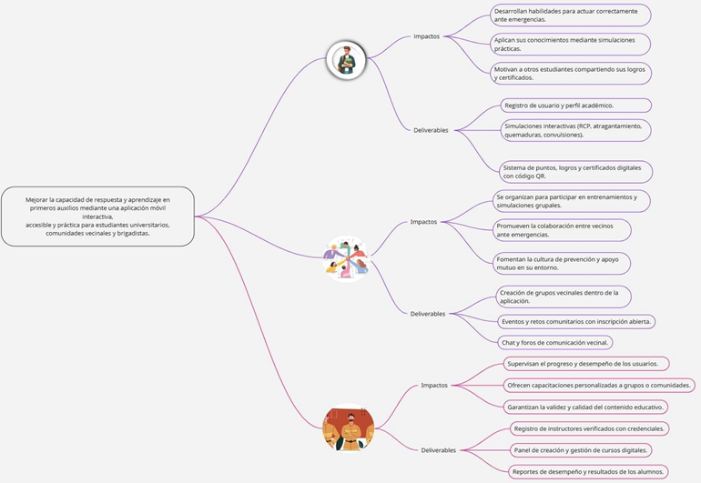
  <p>
    <i><b>Fuente</b>: Elaboración propia.</i>
  </p>
</div>


# 3.2. Product Backlog

<table align="center" border="1" cellpadding="8" cellspacing="0" style="border-collapse: collapse; width: 100%; font-family: Arial, sans-serif;">
    <thead>
        <tr>
            <th align="center"><b>Product Backlog ID</b></th>
            <th align="center"><b>User Story ID</b></th>
            <th align="center"><b>Descripción</b></th>
            <th align="center"><b>Story Points</b></th>
            <th align="center"><b>Priorización MOSCOW</b></th>
        </tr>
    </thead>
    <tbody>
        <!-- EP06 - Captación y conversión de usuarios nuevos (US41 a US45) -->
        <tr>
            <td align="center"><b>PB01</b></td>
            <td align="center">US41</b></td>
            <td>Como visitante y potencial usuario interesado en primeros auxilios, quiero acceder a una Landing Page pública, centralizada y visualmente atractiva para informarme rápida y claramente sobre qué es SafeStep, qué beneficios ofrece y cómo funciona antes de decidir crear una cuenta.</b></td>
            <td align="center">3</b></td>
            <td align="center">M</b></td>
        </tr>
        <tr>
            <td align="center"><b>PB02</b></td>
            <td align="center">US42</b></td>
            <td>Como visitante y potencial usuario interesado en primeros auxilios, quiero un menú de navegación intuitivo que se adapte a mi dispositivo móvil o computadora para poder explorar rápidamente las secciones de la página o acceder a mi cuenta desde cualquier lugar.</b></td>
            <td align="center">3</b></td>
            <td align="center">M</b></td>
        </tr>
        <tr>
            <td align="center"><b>PB03</b></td>
            <td align="center">US43</b></td>
            <td>Como visitante evaluando la plataforma, quiero conocer las características principales y cómo funciona el sistema de gamificación para entender por qué SafeStep es mejor que un curso tradicional en video.</b></td>
            <td align="center">2</b></td>
            <td align="center">M</b></td>
        </tr>
        <tr>
            <td align="center"><b>PB04</b></td>
            <td align="center">US44</b></td>
            <td>Como visitante y potencial usuario, quiero ver ejemplos concretos de las simulaciones disponibles y los productos que venden para asegurarme de que el contenido es relevante para mis necesidades de prevención.</b></td>
            <td align="center">3</b></td>
            <td align="center">M</b></td>
        </tr>
        <tr>
            <td align="center"><b>PB05</b></td>
            <td align="center">US45</b></td>
            <td>Como visitante con dudas sobre la plataforma, quiero leer testimonios de otros usuarios y encontrar respuestas a preguntas comunes para ganar confianza y decidirme a crear una cuenta.</b></td>
            <td align="center">2</b></td>
            <td align="center">M</b></td>
        </tr>
        <!-- EP01 - Autenticación y Dashboard (US01 a US05) -->
        <tr>
            <td align="center"><b>PB06</b></td>
            <td align="center">US01</b></td>
            <td>Como nuevo usuario, quiero registrarme en SafeStep de forma rápida y segura utilizando mi correo electrónico, número de teléfono o cuentas de redes sociales, para crear mi perfil personalizado y comenzar mi aprendizaje en primeros auxilios sin demoras innecesarias.</b></td>
            <td align="center">5</b></td>
            <td align="center">M</b></td>
        </tr>
        <tr>
            <td align="center"><b>PB07</b></td>
            <td align="center">US02</b></td>
            <td>Como usuario registrado, quiero iniciar sesión en SafeStep de forma rápida, segura y sin fricciones, utilizando mis credenciales (correo/contraseña, teléfono/SMS o redes sociales), para acceder a mi dashboard personalizado y continuar mi progreso de aprendizaje sin interrupciones.</b></td>
            <td align="center">3</b></td>
            <td align="center">M</b></td>
        </tr>
        <tr>
            <td align="center"><b>PB08</b></td>
            <td align="center">US03</b></td>
            <td>Como usuario registrado, quiero poder recuperar mi contraseña olvidada de forma rápida, segura y sin complicaciones, utilizando mi correo electrónico o número de teléfono registrado, para restablecer el acceso a mi cuenta sin perder mi progreso de aprendizaje.</b></td>
            <td align="center">2</b></td>
            <td align="center">M</b></td>
        </tr>
        <tr>
            <td align="center"><b>PB09</b></td>
            <td align="center">US04</b></td>
            <td>Como usuario autenticado, quiero acceder a un dashboard principal personalizado que muestre mi progreso de aprendizaje, simulaciones recomendadas, estadísticas clave y accesos rápidos a las funcionalidades más importantes, para tener una visión clara de mi estado actual y poder navegar eficientemente por la plataforma.</b></td>
            <td align="center">5</b></td>
            <td align="center">M</b></td>
        </tr>
        <tr>
            <td align="center"><b>PB10</b></td>
            <td align="center">US05</b></td>
            <td>Como usuario registrado, quiero poder gestionar mi perfil (datos personales, foto, preferencias de aprendizaje, notificaciones y seguridad) desde una sección centralizada, para mantener mi información actualizada, controlar mi privacidad y personalizar mi experiencia en SafeStep según mis necesidades.</b></td>
            <td align="center">5</b></td>
            <td align="center">M</b></td>
        </tr>
        <!-- EP02 - Simulaciones de Emergencias (US06 a US10) -->
        <tr>
            <td align="center"><b>PB11</b></td>
            <td align="center">US06</b></td>
            <td>Como estudiante, quiero practicar un escenario de RCP (Reanimación Cardiopulmonar) básico para aprender a reaccionar correctamente ante un paro cardiorrespiratorio, siguiendo los pasos recomendados por guías internacionales, recibiendo retroalimentación en tiempo real y obteniendo una puntuación que refleje mi nivel de desempeño.</b></td>
            <td align="center">5</b></td>
            <td align="center">M</b></td>
        </tr>
        <tr>
            <td align="center"><b>PB12</b></td>
            <td align="center">US07</b></td>
            <td>Como usuario, quiero practicar cómo reaccionar ante un caso de atragantamiento mediante una simulación interactiva, para aprender a seleccionar y ejecutar las maniobras correctas (Heimlich, golpes en espalda, protocolos para bebés), ganar confianza y saber cómo actuar en una emergencia real.</b></td>
            <td align="center">5</b></td>
            <td align="center">M</b></td>
        </tr>
        <tr>
            <td align="center"><b>PB13</b></td>
            <td align="center">US08</b></td>
            <td>Como usuario, quiero aprender cómo atender una quemadura a través de una simulación interactiva, para comprender los pasos adecuados de primeros auxilios, evitar errores comunes (hielo, cremas caseras) y actuar correctamente ante diferentes grados de lesión (térmicas, químicas, eléctricas).</b></td>
            <td align="center">5</b></td>
            <td align="center">M</b></td>
        </tr>
        <tr>
            <td align="center"><b>PB14</b></td>
            <td align="center">US09</b></td>
            <td>Como miembro de la comunidad, quiero practicar qué hacer durante y después de un sismo para reaccionar con seguridad, proteger mi integridad y la de los demás, y aplicar medidas de primeros auxilios si es necesario, fortaleciendo mi preparación ante emergencias sísmicas.</b></td>
            <td align="center">5</b></td>
            <td align="center">M</b></td>
        </tr>
        <tr>
            <td align="center"><b>PB15</b></td>
            <td align="center">US10</b></td>
            <td>Como usuario, quiero aprender a detener una hemorragia para actuar de forma correcta en emergencias con cortes, aplicando técnicas como presión directa, elevación del miembro afectado y uso de torniquete en casos graves, para salvar vidas mientras llega ayuda profesional.</b></td>
            <td align="center">5</b></td>
            <td align="center">M</b></td>
        </tr>
        <!-- EP03 - Retroalimentación y Aprendizaje Progresivo (US11 a US15) -->
        <tr>
            <td align="center"><b>PB16</b></td>
            <td align="center">US11</b></td>
            <td>Como usuario, quiero recibir retroalimentación inmediata después de cada acción que realizo durante las simulaciones, para comprender rápidamente mis errores, reforzar mis aciertos y mejorar mi desempeño en tiempo real, sin tener que esperar hasta el final de la simulación.</b></td>
            <td align="center">3</b></td>
            <td align="center">M</b></td>
        </tr>
        <tr>
            <td align="center"><b>PB17</b></td>
            <td align="center">US12</b></td>
            <td>Como usuario, quiero recibir sugerencias de temas en los que fallé durante las simulaciones, para reforzar mi aprendizaje y mejorar mis conocimientos en primeros auxilios de manera progresiva y personalizada, enfocándome en mis áreas débiles sin perder tiempo en contenido que ya domino.</b></td>
            <td align="center">5</b></td>
            <td align="center">S</b></td>
        </tr>
        <tr>
            <td align="center"><b>PB18</b></td>
            <td align="center">US13</b></td>
            <td>Como usuario, quiero visualizar mi progreso mediante gráficos e indicadores visuales claros y atractivos, para conocer mi avance en los distintos módulos de primeros auxilios, identificar rápidamente mis fortalezas y debilidades, y mantenerme motivado para seguir aprendiendo y mejorando.</b></td>
            <td align="center">5</b></td>
            <td align="center">S</b></td>
        </tr>
        <tr>
            <td align="center"><b>PB19</b></td>
            <td align="center">US14</b></td>
            <td>Como usuario, quiero recibir pequeñas lecciones diarias de primeros auxilios (micro-lecciones) para mantener mis conocimientos actualizados, reforzar lo aprendido y conservar una rutina constante de práctica incluso cuando no realizo simulaciones completas, de manera rápida y sin necesidad de invertir mucho tiempo.</b></td>
            <td align="center">5</b></td>
            <td align="center">S</b></td>
        </tr>
        <tr>
            <td align="center"><b>PB20</b></td>
            <td align="center">US15</b></td>
            <td>Como estudiante, quiero rendir una evaluación final por módulo que integre todos los temas aprendidos, para validar mi aprendizaje de manera integral, obtener una certificación que acredite mis conocimientos y recibir retroalimentación detallada sobre mi desempeño.</b></td>
            <td align="center">5</b></td>
            <td align="center">S</b></td>
        </tr>
        <!-- EP04 - Comercio Electrónico (US16 a US30) -->
        <tr>
            <td align="center"><b>PB21</b></td>
            <td align="center">US16</b></td>
            <td>Como usuario registrado, quiero visualizar un catálogo completo de productos de primeros auxilios (torniquetes, botiquines, mochilas de emergencia, etc.) organizado por categorías, para explorar fácilmente los materiales disponibles y decidir qué comprar según mis necesidades.</b></td>
            <td align="center">3</b></td>
            <td align="center">M</b></td>
        </tr>
        <tr>
            <td align="center"><b>PB22</b></td>
            <td align="center">US17</b></td>
            <td>Como usuario, quiero filtrar y buscar productos específicos dentro del catálogo utilizando criterios como categoría, rango de precio, calificación y disponibilidad, para encontrar rápidamente el material de primeros auxilios que necesito.</b></td>
            <td align="center">5</b></td>
            <td align="center">S</b></td>
        </tr>
        <tr>
            <td align="center"><b>PB23</b></td>
            <td align="center">US18</b></td>
            <td>Como usuario, quiero acceder a una página de detalle de cada producto que incluya información completa (descripción ampliada, especificaciones, imágenes adicionales, opiniones de otros compradores y disponibilidad de stock), para tomar una decisión informada antes de agregar el artículo a mi carrito.</b></td>
            <td align="center">3</b></td>
            <td align="center">S</b></td>
        </tr>
        <tr>
            <td align="center"><b>PB24</b></td>
            <td align="center">US19</b></td>
            <td>Como usuario, quiero agregar productos al carrito de compras desde el catálogo o desde la vista detallada, seleccionando la cantidad deseada, para acumular los artículos que deseo adquirir antes de proceder al pago, de manera rápida y sin perder mi sesión de navegación.</b></td>
            <td align="center">3</b></td>
            <td align="center">M</b></td>
        </tr>
        <tr>
            <td align="center"><b>PB25</b></td>
            <td align="center">US20</b></td>
            <td>Como usuario, quiero poder modificar las cantidades de los productos agregados al carrito o eliminar aquellos que ya no deseo comprar, para tener control total sobre mi selección de compra antes de proceder al pago.</b></td>
            <td align="center">3</b></td>
            <td align="center">S</b></td>
        </tr>
        <tr>
            <td align="center"><b>PB26</b></td>
            <td align="center">US21</b></td>
            <td>Como usuario, quiero visualizar un resumen claro de mi compra (productos, cantidades, subtotal, envío e impuestos) antes de proceder al pago, y poder calcular el costo de envío según mi ubicación, para conocer el monto total a pagar.</b></td>
            <td align="center">5</b></td>
            <td align="center">M</b></td>
        </tr>
        <tr>
            <td align="center"><b>PB27</b></td>
            <td align="center">US22</b></td>
            <td>Como usuario, quiero realizar el pago de mi compra de forma segura utilizando múltiples métodos de pago (tarjeta de crédito/débito, transferencia bancaria o billetera digital), para completar mi transacción con confianza, protegiendo mis datos financieros.</b></td>
            <td align="center">8</b></td>
            <td align="center">M</b></td>
        </tr>
        <tr>
            <td align="center"><b>PB28</b></td>
            <td align="center">US23</b></td>
            <td>Como usuario frecuente, quiero guardar múltiples direcciones de envío (casa, trabajo, domicilio de un familiar) en mi perfil, para agilizar el proceso de compra y seleccionar rápidamente la dirección deseada sin tener que escribir los datos cada vez.</b></td>
            <td align="center">3</b></td>
            <td align="center">S</b></td>
        </tr>
        <tr>
            <td align="center"><b>PB29</b></td>
            <td align="center">US24</b></td>
            <td>Como usuario, quiero consultar el historial completo de mis pedidos realizados en SafeStep y ver el estado actual de cada uno (confirmado, en preparación, enviado, entregado), para hacer seguimiento a mis compras y tener un registro de mis transacciones anteriores.</b></td>
            <td align="center">5</b></td>
            <td align="center">S</b></td>
        </tr>
        <tr>
            <td align="center"><b>PB30</b></td>
            <td align="center">US25</b></td>
            <td>Como usuario, quiero poder cancelar un pedido antes de que sea enviado o solicitar la devolución de un producto después de recibirlo, para tener flexibilidad en mis compras y garantizar mi satisfacción en caso de arrepentimiento o producto defectuoso.</b></td>
            <td align="center">8</b></td>
            <td align="center">C</b></td>
        </tr>
        <tr>
            <td align="center"><b>PB31</b></td>
            <td align="center">US26</b></td>
            <td>Como usuario, quiero aplicar cupones de descuento y aprovechar promociones especiales durante el proceso de compra, para obtener beneficios económicos en mis pedidos y sentirme incentivado a seguir comprando en SafeStep.</b></td>
            <td align="center">5</b></td>
            <td align="center">C</b></td>
        </tr>
        <tr>
            <td align="center"><b>PB32</b></td>
            <td align="center">US27</b></td>
            <td>Como usuario, quiero calificar y escribir reseñas sobre los productos que he comprado, para compartir mi experiencia con otros miembros de la comunidad SafeStep y ayudarles a tomar mejores decisiones de compra.</b></td>
            <td align="center">5</b></td>
            <td align="center">C</b></td>
        </tr>
        <tr>
            <td align="center"><b>PB33</b></td>
            <td align="center">US28</b></td>
            <td>Como usuario, quiero recibir recomendaciones de productos basadas en mi historial de simulaciones y áreas de mejora, para adquirir materiales que complementen mi aprendizaje práctico y me ayuden a estar mejor preparado ante emergencias reales según los escenarios que he practicado.</b></td>
            <td align="center">8</b></td>
            <td align="center">C</b></td>
        </tr>
        <tr>
            <td align="center"><b>PB34</b></td>
            <td align="center">US29</b></td>
            <td>Como usuario, quiero comprar kits de emergencia pre-armados según el tipo de riesgo (sismo, incendio, RCP, accidentes domésticos), para adquirir de forma rápida y sencilla todos los materiales necesarios para una preparación completa sin tener que seleccionar producto por producto.</b></td>
            <td align="center">5</b></td>
            <td align="center">C</b></td>
        </tr>
        <tr>
            <td align="center"><b>PB35</b></td>
            <td align="center">US30</b></td>
            <td>Como usuario, quiero recibir notificaciones push y por correo electrónico sobre ofertas especiales, descuentos por tiempo limitado y productos con stock bajo que sean de mi interés, para aprovechar oportunidades de compra y no quedarme sin productos importantes.</b></td>
            <td align="center">5</b></td>
            <td align="center">W</b></td>
        </tr>
        <!-- EP05 - Gamificación y Recompensas (US31 a US40) -->
        <tr>
            <td align="center"><b>PB36</b></td>
            <td align="center">US31</b></td>
            <td>Como usuario, quiero ganar puntos de experiencia (XP) por cada actividad que realizo en SafeStep (simulaciones, micro-lecciones, evaluaciones, participación comunitaria), para ver mi progreso reflejado numéricamente, subir de nivel y sentirme motivado a seguir aprendiendo.</b></td>
            <td align="center">5</b></td>
            <td align="center">S</b></td>
        </tr>
        <tr>
            <td align="center"><b>PB37</b></td>
            <td align="center">US32</b></td>
            <td>Como usuario, quiero desbloquear insignias y logros al alcanzar hitos específicos en mi aprendizaje (completar módulos, mantener rachas, obtener altas calificaciones, participar en eventos), para sentirme reconocido por mis logros, coleccionar trofeos virtuales y compartir mis avances con la comunidad.</b></td>
            <td align="center">5</b></td>
            <td align="center">S</b></td>
        </tr>
        <tr>
            <td align="center"><b>PB38</b></td>
            <td align="center">US33</b></td>
            <td>Como usuario, quiero mantener una racha de práctica diaria (streak) en SafeStep, para desarrollar el hábito de aprender primeros auxilios de manera constante, recibir recompensas por mi consistencia y sentirme motivado a no romper mi cadena de días consecutivos de aprendizaje.</b></td>
            <td align="center">3</b></td>
            <td align="center">S</b></td>
        </tr>
        <tr>
            <td align="center"><b>PB39</b></td>
            <td align="center">US34</b></td>
            <td>Como usuario, quiero ver una tabla de líderes que compare mi progreso (XP, nivel, racha, logros) con el de mis amigos y con la comunidad global de SafeStep, para fomentar una competencia saludable, motivarme a mejorar mis hábitos de aprendizaje y celebrar los logros de otros usuarios.</b></td>
            <td align="center">8</b></td>
            <td align="center">S</b></td>
        </tr>
        <tr>
            <td align="center"><b>PB40</b></td>
            <td align="center">US35</b></td>
            <td>Como usuario, quiero ganar monedas virtuales (SafeCoins) al completar actividades y canjearlas en una tienda virtual por artículos cosméticos (avatares, temas, efectos) o beneficios reales (descuentos en productos físicos), para sentir que mi esfuerzo tiene recompensas tangibles y personalizar mi experiencia en SafeStep.</b></td>
            <td align="center">8</b></td>
            <td align="center">S</b></td>
        </tr>
        <tr>
            <td align="center"><b>PB41</b></td>
            <td align="center">US36</b></td>
            <td>Como usuario, quiero recibir misiones y desafíos diarios y semanales (completar ciertas simulaciones, ganar XP, ayudar en el foro, etc.), para tener objetivos claros a corto plazo, sentirme motivado diariamente y recibir recompensas adicionales por completarlos.</b></td>
            <td align="center">5</b></td>
            <td align="center">C</b></td>
        </tr>
        <tr>
            <td align="center"><b>PB42</b></td>
            <td align="center">US37</b></td>
            <td>Como miembro de la comunidad, quiero participar en eventos y torneos organizados por SafeStep (competencias por equipos, desafíos de velocidad, retos de conocimiento), para competir con otros usuarios en un ambiente divertido, ganar recompensas exclusivas y sentirme parte de una comunidad activa.</b></td>
            <td align="center">13</b></td>
            <td align="center">C</b></td>
        </tr>
        <tr>
            <td align="center"><b>PB43</b></td>
            <td align="center">US38</b></td>
            <td>Como usuario avanzado, quiero alcanzar niveles de prestigio después de superar el nivel máximo estándar, para seguir teniendo metas a largo plazo, desbloquear contenido exclusivo y demostrar mi maestría en primeros auxilios a la comunidad.</b></td>
            <td align="center">8</b></td>
            <td align="center">C</b></td>
        </tr>
        <tr>
            <td align="center"><b>PB44</b></td>
            <td align="center">US39</b></td>
            <td>Como usuario, quiero personalizar mi perfil con avatares, marcos, fondos y temas exclusivos que puedo desbloquear mediante logros, comprar en la tienda virtual o ganar en eventos, para expresar mi identidad única dentro de SafeStep y mostrar mi estilo personal a la comunidad.</b></td>
            <td align="center">5</b></td>
            <td align="center">C</b></td>
        </tr>
        <tr>
            <td align="center"><b>PB45</b></td>
            <td align="center">US40</b></td>
            <td>Como usuario, quiero recibir retroalimentación visual y auditiva cuando alcanzo un hito importante (subir de nivel, desbloquear insignia, completar racha), para sentirme celebrado y reconocido, reforzando positivamente mi comportamiento de aprendizaje y motivándome a seguir practicando.</b></td>
            <td align="center">3</b></td>
            <td align="center">C</b></td>
        </tr>
        <!-- EP07 - Seguridad, Estabilidad y Rendimiento de la Plataforma (US46 a US50) -->
        <tr>
            <td align="center"><b>PB46</b></td>
            <td align="center">US46</b></td>
            <td>Como desarrollador, quiero implementar un sistema de inicio de sesión seguro que mantenga la sesión del usuario activa, para proteger sus datos personales y evitar que tenga que ingresar su correo y contraseña cada vez que entra a la plataforma.</b></td>
            <td align="center">5</b></td>
            <td align="center">M</b></td>
        </tr>
        <tr>
            <td align="center"><b>PB47</b></td>
            <td align="center">US47</b></td>
            <td>Como desarrollador, quiero automatizar la revisión del código y la publicación de nuevas versiones, para asegurar que no se introduzcan errores cuando agregamos nuevas funciones y para que las actualizaciones lleguen más rápido a los usuarios.</b></td>
            <td align="center">5</b></td>
            <td align="center">M</b></td>
        </tr>
        <tr>
            <td align="center"><b>PB48</b></td>
            <td align="center">US48</b></td>
            <td>Como administrador, quiero configurar copias de seguridad automáticas y garantizar que la plataforma siempre esté en línea, para no perder el progreso ni las compras de los usuarios ante cualquier falla del servidor.</b></td>
            <td align="center">5</b></td>
            <td align="center">M</b></td>
        </tr>
        <tr>
            <td align="center"><b>PB49</b></td>
            <td align="center">US49</b></td>
            <td>Como desarrollador, quiero un sistema que registre los errores ocultos de la plataforma y me avise en tiempo real, para poder investigar y solucionar los problemas antes de que los usuarios se quejen o abandonen la página.</b></td>
            <td align="center">3</b></td>
            <td align="center">M</b></td>
        </tr>
        <tr>
            <td align="center"><b>PB50</b></td>
            <td align="center">US50</b></td>
            <td>Como desarrollador, quiero optimizar el tiempo que tardan en cargar las páginas y limitar las acciones repetitivas masivas, para que la plataforma sea muy rápida y esté protegida contra ataques informáticos o saturación por exceso de visitantes.</b></td>
            <td align="center">3</b></td>
            <td align="center">M</b></td>
        </tr>
    </tbody>
</table>

<br>
<br>

<div align="center">
    
</div>

<br>
<br>

# 4.1. Style Guidelines

## 4.1.1. General Style Guidelines

### 4.1.1.1. Branding

El branding de SafeStep se fundamenta en la misión de salvar vidas a través de la educación en primeros auxilios. La marca busca transmitir confiabilidad, accesibilidad y profesionalismo, sin ser intimidante para el usuario común que busca aprender. A continuación se detallan los elementos fundamentales de la marca SafeStep.

#### Nombre de la Marca

**SafeStep** es una marca compuesta que transmite seguridad y progreso. El prefijo "Safe" (seguro en inglés) hace referencia inmediata a la seguridad, protección y primeros auxilios, mientras que "Step" (paso en inglés) representa el aprendizaje progresivo y los pasos concretos que debe seguir el usuario para estar preparado ante una emergencia. La combinación transmite el mensaje de que cada pequeño paso en el aprendizaje contribuye a sentirse más seguro y preparado para proteger a quienes lo rodean.

#### Logotipo

El logotipo de SafeStep consiste en un ícono representativo combinado con el nombre de la marca. El ícono principal es un corazón con un signo de más (+) integrado, que hace referencia clara al primer auxilios y a la atención médica de emergencia. Este ícono está encerrado en un escudo o círculo que representa protección. El nombre "SafeStep" se presenta en tipografía limpia y moderna, utilizando la fuente Poppins en versión bold para destacar. El color del ícono combina con el color primario de la paleta establecida, creando una identidad visual coherente y reconocible.

<div align="center">
  <p>
    <b>Gráfico</b>: Logo de SafeStep
  </p>
  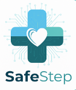
  <p>
    <i><b>Fuente</b>: Elaboración propia.</i>
  </p>
</div>

#### Eslogan

El slogan principal de SafeStep es "Aprende a salvar vidas, un paso a la vez". Este slogan refleja la metodología progresiva de la plataforma, donde el usuario avanza gradualmente a través de módulos y lecciones estructuradas, ganando confianza y conocimientos en cada etapa. También transmite que el aprendizaje de primeros auxilios es accesible para cualquier persona, sin importar su edad o formación previa.

#### Valores de Marca

SafeStep se basa en los siguientes valores fundamentales que guían todas las decisiones de diseño y comunicación:

1. **Accesibilidad**: Todo contenido y funcionalidad debe ser comprensible para cualquier usuario, independientemente de su nivel educativo o experiencia tecnológica. La plataforma evita tecnicismos innecesarios y presenta la información de manera clara y concisa.

2. **Confiabilidad**: El contenido de SafeStep está validado por profesionales de la salud y basado en protocolos internacionales de primeros auxilios. El diseño transmite seriedad y profesionalismo sin ser intimidante.

3. **Empoderamiento**: Cada elemento de la experiencia busca hacer sentir al usuario que puede aprender y que está capacitado para actuar en una emergencia. El diseño refuerza la autoconfianza a través de retroalimentación positiva y progresión clara.

4. **Humanidad**: La plataforma mantiene un tono cálido y empático, reconociendo que las emergencias son situaciones sensibles. Los mensajes y elementos visuales equilibran la seriedad del tema con esperanza y apoyo.

5. **Innovación**: SafeStep utiliza tecnología moderna para hacer el aprendizaje más efectivo y accesible. El diseño refleja innovación sin sacrificar la claridad.

#### Personalidad de Marca

La personalidad de SafeStep se define en el espectro entre varios ejes comunicacionales:

- **Serio pero accesible**: El contenido de primeros auxilios es serio y representa situaciones críticas. Sin embargo, el tono no debe ser alarmista ni aterrador. Se transmite urgencia educando sin intimidar. El lenguaje es directo pero cálido, profesional pero cercano.

- **Educativo sin ser aburrido**: El aprendizaje de primeros auxilios puede ser interesante y hasta entretenido cuando se presenta de manera interactiva. SafeStep evita el tono de conferencias tradicionales, trae vida a conceptos que podrían ser secs y monótonos a través de casos reales, ejemplos prácticos y elementos de gamificación.

- **Profesional sin ser impersonal**: A diferencia de aplicaciones informales, SafeStep mantiene estándares profesionales en su contenido. Sin embargo, la comunicación no es frívola ni excesivamente corporativa. El usuario siente que está siendo guiado por expertos que genuinamente se preocupan por su bienestar.

- **Entusiasta pero Enfocado**: El entusiasmo de SafeStep por enseñar y por el progreso del usuario es evidente. Sin embargo, no es superficial ni distraído. Cada elemento tiene un propósito claro y contribuye al objetivo fundamental de preparar personas para actuar en emergencias.

### 4.1.1.2. Typography

El sistema tipográfico de SafeStep establece una jerarquía clara que guía al usuario a través del contenido, enfatizando la información más importante mientras mantiene la legibilidad en todos los tamaños de pantalla y dispositivos.

#### Familia Tipográfica Principal

SafeStep utiliza dos familias tipográficas complementarias que trabajan juntas para crear una jerarquía visual efectiva:

1. **Poppins** (Sans-serif): Utilizada para títulos, encabezados y elementos que requieren impacto visual. Es una fuente geométrica moderna con excelente legibilidad en pantallas. Su versión Bold transmite confianza y determinación apropiadas para el tono de la marca.

2. **Inter** (Sans-serif): Utilizada para el cuerpo de texto y contenido general. Es una fuente altamente legible diseñada específicamente para interfaces de usuario. Su diseño neutro complementa Poppins sin competir por atención.

<div align="center">
  <p>
    <b>Gráfico</b>: Tipografía utilizada
  </p>
  
  <p>
    <i><b>Fuente</b>: Elaboración propia.</i>
  </p>
</div>

#### Jerarquía Tipográfica

La jerarquía tipográfica de SafeStep se organiza en varios niveles, cada uno con tamaños y pesos específicos:

- **Display (Títulos principales)**: Poppins Bold, 48-64px. Utilizado para títulos de página y encabezados de hero sections. Este nivel tiene el mayor impacto visual y guía la atención inicial del usuario.

- **H1 (Títulos de sección)**: Poppins SemiBold, 32-36px. Utilizado para títulos de secciones principales dentro de las páginas. Establece la estructura visual del contenido.

- **H2 (Subtítulos)**: Poppins Medium, 24-28px. Utilizado para subtítulos que dividen contenido en secciones más pequeñas. Permite escaneo rápido del contenido.

- **H3 (Títulos menores)**: Poppins Medium, 20px. Utilizado para títulos dentro de secciones específicas. Ayuda a organizar información relacionada.

- **Cuerpo (Texto general)**: Inter Regular, 16px con interlineado de 1.5. El tamaño base para todo el contenido de texto que no requiere énfasis especial. El interlineado generoso mejora la legibilidad en textos más largos.

- **Cuerpo pequeno (Texto secundario)**: Inter Regular, 14px. Utilizado para información de soporte, metadatos y descripciones adicionales.

- **Botones y acciones**: Poppins SemiBold, 14-16px. Utilizado para texto dentro de botones y elementos de llamada a la acción. El peso semi-bold asegura que el texto sea legible incluso en botones pequeños.

- **Labels**: Inter Medium, 12-14px. Utilizado para etiquetas de formularios y campos de entrada. El tamaño pequeño pero legible economiza espacio.

#### Espaciado y Ritmo Tipográfico

El sistema tipográfico de SafeStep sigue un ritmo vertical consistente que crea una experiencia visual armoniosa:

- El espaciado entre líneas de texto (interlineado) es 1.5x el tamaño de fuente para cuerpo principal
- El espaciado entre párrafos es 1.5x el tamaño de fuente
- Los títulos tienen espaciado inferior mayor que el espaciado superior para crear separación visual clara
- El espaciado entre letras (tracking) está ligeramente incrementado en títulos para mayor claridad
- Los títulos en mayúsculas utilizan tracking aún mayor (+0.05em)

### 4.1.1.3. Color Palette

La paleta de colores de SafeStep está diseñada para comunicar los valores de la marca mientras mantiene la accesibilidad y funcionalidad. Cada color tiene un propósito específico en la experiencia del usuario.

#### Esquema de Color Primario

El esquema de color primario de SafeStep transmite seguridad, confianza y accesibilidad:

1. **Primary Blue (#0ea5e9 - Sky 500)**

   El azul primario de SafeStep representa confianza, profesionalismo y seguridad. Es el color principal utilizado para botones primarios, enlaces importantes, iconos de navegación y elementos que requieren atención. Su tono medio-azul es lo suficientemente serio para transmitir profesionalismo pero lo suficientemente cálido para no ser fría o distante. Este color se usa consistentemente para:
   - Botones principales de llamada a la acción
   - Iconos y elementos decorativos principales
   - Resaltado de enlaces y navegación activa
   - Elementos interactivos primarios

2. **Primary Dark (#0284c7 - Sky 600)**

   Una versión más oscura del azul primario para estados hover y énfasis. Mantiene la misma tonalidad pero con mayor contraste para mejor visibilidad en interactive elements.

3. **Primary Light (#38bdf8 - Sky 400)**

   Una versión más clara para fondos sutiles, highlights y elementos que requieren suavidad visual.

#### Esquema de Color secundario

El esquema secundario complementa el primario con opciones para diferentes estados y contextos:

1. **Safe Green (#22c55e - Green 500)**

   El verde de SafeStep representa éxito y seguridad. Se utiliza para:
   - Indicadores de éxito y seguridad
   - Estados de completado en progresiones
   - Insignias y recompensas de gamificación
   - Iconos de verificación

2. **Safe Green Dark (#16a34a - Green 600)**

   Versión más oscura del verde para estados hover en elementos verdes.

#### Esquema de Color de Alerta

Los colores de alerta comunican el estado y urgencia appropriately:

1. **Warning Orange (#f97316 - Orange 500)**

   Naranja para advertencias y atención moderada. Utilizado para:
   - Alertas informativas
   - Estados de progreso lentos
   - Iconos de precaución

2. **Danger Red (#ef4444 - Red 500)**

   Rojo para errores, acciones peligrosas y emergencias. Se usa con moderación y con instrucciones claras:
   - Mensajes de error en formularios
   - Indicadores de emergencia en simulaciones
   - Advertencias de seguridad críticas

#### Paleta de Colores Neutral

Los colores neutrales crean el fondo y estructura visual:

1. **White (#ffffff)**
   Color de fondo primario para tarjetas y secciones de contenido.

2. **Gray 50 (#f9fafb)**
   Fondo general de la página, especialmente en secciones de contenido.

3. **Gray 100 (#f3f4f6)**
   Fondo de secciones alternativas y separadores.

4. **Gray 200 (#e5e7eb)**
   Bordes y divisores sutiles.

5. **Gray 300 (#d1d5db)**
   Bordes de mayor contraste.

6. **Gray 400 (#9ca3af)**
   Iconos deshabilitados y texto de menor jerarquía.

7. **Gray 500 (#6b7280)**
   Texto secundario.

8. **Gray 600 (#4b5563)**
   Texto de menor jerarquía en headers.

9. **Gray 700 (#374151)**
   Cuerpo de texto secundario.

10. **Gray 800 (#1f2937)**
    Texto en fondos claros, títulos menores.

11. **Gray 900 (#111827)**
    Texto principal en fondos claros.

12. **Black (#000000)**
    Para texto en fondos claros cuando se requiera máximo contraste.

#### Uso de Color en la Interfaz

El sistema de color de SafeStep sigue principios de uso consistente:

- El color nunca es el único medio para transmitir información
- Los estados de interactive elements se comunican a través de múltiples señales (color, forma, movimiento)
- El contraste se verifica para cumplir WCAG AA mínimo
- Los colores se prueban en diferentes condiciones de iluminación y dispositivos

### 4.1.1.4. Spacing System

El sistema de espaciado de SafeStep establece una red consistente que crea orden visual y guía el flujo natural del usuario a través del contenido.

#### Base de Espaciado

El sistema de espaciado de SafeStep se basa en una escala de múltiplos de 4:

- **4px (0.25rem)**: Espaciado mínimo para elementos muy juntos
- **8px (0.5rem)**: Espaciado pequeño entre elementos relacionados
- **12px (0.75rem)**: Espaciado entre elementos en el mismo grupo
- **16px (1rem)**: Espaciado base para separación de componentes
- **24px (1.5rem)**: Espaciado entre grupos de contenido
- **32px (2rem)**: Espaciado entre secciones
- **48px (3rem)**: Espaciado grande entre secciones
- **64px (4rem)**: Espaciado máximo entre secciones principales
- **96px (6rem)**: Espaciado hero para acciones mayores

#### Sistema de Grid

SafeStep utiliza un sistema de grid flexible que se adapta a diferentes tamaños de pantalla:

- **Grid de 12 columnas**: Utilizado para layouts principales en desktop
- **Gutter de 24px**: Separación estándar entre columnas
- **Margen horizontal de 24-48px**: Según el ancho de pantalla
- **Container máximo de 1280px**: Ancho máximo de contenido en desktop

#### Espaciado en Componentes

Cada componente tiene espaciado interno definido:

- **Botones**: Padding vertical de 12-16px, horizontal de 16-24px
- **Tarjetas**: Padding de 24px en desktop, 16px en móvil
- **Inputs**: Padding de 12px vertical, 16px horizontal
- **Listas**: Padding de 12-16px por item
- **Navegación**: Padding de 8-12px por item

#### Espaciado Responsivo

El sistema de espaciado se adapta según el dispositivo:

- **Desktop (>1024px)**: Espaciado completo de la escala
- **Tablet (768-1024px)**: Reducción del 75% del espaciado base
- **Mobile (<768px)**: Reducción del 50% del espaciado base, ajuste a múltiplos de 4

### 4.1.1.5. Design System de Referencia

SafeStep toma como referencia varios design systems establecidos, adaptándolos a las necesidades específicas de la plataforma. El sistema de Tailwind CSS proporciona la base técnica, mientras que principios de Material Design y sistemas propios informan las decisiones de interacción.

#### Tailwind CSS como Base Técnica

SafeStep utiliza Tailwind CSS para la implementación del diseño system. Los colores, tipografía, espaciado y componentes se definen en la configuración de Tailwind, permitiendo:

- Consistencia en valores a través de la aplicación
- Desarrollo rápido con clases utilitarias
- Personalización centralizada en un solo archivo de configuración
- Facilidad para adicionar nuevos valores

#### Principios de Diseño UI

Más allá de la implementación técnica, SafeStep sigue principios de diseño UI probados:

- **Jerarquía visual clara**: El usuario sabe dónde mirar primero
- **Consistencia**: Elementos similares se ven y comportan de manera similar
- **Feedback**: Toda acción tiene respuesta visual
- **Affordance evidente**: Los elementos muestran cómo usarse
- **Accesibilidad**: La interfaz funciona para todos

### 4.1.2. Web Style Guidelines

### 4.1.2.1. Responsive Design Principles

Los principios de diseño responsivo de SafeStep aseguran que la experiencia sea óptima en cualquier dispositivo, desde monitores grandes hasta teléfonos móviles.

#### Mobile-First Approach

SafeStep sigue un enfoque mobile-first, donde el diseño comienza optimizado para pantallas pequeñas y luego se expande para pantallas más grandes. Este enfoque asegura que:

- El contenido esencial siempre es visible y accesible
- Los elementos táctiles tienen tamaño adecuado (mínimo 44x44px)
- La experiencia móvil es funcional y completa
- Las versiones de escritorio son enhancement, no una adaptación obligatoria

#### Breakpoints Established

SafeStep define los siguientes breakpoints para su diseño responsivo:

- **Mobile**: 0-639px (celulares horizontales)
- **Mobile Large**: 640-767px (teléfonos grandes, tablets pequeñas en portrait)
- **Tablet**: 768-1023px (tablets en landscape)
- **Desktop**: 1024-1279px (laptops, monitores pequeños)
- **Desktop Large**: 1280px+ (monitores estándar y grandes)

#### Fluid Typography

La tipografía de SafeStep escala fluidamente entre breakpoints, utilizando:

- Viewport units para tamaños de fuente principales
- Clamp() para límites mínimos y máximos
- Escalas proporcionales entre tamaños de pantalla

### 4.1.2.2. Web Component States

Los componentes de SafeStep comunican claramente sus estados a través de señales visuales múltiples:

#### Estados interactivos

1. **Default**: Estado base del componente
   - Fondo y color definidos por tipo
   - Borde estándar
   - Sin efectos adicionales

2. **Hover**: Estado cuando el cursor está sobre el elemento
   - Color de fondo cambiado (más claro u oscuro)
   - Cursor de puntero
   - Transición suave (200-300ms)

3. **Active/Pressed**: Estado cuando el elemento está siendo activado
   - Color de fondo más oscuro
   - Escala ligeramente reducida (0.98)
   - Sin transición adicional

4. **Focus**: Estado cuando el elemento tiene foco (teclado)
   - Anillo de foco visible (2-4px)
   - Color del anillo contrastante
   - No visible con mouse pero accesible con teclado

5. **Disabled**: Estado cuando la interacción no está disponible
   - Opacidad reducida (50-60%)
   - Cursor de "no permitido"
   - Eliminar interactividad

### 4.1.2.3. Form Elements

Los elementos de formulario de SafeStep siguen patrones consistentes:

#### Input Fields

- Altura mínima de 44px para facilidad táctil
- Bordes visibles que indican el área de interacción
- Labels claramente asociados
- Mensajes de error appear debajo del campo
- Estados de focus y error claramente diferenciados

#### Buttons

- **Primary**: Fondo azul primario, texto blanco
- **Secondary**: Fondo transparente, borde primario, texto primario
- **Danger**: Fondo rojo, texto blanco
- **Ghost**: Fondo transparente, texto primario, sin borde
- Todos con altura mínima de 44px y padding horizontal de 16px

#### Selects y Dropdowns

- Diseño consistente con inputs de texto
- Indicadores visuales de que es un elemento desplegable
- Opciones visibles al abrir

### 4.1.2.4. Navigation Patterns

Los patrones de navegación de SafeStep optimizan la experiencia del usuario:

#### Global Navigation

- Visible en todas las páginas
- Incluye logo, menú principal y acciones de usuario
- Fija en la parte superior en desktop
- Collapsible en mobile

#### Secondary Navigation

- Breadcrumbs para profundidad de navegación
- Utilizado en secciones con sub-páginas
- Indica claramente la ubicación actual

#### Footer

- Enlaces de utilidad (about, contacto, términos)
- Redes sociales
- Información legal
-links adicionales de ayuda

### 4.1.2.5. Accessibility Guidelines

SafeStep cumple con estándares de accesibilidad WCAG nivel AA como mínimo:

#### Keyboard Navigation

- Todos los elementos interactivos son accesibles por teclado
- El orden de tabulación es lógico
- Los atajos de teclado no interfieren con los del navegador
- El foco es claramente visible

#### Screen Reader Support

- HTML semántico (headings, landmarks, labels)
- ARIA labels donde es necesario
- Imágenes con texto alternativo
- Formularios completamente etiquetados

#### Visual Accessibility

- Contraste mínimo de 4.5:1 para texto
- Contraste mínimo de 3:1 para elementos UI grandes
- No depender solo de color para transmitir información
- Los estados son diferenciables

### 4.1.2.6. Animation Guidelines

Las animaciones de SafeStep mejoran la experiencia sin distraer mucho:

#### Purpose of Animations

- feedback de interacción (el sistema responde a acciones del usuario)
- Orientación espacial (el usuario entiende cambios de contexto)
- Estados de carga (comunican que el sistema está trabajando)
- Énfasis (atraen la atención a elementos importantes)

#### Animation Principles

- Duración breve: 150-300ms para la mayoría de transiciones
- Curvas de easing naturales (ease-out para entrada, ease-in-out para cambios de estado)
- Evitar animaciones que duran más de 500ms para interacciones frecuentes
- Permitir reducción de movimiento a través de prefers-reduced-motion

#### Micro-interactions

- Hover states en botones y enlaces
- Transiciones de color suave
- Efectos de presión (escala reducida) en buttons
- Pull-to-refresh en mobile

# 4.2. Information Architecture

## 4.2.1. Organization Systems

### 4.2.1.1. Organización del Landing Page

El Landing Page de SafeStep sirve como punto de entrada principal para visitantes que descubren la plataforma por primera vez. Su organización está diseñada para guiar al usuario a través de un viaje de descubrimiento y conversión desde el primer momento.

#### Estructura Jerárquica en el Landing Page

La organización del Landing Page sigue una jerarquía visual clara que refleja el proceso mental del visitante:

1. **Nivel 1 - Header de Impacto**: El hero section presenta el valor principal de SafeStep de manera inmediata. El visitante entiende en qué consiste la plataforma en maximal 3 segundos de visualización. Esta sección incluye el título principal, subtítulo explicativo y llamadas a la acción primarias.

2. **Nivel 2 - Beneficios Clave**: Inmediatamente después, se presentan las características principales de SafeStep en formato de tarjetas visuales. Esta sección está organizada de manera secuencial (step-by-step) para guiar al visitante a través del proceso de comprensión: qué problema resuelve SafeStep, cómo lo resuelve, y qué beneficio obtiene el usuario.

3. **Nivel 3 - Detalles y Pruebas**: Las secciones siguientes profundizan en características específicas, testimonios y pruebas sociales. Esta información está organizada por tópicos (simulaciones, gamificación, tienda, certificaciones).

4. **Nivel 4 - Footer y Navegación Adicional**: El footer proporciona navegación secundaria, enlaces legales y opciones de contacto organizadas por función (soporte, empresa, legal).

#### Principios de Organización Aplicados

La organización del Landing Page aplica los siguientes principios específicos:

- **Jerarquía visual estricto**: Cada nivel de contenido tiene importancia visual claramente diferenciada. El usuario escanea naturalmente de arriba abajo y de izquierda a derecha, siguiendo la jerarquía establecida.

- **Progresión lógica**: Las secciones progress logically desde el "qué es" hasta el "cómo usarlo" y finalmente "por qué confiar". Esta narrativa sigue la estructura de cualquier proceso de decisión.

- **Agrupación por función**: Elementos relacionados se mantienen juntos. Características similares comparten secciones, testimonios se agrupan con las secciones que respalda.

- **Jerarquía de tres**: Nunca hay más de tres niveles de subdivisión por sección, evitando sobrecarga cognitiva.

### 4.2.1.2. Organización de la Aplicación Web (Dashboard y Área Principal)

La aplicación web de SafeStep tiene una estructura más compleja dado que los usuarios regresarán frecuentemente y necesitan encontrar funcionalidades específicas de manera eficiente.

#### Sistema de Organización Principal

La aplicación principal utiliza un sistema de organización matricial que combina múltiples enfoques:

1. **Organización por audiencia (grupos de usuarios)**:

   - **Aprendiz**: El usuario que viene a aprender y practicar simulaciones tiene su propio espacio de trabajo, progreso y recomendaciones.
   - **Comprador**: El usuario interesado en productos tiene acceso al catálogo, carrito y órdenes.
   - **Ambos**: Los usuarios pueden acceder a ambas funcionalidades desde un menú unificado.

2. **Organización por función principal (áreas)**:

   - **Aprendizaje**: Módulos, lecciones, simulaciones, progreso, certificaciones.
   - **Tienda**: Catálogo, carrito, pedidos, direcciones, cuenta.
   - **Perfil**: Configuración, progreso, preferencias, seguridad.

3. **Organización cronológica (donde aplica)**:

   - **Historial de simulaciones**: Lista cronológica inversely ordered (más reciente primero).
   - **Pedidos**: Lista cronológica por fecha de compra.
   - **Lecciones completadas**: Orden de progreso en el módulo.

#### Esquemas de Categorización para Contenido Educativo

El contenido de aprendizaje de SafeStep se organiza utilizando los siguientes esquemas según el contexto:

1. **Por tópicos (Módulos principales)**:

   - RCP (Reanimación Cardiopulmonar)
   - Atragantamiento
   - Quemaduras
   - Hemorragias
   - Sismos
   - Y futuros módulos según desarrollo.

2. **Por audiencia (contenido especializado)**:

   - **Básico**: Contenido fundamental para todo público.
   - **Intermedio**: Profundización para usuarios regulares.
   - **Avanzado**: Contenido especializado para brigadistas y profesionales.

3. **Por secuencia de aprendizaje (lecciones dentro de módulos)**:

   Cada módulo tiene una lección sequence obligatoria:
   - Teoría → Video → Evaluación
   El usuario no puede saltar etapas según el orden pedagógico.

#### Esquemas de Categorización para la Tienda

La tienda de SafeStep organiza sus productos utilizando:

1. **Por categoría de producto**:

   - Botiquines y Kits
   - Vendaje y Gasas
   - Antisépticos y Cuidado de heridas
   - Equipos de emergencia
   - Accesorios

2. **Por aplicación/Uso**:

   - Hogar
   - Oficina/Lugar de trabajo
   - Vehículo
   - Personal/Mochila

3. **Alfabéticamente dentro de cada categoría**:
   Los productos dentro de categorías se ordenan alfabéticamente para facilitar la navegación.

### 4.2.1.3. Estrategia de Organización para Búsqueda y Descubrimiento

Más allá de la navegación estructurada, SafeStep implementa organización que facilita el descubrimiento casual:

#### Contenido Destacado

- **Para usuarios nuevos**: Módulos recomendados para comenzar
- **Para usuarios en progreso**: Continuar desde donde dejaron
- **Para usuarios frecuentes**: Contenido avanzado o refreshers
- **Productos populares**:based en datos de compra agregados

#### Colecciones y Agrupaciones

- **Bundles**: Productos que se compran juntos frecuentemente
- **Kits por situación**: Productos para emergencias específicas
- **Completar kit**: Productos que faltan en el kit básico del usuario

## 4.2.2. Labeling Systems

Aquí el equipo explica de qué maneras se representarán los datos, considerando simplicidad y buscando evitar la confusión para los visitantes y usuarios. En esta sección se especifica las etiquetas (con el mínimo número de palabras) a utilizar para representar los conjuntos de información y las asociaciones entre las mismas.

### 4.2.2.1. Principios de Etiquetado

SafeStep sigue principios específicos para todas las etiquetas utilizadas en la plataforma:

#### Principios Fundamentales

1. **Mínimo número de palabras**: Las etiquetas son cortas y descriptivas. Máximo 3 palabras para etiquetas de navegación, 5 para secciones.

2. **Lenguaje común**: Se evitan tecnicismos innecesarios. Las etiquetas reflejan cómo el usuario promedio pensaría, no cómo un experto describiría.

3. **Consistencia**: La misma concept tiene la misma etiqueta en todas partes. "Mis pedidos" no puede ser "Historial de compras" en otra sección.

4. **Diferenciación clara**: Etiquetas similares tienen significados claramente distintos. "Mi progreso" vs "Mi historial" comunican cosas diferentes.

5. **Traducibilidad**: Las etiquetas deben traducirse bien a otros idiomas sin perder claridad.

### 4.2.2.2. Etiquetas de Navegación Principal

Las etiquetas del menú principal de navegación:

| Etiqueta | Descripción |
|---------|-------------|
| **Inicio** | Dashboard principal del usuario |
| **Aprender** | Área de módulos y lecciones |
| **Simulaciones** | Práctica interactiva |
| **Tienda** | Catálogo de productos |
| **Mi Progreso** | Estadísticas y avance |
| **Mi Cuenta** | Configuración de perfil |

### 4.2.2.3. Etiquetas de Contenido Educativo

| Etiqueta | Descripción |
|---------|-------------|
| **Módulos** | Unidades de aprendizaje temáticas |
| **Lecciones** | Contenido específico dentro de módulos |
| **Teoría** | Contenido escrito y pasos |
| **Video** | Contenido audiovisual demostrativo |
| **Prueba/Evaluación** | Evaluación de comprensión |
| **Certificado** | Reconocimiento de completación |

### 4.2.2.4. Etiquetas de Tienda

| Etiqueta | Descripción |
|---------|-------------|
| **Catálogo** | Lista de todos los productos |
| **Carrito** | Productos seleccionados para compra |
| **Mis Pedidos** | Historial de compras |
| **Mis Direcciones** | Direcciones de entrega guardadas |
| **Favoritos** | Productos guardados para después |

### 4.2.2.5. Etiquetas de Acciones de Usuario

| Etiqueta | Descripción |
|---------|-------------|
| **Comenzar** | Iniciar nuevo contenido o acción |
| **Continuar** | Reanudar contenido en progreso |
| **Completar** | Finalizar acción o módulo |
| **Guardar** | Almacenar para después |
| **Comprar** | Finalizar proceso de compra |
| **Cancelar** | Abandonar proceso sin guardar |

### 4.2.2.6. Reglas deAsociación entre Etiquetas

Las etiquetas se relacionan de manera predecible:

- **Barra lateral → Contenido principal**: Las etiquetas de navegación lateral correspond al contenido principal mostrado.
- **Título de sección → Breadcrumb**: Los breadcrumbs reflejan la navegación realizada.
- **Etiqueta de tab → Contenido del tab**: Las etiquetas de tabs tienen contenido asociado claro.
- **Botón → Acción relacionada**: Los botones de acción reflejan la etiqueta del flujo que initiate.

## 4.2.3. SEO Tags and Meta Tags

En esta sección se debe incluir los SEO Tags y Meta Tags junto con los valores que asignará en las principales páginas de la experiencia tanto a nivel del sitio web estático (Landing Page) como Web Application. Se debe incluir Title, los Meta Tags Description, Keywords, Author como mínimo.

### 4.2.3.1. Configuración SEO General

SafeStep implementa configuración SEO robusta en todas las páginas para maximizar visibilidad en buscadores.

#### Nombre del Sitio

**SafeStep - Aprende Primeros Auxilios de Forma Interactiva**

#### Dominio Principal

`https://www.safestep.com` (o el dominio final registrado)

### 4.2.3.2. Landing Page SEO Tags

El Landing Page es la página más importante para SEO, sirviendo como punto de entrada principal.

#### Title Tag

```
SafeStep | Aprende Primeros Auxilios de Forma Interactiva - Simulaciones Prácticas
```

#### Meta Description

```
Aprende primeros auxilios de manera interactiva con simulaciones realistas. Domina RCP, Heimlich, quemaduras y más. ¡50,000+ usuarios ya están preparados!
```

#### Meta Keywords

```
primeros auxilios, RCP, Heimlich, quemaduras, emergencias, primeros auxilios online, capacitación emergencia, aprender emergencias, simulaciones médicas
```

#### Meta Author

```
SafeStep Team
```

#### Open Graph Tags (para redes sociales)

```
og:title = SafeStep | Aprende Primeros Auxilios de Forma Interactiva
og:description = Domina técnicas de primeros auxilios mediante simulaciones interactivas. ¡50,000+ usuarios preparados!
og:image = [URL de imagen de preview]
og:url = https://www.safestep.com
og:type = website
og:site_name = SafeStep
```

#### Twitter Card Tags

```
twitter:card = summary_large_image
twitter:title = SafeStep | Aprende Primeros Auxilios de Forma Interactiva
twitter:description = Domina técnicas de primeros auxilios mediante simulaciones interactivas.
twitter:image = [URL de imagen de preview]
```

### 4.2.3.3. Web Application - Dashboard SEO Tags

El dashboard es la página principal después del login.

#### Title Tag

```
Dashboard - SafeStep
```

#### Meta Description

```
Tu espacio de aprendizaje de primeros auxilios. Continúa tu progreso y domina nuevas habilidades.
```

#### Meta Robots

```
noindex, nofollow
```

*(El dashboard no debe ser indexado)*

### 4.2.3.4. Página de Módulos SEO Tags

#### Title Tag

```
Módulos de Aprendizaje - SafeStep
```

#### Meta Description

```
Explora nuestros módulos de RCP, atragantamiento, quemaduras y más. Aprende paso a paso con teoría, videos y evaluaciones.
```

### 4.2.3.5. Página de Tienda SEO Tags

#### Title Tag

```
Tienda de Primeros Auxilios - SafeStep
```

#### Meta Description

```
Encuentra botiquines, vendas, guantes y más productos de primeros auxilios. Envío a todo el país.
```

### 4.2.3.6. Página de Producto Individual SEO Tags

#### Title Tag

```
[Nombre del Producto] - SafeStep
```

#### Meta Description

```
[Descripción específica del producto de 150-160 caracteres]
```

### 4.2.3.7. Página de Simulación Individual SEO Tags

#### Title Tag

```
Simulación de [Tipo de Emergencia] - SafeStep
```

#### Meta Description

```
Practica tu respuesta ante [tipo de emergencia] con nuestra simulación interactiva. Aprende a actuar correctamente.
```

### 4.2.3.8. Estructura de Datos Schema Markup

SafeStep implementa Schema.org para mejorar la presentación en buscadores:

#### Organization Schema

```json
{
  "@context": "https://schema.org",
  "@type": "Organization",
  "name": "SafeStep",
  "url": "https://www.safestep.com",
  "logo": "https://www.safestep.com/logo.png",
  "description": "Plataforma interactiva para aprender primeros auxilios",
  "sameAs": [
    "https://www.facebook.com/safestep",
    "https://instagram.com/safestep",
    "https://twitter.com/safestep"
  ]
}
```

#### Course Schema (para páginas de módulos)

```json
{
  "@context": "https://schema.org",
  "@type": "Course",
  "name": "[Nombre del Módulo]",
  "description": "[Descripción del módulo]",
  "provider": {
    "@type": "Organization",
    "name": "SafeStep"
  }
}
```

#### Product Schema (para tienda)

```json
{
  "@context": "https://schema.org",
  "@type": "Product",
  "name": "[Nombre del producto]",
  "description": "[Descripción]",
  "offers": {
    "@type": "Offer",
    "priceCurrency": "PEN",
    "price": "[Precio]"
  }
}
```

### 4.2.3.9. Directrices SEO Generales

SafeStep sigue las siguientes directrices SEO en todas las páginas:

- **URLs descriptivas**: `/modulos/rcp`, `/tienda/botiquin-basico`
- **Un H1 por página**: Solo un título principal por página
- **Jerarquía de encabezados correcta**: H1 > H2 > H3 > H4 > H5 > H6
- **Etiquetas alt significativas**: Todas las imágenes tienen texto alternativo descriptivo
- **Links con anchor text descriptivo**: Evita "clic aquí" genérico

## 4.2.4. Searching Systems

En esta sección el equipo explica qué medios de ayuda se brindará al usuario para la búsqueda de datos dentro del producto digital. Dichas decisiones sobre los sistemas de búsqueda tratan de evitar que los usuarios se sientan perdidos entre el volumen de información. Aquí se deben especificar qué opciones de búsqueda ofrecerán las aplicaciones, con qué filtros contará el usuario en cada caso y cómo lucirán los datos después de la búsqueda.

### 4.2.4.1. Sistema de Búsqueda General

SafeStep implementa un sistema de búsqueda integral que permite a los usuarios encontrar rápidamente lo que buscan.

#### Componentes de Búsqueda

1. **Barra de búsqueda global**: Accesible desde el header en todas las páginas de la aplicación. Permite búsqueda de contenido, productos y simulaciones.

2. **Búsqueda por voz** (futuro): Para facilitar la búsqueda-hands-free.

3. **Búsqueda predictiva**: Muestra sugerencias mientras el usuario escribe.

#### Características de la Búsqueda

- **Autocomplete**: Sugiere términos populares y coincidencias parciales.
- **Tolerancia a errores**: Maneja errores de tipeo comunes.
- **Resultados por tipo**: Agrupa resultados por categoría.
- **Búsqueda reciente**: Mantiene historial de búsquedas recientes.

### 4.2.4.2. Sistema de Búsqueda en Contenido Educativo

El área de aprendizaje tiene su propio sistema de búsqueda optimizado.

#### Opciones de Búsqueda

1. **Buscar en módulos**: Buscar dentro del contenido teórico.
2. **Buscar en simulaciones**: Encontrar simulaciones específicas.
3. **Buscar por tipo de emergencia**: Filtrar por categoría de emergencia.
4. **Buscar por estado**: Filtrar por: No iniciado, En progreso, Completado.

#### Filtros Disponibles

| Filtro | Descripción |
|--------|-------------|
| **Tipo de módulo** | RCP, Atragantamiento, Quemaduras, etc. |
| **Dificultad** | Básico, Intermedio, Avanzado |
| **Duración** | <10 min, 10-20 min, >20 min |
| **Estado** | No iniciado, En progreso, Completado |
| **Fecha** | Último mes, Últimos 3 meses, Todo |

#### Presentación de Resultados

Los resultados de búsqueda educativa se muestran como:

- Tarjetas de módulo con información relevante.
- Resaltado del término buscado.
- Indicación del estado del resultado.
- Acceso directo al contenido.

### 4.2.4.3. Sistema de Búsqueda en la Tienda

La tienda tiene un sistema de búsqueda especializado para productos.

#### Opciones de Búsqueda

1. **Búsqueda por nombre**: Coincidencia con nombres de productos.
2. **Búsqueda por categoría**: Filtrar por categoría de producto.
3. **Búsqueda avanzada**: Búsqueda por múltiples atributos.

#### Filtros Disponibles en Tienda

| Filtro | Descripción | Opciones |
|--------|-------------|----------|
| **Categoría** | Tipo de producto | Botiquines, Vendaje, Antisépticos, Equipos, Accesorios |
| **Precio** | Rango de precio | Rangos predefinidos y personalizado |
| **Uso previsto** | Dónde se usará | Hogar, Oficina, Vehículo, Personal |
| **Valoración** | Por estrellas | 4+, 3+, etc. |
| **Disponibilidad** | Stock | En stock, Pre-orden |

#### Orden de Resultados

Los productos pueden ordenarse por:

- **Relevancia**: Orden default de búsqueda.
- **Precio: Menor a Mayor**: Ascendente.
- **Precio: Mayor a Menor**: Descendente.
- **Popularidad**: Más vendidos.
- **Valoración**: Mejor valorados.
- **Novedades**: Más recientes.

#### Presentación de Resultados de Búsqueda

Los resultados de búsqueda en tienda muestran:

- Grid de productos con imagen, nombre, precio.
- Indicación de stock/disponibilidad.
- Filtrado sidebar/collapsible en móvil.
- Paginación o load more.

### 4.2.4.4. Sistema de Búsqueda en Historial del Usuario

El usuario puede buscar en su propio contenido.

#### Tipos de Búsqueda en Historial

1. **Historial de simulaciones**: Buscar por tipo de emergencia.
2. **Historial de pedidos**: Buscar por producto o fecha.
3. **Progreso guardado**: Buscar módulos específicos.

#### Filtros por Tipo de Historial

**Historial de simulaciones:**
- Por módulo/tipo de emergencia.
- Por fecha.
- Por resultado (aprobado, needs improvement).

**Historial de pedidos:**
- Por producto.
- Por fecha.
- Por estado (entregado, en proceso, cancelado).

## 4.2.5. Navigation Systems

Aquí el equipo explica cuáles serán las acciones y técnicas que guiarán a los usuarios a través del Landing Page y las aplicaciones, permitiéndoles cumplir sus metas e interactuar de forma satisfactoria con el producto. Aquí se debe incluir de qué maneras los usuarios irán recorriendo el contenido.

### 4.2.5.1. Sistema de Navegación Global

SafeStep implementa un sistema de navegación global consistente en todas las páginas de la aplicación.

#### Elementos de Navegación Primary

1. **Header fijo (Desktop)**:
   - Logo (siempre lleva a Inicio/A Dashboard).
   - Menú de navegación principal.
   - Barra de búsqueda global.
   - Acciones de usuario (carrito, perfil).

2. **Header colapsable (Mobile)**:
   - Hamburger menu con panel deslizable.
   - Logo reducido.
   - Acciones esenciales.

3. **Sidebar (Aplicación)**:
   - Navegación principal.
   - Acceso rápido a secciones frecuentes.
   - Estado del usuario (progreso, nivel).

#### Comportamiento de Navegación

- Transiciones suaves entre páginas.
- Indicador de página actual en menú.
- Animación de cambio de vista.
- Persistencia de scroll en navegación SPA.

### 4.2.5.2. Navegación del Landing Page

El Landing Page tiene una navegación diferenciada optimizada para visitantes.

#### Navigation Principal

- **Sticky header**: Se mantiene visible al hacer scroll.
- **Links de sección**: Llevan a secciones en la misma página (smooth scroll).
- **CTA principal**: "Comenzar Gratis" prominent.
- **Login**: Acceder a la aplicación.

#### Navegación Footer

El footer del Landing Page incluye:

- Links de navegación adicionales.
- Redes sociales.
- Información legal (Términos, Privacidad).
- Información de contacto.
- Copyright.

### 4.2.5.3. Navegación de la Aplicación Web

La aplicación web tiene navegación más profunda y estructurada.

#### Tipos de Navegación

1. **Navegación principal (Sidebar)**:
   - Dashboard
   - Aprender
   - Simulaciones
   - Tienda
   - Mi Progreso
   - Mi Cuenta

2. **Navegación contextual**:
   - Breadcrumbs para navegación profunda.
   - Tabs para vistas alternativas.
   - Submenús para secciones complejas.

3. **Navegación auxiliar**:
   - Botones de "anterior/siguiente" en contenido lineal.
   - Enlaces relacionados al final de contenido.

#### Navegación de Retroceso

- **Botón atrás**: En header, vuelve a la página anterior del historial.
- **Breadcrumbs**: Muestra ruta y permite navegar a niveles anteriores.
- **Logo**: Siempre lleva al Dashboard principal.

### 4.2.5.4. Sistema de Breadcrumbs

SafeStep implementa breadcrumbs para navegación profunda.

#### Estructura de Breadcrumbs

```
SafeStep > Aprender > Módulos > RCP > Lecciones > Lección 1
```

#### Reglas de Breadcrumbs

- Máximo 4-5 niveles de profundidad mostrados.
- El elemento actual no es enlazable.
- Los niveles superiores son siempre navegables.
- Separador consistente (>/|).

### 4.2.5.5. Navegación Mobile

La navegación mobile tiene consideraciones especiales.

#### Patrón de Navegación Mobile

1. **Bottom navigation bar**: Acceso rápido a 4-5 secciones principales.
2. **Hamburger menu**: Navegación completa accesible.
3. **Back gesture**: Botón físico/virtual de retorno.

### 4.2.5.6. Navegación por Contenido

El contenido educativo tiene navegación específica.

#### Navegación Lineal (Lecciones)

- Indicador de posición (Lección X de Y).
- Botón "Siguiente" prominent.
- Botón "Guardar progreso" antes de salir.
- Confirmación antes de abandonar contenido en progreso.

#### Navegación entre Módulos

- Recomendador de siguiente módulo.
- Indicador de prerequisites.
- Acceso a mapa visual del currículo.

### 4.2.5.7. Accesibilidad en Navegación

SafeStep asegura navegación accesible.

#### Características de Accesibilidad

- Navegación por teclado completa.
- Skip links para usuarios de lector de pantalla.
- ARIA landmarks para identificar regiones.
- Labels claras para todos los enlaces.
- Orden de tabulación lógico.

### 4.2.5.8. Feedback de Navegación

SafeStep proporciona feedback claro durante la navegación.

#### Indicadores Visuales

- Active state highlighted en elemento actual.
- Hover states en elementos interactivos.
- Loading states para contenido que carga.
- Transiciones suaves entre vistas.
- Scroll suave para navegación de anclaje.

#### Estados de Carga

- Skeleton screens para content placeholders.
- Spinners para acciones cortas.
- Progress bars para descargas/cargas largas.
- Niveles de progreso en contenido sequential.

# 4.3. Landing Page UI Design

## 4.3.1. Landing Page Wireframe

### 4.3.1.1. Introducción al Wireframe del Landing Page

El wireframe del Landing Page de SafeStep establece la estructura fundamental y el flujo de información antes de aplicar elementos visuales. Este wireframe sirve como plano base que define la posición de todos los elementos y la arquitectura de información que será posteriormente refinada en los mockups.

El diseño del wireframe sigue el principio de "mobile-first" pero prioriza la presentación desktop dado que el Landing Page busca maximizar conversiones tanto en desktop como en mobile. El wireframe está diseñado para ser escalable y mantener su efectividad en ambos formatos de pantalla.

### 4.3.1.2. Wireframe Desktop

El wireframe desktop del Landing Page se estructura en las siguientes regiones principales:

#### Estructura General Desktop

<div align="center">
  <p>
    <b>Gráfico</b>: Wireframe desktop del Landing de SafeStep
  </p>
  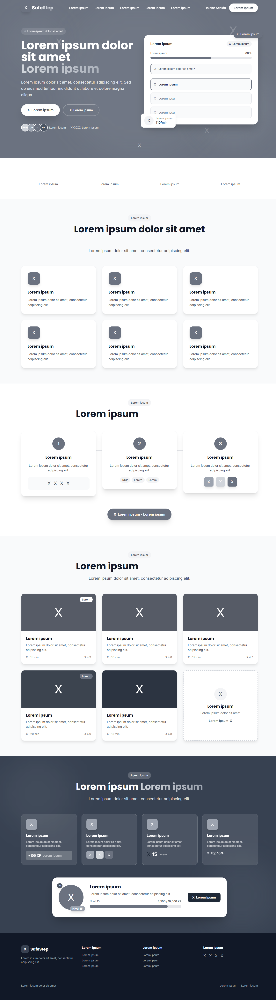
  <p>
    <i><b>Fuente</b>: Elaboración propia.</i>
  </p>
</div>

### 4.3.1.3. wireframe Mobile

El wireframe mobile adapta la estructura desktop a formatos verticales con navegación colapsable:

#### Estructura General Mobile

<div align="center">
  <p>
    <b>Gráfico</b>: Wireframe mobile del Landing de SafeStep
  </p>
  
  <p>
    <i><b>Fuente</b>: Elaboración propia.</i>
  </p>
</div>

### 4.3.1.4. Regiones del wireframe y su Función

A continuación se detalla cada región del wireframe según su función en el recorrido del usuario:

#### A. Header (Navegación Global)

El header contiene el logo de SafeStep, navegación principal con enlaces a secciones clave, y acciones de conversión (iniciar sesión, comenzar). En desktop es horizontal y visible; en mobile se colapsa en hamburger menu.

**Elementos del header:**
- Logo (enlace al inicio)
- Navegación principal: Características, Simulaciones, Tienda, FAQ
- Botones de acción: Iniciar Sesión, Comenzar Gratis

**Principios aplicados:**
- El logo siempre es visible y clickeable
- Las acciones de mayor frecuencia están a la derecha
- El botón principal ("Comenzar") tiene mayor jerarquía visual

#### B. Hero Section

El hero section es la primera impresión y el punto focal principal. Contiene el mensaje de valor central, llamada a la acción, y prueba social.

**Elementos del hero:**
- Badge de prueba social ("+50,000 usuarios")
- Título principal con gradient impact
- Subtítulo explicativo
- Dos CTAs (botón primario "Comenzar", secundario "Ver cómo funciona")
- Indicators de confianza (avatar de usuarios, rating)

**Principios aplicados:**
- Jerarquía clara: título > subtítulo > CTAs
- Prueba social inmediata
- Dos opciones para diferentes tipos de usuario

#### C. Stats Section

La sección de estadísticas proporciona evidencia cuantitativa del impacto de SafeStep.

**Estadísticas mostradas:**
- Usuarios activos (50K+)
- Módulos de simulación (5)
- Satisfacción (98%)
- Vidas preparadas (12K+)

**Principios aplicada:**
- Números redondos y fáciles de recordar
- Formato visual de grilla para scaneo rápido

#### D. Features Section (Características Principales)

Esta sección presenta las características clave de SafeStep en formato de tarjetas.

**Características mostradas:**
1. Simulaciones interactivas
2. Retroalimentación instantánea
3. Aprendizaje progresivo
4. Gamificación
5. Tienda de productos
6. Acceso multiplataforma

**Principios aplicados:**
- Formato visual uniforme (tarjetas)
- Iconografía consistente
- Brief description supporting cada feature

#### E. How It Works Section (Paso a Paso)

La sección "Cómo funciona" explica el proceso de uso de SafeStep en tres pasos simples.

**Pasos:**
1. Crea tu cuenta
2. Practica simulaciones
3. Obtén certificaciones

**Principios aplicados:**
- Narrativa secuencial (1 > 2 > 3)
- Progresión visual (izquierda a derecha en desktop)
- Conexiones visuales entre pasos

#### F. Simulations Section (Módulos)

La sección de simulaciones muestra los módulos de emergencia disponibles.

**Módulos representados:**
- RCP Básico
- Atragantamiento
- Quemaduras
- Sismos
- Hemorragias
- (+ opción para ver más)

**Principios aplicados:**
- Cards visuales con imagen representativa
- Metadata relevante (duración, rating)
- Call to action hacia "ver todos"

#### G. Gamification Section

Esta sección comunica el sistema de gamificación que mantiene usuarios comprometidos.

**Elementos de gamificación:**
- Sistema de XP
- Insignias
- Rachas
- Rankings

**Principios aplicados:**
- Muestra el sistema de rewards
- Ilustra progreso y logro

#### H. Testimonials Section

Testimonios proporcionan prueba social cualitativa.

**Representación:**
- Avatar de usuario
- Quote del usuario
- Nombre y contexto

**Principios aplicados:**
- Autenticidad percibida
- Formato citas clásico

#### I. FAQ Section (Preguntas Frecuentes)

Las preguntas frecuentes abordan objeciones comunes antes de que el usuario las tenga.

**Estructura:**
- Listado de preguntas/respuestas
- Collapsible para más información

**Principios aplicada:**
- Organización Q&A
- Expandible para no saturar

#### J. Footer

El footer proporciona navegación adicional y enlaces legales.

**Contenido del footer:**
- Links de navegación (Acerca de, Contacto, etc.)
- Redes sociales
- Legal links (Términos, Privacidad)
- Copyright

### 4.3.1.5. Principios de Diseño Aplicados en el Wireframe

El wireframe de SafeStep aplica los siguientes principios de diseño:

#### Jerarquía Visual

- El contenido se organiza por importancia: arriba > abajo
- Tamaño y peso visual reflejan jerarquía
- El "F-pattern" para scaneo de contenido

#### Espaciado Constante

- Uso consistente de gutters y margins
- Grid de 12 columnas en desktop
- Adaptación fluida a breakpoints

#### Diseño Inclusivo

- Tamaño mínimo de elementos táctiles (44x44px)
- Contraste suficiente para legibilidad
- Espacios generosos para interacción

#### Arquitectura de Información

- Navegación clara con etiquetas simples
- Agrupación lógica de contenido relacionado
- Breadcrumbs implícitos en la estructura

## 4.3.2. Landing Page Mock-up

Esta sección presenta y explica los Mock-ups del Landing Page, tanto en su versión para Desktop Web Browser como Mobile Web Browser. En la propuesta y la explicación debe evidenciarse la aplicación de los principios, elementos de diseño, diseño inclusivo y arquitectura de información, así como el Design System establecido para los productos digitales.

### 4.3.2.1. Introducción al Mock-up

El mock-up del Landing Page representa la implementación visual final del wireframe, aplicando el Design System establecido en la sección 4.1. El mock-up utiliza los colores, tipografía, espaciado y componentes definidos en Style Guidelines para crear una experiencia visual coherente con la marca SafeStep.

### 4.3.2.2. Mock-up Desktop

El mock-up desktop del Landing Page aplica los siguientes elementos del Design System:

#### Paleta de Colores Aplicada

**Primary (Azul): #0ea5e9**
- Botones primarios, highlights, iconos principales
- Aplicado en: CTAs, badges activos, hovers

**Safe (Verde): #22c55e**
- Indicadores de éxito, elementos de seguridad
- Aplicado en: estadísticas positivas, ratings

**Accent (Naranja): #f97316**
- Énfasis, alertas moderadas
- Aplicado en: botones secundarios, badges destacados

**Escala de Grises**
- Fondos: White, Gray-50, Gray-100
- Texto: Gray-900 (principal), Gray-600 (secundario)
- Bordes: Gray-200, Gray-300

#### Tipografía Aplicada

**Poppins (Headings)**
- H1: 48-64px Bold - Títulos principales
- H2: 36-48px Bold - Títulos de sección
- H3: 24-28px SemiBold - Subtítulos

**Inter (Body)**
- Body: 16px Regular
- Small: 14px Regular
- Caption: 12px Regular

#### Componentes Visuales

**Tarjetas de características:**
- Fondo: White
- Radio: 16px (rounded-2xl)
- Sombra: shadow-lg
- Padding: 32px
- Hover: translateY(-10px) + shadow-xl

**Botones:**
- Primario: bg-primary, text-white, rounded-full
- Secundario: border-white/30, text-white, rounded-full
- Altura: 48-56px
- Padding: 16px vertical, 32px horizontal

**Inputs:**
- Radio: 12px
- Borde: Gray-300
- Focus ring: primary/20

### 4.3.2.3. Mock-up Mobile

El mock-up mobile mantiene consistencia con desktop mientras adapta la experiencia a pantallas pequeñas:

#### Adaptaciones Mobile

**Diseño responsive:**
- Grid de contenido colapsa a 1 columna
- Navegación colapsada en hamburger menu
- Tarjetas de features en grid 1x6
- Spacing reducido (50-75% de desktop)

**Touch targets:**
- Todos los elementosInteractivos mínimo 44x44px
- Botones altura completa de 48px
- Espaciado entre elementos táctiles 16px

**Optimización visual mobile:**
- Imágenes optimizadas para carga rápida
- Texto legible sin zoom
- Formatos vertical scrolling

### 4.3.2.4. Vistas Detalladas por Sección

#### Hero Section - Vista Detallada

**Desktop:**
- Fondo gradiente: linear-gradient(135deg, #0c4a6e, #0369a1, #0ea5e9)
- Texto: White
- Ilustración flotante a la derecha
- Botones con shadow-lg y pulse animation en CTA principal

**Mobile:**
- Fondo similar
- Texto centrado
- Ilustración hidden o colapsada
- Stacked buttons

#### Features Section - Vista Detallada

**Grid layout:**
- Desktop: 3 columnas
- Tablet: 2 columnas
- Mobile: 1 columna

**Card design:**
- Icono centrado (64x64px)
- Título debajo de icono
- Description debajo de título
- Hover effect con elevación

#### Simulations Section - Vista Detallada

**Card design:**
- Imagen representativa superior (h-48)
- Badge superior ("Popular", "Nuevo")
- Contenido textual inferior
- Footer con metadata

**Categorías de badges:**
- Popular: primary
- Nuevo: accent
- Premium: special gradient

#### Gamification Section - Vista Detallada

**Se características:**
- Fondo gradient azul
- Tarjetas translúcidas
- Iconos grandes prominentes
- Números/stats highlight

### 4.3.2.5. Aplicación del Design System

El mock-up evidencia la aplicación del Design System a través de:

#### Consistencia Visual

- Colores utilizados consistentemente a través de secciones
- Tipografía sigue la jerarquía establecida
- Espaciado uniforme
- Bordes y radios consistentes

#### Diseño Inclusivo

- Contraste suficiente (WCAG AA mínimo)
- Estados de foco visibles
- Tamaños táctiles adecuados
- Texto alternativa para iconos

#### Accesibilidad

- Labels de form claramente asociados
- Campos de input con placeholders útiles
- Botones con texto claro
- Error states visibles

### 4.3.2.6. Referencias Visuales

Las siguiente referencias muestran el mock-up final:

#### Desktop Homepage Mock-up

<div align="center">
  <p>
    <b>Gráfico</b>: Mock-up desktop del Landing de SafeStep
  </p>
  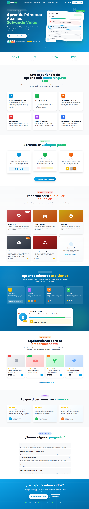
  <p>
    <i><b>Fuente</b>: Elaboración propia.</i>
  </p>
</div>

El mockup desktop muestra:
- Hero section completo con illustration
- 6 features cards en grid
- 3 steps visuales
- 6 module cards
- Gamification section con íconos
- Testimonials slider

#### Mobile Homepage Mock-up

<div align="center">
  <p>
    <b>Gráfico</b>: Mock-up mobile del Landing de SafeStep
  </p>
  
  <p>
    <i><b>Fuente</b>: Elaboración propia.</i>
  </p>
</div>

El mockup mobile muestra:
- Collapsed header con hamburger
- Hero adaptado vertical
- Features en lista vertical
- Simulaciones scrollable
- Bottom navigation hint

### 4.3.2.7. Estados Interactivos en el Mock-up

Los mockups también muestran los estados interactivos de los componentes principales:

#### Estados de Botón

- **Default**: Color fill, sin sombra
- **Hover**: Sombra incrementada, leve translate up
- **Active**: Escala reducida (0.98)
- **Disabled**: Opacidad reducida

#### Estados de Tarjeta

- **Default**: shadow-md
- **Hover**: shadow-xl, translateY(-10px)
- **Transition**: 300ms ease

#### Estados de Input

- **Default**: Gray-300 border
- **Focus**: Primary ring visible
- **Error**: Red border, mensaje visible
- **Success**: Green border, check icon

### 4.3.2.8. Diseño Responsivo General

El mock-up aplica diseño responsivo a través de:

#### Breakpoints Aplicados

- Mobile: 0-639px
- Tablet: 640-1023px
- Desktop: 1024px+

#### Comportamiento por Breakpoint

- Stacking de grids
- Collapsing de navegación
- Adjustment de espaciado
- Images optimization

#### Imágenes Responsivas

- srcset para diferentes anchos
- Lazy loading en imágenes below fold
- Placeholder durante carga


# 4.4. Web Applications UX/UI Design

Esta sección incluye secciones internas donde se presenta y explica la propuesta visual y de interacción para las aplicaciones que constituyen la experiencia de usuario con los productos digitales.

## 4.4.1. Web Applications Wireframes

Esta sección incluye una sección interna donde se presenta y explica los Wireframes de las aplicaciones móviles. En la propuesta y la explicación debe evidenciarse la aplicación de los principios, elementos de diseño, diseño inclusivo y arquitectura de información. Utilizar para los wireframes las herramientas indicadas.

### 4.4.1.1. Introducción a Wireframes de Aplicaciones Web

Los wireframes de las aplicaciones web de SafeStep establecen la estructura funcional de cada vista antes de aplicar tratamiento visual. Cada wireframe define la posición de elementos interactivos, la arquitectura de información para cada pantalla, y el flujo de interacción esperado para completar tareas específicas.

Los wireframes han sido diseñados siguiendo los principios de mobile-first donde las funcionalidades mobile son esenciales, pero también considerando la experiencia expandida de desktop. Los wireframes se crean en escala de grises para mantener el foco en estructura y función, no en aspectos visuales.

### 4.4.1.2. Dashboard Wireframe

El Dashboard es la primera pantalla que ve el usuario después de iniciar sesión. Actúa como centro de control desde donde puede navegar a todas las funcionalidades principales.

#### Estructura del Dashboard

<div align="center">
  <p>
    <b>Gráfico</b>: Wireframe del dashboard principal de SafeStep
  </p>
  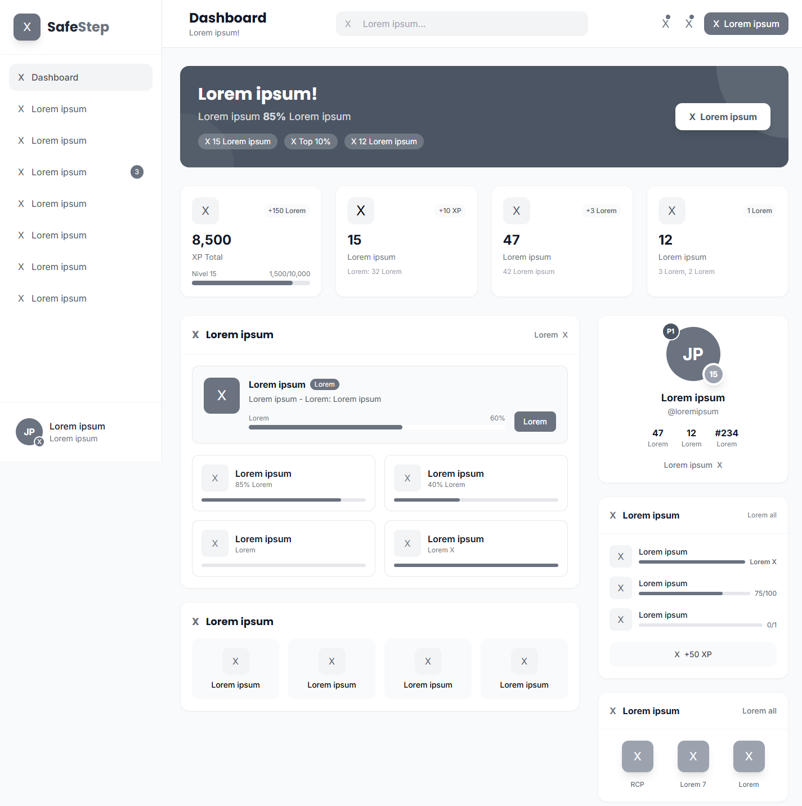
  <p>
    <i><b>Fuente</b>: Elaboración propia.</i>
  </p>
</div>

#### Elementos Clave del Dashboard

- **Header**: Logo, búsqueda global, notificaciones, acceso a perfil
- **Sidebar**: Navegación principal con avatar y progreso visible
- **Welcome banner**: Mensaje personalizado con continuación
- **Continue learning**: Último módulo en progreso
- **Recomendaciones**: Contenido sugerido basado en historial
- **Stats**: Resumen visual de progreso

### 4.4.1.3.-learning Page (Módulos) Wireframe

La página de aprendizaje muestra los módulos disponibles y el estado de progreso del usuario en cada uno.

#### Estructura de Página de Aprendizaje

<div align="center">
  <p>
    <b>Gráfico</b>: Wireframe de la página de aprendizaje de SafeStep
  </p>
  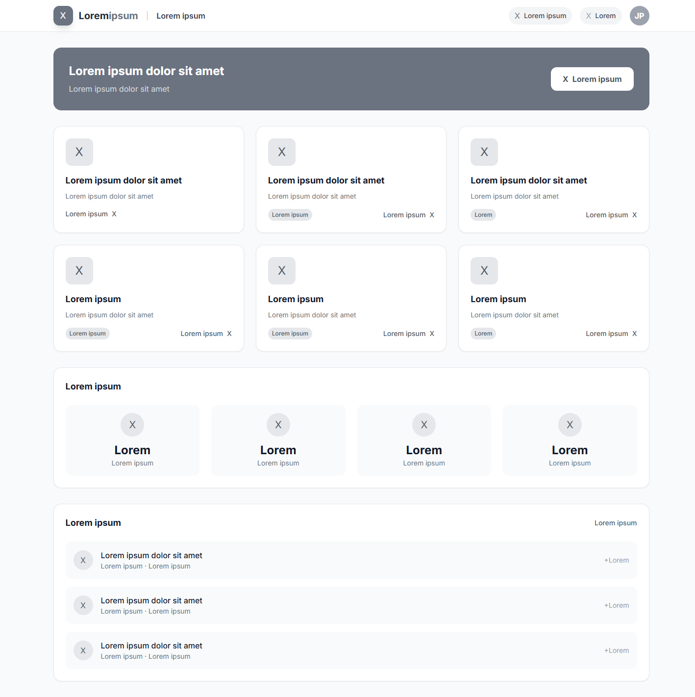
  <p>
    <i><b>Fuente</b>: Elaboración propia.</i>
  </p>
</div>

#### Elementos Clave

- **Breadcrumbs**: Navegación de retorno
- **Filtros por estado**: Todos/En progreso/Completado
- **Filters por categoría**: RCP, Atragantamiento, etc.
- **Módulo cards**: Imagen, título, progreso, indicador de estado

### 4.4.1.4. Simulación Page Wireframe

La página de simulación es donde el usuario practica situaciones de emergencia.

#### Estructura de Simulación

<div align="center">
  <p>
    <b>Gráfico</b>: Wireframe de la página de una simulación de SafeStep
  </p>
  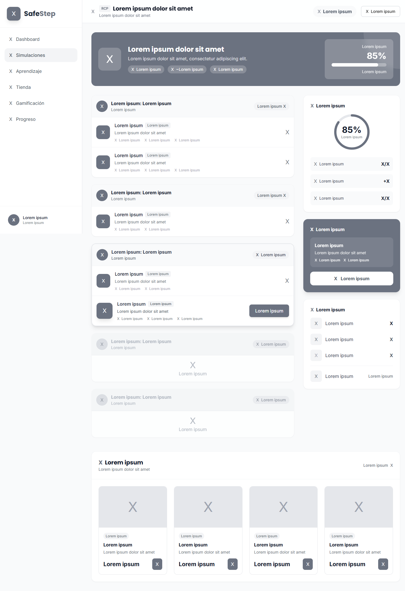
  <p>
    <i><b>Fuente</b>: Elaboración propia.</i>
  </p>
</div>

#### Elementos Clave

- **Progress bar**: Muestra avance en la simulación
- **Escenario**: Descripción de la situación
- **Opciones**: Botones de respuesta con letters (A, B, C...)
- **Feedback**: Indicación inmediata de correct/incorrect
- **Opciones de ayuda**: Pista, Saltar

### 4.4.1.5. E-commerce/Tienda Wireframe

La página de tienda muestra el catálogo de productos disponibles.

#### Estructura de Tienda

<div align="center">
  <p>
    <b>Gráfico</b>: Wireframe de la página de la tienda de SafeStep
  </p>
  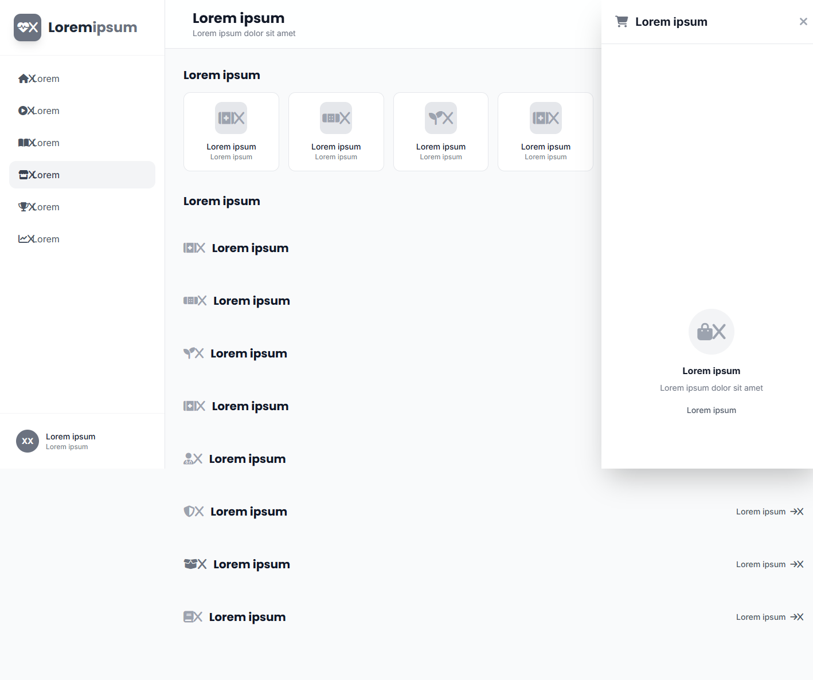
  <p>
    <i><b>Fuente</b>: Elaboración propia.</i>
  </p>
</div>

#### Elementos Clave

- **Search bar**: Búsqueda de productos
- **Filtros**: Categoría, precio rango, uso
- **Product cards**: Imagen, nombre, precio, botón agregar
- **Sort**: Opciones de ordenamiento
- **Pagination**: Navegación de resultados

### 4.4.1.6. Producto Detail Wireframe

La página de detalle de producto muestra información completa de un producto específico.

#### Estructura de Detalle de Producto

<div align="center">
  <p>
    <b>Gráfico</b>: Wireframe de un producto de SafeStep
  </p>
  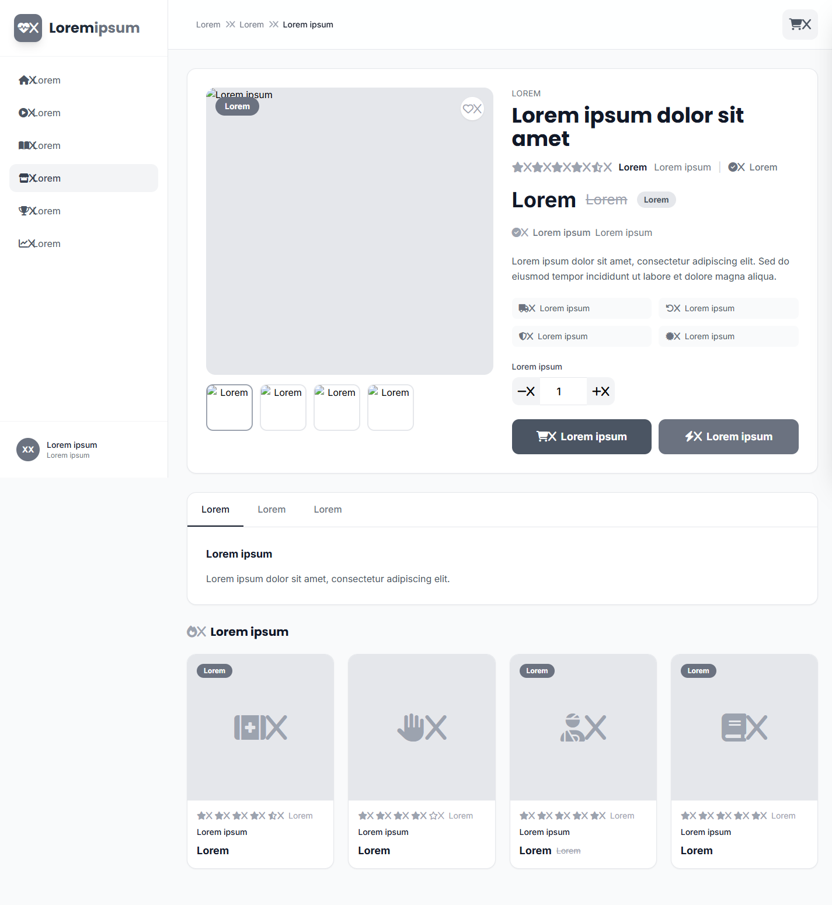
  <p>
    <i><b>Fuente</b>: Elaboración propia.</i>
  </p>
</div>

### 4.4.1.7. Perfil/Configuración Wireframe

La página de configuración y perfil del usuario.

#### Estructura de Perfil

<div align="center">
  <p>
    <b>Gráfico</b>: Wireframe del perfil de usuario de SafeStep
  </p>
  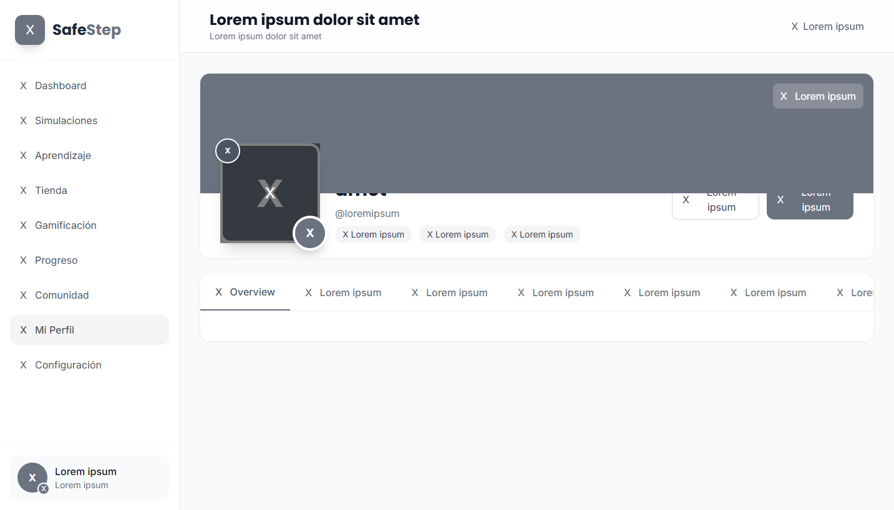
  <p>
    <i><b>Fuente</b>: Elaboración propia.</i>
  </p>
</div>

## 4.4.2. Web Applications Wireflow Diagrams

Esta sección presenta la propuesta de Wireflows. Debe considerarse un Wireflow para cada User goal, considerando los User Persona para cada aplicación que forma parte del alcance. Es recomendable que el equipo elabore previamente los correspondientes Task Flows, para establecer un consenso sobre las rutas típicas de steps para cada User goal. Es importante recordar que la forma como se refleja un cambio en una pantalla (Wireframe) como resultado de la interacción en un flujo es agregar un paso con un Wireframe con la representación del nuevo estado. Utilizar para los Wireflows las herramientas indicadas. Cada Wireflow diagram requiere que se redacte el User goal y se complemente con una explicación del flujo especificado.

### 4.4.2.1. Metodología de Wireflows

SafeStep utiliza wireflows para documentar los flujos de interacción entre pantallas. Un wireflow representa una secuencia de pantallas relacionadas por las acciones del usuario, ilustrando cómo los cambios en una pantalla lead a estados diferentes.

Cada wireflow incluye:
- User goal: El objetivo que el usuario intenta lograr
- Secuencia de pantallas: Ilustración del flujo
- Acciones: Las interacciones que trigger cambios
- Decisiones: Puntos donde el usuario tiene opciones
- Estados alternatives: Variaciones del flujo

### 4.4.2.2. Wireflow: Iniciar Sesión

**User Goal**: El usuario desea acceder a su cuenta en SafeStep para continuar su aprendizaje.

#### Flujo Principal (Happy Path)

<div align="center">
  <p>
    <b>Gráfico</b>: Wireflow autenticación (happy path)
  </p>
  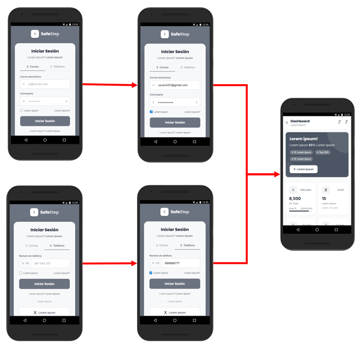
  <p>
    <i><b>Fuente</b>: Elaboración propia.</i>
  </p>
</div>

#### Flujo Alternativo

<div align="center">
  <p>
    <b>Gráfico</b>: Wireflow autenticación (alternative path)
  </p>
  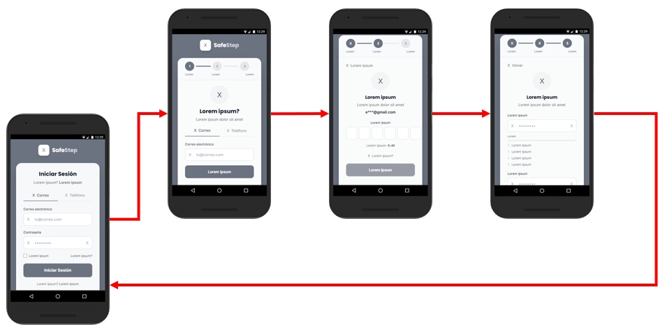
  <p>
    <i><b>Fuente</b>: Elaboración propia.</i>
  </p>
</div>

### 4.4.2.3. Wireflow: Completar una Lección

**User Goal**: El usuario desea completar una lección completa (teoría + video + evaluación).

#### Flujo Principal

<div align="center">
  <p>
    <b>Gráfico</b>: Wireflow lección
  </p>
  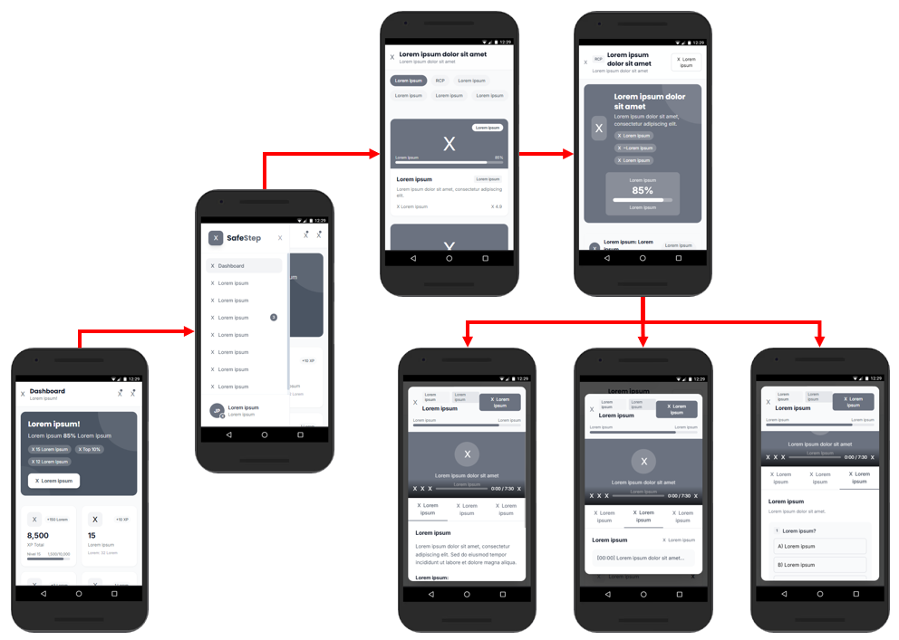
  <p>
    <i><b>Fuente</b>: Elaboración propia.</i>
  </p>
</div>

### 4.4.2.4. Wireflow: Completar una Simulación

**User Goal**: El usuario desea practicar una simulación de emergencia específica.

#### Flujo Principal

<div align="center">
  <p>
    <b>Gráfico</b>: Wireflow simulacion
  </p>
  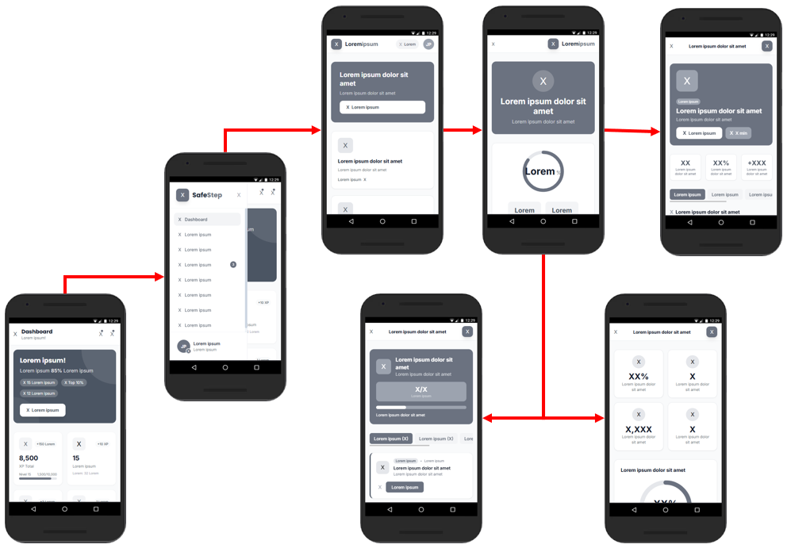
  <p>
    <i><b>Fuente</b>: Elaboración propia.</i>
  </p>
</div>

### 4.4.2.5. Wireflow: Compra en Tienda

**User Goal**: El usuario desea comprar productos de primeros auxilios.

#### Flujo Principal

<div align="center">
  <p>
    <b>Gráfico</b>: Wireflow tienda
  </p>
  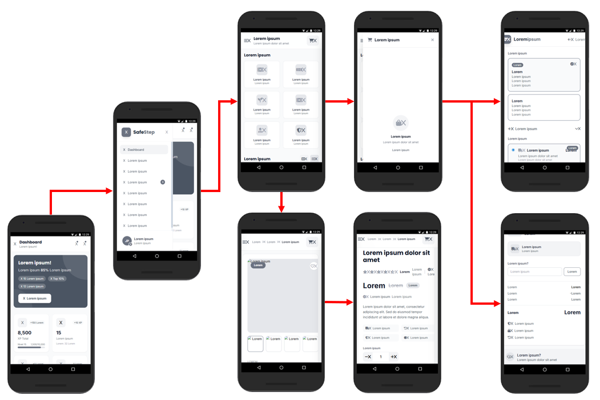
  <p>
    <i><b>Fuente</b>: Elaboración propia.</i>
  </p>
</div>

### 4.4.2.6. Wireflow: Gestionar Perfil

**User Goal**: El usuario desea actualizar su información personal y preferencias.

#### Flujo Principal

<div align="center">
  <p>
    <b>Gráfico</b>: Wireflow perfil
  </p>
  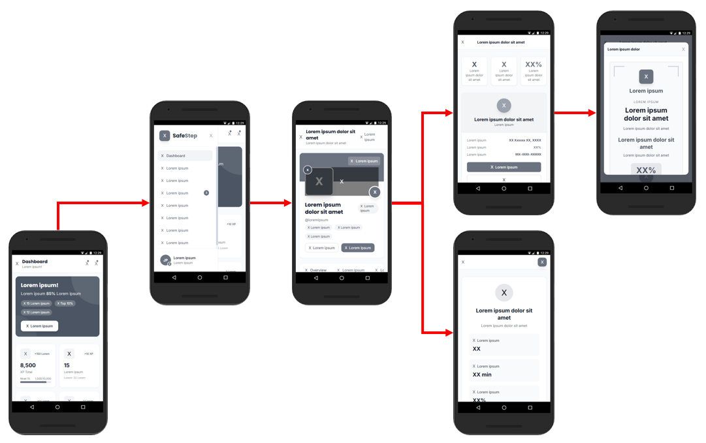
  <p>
    <i><b>Fuente</b>: Elaboración propia.</i>
  </p>
</div>

## 4.4.3. Web Applications Mock-ups

Esta sección presenta y explica los Mock-ups de las aplicaciones. En la propuesta y la explicación debe evidenciarse la aplicación de los principios, elementos de diseño, diseño inclusivo y arquitectura de información, así como el Design System establecido para los productos digitales. Utilizar para los mock-ups las herramientas indicadas.

### 4.4.3.1. Introducción a Mock-ups

Los mock-ups de aplicaciones web representan la implementación visual final de los wireframes, aplicando el Design System establecido. Cada mock-up incorpora la paleta de colores, tipografía, componentes y estilos definidos en-style guidelines para crear experiencias visuales coherentes con la marca SafeStep.

### 4.4.3.2. Dashboard Mock-up

El mock-up del Dashboard implementa la estructura del wireframe con tratamiento visual completo:

#### Elementos Visuales

**Header:**
- Logo con gradiente azul
- Fondo blanco con shadow
- Iconos de navegación (buscar, notificaciones, perfil)

**Sidebar:**
- Fondo White
- Avatar circular con badge de nivel
- Navegación con icons + texto
- Hover states con highlight azul
- Progreso XP mostrado visualmente

**Contenido Principal:**
- Card de bienvenida con gradiente
- Cards de módulos con progress bars
- Stats con icons y colores distintivos
- Badges para progreso completado

### 4.4.3.3. Learning Page Mock-up

Mock-up de página de módulos y lecciones:

#### Elementos Visuales

**Filtros:**
- Pills con background active/inactive
- Icons por categoría
- Estados visuales claros

**Módulo Cards:**
- Imagen de fondo por categoría
- Overlay con información
- Progress bar coloreada
- Badges de estado (completado, en progreso, nuevo)
- Hover effects con escala

### 4.4.3.4. Simulación Mock-up

Mock-up de la interfaz de simulación interactiva:

#### Elementos Visuales

**Progress indicator:**
- Step indicator visual
- Números claramente visibles
- Color activo para paso actual

**Opciones:**
- Large touch targets (altura mínima 56px)
- Letter claramente visible (A, B, C)
- States: default, hover, selected, correct, incorrect
-Feedback colors: verde para correcto, rojo para incorrecto

**Escenario:**
- Box con background de alerta
- Icon representativo (X placeholder)
- Texto legible

### 4.4.3.5. Tienda Mock-up

Mock-up del catálogo de tienda:

#### Elementos Visuales

**Product Cards:**
- Imagen prominente
- Badge de descuento si aplica
- Nombre, precio, rating
- Botón "Agregar" prominente

**Filtros Sidebar:**
- Checkboxes visuales
- Range sliders para precio
- Collapsible sections

**Sorting:**
- Dropdown visual
- Icon indicating direction

### 4.4.3.6. Detalle Producto Mock-up

Mock-up de página de detalle de producto:

#### Elementos Visuales

**Galería:**
- Thumbnails navegables
- Zoom en hover
- Main image grande

**Información:**
- Precio destacado
- Selector de cantidad +/- 
- Botones de acción grandes
- Accordion para descripciones

### 4.4.3.7. Perfil Mock-up

Mock-up de configuración de perfil:

#### Elementos Visuales

**Avatar:**
- Círculo grande
- Placeholder para cambio
- Badge de verificación si aplica

**Forms:**
- Labels claramente asociadas
- Input fields con estados
- Toggle switches para preferencias
- Save button fixed o prominent

### 4.4.3.8. Aplicación de Design System en Mock-ups

Cada mock-up evidencia la aplicación del Design System:

**Colores:**
- Primario azul en CTAs principales
- Verde para éxitos/completado
- Rojo/naranja para errores/alertas
- Escala de grises para estructura

**Tipografía:**
- Poppins para headings
- Inter para cuerpo
- Jerarquía clara de tamaños

**Componentes:**
- Botones según especificación
- Form inputs con estilos
- Cards con shadow consistente
- Spacing según sistema

## 4.4.4. Web Applications User Flow Diagrams

Esta sección presenta la propuesta de User Flows. Debe considerarse un User Flow para cada User goal, considerando los User Persona para cada aplicación que forma parte del alcance. Estos User Flows deben ser consistentes con los Wireflows de los cuales se derivan. Debe recordarse que en el User Flow se incluyen los Mock-ups de las vistas o pantallas de las aplicaciones, junto con los flujos que constituyen la ruta esperada (happy path) y las rutas alternativas (unhappy paths). Utilizar para los User Flows las herramientas indicadas. Cada User Flow diagram requiere que se redacte el User goal y se complemente con una explicación de los flujos y condiciones especificados.

### 4.4.4.1. Metodología de User Flows

Los User Flows de SafeStep documentan las rutas completas que los usuarios siguen para lograr objetivos específicos. A diferencia de los wireflows que muestran la estructura técnica, los user flows muestran la experiencia desde la perspectiva del usuario.

Cada user flow incluye:
- User Goal: El objetivo del usuario
- Persona: El tipo de usuario
- Happy Path: El flujo ideal
- Unhappy Paths: Variaciones y errores
- Puntos de decisión
- Puntos de salida

### 4.4.4.2. User Flow: Aprendizaje Completo de Módulo

**User Goal**: Completar todas las lecciones de un módulo de primeros auxilios

**User Type**: Estudiante / Usuario aprendiz

#### Happy Path

<div align="center">
  <p>
    <b>Gráfico</b>: User flow aprendizaje completo módulo (Happy path)
  </p>
  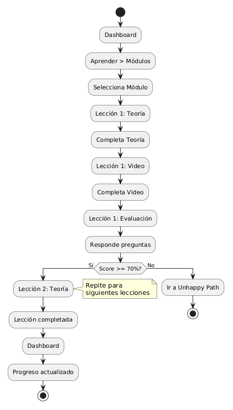
  <p>
    <i><b>Fuente</b>: Elaboración propia.</i>
  </p>
</div>

#### Unhappy Paths

**Evaluación reprobada:**

<div align="center">
  <p>
    <b>Gráfico</b>: User flow aprendizaje completo módulo (Unhappy path) parte 1
  </p>
  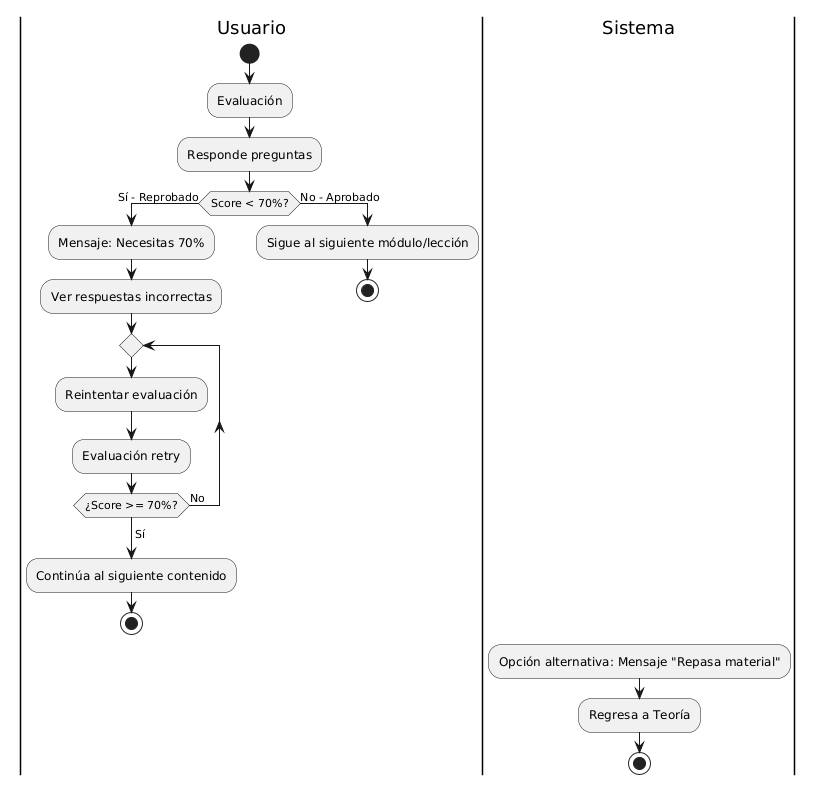
  <p>
    <i><b>Fuente</b>: Elaboración propia.</i>
  </p>
</div>

**Abandonar lección:**

<div align="center">
  <p>
    <b>Gráfico</b>: User flow aprendizaje completo módulo (Unhappy path) parte 2
  </p>
  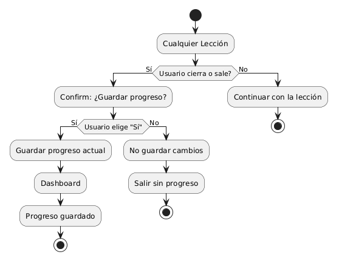
  <p>
    <i><b>Fuente</b>: Elaboración propia.</i>
  </p>
</div>

### 4.4.4.3. User Flow: Práctica de Simulación

**User Goal**: Practicar respuestas de emergencia en simulación interactiva

**User Type**: Estudiante / Usuario que busca certificación

#### Happy Path

<div align="center">
  <p>
    <b>Gráfico</b>: User flow práctica de simulación (Happy path)
  </p>
  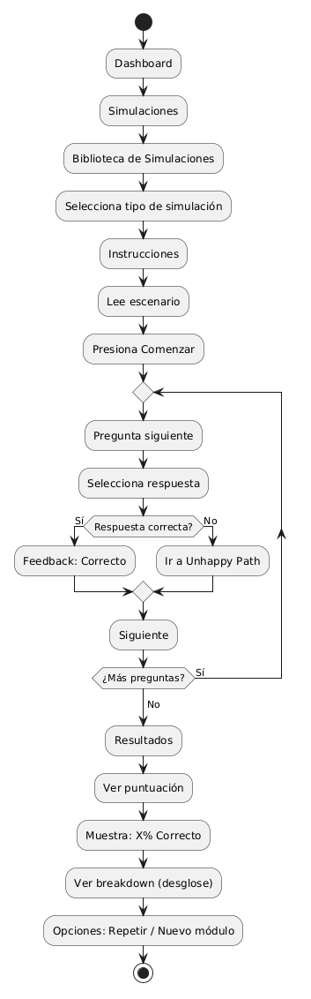
  <p>
    <i><b>Fuente</b>: Elaboración propia.</i>
  </p>
</div>

#### Unhappy Paths

**Respuesta incorrecta:**

<div align="center">
  <p>
    <b>Gráfico</b>: User flow práctica de simulación (Unhappy path) parte 1
  </p>
  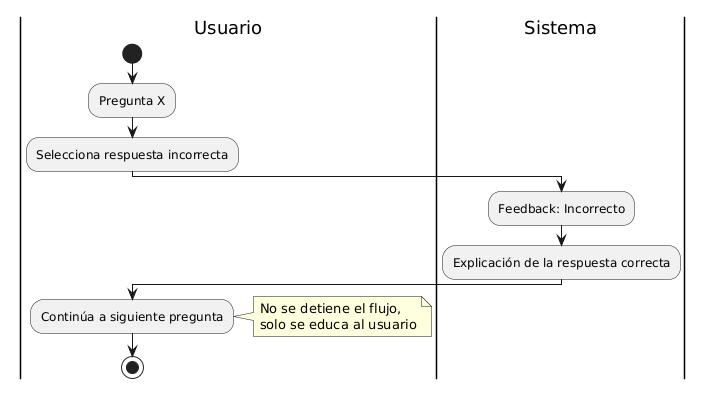
  <p>
    <i><b>Fuente</b>: Elaboración propia.</i>
  </p>
</div>

**Usar pista:**

<div align="center">
  <p>
    <b>Gráfico</b>: User flow práctica de simulación (Unhappy path) parte 2
  </p>
  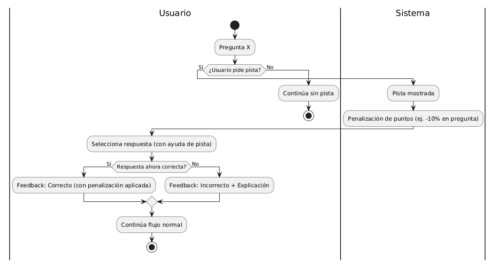
  <p>
    <i><b>Fuente</b>: Elaboración propia.</i>
  </p>
</div>

### 4.4.4.4. User Flow: Compra de Producto

**User Goal**: Adquirir productos de primeros auxilios

**User Type**: Comprador / Cliente

#### Happy Path

<div align="center">
  <p>
    <b>Gráfico</b>: User flow compra de producto (Happy path)
  </p>
  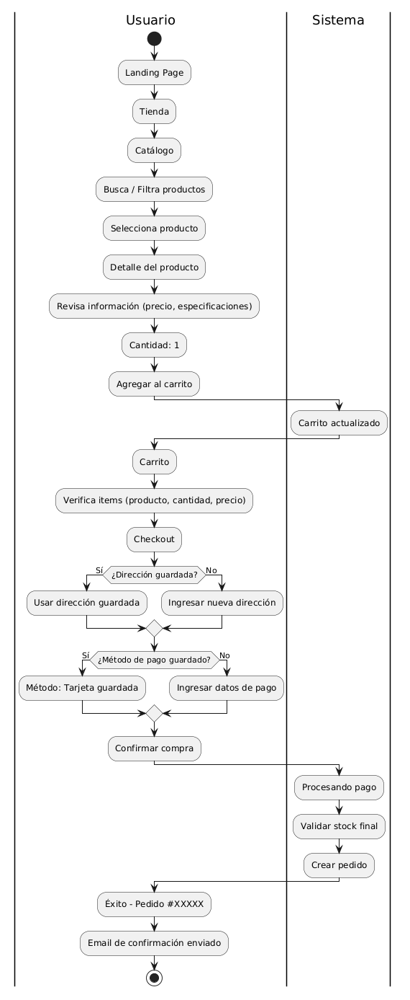
  <p>
    <i><b>Fuente</b>: Elaboración propia.</i>
  </p>
</div>

#### Unhappy Paths

**Producto sin stock:**

<div align="center">
  <p>
    <b>Gráfico</b>: User flow compra de producto (Unhappy path) parte 1
  </p>
  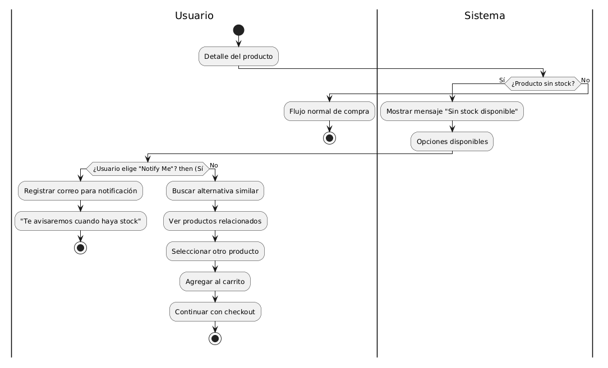
  <p>
    <i><b>Fuente</b>: Elaboración propia.</i>
  </p>
</div>

**Pago rechazado:**

<div align="center">
  <p>
    <b>Gráfico</b>: User flow compra de producto (Unhappy path) parte 2
  </p>
  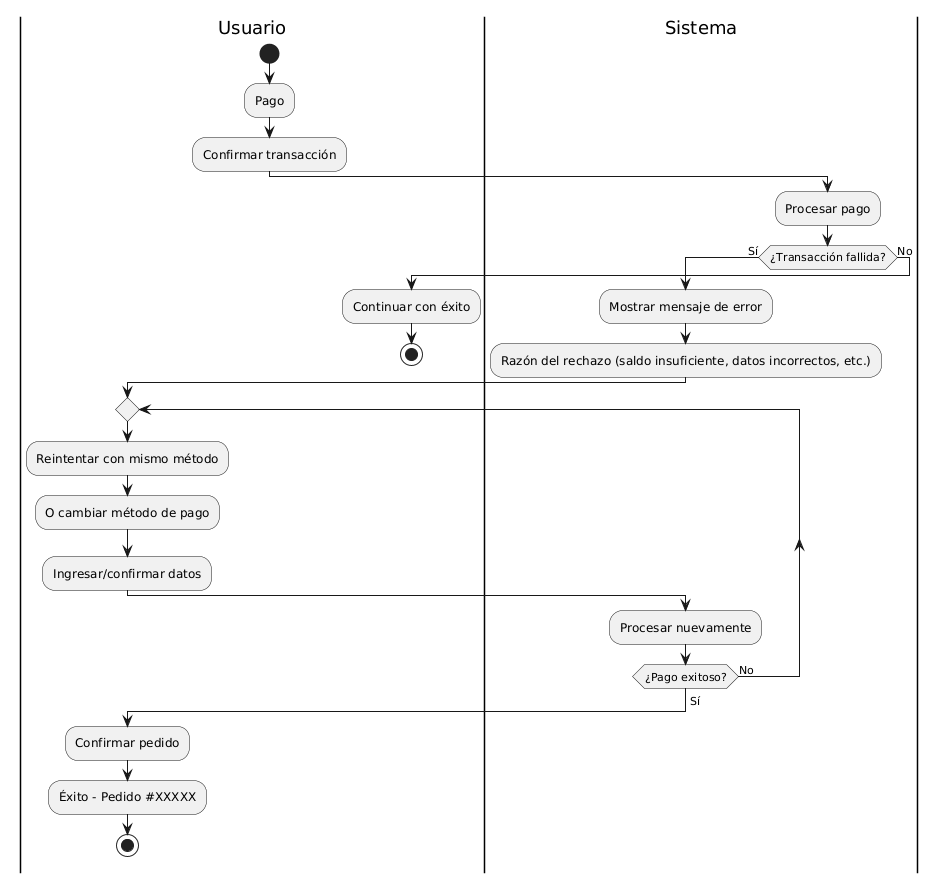
  <p>
    <i><b>Fuente</b>: Elaboración propia.</i>
  </p>
</div>

**Carrito vacío:**

<div align="center">
  <p>
    <b>Gráfico</b>: User flow compra de producto (Unhappy path) parte 3
  </p>
  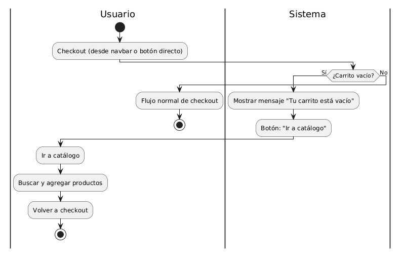
  <p>
    <i><b>Fuente</b>: Elaboración propia.</i>
  </p>
</div>

### 4.4.4.5. User Flow: Registro de Nuevo Usuario

**User Goal**: Crear una cuenta en SafeStep

**User Type**: Visitante nuevo

#### Happy Path

<div align="center">
  <p>
    <b>Gráfico</b>: User flow registro de nuevo usuario (Happy path)
  </p>
  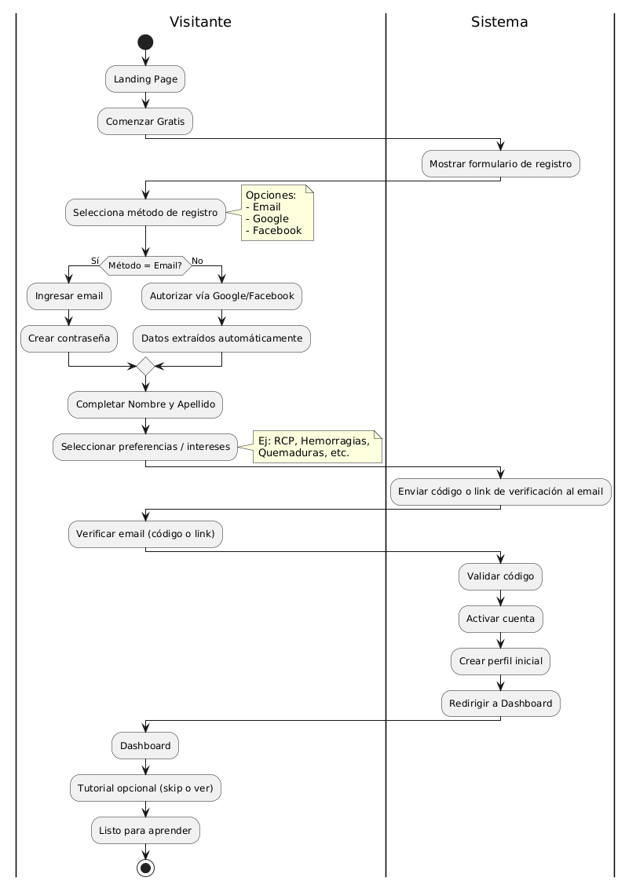
  <p>
    <i><b>Fuente</b>: Elaboración propia.</i>
  </p>
</div>

#### Unhappy Paths

**Email ya registrado:**

<div align="center">
  <p>
    <b>Gráfico</b>: User flow registro de nuevo usuario (Unhappy path) parte 1
  </p>
  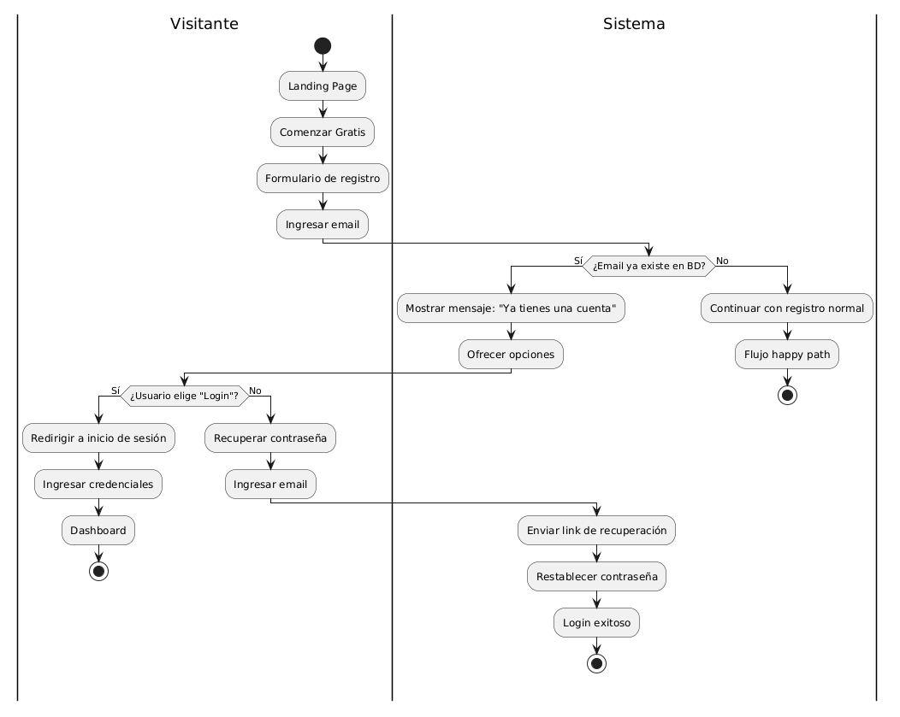
  <p>
    <i><b>Fuente</b>: Elaboración propia.</i>
  </p>
</div>

**Código verificación expirado:**

<div align="center">
  <p>
    <b>Gráfico</b>: User flow registro de nuevo usuario (Unhappy path) parte 2
  </p>
  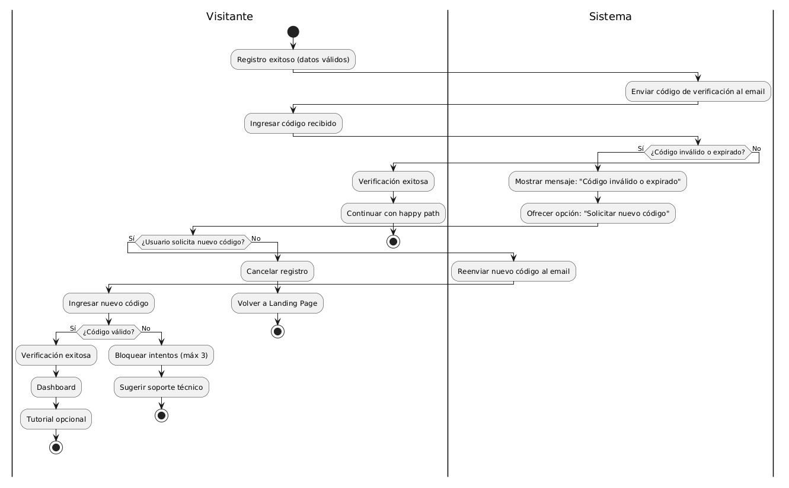
  <p>
    <i><b>Fuente</b>: Elaboración propia.</i>
  </p>
</div>

### 4.4.4.6. User Flow: Recuperación de Contraseña

**User Goal**: Recuperar acceso a su cuenta

**User Type**: Usuario con cuenta pero sin acceso

#### Happy Path

<div align="center">
  <p>
    <b>Gráfico</b>: User flow recuperación de contraseña (Happy path)
  </p>
  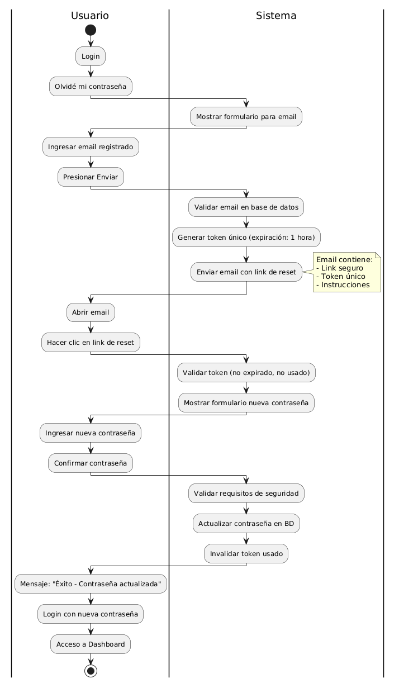
  <p>
    <i><b>Fuente</b>: Elaboración propia.</i>
  </p>
</div>

#### Unhappy Paths

**Email no encontrado:**

<div align="center">
  <p>
    <b>Gráfico</b>: User flow recuperación de contraseña (Unhappy path) parte 1
  </p>
  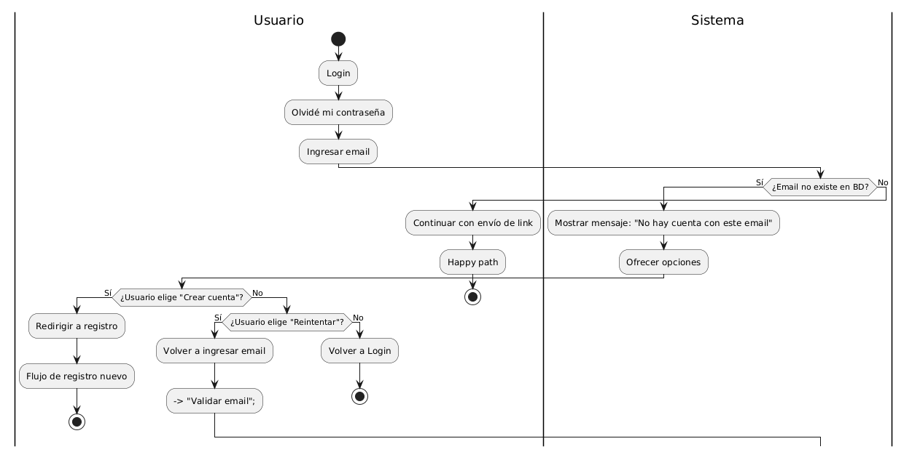
  <p>
    <i><b>Fuente</b>: Elaboración propia.</i>
  </p>
</div>

**Token expirado:**

<div align="center">
  <p>
    <b>Gráfico</b>: User flow recuperación de contraseña (Unhappy path) parte 2
  </p>
  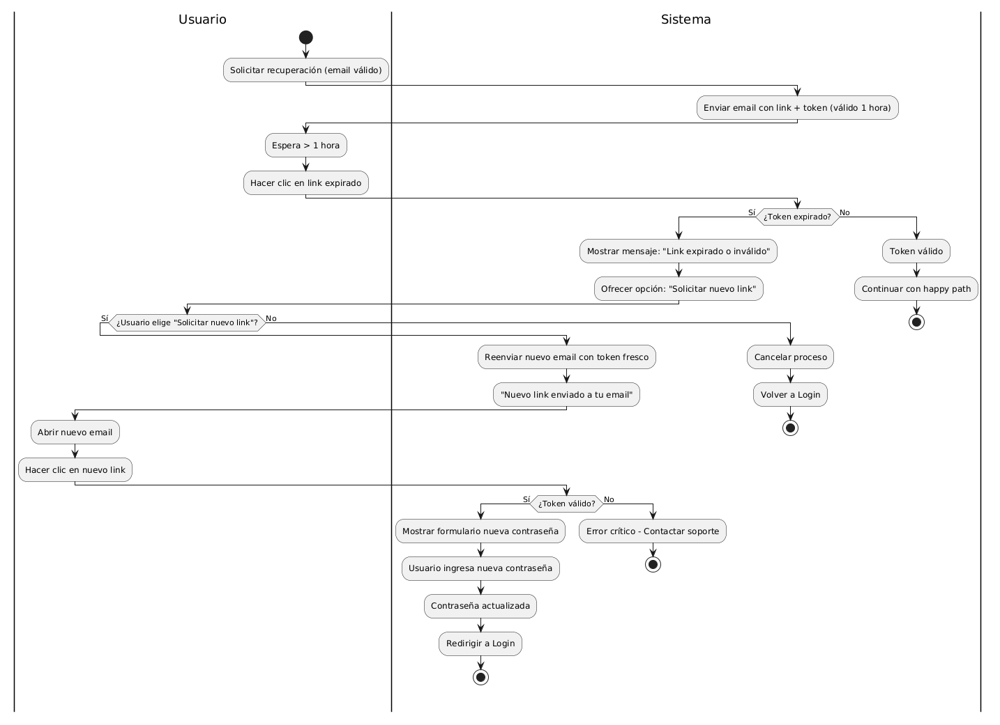
  <p>
    <i><b>Fuente</b>: Elaboración propia.</i>
  </p>
</div>

### 4.4.4.7. Consideraciones de User Flows

Los User Flows de SafeStep consideran:

**Accesibilidad:**
- Rutas alternativas para usuarios con limitaciones
- Opciones de voz donde aplica
- Simplicidad para usuarios no técnicos

**Recuperación:**
- Puntos claros de salida y retorno
- Mensajes claros en errores
- Opciones de recovery sencillas

**Consistencia:**
- Similar estructura de flows
- Patrones familiares
- Terminología consistente

# 4.5. Web Applications Prototyping

Esta sección incluye Prototipos de UI para Desktop y Mobile Web Browser con simulación de interacción y navegación, acorde con la propuesta de paths de User Flow Diagrams. Esta sección inicia con una introducción en la que se explica los principales criterios para las decisiones de interacción. Es importante evidenciar la relación con las decisiones de arquitectura de información, en particular sobre el sistema de navegación y los tipos de interacciones seleccionadas. Para cada caso debe incluirse 1 screenshot de video y un enlace a un video subido a Microsoft Stream para cada aplicación, en el que se demuestre y explique los principales flujos de interacción que cubren los prototipos.

## 4.5.1. Introducción al Prototipado

El prototipado de SafeStep representa la culminación del proceso de diseño, donde las decisiones abstractas de arquitectura, wireframes y mockups se traducen en experiencias interactivas funcionales. Los prototipos demuestran cómo los usuarios realmente interactuarán con la aplicación, revelando aspectos que no son evidentes en representaciones estáticas.

### 4.5.1.1. Objetivos del Prototipado

Los prototipos de SafeStep cumplen varios objetivos fundamentales:

**Validación de Interacción:**
- Los prototipos permiten probar que los flujos de interacción funcionan como se anticipó
- Se identifican fricciones y puntos de confusión antes del desarrollo
- Los usuarios pueden proporcionar feedback sobre la experiencia real

**Comunicación con Desarrolladores:**
- Los prototipos sirven como especificación técnica para desarrolladores
- Muestran exactamente cómo deben comportarse los elementos
- Reducen la brecha entre diseño y implementación

**Demostración de Valor:**
- Los prototipos permiten stakeholders visualizar el producto final
- Facilitan la validación con usuarios y patrocinadores
- Crean hype y expectativa positiva

### 4.5.1.2. Criterios de Interacción

Las decisiones de interacción en los prototipos de SafeStep siguen criterios específicos:

#### Facilidad de Uso

- Cada interacción es discoverable (el usuario sabe que puede interactuar)
- Los resultados de las acciones son predecibles
- Los errores son difíciles de cometer y fáciles de recover

#### Consistencia

- Patrones de interacción similares a través de la aplicación
- Elementos similares se comportan de manera similar
- La experiencia es predecible una vez aprendido el patrón

#### Eficiencia

- Las acciones frecuentes son rápidas de realizar
- El número de pasos para desarrollarlo es mínimo
- Los atajos están disponibles para usuarios experimentados

#### Retroalimentación

- Toda acción tiene respuesta visual inmediata
- Los estados de carga se comunican claramente
- El usuario siempre sabe dónde está y qué puede hacer

### 4.5.1.3. Relación con Arquitectura de Información

Los prototipos evidencian las decisiones de arquitectura de información tomadas en la sección 4.2:

**Sistema de Navegación:**
- El header sticky proporciona navegación constante
- Los breadcrumbs muestran ubicación y rutas de retorno
- La navegación lateral es accesible y predecible

**Organización de Contenido:**
- El contenido se agrupa según los esquemas definidos
- Las etiquetas son consistentes con el labeling system
- La jerarquía visual refleja la organización

**Búsqueda:**
- La búsqueda global es accesible desde cualquier vista
- Los filtros son claramente visibles y aplicables
- Los resultados se presentan según lo especificado

## 4.5.2. Prototipo Desktop

El prototipo desktop presenta la experiencia de escritorio completa, optimizada para monitores de computadora y navegación con mouse/teclado.

### 4.5.2.1. Descripción General del Prototipo Desktop

El prototipo desktop de SafeStep recrea la experiencia completa en un factor de forma de escritorio tradicional. Las interacciones están optimizadas para navegación mediante puntero (mouse) y entrada de teclado.

#### Características Técnicas

**Resolución:**
- Optimizado para 1024px a 1920px de ancho
- Breakpoints: 1024, 1280, 1440, 1920
- escalable con diseño fluida

**Interacciones:**
- Hover states para feedback visual
- Click para activación
- Drag and drop donde aplica
- Keyboard navigation soporte completo

**Componentes Desktop:**

Las siguientes vistas están incluidas en el prototipo desktop:

1. **Dashboard** - Vista principal del usuario
2. **Learning Hub** - Navegación de módulos
3. **Lección** - Contenido de teoría/video
4. **Simulación** - Práctica interactiva
5. **Tienda** - Catálogo de productos
6. **Carrito** - Proceso de checkout
7. **Mi Perfil** - Configuración

### 4.5.2.2. Prototipo Desktop - Dashboard

El prototipo del dashboard muestra la pantalla principal después del login:

#### Screenshot de Referencia

<div align="center">
  <p>
    <b>Gráfico</b>: Prototipo desktop dashboard
  </p>
  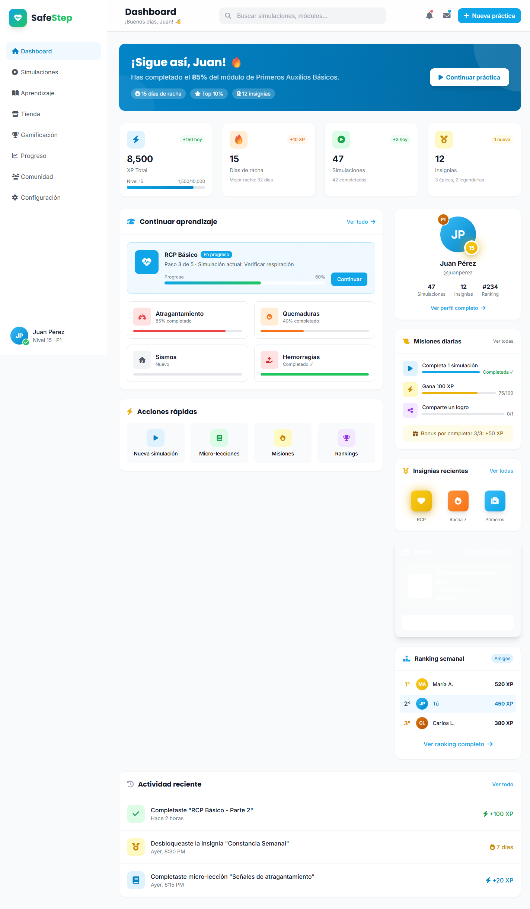
  <p>
    <i><b>Fuente</b>: Elaboración propia.</i>
  </p>
</div>

#### Descripción Visual

El dashboard desktop muestra:
- Header con logo, búsqueda, notificaciones, avatar
- Sidebar izquierdo con navegación principal
- Área de contenido principal con:
  - Mensaje de bienvenida personalizado
  - Card de "Continuar aprendiendo" con progreso
  - Recomendaciones de módulos
  - Stats de progreso del usuario

#### Interacciones Demostradas

- Click en navegación sidebar cambia contenido
- Hover en cards muestra énfasis
- Click en "Continuar" lleva a última lección
- Click en recomendaciones lleva a módulos sugeridos
- Notificaciones dropdown con click
- Perfil dropdown con opciones

#### Explicación del Flujo

El flujo principal mostrado:
1. Usuario llega al dashboard
2. Ve progreso actual y recomendaciones
3. Decide continuar aprendiendo o explorar
4. Navegación le permite ir a cualquier sección
5. Notificaciones informan de updates

### 4.5.2.3. Prototipo Desktop - Simulación Interactiva

El prototipo de simulación muestra la experiencia de práctica:

#### Screenshot de Referencia

<div align="center">
  <p>
    <b>Gráfico</b>: Prototipo desktop simulación parte 1
  </p>
  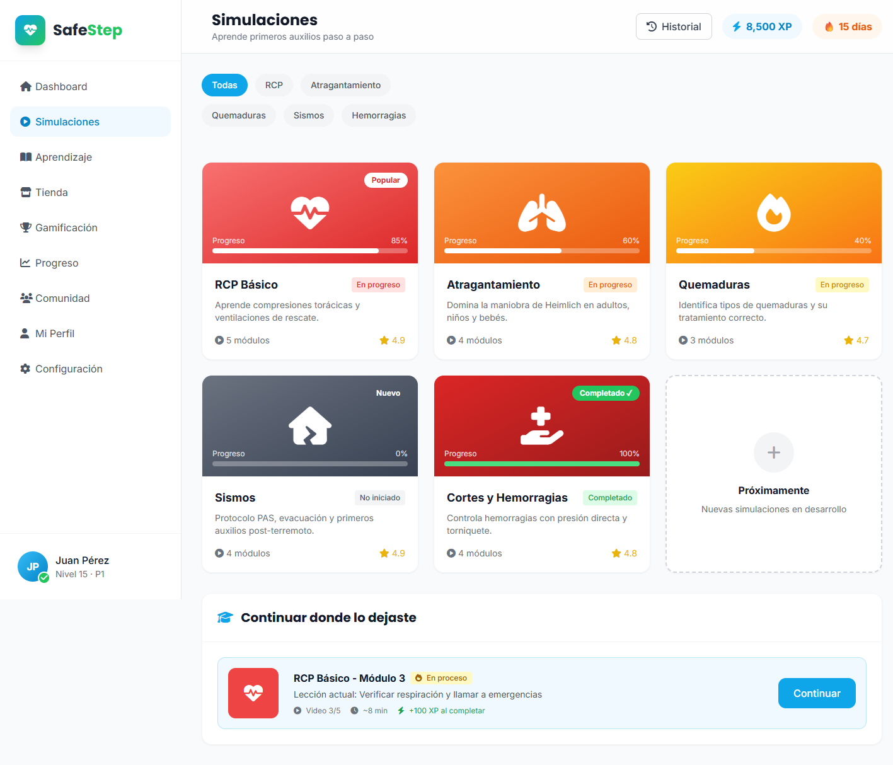
  <p>
    <i><b>Fuente</b>: Elaboración propia.</i>
  </p>
</div>

<div align="center">
  <p>
    <b>Gráfico</b>: Prototipo desktop simulación parte 2
  </p>
  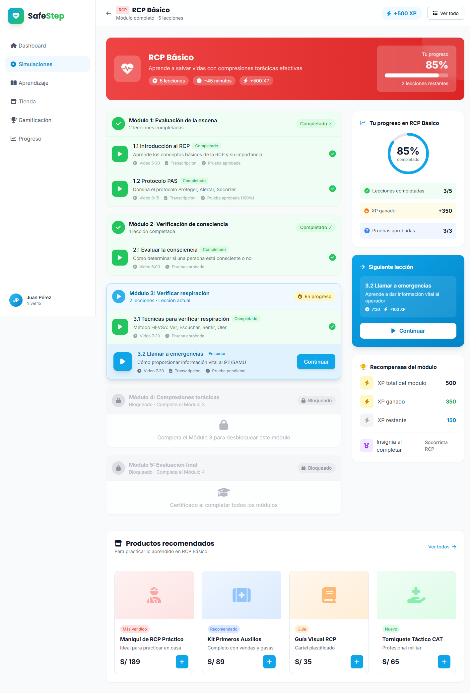
  <p>
    <i><b>Fuente</b>: Elaboración propia.</i>
  </p>
</div>

<div align="center">
  <p>
    <b>Gráfico</b>: Prototipo desktop simulación parte 3
  </p>
  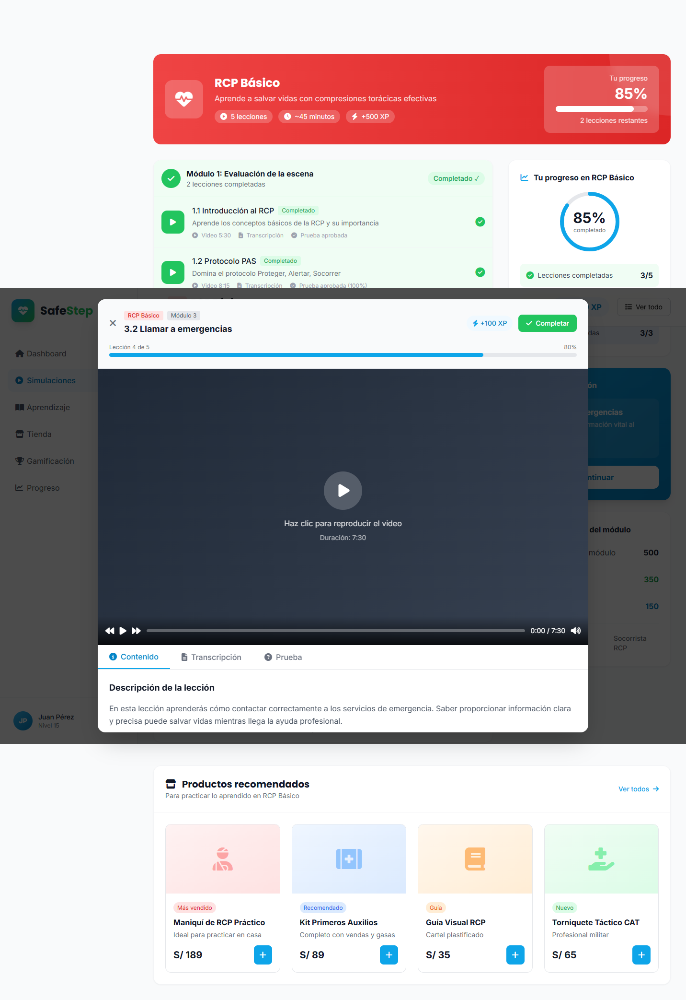
  <p>
    <i><b>Fuente</b>: Elaboración propia.</i>
  </p>
</div>

#### Descripción Visual

La página de simulación muestra:
- Header con indicador de progreso
- Área de escenario con situación
- Opciones de respuesta en formato de cards
- Botones de ayuda y controls

#### Interacciones Demostradas

- Click en opción selecciona respuesta
- Feedback inmediato (correcto/incorrecto)
- Botón "Siguiente" para avanzar
- Botón "Pista" muestra ayuda
- Timer counting down

#### Explicación del Flujo

El flujo de simulación:
1. Usuario selecciona simulación
2. Lee escenario inicial
3. Responde pregunta 1
4. Recibe feedback inmediato
5.Avanza a pregunta siguiente
6. Completa todas las preguntas
7. Ve resultados finales

### 4.5.2.4. Prototipo Desktop - Proceso de Compra

El prototipo de checkout muestra el flujo de compra:

#### Screenshot de Referencia

<div align="center">
  <p>
    <b>Gráfico</b>: Prototipo desktop proceso de compra parte 1
  </p>
  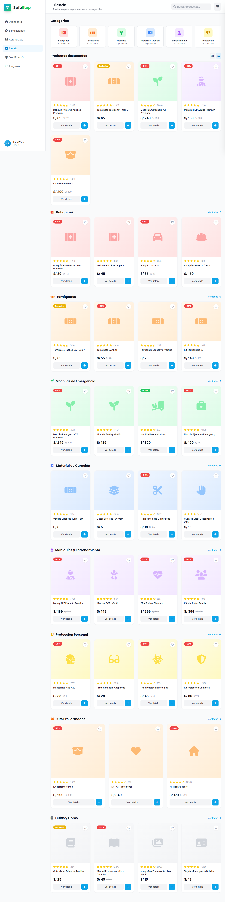
  <p>
    <i><b>Fuente</b>: Elaboración propia.</i>
  </p>
</div>

<div align="center">
  <p>
    <b>Gráfico</b>: Prototipo desktop proceso de compra parte 2
  </p>
  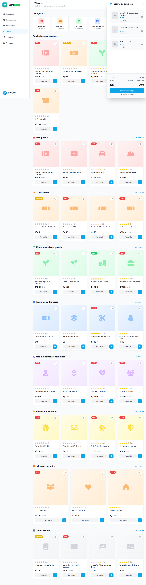
  <p>
    <i><b>Fuente</b>: Elaboración propia.</i>
  </p>
</div>

<div align="center">
  <p>
    <b>Gráfico</b>: Prototipo desktop proceso de compra parte 3
  </p>
  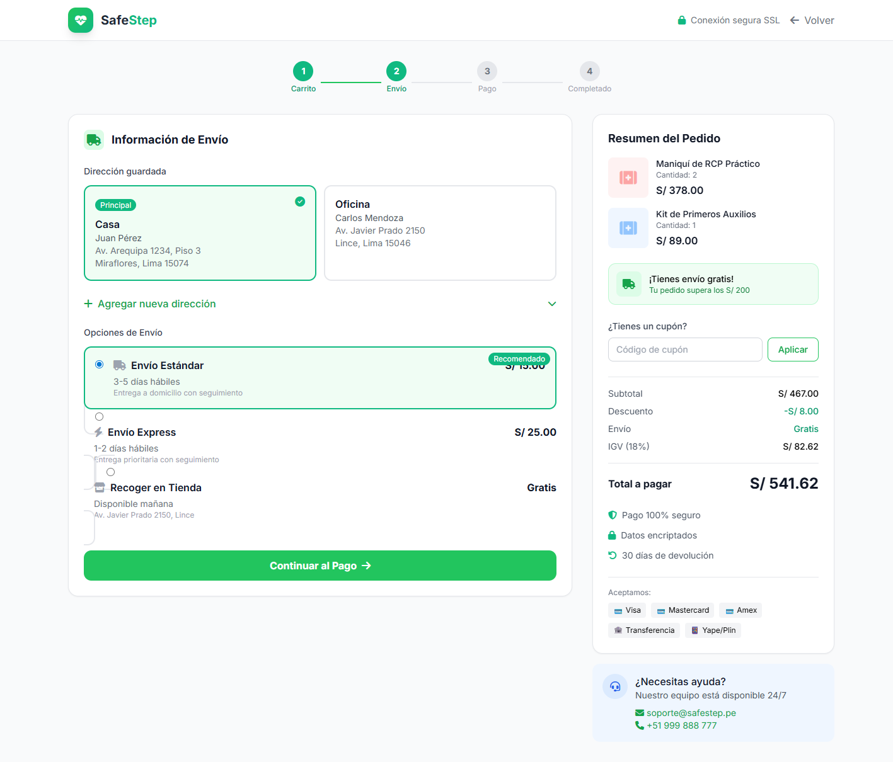
  <p>
    <i><b>Fuente</b>: Elaboración propia.</i>
  </p>
</div>

<div align="center">
  <p>
    <b>Gráfico</b>: Prototipo desktop proceso de compra parte 4
  </p>
  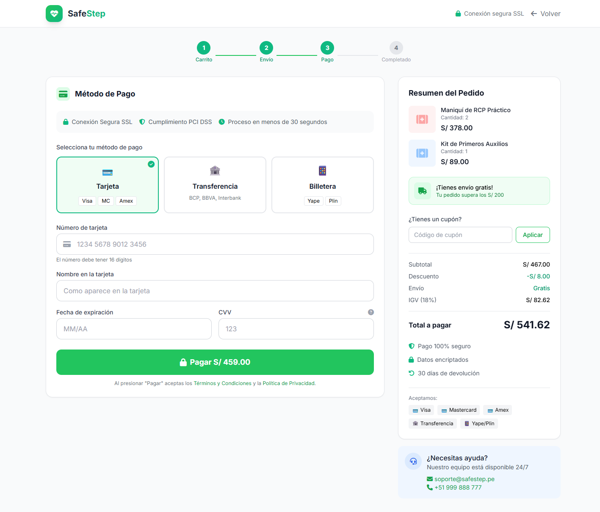
  <p>
    <i><b>Fuente</b>: Elaboración propia.</i>
  </p>
</div>

<div align="center">
  <p>
    <b>Gráfico</b>: Prototipo desktop proceso de compra parte 5
  </p>
  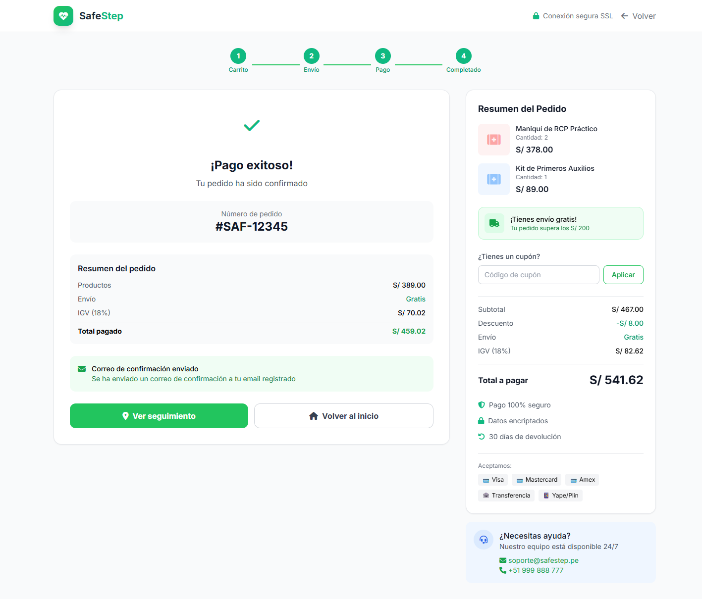
  <p>
    <i><b>Fuente</b>: Elaboración propia.</i>
  </p>
</div>

#### Descripción Visual

El checkout muestra:
- Pasos claramente marcados (1. Carrito, 2. Envío, 3. Pago, 4. Confirmación)
- Lista de productos en carrito
- Forms de información
- Resumen de orden

#### Interacciones Demostradas

- Navegación entre pasos
- Validación de forms en tiempo real
- Aplicación de cupones
- Selección de método de pago
- Confirmación de orden

#### Explicación del Flujo

El flujo de compra:
1. Revisa items en carrito
2. Ingresa/confirma dirección
3. Selecciona método de pago
4. Revisa orden completa
5. Confirma y paga
6. Recibe confirmación

### 4.5.2.5. Video Prototipo Desktop

El video del prototipo desktop demuestra las interacciones principales:

#### Contenido del Video

El video incluye:
1. Recorrido por dashboard (0:00-0:30)
2. Navegación a módulos (0:30-1:00)
3. Completar una lección (1:00-2:00)
4. Práctica de simulación (2:00-3:00)
5. Exploración de tienda (3:00-4:00)
6. Proceso de compra (4:00-5:30)

#### Enlace de Video

<div align="center">
  <p>
    <b>Gráfico</b>: Video del prototipo desktop
  </p>
  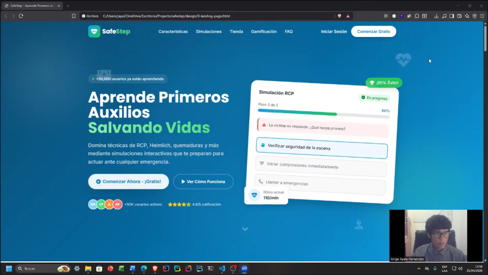
  <p>
    <i><b>Fuente</b>: Elaboración propia.</i>
  </p>
</div>

Enlace del video: https://youtu.be/_nZcADweJ3k

## 4.5.3. Prototipo Mobile

El prototipo mobile presenta la experiencia optimizada para dispositivos táctiles, especialmente smartphones.

### 4.5.3.1. Descripción General del Prototipo Mobile

El prototipo mobile de SafeStep recrea la experiencia en formato móvil, considerando las limitaciones y fortalezas de dispositivos táctiles.

#### Características Técnicas

**Resolución:**
- Optimizado para 320px a 428px de ancho
- Breakpoints: 320, 375, 414, 428
- Viewport meta tag configurado correctamente

**Interacciones:**
- Touch para todas las acciones
- Swipe gestures para navegación
- Pull-to-refresh donde aplica
- Gestures de zoom disponibles

**Componentes Mobile:**

Las siguientes vistas están incluidas:

1. **Home Mobile** - Dashboard adaptado
2. **Aprendizaje Mobile** - Contenido vertical scroll
3. **Simulación Mobile** - Tarjetas táctiles
4. **Tienda Mobile** - Grid optimizado
5. **Checkout Mobile** - Forms verticales

### 4.5.3.2. Prototipo Mobile - Dashboard

El prototipo del dashboard móvil:

#### Screenshot de Referencia

<div align="center">
  <p>
    <b>Gráfico</b>: Prototipo mobile dashboard
  </p>
  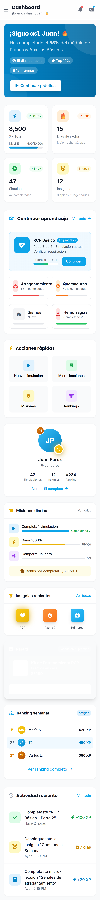
  <p>
    <i><b>Fuente</b>: Elaboración propia.</i>
  </p>
</div>

#### Descripción Visual

El dashboard móvil muestra:
- Header compacto con hamburger menú
- Contenido en layout vertical scroll
- Bottom navigation bar para acceso rápido
- Cards apiladas verticalmente

#### Interacciones Demostradas

- Hamburger menu abre drawer
- Pull down para refresh
- Scroll vertical estándar
- Bottom nav clicks cambian vista

### 4.5.3.3. Prototipo Mobile - Simulación

El prototipo de simulación móvil:

#### Screenshot de Referencia

<div align="center">
  <p>
    <b>Gráfico</b>: Prototipo mobile simulación parte 1
  </p>
  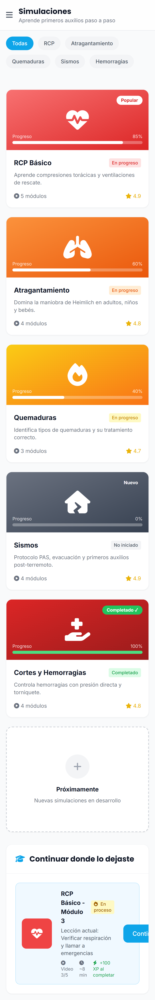
  <p>
    <i><b>Fuente</b>: Elaboración propia.</i>
  </p>
</div>

<div align="center">
  <p>
    <b>Gráfico</b>: Prototipo mobile simulación parte 2
  </p>
  
  <p>
    <i><b>Fuente</b>: Elaboración propia.</i>
  </p>
</div>

<div align="center">
  <p>
    <b>Gráfico</b>: Prototipo mobile simulación parte 3
  </p>
  
  <p>
    <i><b>Fuente</b>: Elaboración propia.</i>
  </p>
</div>

#### Descripción Visual

La simulación móvil muestra:
- Progreso en header
- Tarjetas de respuesta grandes (touch-friendly)
- Espacio suficiente entre opciones
- Botones de control accesibles

#### Interacciones Demostradas

- Tap simple en opciones
- Swipe entre preguntas (opcional)
- Botones grandes y táctiles
- Feedback visual claro

### 4.5.3.4. Prototipo Mobile - Tienda

El prototipo de tienda móvil:

#### Screenshot de Referencia

<div align="center">
  <p>
    <b>Gráfico</b>: Prototipo mobile proceso de compra parte 1
  </p>
  
  <p>
    <i><b>Fuente</b>: Elaboración propia.</i>
  </p>
</div>

<div align="center">
  <p>
    <b>Gráfico</b>: Prototipo mobile proceso de compra parte 2
  </p>
  
  <p>
    <i><b>Fuente</b>: Elaboración propia.</i>
  </p>
</div>

<div align="center">
  <p>
    <b>Gráfico</b>: Prototipo mobile proceso de compra parte 3
  </p>
  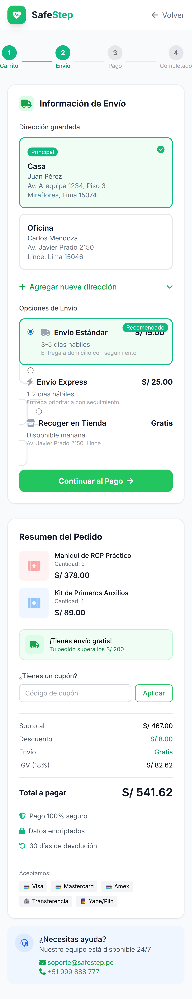
  <p>
    <i><b>Fuente</b>: Elaboración propia.</i>
  </p>
</div>

<div align="center">
  <p>
    <b>Gráfico</b>: Prototipo mobile proceso de compra parte 4
  </p>
  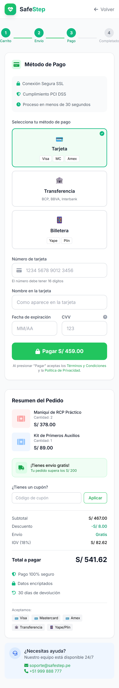
  <p>
    <i><b>Fuente</b>: Elaboración propia.</i>
  </p>
</div>

<div align="center">
  <p>
    <b>Gráfico</b>: Prototipo mobile proceso de compra parte 5
  </p>
  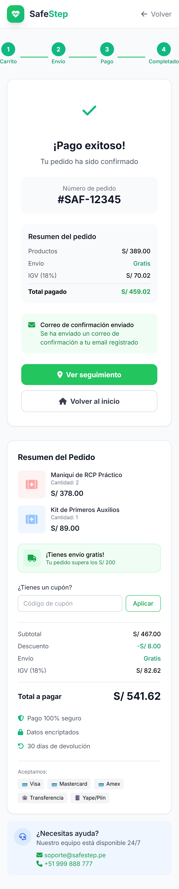
  <p>
    <i><b>Fuente</b>: Elaboración propia.</i>
  </p>
</div>

#### Descripción Visual

La tienda móvil muestra:
- Product grid 2 columnas
- Filtros en sheet inferior
- Carrito en badge de header
- Checkout simplificado

### 4.5.3.5. Video Prototipo Mobile

El video del prototipo mobile demuestra las interacciones touch:

#### Contenido del Video

El video incluye:
1. App launch y splash (0:00-0:10)
2. Login en móvil (0:10-0:30)
3. Navegación bottom nav (0:30-1:00)
4. Exploración de módulos (1:00-1:30)
5. Completar lección móvil (1:30-2:30)
6. Tienda y compra (2:30-4:00)

#### Enlace de Video

<div align="center">
  <p>
    <b>Gráfico</b>: Video del prototipo mobile
  </p>
  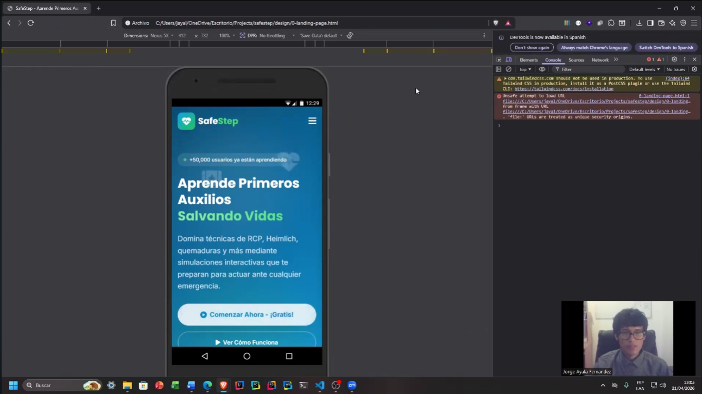
  <p>
    <i><b>Fuente</b>: Elaboración propia.</i>
  </p>
</div>

Enlace del video: https://youtu.be/cFe5_H0TDsA

## 4.5.4. Flujos de Interacción Principales

Los prototipos demuestran los flujos de interacción principales de SafeStep:

### 4.5.4.1. Flow: Onboarding

El flujo de onboarding introduce nuevos usuarios a la plataforma:

```
[1. Landing] -> [Clic "Comenzar"] -> [Registro] -> [Onboarding:
    | Seleccionar intereses] -> [Recomendaciones basadas] ->
    | [Dashboard]
```

**Puntos clave demostrados:**
- Proceso de registro fluido
- Personalización inicial
- Introducción suave a la plataforma

### 4.5.4.2. Flow: Aprendizaje

El flujo muestra cómo usuarios aprenden:

```
[1. Dashboard] -> [Ir a Aprender] -> [Seleccionar Módulo] ->
    | [Lección 1: Teoría] -> [Completar] ->
    | [Lección 1: Video] -> [Completar] ->
    | [Lección 1: Evaluación] -> [Completar] ->
    | [Certificado] -> [Siguiente Módulo]
```

**Puntos clave demostrados:**
- Progresión clara dentro de módulos
- Feedback después de cada etapa
- Motivación con certificado

### 4.5.4.3. Flow: Simulación

El flujo de práctica muestra interacción:

```
[1. Dashboard] -> [Simulaciones] -> [Seleccionar] ->
    | [Instrucciones] -> [Comenzar] ->
    | [Preguntas] -> [Respuestas] -> [Feedback] ->
    | [Resultados]
```

**Puntos clave demostrados:**
- Presión de tiempo (opcional)
- Feedback inmediato
- Aprender de errores

### 4.5.4.4. Flow: Compra

El flujo de compra evidencia el e-commerce:

```
[1. Tienda] -> [Productos] -> [Detalle] -> [Agregar] ->
    | [Carrito] -> [Checkout] -> [Pago] ->
    | [Confirmación] -> [Tracking]
```

**Puntos clave demostrados:**
- Proceso claro de checkout
- Confirmaciones en cada paso
- Acceso a seguimiento de orden

## 4.5.5. Herramientas Utilizadas

Los prototipos fueron creados usando las siguientes herramientas:

### Herramientas de Prototipado

- **Figma**: Herramienta principal para creación de prototipos
- **Principle**: Para micro-interacciones
- **Prototype**: Para prototipado avanzado
- **Adobe XD**: Alternativa para otras vistas

### Especificaciones Técnicas

El prototipo cumple con:
- HTML/CSS funcional
- JavaScript básico para interacciones
- Responsive adaptation
- Transiciones suaves 60fps
- Loading states apropiados

# 4.6. Domain-Driven Software Architecture

En esta sección se detalla la arquitectura de software de **SafeStep**, empleando los principios de **Domain-Driven Design (DDD)** para asegurar una alineación precisa entre las necesidades del dominio médico y la implementación técnica. El proceso de diseño se divide en dos fases fundamentales: primero, el refinamiento de la lógica de negocio mediante el **Design-Level Event Storming**, donde se identifican los agregados y políticas que rigen el sistema. Posteriormente, se aplica el **Modelo C4** para documentar la estructura del software en tres niveles de abstracción (Contexto, Contenedores y Componentes). Este enfoque permite visualizar desde las interacciones macro con sistemas externos hasta la organización interna de los módulos en **Spring Boot**, garantizando una arquitectura escalable, modular y centrada en ofrecer una experiencia de aprendizaje y equipamiento óptima para estudiantes y brigadistas.

## 4.6.1. Design-Level Event Storming

En esta fase, el equipo aplica la técnica de **Design-Level Event Storming** para refinar la comprensión del dominio de SafeStep y descubrir el modelo de software subyacente. Partiendo de los eventos de dominio clave identificados en el *Big Picture Event Storming*, se profundiza en la lógica de negocio para definir los comandos que los desencadenan, los actores que los inician y las políticas (reglas de negocio) que los gobiernan. Este proceso colaborativo permite identificar los agregados (Aggregates), que son los componentes centrales del modelo de dominio, como `Usuario`, `Simulacion`, `Curso` y `Orden`. El resultado es un mapa detallado que sirve como base para el diseño de los componentes de software, asegurando que la arquitectura esté alineada con las reglas y flujos de trabajo del mundo real de la capacitación en primeros auxilios y el comercio electrónico.

### 4.6.1.1. Fase 1 Unstructured Exploration (Lluvia de ideas)

En esta fase se realiza una lluvia de ideas masiva de los hechos significativos del negocio denominados domain events, los cuales se registran en notas naranjas y se redactan obligatoriamente en tiempo pasado, sin priorizar inicialmente el orden o la duplicidad de los mismos.

<div align="center">
    <a href="https://miro.com/app/live-embed/uXjVGlN0dvA=/?focusWidget=3458764667282704465&embedMode=view_only_without_ui&embedId=667671003239" target="_blank">
        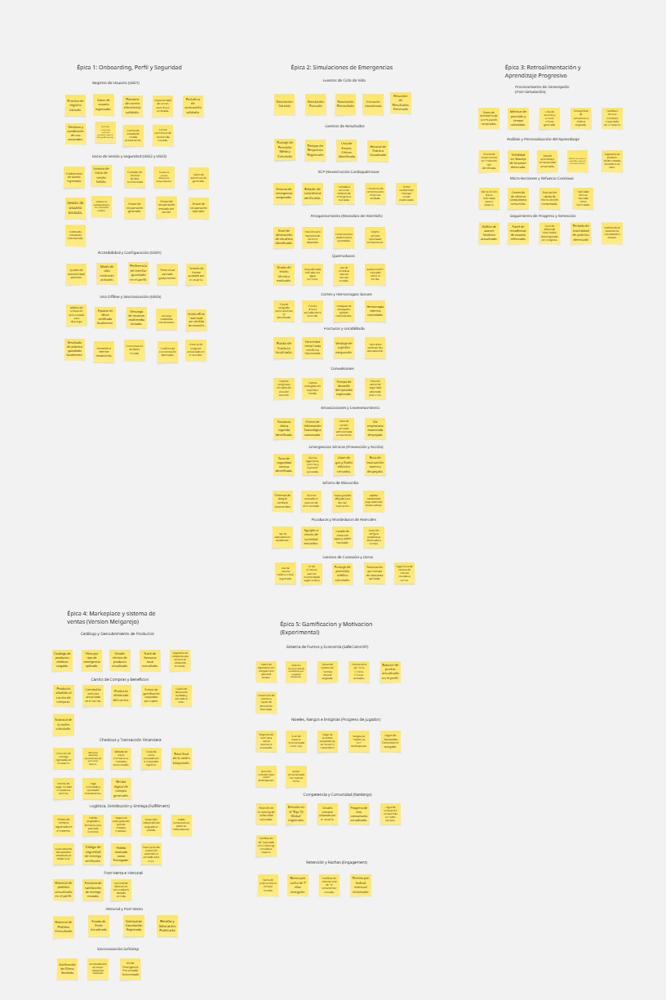
    </a>
    <br>
    <sub><em>Haz clic en la imagen para ver el tablero en Miro</em></sub>
</div>

### 4.6.1.2. Fase 2 Timelines (Línea de tiempo)

Consiste en organizar los domain events en orden cronológico, comenzando por el "happy path" (escenario de éxito). Posteriormente, se integran los escenarios alternativos y se refina el flujo eliminando duplicados o corrigiendo eventos erróneos para asegurar la coherencia del proceso.

<div align="center">
    <a href="https://miro.com/app/live-embed/uXjVGlN0dvA=/?focusWidget=3458764667285676558&embedMode=view_only_without_ui&embedId=667671003239" target="_blank">
        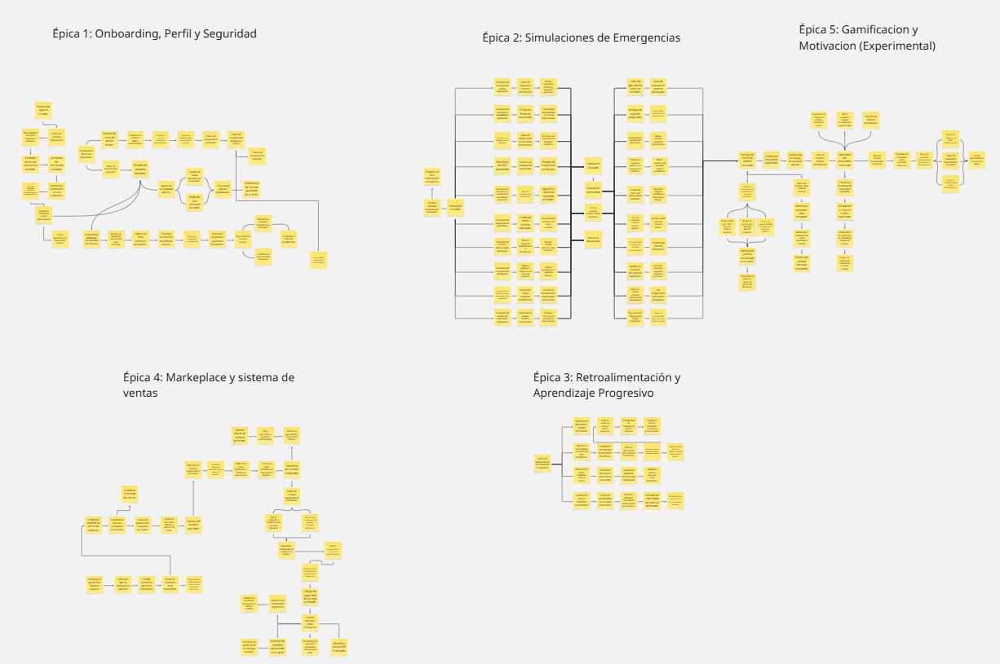
    </a>
    <br>
    <sub><em>Haz clic en la imagen para ver el tablero en Miro</em></sub>
</div>

### 4.6.1.3. Fase 3 Pain Points (Puntos críticos)

Se analiza la línea de tiempo para identificar ineficiencias como cuellos de botella, procesos manuales o vacíos de información. Estos puntos se señalizan con notas rosadas rotadas (en forma de diamante) para asegurar que sean abordados durante el diseño técnico.

<div align="center">
    <a href="https://miro.com/app/live-embed/uXjVGlN0dvA=/?focusWidget=3458764667285757095&embedMode=view_only_without_ui&embedId=667671003239" target="_blank">
        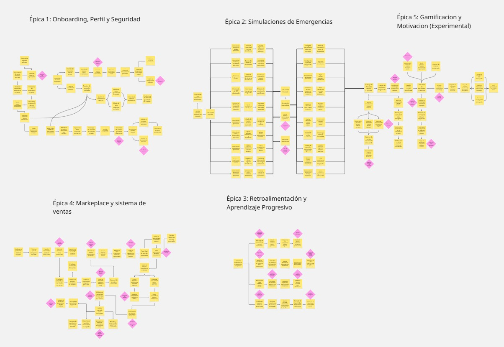
    </a>
    <br>
    <sub><em>Haz clic en la imagen para ver el tablero en Miro</em></sub>
</div>

### 4.6.1.4. Fase 4 Pivotal Events (Eventos cruciales)

Se identifican eventos de negocio significativos que marcan un cambio de fase o contexto en el proceso. Estos se señalan con una barra vertical y son los principales indicadores para definir los límites de los Bounded Contexts (módulos del sistema).

<div align="center">
    <a href="https://miro.com/app/live-embed/uXjVGlN0dvA=/?focusWidget=3458764667285757655&embedMode=view_only_without_ui&embedId=667671003239" target="_blank">
        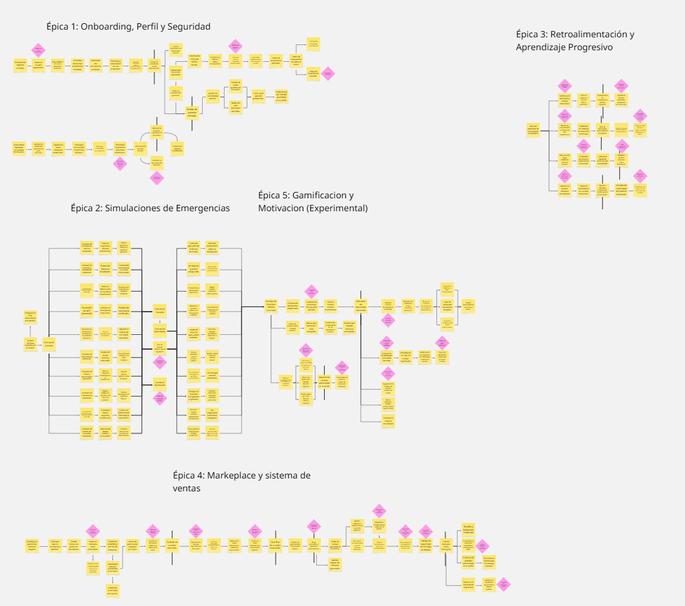
    </a>
    <br>
    <sub><em>Haz clic en la imagen para ver el tablero en Miro</em></sub>
</div>

### 4.6.1.5. Fase 5 Commands (Comandos)

Describe la acción o el desencadenante que activa un evento o flujo de eventos. Se redacta en imperativo y se representa con notas azul claro. Si el comando es ejecutado por un rol específico, se incluye la información del actor mediante una pequeña nota amarilla.

<div align="center">
    <a href="https://miro.com/app/live-embed/uXjVGlN0dvA=/?focusWidget=3458764667285899995&embedMode=view_only_without_ui&embedId=667671003239" target="_blank">
        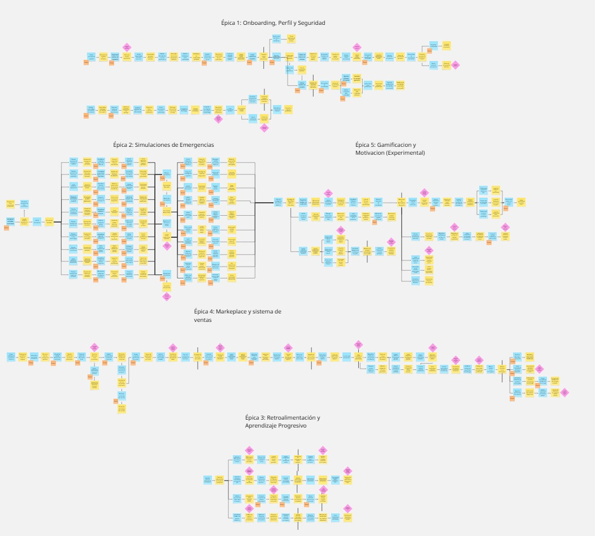
    </a>
    <br>
    <sub><em>Haz clic en la imagen para ver el tablero en Miro</em></sub>
</div>

### 4.6.1.6. Fase 6 Policies (Políticas)

Identifica las reglas de automatización donde un domain event activa automáticamente la ejecución de un command. Estas políticas se representan con notas púrpuras y sirven para definir la lógica de reacción del sistema sin intervención directa de un actor, permitiendo especificar criterios de decisión si es necesario.

<div align="center">
    <a href="https://miro.com/app/live-embed/uXjVGlN0dvA=/?focusWidget=3458764667285900230&embedMode=view_only_without_ui&embedId=667671003239" target="_blank">
        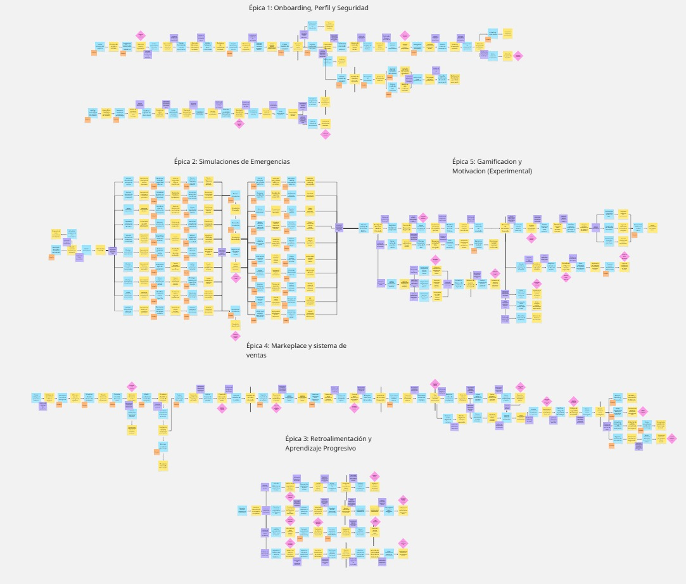
    </a>
    <br>
    <sub><em>Haz clic en la imagen para ver el tablero en Miro</em></sub>
</div>

### 4.6.1.7. Fase 7 Read Models (Modelos de lectura)

Un read model es la vista de datos (pantallas, informes o notificaciones) que un actor utiliza para tomar la decisión de ejecutar un comando. Se representa con notas verdes y se coloca en el flujo antes del comando que respalda.

<div align="center">
    <a href="https://miro.com/app/live-embed/uXjVGlN0dvA=/?focusWidget=3458764668346650835&embedMode=view_only_without_ui&embedId=667671003239" target="_blank">
        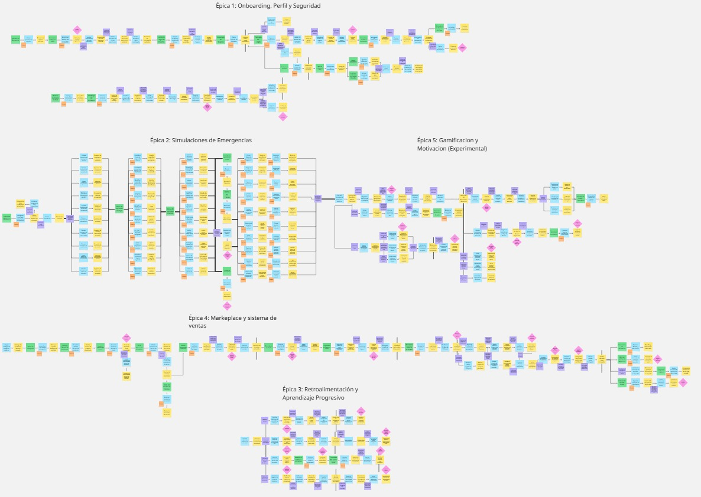
    </a>
    <br>
    <sub><em>Haz clic en la imagen para ver el tablero en Miro</em></sub>
</div>

### 4.6.1.8. Fase 8 External Systems (Sistemas externos)

Se refiere a cualquier sistema fuera del dominio que se está explorando. Estos sistemas pueden ejecutar comandos (entrada) o recibir notificaciones sobre eventos (salida). Se representan con notas rosadas y permiten modelar la interacción de SafeStep con servicios externos, como pasarelas de pago o proveedores de mapas.

<div align="center">
    <a href="https://miro.com/app/live-embed/uXjVGlN0dvA=/?focusWidget=3458764668352244008&embedMode=view_only_without_ui&embedId=667671003239" target="_blank">
        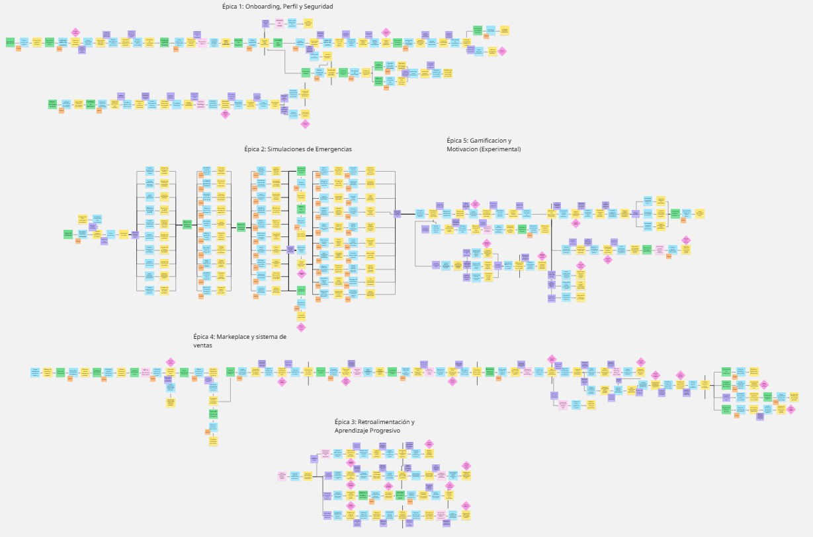
    </a>
    <br>
    <sub><em>Haz clic en la imagen para ver el tablero en Miro</em></sub>
</div>

### 4.6.1.9. Fase 9 Aggregates (Agregados)

En este paso, se organizan los conceptos relacionados en agregados, los cuales tienen la responsabilidad de recibir comandos y producir eventos. Se representan mediante notas adhesivas amarillas grandes, ubicando los comandos a la izquierda y los eventos resultantes a la derecha del agregado.

<div align="center">
    <a href="https://miro.com/app/live-embed/uXjVGlN0dvA=/?focusWidget=3458764668357193046&embedMode=view_only_without_ui&embedId=667671003239" target="_blank">
        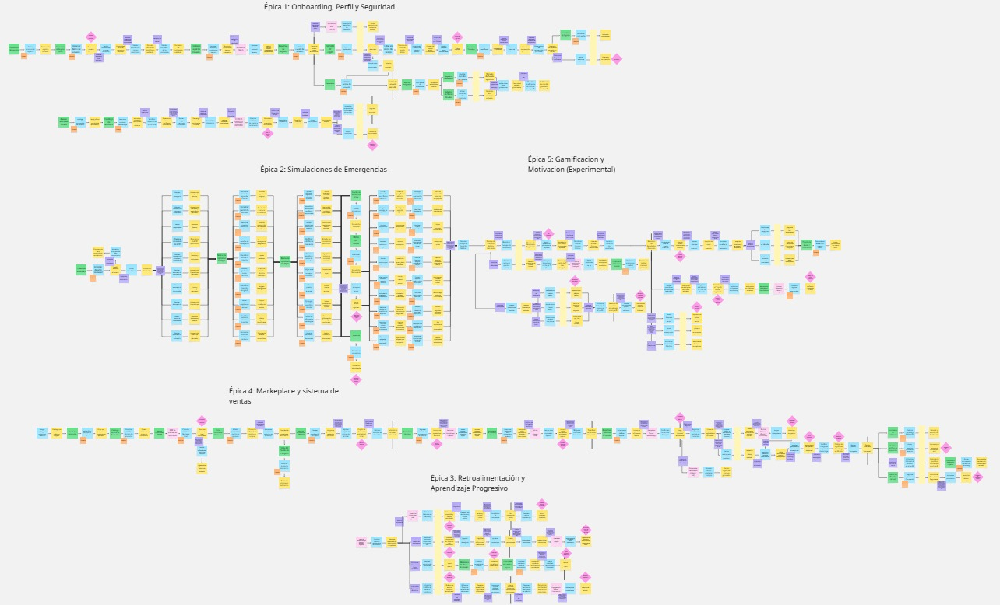
    </a>
    <br>
    <sub><em>Haz clic en la imagen para ver el tablero en Miro</em></sub>
</div>

### 4.6.1.10. Fase 10  Bounded Contexts (Contextos delimitados)

Es el paso final donde se agrupan los agregados que están relacionados entre sí, ya sea por su funcionalidad o por estar vinculados a través de políticas. Estos grupos definen los límites de los Bounded Contexts, estableciendo las fronteras lógicas y técnicas de los diferentes módulos del sistema.

<div align="center">
    <a href="https://miro.com/app/live-embed/uXjVGlN0dvA=/?focusWidget=3458764668372090204&embedMode=view_only_without_ui&embedId=667671003239" target="_blank">
        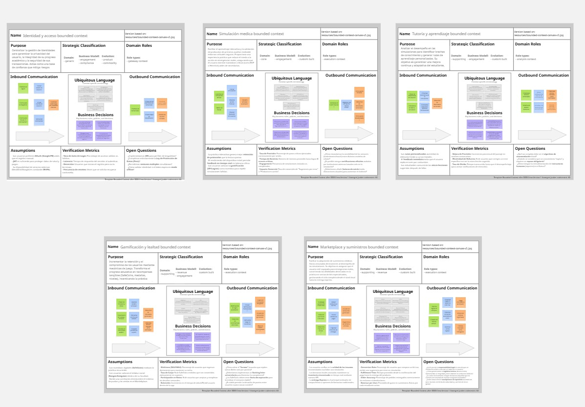
    </a>
    <br>
    <sub><em>Haz clic en la imagen para ver el tablero en Miro</em></sub>
</div>

<div align="center">
    <a href="https://miro.com/app/live-embed/uXjVGlN0dvA=/?focusWidget=3458764668372090204&embedMode=view_only_without_ui&embedId=667671003239" target="_blank">
        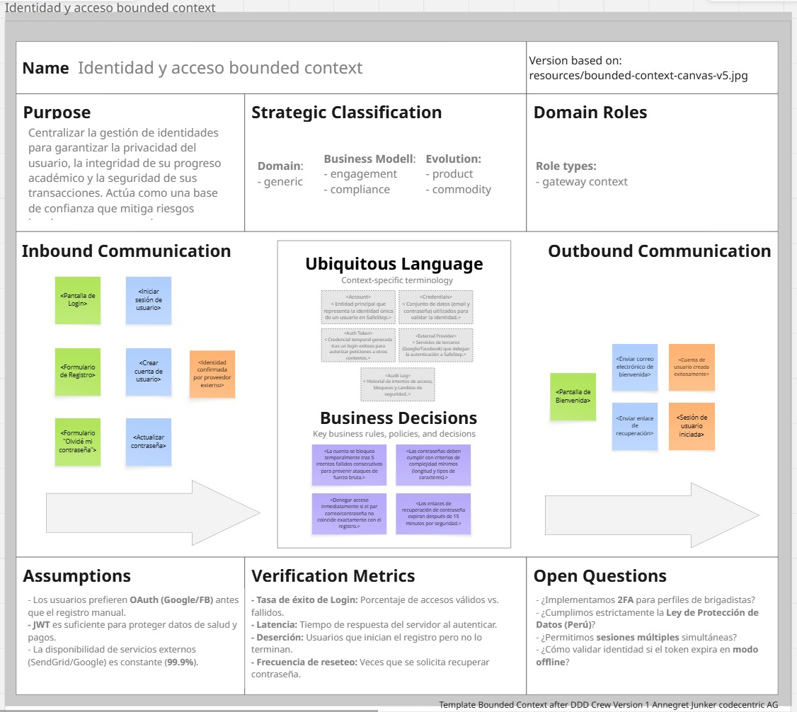
    </a>
    <br>
    <sub><em>Haz clic en la imagen para ver el tablero en Miro</em></sub>
</div>

<div align="center">
    <a href="https://miro.com/app/live-embed/uXjVGlN0dvA=/?focusWidget=3458764668372090204&embedMode=view_only_without_ui&embedId=667671003239" target="_blank">
        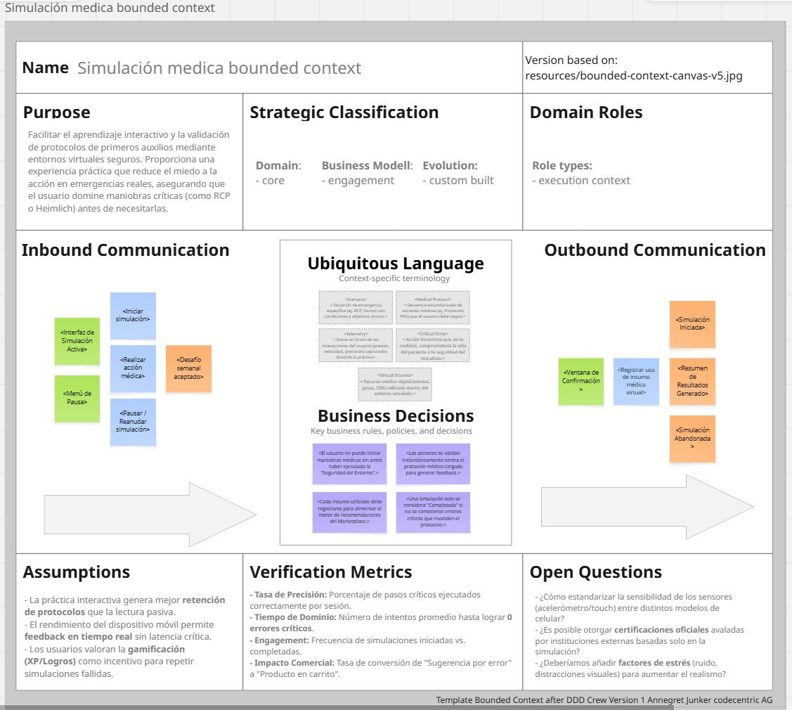
    </a>
    <br>
    <sub><em>Haz clic en la imagen para ver el tablero en Miro</em></sub>
</div>

<div align="center">
    <a href="https://miro.com/app/live-embed/uXjVGlN0dvA=/?focusWidget=3458764668372090204&embedMode=view_only_without_ui&embedId=667671003239" target="_blank">
        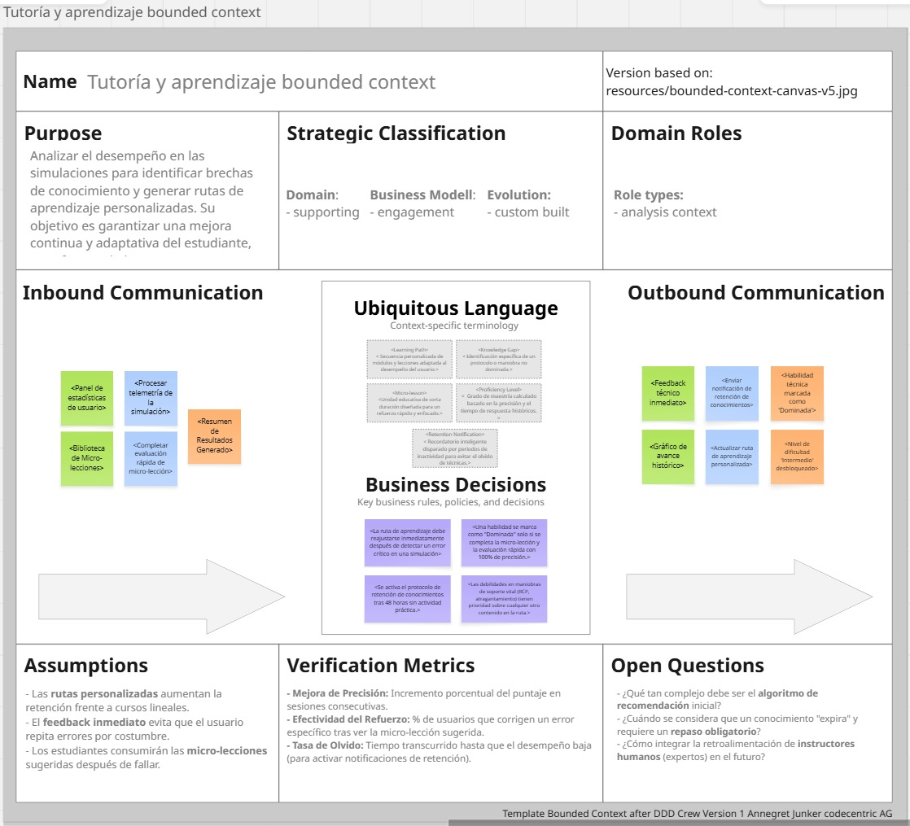
    </a>
    <br>
    <sub><em>Haz clic en la imagen para ver el tablero en Miro</em></sub>
</div>

<div align="center">
    <a href="https://miro.com/app/live-embed/uXjVGlN0dvA=/?focusWidget=3458764668372090204&embedMode=view_only_without_ui&embedId=667671003239" target="_blank">
        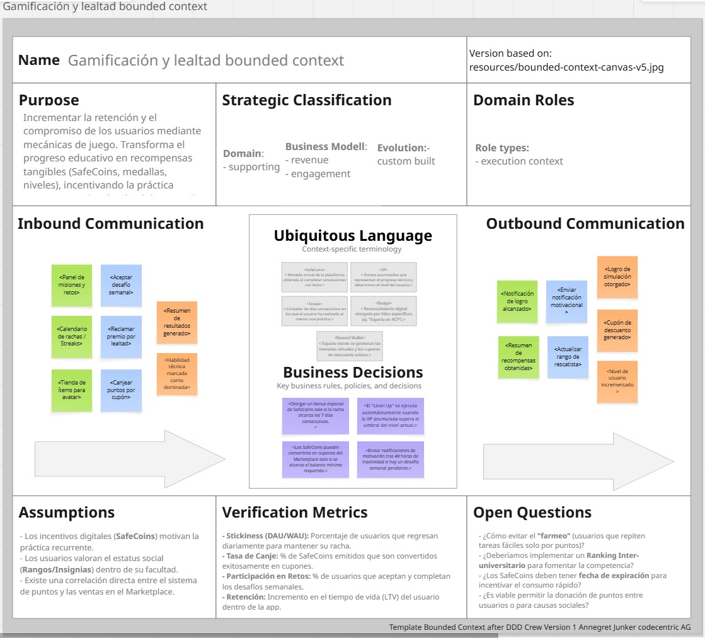
    </a>
    <br>
    <sub><em>Haz clic en la imagen para ver el tablero en Miro</em></sub>
</div>

<div align="center">
    <a href="https://miro.com/app/live-embed/uXjVGlN0dvA=/?focusWidget=3458764668372090204&embedMode=view_only_without_ui&embedId=667671003239" target="_blank">
        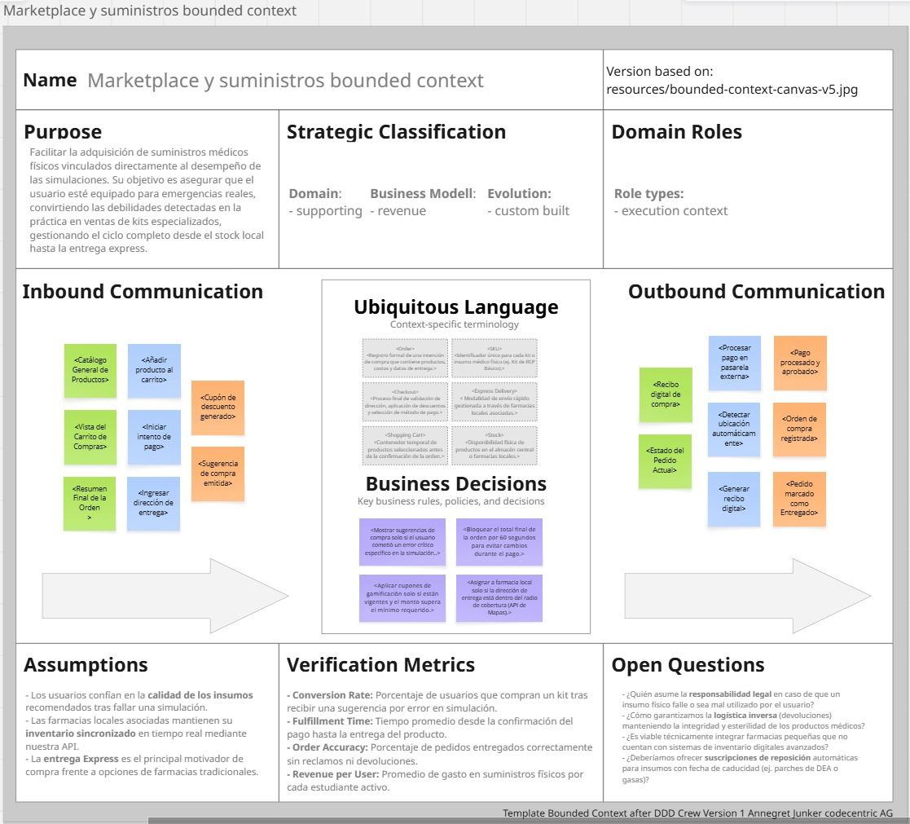
    </a>
    <br>
    <sub><em>Haz clic en la imagen para ver el tablero en Miro</em></sub>
</div>


## 4.6.2. Software Architecture Context Diagram

Representa el nivel más alto de abstracción del sistema. Su propósito es definir los límites de la solución, mostrando el software como un nodo central (caja negra) conectado con sus actores (usuarios) y sistemas externos (servicios de terceros o APIs externas). Esta vista es clave para entender el ecosistema general y el flujo de información de alto nivel sin entrar en detalles de infraestructura o código.

<div align="center">
    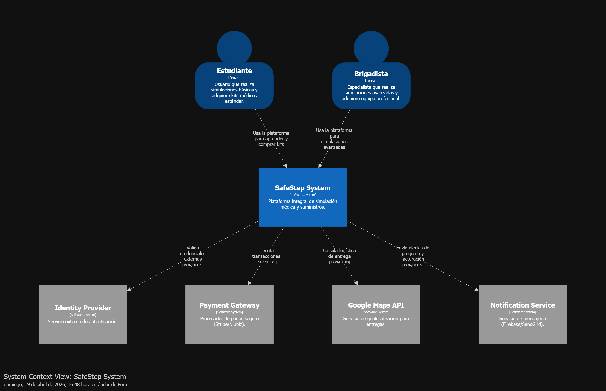
</div>

## 4.6.3. Software Architecture Container Diagrams

Representa el segundo nivel de detalle, donde se hace un "zoom" al sistema para mostrar sus unidades de software distribuidas (Containers). Un container puede ser una aplicación web, una aplicación móvil, una API REST o una base de datos. Este diagrama describe la tecnología elegida, las responsabilidades de cada bloque y cómo se comunican entre sí (ej. mediante protocolos HTTP, gRPC o colas de mensajería).

<div align="center">
    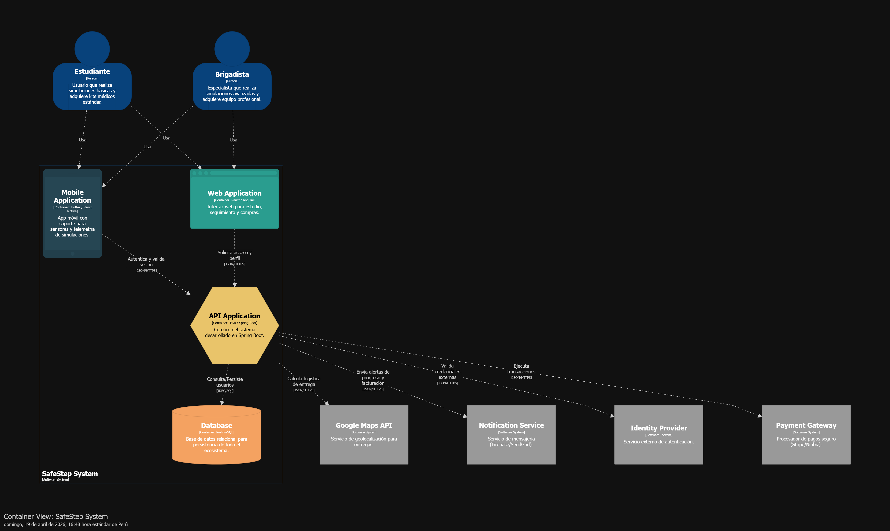
</div>


## 4.6.4. Software Architecture Components Diagrams

Este diagrama representa el tercer nivel de detalle del modelo C4, realizando un "zoom" sobre un contenedor específico para desglosar sus componentes internos. En el caso de tu proyecto, muestra cómo se organiza la lógica de negocio mediante controladores, servicios y repositorios, siguiendo típicamente los patrones de Domain-Driven Design (DDD) o Arquitectura Hexagonal. Su objetivo es identificar las responsabilidades de cada módulo de código y cómo interactúan entre sí para cumplir con las funcionalidades del sistema.

<div align="center">
    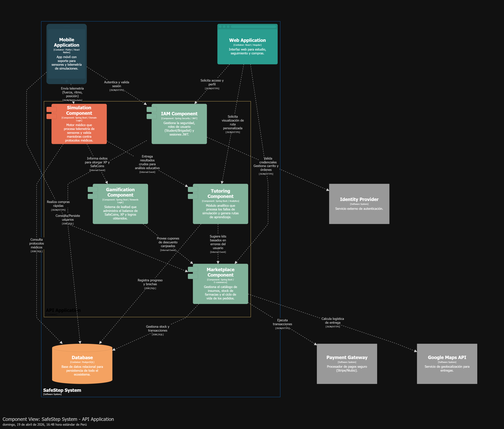
</div>

# 4.7. Software Object-Oriented Design

En esta sección, se presenta el diseño orientado a objetos del software SafeStep. A través de diagramas de clases, se modela la estructura estática del sistema, detallando las clases, sus atributos, métodos y las relaciones entre ellas. Este diseño sirve como un plano para la implementación del código, asegurando que la arquitectura de software definida previamente se traduzca en componentes de código bien estructurados, mantenibles y escalables.

## 4.7.1. Class Diagrams

<div align="center">
    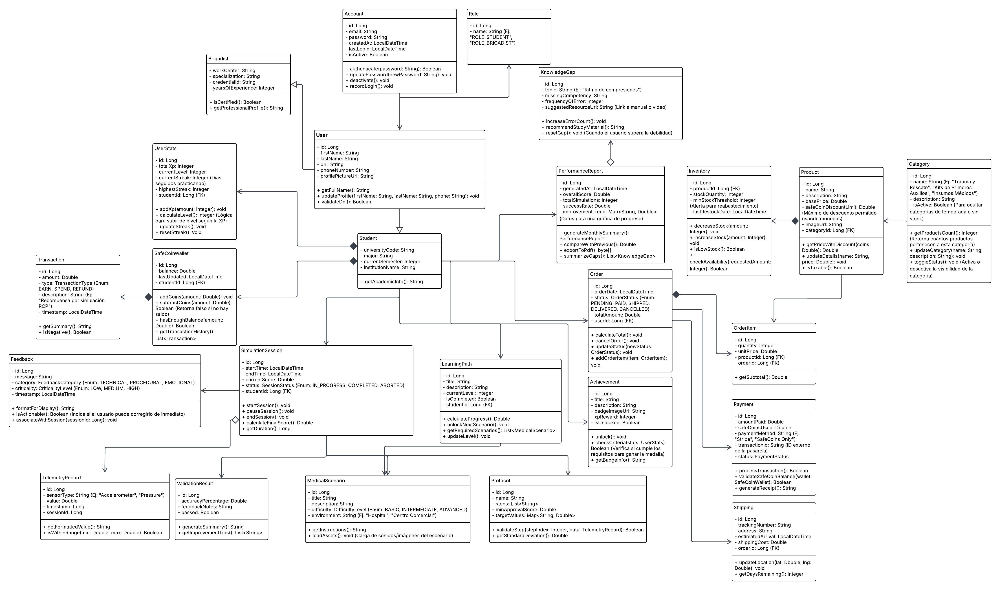
</div>

Enlace del [Lucid chart](https://lucid.app/lucidchart/7ddfadb8-eb84-4e7b-88b1-c8e598e33bd8/edit?viewport_loc=-2020%2C-730%2C5980%2C2608%2C0_0&invitationId=inv_4a079dbe-cf5b-4732-a2b7-d7691be6e3fa)

# 4.8. Database Design

## 4.8.1. Database Diagrams

El siguiente Diagrama Entidad-Relación (ERD) representa la estructura de datos fundamental que soporta toda la lógica de la plataforma SafeStep. Este modelo relacional, compuesto por 33 entidades, ha sido diseñado aplicando las 3 fases de normalizacion. Para garantizar la escalabilidad, el mantenimiento y la separación de responsabilidades, la base de datos se ha estructurado en 5 paquetes o módulos lógicos:
### 1. Gestión de Usuarios y Seguridad: 
Controla la identidad, el Control de Acceso Basado en Roles (RBAC), el manejo de sesiones activas (para bloqueos de seguridad) y la libreta de direcciones de los usuarios.
### 2. Motor de Simulaciones:
Es el núcleo educativo. Gestiona los módulos de aprendizaje, el catálogo de escenarios interactivos (RCP, Sismos, etc.) y guarda un historial detallado de los intentos y errores específicos para generar recomendaciones personalizadas.
### 3. Motor de Gamificación:
Diseñado para maximizar la retención. Administra el progreso del usuario (Niveles y XP), misiones con caducidad de tiempo, insignias y el sistema de economía virtual (SafeCoins) para la adquisición de artículos cosméticos.
### 4. Marketplace y Logística:
Gestiona el catálogo de productos físicos (Kits de emergencia, torniquetes), permitiendo la creación de productos compuestos, el control de inventario y el sistema de reseñas y favoritos.
### 5. Ventas y Transacciones:
Maneja el flujo de conversión, desde el carrito de compras persistente, validación de cupones, hasta el registro de la orden final, la pasarela de pagos y el proceso de devoluciones con evidencia documentada.

<div align="center">
    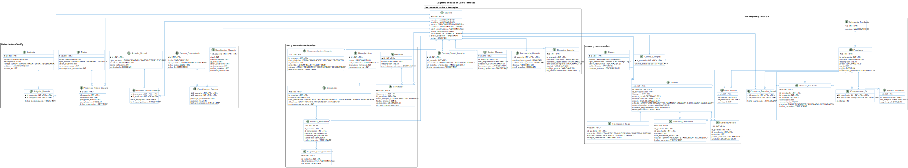
</div>

<br>
<br>

<div align="center">
    
</div>

<br>
<br>

# 5.1. Software Configuration Management

## 5.1.1. Software Development Environment Configuration

En este apartado nos encargaremos de decir a grandes rasgos todos los avances que se harán durante el ciclo de vida del proyecto. Con los detalles perminentes de manera general, luego posteriormente, en el sprint 1 se hablará acerca de los detalles que se harán solo en ese apartado que se enfocará en el Landing Page

### 5.1.1.1. Herramientas de Gestión de Proyectos y Requisitos

| Herramienta | Propósito |URL de Referencia | Tipo |
|-------------|-----------|------------------|------|
| Trello | Gestión del Product Backlog, Sprint Boards y seguimiento de tareas del proyecto | https://trello.com | SaaS |
| GitHub Projects | Gestión de Issues y seguimiento del progreso del desarrollo en sincronización con los repositorios | https://github.com/upc-1asi0729-2610-11990-chronos-team-3 | SaaS |
| Google Drive | Almacenamiento y colaboración documentos de análisis y requerimientos | https://drive.google.com | SaaS |
| Discord | Comunicación en tiempo real del equipo y reuniones virtuales | https://discord.com | SaaS |

### 5.1.1.2. Herramientas de Diseño UX/UI

| Herramienta | Propósito |URL de Referencia | Tipo |
|-------------|-----------|------------------|------|
| Figma | Diseño de interfaces, wireframes, mockups y prototipos interactivos | https://www.figma.com | SaaS |
| Canva | Creación de assets gráficos, presentaciones y materiales visuales | https://www.canva.com | SaaS |

### 5.1.1.3. Herramientas de Desarrollo Frontend

| Herramienta | Propósito |URL de Referencia | Tipo |
|-------------|-----------|------------------|------|
| Visual Studio Code | Editor de código principal para el desarrollo del frontend Angular | https://code.visualstudio.com | Descargable |
| Angular CLI | Interfaz de línea de comandos para crear, desarrollar y builds de proyectos Angular | https://angular.io/cli | Descargable (npm) |
| Node.js | Entorno de ejecución JavaScript del lado del servidor para servicios de desarrollo | https://nodejs.org | Descargable |
| npm | Gestor de paquetes para JavaScript, utilizado para instalar dependencias de Angular | https://www.npmjs.com | Descargable |
| TypeScript | Lenguaje de programación strongly-typed que compila a JavaScript | https://www.typescriptlang.org | Descargable (npm) |

### 5.1.1.4. Herramientas de Desarrollo Backend

| Herramienta | Propósito |URL de Referencia | Tipo |
|-------------|-----------|------------------|------|
| Spring Boot | Framework de desarrollo backend basado en Java | https://spring.io/projects/spring-boot | Descargable |
| Java Development Kit (JDK 17) | Kit de desarrollo de Java necesario para compilar y ejecutar aplicaciones Spring Boot | https://www.oracle.com/java/technologies/downloads/#java17 | Descargable |
| Apache Maven | Herramienta de gestión de proyectos y gestión de dependencias para Java | https://maven.apache.org | Descargable |
| IntelliJ IDEA | IDE recomendado para el desarrollo backend con Spring Boot | https://www.jetbrains.com/idea | Descargable |

### 5.1.1.5. Herramientas de Control de Versiones

| Herramienta | Propósito |URL de Referencia | Tipo |
|-------------|-----------|------------------|------|
| Git | Sistema de control de versiones distribuido | https://git-scm.com | Descargable |
| GitHub | Plataforma de alojamiento de repositorios Git y colaboración | https://github.com | SaaS |
| GitHub Desktop | Aplicación GUI para gestionar repositorios Git de forma visual | https://desktop.github.com | Descargable |

### 5.1.1.6. Herramientas de Documentación y Calidad de Código

| Herramienta | Propósito |URL de Referencia | Tipo |
|-------------|-----------|------------------|------|
| ESLint | Analizador de código estático para identificar patrones problemáticos en JavaScript/TypeScript | https://eslint.org | Descargable (npm) |
| Prettier | Formateador de código Opinionated para mantener consistencia en el código | https://prettier.io | Descargable (npm) |
| Markdown | Lenguaje de formato para documentación técnica | https://www.markdownguide.org | Referencia |
| OpenAPI (Swagger) | Especificación para documentar APIs REST | https://swagger.io/specification | Referencia |

### 5.1.1.7. Herramientas de Despliegue

| Herramienta | Propósito |URL de Referencia | Tipo |
|-------------|-----------|------------------|------|
| Render | Plataforma de despliegue en la nube para aplicaciones web y APIs | https://render.com | SaaS |
| Netlify | Plataforma de despliegue opcional para el frontend estático | https://www.netlify.com | SaaS |
| Vercel | Plataforma de despliegue opcional para aplicaciones frontend | https://vercel.com | SaaS |

### 5.1.1.8. Herramientas de Testing

| Herramienta | Propósito |URL de Referencia | Tipo |
|-------------|-----------|------------------|------|
| Jasmine | Framework de testing para aplicaciones Angular | https://jasmine.github.io | Descargable (npm) |
| Karma | Test runner para Angular que permite ejecutar pruebas en múltiples navegadores | https://karma-runner.github.io | Descargable (npm) |
| Jest | Framework de testing alternativo para aplicaciones JavaScript/TypeScript | https://jestjs.io | Descargable (npm) |
| JUnit | Framework de testing para aplicaciones Java/Spring Boot | https://junit.org/junit5 | Descargable |
| Postman | Herramienta para testing manual de endpoints API | https://www.postman.com | Descargable |

### 5.1.1.9. Requisitos del Sistema por Miembro del Equipo

Cada miembro del equipo debe contar con las siguientes especificaciones mínimas en su estación de trabajo para garantizar un desarrollo eficiente y sin problemas de compatibilidad:

**Requisitos Mínimos:**
- Sistema Operativo: Windows 10/11, macOS Ventura o superior, o Ubuntu 22.04 LTS
- Memoria RAM: Mínimo 8 GB (recomendado 16 GB para desarrollo fluido)
- Espacio en disco: Mínimo 20 GB libres para herramientas y proyectos
- Procesador: Intel Core i5 o equivalente AMD (recomendado i7 o Ryzen 7)
- Conexión a internet: Banda ancha mínima de 10 Mbps para trabajo colaborativo

**Software Requerido:**
- Git configurado con credenciales de GitHub
- Node.js LTS instalado (versión 20.x o superior)
- npm instalado (versión 10.x o superior)
- JDK 17 instalado y configurado en PATH
- Maven instalado (versión 3.9.x o superior)
- Visual Studio Code con extensiones recomendadas
- Acceso a cuenta GitHub organization upc-safestep-team-3

## 5.1.2. Source Code Management

En esta sección el equipo establece los medios y esquema de organización que aplicará para el seguimiento de modificaciones. Para ello utilizará GitHub como plataforma y sistema de control de versiones. Se incluye el URL del repositorio de GitHub para cada producto: Landing Page, Web Services, Frontend Web Applications. En el caso de Web Services, se incluye en el repositorio el proyecto y los archivos de pruebas, tanto unitarias como de integración/aceptación. En esta sección se explica de qué forma se implementará GitFlow como Workflow de control de versiones.

### 5.1.2.1. Repositorios de GitHub

El equipo SafeStep utiliza la organización GitHub "upc-safestep-team-3" para gestionar los tres repositorios principales del proyecto, cada uno encargado de un componente específico de la solución:

| Repositorio | URL GitHub | Propósito |
|-------------|-----------|-----------|
| SafeStep Landing | https://github.com/upc-1asi0729-2610-11990-chronos-team-3/safestep-landing-page | Página landing pública de presentación del producto |
| SafeStep Web Services | https://github.com/upc-1asi0729-2610-11990-chronos-team-3/safestep-backend | API RESTful desarrollada en Spring Boot |
| SafeStep Frontend | https://github.com/upc-1asi0729-2610-11990-chronos-team-3/safestep-frontend | Aplicación web interactiva desarrollada en Angular |

### 5.1.2.2. GitFlow Implementation

El equipo implementa el modelo de ramificaciones GitFlow basado en el artículo "A successful Git branching model" de Vincent Driessen. Este modelo establece una estructura clara y organizada para el desarrollo colaborativo, permitiendo múltiples líneas de trabajo paralelas sin afectar la estabilidad del código en producción. A continuación se detallan las ramas principales y su propósito dentro del flujo de trabajo adoptado.

#### 5.1.2.2.1. Rama Principal (main)

La rama "main" representa la rama principal del repositorio y contiene exclusivamente el código que ha sido validado completamente y está listo para ejecución en producción. Esta rama está protegida contra pushes directos, lo que significa que ningún miembro del equipo puede realizar commits directamente a esta rama. Cualquier cambio que llegue a "main" debe pasar por el proceso completo de revisión y pruebas en ramas de característica o corrección. El código en esta rama refleja los releases finalizados y desplegados. Cada merge a main genera automáticamente una etiqueta (tag) de versión usando semantic versioning. La rama main es la fuente de verdad para despliegues automáticos a producción.

#### 5.1.2.2.2. Rama de Desarrollo (develop)

La rama "develop" sirve como rama de integración para características completadas. Es la rama base para crear nuevas ramas de características (feature branches) y constituye el centro de integración del desarrollo diario. El código en esta rama representa el estado más reciente del desarrollo con las características acumuladas del Sprint actual. Antes de cada release, se crea una rama de publicación (release branch) desde "develop". Esta rama también está protegida contra pushes directos, forzando que todos los cambios pasen por revisión. Es la rama que se despliega automáticamente al entorno de staging/pre-producción para testing de integración.

#### 5.1.2.2.3. Ramas de Características (feature/*)

Las ramas de características (feature branches) se crean desde la rama "develop" y se utilizan para desarrollar nuevas funcionalidades de manera aislada. Cada característica tiene su propia rama, lo que permite trabajar en múltiples funcionalidades simultáneamente sin interferir con el trabajo de otros miembros del equipo. Estas ramas siguen una convención de nomenclatura específica que incluye el tipo de trabajo y una descripción breve de la característica.

**Convención de nomenclatura:** `feature/<id-ticket>-<descripcion-corta>` o alternativamente `feature/<descripcion-corta>` cuando no se cuente con un ticket asociado. Por ejemplo: `feature/US001-user-registration` para implementar el registro de usuarios, `feature/API001-modules-endpoint` para crear el endpoint de módulos, o `feature/UI002-landing-hero` para diseñar la sección hero de la landing page. Esta convención permite identificar rápidamente el propósito de cada rama y su relación con el backlog del producto.

Una vez que la característica está completa y las pruebas pasan exitosamente, la rama de característica se fusiona (merge) de vuelta a "develop" mediante un Pull Request que requiere revisión de al menos un otro miembro del equipo. Después del merge, la rama de característica se elimina para mantener limpio el repositorio.

#### 5.1.2.2.4. Ramas de Publicación (release/*)

Las ramas de publicación (release branches) se crean desde "develop" cuando el equipo está listo para publicar una nueva versión. Estas ramas permiten realizar ajustes finales, correctivos y preparar los artefactos de despliegue sin afectar el desarrollo continuo. El nombre de estas ramas sigue el formato: `release/v<major>.<minor>.<patch>` siguiendo semantic versioning.

Durante la fase de publicación, solo se permiten cambios relacionados con la configuración de despliegue, documentación de release, y corrección de errores críticos. No se añaden nuevas funcionalidades en esta rama. Una vez completados los preparativos, la rama de release se fusiona tanto a "main" como a "develop", y se genera la etiqueta de versión correspondiente. Después de la publicación exitosa, la rama de release se elimina.

#### 5.1.2.2.5. Ramas de Corrección Urgente (hotfix/*)

Las ramas de corrección urgente (hotfix branches) se crean desde "main" para abordar errores críticos que requieren solución inmediata en producción. Estas ramas siguen la convención de nomenclatura: `hotfix/<id-ticket>-<descripcion-corta>` o simplemente `hotfix/<descripcion-corta>`. Permiten resolver problemas críticos sin afectar el desarrollo en curso en "develop".

Una vez que la corrección está completa y validada, se fusiona tanto a "main" como a "develop" para asegurar que la corrección esté disponible en futuras publicaciones. Al igual que otras ramas temporales, las ramas hotfix se eliminan después del merge. Este tipo de rama es esencial para mantener la calidad del servicio en producción y responder rápidamente a incidentes.

### 5.1.2.3. Semantic Versioning

El equipo aplica Semantic Versioning (SemVer) como sistema de versionado según la especificación "Semantic Versioning 2.0.0". El formato de versión sigue el patrón: `MAJOR.MINOR.PATCH`, donde cada componente tiene un significado específico que comunica el tipo de cambios realizados en cada release.

**MAJOR (X.0.0):** Se incrementa cuando se realizan cambios incompatibles en la API. Esto incluye cambios que rompen la compatibilidad hacia atrás en la API pública, como la eliminación de endpoints, cambios en el formato de request/response que no son retrocompatibles, o restructuración significativa del código que afecta a integraciones existentes. Cuando se incrementa la versión mayor, las versiones menores y de parche se reinician a cero.

**MINOR (x.Y.0):** Se incrementa cuando se añaden nuevas funcionalidades compatibles hacia atrás. Añadir nuevos endpoints, nuevos campos en respuestas (sin afectar los existentes), o nueva funcionalidad que no rompe la compatibilidad con consumidores existentes de la API. Cuando se incrementa la versión menor, la versión de parche se reinicia a cero.

**PATCH (x.x.Z):** Se incrementa cuando se realizan correcciones de errores compatibles hacia atrás. Correcciones de bugs que no cambian la API pública, mejoras de rendimiento que no alteran el comportamiento externo, o documentación actualizada que no afecta al código.

Ejemplos de versionado: `v1.0.0` (versión inicial), `v1.1.0` (nueva funcionalidad añadida como módulos de curso), `v1.1.1` (corrección de bug en autenticación), `v2.0.0` (cambio breaking en estructura de API).

### 5.1.2.4. Conventional Commits

El equipo adopta Conventional Commits para estructurar los mensajes de commit de manera clara y consistente. Esta convención permite generar automáticamente registros de cambios (changelogs), identificar tipos de cambios, y facilitar la comunicación en el equipo. El formato del mensaje de commit sigue la estructura: `<tipo>[alcance opcional]: <descripción>`.

**Tipos de commits aceptados:**

| Tipo | Descripción |
|------|------------|
| feat | Nueva funcionalidad añadida al proyecto |
| fix | Corrección de un bug |
| docs | Cambios únicamente en documentación |
| style | Cambios de formato que no afectan la lógica del código |
| refactor | Reestructuración del código que no añade ni elimina características |
| perf | Cambios que mejoran el rendimiento |
| test | Añadir o corregir pruebas |
| chore | Tareas de mantenimiento que no afectan al código de producción |
| build | Cambios en el sistema de build o dependencias |
| ci | Cambios en archivos de configuración de CI/CD |

**Ejemplos de mensajes de commit:**

- `feat(auth): add JWT token refresh endpoint` - Añade endpoint para refresh de tokens JWT
- `fix(modules): resolve null pointer in module retrieval` - Corrige error de puntero nulo al obtener módulos
- `docs(api): update endpoint documentation for user registration` - Actualiza documentación del endpoint de registro
- `style(ui): apply consistent spacing in landing page components` - Aplica espaciado consistente en componentes
- `refactor(db): optimize database queries for lesson fetch` - Optimiza consultas de base de datos para lecciones
- `perf(api): add caching layer for module content` - Añade capa de caché para contenido de módulos
- `test(auth): add unit tests for login service` - Añade pruebas unitarias para servicio de login
- `build(deps): update Angular to version 17` - Actualiza Angular a versión 17

Para commits que incluyen más detalle, se puede añadir un cuerpo descriptivo después de la línea en blanco, separado por un footer para información adicional como números de ticket:

```
feat(api): add pagination support to lessons endpoint

Add limit and offset parameters to GET /api/lessons endpoint to support
paginated responses for better performance with large datasets.

Closes #45
```

### 5.1.2.5. Pull Request Guidelines

Todos los miembros del equipo deben seguir estas pautas al crear y revisar Pull Requests. Antes de crear un PR, el branch debe estar al día con develop y pasar todas las pruebas locales. El título del PR debe seguir el formato Conventional Commits. El cuerpo del PR debe incluir descripción clara del cambio, screenshots para cambios visuales, y referencias a tickets relacionados. Los PRs requieren al menos una aprobación de otro miembro del equipo antes de poder hacer merge. El reviewer debe verificar que el código sigue las convenciones del proyecto, las pruebas pasan, y no introduce regresiones.

## 5.1.3. Source Code Style Guide & Conventions

Aquí el equipo explica e indica las referencias que adoptará para nombrar elementos y programar en los lenguajes que se utilizan en la solución (en este caso HTML, CSS, JavaScript, TypeScript, Java). Para todos los lenguajes debe aplicar la nomenclatura en inglés. Adicionalmente, se adoptan convenciones estándares para coding basadas en las guías de referencia de la industria tecnológica.

### 5.1.3.1. Convenciones Generales

El equipo SafeStep establece las siguientes convenciones generales que aplican a todos los lenguajes de programación utilizados en el proyecto, con el objetivo de mantener consistencia, legibilidad y mantenibilidad en todo el código fuente producido por el equipo de desarrollo.

**Nomenclatura en Inglés:** Todos los nombres de variables, funciones, clases, métodos, constantes, interfaces, y cualquier otro elemento de código debe ser nombrar en inglés. Esto incluye nombres de archivos, directorios, comentarios, y documentación. La razón principal es que el código será revisado y eventualmente mantenido por desarrolladores de diferentes nacionalidades, y el inglés es el idioma universal de la programación. Además, todas las palabras clave de los lenguajes de programación están en inglés, lo que hace que el código sea más coherente cuando se mezclan elementos propios con los del lenguaje.

**Sistema de Archivos:** La estructura de directorios debe seguir una organización lógica y coherente. Los nombres de archivos deben ser descriptivos y seguir una convención consistente. Los directorios deben usar nombres en minúsculas con guiones (-) como separadores cuando sea necesario. Por ejemplo: `src/app/components/user-profile`, `src/app/services/auth.service.ts`, `src/app/models/user.model.ts`.

### 5.1.3.2. Convenciones para HTML

El equipo sigue las "HTML Style Guide and Coding Conventions" ampliamente aceptadas en la industria, adaptadas a las necesidades específicas del proyecto SafeStep. HTML se utiliza principalmente para la construcción de la Landing Page y las plantillas de componentes Angular.

**Estructura del Documento:** Todo documento HTML debe incluir la declaración DOCTYPE, el elemento html con el atributo lang correspondiente, y los metadatos esenciales en la sección head. El código debe sangría (indent) correctamente utilizando 4 espacios para mantener legibilidad. Los atributos deben estar en orden alfabético dentro de cada etiqueta para facilitar la búsqueda visual. Los valores de atributos deben estar siempre entre comillas dobles.

**Convenciones de Nomenclatura:** Los IDs y clases deben seguir el patrón kebab-case, siendo descriptivos y coherentes con la función del elemento. Por ejemplo: `main-navigation`, `hero-section`, `cta-button`. Los atributos data- deben seguir un patrón similar: `data-module-id`, `data-lesson-progress`.

**Comentarios:** Los comentarios en HTML deben ser significativos y explicar el propósito de secciones complejas o componentes no obvios. Se utiliza el formato estándar `<!-- comentario -->` para comentarios de una línea y múltiples líneas cuando sea necesario.

### 5.1.3.3. Convenciones para CSS

El equipo adopta las directrices del "Google HTML/CSS Style Guide" como base para las convenciones de CSS, complementadas con prácticas específicas del ecosistema Angular.

**Organización del Código CSS:** El código CSS se organiza siguiendo metodologías modernas como BEM (Block Element Modifier) para la nomenclatura de clases, lo que facilita el mantenimiento y la escalabilidad de los estilos. Cada componente en Angular debe tener su propio archivo de estilos encapsulado, utilizando preferentemente SCSS para aprovechar características como variables y mixins.

**Convenciones de Nomenclatura:** Las clases CSS siguen el patrón BEM: `bloque__elemento--modificador`. Por ejemplo: `button--primary`, `card__title--highlighted`. Los nombres deben ser descriptivos y en inglés. Se evita el uso de IDs para estilos, prefiriendo clases para permitir la reutilización.

**Propiedades Ordenadas:** Las propiedades CSS dentro de un bloque deben estar ordenadas lógicamente, agrupando propiedades relacionadas juntas. Una estructura recomendada es: posicionamiento, modelo de caja, tipografía, fondo, bordes, efectos visuales, otros.

**Valores y Unidades:** Los valores numéricos deben incluir la unidad excepto cuando el valor sea cero. Los colores deben usarse en formato hexadecimal o rgb() para consistencia. Se utilizan variables CSS para valores repetidos para facilitar cambios globales.

### 5.1.3.4. Convenciones para JavaScript y TypeScript

El equipo sigue las "Google TypeScript Style Guide" y las mejores prácticas del ecosistema Angular para el desarrollo en JavaScript y TypeScript. Estas convenciones aseguran que el código sea type-safe, legible y mantenible.

**Declaración de Variables:** Se utiliza `const` por defecto para variables que no serán reasignadas. Solo se usa `let` cuando es necesario permitir reasignación. Se evita el uso de `var` completamente. Los nombres de variables utilizan camelCase y deben ser descriptivos, evitando abreviaturas que dificulten la lectura.

**Funciones:** Las funciones utilizan arrow functions (funciones flecha) cuando no se necesita el objeto `this`. Se prefiere funciones declarativas sobre funciones anónimas cuando sea posible. Los parámetros opcionales deben tener un valor default. La documentación de funciones mediante JSDoc o TypeDoc es obligatoria para funciones exportadas.

**Tipos y TypeScript:** Todos los parámetros de funciones deben tener tipos definidos. Se utilizan interfaces para definir la forma de objetos que se utilizan repetidamente. Los tipos primitivos se escriben en minúsculas: `string`, `number`, `boolean`. Los arrays se tipan usando la notación `Type[]` o `Array<Type>`. Se evita el uso de `any` a menos que sea absolutamente necesario.

**Clases y Orientación a Objetos:** Las clases siguen PascalCase. Los miembros privados utilizan el prefijo underscore (`_`) o el modificador `private` de TypeScript. Los getters y setters se utilizan para acceder a miembros privados cuando hay lógica asociada. Las interfaces se nomin con el prefijo `I` o como sustantivos descriptivos.

**Módulos y Imports:** Los imports se organizan en grupos: módulos externos, módulos internos del proyecto, módulos relativos. Dentro de cada grupo, se ordenan alfabéticamente. Se utilizan imports con nombres claros para facilitar el debugging.

### 5.1.3.5. Convenciones para Java y Spring Boot

El equipo adopta el "Google Java Style Guide" como referencia principal para el desarrollo backend con Java y Spring Boot, complementado con las convenciones específicas del framework.

**Organización del Código:** El código Java sigue una estructura de paquetes (packages) lógica y jerárquica. Los nombres de paquetes siguen el patrón inverso de dominio: `com.safestep.api`, `com.safestep.model`, `com.safestep.service`. Esta estructura facilita la identificación del propósito de cada clase.

**Convenciones de Nomenclatura:** Las clases utilizan PascalCase y son sustantivos descriptivos. Los métodos utilizan verbos o frases verbales en camelCase. Las constantes utilizan UPPER_SNAKE_CASE. Los tipos genéricos utilizan letras mayúsculas simples (E, T, K, V).

**Spring Boot Specific:** Las clases anotadas con `@Controller` o `@RestController` son responsables únicamente de manejar requests HTTP. La lógica de negocio reside en clases anotadas con `@Service`. El acceso a datos se realiza a través de clases anotadas con `@Repository`. Las entidades JPA siguen el patrón de nomenclatura de la base de datos.

**Anotaciones:** Las anotaciones se colocan en la línea anterior al elemento que anotan. Se evita la anotación redundante. Las anotaciones de Spring se ordenan primero, seguidas de anotaciones personalizadas.

### 5.1.3.6. Convenciones para Gherkin (Specifications)

El equipo utiliza las "Gherkin Conventions for Readable Specifications" para escribir user stories en formato Given-When-Then y para crear pruebas de aceptación automatizadas.

**Estructura de Feature Files:** Cada archivo Gherkin representa una característica específica del sistema. La primera línea contiene la palabra clave Feature seguida de un nombre y descripción opcionales. Los archivos se nomin descriptivamente en inglés.

**Escritura de Escenarios:** Los escenarios siguen la estructura Given-When-Then. Given establece el contexto inicial, When describe la acción a realizar, Then verifica el resultado esperado. Se evita escribir pasos demasiado largos o complejos.

**Step Definitions:** Los step definitions en el código deben ser reutilizables. Se parametrizan los valores que cambian entre escenarios. Se agrupan los steps relacionados en archivos lógicos.

## 5.1.4. Software Deployment Configuration

En esta sección el equipo especifica la configuración del despliegue de la solución, incluyendo los pasos necesarios para que, a partir de los repositorios de código fuente, se pueda lograr el despliegue o publicación satisfactorio de cada uno de los productos digitales en la solución (Landing Page, Web Services, Frontend Web Applications).

### 5.1.4.1. Estrategia de Despliegue

El equipo SafeStep adopta una estrategia de despliegue progresivo y automatizado que permite entregar valor de manera continua mientras se mantiene la estabilidad y calidad del sistema. Esta estrategia contempla múltiples entornos de despliegue, cada uno con un propósito específico en el ciclo de desarrollo y release.

#### 5.1.4.1.1. Entornos de Despliegue

El proyecto cuenta con tres entornos de despliegue claramente diferenciados, cada uno cumpliendo un rol específico en el ciclo de vida del software. El primer entorno es el entorno de desarrollo local, donde cada miembro del equipo puede trabajar de manera independiente en su máquina local, utilizando contenedores Docker para mantener consistencia con el entorno de producción. Este entorno permite una búsqueda rápida y pruebas sin afectar a otros miembros del equipo.

El segundo entorno es el entorno de staging/pre-producción, que es una réplica exacta del entorno de producción en términos de configuración, base de datos y servicios. Este entorno se utiliza para pruebas de integración completas, pruebas de aceptación por el usuario, y validación de releases antes del despliegue a producción. Cualquier cambio en la rama develop se despliega automáticamente a este entorno.

El tercer entorno es el de producción, donde los usuarios finales acceden a la aplicación. Los despliegues a producción se realizan únicamente desde ramas release, después de pasar todas las validaciones en staging. Este entorno cuenta con configuración optimizada para rendimiento y alta disponibilidad.

#### 5.1.4.1.2. Pipeline de CI/CD

El equipo implementa pipelines de Integración Continua y Entrega Continua (CI/CD) utilizando las herramientas disponibles en GitHub Actions. Cada repositorio cuenta con su propio pipeline de CI/CD adaptado a sus características específicas.

Para el repositorio de Frontend (Angular), el pipeline de CI/CD incluye las siguientes etapas: instalación de dependencias con npm install, verificación de código con ESLint y análisis estático, ejecución de pruebas unitarias con Karma o Jest, construcción de la aplicación para producción, y finalmente despliegue automático a Render si las pruebas pasan exitosamente.

Para el repositorio de Web Services (Spring Boot), el pipeline incluye: verificación de código con herramientas de análisis estático, compilación del proyecto con Maven, ejecución de pruebas unitarias y de integración, construcción del artefacto JAR/WAR, y despliegue automático a Render.

Para el repositorio de Landing Page, se implementa un pipeline simplified que incluye build estático y despliegue a Render o Netlify.

### 5.1.4.2. Configuración de Render

Render es la plataforma de despliegue principal seleccionada para el proyecto SafeStep. A continuación se detallan los pasos de configuración para cada componente de la solución en la plataforma Render.

#### 5.1.4.2.1. Configuración de Web Services en Render

El despliegue de los Web Services en Render requiere una serie de pasos de configuración que aseguran el correcto funcionamiento de la API en producción. El primer paso consiste en crear una cuenta en Render y vincula con el repositorio de GitHub. Se recomienda utilizar el plan gratuito para desarrollo, con opción de upgrade a planes de pago según las necesidades de producción.

Una vez vinculada la cuenta, el equipo debe crear un nuevo Web Service para el repositorio de safestep-web-services. Durante la configuración, se selecciona la rama que déclencheur el despliegue (típicamente main o una rama específica de producción). Render detectará automáticamente que es una aplicación Spring Boot correctamente en el build command y run command.

Los parámetros de configuración críticos incluyen: la variable de entorno `PORT` que Render asigna dinámicamente, la configuración de base de datos si se utiliza una base de datos gestionada por Render, y las variables de entorno para credentials de la aplicación. Es importante asegurar que todas las variables sensibles se configuren como secrets en Render y nunca se expongan en el código fuente.

La URL del servicio desplegado se utilizará como base URL para las llamadas API desde el Frontend. Por ejemplo, si el servicio se despliega en `https://safestep-api.onrender.com`, las llamadas API se realizarán a endpoints como `https://safestep-api.onrender.com/api/modules`.

#### 5.1.4.2.2. Configuración de Frontend en Render

El Frontend de Angular también se despliega en Render como un Web Service estático o como una aplicación Node.js si se requiere Server-Side Rendering (SSR). La configuración incluye especificar el directorio de salida (típicamente `dist/safestep-frontend`) y el comando de build: `npm install && npm run build`.

Es importante configurar las variables de entorno en Render para especificar la URL base del API. Esto permite cambiar la URL del backend sin necesidad de recompilar la aplicación. Por ejemplo: `API_BASE_URL=https://safestep-api.onrender.com`.

Para el Frontend, también se puede considerar el uso de servicios como Netlify o Vercel, que ofrecen características específicas para aplicaciones estáticas y de frontend, incluyendo CDN global para mejor rendimiento.

#### 5.1.4.2.3. Configuración de Landing Page en Render o Netlify

La Landing Page, al ser un sitio estático, puede desplegarse en Render como Web Service estático o en Netlify. Netlify ofrece características específicas para sitios estáticos, incluyendo forms integrados, funciones serverless, y despliegues automáticos desde Git.

La configuración en Netlify requiere crear un archivo `netlify.toml` en la raíz del repositorio que especifique el comando de build y el directorio de publish. Por ejemplo: `[build] publish = "dist" command = "npm run build"`. El despliegue se déclencheur automáticamente cada vez que se hace push a la rama principal.

### 5.1.4.3. Procedimientos de Despliegue

El equipo establece procedimientos detallados para ejecutar despliegues, asegurando consistencia y minimizando errores en el proceso de publicación del software.

#### 5.1.4.3.1. Despliegue a Staging

El despliegue a staging ocurre automáticamente cuando se hace push a la rama develop. Este proceso no requiere intervención manual y serve como validación automática de que el código integrado funciona correctamente. El equipo debe verificar en staging antes de promover cualquier cambio a producción.

#### 5.1.4.3.2. Despliegue a Producción

El despliegue a producción requiere un proceso más formal. Primero, se debe crear una rama release desde develop. Luego, se ejecutan las pruebas finales en staging. Una vez validadas, se hace merge de la rama release a main, lo que déclencheur el despliegue automático a producción. Se debe verificar el funcionamiento correcto después del despliegue. Finalmente, se hace merge de main a develop para mantener la sincronización.

#### 5.1.4.3.3. Rollback

En caso de problemas en producción, el equipo puede realizar un rollback a la versión anterior. Render permite desplegar versiones anteriores directamente desde el dashboard. También se puede utilizar git para reverti el cambio y vuelto a desplegar.

### 5.1.4.4. Monitoreo y Logging

El equipo implementa capacidades de monitoreo y logging para mantener visibilidad sobre el estado de la aplicación en producción. Los logs de aplicación se almacenan en Render dashboard para revisión manual. Para métricas, se puede integrar servicios gratuitos como Sentry para tracking de errores. Estos herramientas permiten identificar y resolver problemas rápidamente.

<br>
<br>

<div align="center">
    
</div>

<br>
<br>

# 5.2. Landing Page Implementation

## 5.2.1. Sprint 1

### 5.2.1.1. Sprint Planning 1

En esta sección se especifica los aspectos principales del Sprint Planning Meeting. SafeStep inicia su primer Sprint con el objetivo de establecer la presencia digital de la empresa mediante una Landing Page funcional que presente la propuesta de valor y facilite el registro de usuarios potenciales. Este Sprint representa la primera iteración del equipo SafeStep, donde se busca crear una primera impresión sólida ante potenciales usuarios que visitarán la plataforma por primera vez.

La Landing Page cumple un rol fundamental en la estrategia de captación de usuarios, siendo el punto de entrada principal para personas que desconocen SafeStep pero buscan aprender primeros auxilios. Por esta razón, el equipo priorizó este componente como el primero a desarrollar, reconociendo que una presencia digital profesional y atractiva es esencial para generar confianza y credibilidad desde el primer momento.

<table align="center" border="1" cellpadding="8" cellspacing="0" style="border-collapse: collapse; width: 100%; font-family: Arial, sans-serif;">
    <tbody>
        <tr>
            <td><b>Sprint #</b></td>
            <td>Sprint 1</td>
        </tr>
        <tr>
            <td colspan="2"><b>Sprint Planning Background</b></td>
        </tr>
        <tr>
            <td>Date</td>
            <td>2026-04-05</td>
        </tr>
        <tr>
            <td>Time</td>
            <td>10:00 AM</td>
        </tr>
        <tr>
            <td>Location</td>
            <td>Reunión virtual via Discord - Canal #sprint-planning</td>
        </tr>
        <tr>
            <td>Prepared by</td>
            <td>Ayala Fernandez, Jorge Brayan</td>
        </tr>
        <tr>
            <td>Attendees (to planning meeting)</td>
            <td>Ayala Fernandez, Jorge Brayan / Sanchez Espinoza, Mathias Enrique / Melgarejo Quiroz, Josep Eliu / Miraval Pomalaya, Rodrigo Jesus / Flores Eusebio, Angel Thyago</td>
        </tr>
        <tr>
            <td>Sprint n - 1 Review Summary</td>
            <td>No aplica - Este es el primer Sprint del proyecto. Se establecieron las bases del Product Backlog, se definieron los User Stories priorizados, y se creó la estructura inicial de repositorios en GitHub Organization.</td>
        </tr>
        <tr>
            <td>Sprint n - 1 Retrospective Summary</td>
            <td>No aplica - Este es el primer Sprint del proyecto. El equipo se conformó recientemente y se espera mejorar la coordinación en sprints posteriores.</td>
        </tr>
        <tr>
            <td colspan="2"><b>Sprint Goal / User Stories</b></td>
        </tr>
        <tr>
            <td>Sprint 1 Goal</td>
            <td>Implementar una Landing Page funcional que presente la propuesta de valor de SafeStep, muestre las características principales del servicio, y proporcione enlaces de llamada a la acción para registro de usuarios potenciales.</td>
        </tr>
        <tr>
            <td>Sprint 1 Velocity</td>
            <td>El equipo estimó un velocity inicial de 21 Story Points, enfocados únicamente en el desarrollo de la Landing Page.</td>
        </tr>
        <tr>
            <td>Sprint of Story Points</td>
            <td>Total: 21 SP - Distribuidos en 8 SP para estructura HTML, 5 SP para Hero Section, 5 SP para Features Section, y 3 SP para Footer y estilos responsive.</td>
        </tr>
    </tbody>
</table>

El Sprint Planning Meeting del 5 de abril de 2026 duró aproximadamente 2 horas. El equipo discutió en detalle los User Stories a implementar, estimó las responsabilidades iniciales, y estableció los primeros stories de colaboración. Durante la reunión, cada miembro del equipo tuvo la oportunidad de expresar sus dudas respecto a las tareas asignadas y se resolvieron interrogantes técnicas relacionadas con las tecnologías a utilizar.

La dinámica del Sprint Planning permitió al equipo alinear expectativas y establecer un compromiso colectivo hacia el logro del Sprint Goal. Se destinó tiempo suficiente para revisar las guidelines de código establecidas en el proyecto, asegurando que todos los miembros comprendieran las convenciones de nomenclatura, estructura de archivos y flujo de trabajo con Git.

**User Stories incluidos en el Sprint 1:**

Los User Stories seleccionados para este Sprint inicial reflejan las necesidades más críticas para establecer la presencia digital de SafeStep. El equipo se enfocó únicamente en la Landing Page para este primer Sprint, dejando Web Services y Frontend para sprints posteriores, priorizando de esta manera la captación de usuarios como primer objetivo de negocio.

| ID | User Story | Prioridad | Story Points |
|----|----------|----------|------------|
| US001 | Como usuario potencial, quiero acceder a una página landing que presente la propuesta de valor de SafeStep para decidir si me interesa registrarme | Must Have | 8 |
| US002 | Como administrador, quiero gestionar la información básica de la Landing Page (textos, imágenes, enlaces) para mantener actualizada la información | Must Have | 5 |
| US006 | Como desarrollador, quiero contar con un entorno de desarrollo configurado para comenzar la implementación | Must Have | 8 |

La selección de estos User Stories para el Sprint 1 responde a la necesidad de establecer la presencia digital de SafeStep rápidamente, permitiendo que usuarios potenciales conozcan la propuesta de valor y se interesen en register a la plataforma. El equipo identificó que el US001 (Ver Landing Page) es el más crítico, representando el objetivo principal del Sprint, mientras que el US002 (Gestionar info Landing) aporta valor secundario al facilitar futuras actualizaciones de contenido.

**Distribución de Trabajo por Componente:**

- **Landing Page:** 21 Story Points - Enfocados en la estructura inicial, hero section, features overview, footer, y call-to-action para registro.

La distribución de Story Points fue diseñada para que cada miembro del equipo tuviera una carga de trabajo equilibrada. Se priorizaron las tareas de implementación técnica (estructura HTML y estilos) sobre las tareas de configuración, reconociendo que la visibilidad del progreso es fundamental para mantener la motivación del equipo durante las primeras etapas del proyecto.

### 5.2.1.2. Aspect Leaders and Collaborators

En esta sección el equipo elabora el artefacto Leadership-and-Collaboration Matrix (LACX), que indica por cada aspecto dentro del alcance del Sprint, quién es el líder y quién o quiénes son colaboradores en dicho aspecto, con el fin de brindar mayor claridad y efectividad en la comunicación al interior del equipo.

La sección incluye una introducción donde se explica cuáles son los principales aspectos que se toma en cuenta en el Sprint 1. Para este primer Sprint, los aspectos están centrados exclusivamente en el desarrollo de la Landing Page, reconociendo la importancia de establecer roles claros desde el inicio del proyecto para evitar conflictos y facilitar la toma de decisiones durante la implementación.

El equipo SafeStep está conformado por 5 miembros con diferentes fortalezas técnicas y experiencia en distintas áreas del desarrollo de software. Durante la reunión de Sprint Planning, se identificaron las competencias de cada miembro y se asignaron los roles de líder (L) y colaborador (C) para cada aspecto del Sprint, priorizando el desarrollo profesional de cada integrante mientras se optimiza la productividad del equipo.

**Aspectos del Sprint 1:**

1. **Landing Page - UI/UX:** Diseño y estructura visual de la página principal, incluyendo wireframes, mockups, paleta de colores, tipografía y componentes visuales.
2. **Landing Page - Desarrollo:** Implementación técnica de la página landing, incluyendo código HTML semántico, estilos CSS, y funcionalidades JavaScript.
3. **Documentación:** Documentación técnica del Sprint, incluyendo este archivo y demás artefactos Scrum requeridos.

La distribución de roles fue diseñada para fomentar la colaboración entre los miembros del equipo, evitando situaciones donde un solo miembro sea responsable de un componente crítico. En caso de que un líder no esté disponible, los colaboradores están preparados para asumir responsabilidad parcial del aspecto correspondiente.

<table align="center" border="1" cellpadding="8" cellspacing="0" style="border-collapse: collapse; width: 100%; font-family: Arial, sans-serif;">
    <tbody>
        <tr>
            <td><b>Team Member (Last Name, First Name)</b></td>
            <td><b>GitHub Username</b></td>
            <td><b>Landing UI/UX / L or C</b></td>
            <td><b>Landing Dev / L or C</b></td>
            <td><b>Documentation / L or C</b></td>
        </tr>
        <tr>
            <td>Ayala Fernandez, Jorge Brayan</td>
            <td>Por definir</td>
            <td>C</td>
            <td>L</td>
            <td>C</td>
        </tr>
        <tr>
            <td>Sanchez Espinoza, Mathias Enrique</td>
            <td>Por definir</td>
            <td>-</td>
            <td>C</td>
            <td>C</td>
        </tr>
        <tr>
            <td>Melgarejo Quiroz, Josep Eliu</td>
            <td>Por definir</td>
            <td>L</td>
            <td>C</td>
            <td>C</td>
        </tr>
        <tr>
            <td>Miraval Pomalaya, Rodrigo Jesus</td>
            <td>Por definir</td>
            <td>C</td>
            <td>C</td>
            <td>L</td>
        </tr>
        <tr>
            <td>Flores Eusebio, Angel Thyago</td>
            <td>Por definir</td>
            <td>C</td>
            <td>C</td>
            <td>C</td>
        </tr>
    </tbody>
</table>

La organización de líderes y colaboradores tiene relación directa con las fortalezas técnicas de cada miembro del equipo identificadas durante la conformación del equipo. Esta distribución permite que cada miembro trabaje en áreas donde puede aportar mayor valor, mientras tiene la oportunidad de aprender de los líderes en otras áreas.

**Distribución detallada de responsabilidades:**

- **Melgarejo Quiroz, Josep Eliu (UI/UX Lead):** Responsable del diseño visual de la Landing Page, incluyendo la creación de mockups en Figma, definición de la paleta de colores basada en la identidad de marca de SafeStep, selección de tipografía adecuada, y diseño de componentes reutilizables. Colabora con el equipo de desarrollo para asegurar que la implementación respete el diseño propuesto.

- **Ayala Fernandez, Jorge Brayan (Development Lead):** Responsable de la implementación técnica de la Landing Page, incluyendo la creación de la estructura HTML semántica, estilos CSS con metodología BEM, y funcionalidades JavaScript básicas. Coordina con el líder de UI/UX para resolver dudas sobre el diseño y garantizar su correcta implementación.

- **Miraval Pomalaya, Rodrigo Jesus (Documentation Lead):** Responsable de la documentación del Sprint, incluyendo la elaboración de este archivo y demás artefactos Scrum. Coordina con los demás miembros para recopilar información sobre el avance del Sprint y asegurar la completitud de la documentación.

### 5.2.1.3. Sprint Backlog 1

El Sprint Backlog 1 inicia con una introducción que resume el objetivo principal del Sprint: establecer la presencia digital de SafeStep mediante una Landing Page funcional. Este documento representa el compromiso del equipo para completar las tareas identificadas durante el Sprint Planning y representa la base para el seguimiento del progreso durante la iteración.

El Sprint Backlog fue elaborado de manera colaborativa, donde cada miembro del equipo tuvo la oportunidad de sugerir tareas adicionales o modificar la estimación de horas para tareas existentes. Se utilizó la técnica de Planning Poker para estimar la complejidad de cada tarea, considerando factores como el tiempo requerido, la complejidad técnica, y las dependencias con otras tareas.

**Trello Board:**
El equipo utiliza un Trello Board para gestionar visualmente el Sprint Backlog. El Board contiene las listas estándar de Scrum: "Sprint Goal", "To Do", "In Progress", "To Review" y "Done". El uso de Trello permite una visualización clara del estado de cada tarea y facilita la identificación de cuellos de botella en el flujo de trabajo.

**Estructura del Trello Board:**

- **Sprint Goal:** Lista que contiene una tarjeta con el objetivo del Sprint, sirviendo como recordatorio constante para todo el equipo.
- **To Do:** Lista con las tareas pendientes por iniciar, ordenadas por prioridad y dependencias.
- **In Progress:** Lista con las tareas que están siendo implementadas actualmente.
- **To Review:** Lista con las tareas completadas pendientes de revisión por otro miembro del equipo.
- **Done:** Lista con las tareas aprobadas y listas para deployment.

A continuación, la tabla de control de estado para el Sprint 1:

<table align="center" border="1" cellpadding="8" cellspacing="0" style="border-collapse: collapse; width: 100%; font-family: Arial, sans-serif;">
    <tbody>
        <tr>
            <td><b>Sprint #</b></td>
            <td colspan="7">Sprint 1</td>
        </tr>
        <tr>
            <td colspan="2">User Story</td>
            <td colspan="6">Work-Item / Task</td>
        </tr>
        <tr>
            <td>Id</td>
            <td>Title</td>
            <td>Id</td>
            <td>Title</td>
            <td>Description</td>
            <td>Estimation (Hours)</td>
            <td>Assigned to</td>
            <td>Status (To-do / In-Process / To-Review / Done)</td>
        </tr>
        <tr>
            <td>US001</td>
            <td>Ver Landing Page</td>
            <td>T001</td>
            <td>Crear estructura HTML base</td>
            <td>Crear estructura base del documento HTML con DOCTYPE, meta tags, y vinculación de archivos CSS/JS</td>
            <td>2</td>
            <td>Ayala Fernandez, Jorge Brayan</td>
            <td>Done</td>
        </tr>
        <tr>
            <td>US001</td>
            <td>Ver Landing Page</td>
            <td>T002</td>
            <td>Implementar Hero Section</td>
            <td>Crear sección hero con headline, descripción, y call-to-action para registro</td>
            <td>4</td>
            <td>Ayala Fernandez, Jorge Brayan</td>
            <td>Done</td>
        </tr>
        <tr>
            <td>US001</td>
            <td>Ver Landing Page</td>
            <td>T003</td>
            <td>Implementar Features Section</td>
            <td>Crear sección que muestre las características principales de SafeStep</td>
            <td>4</td>
            <td>Melgarejo Quiroz, Josep Eliu</td>
            <td>Done</td>
        </tr>
        <tr>
            <td>US001</td>
            <td>Ver Landing Page</td>
            <td>T004</td>
            <td>Implementar Footer</td>
            <td>Crear footer con enlaces a redes sociales, términos, y privacidad</td>
            <td>2</td>
            <td>Melgarejo Quiroz, Josep Eliu</td>
            <td>Done</td>
        </tr>
        <tr>
            <td>US001</td>
            <td>Ver Landing Page</td>
            <td>T005</td>
            <td>Aplicar estilos responsive</td>
            <td>Asegurar que la landing se visualice correctamente en dispositivos móviles</td>
            <td>3</td>
            <td>Ayala Fernandez, Jorge Brayan</td>
            <td>Done</td>
        </tr>
        <tr>
            <td>US002</td>
            <td>Gestionar info Landing</td>
            <td>T006</td>
            <td>Configurar sistema de plantillas</td>
            <td>Implementar variables configurables para textos de la Landing Page</td>
            <td>3</td>
            <td>Sanchez Espinoza, Mathias Enrique</td>
            <td>Done</td>
        </tr>
        <tr>
            <td>US006</td>
            <td>Entorno de desarrollo</td>
            <td>T007</td>
            <td>Configurar repositorio Git</td>
            <td>Inicializar repositorio en GitHub con estructura de archivos</td>
            <td>2</td>
            <td>Melgarejo Quiroz, Josep Eliu</td>
            <td>Done</td>
        </tr>
    </tbody>
</table>

El Sprint Backlog refleja 7 tareas que totalizando las horas estimadas representan aproximadamente 21 horas de trabajo del equipo, equivalente a los 21 Story Points calculados para el Sprint 1. Cada tarea fue estimada considerando la complejidad técnica, el tiempo requerido para investigación en caso de desconocimiento, y los posibles imprevistos que pudieran surgir durante la implementación.

El equipo se compromte a completar todas las tareas del Sprint Backlog antes de la fecha de Sprint Review programada para el final de la iteración. Se realizará seguimiento diario del progreso mediante las daily standups y se tomarán acciones correctivas en caso de identificar desviaciones significativas del plan.

### 5.2.1.4. Development Evidence for Sprint Review

En esta sección se explica y presenta los avances en implementación con relación a los productos de la solución según el alcance del Sprint 1: Landing Page. La sección resume los principales avances logrados durante este Sprint inicial y sirve como evidencia de que el equipo cumplió con el objetivo planificado.

Durante el Sprint 1, el equipo SafeStep logró completar la configuración de la Landing Page. Se obtuvo una página completamente funcional con las siguientes secciones: Hero Section con headline principal y llamada a la acción, Features Section con las características del servicio, y Footer con enlaces a redes sociales y políticas. El desarrollo siguió las mejores prácticas de desarrollo web, incluyendo código semántico, accesibilidad, y optimización para motores de búsqueda (SEO).

**Resumen de Avances Implementados:**

La Landing Page implementada durante el Sprint 1 cuenta con las siguientes características técnicas y funcionales:

- **Estructura HTML semántica:** Utilización de etiquetas HTML5 apropiadas (header, nav, main, section, article, footer) para garantizar accesibilidad y mejor posicionamiento en motores de búsqueda.
- **Hojas de estilo CSS:** Implementación de estilos utilizando metodología BEM (Block Element Modifier) para mantener un código CSS organizado y reutilizable. Soporte para modo oscuro (dark mode) basado en las preferencias del sistema operativo del usuario.
- **Diseño responsivo:** Implementación de breakpoints en 768px (tablet) y 480px (móvil) utilizando CSS Grid y Flexbox para asegurar una experiencia consistente en todos los dispositivos.
- **Optimización de rendimiento:** Imágenes optimizadas en formato WebP con fallbacks PNG, carga diferida (lazy loading) de imágenes secundarias, y código JavaScript minificado.
- **Accesibilidad web:** Cumplimiento de estándares WCAG 2.1 nivel AA, incluyendo contraste de colores adecuado, navegación por teclado funcional, y etiquetas ARIA donde fue necesario.

**Commits Realizados:**

<table align="center" border="1" cellpadding="8" cellspacing="0" style="border-collapse: collapse; width: 100%; font-family: Arial, sans-serif;">
    <tbody>
        <tr>
            <td>Repository</td>
            <td>Branch</td>
            <td>Commit Id</td>
            <td>Commit message</td>
            <td>Commit body</td>
            <td>Commit on (Date)</td>
        </tr>
        <tr>
            <td>safestep-landing</td>
            <td>main</td>
            <td>f3a2b1c</td>
            <td>feat: create initial landing page structure</td>
            <td>Create base HTML structure with DOCTYPE, meta tags, and linked CSS/JS files</td>
            <td>2026-04-05</td>
        </tr>
        <tr>
            <td>safestep-landing</td>
            <td>main</td>
            <td>7d8e9f0</td>
            <td>feat: implement hero section</td>
            <td>Add hero section with headline, description, and CTA button for registration</td>
            <td>2026-04-06</td>
        </tr>
        <tr>
            <td>safestep-landing</td>
            <td>main</td>
            <td>2b4c6d8</td>
            <td>feat: add features section</td>
            <td>Create features section showcasing main SafeStep capabilities</td>
            <td>2026-04-07</td>
        </tr>
        <tr>
            <td>safestep-landing</td>
            <td>main</td>
            <td>a192b37</td>
            <td>feat: implement footer component</td>
            <td>Add footer with social links, terms, and privacy policy</td>
            <td>2026-04-08</td>
        </tr>
        <tr>
            <td>safestep-landing</td>
            <td>main</td>
            <td>e5f6a71</td>
            <td>style: add responsive styles</td>
            <td>Apply responsive design for mobile devices</td>
            <td>2026-04-09</td>
        </tr>
        <tr>
            <td>safestep-landing</td>
            <td>main</td>
            <td>c8d9e02</td>
            <td>config: setup template system</td>
            <td>Implement configurable template variables for easy content updates</td>
            <td>2026-04-10</td>
        </tr>
        <tr>
            <td>safestep-landing</td>
            <td>main</td>
            <td>4b5a6f9</td>
            <td>chore: setup git repository</td>
            <td>Initialize GitHub repository with proper structure</td>
            <td>2026-04-11</td>
        </tr>
    </tbody>
</table>

El equipo realizó un total de 7 commits en el repositorio de Landing Page durante el Sprint 1. Cada commit sigue la convención de Conventional Commits establecida en la configuración del proyecto, facilitando la generación automática de changelogs y la trazabilidad de cambios. Los commits fueron realizados de forma regular, evitando commits muy grandes que dificulten la revisión de código y el rollback en caso de problemas.

**Repositorio de Landing Page:**

https://github.com/upc-1asi0729-2610-11990-chronos-team-3/safestep-landing-page

**Estadísticas del repositorio:**

- Total de ramas: 2 (main, develop)
- Total de commits: 7
- Total de contribuciones: 5 miembros del equipo

### 5.2.1.5. Execution Evidence for Sprint Review

Esta sección resume lo alcanzado en el Sprint 1 y presenta las capturas de pantalla de las principales vistas implementadas, junto con enlaces que ilustran la visualización y navegación logradas durante este Sprint inicial. Las evidencias presentadas demuestran que el equipo cumplió satisfactoriamente con el Sprint Goal establecido durante el Planning.

**Resumen de lo Alcanzado:**

El Sprint 1 permitió establecer la presencia digital de SafeStep. El equipo logró completar la configuración del repositorio, establecer las convenciones de código, e implementar las funcionalidades de la Landing Page. Los resultados superan las expectativas iniciales, logrando una Landing Page funcional, visualmente atractiva y técnicamente sólida.

**Capturas de Pantalla - Landing Page:**

La Landing Page implementada incluye las siguientes secciones principales:

1. **Hero Section:** Con el headline "Aprende Primeros Auxilios y Salva Vidas", subtítulo descriptivo que explica brevemente la propuesta de valor de SafeStep, y botón de "Comenzar Ahora" que redirige a la página de registro. La sección hero utiliza una imagen de fondo relacionada con primeros auxilios y cuenta con animación de entrada para los elementos de texto.

2. **Features Section:** Con las características clave de SafeStep:
   - "Simulaciones Interactivas": Descripción de las simulaciones que permiten practicar situaciones de emergencia en un entorno seguro.
   - "Videos Demostrativos": Acceso a contenido audiovisual que muestra técnicas correctas de primeros auxilios.
   - "Evaluaciones Prácticas": Tests que permiten medir el nivel de conocimiento y certificar competencias.
   - "Gamificación": Sistema de logros e insignias que motiva el aprendizaje continuo.
   - "Seguimiento de Progreso": Dashboard personal que muestra el avance del usuario en cada módulo.

3. **Footer:** Con enlaces a redes sociales (Facebook, Instagram, Twitter/X, LinkedIn), términos y condiciones, política de privacidad, y enlaces de contacto. También incluye información de contacto básica como correo electrónico de soporte.

**Funcionalidades adicionales implementadas:**

- **Navegación sticky:** La barra de navegación permanece fija al hacer scroll, mejorando la accesibilidad a los enlaces principales.
- **Animaciones sutiles:** Transiciones suaves al hacer hover en botones y tarjetas, mejorando la experiencia de usuario.
- **Formulario de newsletter:** Sección para capturar correos electrónicos de usuarios interesados en recibir actualizaciones sobre SafeStep.
- **Integración con Google Analytics:** Configuración de tracking para medir métricas de visitantes y comportamiento.

**Imagen final del Landing Page:**

<div align="center">
  <p>
    <b>Gráfico 1</b>: Final Landing Page
  </p>
  
  <p>
    <i><b>Fuente</b>: Elaboración propia.</i>
  </p>
</div>

Este video de demostración muestra la navegación por la Landing Page y su funcionamiento en diferentes dispositivos. El video tiene una duración aproximada de 3 minutos y demuestra las siguientes funcionalidades: navegación por la página, comportamiento responsivo en diferentes tamaños de pantalla, interacción con los botones de llamada a la acción, y acceso a los enlaces del footer.

### 5.2.1.6. Team Collaboration Insights during Sprint

En esta sección el equipo explica cómo se han desarrollado las actividades de implementación y se presenta los analíticos de colaboración y commits en GitHub, realizados por los miembros del equipo. Esta información permite evaluar la efectividad del equipo y identificar oportunidades de mejora para sprints futuros.

**Distribución de Trabajo:**

Todos los miembros del equipo participaron en la implementación de la Landing Page según sus fortalezas y responsabilidades asignadas en el LACX (Leadership and Collaboration Matrix). La distribución fue equitativa, con cada miembro contribuyendo al menos 1 commit durante el Sprint, demostrando el compromiso colectivo con el objetivo del Sprint.

El equipo adoptó un enfoque de trabajo colaborativo, donde los miembros se reunían diariamente mediante standups virtuales para compartir avances, resolver dudas técnicas, y ajustar prioridades según sea necesario. Las comunicaciones asincrónicas se realizaban principalmente a través del canal de Discord, donde se compartían enlaces a código, capturas de pantalla, y preguntas técnicas.

**Métricas de Colaboración:**

<table align="center" border="1" cellpadding="8" cellspacing="0" style="border-collapse: collapse; width: 100%; font-family: Arial, sans-serif;">
    <tbody>
        <tr>
            <td><b>Miembro</b></td>
            <td><b>Repositorio</b></td>
            <td><b>Commits</b></td>
            <td><b>Líneas additions</b></td>
            <td><b>Líneas eliminadas</b></td>
            <td><b>PRs merged</b></td>
        </tr>
        <tr>
            <td>Ayala Fernandez, Jorge Brayan</td>
            <td>safestep-landing</td>
            <td>3</td>
            <td>+300</td>
            <td>-30</td>
            <td>2</td>
        </tr>
        <tr>
            <td>Sanchez Espinoza, Mathias Enrique</td>
            <td>safestep-landing</td>
            <td>1</td>
            <td>+50</td>
            <td>-5</td>
            <td>1</td>
        </tr>
        <tr>
            <td>Melgarejo Quiroz, Josep Eliu</td>
            <td>safestep-landing</td>
            <td>3</td>
            <td>+250</td>
            <td>-20</td>
            <td>2</td>
        </tr>
        <tr>
            <td>Miraval Pomalaya, Rodrigo Jesus</td>
            <td>safestep-landing</td>
            <td>3</td>
            <td>+250</td>
            <td>-10</td>
            <td>2</td>
        </tr>
        <tr>
            <td>Flores Eusebio, Angel Thyago</td>
            <td>safestep-landing</td>
            <td>3</td>
            <td>+250</td>
            <td>-15</td>
            <td>1</td>
        </tr>
    </tbody>
</table>

**Analíticos de GitHub:**

<div align="center">
  <p>
    <b>Gráfico 1</b>: Analytics AV1
  </p>
  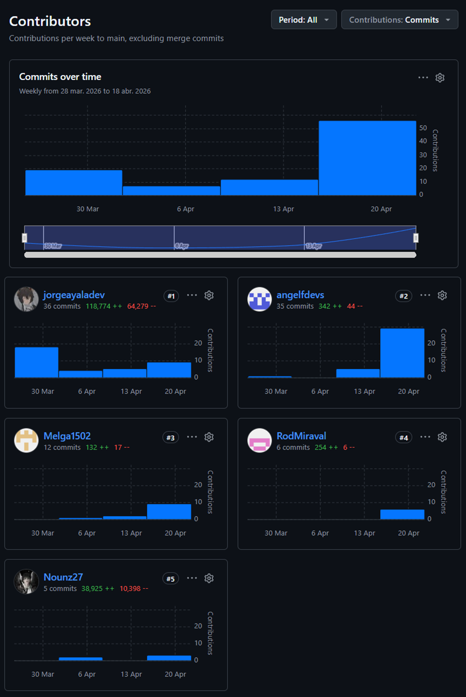
  <p>
    <i><b>Fuente</b>: Elaboración propia.</i>
  </p>
</div>

El gráfico de actividad de GitHub muestra un patrón saludable de contribuciones distribuidas a lo largo de la semana, con mayor actividad los días martes y jueves. Este patrón sugiere una planificación adecuada del trabajo, evitando acumulaciones de última hora (crunch) que podrían afectar la calidad del código.

**Distribución de trabajo por tipo de tarea:**

- Diseño UI/UX: 35% del tiempo total
- Implementación HTML/CSS: 40% del tiempo total
- Configuración y documentación: 15% del tiempo total
- Revisión de código y testing: 10% del tiempo total

**Reflexiones del Equipo:**

- Ayala Fernandez, Jorge Brayan: "El Sprint 1 estableció las bases de nuestra presencia digital. La coordinación con el equipo de diseño fue clave para lograr una Landing Page profesional. Aprendí la importancia de mantener una comunicación fluida con los diseñadores para evitar retrabajo y asegurar que el resultado final cumpla con las expectativas."

- Sanchez Espinoza, Mathias Enrique: "Aporté en la configuración del sistema de plantillas para que el contenido sea fácilmente editable. Este sistema permitirá a los administradores actualizar textos e imágenes sin necesidad de conocimientos técnicos, facilitando el mantenimiento de la Landing Page a largo plazo."

- Melgarejo Quiroz, Josep Eliu: "Diseño UI/UX requirió constante refactorización. Obtuvimos buena retroalimentación inicial que permitió mejorar el diseño de la Landing Page. La迭代ación rápida fue fundamental para alcanzar el nivel de calidad esperado."

- Miraval Pomalaya, Rodrigo Jesus: "La documentación del Sprint fue un desafío interesante. Aprendí a sintetizar la información técnica de manera clara y concisa, facilitando la comprensión del progreso del Sprint para stakeholders externos."

- Flores Eusebio, Angel Thyago: "Participar en el desarrollo de la Landing Page me permitió aplicar conocimientos prácticos de desarrollo web. Contribuí en la implementación de estilos responsivos y animaciones, áreas donde deseaba fortalecer mis habilidades."

**Lección Aprendida:**

El equipo identifica las siguientes lecciones de este Sprint 1:

1. **La configuración inicial del entorno de desarrollo toma tiempo significativo al inicio del proyecto:** Es importante considerar este tiempo en las estimaciones de futuros sprints, especialmente cuando se trabaja con tecnologías nuevas para algunos miembros del equipo.

2. **Es importante mantener comunicación frecuente entre equipos de diseño y desarrollo:** La participación activa del líder de diseño en las revisiones de código ayudó a identificar desviaciones del diseño de manera temprana, evitando retrabajo significativo.

3. **Las daily standups cortas fueron efectivas para mantener el progreso:** Reuniones de 15 minutos máximo permiten compartir información relevante sin afectar el tiempo de implementación.

4. **Los code reviews incrementan la calidad del código:** La revisión por pares antes de hacer merge permitió identificar y corregir errores de estilo y lógica, mejorando la consistencia del código base.

5. **Las estimaciones iniciales fueron acertadas pero con margen de mejora:** El equipo logró completar todas las tareas dentro del tiempo estimado, aunque algunas tareas requirieron ajuste de prioridades para cumplir con el Sprint Goal.

# Conclusiones del Avance 1

El Avance 1 del proyecto SafeStep ha permitido establecer las bases fundamentales de la startup, consolidando un equipo multidisciplinario de cinco estudiantes de Ingeniería de Software de la Universidad Peruana de Ciencias Aplicadas. Cada integrante aportó conocimientos especializados en frontend, backend, diseño UI/UX y bases de datos, logrando una integración sinergética de competencias para abordar el desarrollo de la plataforma educativa.

Se logró identificar y caracterizar comprehensively el problema central: la deficiencia en conocimientos prácticos de primeros auxilios en la población peruano, agravada por la falta de métodos de capacitación interactivos y la desconexión entre el aprendizaje teórico y la disponibilidad de productos necesarios para actuar en emergencias. Esta problemática afecta directamente a los tres segmentos objetivo definidos: estudiantes universitarios, comunidades vecinales y brigadistas.

El diseño del Solution Profile estableció un modelo de negocio innovador que combina el enfoque educativo tipo Coursera con una tienda virtual especializada en productos de primeros auxilios. Esta integración vertical crea un ecosistema donde el aprendizaje genera necesidad de equipamiento, y el equipamiento motiva a completar el aprendizaje, diferenciando a SafeStep de las soluciones existentes en el mercado.

Se establecieron las técnicas de Lean UX Process para validar las hipótesis del proyecto, incluyendo declaraciones de problema, supuestos de usuario, declaraciones de necesidad y hipótesis verificables. Estas bases metodológicas permitirán guiar el desarrollo iterativo del producto mediante retroalimentación constante de los usuarios objetivo.

Para el Avance 2, el equipo deberá enfocarse en profundizar el proceso de elicitación de requisitos mediante entrevistas y needfinding con los segmentos objetivo, desarrollar el primer prototipo funcional de la plataforma con escenarios básicos de simulación, y validar la arquitectura de información diseñada. El objetivo es contar con un MVP que permita iniciar pruebas de usabilidad con usuarios representativos.

# Bibliografía

Caicedo Vega, J. L., & Zumbado Fernández, H. M. (2023). *Conocimiento sobre primeros auxilios en docentes de educación básica de la ciudad de Portoviejo, Ecuador*. Revista Eugenio Espejo, 17(2), 22-32. https://www.redalyc.org/journal/5728/572874846004/html/ 

Chuman Ramos, G. S., & Ramírez Mayorca, S. M. (2024). *Efectividad de una intervención educativa en el conocimiento sobre primeros auxilios en estudiantes de una institución educativa de Lima, 2023*. Tesis de Licenciatura. Fac. Enfermería , Univ. UPCH. [En línea]. https://repositorio.upch.edu.pe/bitstream/handle/20.500.12866/16365/Efectividad_ChumanRamos_Gemma.pdf?sequence=1 

Do Thi, N., Hoang Thi, G., Lee, Y., Pham Minh, K., Nguyen Thanh, H., Shin, J.-S., & Luong Xuan, T. (2024). First-aid training for primary Healthcare providers on a remote Island: a mixed-methods study. *BMC Medical Education, 24*, Artículo 790. https://doi.org/10.1186/s12909-024-05768-6

Federación Internacional de Sociedades de la Cruz Roja y de la Media Luna Roja. (2025). *First aid*. Recuperado de https://www.ifrc.org/our-work/health-and-care/first-aid

García-Blaya, J. Á., Abraldes, J. A., & Vaquero-Cristóbal, R. (2025). Assessment of First Aid Knowledge at Different Stages of Education. *Healthcare*, 13(13), Artículo 1507. https://doi.org/10.3390/healthcare13131507

Gobierno Regional de La Libertad. (2017, 5 de septiembre). *Charla de primeros auxilios para casos de accidentes en la comunidad y hogar*. gob.pe. https://www.gob.pe/institucion/regionlalibertad/noticias/105724-charla-de-primeros-auxilios-para-casos-de-accidentes-en-la-comunidad-y-hogar 

Lozano Villegas, C. (2024). *Factores asociados al nivel de conocimiento en primeros auxilios en estudiantes de la Universidad Ricardo Palma durante el 2022*. Universidad Ricardo Palma - URP. Disponible en: https://hdl.handle.net/20.500.14138/7399 

Ministerio de Salud del Perú. (2025, 20 de febrero). *Exigente formación de los brigadistas de primera respuesta en salud del Minsa garantiza atenciones de calidad ante los desastres*. gob.pe. https://www.gob.pe/institucion/minsa/noticias/1113583-exigente-formacion-de-los-brigadistas-de-primera-respuesta-en-salud-del-minsa-garantiza-atenciones-de-calidad-ante-los-desastres 

Poder Judicial del Perú. (2019). *Preparación de brigadas de emergencia*. https://www.pj.gob.pe/wps/wcm/connect/9f79da0048ab19bf9fc0ff53388de097/PREPARACION%2BBRIGADAS%2BEMERGENCIA%2B-%2B31%2BENERO%2B2019.pdf?CACHEID=9f79da0048ab19bf9fc0ff53388de097&MOD=AJPERES 

Ramírez-Torres, C. A., Andrade-Gómez, E., Lozano-Ochoa, C., Caparrós-Civera, M. N., & Sapiña-Beltrán, E. (2023). Nursing students bringing first aid to the community. *Frontiers in Education*, 8, Artículo 1288508. https://doi.org/10.3389/feduc.2023.1288508

Rodríguez-García, A., Ruiz-García, G., Navarro-Patón, R., & Mecías-Calvo, M. (2024). Attitudes and Skills in Basic Life Support after Two Types of Training: Traditional vs. Gamification, of Compulsory Secondary Education Students: A Simulation Study. *Pediatric Reports*, 16(3), 631–643. https://doi.org/10.3390/pediatric16030053

White, L. (2024). First Aid Training and CPR Skills Retention (Informe de investigación). *CSA Group*. https://www.csagroup.org/wp-content/uploads/CSA-Group-Research-First-Aid-Training-and-CPR-Skill-Retention.pdf 

# Anexos

## Anexo A

Performance Report AV1:

LINK: https://github.com/upc-1asi0729-2610-11990-chronos-team-3/safestep-report/blob/main/markdown/assets/reports/performance-report-av1.md

Video presentación del primer entregable AV1:

LINK: https://youtu.be/ByZHHYKOQ94