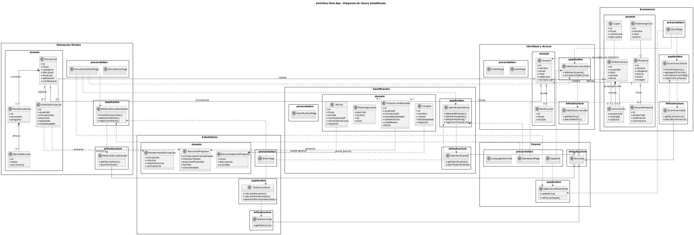

 
 

    

 
 

# 4.7. Software Object-Oriented Design

En esta sección, se presenta el diseño orientado a objetos del software SafeStep. A través de diagramas de clases, se modela la estructura estática del sistema, detallando las clases, sus atributos, métodos y las relaciones entre ellas. Este diseño sirve como un plano para la implementación del código, asegurando que la arquitectura de software definida previamente se traduzca en componentes de código bien estructurados, mantenibles y escalables.

## 4.7.1. Class Diagrams

    

**link del miro para una mejor vista** 

https://miro.com/app/live-embed/uXjVHUFFqvM=/?embedMode=view_only_without_ui&moveToViewport=-2454%2C-663%2C5474%2C2933&embedId=668883533640
