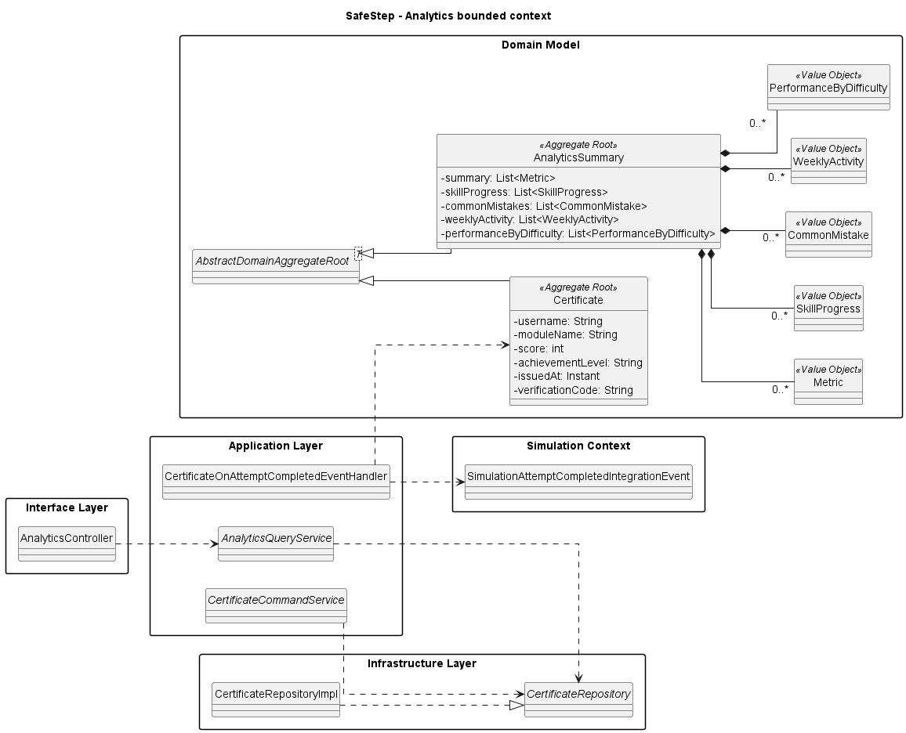
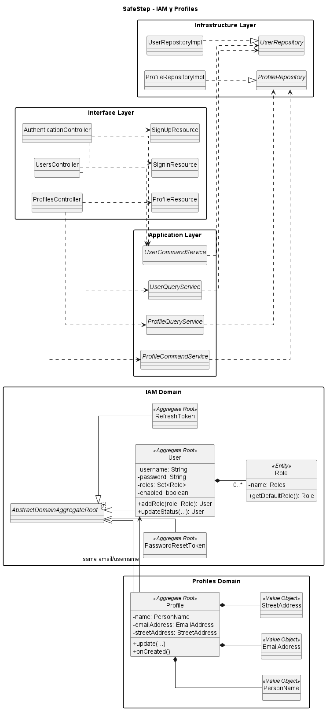

 
 

    

 
 

# 4.7. Software Object-Oriented Design

En esta sección se presenta el diagrama de clases de SafeStep, elaborado con el objetivo de representar la estructura principal de la aplicación web y la organización de sus bounded contexts. El diagrama permite identificar las clases más importantes del dominio, sus responsabilidades, las relaciones entre agregados, entidades, servicios, repositorios y controladores, así como la forma en que los distintos módulos colaboran para soportar funcionalidades como autenticación, perfiles de usuario, simulaciones médicas, gamificación, comercio electrónico, pagos y analítica de progreso.

## 4.7.1. Class Diagrams

    

**link del miro para una mejor vista** 

<a href="https://miro.com/app/board/uXjVH9tP7zk=/?share_link_id=396032164151">https://miro.com/app/board/uXjVH9tP7zk=/?share_link_id=396032164151</a>

<strong>Diagrama Clases Analytics</strong>

    

<strong>Diagrama Clases Ecommerce</strong>

    

<strong>Diagrama Clases Gamification</strong>

    

<strong>Diagrama Clases IAM</strong>

    

<strong>Diagrama Clases Simulation</strong>

    

