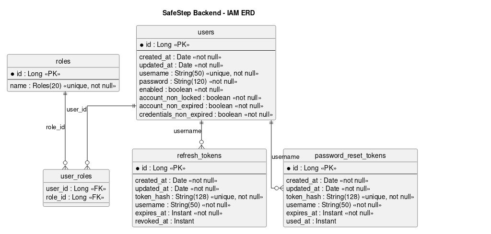
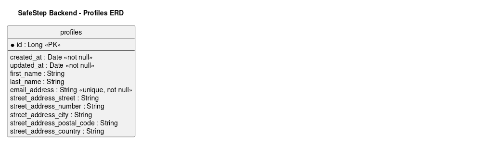
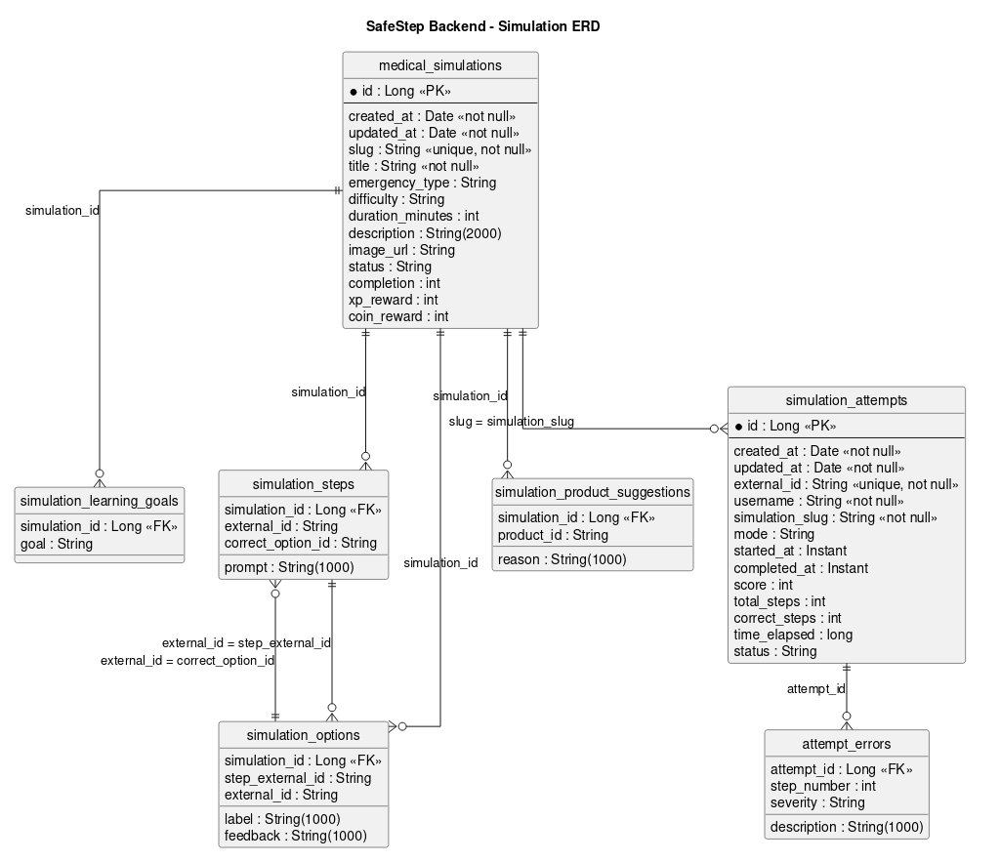

 
 

    

 
 

# 4.8. Database Design

## 4.8.1. Database Diagrams

El siguiente Diagrama Entidad-Relación (ERD) representa la estructura de datos fundamental que soporta toda la lógica de la plataforma SafeStep. Este modelo relacional, compuesto por 31 entidades, ha sido diseñado aplicando las 3 fases de normalizacion. Para garantizar la escalabilidad, el mantenimiento y la separación de responsabilidades, la base de datos se ha estructurado en 5 paquetes o módulos lógicos:

    

**link del diagrama de base de datos para una mejor vista**

<a href="https://miro.com/app/board/uXjVHUFFqvM=/?embedMode=view_only_without_ui&moveToViewport=-2454%2C-663%2C5474%2C2933&embedId=668883533640">https://miro.com/app/board/uXjVHUFFqvM=/?embedMode=view_only_without_ui&moveToViewport=-2454%2C-663%2C5474%2C2933&embedId=668883533640</a>

    

<strong>Diagrama ERD Analytics</strong>

    

<strong>Diagrama ERD Ecommerce</strong>

    

<strong>Diagrama ERD Gamification</strong>

    

<strong>Diagrama ERD IAM</strong>

    

<strong>Diagrama ERD Profiles</strong>

    

<strong>Diagrama ERD Simulation</strong>

