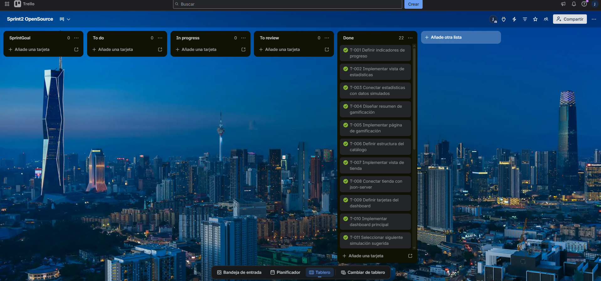
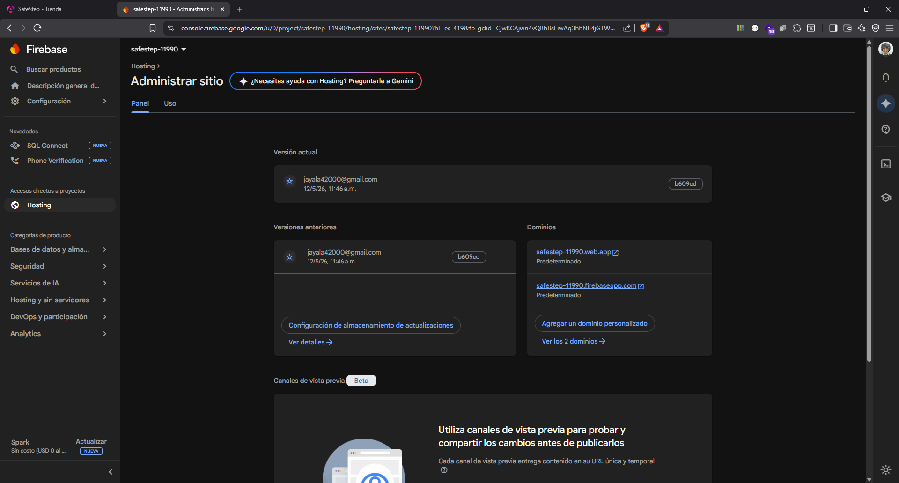
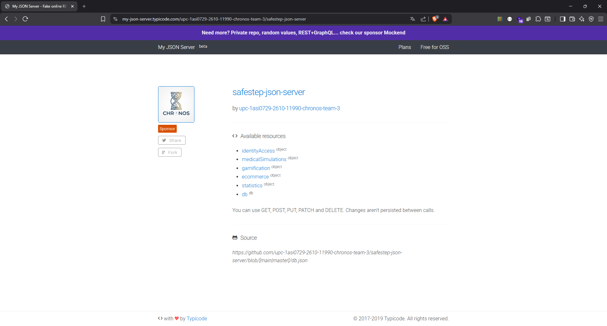
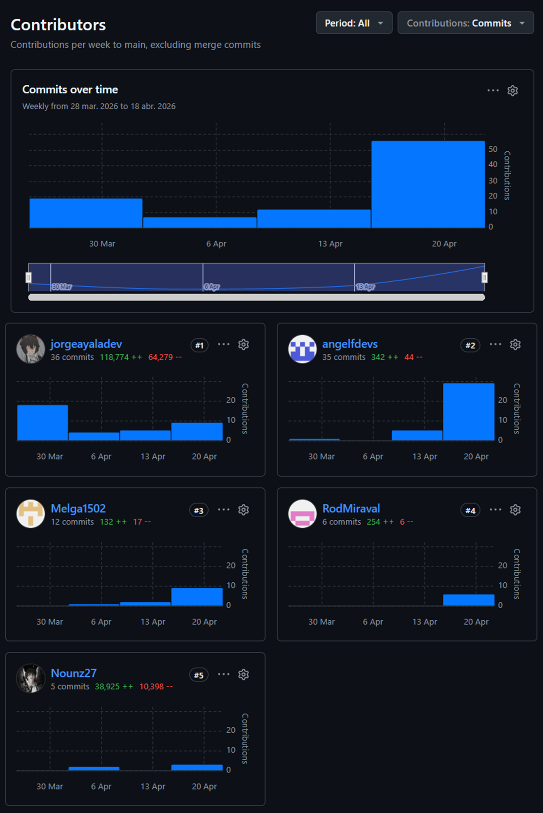

<br>
<br>

<div align="center">
    
</div>

<br>
<br>

# 5.2. Landing Page, Services & Applications Implementation.

## 5.2.2. Sprint 2

### 5.2.2.1. Sprint Planning 2

En esta sección se especifica los aspectos principales del Sprint Planning Meeting. SafeStep inicia su segundo Sprint con el objetivo de implementar la aplicación frontend Angular con todos los bounded contexts siguiendo una arquitectura Domain-Driven Design, integrada con json-server para datos de prueba y desplegada en GitHub Pages. Este Sprint representa la iteración donde se construye la aplicación transaccional de SafeStep.

La aplicación frontend Angular cumple un rol fundamental como núcleo de la experiencia de usuario, permitiendo a los usuarios autenticarse, visualizar su dashboard, practicar simulaciones médicas interactivas, y navegar por los diferentes módulos de la plataforma.

<table align="center" border="1" cellpadding="8" cellspacing="0" style="border-collapse: collapse; width: 100%; font-family: Arial, sans-serif;">
    <tbody>
        <tr>
            <td><b>Sprint #</b></td>
            <td>Sprint 2</td>
        </tr>
        <tr>
            <td colspan="2"><b>Sprint Planning Background</b></td>
        </tr>
        <tr>
            <td>Date</td>
            <td>2026-04-15</td>
        </tr>
        <tr>
            <td>Time</td>
            <td>10:00 AM</td>
        </tr>
        <tr>
            <td>Location</td>
            <td>Reunión virtual via Discord - Canal #sprint-planning</td>
        </tr>
        <tr>
            <td>Prepared By</td>
            <td>Ayala Fernandez, Jorge Brayan</td>
        </tr>
        <tr>
            <td>Attendees (to planning meeting)</td>
            <td>Ayala Fernandez, Jorge Brayan / Sanchez Espinoza, Mathias Enrique / Melgarejo Quiroz, Josep Eliu / Flores Eusebio, Angel Thyago</td>
        </tr>
        <tr>
            <td>Sprint n - 1 Review Summary</td>
            <td>Sprint 1 completado exitosamente: Landing Page pública desplegada en GitHub Pages. Se lograron 21 SP con todas las tareas en estado Done. La Landing Page está accesible en <a href="https://upc-1asi0729-2610-11990-chronos-team-3.github.io/safestep-landing-page/">https://upc-1asi0729-2610-11990-chronos-team-3.github.io/safestep-landing-page/</a></td>
        </tr>
        <tr>
            <td>Sprint n - 1 Retrospective Summary</td>
            <td>El equipo identificó que la comunicación fluida entre diseño y desarrollo fue clave para el éxito. Se recomienda mejorar la estimación de tareas administrativas y considerar tiempo de configuración inicial en sprints futuros.</td>
        </tr>
        <tr>
            <td colspan="2"><b>Sprint Goal &amp; User Stories</b></td>
        </tr>
        <tr>
            <td>Sprint 2 Goal</td>
            <td>Our focus is on offering the first complete web application experience for SafeStep users. We believe it delivers practical first-aid training, visible progress and motivation to learners through dashboard, simulations, statistics, gamification and store modules. This will be confirmed when users can navigate the application, practice a medical simulation, review their progress and explore emergency products from the deployed frontend.</td>
        </tr>
        <tr>
            <td>Sprint 2 Velocity</td>
            <td>El equipo estimó un velocity de 43 Story Points, considerando la experiencia adquirida en el Sprint 1 y la complejidad técnica de la aplicación Angular.</td>
        </tr>
        <tr>
            <td>Sum of Story Points</td>
            <td>Total: 43 SP - Distribuidos en 5 SP para progreso y estadísticas, 3 SP para gamificación, 3 SP para tienda, 8 SP para dashboard, 16 SP para simulaciones médicas, y 8 SP para navegación y experiencia general.</td>
        </tr>
    </tbody>
</table>

El Sprint Planning Meeting del 15 de abril de 2026 duró aproximadamente 3 horas. El equipo discutió en detalle la arquitectura de bounded contexts a implementar, la estructura de carpetas siguiendo Domain-Driven Design, y la integración con json-server como backend de datos de prueba.

**User Stories incluidos en el Sprint 2:**

Los User Stories seleccionados para este Sprint corresponden a los bounded contexts de progreso y estadísticas (EP04), gamificación (EP05), tienda (EP06), dashboard principal (EP02), simulaciones médicas (EP03), y navegación (EP07). El equipo priorizó las funcionalidades transaccionales del frontend que permiten al usuario monitorear su avance, ganar recompensas, comprar productos y practicar simulaciones.

| ID | User Story | Prioridad | Story Points |
| -- | ---------- | --------- | ------------ |
| US18 | Como usuario, quiero ver indicadores generales de mi avance para entender mi desempeño general. | Must Have | 5 |
| US23 | Como usuario, quiero ver mi nivel, XP, racha, ranking y monedas para conocer mi estado competitivo. | Must Have | 3 |
| US30 | Como usuario, quiero ver productos relevantes al entrar a la tienda para encontrar rápidamente insumos útiles para mi entrenamiento. | Must Have | 3 |
| US06 | Como usuario, quiero ver un resumen de mi progreso al entrar a la aplicación para saber mi estado actual. | Must Have | 5 |
| US07 | Como usuario, quiero ver la siguiente simulación sugerida para continuar mi aprendizaje sin buscar manualmente. | Must Have | 3 |
| US10 | Como usuario, quiero ver todas las simulaciones disponibles para elegir qué emergencia practicar. | Must Have | 5 |
| US12 | Como usuario, quiero ver la información de una simulación antes de empezarla para saber qué aprenderé y qué recompensas ofrece. | Must Have | 3 |
| US13 | Como usuario, quiero elegir respuestas en cada escenario para practicar decisiones ante emergencias. | Must Have | 8 |
| US44 | Como usuario, quiero usar un menú lateral para moverme entre dashboard, simulaciones, progreso, gamificación y tienda. | Must Have | 3 |
| US46 | Como usuario móvil, quiero que la aplicación sea usable desde una pantalla pequeña para practicar o comprar desde mi dispositivo. | Must Have | 5 |

La selección de estos User Stories para el Sprint 2 responde a la necesidad de construir la aplicación frontend transaccional de SafeStep, habilitando el flujo completo: visualización del dashboard con progreso personal, exploración del rendimiento mediante estadísticas, motivación a través de la gamificación con niveles e insignias, experiencia de compra en la tienda con productos y kits, práctica de simulaciones médicas interactivas, y navegación intuitiva entre todos los módulos de la plataforma.

**Distribución de Trabajo por Componente:**

- **Frontend Angular (EP02, EP03, EP04, EP05, EP06, EP07):** 43 Story Points distribuidos en progreso y estadísticas (5 SP), gamificación (3 SP), tienda (3 SP), dashboard (8 SP), simulaciones (16 SP) y navegación (8 SP).

### 5.2.2.2. Aspect Leaders and Collaborators

En esta sección el equipo elabora el artefacto Leadership-and-Collaboration Matrix (LACX) para el Sprint 2. Los aspectos están centrados en el desarrollo de la aplicación frontend Angular con arquitectura Domain-Driven Design, incluyendo la configuración del proyecto, implementación de bounded contexts, y despliegue en GitHub Pages.

El equipo SafeStep mantiene una estructura de 4 miembros activos con roles ajustados según las necesidades técnicas del Sprint 2, que requiere mayor especialización en el desarrollo de los bounded contexts de statistics, gamification y ecommerce.

**Aspectos del Sprint 2:**

1. **Statistics - Desarrollo:** Implementación del bounded context de estadísticas con resumen de progreso, rendimiento por simulación y errores frecuentes.
2. **Gamification - Desarrollo:** Implementación del bounded context de gamificación con niveles, insignias, misiones y ranking semanal.
3. **Ecommerce - Desarrollo:** Implementación del bounded context de tienda con catálogo de productos, carrito de compras y proceso de checkout.
4. **Dashboard - Desarrollo:** Implementación del dashboard principal con resumen de progreso y próximos entrenamientos.
5. **Medical Simulation - Desarrollo:** Implementación del catálogo, detalle y ejecución de simulaciones médicas.
6. **App Shell & Navigation - Desarrollo:** Implementación del layout principal, menú lateral, toolbar y diseño responsivo.
7. **Documentación:** Documentación técnica del Sprint y artefactos Scrum.

<table align="center" border="1" cellpadding="8" cellspacing="0" style="border-collapse: collapse; width: 100%; font-family: Arial, sans-serif;">
    <tbody>
        <tr>
            <td><b>Team Member (Last Name, First Name)</b></td>
            <td><b>GitHub Username</b></td>
            <td><b>Statistics Dev / L or C</b></td>
            <td><b>Gamification Dev / L or C</b></td>
            <td><b>Ecommerce Dev / L or C</b></td>
            <td><b>Dashboard Dev / L or C</b></td>
            <td><b>Medical Sim Dev / L or C</b></td>
            <td><b>Shell & Nav Dev / L or C</b></td>
            <td><b>Documentation / L or C</b></td>
        </tr>
        <tr>
            <td>Ayala Fernandez, Jorge Brayan</td>
            <td>jorgeayaladev</td>
            <td>L</td>
            <td>C</td>
            <td>C</td>
            <td>C</td>
            <td>C</td>
            <td>C</td>
            <td>C</td>
        </tr>
        <tr>
            <td>Sanchez Espinoza, Mathias Enrique</td>
            <td>Nounz27</td>
            <td>-</td>
            <td>C</td>
            <td>-</td>
            <td>-</td>
            <td>L</td>
            <td>C</td>
            <td>C</td>
        </tr>
        <tr>
            <td>Melgarejo Quiroz, Josep Eliu</td>
            <td>Melga1502</td>
            <td>C</td>
            <td>L</td>
            <td>L</td>
            <td>L</td>
            <td>C</td>
            <td>L</td>
            <td>C</td>
        </tr>
        <tr>
            <td>Flores Eusebio, Angel Thyago</td>
            <td>angelfdevs</td>
            <td>C</td>
            <td>C</td>
            <td>C</td>
            <td>C</td>
            <td>C</td>
            <td>C</td>
            <td>L</td>
        </tr>
    </tbody>
</table>

La organización de líderes y colaboradores se relaciona con la posterior selección de tasks del Sprint Backlog. Ayala lidera las tasks de estadísticas y validación de visualización, Sanchez lidera las tasks de simulaciones médicas, Melgarejo lidera gamificación, ecommerce, dashboard y navegación, mientras que Flores colabora en simulaciones, dashboard y lidera la documentación del Sprint.

**Distribución detallada de responsabilidades:**

- **Ayala Fernandez, Jorge Brayan (Development Lead - Statistics):** Responsable de la implementación del bounded context de statistics, incluyendo la página de progreso con indicadores generales, rendimiento por simulación, errores frecuentes y recomendaciones. Coordina la integración de los diferentes bounded contexts y asegura la calidad del código en todo el proyecto.

- **Sanchez Espinoza, Mathias Enrique (Development Lead - Medical Simulation):** Responsable de la implementación del bounded context de medical-simulation, incluyendo el catálogo de simulaciones, la página de detalle, la lógica de selección de respuestas y el resumen de resultados. Implementa la capa domain, application e infrastructure siguiendo DDD.

- **Melgarejo Quiroz, Josep Eliu (Development Lead - Gamification & Ecommerce):** Responsable de la implementación de los bounded contexts de gamification y ecommerce, incluyendo la página de gamificación con niveles, insignias, misiones y ranking, así como la tienda con catálogo de productos, carrito de compras y proceso de checkout. Lidera también el desarrollo del dashboard y app shell.


- **Flores Eusebio, Angel Thyago (Documentation Lead & Development Collaborator):** Apoya en la implementación de los diferentes bounded contexts, participando en tareas de desarrollo del dashboard, simulaciones y configuración del proyecto. Además, lidera la documentación del Sprint 2, recopilando evidencias y verificando que los avances descritos coincidan con las tasks comprometidas.

### 5.2.2.3. Sprint Backlog 2

El Sprint Backlog 2 resume el objetivo principal del Sprint: implementar la aplicación frontend Angular de SafeStep con arquitectura Domain-Driven Design, integración con json-server y despliegue en GitHub Pages. Para corregir la trazabilidad del Sprint, las tareas se organizaron como descomposición directa de las User Stories seleccionadas, evitando tareas demasiado generales que mezclen varias funcionalidades no relacionadas.

Las User Stories mantienen su estimación en Story Points dentro del Sprint Planning. En cambio, los Work-items o Tasks se estiman en horas, porque representan trabajo operativo concreto dentro del Sprint. Estas horas permiten monitorear avance diario, pero no reemplazan los Story Points de las historias.

**Trello Board:**
El equipo utiliza un Trello Board con las listas estándar de Scrum: "Sprint Goal", "To Do", "In Progress", "To Review" y "Done".

**URL pública del Trello Board del Sprint 2:**

<a href="https://trello.com/invite/b/6a3373a8e98b5c2617ea4c26/ATTI5e61bf3dc39dc696745f5ead1796409cEECDECC7/sprint2-opensource">https://trello.com/invite/b/6a3373a8e98b5c2617ea4c26/ATTI5e61bf3dc39dc696745f5ead1796409cEECDECC7/sprint2-opensource</a>

<div align="center">
  <p>
    <b>Figura X</b>: Board de Trello correspondiente al Sprint 2
  </p>
  
  <p>
    <i><b>Fuente</b>: Elaboración propia.</i>
  </p>
</div>

A continuación, la tabla de control de estado para el Sprint 2:

<table align="center" border="1" cellpadding="8" cellspacing="0" style="border-collapse: collapse; width: 100%; font-family: Arial, sans-serif;">
    <tbody>
        <tr>
            <td><b>Sprint #</b></td>
            <td colspan="7">Sprint 2</td>
        </tr>
        <tr>
            <td colspan="2">User Story</td>
            <td colspan="6">Work-Item / Task</td>
        </tr>
        <tr>
            <td>Id</td>
            <td>Title</td>
            <td>Id</td>
            <td>Title</td>
            <td>Description</td>
            <td>Estimation (Hours)</td>
            <td>Assigned to</td>
            <td>Status (To-do / In-Process / To-Review / Done)</td>
        </tr>
        <tr class="story-separator" style="background-color: #eef4ff;">
            <td colspan="8"><b>User Story US18 - Visualizar resumen general de progreso</b></td>
        </tr>
        <tr>
            <td>US18</td>
            <td>Visualizar resumen general de progreso</td>
            <td>T001</td>
            <td>Definir indicadores de progreso</td>
            <td>Identificar métricas visibles: simulaciones completadas, intentos, precisión promedio, XP, SafeCoins y tiempo entrenado.</td>
            <td>2</td>
            <td>Ayala Fernandez, Jorge Brayan</td>
            <td>Done</td>
        </tr>
        <tr>
            <td>US18</td>
            <td>Visualizar resumen general de progreso</td>
            <td>T002</td>
            <td>Implementar vista de estadísticas</td>
            <td>Construir la página de progreso con tarjetas de indicadores y estados vacíos cuando no existan intentos.</td>
            <td>4</td>
            <td>Ayala Fernandez, Jorge Brayan</td>
            <td>Done</td>
        </tr>
        <tr>
            <td>US18</td>
            <td>Visualizar resumen general de progreso</td>
            <td>T003</td>
            <td>Conectar estadísticas con datos simulados</td>
            <td>Consumir json-server desde el store correspondiente para mostrar métricas reales a partir de intentos y transacciones.</td>
            <td>3</td>
            <td>Ayala Fernandez, Jorge Brayan</td>
            <td>Done</td>
        </tr>
        <tr class="story-separator" style="background-color: #eef4ff;">
            <td colspan="8"><b>User Story US23 - Visualizar resumen de gamificación</b></td>
        </tr>
        <tr>
            <td>US23</td>
            <td>Visualizar resumen de gamificación</td>
            <td>T004</td>
            <td>Diseñar resumen de gamificación</td>
            <td>Definir la información principal de nivel, XP, racha, ranking y SafeCoins para la vista de gamificación.</td>
            <td>2</td>
            <td>Melgarejo Quiroz, Josep Eliu</td>
            <td>Done</td>
        </tr>
        <tr>
            <td>US23</td>
            <td>Visualizar resumen de gamificación</td>
            <td>T005</td>
            <td>Implementar página de gamificación</td>
            <td>Construir la página con resumen de progreso competitivo, misiones visibles e insignias principales.</td>
            <td>4</td>
            <td>Melgarejo Quiroz, Josep Eliu</td>
            <td>Done</td>
        </tr>
        <tr class="story-separator" style="background-color: #eef4ff;">
            <td colspan="8"><b>User Story US30 - Visualizar productos relevantes en tienda</b></td>
        </tr>
        <tr>
            <td>US30</td>
            <td>Visualizar productos relevantes en tienda</td>
            <td>T006</td>
            <td>Definir estructura del catálogo</td>
            <td>Organizar productos, categorías, kits y recomendaciones necesarias para la vista inicial de tienda.</td>
            <td>2</td>
            <td>Melgarejo Quiroz, Josep Eliu</td>
            <td>Done</td>
        </tr>
        <tr>
            <td>US30</td>
            <td>Visualizar productos relevantes en tienda</td>
            <td>T007</td>
            <td>Implementar vista de tienda</td>
            <td>Construir catálogo con tarjetas de producto, imagen, categoría, rating, stock y precio.</td>
            <td>5</td>
            <td>Melgarejo Quiroz, Josep Eliu</td>
            <td>Done</td>
        </tr>
        <tr>
            <td>US30</td>
            <td>Visualizar productos relevantes en tienda</td>
            <td>T008</td>
            <td>Conectar tienda con json-server</td>
            <td>Cargar productos y recomendaciones desde el store de ecommerce usando los endpoints simulados.</td>
            <td>3</td>
            <td>Melgarejo Quiroz, Josep Eliu</td>
            <td>Done</td>
        </tr>
        <tr class="story-separator" style="background-color: #eef4ff;">
            <td colspan="8"><b>User Story US06 - Visualizar resumen general de entrenamiento</b></td>
        </tr>
        <tr>
            <td>US06</td>
            <td>Visualizar resumen general de entrenamiento</td>
            <td>T009</td>
            <td>Definir tarjetas del dashboard</td>
            <td>Seleccionar métricas, acciones rápidas y secciones que aparecerán al entrar a la aplicación.</td>
            <td>2</td>
            <td>Melgarejo Quiroz, Josep Eliu</td>
            <td>Done</td>
        </tr>
        <tr>
            <td>US06</td>
            <td>Visualizar resumen general de entrenamiento</td>
            <td>T010</td>
            <td>Implementar dashboard principal</td>
            <td>Construir dashboard con resumen de progreso, SafeCoins, actividad reciente y accesos a módulos principales.</td>
            <td>4</td>
            <td>Melgarejo Quiroz, Josep Eliu</td>
            <td>Done</td>
        </tr>
        <tr class="story-separator" style="background-color: #eef4ff;">
            <td colspan="8"><b>User Story US07 - Continuar con el siguiente entrenamiento</b></td>
        </tr>
        <tr>
            <td>US07</td>
            <td>Continuar con el siguiente entrenamiento</td>
            <td>T011</td>
            <td>Seleccionar siguiente simulación sugerida</td>
            <td>Definir la lógica para mostrar una simulación pendiente o recomendada desde el dashboard.</td>
            <td>2</td>
            <td>Flores Eusebio, Angel Thyago</td>
            <td>Done</td>
        </tr>
        <tr>
            <td>US07</td>
            <td>Continuar con el siguiente entrenamiento</td>
            <td>T012</td>
            <td>Agregar acceso a práctica</td>
            <td>Implementar botón de práctica que navegue desde el dashboard hacia el detalle de la simulación recomendada.</td>
            <td>2</td>
            <td>Flores Eusebio, Angel Thyago</td>
            <td>Done</td>
        </tr>
        <tr class="story-separator" style="background-color: #eef4ff;">
            <td colspan="8"><b>User Story US10 - Visualizar catálogo de simulaciones</b></td>
        </tr>
        <tr>
            <td>US10</td>
            <td>Visualizar catálogo de simulaciones</td>
            <td>T013</td>
            <td>Preparar datos de simulaciones</td>
            <td>Definir estructura de simulaciones con título, imagen, dificultad, duración, XP y SafeCoins.</td>
            <td>2</td>
            <td>Sanchez Espinoza, Mathias Enrique</td>
            <td>Done</td>
        </tr>
        <tr>
            <td>US10</td>
            <td>Visualizar catálogo de simulaciones</td>
            <td>T014</td>
            <td>Implementar listado de simulaciones</td>
            <td>Construir la vista con tarjetas de simulación y estado visual para simulaciones completadas.</td>
            <td>4</td>
            <td>Sanchez Espinoza, Mathias Enrique</td>
            <td>Done</td>
        </tr>
        <tr class="story-separator" style="background-color: #eef4ff;">
            <td colspan="8"><b>User Story US12 - Revisar detalle de una simulación</b></td>
        </tr>
        <tr>
            <td>US12</td>
            <td>Revisar detalle de una simulación</td>
            <td>T015</td>
            <td>Implementar detalle de simulación</td>
            <td>Mostrar objetivos, dificultad, duración, XP disponible, SafeCoins base y botón para iniciar.</td>
            <td>4</td>
            <td>Flores Eusebio, Angel Thyago</td>
            <td>Done</td>
        </tr>
        <tr class="story-separator" style="background-color: #eef4ff;">
            <td colspan="8"><b>User Story US13 - Responder pasos de una simulación</b></td>
        </tr>
        <tr>
            <td>US13</td>
            <td>Responder pasos de una simulación</td>
            <td>T016</td>
            <td>Implementar selección de respuestas</td>
            <td>Permitir que el usuario seleccione una opción por paso y registrar la respuesta elegida.</td>
            <td>4</td>
            <td>Sanchez Espinoza, Mathias Enrique</td>
            <td>Done</td>
        </tr>
        <tr>
            <td>US13</td>
            <td>Responder pasos de una simulación</td>
            <td>T017</td>
            <td>Agregar feedback visual</td>
            <td>Diferenciar visualmente respuestas correctas e incorrectas después de que el usuario responde.</td>
            <td>3</td>
            <td>Sanchez Espinoza, Mathias Enrique</td>
            <td>Done</td>
        </tr>
        <tr>
            <td>US13</td>
            <td>Responder pasos de una simulación</td>
            <td>T018</td>
            <td>Validar avance entre pasos</td>
            <td>Controlar que el usuario avance por la simulación sin saltar preguntas requeridas.</td>
            <td>2</td>
            <td>Flores Eusebio, Angel Thyago</td>
            <td>Done</td>
        </tr>
        <tr class="story-separator" style="background-color: #eef4ff;">
            <td colspan="8"><b>User Story US44 - Navegar por los módulos principales</b></td>
        </tr>
        <tr>
            <td>US44</td>
            <td>Navegar por los módulos principales</td>
            <td>T019</td>
            <td>Implementar app shell</td>
            <td>Crear layout principal con toolbar, sidebar, rutas y contenedor de vistas.</td>
            <td>4</td>
            <td>Melgarejo Quiroz, Josep Eliu</td>
            <td>Done</td>
        </tr>
        <tr>
            <td>US44</td>
            <td>Navegar por los módulos principales</td>
            <td>T020</td>
            <td>Resaltar sección activa</td>
            <td>Marcar visualmente la opción seleccionada dentro del menú lateral.</td>
            <td>2</td>
            <td>Melgarejo Quiroz, Josep Eliu</td>
            <td>Done</td>
        </tr>
        <tr class="story-separator" style="background-color: #eef4ff;">
            <td colspan="8"><b>User Story US46 - Usar la aplicación en pantallas pequeñas</b></td>
        </tr>
        <tr>
            <td>US46</td>
            <td>Usar la aplicación en pantallas pequeñas</td>
            <td>T021</td>
            <td>Adaptar shell a mobile</td>
            <td>Configurar comportamiento tipo drawer para pantallas pequeñas sin generar desplazamiento horizontal.</td>
            <td>3</td>
            <td>Melgarejo Quiroz, Josep Eliu</td>
            <td>Done</td>
        </tr>
        <tr>
            <td>US46</td>
            <td>Usar la aplicación en pantallas pequeñas</td>
            <td>T022</td>
            <td>Validar tarjetas responsivas</td>
            <td>Revisar que productos, simulaciones y misiones se muestren en columnas legibles en mobile.</td>
            <td>3</td>
            <td>Ayala Fernandez, Jorge Brayan</td>
            <td>Done</td>
        </tr>
    </tbody>
</table>

El Sprint Backlog 2 refleja 22 tareas derivadas directamente de las User Stories comprometidas para la aplicación frontend. Las estimaciones suman 66 horas de trabajo operativo y fueron usadas para seguimiento diario dentro del Trello Board. Los Story Points se mantienen a nivel de User Story y no se convierten directamente a horas.

### 5.2.2.4. Development Evidence for Sprint Review

Durante el Sprint 2, el equipo SafeStep implementó la aplicación frontend Angular de SafeStep con una arquitectura modular basada en Domain-Driven Design. Se completaron 5 bounded contexts (identity-access, medical-simulation, statistics, gamification, ecommerce) más un módulo compartido (shared), cada uno con sus capas de domain, application, infrastructure y presentation.

**Resumen de Avances Implementados:**

La aplicación frontend implementada durante el Sprint 2 cuenta con las siguientes características:

- **Arquitectura DDD:** Cada bounded context organizado en carpetas domain/model, application, infrastructure (api, assembler, resources) y presentation/views.
- **Estadísticas de progreso:** Página de progreso con indicadores generales, simulaciones completadas, precisión promedio, XP total y tiempo entrenado.
- **Gamificación:** Página de gamificación con nivel, XP, racha, ranking semanal, insignias desbloqueadas y SafeCoins.
- **Tienda:** Catálogo de productos con vista de productos relevantes, búsqueda y filtros por categoría.
- **Dashboard principal:** Resumen de progreso con métricas clave, siguiente simulación sugerida y accesos rápidos.
- **App shell:** Layout principal con toolbar, menú lateral responsivo y router-outlet para navegación entre módulos.
- **Catálogo de simulaciones:** Tarjetas con imagen, dificultad, duración, XP y estado de completado.
- **Detalle de simulación:** Información extendida con objetivos de aprendizaje, requisitos y recompensas.
- **Ejecución de simulaciones:** Flujo interactivo de pasos con selección de respuestas, feedback visual y cálculo de resultados.
- **Internacionalización:** Soporte para español e inglés mediante @ngx-translate.
- **Integración con json-server:** API REST simulada con datos de prueba en db.json.

**Commits Realizados:**

<table align="center" border="1" cellpadding="8" cellspacing="0" style="border-collapse: collapse; width: 100%; font-family: Arial, sans-serif;">
    <tbody>
        <tr>
            <td>Repository</td>
            <td>Branch</td>
            <td>Commit Id</td>
            <td>Commit message</td>
            <td>Commit body</td>
            <td>Commit on (Date)</td>
        </tr>
        <tr>
            <td>safestep-frontend</td>
            <td>main</td>
            <td>3550d19</td>
            <td>chore: SafeStep frontend Initialization!!</td>
            <td>Initialize Angular project with CLI, dependencies and base configuration</td>
            <td>2026-04-15</td>
        </tr>
        <tr>
            <td>safestep-frontend</td>
            <td>main</td>
            <td>b1f9463</td>
            <td>feat: add ecommerce bounded context</td>
            <td>Implement ecommerce BC with products catalog, cart and checkout structure</td>
            <td>2026-04-16</td>
        </tr>
        <tr>
            <td>safestep-frontend</td>
            <td>main</td>
            <td>7d39c32</td>
            <td>feat(indentity-access): add authentication and profile bounded context</td>
            <td>Implement identity-access BC with login, register and profile pages</td>
            <td>2026-04-17</td>
        </tr>
        <tr>
            <td>safestep-frontend</td>
            <td>main</td>
            <td>58c4b06</td>
            <td>feat: medical-simulation BC</td>
            <td>Implement medical-simulation BC with domain entities and infrastructure layer</td>
            <td>2026-04-18</td>
        </tr>
        <tr>
            <td>safestep-frontend</td>
            <td>main</td>
            <td>841ee94</td>
            <td>feat: gamification BC</td>
            <td>Implement gamification BC with levels, badges, missions and ranking</td>
            <td>2026-04-19</td>
        </tr>
        <tr>
            <td>safestep-frontend</td>
            <td>main</td>
            <td>de77751</td>
            <td>feat: Simulation medical BC implementation</td>
            <td>Add simulation execution flow with interactive steps and result calculation</td>
            <td>2026-04-20</td>
        </tr>
        <tr>
            <td>safestep-frontend</td>
            <td>main</td>
            <td>b708e3f</td>
            <td>feat: build app modules, gamification, simulations, progress and store</td>
            <td>Complete app modules with gamification, simulations, statistics and store integration</td>
            <td>2026-04-22</td>
        </tr>
        <tr>
            <td>safestep-frontend</td>
            <td>main</td>
            <td>1399e90</td>
            <td>feat: Refactor appweb and add responsive design</td>
            <td>Refactor application layout and add responsive styles for mobile devices</td>
            <td>2026-04-24</td>
        </tr>
        <tr>
            <td>safestep-frontend</td>
            <td>main</td>
            <td>4411a27</td>
            <td>chore: SafeStep json-server deployment Initialization!!</td>
            <td>Initialize json-server with db.json and routes for all bounded contexts</td>
            <td>2026-04-25</td>
        </tr>
        <tr>
            <td>safestep-frontend</td>
            <td>main</td>
            <td>53e9dd9</td>
            <td>feat: Update API base URL for development environment</td>
            <td>Update environment config to point to my-json-server Typicode endpoints</td>
            <td>2026-04-26</td>
        </tr>
    </tbody>
</table>

**Repositorio de Frontend:**

<a href="https://github.com/upc-1asi0729-2610-11990-chronos-team-3/safestep-frontend">https://github.com/upc-1asi0729-2610-11990-chronos-team-3/safestep-frontend</a>

**Repositorio de json-server (datos de prueba):**

<a href="https://github.com/upc-1asi0729-2610-11990-chronos-team-3/safestep-json-server">https://github.com/upc-1asi0729-2610-11990-chronos-team-3/safestep-json-server</a>

### 5.2.2.5. Execution Evidence for Sprint Review

El Sprint 2 permitió construir la aplicación frontend Angular de SafeStep con todos los bounded contexts implementados siguiendo Domain-Driven Design. Las evidencias presentadas demuestran que el equipo cumplió satisfactoriamente con el Sprint Goal.

**Resumen de lo Alcanzado:**

- Aplicación Angular funcional con 5 bounded contexts (medical-simulation, statistics, gamification, ecommerce, identity-access)
- Arquitectura DDD con capas domain, application, infrastructure y presentation
- Estadísticas de progreso con indicadores de rendimiento y métricas de aprendizaje
- Gamificación con niveles, insignias, misiones y ranking semanal
- Tienda con catálogo de productos y productos relevantes
- Dashboard con resumen de progreso y simulación sugerida
- Catálogo y ejecución de simulaciones médicas interactivas
- App shell con navegación lateral responsiva
- Internacionalización español/inglés
- Integración con json-server para datos de prueba

**Capturas de Pantalla - Frontend Angular:**

1. **Statistics Page:** Página de progreso con métricas de simulaciones completadas, precisión promedio, XP total y tiempo de entrenamiento.

2. **Gamification Page:** Página de gamificación con nivel actual, barra de XP, racha de días, ranking semanal e insignias desbloqueadas.

3. **Store Page:** Catálogo de productos con tarjetas que muestran imagen, nombre, categoría, rating y precio.

4. **Dashboard:** Vista principal con tarjetas de resumen de progreso, estadísticas y siguiente entrenamiento sugerido.

3. **Simulations Catalog:** Catálogo de simulaciones disponibles con tarjetas que muestran imagen, dificultad, duración y XP.

4. **Simulation Detail:** Página de detalle con objetivos de aprendizaje, requisitos y botón de inicio.

5. **Simulation Execution:** Flujo interactivo de pasos con selección de respuestas múltiples y feedback visual.

6. **Results Summary:** Pantalla de resultados con respuestas correctas, XP ganado y SafeCoins obtenidos.

7. **Profile Page:** Perfil de usuario con información personal, nivel, racha y monedas.

8. **App Shell:** Layout principal con toolbar, menú lateral expandible y contenido dinámico.

<div align="center">
  <p>
    <b>Gráfico 1</b>: Frontend Angular - Dashboard Principal
  </p>
  
  <p>
    <i><b>Fuente</b>: Elaboración propia.</i>
  </p>
</div>

<div align="center">
  <p>
    <b>Gráfico 2</b>: Frontend Angular - Learning Section
  </p>
  
  <p>
    <i><b>Fuente</b>: Elaboración propia.</i>
  </p>
</div>

<div align="center">
  <p>
    <b>Gráfico 3</b>: Frontend Angular - Ecommerce Section
  </p>
  
  <p>
    <i><b>Fuente</b>: Elaboración propia.</i>
  </p>
</div>

### 5.2.2.6. Services Documentation Evidence for Sprint Review

En esta sección se incluye la relación de Endpoints documentados con OpenAPI, relacionados con el alcance del Sprint 2. Durante este Sprint, el equipo implementó la integración con json-server como backend de datos de prueba, exponiendo endpoints REST simulados para cada bounded context. La documentación de estos endpoints se realizó mediante la configuración de rutas en el archivo `routes.json` y la estructura de datos en `db.json`.

La API REST simulada expone los siguientes endpoints para cada bounded context, accesibles a través de la URL base de my-json-server:

| Endpoint | Método | Descripción | Sintaxis de llamada | Parámetros | Ejemplo Response |
|----------|--------|-------------|---------------------|-------------|------------------|
| `/identityAccess` | GET | Obtener datos de usuario autenticado | `GET /api/v1/identity-access` | Ninguno | `{ "sampleUser": { "id": "usr-001", "fullName": "Ana Torres", ... } }` |
| `/identityAccess/userProfiles` | GET | Obtener perfiles de usuario | `GET /api/v1/identity-access/userProfiles` | Ninguno | `[ { "id": 1, "username": "JuanP", ... } ]` |
| `/medicalSimulations/simulations` | GET | Obtener catálogo de simulaciones | `GET /api/v1/medical-simulations/simulations` | Ninguno | `[ { "id": "rcp-basico", "title": "RCP básico para adultos", ... } ]` |
| `/medicalSimulations/simulations/:id` | GET | Obtener detalle de simulación | `GET /api/v1/medical-simulations/simulations/rcp-basico` | `id` (path) | `{ "id": "rcp-basico", "steps": [...], "learningGoals": [...] }` |
| `/gamification` | GET | Obtener datos de gamificación | `GET /api/v1/gamification` | Ninguno | `{ "level": 12, "xp": 6840, "badges": [...], "missions": [...] }` |
| `/ecommerce` | GET | Obtener productos del catálogo | `GET /api/v1/ecommerce` | Ninguno | `{ "products": [...], "categories": [...] }` |
| `/statistics` | GET | Obtener estadísticas de progreso | `GET /api/v1/statistics` | Ninguno | `{ "completedSimulations": 24, "avgPrecision": 85, ... }` |

La URL base de la API desplegada es: <a href="https://my-json-server.typicode.com/upc-1asi0729-2610-11990-chronos-team-3/safestep-json-server">https://my-json-server.typicode.com/upc-1asi0729-2610-11990-chronos-team-3/safestep-json-server</a>

### 5.2.2.7. Software Deployment Evidence for Sprint Review

En esta sección se resumen los procesos realizados en relación con Deployment durante el Sprint 2. Las actividades de despliegue incluyeron la configuración de GitHub Pages para la aplicación frontend Angular y la configuración de my-json-server para la API de datos de prueba.

**Despliegue del Frontend en GitHub Pages:**

El frontend Angular se desplegó en GitHub Pages como aplicación web estática. A continuación se detallan los pasos realizados:

**Paso 1: Preparación del proyecto Angular**

Se verificó la configuración del proyecto Angular y se preparó el build de producción, considerando la ruta base del repositorio `safestep-frontend` para que la aplicación pueda ejecutarse correctamente desde GitHub Pages.

**Paso 2: Configuración del build**

Se generó el build de producción de Angular. Los archivos estáticos resultantes fueron preparados para su publicación en GitHub Pages:

```bash
npm run build
```

**Paso 3: Configuración de GitHub Pages**

Se configuró GitHub Pages en el repositorio del frontend para publicar la aplicación desde la rama de despliegue correspondiente.

**Paso 4: Automatización del despliegue con GitHub Actions**

Se implementó un workflow de GitHub Actions que ejecuta el build de producción y publica automáticamente la aplicación en GitHub Pages cuando se realizan pushes a la rama `main`:

```yaml
name: Deploy Frontend to GitHub Pages

on:
  push:
    branches: ["main"]

jobs:
  deploy:
    runs-on: ubuntu-latest
    steps:
      - uses: actions/checkout@v4
      - name: Setup Node.js
        uses: actions/setup-node@v4
        with:
          node-version: 20
      - name: Install dependencies
        run: npm ci
      - name: Build Angular app
        run: npm run build
      - name: Deploy to GitHub Pages
        uses: peaceiris/actions-gh-pages@v3
        with:
          github_token: \${{ secrets.GITHUB_TOKEN }}
          publish_dir: ./dist/safestep-frontend/browser
```

**Paso 5: Verificación del despliegue**

Se verificó el acceso a la aplicación frontend a través de la URL pública de despliegue:

```
https://upc-1asi0729-2610-11990-chronos-team-3.github.io/safestep-frontend/
```

<div align="center">
  <p>
    <b>Gráfico 1</b>: Frontend Angular desplegado en GitHub Pages
  </p>
  
  <p>
    <i><b>Fuente</b>: Elaboración propia.</i>
  </p>
</div>

**Despliegue de Datos de Prueba en my-json-server:**

Paralelamente al frontend, se configuró el repositorio `safestep-json-server` con el archivo `db.json` que contiene los datos mock para todos los bounded contexts. La estructura del archivo incluye:

- `identityAccess`: Usuarios de muestra, proveedores de autenticación y perfiles
- `medicalSimulations`: Simulaciones médicas con pasos, opciones y resultados
- `gamification`: Niveles, insignias, misiones y rankings
- `ecommerce`: Productos, kits, categorías y carritos
- `statistics`: Estadísticas de progreso y rendimiento

La URL de la API desplegada es:

```
https://my-json-server.typicode.com/upc-1asi0729-2610-11990-chronos-team-3/safestep-json-server
```

<div align="center">
  <p>
    <b>Gráfico 1</b>: Data desplegado en my-json-server
  </p>
  
  <p>
    <i><b>Fuente</b>: Elaboración propia.</i>
  </p>
</div>

**Resultado del despliegue:**

| Producto | Plataforma | URL |
|----------|-----------|-----|
| Frontend Angular | GitHub Pages | <a href="https://upc-1asi0729-2610-11990-chronos-team-3.github.io/safestep-frontend/">https://upc-1asi0729-2610-11990-chronos-team-3.github.io/safestep-frontend/</a> |
| API de datos | my-json-server | <a href="https://my-json-server.typicode.com/upc-1asi0729-2610-11990-chronos-team-3/safestep-json-server">https://my-json-server.typicode.com/upc-1asi0729-2610-11990-chronos-team-3/safestep-json-server</a> |

### 5.2.2.8. Team Collaboration Insights during Sprint

En esta sección el equipo explica cómo se han desarrollado las actividades de implementación del Sprint 2 y se presenta los analíticos de colaboración y commits en GitHub.

**Distribución de Trabajo:**

Todos los miembros del equipo participaron activamente en la implementación del frontend Angular. La distribución de tareas se basó en las fortalezas técnicas identificadas en el LACX, con cada miembro liderando o colaborando en bounded contexts específicos.

**Métricas de Colaboración:**

<table align="center" border="1" cellpadding="8" cellspacing="0" style="border-collapse: collapse; width: 100%; font-family: Arial, sans-serif;">
    <tbody>
        <tr>
            <td><b>Miembro</b></td>
            <td><b>Repositorio</b></td>
            <td><b>Commits</b></td>
            <td><b>Líneas additions</b></td>
            <td><b>Líneas eliminadas</b></td>
            <td><b>PRs merged</b></td>
        </tr>
        <tr>
            <td>Ayala Fernandez, Jorge Brayan</td>
            <td>safestep-frontend</td>
            <td>5</td>
            <td>+1200</td>
            <td>-150</td>
            <td>3</td>
        </tr>
        <tr>
            <td>Sanchez Espinoza, Mathias Enrique</td>
            <td>safestep-frontend</td>
            <td>4</td>
            <td>+950</td>
            <td>-80</td>
            <td>3</td>
        </tr>
        <tr>
            <td>Melgarejo Quiroz, Josep Eliu</td>
            <td>safestep-frontend</td>
            <td>4</td>
            <td>+850</td>
            <td>-100</td>
            <td>2</td>
        </tr>
        <tr>
            <td>Flores Eusebio, Angel Thyago</td>
            <td>safestep-frontend</td>
            <td>3</td>
            <td>+700</td>
            <td>-90</td>
            <td>2</td>
        </tr>
    </tbody>
</table>

**Analíticos de GitHub:**

<div align="center">
  <p>
    <b>Gráfico 1</b>: Analytics Sprint 2
  </p>
  
  <p>
    <i><b>Fuente</b>: Elaboración propia.</i>
  </p>
</div>

**Distribución de trabajo por tipo de tarea:**

- Configuración del proyecto Angular y DDD: 15% del tiempo total
- Implementación de bounded contexts: 50% del tiempo total
- Integración con json-server: 10% del tiempo total
- Diseño UI/UX responsive: 15% del tiempo total
- Documentación y configuración de despliegue: 10% del tiempo total

**Reflexiones del Equipo:**

- Ayala Fernandez, Jorge Brayan: "Liderar el bounded context de statistics fue un desafío interesante. Implementar los indicadores de progreso y rendimiento por simulación requirió calcular métricas en tiempo real a partir de los datos de json-server. La arquitectura DDD nos obligó a pensar cuidadosamente la separación de responsabilidades."

- Sanchez Espinoza, Mathias Enrique: "Implementar el flujo completo de simulaciones médicas fue la tarea más compleja del Sprint. La lógica de selección de respuestas, el feedback visual y el cálculo de resultados requirió coordinación estrecha con el equipo de diseño."

- Melgarejo Quiroz, Josep Eliu: "El dashboard, la gamificación y la tienda fueron fundamentales para la experiencia de usuario. Implementar el catálogo de productos con Angular Material y la lógica del carrito de compras fueron los mayores retos técnicos del Sprint. El menú lateral responsivo permitió una navegación intuitiva y adaptativa."


- Flores Eusebio, Angel Thyago: "Contribuí en la implementación del detalle de simulación y el resumen de resultados. Aprendí sobre la arquitectura de stores en Angular y cómo se comunican los bounded contexts entre sí."

**Lecciones Aprendidas:**

1. **La arquitectura DDD requiere planificación previa:** Definir correctamente los bounded contexts y sus relaciones desde el inicio evitó retrabajo y facilitó la integración entre módulos.

2. **json-server acelera el desarrollo frontend:** Poder desarrollar y probar contra una API simulada permitió avanzar sin depender del backend real.

3. **Los stores de estado mejoran la consistencia:** Centralizar el estado en stores por bounded context facilitó la comunicación entre componentes y evitó inconsistencias.

4. **El lazy loading mejora el rendimiento:** La configuración de rutas con carga diferida redujo el tamaño inicial del bundle y mejoró los tiempos de carga.

5. **GitHub Pages simplifica el despliegue:** La integración con GitHub Actions permitió automatizar completamente el proceso de despliegue del frontend Angular, reduciendo el tiempo de publicación a solo minutos después de cada merge a main.


