<br>
<br>

<div align="center">
    
</div>

<br>
<br>

# 5.2. Landing Page, Services & Applications Implementation.

## 5.2.3. Sprint 3

### 5.2.3.1. Sprint Planning 3

En esta sección se especifican los aspectos principales del Sprint Planning Meeting correspondiente al Sprint 3. SafeStep inicia su tercer Sprint con el objetivo de implementar el backend real de la solución, reemplazando progresivamente la dependencia de datos simulados utilizada en el Sprint 2 por un RESTful API desarrollado internamente con Spring Boot, Java, PostgreSQL y documentación OpenAPI mediante Swagger.

El Sprint 3 representa una etapa clave para la madurez técnica del producto, debido a que permite pasar de una aplicación frontend basada en json-server a una arquitectura distribuida compuesta por Landing Page, Frontend Web Application y Web Services. Durante este Sprint, el equipo priorizó la implementación de los bounded contexts principales del backend, manteniendo una estructura alineada con Domain-Driven Design, CQRS, capas de aplicación, dominio, infraestructura e interfaces REST.

Además del backend, este Sprint incluyó trabajo directo sobre los otros dos productos del ecosistema SafeStep. En la Web Application se configuró el consumo del backend real mediante los endpoints de `http://localhost:8092/api/v1` y la URL desplegada en Render, reemplazando el uso principal de `json-server`. En la Landing Page se realizaron ajustes visuales para mostrar mejor el producto, incorporando imágenes reales de la aplicación y los videos About the Team y About the Product como evidencia de presentación del equipo y de la propuesta de valor.

<table align="center" border="1" cellpadding="8" cellspacing="0" style="border-collapse: collapse; width: 100%; font-family: Arial, sans-serif;">
    <tbody>
        <tr>
            <td><b>Sprint #</b></td>
            <td>Sprint 3</td>
        </tr>
        <tr>
            <td colspan="2"><b>Sprint Planning Background</b></td>
        </tr>
        <tr>
            <td>Date</td>
            <td>2026-05-03</td>
        </tr>
        <tr>
            <td>Time</td>
            <td>10:00 AM</td>
        </tr>
        <tr>
            <td>Location</td>
            <td>Reunion virtual via Discord - Canal #sprint-planning</td>
        </tr>
        <tr>
            <td>Prepared By</td>
            <td>Melgarejo Quiroz, Josep Eliu</td>
        </tr>
        <tr>
            <td>Attendees (to planning meeting)</td>
            <td>Ayala Fernandez, Jorge Brayan / Sanchez Espinoza, Mathias Enrique / Melgarejo Quiroz, Josep Eliu / Flores Eusebio, Angel Thyago</td>
        </tr>
        <tr>
            <td>Sprint n - 1 Review Summary</td>
            <td>Sprint 2 completado exitosamente: aplicación frontend Angular implementada con bounded contexts, arquitectura DDD, integración con json-server y despliegue en GitHub Pages. Se logró construir la experiencia principal del usuario con dashboard, simulaciones, gamificación, estadísticas y tienda.</td>
        </tr>
        <tr>
            <td>Sprint n - 1 Retrospective Summary</td>
            <td>El equipo identificó que json-server permitió validar rápidamente los flujos del frontend, pero también se reconoció la necesidad de implementar un backend real para cumplir con la arquitectura distribuida solicitada por el curso. Se acordó priorizar estructura de capas, documentación Swagger, endpoints estables, conexión frontend-backend y actualización de la landing page con evidencias visuales del producto.</td>
        </tr>
        <tr>
            <td colspan="2"><b>Sprint Goal &amp; User Stories</b></td>
        </tr>
        <tr>
            <td>Sprint 3 Goal</td>
            <td>Our focus is on enabling SafeStep to operate with real backend services and a connected product ecosystem. We believe it delivers a more reliable and realistic experience to users and a clearer integration path to the development team. This will be confirmed when the backend exposes documented Swagger endpoints, the frontend consumes real API data for the main flows, and the landing page presents product images plus the About the Team and About the Product videos.</td>
        </tr>
        <tr>
            <td>Sprint 3 Velocity</td>
            <td>El equipo estimó un velocity de 45 Story Points, considerando la complejidad de implementar el backend real, configurar persistencia con PostgreSQL, definir arquitectura DDD, documentar los endpoints mediante Swagger, conectar el frontend con el API y actualizar la landing page.</td>
        </tr>
        <tr>
            <td>Sum of Story Points</td>
            <td>Total: 45 SP - Distribuidos en technical stories de backend agregadas al EP09 y tareas de integración con frontend y landing page. El alcance combina configuración Spring Boot, arquitectura por bounded contexts, seguridad JWT, persistencia PostgreSQL/JPA, endpoints REST, Swagger, seed data, validación técnica, consumo del API desde Angular y actualización de la landing page con contenido visual del producto.</td>
        </tr>
    </tbody>
</table>

El Sprint Planning Meeting del 3 de mayo de 2026 duró aproximadamente 3 horas. Durante la reunión se revisó la arquitectura del backend de referencia del curso, se definieron los bounded contexts necesarios para SafeStep y se estableció que el backend debía seguir una estructura similar a la utilizada en Learning Center Platform, separando responsabilidades entre domain, application, infrastructure e interfaces.

También se acordó que los endpoints del backend debían responder a las necesidades ya implementadas en el frontend del Sprint 2. Por ello, el equipo tomó como base los datos y flujos existentes en la aplicación Angular, pero los trasladó a un modelo persistente con PostgreSQL, entidades JPA y servicios de aplicación. Para cerrar el flujo completo, se planificó conectar la Web Application con el backend y actualizar la Landing Page para que presente evidencias más concretas del producto desarrollado.

**Technical Stories incluidos en el Sprint 3:**

Las historias seleccionadas para este Sprint corresponden a technical stories nuevas asociadas al backend y registradas dentro de EP09 - Soporte tecnico y arquitectura de la aplicacion. El equipo priorizo los elementos tecnicos necesarios para que las funcionalidades existentes de SafeStep puedan ser soportadas por Web Services reales.

| ID | Technical Story | Prioridad | Story Points |
| -- | ---------- | --------- | ------------ |
| TS13 | Como developer, quiero configurar el backend con Spring Boot, Maven, Java y perfiles de ambiente para contar con una base estable para los Web Services. | Must Have | 5 |
| TS14 | Como developer, quiero organizar el backend por bounded contexts y capas para mantener una estructura alineada con la arquitectura del curso. | Must Have | 5 |
| TS15 | Como developer, quiero implementar autenticacion con JWT y roles para proteger los endpoints que dependen de un usuario autenticado. | Must Have | 5 |
| TS16 | Como developer, quiero configurar persistencia con PostgreSQL y Spring Data JPA para almacenar datos reales de usuarios, simulaciones, compras y progreso. | Must Have | 5 |
| TS17 | Como developer, quiero exponer endpoints REST por bounded context para que el frontend pueda consumir datos reales de SafeStep. | Must Have | 8 |
| TS18 | Como developer, quiero documentar los endpoints con OpenAPI y Swagger UI para facilitar pruebas, revision e integracion del API. | Must Have | 3 |
| TS19 | Como developer, quiero cargar datos iniciales en el backend para probar flujos principales sin registrar toda la informacion manualmente. | Should Have | 3 |
| TS20 | Como developer, quiero ejecutar pruebas y validaciones con Maven para asegurar que el backend compile y funcione antes de integrarlo con el frontend. | Must Have | 3 |
| TS21 | Como developer, quiero conectar la Web Application Angular con el backend real para reemplazar el consumo principal de json-server por endpoints persistentes. | Must Have | 5 |
| TS22 | Como developer, quiero actualizar la Landing Page con imágenes del producto y videos About the Team y About the Product para comunicar mejor la solución final. | Should Have | 3 |

La seleccion de estas technical stories responde a la necesidad de completar la capa de Web Services del producto SafeStep sin crear historias funcionales nuevas que no esten alineadas con el Product Backlog. A diferencia del Sprint 2, en el que se trabajo con datos simulados, este Sprint se enfoca en una API real con persistencia, seguridad y documentacion tecnica.

**User Stories funcionales soportadas por el backend:**

El backend implementado en este Sprint da soporte directo a historias funcionales ya existentes en el Capitulo 3, principalmente: US01, US02, US03, US10, US12, US14, US15, US18, US23, US26, US27, US29, US30, US36, US37, US38, US40, US41 y US42. Estas historias no se duplican ni se renombran; se consideran funcionalidades de usuario que ahora cuentan con soporte desde el RESTful API.

**Distribucion de Trabajo por Componente:**

- **Backend Setup & Architecture:** 10 Story Points enfocados en configuracion Spring Boot, Maven, perfiles de ambiente y organizacion por bounded contexts.
- **Security & Persistence:** 10 Story Points enfocados en autenticacion JWT, roles, PostgreSQL, JPA y acceso seguro a datos.
- **RESTful API Implementation:** 8 Story Points enfocados en endpoints para IAM, perfiles, comercio, simulaciones, gamificacion y analitica.
- **OpenAPI Documentation:** 3 Story Points enfocados en documentacion Swagger y revision de contratos REST.
- **Seed Data:** 3 Story Points enfocados en datos iniciales para simulaciones, comercio, gamificacion y analitica.
- **Build & Validation:** 3 Story Points enfocados en pruebas Maven, compilacion y validacion local de endpoints.
- **Frontend Integration:** 5 Story Points enfocados en configurar environments, endpoints, interceptores, stores y consumo real del backend desde Angular.
- **Landing Page Update:** 3 Story Points enfocados en agregar imágenes del producto y los videos About the Team y About the Product.

### 5.2.3.2. Aspect Leaders and Collaborators

En esta sección el equipo elabora el artefacto Leadership-and-Collaboration Matrix (LACX) correspondiente al Sprint 3. Los aspectos del Sprint se enfocan principalmente en el desarrollo del backend de SafeStep, pero también incluyen la integración de la Web Application con el API real y la actualización de la Landing Page con contenido visual del producto.

Para este Sprint, el equipo distribuyo el trabajo segun la complejidad de cada bounded context. Se busco que cada miembro activo lidere o colabore en un modulo especifico, manteniendo una vision compartida de arquitectura para evitar diferencias excesivas entre paquetes. La iteracion fue planificada con cuatro miembros activos del equipo.

**Aspectos del Sprint 3:**

1. **IAM & Profiles - Desarrollo:** Implementacion de autenticacion, autorizacion, usuarios, roles y perfiles.
2. **Commerce - Desarrollo:** Implementacion de catalogo, carrito, ordenes, direcciones, pagos y recomendaciones.
3. **Simulation - Desarrollo:** Implementacion de simulaciones medicas, pasos, opciones e intentos.
4. **Gamification - Desarrollo:** Implementacion de resumen, misiones, insignias, leaderboard y transacciones.
5. **Analytics - Desarrollo:** Implementacion de resumen de progreso, graficos y certificados.
6. **Shared Infrastructure - Desarrollo:** Configuracion de seguridad, errores, servicios comunes, OpenAPI y persistencia.
7. **Documentation & Validation:** Evidencias de Swagger, ejecución local, pruebas y documentación del Sprint.
8. **Frontend - Backend Integration:** Configuración de environments, endpoints, interceptores, stores y consumo del backend real desde Angular.
9. **Landing Page - Product Evidence:** Incorporación de imágenes reales del producto y actualización de secciones visuales de la landing page.
10. **Landing Page - About Videos:** Incorporación de los videos About the Team y About the Product.

<table align="center" border="1" cellpadding="8" cellspacing="0" style="border-collapse: collapse; width: 100%; font-family: Arial, sans-serif;">
    <tbody>
        <tr>
            <td><b>Team Member (Last Name, First Name)</b></td>
            <td><b>GitHub Username</b></td>
            <td><b>IAM & Profiles / L or C</b></td>
            <td><b>Commerce / L or C</b></td>
            <td><b>Simulation / L or C</b></td>
            <td><b>Gamification / L or C</b></td>
            <td><b>Analytics / L or C</b></td>
            <td><b>Shared Infrastructure / L or C</b></td>
            <td><b>Documentation / L or C</b></td>
            <td><b>Frontend Integration / L or C</b></td>
            <td><b>Landing Product Evidence / L or C</b></td>
            <td><b>Landing Videos / L or C</b></td>
        </tr>
        <tr>
            <td>Ayala Fernandez, Jorge Brayan</td>
            <td>jorgeayaladev</td>
            <td>C</td>
            <td>L</td>
            <td>C</td>
            <td>C</td>
            <td>C</td>
            <td>C</td>
            <td>C</td>
            <td>C</td>
            <td>L</td>
            <td>C</td>
        </tr>
        <tr>
            <td>Sanchez Espinoza, Mathias Enrique</td>
            <td>Nounz27</td>
            <td>C</td>
            <td>C</td>
            <td>L</td>
            <td>C</td>
            <td>-</td>
            <td>C</td>
            <td>C</td>
            <td>C</td>
            <td>C</td>
            <td>L</td>
        </tr>
        <tr>
            <td>Melgarejo Quiroz, Josep Eliu</td>
            <td>Melga1502</td>
            <td>C</td>
            <td>C</td>
            <td>C</td>
            <td>L</td>
            <td>L</td>
            <td>L</td>
            <td>C</td>
            <td>L</td>
            <td>C</td>
            <td>C</td>
        </tr>
        <tr>
            <td>Flores Eusebio, Angel Thyago</td>
            <td>angelfdevs</td>
            <td>L</td>
            <td>C</td>
            <td>C</td>
            <td>C</td>
            <td>C</td>
            <td>C</td>
            <td>L</td>
            <td>C</td>
            <td>C</td>
            <td>C</td>
        </tr>
    </tbody>
</table>

La organización de líderes y colaboradores se relaciona con la posterior selección de tasks del Sprint Backlog. Ayala lidera commerce y las tasks de imágenes del producto en landing page; Sanchez lidera simulation y los videos de landing; Melgarejo lidera gamification, analytics, shared infrastructure e integración frontend-backend; Flores lidera IAM, profiles, documentación y validación.

**Distribucion detallada de responsabilidades:**

- **Flores Eusebio, Angel Thyago (Development Lead - IAM, Profiles & Documentation):** Responsable de apoyar la implementacion de autenticacion, usuarios, roles y perfiles, ademas de coordinar la documentacion de evidencias, pruebas manuales, revision de consistencia entre bounded contexts y validacion de endpoints desde Swagger.

- **Ayala Fernandez, Jorge Brayan (Development Lead - Commerce):** Responsable de implementar el bounded context de commerce, incluyendo catalogo de productos, categorias, kits de emergencia, cupones, recomendaciones, carrito de compras y ordenes.

- **Sanchez Espinoza, Mathias Enrique (Development Lead - Simulation):** Responsable de implementar el bounded context de simulation, incluyendo simulaciones medicas, pasos, opciones, sugerencias de productos e intentos registrados por usuario.

- **Melgarejo Quiroz, Josep Eliu (Development Lead - Gamification, Analytics & Shared Infrastructure):** Responsable de implementar gamificacion, analitica y componentes compartidos del backend. Coordina la estructura general del proyecto, configuracion de Swagger, seed data y convenciones de arquitectura.

- **Frontend - Backend Integration:** Responsable de reemplazar el consumo principal de json-server por el backend real, configurando `environment.ts`, rutas base del API, interceptores JWT, endpoints de bounded contexts y validaciones manuales desde la Web Application.

- **Landing Page - Product Evidence:** Responsable de mejorar la presentación pública de SafeStep agregando imágenes de la aplicación web, secciones visuales del producto y los videos About the Team y About the Product.

### 5.2.3.3. Sprint Backlog 3

El Sprint Backlog 3 resume el objetivo principal del Sprint: implementar el backend RESTful API de SafeStep utilizando Spring Boot, PostgreSQL, JWT, OpenAPI y una arquitectura organizada por bounded contexts. Para mejorar la trazabilidad, las tareas se descomponen por technical story, endpoint o componente técnico verificable, evitando agrupar demasiado trabajo en una sola tarjeta.

Las Technical Stories mantienen sus Story Points dentro del Sprint Planning. Las tareas del Sprint Backlog se estiman en horas, porque representan actividades concretas de implementación, validación o documentación dentro del Sprint.

**Trello Board:**
El equipo utiliza un Trello Board con las listas estándar de Scrum: "Sprint Goal", "To Do", "In Progress", "To Review" y "Done". Para este Sprint, las tarjetas se organizaron por bounded context y por endpoint, facilitando el seguimiento del avance de cada módulo.

**URL pública del Trello Board del Sprint 3:**

<a href="https://trello.com/invite/b/6a3366e7a1ab6de28a2182fc/ATTI70030143a2ae3b808fd71a72133e3950E86F42D3/sprint-3">https://trello.com/invite/b/6a3366e7a1ab6de28a2182fc/ATTI70030143a2ae3b808fd71a72133e3950E86F42D3/sprint-3</a>

<div align="center">
  <p>
    <b>Figura X</b>: Board de Trello correspondiente al Sprint 3
  </p>
  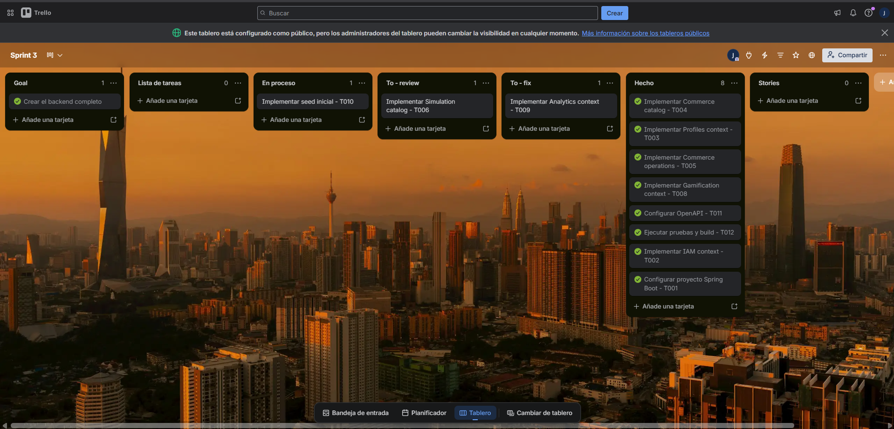
  <p>
    <i><b>Fuente</b>: Elaboración propia.</i>
  </p>
</div>

A continuación, la tabla de control de estado para el Sprint 3:

<table align="center" border="1" cellpadding="8" cellspacing="0" style="border-collapse: collapse; width: 100%; font-family: Arial, sans-serif;">
    <tbody>
        <tr>
            <td><b>Sprint #</b></td>
            <td colspan="7">Sprint 3</td>
        </tr>
        <tr>
            <td colspan="2">User Story / Technical Story</td>
            <td colspan="6">Work-Item / Task</td>
        </tr>
        <tr>
            <td>Id</td>
            <td>Title</td>
            <td>Id</td>
            <td>Title</td>
            <td>Description</td>
            <td>Estimation (Hours)</td>
            <td>Assigned to</td>
            <td>Status (To-do / In-Process / To-Review / Done)</td>
        </tr>
        <tr class="story-separator" style="background-color: #eef4ff;">
            <td colspan="8"><b>Technical Story TS13 - Configuración base backend</b></td>
        </tr>
        <tr>
            <td>TS13</td>
            <td>Configuración base backend</td>
            <td>T001</td>
            <td>Crear proyecto Spring Boot</td>
            <td>Configurar Maven, Java, dependencias principales y estructura inicial del proyecto backend.</td>
            <td>3</td>
            <td>Melgarejo Quiroz, Josep Eliu</td>
            <td>Done</td>
        </tr>
        <tr>
            <td>TS13</td>
            <td>Configuración base backend</td>
            <td>T002</td>
            <td>Configurar perfiles de ambiente</td>
            <td>Definir configuración local para puerto, datasource, JWT y variables necesarias de ejecución.</td>
            <td>2</td>
            <td>Melgarejo Quiroz, Josep Eliu</td>
            <td>Done</td>
        </tr>
        <tr class="story-separator" style="background-color: #eef4ff;">
            <td colspan="8"><b>Technical Story TS14 - Arquitectura por bounded contexts</b></td>
        </tr>
        <tr>
            <td>TS14</td>
            <td>Arquitectura por bounded contexts</td>
            <td>T003</td>
            <td>Crear estructura de paquetes</td>
            <td>Organizar contexts iam, profiles, commerce, simulation, gamification y analytics por capas.</td>
            <td>3</td>
            <td>Melgarejo Quiroz, Josep Eliu</td>
            <td>Done</td>
        </tr>
        <tr>
            <td>TS14</td>
            <td>Arquitectura por bounded contexts</td>
            <td>T004</td>
            <td>Crear shared infrastructure</td>
            <td>Implementar componentes comunes de errores, responses, configuración y soporte transversal.</td>
            <td>4</td>
            <td>Melgarejo Quiroz, Josep Eliu</td>
            <td>Done</td>
        </tr>
        <tr class="story-separator" style="background-color: #eef4ff;">
            <td colspan="8"><b>Technical Story TS15 - Seguridad JWT y roles</b></td>
        </tr>
        <tr>
            <td>TS15</td>
            <td>Seguridad JWT y roles</td>
            <td>T005</td>
            <td>Implementar sign-in</td>
            <td>Crear comando, servicio y endpoint para autenticación de usuarios registrados.</td>
            <td>3</td>
            <td>Flores Eusebio, Angel Thyago</td>
            <td>Done</td>
        </tr>
        <tr>
            <td>TS15</td>
            <td>Seguridad JWT y roles</td>
            <td>T006</td>
            <td>Implementar sign-up</td>
            <td>Crear flujo de registro con usuario, rol inicial y respuesta de autenticación.</td>
            <td>3</td>
            <td>Flores Eusebio, Angel Thyago</td>
            <td>Done</td>
        </tr>
        <tr>
            <td>TS15</td>
            <td>Seguridad JWT y roles</td>
            <td>T007</td>
            <td>Proteger endpoints privados</td>
            <td>Configurar filtros JWT y reglas para endpoints que requieren usuario autenticado.</td>
            <td>4</td>
            <td>Flores Eusebio, Angel Thyago</td>
            <td>Done</td>
        </tr>
        <tr class="story-separator" style="background-color: #eef4ff;">
            <td colspan="8"><b>Technical Story TS16 - Persistencia PostgreSQL/JPA</b></td>
        </tr>
        <tr>
            <td>TS16</td>
            <td>Persistencia PostgreSQL/JPA</td>
            <td>T008</td>
            <td>Configurar conexión PostgreSQL</td>
            <td>Configurar datasource, dialecto, credenciales locales y generación de esquema.</td>
            <td>2</td>
            <td>Melgarejo Quiroz, Josep Eliu</td>
            <td>Done</td>
        </tr>
        <tr>
            <td>TS16</td>
            <td>Persistencia PostgreSQL/JPA</td>
            <td>T009</td>
            <td>Crear entidades JPA base</td>
            <td>Crear entidades persistentes para usuarios, perfiles, productos, simulaciones y progreso.</td>
            <td>5</td>
            <td>Ayala Fernandez, Jorge Brayan</td>
            <td>Done</td>
        </tr>
        <tr class="story-separator" style="background-color: #eef4ff;">
            <td colspan="8"><b>User Story US30 - Catálogo de comercio</b></td>
        </tr>
        <tr>
            <td>US30</td>
            <td>Catálogo de comercio</td>
            <td>T010</td>
            <td>Implementar getProducts</td>
            <td>Crear query, resource, assembler y controller para listar productos desde el backend.</td>
            <td>3</td>
            <td>Ayala Fernandez, Jorge Brayan</td>
            <td>Done</td>
        </tr>
        <tr>
            <td>US30</td>
            <td>Catálogo de comercio</td>
            <td>T011</td>
            <td>Implementar getProductById</td>
            <td>Crear endpoint de detalle de producto por identificador.</td>
            <td>2</td>
            <td>Ayala Fernandez, Jorge Brayan</td>
            <td>Done</td>
        </tr>
        <tr>
            <td>US30</td>
            <td>Catálogo de comercio</td>
            <td>T012</td>
            <td>Implementar kits y cupones</td>
            <td>Exponer endpoints de emergency kits, coupons, categories y recommendations.</td>
            <td>4</td>
            <td>Ayala Fernandez, Jorge Brayan</td>
            <td>Done</td>
        </tr>
        <tr class="story-separator" style="background-color: #eef4ff;">
            <td colspan="8"><b>User Story US36 - Consultar carrito</b></td>
        </tr>
        <tr>
            <td>US36</td>
            <td>Consultar carrito</td>
            <td>T013</td>
            <td>Implementar getMyCart</td>
            <td>Crear endpoint para consultar los productos agregados al carrito del usuario autenticado.</td>
            <td>2</td>
            <td>Ayala Fernandez, Jorge Brayan</td>
            <td>Done</td>
        </tr>
        <tr class="story-separator" style="background-color: #eef4ff;">
            <td colspan="8"><b>User Story US37 - Agregar productos al carrito</b></td>
        </tr>
        <tr>
            <td>US37</td>
            <td>Agregar productos al carrito</td>
            <td>T014</td>
            <td>Implementar addCartItem</td>
            <td>Crear endpoint para agregar productos al carrito desde la tienda de SafeStep.</td>
            <td>2</td>
            <td>Ayala Fernandez, Jorge Brayan</td>
            <td>Done</td>
        </tr>
        <tr class="story-separator" style="background-color: #eef4ff;">
            <td colspan="8"><b>User Story US38 - Actualizar carrito</b></td>
        </tr>
        <tr>
            <td>US38</td>
            <td>Actualizar carrito</td>
            <td>T015</td>
            <td>Implementar updateCartItem y deleteCartItem</td>
            <td>Crear endpoints para modificar cantidades o eliminar productos del carrito.</td>
            <td>3</td>
            <td>Ayala Fernandez, Jorge Brayan</td>
            <td>Done</td>
        </tr>
        <tr class="story-separator" style="background-color: #eef4ff;">
            <td colspan="8"><b>User Story US40 - Crear orden de compra</b></td>
        </tr>
        <tr>
            <td>US40</td>
            <td>Crear orden de compra</td>
            <td>T016</td>
            <td>Implementar createOrder</td>
            <td>Crear endpoint para generar una orden a partir de los productos del carrito.</td>
            <td>2</td>
            <td>Ayala Fernandez, Jorge Brayan</td>
            <td>Done</td>
        </tr>
        <tr class="story-separator" style="background-color: #eef4ff;">
            <td colspan="8"><b>User Story US41 - Consultar historial de órdenes</b></td>
        </tr>
        <tr>
            <td>US41</td>
            <td>Consultar historial de órdenes</td>
            <td>T017</td>
            <td>Implementar getMyOrders</td>
            <td>Crear endpoint para consultar el historial de compras del usuario autenticado.</td>
            <td>2</td>
            <td>Ayala Fernandez, Jorge Brayan</td>
            <td>Done</td>
        </tr>
        <tr class="story-separator" style="background-color: #eef4ff;">
            <td colspan="8"><b>User Story US10 - Visualizar catálogo de simulaciones</b></td>
        </tr>
        <tr>
            <td>US10</td>
            <td>Visualizar catálogo de simulaciones</td>
            <td>T018</td>
            <td>Implementar getAllSimulations</td>
            <td>Crear endpoint para listar las simulaciones médicas disponibles.</td>
            <td>3</td>
            <td>Sanchez Espinoza, Mathias Enrique</td>
            <td>Done</td>
        </tr>
        <tr class="story-separator" style="background-color: #eef4ff;">
            <td colspan="8"><b>User Story US12 - Revisar detalle de una simulación</b></td>
        </tr>
        <tr>
            <td>US12</td>
            <td>Revisar detalle de una simulación</td>
            <td>T019</td>
            <td>Implementar getSimulationById</td>
            <td>Crear endpoint de detalle de simulación con pasos, opciones y sugerencias de productos.</td>
            <td>3</td>
            <td>Sanchez Espinoza, Mathias Enrique</td>
            <td>Done</td>
        </tr>
        <tr class="story-separator" style="background-color: #eef4ff;">
            <td colspan="8"><b>User Story US14 - Registrar resultado de simulación</b></td>
        </tr>
        <tr>
            <td>US14</td>
            <td>Registrar resultado de simulación</td>
            <td>T020</td>
            <td>Implementar createAttempt</td>
            <td>Registrar intento de simulación con resultado, precisión y respuestas seleccionadas.</td>
            <td>3</td>
            <td>Sanchez Espinoza, Mathias Enrique</td>
            <td>Done</td>
        </tr>
        <tr class="story-separator" style="background-color: #eef4ff;">
            <td colspan="8"><b>User Story US15 - Recibir recompensas por simulación</b></td>
        </tr>
        <tr>
            <td>US15</td>
            <td>Recibir recompensas por simulación</td>
            <td>T021</td>
            <td>Guardar recompensas del intento</td>
            <td>Persistir XP y SafeCoins obtenidos luego de completar una simulación médica.</td>
            <td>2</td>
            <td>Sanchez Espinoza, Mathias Enrique</td>
            <td>Done</td>
        </tr>
        <tr class="story-separator" style="background-color: #eef4ff;">
            <td colspan="8"><b>User Story US14 - Consultar historial de intentos</b></td>
        </tr>
        <tr>
            <td>US14</td>
            <td>Consultar historial de intentos</td>
            <td>T022</td>
            <td>Implementar getMyAttempts</td>
            <td>Permitir que el usuario consulte sus intentos anteriores.</td>
            <td>2</td>
            <td>Sanchez Espinoza, Mathias Enrique</td>
            <td>Done</td>
        </tr>
        <tr class="story-separator" style="background-color: #eef4ff;">
            <td colspan="8"><b>User Story US23 - Visualizar resumen de gamificación</b></td>
        </tr>
        <tr>
            <td>US23</td>
            <td>Visualizar resumen de gamificación</td>
            <td>T023</td>
            <td>Implementar gamification summary</td>
            <td>Crear endpoint de summary para mostrar nivel, XP, racha y SafeCoins.</td>
            <td>3</td>
            <td>Melgarejo Quiroz, Josep Eliu</td>
            <td>Done</td>
        </tr>
        <tr class="story-separator" style="background-color: #eef4ff;">
            <td colspan="8"><b>User Story US27 - Visualizar misiones e insignias</b></td>
        </tr>
        <tr>
            <td>US27</td>
            <td>Visualizar misiones e insignias</td>
            <td>T024</td>
            <td>Implementar missions y my badges</td>
            <td>Crear endpoints para consultar misiones disponibles e insignias del usuario.</td>
            <td>3</td>
            <td>Melgarejo Quiroz, Josep Eliu</td>
            <td>Done</td>
        </tr>
        <tr class="story-separator" style="background-color: #eef4ff;">
            <td colspan="8"><b>User Story US26 - Visualizar ranking</b></td>
        </tr>
        <tr>
            <td>US26</td>
            <td>Visualizar ranking</td>
            <td>T025</td>
            <td>Implementar leaderboard</td>
            <td>Crear endpoint de ranking para seguimiento competitivo entre usuarios.</td>
            <td>2</td>
            <td>Melgarejo Quiroz, Josep Eliu</td>
            <td>Done</td>
        </tr>
        <tr class="story-separator" style="background-color: #eef4ff;">
            <td colspan="8"><b>User Story US29 - Consultar transacciones de SafeCoins</b></td>
        </tr>
        <tr>
            <td>US29</td>
            <td>Consultar transacciones de SafeCoins</td>
            <td>T026</td>
            <td>Implementar coin transactions</td>
            <td>Crear endpoint de transacciones de monedas del usuario autenticado.</td>
            <td>2</td>
            <td>Melgarejo Quiroz, Josep Eliu</td>
            <td>Done</td>
        </tr>
        <tr class="story-separator" style="background-color: #eef4ff;">
            <td colspan="8"><b>User Story US18 - Visualizar resumen analítico</b></td>
        </tr>
        <tr>
            <td>US18</td>
            <td>Visualizar resumen analítico</td>
            <td>T027</td>
            <td>Implementar analytics summary</td>
            <td>Crear endpoint de resumen de progreso para dashboard y estadísticas.</td>
            <td>3</td>
            <td>Melgarejo Quiroz, Josep Eliu</td>
            <td>Done</td>
        </tr>
        <tr>
            <td>US18</td>
            <td>Visualizar resumen analítico</td>
            <td>T028</td>
            <td>Implementar progress y certificates</td>
            <td>Crear endpoints de progreso visual y certificados del usuario.</td>
            <td>3</td>
            <td>Melgarejo Quiroz, Josep Eliu</td>
            <td>Done</td>
        </tr>
        <tr class="story-separator" style="background-color: #eef4ff;">
            <td colspan="8"><b>Technical Story TS19 - Seed data</b></td>
        </tr>
        <tr>
            <td>TS19</td>
            <td>Seed data</td>
            <td>T029</td>
            <td>Cargar datos iniciales</td>
            <td>Implementar seed JSON y handlers para simulaciones, comercio, gamificación y analítica.</td>
            <td>5</td>
            <td>Flores Eusebio, Angel Thyago</td>
            <td>Done</td>
        </tr>
        <tr class="story-separator" style="background-color: #eef4ff;">
            <td colspan="8"><b>Technical Story TS18 - Documentación Swagger</b></td>
        </tr>
        <tr>
            <td>TS18</td>
            <td>Documentación Swagger</td>
            <td>T030</td>
            <td>Configurar OpenAPI</td>
            <td>Configurar SpringDoc y verificar documentación de controllers en Swagger UI.</td>
            <td>4</td>
            <td>Melgarejo Quiroz, Josep Eliu</td>
            <td>Done</td>
        </tr>
        <tr class="story-separator" style="background-color: #eef4ff;">
            <td colspan="8"><b>Technical Story TS20 - Validación técnica</b></td>
        </tr>
        <tr>
            <td>TS20</td>
            <td>Validación técnica</td>
            <td>T031</td>
            <td>Ejecutar pruebas y build</td>
            <td>Ejecutar mvn test, validar compilación y probar endpoints principales desde Swagger.</td>
            <td>4</td>
            <td>Flores Eusebio, Angel Thyago</td>
            <td>Done</td>
        </tr>
        <tr class="story-separator" style="background-color: #eef4ff;">
            <td colspan="8"><b>Technical Story TS21 - Integración frontend-backend</b></td>
        </tr>
        <tr>
            <td>TS21</td>
            <td>Integración frontend-backend</td>
            <td>T032</td>
            <td>Configurar environment del frontend</td>
            <td>Actualizar la URL base del API en Angular para consumir el backend Spring Boot local y desplegado, reemplazando el uso principal de json-server.</td>
            <td>4</td>
            <td>Melgarejo Quiroz, Josep Eliu</td>
            <td>Done</td>
        </tr>
        <tr>
            <td>TS21</td>
            <td>Integración frontend-backend</td>
            <td>T033</td>
            <td>Validar consumo de endpoints reales</td>
            <td>Probar desde la Web Application los flujos de autenticación, perfil, tienda, simulaciones, gamificación y estadísticas consumiendo el backend real.</td>
            <td>4</td>
            <td>Flores Eusebio, Angel Thyago</td>
            <td>Done</td>
        </tr>
        <tr class="story-separator" style="background-color: #eef4ff;">
            <td colspan="8"><b>Technical Story TS22 - Landing page con evidencia del producto</b></td>
        </tr>
        <tr>
            <td>TS22</td>
            <td>Landing page con evidencia del producto</td>
            <td>T034</td>
            <td>Agregar imágenes de la aplicación</td>
            <td>Actualizar la landing page para mostrar capturas o imágenes relacionadas con las funcionalidades principales del producto SafeStep.</td>
            <td>2</td>
            <td>Ayala Fernandez, Jorge Brayan</td>
            <td>Done</td>
        </tr>
        <tr>
            <td>TS22</td>
            <td>Landing page con evidencia del producto</td>
            <td>T035</td>
            <td>Agregar About the Team y About the Product</td>
            <td>Incorporar en la landing page los videos About the Team y About the Product para presentar al equipo, el problema y la solución desarrollada.</td>
            <td>2</td>
            <td>Sanchez Espinoza, Mathias Enrique</td>
            <td>Done</td>
        </tr>
    </tbody>
</table>

El Sprint Backlog 3 refleja 35 tareas derivadas de las User Stories funcionales soportadas por el backend y de las Technical Stories de integración y soporte técnico. Las tareas fueron separadas por historia para evitar agrupar varios flujos en una sola fila. Las estimaciones suman 103 horas de trabajo operativo y fueron usadas para seguimiento del avance por historia, endpoint y producto entregable. Los Story Points permanecen asociados a las historias seleccionadas durante el Sprint Planning.

### 5.2.3.4. Development Evidence for Sprint Review

En esta seccion se explica y presenta los avances de implementacion realizados durante el Sprint 3 con relacion al producto Web Services de SafeStep. El equipo completo el desarrollo del backend RESTful API utilizando Spring Boot, Java, PostgreSQL, Maven y Swagger.

**Resumen de Avances Implementados:**

- **Configuracion base del backend:** Se creo el proyecto Spring Boot con Maven, Java, perfiles de configuracion, dependencias de seguridad, persistencia, validacion, JWT y documentacion OpenAPI.
- **Shared Infrastructure:** Se implementaron clases compartidas para resultados de aplicacion, errores, respuestas HTTP, configuracion de seguridad, OpenAPI, auditoria y servicios de usuario autenticado.
- **IAM bounded context:** Se implementaron usuarios, roles, autenticacion, registro, JWT y endpoints de consulta de usuarios y roles.
- **Profiles bounded context:** Se implemento la gestion de perfiles de usuario, incluyendo creacion, consulta, consulta por identificador y actualizacion del perfil actual.
- **Commerce bounded context:** Se implemento el catalogo de productos, categorias, kits, cupones y recomendaciones, ademas de operaciones de carrito y ordenes.
- **Simulation bounded context:** Se implemento el catalogo de simulaciones medicas, consulta por identificador, registro de intentos y consulta de intentos del usuario autenticado.
- **Gamification bounded context:** Se implemento resumen de gamificacion, misiones, insignias, ranking y transacciones de monedas.
- **Analytics bounded context:** Se implementaron endpoints de resumen, progreso visual y certificados del usuario.
- **Persistencia con PostgreSQL:** Se crearon entidades JPA, repositorios de persistencia y adaptadores para conectar el dominio con la base de datos.
- **Seed data:** Se agregaron datos iniciales para poder probar el backend sin carga manual de informacion.
- **Swagger:** Se expusieron los endpoints mediante Swagger UI para facilitar la validacion y documentacion del API.
- **Integración con frontend Angular:** Se actualizó la configuración de environments, APIs, endpoints e interceptores para consumir el backend real desde la Web Application.
- **Validación de flujos frontend-backend:** Se verificaron flujos de login, perfil, dashboard, simulaciones, gamificación, tienda y estadísticas consumiendo datos desde el API de SafeStep.
- **Landing Page:** Se agregaron imágenes del producto y se incorporaron los videos About the Team y About the Product para mejorar la presentación pública de la solución.

**Commits Realizados:**

<table align="center" border="1" cellpadding="8" cellspacing="0" style="border-collapse: collapse; width: 100%; font-family: Arial, sans-serif;">
    <tbody>
        <tr>
            <td>Repository</td>
            <td>Branch</td>
            <td>Commit Id</td>
            <td>Commit message</td>
            <td>Commit body</td>
            <td>Commit on (Date)</td>
        </tr>
        <tr>
            <td>safestep-backend</td>
            <td>feature/sign-in</td>
            <td>7f4c2a1</td>
            <td>feat(auth): implement signIn endpoint</td>
            <td>Add authentication controller, sign-in command and JWT response for registered users.</td>
            <td>2026-06-07</td>
        </tr>
        <tr>
            <td>safestep-backend</td>
            <td>develop</td>
            <td>9a18d3e</td>
            <td>merge: feature/sign-in into develop</td>
            <td>Integrate the signIn endpoint with the development branch.</td>
            <td>2026-06-07</td>
        </tr>
        <tr>
            <td>safestep-backend</td>
            <td>feature/sign-up</td>
            <td>2b63f0c</td>
            <td>feat(auth): implement signUp endpoint</td>
            <td>Add user registration flow with profile creation and default role assignment.</td>
            <td>2026-06-07</td>
        </tr>
        <tr>
            <td>safestep-backend</td>
            <td>develop</td>
            <td>4c81a95</td>
            <td>merge: feature/sign-up into develop</td>
            <td>Integrate the signUp endpoint with the authentication module.</td>
            <td>2026-06-07</td>
        </tr>
        <tr>
            <td>safestep-backend</td>
            <td>feature/get-products</td>
            <td>e02b7d4</td>
            <td>feat(commerce): implement getProducts endpoint</td>
            <td>Add product query, resource assembler and REST controller method for catalog listing.</td>
            <td>2026-06-08</td>
        </tr>
        <tr>
            <td>safestep-backend</td>
            <td>feature/get-product-by-id</td>
            <td>1f9e6ba</td>
            <td>feat(commerce): implement getProductById endpoint</td>
            <td>Add product detail query and response mapping for product lookup by identifier.</td>
            <td>2026-06-08</td>
        </tr>
        <tr>
            <td>safestep-backend</td>
            <td>feature/get-emergency-kits</td>
            <td>8c52d11</td>
            <td>feat(commerce): implement getEmergencyKits endpoint</td>
            <td>Add emergency kit query, resource and controller method for kit recommendations.</td>
            <td>2026-06-08</td>
        </tr>
        <tr>
            <td>safestep-backend</td>
            <td>develop</td>
            <td>bb34e7f</td>
            <td>merge: feature/get-products into develop</td>
            <td>Integrate product catalog endpoint into the commerce context.</td>
            <td>2026-06-08</td>
        </tr>
        <tr>
            <td>safestep-backend</td>
            <td>develop</td>
            <td>0d91a6c</td>
            <td>merge: feature/get-product-by-id into develop</td>
            <td>Integrate product detail endpoint into the commerce context.</td>
            <td>2026-06-08</td>
        </tr>
        <tr>
            <td>safestep-backend</td>
            <td>develop</td>
            <td>6a8c30b</td>
            <td>merge: feature/get-emergency-kits into develop</td>
            <td>Integrate emergency kits endpoint into the commerce context.</td>
            <td>2026-06-08</td>
        </tr>
        <tr>
            <td>safestep-backend</td>
            <td>feature/add-cart-item</td>
            <td>a7310df</td>
            <td>feat(commerce): implement addCartItem endpoint</td>
            <td>Add command, handler and REST operation to add products to the authenticated user's cart.</td>
            <td>2026-06-09</td>
        </tr>
        <tr>
            <td>safestep-backend</td>
            <td>feature/create-order</td>
            <td>d5e9b42</td>
            <td>feat(commerce): implement createOrder endpoint</td>
            <td>Add order creation command and persistence mapping from current cart items.</td>
            <td>2026-06-09</td>
        </tr>
        <tr>
            <td>safestep-backend</td>
            <td>develop</td>
            <td>51c2f89</td>
            <td>merge: feature/add-cart-item into develop</td>
            <td>Integrate cart item creation endpoint into commerce operations.</td>
            <td>2026-06-09</td>
        </tr>
        <tr>
            <td>safestep-backend</td>
            <td>develop</td>
            <td>f07a62d</td>
            <td>merge: feature/create-order into develop</td>
            <td>Integrate order creation endpoint into commerce operations.</td>
            <td>2026-06-09</td>
        </tr>
        <tr>
            <td>safestep-backend</td>
            <td>feature/get-simulation-by-id</td>
            <td>3c6f80a</td>
            <td>feat(simulation): implement getSimulationById endpoint</td>
            <td>Add simulation detail query with steps and product suggestions mapping.</td>
            <td>2026-06-10</td>
        </tr>
        <tr>
            <td>safestep-backend</td>
            <td>feature/create-attempt</td>
            <td>74e2c9f</td>
            <td>feat(simulation): implement createAttempt endpoint</td>
            <td>Add attempt command, validation and persistence for completed medical simulations.</td>
            <td>2026-06-10</td>
        </tr>
        <tr>
            <td>safestep-backend</td>
            <td>develop</td>
            <td>ac29d70</td>
            <td>merge: feature/get-simulation-by-id into develop</td>
            <td>Integrate simulation detail endpoint into the simulation context.</td>
            <td>2026-06-10</td>
        </tr>
        <tr>
            <td>safestep-backend</td>
            <td>develop</td>
            <td>5b1e8a4</td>
            <td>merge: feature/create-attempt into develop</td>
            <td>Integrate attempt creation endpoint into the simulation context.</td>
            <td>2026-06-10</td>
        </tr>
        <tr>
            <td>safestep-backend</td>
            <td>feature/get-missions</td>
            <td>91fd3b8</td>
            <td>feat(gamification): implement getMissions endpoint</td>
            <td>Add mission query, resource and REST response for gamification objectives.</td>
            <td>2026-06-11</td>
        </tr>
        <tr>
            <td>safestep-backend</td>
            <td>feature/get-my-badges</td>
            <td>0b7e4c2</td>
            <td>feat(gamification): implement getMyBadges endpoint</td>
            <td>Add authenticated badge lookup for completed user achievements.</td>
            <td>2026-06-11</td>
        </tr>
        <tr>
            <td>safestep-backend</td>
            <td>develop</td>
            <td>c83a1e6</td>
            <td>merge: feature/get-missions into develop</td>
            <td>Integrate missions endpoint into the gamification context.</td>
            <td>2026-06-11</td>
        </tr>
        <tr>
            <td>safestep-backend</td>
            <td>develop</td>
            <td>68d0f35</td>
            <td>merge: feature/get-my-badges into develop</td>
            <td>Integrate user badges endpoint into the gamification context.</td>
            <td>2026-06-11</td>
        </tr>
        <tr>
            <td>safestep-backend</td>
            <td>feature/get-my-analytics-summary</td>
            <td>ad4f729</td>
            <td>feat(analytics): implement getMyAnalyticsSummary endpoint</td>
            <td>Add authenticated analytics summary query for dashboard indicators.</td>
            <td>2026-06-12</td>
        </tr>
        <tr>
            <td>safestep-backend</td>
            <td>feature/get-my-progress</td>
            <td>41e9c0d</td>
            <td>feat(analytics): implement getMyProgress endpoint</td>
            <td>Add progress query and resource mapping for simulation performance indicators.</td>
            <td>2026-06-12</td>
        </tr>
        <tr>
            <td>safestep-backend</td>
            <td>develop</td>
            <td>e7b2931</td>
            <td>merge: feature/get-my-analytics-summary into develop</td>
            <td>Integrate analytics summary endpoint into the analytics context.</td>
            <td>2026-06-12</td>
        </tr>
        <tr>
            <td>safestep-backend</td>
            <td>develop</td>
            <td>5f34b9e</td>
            <td>merge: feature/get-my-progress into develop</td>
            <td>Integrate progress endpoint into the analytics context.</td>
            <td>2026-06-12</td>
        </tr>
        <tr>
            <td>safestep-backend</td>
            <td>feature/get-my-profile</td>
            <td>bc90412</td>
            <td>feat(profiles): implement getMyProfile endpoint</td>
            <td>Add authenticated profile query and REST response for current user data.</td>
            <td>2026-06-13</td>
        </tr>
        <tr>
            <td>safestep-backend</td>
            <td>feature/update-my-profile</td>
            <td>29d7e4a</td>
            <td>feat(profiles): implement updateMyProfile endpoint</td>
            <td>Add profile update command and mapper for editable personal information.</td>
            <td>2026-06-13</td>
        </tr>
        <tr>
            <td>safestep-backend</td>
            <td>develop</td>
            <td>f63a88d</td>
            <td>merge: feature/get-my-profile into develop</td>
            <td>Integrate current profile endpoint into the profiles context.</td>
            <td>2026-06-13</td>
        </tr>
        <tr>
            <td>safestep-backend</td>
            <td>develop</td>
            <td>36bca91</td>
            <td>merge: feature/update-my-profile into develop</td>
            <td>Integrate profile update endpoint into the profiles context.</td>
            <td>2026-06-13</td>
        </tr>
        <tr>
            <td>safestep-backend</td>
            <td>feature/get-all-users</td>
            <td>84d12af</td>
            <td>feat(iam): implement getAllUsers endpoint</td>
            <td>Add user listing query and secured controller operation for IAM administration.</td>
            <td>2026-06-14</td>
        </tr>
        <tr>
            <td>safestep-backend</td>
            <td>feature/get-leaderboard</td>
            <td>db7a316</td>
            <td>feat(gamification): implement getLeaderboard endpoint</td>
            <td>Add leaderboard query and resource mapping for ranking visualization.</td>
            <td>2026-06-14</td>
        </tr>
        <tr>
            <td>safestep-backend</td>
            <td>develop</td>
            <td>a1c950e</td>
            <td>merge: feature/get-all-users into develop</td>
            <td>Integrate user listing endpoint into the IAM context.</td>
            <td>2026-06-14</td>
        </tr>
        <tr>
            <td>safestep-backend</td>
            <td>develop</td>
            <td>19f7dc3</td>
            <td>merge: feature/get-leaderboard into develop</td>
            <td>Integrate leaderboard endpoint into the gamification context.</td>
            <td>2026-06-14</td>
        </tr>
        <tr>
            <td>safestep-frontend</td>
            <td>feature/backend-integration</td>
            <td>31a9f4b</td>
            <td>feat(frontend): connect Angular app with backend API</td>
            <td>Update environments, API endpoints and authenticated requests to consume SafeStep backend services.</td>
            <td>2026-06-14</td>
        </tr>
        <tr>
            <td>safestep-frontend</td>
            <td>develop</td>
            <td>8d2c7e1</td>
            <td>merge: feature/backend-integration into develop</td>
            <td>Integrate backend API consumption into the frontend development branch.</td>
            <td>2026-06-14</td>
        </tr>
        <tr>
            <td>safestep-landing-page</td>
            <td>feature/product-media</td>
            <td>5b7a20d</td>
            <td>feat(landing): add product images and about videos</td>
            <td>Add product screenshots, About the Team video and About the Product video to the landing page.</td>
            <td>2026-06-15</td>
        </tr>
        <tr>
            <td>safestep-landing-page</td>
            <td>develop</td>
            <td>0e6d83c</td>
            <td>merge: feature/product-media into develop</td>
            <td>Integrate landing page media updates into the development branch.</td>
            <td>2026-06-15</td>
        </tr>
        <tr>
            <td>safestep-backend</td>
            <td>main</td>
            <td>ca5e7d9</td>
            <td>merge: develop into main</td>
            <td>Merge completed Sprint 3 backend endpoints from develop into the main branch.</td>
            <td>2026-06-15</td>
        </tr>
    </tbody>
</table>

**Repositorio de Backend:**

<a href="https://github.com/upc-1asi0729-2610-11990-chronos-team-3/safestep-backend.git">https://github.com/upc-1asi0729-2610-11990-chronos-team-3/safestep-backend.git</a>

**Repositorio de Frontend :**

<a href="https://github.com/upc-1asi0729-2610-11990-chronos-team-3/safestep-frontend.git">https://github.com/upc-1asi0729-2610-11990-chronos-team-3/safestep-frontend.git</a>

**Repositorio de Landing Page:**

<a href="https://github.com/upc-1asi0729-2610-11990-chronos-team-3/safestep-landing-page.git">https://github.com/upc-1asi0729-2610-11990-chronos-team-3/safestep-landing-page.git</a>

**Referencia de Swagger desplegado:**

<a href="https://safestep-backend-fxuw.onrender.com/swagger-ui/index.html">https://safestep-backend-fxuw.onrender.com/swagger-ui/index.html</a>

### 5.2.3.5. Execution Evidence for Sprint Review

El Sprint 3 permitió construir el RESTful API real de SafeStep, habilitando la comunicación entre la Web Application y una capa backend propia. Las evidencias de ejecución demuestran que el equipo completó los endpoints principales, configuró persistencia con PostgreSQL, validó la documentación con Swagger, conectó el frontend Angular con el backend y actualizó la landing page con contenido visual del producto.

**Resumen de lo Alcanzado:**

- Backend Spring Boot funcional.
- API REST organizada por bounded contexts.
- Seguridad con JWT y endpoints de autenticacion.
- Persistencia en PostgreSQL mediante Spring Data JPA.
- Seed data inicial para pruebas.
- Swagger UI disponible para documentar y probar endpoints.
- Endpoints para IAM, Profiles, Commerce, Simulation, Gamification y Analytics.
- Pruebas ejecutadas con Maven.
- Configuracion de Docker y variables de entorno para ejecucion local.
- Frontend Angular configurado para consumir el backend real mediante environments y endpoints del API.
- Landing page actualizada con imágenes de la Web Application y videos About the Team y About the Product.

**Capturas de Pantalla - Backend API:**

**Swagger UI:** Vista general de los controllers y endpoints documentados.

<div align="center">
  <p>
    <b>Captura:</b> Swagger UI del backend SafeStep
  </p>
  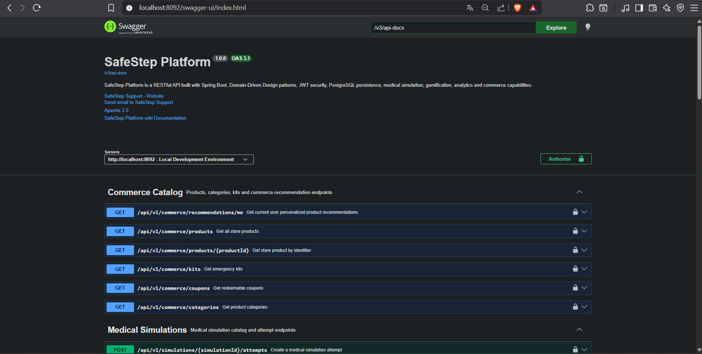
  <p>
    <i><b>Fuente</b>: Elaboracion propia.</i>
  </p>
</div>

**Capturas de Pantalla - Frontend Web Application:**

**Dashboard conectado al backend:** Vista principal de SafeStep luego de integrar la Web Application con los servicios reales.

<div align="center">
  <p>
    <b>Captura:</b> Dashboard de SafeStep consumiendo datos del backend
  </p>
  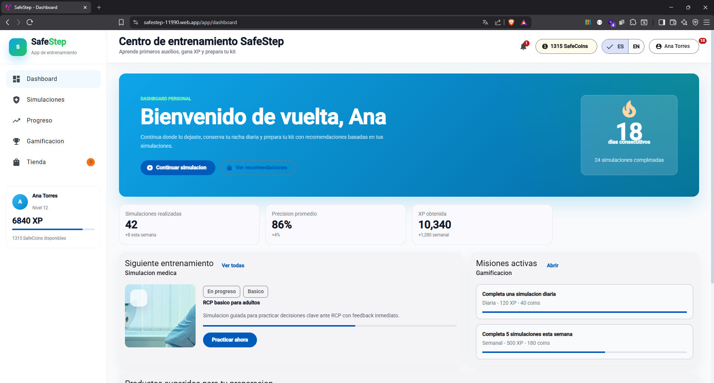
  <p>
    <i><b>Fuente</b>: Elaboración propia.</i>
  </p>
</div>

**Capturas de Pantalla - Landing Page:**

**Secciones visuales del producto:** Actualización de la landing page con imágenes relacionadas con el aprendizaje, la tienda y la propuesta de valor de SafeStep.

<div align="center">
  <p>
    <b>Captura:</b> Sección de aprendizaje en la landing page
  </p>
  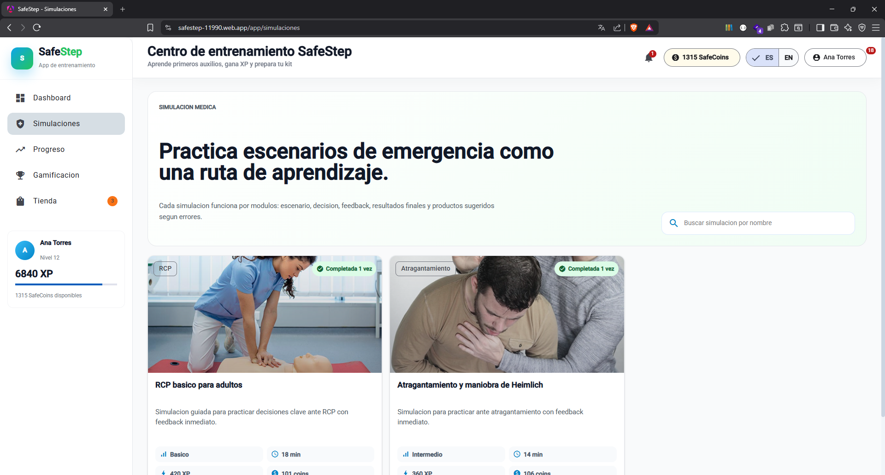
  <p>
    <i><b>Fuente</b>: Elaboración propia.</i>
  </p>
</div>

<div align="center">
  <p>
    <b>Captura:</b> Sección de ecommerce en la landing page
  </p>
  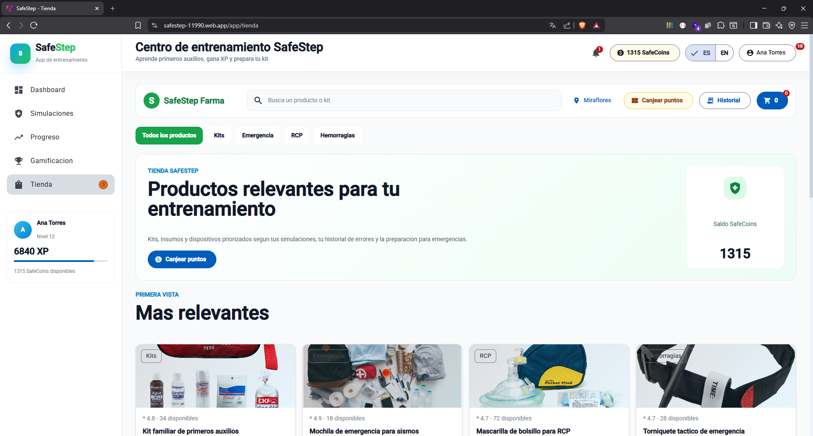
  <p>
    <i><b>Fuente</b>: Elaboración propia.</i>
  </p>
</div>

**Videos About the Team y About the Product:** Se incorporaron los videos de presentación del equipo y del producto para reforzar la comunicación pública de SafeStep.

<div align="center">
  <p>
    <b>Captura:</b> Video About the Product
  </p>
  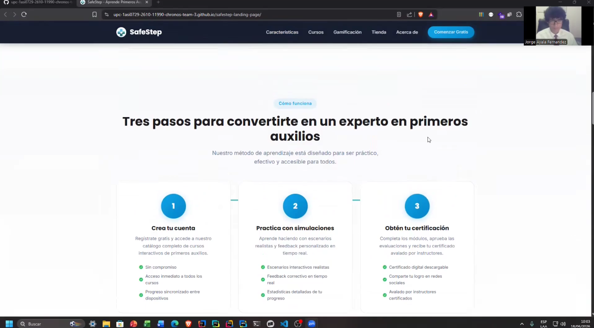
  <p>
    <i><b>Fuente</b>: Elaboración propia.</i>
  </p>
</div>


**Comandos utilizados para ejecucion local:**

```bash
mvn clean test
```

```bash
mvn spring-boot:run
```

**URL local de Swagger:**

```text
http://localhost:8092/swagger-ui/index.html
```

**URL local de OpenAPI JSON:**

```text
http://localhost:8092/v3/api-docs
```

### 5.2.3.6. Services Documentation Evidence for Sprint Review

En esta seccion se incluye la relacion de endpoints documentados con OpenAPI, relacionados con el alcance del Sprint 3. Durante este Sprint, el equipo implemento el RESTful API interno de SafeStep y expuso la documentacion mediante Swagger UI.

La documentacion de servicios permite que los integrantes del equipo frontend y backend comprendan la sintaxis de cada llamada, los metodos HTTP disponibles, los parametros requeridos y el tipo de respuesta esperada. La URL de Swagger utilizada durante el Sprint fue:

**Swagger UI:** 

<a href="https://safestep-backend-fxuw.onrender.com/swagger-ui/index.html">https://safestep-backend-fxuw.onrender.com/swagger-ui/index.html</a>

**OpenAPI JSON:** 

<a href="https://safestep-backend-fxuw.onrender.com/swagger-ui/index.html">https://safestep-backend-fxuw.onrender.com/swagger-ui/index.html</a>


| Bounded Context | Endpoint | Metodo | Descripcion | Parametros | Ejemplo Response |
|-----------------|----------|--------|-------------|------------|------------------|
| Authentication | `/api/v1/authentication/sign-in` | POST | Autentica usuario y devuelve JWT | Body: username, password | `{ "id": 1, "username": "ana.torres", "token": "..." }` |
| Authentication | `/api/v1/authentication/sign-up` | POST | Registra un nuevo usuario | Body: username, password, roles | `{ "id": 2, "username": "new.user", "roles": [...] }` |
| IAM | `/api/v1/roles` | GET | Obtiene roles disponibles | Bearer token | `[ { "id": 1, "name": "ROLE_USER" } ]` |
| IAM | `/api/v1/users` | GET | Obtiene usuarios registrados | Bearer token | `[ { "id": 1, "username": "ana.torres" } ]` |
| IAM | `/api/v1/users/{userId}` | GET | Obtiene usuario por identificador | Path: userId | `{ "id": 1, "username": "ana.torres" }` |
| Profiles | `/api/v1/profiles` | GET | Obtiene todos los perfiles | Bearer token | `[ { "id": 1, "firstName": "Ana" } ]` |
| Profiles | `/api/v1/profiles` | POST | Crea un perfil | Body: datos de perfil | `{ "id": 1, "firstName": "Ana" }` |
| Profiles | `/api/v1/profiles/me` | GET | Obtiene perfil actual | Bearer token | `{ "id": 1, "firstName": "Ana" }` |
| Profiles | `/api/v1/profiles/me` | PUT | Actualiza perfil actual | Body: datos actualizados | `{ "id": 1, "firstName": "Ana" }` |
| Profiles | `/api/v1/profiles/{profileId}` | GET | Obtiene perfil por identificador | Path: profileId | `{ "id": 1, "firstName": "Ana" }` |
| Commerce | `/api/v1/commerce/products` | GET | Obtiene productos del catalogo | Ninguno | `[ { "id": "kit-basic", "name": "Basic Kit" } ]` |
| Commerce | `/api/v1/commerce/products/{productId}` | GET | Obtiene producto por identificador | Path: productId | `{ "id": "kit-basic", "name": "Basic Kit" }` |
| Commerce | `/api/v1/commerce/categories` | GET | Obtiene categorias de productos | Ninguno | `[ { "id": "bandages", "name": "Bandages" } ]` |
| Commerce | `/api/v1/commerce/kits` | GET | Obtiene kits de emergencia | Ninguno | `[ { "id": "home-kit", "name": "Home Kit" } ]` |
| Commerce | `/api/v1/commerce/coupons` | GET | Obtiene cupones disponibles | Ninguno | `[ { "id": "SAFE10", "discount": 10 } ]` |
| Commerce | `/api/v1/commerce/recommendations/me` | GET | Obtiene recomendaciones del usuario actual | Bearer token | `[ { "productId": "kit-basic", "reason": "Recommended" } ]` |
| Commerce | `/api/v1/commerce/cart/me` | GET | Obtiene carrito del usuario actual | Bearer token | `[ { "id": "cart-001", "quantity": 2 } ]` |
| Commerce | `/api/v1/commerce/cart/items` | POST | Agrega producto al carrito | Body: productId, quantity | `{ "id": "cart-001", "quantity": 1 }` |
| Commerce | `/api/v1/commerce/cart/items/{itemId}` | PUT | Actualiza item del carrito | Path: itemId, Body: quantity | `{ "id": "cart-001", "quantity": 3 }` |
| Commerce | `/api/v1/commerce/cart/items/{itemId}` | DELETE | Elimina item del carrito | Path: itemId | `204 No Content` |
| Commerce | `/api/v1/commerce/orders/me` | GET | Obtiene ordenes del usuario actual | Bearer token | `[ { "id": "order-001", "status": "PAID" } ]` |
| Commerce | `/api/v1/commerce/orders` | POST | Crea una orden | Body: status | `{ "id": "order-001", "status": "CREATED" }` |
| Commerce | `/api/v1/commerce/shipping-addresses/me` | GET | Obtiene direcciones del usuario actual | Bearer token | `[ { "city": "Lima", "country": "Peru" } ]` |
| Commerce | `/api/v1/commerce/payment-methods` | GET | Obtiene metodos de pago disponibles | Ninguno | `[ { "id": "card", "label": "Credit Card" } ]` |
| Simulation | `/api/v1/simulations` | GET | Obtiene simulaciones medicas | Ninguno | `[ { "id": "cpr-basic", "title": "CPR Basic" } ]` |
| Simulation | `/api/v1/simulations/{simulationId}` | GET | Obtiene simulacion por identificador | Path: simulationId | `{ "id": "cpr-basic", "steps": [...] }` |
| Simulation | `/api/v1/simulations/{simulationId}/attempts` | POST | Registra intento de simulacion | Path: simulationId, Body: answers | `{ "id": "attempt-001", "score": 90 }` |
| Simulation | `/api/v1/simulations/attempts/me` | GET | Obtiene intentos del usuario actual | Bearer token | `[ { "simulationId": "cpr-basic", "score": 90 } ]` |
| Gamification | `/api/v1/gamification/summary/me` | GET | Obtiene resumen de gamificacion | Bearer token | `{ "level": 4, "coins": 120 }` |
| Gamification | `/api/v1/gamification/missions` | GET | Obtiene misiones disponibles | Bearer token | `[ { "id": "mission-001", "title": "Complete simulation" } ]` |
| Gamification | `/api/v1/gamification/badges/me` | GET | Obtiene insignias del usuario actual | Bearer token | `[ { "id": "badge-001", "unlocked": true } ]` |
| Gamification | `/api/v1/gamification/leaderboard` | GET | Obtiene leaderboard | Bearer token | `[ { "rank": 1, "username": "ana.torres" } ]` |
| Gamification | `/api/v1/gamification/coin-transactions/me` | GET | Obtiene transacciones de monedas | Bearer token | `[ { "amount": 20, "reason": "Simulation completed" } ]` |
| Analytics | `/api/v1/analytics/summary/me` | GET | Obtiene resumen analitico del usuario | Bearer token | `{ "completedSimulations": 8, "accuracy": 85 }` |
| Analytics | `/api/v1/analytics/progress/me` | GET | Obtiene progreso visual del usuario | Bearer token | `{ "weeklyProgress": [...] }` |
| Analytics | `/api/v1/analytics/certificates/me` | GET | Obtiene certificados del usuario | Bearer token | `[ { "id": "cert-001", "title": "First Aid Basics" } ]` |

**Captura de documentacion Swagger:**

<div align="center">
  <p>
    <b>Captura:</b> Swagger UI del backend SafeStep
  </p>
  
  <p>
    <i><b>Fuente</b>: Elaboracion propia.</i>
  </p>
</div>

<div align="center">
  <p>
    <b>Captura:</b> Swagger UI del backend SafeStep
  </p>
  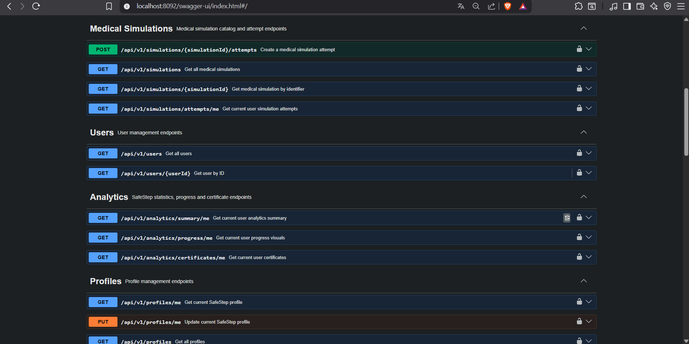
  <p>
    <i><b>Fuente</b>: Elaboracion propia.</i>
  </p>
</div>

<div align="center">
  <p>
    <b>Captura:</b> Swagger UI del backend SafeStep
  </p>
  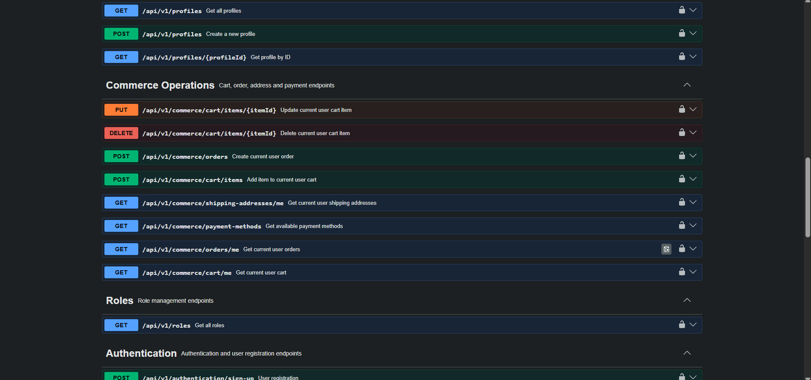
  <p>
    <i><b>Fuente</b>: Elaboracion propia.</i>
  </p>
</div>

<div align="center">
  <p>
    <b>Captura:</b> Swagger UI del backend SafeStep
  </p>
  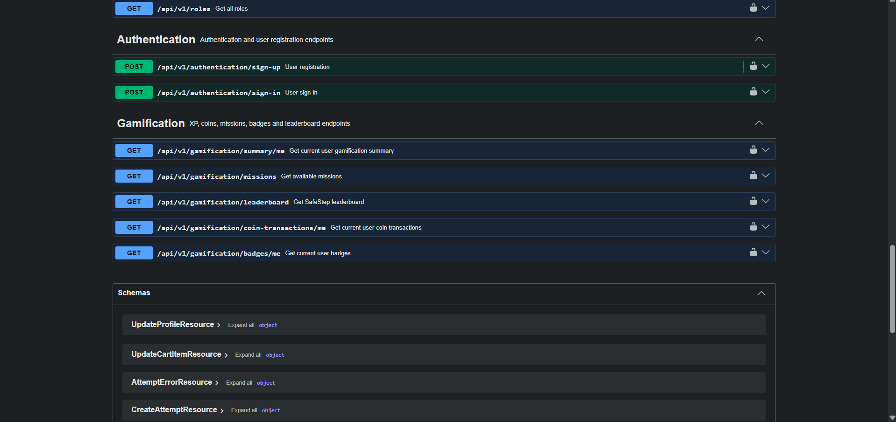
  <p>
    <i><b>Fuente</b>: Elaboracion propia.</i>
  </p>
</div>

<div align="center">
  <p>
    <b>Captura:</b> Swagger UI del backend SafeStep
  </p>
  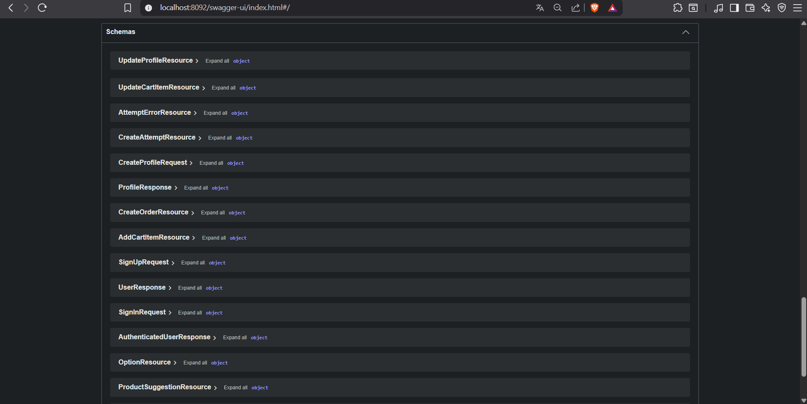
  <p>
    <i><b>Fuente</b>: Elaboracion propia.</i>
  </p>
</div>

### 5.2.3.7. Software Deployment Evidence for Sprint Review

En esta sección se resumen los procesos realizados en relación con Deployment durante el Sprint 3. Para este Sprint, el equipo se enfocó en configurar la ejecución local del backend Spring Boot, preparar el proyecto para despliegue mediante Docker, documentar las variables de entorno necesarias para conectar el API con PostgreSQL y validar que la Web Application y la Landing Page sigan disponibles públicamente.

La validación principal del backend se realizó en entorno local y mediante Swagger, mientras que el frontend y la landing page se mantuvieron disponibles en GitHub Pages. Además, se dejó registrada la referencia del backend desplegado en Render para validar la documentación pública del API. Esta combinación permite evidenciar la solución distribuida completa: landing page pública, frontend web desplegado y backend documentado mediante Swagger.

**URLs públicas del Sprint 3:**

- Landing page: <a href="https://upc-1asi0729-2610-11990-chronos-team-3.github.io/safestep-landing-page/">https://upc-1asi0729-2610-11990-chronos-team-3.github.io/safestep-landing-page/</a>
- Frontend web: <a href="https://upc-1asi0729-2610-11990-chronos-team-3.github.io/safestep-frontend/">https://upc-1asi0729-2610-11990-chronos-team-3.github.io/safestep-frontend/</a>
- Backend Swagger: <a href="https://safestep-backend-fxuw.onrender.com/swagger-ui/index.html">https://safestep-backend-fxuw.onrender.com/swagger-ui/index.html</a>

**Paso 1: Configuracion del entorno local**

Se instalo y configuro Java Development Kit, Apache Maven y PostgreSQL. El equipo creo la base de datos `safestep` y definio las credenciales locales necesarias para conectar la aplicacion con el motor de base de datos.

```text
Database name: safestep
Database user: postgres
Database password: [Insertar password usado por el equipo]
Backend port: 8092
```

**Paso 2: Configuracion de application properties**

El backend utiliza archivos de configuracion por ambiente para definir la conexion a base de datos, el puerto de ejecucion y las variables necesarias para JWT. La configuracion de desarrollo permite levantar el API localmente sin modificar codigo fuente.

**Referencia de archivo de configuracion:** `src/main/resources/application-dev.properties`

**Paso 3: Configuracion de Docker**

Se agrego un `Dockerfile` para construir la imagen del backend y un `docker-compose.yml` para levantar PostgreSQL junto con las variables requeridas por la aplicacion. Esta configuracion permite que otro integrante del equipo pueda ejecutar el proyecto con menor friccion.

**Referencia de Dockerfile:** 

<div align="center">
  <p>
    <b>Captura:</b> /safestep-backend/Dockerfile
  </p>
  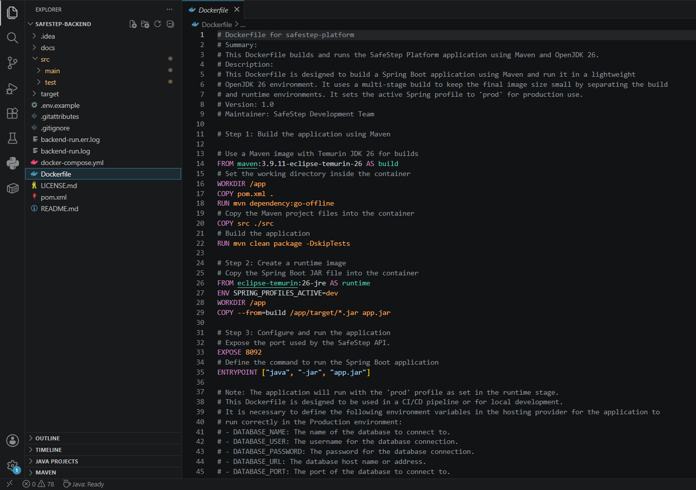
  <p>
    <i><b>Fuente</b>: Elaboracion propia.</i>
  </p>
</div>

**Referencia de docker-compose:** 

<div align="center">
  <p>
    <b>Captura:</b> /safestep-backend/docker-compose.yml
  </p>
  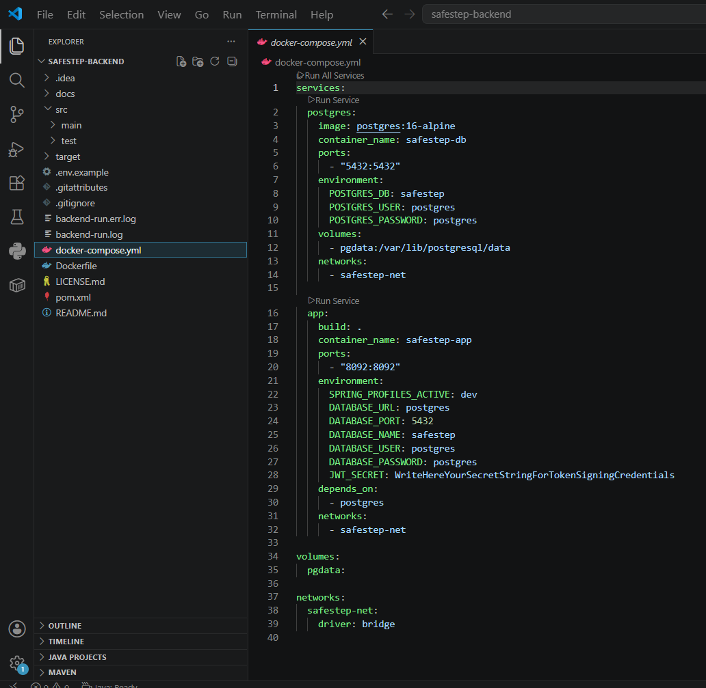
  <p>
    <i><b>Fuente</b>: Elaboracion propia.</i>
  </p>
</div>

**Paso 4: Ejecucion local del backend**

Para levantar el backend en ambiente local, se ejecuta el siguiente comando desde la raiz del proyecto:

```bash
mvn spring-boot:run
```

Luego se verifica la disponibilidad de Swagger UI:

```text
http://localhost:8092/swagger-ui/index.html
```

**Paso 5: Verificacion de endpoints**

El equipo verifico los endpoints principales utilizando Swagger UI y peticiones HTTP manuales. Se comprobaron endpoints de autenticacion, perfiles, comercio, simulaciones, gamificacion y analitica.

**Paso 6: Verificación de la integración frontend-backend**

El equipo actualizó la configuración de la Web Application para apuntar al backend real y validó que las pantallas principales consuman endpoints del API. Se revisaron flujos de login, perfil, dashboard, simulaciones, tienda, gamificación y estadísticas. Esta validación permitió comprobar que el frontend ya no depende únicamente de datos mock para los flujos principales.

**Paso 7: Actualización de la landing page**

La landing page fue actualizada para comunicar mejor el producto terminado. Se agregaron imágenes de la aplicación web, se reforzaron las secciones de aprendizaje y tienda, y se incorporaron los videos About the Team y About the Product para presentar al equipo y explicar el valor de SafeStep.

*Backend ejecutandose localmente:*

<div align="center">
  <p>
    <b>Grafico 1</b>: Swaager UI
  </p>
  
  <p>
    <i><b>Fuente</b>: Elaboracion propia.</i>
  </p>
</div>

<div align="center">
  <p>
    <b>Grafico 1</b>: OpenAPI JSON
  </p>
  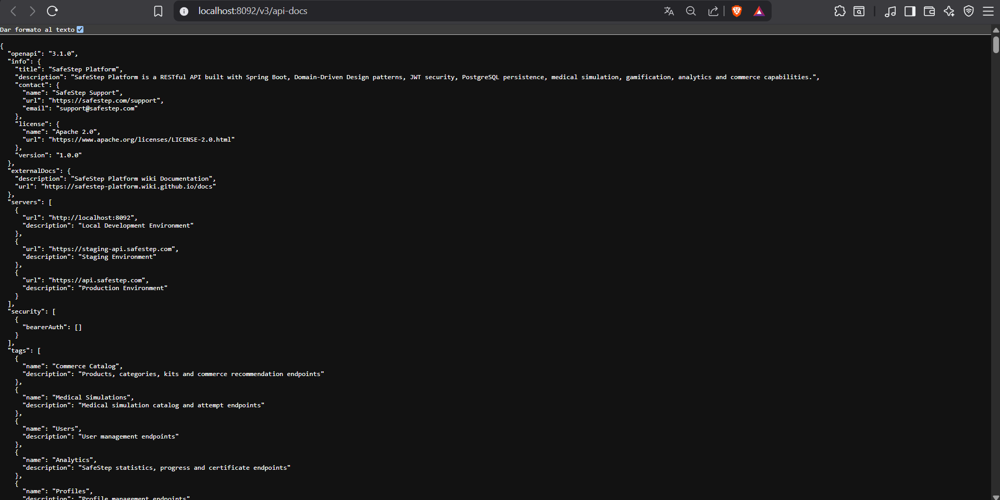
  <p>
    <i><b>Fuente</b>: Elaboracion propia.</i>
  </p>
</div>

**Resultado del despliegue o ejecucion:**

| Producto | Plataforma | URL |
|----------|-----------|-----|
| Backend Spring Boot | Local environment | <a href="http://localhost:8092">http://localhost:8092</a> |
| Swagger UI | Local environment | <a href="http://localhost:8092/swagger-ui/index.html">http://localhost:8092/swagger-ui/index.html</a> |
| OpenAPI JSON | Local environment | <a href="http://localhost:8092/v3/api-docs">http://localhost:8092/v3/api-docs</a> |
| Backend desplegado | <a href="https://render.com/">https://render.com/</a> | <a href="https://safestep-backend-fxuw.onrender.com/swagger-ui/index.html">https://safestep-backend-fxuw.onrender.com/swagger-ui/index.html</a> |
| Frontend Angular | GitHub Pages | <a href="https://upc-1asi0729-2610-11990-chronos-team-3.github.io/safestep-frontend/">https://upc-1asi0729-2610-11990-chronos-team-3.github.io/safestep-frontend/</a> |
| Landing Page | GitHub Pages | <a href="https://upc-1asi0729-2610-11990-chronos-team-3.github.io/safestep-landing-page/">https://upc-1asi0729-2610-11990-chronos-team-3.github.io/safestep-landing-page/</a> |

### 5.2.3.8. Team Collaboration Insights during Sprint

En esta sección el equipo explica cómo se desarrollaron las actividades de implementación del Sprint 3 y presenta las evidencias de colaboración relacionadas con backend, frontend y landing page. El trabajo se distribuyó por bounded context, manteniendo coordinación constante para que la estructura del código sea consistente y alineada con la arquitectura de referencia del curso.

**Distribucion de Trabajo:**

Los cuatro miembros activos del equipo participaron en el desarrollo del backend. La distribución se basó en los aspectos definidos en la matriz LACX, asignando líderes por bounded context y colaboradores para revisión, validación y documentación. Adicionalmente, se coordinó la integración del frontend con el backend y la actualización de la landing page para que el Sprint 3 evidencie el avance de los tres productos del proyecto.

Durante este Sprint, el equipo realizó revisiones internas de estructura para asegurar que los paquetes de cada bounded context mantuvieran una organización similar: domain, application, infrastructure e interfaces. También se revisó que los comandos, queries y resources estuvieran separados en archivos individuales, permitiendo que el código sea más fácil de explicar durante la sustentación. En frontend se revisó la configuración de endpoints y el consumo autenticado del API, mientras que en la landing page se validó que las imágenes y videos representen el producto desarrollado.

**Metricas de Colaboracion:**

<table align="center" border="1" cellpadding="8" cellspacing="0" style="border-collapse: collapse; width: 100%; font-family: Arial, sans-serif;">
    <tbody>
        <tr>
            <td><b>Miembro</b></td>
            <td><b>Repositorio</b></td>
            <td><b>Commits</b></td>
            <td><b>Lineas additions</b></td>
            <td><b>Lineas eliminadas</b></td>
            <td><b>PRs merged</b></td>
        </tr>
        <tr>
            <td>Ayala Fernandez, Jorge Brayan</td>
            <td>safestep-backend</td>
            <td>27</td>
            <td>16666</td>
            <td>16006</td>
            <td>5</td>
        </tr>
        <tr>
            <td>Sanchez Espinoza, Mathias Enrique</td>
            <td>safestep-backend</td>
            <td>12</td>
            <td>2858</td>
            <td>2</td>
            <td>5</td>
        </tr>
        <tr>
            <td>Melgarejo Quiroz, Josep Eliu</td>
            <td>safestep-backend</td>
            <td>81</td>
            <td>10155</td>
            <td>696</td>
            <td>5</td>
        </tr>
        <tr>
            <td>Flores Eusebio, Angel Thyago</td>
            <td>safestep-backend</td>
            <td>48</td>
            <td>3174</td>
            <td>1</td>
            <td>5</td>
        </tr>
        <tr>
            <td>Melgarejo Quiroz, Josep Eliu</td>
            <td>safestep-frontend</td>
            <td>9</td>
            <td>842</td>
            <td>216</td>
            <td>1</td>
        </tr>
        <tr>
            <td>Ayala Fernandez, Jorge Brayan</td>
            <td>safestep-landing-page</td>
            <td>6</td>
            <td>410</td>
            <td>95</td>
            <td>1</td>
        </tr>
        <tr>
            <td>Sanchez Espinoza, Mathias Enrique</td>
            <td>safestep-landing-page</td>
            <td>4</td>
            <td>286</td>
            <td>44</td>
            <td>1</td>
        </tr>
    </tbody>
</table>

**Analiticos de GitHub:**

<div align="center">
  <p>
    <b>Grafico 1</b>: Analytics Sprint 3 Backend
  </p>
  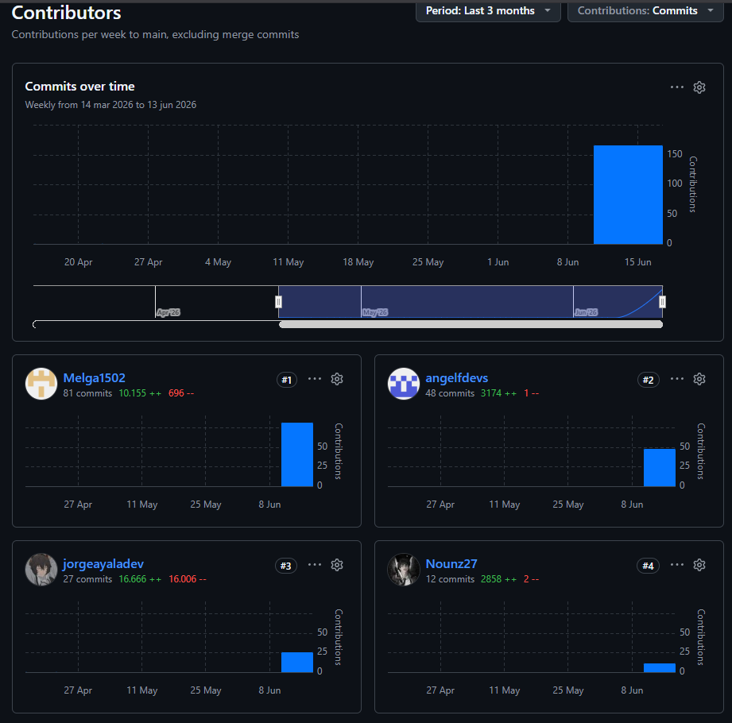
  <p>
    <i><b>Fuente</b>: Elaboracion propia.</i>
  </p>
</div>

**Distribucion de trabajo por tipo de tarea:**

- Configuracion del proyecto Spring Boot y dependencias: 10% del tiempo total.
- Implementacion de bounded contexts backend: 47% del tiempo total.
- Persistencia JPA y PostgreSQL: 15% del tiempo total.
- Seguridad JWT y configuracion compartida: 8% del tiempo total.
- Integración frontend-backend: 8% del tiempo total.
- Actualización de landing page con imágenes y videos: 5% del tiempo total.
- Documentacion Swagger y pruebas manuales: 5% del tiempo total.
- Documentacion del Sprint y evidencias: 2% del tiempo total.

**Reflexiones del Equipo:**

- Ayala Fernandez, Jorge Brayan: "Implementar el bounded context de commerce nos permitio trasladar la tienda del frontend a una API real. El mayor reto fue mantener la relacion entre productos, carrito, ordenes y recomendaciones sin perder claridad en la estructura del codigo. Además, actualizar la landing page con imágenes del producto ayudó a mostrar mejor lo que SafeStep ofrece."

- Sanchez Espinoza, Mathias Enrique: "El modulo de simulaciones fue importante porque conecta directamente con el valor principal de SafeStep. Separar simulaciones, pasos, opciones e intentos ayudo a que el backend sea mas ordenado y facil de probar desde Swagger."

- Melgarejo Quiroz, Josep Eliu: "Trabajar en gamification, analytics y shared infrastructure permitio dar soporte transversal al backend. La configuracion de Swagger, seed data y servicios compartidos fue clave para que los demas bounded contexts funcionen de forma consistente. También fue importante conectar el frontend con el backend real para validar que los endpoints funcionen dentro de la experiencia del usuario."

- Flores Eusebio, Angel Thyago: "Durante este Sprint apoye en IAM, Profiles, validacion de endpoints, seed data y documentacion. Probar el backend desde Swagger ayudo a identificar rapidamente problemas de rutas, respuestas y datos iniciales. La validación con frontend permitió revisar que la autenticación y las rutas protegidas funcionen fuera de Swagger."

**Lecciones Aprendidas:**

1. **El backend requiere una estructura mas estricta que el frontend con datos simulados:** Al trabajar con base de datos, seguridad y persistencia, fue necesario definir responsabilidades claras entre capas.

2. **Swagger facilita la comunicacion entre frontend y backend:** Tener endpoints visibles y probables desde una interfaz comun redujo dudas sobre rutas, parametros y respuestas.

3. **La separacion por bounded contexts mejora la explicacion del proyecto:** Organizar el backend en iam, profiles, commerce, simulation, gamification y analytics permite sustentar mejor la arquitectura durante la exposicion.

4. **El seed data acelera las pruebas iniciales:** Contar con datos precargados permitio validar endpoints sin depender de carga manual desde base de datos.

5. **La consistencia de nombres ayuda a evitar errores:** Mantener convenciones similares en commands, queries, resources, controllers y services hizo que el equipo pudiera moverse entre bounded contexts con menor dificultad.

6. **La integración frontend-backend debe validarse desde la interfaz real:** Swagger confirma que el API responde, pero la Web Application permite comprobar si las rutas, tokens, responses y estados visuales funcionan para el usuario.

7. **La landing page también debe reflejar el avance del producto:** Agregar imágenes reales y videos de presentación ayuda a que la comunicación pública esté alineada con lo construido en backend y frontend.


