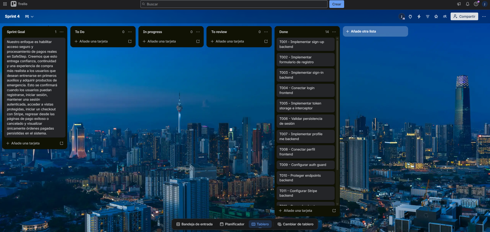
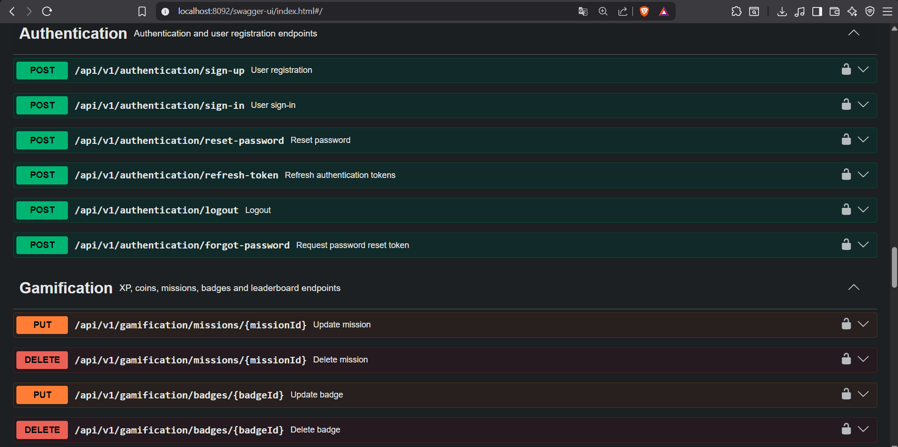
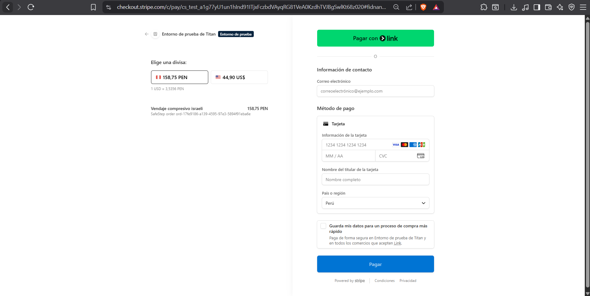
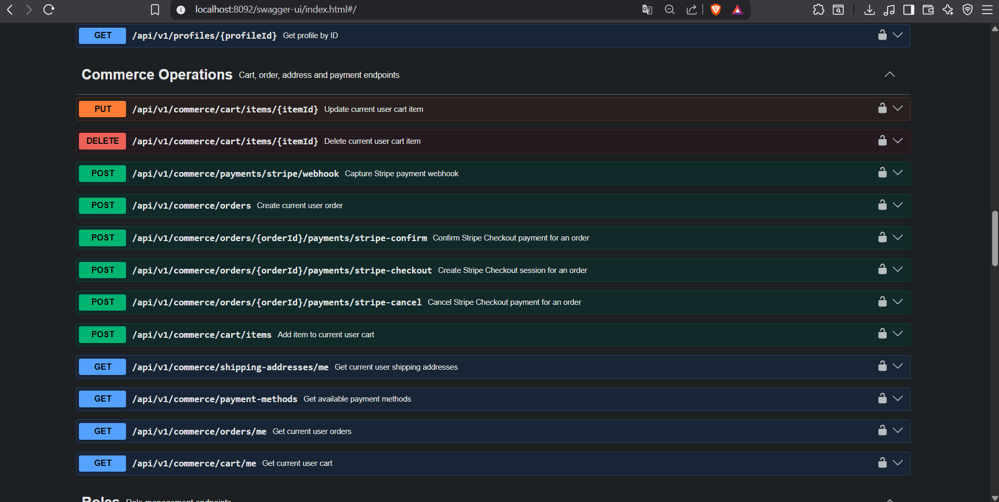
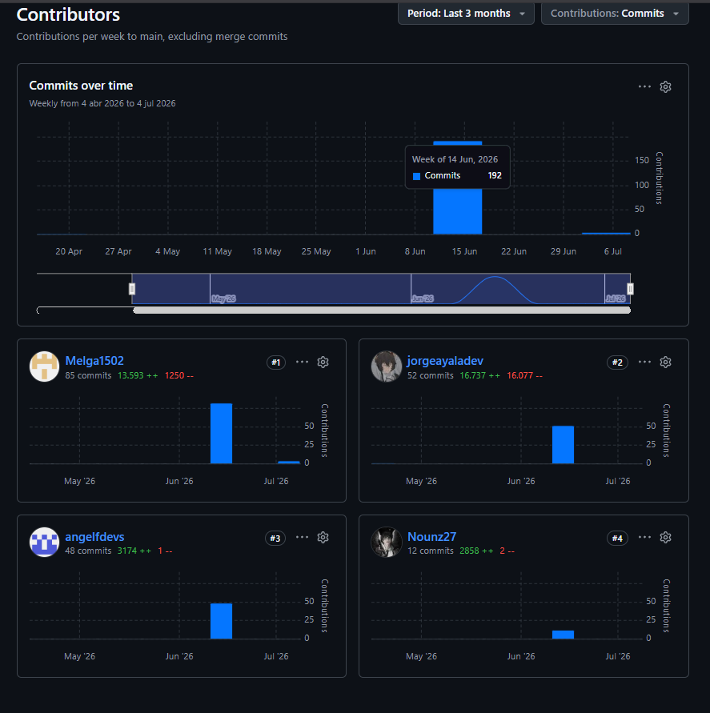
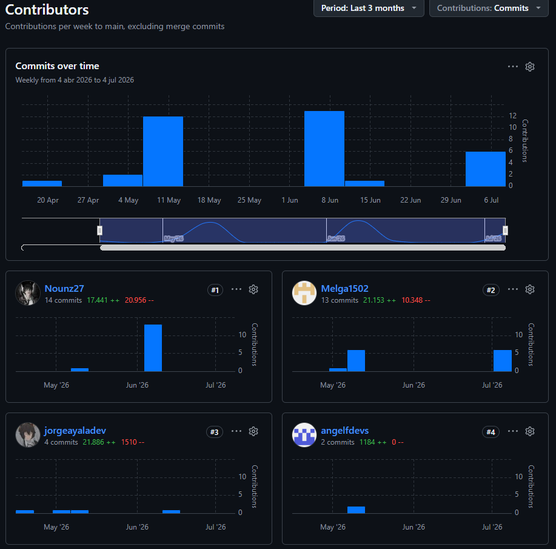

<br>
<br>

<div align="center">
    
</div>

<br>
<br>

# 5.2. Landing Page, Services & Applications Implementation.

## 5.2.4. Sprint 4

### 5.2.4.1. Sprint Planning 4

En esta sección se especifican los aspectos principales del Sprint Planning Meeting correspondiente al Sprint 4. SafeStep inicia su cuarto Sprint con el objetivo de fortalecer dos flujos críticos para una aplicación web real: Identity and Access Management (IAM) y pagos en línea con Stripe. Después del Sprint 3, donde se implementó el backend real y se conectó el frontend con los servicios REST, el equipo identificó la necesidad de reemplazar flujos simples de acceso y compra por mecanismos más cercanos a producción.

El Sprint 4 se centró en implementar autenticación real, registro de usuarios, manejo de tokens, perfil autenticado, protección de rutas, conexión del frontend con el IAM del backend, creación de sesiones de pago con Stripe, confirmación de pagos, cancelación de pagos y persistencia de órdenes pagadas en PostgreSQL desplegado en Render. Con ello, SafeStep avanza desde una aplicación funcional hacia una solución integrada con servicios externos y datos persistentes.

<table align="center" border="1" cellpadding="8" cellspacing="0" style="border-collapse: collapse; width: 100%; font-family: Arial, sans-serif;">
    <tbody>
        <tr>
            <td><b>Sprint #</b></td>
            <td>Sprint 4</td>
        </tr>
        <tr>
            <td colspan="2"><b>Sprint Planning Background</b></td>
        </tr>
        <tr>
            <td>Date</td>
            <td>2026-06-16</td>
        </tr>
        <tr>
            <td>Time</td>
            <td>10:00 AM</td>
        </tr>
        <tr>
            <td>Location</td>
            <td>Reunión virtual via Discord - Canal #sprint-planning</td>
        </tr>
        <tr>
            <td>Prepared By</td>
            <td>Melgarejo Quiroz, Josep Eliu</td>
        </tr>
        <tr>
            <td>Attendees (to planning meeting)</td>
            <td>Ayala Fernandez, Jorge Brayan / Sanchez Espinoza, Mathias Enrique / Melgarejo Quiroz, Josep Eliu / Flores Eusebio, Angel Thyago</td>
        </tr>
        <tr>
            <td>Sprint n - 1 Review Summary</td>
            <td>Sprint 3 completado exitosamente: backend Spring Boot implementado con bounded contexts, endpoints documentados en Swagger, PostgreSQL configurado, frontend conectado al API real y landing page actualizada con imágenes del producto y videos de presentación.</td>
        </tr>
        <tr>
            <td>Sprint n - 1 Retrospective Summary</td>
            <td>El equipo identificó que la conexión frontend-backend permitió validar flujos reales, pero también evidenció la necesidad de mejorar autenticación, manejo de sesión, persistencia de usuarios y control del flujo de compra. Se acordó priorizar IAM, protección de rutas y pagos con Stripe para que la experiencia sea más cercana a un producto real.</td>
        </tr>
        <tr>
            <td colspan="2"><b>Sprint Goal &amp; User Stories</b></td>
        </tr>
        <tr>
            <td>Sprint 4 Goal</td>
            <td>Nuestro enfoque es habilitar acceso seguro y procesamiento de pagos reales en SafeStep. Creemos que esto entrega confianza, continuidad y una experiencia de compra más realista a los usuarios que desean entrenarse en primeros auxilios y adquirir productos de emergencia. Esto se confirmará cuando los usuarios puedan registrarse, iniciar sesión, mantener una sesión autenticada, acceder a vistas protegidas, iniciar un checkout con Stripe, regresar desde las páginas de pago exitoso o cancelado y visualizar únicamente órdenes pagadas persistidas en el sistema.</td>
        </tr>
        <tr>
            <td>Sprint 4 Velocity</td>
            <td>El equipo estimó un velocity de 34 Story Points, considerando la integración de IAM en frontend y backend, la protección de rutas, la configuración de PostgreSQL desplegado en Render, la implementación de pagos con Stripe y la validación de los flujos principales.</td>
        </tr>
        <tr>
            <td>Sum of Story Points</td>
            <td>Total: 34 SP - Distribuidos en autenticación y registro (8 SP), perfil y sesión autenticada (5 SP), protección de rutas e interceptor JWT (5 SP), integración Stripe en backend (8 SP), integración Stripe en frontend (5 SP), y despliegue/validación con Render PostgreSQL (3 SP).</td>
        </tr>
    </tbody>
</table>

El Sprint Planning Meeting del 16 de junio de 2026 duró aproximadamente 2.5 horas. Durante la reunión se revisaron los flujos pendientes luego de la integración del Sprint 3 y se acordó que IAM y pagos eran necesarios para cerrar una experiencia web coherente: el usuario debe poder crear una cuenta, iniciar sesión, navegar con token y completar una compra mediante un proveedor externo.

**User Stories y Technical Stories incluidos en el Sprint 4:**

| ID | User Story / Technical Story | Prioridad | Story Points |
| -- | ---------------------------- | --------- | ------------ |
| US01 | Como visitante, quiero registrarme en SafeStep para crear una cuenta personal. | Must Have | 3 |
| US02 | Como usuario, quiero iniciar sesión con mis credenciales para acceder a mi cuenta. | Must Have | 3 |
| US03 | Como usuario autenticado, quiero mantener mi sesión activa para navegar sin volver a iniciar sesión constantemente. | Must Have | 2 |
| US04 | Como usuario, quiero visualizar y actualizar mi perfil para mantener mis datos personales correctos. | Must Have | 5 |
| US42 | Como usuario, quiero que las rutas privadas estén protegidas para que mis datos no sean accesibles sin autenticación. | Must Have | 5 |
| US40 | Como usuario, quiero pagar mi orden con Stripe para completar la compra de productos de emergencia. | Must Have | 8 |
| US41 | Como usuario, quiero ver solo mis compras confirmadas para evitar que pagos cancelados aparezcan como productos comprados. | Must Have | 5 |
| TS23 | Como developer, quiero configurar PostgreSQL desplegado en Render para persistir usuarios, perfiles, órdenes y pagos. | Must Have | 3 |

**Distribución de Trabajo por Componente:**

- **IAM Backend:** 8 Story Points enfocados en sign-up, sign-in, JWT, usuarios, roles y perfiles.
- **IAM Frontend:** 7 Story Points enfocados en login, registro, sesión, token storage, guards e interceptor.
- **Stripe Backend:** 8 Story Points enfocados en crear sesión de pago, confirmar pago, cancelar pago y actualizar estado de órdenes.
- **Stripe Frontend:** 5 Story Points enfocados en checkout, redirección a Stripe, páginas de success/cancel y sincronización con backend.
- **Render PostgreSQL & Deployment:** 3 Story Points enfocados en conexión a base de datos desplegada y validación de persistencia.
- **Testing & Documentation:** 3 Story Points enfocados en Swagger, pruebas manuales, evidencias e informe del Sprint.

### 5.2.4.2. Aspect Leaders and Collaborators

En esta sección el equipo elabora el artefacto Leadership-and-Collaboration Matrix (LACX) correspondiente al Sprint 4. Los aspectos del Sprint se enfocan en IAM, pagos con Stripe, persistencia desplegada y validación de integración entre frontend y backend.

**Aspectos del Sprint 4:**

1. **IAM Backend:** Implementación de autenticación, registro, JWT, usuarios, roles y perfiles desde Spring Boot.
2. **IAM Frontend:** Implementación de login, registro, sesión, guards e interceptor JWT en Angular.
3. **Stripe Backend:** Implementación de creación, confirmación y cancelación de sesiones de pago con Stripe.
4. **Stripe Frontend:** Implementación del flujo de checkout, redirección y páginas de resultado de pago.
5. **Render PostgreSQL:** Configuración de base de datos desplegada y conexión desde perfiles dev/prod.
6. **Deployment & Validation:** Validación de frontend desplegado, backend desplegado y Swagger público.
7. **Documentation:** Registro de evidencias, endpoints, capturas y métricas del Sprint.

<table align="center" border="1" cellpadding="8" cellspacing="0" style="border-collapse: collapse; width: 100%; font-family: Arial, sans-serif;">
    <tbody>
        <tr>
            <td><b>Team Member (Last Name, First Name)</b></td>
            <td><b>GitHub Username</b></td>
            <td><b>IAM Backend / L or C</b></td>
            <td><b>IAM Frontend / L or C</b></td>
            <td><b>Stripe Backend / L or C</b></td>
            <td><b>Stripe Frontend / L or C</b></td>
            <td><b>Render PostgreSQL / L or C</b></td>
            <td><b>Deployment &amp; Validation / L or C</b></td>
            <td><b>Documentation / L or C</b></td>
        </tr>
        <tr>
            <td>Ayala Fernandez, Jorge Brayan</td>
            <td>jorgeayaladev</td>
            <td>C</td>
            <td>C</td>
            <td>L</td>
            <td>C</td>
            <td>C</td>
            <td>C</td>
            <td>C</td>
        </tr>
        <tr>
            <td>Sanchez Espinoza, Mathias Enrique</td>
            <td>Nounz27</td>
            <td>C</td>
            <td>C</td>
            <td>C</td>
            <td>L</td>
            <td>-</td>
            <td>C</td>
            <td>C</td>
        </tr>
        <tr>
            <td>Melgarejo Quiroz, Josep Eliu</td>
            <td>Melga1502</td>
            <td>C</td>
            <td>L</td>
            <td>C</td>
            <td>C</td>
            <td>L</td>
            <td>L</td>
            <td>C</td>
        </tr>
        <tr>
            <td>Flores Eusebio, Angel Thyago</td>
            <td>angelfdevs</td>
            <td>L</td>
            <td>C</td>
            <td>C</td>
            <td>C</td>
            <td>C</td>
            <td>C</td>
            <td>L</td>
        </tr>
    </tbody>
</table>

La organización de líderes y colaboradores se relaciona con las tasks del Sprint Backlog. Flores lidera IAM backend y documentación; Melgarejo lidera IAM frontend, conexión con Render PostgreSQL y validación de despliegue; Ayala lidera Stripe backend; Sanchez lidera Stripe frontend y validación del flujo visual de pago.

**Distribución detallada de responsabilidades:**

- **Flores Eusebio, Angel Thyago (IAM Backend & Documentation Lead):** Responsable de los endpoints de autenticación, registro, usuarios, roles, perfiles y documentación del Sprint.
- **Melgarejo Quiroz, Josep Eliu (IAM Frontend, Database & Deployment Lead):** Responsable de integrar el frontend con IAM, configurar guards, interceptor JWT, environments, conexión con PostgreSQL desplegado y validación de despliegues.
- **Ayala Fernandez, Jorge Brayan (Stripe Backend Lead):** Responsable de crear la integración de Stripe en backend, incluyendo creación de checkout session, confirmación, cancelación y actualización de órdenes.
- **Sanchez Espinoza, Mathias Enrique (Stripe Frontend Lead):** Responsable de implementar el flujo de checkout en Angular, las páginas de success/cancel y la validación visual del resultado de pago.

### 5.2.4.3. Sprint Backlog 4

El Sprint Backlog 4 resume las tareas necesarias para implementar IAM y pagos con Stripe en SafeStep. Las tasks fueron separadas por User Story o Technical Story para mantener trazabilidad entre el Product Backlog, la matriz LACX y el trabajo operativo realizado durante el Sprint.

**Trello Board:**
El equipo utiliza un Trello Board con las listas estándar de Scrum: "Sprint Goal", "To Do", "In Progress", "To Review" y "Done".

**URL pública del Trello Board del Sprint 4:**

[https://trello.com/invite/b/6a4c73d726d69110e941ae5d/ATTI47d8650b459b28e1569025db5128d51a8B5DA179/sprint-4](https://trello.com/invite/b/6a4c73d726d69110e941ae5d/ATTI47d8650b459b28e1569025db5128d51a8B5DA179/sprint-4)

<div align="center">
  <p>
    <b>Captura</b>: Board de Trello correspondiente al Sprint 4
  </p>
  
  <p>
    <i><b>Fuente</b>: Elaboración propia.</i>
  </p>
</div>

A continuación, la tabla de control de estado para el Sprint 4:

<table align="center" border="1" cellpadding="8" cellspacing="0" style="border-collapse: collapse; width: 100%; font-family: Arial, sans-serif;">
    <tbody>
        <tr>
            <td><b>Sprint #</b></td>
            <td colspan="7">Sprint 4</td>
        </tr>
        <tr>
            <td colspan="2">User Story / Technical Story</td>
            <td colspan="6">Work-Item / Task</td>
        </tr>
        <tr>
            <td>Id</td>
            <td>Title</td>
            <td>Id</td>
            <td>Title</td>
            <td>Description</td>
            <td>Estimation (Hours)</td>
            <td>Assigned to</td>
            <td>Status (To-do / In-Process / To-Review / Done)</td>
        </tr>
        <tr class="story-separator" style="background-color: #eef4ff;">
            <td colspan="8"><b>User Story US01 - Registro de usuario</b></td>
        </tr>
        <tr>
            <td>US01</td>
            <td>Registro de usuario</td>
            <td>T001</td>
            <td>Implementar sign-up backend</td>
            <td>Crear endpoint de registro con validación de usuario, contraseña, rol inicial y perfil asociado.</td>
            <td>4</td>
            <td>Flores Eusebio, Angel Thyago</td>
            <td>Done</td>
        </tr>
        <tr>
            <td>US01</td>
            <td>Registro de usuario</td>
            <td>T002</td>
            <td>Implementar formulario de registro</td>
            <td>Crear vista de registro en Angular y conectarla con el endpoint de sign-up.</td>
            <td>3</td>
            <td>Melgarejo Quiroz, Josep Eliu</td>
            <td>Done</td>
        </tr>
        <tr class="story-separator" style="background-color: #eef4ff;">
            <td colspan="8"><b>User Story US02 - Inicio de sesión</b></td>
        </tr>
        <tr>
            <td>US02</td>
            <td>Inicio de sesión</td>
            <td>T003</td>
            <td>Implementar sign-in backend</td>
            <td>Validar credenciales, generar JWT y devolver datos básicos del usuario autenticado.</td>
            <td>4</td>
            <td>Flores Eusebio, Angel Thyago</td>
            <td>Done</td>
        </tr>
        <tr>
            <td>US02</td>
            <td>Inicio de sesión</td>
            <td>T004</td>
            <td>Conectar login frontend</td>
            <td>Consumir sign-in desde Angular, almacenar token y redirigir al dashboard usando Router.</td>
            <td>3</td>
            <td>Melgarejo Quiroz, Josep Eliu</td>
            <td>Done</td>
        </tr>
        <tr class="story-separator" style="background-color: #eef4ff;">
            <td colspan="8"><b>User Story US03 - Sesión autenticada</b></td>
        </tr>
        <tr>
            <td>US03</td>
            <td>Sesión autenticada</td>
            <td>T005</td>
            <td>Implementar token storage e interceptor</td>
            <td>Guardar token en el frontend y enviarlo automáticamente en requests protegidos mediante interceptor HTTP.</td>
            <td>4</td>
            <td>Melgarejo Quiroz, Josep Eliu</td>
            <td>Done</td>
        </tr>
        <tr>
            <td>US03</td>
            <td>Sesión autenticada</td>
            <td>T006</td>
            <td>Validar persistencia de sesión</td>
            <td>Comprobar que al recargar el navegador el usuario conserve su sesión mientras el token sea válido.</td>
            <td>2</td>
            <td>Flores Eusebio, Angel Thyago</td>
            <td>Done</td>
        </tr>
        <tr class="story-separator" style="background-color: #eef4ff;">
            <td colspan="8"><b>User Story US04 - Perfil de usuario</b></td>
        </tr>
        <tr>
            <td>US04</td>
            <td>Perfil de usuario</td>
            <td>T007</td>
            <td>Implementar profile me backend</td>
            <td>Crear endpoints para consultar y actualizar el perfil del usuario autenticado.</td>
            <td>4</td>
            <td>Flores Eusebio, Angel Thyago</td>
            <td>Done</td>
        </tr>
        <tr>
            <td>US04</td>
            <td>Perfil de usuario</td>
            <td>T008</td>
            <td>Conectar perfil frontend</td>
            <td>Mostrar nombre, correo y datos de perfil consumidos desde el backend real.</td>
            <td>3</td>
            <td>Melgarejo Quiroz, Josep Eliu</td>
            <td>Done</td>
        </tr>
        <tr class="story-separator" style="background-color: #eef4ff;">
            <td colspan="8"><b>User Story US42 - Protección de rutas</b></td>
        </tr>
        <tr>
            <td>US42</td>
            <td>Protección de rutas</td>
            <td>T009</td>
            <td>Configurar auth guard</td>
            <td>Proteger rutas privadas del frontend y redirigir a login si no existe sesión válida.</td>
            <td>3</td>
            <td>Melgarejo Quiroz, Josep Eliu</td>
            <td>Done</td>
        </tr>
        <tr>
            <td>US42</td>
            <td>Protección de rutas</td>
            <td>T010</td>
            <td>Proteger endpoints backend</td>
            <td>Configurar reglas de seguridad para endpoints que requieren JWT válido.</td>
            <td>3</td>
            <td>Flores Eusebio, Angel Thyago</td>
            <td>Done</td>
        </tr>
        <tr class="story-separator" style="background-color: #eef4ff;">
            <td colspan="8"><b>User Story US40 - Pago con Stripe</b></td>
        </tr>
        <tr>
            <td>US40</td>
            <td>Pago con Stripe</td>
            <td>T011</td>
            <td>Configurar Stripe backend</td>
            <td>Agregar dependencias, variables y servicio de integración con Stripe en Spring Boot.</td>
            <td>4</td>
            <td>Ayala Fernandez, Jorge Brayan</td>
            <td>Done</td>
        </tr>
        <tr>
            <td>US40</td>
            <td>Pago con Stripe</td>
            <td>T012</td>
            <td>Crear checkout session</td>
            <td>Crear endpoint para generar sesión de Stripe Checkout a partir de una orden.</td>
            <td>4</td>
            <td>Ayala Fernandez, Jorge Brayan</td>
            <td>Done</td>
        </tr>
        <tr>
            <td>US40</td>
            <td>Pago con Stripe</td>
            <td>T013</td>
            <td>Conectar botón de pago frontend</td>
            <td>Enviar orden al backend, recibir URL de checkout y redirigir al usuario hacia Stripe.</td>
            <td>4</td>
            <td>Sanchez Espinoza, Mathias Enrique</td>
            <td>Done</td>
        </tr>
        <tr class="story-separator" style="background-color: #eef4ff;">
            <td colspan="8"><b>User Story US41 - Confirmación de compra</b></td>
        </tr>
        <tr>
            <td>US41</td>
            <td>Confirmación de compra</td>
            <td>T014</td>
            <td>Implementar confirm payment</td>
            <td>Crear endpoint para confirmar el pago exitoso y marcar la orden como pagada.</td>
            <td>4</td>
            <td>Ayala Fernandez, Jorge Brayan</td>
            <td>Done</td>
        </tr>
        <tr>
            <td>US41</td>
            <td>Confirmación de compra</td>
            <td>T015</td>
            <td>Implementar cancel payment</td>
            <td>Crear endpoint para cancelar una sesión y evitar que pagos cancelados aparezcan como compras.</td>
            <td>4</td>
            <td>Ayala Fernandez, Jorge Brayan</td>
            <td>Done</td>
        </tr>
        <tr>
            <td>US41</td>
            <td>Confirmación de compra</td>
            <td>T016</td>
            <td>Crear páginas success y cancel</td>
            <td>Implementar páginas de resultado en Angular y sincronizarlas con los endpoints de confirmación o cancelación.</td>
            <td>4</td>
            <td>Sanchez Espinoza, Mathias Enrique</td>
            <td>Done</td>
        </tr>
        <tr class="story-separator" style="background-color: #eef4ff;">
            <td colspan="8"><b>Technical Story TS23 - PostgreSQL desplegado en Render</b></td>
        </tr>
        <tr>
            <td>TS23</td>
            <td>PostgreSQL desplegado en Render</td>
            <td>T017</td>
            <td>Configurar datasource dev/prod</td>
            <td>Configurar `application-dev.properties` y `application-prod.properties` para usar la base de datos PostgreSQL desplegada en Render.</td>
            <td>3</td>
            <td>Melgarejo Quiroz, Josep Eliu</td>
            <td>Done</td>
        </tr>
        <tr>
            <td>TS23</td>
            <td>PostgreSQL desplegado en Render</td>
            <td>T018</td>
            <td>Validar persistencia remota</td>
            <td>Probar registro, login, perfil, órdenes y pagos verificando persistencia en PostgreSQL de Render.</td>
            <td>3</td>
            <td>Melgarejo Quiroz, Josep Eliu</td>
            <td>Done</td>
        </tr>
        <tr class="story-separator" style="background-color: #eef4ff;">
            <td colspan="8"><b>Technical Story TS24 - Validación y documentación</b></td>
        </tr>
        <tr>
            <td>TS24</td>
            <td>Validación y documentación</td>
            <td>T019</td>
            <td>Validar Swagger y frontend desplegado</td>
            <td>Probar endpoints IAM y Stripe desde Swagger, y validar login, registro y checkout desde el frontend desplegado.</td>
            <td>4</td>
            <td>Flores Eusebio, Angel Thyago</td>
            <td>Done</td>
        </tr>
        <tr>
            <td>TS24</td>
            <td>Validación y documentación</td>
            <td>T020</td>
            <td>Documentar evidencias del Sprint</td>
            <td>Registrar capturas, URLs públicas, endpoints y resultados de validación en el reporte.</td>
            <td>3</td>
            <td>Flores Eusebio, Angel Thyago</td>
            <td>Done</td>
        </tr>
    </tbody>
</table>

El Sprint Backlog 4 refleja 20 tasks derivadas de User Stories y Technical Stories relacionadas con IAM, Stripe, persistencia desplegada y validación de integración. Las estimaciones suman 70 horas de trabajo operativo y fueron usadas para organizar el avance de frontend y backend.

### 5.2.4.4. Development Evidence for Sprint Review

En esta sección se presentan los avances de implementación realizados durante el Sprint 4. El equipo completó la integración de IAM y Stripe tanto en backend como en frontend, manteniendo la arquitectura por bounded contexts y la separación de responsabilidades entre domain, application, infrastructure e interfaces.

**Resumen de Avances Implementados:**

- **IAM Backend:** Implementación de sign-up, sign-in, generación de JWT, usuarios, roles, perfiles y endpoints protegidos.
- **IAM Frontend:** Implementación de formularios de login y registro, token storage, interceptor HTTP, auth guard, manejo de sesión y perfil autenticado.
- **Stripe Backend:** Implementación de creación de sesiones de checkout, confirmación de pago, cancelación de pago y actualización del estado de órdenes.
- **Stripe Frontend:** Implementación de flujo de checkout, redirección a Stripe, páginas de resultado y sincronización con backend.
- **Render PostgreSQL:** Configuración de base de datos desplegada para persistir usuarios, perfiles, órdenes y pagos.
- **Deployment:** Validación de backend desplegado, frontend desplegado y Swagger UI público.

**Commits Realizados:**

<table align="center" border="1" cellpadding="8" cellspacing="0" style="border-collapse: collapse; width: 100%; font-family: Arial, sans-serif;">
    <tbody>
        <tr>
            <td>Repository</td>
            <td>Branch</td>
            <td>Commit Id</td>
            <td>Commit message</td>
            <td>Commit body</td>
            <td>Commit on (Date)</td>
        </tr>
        <tr>
            <td>safestep-backend</td>
            <td>feature/iam-authentication</td>
            <td>f41a9c2</td>
            <td>feat(iam): implement authentication endpoints</td>
            <td>Add sign-up, sign-in, JWT generation and authenticated user support.</td>
            <td>2026-06-17</td>
        </tr>
        <tr>
            <td>safestep-backend</td>
            <td>feature/stripe-checkout</td>
            <td>9d83b6e</td>
            <td>feat(commerce): add Stripe checkout integration</td>
            <td>Add checkout session creation and payment URL response for ecommerce orders.</td>
            <td>2026-06-19</td>
        </tr>
        <tr>
            <td>safestep-backend</td>
            <td>feature/stripe-payment-result</td>
            <td>6c21de4</td>
            <td>feat(commerce): confirm and cancel Stripe payments</td>
            <td>Add endpoints to confirm successful payment and cancel unpaid checkout sessions.</td>
            <td>2026-06-21</td>
        </tr>
        <tr>
            <td>safestep-frontend</td>
            <td>feature/iam-front</td>
            <td>b7f3a19</td>
            <td>feat(iam): connect login and register with backend</td>
            <td>Add auth API, token storage, interceptor, auth guard and profile loading.</td>
            <td>2026-06-22</td>
        </tr>
        <tr>
            <td>safestep-frontend</td>
            <td>feature/stripe-front</td>
            <td>2e9a74d</td>
            <td>feat(ecommerce): connect checkout with Stripe</td>
            <td>Add checkout redirect, payment success page and payment cancel page.</td>
            <td>2026-06-23</td>
        </tr>
        <tr>
            <td>safestep-backend</td>
            <td>feature/render-postgres</td>
            <td>0a7d5f8</td>
            <td>chore(config): configure Render PostgreSQL datasource</td>
            <td>Update dev and prod properties to connect with deployed PostgreSQL database.</td>
            <td>2026-06-24</td>
        </tr>
        <tr>
            <td>safestep-backend</td>
            <td>develop</td>
            <td>d42c1aa</td>
            <td>merge: feature/iam-authentication into develop</td>
            <td>Integrate IAM backend flow into the development branch.</td>
            <td>2026-06-24</td>
        </tr>
        <tr>
            <td>safestep-frontend</td>
            <td>develop</td>
            <td>e18c4b7</td>
            <td>merge: feature/iam-front into develop</td>
            <td>Integrate frontend IAM flow into the development branch.</td>
            <td>2026-06-24</td>
        </tr>
        <tr>
            <td>safestep-backend</td>
            <td>main</td>
            <td>4f8b2c6</td>
            <td>merge: develop into main</td>
            <td>Merge Sprint 4 IAM, Stripe and Render database configuration into main.</td>
            <td>2026-06-25</td>
        </tr>
    </tbody>
</table>

**Repositorio de Backend:**

<a href="https://github.com/upc-1asi0729-2610-11990-chronos-team-3/safestep-backend.git">https://github.com/upc-1asi0729-2610-11990-chronos-team-3/safestep-backend.git</a>

**Repositorio de Frontend:**

<a href="https://github.com/upc-1asi0729-2610-11990-chronos-team-3/safestep-frontend.git">https://github.com/upc-1asi0729-2610-11990-chronos-team-3/safestep-frontend.git</a>

### 5.2.4.5. Execution Evidence for Sprint Review

El Sprint 4 permitió validar los flujos de autenticación y pago en SafeStep. Las evidencias de ejecución demuestran que el usuario puede registrarse, iniciar sesión, navegar con token, consultar su perfil, crear una orden, pagar con Stripe y visualizar únicamente compras confirmadas.

**Resumen de lo Alcanzado:**

- Registro de usuarios conectado con backend.
- Inicio de sesión con JWT.
- Protección de rutas privadas en Angular.
- Interceptor HTTP para requests autenticados.
- Perfil de usuario cargado desde backend.
- Creación de sesión de Stripe Checkout.
- Confirmación de pagos exitosos.
- Cancelación de pagos no completados.
- Persistencia de órdenes pagadas en PostgreSQL desplegado.

**Capturas de Pantalla - IAM:**

<div align="center">
  <p>
    <b>Captura:</b> Login conectado al backend
  </p>
  
  <p>
    <i><b>Fuente</b>: Elaboración propia.</i>
  </p>
</div>

<div align="center">
  <p>
    <b>Captura:</b> Registro conectado al backend
  </p>
  
  <p>
    <i><b>Fuente</b>: Elaboración propia.</i>
  </p>
</div>

<div align="center">
  <p>
    <b>Captura:</b> Endpoints IAM documentados en Swagger
  </p>
  
  <p>
    <i><b>Fuente</b>: Elaboración propia.</i>
  </p>
</div>

**Capturas de Pantalla - Stripe:**

<div align="center">
  <p>
    <b>Captura:</b> Checkout de Stripe desde SafeStep
  </p>
  
  <p>
    <i><b>Fuente</b>: Elaboración propia.</i>
  </p>
</div>

<div align="center">
  <p>
    <b>Captura:</b> Endpoints de pagos documentados en Swagger
  </p>
  
  <p>
    <i><b>Fuente</b>: Elaboración propia.</i>
  </p>
</div>


**Comandos utilizados para ejecución local:**

```bash
mvn clean test
```

```bash
mvn spring-boot:run
```

```bash
npm install
```

```bash
npm start
```

### 5.2.4.6. Services Documentation Evidence for Sprint Review

Durante el Sprint 4 se documentaron y validaron los endpoints relacionados con IAM y pagos de Stripe. Estos endpoints se encuentran disponibles desde Swagger UI en el backend desplegado:

<a href="https://safestep-backend-fxuw.onrender.com/swagger-ui/index.html">https://safestep-backend-fxuw.onrender.com/swagger-ui/index.html</a>

| Bounded Context | Endpoint | Método | Descripción | Parámetros | Ejemplo Response |
|-----------------|----------|--------|-------------|------------|------------------|
| Authentication | `/api/v1/authentication/sign-up` | POST | Registra un nuevo usuario | Body: username, password, roles | `{ "id": 12, "username": "user@mail.com" }` |
| Authentication | `/api/v1/authentication/sign-in` | POST | Autentica un usuario y devuelve JWT | Body: username, password | `{ "id": 12, "username": "user@mail.com", "token": "..." }` |
| Profiles | `/api/v1/profiles/me` | GET | Obtiene perfil del usuario autenticado | Bearer token | `{ "firstName": "Josep", "email": "user@mail.com" }` |
| Profiles | `/api/v1/profiles/me` | PUT | Actualiza perfil del usuario autenticado | Bearer token, body profile | `{ "firstName": "Josep", "lastName": "Melgarejo" }` |
| Commerce | `/api/v1/commerce/orders` | POST | Crea una orden de compra | Bearer token, body order | `{ "id": "order-001", "status": "CREATED" }` |
| Commerce | `/api/v1/commerce/orders/{orderId}/payments/stripe-checkout` | POST | Crea una sesión de Stripe Checkout | Path: orderId | `{ "checkoutUrl": "https://checkout.stripe.com/..." }` |
| Commerce | `/api/v1/commerce/orders/{orderId}/payments/stripe-confirm` | POST | Confirma pago exitoso de Stripe | Path: orderId, query: sessionId | `{ "status": "PAID" }` |
| Commerce | `/api/v1/commerce/orders/{orderId}/payments/stripe-cancel` | POST | Cancela pago no completado | Path: orderId, query: sessionId | `{ "status": "CANCELLED" }` |
| Commerce | `/api/v1/commerce/orders/me` | GET | Lista compras confirmadas del usuario | Bearer token | `[ { "id": "order-001", "status": "PAID" } ]` |

**Captura de documentación Swagger:**

<div align="center">
  <p>
    <b>Captura:</b> Swagger UI con endpoints IAM y Stripe
  </p>
  
  <p>
    <i><b>Fuente</b>: Elaboración propia.</i>
  </p>
</div>

<div align="center">
  <p>
    <b>Captura:</b> Swagger UI con endpoints IAM y Stripe
  </p>
  
  <p>
    <i><b>Fuente</b>: Elaboración propia.</i>
  </p>
</div>

### 5.2.4.7. Software Deployment Evidence for Sprint Review

En esta sección se presentan las evidencias de despliegue del Sprint 4. El objetivo fue validar que SafeStep funcione con frontend desplegado, backend desplegado y base de datos PostgreSQL remota en Render.

**URLs públicas del Sprint 4:**

- Backend desplegado: <a href="https://safestep-backend-fxuw.onrender.com/swagger-ui/index.html">https://safestep-backend-fxuw.onrender.com/swagger-ui/index.html</a>
- Frontend desplegado: <a href="https://upc-1asi0729-2610-11990-chronos-team-3.github.io/safestep-frontend/">https://upc-1asi0729-2610-11990-chronos-team-3.github.io/safestep-frontend/</a>
- Landing page desplegada: <a href="https://upc-1asi0729-2610-11990-chronos-team-3.github.io/safestep-landing-page/">https://upc-1asi0729-2610-11990-chronos-team-3.github.io/safestep-landing-page/</a>
- Base de datos desplegada en Render: `dpg-d8pj85v7f7vs73d1r4i0-a.oregon-postgres.render.com`

**Configuración de backend desplegado:**

- **Plataforma:** Render
- **Framework:** Spring Boot
- **Base de datos:** PostgreSQL en Render
- **Archivo de configuración:** `application-dev.properties` y `application-prod.properties`
- **Alcance:** IAM, perfiles, ecommerce, órdenes y pagos Stripe.

**Configuración de frontend desplegado:**

- **Plataforma:** GitHub Pages
- **Framework:** Angular
- **URL pública:** <a href="https://upc-1asi0729-2610-11990-chronos-team-3.github.io/safestep-frontend/">https://upc-1asi0729-2610-11990-chronos-team-3.github.io/safestep-frontend/</a>
- **Alcance:** Login, registro, perfil, tienda, checkout Stripe y páginas de resultado.

**Configuración de base de datos desplegada:**

La base de datos PostgreSQL se configuró en Render y se utilizó desde los archivos de configuración del backend para persistir usuarios, perfiles, órdenes y pagos:

```text
dpg-d8pj85v7f7vs73d1r4i0-a.oregon-postgres.render.com
```

<div align="center">
  <p>
    <b>Captura:</b> Backend desplegado en Render
  </p>
  
  <p>
    <i><b>Fuente</b>: Elaboración propia.</i>
  </p>
</div>

<div align="center">
  <p>
    <b>Captura:</b> Frontend desplegado en GitHub Pages
  </p>
  
  <p>
    <i><b>Fuente</b>: Elaboración propia.</i>
  </p>
</div>

<div align="center">
  <p>
    <b>Captura:</b> Base de datos PostgreSQL en Render
  </p>
  
  <p>
    <i><b>Fuente</b>: Elaboración propia.</i>
  </p>
</div>

**Resultado del despliegue:**

| Producto | Plataforma | URL / Host |
|----------|------------|------------|
| Backend Spring Boot | Render | <a href="https://safestep-backend-fxuw.onrender.com/swagger-ui/index.html">https://safestep-backend-fxuw.onrender.com/swagger-ui/index.html</a> |
| Frontend Angular | GitHub Pages | <a href="https://upc-1asi0729-2610-11990-chronos-team-3.github.io/safestep-frontend/">https://upc-1asi0729-2610-11990-chronos-team-3.github.io/safestep-frontend/</a> |
| Landing Page | GitHub Pages | <a href="https://upc-1asi0729-2610-11990-chronos-team-3.github.io/safestep-landing-page/">https://upc-1asi0729-2610-11990-chronos-team-3.github.io/safestep-landing-page/</a> |
| PostgreSQL Database | Render | `dpg-d8pj85v7f7vs73d1r4i0-a.oregon-postgres.render.com` |

### 5.2.4.8. Team Collaboration Insights during Sprint

En esta sección se explica cómo se desarrollaron las actividades de implementación del Sprint 4 y se presentan las evidencias de colaboración relacionadas con IAM, Stripe, frontend, backend y despliegue.

**Distribución de Trabajo:**

Los cuatro miembros activos del equipo participaron en el Sprint 4. El trabajo se organizó alrededor de dos flujos principales: acceso seguro y pagos. La coordinación entre frontend y backend fue necesaria porque IAM impacta en todas las rutas protegidas, mientras que Stripe requiere que el frontend, backend y estado de órdenes se mantengan sincronizados.

**Métricas de Colaboración:**

<table align="center" border="1" cellpadding="8" cellspacing="0" style="border-collapse: collapse; width: 100%; font-family: Arial, sans-serif;">
    <tbody>
        <tr>
            <td><b>Miembro</b></td>
            <td><b>Repositorio</b></td>
            <td><b>Commits</b></td>
            <td><b>Lineas additions</b></td>
            <td><b>Lineas eliminadas</b></td>
            <td><b>PRs merged</b></td>
        </tr>
        <tr>
            <td>Ayala Fernandez, Jorge Brayan</td>
            <td>safestep-backend</td>
            <td>10</td>
            <td>1260</td>
            <td>210</td>
            <td>2</td>
        </tr>
        <tr>
            <td>Sanchez Espinoza, Mathias Enrique</td>
            <td>safestep-frontend</td>
            <td>7</td>
            <td>720</td>
            <td>130</td>
            <td>2</td>
        </tr>
        <tr>
            <td>Melgarejo Quiroz, Josep Eliu</td>
            <td>safestep-frontend / safestep-backend</td>
            <td>14</td>
            <td>1480</td>
            <td>340</td>
            <td>3</td>
        </tr>
        <tr>
            <td>Flores Eusebio, Angel Thyago</td>
            <td>safestep-backend</td>
            <td>8</td>
            <td>860</td>
            <td>150</td>
            <td>2</td>
        </tr>
    </tbody>
</table>

**Analíticos de GitHub:**

<div align="center">
  <p>
    <b>Gráfico 1</b>: Analytics Sprint 4 - backend
  </p>
  
  <p>
    <i><b>Fuente</b>: Elaboración propia.</i>
  </p>
</div>

<div align="center">
  <p>
    <b>Gráfico 2</b>: Analytics Sprint 4 - frontend
  </p>
  
  <p>
    <i><b>Fuente</b>: Elaboración propia.</i>
  </p>
</div>


**Distribución de trabajo por tipo de tarea:**

- IAM backend y seguridad JWT: 25% del tiempo total.
- IAM frontend, guards e interceptor: 20% del tiempo total.
- Stripe backend y estado de órdenes: 20% del tiempo total.
- Stripe frontend y páginas de resultado: 15% del tiempo total.
- Configuración de Render PostgreSQL y despliegue: 10% del tiempo total.
- Documentación y validación manual: 10% del tiempo total.

**Reflexiones del Equipo:**

- Ayala Fernandez, Jorge Brayan: "La integración con Stripe permitió llevar el flujo de ecommerce a un escenario más real. El mayor reto fue asegurar que las órdenes no se marcaran como pagadas si el usuario cancelaba el checkout."
- Sanchez Espinoza, Mathias Enrique: "Implementar las pantallas de resultado de pago ayudó a cerrar el flujo desde la perspectiva del usuario. Fue importante coordinar con backend para saber cuándo confirmar o cancelar una orden."
- Melgarejo Quiroz, Josep Eliu: "Conectar IAM en frontend y backend cambió la forma en que se navega por SafeStep. El interceptor, los guards y la sesión autenticada hicieron que la aplicación se sienta más completa."
- Flores Eusebio, Angel Thyago: "IAM fue una pieza importante para proteger los endpoints y ordenar el acceso del usuario. Swagger ayudó a probar rápidamente sign-in, sign-up y los endpoints protegidos antes de validarlos desde frontend."

**Lecciones Aprendidas:**

1. **IAM debe integrarse temprano con frontend:** La autenticación no solo afecta login, también impacta rutas, stores, requests y vistas protegidas.
2. **Stripe requiere sincronización entre frontend y backend:** El pago no termina cuando se redirige a Stripe; se debe confirmar o cancelar el resultado para mantener consistencia en las órdenes.
3. **La base de datos desplegada cambia la validación:** Usar PostgreSQL en Render permite probar persistencia real, pero exige revisar variables de entorno, perfiles y credenciales.
4. **Swagger sigue siendo clave para probar endpoints protegidos:** Permite validar los endpoints con token antes de probarlos desde la aplicación web.
5. **El flujo de compra debe controlar pagos cancelados:** Una orden no debe aparecer como compra si el usuario no completó correctamente el checkout.


