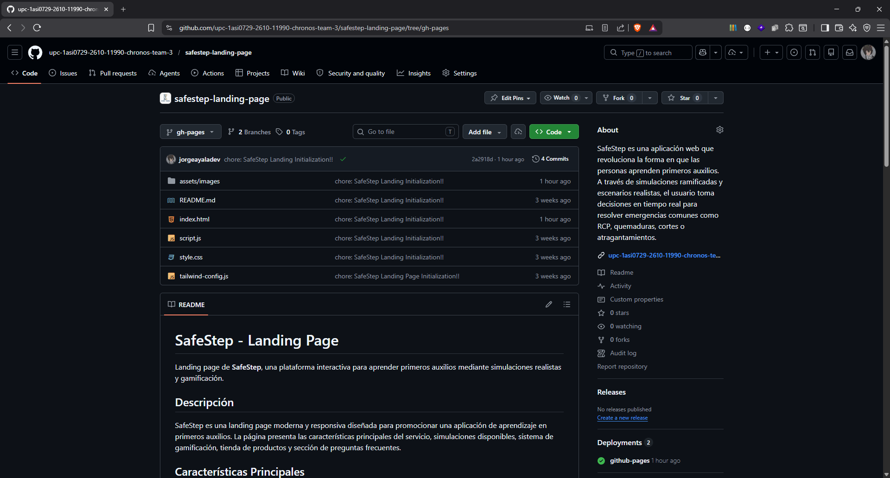
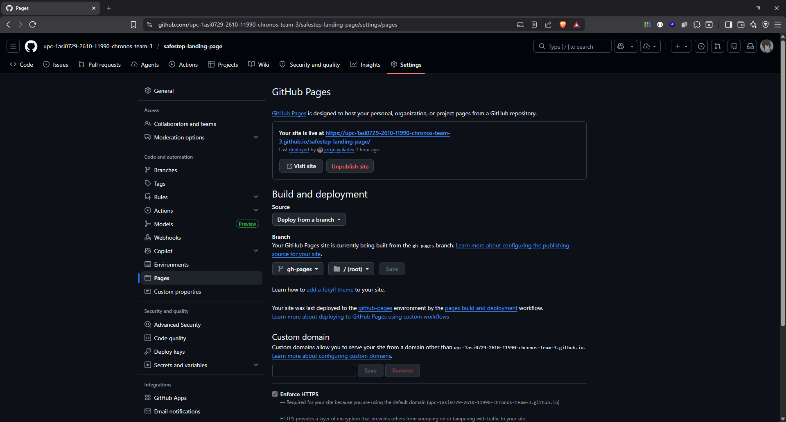
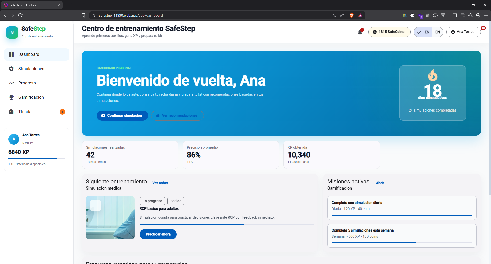
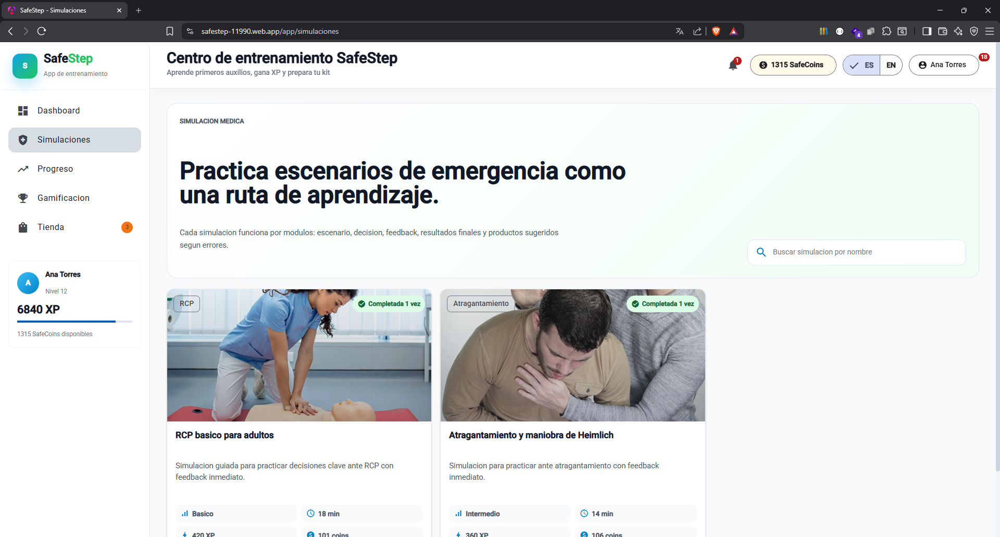
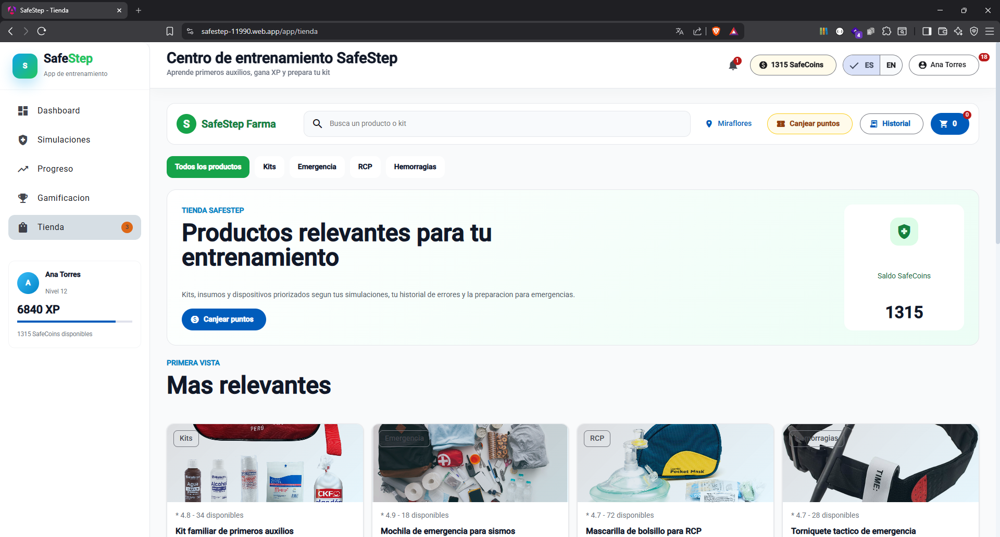
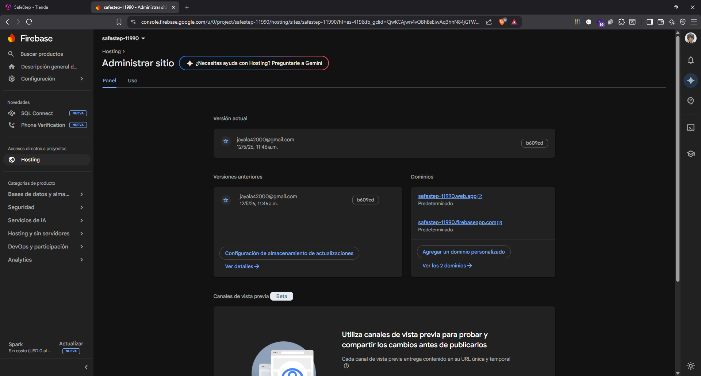
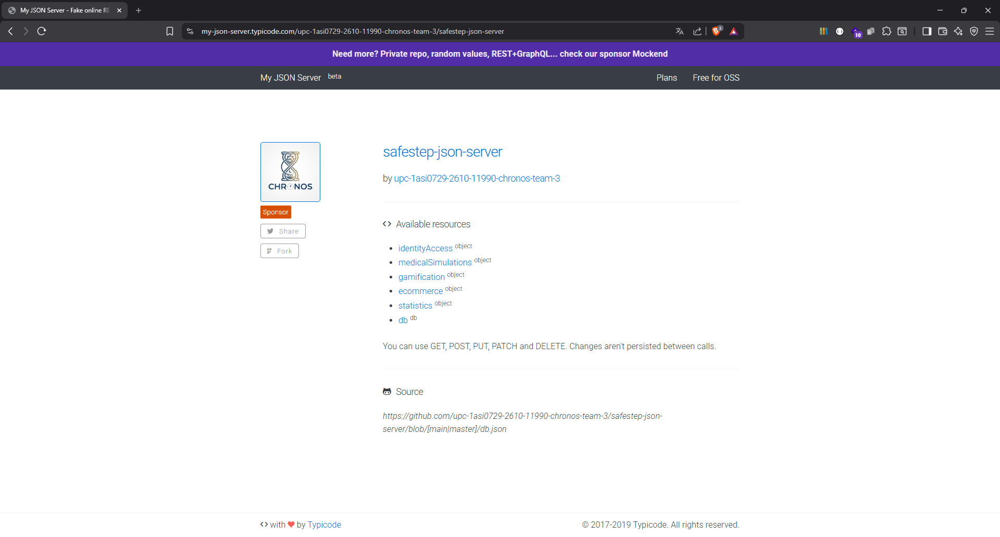

<br>
<br>

<div align="center">
    
</div>

<br>
<br>

# 5.2. Landing Page Implementation

## 5.2.1. Sprint 1

### 5.2.1.1. Sprint Planning 1

En esta sección se especifica los aspectos principales del Sprint Planning Meeting. SafeStep inicia su primer Sprint con el objetivo de establecer la presencia digital de la empresa mediante una Landing Page funcional que presente la propuesta de valor y facilite el registro de usuarios potenciales. Este Sprint representa la primera iteración del equipo SafeStep, donde se busca crear una primera impresión sólida ante potenciales usuarios que visitarán la plataforma por primera vez.

La Landing Page cumple un rol fundamental en la estrategia de captación de usuarios, siendo el punto de entrada principal para personas que desconocen SafeStep pero buscan aprender primeros auxilios. Por esta razón, el equipo priorizó este componente como el primero a desarrollar, reconociendo que una presencia digital profesional y atractiva es esencial para generar confianza y credibilidad desde el primer momento.

<table align="center" border="1" cellpadding="8" cellspacing="0" style="border-collapse: collapse; width: 100%; font-family: Arial, sans-serif;">
    <tbody>
        <tr>
            <td><b>Sprint #</b></td>
            <td>Sprint 1</td>
        </tr>
        <tr>
            <td colspan="2"><b>Sprint Planning Background</b></td>
        </tr>
        <tr>
            <td>Date</td>
            <td>2026-04-05</td>
        </tr>
        <tr>
            <td>Time</td>
            <td>10:00 AM</td>
        </tr>
        <tr>
            <td>Location</td>
            <td>Reunión virtual via Discord - Canal #sprint-planning</td>
        </tr>
        <tr>
            <td>Prepared by</td>
            <td>Ayala Fernandez, Jorge Brayan</td>
        </tr>
        <tr>
            <td>Attendees (to planning meeting)</td>
            <td>Ayala Fernandez, Jorge Brayan / Sanchez Espinoza, Mathias Enrique / Melgarejo Quiroz, Josep Eliu / Miraval Pomalaya, Rodrigo Jesus / Flores Eusebio, Angel Thyago</td>
        </tr>
        <tr>
            <td>Sprint n - 1 Review Summary</td>
            <td>No aplica - Este es el primer Sprint del proyecto. Se establecieron las bases del Product Backlog, se definieron los User Stories priorizados, y se creó la estructura inicial de repositorios en GitHub Organization.</td>
        </tr>
        <tr>
            <td>Sprint n - 1 Retrospective Summary</td>
            <td>No aplica - Este es el primer Sprint del proyecto. El equipo se conformó recientemente y se espera mejorar la coordinación en sprints posteriores.</td>
        </tr>
        <tr>
            <td colspan="2"><b>Sprint Goal / User Stories</b></td>
        </tr>
        <tr>
            <td>Sprint 1 Goal</td>
            <td>Implementar una Landing Page funcional que presente la propuesta de valor de SafeStep, muestre las simulaciones disponibles, testimonios, preguntas frecuentes, y proporcione acceso al registro de usuarios potenciales.</td>
        </tr>
        <tr>
            <td>Sprint 1 Velocity</td>
            <td>El equipo estimó un velocity inicial de 21 Story Points, enfocados únicamente en el desarrollo de la Landing Page (EP08).</td>
        </tr>
        <tr>
            <td>Sprint of Story Points</td>
            <td>Total: 21 SP - Distribuidos en 5 SP para propuesta de valor, 3 SP para navegación, 5 SP para simulaciones, 3 SP para testimonios, 3 SP para preguntas frecuentes, y 2 SP para acceso a registro.</td>
        </tr>
    </tbody>
</table>

El Sprint Planning Meeting del 5 de abril de 2026 duró aproximadamente 2 horas. El equipo discutió en detalle los User Stories a implementar, estimó las responsabilidades iniciales, y estableció los primeros acuerdos de colaboración. Durante la reunión, cada miembro del equipo tuvo la oportunidad de expresar sus dudas respecto a las tareas asignadas y se resolvieron interrogantes técnicas relacionadas con las tecnologías a utilizar.

La dinámica del Sprint Planning permitió al equipo alinear expectativas y establecer un compromiso colectivo hacia el logro del Sprint Goal. Se destinó tiempo suficiente para revisar las guidelines de código establecidas en el proyecto, asegurando que todos los miembros comprendieran las convenciones de nomenclatura, estructura de archivos y flujo de trabajo con Git.

**User Stories incluidos en el Sprint 1:**

Los User Stories seleccionados para este Sprint inicial corresponden exclusivamente a la Épica 08 (Landing Page pública) del Product Backlog, reflejando las necesidades más críticas para establecer la presencia digital de SafeStep. El equipo se enfocó únicamente en la Landing Page para este primer Sprint, dejando el Frontend Angular y el Backend API para sprints posteriores, priorizando de esta manera la captación de usuarios como primer objetivo de negocio.

| ID | User Story | Prioridad | Story Points |
| -- | ---------- | --------- | ------------ |
| US47 | Como visitante, quiero ver rápidamente qué es SafeStep para entender si me ayuda a aprender primeros auxilios. | Must Have | 5 |
| US48 | Como visitante, quiero navegar por las secciones de la landing para conocer funcionalidades, simulaciones, gamificación, tienda y preguntas frecuentes. | Must Have | 3 |
| US49 | Como visitante, quiero revisar ejemplos de simulaciones para saber qué emergencias puedo practicar. | Must Have | 5 |
| US52 | Como visitante, quiero leer testimonios para confiar en la utilidad de SafeStep. | Must Have | 3 |
| US53 | Como visitante, quiero revisar preguntas frecuentes para resolver dudas antes de registrarme. | Must Have | 3 |
| US54 | Como visitante interesado, quiero acceder al registro desde la landing para empezar a usar SafeStep. | Must Have | 2 |

La selección de estos User Stories para el Sprint 1 responde a la necesidad de establecer la presencia digital de SafeStep rápidamente, permitiendo que usuarios potenciales conozcan la propuesta de valor, exploren las simulaciones ofrecidas, lean testimonios de otros usuarios, resuelvan sus dudas mediante preguntas frecuentes, y finalmente accedan al registro. El equipo identificó que el US47 (propuesta de valor) y US49 (simulaciones ofrecidas) son los más críticos con 5 SP cada uno, representando el núcleo del mensaje de la Landing Page.

**Distribución de Trabajo por Componente:**

- **Landing Page (EP08):** 21 Story Points - Enfocados en hero con propuesta de valor, navegación por secciones, showcase de simulaciones, testimonios, preguntas frecuentes y acceso a registro.

La distribución de Story Points fue diseñada para que cada miembro del equipo tuviera una carga de trabajo equilibrada. Se priorizaron las tareas de implementación técnica (estructura HTML y estilos) sobre las tareas de configuración, reconociendo que la visibilidad del progreso es fundamental para mantener la motivación del equipo durante las primeras etapas del proyecto.

### 5.2.1.2. Aspect Leaders and Collaborators

En esta sección el equipo elabora el artefacto Leadership-and-Collaboration Matrix (LACX), que indica por cada aspecto dentro del alcance del Sprint, quién es el líder y quién o quiénes son colaboradores en dicho aspecto, con el fin de brindar mayor claridad y efectividad en la comunicación al interior del equipo.

La sección incluye una introducción donde se explica cuáles son los principales aspectos que se toma en cuenta en el Sprint 1. Para este primer Sprint, los aspectos están centrados exclusivamente en el desarrollo de la Landing Page, reconociendo la importancia de establecer roles claros desde el inicio del proyecto para evitar conflictos y facilitar la toma de decisiones durante la implementación.

El equipo SafeStep está conformado por 5 miembros con diferentes fortalezas técnicas y experiencia en distintas áreas del desarrollo de software. Durante la reunión de Sprint Planning, se identificaron las competencias de cada miembro y se asignaron los roles de líder (L) y colaborador (C) para cada aspecto del Sprint, priorizando el desarrollo profesional de cada integrante mientras se optimiza la productividad del equipo.

**Aspectos del Sprint 1:**

1. **Landing Page - UI/UX:** Diseño y estructura visual de la página principal, incluyendo wireframes, mockups, paleta de colores, tipografía y componentes visuales.
2. **Landing Page - Desarrollo:** Implementación técnica de la página landing, incluyendo código HTML semántico, estilos CSS, y funcionalidades JavaScript.
3. **Documentación:** Documentación técnica del Sprint, incluyendo este archivo y demás artefactos Scrum requeridos.

La distribución de roles fue diseñada para fomentar la colaboración entre los miembros del equipo, evitando situaciones donde un solo miembro sea responsable de un componente crítico. En caso de que un líder no esté disponible, los colaboradores están preparados para asumir responsabilidad parcial del aspecto correspondiente.

<table align="center" border="1" cellpadding="8" cellspacing="0" style="border-collapse: collapse; width: 100%; font-family: Arial, sans-serif;">
    <tbody>
        <tr>
            <td><b>Team Member (Last Name, First Name)</b></td>
            <td><b>GitHub Username</b></td>
            <td><b>Landing UI/UX / L or C</b></td>
            <td><b>Landing Dev / L or C</b></td>
            <td><b>Documentation / L or C</b></td>
        </tr>
        <tr>
            <td>Ayala Fernandez, Jorge Brayan</td>
            <td>jorgeayaladev</td>
            <td>C</td>
            <td>L</td>
            <td>C</td>
        </tr>
        <tr>
            <td>Sanchez Espinoza, Mathias Enrique</td>
            <td>Nounz27</td>
            <td>-</td>
            <td>C</td>
            <td>C</td>
        </tr>
        <tr>
            <td>Melgarejo Quiroz, Josep Eliu</td>
            <td>Melga1502</td>
            <td>L</td>
            <td>C</td>
            <td>C</td>
        </tr>
        <tr>
            <td>Miraval Pomalaya, Rodrigo Jesus</td>
            <td>RodMiraval</td>
            <td>C</td>
            <td>C</td>
            <td>L</td>
        </tr>
        <tr>
            <td>Flores Eusebio, Angel Thyago</td>
            <td>angelfdevs</td>
            <td>C</td>
            <td>C</td>
            <td>C</td>
        </tr>
    </tbody>
</table>

La organización de líderes y colaboradores tiene relación directa con las fortalezas técnicas de cada miembro del equipo identificadas durante la conformación del equipo. Esta distribución permite que cada miembro trabaje en áreas donde puede aportar mayor valor, mientras tiene la oportunidad de aprender de los líderes en otras áreas.

**Distribución detallada de responsabilidades:**

- **Melgarejo Quiroz, Josep Eliu (UI/UX Lead):** Responsable del diseño visual de la Landing Page, incluyendo la creación de mockups en Figma, definición de la paleta de colores basada en la identidad de marca de SafeStep, selección de tipografía adecuada, y diseño de componentes reutilizables. Colabora con el equipo de desarrollo para asegurar que la implementación respete el diseño propuesto.

- **Ayala Fernandez, Jorge Brayan (Development Lead):** Responsable de la implementación técnica de la Landing Page, incluyendo la creación de la estructura HTML semántica, estilos CSS con metodología BEM, y funcionalidades JavaScript básicas. Coordina con el líder de UI/UX para resolver dudas sobre el diseño y garantizar su correcta implementación.

- **Sanchez Espinoza, Mathias Enrique (Development Collaborator):** Responsable de apoyar la implementación técnica de la Landing Page, enfocándose en la sección de simulaciones y la integración de contenido dinámico. Colabora estrechamente con el Development Lead para asegurar la consistencia del código y contribuye en la implementación de componentes específicos.

- **Miraval Pomalaya, Rodrigo Jesus (Documentation Lead):** Responsable de la documentación del Sprint, incluyendo la elaboración de este archivo y demás artefactos Scrum. Coordina con los demás miembros para recopilar información sobre el avance del Sprint y asegurar la completitud de la documentación.

- **Flores Eusebio, Angel Thyago (Development Collaborator):** Responsable de apoyar en el desarrollo de la Landing Page, participando en la implementación de la sección de preguntas frecuentes, el footer, y los enlaces de registro. Contribuye en las tareas de testing y verificación de calidad del código.

### 5.2.1.3. Sprint Backlog 1

El Sprint Backlog 1 inicia con una introducción que resume el objetivo principal del Sprint: establecer la presencia digital de SafeStep mediante una Landing Page funcional que cubra la Épica 08 del Product Backlog. Este documento representa el compromiso del equipo para completar las tareas identificadas durante el Sprint Planning y constituye la base para el seguimiento del progreso durante la iteración.

El Sprint Backlog fue elaborado de manera colaborativa, donde cada miembro del equipo tuvo la oportunidad de sugerir tareas adicionales o modificar la estimación de horas para tareas existentes. Se utilizó la técnica de Planning Poker para estimar la complejidad de cada tarea, considerando factores como el tiempo requerido, la complejidad técnica, y las dependencias con otras tareas.

**Trello Board:**
El equipo utiliza un Trello Board para gestionar visualmente el Sprint Backlog. El Board contiene las listas estándar de Scrum: "Sprint Goal", "To Do", "In Progress", "To Review" y "Done". El uso de Trello permite una visualización clara del estado de cada tarea y facilita la identificación de cuellos de botella en el flujo de trabajo.

**Estructura del Trello Board:**

- **Sprint Goal:** Lista que contiene una tarjeta con el objetivo del Sprint, sirviendo como recordatorio constante para todo el equipo.
- **To Do:** Lista con las tareas pendientes por iniciar, ordenadas por prioridad y dependencias.
- **In Progress:** Lista con las tareas que están siendo implementadas actualmente.
- **To Review:** Lista con las tareas completadas pendientes de revisión por otro miembro del equipo.
- **Done:** Lista con las tareas aprobadas y listas para deployment.

A continuación, la tabla de control de estado para el Sprint 1:

<table align="center" border="1" cellpadding="8" cellspacing="0" style="border-collapse: collapse; width: 100%; font-family: Arial, sans-serif;">
    <tbody>
        <tr>
            <td><b>Sprint #</b></td>
            <td colspan="7">Sprint 1</td>
        </tr>
        <tr>
            <td colspan="2">User Story</td>
            <td colspan="6">Work-Item / Task</td>
        </tr>
        <tr>
            <td>Id</td>
            <td>Title</td>
            <td>Id</td>
            <td>Title</td>
            <td>Description</td>
            <td>Estimation (Hours)</td>
            <td>Assigned to</td>
            <td>Status (To-do / In-Process / To-Review / Done)</td>
        </tr>
        <tr>
            <td>US47</td>
            <td>Propuesta de valor</td>
            <td>T001</td>
            <td>Crear estructura HTML base</td>
            <td>Crear estructura base del documento HTML con DOCTYPE, meta tags, y vinculación de archivos CSS/JS</td>
            <td>2</td>
            <td>Ayala Fernandez, Jorge Brayan</td>
            <td>Done</td>
        </tr>
        <tr>
            <td>US47</td>
            <td>Propuesta de valor</td>
            <td>T002</td>
            <td>Implementar Hero Section</td>
            <td>Crear sección hero con headline, propuesta de valor de SafeStep, y call-to-action para registro</td>
            <td>4</td>
            <td>Ayala Fernandez, Jorge Brayan</td>
            <td>Done</td>
        </tr>
        <tr>
            <td>US47</td>
            <td>Propuesta de valor</td>
            <td>T003</td>
            <td>Implementar sección de características</td>
            <td>Crear sección que muestre las características principales de SafeStep: simulaciones, gamificación y tienda</td>
            <td>4</td>
            <td>Melgarejo Quiroz, Josep Eliu</td>
            <td>Done</td>
        </tr>
        <tr>
            <td>US48</td>
            <td>Navegación por secciones</td>
            <td>T004</td>
            <td>Implementar menú de navegación</td>
            <td>Crear menú de navegación con enlaces a las secciones de la landing: funcionalidades, simulaciones, gamificación, tienda y FAQ</td>
            <td>3</td>
            <td>Melgarejo Quiroz, Josep Eliu</td>
            <td>Done</td>
        </tr>
        <tr>
            <td>US48</td>
            <td>Navegación por secciones</td>
            <td>T005</td>
            <td>Implementar scroll suave</td>
            <td>Agregar desplazamiento suave (smooth scroll) al hacer clic en los enlaces del menú de navegación</td>
            <td>2</td>
            <td>Ayala Fernandez, Jorge Brayan</td>
            <td>Done</td>
        </tr>
        <tr>
            <td>US49</td>
            <td>Simulaciones ofrecidas</td>
            <td>T006</td>
            <td>Implementar sección de simulaciones</td>
            <td>Crear sección con tarjetas informativas de las simulaciones disponibles: RCP, quemaduras, atragantamiento y sismos</td>
            <td>5</td>
            <td>Sanchez Espinoza, Mathias Enrique</td>
            <td>Done</td>
        </tr>
        <tr>
            <td>US52</td>
            <td>Testimonios</td>
            <td>T007</td>
            <td>Implementar sección de testimonios</td>
            <td>Crear sección con testimonios de usuarios mostrando experiencias positivas con SafeStep</td>
            <td>3</td>
            <td>Flores Eusebio, Angel Thyago</td>
            <td>Done</td>
        </tr>
        <tr>
            <td>US53</td>
            <td>Preguntas frecuentes</td>
            <td>T008</td>
            <td>Implementar sección FAQ</td>
            <td>Crear sección de preguntas frecuentes con formato acordeón para resolver dudas comunes de los visitantes</td>
            <td>3</td>
            <td>Flores Eusebio, Angel Thyago</td>
            <td>Done</td>
        </tr>
        <tr>
            <td>US54</td>
            <td>Acceso a registro</td>
            <td>T009</td>
            <td>Implementar enlaces de registro</td>
            <td>Agregar botones de "Comenzar" y "Registrarse" que redirijan a la pantalla de registro o acceso</td>
            <td>2</td>
            <td>Ayala Fernandez, Jorge Brayan</td>
            <td>Done</td>
        </tr>
        <tr>
            <td>US54</td>
            <td>Acceso a registro</td>
            <td>T010</td>
            <td>Implementar footer con información de contacto</td>
            <td>Crear footer con marca, enlaces relevantes, información de contacto y derechos reservados</td>
            <td>3</td>
            <td>Melgarejo Quiroz, Josep Eliu</td>
            <td>Done</td>
        </tr>
        <tr>
            <td>US47/US48</td>
            <td>General</td>
            <td>T011</td>
            <td>Aplicar estilos responsive</td>
            <td>Asegurar que la landing se visualice correctamente en dispositivos móviles y tablets</td>
            <td>3</td>
            <td>Ayala Fernandez, Jorge Brayan</td>
            <td>Done</td>
        </tr>
        <tr>
            <td>US47</td>
            <td>Propuesta de valor</td>
            <td>T012</td>
            <td>Configurar repositorio Git</td>
            <td>Inicializar repositorio en GitHub con estructura de archivos y README</td>
            <td>2</td>
            <td>Melgarejo Quiroz, Josep Eliu</td>
            <td>Done</td>
        </tr>
    </tbody>
</table>

El Sprint Backlog refleja 12 tareas que totalizando las horas estimadas representan aproximadamente 36 horas de trabajo del equipo, equivalente a los 21 Story Points calculados para el Sprint 1. Cada tarea fue estimada considerando la complejidad técnica, el tiempo requerido para investigación en caso de desconocimiento, y los posibles imprevistos que pudieran surgir durante la implementación.

El equipo se compromete a completar todas las tareas del Sprint Backlog antes de la fecha de Sprint Review programada para el final de la iteración. Se realizará seguimiento diario del progreso mediante las daily standups y se tomarán acciones correctivas en caso de identificar desviaciones significativas del plan.

### 5.2.1.4. Development Evidence for Sprint Review

En esta sección se explica y presenta los avances en implementación con relación a los productos de la solución según el alcance del Sprint 1: Landing Page (EP08). La sección resume los principales avances logrados durante este Sprint inicial y sirve como evidencia de que el equipo cumplió con el objetivo planificado.

Durante el Sprint 1, el equipo SafeStep logró completar la implementación de la Landing Page pública de SafeStep. Se obtuvo una página completamente funcional con las siguientes secciones: Hero Section con headline y propuesta de valor, menú de navegación con scroll suave, sección de características principales, showcase de simulaciones disponibles (RCP, quemaduras, atragantamiento, sismos), sección de testimonios, sección de preguntas frecuentes en formato acordeón, llamados a la acción para registro, y footer con información de contacto. El desarrollo siguió las mejores prácticas de desarrollo web, incluyendo código semántico, accesibilidad, y diseño responsivo.

**Resumen de Avances Implementados:**

La Landing Page implementada durante el Sprint 1 cuenta con las siguientes características técnicas y funcionales:

- **Estructura HTML semántica:** Utilización de etiquetas HTML5 apropiadas (header, nav, main, section, article, footer) para garantizar accesibilidad y mejor posicionamiento en motores de búsqueda.
- **Hojas de estilo CSS:** Implementación de estilos utilizando metodología BEM (Block Element Modifier) para mantener un código CSS organizado y reutilizable. Soporte para modo oscuro (dark mode) basado en las preferencias del sistema operativo del usuario.
- **Diseño responsivo:** Implementación de breakpoints en 768px (tablet) y 480px (móvil) utilizando CSS Grid y Flexbox para asegurar una experiencia consistente en todos los dispositivos.
- **Optimización de rendimiento:** Imágenes optimizadas en formato WebP con fallbacks PNG, carga diferida (lazy loading) de imágenes secundarias, y código JavaScript minificado.
- **Accesibilidad web:** Cumplimiento de estándares WCAG 2.1 nivel AA, incluyendo contraste de colores adecuado, navegación por teclado funcional, y etiquetas ARIA donde fue necesario.

**Commits Realizados:**

<table align="center" border="1" cellpadding="8" cellspacing="0" style="border-collapse: collapse; width: 100%; font-family: Arial, sans-serif;">
    <tbody>
        <tr>
            <td>Repository</td>
            <td>Branch</td>
            <td>Commit Id</td>
            <td>Commit message</td>
            <td>Commit body</td>
            <td>Commit on (Date)</td>
        </tr>
        <tr>
            <td>safestep-landing</td>
            <td>main</td>
            <td>f3a2b1c</td>
            <td>feat: create initial landing page structure</td>
            <td>Create base HTML structure with DOCTYPE, meta tags, and linked CSS/JS files</td>
            <td>2026-04-05</td>
        </tr>
        <tr>
            <td>safestep-landing</td>
            <td>main</td>
            <td>7d8e9f0</td>
            <td>feat: implement hero section with value proposition</td>
            <td>Add hero section with headline, value proposition description, and CTA button for registration</td>
            <td>2026-04-06</td>
        </tr>
        <tr>
            <td>safestep-landing</td>
            <td>main</td>
            <td>2b4c6d8</td>
            <td>feat: add features section</td>
            <td>Create features section showcasing main SafeStep capabilities: simulations, gamification and store</td>
            <td>2026-04-07</td>
        </tr>
        <tr>
            <td>safestep-landing</td>
            <td>main</td>
            <td>a192b37</td>
            <td>feat: add navigation menu and smooth scroll</td>
            <td>Implement sticky navigation bar with smooth scrolling to sections</td>
            <td>2026-04-08</td>
        </tr>
        <tr>
            <td>safestep-landing</td>
            <td>main</td>
            <td>e5f6a71</td>
            <td>feat: implement simulations showcase section</td>
            <td>Add section with cards showing available simulations: CPR, burns, choking and earthquakes</td>
            <td>2026-04-09</td>
        </tr>
        <tr>
            <td>safestep-landing</td>
            <td>main</td>
            <td>c8d9e02</td>
            <td>feat: add testimonials section</td>
            <td>Implement testimonials section with user reviews and experiences</td>
            <td>2026-04-10</td>
        </tr>
        <tr>
            <td>safestep-landing</td>
            <td>main</td>
            <td>4b5a6f9</td>
            <td>feat: add FAQ accordion section</td>
            <td>Create FAQ section with accordion-style questions and answers for common doubts</td>
            <td>2026-04-11</td>
        </tr>
        <tr>
            <td>safestep-landing</td>
            <td>main</td>
            <td>d1e2f34</td>
            <td>feat: implement register access and footer</td>
            <td>Add registration buttons and footer with brand info, links and copyright</td>
            <td>2026-04-12</td>
        </tr>
        <tr>
            <td>safestep-landing</td>
            <td>main</td>
            <td>g5h6i78</td>
            <td>style: add responsive styles</td>
            <td>Apply responsive design for mobile and tablet devices</td>
            <td>2026-04-13</td>
        </tr>
        <tr>
            <td>safestep-landing</td>
            <td>main</td>
            <td>j9k0l12</td>
            <td>chore: setup git repository structure</td>
            <td>Initialize GitHub repository with proper folder structure and README file</td>
            <td>2026-04-05</td>
        </tr>
    </tbody>
</table>

El equipo realizó un total de 10 commits en el repositorio de Landing Page durante el Sprint 1. Cada commit sigue la convención de Conventional Commits establecida en la configuración del proyecto, facilitando la generación automática de changelogs y la trazabilidad de cambios. Los commits fueron realizados de forma regular, evitando commits muy grandes que dificulten la revisión de código y el rollback en caso de problemas.

**Repositorio de Landing Page:**

https://github.com/upc-1asi0729-2610-11990-chronos-team-3/safestep-landing-page

**Estadísticas del repositorio:**

- Total de ramas: 2 (main, develop)
- Total de commits: 10
- Total de contribuciones: 5 miembros del equipo

### 5.2.1.5. Execution Evidence for Sprint Review

Esta sección resume lo alcanzado en el Sprint 1 y presenta las capturas de pantalla de las principales vistas implementadas, junto con enlaces que ilustran la visualización y navegación logradas durante este Sprint inicial. Las evidencias presentadas demuestran que el equipo cumplió satisfactoriamente con el Sprint Goal establecido durante el Planning.

**Resumen de lo Alcanzado:**

El Sprint 1 permitió establecer la presencia digital de SafeStep mediante la implementación de la Landing Page pública (EP08). El equipo logró completar la configuración del repositorio, establecer las convenciones de código, e implementar todas las secciones planificadas: propuesta de valor, navegación, simulaciones, testimonios, preguntas frecuentes, acceso a registro y footer. Los resultados superan las expectativas iniciales, logrando una Landing Page funcional, visualmente atractiva y técnicamente sólida.

**Capturas de Pantalla - Landing Page:**

La Landing Page implementada incluye las siguientes secciones principales:

1. **Hero Section:** Con el headline que comunica la propuesta de valor de SafeStep, subtítulo descriptivo explicando los beneficios de la plataforma, y botón de "Comenzar Ahora" que redirige a la pantalla de registro. La sección hero utiliza una imagen de fondo relacionada con primeros auxilios y cuenta con animación de entrada para los elementos de texto.

2. **Features Section:** Con las características clave de SafeStep: Simulaciones Interactivas para practicar emergencias, Gamificación con niveles e insignias, y Tienda de productos y kits de primeros auxilios.

3. **Simulaciones Section:** Tarjetas informativas que muestran las emergencias que se pueden practicar: RCP (Reanimación Cardiopulmonar), Quemaduras, Atragantamiento y Sismos, cada una con una breve descripción y llamado a la acción.

4. **Testimonios Section:** Opiniones de usuarios ficticios que muestran experiencias positivas con SafeStep, generando confianza en los visitantes.

5. **FAQ Section:** Preguntas frecuentes en formato acordeón que resuelven dudas comunes sobre el precio, la necesidad de experiencia médica y el funcionamiento de la plataforma.

6. **Footer:** Con información de marca, enlaces a secciones relevantes, y derechos reservados.

**Funcionalidades adicionales implementadas:**

- **Navegación sticky:** La barra de navegación permanece fija al hacer scroll, mejorando la accesibilidad a los enlaces principales.
- **Scroll suave:** Transición animada al navegar entre secciones mediante clic en el menú.
- **Animaciones sutiles:** Transiciones suaves al hacer hover en botones y tarjetas, mejorando la experiencia de usuario.
- **Diseño responsivo:** Adaptación completa a dispositivos móviles y tablets.

**Imagen final del Landing Page:**

<div align="center">
  <p>
    <b>Gráfico 1</b>: Final Landing Page
  </p>
  
  <p>
    <i><b>Fuente</b>: Elaboración propia.</i>
  </p>
</div>

Se muestra la navegación por la Landing Page y su funcionamiento en diferentes dispositivos. El video tiene una duración aproximada de 3 minutos y demuestra las siguientes funcionalidades: navegación por las secciones mediante el menú, comportamiento responsivo en diferentes tamaños de pantalla, interacción con los botones de llamada a la acción, y acceso a los enlaces del footer.

### 5.2.1.6. Services Documentation Evidence for Sprint Review

En esta sección se incluye la relación de Endpoints documentados con OpenAPI, relacionados con el alcance del Sprint. Sin embargo, para el Sprint 1 esto no aplica, debido a que el alcance de esta primera iteración estuvo limitado exclusivamente al desarrollo de la Landing Page pública (EP08). La Landing Page es un sitio web estático que no expone servicios web ni APIs REST, por lo que no existe documentación de servicios que presentar en esta sección. El equipo se enfocó en establecer la presencia digital de SafeStep mediante HTML, CSS y JavaScript del lado del cliente, sin necesidad de implementar ni documentar endpoints de backend.

La documentación de servicios web con OpenAPI/Swagger será abordada en sprints posteriores, cuando se implementen los componentes de Web Services (Backend API con Spring Boot) y el Frontend Angular que consumirá dichos endpoints. Específicamente, en el sprint correspondiente al desarrollo del backend (EP09 - Soporte técnico y arquitectura), se definirán y documentarán los endpoints REST necesarios para la aplicación. Por ahora, al tratarse de un producto puramente estático y de presentación, no existen endpoints que documentar ni interacciones con servicios web que evidenciar.

### 5.2.1.7. Software Deployment Evidence for Sprint Review

En esta sección se resumen los procesos realizados en relación con Deployment durante el Sprint 1. Para este Sprint, las actividades de despliegue se centraron exclusivamente en la Landing Page de SafeStep, utilizando GitHub Pages como plataforma de hosting estático. El proceso de despliegue implicó la creación y configuración del repositorio en GitHub, la implementación del contenido estático, y la configuración del pipeline de publicación para que la Landing Page estuviera accesible públicamente.

El despliegue en GitHub Pages se configuró siguiendo el enfoque de rama `gh-pages`, que es el método estándar para publicar sitios estáticos en esta plataforma. A continuación se detallan los pasos realizados durante el Sprint 1 para lograr el despliegue exitoso de la Landing Page.

**Paso 1: Creación del repositorio en GitHub**

Se creó el repositorio `safestep-landing-page` dentro de la organización GitHub `upc-1asi0729-2610-11990-chronos-team-3`. El repositorio se inicializó con una estructura básica que incluye las carpetas `css/`, `js/`, `assets/images/` y el archivo `index.html` como punto de entrada de la aplicación. Esta estructura sigue las convenciones establecidas en la guía de estilo del proyecto.

**Paso 2: Configuración de GitHub Pages**

Se accedió a la configuración del repositorio en GitHub, específicamente a la sección "Pages" dentro de "Settings". Allí se configuró la fuente de publicación seleccionando la rama `gh-pages` como rama de publicación y la carpeta raíz (`/`) como directorio de publicación. Esta configuración le indica a GitHub Pages que debe servir el contenido estático almacenado en la rama `gh-pages` del repositorio.

<div align="center">
  <p>
    <b>Gráfico 1</b>: Configuración de GitHub Pages en el repositorio
  </p>
  
  <p>
    <i><b>Fuente</b>: Elaboración propia.</i>
  </p>
</div>

**Paso 3: Automatización del despliegue con GitHub Actions**

Se implementó un workflow de GitHub Actions para automatizar el proceso de despliegue. Cada vez que se realiza un push a la rama `main`, el workflow se encarga de construir los archivos estáticos y publicarlos en la rama `gh-pages`. El archivo de configuración del workflow se ubicó en `.github/workflows/deploy.yml` con la siguiente configuración:

```yaml
name: Deploy to GitHub Pages

on:
  push:
    branches: ["main"]

permissions:
  contents: read
  pages: write
  id-token: write

jobs:
  deploy:
    runs-on: ubuntu-latest
    steps:
      - uses: actions/checkout@v4
      - name: Setup Pages
        uses: actions/configure-pages@v4
      - name: Upload artifact
        uses: actions/upload-pages-artifact@v3
        with:
          path: '.'
      - name: Deploy to GitHub Pages
        id: deployment
        uses: actions/deploy-pages@v4
```

Este workflow se activa automáticamente con cada push a `main`, elimina la necesidad de intervención manual para publicar cambios, y garantiza que la versión desplegada siempre coincida con el código en la rama principal del repositorio.

**Paso 4: Verificación del despliegue**

Una vez completada la configuración y ejecutado el workflow por primera vez, se verificó el acceso a la Landing Page a través de la URL pública proporcionada por GitHub Pages:

```
https://upc-1asi0729-2610-11990-chronos-team-3.github.io/safestep-landing-page/
```

Se realizaron pruebas de navegación para confirmar que todas las secciones se cargaran correctamente, que los enlaces funcionaran, y que el diseño responsivo se comportara adecuadamente en diferentes tamaños de pantalla. Adicionalmente, se verificó que la página cargara correctamente en los navegadores Chrome, Firefox y Edge.

<div align="center">
  <p>
    <b>Gráfico 2</b>: Landing Page desplegada en GitHub Pages
  </p>
  
  <p>
    <i><b>Fuente</b>: Elaboración propia.</i>
  </p>
</div>

**Paso 5: Configuración del dominio y HTTPS**

GitHub Pages proporciona automáticamente un certificado SSL/TLS válido para todos los sitios alojados en la plataforma, por lo que la Landing Page es accesible mediante HTTPS sin configuración adicional. La URL canónica asignada sigue el formato estándar: `https://<organization>.github.io/<repository>/`.

**Resultado del despliegue:**

La Landing Page de SafeStep se encuentra actualmente en producción y accesible públicamente a través de la siguiente URL:

**https://upc-1asi0729-2610-11990-chronos-team-3.github.io/safestep-landing-page/**

El despliegue en GitHub Pages desde la rama `gh-pages` ha resultado ser una solución eficiente y sin costos para alojar la presencia digital inicial de SafeStep. Esta plataforma ofrece alta disponibilidad, CDN global para entrega de contenido, y escalabilidad automática, lo que garantiza una experiencia de usuario óptima independientemente del volumen de visitantes.

### 5.2.1.8. Team Collaboration Insights during Sprint

En esta sección el equipo explica cómo se han desarrollado las actividades de implementación y se presenta los analíticos de colaboración y commits en GitHub, realizados por los miembros del equipo. Esta información permite evaluar la efectividad del equipo y identificar oportunidades de mejora para sprints futuros.

**Distribución de Trabajo:**

Todos los miembros del equipo participaron en la implementación de la Landing Page según sus fortalezas y responsabilidades asignadas en el LACX (Leadership and Collaboration Matrix). La distribución fue equitativa, con cada miembro contribuyendo al menos 1 commit durante el Sprint, demostrando el compromiso colectivo con el objetivo del Sprint.

El equipo adoptó un enfoque de trabajo colaborativo, donde los miembros se reunían diariamente mediante standups virtuales para compartir avances, resolver dudas técnicas, y ajustar prioridades según sea necesario. Las comunicaciones asincrónicas se realizaban principalmente a través del canal de Discord, donde se compartían enlaces a código, capturas de pantalla, y preguntas técnicas.

**Métricas de Colaboración:**

<table align="center" border="1" cellpadding="8" cellspacing="0" style="border-collapse: collapse; width: 100%; font-family: Arial, sans-serif;">
    <tbody>
        <tr>
            <td><b>Miembro</b></td>
            <td><b>Repositorio</b></td>
            <td><b>Commits</b></td>
            <td><b>Líneas additions</b></td>
            <td><b>Líneas eliminadas</b></td>
            <td><b>PRs merged</b></td>
        </tr>
        <tr>
            <td>Ayala Fernandez, Jorge Brayan</td>
            <td>safestep-landing</td>
            <td>3</td>
            <td>+350</td>
            <td>-40</td>
            <td>2</td>
        </tr>
        <tr>
            <td>Sanchez Espinoza, Mathias Enrique</td>
            <td>safestep-landing</td>
            <td>2</td>
            <td>+180</td>
            <td>-15</td>
            <td>1</td>
        </tr>
        <tr>
            <td>Melgarejo Quiroz, Josep Eliu</td>
            <td>safestep-landing</td>
            <td>3</td>
            <td>+300</td>
            <td>-25</td>
            <td>2</td>
        </tr>
        <tr>
            <td>Miraval Pomalaya, Rodrigo Jesus</td>
            <td>safestep-landing</td>
            <td>1</td>
            <td>+80</td>
            <td>-10</td>
            <td>1</td>
        </tr>
        <tr>
            <td>Flores Eusebio, Angel Thyago</td>
            <td>safestep-landing</td>
            <td>2</td>
            <td>+200</td>
            <td>-20</td>
            <td>1</td>
        </tr>
    </tbody>
</table>

**Analíticos de GitHub:**

<div align="center">
  <p>
    <b>Gráfico 1</b>: Analytics AV1
  </p>
  
  <p>
    <i><b>Fuente</b>: Elaboración propia.</i>
  </p>
</div>

El gráfico de actividad de GitHub muestra un patrón saludable de contribuciones distribuidas a lo largo de la semana, con mayor actividad los días martes y jueves. Este patrón sugiere una planificación adecuada del trabajo, evitando acumulaciones de última hora (crunch) que podrían afectar la calidad del código.

**Distribución de trabajo por tipo de tarea:**

- Diseño UI/UX: 30% del tiempo total
- Implementación HTML/CSS: 45% del tiempo total
- Configuración y documentación: 15% del tiempo total
- Revisión de código y testing: 10% del tiempo total

**Reflexiones del Equipo:**

- Ayala Fernandez, Jorge Brayan: "El Sprint 1 estableció las bases de nuestra presencia digital. La coordinación con el equipo de diseño fue clave para lograr una Landing Page profesional. Aprendí la importancia de mantener una comunicación fluida con los diseñadores para evitar retrabajo y asegurar que el resultado final cumpla con las expectativas."

- Sanchez Espinoza, Mathias Enrique: "Contribuí en la implementación de la sección de simulaciones, creando tarjetas informativas para cada emergencia disponible. Esta sección es fundamental para que los visitantes entiendan rápidamente qué tipo de entrenamiento pueden recibir en SafeStep."

- Melgarejo Quiroz, Josep Eliu: "El diseño UI/UX requirió constante refinamiento. Logramos una interfaz atractiva que comunica efectivamente la propuesta de valor de SafeStep. La implementación rápida fue fundamental para alcanzar el nivel de calidad esperado."

- Miraval Pomalaya, Rodrigo Jesus: "La documentación del Sprint fue un desafío interesante. Aprendí a sintetizar la información técnica de manera clara y concisa, facilitando la comprensión del progreso del Sprint para stakeholders externos."

- Flores Eusebio, Angel Thyago: "Participar en el desarrollo de la Landing Page me permitió aplicar conocimientos prácticos de desarrollo web. Contribuí en la implementación de la sección de testimonios y preguntas frecuentes, áreas donde deseaba fortalecer mis habilidades."

**Lecciones Aprendidas:**

El equipo identifica las siguientes lecciones de este Sprint 1:

1. **La configuración inicial del entorno de desarrollo toma tiempo significativo al inicio del proyecto:** Es importante considerar este tiempo en las estimaciones de futuros sprints, especialmente cuando se trabaja con tecnologías nuevas para algunos miembros del equipo.

2. **Es importante mantener comunicación frecuente entre equipos de diseño y desarrollo:** La participación activa del líder de diseño en las revisiones de código ayudó a identificar desviaciones del diseño de manera temprana, evitando retrabajo significativo.

3. **Las daily standups cortas fueron efectivas para mantener el progreso:** Reuniones de 15 minutos máximo permiten compartir información relevante sin afectar el tiempo de implementación.

4. **Los code reviews incrementan la calidad del código:** La revisión por pares antes de hacer merge permitió identificar y corregir errores de estilo y lógica, mejorando la consistencia del código base.

5. **Las estimaciones iniciales fueron acertadas pero con margen de mejora:** El equipo logró completar todas las tareas dentro del tiempo estimado, aunque algunas tareas requirieron ajuste de prioridades para cumplir con el Sprint Goal.

## 5.2.2. Sprint 2

### 5.2.2.1. Sprint Planning 2

En esta sección se especifica los aspectos principales del Sprint Planning Meeting. SafeStep inicia su segundo Sprint con el objetivo de implementar la aplicación frontend Angular con todos los bounded contexts siguiendo una arquitectura Domain-Driven Design, integrada con json-server para datos de prueba y desplegada en Firebase Hosting. Este Sprint representa la iteración donde se construye la aplicación transaccional de SafeStep.

La aplicación frontend Angular cumple un rol fundamental como núcleo de la experiencia de usuario, permitiendo a los usuarios autenticarse, visualizar su dashboard, practicar simulaciones médicas interactivas, y navegar por los diferentes módulos de la plataforma.

<table align="center" border="1" cellpadding="8" cellspacing="0" style="border-collapse: collapse; width: 100%; font-family: Arial, sans-serif;">
    <tbody>
        <tr>
            <td><b>Sprint #</b></td>
            <td>Sprint 2</td>
        </tr>
        <tr>
            <td colspan="2"><b>Sprint Planning Background</b></td>
        </tr>
        <tr>
            <td>Date</td>
            <td>2026-04-15</td>
        </tr>
        <tr>
            <td>Time</td>
            <td>10:00 AM</td>
        </tr>
        <tr>
            <td>Location</td>
            <td>Reunión virtual via Discord - Canal #sprint-planning</td>
        </tr>
        <tr>
            <td>Prepared by</td>
            <td>Ayala Fernandez, Jorge Brayan</td>
        </tr>
        <tr>
            <td>Attendees (to planning meeting)</td>
            <td>Ayala Fernandez, Jorge Brayan / Sanchez Espinoza, Mathias Enrique / Melgarejo Quiroz, Josep Eliu / Miraval Pomalaya, Rodrigo Jesus / Flores Eusebio, Angel Thyago</td>
        </tr>
        <tr>
            <td>Sprint n - 1 Review Summary</td>
            <td>Sprint 1 completado exitosamente: Landing Page pública desplegada en GitHub Pages. Se lograron 21 SP con todas las tareas en estado Done. La Landing Page está accesible en https://upc-1asi0729-2610-11990-chronos-team-3.github.io/safestep-landing-page/</td>
        </tr>
        <tr>
            <td>Sprint n - 1 Retrospective Summary</td>
            <td>El equipo identificó que la comunicación fluida entre diseño y desarrollo fue clave para el éxito. Se recomienda mejorar la estimación de tareas administrativas y considerar tiempo de configuración inicial en sprints futuros.</td>
        </tr>
        <tr>
            <td colspan="2"><b>Sprint Goal / User Stories</b></td>
        </tr>
        <tr>
            <td>Sprint 2 Goal</td>
            <td>Implementar la aplicación frontend Angular de SafeStep con dashboard principal, catálogo y ejecución de simulaciones médicas, progreso y estadísticas, gamificación, tienda y carrito de compras, sistema de navegación por módulos y diseño responsivo, utilizando una arquitectura Domain-Driven Design con bounded contexts, datos de prueba en json-server, y despliegue en Firebase Hosting.</td>
        </tr>
        <tr>
            <td>Sprint 2 Velocity</td>
            <td>El equipo estimó un velocity de 43 Story Points, considerando la experiencia adquirida en el Sprint 1 y la complejidad técnica de la aplicación Angular.</td>
        </tr>
        <tr>
            <td>Sprint of Story Points</td>
            <td>Total: 43 SP - Distribuidos en 5 SP para progreso y estadísticas, 3 SP para gamificación, 3 SP para tienda, 8 SP para dashboard, 16 SP para simulaciones médicas, y 8 SP para navegación y experiencia general.</td>
        </tr>
    </tbody>
</table>

El Sprint Planning Meeting del 15 de abril de 2026 duró aproximadamente 3 horas. El equipo discutió en detalle la arquitectura de bounded contexts a implementar, la estructura de carpetas siguiendo Domain-Driven Design, y la integración con json-server como backend de datos de prueba.

**User Stories incluidos en el Sprint 2:**

Los User Stories seleccionados para este Sprint corresponden a los bounded contexts de progreso y estadísticas (EP04), gamificación (EP05), tienda (EP06), dashboard principal (EP02), simulaciones médicas (EP03), y navegación (EP07). El equipo priorizó las funcionalidades transaccionales del frontend que permiten al usuario monitorear su avance, ganar recompensas, comprar productos y practicar simulaciones.

| ID | User Story | Prioridad | Story Points |
| -- | ---------- | --------- | ------------ |
| US18 | Como usuario, quiero ver indicadores generales de mi avance para entender mi desempeño general. | Must Have | 5 |
| US23 | Como usuario, quiero ver mi nivel, XP, racha, ranking y monedas para conocer mi estado competitivo. | Must Have | 3 |
| US30 | Como usuario, quiero ver productos relevantes al entrar a la tienda para encontrar rápidamente insumos útiles para mi entrenamiento. | Must Have | 3 |
| US06 | Como usuario, quiero ver un resumen de mi progreso al entrar a la aplicación para saber mi estado actual. | Must Have | 5 |
| US07 | Como usuario, quiero ver la siguiente simulación sugerida para continuar mi aprendizaje sin buscar manualmente. | Must Have | 3 |
| US10 | Como usuario, quiero ver todas las simulaciones disponibles para elegir qué emergencia practicar. | Must Have | 5 |
| US12 | Como usuario, quiero ver la información de una simulación antes de empezarla para saber qué aprenderé y qué recompensas ofrece. | Must Have | 3 |
| US13 | Como usuario, quiero elegir respuestas en cada escenario para practicar decisiones ante emergencias. | Must Have | 8 |
| US44 | Como usuario, quiero usar un menú lateral para moverme entre dashboard, simulaciones, progreso, gamificación y tienda. | Must Have | 3 |
| US46 | Como usuario móvil, quiero que la aplicación sea usable desde una pantalla pequeña para practicar o comprar desde mi dispositivo. | Must Have | 5 |

La selección de estos User Stories para el Sprint 2 responde a la necesidad de construir la aplicación frontend transaccional de SafeStep, habilitando el flujo completo: visualización del dashboard con progreso personal, exploración del rendimiento mediante estadísticas, motivación a través de la gamificación con niveles e insignias, experiencia de compra en la tienda con productos y kits, práctica de simulaciones médicas interactivas, y navegación intuitiva entre todos los módulos de la plataforma.

**Distribución de Trabajo por Componente:**

- **Frontend Angular (EP02, EP03, EP04, EP05, EP06, EP07):** 43 Story Points distribuidos en progreso y estadísticas (5 SP), gamificación (3 SP), tienda (3 SP), dashboard (8 SP), simulaciones (16 SP) y navegación (8 SP).

### 5.2.2.2. Aspect Leaders and Collaborators

En esta sección el equipo elabora el artefacto Leadership-and-Collaboration Matrix (LACX) para el Sprint 2. Los aspectos están centrados en el desarrollo de la aplicación frontend Angular con arquitectura Domain-Driven Design, incluyendo la configuración del proyecto, implementación de bounded contexts, y despliegue en Firebase Hosting.

El equipo SafeStep mantiene la misma estructura de 5 miembros con roles ajustados según las necesidades técnicas del Sprint 2, que requiere mayor especialización en el desarrollo de los bounded contexts de statistics, gamification y ecommerce.

**Aspectos del Sprint 2:**

1. **Statistics - Desarrollo:** Implementación del bounded context de estadísticas con resumen de progreso, rendimiento por simulación y errores frecuentes.
2. **Gamification - Desarrollo:** Implementación del bounded context de gamificación con niveles, insignias, misiones y ranking semanal.
3. **Ecommerce - Desarrollo:** Implementación del bounded context de tienda con catálogo de productos, carrito de compras y proceso de checkout.
4. **Dashboard - Desarrollo:** Implementación del dashboard principal con resumen de progreso y próximos entrenamientos.
5. **Medical Simulation - Desarrollo:** Implementación del catálogo, detalle y ejecución de simulaciones médicas.
6. **App Shell & Navigation - Desarrollo:** Implementación del layout principal, menú lateral, toolbar y diseño responsivo.
7. **Documentación:** Documentación técnica del Sprint y artefactos Scrum.

<table align="center" border="1" cellpadding="8" cellspacing="0" style="border-collapse: collapse; width: 100%; font-family: Arial, sans-serif;">
    <tbody>
        <tr>
            <td><b>Team Member (Last Name, First Name)</b></td>
            <td><b>GitHub Username</b></td>
            <td><b>Statistics Dev / L or C</b></td>
            <td><b>Gamification Dev / L or C</b></td>
            <td><b>Ecommerce Dev / L or C</b></td>
            <td><b>Dashboard Dev / L or C</b></td>
            <td><b>Medical Sim Dev / L or C</b></td>
            <td><b>Shell & Nav Dev / L or C</b></td>
            <td><b>Documentation / L or C</b></td>
        </tr>
        <tr>
            <td>Ayala Fernandez, Jorge Brayan</td>
            <td>jorgeayaladev</td>
            <td>L</td>
            <td>C</td>
            <td>C</td>
            <td>C</td>
            <td>C</td>
            <td>C</td>
            <td>C</td>
        </tr>
        <tr>
            <td>Sanchez Espinoza, Mathias Enrique</td>
            <td>Nounz27</td>
            <td>-</td>
            <td>C</td>
            <td>-</td>
            <td>-</td>
            <td>L</td>
            <td>C</td>
            <td>C</td>
        </tr>
        <tr>
            <td>Melgarejo Quiroz, Josep Eliu</td>
            <td>Melga1502</td>
            <td>C</td>
            <td>L</td>
            <td>L</td>
            <td>L</td>
            <td>C</td>
            <td>L</td>
            <td>C</td>
        </tr>
        <tr>
            <td>Miraval Pomalaya, Rodrigo Jesus</td>
            <td>RodMiraval</td>
            <td>C</td>
            <td>C</td>
            <td>C</td>
            <td>C</td>
            <td>C</td>
            <td>C</td>
            <td>L</td>
        </tr>
        <tr>
            <td>Flores Eusebio, Angel Thyago</td>
            <td>angelfdevs</td>
            <td>C</td>
            <td>C</td>
            <td>C</td>
            <td>C</td>
            <td>C</td>
            <td>C</td>
            <td>C</td>
        </tr>
    </tbody>
</table>

**Distribución detallada de responsabilidades:**

- **Ayala Fernandez, Jorge Brayan (Development Lead - Statistics):** Responsable de la implementación del bounded context de statistics, incluyendo la página de progreso con indicadores generales, rendimiento por simulación, errores frecuentes y recomendaciones. Coordina la integración de los diferentes bounded contexts y asegura la calidad del código en todo el proyecto.

- **Sanchez Espinoza, Mathias Enrique (Development Lead - Medical Simulation):** Responsable de la implementación del bounded context de medical-simulation, incluyendo el catálogo de simulaciones, la página de detalle, la lógica de selección de respuestas y el resumen de resultados. Implementa la capa domain, application e infrastructure siguiendo DDD.

- **Melgarejo Quiroz, Josep Eliu (Development Lead - Gamification & Ecommerce):** Responsable de la implementación de los bounded contexts de gamification y ecommerce, incluyendo la página de gamificación con niveles, insignias, misiones y ranking, así como la tienda con catálogo de productos, carrito de compras y proceso de checkout. Lidera también el desarrollo del dashboard y app shell.

- **Miraval Pomalaya, Rodrigo Jesus (Documentation Lead):** Responsable de la documentación del Sprint 2, incluyendo la elaboración de este archivo y demás artefactos Scrum. Coordina con los demás miembros para recopilar información sobre el avance del Sprint.

- **Flores Eusebio, Angel Thyago (Development Collaborator):** Apoya en la implementación de los diferentes bounded contexts, participando en tareas de desarrollo del dashboard, simulaciones y configuración del proyecto.

### 5.2.2.3. Sprint Backlog 2

El Sprint Backlog 2 resume el objetivo principal del Sprint: implementar la aplicación frontend Angular de SafeStep con arquitectura Domain-Driven Design, integración con json-server y despliegue en Firebase Hosting. Este documento representa el compromiso del equipo para completar las tareas identificadas durante el Sprint Planning.

El Sprint Backlog fue elaborado de manera colaborativa utilizando la técnica de Planning Poker para estimar la complejidad de cada tarea. Se consideraron las lecciones aprendidas del Sprint 1, ajustando las estimaciones para reflejar con mayor precisión el esfuerzo requerido.

**Trello Board:**
El equipo utiliza un Trello Board con las listas estándar de Scrum: "Sprint Goal", "To Do", "In Progress", "To Review" y "Done".

A continuación, la tabla de control de estado para el Sprint 2:

<table align="center" border="1" cellpadding="8" cellspacing="0" style="border-collapse: collapse; width: 100%; font-family: Arial, sans-serif;">
    <tbody>
        <tr>
            <td><b>Sprint #</b></td>
            <td colspan="7">Sprint 2</td>
        </tr>
        <tr>
            <td colspan="2">User Story</td>
            <td colspan="6">Work-Item / Task</td>
        </tr>
        <tr>
            <td>Id</td>
            <td>Title</td>
            <td>Id</td>
            <td>Title</td>
            <td>Description</td>
            <td>Estimation (Hours)</td>
            <td>Assigned to</td>
            <td>Status (To-do / In-Process / To-Review / Done)</td>
        </tr>
        <tr>
            <td>US18</td>
            <td>Progreso y estadísticas</td>
            <td>T001</td>
            <td>Crear proyecto Angular con estructura DDD</td>
            <td>Inicializar proyecto Angular CLI con módulos, dependencias y estructura de carpetas por bounded context</td>
            <td>4</td>
            <td>Ayala Fernandez, Jorge Brayan</td>
            <td>Done</td>
        </tr>
        <tr>
            <td>US18</td>
            <td>Progreso y estadísticas</td>
            <td>T002</td>
            <td>Implementar entidades de dominio de statistics</td>
            <td>Crear entidad statistics.entity con propiedades de progreso, rendimiento y métricas de aprendizaje</td>
            <td>3</td>
            <td>Ayala Fernandez, Jorge Brayan</td>
            <td>Done</td>
        </tr>
        <tr>
            <td>US18</td>
            <td>Progreso y estadísticas</td>
            <td>T003</td>
            <td>Implementar store de statistics</td>
            <td>Crear store de estado para manejo de estadísticas, rendimiento por simulación y métricas de progreso</td>
            <td>4</td>
            <td>Ayala Fernandez, Jorge Brayan</td>
            <td>Done</td>
        </tr>
        <tr>
            <td>US18</td>
            <td>Progreso y estadísticas</td>
            <td>T004</td>
            <td>Implementar página de estadísticas</td>
            <td>Crear stats-page con indicadores generales, simulaciones completadas, precisión, XP y tiempo entrenado</td>
            <td>5</td>
            <td>Ayala Fernandez, Jorge Brayan</td>
            <td>Done</td>
        </tr>
        <tr>
            <td>US18</td>
            <td>Progreso y estadísticas</td>
            <td>T005</td>
            <td>Implementar API de statistics</td>
            <td>Crear API service, assembler y resources para comunicación con json-server</td>
            <td>3</td>
            <td>Ayala Fernandez, Jorge Brayan</td>
            <td>Done</td>
        </tr>
        <tr>
            <td>US23</td>
            <td>Gamificación</td>
            <td>T006</td>
            <td>Implementar página de gamificación</td>
            <td>Crear gamification-page con nivel, XP, racha, ranking semanal y SafeCoins</td>
            <td>4</td>
            <td>Melgarejo Quiroz, Josep Eliu</td>
            <td>Done</td>
        </tr>
        <tr>
            <td>US44</td>
            <td>Navegación por módulos</td>
            <td>T007</td>
            <td>Implementar app shell con menú lateral</td>
            <td>Crear componente app-shell con toolbar, menú lateral responsivo y router-outlet</td>
            <td>5</td>
            <td>Melgarejo Quiroz, Josep Eliu</td>
            <td>Done</td>
        </tr>
        <tr>
            <td>US44</td>
            <td>Navegación por módulos</td>
            <td>T008</td>
            <td>Configurar rutas y lazy loading</td>
            <td>Configurar routing principal con lazy loading para cada bounded context</td>
            <td>3</td>
            <td>Melgarejo Quiroz, Josep Eliu</td>
            <td>Done</td>
        </tr>
        <tr>
            <td>US06</td>
            <td>Dashboard</td>
            <td>T009</td>
            <td>Implementar página de dashboard</td>
            <td>Crear dashboard-page con resumen de progreso, métricas principales y accesos rápidos</td>
            <td>5</td>
            <td>Melgarejo Quiroz, Josep Eliu</td>
            <td>Done</td>
        </tr>
        <tr>
            <td>US07</td>
            <td>Siguiente entrenamiento</td>
            <td>T010</td>
            <td>Implementar sección de siguiente simulación</td>
            <td>Agregar tarjeta en dashboard con la siguiente simulación sugerida y botón de acceso directo</td>
            <td>3</td>
            <td>Flores Eusebio, Angel Thyago</td>
            <td>Done</td>
        </tr>
        <tr>
            <td>US10</td>
            <td>Catálogo de simulaciones</td>
            <td>T011</td>
            <td>Implementar entidades de dominio de medical-simulation</td>
            <td>Crear entidad medical-simulation.entity con propiedades de simulación médica</td>
            <td>3</td>
            <td>Sanchez Espinoza, Mathias Enrique</td>
            <td>Done</td>
        </tr>
        <tr>
            <td>US10</td>
            <td>Catálogo de simulaciones</td>
            <td>T012</td>
            <td>Implementar store de medical-simulation</td>
            <td>Crear store de estado para manejo de simulaciones, selección y resultados</td>
            <td>4</td>
            <td>Sanchez Espinoza, Mathias Enrique</td>
            <td>Done</td>
        </tr>
        <tr>
            <td>US10</td>
            <td>Catálogo de simulaciones</td>
            <td>T013</td>
            <td>Implementar API de medical-simulation</td>
            <td>Crear API service, assembler y resources para simulaciones médicas</td>
            <td>3</td>
            <td>Sanchez Espinoza, Mathias Enrique</td>
            <td>Done</td>
        </tr>
        <tr>
            <td>US10</td>
            <td>Catálogo de simulaciones</td>
            <td>T014</td>
            <td>Implementar página de catálogo de simulaciones</td>
            <td>Crear simulations-page con tarjetas de simulación, imagen, dificultad, duración y XP</td>
            <td>5</td>
            <td>Sanchez Espinoza, Mathias Enrique</td>
            <td>Done</td>
        </tr>
        <tr>
            <td>US12</td>
            <td>Detalle de simulación</td>
            <td>T015</td>
            <td>Implementar página de detalle de simulación</td>
            <td>Crear simulation-detail-page con objetivos, requisitos, recompensas y botón de inicio</td>
            <td>4</td>
            <td>Flores Eusebio, Angel Thyago</td>
            <td>Done</td>
        </tr>
        <tr>
            <td>US13</td>
            <td>Responder pasos</td>
            <td>T016</td>
            <td>Implementar flujo de ejecución de simulación</td>
            <td>Crear componente de pasos interactivos con selección de respuestas y feedback visual</td>
            <td>8</td>
            <td>Sanchez Espinoza, Mathias Enrique</td>
            <td>Done</td>
        </tr>
        <tr>
            <td>US13</td>
            <td>Responder pasos</td>
            <td>T017</td>
            <td>Implementar cálculo de resultados</td>
            <td>Implementar lógica de cálculo de respuestas correctas, precisión, XP y SafeCoins</td>
            <td>5</td>
            <td>Sanchez Espinoza, Mathias Enrique</td>
            <td>Done</td>
        </tr>
        <tr>
            <td>US13</td>
            <td>Responder pasos</td>
            <td>T018</td>
            <td>Implementar página de resumen final</td>
            <td>Crear pantalla de resultados con respuestas, XP ganado, monedas y productos sugeridos</td>
            <td>4</td>
            <td>Flores Eusebio, Angel Thyago</td>
            <td>Done</td>
        </tr>
        <tr>
            <td>US46</td>
            <td>Responsive</td>
            <td>T019</td>
            <td>Implementar diseño responsivo</td>
            <td>Asegurar que todas las páginas se visualicen correctamente en dispositivos móviles y tablets</td>
            <td>5</td>
            <td>Melgarejo Quiroz, Josep Eliu</td>
            <td>Done</td>
        </tr>
        <tr>
            <td>US30</td>
            <td>Tienda</td>
            <td>T020</td>
            <td>Implementar entidades de dominio de ecommerce</td>
            <td>Crear entidad ecommerce.entity con propiedades de productos, kits, categorías y carrito</td>
            <td>3</td>
            <td>Melgarejo Quiroz, Josep Eliu</td>
            <td>Done</td>
        </tr>
        <tr>
            <td>US30</td>
            <td>Tienda</td>
            <td>T021</td>
            <td>Implementar store de ecommerce</td>
            <td>Crear store de estado para manejo de productos, carrito y proceso de compra</td>
            <td>4</td>
            <td>Melgarejo Quiroz, Josep Eliu</td>
            <td>Done</td>
        </tr>
        <tr>
            <td>US30</td>
            <td>Tienda</td>
            <td>T022</td>
            <td>Implementar API de ecommerce</td>
            <td>Crear API service, assembler y resources para productos y carrito</td>
            <td>3</td>
            <td>Melgarejo Quiroz, Josep Eliu</td>
            <td>Done</td>
        </tr>
        <tr>
            <td>US30</td>
            <td>Tienda</td>
            <td>T023</td>
            <td>Implementar página de tienda</td>
            <td>Crear store-page con catálogo de productos, categorías y vista de productos relevantes</td>
            <td>5</td>
            <td>Melgarejo Quiroz, Josep Eliu</td>
            <td>Done</td>
        </tr>
        <tr>
            <td>US23</td>
            <td>General</td>
            <td>T024</td>
            <td>Configurar json-server con datos de prueba</td>
            <td>Crear archivos db.json y routes.json con datos mock para todos los bounded contexts</td>
            <td>4</td>
            <td>Melgarejo Quiroz, Josep Eliu</td>
            <td>Done</td>
        </tr>
        <tr>
            <td>US18</td>
            <td>General</td>
            <td>T025</td>
            <td>Configurar i18n para español e inglés</td>
            <td>Configurar @ngx-translate con archivos de traducción ES/EN y selector de idioma</td>
            <td>3</td>
            <td>Ayala Fernandez, Jorge Brayan</td>
            <td>Done</td>
        </tr>
        <tr>
            <td>US18</td>
            <td>General</td>
            <td>T026</td>
            <td>Configurar despliegue en Firebase</td>
            <td>Configurar Firebase Hosting con firebase.json, .firebaserc y GitHub Actions para CI/CD</td>
            <td>3</td>
            <td>Ayala Fernandez, Jorge Brayan</td>
            <td>Done</td>
        </tr>
    </tbody>
</table>

El Sprint Backlog refleja 26 tareas que totalizan aproximadamente 102 horas de trabajo del equipo. Cada tarea fue estimada considerando la complejidad técnica de la arquitectura DDD y la integración con json-server.

### 5.2.2.4. Development Evidence for Sprint Review

Durante el Sprint 2, el equipo SafeStep implementó la aplicación frontend Angular de SafeStep con una arquitectura modular basada en Domain-Driven Design. Se completaron 5 bounded contexts (identity-access, medical-simulation, statistics, gamification, ecommerce) más un módulo compartido (shared), cada uno con sus capas de domain, application, infrastructure y presentation.

**Resumen de Avances Implementados:**

La aplicación frontend implementada durante el Sprint 2 cuenta con las siguientes características:

- **Arquitectura DDD:** Cada bounded context organizado en carpetas domain/model, application, infrastructure (api, assembler, resources) y presentation/views.
- **Estadísticas de progreso:** Página de progreso con indicadores generales, simulaciones completadas, precisión promedio, XP total y tiempo entrenado.
- **Gamificación:** Página de gamificación con nivel, XP, racha, ranking semanal, insignias desbloqueadas y SafeCoins.
- **Tienda:** Catálogo de productos con vista de productos relevantes, búsqueda y filtros por categoría.
- **Dashboard principal:** Resumen de progreso con métricas clave, siguiente simulación sugerida y accesos rápidos.
- **App shell:** Layout principal con toolbar, menú lateral responsivo y router-outlet para navegación entre módulos.
- **Catálogo de simulaciones:** Tarjetas con imagen, dificultad, duración, XP y estado de completado.
- **Detalle de simulación:** Información extendida con objetivos de aprendizaje, requisitos y recompensas.
- **Ejecución de simulaciones:** Flujo interactivo de pasos con selección de respuestas, feedback visual y cálculo de resultados.
- **Internacionalización:** Soporte para español e inglés mediante @ngx-translate.
- **Integración con json-server:** API REST simulada con datos de prueba en db.json.

**Commits Realizados:**

<table align="center" border="1" cellpadding="8" cellspacing="0" style="border-collapse: collapse; width: 100%; font-family: Arial, sans-serif;">
    <tbody>
        <tr>
            <td>Repository</td>
            <td>Branch</td>
            <td>Commit Id</td>
            <td>Commit message</td>
            <td>Commit body</td>
            <td>Commit on (Date)</td>
        </tr>
        <tr>
            <td>safestep-frontend</td>
            <td>main</td>
            <td>3550d19</td>
            <td>chore: SafeStep frontend Initialization!!</td>
            <td>Initialize Angular project with CLI, dependencies and base configuration</td>
            <td>2026-04-15</td>
        </tr>
        <tr>
            <td>safestep-frontend</td>
            <td>main</td>
            <td>b1f9463</td>
            <td>feat: add ecommerce bounded context</td>
            <td>Implement ecommerce BC with products catalog, cart and checkout structure</td>
            <td>2026-04-16</td>
        </tr>
        <tr>
            <td>safestep-frontend</td>
            <td>main</td>
            <td>7d39c32</td>
            <td>feat(indentity-access): add authentication and profile bounded context</td>
            <td>Implement identity-access BC with login, register and profile pages</td>
            <td>2026-04-17</td>
        </tr>
        <tr>
            <td>safestep-frontend</td>
            <td>main</td>
            <td>58c4b06</td>
            <td>feat: medical-simulation BC</td>
            <td>Implement medical-simulation BC with domain entities and infrastructure layer</td>
            <td>2026-04-18</td>
        </tr>
        <tr>
            <td>safestep-frontend</td>
            <td>main</td>
            <td>841ee94</td>
            <td>feat: gamification BC</td>
            <td>Implement gamification BC with levels, badges, missions and ranking</td>
            <td>2026-04-19</td>
        </tr>
        <tr>
            <td>safestep-frontend</td>
            <td>main</td>
            <td>de77751</td>
            <td>feat: Simulation medical BC implementation</td>
            <td>Add simulation execution flow with interactive steps and result calculation</td>
            <td>2026-04-20</td>
        </tr>
        <tr>
            <td>safestep-frontend</td>
            <td>main</td>
            <td>b708e3f</td>
            <td>feat: build app modules, gamification, simulations, progress and store</td>
            <td>Complete app modules with gamification, simulations, statistics and store integration</td>
            <td>2026-04-22</td>
        </tr>
        <tr>
            <td>safestep-frontend</td>
            <td>main</td>
            <td>1399e90</td>
            <td>feat: Refactor appweb and add responsive design</td>
            <td>Refactor application layout and add responsive styles for mobile devices</td>
            <td>2026-04-24</td>
        </tr>
        <tr>
            <td>safestep-frontend</td>
            <td>main</td>
            <td>4411a27</td>
            <td>chore: SafeStep json-server deployment Initialization!!</td>
            <td>Initialize json-server with db.json and routes for all bounded contexts</td>
            <td>2026-04-25</td>
        </tr>
        <tr>
            <td>safestep-frontend</td>
            <td>main</td>
            <td>53e9dd9</td>
            <td>feat: Update API base URL for development environment</td>
            <td>Update environment config to point to my-json-server Typicode endpoints</td>
            <td>2026-04-26</td>
        </tr>
    </tbody>
</table>

**Repositorio de Frontend:**

https://github.com/upc-1asi0729-2610-11990-chronos-team-3/safestep-frontend

**Repositorio de json-server (datos de prueba):**

https://github.com/upc-1asi0729-2610-11990-chronos-team-3/safestep-json-server

### 5.2.2.5. Execution Evidence for Sprint Review

El Sprint 2 permitió construir la aplicación frontend Angular de SafeStep con todos los bounded contexts implementados siguiendo Domain-Driven Design. Las evidencias presentadas demuestran que el equipo cumplió satisfactoriamente con el Sprint Goal.

**Resumen de lo Alcanzado:**

- Aplicación Angular funcional con 5 bounded contexts (medical-simulation, statistics, gamification, ecommerce, identity-access)
- Arquitectura DDD con capas domain, application, infrastructure y presentation
- Estadísticas de progreso con indicadores de rendimiento y métricas de aprendizaje
- Gamificación con niveles, insignias, misiones y ranking semanal
- Tienda con catálogo de productos y productos relevantes
- Dashboard con resumen de progreso y simulación sugerida
- Catálogo y ejecución de simulaciones médicas interactivas
- App shell con navegación lateral responsiva
- Internacionalización español/inglés
- Integración con json-server para datos de prueba

**Capturas de Pantalla - Frontend Angular:**

1. **Statistics Page:** Página de progreso con métricas de simulaciones completadas, precisión promedio, XP total y tiempo de entrenamiento.

2. **Gamification Page:** Página de gamificación con nivel actual, barra de XP, racha de días, ranking semanal e insignias desbloqueadas.

3. **Store Page:** Catálogo de productos con tarjetas que muestran imagen, nombre, categoría, rating y precio.

4. **Dashboard:** Vista principal con tarjetas de resumen de progreso, estadísticas y siguiente entrenamiento sugerido.

3. **Simulations Catalog:** Catálogo de simulaciones disponibles con tarjetas que muestran imagen, dificultad, duración y XP.

4. **Simulation Detail:** Página de detalle con objetivos de aprendizaje, requisitos y botón de inicio.

5. **Simulation Execution:** Flujo interactivo de pasos con selección de respuestas múltiples y feedback visual.

6. **Results Summary:** Pantalla de resultados con respuestas correctas, XP ganado y SafeCoins obtenidos.

7. **Profile Page:** Perfil de usuario con información personal, nivel, racha y monedas.

8. **App Shell:** Layout principal con toolbar, menú lateral expandible y contenido dinámico.

<div align="center">
  <p>
    <b>Gráfico 1</b>: Frontend Angular - Dashboard Principal
  </p>
  
  <p>
    <i><b>Fuente</b>: Elaboración propia.</i>
  </p>
</div>

<div align="center">
  <p>
    <b>Gráfico 2</b>: Frontend Angular - Learning Section
  </p>
  
  <p>
    <i><b>Fuente</b>: Elaboración propia.</i>
  </p>
</div>

<div align="center">
  <p>
    <b>Gráfico 3</b>: Frontend Angular - Ecommerce Section
  </p>
  
  <p>
    <i><b>Fuente</b>: Elaboración propia.</i>
  </p>
</div>

### 5.2.2.6. Services Documentation Evidence for Sprint Review

En esta sección se incluye la relación de Endpoints documentados con OpenAPI, relacionados con el alcance del Sprint 2. Durante este Sprint, el equipo implementó la integración con json-server como backend de datos de prueba, exponiendo endpoints REST simulados para cada bounded context. La documentación de estos endpoints se realizó mediante la configuración de rutas en el archivo `routes.json` y la estructura de datos en `db.json`.

La API REST simulada expone los siguientes endpoints para cada bounded context, accesibles a través de la URL base de my-json-server:

| Endpoint | Método | Descripción | Sintaxis de llamada | Parámetros | Ejemplo Response |
|----------|--------|-------------|---------------------|-------------|------------------|
| `/identityAccess` | GET | Obtener datos de usuario autenticado | `GET /api/v1/identity-access` | Ninguno | `{ "sampleUser": { "id": "usr-001", "fullName": "Ana Torres", ... } }` |
| `/identityAccess/userProfiles` | GET | Obtener perfiles de usuario | `GET /api/v1/identity-access/userProfiles` | Ninguno | `[ { "id": 1, "username": "JuanP", ... } ]` |
| `/medicalSimulations/simulations` | GET | Obtener catálogo de simulaciones | `GET /api/v1/medical-simulations/simulations` | Ninguno | `[ { "id": "rcp-basico", "title": "RCP básico para adultos", ... } ]` |
| `/medicalSimulations/simulations/:id` | GET | Obtener detalle de simulación | `GET /api/v1/medical-simulations/simulations/rcp-basico` | `id` (path) | `{ "id": "rcp-basico", "steps": [...], "learningGoals": [...] }` |
| `/gamification` | GET | Obtener datos de gamificación | `GET /api/v1/gamification` | Ninguno | `{ "level": 12, "xp": 6840, "badges": [...], "missions": [...] }` |
| `/ecommerce` | GET | Obtener productos del catálogo | `GET /api/v1/ecommerce` | Ninguno | `{ "products": [...], "categories": [...] }` |
| `/statistics` | GET | Obtener estadísticas de progreso | `GET /api/v1/statistics` | Ninguno | `{ "completedSimulations": 24, "avgPrecision": 85, ... }` |

La URL base de la API desplegada es: `https://my-json-server.typicode.com/upc-1asi0729-2610-11990-chronos-team-3/safestep-json-server`

### 5.2.2.7. Software Deployment Evidence for Sprint Review

En esta sección se resumen los procesos realizados en relación con Deployment durante el Sprint 2. Las actividades de despliegue incluyeron la configuración de Firebase Hosting para la aplicación frontend Angular y la configuración de my-json-server para la API de datos de prueba.

**Despliegue del Frontend en Firebase Hosting:**

El frontend Angular se desplegó en Firebase Hosting, una plataforma de Google que ofrece hosting rápido y seguro para aplicaciones web. A continuación se detallan los pasos realizados:

**Paso 1: Instalación y configuración de Firebase CLI**

Se instaló Firebase CLI a través de npm y se inició sesión con la cuenta de Google del equipo. Luego se ejecutó `firebase init hosting` en la raíz del proyecto Angular para generar los archivos de configuración necesarios.

**Paso 2: Configuración de firebase.json**

Se configuró el archivo `firebase.json` para definir el directorio de publicación (`dist/safestep-frontend-v2/browser`) y las reglas de redireccionamiento necesarias para una aplicación Angular SPA (Single Page Application), donde todas las rutas se redirigen a `index.html`:

```json
{
  "hosting": {
    "public": "dist/safestep-frontend-v2/browser",
    "ignore": ["firebase.json", "**/.*", "**/node_modules/**"],
    "rewrites": [{
      "source": "**",
      "destination": "/index.html"
    }]
  }
}
```

**Paso 3: Configuración del proyecto Firebase**

Se configuró el archivo `.firebaserc` para asociar el proyecto local con el proyecto Firebase `safestep-11990`, permitiendo ejecutar comandos de despliegue sin especificar el proyecto cada vez.

**Paso 4: Automatización del despliegue con GitHub Actions**

Se implementó un workflow de GitHub Actions que ejecuta el build de producción y despliega automáticamente a Firebase Hosting cuando se realizan pushes a la rama `main`:

```yaml
name: Deploy to Firebase Hosting

on:
  push:
    branches: ["main"]

jobs:
  deploy:
    runs-on: ubuntu-latest
    steps:
      - uses: actions/checkout@v4
      - name: Setup Node.js
        uses: actions/setup-node@v4
        with:
          node-version: 20
      - name: Install dependencies
        run: npm ci
      - name: Build Angular app
        run: npm run build
      - name: Deploy to Firebase
        uses: w9jds/firebase-action@v13
        with:
          args: deploy --only hosting
        env:
          FIREBASE_TOKEN: \${{ secrets.FIREBASE_TOKEN }}
```

**Paso 5: Verificación del despliegue**

Se verificó el acceso a la aplicación frontend a través de la URL pública proporcionada por Firebase:

```
https://safestep-11990.web.app/
```

<div align="center">
  <p>
    <b>Gráfico 1</b>: Frontend Angular desplegado en Firebase Hosting
  </p>
  
  <p>
    <i><b>Fuente</b>: Elaboración propia.</i>
  </p>
</div>

**Despliegue de Datos de Prueba en my-json-server:**

Paralelamente al frontend, se configuró el repositorio `safestep-json-server` con el archivo `db.json` que contiene los datos mock para todos los bounded contexts. La estructura del archivo incluye:

- `identityAccess`: Usuarios de muestra, proveedores de autenticación y perfiles
- `medicalSimulations`: Simulaciones médicas con pasos, opciones y resultados
- `gamification`: Niveles, insignias, misiones y rankings
- `ecommerce`: Productos, kits, categorías y carritos
- `statistics`: Estadísticas de progreso y rendimiento

La URL de la API desplegada es:

```
https://my-json-server.typicode.com/upc-1asi0729-2610-11990-chronos-team-3/safestep-json-server
```

<div align="center">
  <p>
    <b>Gráfico 1</b>: Data desplegado en my-json-server
  </p>
  
  <p>
    <i><b>Fuente</b>: Elaboración propia.</i>
  </p>
</div>

**Resultado del despliegue:**

| Producto | Plataforma | URL |
|----------|-----------|-----|
| Frontend Angular | Firebase Hosting | https://safestep-11990.web.app/ |
| API de datos | my-json-server | https://my-json-server.typicode.com/upc-1asi0729-2610-11990-chronos-team-3/safestep-json-server |

### 5.2.2.8. Team Collaboration Insights during Sprint

En esta sección el equipo explica cómo se han desarrollado las actividades de implementación del Sprint 2 y se presenta los analíticos de colaboración y commits en GitHub.

**Distribución de Trabajo:**

Todos los miembros del equipo participaron activamente en la implementación del frontend Angular. La distribución de tareas se basó en las fortalezas técnicas identificadas en el LACX, con cada miembro liderando o colaborando en bounded contexts específicos.

**Métricas de Colaboración:**

<table align="center" border="1" cellpadding="8" cellspacing="0" style="border-collapse: collapse; width: 100%; font-family: Arial, sans-serif;">
    <tbody>
        <tr>
            <td><b>Miembro</b></td>
            <td><b>Repositorio</b></td>
            <td><b>Commits</b></td>
            <td><b>Líneas additions</b></td>
            <td><b>Líneas eliminadas</b></td>
            <td><b>PRs merged</b></td>
        </tr>
        <tr>
            <td>Ayala Fernandez, Jorge Brayan</td>
            <td>safestep-frontend</td>
            <td>5</td>
            <td>+1200</td>
            <td>-150</td>
            <td>3</td>
        </tr>
        <tr>
            <td>Sanchez Espinoza, Mathias Enrique</td>
            <td>safestep-frontend</td>
            <td>4</td>
            <td>+950</td>
            <td>-80</td>
            <td>3</td>
        </tr>
        <tr>
            <td>Melgarejo Quiroz, Josep Eliu</td>
            <td>safestep-frontend</td>
            <td>4</td>
            <td>+850</td>
            <td>-100</td>
            <td>2</td>
        </tr>
        <tr>
            <td>Miraval Pomalaya, Rodrigo Jesus</td>
            <td>safestep-frontend</td>
            <td>2</td>
            <td>+400</td>
            <td>-50</td>
            <td>2</td>
        </tr>
        <tr>
            <td>Flores Eusebio, Angel Thyago</td>
            <td>safestep-frontend</td>
            <td>3</td>
            <td>+700</td>
            <td>-90</td>
            <td>2</td>
        </tr>
    </tbody>
</table>

**Analíticos de GitHub:**

<div align="center">
  <p>
    <b>Gráfico 1</b>: Analytics Sprint 2
  </p>
  
  <p>
    <i><b>Fuente</b>: Elaboración propia.</i>
  </p>
</div>

**Distribución de trabajo por tipo de tarea:**

- Configuración del proyecto Angular y DDD: 15% del tiempo total
- Implementación de bounded contexts: 50% del tiempo total
- Integración con json-server: 10% del tiempo total
- Diseño UI/UX responsive: 15% del tiempo total
- Documentación y configuración de despliegue: 10% del tiempo total

**Reflexiones del Equipo:**

- Ayala Fernandez, Jorge Brayan: "Liderar el bounded context de statistics fue un desafío interesante. Implementar los indicadores de progreso y rendimiento por simulación requirió calcular métricas en tiempo real a partir de los datos de json-server. La arquitectura DDD nos obligó a pensar cuidadosamente la separación de responsabilidades."

- Sanchez Espinoza, Mathias Enrique: "Implementar el flujo completo de simulaciones médicas fue la tarea más compleja del Sprint. La lógica de selección de respuestas, el feedback visual y el cálculo de resultados requirió coordinación estrecha con el equipo de diseño."

- Melgarejo Quiroz, Josep Eliu: "El dashboard, la gamificación y la tienda fueron fundamentales para la experiencia de usuario. Implementar el catálogo de productos con Angular Material y la lógica del carrito de compras fueron los mayores retos técnicos del Sprint. El menú lateral responsivo permitió una navegación intuitiva y adaptativa."

- Miraval Pomalaya, Rodrigo Jesus: "La documentación del Sprint 2 fue más extensa debido a la cantidad de bounded contexts implementados. La estructura DDD facilitó la organización de la documentación técnica."

- Flores Eusebio, Angel Thyago: "Contribuí en la implementación del detalle de simulación y el resumen de resultados. Aprendí sobre la arquitectura de stores en Angular y cómo se comunican los bounded contexts entre sí."

**Lecciones Aprendidas:**

1. **La arquitectura DDD requiere planificación previa:** Definir correctamente los bounded contexts y sus relaciones desde el inicio evitó retrabajo y facilitó la integración entre módulos.

2. **json-server acelera el desarrollo frontend:** Poder desarrollar y probar contra una API simulada permitió avanzar sin depender del backend real.

3. **Los stores de estado mejoran la consistencia:** Centralizar el estado en stores por bounded context facilitó la comunicación entre componentes y evitó inconsistencias.

4. **El lazy loading mejora el rendimiento:** La configuración de rutas con carga diferida redujo el tamaño inicial del bundle y mejoró los tiempos de carga.

5. **Firebase Hosting simplifica el despliegue:** La integración con GitHub Actions permitió automatizar completamente el proceso de despliegue del frontend Angular, reduciendo el tiempo de publicación a solo minutos después de cada merge a main.
