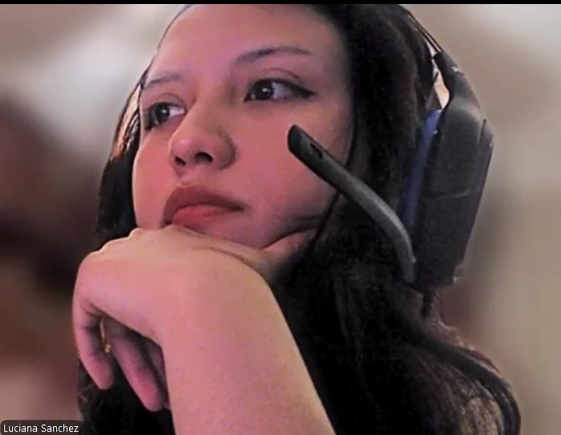
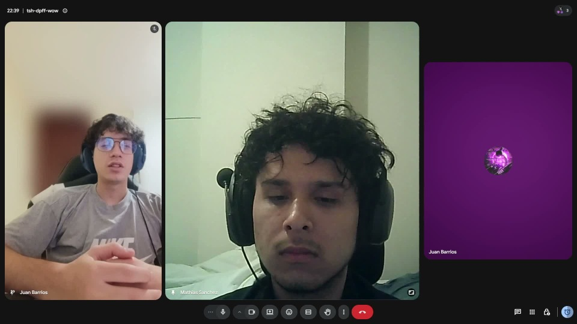

 
 

    

 
 

# 5.3. Validation Interviews

## 5.3.1. Diseño de entrevistas

Las entrevistas de validación se realizaron con el objetivo de evaluar la percepción de los usuarios después de interactuar con la landing page y la Web Application de SafeStep. A diferencia de las entrevistas exploratorias del Capítulo 2, estas entrevistas se enfocan en validar la claridad de la propuesta, la facilidad de navegación, la utilidad de las funcionalidades principales y la confianza generada por el producto desarrollado.

Para esta etapa se consideraron los tres segmentos objetivo definidos previamente:

- Estudiantes universitarios.
- Integrantes de comunidades vecinales.
- Brigadistas o personas vinculadas a la atención de emergencias.

La dinámica de la entrevista consistió en presentar primero la landing page de SafeStep y luego mostrar las principales secciones de la aplicación web: dashboard, simulaciones médicas, gamificación, estadísticas, tienda de productos de emergencia y perfil de usuario. Después de esta demostración, el entrevistado respondió un conjunto de preguntas orientadas a recoger sus opiniones sobre el producto.

### Guía de preguntas para estudiantes universitarios

1. ¿Cuál fue tu primera impresión al ver SafeStep?
2. Después de revisar la landing page, ¿qué entendiste que ofrece SafeStep?
3. ¿La landing page te pareció clara y fácil de entender?
4. ¿Los botones o llamados a la acción fueron fáciles de identificar?
5. ¿La landing page te transmitió confianza para probar la aplicación?
6. ¿Te resultó fácil navegar dentro de la aplicación web?
7. ¿Pudiste identificar rápidamente las secciones principales de la aplicación?
8. ¿La organización de la información te pareció ordenada?
9. ¿Hubo alguna pantalla o sección que te pareciera confusa?
10. ¿Qué funcionalidad te pareció más útil dentro de SafeStep?
11. ¿Las simulaciones médicas te parecieron útiles para aprender primeros auxilios?
12. ¿Las preguntas y opciones de las simulaciones fueron claras?
13. ¿La retroalimentación después de responder te ayudó a entender mejor qué hacer?
14. ¿Las misiones, insignias, puntos o monedas te motivarían a seguir usando la aplicación?
15. ¿La tienda de productos de emergencia te pareció útil dentro de la aplicación?
16. ¿Los productos y kits mostrados se relacionan bien con el objetivo de SafeStep?
17. ¿Usarías SafeStep para aprender o practicar primeros auxilios? ¿Por qué?
18. ¿Recomendarías SafeStep a otra persona? ¿Por qué?
19. Del 1 al 5, ¿qué tan fácil, útil y confiable te pareció SafeStep?
20. Si pudieras cambiar o mejorar una sola cosa del producto, ¿qué cambiarías?

### Guía de preguntas para comunidades vecinales

1. ¿Cuál fue tu primera impresión al ver SafeStep?
2. Después de revisar la landing page, ¿qué entendiste que ofrece SafeStep?
3. ¿La landing page te pareció clara y fácil de entender?
4. ¿Los botones o llamados a la acción fueron fáciles de identificar?
5. ¿La landing page te transmitió confianza para probar la aplicación?
6. ¿Te resultó fácil navegar dentro de la aplicación web?
7. ¿Pudiste identificar rápidamente las secciones principales de la aplicación?
8. ¿La organización de la información te pareció ordenada?
9. ¿Hubo alguna pantalla o sección que te pareciera confusa?
10. ¿Qué funcionalidad te pareció más útil dentro de SafeStep?
11. ¿Las simulaciones médicas te parecieron útiles para aprender primeros auxilios?
12. ¿Las preguntas y opciones de las simulaciones fueron claras?
13. ¿La retroalimentación después de responder te ayudó a entender mejor qué hacer?
14. ¿Las misiones, insignias, puntos o monedas te motivarían a seguir usando la aplicación?
15. ¿La tienda de productos de emergencia te pareció útil dentro de la aplicación?
16. ¿Los productos y kits mostrados se relacionan bien con el objetivo de SafeStep?
17. ¿Usarías SafeStep para aprender o practicar primeros auxilios? ¿Por qué?
18. ¿Recomendarías SafeStep a otra persona? ¿Por qué?
19. Del 1 al 5, ¿qué tan fácil, útil y confiable te pareció SafeStep?
20. Si pudieras cambiar o mejorar una sola cosa del producto, ¿qué cambiarías?

### Guía de preguntas para brigadistas

1. ¿Cuál fue tu primera impresión al ver SafeStep?
2. Después de revisar la landing page, ¿qué entendiste que ofrece SafeStep?
3. ¿La landing page te pareció clara y fácil de entender?
4. ¿Los botones o llamados a la acción fueron fáciles de identificar?
5. ¿La landing page te transmitió confianza para probar la aplicación?
6. ¿Te resultó fácil navegar dentro de la aplicación web?
7. ¿Pudiste identificar rápidamente las secciones principales de la aplicación?
8. ¿La organización de la información te pareció ordenada?
9. ¿Hubo alguna pantalla o sección que te pareciera confusa?
10. ¿Qué funcionalidad te pareció más útil dentro de SafeStep?
11. ¿Las simulaciones médicas te parecieron útiles para aprender primeros auxilios?
12. ¿Las preguntas y opciones de las simulaciones fueron claras?
13. ¿La retroalimentación después de responder te ayudó a entender mejor qué hacer?
14. ¿Las misiones, insignias, puntos o monedas te motivarían a seguir usando la aplicación?
15. ¿La tienda de productos de emergencia te pareció útil dentro de la aplicación?
16. ¿Los productos y kits mostrados se relacionan bien con el objetivo de SafeStep?
17. ¿Usarías SafeStep para aprender o practicar primeros auxilios? ¿Por qué?
18. ¿Recomendarías SafeStep a otra persona? ¿Por qué?
19. Del 1 al 5, ¿qué tan fácil, útil y confiable te pareció SafeStep?
20. Si pudieras cambiar o mejorar una sola cosa del producto, ¿qué cambiarías?

## 5.3.2. Registro de entrevistas

A continuación, se presentan los cuadros de registro para las entrevistas de validación realizadas a usuarios pertenecientes a los segmentos objetivo. Estos cuadros serán completados con los datos, evidencias, enlaces y transcripciones correspondientes a cada entrevista.

<table align="center">
    <tr>
        <td colspan="2" align="center">
            <b>Entrevista de Validación N° 1</b>
        </td>
    </tr>
    <tr>
        <td width="30%" align="center">
            
        </td>
        <td width="70%">
            <b>Entrevistado</b>: Luciana Celeste Sanchez Silva  
            <b>Entrevistador</b>: Josep Melgarejo  
            <b>Duración</b>: 14:07  
            <b>Género</b>: Femenino  
            <b>Edad</b>: 21 años  
            <b>Segmento</b>: Comunidad vecinal 
            <b>Lugar de Residencia</b>: San Miguel 
        </td>
    </tr>
    <tr>
        <td colspan="2" align="center">
            Link de la entrevista: <a href="https://upcedupe-my.sharepoint.com/:v:/g/personal/u202315165_upc_edu_pe/IQAyHQ9zYCXpTK-6YH-8ZX6DAaCHFlV8RjsE_FTgyGTXgyg?nav=eyJyZWZlcnJhbEluZm8iOnsicmVmZXJyYWxBcHAiOiJTdHJlYW1XZWJBcHAiLCJyZWZlcnJhbFZpZXciOiJTaGFyZURpYWxvZy1MaW5rIiwicmVmZXJyYWxBcHBQbGF0Zm9ybSI6IldlYiIsInJlZmVycmFsTW9kZSI6InZpZXcifX0%3D&e=XugCte" target="_blank" rel="noopener noreferrer">Entrevista a luciana</a>
        </td>
    </tr>
    <tr>
        <td colspan="2" align="center">
            
        </td>
    </tr>
    <tr>
        <td colspan="2" align="center">
            <b>Transcripción:</b>
        </td>
    </tr>
    <tr>
        <td colspan="2">

<b>1. ¿Cuál fue tu primera impresión al ver SafeStep?</b> 
        
Me pareció una propuesta interesante y diferente, porque combina aprendizaje de primeros auxilios con una aplicación interactiva. Desde el inicio se entiende que busca ayudar a las personas a prepararse mejor ante emergencias.

<b>2. Después de revisar la landing page, ¿qué entendiste que ofrece SafeStep?</b> 

Entendí que SafeStep ofrece una plataforma donde puedo aprender primeros auxilios mediante simulaciones, revisar mi progreso, ganar recompensas y también conocer productos útiles para emergencias.

<b>3. ¿La landing page te pareció clara y fácil de entender?</b> 

Sí, me pareció clara. La información principal se entiende rápido y no sentí que estuviera sobrecargada.

<b>4. ¿Los botones o llamados a la acción fueron fáciles de identificar?</b> 

Sí, los botones principales se distinguen bien. Me quedó claro dónde podía iniciar o ir a la aplicación.

<b>5. ¿La landing page te transmitió confianza para probar la aplicación?</b> 

Sí, me transmitió confianza porque explica el propósito del producto y se ve organizada. Tal vez agregaría más respaldo o referencias de instituciones para que genere todavía más seguridad.

<b>6. ¿Te resultó fácil navegar dentro de la aplicación web?</b> 

Sí, la navegación fue sencilla. El menú permite encontrar las secciones principales sin tener que buscar demasiado.

<b>7. ¿Pudiste identificar rápidamente las secciones principales de la aplicación?</b> 

Sí, pude reconocer las secciones de simulaciones, tienda, estadísticas, gamificación y perfil. Los nombres son bastante directos.

<b>8. ¿La organización de la información te pareció ordenada?</b> 

Sí, está ordenada por módulos y eso ayuda bastante. Cada pantalla parece tener una función específica.

<b>9. ¿Hubo alguna pantalla o sección que te pareciera confusa?</b> 

No fue confusa, pero al inicio la parte de recompensas y monedas podría necesitar una pequeña explicación para entender mejor cómo se ganan y para qué sirven.

<b>10. ¿Qué funcionalidad te pareció más útil dentro de SafeStep?</b> 

Las simulaciones médicas me parecieron lo más útil, porque permiten practicar decisiones en situaciones que podrían pasar en la vida real.

<b>11. ¿Las simulaciones médicas te parecieron útiles para aprender primeros auxilios?</b> 

Sí, porque no solo muestran teoría, sino que hacen que uno piense qué acción tomaría ante una emergencia.

<b>12. ¿Las preguntas y opciones de las simulaciones fueron claras?</b> 

Sí, las preguntas fueron comprensibles y las opciones estaban relacionadas con la situación presentada.

<b>13. ¿La retroalimentación después de responder te ayudó a entender mejor qué hacer?</b> 

Sí, me ayudó porque explica el motivo de la respuesta. Eso hace que uno aprenda del error y no solo vea una calificación.

<b>14. ¿Las misiones, insignias, puntos o monedas te motivarían a seguir usando la aplicación?</b> 

Sí, porque le dan un sentido de avance. Creo que ayudan a que el usuario quiera completar más simulaciones.

<b>15. ¿La tienda de productos de emergencia te pareció útil dentro de la aplicación?</b> 

Sí, me pareció útil porque conecta lo aprendido con herramientas reales que podrían necesitarse en casa, universidad o trabajo.

<b>16. ¿Los productos y kits mostrados se relacionan bien con el objetivo de SafeStep?</b> 

Sí, los productos se relacionan con prevención, emergencias y primeros auxilios, así que tienen sentido dentro de la aplicación.

<b>17. ¿Usarías SafeStep para aprender o practicar primeros auxilios? ¿Por qué?</b> 

Sí, la usaría porque me parece una forma más práctica de aprender. Además, puedo repetir simulaciones y mejorar poco a poco.

<b>18. ¿Recomendarías SafeStep a otra persona? ¿Por qué?</b> 

Sí, la recomendaría porque los primeros auxilios son importantes para cualquier persona. Creo que sería útil para estudiantes, familias y personas que quieran estar mejor preparadas.

<b>19. Del 1 al 5, ¿qué tan fácil, útil y confiable te pareció SafeStep?</b> 

Le daría 4 en facilidad, 5 en utilidad y 4 en confianza. Me parece bastante útil, aunque podría mejorar con más información de respaldo o certificaciones.

<b>20. Si pudieras cambiar o mejorar una sola cosa del producto, ¿qué cambiarías?</b> 

Agregaría una sección inicial de explicación rápida, como un pequeño tutorial, para entender cómo funcionan las recompensas, las monedas y el progreso dentro de la aplicación.
        </td>
    </tr>
</table>

<table align="center">
    <tr>
        <td colspan="2" align="center">
            <b>Entrevista de Validación N° 2</b>
        </td>
    </tr>
    <tr>
        <td width="30%" align="center">
            
        </td>
        <td width="70%">
            <b>Entrevistado</b>: Vivian Paredes  
            <b>Entrevistador</b>: Josep Melgarejo  
            <b>Duración</b>: 12:34  
            <b>Género</b>: Femenino  
            <b>Edad</b>: 22 años  
            <b>Segmento</b>: Estudiante universitario  
            <b>Lugar de Residencia</b>: Chorrillos  
        </td>
    </tr>
    <tr>
        <td colspan="2" align="center">
            Link de la entrevista: <a href="https://upcedupe-my.sharepoint.com/:v:/g/personal/u202315165_upc_edu_pe/IQCL5jTx-skXTo0-TpL3it1kAe_J86duOpp7QmsUrMbwsUg?nav=eyJyZWZlcnJhbEluZm8iOnsicmVmZXJyYWxBcHAiOiJTdHJlYW1XZWJBcHAiLCJyZWZlcnJhbFZpZXciOiJTaGFyZURpYWxvZy1MaW5rIiwicmVmZXJyYWxBcHBQbGF0Zm9ybSI6IldlYiIsInJlZmVycmFsTW9kZSI6InZpZXcifX0%3D&e=BcA9Ee" target="_blank" rel="noopener noreferrer">Entrevista a Vivian</a>
        </td>
    </tr>
    <tr>
        <td colspan="2" align="center">
            
        </td>
    </tr>
    <tr>
        <td colspan="2" align="center">
            <b>Transcripción:</b>
        </td>
    </tr>
    <tr>
        <td colspan="2">

<b>1. ¿Cuál fue tu primera impresión al ver SafeStep?</b> 

Mi primera impresión fue positiva. Me pareció una aplicación seria, ordenada y útil, especialmente porque trata un tema importante como los primeros auxilios.

<b>2. Después de revisar la landing page, ¿qué entendiste que ofrece SafeStep?</b> 

Entendí que SafeStep es una plataforma para aprender primeros auxilios mediante simulaciones, ejercicios prácticos, seguimiento del progreso y recomendaciones de productos de emergencia.

<b>3. ¿La landing page te pareció clara y fácil de entender?</b> 

Sí, me pareció clara. La información está bien distribuida y se entiende rápido cuál es el propósito de la aplicación.

<b>4. ¿Los botones o llamados a la acción fueron fáciles de identificar?</b> 

Sí, los botones se notan bien y es claro cuándo se puede iniciar, registrarse o conocer más sobre la aplicación.

<b>5. ¿La landing page te transmitió confianza para probar la aplicación?</b> 

Sí, porque tiene una presentación profesional y explica bien el problema que busca resolver. Eso hace que se vea como una herramienta útil y confiable.

<b>6. ¿Te resultó fácil navegar dentro de la aplicación web?</b> 

Sí, la navegación me pareció sencilla. Las secciones están visibles y pude moverme entre las partes principales sin perderme.

<b>7. ¿Pudiste identificar rápidamente las secciones principales de la aplicación?</b> 

Sí, pude identificar el dashboard, las simulaciones, la gamificación, las estadísticas, la tienda y el perfil.

<b>8. ¿La organización de la información te pareció ordenada?</b> 

Sí, la información está organizada por secciones y eso ayuda a entender qué se puede hacer en cada parte de la aplicación.

<b>9. ¿Hubo alguna pantalla o sección que te pareciera confusa?</b> 

En general no. Tal vez al inicio la parte de monedas o recompensas podría explicarse un poco más, pero después de usarla se entiende mejor.

<b>10. ¿Qué funcionalidad te pareció más útil dentro de SafeStep?</b> 

La funcionalidad más útil me pareció la de simulaciones médicas, porque permite practicar situaciones de emergencia de forma guiada.

<b>11. ¿Las simulaciones médicas te parecieron útiles para aprender primeros auxilios?</b> 

Sí, porque presentan casos concretos y ayudan a pensar qué haría una persona en una emergencia real.

<b>12. ¿Las preguntas y opciones de las simulaciones fueron claras?</b> 

Sí, las preguntas se entienden bien y las opciones son fáciles de comparar.

<b>13. ¿La retroalimentación después de responder te ayudó a entender mejor qué hacer?</b> 

Sí, porque no solo indica si la respuesta fue correcta, sino que también ayuda a comprender por qué una acción es mejor que otra.

<b>14. ¿Las misiones, insignias, puntos o monedas te motivarían a seguir usando la aplicación?</b> 

Sí, porque hacen que el aprendizaje se sienta más dinámico y dan ganas de seguir practicando para mejorar.

<b>15. ¿La tienda de productos de emergencia te pareció útil dentro de la aplicación?</b> 

Sí, me pareció útil porque complementa el aprendizaje con productos que podrían servir en una emergencia real.

<b>16. ¿Los productos y kits mostrados se relacionan bien con el objetivo de SafeStep?</b> 

Sí, los productos tienen relación con primeros auxilios y prevención, así que encajan bien con el propósito de la aplicación.

<b>17. ¿Usarías SafeStep para aprender o practicar primeros auxilios? ¿Por qué?</b> 

Sí, la usaría porque permite aprender de forma práctica y no solo leyendo teoría. Además, practicar con simulaciones ayuda a recordar mejor qué hacer.

<b>18. ¿Recomendarías SafeStep a otra persona? ¿Por qué?</b> 

Sí, la recomendaría a familiares, amigos o estudiantes, porque todos deberíamos saber cómo actuar ante una emergencia básica.

<b>19. Del 1 al 5, ¿qué tan fácil, útil y confiable te pareció SafeStep?</b> 

Le daría 5 en utilidad, 4 en facilidad y 4 en confianza. Me parece una buena propuesta, aunque algunas funciones podrían explicarse un poco más al inicio.

<b>20. Si pudieras cambiar o mejorar una sola cosa del producto, ¿qué cambiarías?</b> 

Agregaría una explicación inicial o guía rápida dentro de la aplicación para entender mejor cómo funcionan las monedas, misiones y recompensas desde el primer uso
        </td>
    </tr>

</table>

<table align="center">
    <tr>
        <td colspan="2" align="center">
            <b>Entrevista de Validación N° 3</b>
        </td>
    </tr>
    <tr>
        <td width="30%" align="center">
            
        </td>
        <td width="70%">
            <b>Entrevistado</b>: Rodrigo Andres Gonzales Portugal  
            <b>Entrevistador</b>: Angel Thyago Flores Eusebio  
            <b>Duración</b>: 6:24  
            <b>Género</b>: Masculino  
            <b>Edad</b>: 20  
            <b>Segmento</b>: Comunidad vecinal  
            <b>Lugar de Residencia</b>: Lima  
        </td>
    </tr>
    <tr>
        <td colspan="2" align="center">
            Link de la entrevista: <a href="https://upcedupe-my.sharepoint.com/:v:/g/personal/u20231b781_upc_edu_pe/IQB9y3zKDB4MQ6OIm5edG54IAYUEwJSO7r1IzjdVk2xAfb4?nav=eyJyZWZlcnJhbEluZm8iOnsicmVmZXJyYWxBcHAiOiJTdHJlYW1XZWJBcHAiLCJyZWZlcnJhbFZpZXciOiJTaGFyZURpYWxvZy1MaW5rIiwicmVmZXJyYWxBcHBQbGF0Zm9ybSI6IldlYiIsInJlZmVycmFsTW9kZSI6InZpZXcifX0%3D&e=Wcf3ss" target="_blank" rel="noopener noreferrer">[Entrevista a Rodrigo]</a>
        </td>
    </tr>
    <tr>
        <td colspan="2" align="center">
            
        </td>
    </tr>
    <tr>
        <td colspan="2" align="center">
            <b>Transcripción:</b>
        </td>
    </tr>
    <tr>
        <td colspan="2">
            [Completar transcripción de la entrevista de validación N° 3]
        </td>
    </tr>
</table>

<table align="center">
    <tr>
        <td colspan="2" align="center">
            <b>Entrevista de Validación N° 4</b>
        </td>
    </tr>
    <tr>
        <td width="30%" align="center">
            
        </td>
        <td width="70%">
            <b>Entrevistado</b>: [Completar nombre del entrevistado]  
            <b>Entrevistador</b>: [Completar nombre del entrevistador]  
            <b>Duración</b>: [Completar duración]  
            <b>Género</b>: [Completar género]  
            <b>Edad</b>: [Completar edad]  
            <b>Segmento</b>: [Estudiante universitario / Comunidad vecinal / Brigadista]  
            <b>Lugar de Residencia</b>: [Completar lugar de residencia]  
        </td>
    </tr>
    <tr>
        <td colspan="2" align="center">
            Link de la entrevista: <a href="[Insertar URL de la entrevista]" target="_blank" rel="noopener noreferrer">[Insertar URL de la entrevista]</a>
        </td>
    </tr>
    <tr>
        <td colspan="2" align="center">
            
        </td>
    </tr>
    <tr>
        <td colspan="2" align="center">
            <b>Transcripción:</b>
        </td>
    </tr>
    <tr>
        <td colspan="2">
            [Completar transcripción de la entrevista de validación N° 4]
        </td>
    </tr>
</table>

<table align="center">
    <tr>
        <td colspan="2" align="center">
            <b>Entrevista de Validación N° 5</b>
        </td>
    </tr>
    <tr>
        <td width="30%" align="center">
            
        </td>
        <td width="70%">
            <b>Entrevistado</b>: Juan Miguel Barrios Casanova  
            <b>Entrevistador</b>: Mathias Enrique Sánchez Espinoza  
            <b>Duración</b>: 09:38  
            <b>Género</b>: Masculino  
            <b>Edad</b>: 20  
            <b>Segmento</b>: Brigadista  
            <b>Lugar de Residencia</b>: Lima - San Miguel  
        </td>
    </tr>
    <tr>
        <td colspan="2" align="center">
            Link de la entrevista: <a href="https://upcedupe-my.sharepoint.com/:v:/g/personal/u20231c524_upc_edu_pe/IQBUW35fykXxQa3Zw5aIlyysAZ9SJmB69--ppxUl8eElCLQ?nav=eyJyZWZlcnJhbEluZm8iOnsicmVmZXJyYWxBcHAiOiJTdHJlYW1XZWJBcHAiLCJyZWZlcnJhbFZpZXciOiJTaGFyZURpYWxvZy1MaW5rIiwicmVmZXJyYWxBcHBQbGF0Zm9ybSI6IldlYiIsInJlZmVycmFsTW9kZSI6InZpZXcifX0%3D&e=VIEHA9" target="_blank" rel="noopener noreferrer">Entrevista de Validación 5</a>
        </td>
    </tr>
    <tr>
        <td colspan="2" align="center">
            
        </td>
    </tr>
    <tr>
        <td colspan="2" align="center">
            <b>Transcripción:</b>
        </td>
    </tr>
    <tr>
        <td colspan="2">
            Bueno, esta es una entrevista para el proyecto de Open Source, una entrevista de validación de nuestro proyecto. 
            Y bueno, acá estamos con el entrevistado.
            Por favor, ¿te podrías presentar?
            Sí, claro. ¿Cómo estás? Mi nombre es Juan Barrios, soy de la ciudad de Lima y me especializo en lo que es primeros auxilios. 
            En ese caso, yo ahorita me encuentro trabajando con la Municipalidad de Lima. 
            Ok, Juan, muchas gracias por la entrevista. Primero, bueno, anteriormente te mostré la página web y también te mostré la aplicación. 
            Y bueno, quería hacerte unas preguntas. ¿Cuál fue tu primera impresión al ver nuestro producto Safe Steps? 
            Mi primera impresión fue de asombro, ya que me pareció un proyecto innovador y, bueno, una forma bastante interesante de poder enseñar primeros auxilios.
            Ok. Después de revisar la landing page, como en este caso, la página web, ¿qué entendiste sobre lo que ofrece Safe Steps? 
            Lo que yo pude entender al ver la página web fue que, bueno, buscan enseñar lo que es primeros auxilios a gente que no conozca o tal vez necesite mejorar. 
            Y también ofrecen, en este caso, el equipo que alguien pueda requerir para hacer correctamente los primeros auxilios.
            Ok, muchas gracias. ¿La landing page te pareció clara y fácil de entender? 
            Sí, me pareció muy clara y también me parece que está bien distribuida. 
            Ok. ¿Los botones, o digamos, la acción, como te dije anteriormente, call to action, los botones call to action, ¿fueron fáciles de identificar? 
            Sí, me parece que los botones call to action estaban bien posicionados dentro de la página web para poder identificarlos de una manera más sencilla. 
            Ok. ¿La landing page le transmitió algún tipo de confianza para poder probar la aplicación, nuestro proyecto? 
            Sí, la verdad que sí. Fue una aplicación que en primera instancia sí me dieron muchas ganas de seguir utilizándola. 
            Ok. ¿Te resultó fácil navegar dentro de la aplicación web? 
            Sí, estuvo muy sencillo, la verdad. Los apartados estaban bien organizados y todo era muy claro. 
            Ok, es un buen punto. ¿Pudiste identificar rápidamente las secciones principales de la aplicación? 
            Sí, como comenté, la aplicación está muy bien distribuida y fue muy rápido el poder identificar las secciones principales.
            Ok, ok. ¿La organización de la información dentro de la aplicación web te pareció ordenada o desordenada? 
            Me pareció que estaba ordenada, la verdad. No tenía tal vez alguna duda sobre de dónde ir primero. Me parece que era muy intuitivo el orden que tenías que seguir para ver todo lo que ofrecía la aplicación. 
            Ok. ¿Hubo alguna pantalla o sección que te pareciera algo confusa? 
            No, la verdad que no. Me parece que todo estaba muy bien distribuido dentro de la aplicación. 
            Ok. ¿Qué funcionalidad te pareció más útil dentro de nuestra aplicación SafeStack? 
            Lo más útil me parecieron las simulaciones de las clases, en este caso de primeros auxilios. Me parece que son fáciles de entender, están bien centradas en los temas y son bastante bien explicadas. 
            Ok. ¿Las simulaciones médicas te parecieron útiles para aprender primeros auxilios? 
            Sí, me parecieron útiles. Me parece que los temas que han elegido están bien centrados en los temas que alguien que quisiera aprender a realizar primeros auxilios necesita aprender. 
            Gracias. ¿Las preguntas y opciones de las simulaciones fueron claras, concisas? 
            Sí, me parece que todas las preguntas que se hacían y las opciones que te daban las simulaciones estaban muy bien planteadas y estaban bien logradas.
            Ok. ¿La retroalimentación, después de responder las simulaciones, te ayudó a entender mejor qué hacer en las situaciones de emergencia? 
            Sí, es una forma muy acertada de cómo lograr hacer que alguien termine de entender, hacer una explicación un poco más detallada del tema que se está presentando. 
            ¿Las preguntas y opciones de las simulaciones, en este caso, fueron claras? 
            Sí, estuvieron muy bien logradas.
            Ok. ¿La retroalimentación, después de responder, te ayudó a entender mejor qué hacer? 
            Sí, estuvo bastante acertado la retroalimentación después de terminarla. 
            ¿Las misiones, insignias, puntos o monedas te motivarían a seguir usando la aplicación? 
            Sí, me parece que es una forma bastante innovadora de mantener a la gente enganchada a la aplicación, a seguir utilizándola, a recomendarla, ya que, en este caso, estas misiones y objetos que se pueden conseguir despiertan la competitividad en la gente y eso atrae más público.
            La tienda de productos de emergencia, donde costaban los kits y otros productos médicos, ¿te pareció útil dentro de la aplicación? 
            Sí, me parece que es un apartado bastante útil, ya que la gente que busca aprender primeros auxilios también querrá saber cómo y qué cosas debería comprar para el objetivo que esté buscando. 
            ¿Los productos y kits mostrados en la tienda se relacionan bien con el objetivo de SafeState? 
            Sí, me parece que está bien relacionado, ya que el objetivo de SafeState es más que nada enseñar el tema de primeros auxilios y dentro de la tienda es los productos que han incorporado y los kits que han implementado en esta están bien relacionados con los temas. 
            ¿Usaría usted SafeState para aprender o practicar primeros auxilios y por qué? 
            Sí la usaría, ya que me parece que es bastante sencillo el aprender y es una forma también bastante entretenida.
            ¿Recomendaría nuestro producto SafeState a otra persona y por qué? 
            Sí lo recomendaría, ya que me parece un producto innovador y por el momento me parece que está muy bien elaborada la aplicación.
            ¿Del 1 al 5, qué tan fácil, útil y confiable le pareció SafeState? 
            Yo te diría un 5, ya que al menos para lo que es como me la ha presentado por primera vez la aplicación está todo bastante acertado en cuanto a temas, en cuanto a explicaciones y todo me parece que está muy bien elaborado. 
            Si pudieras cambiar o mejorar una sola cosa de nuestro producto SafeState, ¿qué cambiaría? 
            Yo te diría que tal vez la duración de las simulaciones, ya que me parece que está con un poquito más de tiempo, sin exagerar podría abarcar algunos detalles más importantes de los temas que se trata.
            Ok, eso es interesante la verdad. Bueno, muchas gracias por tu análisis sobre nuestro proyecto, el producto que ofrecemos y bueno muchas gracias por la entrevista también. 
            Gracias.
        </td>
    </tr>
</table>

<table align="center">
    <tr>
        <td colspan="2" align="center">
            <b>Entrevista de Validación N° 6</b>
        </td>
    </tr>
    <tr>
        <td width="30%" align="center">
            
        </td>
        <td width="70%">
            <b>Entrevistado</b>: [Completar nombre del entrevistado]  
            <b>Entrevistador</b>: [Completar nombre del entrevistador]  
            <b>Duración</b>: [Completar duración]  
            <b>Género</b>: [Completar género]  
            <b>Edad</b>: [Completar edad]  
            <b>Segmento</b>: [Estudiante universitario / Comunidad vecinal / Brigadista]  
            <b>Lugar de Residencia</b>: [Completar lugar de residencia]  
        </td>
    </tr>
    <tr>
        <td colspan="2" align="center">
            Link de la entrevista: <a href="[Insertar URL de la entrevista]" target="_blank" rel="noopener noreferrer">[Insertar URL de la entrevista]</a>
        </td>
    </tr>
    <tr>
        <td colspan="2" align="center">
            
        </td>
    </tr>
    <tr>
        <td colspan="2" align="center">
            <b>Transcripción:</b>
        </td>
    </tr>
    <tr>
        <td colspan="2">
            [Completar transcripción de la entrevista de validación N° 6]
        </td>
    </tr>
</table>

## 5.3.3. Evaluaciones según heurísticas

Esta sección será completada después de registrar las seis entrevistas de validación. El análisis considerará las respuestas obtenidas sobre claridad, utilidad, confianza, facilidad de navegación, comprensión de las simulaciones, motivación por gamificación y percepción de la tienda de productos de emergencia.
