<br>

<div align="center">
  
</div>

### **Facultad**: Ingeniería

### **Carrera**: Ingeniería de Software

### **Curso**: Desarrollo de aplicaciones Open Source (**NRC**: 11990)

### **Docente**: Juan Antonio Flores Moroco

<br>

---

<br>

<h1 align="center">Informe del Trabajo final</h1>

<table>
  <tr>
    <td width="30%" align="center">
      
    </td>
    <td width="70%">
      <h3><b>Nombre de la Startup</b>: Chronos</h3>
      <h3><b>Nombre del producto</b>: SafeStep</h3>
      <p>
        SafeStep es una aplicación web interactiva que revoluciona la forma en que las personas aprenden primeros auxilios. A través de simulaciones ramificadas y escenarios realistas, el usuario toma decisiones en tiempo real para resolver emergencias comunes como RCP, quemaduras, cortes o atragantamientos.
      </p>
      <br/>
    </td>
  </tr>
</table>

## 👥 Integrantes:

- **Ayala Fernandez, Jorge Brayan** — u20241c030
- **Flores Eusebio, Angel Thyago** — u20231b781
- **Melgarejo Quiroz Josep Eliu** — u202315165
- **Miraval Pomalaya, Rodrigo Jesus** — u202311082
- **Sanchez Espinoza, Mathias Enrique** — u20231c524

<div align="center">

### **Ciclo Académico**: 2026 - 1

### Abril - 2026

</div>

<br>

---

<br>

<div align="center">

# Índice general

</div>

### [Registro de Versiones del Informe](./markdown/content/registro-versiones.md)

### [Project Report Collaboration Insights](./markdown/content/report-collaboration.md)

### [Tabla de contenidos](./README.md#índice-general)

### [Student Outcome](./markdown/content/student-outcome.md)

## Capítulo I: Introducción

- 1.1. [Startup Profile](./markdown/content/chapter-1/1-1-startup-profile.md)
  - 1.1.1. [Descripción de la Startup](./markdown/content/chapter-1/1-1-startup-profile.md#111-descripción-de-la-startup)
  - 1.1.2. [Perfiles de los integrantes del equipo](./markdown/content/chapter-1/1-1-startup-profile.md#112-perfiles-de-integrantes-del-equipo)

- 1.2. [Solution Profile](./markdown/content/chapter-1/1-2-solution-profile.md)
  - 1.2.1. [Antecedentes y problemática](./markdown/content/chapter-1/1-2-solution-profile.md#121-antecedentes-y-problemática)
  - 1.2.2. [Lean UX Process](./markdown/content/chapter-1/1-2-solution-profile.md#122-lean-ux-process)
    - 1.2.2.1. [Lean UX Problem Statements](./markdown/content/chapter-1/1-2-solution-profile.md#1221-lean-ux-problem-statements)
    - 1.2.2.2. [Lean UX Assumptions](./markdown/content/chapter-1/1-2-solution-profile.md#1222-lean-ux-assumptions)
    - 1.2.2.3. [Lean UX Hypothesis Statements](./markdown/content/chapter-1/1-2-solution-profile.md#1223-lean-ux-hypothesis-statements)
    - 1.2.2.4. [Lean UX Canvas](./markdown/content/chapter-1/1-2-solution-profile.md#1224-lean-ux-canvas)

- 1.3. [Segmentos objetivo](./markdown/content/chapter-1/1-3-segmentos-objetivo.md)

## Capítulo II: Requirements Elicitation & Analysis

- 2.1. [Competidores](./markdown/content/chapter-2/2-1-competidores.md)
  - 2.1.1. [Análisis competitivo](./markdown/content/chapter-2/2-1-competidores.md#211-análisis-competitivo)
  - 2.1.2. [Estrategias y tácticas frente a competidores](./markdown/content/chapter-2/2-1-competidores.md#212-estrategias-y-tácticas-frente-a-competidores)

- 2.2. [Entrevistas](./markdown/content/chapter-2/2-2-entrevistas.md)
  - 2.2.1. [Diseño de entrevistas](./markdown/content/chapter-2/2-2-entrevistas.md#221-diseño-de-entrevistas)
  - 2.2.2. [Registro de entrevistas](./markdown/content/chapter-2/2-2-entrevistas.md#222-registro-de-entrevistas)
  - 2.2.3. [Análisis de entrevistas](./markdown/content/chapter-2/2-2-entrevistas.md#223-análisis-de-entrevistas)

- 2.3. [Needfinding](./markdown/content/chapter-2/2-3-needfinding.md)
  - 2.3.1. [User personas](./markdown/content/chapter-2/2-3-needfinding.md#231-user-personas)
  - 2.3.2. [User Task Matrix](./markdown/content/chapter-2/2-3-needfinding.md#232-user-task-matrix)
  - 2.3.3. [User Journey Mapping](./markdown/content/chapter-2/2-3-needfinding.md#233-user-journey-mapping)
  - 2.3.4. [Empathy Mapping](./markdown/content/chapter-2/2-3-needfinding.md#234-empathy-mapping)

- 2.4. [Big Picture Event Storming](./markdown/content/chapter-2/2-4-big-picture-event-storming.md)

- 2.5. [Ubiquitous Language](./markdown/content/chapter-2/2-5-ubiquitous-language.md) 

## Capítulo III: Requirements Specification

- 3.1. [User Stories](./markdown/content/chapter-3/3-1-user-stories.md)

- 3.2. [Impact Mapping](./markdown/content/chapter-3/3-2-impact-mapping.md)

- 3.3. [Product Backlog](./markdown/content/chapter-3/3-3-product-backlog.md)

## Capítulo IV: Product Design

- 4.1. [Style Guidelines](./markdown/content/chapter-4/4-1-style-guidelines.md)
  - 4.1.1. [General Style Guidelines](./markdown/content/chapter-4/4-1-style-guidelines.md#411-general-style-guidelines)
  - 4.1.2. [Web Style Guidelines](./markdown/content/chapter-4/4-1-style-guidelines.md#412-web-style-guidelines)

- 4.2. [Information Architecture](./markdown/content/chapter-4/4-2-information-architecture.md)
  - 4.2.1. [Organization Systems](./markdown/content/chapter-4/4-2-information-architecture.md#421-organization-systems)
  - 4.2.2. [Labeling Systems](./markdown/content/chapter-4/4-2-information-architecture.md#422-labeling-systems)
  - 4.2.3. [SEO Tags and Meta Tags](./markdown/content/chapter-4/4-2-information-architecture.md#423-seo-tags-and-meta-tags)
  - 4.2.4. [Searching Systems](./markdown/content/chapter-4/4-2-information-architecture.md#424-searching-systems)
  - 4.2.5. [Navigation Systems](./markdown/content/chapter-4/4-2-information-architecture.md#425-navigation-ssytems)

- 4.3. [Landing Page UI Design](./markdown/content/chapter-4/4-3-landing-page-ui-design.md)
  - 4.3.1. [Landing Page Wireframe](./markdown/content/chapter-4/4-3-landing-page-ui-design.md#431-landing-page-wireframe)
  - 4.3.2. [Landing Page Mock-up](./markdown/content/chapter-4/4-3-landing-page-ui-design.md#432-landing-page-mock-up)

- 4.4. [Web Applications UX/UI Design](./markdown/content/chapter-4/4-4-web-applications-ux-ui-design.md)
  - 4.4.1. [Web Applications Wireframes](./markdown/content/chapter-4/4-4-web-applications-ux-ui-design.md#441-web-applications-wireframes)
  - 4.4.2. [Web Applications Wireflow Diagrams](./markdown/content/chapter-4/4-4-web-applications-ux-ui-design.md#442-web-applications-wireflow-diagrams)
  - 4.4.3. [Web Applications Mock-ups](./markdown/content/chapter-4/4-4-web-applications-ux-ui-design.md#443-web-applications-mock-ups)
  - 4.4.4. [Web Applications User Flow Diagrams](./markdown/content/chapter-4/4-4-web-applications-ux-ui-design.md#444-web-applications-user-flow-diagrams)

- 4.5. [Web Applications Prototyping](./markdown/content/chapter-4/4-5-web-applications-prototyping.md)

- 4.6. [Domain-Driven Software Architecture](./markdown/content/chapter-4/4-6-domain-driven-software-architecture.md)
  - 4.6.1. [Design-Level Event Storming](./markdown/content/chapter-4/4-6-domain-driven-software-architecture.md#461-design-level-event-storming)
  - 4.6.2. [Software Architecture Context Diagram](./markdown/content/chapter-4/4-6-domain-driven-software-architecture.md#462-software-architecture-context-diagram)
  - 4.6.3. [Software Architecture Container Diagrams](./markdown/content/chapter-4/4-6-domain-driven-software-architecture.md#463-software-architecture-container-diagrams)
  - 4.6.4. [Software Architecture Components Diagrams](./markdown/content/chapter-4/4-6-domain-driven-software-architecture.md#464-software-architecture-components-diagrams)

- 4.7. [Software Object-Oriented Design](./markdown/content/chapter-4/4-7-software-object-oriented-design.md)
  - 4.7.1. [Class Diagrams](./markdown/content/chapter-4/4-7-software-object-oriented-design.md#471-class-diagrams)

- 4.8. [Database Design](./markdown/content/chapter-4/4-8-database-design.md)
  - 4.8.1. [Database Diagrams](./markdown/content/chapter-4/4-8-database-design.md#481-database-diagrams)

## Capítulo V: Product Implementation, Validation & Deployment

- 5.1. [Software Configuration Management](./markdown/content/chapter-5/5-1-software-configuration-management.md)
  - 5.1.1. [Software Development Environment Configuration](./markdown/content/chapter-5/5-1-software-configuration-management.md#511-software-development-environment-configuration)
  - 5.1.2. [Source Code Management](./markdown/content/chapter-5/5-1-software-configuration-management.md#512-source-code-management)
  - 5.1.3. [Source Code Style Guide & Conventions](./markdown/content/chapter-5/5-1-software-configuration-management.md#513-source-code-style-guide--conventions)
  - 5.1.4. [Software Deployment Configuration](./markdown/content/chapter-5/5-1-software-configuration-management.md#514-software-deployment-configuration)

- 5.2. [Landing Page, Services & Applications Implementation](./markdown/content/chapter-5/5-2-landing-service-applications.md)
  - 5.2.1. [Sprint 1](./markdown/content/chapter-5/5-2-landing-service-applications.md#521-sprint-1)
    - 5.2.1.1. [Sprint Planning 1](./markdown/content/chapter-5/5-2-landing-service-applications.md#5211-sprint-planning-1)
    - 5.2.1.2. [Aspect Leaders and Collaborators](./markdown/content/chapter-5/5-2-landing-service-applications.md#5212-aspect-leaders-and-collaborators)
    - 5.2.1.3. [Sprint Backlog 1](./markdown/content/chapter-5/5-2-landing-service-applications.md#5213-sprint-backlog-1)
    - 5.2.1.4. [Development Evidence for Sprint Review](./markdown/content/chapter-5/5-2-landing-service-applications.md#5214-development-evidence-for-sprint-review)
    - 5.2.1.5. [Execution Evidence for Sprint Review](./markdown/content/chapter-5/5-2-landing-service-applications.md#5215-execution-evidence-for-sprint-review)
    - 5.2.1.6. [Services Documentation Evidence for Sprint Review](./markdown/content/chapter-5/5-2-landing-service-applications.md#5216-services-documentation-evidence-for-sprint-review)
    - 5.2.1.7. [Software Deployment Evidence for Sprint Review](./markdown/content/chapter-5/5-2-landing-service-applications.md#5217-software-deployment-evidence-for-sprint-review)
    - 5.2.1.8. [Team Collaboration Insights during Sprint](./markdown/content/chapter-5/5-2-landing-service-applications.md#5218-team-collaboration-insights-during-sprint)

  - 5.2.2. [Sprint 2](./markdown/content/chapter-5/5-2-landing-service-applications.md#522-sprint-2)
    - 5.2.2.1. [Sprint Planning 2](./markdown/content/chapter-5/5-2-landing-service-applications.md#5221-sprint-planning-2)
    - 5.2.2.2. [Aspect Leaders and Collaborators](./markdown/content/chapter-5/5-2-landing-service-applications.md#5222-aspect-leaders-and-collaborators)
    - 5.2.2.3. [Sprint Backlog 2](./markdown/content/chapter-5/5-2-landing-service-applications.md#5223-sprint-backlog-2)
    - 5.2.2.4. [Development Evidence for Sprint Review](./markdown/content/chapter-5/5-2-landing-service-applications.md#5224-development-evidence-for-sprint-review)
    - 5.2.2.5. [Execution Evidence for Sprint Review](./markdown/content/chapter-5/5-2-landing-service-applications.md#5225-execution-evidence-for-sprint-review)
    - 5.2.2.6. [Services Documentation Evidence for Sprint Review](./markdown/content/chapter-5/5-2-landing-service-applications.md#5226-services-documentation-evidence-for-sprint-review)
    - 5.2.2.7. [Software Deployment Evidence for Sprint Review](./markdown/content/chapter-5/5-2-landing-service-applications.md#5227-software-deployment-evidence-for-sprint-review)
    - 5.2.2.8. [Team Collaboration Insights during Sprint](./markdown/content/chapter-5/5-2-landing-service-applications.md#5228-team-collaboration-insights-during-sprint)

  - 5.2.3. [Sprint 3](./markdown/content/chapter-5/5-2-landing-service-applications.md#523-sprint-3)
    - 5.2.3.1. [Sprint Planning 3](./markdown/content/chapter-5/5-2-landing-service-applications.md#5231-sprint-planning-3)
    - 5.2.3.2. [Aspect Leaders and Collaborators](./markdown/content/chapter-5/5-2-landing-service-applications.md#5232-aspect-leaders-and-collaborators)
    - 5.2.3.3. [Sprint Backlog 3](./markdown/content/chapter-5/5-2-landing-service-applications.md#5233-sprint-backlog-3)
    - 5.2.3.4. [Development Evidence for Sprint Review](./markdown/content/chapter-5/5-2-landing-service-applications.md#5234-development-evidence-for-sprint-review)
    - 5.2.3.5. [Execution Evidence for Sprint Review](./markdown/content/chapter-5/5-2-landing-service-applications.md#5235-execution-evidence-for-sprint-review)
    - 5.2.3.6. [Services Documentation Evidence for Sprint Review](./markdown/content/chapter-5/5-2-landing-service-applications.md#5236-services-documentation-evidence-for-sprint-review)
    - 5.2.3.7. [Software Deployment Evidence for Sprint Review](./markdown/content/chapter-5/5-2-landing-service-applications.md#5237-software-deployment-evidence-for-sprint-review)
    - 5.2.3.8. [Team Collaboration Insights during Sprint](./markdown/content/chapter-5/5-2-landing-service-applications.md#5238-team-collaboration-insights-during-sprint)

  - 5.2.4. [Sprint 4](./markdown/content/chapter-5/5-2-landing-service-applications.md#524-sprint-4)
    - 5.2.4.1. [Sprint Planning 4](./markdown/content/chapter-5/5-2-landing-service-applications.md#5241-sprint-planning-4)
    - 5.2.4.2. [Aspect Leaders and Collaborators](./markdown/content/chapter-5/5-2-landing-service-applications.md#5242-aspect-leaders-and-collaborators)
    - 5.2.4.3. [Sprint Backlog 4](./markdown/content/chapter-5/5-2-landing-service-applications.md#5243-sprint-backlog-4)
    - 5.2.4.4. [Development Evidence for Sprint Review](./markdown/content/chapter-5/5-2-landing-service-applications.md#5244-development-evidence-for-sprint-review)
    - 5.2.4.5. [Execution Evidence for Sprint Review](./markdown/content/chapter-5/5-2-landing-service-applications.md#5245-execution-evidence-for-sprint-review)
    - 5.2.4.6. [Services Documentation Evidence for Sprint Review](./markdown/content/chapter-5/5-2-landing-service-applications.md#5246-services-documentation-evidence-for-sprint-review)
    - 5.2.4.7. [Software Deployment Evidence for Sprint Review](./markdown/content/chapter-5/5-2-landing-service-applications.md#5247-software-deployment-evidence-for-sprint-review)
    - 5.2.4.8. [Team Collaboration Insights during Sprint](./markdown/content/chapter-5/5-2-landing-service-applications.md#5248-team-collaboration-insights-during-sprint)

- 5.3. [Validation Interviews](./markdown/content/chapter-5/5-3-validation-interviews.md)
  - 5.3.1. [Diseño de Entrevistas](./markdown/content/chapter-5/5-3-validation-interviews.md#531-diseño-de-entrevistas)
  - 5.3.2. [Registro de Entrevistas](./markdown/content/chapter-5/5-3-validation-interviews.md#532-registro-de-entrevistas)
  - 5.3.3. [Evaluaciones según heurísticas](./markdown/content/chapter-5/5-3-validation-interviews.md#533-evaluaciones-según-heurísticas)

- 5.4. [Video About-the-Product](./markdown/content/chapter-5/5-4-video-about-the-product.md)

### [Conclusiones](./markdown/content/conclusiones.md)

### [Bibliografía](./markdown/content/bibliografia.md)

### [Anexos](./markdown/content/anexos.md)

# Registro de Versiones del informe

<table>
    <tr>
        <td align="center"><b>Versión</b></td>
        <td align="center"><b>Fecha</b></td>
        <td align="center"><b>Autor</b></td>
        <td align="center"><b>Descripción de la modificación</b></td>
    </tr>
    <tr>
        <td align="center">1</td>
        <td align="center">20/04/26</td>
        <td>
            <ul>
                <li>Ayala Fernandez, Jorge Brayan</li>
                <li>Flores Eusebio, Angel Thyago</li>
                <li>Melgarejo Quiroz Josep Eliu</li>
                <li>Miraval Pomalaya, Rodrigo Jesus</li>
                <li>Sanchez Espinoza, Mathias Enrique</li>
            </ul>
        </td>
        <td>
            <ul>
                <li>Capítulo I: Introducción</li>
                <li>Capítulo II: Requirements Elicitation & Analysis.</li>
                <li>Capítulo III: Requirements Specification.</li>
                <li>Capítulo IV: Product Design.</li>
                <li>Capítulo V: Product Implementation, Validation & Deployment.</li>
                <li>5.1. Software Configuration Management.</li>
                <li>5.1.1. Software Development Environment Configuration.</li>
                <li>5.1.2. Source Code Management.</li>
                <li>5.1.3. Source Code Style Guide & Conventions.</li>
                <li>5.1.4. Software Deployment Configuration.</li>
                <li>5.2. Landing Page, Services & Applications Implementation.</li>
                <li>5.2.1. Sprint 1</li>
                <li>5.2.1.1. Sprint Planning 1.</li>
                <li>5.2.1.2. Aspect Leaders and Collaborators.</li>
                <li>5.2.1.3. Sprint Backlog 1.</li>
                <li>5.2.1.4. Development Evidence for Sprint Review.</li>
                <li>5.2.1.5. Execution Evidence for Sprint Review.</li>
                <li>5.2.1.6. Services Documentation Evidence for Sprint Review.</li>
                <li>5.2.1.7. Software Deployment Evidence for Sprint Review.</li>
                <li>5.2.1.8. Team Collaboration Insights during Sprint.</li>
                <li>Conclusiones</li>
                <li>Bibliografía</li>
                <li>Anexos</li>
            </ul>
        </td>
    </tr>
    <tr>
        <td align="center">2</td>
        <td align="center">12/05/26</td>
        <td>
            <ul>
                <li>Ayala Fernandez, Jorge Brayan</li>
                <li>Flores Eusebio, Angel Thyago</li>
                <li>Melgarejo Quiroz Josep Eliu</li>
                <li>Miraval Pomalaya, Rodrigo Jesus</li>
                <li>Sanchez Espinoza, Mathias Enrique</li>
            </ul>
        </td>
        <td>
            <ul>
                <li>Capítulo V: Product Implementation, Validation & Deployment.</li>
                <li>5.2.2. Sprint 2</li>
                <li>5.2.2.1. Sprint Planning 2.</li>
                <li>5.2.2.2. Aspect Leaders and Collaborators.</li>
                <li>5.2.2.3. Sprint Backlog 2.</li>
                <li>5.2.2.4. Development Evidence for Sprint Review.</li>
                <li>5.2.2.5. Execution Evidence for Sprint Review.</li>
                <li>5.2.2.6. Services Documentation Evidence for Sprint Review.</li>
                <li>5.2.2.7. Software Deployment Evidence for Sprint Review.</li>
                <li>5.2.2.8. Team Collaboration Insights during Sprint.</li>
                <li>Conclusiones</li>
                <li>Bibliografía</li>
                <li>Anexos</li>
            </ul>
        </td>
    </tr>
    <tr>
        <td align="center">3</td>
        <td align="center">18/06/26</td>
        <td>
            <ul>
                <li>Ayala Fernandez, Jorge Brayan</li>
                <li>Flores Eusebio, Angel Thyago</li>
                <li>Melgarejo Quiroz Josep Eliu</li>
                <li>Miraval Pomalaya, Rodrigo Jesus</li>
                <li>Sanchez Espinoza, Mathias Enrique</li>
            </ul>
        </td>
        <td>
            <ul>
                <li>Capítulo V: Product Implementation, Validation & Deployment.</li>
                <li>5.2.3. Sprint 3</li>
                <li>5.2.3.1. Sprint Planning 3.</li>
                <li>5.2.3.2. Aspect Leaders and Collaborators.</li>
                <li>5.2.3.3. Sprint Backlog 3.</li>
                <li>5.2.3.4. Development Evidence for Sprint Review.</li>
                <li>5.2.3.5. Execution Evidence for Sprint Review.</li>
                <li>5.2.3.6. Services Documentation Evidence for Sprint Review.</li>
                <li>5.2.3.7. Software Deployment Evidence for Sprint Review.</li>
                <li>5.2.3.8. Team Collaboration Insights during Sprint.</li>
                <li>Conclusiones</li>
                <li>Bibliografía</li>
                <li>Anexos</li>
            </ul>
        </td>
    </tr>
</table>

# Project Description

**Nombre de la organización**: Chronos

**Nombre del producto**: SafeStep

**URL de la organización**: 

<a href="https://github.com/upc-1asi0729-2610-11990-chronos-team-3">https://github.com/upc-1asi0729-2610-11990-chronos-team-3</a>

**URL del reporte de SafeStep**:

<a href="https://github.com/upc-1asi0729-2610-11990-chronos-team-3/safestep-report">https://github.com/upc-1asi0729-2610-11990-chronos-team-3/safestep-report</a>

**URL del landing page de SafeStep**:

<a href="https://github.com/upc-1asi0729-2610-11990-chronos-team-3/safestep-landing-page.git">https://github.com/upc-1asi0729-2610-11990-chronos-team-3/safestep-landing-page.git</a>

**URL del frontend de SafeStep**:

<a href="https://github.com/upc-1asi0729-2610-11990-chronos-team-3/safestep-frontend.git">https://github.com/upc-1asi0729-2610-11990-chronos-team-3/safestep-frontend.git</a>

**URL del backend de SafeStep**:

<a href="https://github.com/upc-1asi0729-2610-11990-chronos-team-3/safestep-backend">https://github.com/upc-1asi0729-2610-11990-chronos-team-3/safestep-backend</a>

<br>
<br>

<div align="center">
  
</div>

<br>
<br>

# 1.1. Startup Profile

## 1.1.1. Descripción de la Startup

**SafeStep** es una aplicación web interactiva que revoluciona la forma en que las personas aprenden primeros auxilios. A través de una estructura pedagógica organizada en módulos y lecciones, los usuarios pueden capacitarse de manera autónoma y práctica. Cada módulo contiene múltiples lecciones, y cada lección sigue una metodología de aprendizaje en tres etapas: primero se presenta la teoría escrita con pasos detallados para resolver emergencias específicas, luego se refuerza el aprendizaje mediante videos demostrativos que muestran la aplicación práctica de los procedimientos, y finalmente se evalúa el conocimiento adquirido a través de pruebas interactivas que verifican la comprensión del usuario. Los módulos incluyen temas fundamentales como RCP (reanimación cardio-pulmonar), quemaduras, cortes y hemorragias, atragantamientos, fracturas y lesiones traumáticas, emergencias médicas comunes como ataques cardíacos o convulsiones, y situaciones específicas según el entorno (hogar, trabajo, vía pública).

La plataforma ofrece una tienda virtual integrada donde los usuarios pueden adquirir productos de primeros auxilios directamente desde la aplicación. Esta funcionalidad permite que, después de aprender los procedimientos teóricos y prácticos, los usuarios puedan Equiparse con los elementos necesarios para estar preparados ante cualquier emergencia. La tienda ofrece productos seleccionados especialmente para complementar el aprendizaje: botiquines de primeros auxilios de diferentes tamaños y capacidades, vendas, gasas, antisépticos, tijeras de emergencia, guantes descartables, termómetros, dispositivos de RCP (bolsas de resucitación), y kits especializados para el hogar, el auto o la oficina.

### Modelo de Negocio

SafeStep implementa un modelo de negocio híbrido que combina dos fuentes de ingresos complementarias. La primera fuente es similar al modelo de Coursera: la plataforma ofrece cursos gratuitos con contenido básico de primeros auxilios, mientras que los módulos avanzados, certificaciones oficiales y contenido premium requieren suscripción. Este modelo permite democratizar el acceso a la educación en primeros auxilios para todo público, generando ingresos recurrentes mediante suscripciones mensuales o anuales. La segunda fuente de ingresos proviene de la tienda virtual integrada, donde se comercializan productos físicos de primeros auxilios. Esta integración vertical permite ofrecer una experiencia completa al usuario: aprende los procedimientos y, si lo desea, adquiere los productos necesarios para aplicarlos en la vida real. La combinación de ambos modelos crea un ciclo virtuoso donde el aprendizaje genera necesidad de Equipamiento, y el equipamiento motiva a completar el aprendizaje.

### Misión

Brindar a comunidades, familias, estudiantes y trabajadores una herramienta digital accesible y práctica que permita aprender primeros auxilios mediante una metodología estructurada de módulos y lecciones con teoría, videos y evaluaciones, complementada con una tienda virtual que ofrece productos de calidad para que estén preparados ante cualquier emergencia cotidiana, contribuyendo a salvar vidas en Latinoamérica.

### Visión

Ser la plataforma líder en capacitación en primeros auxilios en Latinoamérica, reconocida por innovar en educación preventiva mediante metodologías interactivas y por ofrecer productos de calidad que permitan a las personas estar verdaderamente preparadas ante cualquier emergencia, desde el hogar hasta los espacios públicos.

## 1.1.2. Perfiles de integrantes del equipo

<table>
  <tr>
    <td width="30%" align="center">
      
    </td>
    <td width="70%">
      <h3>Desarrollador frontend</h3>
      <h4>Ayala Fernandez, Jorge Brayan (U20241C030)</h4>
      <p>
        Soy estudiante de Ingeniería de Software en la Universidad Peruana de Ciencias Aplicadas (UPC). Tengo conocimientos en Especificación y Análisis de Requerimientos, desarrollo UI/UX y desarrollo Frontend aplicaré lo aprendido para aportar en UX, diseño de interfaces y prototipado dentro del proyecto.
      </p>
    </td>
  </tr>
  <tr>
    <td width="30%" align="center">
      
    </td>
    <td width="70%">
      <h3>Desarrollador backend</h3>
      <h4>Sanchez Espinoza, Mathias Enrique (U20231C524)</h4>
      <p>
        Soy estudiante de Ingeniería de Software. Tengo conocimientos en Diseño y Patrones de Software, Especificación y Análisis de Requerimientos y desarrollo de Base de Datos.
      </p>
    </td>
  </tr>
  <tr>
    <td width="30%" align="center">
      
    </td>
    <td width="70%">
      <h3>Diseñador UI/UX</h3>
      <h4>Josep Eliu Melgarejo Quiroz ([u202315165])</h4>
      <p>
        Soy estudiante de la carrera de ingenieria de software de la UPC, lidero el diseño UI/UX de SafeStep fusionando la estructura técnica de la ingeniería con una visión centrada en el usuario. Mi labor se enfoca en traducir protocolos médicos de alta complejidad en interfaces intuitivas y accesibles, garantizando que la plataforma sea fácil de usar incluso en situaciones de emergencia.
      </p>
    </td>
  </tr>
  <tr>
    <td width="30%" align="center">
      
    </td>
    <td width="70%">
      <h3>Desarrollador de Base de Datos</h3>
      <h4>Angel Thyago Flores Eusebio ([u20231b781])</h4>
      <p>
        Soy estudiante de la carrera de ingenieria de software de la UPC, soy el encargado de diseñar el modelo de base de datos para nuestro proyecto SafeStep aplicando las 3 principales formas de normalizacion. 
      </p>
    </td>
  </tr>
  <tr>
    <td width="30%" align="center">
      
    </td>
    <td width="70%">
      <h3>Desarrollador frontend</h3>
      <h4>Rodrigo Jesus Miraval Pomalaya ([u202311082])</h4>
      <p>
        Soy estudiante de Ingeniería de Software en la UPC. Tengo conocimientos en desarrollo frontend y manejo de bases de datos con SQL Server.
      </p>
    </td>
  </tr>
</table>

<br>
<br>

<div align="center">
  
</div>

<br>
<br>

# 1.2. Solution Profile

## 1.2.1. Antecedentes y problemática

Estudios recientes en Perú y a nivel internacional confirman que el desconocimiento en primeros auxilios sigue afectando a distintos grupos de la población —conductores, trabajadores de construcción, madres de familia, ciudadanía en general y profesionales de la salud en formación—, generando riesgos importantes de lesiones graves y muertes prevenibles.

En Lima, una intervención educativa aplicada en estudiantes de secundaria en 2023 mostró que, aunque las capacitaciones iniciales mejoran el conocimiento, la retención disminuye significativamente si no se refuerza con práctica continua y metodologías activas. Este hallazgo coincide con evaluaciones internacionales que señalan que la mayoría de participantes pierde habilidades críticas de RCP y control de hemorragias a los pocos meses de la capacitación.

Asimismo, un estudio de 2023 en España evidenció que los estudiantes de enfermería que participaron en proyectos de aprendizaje-servicio lograron mejoras en conocimientos teóricos y prácticos de primeros auxilios, pero también mostraron la necesidad de reforzar la práctica para garantizar la transferencia a situaciones reales. En Chile, se ha destacado la urgencia de incluir primeros auxilios en la formación curricular de docentes y profesionales de la salud, dado que la falta de preparación limita la capacidad de respuesta en contextos escolares y comunitarios.

A nivel global, el informe de la Federación Internacional de la Cruz Roja (IFRC) señala que en 2022 más de 12,4 millones de personas fueron capacitadas en primeros auxilios, pero advierte que la calidad y continuidad de la formación son variables y que la falta de actualización reduce la efectividad en emergencias.

En conjunto, la evidencia científica reciente confirma que la falta de formación adecuada, la baja retención del conocimiento y la ausencia de actualización continua afectan la capacidad de la población para actuar correctamente en emergencias. Esto representa un riesgo constante de accidentes y complicaciones médicas que podrían prevenirse con preparación adecuada. Sin embargo, existe una oportunidad adicional que no se ha abordado adecuadamente: la brecha entre el conocimiento teórico y la disponibilidad real de materiales para aplicar esos conocimientos. Muchas personas aprenden los procedimientos de primeros auxilios pero no cuentan con los productos necesarios (botiquines, vendas, antisépticos, guantes) para aplicar esos conocimientos cuando ocurre una emergencia.

Por ello, existe una necesidad urgente de herramientas digitales, accesibles, prácticas e interactivas que permitan a la población general y a los profesionales en formación reforzar sus conocimientos y habilidades en primeros auxilios, garantizando que puedan responder de manera efectiva ante emergencias comunes. Esta necesidad se复合ica con una oportunidad de negocio única: integrar la educación con la modalidad de adquirir los productos necesarios para estar verdaderamente preparado, creando un ecosistema completo que va desde el aprendizaje hasta la preparación física.

---

### Objetivo general

Desarrollar y validar una herramienta digital de capacitación en primeros auxilios que combine una plataforma educativa interactiva con una tienda virtual integrada, mejorando tanto la preparación y retención del conocimiento como el acceso a productos de primeros auxilios de calidad en estudiantes universitarios, comunidad vecinal y brigadistas, mediante experiencias prácticas accesibles, guiadas y basadas en evidencia científica reciente.

### Objetivos Específicos

- Analizar las necesidades, brechas y dificultades en la formación de primeros auxilios en los tres segmentos objetivo (estudiantes, comunidad vecinal, brigadistas) mediante entrevistas, observación contextual y revisión de literatura científica reciente.
  - **Indicadores:**
    - % de usuarios que reportan falta de práctica
    - Principales brechas identificadas
    - Factores críticos de olvido y errores comunes

- Diseñar la arquitectura de información y experiencia de usuario de una plataforma de simulación interactiva basada en metodologías de IHC, gamificación y escenarios ramificados, que incluya además una tienda virtual integrada para la venta de productos de primeros auxilios.

- Desarrollar un prototipo funcional multiplataforma (web/móvil) con escenarios básicos de primeros auxilios y retroalimentación inmediata integrada, junto con un catálogo de productos básicos de primeros auxilios.
  - **Indicadores:**
    - Nº de escenarios funcionales (mínimo 5)
    - Disponibilidad en modo offline
    - Nº de productos listados en el catálogo inicial

- Validar la usabilidad, aceptación y efectividad pedagógica del prototipo mediante pruebas con usuarios representativos, utilizando métricas cuantitativas de retención, confianza, satisfacción y reducción de errores, así como la tasa de conversión de la tienda virtual.
  - **Indicadores:**
    - Diferencia entre pretest y postest
    - % de reducción de errores en simulaciones
    - Tasa de compra de productos después de completar módulos

### Restricciones

- La solución debe ser completamente digital, accesible para distintos perfiles de usuario y no depender de equipamiento físico especializado para la parte educativa.

- El prototipo debe funcionar en dispositivos móviles y web, con capacidad de uso offline para zonas con conectividad limitada.

- La tienda virtual debe cumplir con las regulaciones locales de comercio electrónico y protección al consumidor en Perú.

- Los productos vendidos en la tienda deben cumplir con certificación sanitaria vigente y estándares de calidad aplicables.

---

### Técnica de The 5 'W's y 2 'H's

#### What (Qué)

- **_¿Cuál es el problema?_**
- La población general, incluyendo estudiantes, familias, trabajadores y profesionales de la salud en formación, carece de conocimientos prácticos en primeros auxilios. Existe un nivel inadecuado de conocimientos prácticos en primeros auxilios en la población general y, alarmantemente, incluso entre profesionales de la salud en formación. Esto resulta en una incapacidad para responder de manera efectiva ante emergencias médicas comunes (como RCP, atragantamientos, quemaduras o hemorragias), aumentando el riesgo de lesiones graves, complicaciones y muertes que podrían prevenirse con una intervención inmediata y correcta.

- **_¿Cuál es la relación con la persona en cuestión?_**
- Las personas que necesitan o desean estar preparadas para una emergencia, tendrán contacto con escenarios de emergencia virtuales que simulan situaciones reales, lo que les permite aprender a tomar decisiones críticas y recibir retroalimentación inmediata. Esto fortalece la confianza y capacidad de respuesta en emergencias, mejorando la preparación de la población general y profesionales de la salud en formación.

- **_¿Cuál es el problema secundario relacionado con la tienda?_**
- Existe una desconexión entre quienes aprenden primeros auxilios y quienes realmente tienen los productos necesarios para actuar en una emergencia. Muchas personas capaces de realizar RCP no tienen un dispositivo de RCP nearby; quienes saben tratar quemaduras no tienen gasas o cremas especializadas; quienes pueden ayudar con hemorragias no tienen vendas o antisépticos disponibles. Esta brecha entre conocimiento y equipamiento reduce significativamente la efectividad de la primera respuesta.

#### When (Cuándo)

- **_¿Cuándo sucede el problema?_**
- El problema ocurre en cualquier momento, ya que las emergencias pueden presentarse sin previo aviso. La falta de preparación solo se nota durante la emergencia, momento en el que la capacidad de acción rápida puede determinar la diferencia entre la vida y la muerte.

- **_¿Cuándo utiliza el cliente el producto?_**
- El cliente utilizará SafeStep para capacitarse de manera proactiva en cualquier momento (24/7), desde su hogar, trabajo o centro de estudios. También lo usará para entrenamientos periódicos de refuerzo que combaten el olvido del conocimiento, y para prepararse específicamente antes de realizar actividades de riesgo, viajes o eventos masivos. Adicionalmente, utilizará la tienda virtual cuando necesite adquirir o reponer productos de primeros auxilios para su hogar, vehículo o lugar de trabajo.

- **_¿Cuándo realiza compras en la tienda?_**
- Las compras en la tienda virtual se realizan principalmente en tres contextos: al completar un módulo de aprendizaje (cuando el usuario identifica que necesita los productos enseñados), de manera preventive (para estar preparado antes de que ocurra una emergencia), y de reposición (cuando los productos del botiquín existente se agotan o caducan).

#### Where (Dónde)

- **_¿Dónde está el cliente cuando usa el producto?_**

El cliente estará en entornos cotidianos con conexión a internet: principalmente en su hogar, pero también en su lugar de trabajo, en la universidad, o en cualquier lugar donde necesite acceder a los materiales de aprendizaje.

- **_¿Dónde surge el problema?_**

El problema surge en los mismos entornos cotidianos: hogares, escuelas, vías públicas, centros laborales y comunidades. Lugares donde los servicios de emergencia médica no están disponibles de inmediato y la primera respuesta depende de los presentes.

- **_¿Dónde realiza las compras?_**
- Las compras se realizan a través de la plataforma web o aplicación móvil, con entrega a domicilio en todo el territorio nacional peruano. Esto elimina la barrera de ubicación geográfica para acceder a productos de calidad.

#### Who (Quién)

- **_¿Quiénes están involucrados?_**
- Esta problemática afecta directamente a múltiples grupos que, por su contexto, rol o exposición, tienen alta probabilidad de enfrentar emergencias y necesitan estar preparados: Estudiantes Universitarios, Comunidades Vecinales y Brigadistas.

- **_¿A quiénes les sucede el problema?_**
- El impacto recae en las víctimas de accidentes o emergencias médicas que no reciben una primera ayuda adecuada durante los minutos críticos, aumentando el riesgo de complicaciones, secuelas permanentes o mortalidad evitable. La falta de preparación de quienes los rodean convierte a estos incidentes en situaciones de alto riesgo.

- **_¿Quién utiliza la tienda virtual?_**
- Los mismos segmentos que aprenden en la plataforma también constituyen el mercado de la tienda virtual: estudiantes que quieran un botiquín para su dormitorio o mochila, familias que necesitan un botiquín completo para el hogar, y brigadistas que requieren equipos profesionales de emergencia.

#### Why (Por qué)

- **_¿Cuál es la causa del problema?_**
- La causa principal radica en la falta de efectividad de los métodos de capacitación tradicionales:
  - **Capacitaciones obsoletas:** Charlas presenciales y videos lineales que son pasivos y no simulan el estrés de una emergencia real.
  - **Falta de práctica:** No se ofrece un espacio para practicar la toma de decisiones en un entorno seguro, por lo que no se genera memoria muscular ni confianza.
  - **Mala retención:** El conocimiento se olvida rápidamente si no se practica. Estudios indican que la retención decae a partir del primer mes post-capacitación.
  - **Baja accesibilidad:** Los cursos presenciales son costosos, requieren tiempo y logística, lo que limita el acceso masivo.
  - **Desconexión educación-productos:** Los cursos enseñan qué hacer pero no facilitan el acceso a los productos necesarios para hacerlo.

- **_¿Por qué el modelo de negocio de SafeStep es innovador?_**
- SafeStep combina por primera vez la educación interactiva en primeros auxilios (modelo Coursera) con una tienda virtual especializada (e-commerce), creando un ecosistema donde el aprendizaje genera necesidad de equipamiento, y el equipamiento motiva a completar el aprendizaje. Este modelo de negocio ofrece ventajas significativas: mayor retención de clientes (los usuarios regresan para aprender y comprar), flujo de ingresos multiple (suscripciones + ventas), y propuesta de valor diferenciada (aprender y Equiparse en un solo lugar).

#### How (Cómo)

- **_¿En qué condiciones los clientes usan nuestros productos?_**
- Los clientes usan SafeStep cuando identifican que su conocimiento actual es insuficiente, cuando tienen poco tiempo o recursos para acceder a cursos presenciales, o cuando sus instituciones buscan una solución de capacitación escalable y efectiva. También usan la tienda cuando necesitan productos específicos que complementen su aprendizaje.

- **_¿Cómo prefieren los clientes acceder a nuestro producto?_**
- Los usuarios acceden a SafeStep a través de la web, utilizando computadoras, tablets o smartphones, con una experiencia responsiva y dinámica. La tienda virtual está integrada en la misma plataforma, facilitando el proceso de compra mientras el usuario está en contexto de aprendizaje.

- **_¿Qué llevó al cliente a llegar a esta situación?_**
- La falta de entrenamiento práctico, la baja retención del conocimiento en cursos previos, la ausencia de simulaciones interactivas, y la dificultad para encontrar productos de calidad confiables en un solo lugar motivaron la necesidad de una herramienta accesible y gamificada para entrenar en primeros auxilios, complementada con una tienda especializada que ofreciera productos seleccionados por expertos.

- **_¿Cómo funciona la integración entre educación y tienda?_**
- Después de completar cada lección, el usuario recibe recomendaciones personalizadas de productos relevantes para esa técnica específica. Por ejemplo, después de aprender RCP, se sugiere un kit de RCP o bolsa de resucitación; después de aprender sobre quemaduras, se sugiere un gel quemaduras y gasas estériles. Esta integración contextual aumenta significativamente las tasas de conversión.

#### How much (Cuánto)

- **_¿Cuánto afecta el problema al usuario?_**
- El problema del cliente se da cuando desconoce por completo cómo actuar ante una emergencia, lo que se traduce en tiempo perdido crítico, acciones incorrectas que empeoran la situación y, en última instancia, en un mayor riesgo de lesiones permanentes o muerte evitable.

- **_¿Cuánto estarían dispuestos a pagar los usuarios por productos de calidad?_**
- Los estudios de mercado demuestran que las personas están dispuestas a invertir en su seguridad y la de su familia. El mercado de productos de primeros auxilios en Perú representa una oportunidad significativa, con familias que anualmente gastan en pharmacies locales sin acceso a orientación experta. SafeStep ofrece productos curados por especialistas, con educación incluida, lo que justifica un premium en precio.

- **_¿Cuánto representa el mercado potencial de la tienda virtual?_**
- Considerando los tres segmentos objetivo y sus necesidades específicas de equipamiento, el mercado potencial incluye: estudiantes que necesitan botiquines portátiles (S/ 50-150 por unidad), familias que necesitan botiquines domésticos (S/ 100-300 por unidad), y brigadistas que requieren equipos profesionales (S/ 200-500 por unidad). El mercado total representa millones de soles anuales en Perú.

<div align="center">
  <p>
    <b>Gráfico 1</b>: Caracterización de los encuestados según indicadores referidos a capacitación, motivación y autopercepción del conocimiento sobre primeros auxilios
  </p>
  
  <p>
    <i><b>Fuente</b>: Caicedo Vega, J. L. & Zumbado Fernández, H. M. (2023).</i>
  </p>
</div>

El **Gráfico 1** evidencia que, si bien existe una alta motivación por aprender primeros auxilios (más del 85% de los docentes en los niveles medio y alto de interés) y se reconoce su importancia para el desempeño profesional (87.5% en instituciones privadas y 69.2% en públicas), existe una clara desconexión con la preparación real. El 86% de los educadores evaluados no había recibido capacitación alguna en primeros auxilios, lo que se refleja en que la mayoría subestima su propia falta de preparación: mientras el 62.5% de los docentes de instituciones privadas percibía su autopreparación como "buena", en la realidad sus resultados de conocimiento fueron predominantemente insuficientes.

Este punto es crítico, ya que demuestra que el problema no es la falta de interés, sino la ausencia de acceso a herramientas de capacitación efectivas y accesibles que cierran la brecha entre la teoría y la práctica. Además, evidencia que existe una oportunidad adicional: personas motivadas que, además de querer aprender, estarán interesadas en adquirir los productos necesarios para put into practice lo que aprendan.

---

## 1.2.2. Lean UX Process

### 1.2.2.1. Lean UX Problem Statements

Actualmente, la capacitación en primeros auxilios y la adquisición de suministros de emergencia para el público en general se realiza a través de medios fragmentados, costosos o principalmente teóricos.

Hemos observado que muchas personas no cuentan con preparación práctica suficiente para tomar decisiones rápidas durante una emergencia. Además, el acceso a productos de primera respuesta suele ser disperso, poco claro y sin orientación especializada sobre qué elementos son realmente necesarios para cada situación.

Esto está causando que las personas se sientan inseguras, desinformadas e incapaces de actuar de manera rápida y efectiva ante emergencias cotidianas como RCP, cortes, quemaduras o atragantamientos. Como consecuencia, se incrementa el riesgo de lesiones graves, complicaciones y muertes prevenibles por falta de preparación práctica y equipamiento adecuado.

El problema principal es que los usuarios necesitan estar preparados para actuar ante emergencias comunes, pero enfrentan barreras de tiempo, costo, acceso, práctica continua, retención del conocimiento y disponibilidad de materiales adecuados.

### 1.2.2.2. Lean UX Assumptions.

#### User

- **Estudiantes Universitarios:** Jóvenes con alta afinidad digital, motivados para aprender habilidades prácticas, pero con acceso limitado a capacitación formal y capacidad de pago reducida. Representan también un mercado para botiquines estudiantiles portátiles.
- **Comunidades Vecinales:** Familias, padres y cuidadores en zonas urbanas y semi-urbanas que buscan proteger a sus seres queridos. Interesados en botiquines domésticos completos y productos de seguridad familiar.
- **Instructores y Entidades:** Brigadistas, profesionales de salud, universidades y centros comunitarios que buscan una herramienta escalable para capacitar a sus alumnos o comunidades, además de equipos profesionales de emergencia.

#### User Outcomes

- Para **Estudiantes y Comunidades**:
  - Sentirse preparado para actuar ante una emergencia común (RCP, atragantamiento, quemadura).
  - Aprender de forma rápida y práctica, sin las barreras de costo, tiempo y logística de los cursos presenciales.
  - Recordar los procedimientos clave gracias a la práctica mediante simulaciones interactivas.
  - Adquirir productos de calidad directamente desde la plataforma, con la confianza de que están seleccionados por especialistas.

- Para **Instructores y Entidades**:
  - Llegar a más personas con sus programas de capacitación de manera digital.
  - Utilizar una herramienta pedagógica probada que mejora los resultados de aprendizaje comparada con charlas teóricas.
  - Facilitar el seguimiento del progreso de sus alumnos o comunidad.
  - Ofrecer productos profesionales a sus brigadistas o equipos de emergencia.

#### Features

- Simulaciones ramificadas basadas en escenarios reales y cotidianos (hogar, calle, universidad).
- Diseño responsive para acceso desde cualquier dispositivo (móvil, tablet, computadora), crucial para estudiantes y familias.
- Micro-lecciones y retroalimentación inmediata para adaptarse a tiempos limitados y reforzar el aprendizaje.
- Modo sin conexión o de bajo consumo de datos para comunidades con conectividad limitada.
- Certificados digitales de finalización para motivar a los usuarios y validar el aprendizaje.
- Catálogo de productos de primeros auxilios integrado en la plataforma.
- Recomendaciones contextualizadas de productos al completar cada lección.
- Carrito de compras y proceso de pago integrado.
- Sistema de entrega a domicilio con seguimiento de pedidos.

#### Needings

1. Las personas presentan una deficiencia en la capacidad de respuesta ante emergencias, causada por métodos de enseñanza poco prácticos, manuales extensos y una falta de entrenamiento interactivo que fomente la acción rápida y segura.

2. Los usuarios necesitan superar esa deficiencia aprendiendo a reaccionar de manera segura, confiable y práctica, sin depender de materiales teóricos difíciles de comprender o recordar en situaciones de estrés.

3. Una aplicación interactiva que simule emergencias reales, ofrezca retroalimentación inmediata y permita acceso multiplataforma (móvil, tablet, web) para practicar y reforzar conocimientos de primeros auxilios.

4. Personas con interés en mejorar su preparación ante emergencias (estudiantes, padres, trabajadores, voluntarios), así como instructores y centros de salud que buscan digitalizar su enseñanza y hacerla más accesible.

5. El cliente espera corregir su deficiencia de reacción mediante un aprendizaje práctico, confiable y accesible, que lo prepare de verdad para actuar correctamente en situaciones críticas.

6. Los usuarios también necesitan acceso a productos de calidad para estar verdaderamente preparados: botiquines, vendas, antisépticos, guantes, y equipos especializados que no siempre están disponibles o que son difíciles de encontrar.

7. Redes sociales de alta difusión y aprendizaje visual (Facebook, Instagram, TikTok, YouTube) para captar usuarios interesados en educación rápida, práctica y digital.

8. Plataformas de salud y educación como Cruz Roja Digital, First Aid by British Red Cross, o Udemy, que ofrecen formación teórica, pero con limitada interactividad y sin integración de productos.

9. El mayor riesgo es la deficiencia funcional del producto (errores, fallas de compatibilidad o simulaciones imprecisas), lo cual se abordará con test de usuarios, control de calidad previo al lanzamiento y actualizaciones continuas basadas en retroalimentación real.

10. Asumimos que la falta de entrenamiento práctico puede ser compensada eficazmente mediante simulaciones digitales interactivas, capaces de replicar la toma de decisiones y la presión emocional de una emergencia real, ayudando así a reducir la deficiencia de reacción ante situaciones críticas.

11. Asumimos que la integración de tienda virtual incrementará el valor percibido de la plataforma y generará un flujo de ingresos adicional que hará sostenible el modelo de negocio.

#### Main quests

1. **_¿Quién es el usuario?_**

- Por una parte, las personas que desean aprender primeros auxilios de manera práctica. Por otra parte, instructores y centros de salud que quieren usar la app para ofrecer cursos y comunicarse con estudiantes. Adicionalmente, los mismos usuarios son potenciales compradores de la tienda virtual.

2. **_¿Dónde encaja nuestro producto? ¿En su trabajo o vida?_**

- Encaja en la vida diaria de las personas, ya que las emergencias ocurren en cualquier momento y la app les permitirá estar preparados. También encaja en el trabajo de instructores y profesionales de salud que deseen enseñar de forma digital. La tienda encaja en la necesidad de mantener un botiquín actualizado y completo.

3. **_¿Qué problema tiene nuestro producto?_**

- El riesgo de fallos técnicos en la simulación y la dificultad de posicionar la app en un mercado donde existen aplicaciones conocidas. Además, la gestión de inventario y logística de la tienda virtual representa un desafío operativo. Esto se soluciona con pruebas constantes, actualizaciones, alianzas con proveedores confiables y estrategias de drop shipping initially.

4. **_¿Cómo debe reflejarse nuestro producto?_**

- Como una fuente de conocimiento confiable, práctica y accesible que permita a los usuarios aprender y practicar primeros auxilios de forma segura, complementada por una tienda especializada que ofrezca productos curados por expertos.

5. **_¿Cuál es la intención de nuestra aplicación?_**

- Satisfacer a los usuarios con un método de capacitación innovador que los prepare para responder en emergencias reales y, al mismo tiempo, brindar un espacio a instructores para difundir su conocimiento y una plataforma de compras para adquirir los productos necesarios.

6. **_¿Qué características son importantes?_**

- Compatibilidad con cualquier dispositivo móvil (iOS, Android) y versión web.
- Simulaciones interactivas fáciles de usar.
- Diseño minimalista y claro para no abrumar al usuario.
- Información validada por expertos en primeros auxilios.
- Catálogo de productos con descripciones detalladas y precios competitivos.
- Proceso de compra seguro y entrega confiable.

### 1.2.2.3. Lean UX Hypothesis Statements.

**Creemos** que incorporar simulaciones que reproduzcan emergencias reales evolucionará la enseñanza tradicional de primeros auxilios, pasando de la teoría a la práctica digital guiada.
**Sabremos** que esto es cierto
**Cuando** el 80% de los usuarios logre ejecutar correctamente protocolos básicos (RCP, Heimlich, control de hemorragias) en una prueba posterior al uso de la app.

**Creemos** que un sistema de retroalimentación inmediata, adaptado a las decisiones del usuario, potenciará la autoconfianza y la retención práctica del conocimiento, transformando la app en un entrenador digital personalizado.
**Sabremos** que esto es cierto
**Cuando** los usuarios reporten un incremento del 30% en su autoconfianza y una reducción del 40% en errores repetidos entre sesiones consecutivas.

**Creemos** que ofrecer una plataforma ligera, responsive y de bajo consumo de datos permitirá que comunidades con recursos limitados accedan a capacitación práctica sin barreras tecnológicas, lo cual representa una evolución inclusiva en la educación en salud.
**Sabremos** que esto es cierto
**Cuando** más del 70% de las interacciones provengan de dispositivos móviles y se mantenga una tasa de retención mensual superior al 60% en zonas con conectividad baja.

**Creemos** que integrar un sistema de microlecciones personalizadas y recordatorios automáticos basados en el desempeño del usuario mantendrá el aprendizaje activo a largo plazo, una evolución frente a la capacitación puntual y olvidadiza.
**Sabremos** que esto es cierto
**Cuando** el 50% de los usuarios complete al menos una sesión de refuerzo dentro de los 30 días posteriores a la primera práctica.

**Creemos** que integrar un espacio para instructores afiliados con paneles de seguimiento y analítica de progreso permitirá escalar la formación sin perder personalización.
**Sabremos** que esto es cierto
**Cuando** el 70% de los instructores adopten la plataforma y reporten una reducción del 40% en la gestión de cursos junto con un aumento del 50% en estudiantes capacitados.

**Creemos** que un modelo freemium con acceso gratuito a simulaciones básicas y certificados digitales mediante suscripción hará sostenible la expansión del aprendizaje y democratizará la capacitación práctica.
**Sabremos** que esto es cierto
**Cuando** al menos el 15% de los usuarios gratuitos se conviertan en suscriptores premium en seis meses, motivados por la certificación digital y los escenarios avanzados.

**Creemos** que permitir entrenar sin conexión y sincronizar avances automáticamente expandirá el alcance de la educación en primeros auxilios a zonas rurales o semi-urbanas, fortaleciendo la misión social del proyecto.
**Sabremos** que esto es cierto
**Cuando** el 25% de las sesiones de práctica se realicen en modo offline y los usuarios reporten una satisfacción mayor al 85% con la funcionalidad.

**Creemos** que integrar un sistema de analítica del desempeño que mida el tiempo de reacción, decisiones tomadas y errores más frecuentes permitirá ajustar la dificultad de las simulaciones y ofrecer recomendaciones personalizadas.
**Sabremos** que esto es cierto
**Cuando** los datos muestren que el 70% de los usuarios reduce sus errores en simulaciones consecutivas, y el 60% de ellos mejore sus tiempos de respuesta tras recibir sugerencias automáticas de la plataforma.

**Creemos** que la integración de una tienda virtual con recomendaciones contextualizadas de productos incrementará las tasas de conversión y hará sostenible el modelo de negocio.
**Sabremos** que esto es cierto
**Cuando** al menos el 10% de los usuarios que completen un módulo realicen al menos una compra en la tienda virtual dentro de los 30 días siguientes.

**Creemos** que ofrecer productos seleccionados por especialistas en primeros auxilios generará mayor confianza y lealtad que las compras en farmacias tradicionales.
**Sabremos** que esto es cierto
**Cuando** el 70% de los compradores reporten satisfacción superior al 85% con la calidad de los productos recibidos y el 60% realicen una compra de repetición en seis meses.

### 1.2.2.4. Lean UX Canvas

<div align="center">
  <p>
    <b>Gráfico 2</b>: Lean UX Canvas
  </p>
  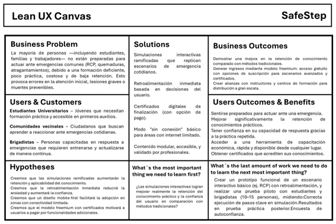
  <p>
    <i><b>Fuente</b>: Elaboración propia</i>
  </p>
</div>

<br>
<br>

<div align="center">
    
</div>

<br>
<br>

# 1.3. Segmentos objetivo

## 1.3.1. Estudiantes Universitarios

### Características demográficas

- **Edad**: 16–25 años.
- **Nivel educativo**: Estudiantes de universidad.
- **Ubicación**: Zonas urbanas, principalmente donde hay acceso a internet y tecnología digital.
- **Ingreso promedio**: Bajo a medio (capacidad limitada para pagar cursos presenciales costosos).
- **Tecnología**: Alta familiaridad con dispositivos móviles y plataformas digitales.

Este segmento está conformado por jóvenes que cursan estudios universitarios en diversas facultades, principalmente Ciencias, Ingenierías y Letras, en universidades peruanas. Según datos de la Universidad Ricardo Palma, el 43,2% tiene entre 18 y 20 años, mientras que el 56,8% supera los 20 años; el 51,4% son mujeres y el 48,6% hombres. La mayoría (79,1%) reside con sus padres, y el 86,3% recibe financiamiento familiar para sus estudios, aunque solo el 26,7% trabaja. Respecto a experiencias previas, solo el 29,6% ha tomado algún curso de primeros auxilios, aunque un 95,6% muestra interés en capacitarse en esta área. Este perfil evidencia un grupo de estudiantes motivados por adquirir habilidades prácticas, con disponibilidad para cursos complementarios y necesidad de herramientas educativas accesibles y de fácil uso.

### Comportamiento de compra en la tienda virtual

Los estudiantes universitarios constituyen uno de los segmentos con mayor potencial de conversión en la tienda virtual de SafeStep por múltiples razones que se derivan de su situación de vida particular y sus necesidades específicas. En primer lugar, muchos estudiantes universitarios viven fuera de casa por primera vez, ya sea en residencias estudiantiles, pisos compartidos o apartamientos pequeños, lo que significa que deben encargarse de su propia seguridad y la de sus compañeros de vivienda sin la red de apoyo familiar inmediata. Esta transición a la vida independiente genera una necesidad concreta de contar con un botiquín de primeros auxilios básico y funcional para el espacio que habitan.

En segundo lugar, el estilo de vida estudiantil implica actividades de alto riesgo relativo que incrementan la probabilidad de necesitar primeros auxilios: accidentes en fiestas universitaria donde el consumo de alcohol puede llevar a caídas, cortes o vómitos; practicas deportivas en gyms o canchas universitarias donde lesiones musculares o trauma son comunes; largas horas de estudio que pueden causar agotamiento, mareos o convulsiones por posiciones incorrectas; donde accidentes de tránsito o dolores pueden ocurrir con mayor frecuencia.

En tercer lugar, los estudiantes tienen una alta familiaridad con el comercio electrónico y realizan compras frecuentes en plataformas como Mercado Libre, Amazon y tiendas locales en línea. Ya están acostumbrados al proceso de compra digital y confían en este canal para adquirir productos de diversa naturaleza, lo que reduce la barrera de adopción para la tienda de SafeStep.

Los productos más relevantes para este segmento incluyen botiquines portátil compactos diseñados específicamente para contusiones o mochilas, con dimensiones reducidas que caben en cualquier backpack. Estos kits tienen un precio accesible (S/ 50-100) que se ajusta a presupuestos estudiantiles y incluyen lo básico: gasas, vendas, antiséptico, tijeras, guantes y cinta adhesiva médica.

También son relevantes los paquetes de venda elástica y compress para lesiones deportivas, gels冷却antes para traumatismos, y kits de alivio para quemaduras menores que son comunes en residency o lugares donde se cocina de manera básica. Los guantes descartables representan un producto de compras recurrentes dado su uso frecuente en limpiezas y actividades de laboratorio.

La propuesta de valor para estudiantes como compradores se basa en tres pilares: la conveniencia de comprar sin salir del campus o residence hall, la garantía de calidad de productos seleccionados por especialistas en primeros auxilios (no productos genéricos de pharmacy), y la integración con el aprendizaje que les da confianza sobre cuándo y cómo usar cada producto.

---

## 1.3.2. Comunidades vecinales

### Características demográficas

- **Edad**: 25–60 años.
- **Nivel educativo**: Desde educación secundaria hasta universitaria.
- **Ubicación**: Principalmente zonas urbanas y semi-urbanas, donde los servicios médicos no siempre están disponibles de inmediato.
- **Ingreso promedio**: Bajo a medio.
- **Composición familiar**: Padres, madres o cuidadores que buscan proteger a sus hijos y familiares.

Según el Gobierno Regional de La Libertad, el 70% de los peruanos no tiene conocimientos en primeros auxilios para actuar ante víctimas de accidentes de tránsito. La capacitación de la población en primeros auxilios es limitada, y muchas personas desconocen cómo actuar frente a accidentes, desde la correcta inmovilización de heridos hasta la utilización de sistemas de emergencia médica.

Las comunidades vecinales están Conformadas por familias completas que residen en urbanizaciones, residential buildings o barrios donde la vida comunitaria es activa y donde existe interacción frecuente entre vecinos. Este segmento incluye padres de familia de todas las edades, desde jóvenes parejas con niños pequeños hasta adultos mayores que viven con sus hijos adultos. La característica común es el sentido de responsabilidad hacia la familia y el deseo de tener un hogar seguro.

### Comportamiento de compra en la tienda virtual

Las comunidades vecinales representan el segmento con mayor potencial de ingresos para la tienda virtual de SafeStep debido al tamaño promedio de los hogares peruanos ya la diversidad de productos que pueden necesitar. Una familia típico con niños, adultos y posiblemente adultos mayores tiene necesidades de primeros auxilios muy diversas que pueden atenderse desde una sola plataforma.

Para las familias con niños pequeños, los riesgos más comunes incluyen caídas durante el juego, cortaduras con juguetes o objetos cortantes, quemaduras por contacto con superficies calientes o líquidos hirviendo, atragantamientos con piezas pequeñas de juguetes o alimentos, y reacciones alérgicas a picaduras de insectos o Certain alimentos. Cada uno de estos escenarios requiere productos específicos que los padres quieren tener disponibles de manera preventiva.

Para las familias con adultos mayores, los productos necesarios incluyen-botiquines especializados para movilidad reducida, suplementos para personas mayores, equipos de detección temprana de emergencias cardíaca, y MATERIALES para caídas que son comunes en esta edad. La preocupación de los hijos adultos por la seguridad de sus padres se traduce en disposición a invertir en productos de calidad.

La propuesta de valor para familias como compradores es particularmente fuerte porque SafeStep no solo ofrece productos aislados, sino un ecosistema completo: primero aprenden los procedimientos para cada tipo de emergencia, luego reciben recomendaciones específicas de los productos que deben tener, y finalmente pueden adquirirlos sin necesidad de investigar qué producto específico necesitan entre cientos de opciones en una pharmacy.

Los productos más relevantes para este segmento incluyen botiquines domésticos completos de nivel intermedio (100-200 S/) que contienen todo lo necesario para las emergencias más comunes en el hogar: vendas de diferentes tamaños, gasas estériles, solución antiséptica, crema para quemaduras, suero fisiológico, termómetro digital, tensiómetro básico, y guía visual de primeros auxilios.

También son muy relevantes los kits especializados por tipo de emergencia: kit para quemaduras (gel específico, gasas no adherentes, vendas especializadas), kit para fracturas (férulas inflables), vendas de yeso, kit para RCP (máscara de barrera, guantes, toallas desinfectantes), y kit para emergencias alérgicas (antihistamínicos básicos, autoinyector de epinefrina para familias con miembros alérgicos).

Las familias también valoran los productos de prevención: detectores de humo, extintores portátiles, linternas de emergencia, y botiquines para el vehículo. La oportunidad de adquirir todo este ecosistema desde una sola plataforma con la garantía de que los productos están curados por especialistas representa una propuesta de valor diferenciada significativa.

El modelo de compra para este segmento puede ser tanto compras único (botiquín completo) como suscripción (reposición automática de productos que se agotan o caducan). La opción de suscripción genera ingresos recurrentes predecibles y facilita la prevención, algo que muchas familias negligentes por falta de tiempo para revisar sus botiquines regularmente.

---

## 1.3.3. Brigadistas

### Características demográficas

- **Edad**: 22–55 años.
- **Nivel educativo**: Profesionales con educación universitaria o técnica en salud, educación o brigadismo.
- **Ubicación**: Zonas urbanas y semi-urbanas, donde se requiere entrenamiento frecuente en primeros auxilios.
- **Experiencia**: Profesionales con exposición a situaciones de emergencia o formación en prevención de riesgos.
- **Tecnología**: Conocimiento básico de plataformas digitales; buscan métodos prácticos de capacitación continua.

Según la preparación de brigadas de emergencia, los brigadistas deben tener entre 18 y 40 años y haber recibido capacitación teórica y práctica en primeros auxilios y gestión de emergencias.

El Ministerio de Salud del Perú informa que los brigadistas de primera respuesta en salud participan en programas de formación estandarizados a nivel nacional, que incluyen conocimientos teóricos y prácticos sobre gestión de riesgos, atención sanitaria básica, primeros auxilios y transporte asistido de víctimas. Estos programas aseguran que más de 4000 brigadistas estén preparados para actuar de manera adecuada y oportuna ante emergencias y desastres, motivados por valores de solidaridad y compromiso con la comunidad.

Los brigadistas son profesionales o voluntarios que forman parte de equipos de emergencia en empresas, universidades, municipalidades u organizaciones comunitaria. Su rol les requiere estar preparados para responder ante emergencias de mayor complejidad que una emergencia doméstica, lo que implica necesidades de equipamiento profesional.

### Comportamiento de compra en la tienda virtual

Los brigadistas constituyen el segmento con el ticket promedio de compra más alto y el potencial de compra recurrente más significativo. Este segmento ya tiene formación en primeros auxilios y understands la importancia crítica de contar con equipamiento de calidad, lo que los hace particularmente receptivos a productos especializados que van más allá del botiquín básico.

La propuesta de valor para brigadistas se basa en la especialización: mientras que las tiendas generales ofrecen productos de nivel consumidor, SafeStep ofrece productos de nivel semi-profesional seleccionados específicamente para las técnicas que los brigadistas aprenden en la plataforma. Esto incluye dispositivos de RCP profesionales (no las máscaras básicas), kits de inmovilización completos, vendas de grado médico, y equipos de tracción.

Los brigadistas de empresa representan un caso de compra corporativa donde SafeStep puede ofrecer precios competitivos por volumen, órdenes de compra con facturación directa, y programas de capacitación para todos los brigadistas de una organización con descuentos group.

Además de la compra individual, los brigadistas pueden actuar como embajadores en sus organizaciones, generando ventas institucionales significativas. Un solo brigadista que recomienda SafeStep a su empresa puede generar compras de docenas de botiquines profesionales para el workplace.

Los productos más relevantes para este segmento incluyen kits de respuesta rápida profesionales que se carry en la cintura o en mochilas de emergencia, con organización modular que permite acceder rápidamente al producto necesario según el tipo de emergencia. Estos kits tienen precios de S/ 200-500 e incluyen equipos de nivel superior.

También son relevantes los equipos de evaluación inicial (estetoscopios básicos, tensiómetros digitales de grado profesional, pulsiometro), equipos de inmovilización (férulas de aluminio, collars cervicales, camillas de emergencia), y equipos de protección personal (mascarillas N95, protectores oculares, guantes de nivel profesional).

La reposición de productos es frecuente en este segmento debido al alto uso: vendas, gasas y guantes se agotan rápidamente con la práctica, y los productos tienen fecha de vencimiento que requiere renovación periódica. Esto genera un modelo de suscripción natural para brigadistas.

---

## 1.3.4. Resumen del potencial de compra por segmento

| Segmento | Potencial de compra | Productos clave | Frecuencia de compra |
|----------|---------------------|------------------|---------------------|
| Estudiantes | Bajo-medio (S/ 50-200) | Botiquín portátil, vendas, guantes | Mensual-trimestral |
| Comunidades vecinales | Medio-alto (S/ 100-500) | Botiquín doméstico, kits especializados | Trimestral-semestral |
| Brigadistas | Alto (S/ 200-1000+) | Equipos profesionales, kits de respuesta | Mensual (suscripción) |

La integración de la tienda virtual con la plataforma de aprendizaje crea una propuesta de valor única donde cada segmento puede aprender los procedimientos correctos y simultáneamente adquirir los productos necesarios para aplicarlos, generando una experiencia completa de preparación ante emergencias.

<br>
<br>

<div align="center">
    
</div>

<br>
<br>

# 2.1. Competidores

1. **Cruz Roja Digital (Cursos Online)**

- Ofrece programas de capacitación virtual con certificación oficial en primeros auxilios. Incluye material en video, manuales PDF y evaluaciones finales. Sin embargo, sus cursos tienen horarios establecidos y suelen ser de pago, lo que limita su disponibilidad masiva.

2. **First Aid by British Red Cross (App)**

- Aplicación móvil en inglés que enseña procedimientos de primeros auxilios mediante texto, imágenes y videos cortos. Está diseñada como guía de bolsillo, pero carece de simulaciones interactivas o retroalimentación dinámica.

3. **Primeros Auxilios – IFRC (App)**

- App oficial de la Federación Internacional de Sociedades de la Cruz Roja y de la Media Luna Roja. Brinda información paso a paso para distintas emergencias y cuenta con recursos multimedia. Sin embargo, el aprendizaje es pasivo y no entrena la toma de decisiones en tiempo real.

4. **Cursos en Plataformas MOOC (Coursera, Udemy, EdX)**

- Brindan formación teórica en primeros auxilios con módulos pregrabados y certificados opcionales. Son útiles como complemento, pero no ofrecen interacción práctica ni simulaciones.

## 2.1.1. Análisis competitivo

<table>
    <tr>
        <td colspan="6" align="center">
            <b>Competitive Analysis Landscape</b>
        </td>
    </tr>
    <tr>
        <td colspan="2" align="center">
            ¿Porqué llevar a cabo este análisis?
        </td>
        <td colspan="4">
        El objetivo de este análisis es identificar las fortalezas, debilidades, oportunidades y amenazas del entorno competitivo en el sector de capacitación en primeros auxilios digital, con el fin de definir la ventaja competitiva de SafeStep frente a las alternativas existentes y orientar las estrategias de diferenciación e innovación.</td>
    </tr>
    <tr>
        <td colspan="2" align="center">
            <b>Competidores</b>
        </td>
        <td align="center">
            <p><b>SafeStep</b></p>
            
        </td>
        <td align="center">
            <p><b>Cruz Roja Digital</b></p>
            
        </td>
        <td align="center">
            <p><b>First Aid</b></p>
            
        </td>
        <td align="center">
            <p><b>IFRC</b></p>
            
        </td>
    </tr>
    <tr>
        <td rowspan="2" align="center">
            <b>Perfil</b>
        </td>
        <td align="center">
            <b>Overview</b>
        </td>
        <td align="center">
            <p>
                Plataforma web y móvil que enseña primeros auxilios mediante simulaciones interactivas ramificadas y retroalimentación inmediata, disponible 24/7.
            </p>
        </td>
        <td align="center">
            <p>
                Plataforma de cursos virtuales y presenciales con certificación oficial. Acceso limitado y de pago.
            </p>
        </td>
        <td align="center">
            <p>
                Aplicación móvil en inglés con guías y videos educativos de primeros auxilios.
            </p>
        </td>
        <td align="center">
            <p>
                Aplicación móvil en inglés con guías y videos educativos de primeros auxilios.
            </p>
        </td>
    </tr>
    <tr>
        <td align="center">
            <b>Ventaja competitiva ¿Qué valor ofrece a los clientes?</b>
        </td>
        <td align="center">
            <p>
                Entrenamiento práctico, accesible y gamificado, con enfoque en toma de decisiones en tiempo real y certificación digital.
            </p>
        </td>
        <td align="center">
            <p>
                Certificación oficial reconocida internacionalmente.
            </p>
        </td>
        <td align="center">
            <p>
                Contenido confiable y sencillo, validado por expertos.
            </p>
        </td>
        <td align="center">
            <p>
                Alcance global, gratuito y contenido validado por la Cruz Roja.
            </p>
        </td>
    </tr>
    <tr>
        <td rowspan="2" align="center">
            <b>Perfil de Marketing</b>
        </td>
        <td align="center">
            <b>Mercado objetivo</b>
        </td>
        <td align="center">
            <p>
                Estudiantes, comunidades vecinales y brigadistas que buscan aprender de manera práctica y flexible.
            </p>
        </td>
        <td align="center">
            <p>
                Profesionales y empresas que requieren certificaciones formales.
            </p>
        </td>
        <td align="center">
            <p>
                Público general de habla inglesa.
            </p>
        </td>
        <td align="center">
            <p>
                Público global que busca información básica de emergencia.
            </p>
        </td>
    </tr>
    <tr>
        <td align="center">
            <b>Estrategias de marketing</b>
        </td>
        <td align="center">
            <p>
                Estrategia freemium, gamificación, alianzas con universidades y campañas en redes sociales enfocadas en prevención y educación.
            </p>
        </td>
        <td align="center">
            <p>
                Promoción institucional y convenios con organismos oficiales.
            </p>
        </td>
        <td align="center">
            <p>
                Posicionamiento en tiendas de apps y uso de la reputación de la Cruz Roja.
            </p>
        </td>
        <td align="center">
            <p>
                Difusión a través de la red internacional de la Cruz Roja.
            </p>
        </td>
    </tr>
    <tr>
        <td rowspan="3" align="center">
            <b>Perfil de Producto</b>
        </td>
        <td align="center">
            <b>Productos & Servicios</b>
        </td>
        <td align="center">
            <p>
                Simulaciones interactivas, microlecciones, módulos comunitarios, certificados digitales y estadísticas de desempeño.
            </p>
        </td>
        <td align="center">
            <p>
                Cursos virtuales y presenciales con exámenes y certificaciones.
            </p>
        </td>
        <td align="center">
            <p>
                Guías y videos cortos educativos.
            </p>
        </td>
        <td align="center">
            <p>
                Guías paso a paso, videos y listas de chequeo.
            </p>
        </td>
    </tr>
    <tr>
        <td align="center">
            <b>Precios & costos</b>
        </td>
        <td align="center">
            <p>
                Modelo freemium: acceso básico gratuito y plan premium (S/100 – S/150).
            </p>
        </td>
        <td align="center">
            <p>
                Pago por curso (medio a alto).
            </p>
        </td>
        <td align="center">
            <p>
                Gratuito.
            </p>
        </td>
        <td align="center">
            <p>
                Gratuito.
            </p>
        </td>
    </tr>
    <tr>
        <td align="center">
            <b>Canales y distribución (Web y/o móvil)</b>
        </td>
        <td align="center">
            <p>
                Web responsive y app móvil (Android/iOS).
            </p>
        </td>
        <td align="center">
            <p>
                Web y sesiones presenciales.
            </p>
        </td>
        <td align="center">
            <p>
                App móvil (Android/iOS).
            </p>
        </td>
        <td align="center">
            <p>
                App móvil (Android/iOS).
            </p>
        </td>
    </tr>
    <tr>
        <td rowspan="4" align="center">
            <b>Análisis SWOT</b>
        </td>
        <td align="center">
            <b>Fortalezas</b>
        </td>
        <td align="center">
            <p>
                Simulaciones interactivas y ramificadas; gamificación; feedback inmediato; accesibilidad multiplataforma; modelo freemium.
            </p>
        </td>
        <td align="center">
            <p>
                Certificación oficial; respaldo institucional; contenido validado.
            </p>
        </td>
        <td align="center">
            <p>
                Interfaz simple; alta confiabilidad; posicionamiento sólido.
            </p>
        </td>
        <td align="center">
            <p>
                Acceso gratuito; respaldo global; contenidos validados.
            </p>
        </td>
    </tr>
    <tr>
        <td align="center">
            <b>Debilidades</b>
        </td>
        <td align="center">
            <p>
                Falta de certificación oficial internacional; dependencia de conexión a internet; necesidad de actualización constante.
            </p>
        </td>
        <td align="center">
            <p>
                Alto costo de cursos; poca flexibilidad digital.
            </p>
        </td>
        <td align="center">
            <p>
                En inglés; aprendizaje pasivo sin práctica.
            </p>
        </td>
        <td align="center">
            <p>
                Sin interactividad ni evaluación; enfoque informativo.
            </p>
        </td>
    </tr>
    <tr>
        <td align="center">
            <b>Oportunidades</b>
        </td>
        <td align="center">
            <p>
                Creciente interés en e-learning y capacitación preventiva; alianzas con ONGs y universidades; expansión en Latinoamérica.
            </p>
        </td>
        <td align="center">
            <p>
                Integrar simuladores y experiencias interactivas.
            </p>
        </td>
        <td align="center">
            <p>
                Ampliar idiomas y contenido práctico.
            </p>
        </td>
        <td align="center">
            <p>
                Asociarse con startups tecnológicas para modernizar su experiencia.
            </p>
        </td>
    </tr>
    <tr>
        <td align="center">
            <b>Amenazas</b>
        </td>
        <td align="center">
            <p>
                Competidores con mayor financiamiento; desconfianza inicial hacia métodos digitales; saturación de apps educativas.
            </p>
        </td>
        <td align="center">
            <p>
                Aparición de plataformas más ágiles como SafeStep.
            </p>
        </td>
        <td align="center">
            <p>
                Pérdida de relevancia frente a apps gamificadas.
            </p>
        </td>
        <td align="center">
            <p>
                Pérdida de interés por falta de innovación.
            </p>
        </td>
    </tr>
</table>

## 2.1.2. Estrategias y tácticas frente a competidores

<table>
    <tr>
        <td align="center">
        <b>Estrategia / Táctica</b>
        </td>
        <td align="center">
        <b>Descripción</b>
        </td>
    </tr>
    <tr>
        <td align="center">
        <b>Innovación en UX</b>
        </td>
        <td>
        <p>Crear simulaciones ramificadas con decisiones en tiempo real y visuales, ofreciendo una experiencia de usuario única.</p>
        </td>
    </tr>
    <tr>
        <td align="center">
        <b>Modelo freemium</b>
        </td>
        <td>
        <p>Ofrecer escenarios básicos gratis para atraer usuarios y planes premium con certificaciones y reportes para monetización.</p>
        </td>
    </tr>
    <tr>
        <td align="center">
        <b>Gamificación</b>
        </td>
        <td>
        <p>Integrar puntos, logros y niveles que motiven la práctica constante y el aprendizaje progresivo.</p>
        </td>
    </tr>
    <tr>
        <td align="center">
        <b>Alianzas estratégicas</b>
        </td>
        <td>
        <p>Colaborar con universidades, colegios, empresas y ONGs para integrar SafeStep en programas de capacitación y RSE.</p>
        </td>
    </tr>
    <tr>
        <td align="center">
        <b>Marketing segmentado</b>
        </td>
        <td>
        <p>Diseñar campañas digitales para redes sociales, enfocadas en familias, jóvenes y empresas, destacando el impacto social y el bajo costo.</p>
        </td>
    </tr>
    <tr>
        <td align="center">
        <b>Actualización continua</b>
        </td>
        <td>
        <p>Mantener la plataforma actualizada con nuevos escenarios y contenido validado por profesionales de salud.</p>
        </td>
    </tr>
</table>

<br>
<br>

<div align="center">
    
</div>

<br>
<br>

# 2.2. Entrevistas

## 2.2.1. Diseño de entrevistas

### Guía de preguntas para Estudiantes.

1. ¿Cuál es tu nombre y cuántos años tienes?
2. ¿Dónde vives y a qué te dedicas?
3. ¿Has recibido alguna capacitación en primeros auxilios dentro de tu Universidad? ¿Cómo fue esa experiencia?
4. ¿Qué tan preparado te sientes actualmente para actuar en una emergencia dentro o fuera del campus?
5. ¿Qué tan importante consideras que es que un estudiante tenga conocimientos de primeros auxilios?
6. ¿Qué tipo de emergencias te preocupan más dentro de tu entorno estudiantil (ej. desmayos, accidentes en laboratorios, deportes)?
7. ¿Qué dispositivos usas más para estudiar (celular, laptop, tablet)?
8. ¿Qué aplicaciones o plataformas usas para capacitarte o estudiar en línea?
9. ¿Qué elemento te generaría más confianza para usar esta aplicación: certificación, facilidad de uso, o calidad de la simulación?
10. ¿Prefieres aprender de manera individual, en grupo o mediante simulaciones interactivas? ¿Por qué?
11. ¿Cómo imaginas que una app o web de simulaciones podría ayudarte a aprender mejor primeros auxilios?
12. Si tuvieras esta app, ¿la recomendarías a tus compañeros? ¿Qué parte crees que les llamaría más la atención?
13. ¿Cuánto estarías dispuesto a pagar por un curso virtual con simulaciones interactivas (rango en soles)?

### Guía de preguntas para comunidades vecinales.

1. ¿Cuál es tu edad, nombre y cuántos años tienes?
2. ¿Dónde vives y a qué te dedicas?
3. ¿Has recibido alguna vez una capacitación en primeros auxilios por parte de tu comunidad, municipalidad o Defensa Civil?
4. ¿Qué tan preparado crees que está tu vecindario frente a una emergencia como incendios, sismos o accidentes domésticos?
5. ¿Qué tipo de emergencias son más frecuentes en tu comunidad?
6. ¿Tienes algún rol en la organización vecinal (ej. dirigente, voluntario, participante en actividades de seguridad)?
7. ¿Usas con frecuencia un smartphone o computadora? ¿Qué tipo de aplicaciones sueles usar más?
8. ¿Qué limitaciones o barreras crees que tendrías para capacitarte en primeros auxilios (tiempo, costo, falta de información, tecnología)?
9. ¿Te interesa más aprender individualmente o en talleres grupales con tus vecinos? ¿Por qué?
10. ¿Crees que tu comunidad estaría dispuesta a pagar una suscripción o licencia para tener acceso a este tipo de capacitaciones?
11. ¿Qué tan cómodo te sentirías usando una aplicación de simulaciones de primeros auxilios en tu celular?
12. ¿Qué esperas de una capacitación digital en primeros auxilios para tu comunidad?
13. ¿Qué te motivaría más a recomendar esta aplicación a otros vecinos?
14. ¿Cómo crees que esta aplicación podría fortalecer la unión y preparación de tu comunidad frente a emergencias?

### Guía de preguntas para brigadistas.

1. ¿Podría indicarme su nombre completo, edad y lugar de procedencia?
2. ¿Cuál es su ocupación actual y en qué tipo de institución se desempeña como brigadista?
3. ¿Qué nivel de formación en primeros auxilios posee hasta el momento?
4. ¿Con qué frecuencia recibe capacitaciones o actualizaciones en primeros auxilios?
5. Según su experiencia, ¿qué tan efectivas han sido las capacitaciones presenciales que ha recibido?
6. ¿Qué tipo de emergencias atiende con mayor frecuencia en su institución?
7. ¿Suele utilizar aplicaciones móviles o plataformas web para reforzar sus conocimientos en primeros auxilios?
8. ¿Qué tan útil considera que sería una aplicación con simulaciones para mejorar sus habilidades como brigadista?
9. Desde su experiencia, ¿qué limitaciones identifica en las capacitaciones actuales (por ejemplo, costos, tiempo, logística, escasa práctica realista)?
10. ¿Qué funcionalidades le gustaría que incluya una aplicación digital de primeros auxilios (por ejemplo, escenarios realistas, certificaciones, evaluaciones, ranking)?
11. ¿Prefiere realizar simulaciones prácticas en grupo o de manera individual? ¿Por qué?
12. ¿Qué importancia tendría para usted que la aplicación ofrezca certificaciones válidas reconocidas por su institución?
13. ¿Estaría dispuesto a pagar personalmente o recomendar a su institución que invierta en una licencia para este servicio?
14. ¿Qué rango de precios consideraría razonable para este tipo de capacitación digital?
15. ¿Qué institución o respaldo considera fundamental para confiar en una aplicación de primeros auxilios (por ejemplo, Ministerio de Salud, Cruz Roja, Defensa Civil)?

## 2.2.2. Registro de entrevistas

A continuación, se muestra la transcripción, evidencia y resumen de cada entrevista realizada a estudiantes universitarios.

<table align="center">
    <tr>
        <td colspan="2" align="center">
            <b>Entrevista N° 1</b>
        </td>
    </tr>
    <tr>
        <td width="30%" align="center">
            
        </td>
        <td width="70%">
            <b>Entrevistado</b>: Nataly Aguilar Ortiz <br/>
            <b>Entrevistador</b>: Jorge Brayan Ayala Fernandez <br/>
            <b>Duración</b>:  00:04:15 <br/>
            <b>Género</b>: Femenino <br/>
            <b>Edad</b>: 23 años <br/>
            <b>Segmento</b>: Estudiante <br/>
            <b>Lugar de Residencia</b>: Callao <br/>
        </td>
    </tr>
    <tr>
        <td colspan="2" align="center">
            Link de la entrevista: <a href="https://youtu.be/DEq_rtuM_Ng" style="word-break: break-all; overflow-wrap: anywhere;">https://youtu.be/DEq_rtuM_Ng</a>
        </td>
    </tr>
    <tr>
        <td colspan="2" align="center">
            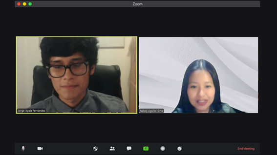
        </td>
    </tr>
    <tr>
        <td colspan="2" align="center">
            <b>Transcripción:</b>
        </td>
    </tr>
    <tr>
        <td colspan="2">
            <b>¿Cuál es tu nombre y cuántos años tienes?</b> <br/>
            Mi nombre es Nataly Aguilar y tengo 23 años<br/>
            <br/>
            <b>¿Dónde vives  y a qué te dedicas?</b> <br/>
            Vivo en el Callao y soy estudiante de Psicología.<br/>
            <br/>
            <b>¿Has recibido alguna capacitación en primeros auxilios dentro de tu Universidad? ¿Cómo fue esa experiencia?</b> <br/>
            Si he recibido una capacitación, fue muy enriquecedora porque enseñaron primeros auxilios, y cómo actuar ante una emergencia en nuestra casa o institución educativa.<br/>
            <br/>
            <b>¿Qué tan preparado te sientes actualmente para actuar en una emergencia dentro o fuera del campus?</b> <br/>
            En realidad creo que nunca estamos 100% preparados, por eso debemos estar constantemente capacitándolos o averiguando algunas cosas para poder estar a la vanguardia.<br/>
            <br/>
            <b>¿Qué tan importante consideras que es que un estudiante tenga conocimientos de primeros auxilios?</b> <br/>
            Yo creo que es muy importante, no solo para los estudiantes, sino también para todas las personas en general, debemos saber primeros auxilios ya que es esencial.<br/>
            <br/>
            <b>¿Qué tipo de emergencias te preocupan más dentro de tu entorno estudiantil (ej. desmayos, accidentes en laboratorios, deportes)?</b> <br/>
            Yo creo que los accidentes que ocurren en los laboratorios, nosotros como estudiantes debemos saber cómo actuar ante una emergencia y poder brindar los primeros auxilios a nuestros compañeros o maestros.<br/>
            <br/>
            <b>¿Qué dispositivos usas más para estudiar (celular, laptop, tablet)?</b> <br/>
            Uso una laptop.<br/>
            <br/>
            <b>¿Qué aplicaciones o plataformas usas para capacitarte o estudiar en línea?</b> <br/>
            Uso zoom, meet y teams.<br/>
            <br/>
            <b>¿Qué elemento te generaría más confianza para usar esta aplicación: certificación, facilidad de uso, o calidad de la simulación?</b> <br/>
            Yo creo que tenga certificación y que sea de fácil uso.<br/>
            <br/>
            <b>¿Prefieres aprender de manera individual, en grupo o mediante simulaciones interactivas? ¿Por qué?</b> <br/>
            Yo prefiero aprender de manera grupal ya que así podemos compartir algunas experiencias, ya que algunos compañeros pueden saber más del tema y podemos intercambiar opiniones.<br/>
            <br/>
            <b>¿Cómo imaginas que una app o web de simulaciones podría ayudarte a aprender mejor primeros auxilios?</b> <br/>
            Que sea de fácil uso e interactiva para que podamos participar.<br/>
            <br/>
            <b>Si tuvieras esta app, ¿la recomendarías a tus compañeros? ¿Qué parte crees que les llamaría más la atención?</b> <br/>
            Claro que sí la recomendaría, yo creo que llamaría más la atención que sea de fácil uso para que cualquier persona pueda utilizar y puedan dar sus opiniones, compartir experiencias y  opiniones.<br/>
            <br/>
            <b>¿Cuánto estarías dispuesto a pagar por un curso virtual con simulaciones interactivas (rango en soles)?</b> <br/>
            Yo creo que sí es un curso que es bueno, puedo pagar entre 100 y 150 soles.<br/>
        </td>
    </tr>
</table>

<table align="center">
    <tr>
        <td colspan="2" align="center">
            <b>Entrevista N° 2</b>
        </td>
    </tr>
    <tr>
        <td width="30%" align="center">
            
        </td>
        <td width="70%">
            <b>Entrevistado</b>: Maria Elena Gamboa Azabache <br/>
            <b>Entrevistador</b>: Jorge Brayan Ayala Fernandez <br/>
            <b>Duración</b>:  00:04:00 <br/>
            <b>Género</b>: Femenino <br/>
            <b>Edad</b>: 21 años <br/>
            <b>Segmento</b>: Estudiante <br/>
            <b>Lugar de Residencia</b>: Comas <br/>
        </td>
    </tr>
    <tr>
        <td colspan="2" align="center">
            Link de la entrevista: <a href="https://www.youtube.com/watch?v=5td3gHjUBVw" style="word-break: break-all; overflow-wrap: anywhere;">https://www.youtube.com/watch?v=5td3gHjUBVw</a>
        </td>
    </tr>
    <tr>
        <td colspan="2" align="center">
            
        </td>
    </tr>
    <tr>
        <td colspan="2" align="center">
            <b>Transcripción:</b>
        </td>
    </tr>
    <tr>
        <td colspan="2">
            <b>¿Cuál es tu nombre y cuántos años tienes?</b> <br/>
            Mi nombre es Mari Elena y tengo 21 años<br/>
            <br/>
            <b>¿Dónde vives  y a qué te dedicas?</b> <br/>
            Vivo en Comas y soy estudiante de la universidad<br/>
            <br/>
            <b>¿Has recibido alguna capacitación en primeros auxilios dentro de tu Universidad? ¿Cómo fue esa experiencia?</b> <br/>
            No he recibido capacitación en la universidad, solo algo básico antes, pero muy breve.<br/>
            <br/>
            <b>¿Qué tan preparado te sientes actualmente para actuar en una emergencia dentro o fuera del campus?</b> <br/>
            Me siento algo preparada pero me faltaría un poco de práctica y seguridad.<br/>
            <br/>
            <b>¿Qué tan importante consideras que es que un estudiante tenga conocimientos de primeros auxilios?</b> <br/>
            Sería muy importante porque cualquiera podría enfrentar una emergencia y poder ayudar a sus compañeros dependiendo de qué caso sea.<br/>
            <br/>
            <b>¿Qué tipo de emergencias te preocupan más dentro de tu entorno estudiantil (ej. desmayos, accidentes en laboratorios, deportes)?</b> <br/>
            Creo que serían todos, en especial los accidentes en laboratorios, porque en los trabajos grupales que hacen hay aparatos que son a prueba y pueden lastimar a algunos estudiantes.<br/>
            <br/>
            <b>¿Qué dispositivos usas más para estudiar (celular, laptop, tablet)?</b> <br/>
            Uso mi laptop y mi celular.<br/>
            <br/>
            <b>¿Qué aplicaciones o plataformas usas para capacitarte o estudiar en línea?</b> <br/>
            Entro mediante el aula virtual, también uso el Classroom y el Meet.<br/>
            <br/>
            <b>¿Qué elemento te generaría más confianza para usar esta aplicación: certificación, facilidad de uso, o calidad de la simulación?</b> <br/>
            Creo que sería la calidad de la simulación, porque me hace sentir que practico en una situación real y la certificación porque respalda lo aprendido.<br/>
            <br/>
            <b>¿Prefieres aprender de manera individual, en grupo o mediante simulaciones interactivas? ¿Por qué?</b> <br/>
            Sería con simulaciones, porque se aprende practicando mediante los tutoriales, videos.<br/>
            <br/>
            <b>¿Cómo imaginas que una app o web de simulaciones podría ayudarte a aprender mejor primeros auxilios?</b> <br/>
            Mostrándome casos prácticos y vídeos cortos, de acuerdo a eso ya podría llover y aprender.<br/>
            <br/>
            <b>Si tuvieras esta app, ¿la recomendarías a tus compañeros? ¿Qué parte crees que les llamaría más la atención?</b> <br/>
            Sí la recomendaría, creo que le llamaría más la atención acerca de las simulaciones.<br/>
            <br/>
            <b>¿Cuánto estarías dispuesto a pagar por un curso virtual con simulaciones interactivas (rango en soles)?</b> <br/>
            Primero  comprobaría en una prueba gratuita cómo es el desarrollo de esa app, de acuerdo a eso, le pondría un costo.<br/>
        </td>
    </tr>
</table>

<table align="center">
    <tr>
        <td colspan="2" align="center">
            <b>Entrevista N° 3</b>
        </td>
    </tr>
    <tr>
        <td width="30%" align="center">
            
        </td>
        <td width="70%">
            <b>Entrevistado</b>: Luciana Celeste, Sanchez Silva <br/>
            <b>Entrevistador</b>: Josep Eliu, Melgarejo Quiroz <br/>
            <b>Duración</b>:  00:06:03 <br/>
            <b>Género</b>: Femenino <br/>
            <b>Edad</b>: 20 años <br/>
            <b>Segmento</b>: Estudiante <br/>
            <b>Lugar de Residencia</b>: San Miguel <br/>
        </td>
    </tr>
    <tr>
        <td colspan="2" align="center">
            Link de la entrevista: <a href="https://youtu.be/N1L3TChMK6w" style="word-break: break-all; overflow-wrap: anywhere;">https://youtu.be/N1L3TChMK6w</a>
        </td>
    </tr>
    <tr>
        <td colspan="2" align="center">
            
        </td>
    </tr>
    <tr>
        <td colspan="2" align="center">
            <b>Transcripción:</b>
        </td>
    </tr>
    <tr>
        <td colspan="2">
            <b>¿Cuál es tu nombre y cuántos años tienes?</b> <br/>
            Mi nombre es Luciana Sanchez y tengo 20 años.<br/>
            <br/>
            <b>¿Dónde vives  y a qué te dedicas?</b> <br/>
            Vivo en San Miguel y soy estudiante de ingeniería de software.<br/>
            <br/>
            <b>¿Has recibido alguna capacitación en primeros auxilios dentro de tu Universidad? ¿Cómo fue esa experiencia?</b> <br/>
            No recibí ninguna capacitación, pero si se de la existencia de ello.<br/>
            <br/>
            <b>¿Qué tan preparado te sientes actualmente para actuar en una emergencia dentro o fuera del campus?</b> <br/>
            Me siento poco preparada debido a que no tiene mucho conocimiento en el tema.<br/>
            <br/>
            <b>¿Qué tan importante consideras que es que un estudiante tenga conocimientos de primeros auxilios?</b> <br/>
            Lo considero muy importante.<br/>
            <br/>
            <b>¿Qué tipo de emergencias te preocupan más dentro de tu entorno estudiantil (ej. desmayos, accidentes en laboratorios, deportes)?</b> <br/>
            Me preocupan mas cuando ocurre un atoramiento mientra una persona come.<br/>
            <br/>
            <b>¿Qué dispositivos usas más para estudiar (celular, laptop, tablet)?</b> <br/>
            Uso más mi laptop y tablet.<br/>
            <br/>
            <b>¿Qué aplicaciones o plataformas usas para capacitarte o estudiar en línea?</b> <br/>
            Uso en general el coursera y blackboard.<br/>
            <br/>
            <b>¿Qué elemento te generaría más confianza para usar esta aplicación: certificación, facilidad de uso, o calidad de la simulación?</b> <br/>
            Lo que me genera más confianza sería la calidad de la simulación y la certificación.<br/>
            <br/>
            <b>¿Prefieres aprender de manera individual, en grupo o mediante simulaciones interactivas? ¿Por qué?</b> <br/>
            Todas me parecen bien, porque en todas se fomenta los primeros auxilios y me siento cómoda en todos los casos.<br/>
            <br/>
            <b>¿Cómo imaginas que una app o web de simulaciones podría ayudarte a aprender mejor primeros auxilios?</b> <br/>
            Si, ayudaría mucho, ya que lo podría usar en todos lados, como cuando voy a la universidad o cuando no tengo nada que haces.<br/>
            <br/>
            <b>Si tuvieras esta app, ¿la recomendarías a tus compañeros? ¿Qué parte crees que les llamaría más la atención?</b> <br/>
            Si, claro que lo recomendaría, y lo que más destacaría sería las simulaciones interactivas.<br/>
            <br/>
            <b>¿Cuánto estarías dispuesto a pagar por un curso virtual con simulaciones interactivas (rango en soles)?</b> <br/>
            No estaría dispuesta a pagar más de 18 soles.<br/>
        </td>
    </tr>
</table>

<table align="center">
    <tr>
        <td colspan="2" align="center">
            <b>Entrevista N° 4</b>
        </td>
    </tr>
    <tr>
        <td width="30%" align="center">
            
        </td>
        <td width="70%">
            <b>Entrevistado</b>: Alessandro Daniel, Bravo Castillo <br/>
            <b>Entrevistador</b>: Rodrigo Jesus, Miraval Pomalaya <br/>
            <b>Duración</b>:  00:04:20 <br/>
            <b>Género</b>: Masculino <br/>
            <b>Edad</b>: 20 años <br/>
            <b>Segmento</b>: Estudiante <br/>
            <b>Lugar de Residencia</b>: San martin de Porres <br/>
        </td>
    </tr>
    <tr>
        <td colspan="2" align="center">
            Link de la entrevista: <a href="https://youtu.be/qjcDbt8-Obk" style="word-break: break-all; overflow-wrap: anywhere;">https://youtu.be/qjcDbt8-Obk</a>
        </td>
    </tr>
    <tr>
        <td colspan="2" align="center">
            
        </td>
    </tr>
    <tr>
        <td colspan="2" align="center">
            <b>Transcripción:</b>
        </td>
    </tr>
    <tr>
        <td colspan="2">
            <b>¿Cuál es tu nombre y cuántos años tienes?</b> <br/>
            Mi nombre es Alessandro Daniel Bravo Castillo y tengo 20 años.<br/>
            <br/>
            <b>¿Dónde vives  y a qué te dedicas?</b> <br/>
            Vivo en San martin de Porres y actualmente soy estudiante de Ciencias de la computacion en la UPC.<br/>
            <br/>
            <b>¿Has recibido alguna capacitación en primeros auxilios dentro de tu Universidad? ¿Cómo fue esa experiencia?</b> <br/>
            Hasta ahora no he recibido una capacitación formal dentro de la universidad, aunque sí he tenido algunas charlas informativas. Me parecieron útiles, pero siento que fueron muy generales y que me gustaría tener algo más práctico y realista.<br/>
            <br/>
            <b>¿Qué tan preparado te sientes actualmente para actuar en una emergencia dentro o fuera del campus?</b> <br/>
            Me siento medianamente preparado. Conozco lo básico, pero creo que en una situación real podría ponerme nervioso y no saber exactamente qué hacer.<br/>
            <br/>
            <b>¿Qué tan importante consideras que es que un estudiante tenga conocimientos de primeros auxilios?</b> <br/>
            Lo considero muy importante. Nunca sabemos cuándo puede ocurrir un accidente o una emergencia, y tener esos conocimientos puede marcar la diferencia entre ayudar realmente o no saber cómo reaccionar.<br/>
            <br/>
            <b>¿Qué tipo de emergencias te preocupan más dentro de tu entorno estudiantil (ej. desmayos, accidentes en laboratorios, deportes)?</b> <br/>
            Me preocupan más los desmayos o mareos, porque suelen pasar de manera inesperada en clases o en el transporte. También los accidentes en talleres o laboratorios, ya que en Diseño Industrial usamos materiales y herramientas que podrían ser riesgosas.<br/>
            <br/>
            <b>¿Qué dispositivos usas más para estudiar (celular, laptop, tablet)?</b> <br/>
            Principalmente uso mi laptop para trabajos y presentaciones, pero también el celular porque es más práctico para revisar información rápida o ver videos.<br/>
            <br/>
            <b>¿Qué aplicaciones o plataformas usas para capacitarte o estudiar en línea?</b> <br/>
            Uso Google Classroom, Canva, YouTube para tutoriales y en algunos cursos Moodle. Para temas específicos me gusta buscar cursos en Coursera o Udemy.<br/>
            <br/>
            <b>¿Qué elemento te generaría más confianza para usar esta aplicación: certificación, facilidad de uso, o calidad de la simulación?</b> <br/>
            Creo que la calidad de la simulación sería lo más importante, porque me daría la sensación de estar realmente practicando. Aunque si además hay certificación, sería un plus enorme.<br/>
            <br/>
            <b>¿Prefieres aprender de manera individual, en grupo o mediante simulaciones interactivas? ¿Por qué?</b> <br/>
            Me gustan más las simulaciones interactivas, porque me ayudan a ponerme en el papel y a practicar como si fuera real. Aprender en grupo también me gusta, pero siento que en emergencias la práctica individual es clave.<br/>
            <br/>
            <b>¿Cómo imaginas que una app o web de simulaciones podría ayudarte a aprender mejor primeros auxilios?</b> <br/>
            Me la imagino como una forma de entrenar en diferentes escenarios sin necesidad de un instructor presente. Sería como un espacio seguro para equivocarme y aprender qué hacer en distintas situaciones.<br/>
            <br/>
            <b>Si tuvieras esta app, ¿la recomendarías a tus compañeros? ¿Qué parte crees que les llamaría más la atención?</b> <br/>
            Sí, definitivamente. Creo que lo que más les llamaría la atención sería poder practicar casos reales desde su celular o laptop, y ver qué tan preparados están para responder.<br/>
            <br/>
            <b>¿Cuánto estarías dispuesto a pagar por un curso virtual con simulaciones interactivas (rango en soles)?</b> <br/>
            Creo que entre 40 a 80 soles sería un rango justo, siempre que el curso sea completo, interactivo y ofrezca algún tipo de certificado.<br/>
        </td>
    </tr>
</table>

<table align="center">
    <tr>
        <td colspan="2" align="center">
            <b>Entrevista N° 5</b>
        </td>
    </tr>
    <tr>
        <td width="30%" align="center">
            
        </td>
        <td width="70%">
            <b>Entrevistado</b>: Fabrizio Ernesto Tataje <br/>
            <b>Entrevistador</b>: Rodrigo Jesus, Miraval Pomalaya <br/>
            <b>Duración</b>:  00:03:28 <br/>
            <b>Género</b>: Masculino <br/>
            <b>Edad</b>: 27 años <br/>
            <b>Segmento</b>: Comunidad vecinal <br/>
            <b>Lugar de Residencia</b>: San Miguel <br/>
        </td>
    </tr>
    <tr>
        <td colspan="2" align="center">
            Link de la entrevista: <a href="https://youtu.be/r7HQDIlXcsA" style="word-break: break-all; overflow-wrap: anywhere;">https://youtu.be/r7HQDIlXcsA</a>
        </td>
    </tr>
    <tr>
        <td colspan="2" align="center">
            
        </td>
    </tr>
    <tr>
        <td colspan="2" align="center">
            <b>Transcripción:</b>
        </td>
    </tr>
    <tr>
        <td colspan="2">
            <b>¿Cuál es tu nombre y cuántos años tienes?</b> <br/>
            Mi nombre es Fabrizio Tataje y tengo 27 años..<br/>
            <br/>
            <b>¿Dónde vives  y a qué te dedicas?</b> <br/>
            Vivo en calle Yungas y soy programador independiente y trabajo desde casa.<br/>
            <br/>
            <b>¿Has recibido alguna vez una capacitación en primeros auxilios por parte de tu comunidad, municipalidad o Defensa Civil?</b> <br/>
            De parte de la municipalidad sí.<br/>
            <br/>
            <b>¿Qué tan preparado crees que está tu vecindario frente a una emergencia  como incendios, sismos o accidentes domésticos?</b> <br/>
            No estamos preparados definitivamente como debe ser. Diría que “estamos” preparados un 30-40%.<br/>
            <br/>
            <b>¿Qué tipo de emergencias son más frecuentes en tu comunidad?</b> <br/>
            Por el momento no hay emergencias tan riesgosas.<br/>
            <br/>
            <b>¿Tienes algún rol en la organización vecinal (ej. dirigente, voluntario, participante en actividades de seguridad)?</b> <br/>
            No, por el momento no.<br/>
            <br/>
            <b>¿Usas con frecuencia un smartphone o computadora? ¿Qué tipo de aplicaciones sueles usar más?</b> <br/>
            Sí, uso mi iphone y la aplicación que mas uso es instagram.<br/>
            <br/>
            <b>¿Qué limitaciones o barreras crees que tendrías para capacitarte en primeros auxilios (tiempo, costo, falta de información, tecnología)?</b> <br/>
            El tiempo y la falta de información.<br/>
            <br/>
            <b>¿Te interesa más aprender individualmente o en talleres grupales con tus vecinos? ¿Por qué?</b> <br/>
            Me interesa más en talleres con mis vecinos porque creo yo que en grupal sería mejor el aprendizaje.<br/>
            <br/>
            <b>¿Crees que tu comunidad estaría dispuesta a pagar una suscripción o licencia para tener acceso a este tipo de capacitaciones?</b> <br/>
            Sí, sí me parece correcto que tendríamos que pagar un porcentaje para que mejor sea el aprendizaje para cada uno de nosotros.<br/>
            <br/>
            <b>¿Qué tan cómodo te sentirías usando una aplicación de simulaciones de primeros auxilios en tu celular?</b> <br/>
            Sí, me parece muy efectivo, muy conveniente para cada uno de nosotros, para poder actuar en casos de emergencia y creo yo que con unión de todos los vecinos, de toda mi comunidad, es mejor.<br/>
            <br/>
            <b>¿Qué esperas de una capacitación digital en primeros auxilios para tu comunidad?</b> <br/>
            Creo que sería de mejor aprendizaje, para mí y para todos, sería más conveniente, para poder apoyarnos entre toda mi comunidad en casos, de que suceda emergencias, que sea necesario, y conveniente para la protección de cada uno de nosotros o de nuestros hijos.<br/>
            <br/>
            <b>¿Qué te motivaría más a recomendar esta aplicación a otros vecinos?</b> <br/>
            Porque como lo vuelvo a repetir me motivaría porque es conveniente de que deberíamos saber, cada uno de nosotros y estar preparados en casos de emergencia. No solamente incendios, también terremotos o temblores fuertísimos de que a veces hay personas que se caen y necesitamos ahí los primeros auxilios.<br/>
            <br/>
            <b>¿Cómo crees que esta aplicación podría fortalecer la unión y preparación de tu comunidad frente a emergencias?</b> <br/>
            Nos podría fortalecer porque, como la misma  pregunta lo dice, la unión hace la fuerza y el estar preparados en comunidad, estar preparados entre todos nosotros, teniendo el aprendizaje virtualmente, como en la anterior pregunta me hiciste, ya tendríamos la capacitación de cada uno de nosotros poder defendernos en esos casos, de poder apoyarnos.<br/>
        </td>
    </tr>
</table>

<table align="center">
    <tr>
        <td colspan="2" align="center">
            <b>Entrevista N° 6</b>
        </td>
    </tr>
    <tr>
        <td width="30%" align="center">
            
        </td>
        <td width="70%">
            <b>Entrevistado</b>: Rodrigo Nicolas, Alfaro Mancilla <br/>
            <b>Entrevistador</b>: Josep Eliu, Melgarejo Quiroz <br/>
            <b>Duración</b>:  00:05:24 <br/>
            <b>Género</b>: Masculino <br/>
            <b>Edad</b>: 27 años <br/>
            <b>Segmento</b>: Comunidad vecinal <br/>
            <b>Lugar de Residencia</b>: Chorrillos <br/>
        </td>
    </tr>
    <tr>
        <td colspan="2" align="center">
            Link de la entrevista: <a href="https://youtu.be/tcYkW5-9Oh" style="word-break: break-all; overflow-wrap: anywhere;">https://youtu.be/tcYkW5-9Oh</a>
        </td>
    </tr>
    <tr>
        <td colspan="2" align="center">
            
        </td>
    </tr>
    <tr>
        <td colspan="2" align="center">
            <b>Transcripción:</b>
        </td>
    </tr>
    <tr>
        <td colspan="2">
            <b>¿Cuál es tu nombre y cuántos años tienes?</b> <br/>
            Mi nombre es Rodrigo Alfaro y tengo 27 años.<br/>
            <br/>
            <b>¿Dónde vives  y a qué te dedicas?</b> <br/>
            Vivo en chorrillos y en estos momentos trabajo en una tienda de reparación de equipos electrónicos.<br/>
            <br/>
            <b>¿Has recibido alguna vez una capacitación en primeros auxilios por parte de tu comunidad, municipalidad o Defensa Civil?</b> <br/>
            No, nunca recibí ninguna capacitación en esos temas.<br/>
            <br/>
            <b>¿Qué tan preparado crees que está tu vecindario frente a una emergencia  como incendios, sismos o accidentes domésticos?</b> <br/>
            Yo creo que no está muy preparado debido a que viven muchas personas mayores que no tienen conocimiento del tema.<br/>
            <br/>
            <b>¿Qué tipo de emergencias son más frecuentes en tu comunidad?</b> <br/>
            Los más frecuentes son accidentes domésticos y algún que otro robo.<br/>
            <br/>
            <b>¿Tienes algún rol en la organización vecinal (ej. dirigente, voluntario, participante en actividades de seguridad)?</b> <br/>
            Solo soy voluntario en cualquier actividad importante que haya.<br/>
            <br/>
            <b>¿Usas con frecuencia un smartphone o computadora? ¿Qué tipo de aplicaciones sueles usar más?</b> <br/>
            Si, uso con frecuencia lo que es Instagram, TikTok y WhatsApp.<br/>
            <br/>
            <b>¿Qué limitaciones o barreras crees que tendrías para capacitarte en primeros auxilios (tiempo, costo, falta de información, tecnología)?</b> <br/>
            Más que todo el tiempo, ya que paro ocupado con mi trabajo aun cuando estoy fuera de horario laboral.<br/>
            <br/>
            <b>¿Te interesa más aprender individualmente o en talleres grupales con tus vecinos? ¿Por qué?</b> <br/>
            Me gustaria mas aprender individualmente, ya que me siento mas en paz.<br/>
            <br/>
            <b>¿Crees que tu comunidad estaría dispuesta a pagar una suscripción o licencia para tener acceso a este tipo de capacitaciones?</b> <br/>
            Yo creo que si se habla bien del tema y se informa bien, si estarían dispuestos a pagar una suscripción.<br/>
            <br/>
            <b>¿Qué tan cómodo te sentirías usando una aplicación de simulaciones de primeros auxilios en tu celular?</b> <br/>
            Me sentiría muy cómodo, ya que llevo mi celular a todos lados y podría usar la aplicación cuando yo quiera.<br/>
            <br/>
            <b>¿Qué esperas de una capacitación digital en primeros auxilios para tu comunidad?</b> <br/>
            Espero que se enseñe con calidad y buenos ejemplos de situaciones que podrían evitarse con el debido conocimiento del tema.<br/>
            <br/>
            <b>¿Qué te motivaría más a recomendar esta aplicación a otros vecinos?</b> <br/>
            Me motivaria si la aplicación cuenta con una buena calidad en las simulaciones de primeros auxilios.<br/>
            <br/>
            <b>¿Cómo crees que esta aplicación podría fortalecer la unión y preparación de tu comunidad frente a emergencias?</b> <br/>
            Yo creo que fortalece el aspecto de confianza, ya que si un vecino sufre algun accidente, puede ir corriendo a pedir ayuda a sus vecinos sabiendo que ya tienen conocimiento de cómo solucionar su problema.<br/>
        </td>
    </tr>
</table>

<table align="center">
    <tr>
        <td colspan="2" align="center">
            <b>Entrevista N° 7</b>
        </td>
    </tr>
    <tr>
        <td width="30%" align="center">
            
        </td>
        <td width="70%">
            <b>Entrevistado</b>: Rodrigo Andres Gonzales Portugal<br/>
            <b>Entrevistador</b>: Angel Thyago Flores Eusebio <br/>
            <b>Duración</b>:  00:05:34 <br/>
            <b>Género</b>: Masculino <br/>
            <b>Edad</b>: 20 años <br/>
            <b>Segmento</b>: Comunidad vecinal <br/>
            <b>Lugar de Residencia</b>: San Miguel <br/>
        </td>
    </tr>
    <tr>
        <td colspan="2" align="center">
            Link de la entrevista: <a href="https://upcedupe-my.sharepoint.com/:v:/g/personal/u20231b781_upc_edu_pe/IQDbFlhEINQvT45Otx80J_hnAbtQ9dRFtdzn2oUHG5tSYJQ?e=AZkgmM&nav=eyJyZWZlcnJhbEluZm8iOnsicmVmZXJyYWxBcHAiOiJTdHJlYW1XZWJBcHAiLCJyZWZlcnJhbFZpZXciOiJTaGFyZURpYWxvZy1MaW5rIiwicmVmZXJyYWxBcHBQbGF0Zm9ybSI6IldlYiIsInJlZmVycmFsTW9kZSI6InZpZXcifX0%3D" style="word-break: break-all; overflow-wrap: anywhere;">https://upcedupe-my.sharepoint.com/:v:/g/personal/u20231b781_upc_edu_pe/IQDbFlhEINQvT45Otx80J_hnAbtQ9dRFtdzn2oUHG5tSYJQ?e=AZkgmM&nav=eyJyZWZlcnJhbEluZm8iOnsicmVmZXJyYWxBcHAiOiJTdHJlYW1XZWJBcHAiLCJyZWZlcnJhbFZpZXciOiJTaGFyZURpYWxvZy1MaW5rIiwicmVmZXJyYWxBcHBQbGF0Zm9ybSI6IldlYiIsInJlZmVycmFsTW9kZSI6InZpZXcifX0%3D</a>
        </td>
    </tr>
    <tr>
        <td colspan="2" align="center">
            
        </td>
    </tr>
    <tr>
        <td colspan="2" align="center">
            <b>Transcripción:</b>
        </td>
    </tr>
    <tr>
        <td colspan="2">
            <b>¿Cuál es tu nombre y cuántos años tienes?</b> <br/>
            Mi nombre es Rodrigo Andres Gonzales Portugal, tengo 20 años.<br/>
            <br/>
            <b>¿Dónde vives  y a qué te dedicas?</b> <br/>
            Vivo en San Miguel, Lima, y soy estudiante de Comunicación Audiovisual.<br/>
            <br/>
            <b>¿Has recibido alguna vez una capacitación en primeros auxilios por parte de tu comunidad, municipalidad o Defensa Civil?</b> <br/>
            No de manera formal, aunque sí he participado en charlas o simulacros de sismos organizados por el colegio y la municipalidad. Pero siento que faltan talleres más prácticos y constantes.<br/>
            <br/>
            <b>¿Qué tan preparado crees que está tu vecindario frente a una emergencia  como incendios, sismos o accidentes domésticos?</b> <br/>
            Creo que estoy medianamente preparado. Todos sabemos lo básico de evacuar en un sismo, pero si ocurriera un incendio o un accidente doméstico grave, no estoy seguro de que sepamos actuar rápido y de la mejor manera.<br/>
            <br/>
            <b>¿Qué tipo de emergencias son más frecuentes en tu comunidad?</b> <br/>
            Lo más común son los sismos, por el contexto del país, y también algunos accidentes domésticos como caídas o cortes.<br/>
            <br/>
            <b>¿Tienes algún rol en la organización vecinal (ej. dirigente, voluntario, participante en actividades de seguridad)?</b> <br/>
            No tengo un rol fijo, pero sí participo en simulacros y actividades que organiza la comunidad cuando me entero.<br/>
            <br/>
            <b>¿Usas con frecuencia un smartphone o computadora? ¿Qué tipo de aplicaciones sueles usar más?</b> <br/>
            Sí, uso bastante ambos. Principalmente redes sociales como Instagram y TikTok, además de plataformas educativas como Google Drive o Zoom para mis estudios.<br/>
            <br/>
            <b>¿Qué limitaciones o barreras crees que tendrías para capacitarte en primeros auxilios (tiempo, costo, falta de información, tecnología)?</b> <br/>
            La principal barrera sería el tiempo, porque entre la universidad y mis proyectos a veces se me complica. El costo también podría ser un factor, pero más que nada la falta de información sobre dónde capacitarse.<br/>
            <br/>
            <b>¿Te interesa más aprender individualmente o en talleres grupales con tus vecinos? ¿Por qué?</b> <br/>
            Creo que talleres grupales serían mejores, porque permiten practicar juntos, aprender del error de otros y además fortalecen la unión entre vecinos.<br/>
            <br/>
            <b>¿Crees que tu comunidad estaría dispuesta a pagar una suscripción o licencia para tener acceso a este tipo de capacitaciones?</b> <br/>
            Algunos sí, sobre todo si el precio es accesible y ven el valor real. Pero pienso que muchos preferirían que fuera apoyado por la municipalidad o alguna institución.<br/>
            <br/>
            <b>¿Qué tan cómodo te sentirías usando una aplicación de simulaciones de primeros auxilios en tu celular?</b> <br/>
            Bastante cómodo, porque ya estoy acostumbrado a usar apps para casi todo. Mientras sea fácil de usar y práctica, me parecería útil.<br/>
            <br/>
            <b>¿Qué esperas de una capacitación digital en primeros auxilios para tu comunidad?</b> <br/>
            Espero que sea interactiva, que muestre casos reales y que nos enseñe qué hacer paso a paso. Algo que no sea solo teoría, sino práctica aplicada a situaciones comunes.<br/>
            <br/>
            <b>¿Qué te motivaría más a recomendar esta aplicación a otros vecinos?</b> <br/>
            Que realmente funcione, es decir, que nos dé seguridad y confianza para actuar. Si además ofrece certificación o reconocimiento, creo que muchos la recomendaríamos.<br/>
            <br/>
            <b>¿Cómo crees que esta aplicación podría fortalecer la unión y preparación de tu comunidad frente a emergencias?</b> <br/>
            Podría ser un punto de encuentro digital que nos permita capacitarnos juntos, compartir experiencias y sentirnos más preparados como grupo. Eso generaría más confianza entre vecinos y una mejor respuesta en emergencias.<br/>
        </td>
    </tr>
</table>

<table align="center">
    <tr>
        <td colspan="2" align="center">
            <b>Entrevista N° 8</b>
        </td>
    </tr>
    <tr>
        <td width="30%" align="center">
            
        </td>
        <td width="70%">
            <b>Entrevistado</b>: Gian Marco Chavez Lopez <br/>
            <b>Entrevistador</b>: Angel Thyago Flores Eusebio <br/>
            <b>Duración</b>:  00:06:46 <br/>
            <b>Género</b>: Masculino <br/>
            <b>Edad</b>: 20 años <br/>
            <b>Segmento</b>: Brigadista / Bombero <br/>
            <b>Lugar de Residencia</b>: Independencia <br/>
        </td>
    </tr>
    <tr>
        <td colspan="2" align="center">
            Link de la entrevista: <a href="https://upcedupe-my.sharepoint.com/:v:/g/personal/u20231b781_upc_edu_pe/IQCciLTZaWZVSo2Byxy3vkGYATEv5m3SAtT56hPzhOW7qjc?e=nUtcma&nav=eyJyZWZlcnJhbEluZm8iOnsicmVmZXJyYWxBcHAiOiJTdHJlYW1XZWJBcHAiLCJyZWZlcnJhbFZpZXciOiJTaGFyZURpYWxvZy1MaW5rIiwicmVmZXJyYWxBcHBQbGF0Zm9ybSI6IldlYiIsInJlZmVycmFsTW9kZSI6InZpZXcifX0%3D" style="word-break: break-all; overflow-wrap: anywhere;">https://upcedupe-my.sharepoint.com/:v:/g/personal/u20231b781_upc_edu_pe/IQCciLTZaWZVSo2Byxy3vkGYATEv5m3SAtT56hPzhOW7qjc?e=nUtcma&nav=eyJyZWZlcnJhbEluZm8iOnsicmVmZXJyYWxBcHAiOiJTdHJlYW1XZWJBcHAiLCJyZWZlcnJhbFZpZXciOiJTaGFyZURpYWxvZy1MaW5rIiwicmVmZXJyYWxBcHBQbGF0Zm9ybSI6IldlYiIsInJlZmVycmFsTW9kZSI6InZpZXcifX0%3D</a>
        </td>
    </tr>
    <tr>
        <td colspan="2" align="center">
            
        </td>
    </tr>
    <tr>
        <td colspan="2" align="center">
            <b>Transcripción:</b>
        </td>
    </tr>
    <tr>
        <td colspan="2">
            <b>¿Podría indicarme su nombre completo, edad y lugar de procedencia?</b> <br/>
            Mi nombre es Gian Marco Chavez Lopez tengo 20 años y vivo en Independencia.<br/>
            <br/>
            <b>¿Cuál es su ocupación actual y en qué tipo de institución se desempeña como brigadista?</b> <br/>
            Actualmente soy teniente del cuerpo general de bomberos voluntarios del Perú, y pertenezco a la Compañía de Bomberos France 3.<br/>
            <br/>
            <b>¿Qué nivel de formación en primeros auxilios posee hasta el momento?</b> <br/>
            Hasta el momento tengo la certificación de soporte básico de vida en primeros auxilios.<br/>
            <br/>
            <b>¿Con qué frecuencia recibe capacitaciones o actualizaciones en primeros auxilios?</b> <br/>
            No tenemos una frecuencia, ya que como bomberos no nos destacamos en un solo ámbito, tenemos que llevar cursos a lo largo del tiempo de diferentes áreas.<br/>
            <br/>
            <b>Según su experiencia, ¿qué tan efectivas han sido las capacitaciones presenciales que ha recibido?</b> <br/>
            Bastantes buenas, enriquecedoras.<br/>
            <br/>
            <b>¿Qué tipo de emergencias atiende con mayor frecuencia en su institución?</b> <br/>
            Incendios, rescates vehiculares, emergencias médicas y rescates en altura.<br/>
            <br/>
            <b>¿Suele utilizar aplicaciones móviles o plataformas web para reforzar sus conocimientos en primeros auxilios?</b> <br/>
            Suelo usar aplicaciones pero no son precisas para primeros auxilios sino que me permiten acceder a documentos, PDF, y demás.<br/>
            <br/>
            <b>¿Qué tan útil considera que sería una aplicación con simulaciones para mejorar sus habilidades?</b> <br/>
            Sería bastante bueno, ya que pues dentro del proceso de aprendizaje después de haber recibido una capacitación ya sea teórico o práctico, lo que queremos después es contrastar esos conocimientos con algún tipo de prueba y a la mayoría de bomberos están mal acostumbrados a esperar a que la emergencia ocurra para recién poner en práctica lo aprendido, sin darse cuenta que esto puede y es peligroso porque ya en el momento hay mucho en riesgo como para llegar a ese punto a practicar recién, deberíamos tener una forma de poder practicar sin necesidad de llegar a esos riesgos.<br/>
            <br/>
            <b>Desde su experiencia, ¿qué limitaciones identifica en las capacitaciones actuales?</b> <br/>
            Que la mayoría de personas no vienen con las mismas ganas de aprender, algunas ya tienen un conocimiento mucho más amplio del tema y eso hace que le presten poca atención, por ejemplo: venga un enfermero o un doctor y que menosprecie quizás la capacitación o la herramienta.<br/>
            <br/>
            <b>¿Qué funcionalidades le gustaría que incluya una aplicación digital de primeros auxilios?</b> <br/>
            Que tenga la capacidad de bajar el contenido, que pueda funcionar sin conexión a internet para evitar distracciones, que ofrezca diferentes tipos de herramientas educativas para poder absorber mejor la información y que permita en una modalidad quizás en línea poder a través de un juego lúdico e interactivo poder también interactuar con otro estudiante y reforzar entre dos el tema.<br/>
            <br/>
            <b>¿Prefiere realizar simulaciones prácticas en grupo o de manera individual? ¿Por qué?</b> <br/>
            Yo creo que cada modalidad tiene sus ventajas y desventajas, y también cada una tiene un impacto distinto, no se puede descartar una u otra, tienen que ir de la mano.<br/>
            <br/>
            <b>¿Qué importancia tendría para usted que la aplicación ofrezca certificaciones válidas reconocidas por su institución?</b> <br/>
            Sería muy importante porque hoy en día existe algo que se llama “trazabilidad de la información” y también como en todos lados hay una mezcla de ideas, desconocimientos también que necesita un curso para ser válido, quizás una certificación a nivel internacional o nivel nacional reconocida por alguna institución no solamente le da validez al estudio sino también le brinden al estudiante las ganas de querer aprender por esa compensación, que es la certificación.<br/>
            <br/>
            <b>¿Estaría dispuesto a pagar personalmente o recomendar a su institución que invierta en una licencia para este servicio?</b> <br/>
            Por supuesto que sí.<br/>
            <br/>
            <b>¿Qué rango de precios consideraría razonable para este tipo de capacitación digital?</b> <br/>
            Creo que si la modalidad es híbrida, osea clases en línea y ya clases pregrabadas, yo pienso que de entre 10 a 20 dólares mensuales puede ser un buen inicio.<br/>
            <br/>
            <b>¿Qué institución o respaldo considera fundamental para confiar en una aplicación de primeros auxilios?</b> <br/>
            Puede ser la AHA, puede ser también instituciones nacionales como el Ministerio de Salud, internacionales como NFPA.<br/>
        </td>
    </tr>
</table>

<table align="center">
    <tr>
        <td colspan="2" align="center">
            <b>Entrevista N° 9</b>
        </td>
    </tr>
    <tr>
        <td width="30%" align="center">
            
        </td>
        <td width="70%">
            <b>Entrevistado</b>: Juan Miguel Barrios Casanova <br/>
            <b>Entrevistador</b>: Mathias Enrique Sanchez Espinoza <br/>
            <b>Duración</b>:  00:07:14 <br/>
            <b>Género</b>: Masculino <br/>
            <b>Edad</b>: 20 años <br/>
            <b>Segmento</b>: Brigadista <br/>
            <b>Lugar de Residencia</b>: Lima<br/>
        </td>
    </tr>
    <tr>
        <td colspan="2" align="center">
            Link de la entrevista: <a href="https://youtu.be/lpGebdtVGkM" style="word-break: break-all; overflow-wrap: anywhere;">https://youtu.be/lpGebdtVGkM</a>
        </td>
    </tr>
    <tr>
        <td colspan="2" align="center">
            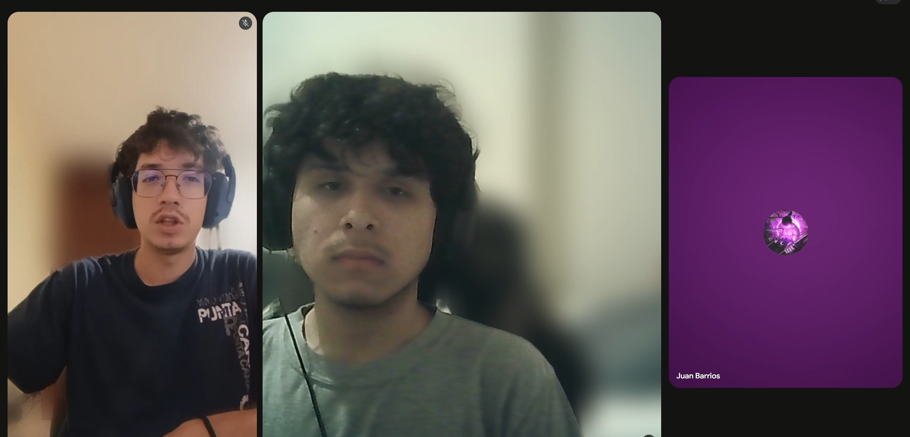
        </td>
    </tr>
    <tr>
        <td colspan="2" align="center">
            <b>Transcripción:</b>
        </td>
    </tr>
    <tr>
        <td colspan="2">
            <b>¿Podría indicarme su nombre completo, edad y lugar de procedencia?</b> <br/>
            Mi nombre es Juan Miguel Barrios Casanova, tengo 20 años y actualmente vivo en Lima-Perú.<br/>
            <br/>
            <b>¿Cuál es su ocupación actual y en qué tipo de institución se desempeña como brigadista?</b> <br/>
            Bueno, actualmente soy estudiante, pero he realizazdo como brigadista en la Municipalidad de Lima anteriormente.<br/>
            <br/>
            <b>¿Qué nivel de formación en primeros auxilios posee hasta el momento?</b> <br/>
            Bueno, hasta el momento llevé la formación básica, cómo reanimnación y en casos de no peligro. <br/>
            <br/>
            <b>¿Con qué frecuencia recibe capacitaciones o actualizaciones en primeros auxilios?</b> <br/>
            Bueno, actualmente recibo capacitaciones 2 veces al mes.<br/>
            <br/>
            <b>Según su experiencia, ¿qué tan efectivas han sido las capacitaciones presenciales que ha recibido?</b> <br/>
            Bueno, han sido muy efectivas en cuánto a la explicación y el aprendizaje.<br/>
            <br/>
            <b>¿Qué tipo de emergencias atiende con mayor frecuencia en su institución?</b> <br/>
            En eventos organizados por la municipalidad misma, las emergencias que atendí fueron descomposición, deshidratación o insolación.<br/>
            <br/>
            <b>¿Suele utilizar aplicaciones móviles o plataformas web para reforzar sus conocimientos en primeros auxilios?</b> <br/>
            He usado algunos vídeos explicativos.<br/>
            <br/>
            <b>¿Qué tan útil considera que sería una aplicación con simulaciones para mejorar sus habilidades?</b> <br/>
            Bueno, sería muy útil la verdad, ya que a veces los videos en los que recibimos capacitaciones no terminan de explicar de buena manera ciertas circunstancias.<br/>
            <br/>
            <b>Desde su experiencia, ¿qué limitaciones identifica en las capacitaciones actuales?</b> <br/>
            Pues, principalmente diría la práctica realista, ya que normalmente las capacitaciones que recibo son más teóricas que prácticas.<br/>
            <br/>
            <b>¿Qué funcionalidades le gustaría que incluya una aplicación digital de primeros auxilios?</b> <br/>
            Bueno más que nada, modelado 3D, es decir, que la aplicación me muestre como actuar ante una circunstancia o emergencias en la que yo puedo comprender correctamente como actuar.<br/>
            <br/>
            <b>¿Prefiere realizar simulaciones prácticas en grupo o de manera individual? ¿Por qué?</b> <br/>
            Bueno, yo prefiero practicar en grupo, ya que individualmente no he sentido un avance en tema de aprendizaje, en este caso en el tema de primeros auxilios. <br/>
            <br/>
            <b>¿Qué importancia tendría para usted que la aplicación ofrezca certificaciones válidas reconocidas por su institución?</b> <br/>
            Sería muy importante, ya que sería una forma de validad el como yo u otros brigadistas han tomado las capacitaciones correctas.<br/>
            <br/>
            <b>¿Estaría dispuesto a pagar personalmente o recomendar a su institución que invierta en una licencia para este servicio?</b> <br/>
            Por supuesto que sí.<br/>
            <br/>
            <b>¿Qué rango de precios consideraría razonable para este tipo de capacitación digital?</b> <br/>
            Dependería un poco en que esté centrano la aplicación, pero yo diría que entre unos 20 soles aproximandamente.<br/>
            <br/>
            <b>¿Qué institución o respaldo considera fundamental para confiar en una aplicación de primeros auxilios?</b> <br/>
            Bueno, diría que sería la MINSA, ya que se encarga de controlar y estandarizar el sistema de salud a nivel nacional, y con el respaldo de esta institución pública sería una forma sencilla que se estandarice el uso de un aplicativo para capacitaciones de primeros auxilios.<br/>
        </td>
    </tr>
</table>

<table align="center">
    <tr>
        <td colspan="2" align="center">
            <b>Entrevista N° 10</b>
        </td>
    </tr>
    <tr>
        <td width="30%" align="center">
            
        </td>
        <td width="70%">
            <b>Entrevistado</b>: Diego Alonso León Lino <br/>
            <b>Entrevistador</b>: Mathias Enrique Sanchez Espinoza <br/>
            <b>Duración</b>:  00:06:42 <br/>
            <b>Género</b>: Masculino <br/>
            <b>Edad</b>: 20 años <br/>
            <b>Segmento</b>: Brigadista <br/>
            <b>Lugar de Residencia</b>: Lima, Perú <br/>
        </td>
    </tr>
    <tr>
        <td colspan="2" align="center">
            Link de la entrevista: <a href="https://youtu.be/itTG0QX_dkg" style="word-break: break-all; overflow-wrap: anywhere;">https://youtu.be/itTG0QX_dkg</a>
        </td>
    </tr>
    <tr>
        <td colspan="2" align="center">
            
        </td>
    </tr>
    <tr>
        <td colspan="2" align="center">
            <b>Transcripción:</b>
        </td>
    </tr>
    <tr>
        <td colspan="2">
            <b>¿Podría indicarme su nombre completo, edad y lugar de procedencia?</b> <br/>
            Mi nombre es Diego Alonso León Lino, tengo 20 años y soy de Lima, Perú.<br/>
            <br/>
             <b>¿Cuál es su ocupación actual y en qué tipo de institución se desempeña como brigadista?</b> <br/>
             Actualmente soy estudiante universitario y me encuentro cursando mi carrera profesional. Anteriormente fui brigadista en mi colegio, donde participé en actividades relacionadas con primeros auxilios, apoyo en emergencias y prevención de riesgos.
            <br/>
            <br/>
            <b>¿Qué nivel de formación en primeros auxilios posee hasta el momento?</b> <br/>
            Hasta el momento he llevado una capacitación de nivel intermedio en primeros auxilios, donde aprendí temas importantes como RCP, control de hemorragias, atención ante desmayos, fracturas leves y respuesta inicial frente a diferentes tipos de emergencia.<br/>
            <br/>
            <b>¿Con qué frecuencia recibe capacitaciones o actualizaciones en primeros auxilios?</b> <br/>
            Normalmente recibimos capacitaciones cada 4 o 6 meses, aunque depende bastante de la programación institucional. A veces también se realizan pequeños refuerzos cuando ocurre alguna situación importante o cuando se actualizan los protocolos.<br/>
            <br/>
            <b>Según su experiencia, ¿qué tan efectivas han sido las capacitaciones presenciales que ha recibido?</b> <br/>
            Considero que las capacitaciones presenciales han sido bastante efectivas porque permiten practicar directamente y eso ayuda mucho más que solo la teoría.<br/>
            <br/>
            <b>¿Qué tipo de emergencias atiende con mayor frecuencia en su institución?</b> <br/>
            Las emergencias que más atendemos suelen ser desmayos, caídas, golpes leves, cortes pequeños, crisis nerviosas y algunos casos de problemas respiratorios.<br/>
            <br/>
            <b>¿Suele utilizar aplicaciones móviles o plataformas web para reforzar sus conocimientos en primeros auxilios?</b> <br/>
            No suelo utilizar aplicaciones móviles ni plataformas web para reforzar primeros auxilios, porque considero que aprender de forma práctica y presencial es mucho más útil. Pienso que practicar directamente ayuda a reaccionar mejor en una emergencia real, ya que no es lo mismo leer un procedimiento que aplicarlo en el momento cuando alguien necesita ayuda.<br/>
            <br/>
            <b>¿Qué tan útil considera que sería una aplicación con simulaciones para mejorar sus habilidades como profesional del sector salud?</b> <br/>
            Creo que una aplicación con simulaciones sería muy útil porque ayudaría a practicar cómo actuar en una emergencia sin esperar que pase una de verdad. Eso serviría para reaccionar más rápido, tener más seguridad y no quedarse en blanco en el momento.<br/>
            <br/>
            <b>Desde su experiencia, ¿qué limitaciones identifica en las capacitaciones actuales (por ejemplo, costos, tiempo, logística, escasa práctica realista)?</b> <br/>
            Las principales limitaciones que veo son el poco tiempo disponible, la baja frecuencia de las capacitaciones y la falta de simulaciones realmente realistas. En muchos casos, todo se enfoca más en la explicación y casi no se practica como sería en una situación real.<br/>
            <br/>
            <b>¿Qué funcionalidades le gustaría que incluya una aplicación digital de primeros auxilios (por ejemplo, escenarios realistas, certificaciones, evaluaciones, ranking)?</b></b> <br/>
            Me gustaría que la aplicación tenga evaluaciones prácticas, respuestas inmediatas sobre los errores o aciertos, certificaciones válidas y una actualización constante de los protocolos de primeros auxilios.<br/>
            <br/>
            <b>¿Prefiere realizar simulaciones prácticas en grupo o de manera individual? ¿Por qué?</b> <br/>
            Prefiero las simulaciones en grupo porque ayudan al trabajo en equipo durante una emergencia.
            <br/>
            <br/>
            <b>¿Qué importancia tendría para usted que la aplicación ofrezca certificaciones válidas reconocidas por su institución?</b> <br/>
            Sería muy importante que la aplicación ofrezca certificaciones reconocidas por la institución, porque eso genera mayor confianza.<br/>
            <br/>
            <b>¿Estaría dispuesto a pagar personalmente o recomendar a su institución que invierta en una licencia para este servicio?</b> <br/>
            Sí, estaría dispuesto a recomendarlo e incluso sugerir a mi institución que invierta en este tipo de servicio, ya que sería una buena forma de mejorar la preparación en primeros auxilios.<br/>
            <br/>
            <b>¿Qué rango de precios consideraría razonable para este tipo de capacitación digital?</b> <br/>
            Considero que un rango razonable estaría entre 30 y 80 soles mensuales por usuario, dependiendo de lo que ofrezca la aplicación.
            <br/>
            <br/>
            <b>¿Qué institución o respaldo considera fundamental para confiar en una aplicación de primeros auxilios?</b> <br/>
            Considero que el respaldo del Ministerio de Salud garantizaría la validez del contenido y daría mayor confianza al momento de utilizar la aplicación.<br/>
        </td>
    </tr>
</table>

## 2.2.3. Análisis de entrevistas

Se realizaron 10 entrevistas semiestructuradas distribuidas en tres segmentos objetivo identificados previamente: Estudiantes Universitarios (4 entrevistas), Comunidad Vecinal (3 entrevistas) y Brigadistas/Profesionales de Salud (3 entrevistas). El análisis cuantifica las respuestas para identificar patrones representativos que sustenten la construcción de arquetipos de usuario.

### Segmento: Estudiantes universitarios

**Total entrevistados**: 4

#### _Características objetivas_

- **Edad**: 19-23 años (promedio 21 años)
- **Dispositivos de estudio**: 100% usa laptop (4/4), 75% complementa con celular (3/4)
- **Capacitación previa en Primeros Auxilios**: 25% recibió capacitación (1/4), 75% no recibió formación completa (3/4)
- **Plataformas digitales utilizadas**: 100% usa plataformas educativas (Zoom, Meet, Teams, Classroom, Coursera).
- **Tipo de emergencia que más preocupa**: Accidentes en laboratorios (3 de 4 lo mencionan) que es el 75 %.
- **Elemento que genera más confianza en una app**: El 100% menciona que la certificación y calidad de simulación.
- **Disposición a pagar**: Entre 18 y 150 soles (promedio: 72 soles).
- **Preferencias de aprendizaje**: 50% prefiere simulaciones interactivas, 25% prefiere aprendizaje grupal, 25% se siente cómoda con todas las modalidades

#### _Características subjetivas_

- **Se sienten poco o medianamente preparadas ante emergencias**: 75% (3/4)
  - "Me siento poco preparada debido a que no tengo mucho conocimiento en el tema" – Luciana (Entrevista 3)
  - "Me siento medianamente preparada. Conozco lo básico, pero creo que en una situación real podría ponerme nerviosa" – Sofía (Entrevista 4)

- **Importancia atribuida**: 100% considera "muy importante" tener conocimientos de primeros auxilios (4/4)
  - "Lo considero muy importante. Nunca sabemos cuándo puede ocurrir un accidente" – Sofía (Entrevista 4)

- **Factores de confianza en la app**: 75% valora certificación + calidad de simulación (3/4)
  - "La calidad de la simulación me hace sentir que practico en una situación real y la certificación porque respalda lo aprendido" – María Elena (Entrevista 2)

- **Disposición de pago**: variación significativa según la percepción de valor.

### Segmento: Comunidad vecinal

**Total entrevistados**: 3

#### _Características objetivas_

- **Edad**: 20-42 años (promedio 29 años)
- **Han recibido capacitación en primeros auxilios**: 33% (1/3) recibió capacitación municipal
- **Tipo de emergencias más comunes**: 100% coincide en accidentes domésticos, sismos, incendios.
- **Acceso tecnológico**: 100% usa smartphone (3/3), 67% usa redes sociales diariamente (2/3)
- **Barreras principales para capacitarse**: 67% menciona falta de tiempo (2/3), 33% falta de información (1/3)
- **Preferencia de aprendizaje**: 67% talleres grupales (2/3), 33% individual (1/3)
- **Modelo de pago preferido**: 100% prefiere modelos comunitarios o institucionales (3/3)

#### _Características subjetivas_

- **Consideran a su comunidad poco preparada ante emergencias**: 100% (3/3)
- **Disposición a pagar por capacitación**: todos sí estarían dispuestos, pero condicionado a que tenga valor real o apoyo municipal
  - "Más que todo el tiempo, ya que paro ocupado con mi trabajo" – Rodrigo (Entrevista 6)
  - "Me interesa más en talleres con mis vecinos porque creo yo que en grupal sería mejor el aprendizaje" – Janeth (Entrevista 5)
  - "Sí, sí me parece correcto que tendríamos que pagar un porcentaje" – Janeth (Entrevista 5)

- **Expectativas de la app**: 100% busca fortalecer la unión comunitaria (3/3)
  - "Podría ser un punto de encuentro digital que nos permita capacitarnos juntos" – Josemaría (Entrevista 7)

### Segmento: Brigadistas / Profesionales del sector salud

**Total entrevistados**: 3

#### _Características objetivas_

- **Edad**: 20-42 años (promedio 27 años)
- **Capacitación formal en primeros auxilios**: 100% tiene capacitación formal en PA (3/3)
- **Frecuencia de actualización**: Cada 6-12 meses (2/3 mencionan esta frecuencia)
- **Tipo de emergencias más frecuentes**: Incendios, desmayos, contusiones, fracturas, rescates.
- **Uso de herramientas digitales**: 2 de 3 usan plataformas o videos de refuerzo (67 %).
- **Elemento más valorado en una app**: 100% valora certificaciones con aval institucional y simulaciones realistas (3/3).
- **Disposición a pagar**: Entre 20 y 100 soles (promedio: 60 soles).
- **Preferencias de uso**: 67% valora ambas modalidades (individual/grupal), 33% prefiere simulaciones grupales.

#### _Características subjetivas_

- **Limitaciones identificadas**:
  - 67% menciona escasez de práctica realista (2/3)
  - "La escasez de clases prácticas" – Andy (Entrevista 9)
  - "Deberíamos tener una forma de poder practicar sin necesidad de llegar a los riesgos reales" – Héctor (Entrevista 8)

- **Funcionalidades deseadas**:
  - Sería muy importante porque hoy en día existe algo que se llama 'trazabilidad de la información'" - Héctor (Entrevista 8).
  - "Me gustaría recibir escenarios realistas para que los conocimientos sean efectivos" - Marjori (Entrevista 10).

- **Elemento más valorado en una app**: simulaciones realistas y certificación oficial.
- **Disposición de pago**: alta, con expectativa de S/20-50 mensual o S/50-100 por curso.
- **Instituciones de respaldo requeridas**: MINSA, Cruz Roja, AHA, Defensa Civil (mencionadas por 100%).

<br>
<br>

<div align="center">
    
</div>

<br>
<br>

# 2.3. Needfinding

El proceso de needfinding permitió identificar las necesidades reales, motivaciones, dificultades y oportunidades relacionadas con la capacitación en primeros auxilios en los tres segmentos objetivo de SafeStep: estudiantes universitarios, comunidad vecinal y brigadistas o profesionales de la salud.

Estudios contemporáneos demuestran que, si bien las capacitaciones iniciales pueden mejorar el conocimiento técnico, la retención disminuye significativamente con el tiempo sin métodos de práctica continua. Un estudio mixto realizado en una comunidad remota evidenció que la formación inicial mejora las puntuaciones de conocimiento, pero la retención cae cuando no existen mecanismos de refuerzo accesibles, especialmente en poblaciones no profesionales (Do Thi et al., 2024).

Del mismo modo, una investigación de 2025 examinó el nivel de conocimientos de primeros auxilios en distintos niveles educativos (secundaria, bachillerato y universidad), encontrando brechas importantes en comprensión y aplicación práctica, lo que refuerza la necesidad de herramientas educativas adaptadas a diferentes perfiles (García-Blaya et al., 2025).

Asimismo, evidencia reciente señala que los métodos tradicionales (charlas, diapositivas, demostraciones aisladas) no generan suficiente transferencia a situaciones reales de estrés. En contraste, un estudio comparativo de 2024 mostró que las metodologías basadas en gamificación y simulación producen mejor rendimiento práctico, mayor confianza y una retención más efectiva del aprendizaje (Navarro-Patón & Mecías-Calvo, 2024).

En conjunto, esta literatura reciente confirma que existe una necesidad sostenida de herramientas interactivas, accesibles y orientadas a la práctica —como simulaciones digitales— que permitan a las personas responder adecuadamente ante emergencias cotidianas, coincidiendo con los hallazgos obtenidos en entrevistas y análisis de campo.

## Análisis Estructural de la Problemática

### Árbol de Problemas

El Árbol de Problemas fue elaborado para jerarquizar visualmente la problemática, estableciendo una relación de causalidad entre el problema central –Desconocimiento práctico en primeros auxilios en población general y grupos de riesgo– y sus efectos. Las Causas (raíces) y los Efectos (impactos) identificados fueron validados mediante la triangulación de los hallazgos del trabajo de campo y la literatura científica reciente, la cual subraya la insuficiencia de los métodos de enseñanza pasivos y la baja retención sin práctica continua (Do Thi et al., 2024; Navarro-Patón & Mecías-Calvo, 2024).

<div align="center">
  <p>
    <b>Gráfico 1</b>: Árbol de problemas
  </p>
  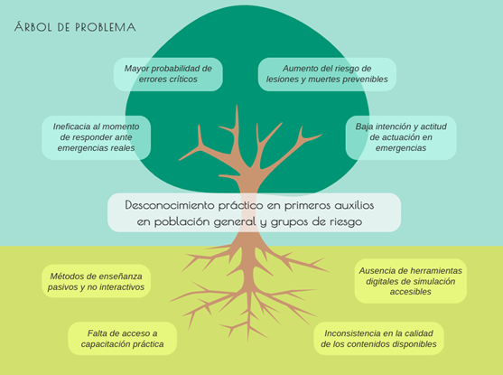
  <p>
    <i><b>Fuente</b>: Elaboración propia.</i>
  </p>
</div>

### Diagrama de Ishikawa

Para complementar el análisis estructural, se aplicó el Diagrama de Ishikawa (Espina de Pescado) categorizando las causas raíz en seis ejes fundamentales: Proceso, Personas, Tecnología, Información, Entorno y Gestión. Este desglose sistemático no solo demuestra el rigor metodológico, sino que también justifica la multidimensionalidad de la solución SafeStep al validar las causas con la literatura (p. ej., la necesidad de Tecnología para superar las limitaciones de Proceso y la importancia de Gestión para las certificaciones).

<div align="center">
  <p>
    <b>Gráfico 2</b>: Diagrama de Ishikawa
  </p>
  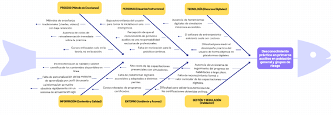
  <p>
    <i><b>Fuente</b>: Elaboración propia.</i>
  </p>
</div>

## 2.3.1. User Personas

En esta sección se presentan las fichas de User Persona desarrolladas a partir del análisis de entrevistas y del análisis competitivo. Se tomó en cuenta la información estadística obtenida en las entrevistas a los segmentos estudiados, donde se identificaron las características objetivas y subjetivas más comunes, complementado con el análisis competitivo del mercado de capacitación en primeros auxilios.

### Segmento: Estudiantes universitarios

<div align="center">
  <p>
    <b>Gráfico 3</b>: User Person del segmento Estudiantes universitarios
  </p>
  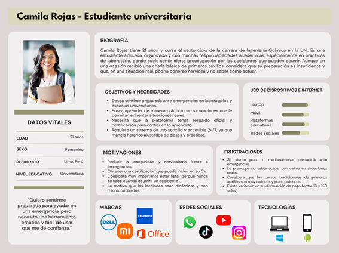
  <p>
    <i><b>Fuente</b>: Elaboración propia.</i>
  </p>
</div>

### Segmento: Comunidad vecinal

<div align="center">
  <p>
    <b>Gráfico 4</b>: User Person del segmento Comunidad vecinal
  </p>
  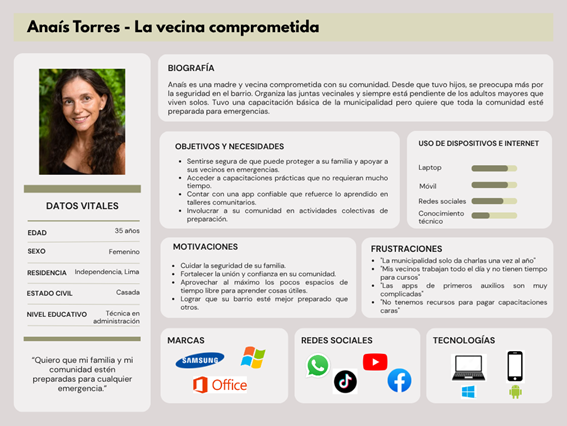
  <p>
    <i><b>Fuente</b>: Elaboración propia.</i>
  </p>
</div>

### Segmento: Brigadistas / Profesionales del sector salud

<div align="center">
  <p>
    <b>Gráfico 5</b>: User Person del segmento Brigadistas / Profesionales del sector salud
  </p>
  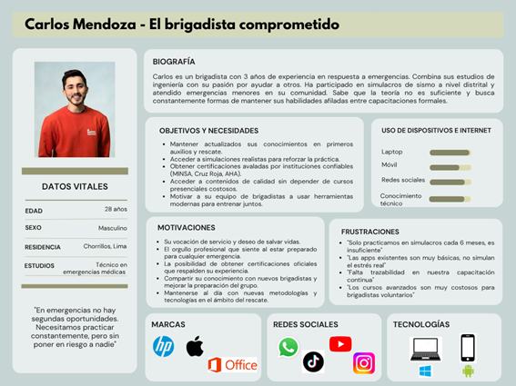
  <p>
    <i><b>Fuente</b>: Elaboración propia.</i>
  </p>
</div>

## 2.3.2. User Task Matrix

El presente User Task Matrix reúne las tareas principales que los User Persona (representativos de los tres segmentos objetivo de SafeStep) realizan para alcanzar sus metas relacionadas con la capacitación en primeros auxilios.

Cada tarea fue evaluada según dos criterios:

- **Frecuencia (Frc)**: qué tan a menudo el usuario realiza la tarea (Alta / Media / Baja).
- **Importancia (Imp)**: qué tan relevante considera el usuario dicha tarea para cumplir su objetivo (Alta / Media / Baja).

Los segmentos considerados son:

- Estudiantes universitarios
- Comunidad vecinal
- Brigadistas / profesionales de salud

<table>
    <tr>
        <td rowspan="2" align="center">
            <b>Tareas principales</b>
        </td>
        <td colspan="2" align="center">
            <b>Estudiantes</b>
        </td>
        <td colspan="2" align="center">
            <b>Comunidad vecinal</b>
        </td>
        <td colspan="2" align="center">
            <b>Brigadistas / profesionales</b>
        </td>
    </tr>
    <tr>
        <td align="center"><b>Frc</b></td>
        <td align="center"><b>Imp</b></td>
        <td align="center"><b>Frc</b></td>
        <td align="center"><b>Imp</b></td>
        <td align="center"><b>Frc</b></td>
        <td align="center"><b>Imp</b></td>
    </tr>
    <tr>
        <td align="center">
            <b>Buscar información sobre primeros auxilios</b>
        </td>
        <td align="center">Alta</td>
        <td align="center">Alta</td>
        <td align="center">Media</td>
        <td align="center">Alta</td>
        <td align="center">Media</td>
        <td align="center">Alta</td>
    </tr>
    <tr>
        <td align="center">
            <b>Participar en capacitaciones o simulaciones</b>
        </td>
        <td align="center">Media</td>
        <td align="center">Alta</td>
        <td align="center">Media</td>
        <td align="center">Alta</td>
        <td align="center">Alta</td>
        <td align="center">Alta</td>
    </tr>
    <tr>
        <td align="center">
            <b>Consultar materiales de apoyo (videos, guías)</b>
        </td>
        <td align="center">Alta</td>
        <td align="center">Media</td>
        <td align="center">Media</td>
        <td align="center">Media</td>
        <td align="center">Alta</td>
        <td align="center">Media</td>
    </tr>
    <tr>
        <td align="center">
            <b>Practicar casos de emergencia</b>
        </td>
        <td align="center">Media</td>
        <td align="center">Alta</td>
        <td align="center">Media</td>
        <td align="center">Alta</td>
        <td align="center">Alta</td>
        <td align="center">Alta</td>
    </tr>
    <tr>
        <td align="center">
            <b>Compartir experiencias o dudas con otros usuarios</b>
        </td>
        <td align="center">Media</td>
        <td align="center">Media</td>
        <td align="center">Alta</td>
        <td align="center">Alta</td>
        <td align="center">Media</td>
        <td align="center">Alta</td>
    </tr>
    <tr>
        <td align="center">
            <b>Obtener certificaciones o constancias</b>
        </td>
        <td align="center">Alta</td>
        <td align="center">Alta</td>
        <td align="center">Baja</td>
        <td align="center">Media</td>
        <td align="center">Alta</td>
        <td align="center">Alta</td>
    </tr>
    <tr>
        <td align="center">
            <b>Revisar su progreso o desempeño</b>
        </td>
        <td align="center">Media</td>
        <td align="center">Alta</td>
        <td align="center">Media</td>
        <td align="center">Media</td>
        <td align="center">Alta</td>
        <td align="center">Alta</td>
    </tr>
    <tr>
        <td align="center">
            <b>Enseñar o replicar conocimientos adquiridos</b>
        </td>
        <td align="center">Baja</td>
        <td align="center">Media</td>
        <td align="center">Media</td>
        <td align="center">Alta</td>
        <td align="center">Alta</td>
        <td align="center">Alta</td>
    </tr>
    <tr>
        <td align="center">
            <b>Organizar o participar en eventos de seguridad</b>
        </td>
        <td align="center">Baja</td>
        <td align="center">Media</td>
        <td align="center">Alta</td>
        <td align="center">Alta</td>
        <td align="center">Alta</td>
        <td align="center">Alta</td>
    </tr>
    <tr>
        <td align="center">
            <b>Acceder desde dispositivos móviles para aprender</b>
        </td>
        <td align="center">Alta</td>
        <td align="center">Alta</td>
        <td align="center">Alta</td>
        <td align="center">Alta</td>
        <td align="center">Media</td>
        <td align="center">Media</td>
    </tr>
    <tr>
        <td align="center">
            <b>Validar información o cursos (autenticidad)</b>
        </td>
        <td align="center">Media</td>
        <td align="center">Alta</td>
        <td align="center">Baja</td>
        <td align="center">Media</td>
        <td align="center">Alta</td>
        <td align="center">Alta</td>
    </tr>
    <tr>
        <td align="center">
            <b>Coordinar actividades grupales o roles</b>
        </td>
        <td align="center">Media</td>
        <td align="center">Media</td>
        <td align="center">Alta</td>
        <td align="center">Alta</td>
        <td align="center">Alta</td>
        <td align="center">Alta</td>
    </tr>
</table>

### Análisis de resultados

#### Tareas más frecuentes:

Entre los tres segmentos, las tareas “Buscar información sobre primeros auxilios”, “Acceder desde dispositivos móviles para aprender” y “Participar en capacitaciones o simulaciones” presentan alta frecuencia, reflejando el interés general por la formación práctica y accesible.

#### Tareas más importantes:

En todos los casos, las tareas “Participar en simulaciones”, “Obtener certificaciones”, y “Practicar casos de emergencia” destacan con alta importancia, evidenciando que los usuarios valoran el aprendizaje aplicado y la validación de sus conocimientos.

#### Diferencias entre segmentos:

- Los estudiantes priorizan la facilidad de acceso, la certificación y el aprendizaje interactivo.
- La comunidad vecinal da más peso a la colaboración y organización de eventos grupales.
- Los brigadistas concentran sus tareas en la práctica avanzada, validación institucional y monitoreo de desempeño.

#### Coincidencias clave:

Todos los perfiles coinciden en la necesidad de capacitaciones accesibles, certificadas y prácticas, lo que valida el enfoque de SafeStep hacia una experiencia transversal de simulación interactiva con respaldo formal.

## 2.3.3. User Journey Mapping

Los siguientes User Journey Mapping describen las experiencia actuales (As-Is) de los tres segmentos principales de SafeStep: estudiantes universitarios, comunidad vecinal y brigadistas.

El objetivo es comprender las motivaciones, frustraciones y oportunidades que surgen en cada etapa del proceso de aprendizaje, desde la búsqueda de información hasta la aplicación de conocimientos, con el fin de identificar puntos críticos que servirán de base para diseñar una experiencia más efectiva, práctica y accesible.

<div align="center">
  <p>
    <b>Gráfico 6</b>: User Journey Map – Camila Rojas (Estudiante universitaria)
  </p>
  
  <p>
    <i><b>Fuente</b>: Elaboración propia.</i>
  </p>
</div>

<div align="center">
  <p>
    <b>Gráfico 7</b>: User Journey Map – Anaís Torres (Vecina comprometida)
  </p>
  
  <p>
    <i><b>Fuente</b>: Elaboración propia.</i>
  </p>
</div>

<div align="center">
  <p>
    <b>Gráfico 8</b>: User Journey Map – Carlos Mendoza (Brigadista comprometido)
  </p>
  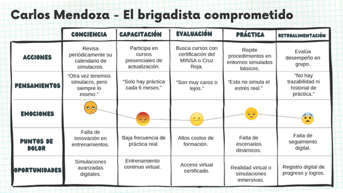
  <p>
    <i><b>Fuente</b>: Elaboración propia.</i>
  </p>
</div>

## 2.3.4. Empathy Mapping

El proceso de Empathy Mapping permitió comprender de manera más profunda los pensamientos, emociones, necesidades y motivaciones de los tres User Persona de SafeStep.

Cada mapa busca responder las preguntas centrales del diseño centrado en el usuario: ¿con quién estamos empatizando?, ¿qué necesita?, ¿qué piensa y siente?, ¿qué ve, dice, hace y escucha?, además de identificar sus pains (frustraciones o dificultades) y gains (motivaciones y oportunidades).

<div align="center">
  <p>
    <b>Gráfico 9</b>: Empathy Map de estudiante
  </p>
  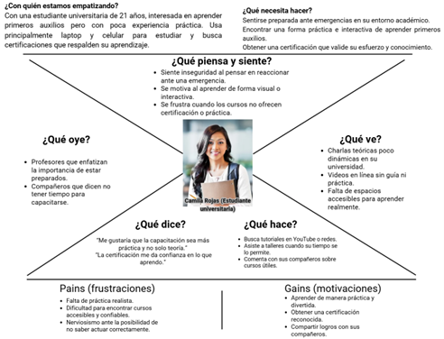
  <p>
    <i><b>Fuente</b>: Elaboración propia.</i>
  </p>
</div>

<div align="center">
  <p>
    <b>Gráfico 10</b>: Empathy Map de comunidad vecinal
  </p>
  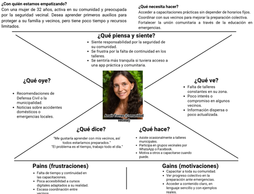
  <p>
    <i><b>Fuente</b>: Elaboración propia.</i>
  </p>
</div>

<div align="center">
  <p>
    <b>Gráfico 11</b>: Empathy Map de brigadista
  </p>
  
  <p>
    <i><b>Fuente</b>: Elaboración propia.</i>
  </p>
</div>

<br>
<br>

<div align="center">
    
</div>

<br>
<br>

# 2.4. Big Picture Event Storming

El Big Picture EventStorming consiste en una exploración de alto nivel que busca alinear a los involucrados mediante el mapeo de eventos de dominio en una línea de tiempo extensa. Su propósito es capturar la narrativa completa del negocio para identificar puntos de fricción y establecer los límites preliminares de los Bounded Contexts antes de realizar un diseño técnico detallado

<div align="center">
    <a href="https://miro.com/app/live-embed/uXjVGlN0dvA=/?focusWidget=3458764667285676558&embedMode=view_only_without_ui&embedId=610945114680">https://miro.com/app/live-embed/uXjVGlN0dvA=/?focusWidget=3458764667285676558&embedMode=view_only_without_ui&embedId=610945114680</a>
    <br>
    <sub><em>Haz clic en la imagen para ver el tablero en Miro</em></sub>
</div>

<br>
<br>

<div align="center">
    
</div>

<br>
<br>

# 2.5. Ubiquitous Language

Es el lenguaje común compartido entre desarrolladores y expertos del negocio que se formula durante el EventStorming para alinear modelos mentales y eliminar ambigüedades. Este lenguaje asegura que tanto la documentación técnica como el código final de SafeStep utilicen exactamente los mismos términos definidos para el dominio empresarial.

| Concepto | Definición |
| --- | --- |
| Alumno | Usuario del sistema con rol académico que busca inscribirse en cursos. |
| Docente | Actor del sistema que tiene acceso a gestionar el silabo y la asistencia en sus cursos asignados. |
| Administrador | Usuario con permisos para gestionar la configuración global de cursos y periodos. |
| Curso | Unidad curricular básica que posee créditos, syllabus y requisitos. |
| Ciclo Académico | Periodo de tiempo específico (ej. 2026-I) durante el cual se desarrollan los cursos. |
| Cupo | Cantidad limitada de vacantes disponibles para un curso en un horario específico. |
| Silabo | Documento oficial que contiene el contenido, objetivos y evaluación de un curso. |
| Matrícula | Proceso formal de inscripción de un alumno en un conjunto de cursos. |
| Pre-requisito | Curso previo que debe estar aprobado antes de inscribir el curso actual. |
| Estado de Pago | Condición financiera del alumno que habilita o bloquea su proceso de matrícula. |
| Módulo de Pagos | Sistema encargado de validar la deuda y procesar transacciones para habilitar la matrícula. |
| Historial Académico | Registro histórico de cursos aprobados y desaprobados que determina la elegibilidad para futuros cursos. |
| Solicitud de Matrícula | Registro temporal generado por el alumno que inicia el proceso antes de la confirmación final. |
| Reporte de Matrícula | Documento o dashboard generado para el administrador con métricas de cupos y alumnos inscritos. |
| Ventanilla única | Canal centralizado de atención donde el alumno puede resolver incidencias técnicas o administrativas. |
<br>
<br>

<br>
<br>

<div align="center">
    
</div>

<br>
<br>

# 3.1. User Stories

En esta sección se presentan las épicas, user stories y technical stories que guían el desarrollo de SafeStep. Las historias se redactan desde la perspectiva del usuario o del equipo de desarrollo, siguiendo la estructura **Como [rol], quiero [necesidad], para [beneficio]**, con el fin de relacionar cada requerimiento con un valor concreto para el producto.

Los criterios de aceptación se expresan bajo el formato **Gherkin**, utilizando la estructura **Dado que / Cuando / Entonces**. De esta manera, cada historia cuenta con condiciones verificables que permiten validar su cumplimiento durante el desarrollo, las pruebas funcionales y la revisión de cada Sprint. Las filas identificadas como épicas no incluyen criterios de aceptación específicos, debido a que funcionan como agrupadores de historias relacionadas.


<table>
  <thead>
    <tr>
      <th>Epic / Story ID</th>
      <th>Titulo</th>
      <th>Descripcion</th>
      <th>Criterios de Aceptacion (Gherkin)</th>
      <th>Relacionado con (Epic ID)</th>
    </tr>
  </thead>
  <tbody>
    <tr>
      <td><b>EP02</b></td>
      <td>Dashboard principal</td>
      <td><b>Como</b> usuario de SafeStep, <b>quiero</b> visualizar un dashboard principal con mi avance, entrenamientos, misiones y productos sugeridos, <b>para</b> decidir rapidamente que hacer despues.</td>
      <td>No aplica por tratarse de una epica agrupadora.</td>
      <td>No aplica</td>
    </tr>
    <tr>
      <td><b>US06</b></td>
      <td>Visualizar resumen general de entrenamiento</td>
      <td><b>Como</b> usuario, <b>quiero</b> ver un resumen de mi progreso al entrar a la aplicacion <b>para</b> saber mi estado actual.</td>
      <td>- <b>Dado que</b> el usuario tiene simulaciones, XP y racha registrada, <b>Cuando</b> ingresa al dashboard, <b>Entonces</b> el sistema muestra metricas principales de su progreso<br><br>- <b>Dado que</b> el usuario aun no tiene suficientes datos, <b>Cuando</b> ingresa al dashboard, <b>Entonces</b> el sistema muestra valores iniciales o recomendaciones para empezar</td>
      <td>EP02</td>
    </tr>
    <tr>
      <td><b>US07</b></td>
      <td>Continuar con el siguiente entrenamiento</td>
      <td><b>Como</b> usuario, <b>quiero</b> ver la siguiente simulacion sugerida <b>para</b> continuar mi aprendizaje sin buscar manualmente.</td>
      <td>- <b>Dado que</b> hay simulaciones no completadas, <b>Cuando</b> el usuario entra al dashboard, <b>Entonces</b> el sistema muestra una simulacion recomendada para continuar<br><br>- <b>Dado que</b> el dashboard muestra una simulacion recomendada, <b>Cuando</b> el usuario selecciona practicar, <b>Entonces</b> el sistema abre el detalle de esa simulacion</td>
      <td>EP02</td>
    </tr>
    <tr>
      <td><b>US08</b></td>
      <td>Ver misiones activas desde el dashboard</td>
      <td><b>Como</b> usuario, <b>quiero</b> ver misiones activas en el dashboard <b>para</b> recordar objetivos que puedo completar.</td>
      <td>- <b>Dado que</b> existen misiones activas, <b>Cuando</b> el usuario ingresa al dashboard, <b>Entonces</b> el sistema muestra una vista breve de misiones activas y su progreso<br><br>- <b>Dado que</b> el usuario desea ver mas misiones, <b>Cuando</b> selecciona la opcion de abrir gamificacion, <b>Entonces</b> el sistema lo lleva al apartado de gamificacion</td>
      <td>EP02</td>
    </tr>
    <tr>
      <td><b>US09</b></td>
      <td>Ver productos sugeridos desde el dashboard</td>
      <td><b>Como</b> usuario, <b>quiero</b> ver productos sugeridos <b>para</b> mi preparacion para acceder rapidamente a la tienda.</td>
      <td>- <b>Dado que</b> existen productos recomendados, <b>Cuando</b> el usuario entra al dashboard, <b>Entonces</b> el sistema muestra productos destacados con su imagen, categoria y precio<br><br>- <b>Dado que</b> el usuario visualiza productos sugeridos, <b>Cuando</b> selecciona la opcion de ir a tienda, <b>Entonces</b> el sistema abre el catalogo de productos</td>
      <td>EP02</td>
    </tr>
    <tr>
      <td><b>EP03</b></td>
      <td>Simulaciones medicas</td>
      <td><b>Como</b> usuario en entrenamiento, <b>quiero</b> practicar emergencias mediante simulaciones medicas interactivas, <b>para</b> aprender a tomar mejores decisiones en primeros auxilios.</td>
      <td>No aplica por tratarse de una epica agrupadora.</td>
      <td>No aplica</td>
    </tr>
    <tr>
      <td><b>US10</b></td>
      <td>Visualizar catalogo de simulaciones</td>
      <td><b>Como</b> usuario, <b>quiero</b> ver todas las simulaciones disponibles <b>para</b> elegir que emergencia practicar.</td>
      <td>- <b>Dado que</b> existen simulaciones registradas, <b>Cuando</b> el usuario entra a Simulaciones, <b>Entonces</b> el sistema muestra cartas con imagen, dificultad, duracion, XP y SafeCoins<br><br>- <b>Dado que</b> el usuario ya completo una simulacion, <b>Cuando</b> visualiza el catalogo, <b>Entonces</b> la carta indica que fue completada y cuantas veces se completo</td>
      <td>EP03</td>
    </tr>
    <tr>
      <td><b>US11</b></td>
      <td>Buscar simulaciones por nombre</td>
      <td><b>Como</b> usuario, <b>quiero</b> buscar simulaciones por nombre <b>para</b> encontrar rapidamente el entrenamiento que necesito.</td>
      <td>- <b>Dado que</b> el usuario esta en el listado de simulaciones, <b>Cuando</b> escribe el nombre de una simulacion existente, <b>Entonces</b> el sistema muestra solo las simulaciones que coinciden<br><br>- <b>Dado que</b> el usuario escribe una palabra sin coincidencias, <b>Cuando</b> el filtro se aplica, <b>Entonces</b> el sistema muestra un estado indicando que no hay resultados</td>
      <td>EP03</td>
    </tr>
    <tr>
      <td><b>US12</b></td>
      <td>Revisar detalle de una simulacion antes de iniciar</td>
      <td><b>Como</b> usuario, <b>quiero</b> ver la informacion de una simulacion antes de empezarla <b>para</b> saber que aprendere y que recompensas ofrece.</td>
      <td>- <b>Dado que</b> el usuario selecciona una simulacion, <b>Cuando</b> se abre su detalle, <b>Entonces</b> el sistema muestra objetivos, dificultad, duracion, XP disponible y SafeCoins base<br><br>- <b>Dado que</b> el usuario intenta abrir una simulacion que no existe, <b>Cuando</b> el sistema no encuentra el identificador, <b>Entonces</b> muestra un mensaje de simulacion no encontrada</td>
      <td>EP03</td>
    </tr>
    <tr>
      <td><b>US13</b></td>
      <td>Responder pasos de una simulacion</td>
      <td><b>Como</b> usuario, <b>quiero</b> elegir respuestas en cada escenario <b>para</b> practicar decisiones ante emergencias.</td>
      <td>- <b>Dado que</b> el usuario esta realizando una simulacion, <b>Cuando</b> selecciona una opcion de un paso, <b>Entonces</b> el sistema registra la respuesta seleccionada<br><br>- <b>Dado que</b> el usuario selecciona una respuesta, <b>Cuando</b> el sistema evalua la opcion, <b>Entonces</b> la respuesta correcta e incorrecta se distinguen visualmente</td>
      <td>EP03</td>
    </tr>
    <tr>
      <td><b>US14</b></td>
      <td>Finalizar una simulacion</td>
      <td><b>Como</b> usuario, <b>quiero</b> finalizar la simulacion cuando responda todos los pasos <b>para</b> recibir mi resultado.</td>
      <td>- <b>Dado que</b> el usuario respondio todos los pasos, <b>Cuando</b> selecciona finalizar, <b>Entonces</b> el sistema calcula respuestas correctas, errores, precision, XP y monedas<br><br>- <b>Dado que</b> el usuario aun no respondio todos los pasos, <b>Cuando</b> intenta finalizar, <b>Entonces</b> el sistema no permite finalizar hasta completar la simulacion</td>
      <td>EP03</td>
    </tr>
    <tr>
      <td><b>US15</b></td>
      <td>Recibir SafeCoins por completar una simulacion</td>
      <td><b>Como</b> usuario, <b>quiero</b> recibir monedas al completar una simulacion exitosa <b>para</b> usarlas en la tienda.</td>
      <td>- <b>Dado que</b> el usuario completa una simulacion con precision suficiente, <b>Y</b> es su primera finalizacion exitosa de esa simulacion, <b>Cuando</b> el sistema calcula la recompensa, <b>Entonces</b> recibe el 100% de las SafeCoins correspondientes segun su precision<br><br>- <b>Dado que</b> el usuario ya completo antes la misma simulacion, <b>Cuando</b> la completa nuevamente con precision suficiente, <b>Entonces</b> recibe una recompensa reducida segun el multiplicador de repeticion</td>
      <td>EP03</td>
    </tr>
    <tr>
      <td><b>US16</b></td>
      <td>Ver resumen final de simulacion</td>
      <td><b>Como</b> usuario, <b>quiero</b> ver un resumen final <b>para</b> entender mi rendimiento y recompensa.</td>
      <td>- <b>Dado que</b> el usuario finalizo una simulacion, <b>Cuando</b> se muestra la pantalla final, <b>Entonces</b> el sistema muestra respuestas correctas, errores, XP ganado, monedas ganadas, saldo anterior y saldo nuevo<br><br>- <b>Dado que</b> el calculo de recompensa resulta en cero monedas, <b>Cuando</b> se muestra el resumen final, <b>Entonces</b> el sistema indica claramente que no se ganaron monedas adicionales</td>
      <td>EP03</td>
    </tr>
    <tr>
      <td><b>US17</b></td>
      <td>Ver productos sugeridos segun errores</td>
      <td><b>Como</b> usuario, <b>quiero</b> recibir sugerencias de productos relacionadas con mi simulacion <b>para</b> prepararme mejor.</td>
      <td>- <b>Dado que</b> una simulacion tiene productos sugeridos, <b>Cuando</b> el usuario revisa el detalle o resultado, <b>Entonces</b> el sistema muestra productos relacionados con esa emergencia<br><br>- <b>Dado que</b> la simulacion no tiene productos asociados, <b>Cuando</b> el usuario revisa el resultado, <b>Entonces</b> el sistema no muestra recomendaciones de tienda</td>
      <td>EP03</td>
    </tr>
    <tr>
      <td><b>EP04</b></td>
      <td>Progreso y estadisticas</td>
      <td><b>Como</b> usuario, <b>quiero</b> consultar estadisticas reales de mi aprendizaje, <b>para</b> identificar avances, errores y acciones de mejora.</td>
      <td>No aplica por tratarse de una epica agrupadora.</td>
      <td>No aplica</td>
    </tr>
    <tr>
      <td><b>US18</b></td>
      <td>Visualizar resumen general de progreso</td>
      <td><b>Como</b> usuario, <b>quiero</b> ver indicadores generales de mi avance <b>para</b> entender mi desempeno.</td>
      <td>- <b>Dado que</b> el usuario tiene intentos y recompensas registradas, <b>Cuando</b> ingresa a Progreso, <b>Entonces</b> el sistema muestra simulaciones completadas, intentos, precision promedio, XP, SafeCoins y tiempo entrenado<br><br>- <b>Dado que</b> el usuario no tiene intentos registrados, <b>Cuando</b> ingresa a Progreso, <b>Entonces</b> el sistema muestra metricas en cero o mensajes para empezar</td>
      <td>EP04</td>
    </tr>
    <tr>
      <td><b>US19</b></td>
      <td>Revisar rendimiento por simulacion</td>
      <td><b>Como</b> usuario, <b>quiero</b> ver mi rendimiento por cada simulacion <b>para</b> saber cuales domino y cuales debo repetir.</td>
      <td>- <b>Dado que</b> una simulacion tiene intentos del usuario, <b>Cuando</b> se muestra el rendimiento, <b>Entonces</b> el sistema indica intentos, completaciones, mejor puntaje, precision promedio y ultimo intento<br><br>- <b>Dado que</b> una simulacion nunca fue iniciada, <b>Cuando</b> se muestra el rendimiento, <b>Entonces</b> el sistema indica que aun esta pendiente o sin intentos</td>
      <td>EP04</td>
    </tr>
    <tr>
      <td><b>US20</b></td>
      <td>Identificar errores frecuentes</td>
      <td><b>Como</b> usuario, <b>quiero</b> ver mis errores mas repetidos <b>para</b> mejorar en pasos concretos.</td>
      <td>- <b>Dado que</b> el usuario cometio errores en intentos anteriores, <b>Cuando</b> abre el apartado de errores, <b>Entonces</b> el sistema muestra los errores mas frecuentes y una recomendacion asociada<br><br>- <b>Dado que</b> el usuario no tiene errores registrados, <b>Cuando</b> abre el apartado de errores, <b>Entonces</b> el sistema muestra un mensaje positivo o de estado vacio</td>
      <td>EP04</td>
    </tr>
    <tr>
      <td><b>US21</b></td>
      <td>Recibir recomendaciones accionables</td>
      <td><b>Como</b> usuario, <b>quiero</b> recibir recomendaciones basadas en mi rendimiento <b>para</b> saber que hacer despues.</td>
      <td>- <b>Dado que</b> el usuario tiene baja precision en una simulacion, <b>Cuando</b> el sistema genera recomendaciones, <b>Entonces</b> sugiere repetir esa simulacion<br><br>- <b>Dado que</b> el usuario tiene insignias pendientes, <b>Cuando</b> el sistema genera recomendaciones, <b>Entonces</b> sugiere desbloquear una insignia con su requisito</td>
      <td>EP04</td>
    </tr>
    <tr>
      <td><b>US22</b></td>
      <td>Consultar progreso de gamificacion desde Progreso</td>
      <td><b>Como</b> usuario, <b>quiero</b> ver mis misiones e insignias dentro del progreso <b>para</b> relacionar mi aprendizaje con logros.</td>
      <td>- <b>Dado que</b> hay datos de gamificacion, <b>Cuando</b> el usuario revisa Progreso, <b>Entonces</b> el sistema muestra misiones completadas, misiones activas e insignias desbloqueadas<br><br>- <b>Dado que</b> existe ranking semanal, <b>Cuando</b> el usuario revisa su progreso, <b>Entonces</b> el sistema muestra su posicion semanal</td>
      <td>EP04</td>
    </tr>
    <tr>
      <td><b>EP05</b></td>
      <td>Gamificacion</td>
      <td><b>Como</b> usuario, <b>quiero</b> acceder a niveles, misiones, insignias, ranking y SafeCoins, <b>para</b> mantenerme motivado a practicar primeros auxilios.</td>
      <td>No aplica por tratarse de una epica agrupadora.</td>
      <td>No aplica</td>
    </tr>
    <tr>
      <td><b>US23</b></td>
      <td>Visualizar resumen de gamificacion</td>
      <td><b>Como</b> usuario, <b>quiero</b> ver mi nivel, XP, racha, ranking y monedas <b>para</b> conocer mi estado competitivo.</td>
      <td>- <b>Dado que</b> el usuario tiene datos de gamificacion, <b>Cuando</b> ingresa a Gamificacion, <b>Entonces</b> el sistema muestra nivel, XP, racha, ranking semanal y SafeCoins<br><br>- <b>Dado que</b> el sistema no puede cargar gamificacion, <b>Cuando</b> el usuario ingresa al apartado, <b>Entonces</b> se muestra un mensaje de error comprensible</td>
      <td>EP05</td>
    </tr>
    <tr>
      <td><b>US24</b></td>
      <td>Ver misiones activas resumidas</td>
      <td><b>Como</b> usuario, <b>quiero</b> ver solo algunas misiones activas inicialmente <b>para</b> no saturarme de informacion.</td>
      <td>- <b>Dado que</b> existen varias misiones activas, <b>Cuando</b> el usuario entra a Gamificacion, <b>Entonces</b> el sistema muestra solo tres misiones activas en la vista principal<br><br>- <b>Dado que</b> el usuario quiere revisar todo el listado, <b>Cuando</b> selecciona ver todas las misiones, <b>Entonces</b> el sistema abre el inventario completo de misiones</td>
      <td>EP05</td>
    </tr>
    <tr>
      <td><b>US25</b></td>
      <td>Revisar inventario de misiones</td>
      <td><b>Como</b> usuario, <b>quiero</b> ver misiones activas, disponibles y bloqueadas <b>para</b> planificar mis objetivos.</td>
      <td>- <b>Dado que</b> existen misiones activas, <b>Cuando</b> el usuario abre el inventario, <b>Entonces</b> el sistema muestra su progreso, recompensa e instrucciones<br><br>- <b>Dado que</b> existen misiones bloqueadas, <b>Cuando</b> el usuario abre el inventario, <b>Entonces</b> el sistema muestra el requisito de desbloqueo</td>
      <td>EP05</td>
    </tr>
    <tr>
      <td><b>US26</b></td>
      <td>Consultar ranking semanal</td>
      <td><b>Como</b> usuario, <b>quiero</b> ver el ranking semanal <b>para</b> comparar mi progreso con otros usuarios.</td>
      <td>- <b>Dado que</b> existe ranking semanal, <b>Cuando</b> el usuario abre Gamificacion, <b>Entonces</b> el sistema muestra los cinco primeros puestos<br><br>- <b>Dado que</b> el usuario no esta entre los cinco primeros, <b>Cuando</b> se muestra el ranking, <b>Entonces</b> el sistema muestra tambien la posicion actual del usuario</td>
      <td>EP05</td>
    </tr>
    <tr>
      <td><b>US27</b></td>
      <td>Ver insignias desbloqueadas</td>
      <td><b>Como</b> usuario, <b>quiero</b> ver mis insignias desbloqueadas <b>para</b> reconocer mis logros.</td>
      <td>- <b>Dado que</b> el usuario tiene insignias desbloqueadas, <b>Cuando</b> ingresa a Gamificacion, <b>Entonces</b> el sistema muestra una vista resumida de cinco insignias<br><br>- <b>Dado que</b> una insignia tiene rareza comun, rara, epica o legendaria, <b>Cuando</b> se renderiza la carta, <b>Entonces</b> el sistema usa un color visual asociado a su rareza</td>
      <td>EP05</td>
    </tr>
    <tr>
      <td><b>US28</b></td>
      <td>Ver inventario completo de insignias</td>
      <td><b>Como</b> usuario, <b>quiero</b> ver todas mis insignias y las bloqueadas <b>para</b> saber que logros puedo perseguir.</td>
      <td>- <b>Dado que</b> el usuario abre el inventario de insignias, <b>Cuando</b> existen insignias desbloqueadas, <b>Entonces</b> el sistema las muestra en cartas con nombre, rareza y descripcion<br><br>- <b>Dado que</b> existen insignias bloqueadas, <b>Cuando</b> el usuario revisa el inventario, <b>Entonces</b> el sistema muestra el requisito para desbloquearlas</td>
      <td>EP05</td>
    </tr>
    <tr>
      <td><b>US29</b></td>
      <td>Consultar historial de SafeCoins</td>
      <td><b>Como</b> usuario, <b>quiero</b> ver mi historial reciente de SafeCoins <b>para</b> entender de donde vienen mis monedas.</td>
      <td>- <b>Dado que</b> el usuario gano monedas por simulaciones, <b>Cuando</b> abre Gamificacion, <b>Entonces</b> el sistema muestra simulacion, precision, multiplicador y monedas ganadas<br><br>- <b>Dado que</b> el usuario aun no gano monedas, <b>Cuando</b> abre el historial de SafeCoins, <b>Entonces</b> el sistema muestra un estado vacio</td>
      <td>EP05</td>
    </tr>
    <tr>
      <td><b>EP06</b></td>
      <td>Tienda, carrito y compras</td>
      <td><b>Como</b> usuario comprador, <b>quiero</b> explorar productos, kits, cupones, carrito, pago e historial de compras, <b>para</b> equiparme ante emergencias.</td>
      <td>No aplica por tratarse de una epica agrupadora.</td>
      <td>No aplica</td>
    </tr>
    <tr>
      <td><b>US30</b></td>
      <td>Visualizar productos relevantes en tienda</td>
      <td><b>Como</b> usuario, <b>quiero</b> ver productos relevantes al entrar a la tienda <b>para</b> encontrar rapidamente insumos utiles para mi entrenamiento.</td>
      <td>- <b>Dado que</b> existen recomendaciones y productos populares, <b>Cuando</b> el usuario entra a la tienda, <b>Entonces</b> el sistema muestra productos relevantes con imagen, categoria, rating, stock y precio<br><br>- <b>Dado que</b> no hay recomendaciones personalizadas suficientes, <b>Cuando</b> el usuario entra a la tienda, <b>Entonces</b> el sistema muestra productos populares o primeros productos del catalogo</td>
      <td>EP06</td>
    </tr>
    <tr>
      <td><b>US31</b></td>
      <td>Buscar productos o kits</td>
      <td><b>Como</b> usuario, <b>quiero</b> buscar productos o kits por texto <b>para</b> encontrar rapidamente lo que necesito.</td>
      <td>- <b>Dado que</b> el usuario esta en la tienda, <b>Cuando</b> escribe el nombre o etiqueta de un producto, <b>Entonces</b> el sistema filtra el catalogo con coincidencias<br><br>- <b>Dado que</b> no existen productos relacionados con la busqueda, <b>Cuando</b> se aplica el filtro, <b>Entonces</b> el sistema muestra un estado de categoria vacia</td>
      <td>EP06</td>
    </tr>
    <tr>
      <td><b>US32</b></td>
      <td>Filtrar productos por categoria</td>
      <td><b>Como</b> usuario, <b>quiero</b> filtrar por categoria <b>para</b> ver solo productos de un tipo especifico.</td>
      <td>- <b>Dado que</b> el usuario selecciona una categoria, <b>Cuando</b> el filtro se aplica, <b>Entonces</b> el sistema muestra solo productos de esa categoria<br><br>- <b>Dado que</b> el usuario selecciona Kits, <b>Cuando</b> el filtro se aplica, <b>Entonces</b> el sistema muestra productos tipo kit y kits de emergencia comprables</td>
      <td>EP06</td>
    </tr>
    <tr>
      <td><b>US33</b></td>
      <td>Volver a vista principal de tienda</td>
      <td><b>Como</b> usuario, <b>quiero</b> regresar a todos los productos <b>para</b> ver nuevamente la vista principal de la tienda.</td>
      <td>- <b>Dado que</b> el usuario esta viendo una categoria filtrada, <b>Cuando</b> selecciona Todos los productos, <b>Entonces</b> el sistema vuelve a la vista principal con productos relevantes y catalogo</td>
      <td>EP06</td>
    </tr>
    <tr>
      <td><b>US34</b></td>
      <td>Ver detalle de producto</td>
      <td><b>Como</b> usuario, <b>quiero</b> abrir un producto <b>para</b> revisar imagenes, descripcion, especificaciones y valoraciones.</td>
      <td>- <b>Dado que</b> el usuario hace click en una carta de producto, <b>Cuando</b> se abre el detalle, <b>Entonces</b> el sistema muestra galeria, descripcion, precio, rating, stock y valoraciones<br><br>- <b>Dado que</b> el producto no tiene resenas, <b>Cuando</b> el usuario abre el detalle, <b>Entonces</b> el sistema muestra un mensaje indicando que aun no hay valoraciones</td>
      <td>EP06</td>
    </tr>
    <tr>
      <td><b>US35</b></td>
      <td>Ver detalle de kit de emergencia</td>
      <td><b>Como</b> usuario, <b>quiero</b> abrir un kit <b>para</b> conocer su contenido general, nivel, precio y ahorro.</td>
      <td>- <b>Dado que</b> el usuario hace click en una carta de kit, <b>Cuando</b> se abre el detalle, <b>Entonces</b> el sistema muestra imagen, descripcion extendida, nivel, precio individual, ahorro y precio final<br><br>- <b>Dado que</b> el usuario visualiza una carta de kit, <b>Cuando</b> selecciona Agregar kit, <b>Entonces</b> el sistema agrega el kit al carrito sin abrir accidentalmente el detalle</td>
      <td>EP06</td>
    </tr>
    <tr>
      <td><b>US36</b></td>
      <td>Agregar productos al carrito</td>
      <td><b>Como</b> usuario, <b>quiero</b> agregar productos al carrito <b>para</b> preparar una compra.</td>
      <td>- <b>Dado que</b> el producto no esta en el carrito, <b>Cuando</b> el usuario selecciona Agregar, <b>Entonces</b> el sistema crea un item de carrito con cantidad uno<br><br>- <b>Dado que</b> el producto ya esta en el carrito, <b>Cuando</b> el usuario vuelve a agregarlo, <b>Entonces</b> el sistema aumenta su cantidad</td>
      <td>EP06</td>
    </tr>
    <tr>
      <td><b>US37</b></td>
      <td>Modificar cantidades en carrito</td>
      <td><b>Como</b> usuario, <b>quiero</b> aumentar o disminuir cantidades en el carrito <b>para</b> ajustar mi compra.</td>
      <td>- <b>Dado que</b> el carrito tiene un producto, <b>Cuando</b> el usuario presiona aumentar, <b>Entonces</b> la cantidad del producto incrementa en uno<br><br>- <b>Dado que</b> el carrito tiene un producto con cantidad mayor a uno, <b>Cuando</b> el usuario presiona disminuir, <b>Entonces</b> la cantidad disminuye en uno</td>
      <td>EP06</td>
    </tr>
    <tr>
      <td><b>US38</b></td>
      <td>Quitar productos del carrito</td>
      <td><b>Como</b> usuario, <b>quiero</b> eliminar productos del carrito <b>para</b> comprar solo lo necesario.</td>
      <td>- <b>Dado que</b> el producto esta en el carrito, <b>Cuando</b> el usuario selecciona eliminar, <b>Entonces</b> el sistema remueve el producto del carrito<br><br>- <b>Dado que</b> un producto tiene cantidad uno, <b>Cuando</b> el usuario presiona disminuir, <b>Entonces</b> el sistema elimina ese item del carrito</td>
      <td>EP06</td>
    </tr>
    <tr>
      <td><b>US39</b></td>
      <td>Revisar resumen de compra</td>
      <td><b>Como</b> usuario, <b>quiero</b> ver el total de productos y el monto a pagar antes de comprar.</td>
      <td>- <b>Dado que</b> el carrito contiene productos o kits, <b>Cuando</b> el usuario abre el carrito, <b>Entonces</b> el sistema muestra items, cantidades, subtotales y total<br><br>- <b>Dado que</b> el carrito no tiene productos, <b>Cuando</b> el usuario abre el carrito, <b>Entonces</b> el sistema muestra que el carrito esta vacio</td>
      <td>EP06</td>
    </tr>
    <tr>
      <td><b>US40</b></td>
      <td>Completar pago ficticio</td>
      <td><b>Como</b> usuario, <b>quiero</b> llenar una pasarela de pago ficticia <b>para</b> simular la compra de productos.</td>
      <td>- <b>Dado que</b> el carrito tiene productos, <b>Y</b> el usuario completa todos los datos de pago, <b>Cuando</b> confirma la compra, <b>Entonces</b> el sistema registra la orden, <b>Y</b> muestra el mensaje Producto comprado<br><br>- <b>Dado que</b> el usuario deja campos de pago vacios, <b>Cuando</b> intenta confirmar la compra, <b>Entonces</b> el sistema solicita completar todos los datos</td>
      <td>EP06</td>
    </tr>
    <tr>
      <td><b>US41</b></td>
      <td>Consultar historial de compras</td>
      <td><b>Como</b> usuario, <b>quiero</b> ver mis productos comprados <b>para</b> revisar compras anteriores.</td>
      <td>- <b>Dado que</b> el usuario tiene compras registradas, <b>Cuando</b> abre Historial, <b>Entonces</b> el sistema muestra orden, fecha, estado, productos, cantidades y total<br><br>- <b>Dado que</b> el usuario no tiene compras registradas, <b>Cuando</b> abre Historial, <b>Entonces</b> el sistema muestra un mensaje indicando que aun no hay productos comprados</td>
      <td>EP06</td>
    </tr>
    <tr>
      <td><b>US42</b></td>
      <td>Canjear puntos por cupones</td>
      <td><b>Como</b> usuario, <b>quiero</b> ver cupones canjeables con SafeCoins <b>para</b> obtener descuentos.</td>
      <td>- <b>Dado que</b> el usuario tiene SafeCoins suficientes para un cupon, <b>Cuando</b> abre Canjear puntos, <b>Entonces</b> el sistema marca el cupon como canjeable<br><br>- <b>Dado que</b> el usuario no tiene monedas suficientes, <b>Cuando</b> revisa un cupon, <b>Entonces</b> el sistema indica cuantas SafeCoins le faltan</td>
      <td>EP06</td>
    </tr>
    <tr>
      <td><b>US43</b></td>
      <td>Leer resenas de productos</td>
      <td><b>Como</b> usuario, <b>quiero</b> leer resenas de otros usuarios <b>para</b> decidir mejor mi compra.</td>
      <td>- <b>Dado que</b> existen resenas registradas, <b>Cuando</b> el usuario navega por la tienda o detalle de producto, <b>Entonces</b> el sistema muestra nombre, rating y comentario<br><br>- <b>Dado que</b> el producto seleccionado no tiene resenas, <b>Cuando</b> se abre su detalle, <b>Entonces</b> el sistema muestra un estado sin valoraciones</td>
      <td>EP06</td>
    </tr>
    <tr>
      <td><b>EP07</b></td>
      <td>Navegacion y experiencia general de la aplicacion</td>
      <td><b>Como</b> usuario de la aplicacion, <b>quiero</b> navegar por una interfaz clara y responsiva, <b>para</b> usar SafeStep desde diferentes dispositivos.</td>
      <td>No aplica por tratarse de una epica agrupadora.</td>
      <td>No aplica</td>
    </tr>
    <tr>
      <td><b>US44</b></td>
      <td>Navegar por los modulos principales</td>
      <td><b>Como</b> usuario, <b>quiero</b> usar un menu lateral <b>para</b> moverme entre dashboard, simulaciones, progreso, gamificacion y tienda.</td>
      <td>- <b>Dado que</b> el usuario esta autenticado, <b>Cuando</b> selecciona una opcion del menu lateral, <b>Entonces</b> el sistema abre la seccion correspondiente<br><br>- <b>Dado que</b> el usuario esta en una seccion, <b>Cuando</b> observa el menu lateral, <b>Entonces</b> el sistema resalta la opcion activa</td>
      <td>EP07</td>
    </tr>
    <tr>
      <td><b>US45</b></td>
      <td>Ver notificaciones visuales en toolbar</td>
      <td><b>Como</b> usuario, <b>quiero</b> ver indicadores en el toolbar <b>para</b> reconocer alertas o actividad pendiente.</td>
      <td>- <b>Dado que</b> hay notificaciones disponibles, <b>Cuando</b> el usuario observa el toolbar, <b>Entonces</b> el sistema muestra un indicador visual de notificaciones</td>
      <td>EP07</td>
    </tr>
    <tr>
      <td><b>US46</b></td>
      <td>Usar la aplicacion en pantallas pequenas</td>
      <td><b>Como</b> usuario movil, <b>quiero</b> que la aplicacion sea usable desde una pantalla pequena <b>para</b> practicar o comprar desde mi dispositivo.</td>
      <td>- <b>Dado que</b> el usuario abre la aplicacion en una pantalla pequena, <b>Cuando</b> navega por las secciones, <b>Entonces</b> los contenidos se reorganizan sin perder informacion principal<br><br>- <b>Dado que</b> el usuario visualiza productos, misiones o simulaciones, <b>Cuando</b> usa una pantalla pequena, <b>Entonces</b> las cartas se muestran en una sola columna o en una disposicion legible</td>
      <td>EP07</td>
    </tr>
       <tr>
      <td><b>EP01</b></td>
      <td>Identidad, acceso y perfil de usuario</td>
      <td><b>Como</b> usuario de SafeStep, <b>quiero</b> gestionar mi acceso, perfil, idioma y saldo de SafeCoins, <b>para</b> usar la aplicacion con una identidad personalizada.</td>
      <td>No aplica por tratarse de una epica agrupadora.</td>
      <td>No aplica</td>
    </tr>
    <tr>
      <td><b>US01</b></td>
      <td>Iniciar sesion en la aplicacion</td>
      <td><b>Como</b> usuario registrado, <b>quiero</b> iniciar sesion <b>para</b> acceder a mi dashboard, simulaciones, progreso, gamificacion y tienda.</td>
      <td>- <b>Dado que</b> el usuario se encuentra en la pantalla de acceso, <b>Y</b> ingresa credenciales validas, <b>Cuando</b> selecciona la opcion de ingresar, <b>Entonces</b> el sistema permite el acceso, <b>Y</b> redirige al usuario al dashboard principal<br><br>- <b>Dado que</b> el usuario se encuentra en la pantalla de acceso, <b>Y</b> ingresa datos incompletos o invalidos, <b>Cuando</b> intenta ingresar, <b>Entonces</b> el sistema no permite continuar, <b>Y</b> muestra una indicacion para corregir los datos</td>
      <td>EP01</td>
    </tr>
    <tr>
      <td><b>US02</b></td>
      <td>Registrarse en SafeStep</td>
      <td><b>Como</b> visitante, <b>quiero</b> crear una cuenta <b>para</b> guardar mi avance y acceder a las funcionalidades de entrenamiento.</td>
      <td>- <b>Dado que</b> el visitante esta en la pantalla de registro, <b>Cuando</b> ingresa sus datos requeridos correctamente, <b>Entonces</b> el sistema crea la cuenta, <b>Y</b> le permite acceder a la aplicacion<br><br>- <b>Dado que</b> el visitante deja campos obligatorios vacios, <b>Cuando</b> intenta crear su cuenta, <b>Entonces</b> el sistema solicita completar la informacion requerida</td>
      <td>EP01</td>
    </tr>
    <tr>
      <td><b>US03</b></td>
      <td>Visualizar perfil de usuario</td>
      <td><b>Como</b> usuario autenticado, <b>quiero</b> visualizar mi perfil <b>para</b> revisar mi informacion personal, nivel, XP, SafeCoins y racha.</td>
      <td>- <b>Dado que</b> el usuario tiene una sesion activa, <b>Cuando</b> ingresa al perfil, <b>Entonces</b> el sistema muestra su nombre, correo, rol, ciudad, nivel, XP, SafeCoins y racha<br><br>- <b>Dado que</b> el sistema no puede cargar la informacion del usuario, <b>Cuando</b> el usuario ingresa al perfil, <b>Entonces</b> se muestra un estado informativo indicando que no se pudo cargar la informacion</td>
      <td>EP01</td>
    </tr>
    <tr>
      <td><b>US04</b></td>
      <td>Cambiar idioma de la aplicacion</td>
      <td><b>Como</b> usuario, <b>quiero</b> cambiar entre espanol e ingles <b>para</b> usar la aplicacion en el idioma que prefiera.</td>
      <td>- <b>Dado que</b> la aplicacion esta en espanol, <b>Cuando</b> el usuario selecciona EN en el toolbar, <b>Entonces</b> los textos disponibles cambian a ingles<br><br>- <b>Dado que</b> la aplicacion esta en ingles, <b>Cuando</b> el usuario selecciona ES en el toolbar, <b>Entonces</b> los textos disponibles cambian a espanol</td>
      <td>EP01</td>
    </tr>
    <tr>
      <td><b>US05</b></td>
      <td>Ver saldo de SafeCoins en la navegacion</td>
      <td><b>Como</b> usuario, <b>quiero</b> ver mi saldo de SafeCoins en la interfaz principal <b>para</b> saber cuantos puntos puedo usar.</td>
      <td>- <b>Dado que</b> el usuario tiene SafeCoins registradas, <b>Cuando</b> navega por la aplicacion, <b>Entonces</b> el sistema muestra su saldo actualizado en la interfaz<br><br>- <b>Dado que</b> el usuario completa una simulacion y gana monedas, <b>Cuando</b> vuelve al dashboard, gamificacion o tienda, <b>Entonces</b> el sistema muestra el nuevo saldo de SafeCoins</td>
      <td>EP01</td>
    </tr>
    <tr>
      <td><b>EP08</b></td>
      <td>Landing page publica</td>
      <td><b>Como</b> visitante interesado, <b>quiero</b> conocer la propuesta de valor de SafeStep en una landing page publica, <b>para</b> decidir si me registro en la plataforma.</td>
      <td>No aplica por tratarse de una epica agrupadora.</td>
      <td>No aplica</td>
    </tr>
    <tr>
      <td><b>US47</b></td>
      <td>Visualizar propuesta de valor en la landing page</td>
      <td><b>Como</b> visitante, <b>quiero</b> ver rapidamente que es SafeStep <b>para</b> entender si me ayuda a aprender primeros auxilios.</td>
      <td>- <b>Dado que</b> el visitante ingresa a la landing page, <b>Cuando</b> la pagina carga, <b>Entonces</b> el sistema muestra logo, navegacion, hero principal, propuesta de valor y llamados a la accion<br><br>- <b>Dado que</b> el visitante esta en el hero, <b>Cuando</b> lee el contenido principal, <b>Entonces</b> entiende que SafeStep ofrece simulaciones interactivas para prepararse ante emergencias</td>
      <td>EP08</td>
    </tr>
    <tr>
      <td><b>US48</b></td>
      <td>Navegar por secciones de la landing</td>
      <td><b>Como</b> visitante, <b>quiero</b> navegar por las secciones de la landing <b>para</b> conocer funcionalidades, simulaciones, gamificacion, tienda y preguntas frecuentes.</td>
      <td>- <b>Dado que</b> el visitante visualiza el menu de la landing, <b>Cuando</b> selecciona una seccion, <b>Entonces</b> la pagina se desplaza a la seccion correspondiente<br><br>- <b>Dado que</b> el visitante esta en un dispositivo movil, <b>Cuando</b> abre el menu, <b>Entonces</b> puede acceder a las mismas secciones principales</td>
      <td>EP08</td>
    </tr>
    <tr>
      <td><b>US49</b></td>
      <td>Conocer las simulaciones ofrecidas</td>
      <td><b>Como</b> visitante, <b>quiero</b> revisar ejemplos de simulaciones <b>para</b> saber que emergencias puedo practicar.</td>
      <td>- <b>Dado que</b> el visitante llega a la seccion de simulaciones, <b>Cuando</b> revisa las tarjetas informativas, <b>Entonces</b> el sistema muestra emergencias como RCP, quemaduras, atragantamiento y sismos<br><br>- <b>Dado que</b> el visitante encuentra una simulacion de interes, <b>Cuando</b> selecciona un llamado a la accion, <b>Entonces</b> el sistema lo dirige hacia registro o acceso</td>
      <td>EP08</td>
    </tr>
    <tr>
      <td><b>US50</b></td>
      <td>Conocer el sistema de gamificacion</td>
      <td><b>Como</b> visitante, <b>quiero</b> conocer las mecanicas de niveles, rachas, ranking, misiones e insignias <b>para</b> saber como la plataforma motiva el aprendizaje.</td>
      <td>- <b>Dado que</b> el visitante llega a la seccion de gamificacion, <b>Cuando</b> lee los beneficios, <b>Entonces</b> el sistema explica niveles, XP, rachas, misiones y recompensas<br><br>- <b>Dado que</b> el visitante revisa la gamificacion, <b>Cuando</b> observa las recompensas, <b>Entonces</b> entiende que puede ganar puntos y avanzar practicando</td>
      <td>EP08</td>
    </tr>
    <tr>
      <td><b>US51</b></td>
      <td>Conocer la tienda de productos</td>
      <td><b>Como</b> visitante, <b>quiero</b> saber que SafeStep tiene una tienda de productos y kits <b>para</b> complementar mi preparacion.</td>
      <td>- <b>Dado que</b> el visitante revisa la landing, <b>Cuando</b> llega a la informacion de tienda, <b>Entonces</b> el sistema comunica que existen productos, botiquines y kits de emergencia<br><br>- <b>Dado que</b> el visitante lee sobre la tienda, <b>Cuando</b> compara la oferta con las simulaciones, <b>Entonces</b> entiende que los productos recomendados ayudan a prepararse ante emergencias reales</td>
      <td>EP08</td>
    </tr>
    <tr>
      <td><b>US52</b></td>
      <td>Leer testimonios de usuarios</td>
      <td><b>Como</b> visitante, <b>quiero</b> leer testimonios <b>para</b> confiar en la utilidad de SafeStep.</td>
      <td>- <b>Dado que</b> el visitante llega a la seccion de testimonios, <b>Cuando</b> revisa las opiniones, <b>Entonces</b> el sistema muestra experiencias positivas de usuarios<br><br>- <b>Dado que</b> el visitante lee un testimonio relevante, <b>Cuando</b> considera registrarse, <b>Entonces</b> tiene mas informacion para decidir probar la aplicacion</td>
      <td>EP08</td>
    </tr>
    <tr>
      <td><b>US53</b></td>
      <td>Consultar preguntas frecuentes</td>
      <td><b>Como</b> visitante, <b>quiero</b> revisar preguntas frecuentes <b>para</b> resolver dudas antes de registrarme.</td>
      <td>- <b>Dado que</b> el visitante abre la seccion de preguntas frecuentes, <b>Cuando</b> revisa la pregunta sobre precio, <b>Entonces</b> el sistema explica el acceso gratuito o planes disponibles segun la propuesta<br><br>- <b>Dado que</b> el visitante duda si necesita experiencia medica, <b>Cuando</b> revisa la pregunta correspondiente, <b>Entonces</b> el sistema aclara que SafeStep esta disenado para principiantes</td>
      <td>EP08</td>
    </tr>
    <tr>
      <td><b>US54</b></td>
      <td>Acceder a registro desde la landing</td>
      <td><b>Como</b> visitante interesado, <b>quiero</b> acceder al registro desde la landing <b>para</b> empezar a usar SafeStep.</td>
      <td>- <b>Dado que</b> el visitante esta en la landing, <b>Cuando</b> selecciona comenzar o registrarse, <b>Entonces</b> el sistema lo dirige a la pantalla de registro o acceso<br><br>- <b>Dado que</b> el visitante llega al final de la landing, <b>Cuando</b> selecciona empezar ahora, <b>Entonces</b> el sistema lo dirige a la experiencia de acceso</td>
      <td>EP08</td>
    </tr>
    <tr>
      <td><b>US55</b></td>
      <td>Visualizar la landing en dispositivos moviles</td>
      <td><b>Como</b> visitante movil, <b>quiero</b> que la landing se vea correctamente en mi celular <b>para</b> conocer SafeStep sin problemas de lectura.</td>
      <td>- <b>Dado que</b> el visitante abre la landing desde un celular, <b>Cuando</b> se carga la primera vista, <b>Entonces</b> el hero, texto y botones se adaptan al ancho disponible<br><br>- <b>Dado que</b> el visitante navega por la landing en movil, <b>Cuando</b> revisa tarjetas, testimonios y preguntas frecuentes, <b>Entonces</b> los elementos se muestran de forma legible y ordenada</td>
      <td>EP08</td>
    </tr>
    <tr>
      <td><b>US56</b></td>
      <td>Ver informacion de contacto y marca</td>
      <td><b>Como</b> visitante, <b>quiero</b> ver informacion final de marca y contacto <b>para</b> identificar a SafeStep y sus canales.</td>
      <td>- <b>Dado que</b> el visitante llega al final de la landing, <b>Cuando</b> revisa el footer, <b>Entonces</b> el sistema muestra marca, enlaces relevantes y derechos reservados<br><br>- <b>Dado que</b> el visitante quiere mas informacion, <b>Cuando</b> revisa los enlaces del footer, <b>Entonces</b> puede encontrar canales o secciones relacionadas con SafeStep</td>
      <td>EP08</td>
    </tr>
    <tr>
      <td><b>EP09</b></td>
      <td>Soporte tecnico y arquitectura de la aplicacion</td>
      <td><b>Como</b> equipo de desarrollo, <b>quiero</b> mantener una base tecnica ordenada, modular y verificable, <b>para</b> sostener la evolucion de SafeStep sin afectar la experiencia del usuario.</td>
      <td>No aplica por tratarse de una epica agrupadora.</td>
      <td>No aplica</td>
    </tr>
    <tr>
      <td><b>TS01</b></td>
      <td>Configuracion base del proyecto Angular</td>
      <td><b>Como</b> developer, <b>quiero</b> configurar la aplicacion Angular con dependencias, scripts y build funcional, <b>para</b> contar con una base estable de desarrollo.</td>
      <td>- <b>Dado que</b> el proyecto se instala con sus dependencias, <b>Cuando</b> se ejecuta el build, <b>Entonces</b> la aplicacion compila sin errores.<br><br>- <b>Dado que</b> el equipo ejecuta el proyecto localmente, <b>Cuando</b> inicia el servidor de desarrollo, <b>Entonces</b> la aplicacion queda disponible desde el navegador.</td>
      <td>EP09</td>
    </tr>
    <tr>
      <td><b>TS02</b></td>
      <td>Routing, layout principal y responsive shell</td>
      <td><b>Como</b> developer, <b>quiero</b> configurar rutas, shell principal, toolbar y navegacion responsive, <b>para</b> permitir el acceso ordenado a todos los modulos de SafeStep.</td>
      <td>- <b>Dado que</b> el usuario ingresa a una ruta valida, <b>Cuando</b> Angular resuelve la ruta, <b>Entonces</b> se carga el componente correspondiente dentro del shell.<br><br>- <b>Dado que</b> el usuario usa una pantalla pequena, <b>Cuando</b> abre la aplicacion, <b>Entonces</b> el menu lateral se comporta como drawer movil y no genera desplazamiento horizontal.</td>
      <td>EP09</td>
    </tr>
    <tr>
      <td><b>TS03</b></td>
      <td>Estructura por bounded context</td>
      <td><b>Como</b> developer, <b>quiero</b> organizar cada modulo con domain, infrastructure, application y presentation, <b>para</b> alinear el frontend con la arquitectura del curso.</td>
      <td>- <b>Dado que</b> se revisa la estructura del proyecto, <b>Cuando</b> se inspecciona cada bounded context principal, <b>Entonces</b> existen carpetas domain, infrastructure, application y presentation.<br><br>- <b>Dado que</b> se agrega una nueva funcionalidad, <b>Cuando</b> se ubica su codigo, <b>Entonces</b> cada archivo pertenece a la capa que corresponde.</td>
      <td>EP09</td>
    </tr>
    <tr>
      <td><b>TS04</b></td>
      <td>Capa application para orquestacion de datos</td>
      <td><b>Como</b> developer, <b>quiero</b> que presentation consuma stores de application en vez de APIs directas, <b>para</b> separar la UI de la infraestructura.</td>
      <td>- <b>Dado que</b> un componente necesita datos, <b>Cuando</b> ejecuta una carga o actualizacion, <b>Entonces</b> usa un store de application.<br><br>- <b>Dado que</b> un store necesita persistir datos, <b>Cuando</b> realiza la operacion, <b>Entonces</b> delega la comunicacion HTTP a infrastructure.</td>
      <td>EP09</td>
    </tr>
    <tr>
      <td><b>TS05</b></td>
      <td>Integracion con json-server</td>
      <td><b>Como</b> developer, <b>quiero</b> conectar el frontend con json-server, <b>para</b> simular un backend REST durante el desarrollo.</td>
      <td>- <b>Dado que</b> json-server esta activo, <b>Cuando</b> la aplicacion solicita datos, <b>Entonces</b> recibe respuestas desde los endpoints configurados.<br><br>- <b>Dado que</b> json-server no esta activo, <b>Cuando</b> una vista intenta cargar datos, <b>Entonces</b> la aplicacion informa el problema sin romper la interfaz completa.</td>
      <td>EP09</td>
    </tr>
    <tr>
      <td><b>TS06</b></td>
      <td>Persistencia temporal en db.json</td>
      <td><b>Como</b> developer, <b>quiero</b> persistir cambios de usuario en db.json, <b>para</b> conservar carritos, compras, intentos y SafeCoins entre recargas.</td>
      <td>- <b>Dado que</b> el usuario completa una accion persistente, <b>Cuando</b> el store ejecuta una actualizacion, <b>Entonces</b> db.json refleja el cambio.<br><br>- <b>Dado que</b> la pagina se recarga despues de una actualizacion, <b>Cuando</b> se cargan los datos nuevamente, <b>Entonces</b> el estado previo se mantiene.</td>
      <td>EP09</td>
    </tr>
    <tr>
      <td><b>TS07</b></td>
      <td>Internacionalizacion espanol e ingles</td>
      <td><b>Como</b> developer, <b>quiero</b> configurar traducciones ES/EN con un selector de idioma, <b>para</b> que la aplicacion pueda cambiar textos principales sin modificar el codigo.</td>
      <td>- <b>Dado que</b> el usuario selecciona un idioma, <b>Cuando</b> el servicio de traduccion aplica el cambio, <b>Entonces</b> los textos configurados se actualizan.<br><br>- <b>Dado que</b> existe una clave de traduccion en los archivos i18n, <b>Cuando</b> se usa en una plantilla, <b>Entonces</b> se muestra el texto correspondiente al idioma activo.</td>
      <td>EP09</td>
    </tr>
    <tr>
      <td><b>TS08</b></td>
      <td>Calculo persistente de SafeCoins por simulacion</td>
      <td><b>Como</b> developer, <b>quiero</b> calcular monedas ganadas segun precision y repeticiones, <b>para</b> sostener la regla de recompensas de las simulaciones.</td>
      <td>- <b>Dado que</b> una simulacion se completa con precision suficiente, <b>Cuando</b> se calcula la recompensa, <b>Entonces</b> se aplica la recompensa base, precision y multiplicador de repeticion.<br><br>- <b>Dado que</b> el resultado calculado es menor a una moneda, <b>Cuando</b> se normaliza la recompensa, <b>Entonces</b> se registra cero monedas ganadas.</td>
      <td>EP03</td>
    </tr>
    <tr>
      <td><b>TS09</b></td>
      <td>Sincronizacion de saldo y transacciones de SafeCoins</td>
      <td><b>Como</b> developer, <b>quiero</b> sincronizar identityAccess, gamification y el wallet compartido, <b>para</b> que el saldo de SafeCoins sea consistente en toda la app.</td>
      <td>- <b>Dado que</b> el usuario gana SafeCoins, <b>Cuando</b> se persiste la recompensa, <b>Entonces</b> identityAccess y gamification guardan el mismo saldo.<br><br>- <b>Dado que</b> la interfaz muestra el saldo en toolbar, sidebar, gamificacion o tienda, <b>Cuando</b> el saldo cambia, <b>Entonces</b> todas las vistas reflejan el valor actualizado.</td>
      <td>EP05</td>
    </tr>
    <tr>
      <td><b>TS10</b></td>
      <td>Persistencia de carrito, checkout ficticio e historial</td>
      <td><b>Como</b> developer, <b>quiero</b> manejar carrito, ordenes e historial desde ecommerce, <b>para</b> simular un flujo de compra completo.</td>
      <td>- <b>Dado que</b> el usuario agrega o modifica items del carrito, <b>Cuando</b> se guarda el cambio, <b>Entonces</b> cartItems se actualiza en db.json.<br><br>- <b>Dado que</b> el usuario completa el checkout ficticio, <b>Cuando</b> confirma la compra, <b>Entonces</b> se crea una orden y el carrito del usuario queda vacio.</td>
      <td>EP06</td>
    </tr>
    <tr>
      <td><b>TS11</b></td>
      <td>Estadisticas calculadas desde datos reales</td>
      <td><b>Como</b> developer, <b>quiero</b> calcular progreso desde intentos, simulaciones y transacciones, <b>para</b> evitar depender de metricas ficticias prearmadas.</td>
      <td>- <b>Dado que</b> existen intentos de simulacion, <b>Cuando</b> el usuario abre Progreso, <b>Entonces</b> se calculan intentos, precision, errores y rendimiento por simulacion.<br><br>- <b>Dado que</b> existen transacciones de SafeCoins, <b>Cuando</b> se calcula el resumen, <b>Entonces</b> se muestran monedas y XP derivados de actividad real.</td>
      <td>EP04</td>
    </tr>
    <tr>
      <td><b>TS12</b></td>
      <td>Gestion de assets locales para productos, kits y simulaciones</td>
      <td><b>Como</b> developer, <b>quiero</b> referenciar imagenes locales desde los datos del proyecto, <b>para</b> que las cartas y detalles muestren recursos visuales consistentes.</td>
      <td>- <b>Dado que</b> un producto o kit tiene una ruta de imagen local, <b>Cuando</b> se renderiza su carta, <b>Entonces</b> se muestra la imagen correspondiente.<br><br>- <b>Dado que</b> una imagen esta ubicada en assets publicos, <b>Cuando</b> el navegador solicita la ruta, <b>Entonces</b> el recurso carga sin depender de servicios externos.</td>
      <td>EP06</td>
    </tr>
    <tr>
      <td><b>TS13</b></td>
      <td>Configuracion base del backend Spring Boot</td>
      <td><b>Como</b> developer, <b>quiero</b> configurar el backend con Spring Boot, Maven, Java y perfiles de ambiente, <b>para</b> contar con una base estable para los Web Services.</td>
      <td>- <b>Dado que</b> el proyecto backend tiene sus dependencias configuradas, <b>Cuando</b> se ejecuta Maven, <b>Entonces</b> el proyecto compila correctamente.<br><br>- <b>Dado que</b> se inicia el backend en ambiente local, <b>Cuando</b> Spring Boot arranca, <b>Entonces</b> el API queda disponible en el puerto configurado.</td>
      <td>EP09</td>
    </tr>
    <tr>
      <td><b>TS14</b></td>
      <td>Arquitectura backend por bounded contexts</td>
      <td><b>Como</b> developer, <b>quiero</b> organizar el backend por bounded contexts y capas, <b>para</b> mantener una estructura alineada con la arquitectura del curso.</td>
      <td>- <b>Dado que</b> se revisa la estructura del backend, <b>Cuando</b> se inspecciona cada bounded context, <b>Entonces</b> existen capas de domain, application, infrastructure e interfaces.<br><br>- <b>Dado que</b> se agrega una nueva funcionalidad, <b>Cuando</b> se ubica su codigo, <b>Entonces</b> comandos, queries, resources, controllers y servicios pertenecen a la capa correspondiente.</td>
      <td>EP09</td>
    </tr>
    <tr>
      <td><b>TS15</b></td>
      <td>Seguridad backend con JWT y roles</td>
      <td><b>Como</b> developer, <b>quiero</b> implementar autenticacion con JWT y roles, <b>para</b> proteger los endpoints que dependen de un usuario autenticado.</td>
      <td>- <b>Dado que</b> un usuario ingresa credenciales validas, <b>Cuando</b> ejecuta el endpoint de sign-in, <b>Entonces</b> el backend devuelve un token JWT.<br><br>- <b>Dado que</b> un endpoint requiere autenticacion, <b>Cuando</b> se llama sin token valido, <b>Entonces</b> el backend rechaza la solicitud.</td>
      <td>EP09</td>
    </tr>
    <tr>
      <td><b>TS16</b></td>
      <td>Persistencia backend con PostgreSQL y JPA</td>
      <td><b>Como</b> developer, <b>quiero</b> configurar persistencia con PostgreSQL y Spring Data JPA, <b>para</b> almacenar datos reales de usuarios, simulaciones, compras y progreso.</td>
      <td>- <b>Dado que</b> PostgreSQL esta disponible, <b>Cuando</b> el backend inicia, <b>Entonces</b> se conecta correctamente a la base de datos configurada.<br><br>- <b>Dado que</b> un endpoint guarda o consulta informacion, <b>Cuando</b> se ejecuta la operacion, <b>Entonces</b> los datos se leen o persisten mediante repositorios JPA.</td>
      <td>EP09</td>
    </tr>
    <tr>
      <td><b>TS17</b></td>
      <td>RESTful API por bounded context</td>
      <td><b>Como</b> developer, <b>quiero</b> exponer endpoints REST por bounded context, <b>para</b> que el frontend pueda consumir datos reales de SafeStep.</td>
      <td>- <b>Dado que</b> un modulo del frontend necesita informacion, <b>Cuando</b> consume el endpoint correspondiente, <b>Entonces</b> el backend devuelve una respuesta JSON consistente.<br><br>- <b>Dado que</b> una operacion modifica datos, <b>Cuando</b> el endpoint recibe un request valido, <b>Entonces</b> el backend ejecuta el comando correspondiente y devuelve el estado esperado.</td>
      <td>EP09</td>
    </tr>
    <tr>
      <td><b>TS18</b></td>
      <td>Documentacion OpenAPI y Swagger</td>
      <td><b>Como</b> developer, <b>quiero</b> documentar los endpoints con OpenAPI y Swagger UI, <b>para</b> facilitar pruebas, revision e integracion del API.</td>
      <td>- <b>Dado que</b> el backend esta ejecutandose, <b>Cuando</b> se abre Swagger UI, <b>Entonces</b> se muestran los controllers y endpoints disponibles.<br><br>- <b>Dado que</b> un integrante necesita probar un endpoint, <b>Cuando</b> usa Swagger, <b>Entonces</b> puede revisar metodo HTTP, ruta, parametros y respuesta esperada.</td>
      <td>EP09</td>
    </tr>
    <tr>
      <td><b>TS19</b></td>
      <td>Seed data para pruebas del backend</td>
      <td><b>Como</b> developer, <b>quiero</b> cargar datos iniciales en el backend, <b>para</b> probar flujos principales sin registrar toda la informacion manualmente.</td>
      <td>- <b>Dado que</b> la base de datos esta vacia, <b>Cuando</b> el backend inicia con seed habilitado, <b>Entonces</b> se cargan datos iniciales de simulaciones, comercio, gamificacion y analitica.<br><br>- <b>Dado que</b> los datos ya fueron cargados, <b>Cuando</b> el backend se reinicia, <b>Entonces</b> no duplica registros existentes.</td>
      <td>EP09</td>
    </tr>
    <tr>
      <td><b>TS20</b></td>
      <td>Pruebas y validacion del backend con Maven</td>
      <td><b>Como</b> developer, <b>quiero</b> ejecutar pruebas y validaciones con Maven, <b>para</b> asegurar que el backend compile y funcione antes de integrarlo con el frontend.</td>
      <td>- <b>Dado que</b> el equipo ejecuta las pruebas del backend, <b>Cuando</b> se corre Maven test, <b>Entonces</b> las pruebas finalizan sin errores.<br><br>- <b>Dado que</b> se realizan cambios en el backend, <b>Cuando</b> se ejecuta el build, <b>Entonces</b> el proyecto genera el artefacto correspondiente sin fallas de compilacion.</td>
      <td>EP09</td>
    </tr>
  </tbody>
</table>

<br>
<br>

<div align="center">
    
</div>

<br>
<br>

# 3.2. Impact Mapping

Este impact mapping representa el resumen de todo lo obtenido por las historias de usuario escogidas de tal manera que se examina el user gol principal y cada de unos de los 3 segmentos objetivo donde se reparten por impacts y deliverables. Donde el primero se enfoca en lo que el usuario le impactará o beneficiará a través de lo que consiga con la plataforma y el segundo acerca de lo que s ele entregará al usuario en cuanto a la aplicación.

<div align="center">
  <p>
    <b>Grafico 1</b>: Impact Mapping
  </p>
  
  <p>
    <i><b>Fuente</b>: Elaboración propia.</i>
  </p>
</div>

<br>
<br>

<div align="center">
    
</div>

<br>
<br>

# 3.3. Product Backlog

El Product Backlog de SafeStep organiza las historias de usuario y technical stories de acuerdo con el valor que aportan al negocio y al desarrollo progresivo del producto. El orden de la tabla representa la priorización del backlog: primero se ubican las historias de la landing page, porque permiten comunicar la propuesta de valor y deben considerarse desde el primer sprint; luego se ubican las funcionalidades tipo CRUD y comercio; después el core de negocio, compuesto por dashboard, simulaciones, progreso y gamificación; posteriormente las technical stories necesarias para sostener la arquitectura; y finalmente la gestión de usuario e IAM.

Cada elemento incluye su estimación en story points utilizando la escala Fibonacci solicitada: **1, 2, 3, 5 u 8**. La columna **Orden** indica la prioridad relativa dentro del Product Backlog.

<table align="center" border="1" cellpadding="8" cellspacing="0" style="border-collapse: collapse; width: 100%; font-family: Arial, sans-serif;">
    <thead>
        <tr>
            <th align="center"><b>Orden</b></th>
            <th align="center"><b>User Story Id</b></th>
            <th align="center"><b>Título</b></th>
            <th align="center"><b>Descripción</b></th>
            <th align="center"><b>Story Points</b></th>
        </tr>
    </thead>
    <tbody>
        <tr>
            <td align="center">1</td>
            <td align="center">US47</td>
            <td>Visualizar propuesta de valor en la landing page</td>
            <td>Como visitante, quiero ver rápidamente qué es SafeStep para entender si me ayuda a aprender primeros auxilios.</td>
            <td align="center">3</td>
        </tr>
        <tr>
            <td align="center">2</td>
            <td align="center">US48</td>
            <td>Navegar por secciones de la landing</td>
            <td>Como visitante, quiero navegar por las secciones de la landing para conocer funcionalidades, simulaciones, gamificación, tienda y preguntas frecuentes.</td>
            <td align="center">3</td>
        </tr>
        <tr>
            <td align="center">3</td>
            <td align="center">US49</td>
            <td>Conocer las simulaciones ofrecidas</td>
            <td>Como visitante, quiero revisar ejemplos de simulaciones para saber qué emergencias puedo practicar.</td>
            <td align="center">3</td>
        </tr>
        <tr>
            <td align="center">4</td>
            <td align="center">US50</td>
            <td>Conocer el sistema de gamificacion</td>
            <td>Como visitante, quiero conocer las mecánicas de niveles, rachas, ranking, misiones e insignias para saber cómo la plataforma motiva el aprendizaje.</td>
            <td align="center">3</td>
        </tr>
        <tr>
            <td align="center">5</td>
            <td align="center">US51</td>
            <td>Conocer la tienda de productos</td>
            <td>Como visitante, quiero saber que SafeStep tiene una tienda de productos y kits para complementar mi preparación.</td>
            <td align="center">2</td>
        </tr>
        <tr>
            <td align="center">6</td>
            <td align="center">US52</td>
            <td>Leer testimonios de usuarios</td>
            <td>Como visitante, quiero leer testimonios para confiar en la utilidad de SafeStep.</td>
            <td align="center">2</td>
        </tr>
        <tr>
            <td align="center">7</td>
            <td align="center">US53</td>
            <td>Consultar preguntas frecuentes</td>
            <td>Como visitante, quiero revisar preguntas frecuentes para resolver dudas antes de registrarme.</td>
            <td align="center">2</td>
        </tr>
        <tr>
            <td align="center">8</td>
            <td align="center">US54</td>
            <td>Acceder a registro desde la landing</td>
            <td>Como visitante interesado, quiero acceder al registro desde la landing para empezar a usar SafeStep.</td>
            <td align="center">2</td>
        </tr>
        <tr>
            <td align="center">9</td>
            <td align="center">US55</td>
            <td>Visualizar la landing en dispositivos moviles</td>
            <td>Como visitante móvil, quiero que la landing se vea correctamente en mi celular para conocer SafeStep sin problemas de lectura.</td>
            <td align="center">3</td>
        </tr>
        <tr>
            <td align="center">10</td>
            <td align="center">US56</td>
            <td>Ver informacion de contacto y marca</td>
            <td>Como visitante, quiero ver información final de marca y contacto para identificar a SafeStep y sus canales.</td>
            <td align="center">1</td>
        </tr>
        <tr>
            <td align="center">11</td>
            <td align="center">US30</td>
            <td>Visualizar productos relevantes en tienda</td>
            <td>Como usuario, quiero ver productos relevantes al entrar a la tienda para encontrar rápidamente insumos útiles para mi entrenamiento.</td>
            <td align="center">3</td>
        </tr>
        <tr>
            <td align="center">12</td>
            <td align="center">US31</td>
            <td>Buscar productos o kits</td>
            <td>Como usuario, quiero buscar productos o kits por texto para encontrar rápidamente lo que necesito.</td>
            <td align="center">3</td>
        </tr>
        <tr>
            <td align="center">13</td>
            <td align="center">US32</td>
            <td>Filtrar productos por categoria</td>
            <td>Como usuario, quiero filtrar productos por categoría para ver solo productos de un tipo específico.</td>
            <td align="center">3</td>
        </tr>
        <tr>
            <td align="center">14</td>
            <td align="center">US33</td>
            <td>Volver a vista principal de tienda</td>
            <td>Como usuario, quiero regresar a todos los productos para ver nuevamente la vista principal de la tienda.</td>
            <td align="center">1</td>
        </tr>
        <tr>
            <td align="center">15</td>
            <td align="center">US34</td>
            <td>Ver detalle de producto</td>
            <td>Como usuario, quiero abrir un producto para revisar imágenes, descripción, especificaciones y valoraciones.</td>
            <td align="center">3</td>
        </tr>
        <tr>
            <td align="center">16</td>
            <td align="center">US35</td>
            <td>Ver detalle de kit de emergencia</td>
            <td>Como usuario, quiero abrir un kit de emergencia para conocer su contenido general, nivel, precio y ahorro.</td>
            <td align="center">3</td>
        </tr>
        <tr>
            <td align="center">17</td>
            <td align="center">US36</td>
            <td>Agregar productos al carrito</td>
            <td>Como usuario, quiero agregar productos al carrito para preparar una compra.</td>
            <td align="center">3</td>
        </tr>
        <tr>
            <td align="center">18</td>
            <td align="center">US37</td>
            <td>Modificar cantidades en carrito</td>
            <td>Como usuario, quiero aumentar o disminuir cantidades en el carrito para ajustar mi compra.</td>
            <td align="center">3</td>
        </tr>
        <tr>
            <td align="center">19</td>
            <td align="center">US38</td>
            <td>Quitar productos del carrito</td>
            <td>Como usuario, quiero eliminar productos del carrito para comprar solo lo necesario.</td>
            <td align="center">2</td>
        </tr>
        <tr>
            <td align="center">20</td>
            <td align="center">US39</td>
            <td>Revisar resumen de compra</td>
            <td>Como usuario, quiero ver el total de productos y el monto a pagar antes de comprar.</td>
            <td align="center">3</td>
        </tr>
        <tr>
            <td align="center">21</td>
            <td align="center">US40</td>
            <td>Completar pago ficticio</td>
            <td>Como usuario, quiero llenar una pasarela de pago ficticia para simular la compra de productos.</td>
            <td align="center">5</td>
        </tr>
        <tr>
            <td align="center">22</td>
            <td align="center">US41</td>
            <td>Consultar historial de compras</td>
            <td>Como usuario, quiero ver mis productos comprados para revisar compras anteriores.</td>
            <td align="center">3</td>
        </tr>
        <tr>
            <td align="center">23</td>
            <td align="center">US42</td>
            <td>Canjear puntos por cupones</td>
            <td>Como usuario, quiero ver cupones canjeables con SafeCoins para obtener descuentos.</td>
            <td align="center">3</td>
        </tr>
        <tr>
            <td align="center">24</td>
            <td align="center">US43</td>
            <td>Leer resenas de productos</td>
            <td>Como usuario, quiero leer reseñas de otros usuarios para decidir mejor mi compra.</td>
            <td align="center">2</td>
        </tr>
        <tr>
            <td align="center">25</td>
            <td align="center">US06</td>
            <td>Visualizar resumen general de entrenamiento</td>
            <td>Como usuario, quiero ver un resumen de mi progreso al entrar a la aplicación para saber mi estado actual.</td>
            <td align="center">5</td>
        </tr>
        <tr>
            <td align="center">26</td>
            <td align="center">US07</td>
            <td>Continuar con el siguiente entrenamiento</td>
            <td>Como usuario, quiero ver la siguiente simulación sugerida para continuar mi aprendizaje sin buscar manualmente.</td>
            <td align="center">3</td>
        </tr>
        <tr>
            <td align="center">27</td>
            <td align="center">US08</td>
            <td>Ver misiones activas desde el dashboard</td>
            <td>Como usuario, quiero ver misiones activas en el dashboard para recordar objetivos que puedo completar.</td>
            <td align="center">3</td>
        </tr>
        <tr>
            <td align="center">28</td>
            <td align="center">US09</td>
            <td>Ver productos sugeridos desde el dashboard</td>
            <td>Como usuario, quiero ver productos sugeridos para mi preparación para acceder rápidamente a la tienda.</td>
            <td align="center">3</td>
        </tr>
        <tr>
            <td align="center">29</td>
            <td align="center">US10</td>
            <td>Visualizar catalogo de simulaciones</td>
            <td>Como usuario, quiero ver todas las simulaciones disponibles para elegir qué emergencia practicar.</td>
            <td align="center">5</td>
        </tr>
        <tr>
            <td align="center">30</td>
            <td align="center">US11</td>
            <td>Buscar simulaciones por nombre</td>
            <td>Como usuario, quiero buscar simulaciones por nombre para encontrar rápidamente el entrenamiento que necesito.</td>
            <td align="center">3</td>
        </tr>
        <tr>
            <td align="center">31</td>
            <td align="center">US12</td>
            <td>Revisar detalle de una simulacion antes de iniciar</td>
            <td>Como usuario, quiero ver la información de una simulación antes de empezarla para saber qué aprenderé y qué recompensas ofrece.</td>
            <td align="center">3</td>
        </tr>
        <tr>
            <td align="center">32</td>
            <td align="center">US13</td>
            <td>Responder pasos de una simulacion</td>
            <td>Como usuario, quiero elegir respuestas en cada escenario para practicar decisiones ante emergencias.</td>
            <td align="center">8</td>
        </tr>
        <tr>
            <td align="center">33</td>
            <td align="center">US14</td>
            <td>Finalizar una simulacion</td>
            <td>Como usuario, quiero finalizar la simulación cuando responda todos los pasos para recibir mi resultado.</td>
            <td align="center">5</td>
        </tr>
        <tr>
            <td align="center">34</td>
            <td align="center">US15</td>
            <td>Recibir SafeCoins por completar una simulacion</td>
            <td>Como usuario, quiero recibir monedas al completar una simulación exitosa para usarlas en la tienda.</td>
            <td align="center">5</td>
        </tr>
        <tr>
            <td align="center">35</td>
            <td align="center">US16</td>
            <td>Ver resumen final de simulacion</td>
            <td>Como usuario, quiero ver un resumen final después de cada simulación para entender mi rendimiento y recompensa.</td>
            <td align="center">3</td>
        </tr>
        <tr>
            <td align="center">36</td>
            <td align="center">US17</td>
            <td>Ver productos sugeridos segun errores</td>
            <td>Como usuario, quiero recibir sugerencias de productos relacionadas con mi simulación para prepararme mejor.</td>
            <td align="center">3</td>
        </tr>
        <tr>
            <td align="center">37</td>
            <td align="center">US18</td>
            <td>Visualizar resumen general de progreso</td>
            <td>Como usuario, quiero ver indicadores generales de mi avance para entender mi desempeño general.</td>
            <td align="center">5</td>
        </tr>
        <tr>
            <td align="center">38</td>
            <td align="center">US19</td>
            <td>Revisar rendimiento por simulacion</td>
            <td>Como usuario, quiero ver mi rendimiento por cada simulación para saber cuáles domino y cuáles debo repetir.</td>
            <td align="center">5</td>
        </tr>
        <tr>
            <td align="center">39</td>
            <td align="center">US20</td>
            <td>Identificar errores frecuentes</td>
            <td>Como usuario, quiero ver mis errores más repetidos para mejorar en pasos concretos.</td>
            <td align="center">5</td>
        </tr>
        <tr>
            <td align="center">40</td>
            <td align="center">US21</td>
            <td>Recibir recomendaciones accionables</td>
            <td>Como usuario, quiero recibir recomendaciones basadas en mi rendimiento para saber qué hacer después.</td>
            <td align="center">5</td>
        </tr>
        <tr>
            <td align="center">41</td>
            <td align="center">US22</td>
            <td>Consultar progreso de gamificacion desde Progreso</td>
            <td>Como usuario, quiero ver mis misiones e insignias dentro del progreso para relacionar mi aprendizaje con logros.</td>
            <td align="center">3</td>
        </tr>
        <tr>
            <td align="center">42</td>
            <td align="center">US23</td>
            <td>Visualizar resumen de gamificacion</td>
            <td>Como usuario, quiero ver mi nivel, XP, racha, ranking y monedas para conocer mi estado competitivo.</td>
            <td align="center">3</td>
        </tr>
        <tr>
            <td align="center">43</td>
            <td align="center">US24</td>
            <td>Ver misiones activas resumidas</td>
            <td>Como usuario, quiero ver solo algunas misiones activas inicialmente para no saturarme de información.</td>
            <td align="center">3</td>
        </tr>
        <tr>
            <td align="center">44</td>
            <td align="center">US25</td>
            <td>Revisar inventario de misiones</td>
            <td>Como usuario, quiero ver misiones activas, disponibles y bloqueadas para planificar mis objetivos.</td>
            <td align="center">5</td>
        </tr>
        <tr>
            <td align="center">45</td>
            <td align="center">US26</td>
            <td>Consultar ranking semanal</td>
            <td>Como usuario, quiero ver el ranking semanal para comparar mi progreso con otros usuarios.</td>
            <td align="center">5</td>
        </tr>
        <tr>
            <td align="center">46</td>
            <td align="center">US27</td>
            <td>Ver insignias desbloqueadas</td>
            <td>Como usuario, quiero ver mis insignias desbloqueadas para reconocer mis logros.</td>
            <td align="center">3</td>
        </tr>
        <tr>
            <td align="center">47</td>
            <td align="center">US28</td>
            <td>Ver inventario completo de insignias</td>
            <td>Como usuario, quiero ver todas mis insignias y las bloqueadas para saber qué logros puedo perseguir.</td>
            <td align="center">5</td>
        </tr>
        <tr>
            <td align="center">48</td>
            <td align="center">US29</td>
            <td>Consultar historial de SafeCoins</td>
            <td>Como usuario, quiero ver mi historial reciente de SafeCoins para entender de dónde vienen mis monedas.</td>
            <td align="center">3</td>
        </tr>
        <tr>
            <td align="center">49</td>
            <td align="center">US44</td>
            <td>Navegar por los modulos principales</td>
            <td>Como usuario, quiero usar un menú lateral para moverme entre dashboard, simulaciones, progreso, gamificación y tienda.</td>
            <td align="center">3</td>
        </tr>
        <tr>
            <td align="center">50</td>
            <td align="center">US45</td>
            <td>Ver notificaciones visuales en toolbar</td>
            <td>Como usuario, quiero ver indicadores en el toolbar para reconocer alertas o actividad pendiente.</td>
            <td align="center">2</td>
        </tr>
        <tr>
            <td align="center">51</td>
            <td align="center">US46</td>
            <td>Usar la aplicacion en pantallas pequenas</td>
            <td>Como usuario móvil, quiero que la aplicación sea usable desde una pantalla pequeña para practicar o comprar desde mi dispositivo.</td>
            <td align="center">5</td>
        </tr>
        <tr>
            <td align="center">52</td>
            <td align="center">TS01</td>
            <td>Configuracion base del proyecto Angular</td>
            <td>Como developer, quiero configurar la aplicación Angular con dependencias, scripts y build funcional para contar con una base estable de desarrollo.</td>
            <td align="center">5</td>
        </tr>
        <tr>
            <td align="center">53</td>
            <td align="center">TS02</td>
            <td>Routing, layout principal y responsive shell</td>
            <td>Como developer, quiero configurar rutas, shell principal, toolbar y navegación responsive para permitir el acceso ordenado a todos los módulos de SafeStep.</td>
            <td align="center">5</td>
        </tr>
        <tr>
            <td align="center">54</td>
            <td align="center">TS03</td>
            <td>Estructura por bounded context</td>
            <td>Como developer, quiero organizar cada módulo con domain, infrastructure, application y presentation para alinear el frontend con la arquitectura del curso.</td>
            <td align="center">3</td>
        </tr>
        <tr>
            <td align="center">55</td>
            <td align="center">TS04</td>
            <td>Capa application para orquestacion de datos</td>
            <td>Como developer, quiero que presentation consuma stores de application en vez de APIs directas para separar la UI de la infraestructura.</td>
            <td align="center">5</td>
        </tr>
        <tr>
            <td align="center">56</td>
            <td align="center">TS05</td>
            <td>Integracion con json-server</td>
            <td>Como developer, quiero conectar el frontend con json-server para simular un backend REST durante el desarrollo.</td>
            <td align="center">3</td>
        </tr>
        <tr>
            <td align="center">57</td>
            <td align="center">TS06</td>
            <td>Persistencia temporal en db.json</td>
            <td>Como developer, quiero persistir cambios de usuario en db.json para conservar carritos, compras, intentos y SafeCoins entre recargas.</td>
            <td align="center">3</td>
        </tr>
        <tr>
            <td align="center">58</td>
            <td align="center">TS07</td>
            <td>Internacionalizacion espanol e ingles</td>
            <td>Como developer, quiero configurar traducciones ES/EN con un selector de idioma para que la aplicación pueda cambiar textos principales sin modificar el código.</td>
            <td align="center">3</td>
        </tr>
        <tr>
            <td align="center">59</td>
            <td align="center">TS08</td>
            <td>Calculo persistente de SafeCoins por simulacion</td>
            <td>Como developer, quiero calcular monedas ganadas según precisión y repeticiones para sostener la regla de recompensas de las simulaciones.</td>
            <td align="center">5</td>
        </tr>
        <tr>
            <td align="center">60</td>
            <td align="center">TS09</td>
            <td>Sincronizacion de saldo y transacciones de SafeCoins</td>
            <td>Como developer, quiero sincronizar identityAccess, gamification y el wallet compartido para que el saldo de SafeCoins sea consistente en toda la app.</td>
            <td align="center">5</td>
        </tr>
        <tr>
            <td align="center">61</td>
            <td align="center">TS10</td>
            <td>Persistencia de carrito, checkout ficticio e historial</td>
            <td>Como developer, quiero manejar carrito, órdenes e historial desde ecommerce para simular un flujo de compra completo.</td>
            <td align="center">5</td>
        </tr>
        <tr>
            <td align="center">62</td>
            <td align="center">TS11</td>
            <td>Estadisticas calculadas desde datos reales</td>
            <td>Como developer, quiero calcular progreso desde intentos, simulaciones y transacciones para evitar depender de métricas ficticias prearmadas.</td>
            <td align="center">5</td>
        </tr>
        <tr>
            <td align="center">63</td>
            <td align="center">TS12</td>
            <td>Gestion de assets locales para productos, kits y simulaciones</td>
            <td>Como developer, quiero referenciar imágenes locales desde los datos del proyecto para que las cartas y detalles muestren recursos visuales consistentes.</td>
            <td align="center">3</td>
        </tr>
        <tr>
            <td align="center">64</td>
            <td align="center">TS13</td>
            <td>Configuracion base del backend Spring Boot</td>
            <td>Como developer, quiero configurar el backend con Spring Boot, Maven, Java y perfiles de ambiente para contar con una base estable para los Web Services.</td>
            <td align="center">5</td>
        </tr>
        <tr>
            <td align="center">65</td>
            <td align="center">TS14</td>
            <td>Arquitectura backend por bounded contexts</td>
            <td>Como developer, quiero organizar el backend por bounded contexts y capas para mantener una estructura alineada con la arquitectura del curso.</td>
            <td align="center">5</td>
        </tr>
        <tr>
            <td align="center">66</td>
            <td align="center">TS15</td>
            <td>Seguridad backend con JWT y roles</td>
            <td>Como developer, quiero implementar autenticación con JWT y roles para proteger los endpoints que dependen de un usuario autenticado.</td>
            <td align="center">5</td>
        </tr>
        <tr>
            <td align="center">67</td>
            <td align="center">TS16</td>
            <td>Persistencia backend con PostgreSQL y JPA</td>
            <td>Como developer, quiero configurar persistencia con PostgreSQL y Spring Data JPA para almacenar datos reales de usuarios, simulaciones, compras y progreso.</td>
            <td align="center">5</td>
        </tr>
        <tr>
            <td align="center">68</td>
            <td align="center">TS17</td>
            <td>RESTful API por bounded context</td>
            <td>Como developer, quiero exponer endpoints REST por bounded context para que el frontend pueda consumir datos reales de SafeStep.</td>
            <td align="center">8</td>
        </tr>
        <tr>
            <td align="center">69</td>
            <td align="center">TS18</td>
            <td>Documentacion OpenAPI y Swagger</td>
            <td>Como developer, quiero documentar los endpoints con OpenAPI y Swagger UI para facilitar pruebas, revisión e integración del API.</td>
            <td align="center">3</td>
        </tr>
        <tr>
            <td align="center">70</td>
            <td align="center">TS19</td>
            <td>Seed data para pruebas del backend</td>
            <td>Como developer, quiero cargar datos iniciales en el backend para probar flujos principales sin registrar toda la información manualmente.</td>
            <td align="center">3</td>
        </tr>
        <tr>
            <td align="center">71</td>
            <td align="center">TS20</td>
            <td>Pruebas y validacion del backend con Maven</td>
            <td>Como developer, quiero ejecutar pruebas y validaciones con Maven para asegurar que el backend compile y funcione antes de integrarlo con el frontend.</td>
            <td align="center">3</td>
        </tr>
        <tr>
            <td align="center">72</td>
            <td align="center">US01</td>
            <td>Iniciar sesion en la aplicacion</td>
            <td>Como usuario registrado, quiero iniciar sesión en la aplicación para acceder a mi dashboard, simulaciones, progreso, gamificación y tienda.</td>
            <td align="center">3</td>
        </tr>
        <tr>
            <td align="center">73</td>
            <td align="center">US02</td>
            <td>Registrarse en SafeStep</td>
            <td>Como visitante, quiero crear una cuenta en SafeStep para guardar mi avance y acceder a las funcionalidades de entrenamiento.</td>
            <td align="center">5</td>
        </tr>
        <tr>
            <td align="center">74</td>
            <td align="center">US03</td>
            <td>Visualizar perfil de usuario</td>
            <td>Como usuario autenticado, quiero visualizar mi perfil para revisar mi información personal, nivel, XP, SafeCoins y racha.</td>
            <td align="center">3</td>
        </tr>
        <tr>
            <td align="center">75</td>
            <td align="center">US04</td>
            <td>Cambiar idioma de la aplicacion</td>
            <td>Como usuario, quiero cambiar entre español e inglés para usar la aplicación en el idioma que prefiera.</td>
            <td align="center">2</td>
        </tr>
        <tr>
            <td align="center">76</td>
            <td align="center">US05</td>
            <td>Ver saldo de SafeCoins en la navegacion</td>
            <td>Como usuario, quiero ver mi saldo de SafeCoins en la interfaz principal para saber cuántos puntos puedo usar.</td>
            <td align="center">2</td>
        </tr>
    </tbody>
</table>
**Referencia del Product Backlog en la herramienta seleccionada:**

- **Herramienta utilizada:** [Completar herramienta utilizada]
- **URL pública del Product Backlog:** [Insertar URL pública del Product Backlog]

<div align="center">
  <p>
    <b>Figura X</b>: Captura del Product Backlog en la herramienta seleccionada
  </p>
  
  <p>
    <i><b>Fuente</b>: Elaboración propia</i>
  </p>
</div>

<br>
<br>

<div align="center">
    
</div>

<br>
<br>

# 4.1. Style Guidelines

## 4.1.1. General Style Guidelines

### 4.1.1.1. Branding

El branding de SafeStep se fundamenta en la misión de salvar vidas a través de la educación en primeros auxilios. La marca busca transmitir confiabilidad, accesibilidad y profesionalismo, sin ser intimidante para el usuario común que busca aprender. A continuación se detallan los elementos fundamentales de la marca SafeStep.

#### Nombre de la Marca

**SafeStep** es una marca compuesta que transmite seguridad y progreso. El prefijo "Safe" (seguro en inglés) hace referencia inmediata a la seguridad, protección y primeros auxilios, mientras que "Step" (paso en inglés) representa el aprendizaje progresivo y los pasos concretos que debe seguir el usuario para estar preparado ante una emergencia. La combinación transmite el mensaje de que cada pequeño paso en el aprendizaje contribuye a sentirse más seguro y preparado para proteger a quienes lo rodean.

#### Logotipo

El logotipo de SafeStep consiste en un ícono representativo combinado con el nombre de la marca. El ícono principal es un corazón con un signo de más (+) integrado, que hace referencia clara al primer auxilios y a la atención médica de emergencia. Este ícono está encerrado en un escudo o círculo que representa protección. El nombre "SafeStep" se presenta en tipografía limpia y moderna, utilizando la fuente Poppins en versión bold para destacar. El color del ícono combina con el color primario de la paleta establecida, creando una identidad visual coherente y reconocible.

<div align="center">
  <p>
    <b>Gráfico</b>: Logo de SafeStep
  </p>
  
  <p>
    <i><b>Fuente</b>: Elaboración propia.</i>
  </p>
</div>

#### Eslogan

El slogan principal de SafeStep es "Aprende a salvar vidas, un paso a la vez". Este slogan refleja la metodología progresiva de la plataforma, donde el usuario avanza gradualmente a través de módulos y lecciones estructuradas, ganando confianza y conocimientos en cada etapa. También transmite que el aprendizaje de primeros auxilios es accesible para cualquier persona, sin importar su edad o formación previa.

#### Valores de Marca

SafeStep se basa en los siguientes valores fundamentales que guían todas las decisiones de diseño y comunicación:

1. **Accesibilidad**: Todo contenido y funcionalidad debe ser comprensible para cualquier usuario, independientemente de su nivel educativo o experiencia tecnológica. La plataforma evita tecnicismos innecesarios y presenta la información de manera clara y concisa.

2. **Confiabilidad**: El contenido de SafeStep está validado por profesionales de la salud y basado en protocolos internacionales de primeros auxilios. El diseño transmite seriedad y profesionalismo sin ser intimidante.

3. **Empoderamiento**: Cada elemento de la experiencia busca hacer sentir al usuario que puede aprender y que está capacitado para actuar en una emergencia. El diseño refuerza la autoconfianza a través de retroalimentación positiva y progresión clara.

4. **Humanidad**: La plataforma mantiene un tono cálido y empático, reconociendo que las emergencias son situaciones sensibles. Los mensajes y elementos visuales equilibran la seriedad del tema con esperanza y apoyo.

5. **Innovación**: SafeStep utiliza tecnología moderna para hacer el aprendizaje más efectivo y accesible. El diseño refleja innovación sin sacrificar la claridad.

#### Personalidad de Marca

La personalidad de SafeStep se define en el espectro entre varios ejes comunicacionales:

- **Serio pero accesible**: El contenido de primeros auxilios es serio y representa situaciones críticas. Sin embargo, el tono no debe ser alarmista ni aterrador. Se transmite urgencia educando sin intimidar. El lenguaje es directo pero cálido, profesional pero cercano.

- **Educativo sin ser aburrido**: El aprendizaje de primeros auxilios puede ser interesante y hasta entretenido cuando se presenta de manera interactiva. SafeStep evita el tono de conferencias tradicionales, trae vida a conceptos que podrían ser secs y monótonos a través de casos reales, ejemplos prácticos y elementos de gamificación.

- **Profesional sin ser impersonal**: A diferencia de aplicaciones informales, SafeStep mantiene estándares profesionales en su contenido. Sin embargo, la comunicación no es frívola ni excesivamente corporativa. El usuario siente que está siendo guiado por expertos que genuinamente se preocupan por su bienestar.

- **Entusiasta pero Enfocado**: El entusiasmo de SafeStep por enseñar y por el progreso del usuario es evidente. Sin embargo, no es superficial ni distraído. Cada elemento tiene un propósito claro y contribuye al objetivo fundamental de preparar personas para actuar en emergencias.

### 4.1.1.2. Typography

El sistema tipográfico de SafeStep establece una jerarquía clara que guía al usuario a través del contenido, enfatizando la información más importante mientras mantiene la legibilidad en todos los tamaños de pantalla y dispositivos.

#### Familia Tipográfica Principal

SafeStep utiliza dos familias tipográficas complementarias que trabajan juntas para crear una jerarquía visual efectiva:

1. **Poppins** (Sans-serif): Utilizada para títulos, encabezados y elementos que requieren impacto visual. Es una fuente geométrica moderna con excelente legibilidad en pantallas. Su versión Bold transmite confianza y determinación apropiadas para el tono de la marca.

2. **Inter** (Sans-serif): Utilizada para el cuerpo de texto y contenido general. Es una fuente altamente legible diseñada específicamente para interfaces de usuario. Su diseño neutro complementa Poppins sin competir por atención.

<div align="center">
  <p>
    <b>Gráfico</b>: Tipografía utilizada
  </p>
  
  <p>
    <i><b>Fuente</b>: Elaboración propia.</i>
  </p>
</div>

#### Jerarquía Tipográfica

La jerarquía tipográfica de SafeStep se organiza en varios niveles, cada uno con tamaños y pesos específicos:

- **Display (Títulos principales)**: Poppins Bold, 48-64px. Utilizado para títulos de página y encabezados de hero sections. Este nivel tiene el mayor impacto visual y guía la atención inicial del usuario.

- **H1 (Títulos de sección)**: Poppins SemiBold, 32-36px. Utilizado para títulos de secciones principales dentro de las páginas. Establece la estructura visual del contenido.

- **H2 (Subtítulos)**: Poppins Medium, 24-28px. Utilizado para subtítulos que dividen contenido en secciones más pequeñas. Permite escaneo rápido del contenido.

- **H3 (Títulos menores)**: Poppins Medium, 20px. Utilizado para títulos dentro de secciones específicas. Ayuda a organizar información relacionada.

- **Cuerpo (Texto general)**: Inter Regular, 16px con interlineado de 1.5. El tamaño base para todo el contenido de texto que no requiere énfasis especial. El interlineado generoso mejora la legibilidad en textos más largos.

- **Cuerpo pequeno (Texto secundario)**: Inter Regular, 14px. Utilizado para información de soporte, metadatos y descripciones adicionales.

- **Botones y acciones**: Poppins SemiBold, 14-16px. Utilizado para texto dentro de botones y elementos de llamada a la acción. El peso semi-bold asegura que el texto sea legible incluso en botones pequeños.

- **Labels**: Inter Medium, 12-14px. Utilizado para etiquetas de formularios y campos de entrada. El tamaño pequeño pero legible economiza espacio.

#### Espaciado y Ritmo Tipográfico

El sistema tipográfico de SafeStep sigue un ritmo vertical consistente que crea una experiencia visual armoniosa:

- El espaciado entre líneas de texto (interlineado) es 1.5x el tamaño de fuente para cuerpo principal
- El espaciado entre párrafos es 1.5x el tamaño de fuente
- Los títulos tienen espaciado inferior mayor que el espaciado superior para crear separación visual clara
- El espaciado entre letras (tracking) está ligeramente incrementado en títulos para mayor claridad
- Los títulos en mayúsculas utilizan tracking aún mayor (+0.05em)

### 4.1.1.3. Color Palette

La paleta de colores de SafeStep está diseñada para comunicar los valores de la marca mientras mantiene la accesibilidad y funcionalidad. Cada color tiene un propósito específico en la experiencia del usuario.

#### Esquema de Color Primario

El esquema de color primario de SafeStep transmite seguridad, confianza y accesibilidad:

1. **Primary Blue (#0ea5e9 - Sky 500)**

   El azul primario de SafeStep representa confianza, profesionalismo y seguridad. Es el color principal utilizado para botones primarios, enlaces importantes, iconos de navegación y elementos que requieren atención. Su tono medio-azul es lo suficientemente serio para transmitir profesionalismo pero lo suficientemente cálido para no ser fría o distante. Este color se usa consistentemente para:
   - Botones principales de llamada a la acción
   - Iconos y elementos decorativos principales
   - Resaltado de enlaces y navegación activa
   - Elementos interactivos primarios

2. **Primary Dark (#0284c7 - Sky 600)**

   Una versión más oscura del azul primario para estados hover y énfasis. Mantiene la misma tonalidad pero con mayor contraste para mejor visibilidad en interactive elements.

3. **Primary Light (#38bdf8 - Sky 400)**

   Una versión más clara para fondos sutiles, highlights y elementos que requieren suavidad visual.

#### Esquema de Color secundario

El esquema secundario complementa el primario con opciones para diferentes estados y contextos:

1. **Safe Green (#22c55e - Green 500)**

   El verde de SafeStep representa éxito y seguridad. Se utiliza para:
   - Indicadores de éxito y seguridad
   - Estados de completado en progresiones
   - Insignias y recompensas de gamificación
   - Iconos de verificación

2. **Safe Green Dark (#16a34a - Green 600)**

   Versión más oscura del verde para estados hover en elementos verdes.

#### Esquema de Color de Alerta

Los colores de alerta comunican el estado y urgencia appropriately:

1. **Warning Orange (#f97316 - Orange 500)**

   Naranja para advertencias y atención moderada. Utilizado para:
   - Alertas informativas
   - Estados de progreso lentos
   - Iconos de precaución

2. **Danger Red (#ef4444 - Red 500)**

   Rojo para errores, acciones peligrosas y emergencias. Se usa con moderación y con instrucciones claras:
   - Mensajes de error en formularios
   - Indicadores de emergencia en simulaciones
   - Advertencias de seguridad críticas

#### Paleta de Colores Neutral

Los colores neutrales crean el fondo y estructura visual:

1. **White (#ffffff)**
   Color de fondo primario para tarjetas y secciones de contenido.

2. **Gray 50 (#f9fafb)**
   Fondo general de la página, especialmente en secciones de contenido.

3. **Gray 100 (#f3f4f6)**
   Fondo de secciones alternativas y separadores.

4. **Gray 200 (#e5e7eb)**
   Bordes y divisores sutiles.

5. **Gray 300 (#d1d5db)**
   Bordes de mayor contraste.

6. **Gray 400 (#9ca3af)**
   Iconos deshabilitados y texto de menor jerarquía.

7. **Gray 500 (#6b7280)**
   Texto secundario.

8. **Gray 600 (#4b5563)**
   Texto de menor jerarquía en headers.

9. **Gray 700 (#374151)**
   Cuerpo de texto secundario.

10. **Gray 800 (#1f2937)**
    Texto en fondos claros, títulos menores.

11. **Gray 900 (#111827)**
    Texto principal en fondos claros.

12. **Black (#000000)**
    Para texto en fondos claros cuando se requiera máximo contraste.

#### Uso de Color en la Interfaz

El sistema de color de SafeStep sigue principios de uso consistente:

- El color nunca es el único medio para transmitir información
- Los estados de interactive elements se comunican a través de múltiples señales (color, forma, movimiento)
- El contraste se verifica para cumplir WCAG AA mínimo
- Los colores se prueban en diferentes condiciones de iluminación y dispositivos

### 4.1.1.4. Spacing System

El sistema de espaciado de SafeStep establece una red consistente que crea orden visual y guía el flujo natural del usuario a través del contenido.

#### Base de Espaciado

El sistema de espaciado de SafeStep se basa en una escala de múltiplos de 4:

- **4px (0.25rem)**: Espaciado mínimo para elementos muy juntos
- **8px (0.5rem)**: Espaciado pequeño entre elementos relacionados
- **12px (0.75rem)**: Espaciado entre elementos en el mismo grupo
- **16px (1rem)**: Espaciado base para separación de componentes
- **24px (1.5rem)**: Espaciado entre grupos de contenido
- **32px (2rem)**: Espaciado entre secciones
- **48px (3rem)**: Espaciado grande entre secciones
- **64px (4rem)**: Espaciado máximo entre secciones principales
- **96px (6rem)**: Espaciado hero para acciones mayores

#### Sistema de Grid

SafeStep utiliza un sistema de grid flexible que se adapta a diferentes tamaños de pantalla:

- **Grid de 12 columnas**: Utilizado para layouts principales en desktop
- **Gutter de 24px**: Separación estándar entre columnas
- **Margen horizontal de 24-48px**: Según el ancho de pantalla
- **Container máximo de 1280px**: Ancho máximo de contenido en desktop

#### Espaciado en Componentes

Cada componente tiene espaciado interno definido:

- **Botones**: Padding vertical de 12-16px, horizontal de 16-24px
- **Tarjetas**: Padding de 24px en desktop, 16px en móvil
- **Inputs**: Padding de 12px vertical, 16px horizontal
- **Listas**: Padding de 12-16px por item
- **Navegación**: Padding de 8-12px por item

#### Espaciado Responsivo

El sistema de espaciado se adapta según el dispositivo:

- **Desktop (>1024px)**: Espaciado completo de la escala
- **Tablet (768-1024px)**: Reducción del 75% del espaciado base
- **Mobile (<768px)**: Reducción del 50% del espaciado base, ajuste a múltiplos de 4

### 4.1.1.5. Design System de Referencia

SafeStep toma como referencia varios design systems establecidos, adaptándolos a las necesidades específicas de la plataforma. El sistema de Tailwind CSS proporciona la base técnica, mientras que principios de Material Design y sistemas propios informan las decisiones de interacción.

#### Tailwind CSS como Base Técnica

SafeStep utiliza Tailwind CSS para la implementación del diseño system. Los colores, tipografía, espaciado y componentes se definen en la configuración de Tailwind, permitiendo:

- Consistencia en valores a través de la aplicación
- Desarrollo rápido con clases utilitarias
- Personalización centralizada en un solo archivo de configuración
- Facilidad para adicionar nuevos valores

#### Principios de Diseño UI

Más allá de la implementación técnica, SafeStep sigue principios de diseño UI probados:

- **Jerarquía visual clara**: El usuario sabe dónde mirar primero
- **Consistencia**: Elementos similares se ven y comportan de manera similar
- **Feedback**: Toda acción tiene respuesta visual
- **Affordance evidente**: Los elementos muestran cómo usarse
- **Accesibilidad**: La interfaz funciona para todos

### 4.1.2. Web Style Guidelines

### 4.1.2.1. Responsive Design Principles

Los principios de diseño responsivo de SafeStep aseguran que la experiencia sea óptima en cualquier dispositivo, desde monitores grandes hasta teléfonos móviles.

#### Mobile-First Approach

SafeStep sigue un enfoque mobile-first, donde el diseño comienza optimizado para pantallas pequeñas y luego se expande para pantallas más grandes. Este enfoque asegura que:

- El contenido esencial siempre es visible y accesible
- Los elementos táctiles tienen tamaño adecuado (mínimo 44x44px)
- La experiencia móvil es funcional y completa
- Las versiones de escritorio son enhancement, no una adaptación obligatoria

#### Breakpoints Established

SafeStep define los siguientes breakpoints para su diseño responsivo:

- **Mobile**: 0-639px (celulares horizontales)
- **Mobile Large**: 640-767px (teléfonos grandes, tablets pequeñas en portrait)
- **Tablet**: 768-1023px (tablets en landscape)
- **Desktop**: 1024-1279px (laptops, monitores pequeños)
- **Desktop Large**: 1280px+ (monitores estándar y grandes)

#### Fluid Typography

La tipografía de SafeStep escala fluidamente entre breakpoints, utilizando:

- Viewport units para tamaños de fuente principales
- Clamp() para límites mínimos y máximos
- Escalas proporcionales entre tamaños de pantalla

### 4.1.2.2. Web Component States

Los componentes de SafeStep comunican claramente sus estados a través de señales visuales múltiples:

#### Estados interactivos

1. **Default**: Estado base del componente
   - Fondo y color definidos por tipo
   - Borde estándar
   - Sin efectos adicionales

2. **Hover**: Estado cuando el cursor está sobre el elemento
   - Color de fondo cambiado (más claro u oscuro)
   - Cursor de puntero
   - Transición suave (200-300ms)

3. **Active/Pressed**: Estado cuando el elemento está siendo activado
   - Color de fondo más oscuro
   - Escala ligeramente reducida (0.98)
   - Sin transición adicional

4. **Focus**: Estado cuando el elemento tiene foco (teclado)
   - Anillo de foco visible (2-4px)
   - Color del anillo contrastante
   - No visible con mouse pero accesible con teclado

5. **Disabled**: Estado cuando la interacción no está disponible
   - Opacidad reducida (50-60%)
   - Cursor de "no permitido"
   - Eliminar interactividad

### 4.1.2.3. Form Elements

Los elementos de formulario de SafeStep siguen patrones consistentes:

#### Input Fields

- Altura mínima de 44px para facilidad táctil
- Bordes visibles que indican el área de interacción
- Labels claramente asociados
- Mensajes de error appear debajo del campo
- Estados de focus y error claramente diferenciados

#### Buttons

- **Primary**: Fondo azul primario, texto blanco
- **Secondary**: Fondo transparente, borde primario, texto primario
- **Danger**: Fondo rojo, texto blanco
- **Ghost**: Fondo transparente, texto primario, sin borde
- Todos con altura mínima de 44px y padding horizontal de 16px

#### Selects y Dropdowns

- Diseño consistente con inputs de texto
- Indicadores visuales de que es un elemento desplegable
- Opciones visibles al abrir

### 4.1.2.4. Navigation Patterns

Los patrones de navegación de SafeStep optimizan la experiencia del usuario:

#### Global Navigation

- Visible en todas las páginas
- Incluye logo, menú principal y acciones de usuario
- Fija en la parte superior en desktop
- Collapsible en mobile

#### Secondary Navigation

- Breadcrumbs para profundidad de navegación
- Utilizado en secciones con sub-páginas
- Indica claramente la ubicación actual

#### Footer

- Enlaces de utilidad (about, contacto, términos)
- Redes sociales
- Información legal
-links adicionales de ayuda

### 4.1.2.5. Accessibility Guidelines

SafeStep cumple con estándares de accesibilidad WCAG nivel AA como mínimo:

#### Keyboard Navigation

- Todos los elementos interactivos son accesibles por teclado
- El orden de tabulación es lógico
- Los atajos de teclado no interfieren con los del navegador
- El foco es claramente visible

#### Screen Reader Support

- HTML semántico (headings, landmarks, labels)
- ARIA labels donde es necesario
- Imágenes con texto alternativo
- Formularios completamente etiquetados

#### Visual Accessibility

- Contraste mínimo de 4.5:1 para texto
- Contraste mínimo de 3:1 para elementos UI grandes
- No depender solo de color para transmitir información
- Los estados son diferenciables

### 4.1.2.6. Animation Guidelines

Las animaciones de SafeStep mejoran la experiencia sin distraer mucho:

#### Purpose of Animations

- feedback de interacción (el sistema responde a acciones del usuario)
- Orientación espacial (el usuario entiende cambios de contexto)
- Estados de carga (comunican que el sistema está trabajando)
- Énfasis (atraen la atención a elementos importantes)

#### Animation Principles

- Duración breve: 150-300ms para la mayoría de transiciones
- Curvas de easing naturales (ease-out para entrada, ease-in-out para cambios de estado)
- Evitar animaciones que duran más de 500ms para interacciones frecuentes
- Permitir reducción de movimiento a través de prefers-reduced-motion

#### Micro-interactions

- Hover states en botones y enlaces
- Transiciones de color suave
- Efectos de presión (escala reducida) en buttons
- Pull-to-refresh en mobile

<br>
<br>

<div align="center">
    
</div>

<br>
<br>

# 4.2. Information Architecture

## 4.2.1. Organization Systems

### 4.2.1.1. Organización del Landing Page

El Landing Page de SafeStep sirve como punto de entrada principal para visitantes que descubren la plataforma por primera vez. Su organización está diseñada para guiar al usuario a través de un viaje de descubrimiento y conversión desde el primer momento.

#### Estructura Jerárquica en el Landing Page

La organización del Landing Page sigue una jerarquía visual clara que refleja el proceso mental del visitante:

1. **Nivel 1 - Header de Impacto**: El hero section presenta el valor principal de SafeStep de manera inmediata. El visitante entiende en qué consiste la plataforma en maximal 3 segundos de visualización. Esta sección incluye el título principal, subtítulo explicativo y llamadas a la acción primarias.

2. **Nivel 2 - Beneficios Clave**: Inmediatamente después, se presentan las características principales de SafeStep en formato de tarjetas visuales. Esta sección está organizada de manera secuencial (step-by-step) para guiar al visitante a través del proceso de comprensión: qué problema resuelve SafeStep, cómo lo resuelve, y qué beneficio obtiene el usuario.

3. **Nivel 3 - Detalles y Pruebas**: Las secciones siguientes profundizan en características específicas, testimonios y pruebas sociales. Esta información está organizada por tópicos (simulaciones, gamificación, tienda, certificaciones).

4. **Nivel 4 - Footer y Navegación Adicional**: El footer proporciona navegación secundaria, enlaces legales y opciones de contacto organizadas por función (soporte, empresa, legal).

#### Principios de Organización Aplicados

La organización del Landing Page aplica los siguientes principios específicos:

- **Jerarquía visual estricto**: Cada nivel de contenido tiene importancia visual claramente diferenciada. El usuario escanea naturalmente de arriba abajo y de izquierda a derecha, siguiendo la jerarquía establecida.

- **Progresión lógica**: Las secciones progress logically desde el "qué es" hasta el "cómo usarlo" y finalmente "por qué confiar". Esta narrativa sigue la estructura de cualquier proceso de decisión.

- **Agrupación por función**: Elementos relacionados se mantienen juntos. Características similares comparten secciones, testimonios se agrupan con las secciones que respalda.

- **Jerarquía de tres**: Nunca hay más de tres niveles de subdivisión por sección, evitando sobrecarga cognitiva.

### 4.2.1.2. Organización de la Aplicación Web (Dashboard y Área Principal)

La aplicación web de SafeStep tiene una estructura más compleja dado que los usuarios regresarán frecuentemente y necesitan encontrar funcionalidades específicas de manera eficiente.

#### Sistema de Organización Principal

La aplicación principal utiliza un sistema de organización matricial que combina múltiples enfoques:

1. **Organización por audiencia (grupos de usuarios)**:

   - **Aprendiz**: El usuario que viene a aprender y practicar simulaciones tiene su propio espacio de trabajo, progreso y recomendaciones.
   - **Comprador**: El usuario interesado en productos tiene acceso al catálogo, carrito y órdenes.
   - **Ambos**: Los usuarios pueden acceder a ambas funcionalidades desde un menú unificado.

2. **Organización por función principal (áreas)**:

   - **Aprendizaje**: Módulos, lecciones, simulaciones, progreso, certificaciones.
   - **Tienda**: Catálogo, carrito, pedidos, direcciones, cuenta.
   - **Perfil**: Configuración, progreso, preferencias, seguridad.

3. **Organización cronológica (donde aplica)**:

   - **Historial de simulaciones**: Lista cronológica inversely ordered (más reciente primero).
   - **Pedidos**: Lista cronológica por fecha de compra.
   - **Lecciones completadas**: Orden de progreso en el módulo.

#### Esquemas de Categorización para Contenido Educativo

El contenido de aprendizaje de SafeStep se organiza utilizando los siguientes esquemas según el contexto:

1. **Por tópicos (Módulos principales)**:

   - RCP (Reanimación Cardiopulmonar)
   - Atragantamiento
   - Quemaduras
   - Hemorragias
   - Sismos
   - Y futuros módulos según desarrollo.

2. **Por audiencia (contenido especializado)**:

   - **Básico**: Contenido fundamental para todo público.
   - **Intermedio**: Profundización para usuarios regulares.
   - **Avanzado**: Contenido especializado para brigadistas y profesionales.

3. **Por secuencia de aprendizaje (lecciones dentro de módulos)**:

   Cada módulo tiene una lección sequence obligatoria:
   - Teoría → Video → Evaluación
   El usuario no puede saltar etapas según el orden pedagógico.

#### Esquemas de Categorización para la Tienda

La tienda de SafeStep organiza sus productos utilizando:

1. **Por categoría de producto**:

   - Botiquines y Kits
   - Vendaje y Gasas
   - Antisépticos y Cuidado de heridas
   - Equipos de emergencia
   - Accesorios

2. **Por aplicación/Uso**:

   - Hogar
   - Oficina/Lugar de trabajo
   - Vehículo
   - Personal/Mochila

3. **Alfabéticamente dentro de cada categoría**:
   Los productos dentro de categorías se ordenan alfabéticamente para facilitar la navegación.

### 4.2.1.3. Estrategia de Organización para Búsqueda y Descubrimiento

Más allá de la navegación estructurada, SafeStep implementa organización que facilita el descubrimiento casual:

#### Contenido Destacado

- **Para usuarios nuevos**: Módulos recomendados para comenzar
- **Para usuarios en progreso**: Continuar desde donde dejaron
- **Para usuarios frecuentes**: Contenido avanzado o refreshers
- **Productos populares**:based en datos de compra agregados

#### Colecciones y Agrupaciones

- **Bundles**: Productos que se compran juntos frecuentemente
- **Kits por situación**: Productos para emergencias específicas
- **Completar kit**: Productos que faltan en el kit básico del usuario

## 4.2.2. Labeling Systems

Aquí el equipo explica de qué maneras se representarán los datos, considerando simplicidad y buscando evitar la confusión para los visitantes y usuarios. En esta sección se especifica las etiquetas (con el mínimo número de palabras) a utilizar para representar los conjuntos de información y las asociaciones entre las mismas.

### 4.2.2.1. Principios de Etiquetado

SafeStep sigue principios específicos para todas las etiquetas utilizadas en la plataforma:

#### Principios Fundamentales

1. **Mínimo número de palabras**: Las etiquetas son cortas y descriptivas. Máximo 3 palabras para etiquetas de navegación, 5 para secciones.

2. **Lenguaje común**: Se evitan tecnicismos innecesarios. Las etiquetas reflejan cómo el usuario promedio pensaría, no cómo un experto describiría.

3. **Consistencia**: La misma concept tiene la misma etiqueta en todas partes. "Mis pedidos" no puede ser "Historial de compras" en otra sección.

4. **Diferenciación clara**: Etiquetas similares tienen significados claramente distintos. "Mi progreso" vs "Mi historial" comunican cosas diferentes.

5. **Traducibilidad**: Las etiquetas deben traducirse bien a otros idiomas sin perder claridad.

### 4.2.2.2. Etiquetas de Navegación Principal

Las etiquetas del menú principal de navegación:

| Etiqueta | Descripción |
|---------|-------------|
| **Inicio** | Dashboard principal del usuario |
| **Aprender** | Área de módulos y lecciones |
| **Simulaciones** | Práctica interactiva |
| **Tienda** | Catálogo de productos |
| **Mi Progreso** | Estadísticas y avance |
| **Mi Cuenta** | Configuración de perfil |

### 4.2.2.3. Etiquetas de Contenido Educativo

| Etiqueta | Descripción |
|---------|-------------|
| **Módulos** | Unidades de aprendizaje temáticas |
| **Lecciones** | Contenido específico dentro de módulos |
| **Teoría** | Contenido escrito y pasos |
| **Video** | Contenido audiovisual demostrativo |
| **Prueba/Evaluación** | Evaluación de comprensión |
| **Certificado** | Reconocimiento de completación |

### 4.2.2.4. Etiquetas de Tienda

| Etiqueta | Descripción |
|---------|-------------|
| **Catálogo** | Lista de todos los productos |
| **Carrito** | Productos seleccionados para compra |
| **Mis Pedidos** | Historial de compras |
| **Mis Direcciones** | Direcciones de entrega guardadas |
| **Favoritos** | Productos guardados para después |

### 4.2.2.5. Etiquetas de Acciones de Usuario

| Etiqueta | Descripción |
|---------|-------------|
| **Comenzar** | Iniciar nuevo contenido o acción |
| **Continuar** | Reanudar contenido en progreso |
| **Completar** | Finalizar acción o módulo |
| **Guardar** | Almacenar para después |
| **Comprar** | Finalizar proceso de compra |
| **Cancelar** | Abandonar proceso sin guardar |

### 4.2.2.6. Reglas deAsociación entre Etiquetas

Las etiquetas se relacionan de manera predecible:

- **Barra lateral → Contenido principal**: Las etiquetas de navegación lateral correspond al contenido principal mostrado.
- **Título de sección → Breadcrumb**: Los breadcrumbs reflejan la navegación realizada.
- **Etiqueta de tab → Contenido del tab**: Las etiquetas de tabs tienen contenido asociado claro.
- **Botón → Acción relacionada**: Los botones de acción reflejan la etiqueta del flujo que initiate.

## 4.2.3. SEO Tags and Meta Tags

En esta sección se debe incluir los SEO Tags y Meta Tags junto con los valores que asignará en las principales páginas de la experiencia tanto a nivel del sitio web estático (Landing Page) como Web Application. Se debe incluir Title, los Meta Tags Description, Keywords, Author como mínimo.

### 4.2.3.1. Configuración SEO General

SafeStep implementa configuración SEO robusta en todas las páginas para maximizar visibilidad en buscadores.

#### Nombre del Sitio

**SafeStep - Aprende Primeros Auxilios de Forma Interactiva**

#### Dominio Principal

<a href="https://www.safestep.com">https://www.safestep.com</a> (o el dominio final registrado)

### 4.2.3.2. Landing Page SEO Tags

El Landing Page es la página más importante para SEO, sirviendo como punto de entrada principal.

#### Title Tag

```
SafeStep | Aprende Primeros Auxilios de Forma Interactiva - Simulaciones Prácticas
```

#### Meta Description

```
Aprende primeros auxilios de manera interactiva con simulaciones realistas. Domina RCP, Heimlich, quemaduras y más. ¡50,000+ usuarios ya están preparados!
```

#### Meta Keywords

```
primeros auxilios, RCP, Heimlich, quemaduras, emergencias, primeros auxilios online, capacitación emergencia, aprender emergencias, simulaciones médicas
```

#### Meta Author

```
SafeStep Team
```

#### Open Graph Tags (para redes sociales)

```
og:title = SafeStep | Aprende Primeros Auxilios de Forma Interactiva
og:description = Domina técnicas de primeros auxilios mediante simulaciones interactivas. ¡50,000+ usuarios preparados!
og:image = [URL de imagen de preview]
og:url = https://www.safestep.com
og:type = website
og:site_name = SafeStep
```

#### Twitter Card Tags

```
twitter:card = summary_large_image
twitter:title = SafeStep | Aprende Primeros Auxilios de Forma Interactiva
twitter:description = Domina técnicas de primeros auxilios mediante simulaciones interactivas.
twitter:image = [URL de imagen de preview]
```

### 4.2.3.3. Web Application - Dashboard SEO Tags

El dashboard es la página principal después del login.

#### Title Tag

```
Dashboard - SafeStep
```

#### Meta Description

```
Tu espacio de aprendizaje de primeros auxilios. Continúa tu progreso y domina nuevas habilidades.
```

#### Meta Robots

```
noindex, nofollow
```

*(El dashboard no debe ser indexado)*

### 4.2.3.4. Página de Módulos SEO Tags

#### Title Tag

```
Módulos de Aprendizaje - SafeStep
```

#### Meta Description

```
Explora nuestros módulos de RCP, atragantamiento, quemaduras y más. Aprende paso a paso con teoría, videos y evaluaciones.
```

### 4.2.3.5. Página de Tienda SEO Tags

#### Title Tag

```
Tienda de Primeros Auxilios - SafeStep
```

#### Meta Description

```
Encuentra botiquines, vendas, guantes y más productos de primeros auxilios. Envío a todo el país.
```

### 4.2.3.6. Página de Producto Individual SEO Tags

#### Title Tag

```
[Nombre del Producto] - SafeStep
```

#### Meta Description

```
[Descripción específica del producto de 150-160 caracteres]
```

### 4.2.3.7. Página de Simulación Individual SEO Tags

#### Title Tag

```
Simulación de [Tipo de Emergencia] - SafeStep
```

#### Meta Description

```
Practica tu respuesta ante [tipo de emergencia] con nuestra simulación interactiva. Aprende a actuar correctamente.
```

### 4.2.3.8. Estructura de Datos Schema Markup

SafeStep implementa Schema.org para mejorar la presentación en buscadores:

#### Organization Schema

```json
{
  "@context": "https://schema.org",
  "@type": "Organization",
  "name": "SafeStep",
  "url": "https://www.safestep.com",
  "logo": "https://www.safestep.com/logo.png",
  "description": "Plataforma interactiva para aprender primeros auxilios",
  "sameAs": [
    "https://www.facebook.com/safestep",
    "https://instagram.com/safestep",
    "https://twitter.com/safestep"
  ]
}
```

#### Course Schema (para páginas de módulos)

```json
{
  "@context": "https://schema.org",
  "@type": "Course",
  "name": "[Nombre del Módulo]",
  "description": "[Descripción del módulo]",
  "provider": {
    "@type": "Organization",
    "name": "SafeStep"
  }
}
```

#### Product Schema (para tienda)

```json
{
  "@context": "https://schema.org",
  "@type": "Product",
  "name": "[Nombre del producto]",
  "description": "[Descripción]",
  "offers": {
    "@type": "Offer",
    "priceCurrency": "PEN",
    "price": "[Precio]"
  }
}
```

### 4.2.3.9. Directrices SEO Generales

SafeStep sigue las siguientes directrices SEO en todas las páginas:

- **URLs descriptivas**: `/modulos/rcp`, `/tienda/botiquin-basico`
- **Un H1 por página**: Solo un título principal por página
- **Jerarquía de encabezados correcta**: H1 > H2 > H3 > H4 > H5 > H6
- **Etiquetas alt significativas**: Todas las imágenes tienen texto alternativo descriptivo
- **Links con anchor text descriptivo**: Evita "clic aquí" genérico

## 4.2.4. Searching Systems

En esta sección el equipo explica qué medios de ayuda se brindará al usuario para la búsqueda de datos dentro del producto digital. Dichas decisiones sobre los sistemas de búsqueda tratan de evitar que los usuarios se sientan perdidos entre el volumen de información. Aquí se deben especificar qué opciones de búsqueda ofrecerán las aplicaciones, con qué filtros contará el usuario en cada caso y cómo lucirán los datos después de la búsqueda.

### 4.2.4.1. Sistema de Búsqueda General

SafeStep implementa un sistema de búsqueda integral que permite a los usuarios encontrar rápidamente lo que buscan.

#### Componentes de Búsqueda

1. **Barra de búsqueda global**: Accesible desde el header en todas las páginas de la aplicación. Permite búsqueda de contenido, productos y simulaciones.

2. **Búsqueda por voz** (futuro): Para facilitar la búsqueda-hands-free.

3. **Búsqueda predictiva**: Muestra sugerencias mientras el usuario escribe.

#### Características de la Búsqueda

- **Autocomplete**: Sugiere términos populares y coincidencias parciales.
- **Tolerancia a errores**: Maneja errores de tipeo comunes.
- **Resultados por tipo**: Agrupa resultados por categoría.
- **Búsqueda reciente**: Mantiene historial de búsquedas recientes.

### 4.2.4.2. Sistema de Búsqueda en Contenido Educativo

El área de aprendizaje tiene su propio sistema de búsqueda optimizado.

#### Opciones de Búsqueda

1. **Buscar en módulos**: Buscar dentro del contenido teórico.
2. **Buscar en simulaciones**: Encontrar simulaciones específicas.
3. **Buscar por tipo de emergencia**: Filtrar por categoría de emergencia.
4. **Buscar por estado**: Filtrar por: No iniciado, En progreso, Completado.

#### Filtros Disponibles

| Filtro | Descripción |
|--------|-------------|
| **Tipo de módulo** | RCP, Atragantamiento, Quemaduras, etc. |
| **Dificultad** | Básico, Intermedio, Avanzado |
| **Duración** | <10 min, 10-20 min, >20 min |
| **Estado** | No iniciado, En progreso, Completado |
| **Fecha** | Último mes, Últimos 3 meses, Todo |

#### Presentación de Resultados

Los resultados de búsqueda educativa se muestran como:

- Tarjetas de módulo con información relevante.
- Resaltado del término buscado.
- Indicación del estado del resultado.
- Acceso directo al contenido.

### 4.2.4.3. Sistema de Búsqueda en la Tienda

La tienda tiene un sistema de búsqueda especializado para productos.

#### Opciones de Búsqueda

1. **Búsqueda por nombre**: Coincidencia con nombres de productos.
2. **Búsqueda por categoría**: Filtrar por categoría de producto.
3. **Búsqueda avanzada**: Búsqueda por múltiples atributos.

#### Filtros Disponibles en Tienda

| Filtro | Descripción | Opciones |
|--------|-------------|----------|
| **Categoría** | Tipo de producto | Botiquines, Vendaje, Antisépticos, Equipos, Accesorios |
| **Precio** | Rango de precio | Rangos predefinidos y personalizado |
| **Uso previsto** | Dónde se usará | Hogar, Oficina, Vehículo, Personal |
| **Valoración** | Por estrellas | 4+, 3+, etc. |
| **Disponibilidad** | Stock | En stock, Pre-orden |

#### Orden de Resultados

Los productos pueden ordenarse por:

- **Relevancia**: Orden default de búsqueda.
- **Precio: Menor a Mayor**: Ascendente.
- **Precio: Mayor a Menor**: Descendente.
- **Popularidad**: Más vendidos.
- **Valoración**: Mejor valorados.
- **Novedades**: Más recientes.

#### Presentación de Resultados de Búsqueda

Los resultados de búsqueda en tienda muestran:

- Grid de productos con imagen, nombre, precio.
- Indicación de stock/disponibilidad.
- Filtrado sidebar/collapsible en móvil.
- Paginación o load more.

### 4.2.4.4. Sistema de Búsqueda en Historial del Usuario

El usuario puede buscar en su propio contenido.

#### Tipos de Búsqueda en Historial

1. **Historial de simulaciones**: Buscar por tipo de emergencia.
2. **Historial de pedidos**: Buscar por producto o fecha.
3. **Progreso guardado**: Buscar módulos específicos.

#### Filtros por Tipo de Historial

**Historial de simulaciones:**
- Por módulo/tipo de emergencia.
- Por fecha.
- Por resultado (aprobado, needs improvement).

**Historial de pedidos:**
- Por producto.
- Por fecha.
- Por estado (entregado, en proceso, cancelado).

## 4.2.5. Navigation Systems

Aquí el equipo explica cuáles serán las acciones y técnicas que guiarán a los usuarios a través del Landing Page y las aplicaciones, permitiéndoles cumplir sus metas e interactuar de forma satisfactoria con el producto. Aquí se debe incluir de qué maneras los usuarios irán recorriendo el contenido.

### 4.2.5.1. Sistema de Navegación Global

SafeStep implementa un sistema de navegación global consistente en todas las páginas de la aplicación.

#### Elementos de Navegación Primary

1. **Header fijo (Desktop)**:
   - Logo (siempre lleva a Inicio/A Dashboard).
   - Menú de navegación principal.
   - Barra de búsqueda global.
   - Acciones de usuario (carrito, perfil).

2. **Header colapsable (Mobile)**:
   - Hamburger menu con panel deslizable.
   - Logo reducido.
   - Acciones esenciales.

3. **Sidebar (Aplicación)**:
   - Navegación principal.
   - Acceso rápido a secciones frecuentes.
   - Estado del usuario (progreso, nivel).

#### Comportamiento de Navegación

- Transiciones suaves entre páginas.
- Indicador de página actual en menú.
- Animación de cambio de vista.
- Persistencia de scroll en navegación SPA.

### 4.2.5.2. Navegación del Landing Page

El Landing Page tiene una navegación diferenciada optimizada para visitantes.

#### Navigation Principal

- **Sticky header**: Se mantiene visible al hacer scroll.
- **Links de sección**: Llevan a secciones en la misma página (smooth scroll).
- **CTA principal**: "Comenzar Gratis" prominent.
- **Login**: Acceder a la aplicación.

#### Navegación Footer

El footer del Landing Page incluye:

- Links de navegación adicionales.
- Redes sociales.
- Información legal (Términos, Privacidad).
- Información de contacto.
- Copyright.

### 4.2.5.3. Navegación de la Aplicación Web

La aplicación web tiene navegación más profunda y estructurada.

#### Tipos de Navegación

1. **Navegación principal (Sidebar)**:
   - Dashboard
   - Aprender
   - Simulaciones
   - Tienda
   - Mi Progreso
   - Mi Cuenta

2. **Navegación contextual**:
   - Breadcrumbs para navegación profunda.
   - Tabs para vistas alternativas.
   - Submenús para secciones complejas.

3. **Navegación auxiliar**:
   - Botones de "anterior/siguiente" en contenido lineal.
   - Enlaces relacionados al final de contenido.

#### Navegación de Retroceso

- **Botón atrás**: En header, vuelve a la página anterior del historial.
- **Breadcrumbs**: Muestra ruta y permite navegar a niveles anteriores.
- **Logo**: Siempre lleva al Dashboard principal.

### 4.2.5.4. Sistema de Breadcrumbs

SafeStep implementa breadcrumbs para navegación profunda.

#### Estructura de Breadcrumbs

```
SafeStep > Aprender > Módulos > RCP > Lecciones > Lección 1
```

#### Reglas de Breadcrumbs

- Máximo 4-5 niveles de profundidad mostrados.
- El elemento actual no es enlazable.
- Los niveles superiores son siempre navegables.
- Separador consistente (>/|).

### 4.2.5.5. Navegación Mobile

La navegación mobile tiene consideraciones especiales.

#### Patrón de Navegación Mobile

1. **Bottom navigation bar**: Acceso rápido a 4-5 secciones principales.
2. **Hamburger menu**: Navegación completa accesible.
3. **Back gesture**: Botón físico/virtual de retorno.

### 4.2.5.6. Navegación por Contenido

El contenido educativo tiene navegación específica.

#### Navegación Lineal (Lecciones)

- Indicador de posición (Lección X de Y).
- Botón "Siguiente" prominent.
- Botón "Guardar progreso" antes de salir.
- Confirmación antes de abandonar contenido en progreso.

#### Navegación entre Módulos

- Recomendador de siguiente módulo.
- Indicador de prerequisites.
- Acceso a mapa visual del currículo.

### 4.2.5.7. Accesibilidad en Navegación

SafeStep asegura navegación accesible.

#### Características de Accesibilidad

- Navegación por teclado completa.
- Skip links para usuarios de lector de pantalla.
- ARIA landmarks para identificar regiones.
- Labels claras para todos los enlaces.
- Orden de tabulación lógico.

### 4.2.5.8. Feedback de Navegación

SafeStep proporciona feedback claro durante la navegación.

#### Indicadores Visuales

- Active state highlighted en elemento actual.
- Hover states en elementos interactivos.
- Loading states para contenido que carga.
- Transiciones suaves entre vistas.
- Scroll suave para navegación de anclaje.

#### Estados de Carga

- Skeleton screens para content placeholders.
- Spinners para acciones cortas.
- Progress bars para descargas/cargas largas.
- Niveles de progreso en contenido sequential.

<br>
<br>

<div align="center">
    
</div>

<br>
<br>

# 4.3. Landing Page UI Design

## 4.3.1. Landing Page Wireframe

### 4.3.1.1. Introducción al Wireframe del Landing Page

El wireframe del Landing Page de SafeStep establece la estructura fundamental y el flujo de información antes de aplicar elementos visuales. Este wireframe sirve como plano base que define la posición de todos los elementos y la arquitectura de información que será posteriormente refinada en los mockups.

El diseño del wireframe sigue el principio de "mobile-first" pero prioriza la presentación desktop dado que el Landing Page busca maximizar conversiones tanto en desktop como en mobile. El wireframe está diseñado para ser escalable y mantener su efectividad en ambos formatos de pantalla.

### 4.3.1.2. Wireframe Desktop

El wireframe desktop del Landing Page se estructura en las siguientes regiones principales:

#### Estructura General Desktop

<div align="center">
  <p>
    <b>Gráfico</b>: Wireframe desktop del Landing de SafeStep
  </p>
  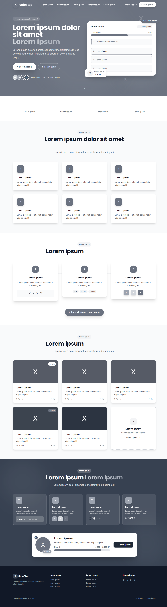
  <p>
    <i><b>Fuente</b>: Elaboración propia.</i>
  </p>
</div>

### 4.3.1.3. wireframe Mobile

El wireframe mobile adapta la estructura desktop a formatos verticales con navegación colapsable:

#### Estructura General Mobile

<div align="center">
  <p>
    <b>Gráfico</b>: Wireframe mobile del Landing de SafeStep
  </p>
  
  <p>
    <i><b>Fuente</b>: Elaboración propia.</i>
  </p>
</div>

### 4.3.1.4. Regiones del wireframe y su Función

A continuación se detalla cada región del wireframe según su función en el recorrido del usuario:

#### A. Header (Navegación Global)

El header contiene el logo de SafeStep, navegación principal con enlaces a secciones clave, y acciones de conversión (iniciar sesión, comenzar). En desktop es horizontal y visible; en mobile se colapsa en hamburger menu.

**Elementos del header:**
- Logo (enlace al inicio)
- Navegación principal: Características, Simulaciones, Tienda, FAQ
- Botones de acción: Iniciar Sesión, Comenzar Gratis

**Principios aplicados:**
- El logo siempre es visible y clickeable
- Las acciones de mayor frecuencia están a la derecha
- El botón principal ("Comenzar") tiene mayor jerarquía visual

#### B. Hero Section

El hero section es la primera impresión y el punto focal principal. Contiene el mensaje de valor central, llamada a la acción, y prueba social.

**Elementos del hero:**
- Badge de prueba social ("+50,000 usuarios")
- Título principal con gradient impact
- Subtítulo explicativo
- Dos CTAs (botón primario "Comenzar", secundario "Ver cómo funciona")
- Indicators de confianza (avatar de usuarios, rating)

**Principios aplicados:**
- Jerarquía clara: título > subtítulo > CTAs
- Prueba social inmediata
- Dos opciones para diferentes tipos de usuario

#### C. Stats Section

La sección de estadísticas proporciona evidencia cuantitativa del impacto de SafeStep.

**Estadísticas mostradas:**
- Usuarios activos (50K+)
- Módulos de simulación (5)
- Satisfacción (98%)
- Vidas preparadas (12K+)

**Principios aplicada:**
- Números redondos y fáciles de recordar
- Formato visual de grilla para scaneo rápido

#### D. Features Section (Características Principales)

Esta sección presenta las características clave de SafeStep en formato de tarjetas.

**Características mostradas:**
1. Simulaciones interactivas
2. Retroalimentación instantánea
3. Aprendizaje progresivo
4. Gamificación
5. Tienda de productos
6. Acceso multiplataforma

**Principios aplicados:**
- Formato visual uniforme (tarjetas)
- Iconografía consistente
- Brief description supporting cada feature

#### E. How It Works Section (Paso a Paso)

La sección "Cómo funciona" explica el proceso de uso de SafeStep en tres pasos simples.

**Pasos:**
1. Crea tu cuenta
2. Practica simulaciones
3. Obtén certificaciones

**Principios aplicados:**
- Narrativa secuencial (1 > 2 > 3)
- Progresión visual (izquierda a derecha en desktop)
- Conexiones visuales entre pasos

#### F. Simulations Section (Módulos)

La sección de simulaciones muestra los módulos de emergencia disponibles.

**Módulos representados:**
- RCP Básico
- Atragantamiento
- Quemaduras
- Sismos
- Hemorragias
- (+ opción para ver más)

**Principios aplicados:**
- Cards visuales con imagen representativa
- Metadata relevante (duración, rating)
- Call to action hacia "ver todos"

#### G. Gamification Section

Esta sección comunica el sistema de gamificación que mantiene usuarios comprometidos.

**Elementos de gamificación:**
- Sistema de XP
- Insignias
- Rachas
- Rankings

**Principios aplicados:**
- Muestra el sistema de rewards
- Ilustra progreso y logro

#### H. Testimonials Section

Testimonios proporcionan prueba social cualitativa.

**Representación:**
- Avatar de usuario
- Quote del usuario
- Nombre y contexto

**Principios aplicados:**
- Autenticidad percibida
- Formato citas clásico

#### I. FAQ Section (Preguntas Frecuentes)

Las preguntas frecuentes abordan objeciones comunes antes de que el usuario las tenga.

**Estructura:**
- Listado de preguntas/respuestas
- Collapsible para más información

**Principios aplicada:**
- Organización Q&A
- Expandible para no saturar

#### J. Footer

El footer proporciona navegación adicional y enlaces legales.

**Contenido del footer:**
- Links de navegación (Acerca de, Contacto, etc.)
- Redes sociales
- Legal links (Términos, Privacidad)
- Copyright

### 4.3.1.5. Principios de Diseño Aplicados en el Wireframe

El wireframe de SafeStep aplica los siguientes principios de diseño:

#### Jerarquía Visual

- El contenido se organiza por importancia: arriba > abajo
- Tamaño y peso visual reflejan jerarquía
- El "F-pattern" para scaneo de contenido

#### Espaciado Constante

- Uso consistente de gutters y margins
- Grid de 12 columnas en desktop
- Adaptación fluida a breakpoints

#### Diseño Inclusivo

- Tamaño mínimo de elementos táctiles (44x44px)
- Contraste suficiente para legibilidad
- Espacios generosos para interacción

#### Arquitectura de Información

- Navegación clara con etiquetas simples
- Agrupación lógica de contenido relacionado
- Breadcrumbs implícitos en la estructura

## 4.3.2. Landing Page Mock-up

Esta sección presenta y explica los Mock-ups del Landing Page, tanto en su versión para Desktop Web Browser como Mobile Web Browser. En la propuesta y la explicación debe evidenciarse la aplicación de los principios, elementos de diseño, diseño inclusivo y arquitectura de información, así como el Design System establecido para los productos digitales.

### 4.3.2.1. Introducción al Mock-up

El mock-up del Landing Page representa la implementación visual final del wireframe, aplicando el Design System establecido en la sección 4.1. El mock-up utiliza los colores, tipografía, espaciado y componentes definidos en Style Guidelines para crear una experiencia visual coherente con la marca SafeStep.

### 4.3.2.2. Mock-up Desktop

El mock-up desktop del Landing Page aplica los siguientes elementos del Design System:

#### Paleta de Colores Aplicada

**Primary (Azul): #0ea5e9**
- Botones primarios, highlights, iconos principales
- Aplicado en: CTAs, badges activos, hovers

**Safe (Verde): #22c55e**
- Indicadores de éxito, elementos de seguridad
- Aplicado en: estadísticas positivas, ratings

**Accent (Naranja): #f97316**
- Énfasis, alertas moderadas
- Aplicado en: botones secundarios, badges destacados

**Escala de Grises**
- Fondos: White, Gray-50, Gray-100
- Texto: Gray-900 (principal), Gray-600 (secundario)
- Bordes: Gray-200, Gray-300

#### Tipografía Aplicada

**Poppins (Headings)**
- H1: 48-64px Bold - Títulos principales
- H2: 36-48px Bold - Títulos de sección
- H3: 24-28px SemiBold - Subtítulos

**Inter (Body)**
- Body: 16px Regular
- Small: 14px Regular
- Caption: 12px Regular

#### Componentes Visuales

**Tarjetas de características:**
- Fondo: White
- Radio: 16px (rounded-2xl)
- Sombra: shadow-lg
- Padding: 32px
- Hover: translateY(-10px) + shadow-xl

**Botones:**
- Primario: bg-primary, text-white, rounded-full
- Secundario: border-white/30, text-white, rounded-full
- Altura: 48-56px
- Padding: 16px vertical, 32px horizontal

**Inputs:**
- Radio: 12px
- Borde: Gray-300
- Focus ring: primary/20

### 4.3.2.3. Mock-up Mobile

El mock-up mobile mantiene consistencia con desktop mientras adapta la experiencia a pantallas pequeñas:

#### Adaptaciones Mobile

**Diseño responsive:**
- Grid de contenido colapsa a 1 columna
- Navegación colapsada en hamburger menu
- Tarjetas de features en grid 1x6
- Spacing reducido (50-75% de desktop)

**Touch targets:**
- Todos los elementosInteractivos mínimo 44x44px
- Botones altura completa de 48px
- Espaciado entre elementos táctiles 16px

**Optimización visual mobile:**
- Imágenes optimizadas para carga rápida
- Texto legible sin zoom
- Formatos vertical scrolling

### 4.3.2.4. Vistas Detalladas por Sección

#### Hero Section - Vista Detallada

**Desktop:**
- Fondo gradiente: linear-gradient(135deg, #0c4a6e, #0369a1, #0ea5e9)
- Texto: White
- Ilustración flotante a la derecha
- Botones con shadow-lg y pulse animation en CTA principal

**Mobile:**
- Fondo similar
- Texto centrado
- Ilustración hidden o colapsada
- Stacked buttons

#### Features Section - Vista Detallada

**Grid layout:**
- Desktop: 3 columnas
- Tablet: 2 columnas
- Mobile: 1 columna

**Card design:**
- Icono centrado (64x64px)
- Título debajo de icono
- Description debajo de título
- Hover effect con elevación

#### Simulations Section - Vista Detallada

**Card design:**
- Imagen representativa superior (h-48)
- Badge superior ("Popular", "Nuevo")
- Contenido textual inferior
- Footer con metadata

**Categorías de badges:**
- Popular: primary
- Nuevo: accent
- Premium: special gradient

#### Gamification Section - Vista Detallada

**Se características:**
- Fondo gradient azul
- Tarjetas translúcidas
- Iconos grandes prominentes
- Números/stats highlight

### 4.3.2.5. Aplicación del Design System

El mock-up evidencia la aplicación del Design System a través de:

#### Consistencia Visual

- Colores utilizados consistentemente a través de secciones
- Tipografía sigue la jerarquía establecida
- Espaciado uniforme
- Bordes y radios consistentes

#### Diseño Inclusivo

- Contraste suficiente (WCAG AA mínimo)
- Estados de foco visibles
- Tamaños táctiles adecuados
- Texto alternativa para iconos

#### Accesibilidad

- Labels de form claramente asociados
- Campos de input con placeholders útiles
- Botones con texto claro
- Error states visibles

### 4.3.2.6. Referencias Visuales

Las siguiente referencias muestran el mock-up final:

#### Desktop Homepage Mock-up

<div align="center">
  <p>
    <b>Gráfico</b>: Mock-up desktop del Landing de SafeStep
  </p>
  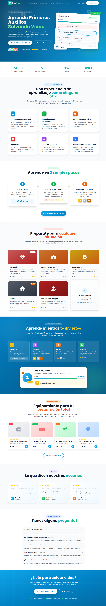
  <p>
    <i><b>Fuente</b>: Elaboración propia.</i>
  </p>
</div>

El mockup desktop muestra:
- Hero section completo con illustration
- 6 features cards en grid
- 3 steps visuales
- 6 module cards
- Gamification section con íconos
- Testimonials slider

#### Mobile Homepage Mock-up

<div align="center">
  <p>
    <b>Gráfico</b>: Mock-up mobile del Landing de SafeStep
  </p>
  
  <p>
    <i><b>Fuente</b>: Elaboración propia.</i>
  </p>
</div>

El mockup mobile muestra:
- Collapsed header con hamburger
- Hero adaptado vertical
- Features en lista vertical
- Simulaciones scrollable
- Bottom navigation hint

### 4.3.2.7. Estados Interactivos en el Mock-up

Los mockups también muestran los estados interactivos de los componentes principales:

#### Estados de Botón

- **Default**: Color fill, sin sombra
- **Hover**: Sombra incrementada, leve translate up
- **Active**: Escala reducida (0.98)
- **Disabled**: Opacidad reducida

#### Estados de Tarjeta

- **Default**: shadow-md
- **Hover**: shadow-xl, translateY(-10px)
- **Transition**: 300ms ease

#### Estados de Input

- **Default**: Gray-300 border
- **Focus**: Primary ring visible
- **Error**: Red border, mensaje visible
- **Success**: Green border, check icon

### 4.3.2.8. Diseño Responsivo General

El mock-up aplica diseño responsivo a través de:

#### Breakpoints Aplicados

- Mobile: 0-639px
- Tablet: 640-1023px
- Desktop: 1024px+

#### Comportamiento por Breakpoint

- Stacking de grids
- Collapsing de navegación
- Adjustment de espaciado
- Images optimization

#### Imágenes Responsivas

- srcset para diferentes anchos
- Lazy loading en imágenes below fold
- Placeholder durante carga

<br>
<br>

<div align="center">
    
</div>

<br>
<br>

# 4.4. Web Applications UX/UI Design

Esta sección incluye secciones internas donde se presenta y explica la propuesta visual y de interacción para las aplicaciones que constituyen la experiencia de usuario con los productos digitales.

## 4.4.1. Web Applications Wireframes

Esta sección incluye una sección interna donde se presenta y explica los Wireframes de las aplicaciones móviles. En la propuesta y la explicación debe evidenciarse la aplicación de los principios, elementos de diseño, diseño inclusivo y arquitectura de información. Utilizar para los wireframes las herramientas indicadas.

### 4.4.1.1. Introducción a Wireframes de Aplicaciones Web

Los wireframes de las aplicaciones web de SafeStep establecen la estructura funcional de cada vista antes de aplicar tratamiento visual. Cada wireframe define la posición de elementos interactivos, la arquitectura de información para cada pantalla, y el flujo de interacción esperado para completar tareas específicas.

Los wireframes han sido diseñados siguiendo los principios de mobile-first donde las funcionalidades mobile son esenciales, pero también considerando la experiencia expandida de desktop. Los wireframes se crean en escala de grises para mantener el foco en estructura y función, no en aspectos visuales.

### 4.4.1.2. Dashboard Wireframe

El Dashboard es la primera pantalla que ve el usuario después de iniciar sesión. Actúa como centro de control desde donde puede navegar a todas las funcionalidades principales.

#### Estructura del Dashboard

<div align="center">
  <p>
    <b>Gráfico</b>: Wireframe del dashboard principal de SafeStep
  </p>
  
  <p>
    <i><b>Fuente</b>: Elaboración propia.</i>
  </p>
</div>

#### Elementos Clave del Dashboard

- **Header**: Logo, búsqueda global, notificaciones, acceso a perfil
- **Sidebar**: Navegación principal con avatar y progreso visible
- **Welcome banner**: Mensaje personalizado con continuación
- **Continue learning**: Último módulo en progreso
- **Recomendaciones**: Contenido sugerido basado en historial
- **Stats**: Resumen visual de progreso

### 4.4.1.3.-learning Page (Módulos) Wireframe

La página de aprendizaje muestra los módulos disponibles y el estado de progreso del usuario en cada uno.

#### Estructura de Página de Aprendizaje

<div align="center">
  <p>
    <b>Gráfico</b>: Wireframe de la página de aprendizaje de SafeStep
  </p>
  
  <p>
    <i><b>Fuente</b>: Elaboración propia.</i>
  </p>
</div>

#### Elementos Clave

- **Breadcrumbs**: Navegación de retorno
- **Filtros por estado**: Todos/En progreso/Completado
- **Filters por categoría**: RCP, Atragantamiento, etc.
- **Módulo cards**: Imagen, título, progreso, indicador de estado

### 4.4.1.4. Simulación Page Wireframe

La página de simulación es donde el usuario practica situaciones de emergencia.

#### Estructura de Simulación

<div align="center">
  <p>
    <b>Gráfico</b>: Wireframe de la página de una simulación de SafeStep
  </p>
  
  <p>
    <i><b>Fuente</b>: Elaboración propia.</i>
  </p>
</div>

#### Elementos Clave

- **Progress bar**: Muestra avance en la simulación
- **Escenario**: Descripción de la situación
- **Opciones**: Botones de respuesta con letters (A, B, C...)
- **Feedback**: Indicación inmediata de correct/incorrect
- **Opciones de ayuda**: Pista, Saltar

### 4.4.1.5. E-commerce/Tienda Wireframe

La página de tienda muestra el catálogo de productos disponibles.

#### Estructura de Tienda

<div align="center">
  <p>
    <b>Gráfico</b>: Wireframe de la página de la tienda de SafeStep
  </p>
  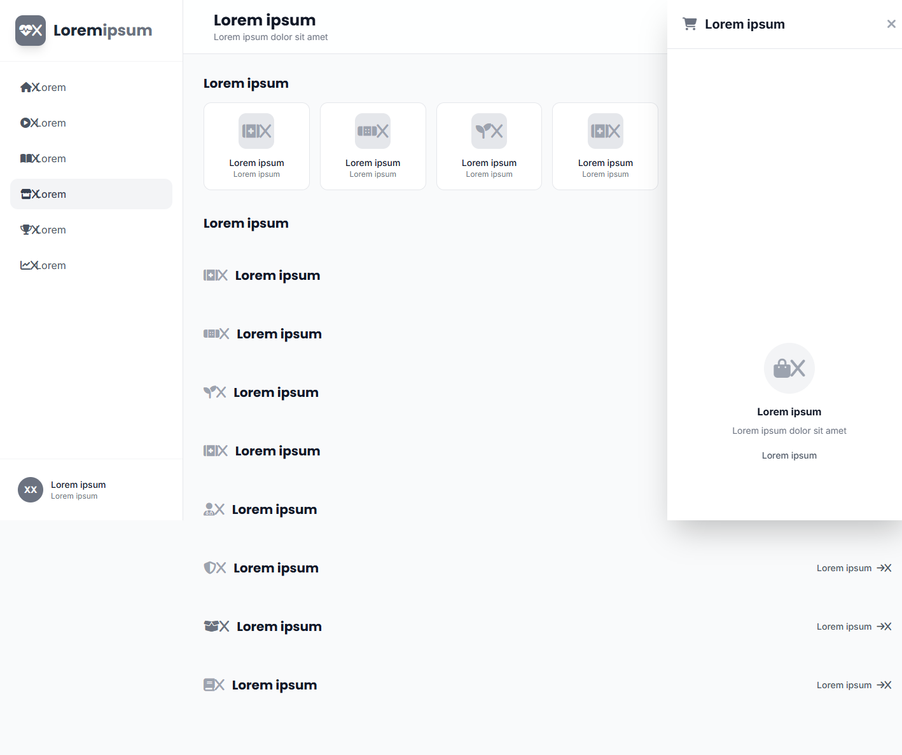
  <p>
    <i><b>Fuente</b>: Elaboración propia.</i>
  </p>
</div>

#### Elementos Clave

- **Search bar**: Búsqueda de productos
- **Filtros**: Categoría, precio rango, uso
- **Product cards**: Imagen, nombre, precio, botón agregar
- **Sort**: Opciones de ordenamiento
- **Pagination**: Navegación de resultados

### 4.4.1.6. Producto Detail Wireframe

La página de detalle de producto muestra información completa de un producto específico.

#### Estructura de Detalle de Producto

<div align="center">
  <p>
    <b>Gráfico</b>: Wireframe de un producto de SafeStep
  </p>
  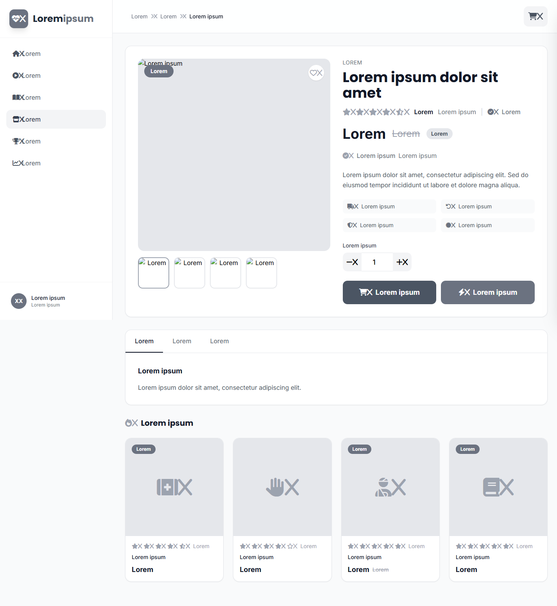
  <p>
    <i><b>Fuente</b>: Elaboración propia.</i>
  </p>
</div>

### 4.4.1.7. Perfil/Configuración Wireframe

La página de configuración y perfil del usuario.

#### Estructura de Perfil

<div align="center">
  <p>
    <b>Gráfico</b>: Wireframe del perfil de usuario de SafeStep
  </p>
  
  <p>
    <i><b>Fuente</b>: Elaboración propia.</i>
  </p>
</div>

## 4.4.2. Web Applications Wireflow Diagrams

Esta sección presenta la propuesta de Wireflows. Debe considerarse un Wireflow para cada User goal, considerando los User Persona para cada aplicación que forma parte del alcance. Es recomendable que el equipo elabore previamente los correspondientes Task Flows, para establecer un consenso sobre las rutas típicas de steps para cada User goal. Es importante recordar que la forma como se refleja un cambio en una pantalla (Wireframe) como resultado de la interacción en un flujo es agregar un paso con un Wireframe con la representación del nuevo estado. Utilizar para los Wireflows las herramientas indicadas. Cada Wireflow diagram requiere que se redacte el User goal y se complemente con una explicación del flujo especificado.

### 4.4.2.1. Metodología de Wireflows

SafeStep utiliza wireflows para documentar los flujos de interacción entre pantallas. Un wireflow representa una secuencia de pantallas relacionadas por las acciones del usuario, ilustrando cómo los cambios en una pantalla lead a estados diferentes.

Cada wireflow incluye:
- User goal: El objetivo que el usuario intenta lograr
- Secuencia de pantallas: Ilustración del flujo
- Acciones: Las interacciones que trigger cambios
- Decisiones: Puntos donde el usuario tiene opciones
- Estados alternatives: Variaciones del flujo

### 4.4.2.2. Wireflow: Iniciar Sesión

**User Goal**: El usuario desea acceder a su cuenta en SafeStep para continuar su aprendizaje.

#### Flujo Principal (Happy Path)

<div align="center">
  <p>
    <b>Gráfico</b>: Wireflow autenticación (happy path)
  </p>
  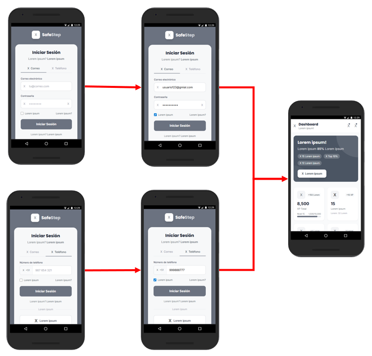
  <p>
    <i><b>Fuente</b>: Elaboración propia.</i>
  </p>
</div>

#### Flujo Alternativo

<div align="center">
  <p>
    <b>Gráfico</b>: Wireflow autenticación (alternative path)
  </p>
  
  <p>
    <i><b>Fuente</b>: Elaboración propia.</i>
  </p>
</div>

### 4.4.2.3. Wireflow: Completar una Lección

**User Goal**: El usuario desea completar una lección completa (teoría + video + evaluación).

#### Flujo Principal

<div align="center">
  <p>
    <b>Gráfico</b>: Wireflow lección
  </p>
  
  <p>
    <i><b>Fuente</b>: Elaboración propia.</i>
  </p>
</div>

### 4.4.2.4. Wireflow: Completar una Simulación

**User Goal**: El usuario desea practicar una simulación de emergencia específica.

#### Flujo Principal

<div align="center">
  <p>
    <b>Gráfico</b>: Wireflow simulacion
  </p>
  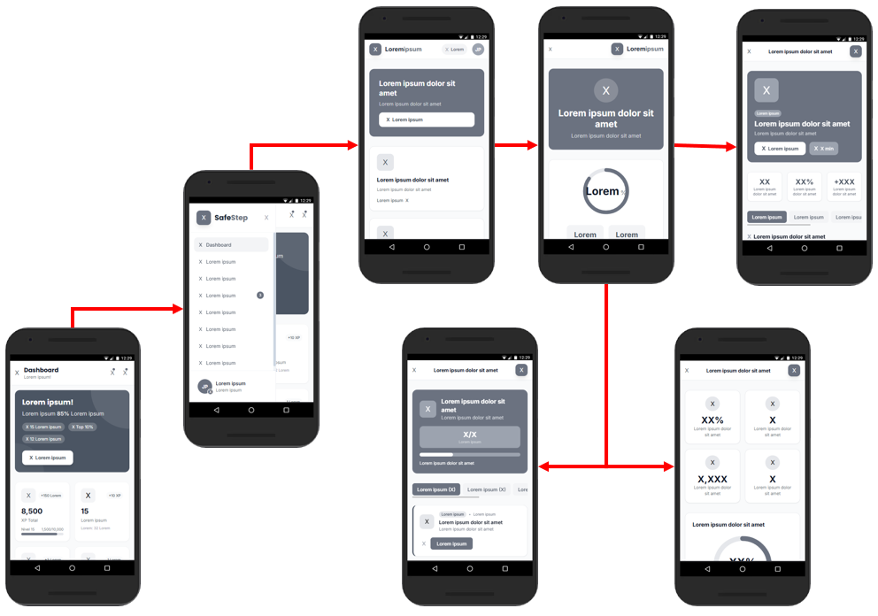
  <p>
    <i><b>Fuente</b>: Elaboración propia.</i>
  </p>
</div>

### 4.4.2.5. Wireflow: Compra en Tienda

**User Goal**: El usuario desea comprar productos de primeros auxilios.

#### Flujo Principal

<div align="center">
  <p>
    <b>Gráfico</b>: Wireflow tienda
  </p>
  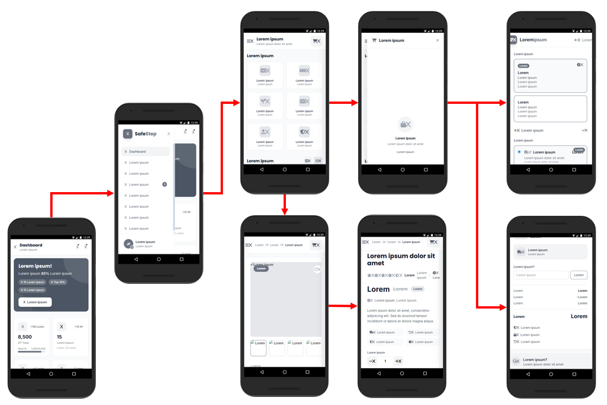
  <p>
    <i><b>Fuente</b>: Elaboración propia.</i>
  </p>
</div>

### 4.4.2.6. Wireflow: Gestionar Perfil

**User Goal**: El usuario desea actualizar su información personal y preferencias.

#### Flujo Principal

<div align="center">
  <p>
    <b>Gráfico</b>: Wireflow perfil
  </p>
  
  <p>
    <i><b>Fuente</b>: Elaboración propia.</i>
  </p>
</div>

## 4.4.3. Web Applications Mock-ups

Esta sección presenta y explica los Mock-ups de las aplicaciones. En la propuesta y la explicación debe evidenciarse la aplicación de los principios, elementos de diseño, diseño inclusivo y arquitectura de información, así como el Design System establecido para los productos digitales. Utilizar para los mock-ups las herramientas indicadas.

### 4.4.3.1. Introducción a Mock-ups

Los mock-ups de aplicaciones web representan la implementación visual final de los wireframes, aplicando el Design System establecido. Cada mock-up incorpora la paleta de colores, tipografía, componentes y estilos definidos en-style guidelines para crear experiencias visuales coherentes con la marca SafeStep.

### 4.4.3.2. Dashboard Mock-up

El mock-up del Dashboard implementa la estructura del wireframe con tratamiento visual completo:

#### Elementos Visuales

**Header:**
- Logo con gradiente azul
- Fondo blanco con shadow
- Iconos de navegación (buscar, notificaciones, perfil)

**Sidebar:**
- Fondo White
- Avatar circular con badge de nivel
- Navegación con icons + texto
- Hover states con highlight azul
- Progreso XP mostrado visualmente

**Contenido Principal:**
- Card de bienvenida con gradiente
- Cards de módulos con progress bars
- Stats con icons y colores distintivos
- Badges para progreso completado

### 4.4.3.3. Learning Page Mock-up

Mock-up de página de módulos y lecciones:

#### Elementos Visuales

**Filtros:**
- Pills con background active/inactive
- Icons por categoría
- Estados visuales claros

**Módulo Cards:**
- Imagen de fondo por categoría
- Overlay con información
- Progress bar coloreada
- Badges de estado (completado, en progreso, nuevo)
- Hover effects con escala

### 4.4.3.4. Simulación Mock-up

Mock-up de la interfaz de simulación interactiva:

#### Elementos Visuales

**Progress indicator:**
- Step indicator visual
- Números claramente visibles
- Color activo para paso actual

**Opciones:**
- Large touch targets (altura mínima 56px)
- Letter claramente visible (A, B, C)
- States: default, hover, selected, correct, incorrect
-Feedback colors: verde para correcto, rojo para incorrecto

**Escenario:**
- Box con background de alerta
- Icon representativo (X placeholder)
- Texto legible

### 4.4.3.5. Tienda Mock-up

Mock-up del catálogo de tienda:

#### Elementos Visuales

**Product Cards:**
- Imagen prominente
- Badge de descuento si aplica
- Nombre, precio, rating
- Botón "Agregar" prominente

**Filtros Sidebar:**
- Checkboxes visuales
- Range sliders para precio
- Collapsible sections

**Sorting:**
- Dropdown visual
- Icon indicating direction

### 4.4.3.6. Detalle Producto Mock-up

Mock-up de página de detalle de producto:

#### Elementos Visuales

**Galería:**
- Thumbnails navegables
- Zoom en hover
- Main image grande

**Información:**
- Precio destacado
- Selector de cantidad +/- 
- Botones de acción grandes
- Accordion para descripciones

### 4.4.3.7. Perfil Mock-up

Mock-up de configuración de perfil:

#### Elementos Visuales

**Avatar:**
- Círculo grande
- Placeholder para cambio
- Badge de verificación si aplica

**Forms:**
- Labels claramente asociadas
- Input fields con estados
- Toggle switches para preferencias
- Save button fixed o prominent

### 4.4.3.8. Aplicación de Design System en Mock-ups

Cada mock-up evidencia la aplicación del Design System:

**Colores:**
- Primario azul en CTAs principales
- Verde para éxitos/completado
- Rojo/naranja para errores/alertas
- Escala de grises para estructura

**Tipografía:**
- Poppins para headings
- Inter para cuerpo
- Jerarquía clara de tamaños

**Componentes:**
- Botones según especificación
- Form inputs con estilos
- Cards con shadow consistente
- Spacing según sistema

## 4.4.4. Web Applications User Flow Diagrams

Esta sección presenta la propuesta de User Flows. Debe considerarse un User Flow para cada User goal, considerando los User Persona para cada aplicación que forma parte del alcance. Estos User Flows deben ser consistentes con los Wireflows de los cuales se derivan. Debe recordarse que en el User Flow se incluyen los Mock-ups de las vistas o pantallas de las aplicaciones, junto con los flujos que constituyen la ruta esperada (happy path) y las rutas alternativas (unhappy paths). Utilizar para los User Flows las herramientas indicadas. Cada User Flow diagram requiere que se redacte el User goal y se complemente con una explicación de los flujos y condiciones especificados.

### 4.4.4.1. Metodología de User Flows

Los User Flows de SafeStep documentan las rutas completas que los usuarios siguen para lograr objetivos específicos. A diferencia de los wireflows que muestran la estructura técnica, los user flows muestran la experiencia desde la perspectiva del usuario.

Cada user flow incluye:
- User Goal: El objetivo del usuario
- Persona: El tipo de usuario
- Happy Path: El flujo ideal
- Unhappy Paths: Variaciones y errores
- Puntos de decisión
- Puntos de salida

### 4.4.4.2. User Flow: Aprendizaje Completo de Módulo

**User Goal**: Completar todas las lecciones de un módulo de primeros auxilios

**User Type**: Estudiante / Usuario aprendiz

#### Happy Path

<div align="center">
  <p>
    <b>Gráfico</b>: User flow aprendizaje completo módulo (Happy path)
  </p>
  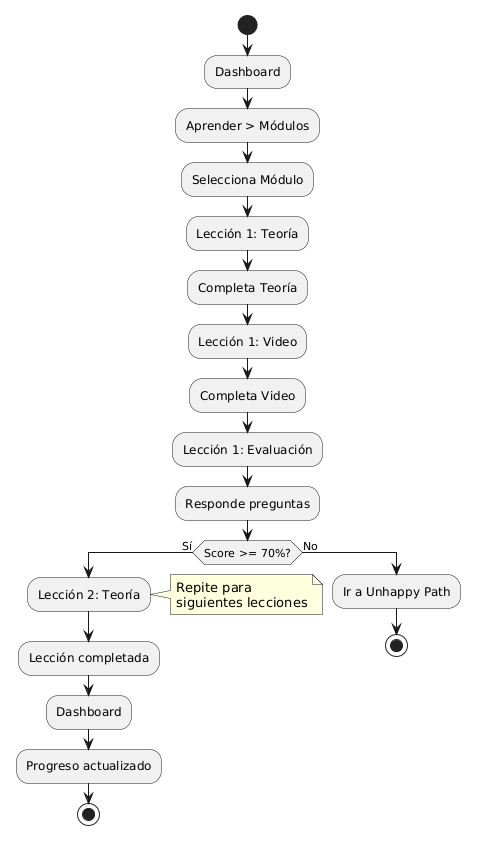
  <p>
    <i><b>Fuente</b>: Elaboración propia.</i>
  </p>
</div>

#### Unhappy Paths

**Evaluación reprobada:**

<div align="center">
  <p>
    <b>Gráfico</b>: User flow aprendizaje completo módulo (Unhappy path) parte 1
  </p>
  
  <p>
    <i><b>Fuente</b>: Elaboración propia.</i>
  </p>
</div>

**Abandonar lección:**

<div align="center">
  <p>
    <b>Gráfico</b>: User flow aprendizaje completo módulo (Unhappy path) parte 2
  </p>
  
  <p>
    <i><b>Fuente</b>: Elaboración propia.</i>
  </p>
</div>

### 4.4.4.3. User Flow: Práctica de Simulación

**User Goal**: Practicar respuestas de emergencia en simulación interactiva

**User Type**: Estudiante / Usuario que busca certificación

#### Happy Path

<div align="center">
  <p>
    <b>Gráfico</b>: User flow práctica de simulación (Happy path)
  </p>
  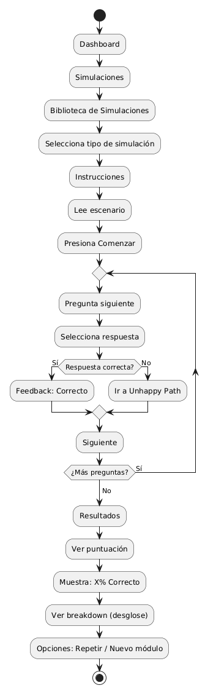
  <p>
    <i><b>Fuente</b>: Elaboración propia.</i>
  </p>
</div>

#### Unhappy Paths

**Respuesta incorrecta:**

<div align="center">
  <p>
    <b>Gráfico</b>: User flow práctica de simulación (Unhappy path) parte 1
  </p>
  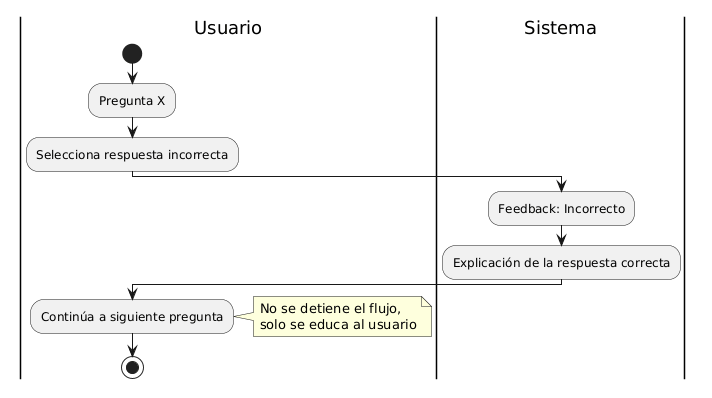
  <p>
    <i><b>Fuente</b>: Elaboración propia.</i>
  </p>
</div>

**Usar pista:**

<div align="center">
  <p>
    <b>Gráfico</b>: User flow práctica de simulación (Unhappy path) parte 2
  </p>
  
  <p>
    <i><b>Fuente</b>: Elaboración propia.</i>
  </p>
</div>

### 4.4.4.4. User Flow: Compra de Producto

**User Goal**: Adquirir productos de primeros auxilios

**User Type**: Comprador / Cliente

#### Happy Path

<div align="center">
  <p>
    <b>Gráfico</b>: User flow compra de producto (Happy path)
  </p>
  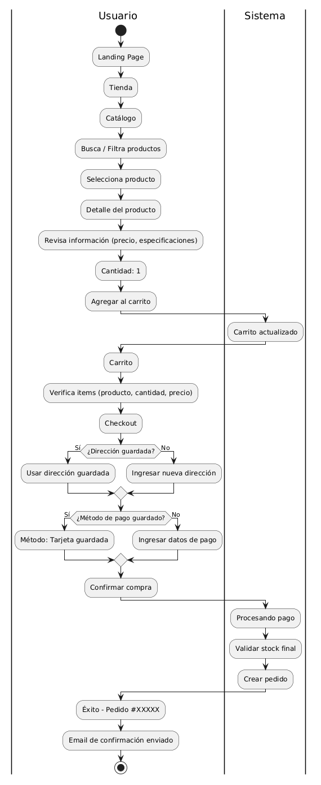
  <p>
    <i><b>Fuente</b>: Elaboración propia.</i>
  </p>
</div>

#### Unhappy Paths

**Producto sin stock:**

<div align="center">
  <p>
    <b>Gráfico</b>: User flow compra de producto (Unhappy path) parte 1
  </p>
  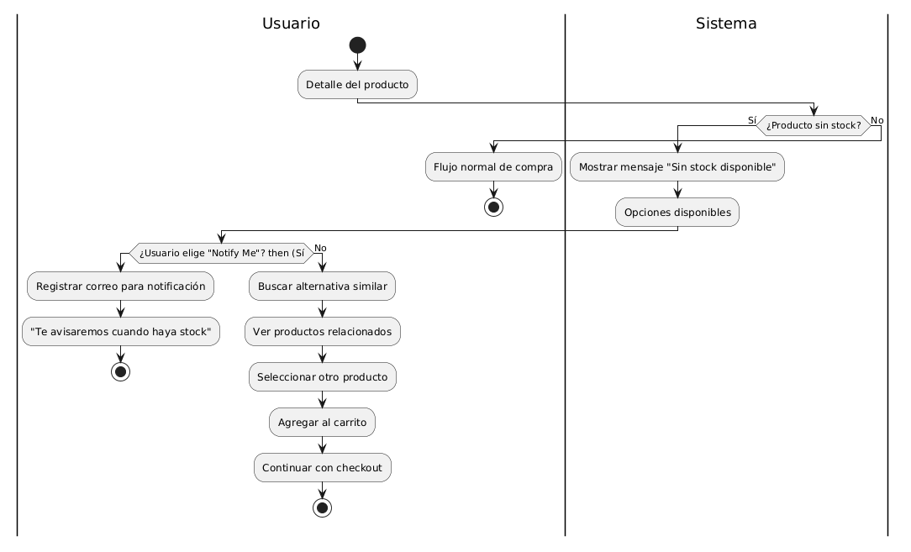
  <p>
    <i><b>Fuente</b>: Elaboración propia.</i>
  </p>
</div>

**Pago rechazado:**

<div align="center">
  <p>
    <b>Gráfico</b>: User flow compra de producto (Unhappy path) parte 2
  </p>
  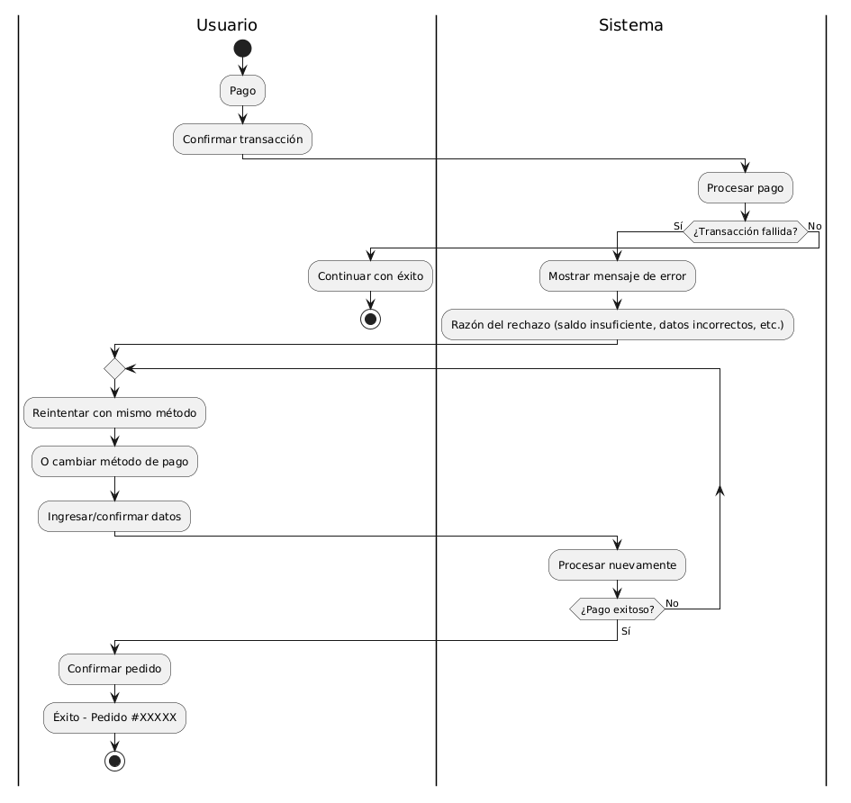
  <p>
    <i><b>Fuente</b>: Elaboración propia.</i>
  </p>
</div>

**Carrito vacío:**

<div align="center">
  <p>
    <b>Gráfico</b>: User flow compra de producto (Unhappy path) parte 3
  </p>
  
  <p>
    <i><b>Fuente</b>: Elaboración propia.</i>
  </p>
</div>

### 4.4.4.5. User Flow: Registro de Nuevo Usuario

**User Goal**: Crear una cuenta en SafeStep

**User Type**: Visitante nuevo

#### Happy Path

<div align="center">
  <p>
    <b>Gráfico</b>: User flow registro de nuevo usuario (Happy path)
  </p>
  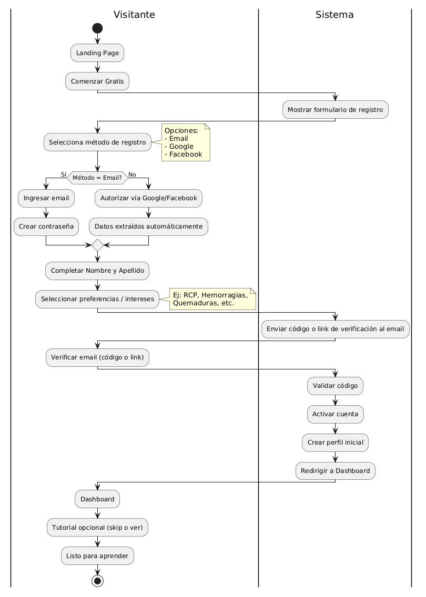
  <p>
    <i><b>Fuente</b>: Elaboración propia.</i>
  </p>
</div>

#### Unhappy Paths

**Email ya registrado:**

<div align="center">
  <p>
    <b>Gráfico</b>: User flow registro de nuevo usuario (Unhappy path) parte 1
  </p>
  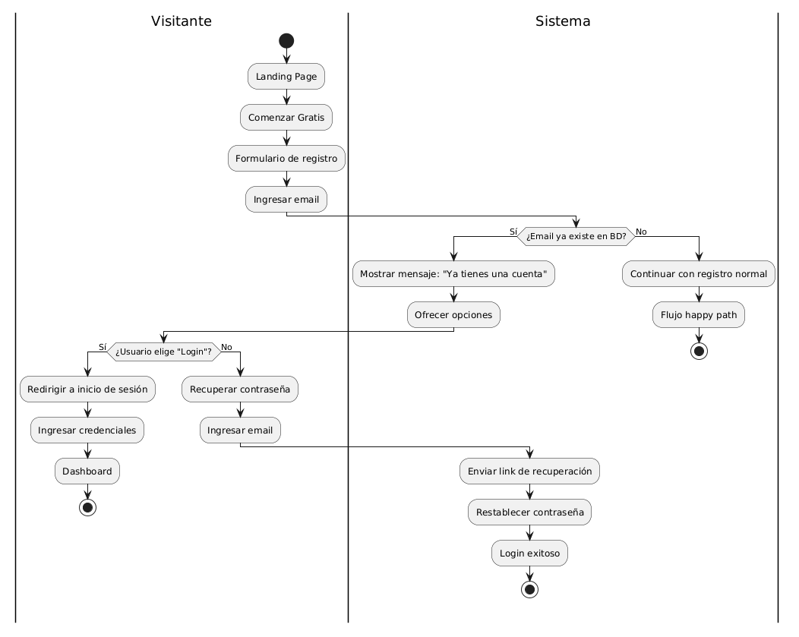
  <p>
    <i><b>Fuente</b>: Elaboración propia.</i>
  </p>
</div>

**Código verificación expirado:**

<div align="center">
  <p>
    <b>Gráfico</b>: User flow registro de nuevo usuario (Unhappy path) parte 2
  </p>
  
  <p>
    <i><b>Fuente</b>: Elaboración propia.</i>
  </p>
</div>

### 4.4.4.6. User Flow: Recuperación de Contraseña

**User Goal**: Recuperar acceso a su cuenta

**User Type**: Usuario con cuenta pero sin acceso

#### Happy Path

<div align="center">
  <p>
    <b>Gráfico</b>: User flow recuperación de contraseña (Happy path)
  </p>
  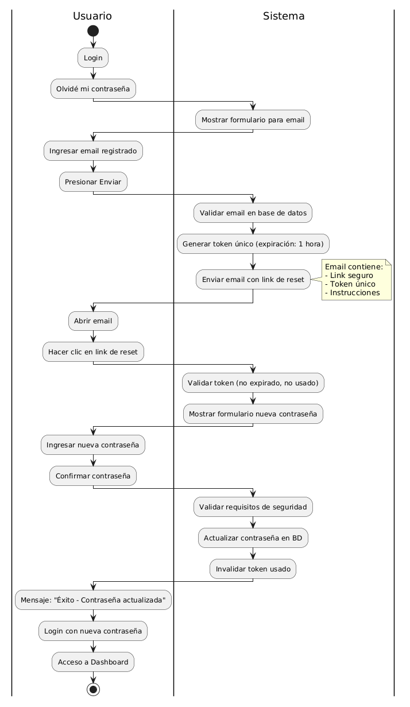
  <p>
    <i><b>Fuente</b>: Elaboración propia.</i>
  </p>
</div>

#### Unhappy Paths

**Email no encontrado:**

<div align="center">
  <p>
    <b>Gráfico</b>: User flow recuperación de contraseña (Unhappy path) parte 1
  </p>
  
  <p>
    <i><b>Fuente</b>: Elaboración propia.</i>
  </p>
</div>

**Token expirado:**

<div align="center">
  <p>
    <b>Gráfico</b>: User flow recuperación de contraseña (Unhappy path) parte 2
  </p>
  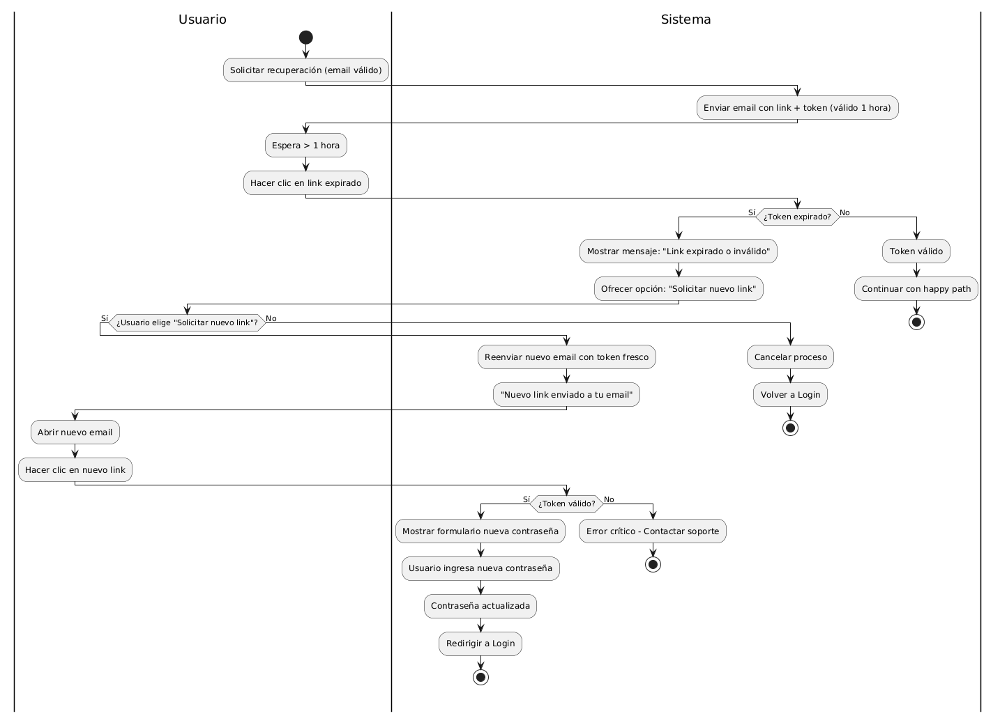
  <p>
    <i><b>Fuente</b>: Elaboración propia.</i>
  </p>
</div>

### 4.4.4.7. Consideraciones de User Flows

Los User Flows de SafeStep consideran:

**Accesibilidad:**
- Rutas alternativas para usuarios con limitaciones
- Opciones de voz donde aplica
- Simplicidad para usuarios no técnicos

**Recuperación:**
- Puntos claros de salida y retorno
- Mensajes claros en errores
- Opciones de recovery sencillas

**Consistencia:**
- Similar estructura de flows
- Patrones familiares
- Terminología consistente

<br>
<br>

<div align="center">
    
</div>

<br>
<br>

# 4.5. Web Applications Prototyping

Esta sección incluye Prototipos de UI para Desktop y Mobile Web Browser con simulación de interacción y navegación, acorde con la propuesta de paths de User Flow Diagrams. Esta sección inicia con una introducción en la que se explica los principales criterios para las decisiones de interacción. Es importante evidenciar la relación con las decisiones de arquitectura de información, en particular sobre el sistema de navegación y los tipos de interacciones seleccionadas. Para cada caso debe incluirse 1 screenshot de video y un enlace a un video subido a Microsoft Stream para cada aplicación, en el que se demuestre y explique los principales flujos de interacción que cubren los prototipos.

## 4.5.1. Introducción al Prototipado

El prototipado de SafeStep representa la culminación del proceso de diseño, donde las decisiones abstractas de arquitectura, wireframes y mockups se traducen en experiencias interactivas funcionales. Los prototipos demuestran cómo los usuarios realmente interactuarán con la aplicación, revelando aspectos que no son evidentes en representaciones estáticas.

### 4.5.1.1. Objetivos del Prototipado

Los prototipos de SafeStep cumplen varios objetivos fundamentales:

**Validación de Interacción:**
- Los prototipos permiten probar que los flujos de interacción funcionan como se anticipó
- Se identifican fricciones y puntos de confusión antes del desarrollo
- Los usuarios pueden proporcionar feedback sobre la experiencia real

**Comunicación con Desarrolladores:**
- Los prototipos sirven como especificación técnica para desarrolladores
- Muestran exactamente cómo deben comportarse los elementos
- Reducen la brecha entre diseño y implementación

**Demostración de Valor:**
- Los prototipos permiten stakeholders visualizar el producto final
- Facilitan la validación con usuarios y patrocinadores
- Crean hype y expectativa positiva

### 4.5.1.2. Criterios de Interacción

Las decisiones de interacción en los prototipos de SafeStep siguen criterios específicos:

#### Facilidad de Uso

- Cada interacción es discoverable (el usuario sabe que puede interactuar)
- Los resultados de las acciones son predecibles
- Los errores son difíciles de cometer y fáciles de recover

#### Consistencia

- Patrones de interacción similares a través de la aplicación
- Elementos similares se comportan de manera similar
- La experiencia es predecible una vez aprendido el patrón

#### Eficiencia

- Las acciones frecuentes son rápidas de realizar
- El número de pasos para desarrollarlo es mínimo
- Los atajos están disponibles para usuarios experimentados

#### Retroalimentación

- Toda acción tiene respuesta visual inmediata
- Los estados de carga se comunican claramente
- El usuario siempre sabe dónde está y qué puede hacer

### 4.5.1.3. Relación con Arquitectura de Información

Los prototipos evidencian las decisiones de arquitectura de información tomadas en la sección 4.2:

**Sistema de Navegación:**
- El header sticky proporciona navegación constante
- Los breadcrumbs muestran ubicación y rutas de retorno
- La navegación lateral es accesible y predecible

**Organización de Contenido:**
- El contenido se agrupa según los esquemas definidos
- Las etiquetas son consistentes con el labeling system
- La jerarquía visual refleja la organización

**Búsqueda:**
- La búsqueda global es accesible desde cualquier vista
- Los filtros son claramente visibles y aplicables
- Los resultados se presentan según lo especificado

## 4.5.2. Prototipo Desktop

El prototipo desktop presenta la experiencia de escritorio completa, optimizada para monitores de computadora y navegación con mouse/teclado.

### 4.5.2.1. Descripción General del Prototipo Desktop

El prototipo desktop de SafeStep recrea la experiencia completa en un factor de forma de escritorio tradicional. Las interacciones están optimizadas para navegación mediante puntero (mouse) y entrada de teclado.

#### Características Técnicas

**Resolución:**
- Optimizado para 1024px a 1920px de ancho
- Breakpoints: 1024, 1280, 1440, 1920
- escalable con diseño fluida

**Interacciones:**
- Hover states para feedback visual
- Click para activación
- Drag and drop donde aplica
- Keyboard navigation soporte completo

**Componentes Desktop:**

Las siguientes vistas están incluidas en el prototipo desktop:

1. **Dashboard** - Vista principal del usuario
2. **Learning Hub** - Navegación de módulos
3. **Lección** - Contenido de teoría/video
4. **Simulación** - Práctica interactiva
5. **Tienda** - Catálogo de productos
6. **Carrito** - Proceso de checkout
7. **Mi Perfil** - Configuración

### 4.5.2.2. Prototipo Desktop - Dashboard

El prototipo del dashboard muestra la pantalla principal después del login:

#### Screenshot de Referencia

<div align="center">
  <p>
    <b>Gráfico</b>: Prototipo desktop dashboard
  </p>
  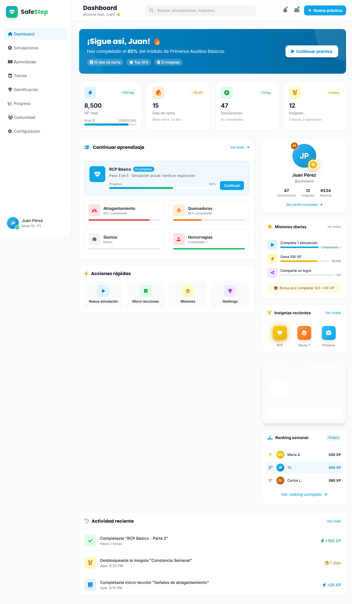
  <p>
    <i><b>Fuente</b>: Elaboración propia.</i>
  </p>
</div>

#### Descripción Visual

El dashboard desktop muestra:
- Header con logo, búsqueda, notificaciones, avatar
- Sidebar izquierdo con navegación principal
- Área de contenido principal con:
  - Mensaje de bienvenida personalizado
  - Card de "Continuar aprendiendo" con progreso
  - Recomendaciones de módulos
  - Stats de progreso del usuario

#### Interacciones Demostradas

- Click en navegación sidebar cambia contenido
- Hover en cards muestra énfasis
- Click en "Continuar" lleva a última lección
- Click en recomendaciones lleva a módulos sugeridos
- Notificaciones dropdown con click
- Perfil dropdown con opciones

#### Explicación del Flujo

El flujo principal mostrado:
1. Usuario llega al dashboard
2. Ve progreso actual y recomendaciones
3. Decide continuar aprendiendo o explorar
4. Navegación le permite ir a cualquier sección
5. Notificaciones informan de updates

### 4.5.2.3. Prototipo Desktop - Simulación Interactiva

El prototipo de simulación muestra la experiencia de práctica:

#### Screenshot de Referencia

<div align="center">
  <p>
    <b>Gráfico</b>: Prototipo desktop simulación parte 1
  </p>
  
  <p>
    <i><b>Fuente</b>: Elaboración propia.</i>
  </p>
</div>

<div align="center">
  <p>
    <b>Gráfico</b>: Prototipo desktop simulación parte 2
  </p>
  
  <p>
    <i><b>Fuente</b>: Elaboración propia.</i>
  </p>
</div>

<div align="center">
  <p>
    <b>Gráfico</b>: Prototipo desktop simulación parte 3
  </p>
  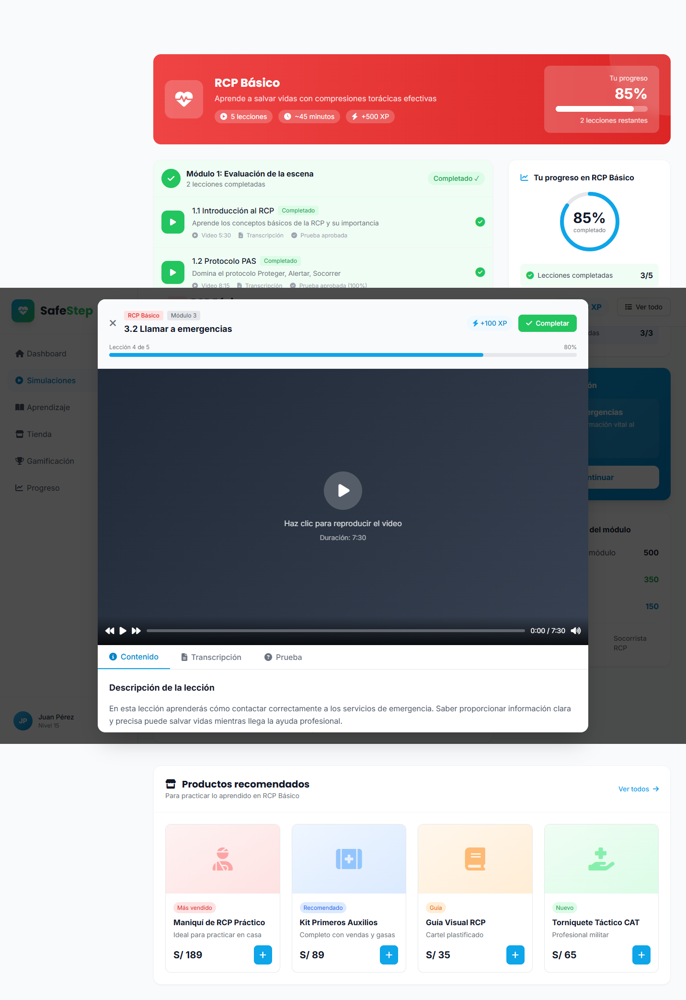
  <p>
    <i><b>Fuente</b>: Elaboración propia.</i>
  </p>
</div>

#### Descripción Visual

La página de simulación muestra:
- Header con indicador de progreso
- Área de escenario con situación
- Opciones de respuesta en formato de cards
- Botones de ayuda y controls

#### Interacciones Demostradas

- Click en opción selecciona respuesta
- Feedback inmediato (correcto/incorrecto)
- Botón "Siguiente" para avanzar
- Botón "Pista" muestra ayuda
- Timer counting down

#### Explicación del Flujo

El flujo de simulación:
1. Usuario selecciona simulación
2. Lee escenario inicial
3. Responde pregunta 1
4. Recibe feedback inmediato
5.Avanza a pregunta siguiente
6. Completa todas las preguntas
7. Ve resultados finales

### 4.5.2.4. Prototipo Desktop - Proceso de Compra

El prototipo de checkout muestra el flujo de compra:

#### Screenshot de Referencia

<div align="center">
  <p>
    <b>Gráfico</b>: Prototipo desktop proceso de compra parte 1
  </p>
  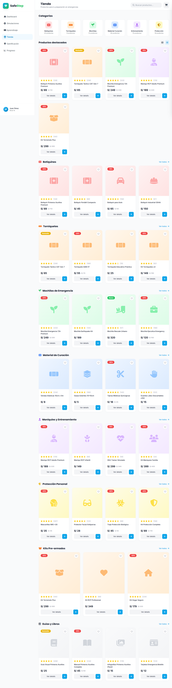
  <p>
    <i><b>Fuente</b>: Elaboración propia.</i>
  </p>
</div>

<div align="center">
  <p>
    <b>Gráfico</b>: Prototipo desktop proceso de compra parte 2
  </p>
  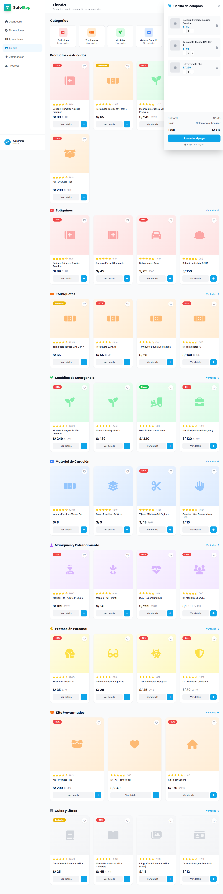
  <p>
    <i><b>Fuente</b>: Elaboración propia.</i>
  </p>
</div>

<div align="center">
  <p>
    <b>Gráfico</b>: Prototipo desktop proceso de compra parte 3
  </p>
  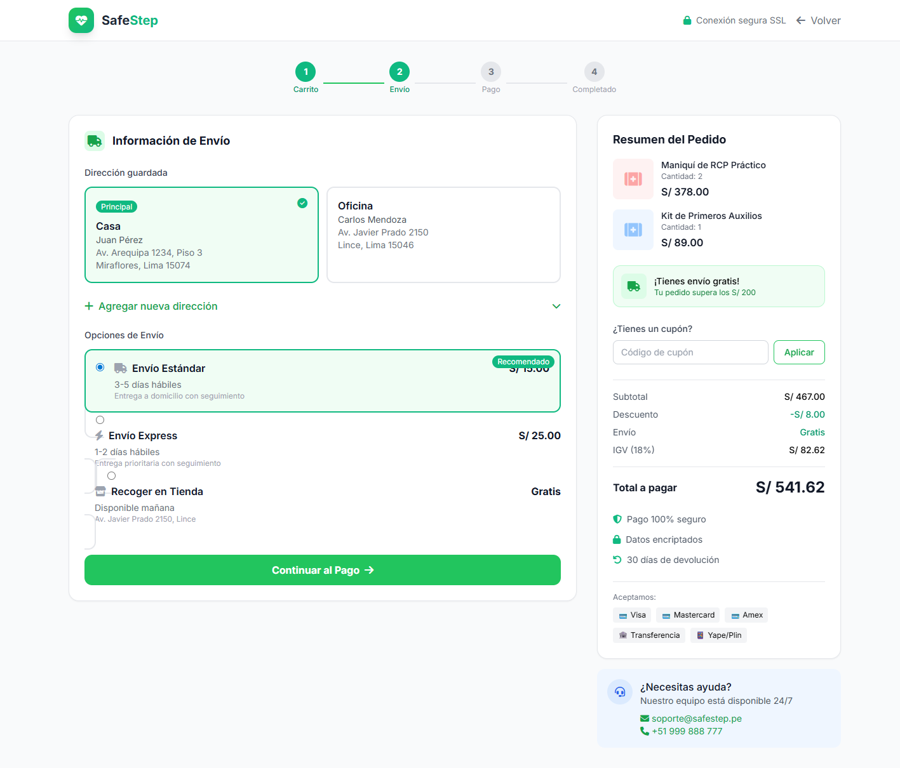
  <p>
    <i><b>Fuente</b>: Elaboración propia.</i>
  </p>
</div>

<div align="center">
  <p>
    <b>Gráfico</b>: Prototipo desktop proceso de compra parte 4
  </p>
  
  <p>
    <i><b>Fuente</b>: Elaboración propia.</i>
  </p>
</div>

<div align="center">
  <p>
    <b>Gráfico</b>: Prototipo desktop proceso de compra parte 5
  </p>
  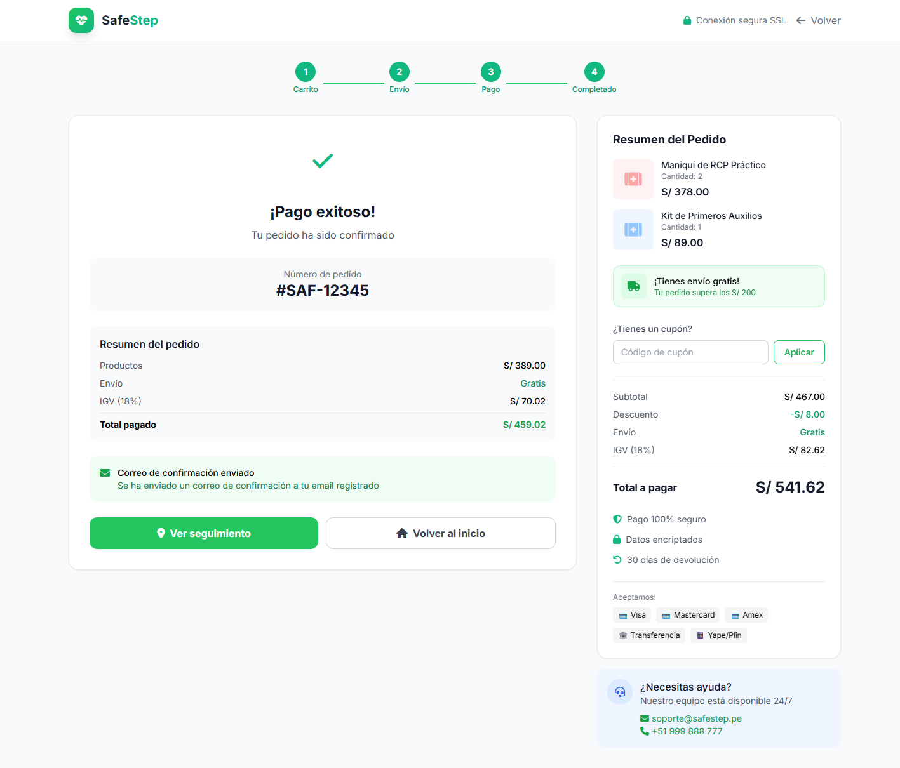
  <p>
    <i><b>Fuente</b>: Elaboración propia.</i>
  </p>
</div>

#### Descripción Visual

El checkout muestra:
- Pasos claramente marcados (1. Carrito, 2. Envío, 3. Pago, 4. Confirmación)
- Lista de productos en carrito
- Forms de información
- Resumen de orden

#### Interacciones Demostradas

- Navegación entre pasos
- Validación de forms en tiempo real
- Aplicación de cupones
- Selección de método de pago
- Confirmación de orden

#### Explicación del Flujo

El flujo de compra:
1. Revisa items en carrito
2. Ingresa/confirma dirección
3. Selecciona método de pago
4. Revisa orden completa
5. Confirma y paga
6. Recibe confirmación

### 4.5.2.5. Video Prototipo Desktop

El video del prototipo desktop demuestra las interacciones principales:

#### Contenido del Video

El video incluye:
1. Recorrido por dashboard (0:00-0:30)
2. Navegación a módulos (0:30-1:00)
3. Completar una lección (1:00-2:00)
4. Práctica de simulación (2:00-3:00)
5. Exploración de tienda (3:00-4:00)
6. Proceso de compra (4:00-5:30)

#### Enlace de Video

<div align="center">
  <p>
    <b>Gráfico</b>: Video del prototipo desktop
  </p>
  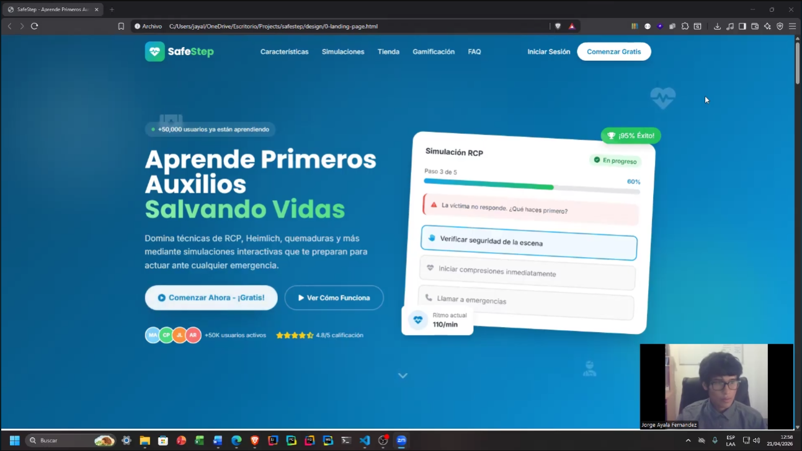
  <p>
    <i><b>Fuente</b>: Elaboración propia.</i>
  </p>
</div>

Enlace del video: <a href="https://youtu.be/_nZcADweJ3k">https://youtu.be/_nZcADweJ3k</a>

## 4.5.3. Prototipo Mobile

El prototipo mobile presenta la experiencia optimizada para dispositivos táctiles, especialmente smartphones.

### 4.5.3.1. Descripción General del Prototipo Mobile

El prototipo mobile de SafeStep recrea la experiencia en formato móvil, considerando las limitaciones y fortalezas de dispositivos táctiles.

#### Características Técnicas

**Resolución:**
- Optimizado para 320px a 428px de ancho
- Breakpoints: 320, 375, 414, 428
- Viewport meta tag configurado correctamente

**Interacciones:**
- Touch para todas las acciones
- Swipe gestures para navegación
- Pull-to-refresh donde aplica
- Gestures de zoom disponibles

**Componentes Mobile:**

Las siguientes vistas están incluidas:

1. **Home Mobile** - Dashboard adaptado
2. **Aprendizaje Mobile** - Contenido vertical scroll
3. **Simulación Mobile** - Tarjetas táctiles
4. **Tienda Mobile** - Grid optimizado
5. **Checkout Mobile** - Forms verticales

### 4.5.3.2. Prototipo Mobile - Dashboard

El prototipo del dashboard móvil:

#### Screenshot de Referencia

<div align="center">
  <p>
    <b>Gráfico</b>: Prototipo mobile dashboard
  </p>
  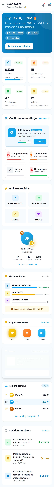
  <p>
    <i><b>Fuente</b>: Elaboración propia.</i>
  </p>
</div>

#### Descripción Visual

El dashboard móvil muestra:
- Header compacto con hamburger menú
- Contenido en layout vertical scroll
- Bottom navigation bar para acceso rápido
- Cards apiladas verticalmente

#### Interacciones Demostradas

- Hamburger menu abre drawer
- Pull down para refresh
- Scroll vertical estándar
- Bottom nav clicks cambian vista

### 4.5.3.3. Prototipo Mobile - Simulación

El prototipo de simulación móvil:

#### Screenshot de Referencia

<div align="center">
  <p>
    <b>Gráfico</b>: Prototipo mobile simulación parte 1
  </p>
  
  <p>
    <i><b>Fuente</b>: Elaboración propia.</i>
  </p>
</div>

<div align="center">
  <p>
    <b>Gráfico</b>: Prototipo mobile simulación parte 2
  </p>
  
  <p>
    <i><b>Fuente</b>: Elaboración propia.</i>
  </p>
</div>

<div align="center">
  <p>
    <b>Gráfico</b>: Prototipo mobile simulación parte 3
  </p>
  
  <p>
    <i><b>Fuente</b>: Elaboración propia.</i>
  </p>
</div>

#### Descripción Visual

La simulación móvil muestra:
- Progreso en header
- Tarjetas de respuesta grandes (touch-friendly)
- Espacio suficiente entre opciones
- Botones de control accesibles

#### Interacciones Demostradas

- Tap simple en opciones
- Swipe entre preguntas (opcional)
- Botones grandes y táctiles
- Feedback visual claro

### 4.5.3.4. Prototipo Mobile - Tienda

El prototipo de tienda móvil:

#### Screenshot de Referencia

<div align="center">
  <p>
    <b>Gráfico</b>: Prototipo mobile proceso de compra parte 1
  </p>
  
  <p>
    <i><b>Fuente</b>: Elaboración propia.</i>
  </p>
</div>

<div align="center">
  <p>
    <b>Gráfico</b>: Prototipo mobile proceso de compra parte 2
  </p>
  
  <p>
    <i><b>Fuente</b>: Elaboración propia.</i>
  </p>
</div>

<div align="center">
  <p>
    <b>Gráfico</b>: Prototipo mobile proceso de compra parte 3
  </p>
  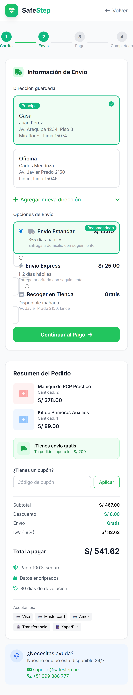
  <p>
    <i><b>Fuente</b>: Elaboración propia.</i>
  </p>
</div>

<div align="center">
  <p>
    <b>Gráfico</b>: Prototipo mobile proceso de compra parte 4
  </p>
  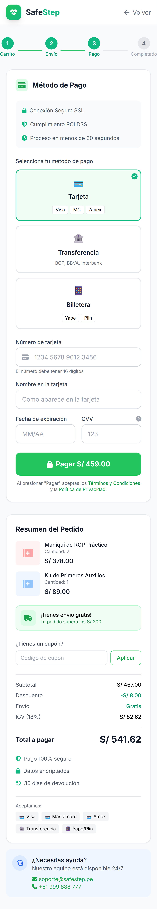
  <p>
    <i><b>Fuente</b>: Elaboración propia.</i>
  </p>
</div>

<div align="center">
  <p>
    <b>Gráfico</b>: Prototipo mobile proceso de compra parte 5
  </p>
  
  <p>
    <i><b>Fuente</b>: Elaboración propia.</i>
  </p>
</div>

#### Descripción Visual

La tienda móvil muestra:
- Product grid 2 columnas
- Filtros en sheet inferior
- Carrito en badge de header
- Checkout simplificado

### 4.5.3.5. Video Prototipo Mobile

El video del prototipo mobile demuestra las interacciones touch:

#### Contenido del Video

El video incluye:
1. App launch y splash (0:00-0:10)
2. Login en móvil (0:10-0:30)
3. Navegación bottom nav (0:30-1:00)
4. Exploración de módulos (1:00-1:30)
5. Completar lección móvil (1:30-2:30)
6. Tienda y compra (2:30-4:00)

#### Enlace de Video

<div align="center">
  <p>
    <b>Gráfico</b>: Video del prototipo mobile
  </p>
  
  <p>
    <i><b>Fuente</b>: Elaboración propia.</i>
  </p>
</div>

Enlace del video: <a href="https://youtu.be/cFe5_H0TDsA">https://youtu.be/cFe5_H0TDsA</a>

## 4.5.4. Flujos de Interacción Principales

Los prototipos demuestran los flujos de interacción principales de SafeStep:

### 4.5.4.1. Flow: Onboarding

El flujo de onboarding introduce nuevos usuarios a la plataforma:

```
[1. Landing] -> [Clic "Comenzar"] -> [Registro] -> [Onboarding:
    | Seleccionar intereses] -> [Recomendaciones basadas] ->
    | [Dashboard]
```

**Puntos clave demostrados:**
- Proceso de registro fluido
- Personalización inicial
- Introducción suave a la plataforma

### 4.5.4.2. Flow: Aprendizaje

El flujo muestra cómo usuarios aprenden:

```
[1. Dashboard] -> [Ir a Aprender] -> [Seleccionar Módulo] ->
    | [Lección 1: Teoría] -> [Completar] ->
    | [Lección 1: Video] -> [Completar] ->
    | [Lección 1: Evaluación] -> [Completar] ->
    | [Certificado] -> [Siguiente Módulo]
```

**Puntos clave demostrados:**
- Progresión clara dentro de módulos
- Feedback después de cada etapa
- Motivación con certificado

### 4.5.4.3. Flow: Simulación

El flujo de práctica muestra interacción:

```
[1. Dashboard] -> [Simulaciones] -> [Seleccionar] ->
    | [Instrucciones] -> [Comenzar] ->
    | [Preguntas] -> [Respuestas] -> [Feedback] ->
    | [Resultados]
```

**Puntos clave demostrados:**
- Presión de tiempo (opcional)
- Feedback inmediato
- Aprender de errores

### 4.5.4.4. Flow: Compra

El flujo de compra evidencia el e-commerce:

```
[1. Tienda] -> [Productos] -> [Detalle] -> [Agregar] ->
    | [Carrito] -> [Checkout] -> [Pago] ->
    | [Confirmación] -> [Tracking]
```

**Puntos clave demostrados:**
- Proceso claro de checkout
- Confirmaciones en cada paso
- Acceso a seguimiento de orden

## 4.5.5. Herramientas Utilizadas

Los prototipos fueron creados usando las siguientes herramientas:

### Herramientas de Prototipado

- **Figma**: Herramienta principal para creación de prototipos
- **Principle**: Para micro-interacciones
- **Prototype**: Para prototipado avanzado
- **Adobe XD**: Alternativa para otras vistas

### Especificaciones Técnicas

El prototipo cumple con:
- HTML/CSS funcional
- JavaScript básico para interacciones
- Responsive adaptation
- Transiciones suaves 60fps
- Loading states apropiados

<br>
<br>

<div align="center">
    
</div>

<br>
<br>

# 4.6. Domain-Driven Software Architecture

En esta sección se detalla la arquitectura de software de **SafeStep**, empleando los principios de **Domain-Driven Design (DDD)** para asegurar una alineación precisa entre las necesidades del dominio médico y la implementación técnica. El proceso de diseño se divide en dos fases fundamentales: primero, el refinamiento de la lógica de negocio mediante el **Design-Level Event Storming**, donde se identifican los agregados y políticas que rigen el sistema. Posteriormente, se aplica el **Modelo C4** para documentar la estructura del software en tres niveles de abstracción (Contexto, Contenedores y Componentes). Este enfoque permite visualizar desde las interacciones macro con sistemas externos hasta la organización interna de los módulos en **Spring Boot**, garantizando una arquitectura escalable, modular y centrada en ofrecer una experiencia de aprendizaje y equipamiento óptima para estudiantes y brigadistas.

## 4.6.1. Design-Level Event Storming

En esta fase, el equipo aplica la técnica de **Design-Level Event Storming** para refinar la comprensión del dominio de SafeStep y descubrir el modelo de software subyacente. Partiendo de los eventos de dominio clave identificados en el *Big Picture Event Storming*, se profundiza en la lógica de negocio para definir los comandos que los desencadenan, los actores que los inician y las políticas (reglas de negocio) que los gobiernan. Este proceso colaborativo permite identificar los agregados (Aggregates), que son los componentes centrales del modelo de dominio, como `Usuario`, `Simulacion`, `Curso` y `Orden`. El resultado es un mapa detallado que sirve como base para el diseño de los componentes de software, asegurando que la arquitectura esté alineada con las reglas y flujos de trabajo del mundo real de la capacitación en primeros auxilios y el comercio electrónico.

### 4.6.1.1. Fase 1 Unstructured Exploration (Lluvia de ideas)

En esta fase se realiza una lluvia de ideas masiva de los hechos significativos del negocio denominados domain events, los cuales se registran en notas naranjas y se redactan obligatoriamente en tiempo pasado, sin priorizar inicialmente el orden o la duplicidad de los mismos.

<div align="center">
    <a href="https://miro.com/app/live-embed/uXjVGlN0dvA=/?focusWidget=3458764667282704465&embedMode=view_only_without_ui&embedId=667671003239">https://miro.com/app/live-embed/uXjVGlN0dvA=/?focusWidget=3458764667282704465&embedMode=view_only_without_ui&embedId=667671003239</a>
    <br>
    <sub><em>Haz clic en la imagen para ver el tablero en Miro</em></sub>
</div>

### 4.6.1.2. Fase 2 Timelines (Línea de tiempo)

Consiste en organizar los domain events en orden cronológico, comenzando por el "happy path" (escenario de éxito). Posteriormente, se integran los escenarios alternativos y se refina el flujo eliminando duplicados o corrigiendo eventos erróneos para asegurar la coherencia del proceso.

<div align="center">
    <a href="https://miro.com/app/live-embed/uXjVGlN0dvA=/?focusWidget=3458764667285676558&embedMode=view_only_without_ui&embedId=667671003239">https://miro.com/app/live-embed/uXjVGlN0dvA=/?focusWidget=3458764667285676558&embedMode=view_only_without_ui&embedId=667671003239</a>
    <br>
    <sub><em>Haz clic en la imagen para ver el tablero en Miro</em></sub>
</div>

### 4.6.1.3. Fase 3 Pain Points (Puntos críticos)

Se analiza la línea de tiempo para identificar ineficiencias como cuellos de botella, procesos manuales o vacíos de información. Estos puntos se señalizan con notas rosadas rotadas (en forma de diamante) para asegurar que sean abordados durante el diseño técnico.

<div align="center">
    <a href="https://miro.com/app/live-embed/uXjVGlN0dvA=/?focusWidget=3458764667285757095&embedMode=view_only_without_ui&embedId=667671003239">https://miro.com/app/live-embed/uXjVGlN0dvA=/?focusWidget=3458764667285757095&embedMode=view_only_without_ui&embedId=667671003239</a>
    <br>
    <sub><em>Haz clic en la imagen para ver el tablero en Miro</em></sub>
</div>

### 4.6.1.4. Fase 4 Pivotal Events (Eventos cruciales)

Se identifican eventos de negocio significativos que marcan un cambio de fase o contexto en el proceso. Estos se señalan con una barra vertical y son los principales indicadores para definir los límites de los Bounded Contexts (módulos del sistema).

<div align="center">
    <a href="https://miro.com/app/live-embed/uXjVGlN0dvA=/?focusWidget=3458764667285757655&embedMode=view_only_without_ui&embedId=667671003239">https://miro.com/app/live-embed/uXjVGlN0dvA=/?focusWidget=3458764667285757655&embedMode=view_only_without_ui&embedId=667671003239</a>
    <br>
    <sub><em>Haz clic en la imagen para ver el tablero en Miro</em></sub>
</div>

### 4.6.1.5. Fase 5 Commands (Comandos)

Describe la acción o el desencadenante que activa un evento o flujo de eventos. Se redacta en imperativo y se representa con notas azul claro. Si el comando es ejecutado por un rol específico, se incluye la información del actor mediante una pequeña nota amarilla.

<div align="center">
    <a href="https://miro.com/app/live-embed/uXjVGlN0dvA=/?focusWidget=3458764667285899995&embedMode=view_only_without_ui&embedId=667671003239">https://miro.com/app/live-embed/uXjVGlN0dvA=/?focusWidget=3458764667285899995&embedMode=view_only_without_ui&embedId=667671003239</a>
    <br>
    <sub><em>Haz clic en la imagen para ver el tablero en Miro</em></sub>
</div>

### 4.6.1.6. Fase 6 Policies (Políticas)

Identifica las reglas de automatización donde un domain event activa automáticamente la ejecución de un command. Estas políticas se representan con notas púrpuras y sirven para definir la lógica de reacción del sistema sin intervención directa de un actor, permitiendo especificar criterios de decisión si es necesario.

<div align="center">
    <a href="https://miro.com/app/live-embed/uXjVGlN0dvA=/?focusWidget=3458764667285900230&embedMode=view_only_without_ui&embedId=667671003239">https://miro.com/app/live-embed/uXjVGlN0dvA=/?focusWidget=3458764667285900230&embedMode=view_only_without_ui&embedId=667671003239</a>
    <br>
    <sub><em>Haz clic en la imagen para ver el tablero en Miro</em></sub>
</div>

### 4.6.1.7. Fase 7 Read Models (Modelos de lectura)

Un read model es la vista de datos (pantallas, informes o notificaciones) que un actor utiliza para tomar la decisión de ejecutar un comando. Se representa con notas verdes y se coloca en el flujo antes del comando que respalda.

<div align="center">
    <a href="https://miro.com/app/live-embed/uXjVGlN0dvA=/?focusWidget=3458764668346650835&embedMode=view_only_without_ui&embedId=667671003239">https://miro.com/app/live-embed/uXjVGlN0dvA=/?focusWidget=3458764668346650835&embedMode=view_only_without_ui&embedId=667671003239</a>
    <br>
    <sub><em>Haz clic en la imagen para ver el tablero en Miro</em></sub>
</div>

### 4.6.1.8. Fase 8 External Systems (Sistemas externos)

Se refiere a cualquier sistema fuera del dominio que se está explorando. Estos sistemas pueden ejecutar comandos (entrada) o recibir notificaciones sobre eventos (salida). Se representan con notas rosadas y permiten modelar la interacción de SafeStep con servicios externos, como pasarelas de pago o proveedores de mapas.

<div align="center">
    <a href="https://miro.com/app/live-embed/uXjVGlN0dvA=/?focusWidget=3458764668352244008&embedMode=view_only_without_ui&embedId=667671003239">https://miro.com/app/live-embed/uXjVGlN0dvA=/?focusWidget=3458764668352244008&embedMode=view_only_without_ui&embedId=667671003239</a>
    <br>
    <sub><em>Haz clic en la imagen para ver el tablero en Miro</em></sub>
</div>

### 4.6.1.9. Fase 9 Aggregates (Agregados)

En este paso, se organizan los conceptos relacionados en agregados, los cuales tienen la responsabilidad de recibir comandos y producir eventos. Se representan mediante notas adhesivas amarillas grandes, ubicando los comandos a la izquierda y los eventos resultantes a la derecha del agregado.

<div align="center">
    <a href="https://miro.com/app/live-embed/uXjVGlN0dvA=/?focusWidget=3458764668357193046&embedMode=view_only_without_ui&embedId=667671003239">https://miro.com/app/live-embed/uXjVGlN0dvA=/?focusWidget=3458764668357193046&embedMode=view_only_without_ui&embedId=667671003239</a>
    <br>
    <sub><em>Haz clic en la imagen para ver el tablero en Miro</em></sub>
</div>

### 4.6.1.10. Fase 10  Bounded Contexts (Contextos delimitados)

Es el paso final donde se agrupan los agregados que están relacionados entre sí, ya sea por su funcionalidad o por estar vinculados a través de políticas. Estos grupos definen los límites de los Bounded Contexts, estableciendo las fronteras lógicas y técnicas de los diferentes módulos del sistema.

<div align="center">
    <a href="https://miro.com/app/board/uXjVGlN0dvA=/">https://miro.com/app/board/uXjVGlN0dvA=/</a>
    <br>
    <sub><small>link (vista de todos los BC): <a href="https://miro.com/app/live-embed/uXjVGlN0dvA=/?focusWidget=3458764668372090204&embedMode=view_only_without_ui&embedId=71377687029">https://miro.com/app/live-embed/uXjVGlN0dvA=/?focusWidget=3458764668372090204&embedMode=view_only_without_ui&embedId=71377687029</a></small></sub>
    <br></br>
</div>


<div align="center">
    <a href="https://miro.com/app/live-embed/uXjVGlN0dvA=/?focusWidget=3458764668372090204&embedMode=view_only_without_ui&embedId=667671003239">https://miro.com/app/live-embed/uXjVGlN0dvA=/?focusWidget=3458764668372090204&embedMode=view_only_without_ui&embedId=667671003239</a>
    <br>
    <sub><small>link (Identidad y acceso BC): <a href="https://miro.com/app/live-embed/uXjVGlN0dvA=/?focusWidget=3458764668372344380&embedMode=view_only_without_ui&embedId=71377687029">https://miro.com/app/live-embed/uXjVGlN0dvA=/?focusWidget=3458764668372344380&embedMode=view_only_without_ui&embedId=71377687029</small></sub>
    <br></br>
</div>

<div align="center">
    <a href="https://miro.com/app/live-embed/uXjVGlN0dvA=/?focusWidget=3458764668372090204&embedMode=view_only_without_ui&embedId=667671003239">https://miro.com/app/live-embed/uXjVGlN0dvA=/?focusWidget=3458764668372090204&embedMode=view_only_without_ui&embedId=667671003239</a>
    <br>
    <sub><small>link (Simulacion medica BC): <a href="https://miro.com/app/live-embed/uXjVGlN0dvA=/?focusWidget=3458764668373009035&embedMode=view_only_without_ui&embedId=71377687029">https://miro.com/app/live-embed/uXjVGlN0dvA=/?focusWidget=3458764668373009035&embedMode=view_only_without_ui&embedId=71377687029</small></sub>
    <br></br>
</div>

<div align="center">
    <a href="https://miro.com/app/live-embed/uXjVGlN0dvA=/?focusWidget=3458764668372090204&embedMode=view_only_without_ui&embedId=667671003239">https://miro.com/app/live-embed/uXjVGlN0dvA=/?focusWidget=3458764668372090204&embedMode=view_only_without_ui&embedId=667671003239</a>
    <br>
    <sub><small>link (Tutoria y aprendizaje BC): <a href="https://miro.com/app/live-embed/uXjVGlN0dvA=/?focusWidget=3458764668373009099&embedMode=view_only_without_ui&embedId=71377687029">https://miro.com/app/live-embed/uXjVGlN0dvA=/?focusWidget=3458764668373009099&embedMode=view_only_without_ui&embedId=71377687029</small></sub>
    <br></br>
</div>

<div align="center">
    <a href="https://miro.com/app/live-embed/uXjVGlN0dvA=/?focusWidget=3458764668372090204&embedMode=view_only_without_ui&embedId=667671003239">https://miro.com/app/live-embed/uXjVGlN0dvA=/?focusWidget=3458764668372090204&embedMode=view_only_without_ui&embedId=667671003239</a>
    <br>
    <sub><small>link (Gamificacion y lealtad BC): <a href="https://miro.com/app/live-embed/uXjVGlN0dvA=/?focusWidget=3458764668373009159&embedMode=view_only_without_ui&embedId=71377687029">https://miro.com/app/live-embed/uXjVGlN0dvA=/?focusWidget=3458764668373009159&embedMode=view_only_without_ui&embedId=71377687029</small></sub>
    <br></br>
</div>

<div align="center">
    <a href="https://miro.com/app/live-embed/uXjVGlN0dvA=/?focusWidget=3458764668372090204&embedMode=view_only_without_ui&embedId=667671003239">https://miro.com/app/live-embed/uXjVGlN0dvA=/?focusWidget=3458764668372090204&embedMode=view_only_without_ui&embedId=667671003239</a>
    <br>
    <sub><small>link (Marketplace y suministros): <a href="https://miro.com/app/live-embed/uXjVGlN0dvA=/?focusWidget=3458764668373009234&embedMode=view_only_without_ui&embedId=71377687029">https://miro.com/app/live-embed/uXjVGlN0dvA=/?focusWidget=3458764668373009234&embedMode=view_only_without_ui&embedId=71377687029</small></sub>
    <br>
    </a>
    </br>
</div>

**link del miro completo**

<a href="https://miro.com/welcomeonboard/LzArU0gzKzhEOTJWejJ1ODdFUit5MTBnZlJaTDhRa3RHRUVVdFI5aUVLQnJtTXZXTXRaUmtHWTViMWRHaVk3cVJNd2VvVTBlUFBLbXg0aHEyRzgrN2xud0lrejllQVpDT1AzczYyS0t6YW1YYkhFVWZoVkUvd2U5NHhMczdmcUV3VHhHVHd5UWtSM1BidUtUYmxycDRnPT0hdjE=?share_link_id=310009534925">https://miro.com/welcomeonboard/LzArU0gzKzhEOTJWejJ1ODdFUit5MTBnZlJaTDhRa3RHRUVVdFI5aUVLQnJtTXZXTXRaUmtHWTViMWRHaVk3cVJNd2VvVTBlUFBLbXg0aHEyRzgrN2xud0lrejllQVpDT1AzczYyS0t6YW1YYkhFVWZoVkUvd2U5NHhMczdmcUV3VHhHVHd5UWtSM1BidUtUYmxycDRnPT0hdjE=?share_link_id=310009534925</a>


## 4.6.2. Software Architecture Context Diagram

Representa el nivel más alto de abstracción del sistema. Su propósito es definir los límites de la solución, mostrando el software como un nodo central (caja negra) conectado con sus actores (usuarios) y sistemas externos (servicios de terceros o APIs externas). Esta vista es clave para entender el ecosistema general y el flujo de información de alto nivel sin entrar en detalles de infraestructura o código.

<div align="center">
    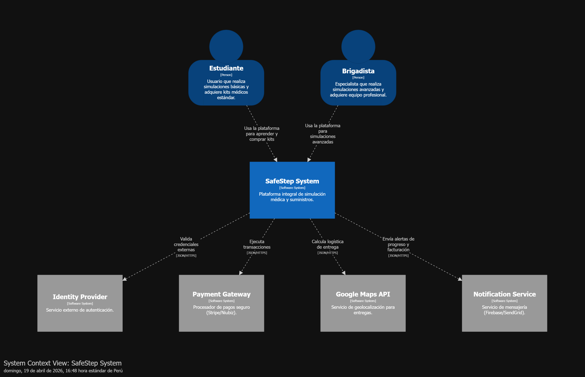
</div>

## 4.6.3. Software Architecture Container Diagrams

Representa el segundo nivel de detalle, donde se hace un "zoom" al sistema para mostrar sus unidades de software distribuidas (Containers). Un container puede ser una aplicación web, una aplicación móvil, una API REST o una base de datos. Este diagrama describe la tecnología elegida, las responsabilidades de cada bloque y cómo se comunican entre sí (ej. mediante protocolos HTTP, gRPC o colas de mensajería).

<div align="center">
    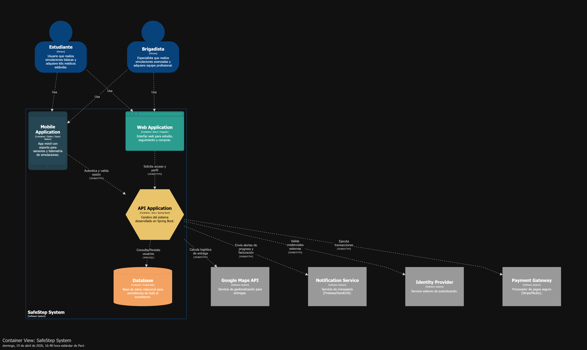
</div>


## 4.6.4. Software Architecture Components Diagrams

Este diagrama representa el tercer nivel de detalle del modelo C4, realizando un "zoom" sobre un contenedor específico para desglosar sus componentes internos. En el caso de tu proyecto, muestra cómo se organiza la lógica de negocio mediante controladores, servicios y repositorios, siguiendo típicamente los patrones de Domain-Driven Design (DDD) o Arquitectura Hexagonal. Su objetivo es identificar las responsabilidades de cada módulo de código y cómo interactúan entre sí para cumplir con las funcionalidades del sistema.

<div align="center">
    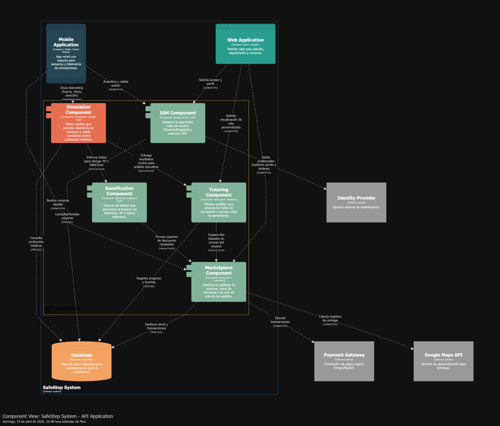
</div>

<br>
<br>

<div align="center">
    
</div>

<br>
<br>

# 4.7. Software Object-Oriented Design

En esta sección, se presenta el diseño orientado a objetos del software SafeStep. A través de diagramas de clases, se modela la estructura estática del sistema, detallando las clases, sus atributos, métodos y las relaciones entre ellas. Este diseño sirve como un plano para la implementación del código, asegurando que la arquitectura de software definida previamente se traduzca en componentes de código bien estructurados, mantenibles y escalables.

## 4.7.1. Class Diagrams

<div align="center">
    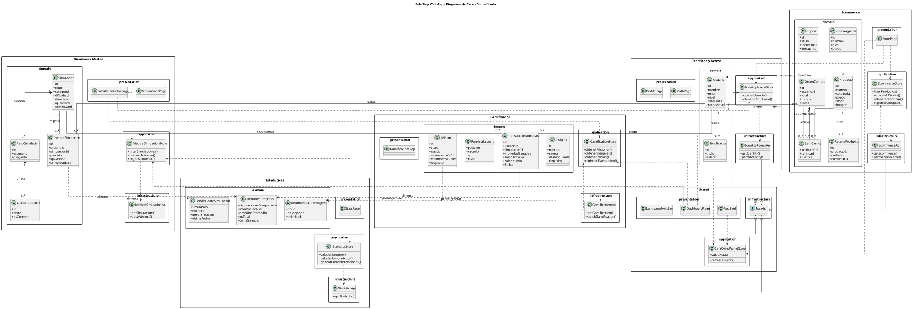
</div>

**link del miro para una mejor vista** 

<a href="https://miro.com/app/live-embed/uXjVHUFFqvM=/?embedMode=view_only_without_ui&moveToViewport=-2454%2C-663%2C5474%2C2933&embedId=668883533640">https://miro.com/app/live-embed/uXjVHUFFqvM=/?embedMode=view_only_without_ui&moveToViewport=-2454%2C-663%2C5474%2C2933&embedId=668883533640</a>

<br>
<br>

<div align="center">
    
</div>

<br>
<br>

# 4.8. Database Design

## 4.8.1. Database Diagrams

El siguiente Diagrama Entidad-Relación (ERD) representa la estructura de datos fundamental que soporta toda la lógica de la plataforma SafeStep. Este modelo relacional, compuesto por 33 entidades, ha sido diseñado aplicando las 3 fases de normalizacion. Para garantizar la escalabilidad, el mantenimiento y la separación de responsabilidades, la base de datos se ha estructurado en 5 paquetes o módulos lógicos:
### 1. Gestión de Usuarios y Seguridad: 
Controla la identidad, el Control de Acceso Basado en Roles (RBAC), el manejo de sesiones activas (para bloqueos de seguridad) y la libreta de direcciones de los usuarios.
### 2. Motor de Simulaciones:
Es el núcleo educativo. Gestiona los módulos de aprendizaje, el catálogo de escenarios interactivos (RCP, Sismos, etc.) y guarda un historial detallado de los intentos y errores específicos para generar recomendaciones personalizadas.
### 3. Motor de Gamificación:
Diseñado para maximizar la retención. Administra el progreso del usuario (Niveles y XP), misiones con caducidad de tiempo, insignias y el sistema de economía virtual (SafeCoins) para la adquisición de artículos cosméticos.
### 4. Marketplace y Logística:
Gestiona el catálogo de productos físicos (Kits de emergencia, torniquetes), permitiendo la creación de productos compuestos, el control de inventario y el sistema de reseñas y favoritos.
### 5. Ventas y Transacciones:
Maneja el flujo de conversión, desde el carrito de compras persistente, validación de cupones, hasta el registro de la orden final, la pasarela de pagos y el proceso de devoluciones con evidencia documentada.

<div align="center">
    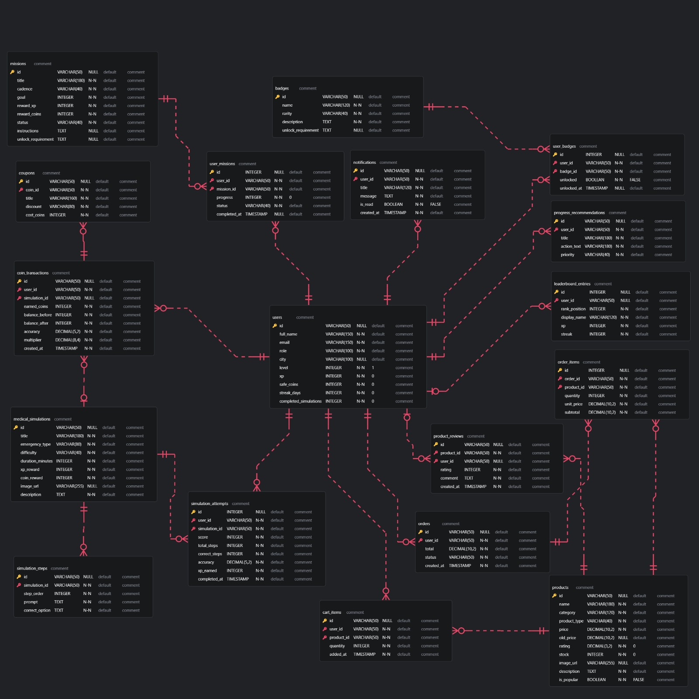
</div>

**link del diagrama de base de datos para una mejor vista**

<a href="https://miro.com/app/live-embed/uXjVHWa4-Tg=/?focusWidget=3458764671099531415&embedMode=view_only_without_ui&embedId=945877900476">https://miro.com/app/live-embed/uXjVHWa4-Tg=/?focusWidget=3458764671099531415&embedMode=view_only_without_ui&embedId=945877900476</a>

<br>
<br>

<div align="center">
    
</div>

<br>
<br>

# 5.1. Software Configuration Management

En esta sección se detallan las herramientas, procesos y configuraciones utilizadas por el equipo Chronos para gestionar el desarrollo del proyecto SafeStep. Se cubren desde las herramientas de desarrollo y despliegue hasta las estrategias de control de versiones, convenciones de código y configuración de entornos, asegurando un flujo de trabajo ordenado, reproducible y alineado con las buenas prácticas de la industria.

## 5.1.1. Software Development Environment Configuration

A continuación se presentan las herramientas y tecnologías seleccionadas para cada ámbito del desarrollo del proyecto SafeStep, organizadas por categoría según su propósito dentro del ciclo de vida del software.

### 5.1.1.1. Herramientas de Gestión de Proyectos y Requisitos

| Herramienta | Propósito |URL de Referencia | Tipo |
|-------------|-----------|------------------|------|
| Trello | Gestión del Product Backlog, Sprint Boards y seguimiento de tareas del proyecto | <a href="https://trello.com/b/UHs6EvyH/safestep-team-3">https://trello.com/b/UHs6EvyH/safestep-team-3</a> | SaaS |
| GitHub Projects | Gestión de Issues y seguimiento del progreso del desarrollo en sincronización con los repositorios | <a href="https://github.com/upc-1asi0729-2610-11990-chronos-team-3">https://github.com/upc-1asi0729-2610-11990-chronos-team-3</a> | SaaS |
| Google Drive | Almacenamiento y colaboración documentos de análisis y requerimientos | <a href="https://drive.google.com">https://drive.google.com</a> | SaaS |
| Discord | Comunicación en tiempo real del equipo y reuniones virtuales | <a href="https://discord.com">https://discord.com</a> | SaaS |

### 5.1.1.2. Herramientas de Diseño UX/UI

| Herramienta | Propósito |URL de Referencia | Tipo |
|-------------|-----------|------------------|------|
| Figma | Diseño de interfaces, wireframes, mockups y prototipos interactivos | <a href="https://www.figma.com">https://www.figma.com</a> | SaaS |
| Canva | Creación de assets gráficos, presentaciones y materiales visuales | <a href="https://www.canva.com">https://www.canva.com</a> | SaaS |

### 5.1.1.3. Herramientas de Desarrollo Frontend

| Herramienta | Propósito |URL de Referencia | Tipo |
|-------------|-----------|------------------|------|
| Visual Studio Code | Editor de código principal para el desarrollo del frontend Angular | <a href="https://code.visualstudio.com">https://code.visualstudio.com</a> | Descargable |
| Angular CLI | Interfaz de línea de comandos para crear, desarrollar y builds de proyectos Angular | <a href="https://angular.io/cli">https://angular.io/cli</a> | Descargable (npm) |
| Node.js | Entorno de ejecución JavaScript del lado del servidor para servicios de desarrollo | <a href="https://nodejs.org">https://nodejs.org</a> | Descargable |
| npm | Gestor de paquetes para JavaScript, utilizado para instalar dependencias de Angular | <a href="https://www.npmjs.com">https://www.npmjs.com</a> | Descargable |
| TypeScript | Lenguaje de programación strongly-typed que compila a JavaScript | <a href="https://www.typescriptlang.org">https://www.typescriptlang.org</a> | Descargable (npm) |

### 5.1.1.4. Herramientas de Desarrollo Backend

| Herramienta | Propósito |URL de Referencia | Tipo |
|-------------|-----------|------------------|------|
| Spring Boot | Framework de desarrollo backend basado en Java | <a href="https://spring.io/projects/spring-boot">https://spring.io/projects/spring-boot</a> | Descargable |
| Java Development Kit (JDK 17) | Kit de desarrollo de Java necesario para compilar y ejecutar aplicaciones Spring Boot | <a href="https://www.oracle.com/java/technologies/downloads/#java17">https://www.oracle.com/java/technologies/downloads/#java17</a> | Descargable |
| Apache Maven | Herramienta de gestión de proyectos y gestión de dependencias para Java | <a href="https://maven.apache.org">https://maven.apache.org</a> | Descargable |
| IntelliJ IDEA | IDE recomendado para el desarrollo backend con Spring Boot | <a href="https://www.jetbrains.com/idea">https://www.jetbrains.com/idea</a> | Descargable |

### 5.1.1.5. Herramientas de Control de Versiones

| Herramienta | Propósito |URL de Referencia | Tipo |
|-------------|-----------|------------------|------|
| Git | Sistema de control de versiones distribuido | <a href="https://git-scm.com">https://git-scm.com</a> | Descargable |
| GitHub | Plataforma de alojamiento de repositorios Git y colaboración | <a href="https://github.com">https://github.com</a> | SaaS |
| GitHub Desktop | Aplicación GUI para gestionar repositorios Git de forma visual | <a href="https://desktop.github.com">https://desktop.github.com</a> | Descargable |

### 5.1.1.6. Herramientas de Documentación y Calidad de Código

| Herramienta | Propósito |URL de Referencia | Tipo |
|-------------|-----------|------------------|------|
| ESLint | Analizador de código estático para identificar patrones problemáticos en JavaScript/TypeScript | <a href="https://eslint.org">https://eslint.org</a> | Descargable (npm) |
| Prettier | Formateador de código Opinionated para mantener consistencia en el código | <a href="https://prettier.io">https://prettier.io</a> | Descargable (npm) |
| Markdown | Lenguaje de formato para documentación técnica | <a href="https://www.markdownguide.org">https://www.markdownguide.org</a> | Referencia |
| OpenAPI (Swagger) | Especificación para documentar APIs REST | <a href="https://swagger.io/specification">https://swagger.io/specification</a> | Referencia |

### 5.1.1.7. Herramientas de Despliegue

| Herramienta | Propósito |URL de Referencia | URL de Despliegue | Tipo |
|-------------|-----------|------------------|-------------------|------|
| GitHub Pages | Plataforma de despliegue para el landing page estático de SafeStep | <a href="https://pages.github.com">https://pages.github.com</a> | <a href="https://upc-1asi0729-2610-11990-chronos-team-3.github.io/safestep-landing-page">https://upc-1asi0729-2610-11990-chronos-team-3.github.io/safestep-landing-page</a> | SaaS |
| GitHub Pages | Plataforma de despliegue para la aplicación frontend Angular | <a href="https://pages.github.com">https://pages.github.com</a> | <a href="https://upc-1asi0729-2610-11990-chronos-team-3.github.io/safestep-frontend">https://upc-1asi0729-2610-11990-chronos-team-3.github.io/safestep-frontend</a> | SaaS |
| my-json-server | Plataforma de despliegue para la API REST simulada del backend | <a href="https://my-json-server.typicode.com">https://my-json-server.typicode.com</a> | <a href="https://my-json-server.typicode.com/upc-1asi0729-2610-11990-chronos-team-3/safestep-json-server">https://my-json-server.typicode.com/upc-1asi0729-2610-11990-chronos-team-3/safestep-json-server</a> | SaaS |

### 5.1.1.8. Herramientas de Testing

| Herramienta | Propósito |URL de Referencia | Tipo |
|-------------|-----------|------------------|------|
| Jasmine | Framework de testing para aplicaciones Angular | <a href="https://jasmine.github.io">https://jasmine.github.io</a> | Descargable (npm) |
| Karma | Test runner para Angular que permite ejecutar pruebas en múltiples navegadores | <a href="https://karma-runner.github.io">https://karma-runner.github.io</a> | Descargable (npm) |
| Jest | Framework de testing alternativo para aplicaciones JavaScript/TypeScript | <a href="https://jestjs.io">https://jestjs.io</a> | Descargable (npm) |
| JUnit | Framework de testing para aplicaciones Java/Spring Boot | <a href="https://junit.org/junit5">https://junit.org/junit5</a> | Descargable |
| Postman | Herramienta para testing manual de endpoints API | <a href="https://www.postman.com">https://www.postman.com</a> | Descargable |

### 5.1.1.9. Requisitos del Sistema por Miembro del Equipo

Cada miembro del equipo debe contar con las siguientes especificaciones mínimas en su estación de trabajo para garantizar un desarrollo eficiente y sin problemas de compatibilidad:

**Requisitos Mínimos:**
- Sistema Operativo: Windows 10/11, macOS Ventura o superior, o Ubuntu 22.04 LTS
- Memoria RAM: Mínimo 8 GB (recomendado 16 GB para desarrollo fluido)
- Espacio en disco: Mínimo 20 GB libres para herramientas y proyectos
- Procesador: Intel Core i5 o equivalente AMD (recomendado i7 o Ryzen 7)
- Conexión a internet: Banda ancha mínima de 10 Mbps para trabajo colaborativo

**Software Requerido:**
- Git configurado con credenciales de GitHub
- Node.js LTS instalado (versión 20.x o superior)
- npm instalado (versión 10.x o superior)
- JDK 26 instalado y configurado en PATH
- Maven instalado (versión 3.9.x o superior)
- Visual Studio Code con extensiones recomendadas
- Acceso a cuenta GitHub organization upc-chronos-team-3

## 5.1.2. Source Code Management

En esta sección el equipo establece los medios y esquema de organización que aplicará para el seguimiento de modificaciones. Para ello utilizará GitHub como plataforma y sistema de control de versiones. Se incluye el URL del repositorio de GitHub para cada producto: Report, Landing Page, Backend, Frontend Web Applications. En el caso del Backend, se incluye en el repositorio el proyecto y los archivos de pruebas, tanto unitarias como de integración/aceptación. En esta sección se explica de qué forma se implementará GitFlow como Workflow de control de versiones.

### 5.1.2.1. Repositorios de GitHub

El equipo Chronos utiliza la organización GitHub "upc-chronos-team-3" para gestionar los cuatro repositorios del proyecto, cada uno encargado de un componente específico de la solución:

| Repositorio | URL GitHub | Propósito |
|-------------|-----------|-----------|
| SafeStep Report | <a href="https://github.com/upc-1asi0729-2610-11990-chronos-team-3/safestep-report">https://github.com/upc-1asi0729-2610-11990-chronos-team-3/safestep-report</a> | Documentación del proyecto en formato markdown |
| SafeStep Frontend | <a href="https://github.com/upc-1asi0729-2610-11990-chronos-team-3/safestep-frontend">https://github.com/upc-1asi0729-2610-11990-chronos-team-3/safestep-frontend</a> | Aplicación web interactiva desarrollada en Angular |
| SafeStep Backend | <a href="https://github.com/upc-1asi0729-2610-11990-chronos-team-3/safestep-backend">https://github.com/upc-1asi0729-2610-11990-chronos-team-3/safestep-backend</a> | API RESTful desarrollada en Spring Boot |
| SafeStep Landing | <a href="https://github.com/upc-1asi0729-2610-11990-chronos-team-3/safestep-landing-page">https://github.com/upc-1asi0729-2610-11990-chronos-team-3/safestep-landing-page</a> | Página landing pública de presentación del producto |

### 5.1.2.2. GitFlow Implementation

El equipo implementa el modelo de ramificaciones GitFlow basado en el artículo "A successful Git branching model" de Vincent Driessen. Este modelo establece una estructura clara y organizada para el desarrollo colaborativo, permitiendo múltiples líneas de trabajo paralelas sin afectar la estabilidad del código en producción. A continuación se detallan las ramas principales y su propósito dentro del flujo de trabajo adoptado.

#### 5.1.2.2.1. Rama Principal (main)

La rama "main" representa la rama principal del repositorio y contiene exclusivamente el código que ha sido validado completamente y está listo para ejecución en producción. Esta rama está protegida contra pushes directos, lo que significa que ningún miembro del equipo puede realizar commits directamente a esta rama. Cualquier cambio que llegue a "main" debe pasar por el proceso completo de revisión y pruebas en ramas de característica o corrección. El código en esta rama refleja los releases finalizados y desplegados. Cada merge a main genera automáticamente una etiqueta (tag) de versión usando semantic versioning. La rama main es la fuente de verdad para despliegues automáticos a producción.

#### 5.1.2.2.2. Rama de Desarrollo (develop)

La rama "develop" sirve como rama de integración para características completadas. Es la rama base para crear nuevas ramas de características (feature branches) y constituye el centro de integración del desarrollo diario. El código en esta rama representa el estado más reciente del desarrollo con las características acumuladas del Sprint actual. Antes de cada release, se crea una rama de publicación (release branch) desde "develop". Esta rama también está protegida contra pushes directos, forzando que todos los cambios pasen por revisión. Es la rama que se despliega automáticamente al entorno de staging/pre-producción para testing de integración.

#### 5.1.2.2.3. Ramas de Características (feature/*)

Las ramas de características (feature branches) se crean desde la rama "develop" y se utilizan para desarrollar nuevas funcionalidades de manera aislada. Cada característica tiene su propia rama, lo que permite trabajar en múltiples funcionalidades simultáneamente sin interferir con el trabajo de otros miembros del equipo. Estas ramas siguen una convención de nomenclatura específica que incluye el tipo de trabajo y una descripción breve de la característica.

**Convención de nomenclatura:** `feature/<id-ticket>-<descripcion-corta>` o alternativamente `feature/<descripcion-corta>` cuando no se cuente con un ticket asociado. Por ejemplo: `feature/US001-user-registration` para implementar el registro de usuarios, `feature/API001-modules-endpoint` para crear el endpoint de módulos, o `feature/UI002-landing-hero` para diseñar la sección hero de la landing page. Esta convención permite identificar rápidamente el propósito de cada rama y su relación con el backlog del producto.

Una vez que la característica está completa y las pruebas pasan exitosamente, la rama de característica se fusiona (merge) de vuelta a "develop" mediante un Pull Request que requiere revisión de al menos un otro miembro del equipo. Después del merge, la rama de característica se elimina para mantener limpio el repositorio.

#### 5.1.2.2.4. Ramas de Publicación (release/*)

Las ramas de publicación (release branches) se crean desde "develop" cuando el equipo está listo para publicar una nueva versión. Estas ramas permiten realizar ajustes finales, correctivos y preparar los artefactos de despliegue sin afectar el desarrollo continuo. El nombre de estas ramas sigue el formato: `release/v<major>.<minor>.<patch>` siguiendo semantic versioning.

Durante la fase de publicación, solo se permiten cambios relacionados con la configuración de despliegue, documentación de release, y corrección de errores críticos. No se añaden nuevas funcionalidades en esta rama. Una vez completados los preparativos, la rama de release se fusiona tanto a "main" como a "develop", y se genera la etiqueta de versión correspondiente. Después de la publicación exitosa, la rama de release se elimina.

#### 5.1.2.2.5. Ramas de Corrección Urgente (hotfix/*)

Las ramas de corrección urgente (hotfix branches) se crean desde "main" para abordar errores críticos que requieren solución inmediata en producción. Estas ramas siguen la convención de nomenclatura: `hotfix/<id-ticket>-<descripcion-corta>` o simplemente `hotfix/<descripcion-corta>`. Permiten resolver problemas críticos sin afectar el desarrollo en curso en "develop".

Una vez que la corrección está completa y validada, se fusiona tanto a "main" como a "develop" para asegurar que la corrección esté disponible en futuras publicaciones. Al igual que otras ramas temporales, las ramas hotfix se eliminan después del merge. Este tipo de rama es esencial para mantener la calidad del servicio en producción y responder rápidamente a incidentes.

### 5.1.2.3. Semantic Versioning

El equipo aplica Semantic Versioning (SemVer) como sistema de versionado según la especificación "Semantic Versioning 2.0.0". El formato de versión sigue el patrón: `MAJOR.MINOR.PATCH`, donde cada componente tiene un significado específico que comunica el tipo de cambios realizados en cada release.

**MAJOR (X.0.0):** Se incrementa cuando se realizan cambios incompatibles en la API. Esto incluye cambios que rompen la compatibilidad hacia atrás en la API pública, como la eliminación de endpoints, cambios en el formato de request/response que no son retrocompatibles, o restructuración significativa del código que afecta a integraciones existentes. Cuando se incrementa la versión mayor, las versiones menores y de parche se reinician a cero.

**MINOR (x.Y.0):** Se incrementa cuando se añaden nuevas funcionalidades compatibles hacia atrás. Añadir nuevos endpoints, nuevos campos en respuestas (sin afectar los existentes), o nueva funcionalidad que no rompe la compatibilidad con consumidores existentes de la API. Cuando se incrementa la versión menor, la versión de parche se reinicia a cero.

**PATCH (x.x.Z):** Se incrementa cuando se realizan correcciones de errores compatibles hacia atrás. Correcciones de bugs que no cambian la API pública, mejoras de rendimiento que no alteran el comportamiento externo, o documentación actualizada que no afecta al código.

Ejemplos de versionado: `v1.0.0` (versión inicial), `v1.1.0` (nueva funcionalidad añadida como módulos de curso), `v1.1.1` (corrección de bug en autenticación), `v2.0.0` (cambio breaking en estructura de API).

### 5.1.2.4. Conventional Commits

El equipo adopta Conventional Commits para estructurar los mensajes de commit de manera clara y consistente. Esta convención permite generar automáticamente registros de cambios (changelogs), identificar tipos de cambios, y facilitar la comunicación en el equipo. El formato del mensaje de commit sigue la estructura: `<tipo>[alcance opcional]: <descripción>`.

**Tipos de commits aceptados:**

| Tipo | Descripción |
|------|------------|
| feat | Nueva funcionalidad añadida al proyecto |
| fix | Corrección de un bug |
| docs | Cambios únicamente en documentación |
| style | Cambios de formato que no afectan la lógica del código |
| refactor | Reestructuración del código que no añade ni elimina características |
| perf | Cambios que mejoran el rendimiento |
| test | Añadir o corregir pruebas |
| chore | Tareas de mantenimiento que no afectan al código de producción |
| build | Cambios en el sistema de build o dependencias |
| ci | Cambios en archivos de configuración de CI/CD |

**Ejemplos de mensajes de commit:**

- `feat(auth): add JWT token refresh endpoint` - Añade endpoint para refresh de tokens JWT
- `fix(modules): resolve null pointer in module retrieval` - Corrige error de puntero nulo al obtener módulos
- `docs(api): update endpoint documentation for user registration` - Actualiza documentación del endpoint de registro
- `style(ui): apply consistent spacing in landing page components` - Aplica espaciado consistente en componentes
- `refactor(db): optimize database queries for lesson fetch` - Optimiza consultas de base de datos para lecciones
- `perf(api): add caching layer for module content` - Añade capa de caché para contenido de módulos
- `test(auth): add unit tests for login service` - Añade pruebas unitarias para servicio de login
- `build(deps): update Angular to version 17` - Actualiza Angular a versión 17

Para commits que incluyen más detalle, se puede añadir un cuerpo descriptivo después de la línea en blanco, separado por un footer para información adicional como números de ticket:

```
feat(api): add pagination support to lessons endpoint

Add limit and offset parameters to GET /api/lessons endpoint to support
paginated responses for better performance with large datasets.

Closes #45
```

### 5.1.2.5. Pull Request Guidelines

Todos los miembros del equipo deben seguir estas pautas al crear y revisar Pull Requests. Antes de crear un PR, el branch debe estar al día con develop y pasar todas las pruebas locales. El título del PR debe seguir el formato Conventional Commits. El cuerpo del PR debe incluir descripción clara del cambio, screenshots para cambios visuales, y referencias a tickets relacionados. Los PRs requieren al menos una aprobación de otro miembro del equipo antes de poder hacer merge. El reviewer debe verificar que el código sigue las convenciones del proyecto, las pruebas pasan, y no introduce regresiones.

## 5.1.3. Source Code Style Guide & Conventions

Aquí el equipo explica e indica las referencias que adoptará para nombrar elementos y programar en los lenguajes que se utilizan en la solución (en este caso HTML, CSS, JavaScript, TypeScript, Java). Para todos los lenguajes debe aplicar la nomenclatura en inglés. Adicionalmente, se adoptan convenciones estándares para coding basadas en las guías de referencia de la industria tecnológica.

### 5.1.3.1. Convenciones Generales

El equipo SafeStep establece las siguientes convenciones generales que aplican a todos los lenguajes de programación utilizados en el proyecto, con el objetivo de mantener consistencia, legibilidad y mantenibilidad en todo el código fuente producido por el equipo de desarrollo.

**Nomenclatura en Inglés:** Todos los nombres de variables, funciones, clases, métodos, constantes, interfaces, y cualquier otro elemento de código debe ser nombrar en inglés. Esto incluye nombres de archivos, directorios, comentarios, y documentación. La razón principal es que el código será revisado y eventualmente mantenido por desarrolladores de diferentes nacionalidades, y el inglés es el idioma universal de la programación. Además, todas las palabras clave de los lenguajes de programación están en inglés, lo que hace que el código sea más coherente cuando se mezclan elementos propios con los del lenguaje.

**Sistema de Archivos:** La estructura de directorios debe seguir una organización lógica y coherente. Los nombres de archivos deben ser descriptivos y seguir una convención consistente. Los directorios deben usar nombres en minúsculas con guiones (-) como separadores cuando sea necesario. Por ejemplo: `src/app/components/user-profile`, `src/app/services/auth.service.ts`, `src/app/models/user.model.ts`.

### 5.1.3.2. Convenciones para HTML

El equipo sigue las "HTML Style Guide and Coding Conventions" ampliamente aceptadas en la industria, adaptadas a las necesidades específicas del proyecto SafeStep. HTML se utiliza principalmente para la construcción de la Landing Page y las plantillas de componentes Angular.

**Estructura del Documento:** Todo documento HTML debe incluir la declaración DOCTYPE, el elemento html con el atributo lang correspondiente, y los metadatos esenciales en la sección head. El código debe sangría (indent) correctamente utilizando 4 espacios para mantener legibilidad. Los atributos deben estar en orden alfabético dentro de cada etiqueta para facilitar la búsqueda visual. Los valores de atributos deben estar siempre entre comillas dobles.

**Convenciones de Nomenclatura:** Los IDs y clases deben seguir el patrón kebab-case, siendo descriptivos y coherentes con la función del elemento. Por ejemplo: `main-navigation`, `hero-section`, `cta-button`. Los atributos data- deben seguir un patrón similar: `data-module-id`, `data-lesson-progress`.

**Comentarios:** Los comentarios en HTML deben ser significativos y explicar el propósito de secciones complejas o componentes no obvios. Se utiliza el formato estándar `<!-- comentario -->` para comentarios de una línea y múltiples líneas cuando sea necesario.

### 5.1.3.3. Convenciones para CSS

El equipo adopta las directrices del "Google HTML/CSS Style Guide" como base para las convenciones de CSS, complementadas con prácticas específicas del ecosistema Angular.

**Organización del Código CSS:** El código CSS se organiza siguiendo metodologías modernas como BEM (Block Element Modifier) para la nomenclatura de clases, lo que facilita el mantenimiento y la escalabilidad de los estilos. Cada componente en Angular debe tener su propio archivo de estilos encapsulado, utilizando preferentemente SCSS para aprovechar características como variables y mixins.

**Convenciones de Nomenclatura:** Las clases CSS siguen el patrón BEM: `bloque__elemento--modificador`. Por ejemplo: `button--primary`, `card__title--highlighted`. Los nombres deben ser descriptivos y en inglés. Se evita el uso de IDs para estilos, prefiriendo clases para permitir la reutilización.

**Propiedades Ordenadas:** Las propiedades CSS dentro de un bloque deben estar ordenadas lógicamente, agrupando propiedades relacionadas juntas. Una estructura recomendada es: posicionamiento, modelo de caja, tipografía, fondo, bordes, efectos visuales, otros.

**Valores y Unidades:** Los valores numéricos deben incluir la unidad excepto cuando el valor sea cero. Los colores deben usarse en formato hexadecimal o rgb() para consistencia. Se utilizan variables CSS para valores repetidos para facilitar cambios globales.

### 5.1.3.4. Convenciones para JavaScript y TypeScript

El equipo sigue las "Google TypeScript Style Guide" y las mejores prácticas del ecosistema Angular para el desarrollo en JavaScript y TypeScript. Estas convenciones aseguran que el código sea type-safe, legible y mantenible.

**Declaración de Variables:** Se utiliza `const` por defecto para variables que no serán reasignadas. Solo se usa `let` cuando es necesario permitir reasignación. Se evita el uso de `var` completamente. Los nombres de variables utilizan camelCase y deben ser descriptivos, evitando abreviaturas que dificulten la lectura.

**Funciones:** Las funciones utilizan arrow functions (funciones flecha) cuando no se necesita el objeto `this`. Se prefiere funciones declarativas sobre funciones anónimas cuando sea posible. Los parámetros opcionales deben tener un valor default. La documentación de funciones mediante JSDoc o TypeDoc es obligatoria para funciones exportadas.

**Tipos y TypeScript:** Todos los parámetros de funciones deben tener tipos definidos. Se utilizan interfaces para definir la forma de objetos que se utilizan repetidamente. Los tipos primitivos se escriben en minúsculas: `string`, `number`, `boolean`. Los arrays se tipan usando la notación `Type[]` o `Array<Type>`. Se evita el uso de `any` a menos que sea absolutamente necesario.

**Clases y Orientación a Objetos:** Las clases siguen PascalCase. Los miembros privados utilizan el prefijo underscore (`_`) o el modificador `private` de TypeScript. Los getters y setters se utilizan para acceder a miembros privados cuando hay lógica asociada. Las interfaces se nomin con el prefijo `I` o como sustantivos descriptivos.

**Módulos e Imports:** Los imports se organizan en grupos: módulos externos, módulos internos del proyecto, módulos relativos. Dentro de cada grupo, se ordenan alfabéticamente. Se utilizan imports con nombres claros para facilitar el debugging.

### 5.1.3.5. Convenciones para Java y Spring Boot

El equipo adopta el "Google Java Style Guide" como referencia principal para el desarrollo backend con Java y Spring Boot, complementado con las convenciones específicas del framework.

**Organización del Código:** El código Java sigue una estructura de paquetes (packages) lógica y jerárquica. Los nombres de paquetes siguen el patrón inverso de dominio: `com.safestep.api`, `com.safestep.model`, `com.safestep.service`. Esta estructura facilita la identificación del propósito de cada clase.

**Convenciones de Nomenclatura:** Las clases utilizan PascalCase y son sustantivos descriptivos. Los métodos utilizan verbos o frases verbales en camelCase. Las constantes utilizan UPPER_SNAKE_CASE. Los tipos genéricos utilizan letras mayúsculas simples (E, T, K, V).

**Spring Boot Specific:** Las clases anotadas con `@Controller` o `@RestController` son responsables únicamente de manejar requests HTTP. La lógica de negocio reside en clases anotadas con `@Service`. El acceso a datos se realiza a través de clases anotadas con `@Repository`. Las entidades JPA siguen el patrón de nomenclatura de la base de datos.

**Anotaciones:** Las anotaciones se colocan en la línea anterior al elemento que anotan. Se evita la anotación redundante. Las anotaciones de Spring se ordenan primero, seguidas de anotaciones personalizadas.

### 5.1.3.6. Convenciones para Gherkin (Specifications)

El equipo utiliza las "Gherkin Conventions for Readable Specifications" para escribir user stories en formato Given-When-Then y para crear pruebas de aceptación automatizadas.

**Estructura de Feature Files:** Cada archivo Gherkin representa una característica específica del sistema. La primera línea contiene la palabra clave Feature seguida de un nombre y descripción opcionales. Los archivos se nomin descriptivamente en inglés.

**Escritura de Escenarios:** Los escenarios siguen la estructura Given-When-Then. Given establece el contexto inicial, When describe la acción a realizar, Then verifica el resultado esperado. Se evita escribir pasos demasiado largos o complejos.

**Step Definitions:** Los step definitions en el código deben ser reutilizables. Se parametrizan los valores que cambian entre escenarios. Se agrupan los steps relacionados en archivos lógicos.

## 5.1.4. Software Deployment Configuration

En esta sección el equipo especifica la configuración del despliegue de la solución, incluyendo los pasos necesarios para que, a partir de los repositorios de código fuente, se pueda lograr el despliegue o publicación satisfactorio de cada uno de los productos digitales en la solución (Landing Page, Web Services, Frontend Web Applications).

### 5.1.4.1. Estrategia de Despliegue

El equipo SafeStep adopta una estrategia de despliegue progresivo que permite entregar valor de manera continua mientras se mantiene la estabilidad y calidad del sistema. Esta estrategia contempla múltiples plataformas de despliegue, cada una seleccionada según las características y necesidades específicas de cada componente de la solución.

#### 5.1.4.1.1. Entornos de Despliegue

El proyecto cuenta con tres productos desplegados en plataformas independientes. El primer producto es la Landing Page, desplegada en GitHub Pages como sitio estático, permitiendo una presentación pública del producto SafeStep con alta disponibilidad y sin costos operativos.

El segundo producto es el Frontend Angular, desplegado en GitHub Pages como aplicación web estática. Esta plataforma fue seleccionada por su integración con GitHub, su disponibilidad pública mediante HTTPS y su facilidad para publicar builds frontend desde el repositorio.

El tercer producto es el Backend API, desplegado en my-json-server como una API REST simulada que permite prototipado rápido y validación del frontend sin necesidad de un servidor backend completo.

#### 5.1.4.1.2. Pipeline de CI/CD

El equipo implementa pipelines de Integración Continua y Entrega Continua (CI/CD) utilizando GitHub Actions. Cada repositorio cuenta con su propio pipeline de CI/CD adaptado a sus características específicas.

Para el repositorio de Frontend (Angular), el pipeline de CI/CD incluye las siguientes etapas: instalación de dependencias con npm install, verificación de código con ESLint y análisis estático, ejecución de pruebas unitarias con Karma o Jest, construcción de la aplicación para producción, y despliegue automático a GitHub Pages si las pruebas pasan exitosamente.

Para el repositorio de Web Services (Spring Boot), el pipeline incluye: verificación de código con herramientas de análisis estático, compilación del proyecto con Maven, ejecución de pruebas unitarias y de integración, y construcción del artefacto JAR.

Para el repositorio de Landing Page, se implementa un pipeline simplificado que incluye build estático y despliegue automático a GitHub Pages.

### 5.1.4.2. Configuración de Plataformas de Despliegue

A continuación se detallan las configuraciones específicas para cada plataforma de despliegue utilizada en el proyecto SafeStep.

#### 5.1.4.2.1. Configuración de Landing Page en GitHub Pages

La Landing Page de SafeStep se despliega en GitHub Pages, una plataforma de hosting estático directamente integrada con GitHub. El despliegue se configura mediante GitHub Actions, donde el pipeline construye los archivos estáticos y los publica en la rama `gh-pages` del repositorio.

Para configurar el despliegue, se debe habilitar GitHub Pages en la configuración del repositorio, seleccionando la rama `gh-pages` como fuente. Los archivos estáticos generados tras el build se almacenan en esta rama y GitHub Pages los sirve automáticamente.

La URL pública del landing page es:

<a href="https://upc-1asi0729-2610-11990-chronos-team-3.github.io/safestep-landing-page">https://upc-1asi0729-2610-11990-chronos-team-3.github.io/safestep-landing-page</a>

#### 5.1.4.2.2. Configuración de Frontend en GitHub Pages

El Frontend Angular se despliega en GitHub Pages como aplicación web estática. Los pasos de configuración incluyen generar el build de Angular, configurar la ruta base del proyecto y publicar los archivos generados en el repositorio correspondiente.

El despliegue publica los archivos estáticos generados por Angular. Para ello, el workflow toma el directorio de salida del build y lo envía a GitHub Pages:

```bash
npm run build
```

La URL pública del frontend es:

<a href="https://upc-1asi0729-2610-11990-chronos-team-3.github.io/safestep-frontend">https://upc-1asi0729-2610-11990-chronos-team-3.github.io/safestep-frontend</a>

#### 5.1.4.2.3. Configuración de API en my-json-server

El Backend API se despliega en my-json-server, una plataforma que permite crear una API REST falsa a partir de un archivo `db.json` alojado en un repositorio de GitHub. Esta plataforma fue seleccionada para la fase de prototipado, permitiendo al equipo de frontend consumir datos reales sin necesidad de un backend completamente implementado.

La configuración consiste en alojar el archivo `db.json` en la raíz del repositorio `safestep-backend` con la estructura de datos que la aplicación frontend necesita consumir. my-json-server genera automáticamente los endpoints REST basados en las claves del archivo JSON.

La URL base de la API es: <a href="https://my-json-server.typicode.com/upc-1asi0729-2610-11990-chronos-team-3/safestep-json-server">https://my-json-server.typicode.com/upc-1asi0729-2610-11990-chronos-team-3/safestep-json-server</a>

### 5.1.4.3. Procedimientos de Despliegue

El equipo establece procedimientos detallados para ejecutar despliegues, asegurando consistencia y minimizando errores en el proceso de publicación del software.

#### 5.1.4.3.1. Despliegue a Producción

Cada componente tiene su propio procedimiento de despliegue a producción. Para la Landing Page en GitHub Pages, el despliegue se activa automáticamente mediante GitHub Actions al hacer push a la rama `main`, ejecutando el build estático y publicando en la rama `gh-pages`.

Para el Frontend en GitHub Pages, el despliegue se realiza mediante GitHub Actions, donde el pipeline ejecuta las pruebas, construye la aplicación y publica los archivos estáticos generados.

Para el Backend en my-json-server, el despliegue es inmediato: cualquier cambio en el archivo `db.json` en la rama `main` del repositorio se refleja automáticamente en la API.

#### 5.1.4.3.2. Verificación Post-Despliegue

Después de cada despliegue, el equipo debe verificar el correcto funcionamiento de cada componente accediendo a las URLs de despliegue correspondientes y realizando pruebas de humo (smoke tests) para confirmar que la aplicación responde correctamente.

#### 5.1.4.3.3. Rollback

En caso de problemas en producción, el equipo puede realizar un rollback a la versión anterior. GitHub Pages permite revertir el despliegue restaurando el contenido anterior de la rama `gh-pages`. Para my-json-server, el rollback se realiza revirtiendo el commit del archivo `db.json` en el repositorio.

### 5.1.4.4. Monitoreo y Logging

El equipo implementa capacidades de monitoreo y logging para mantener visibilidad sobre el estado de la aplicación en producción. GitHub Pages expone métricas básicas de uso a través de GitHub Insights. Para el tracking de errores, se puede integrar servicios como Sentry. Estas herramientas permiten identificar y resolver problemas rápidamente, asegurando la disponibilidad y calidad del servicio para los usuarios finales.

<br>
<br>

<div align="center">
    
</div>

<br>
<br>

# 5.2. Landing Page, Services & Applications Implementation.

## 5.2.1. Sprint 1

### 5.2.1.1. Sprint Planning 1

En esta sección se especifica los aspectos principales del Sprint Planning Meeting. SafeStep inicia su primer Sprint con el objetivo de establecer la presencia digital de la empresa mediante una Landing Page funcional que presente la propuesta de valor y facilite el registro de usuarios potenciales. Este Sprint representa la primera iteración del equipo SafeStep, donde se busca crear una primera impresión sólida ante potenciales usuarios que visitarán la plataforma por primera vez.

La Landing Page cumple un rol fundamental en la estrategia de captación de usuarios, siendo el punto de entrada principal para personas que desconocen SafeStep pero buscan aprender primeros auxilios. Por esta razón, el equipo priorizó este componente como el primero a desarrollar, reconociendo que una presencia digital profesional y atractiva es esencial para generar confianza y credibilidad desde el primer momento.

<table align="center" border="1" cellpadding="8" cellspacing="0" style="border-collapse: collapse; width: 100%; font-family: Arial, sans-serif;">
    <tbody>
        <tr>
            <td><b>Sprint #</b></td>
            <td>Sprint 1</td>
        </tr>
        <tr>
            <td colspan="2"><b>Sprint Planning Background</b></td>
        </tr>
        <tr>
            <td>Date</td>
            <td>2026-04-05</td>
        </tr>
        <tr>
            <td>Time</td>
            <td>10:00 AM</td>
        </tr>
        <tr>
            <td>Location</td>
            <td>Reunión virtual via Discord - Canal #sprint-planning</td>
        </tr>
        <tr>
            <td>Prepared by</td>
            <td>Ayala Fernandez, Jorge Brayan</td>
        </tr>
        <tr>
            <td>Attendees (to planning meeting)</td>
            <td>Ayala Fernandez, Jorge Brayan / Sanchez Espinoza, Mathias Enrique / Melgarejo Quiroz, Josep Eliu / Miraval Pomalaya, Rodrigo Jesus / Flores Eusebio, Angel Thyago</td>
        </tr>
        <tr>
            <td>Sprint n - 1 Review Summary</td>
            <td>No aplica - Este es el primer Sprint del proyecto. Se establecieron las bases del Product Backlog, se definieron los User Stories priorizados, y se creó la estructura inicial de repositorios en GitHub Organization.</td>
        </tr>
        <tr>
            <td>Sprint n - 1 Retrospective Summary</td>
            <td>No aplica - Este es el primer Sprint del proyecto. El equipo se conformó recientemente y se espera mejorar la coordinación en sprints posteriores.</td>
        </tr>
        <tr>
            <td colspan="2"><b>Sprint Goal / User Stories</b></td>
        </tr>
        <tr>
            <td>Sprint 1 Goal</td>
            <td>Implementar una Landing Page funcional que presente la propuesta de valor de SafeStep, muestre las simulaciones disponibles, testimonios, preguntas frecuentes, y proporcione acceso al registro de usuarios potenciales.</td>
        </tr>
        <tr>
            <td>Sprint 1 Velocity</td>
            <td>El equipo estimó un velocity inicial de 21 Story Points, enfocados únicamente en el desarrollo de la Landing Page (EP08).</td>
        </tr>
        <tr>
            <td>Sprint of Story Points</td>
            <td>Total: 21 SP - Distribuidos en 5 SP para propuesta de valor, 3 SP para navegación, 5 SP para simulaciones, 3 SP para testimonios, 3 SP para preguntas frecuentes, y 2 SP para acceso a registro.</td>
        </tr>
    </tbody>
</table>

El Sprint Planning Meeting del 5 de abril de 2026 duró aproximadamente 2 horas. El equipo discutió en detalle los User Stories a implementar, estimó las responsabilidades iniciales, y estableció los primeros acuerdos de colaboración. Durante la reunión, cada miembro del equipo tuvo la oportunidad de expresar sus dudas respecto a las tareas asignadas y se resolvieron interrogantes técnicas relacionadas con las tecnologías a utilizar.

La dinámica del Sprint Planning permitió al equipo alinear expectativas y establecer un compromiso colectivo hacia el logro del Sprint Goal. Se destinó tiempo suficiente para revisar las guidelines de código establecidas en el proyecto, asegurando que todos los miembros comprendieran las convenciones de nomenclatura, estructura de archivos y flujo de trabajo con Git.

**User Stories incluidos en el Sprint 1:**

Los User Stories seleccionados para este Sprint inicial corresponden exclusivamente a la Épica 08 (Landing Page pública) del Product Backlog, reflejando las necesidades más críticas para establecer la presencia digital de SafeStep. El equipo se enfocó únicamente en la Landing Page para este primer Sprint, dejando el Frontend Angular y el Backend API para sprints posteriores, priorizando de esta manera la captación de usuarios como primer objetivo de negocio.

| ID | User Story | Prioridad | Story Points |
| -- | ---------- | --------- | ------------ |
| US47 | Como visitante, quiero ver rápidamente qué es SafeStep para entender si me ayuda a aprender primeros auxilios. | Must Have | 5 |
| US48 | Como visitante, quiero navegar por las secciones de la landing para conocer funcionalidades, simulaciones, gamificación, tienda y preguntas frecuentes. | Must Have | 3 |
| US49 | Como visitante, quiero revisar ejemplos de simulaciones para saber qué emergencias puedo practicar. | Must Have | 5 |
| US52 | Como visitante, quiero leer testimonios para confiar en la utilidad de SafeStep. | Must Have | 3 |
| US53 | Como visitante, quiero revisar preguntas frecuentes para resolver dudas antes de registrarme. | Must Have | 3 |
| US54 | Como visitante interesado, quiero acceder al registro desde la landing para empezar a usar SafeStep. | Must Have | 2 |

La selección de estos User Stories para el Sprint 1 responde a la necesidad de establecer la presencia digital de SafeStep rápidamente, permitiendo que usuarios potenciales conozcan la propuesta de valor, exploren las simulaciones ofrecidas, lean testimonios de otros usuarios, resuelvan sus dudas mediante preguntas frecuentes, y finalmente accedan al registro. El equipo identificó que el US47 (propuesta de valor) y US49 (simulaciones ofrecidas) son los más críticos con 5 SP cada uno, representando el núcleo del mensaje de la Landing Page.

**Distribución de Trabajo por Componente:**

- **Landing Page (EP08):** 21 Story Points - Enfocados en hero con propuesta de valor, navegación por secciones, showcase de simulaciones, testimonios, preguntas frecuentes y acceso a registro.

La distribución de Story Points fue diseñada para que cada miembro del equipo tuviera una carga de trabajo equilibrada. Se priorizaron las tareas de implementación técnica (estructura HTML y estilos) sobre las tareas de configuración, reconociendo que la visibilidad del progreso es fundamental para mantener la motivación del equipo durante las primeras etapas del proyecto.

### 5.2.1.2. Aspect Leaders and Collaborators

En esta sección el equipo elabora el artefacto Leadership-and-Collaboration Matrix (LACX), que indica por cada aspecto dentro del alcance del Sprint, quién es el líder y quién o quiénes son colaboradores en dicho aspecto, con el fin de brindar mayor claridad y efectividad en la comunicación al interior del equipo.

La sección incluye una introducción donde se explica cuáles son los principales aspectos que se toma en cuenta en el Sprint 1. Para este primer Sprint, los aspectos están centrados exclusivamente en el desarrollo de la Landing Page, reconociendo la importancia de establecer roles claros desde el inicio del proyecto para evitar conflictos y facilitar la toma de decisiones durante la implementación.

El equipo SafeStep está conformado por 5 miembros con diferentes fortalezas técnicas y experiencia en distintas áreas del desarrollo de software. Durante la reunión de Sprint Planning, se identificaron las competencias de cada miembro y se asignaron los roles de líder (L) y colaborador (C) para cada aspecto del Sprint, priorizando el desarrollo profesional de cada integrante mientras se optimiza la productividad del equipo.

**Aspectos del Sprint 1:**

1. **Landing Page - UI/UX:** Diseño y estructura visual de la página principal, incluyendo wireframes, mockups, paleta de colores, tipografía y componentes visuales.
2. **Landing Page - Desarrollo:** Implementación técnica de la página landing, incluyendo código HTML semántico, estilos CSS, y funcionalidades JavaScript.
3. **Documentación:** Documentación técnica del Sprint, incluyendo este archivo y demás artefactos Scrum requeridos.

La distribución de roles fue diseñada para fomentar la colaboración entre los miembros del equipo, evitando situaciones donde un solo miembro sea responsable de un componente crítico. En caso de que un líder no esté disponible, los colaboradores están preparados para asumir responsabilidad parcial del aspecto correspondiente.

<table align="center" border="1" cellpadding="8" cellspacing="0" style="border-collapse: collapse; width: 100%; font-family: Arial, sans-serif;">
    <tbody>
        <tr>
            <td><b>Team Member (Last Name, First Name)</b></td>
            <td><b>GitHub Username</b></td>
            <td><b>Landing UI/UX / L or C</b></td>
            <td><b>Landing Dev / L or C</b></td>
            <td><b>Documentation / L or C</b></td>
        </tr>
        <tr>
            <td>Ayala Fernandez, Jorge Brayan</td>
            <td>jorgeayaladev</td>
            <td>C</td>
            <td>L</td>
            <td>C</td>
        </tr>
        <tr>
            <td>Sanchez Espinoza, Mathias Enrique</td>
            <td>Nounz27</td>
            <td>-</td>
            <td>C</td>
            <td>C</td>
        </tr>
        <tr>
            <td>Melgarejo Quiroz, Josep Eliu</td>
            <td>Melga1502</td>
            <td>L</td>
            <td>C</td>
            <td>C</td>
        </tr>
        <tr>
            <td>Miraval Pomalaya, Rodrigo Jesus</td>
            <td>RodMiraval</td>
            <td>C</td>
            <td>C</td>
            <td>L</td>
        </tr>
        <tr>
            <td>Flores Eusebio, Angel Thyago</td>
            <td>angelfdevs</td>
            <td>C</td>
            <td>C</td>
            <td>C</td>
        </tr>
    </tbody>
</table>

La organización de líderes y colaboradores tiene relación directa con las fortalezas técnicas de cada miembro del equipo identificadas durante la conformación del equipo. Esta distribución permite que cada miembro trabaje en áreas donde puede aportar mayor valor, mientras tiene la oportunidad de aprender de los líderes en otras áreas.

**Distribución detallada de responsabilidades:**

- **Melgarejo Quiroz, Josep Eliu (UI/UX Lead):** Responsable del diseño visual de la Landing Page, incluyendo la creación de mockups en Figma, definición de la paleta de colores basada en la identidad de marca de SafeStep, selección de tipografía adecuada, y diseño de componentes reutilizables. Colabora con el equipo de desarrollo para asegurar que la implementación respete el diseño propuesto.

- **Ayala Fernandez, Jorge Brayan (Development Lead):** Responsable de la implementación técnica de la Landing Page, incluyendo la creación de la estructura HTML semántica, estilos CSS con metodología BEM, y funcionalidades JavaScript básicas. Coordina con el líder de UI/UX para resolver dudas sobre el diseño y garantizar su correcta implementación.

- **Sanchez Espinoza, Mathias Enrique (Development Collaborator):** Responsable de apoyar la implementación técnica de la Landing Page, enfocándose en la sección de simulaciones y la integración de contenido dinámico. Colabora estrechamente con el Development Lead para asegurar la consistencia del código y contribuye en la implementación de componentes específicos.

- **Miraval Pomalaya, Rodrigo Jesus (Documentation Lead):** Responsable de la documentación del Sprint, incluyendo la elaboración de este archivo y demás artefactos Scrum. Coordina con los demás miembros para recopilar información sobre el avance del Sprint y asegurar la completitud de la documentación.

- **Flores Eusebio, Angel Thyago (Development Collaborator):** Responsable de apoyar en el desarrollo de la Landing Page, participando en la implementación de la sección de preguntas frecuentes, el footer, y los enlaces de registro. Contribuye en las tareas de testing y verificación de calidad del código.

### 5.2.1.3. Sprint Backlog 1

El Sprint Backlog 1 resume el objetivo principal del Sprint: establecer la presencia digital de SafeStep mediante una Landing Page funcional que cubra las primeras User Stories de la Épica 08 del Product Backlog. Este documento representa el compromiso del equipo para completar las tareas identificadas durante el Sprint Planning y permite hacer seguimiento del avance de cada historia durante la iteración.

El Sprint Backlog fue elaborado de manera colaborativa. Primero se seleccionaron las User Stories de mayor valor para el Sprint 1 y luego cada una fue descompuesta en Work-items o Tasks concretos. Las User Stories mantienen su estimación en Story Points, mientras que las tareas se estiman en horas para facilitar el seguimiento operativo dentro del Sprint. Estas horas no reemplazan los Story Points; únicamente representan el esfuerzo aproximado requerido para ejecutar cada tarea.

**Trello Board:**
El equipo utiliza un Trello Board para gestionar visualmente el Sprint Backlog. El Board contiene las listas estándar de Scrum: "Sprint Goal", "To Do", "In Progress", "To Review" y "Done". El uso de Trello permite una visualización clara del estado de cada tarea y facilita la identificación de cuellos de botella en el flujo de trabajo.

**URL pública del Trello Board del Sprint 1:**

<a href="https://trello.com/invite/b/6a33714212af251d16ad5375/ATTIc66162c0ecd0e36388869fdbf265255955DE7093/sprint-1-opensource">https://trello.com/invite/b/6a33714212af251d16ad5375/ATTIc66162c0ecd0e36388869fdbf265255955DE7093/sprint-1-opensource</a>

<div align="center">
  <p>
    <b>Captura</b>: Board de Trello correspondiente al Sprint 1
  </p>
  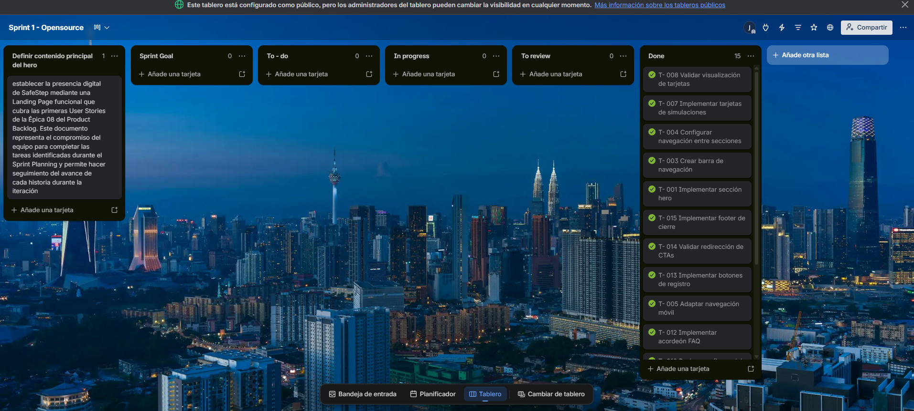
  <p>
    <i><b>Fuente</b>: Elaboración propia.</i>
  </p>
</div>

**Estructura del Trello Board:**

- **Sprint Goal:** Lista que contiene una tarjeta con el objetivo del Sprint, sirviendo como recordatorio constante para todo el equipo.
- **To Do:** Lista con las tareas pendientes por iniciar, ordenadas por prioridad y dependencias.
- **In Progress:** Lista con las tareas que están siendo implementadas actualmente.
- **To Review:** Lista con las tareas completadas pendientes de revisión por otro miembro del equipo.
- **Done:** Lista con las tareas aprobadas y listas para deployment.

A continuación, la tabla de control de estado para el Sprint 1:

<table align="center" border="1" cellpadding="8" cellspacing="0" style="border-collapse: collapse; width: 100%; font-family: Arial, sans-serif;">
    <tbody>
        <tr>
            <td><b>Sprint #</b></td>
            <td colspan="7">Sprint 1</td>
        </tr>
        <tr>
            <td colspan="2">User Story</td>
            <td colspan="6">Work-Item / Task</td>
        </tr>
        <tr>
            <td>Id</td>
            <td>Title</td>
            <td>Id</td>
            <td>Title</td>
            <td>Description</td>
            <td>Estimation (Hours)</td>
            <td>Assigned to</td>
            <td>Status (To-do / In-Process / To-Review / Done)</td>
        </tr>
        <tr>
            <td>US47</td>
            <td>Propuesta de valor</td>
            <td>T001</td>
            <td>Definir contenido principal del hero</td>
            <td>Redactar el mensaje principal, subtítulo y llamada a la acción que explican de forma inmediata qué es SafeStep.</td>
            <td>2</td>
            <td>Melgarejo Quiroz, Josep Eliu</td>
            <td>Done</td>
        </tr>
        <tr>
            <td>US47</td>
            <td>Propuesta de valor</td>
            <td>T002</td>
            <td>Implementar sección hero</td>
            <td>Construir la primera sección de la landing con logo, título, descripción, imagen principal y botón de inicio.</td>
            <td>3</td>
            <td>Ayala Fernandez, Jorge Brayan</td>
            <td>Done</td>
        </tr>
        <tr>
            <td>US47</td>
            <td>Propuesta de valor</td>
            <td>T003</td>
            <td>Validar legibilidad inicial</td>
            <td>Revisar contraste, jerarquía visual y claridad del mensaje en desktop y mobile para asegurar que el visitante entienda la propuesta.</td>
            <td>1</td>
            <td>Flores Eusebio, Angel Thyago</td>
            <td>Done</td>
        </tr>
        <tr>
            <td>US48</td>
            <td>Navegación por secciones</td>
            <td>T004</td>
            <td>Crear barra de navegación</td>
            <td>Implementar menú superior con enlaces a las secciones principales de la landing page.</td>
            <td>2</td>
            <td>Melgarejo Quiroz, Josep Eliu</td>
            <td>Done</td>
        </tr>
        <tr>
            <td>US48</td>
            <td>Navegación por secciones</td>
            <td>T005</td>
            <td>Configurar navegación entre secciones</td>
            <td>Agregar desplazamiento suave y verificar que cada enlace lleve a la sección correcta.</td>
            <td>2</td>
            <td>Ayala Fernandez, Jorge Brayan</td>
            <td>Done</td>
        </tr>
        <tr>
            <td>US48</td>
            <td>Navegación por secciones</td>
            <td>T006</td>
            <td>Adaptar navegación móvil</td>
            <td>Asegurar que el menú sea usable en pantallas pequeñas y que no oculte el contenido principal.</td>
            <td>2</td>
            <td>Flores Eusebio, Angel Thyago</td>
            <td>Done</td>
        </tr>
        <tr>
            <td>US49</td>
            <td>Simulaciones ofrecidas</td>
            <td>T007</td>
            <td>Definir contenido de simulaciones</td>
            <td>Organizar los textos e imágenes de las emergencias que se mostrarán como ejemplos en la landing.</td>
            <td>2</td>
            <td>Sanchez Espinoza, Mathias Enrique</td>
            <td>Done</td>
        </tr>
        <tr>
            <td>US49</td>
            <td>Simulaciones ofrecidas</td>
            <td>T008</td>
            <td>Implementar tarjetas de simulaciones</td>
            <td>Crear las tarjetas de RCP, quemaduras, atragantamiento y sismos con título, descripción e imagen.</td>
            <td>3</td>
            <td>Sanchez Espinoza, Mathias Enrique</td>
            <td>Done</td>
        </tr>
        <tr>
            <td>US49</td>
            <td>Simulaciones ofrecidas</td>
            <td>T009</td>
            <td>Validar visualización de tarjetas</td>
            <td>Revisar que las tarjetas se visualicen correctamente en desktop y mobile, sin cortes de texto ni desorden visual.</td>
            <td>1</td>
            <td>Ayala Fernandez, Jorge Brayan</td>
            <td>Done</td>
        </tr>
        <tr>
            <td>US52</td>
            <td>Testimonios</td>
            <td>T010</td>
            <td>Crear sección de testimonios</td>
            <td>Implementar bloque de testimonios con nombre, comentario y presentación visual consistente con la landing.</td>
            <td>2</td>
            <td>Flores Eusebio, Angel Thyago</td>
            <td>Done</td>
        </tr>
        <tr>
            <td>US52</td>
            <td>Testimonios</td>
            <td>T011</td>
            <td>Revisar confianza del contenido</td>
            <td>Validar que los testimonios refuercen la utilidad de SafeStep y no generen ruido visual en la página.</td>
            <td>1</td>
            <td>Melgarejo Quiroz, Josep Eliu</td>
            <td>Done</td>
        </tr>
        <tr>
            <td>US53</td>
            <td>Preguntas frecuentes</td>
            <td>T012</td>
            <td>Redactar preguntas frecuentes</td>
            <td>Definir preguntas y respuestas sobre funcionamiento, acceso, primeros auxilios y uso de la plataforma.</td>
            <td>1</td>
            <td>Flores Eusebio, Angel Thyago</td>
            <td>Done</td>
        </tr>
        <tr>
            <td>US53</td>
            <td>Preguntas frecuentes</td>
            <td>T013</td>
            <td>Implementar acordeón FAQ</td>
            <td>Crear el comportamiento desplegable de las preguntas frecuentes y validar su uso en desktop y mobile.</td>
            <td>2</td>
            <td>Ayala Fernandez, Jorge Brayan</td>
            <td>Done</td>
        </tr>
        <tr>
            <td>US54</td>
            <td>Acceso a registro</td>
            <td>T014</td>
            <td>Implementar botones de registro</td>
            <td>Agregar botones principales y secundarios que lleven al usuario hacia el registro o acceso.</td>
            <td>2</td>
            <td>Melgarejo Quiroz, Josep Eliu</td>
            <td>Done</td>
        </tr>
        <tr>
            <td>US54</td>
            <td>Acceso a registro</td>
            <td>T015</td>
            <td>Validar redirección de CTAs</td>
            <td>Probar que los llamados a la acción funcionen correctamente desde hero, secciones internas y final de la página.</td>
            <td>1</td>
            <td>Ayala Fernandez, Jorge Brayan</td>
            <td>Done</td>
        </tr>
        <tr>
            <td>US54</td>
            <td>Acceso a registro</td>
            <td>T016</td>
            <td>Implementar footer de cierre</td>
            <td>Crear footer con marca, enlaces relevantes, contacto y derechos reservados para cerrar la experiencia de navegación.</td>
            <td>2</td>
            <td>Flores Eusebio, Angel Thyago</td>
            <td>Done</td>
        </tr>
    </tbody>
</table>

El Sprint Backlog refleja 16 tareas que descomponen directamente las User Stories seleccionadas para el Sprint 1. Las estimaciones suman 29 horas de trabajo operativo y fueron asignadas en función del esfuerzo necesario para implementar, revisar y validar cada parte de la Landing Page. Los Story Points se mantienen a nivel de User Story, mientras que las horas permiten hacer seguimiento detallado dentro del Sprint.

El equipo se compromete a completar todas las tareas del Sprint Backlog antes de la fecha de Sprint Review programada para el final de la iteración. Se realizará seguimiento diario del progreso mediante las daily standups y se tomarán acciones correctivas en caso de identificar desviaciones significativas del plan.

### 5.2.1.4. Development Evidence for Sprint Review

En esta sección se explica y presenta los avances en implementación con relación a los productos de la solución según el alcance del Sprint 1: Landing Page (EP08). La sección resume los principales avances logrados durante este Sprint inicial y sirve como evidencia de que el equipo cumplió con el objetivo planificado.

Durante el Sprint 1, el equipo SafeStep logró completar la implementación de la Landing Page pública de SafeStep. Se obtuvo una página completamente funcional con las siguientes secciones: Hero Section con headline y propuesta de valor, menú de navegación con scroll suave, sección de características principales, showcase de simulaciones disponibles (RCP, quemaduras, atragantamiento, sismos), sección de testimonios, sección de preguntas frecuentes en formato acordeón, llamados a la acción para registro, y footer con información de contacto. El desarrollo siguió las mejores prácticas de desarrollo web, incluyendo código semántico, accesibilidad, y diseño responsivo.

**Resumen de Avances Implementados:**

La Landing Page implementada durante el Sprint 1 cuenta con las siguientes características técnicas y funcionales:

- **Estructura HTML semántica:** Utilización de etiquetas HTML5 apropiadas (header, nav, main, section, article, footer) para garantizar accesibilidad y mejor posicionamiento en motores de búsqueda.
- **Hojas de estilo CSS:** Implementación de estilos utilizando metodología BEM (Block Element Modifier) para mantener un código CSS organizado y reutilizable. Soporte para modo oscuro (dark mode) basado en las preferencias del sistema operativo del usuario.
- **Diseño responsivo:** Implementación de breakpoints en 768px (tablet) y 480px (móvil) utilizando CSS Grid y Flexbox para asegurar una experiencia consistente en todos los dispositivos.
- **Optimización de rendimiento:** Imágenes optimizadas en formato WebP con fallbacks PNG, carga diferida (lazy loading) de imágenes secundarias, y código JavaScript minificado.
- **Accesibilidad web:** Cumplimiento de estándares WCAG 2.1 nivel AA, incluyendo contraste de colores adecuado, navegación por teclado funcional, y etiquetas ARIA donde fue necesario.

**Commits Realizados:**

<table align="center" border="1" cellpadding="8" cellspacing="0" style="border-collapse: collapse; width: 100%; font-family: Arial, sans-serif;">
    <tbody>
        <tr>
            <td>Repository</td>
            <td>Branch</td>
            <td>Commit Id</td>
            <td>Commit message</td>
            <td>Commit body</td>
            <td>Commit on (Date)</td>
        </tr>
        <tr>
            <td>safestep-landing</td>
            <td>main</td>
            <td>f3a2b1c</td>
            <td>feat: create initial landing page structure</td>
            <td>Create base HTML structure with DOCTYPE, meta tags, and linked CSS/JS files</td>
            <td>2026-04-05</td>
        </tr>
        <tr>
            <td>safestep-landing</td>
            <td>main</td>
            <td>7d8e9f0</td>
            <td>feat: implement hero section with value proposition</td>
            <td>Add hero section with headline, value proposition description, and CTA button for registration</td>
            <td>2026-04-06</td>
        </tr>
        <tr>
            <td>safestep-landing</td>
            <td>main</td>
            <td>2b4c6d8</td>
            <td>feat: add features section</td>
            <td>Create features section showcasing main SafeStep capabilities: simulations, gamification and store</td>
            <td>2026-04-07</td>
        </tr>
        <tr>
            <td>safestep-landing</td>
            <td>main</td>
            <td>a192b37</td>
            <td>feat: add navigation menu and smooth scroll</td>
            <td>Implement sticky navigation bar with smooth scrolling to sections</td>
            <td>2026-04-08</td>
        </tr>
        <tr>
            <td>safestep-landing</td>
            <td>main</td>
            <td>e5f6a71</td>
            <td>feat: implement simulations showcase section</td>
            <td>Add section with cards showing available simulations: CPR, burns, choking and earthquakes</td>
            <td>2026-04-09</td>
        </tr>
        <tr>
            <td>safestep-landing</td>
            <td>main</td>
            <td>c8d9e02</td>
            <td>feat: add testimonials section</td>
            <td>Implement testimonials section with user reviews and experiences</td>
            <td>2026-04-10</td>
        </tr>
        <tr>
            <td>safestep-landing</td>
            <td>main</td>
            <td>4b5a6f9</td>
            <td>feat: add FAQ accordion section</td>
            <td>Create FAQ section with accordion-style questions and answers for common doubts</td>
            <td>2026-04-11</td>
        </tr>
        <tr>
            <td>safestep-landing</td>
            <td>main</td>
            <td>d1e2f34</td>
            <td>feat: implement register access and footer</td>
            <td>Add registration buttons and footer with brand info, links and copyright</td>
            <td>2026-04-12</td>
        </tr>
        <tr>
            <td>safestep-landing</td>
            <td>main</td>
            <td>g5h6i78</td>
            <td>style: add responsive styles</td>
            <td>Apply responsive design for mobile and tablet devices</td>
            <td>2026-04-13</td>
        </tr>
        <tr>
            <td>safestep-landing</td>
            <td>main</td>
            <td>j9k0l12</td>
            <td>chore: setup git repository structure</td>
            <td>Initialize GitHub repository with proper folder structure and README file</td>
            <td>2026-04-05</td>
        </tr>
    </tbody>
</table>

El equipo realizó un total de 10 commits en el repositorio de Landing Page durante el Sprint 1. Cada commit sigue la convención de Conventional Commits establecida en la configuración del proyecto, facilitando la generación automática de changelogs y la trazabilidad de cambios. Los commits fueron realizados de forma regular, evitando commits muy grandes que dificulten la revisión de código y el rollback en caso de problemas.

**Repositorio de Landing Page:**

<a href="https://github.com/upc-1asi0729-2610-11990-chronos-team-3/safestep-landing-page">https://github.com/upc-1asi0729-2610-11990-chronos-team-3/safestep-landing-page</a>

**Estadísticas del repositorio:**

- Total de ramas: 2 (main, develop)
- Total de commits: 10
- Total de contribuciones: 5 miembros del equipo

### 5.2.1.5. Execution Evidence for Sprint Review

Esta sección resume lo alcanzado en el Sprint 1 y presenta las capturas de pantalla de las principales vistas implementadas, junto con enlaces que ilustran la visualización y navegación logradas durante este Sprint inicial. Las evidencias presentadas demuestran que el equipo cumplió satisfactoriamente con el Sprint Goal establecido durante el Planning.

**Resumen de lo Alcanzado:**

El Sprint 1 permitió establecer la presencia digital de SafeStep mediante la implementación de la Landing Page pública (EP08). El equipo logró completar la configuración del repositorio, establecer las convenciones de código, e implementar todas las secciones planificadas: propuesta de valor, navegación, simulaciones, testimonios, preguntas frecuentes, acceso a registro y footer. Los resultados superan las expectativas iniciales, logrando una Landing Page funcional, visualmente atractiva y técnicamente sólida.

**Capturas de Pantalla - Landing Page:**

La Landing Page implementada incluye las siguientes secciones principales:

1. **Hero Section:** Con el headline que comunica la propuesta de valor de SafeStep, subtítulo descriptivo explicando los beneficios de la plataforma, y botón de "Comenzar Ahora" que redirige a la pantalla de registro. La sección hero utiliza una imagen de fondo relacionada con primeros auxilios y cuenta con animación de entrada para los elementos de texto.

2. **Features Section:** Con las características clave de SafeStep: Simulaciones Interactivas para practicar emergencias, Gamificación con niveles e insignias, y Tienda de productos y kits de primeros auxilios.

3. **Simulaciones Section:** Tarjetas informativas que muestran las emergencias que se pueden practicar: RCP (Reanimación Cardiopulmonar), Quemaduras, Atragantamiento y Sismos, cada una con una breve descripción y llamado a la acción.

4. **Testimonios Section:** Opiniones de usuarios ficticios que muestran experiencias positivas con SafeStep, generando confianza en los visitantes.

5. **FAQ Section:** Preguntas frecuentes en formato acordeón que resuelven dudas comunes sobre el precio, la necesidad de experiencia médica y el funcionamiento de la plataforma.

6. **Footer:** Con información de marca, enlaces a secciones relevantes, y derechos reservados.

**Funcionalidades adicionales implementadas:**

- **Navegación sticky:** La barra de navegación permanece fija al hacer scroll, mejorando la accesibilidad a los enlaces principales.
- **Scroll suave:** Transición animada al navegar entre secciones mediante clic en el menú.
- **Animaciones sutiles:** Transiciones suaves al hacer hover en botones y tarjetas, mejorando la experiencia de usuario.
- **Diseño responsivo:** Adaptación completa a dispositivos móviles y tablets.

**Imagen final del Landing Page:**

<div align="center">
  <p>
    <b>Gráfico 1</b>: Final Landing Page
  </p>
  
  <p>
    <i><b>Fuente</b>: Elaboración propia.</i>
  </p>
</div>

Se muestra la navegación por la Landing Page y su funcionamiento en diferentes dispositivos. El video tiene una duración aproximada de 3 minutos y demuestra las siguientes funcionalidades: navegación por las secciones mediante el menú, comportamiento responsivo en diferentes tamaños de pantalla, interacción con los botones de llamada a la acción, y acceso a los enlaces del footer.

### 5.2.1.6. Services Documentation Evidence for Sprint Review

En esta sección se incluye la relación de Endpoints documentados con OpenAPI, relacionados con el alcance del Sprint. Sin embargo, para el Sprint 1 esto no aplica, debido a que el alcance de esta primera iteración estuvo limitado exclusivamente al desarrollo de la Landing Page pública (EP08). La Landing Page es un sitio web estático que no expone servicios web ni APIs REST, por lo que no existe documentación de servicios que presentar en esta sección. El equipo se enfocó en establecer la presencia digital de SafeStep mediante HTML, CSS y JavaScript del lado del cliente, sin necesidad de implementar ni documentar endpoints de backend.

La documentación de servicios web con OpenAPI/Swagger será abordada en sprints posteriores, cuando se implementen los componentes de Web Services (Backend API con Spring Boot) y el Frontend Angular que consumirá dichos endpoints. Específicamente, en el sprint correspondiente al desarrollo del backend (EP09 - Soporte técnico y arquitectura), se definirán y documentarán los endpoints REST necesarios para la aplicación. Por ahora, al tratarse de un producto puramente estático y de presentación, no existen endpoints que documentar ni interacciones con servicios web que evidenciar.

### 5.2.1.7. Software Deployment Evidence for Sprint Review

En esta sección se resumen los procesos realizados en relación con Deployment durante el Sprint 1. Para este Sprint, las actividades de despliegue se centraron exclusivamente en la Landing Page de SafeStep, utilizando GitHub Pages como plataforma de hosting estático. El proceso de despliegue implicó la creación y configuración del repositorio en GitHub, la implementación del contenido estático, y la configuración del pipeline de publicación para que la Landing Page estuviera accesible públicamente.

El despliegue en GitHub Pages se configuró siguiendo el enfoque de rama `gh-pages`, que es el método estándar para publicar sitios estáticos en esta plataforma. A continuación se detallan los pasos realizados durante el Sprint 1 para lograr el despliegue exitoso de la Landing Page.

**Paso 1: Creación del repositorio en GitHub**

Se creó el repositorio `safestep-landing-page` dentro de la organización GitHub `upc-1asi0729-2610-11990-chronos-team-3`. El repositorio se inicializó con una estructura básica que incluye las carpetas `css/`, `js/`, `assets/images/` y el archivo `index.html` como punto de entrada de la aplicación. Esta estructura sigue las convenciones establecidas en la guía de estilo del proyecto.

**Paso 2: Configuración de GitHub Pages**

Se accedió a la configuración del repositorio en GitHub, específicamente a la sección "Pages" dentro de "Settings". Allí se configuró la fuente de publicación seleccionando la rama `gh-pages` como rama de publicación y la carpeta raíz (`/`) como directorio de publicación. Esta configuración le indica a GitHub Pages que debe servir el contenido estático almacenado en la rama `gh-pages` del repositorio.

<div align="center">
  <p>
    <b>Gráfico 1</b>: Configuración de GitHub Pages en el repositorio
  </p>
  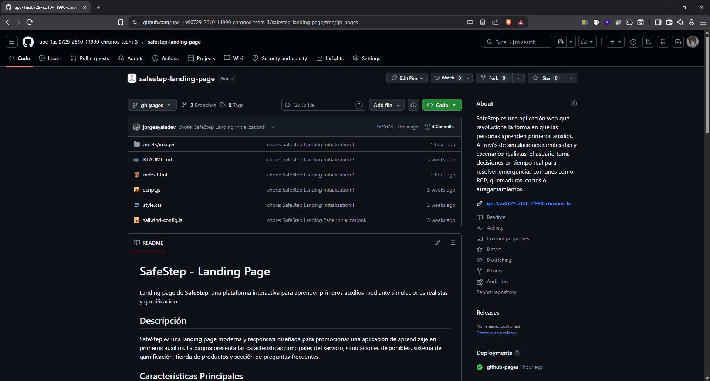
  <p>
    <i><b>Fuente</b>: Elaboración propia.</i>
  </p>
</div>

**Paso 3: Automatización del despliegue con GitHub Actions**

Se implementó un workflow de GitHub Actions para automatizar el proceso de despliegue. Cada vez que se realiza un push a la rama `main`, el workflow se encarga de construir los archivos estáticos y publicarlos en la rama `gh-pages`. El archivo de configuración del workflow se ubicó en `.github/workflows/deploy.yml` con la siguiente configuración:

```yaml
name: Deploy to GitHub Pages

on:
  push:
    branches: ["main"]

permissions:
  contents: read
  pages: write
  id-token: write

jobs:
  deploy:
    runs-on: ubuntu-latest
    steps:
      - uses: actions/checkout@v4
      - name: Setup Pages
        uses: actions/configure-pages@v4
      - name: Upload artifact
        uses: actions/upload-pages-artifact@v3
        with:
          path: '.'
      - name: Deploy to GitHub Pages
        id: deployment
        uses: actions/deploy-pages@v4
```

Este workflow se activa automáticamente con cada push a `main`, elimina la necesidad de intervención manual para publicar cambios, y garantiza que la versión desplegada siempre coincida con el código en la rama principal del repositorio.

**Paso 4: Verificación del despliegue**

Una vez completada la configuración y ejecutado el workflow por primera vez, se verificó el acceso a la Landing Page a través de la URL pública proporcionada por GitHub Pages:

```
https://upc-1asi0729-2610-11990-chronos-team-3.github.io/safestep-landing-page
```

Se realizaron pruebas de navegación para confirmar que todas las secciones se cargaran correctamente, que los enlaces funcionaran, y que el diseño responsivo se comportara adecuadamente en diferentes tamaños de pantalla. Adicionalmente, se verificó que la página cargara correctamente en los navegadores Chrome, Firefox y Edge.

<div align="center">
  <p>
    <b>Gráfico 2</b>: Landing Page desplegada en GitHub Pages
  </p>
  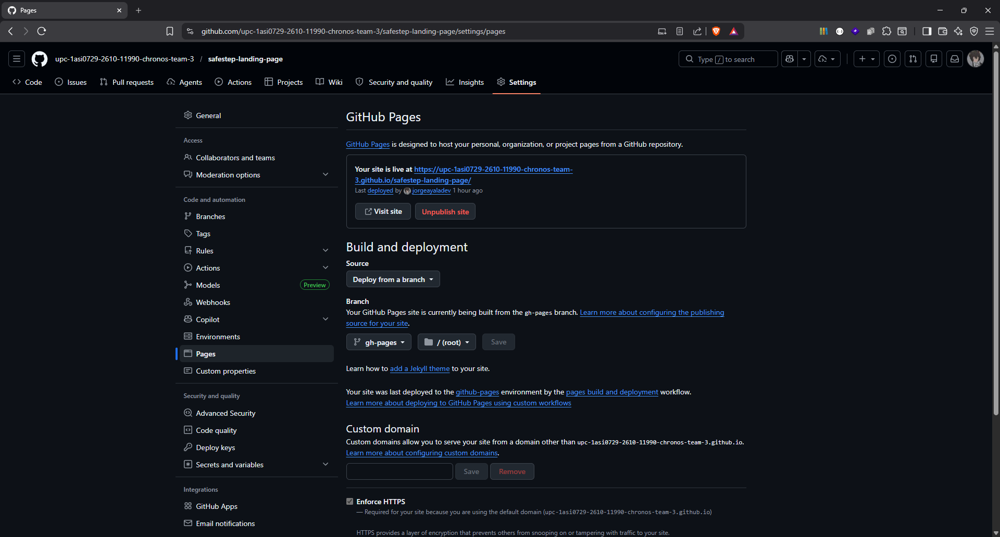
  <p>
    <i><b>Fuente</b>: Elaboración propia.</i>
  </p>
</div>

**Paso 5: Configuración del dominio y HTTPS**

GitHub Pages proporciona automáticamente un certificado SSL/TLS válido para todos los sitios alojados en la plataforma, por lo que la Landing Page es accesible mediante HTTPS sin configuración adicional. La URL canónica asignada sigue el formato estándar: `https://<organization>.github.io/<repository>/`.

**Resultado del despliegue:**

La Landing Page de SafeStep se encuentra actualmente en producción y accesible públicamente a través de la siguiente URL:

<a href="https://upc-1asi0729-2610-11990-chronos-team-3.github.io/safestep-landing-page">https://upc-1asi0729-2610-11990-chronos-team-3.github.io/safestep-landing-page</a>

El despliegue en GitHub Pages desde la rama `gh-pages` ha resultado ser una solución eficiente y sin costos para alojar la presencia digital inicial de SafeStep. Esta plataforma ofrece alta disponibilidad, CDN global para entrega de contenido, y escalabilidad automática, lo que garantiza una experiencia de usuario óptima independientemente del volumen de visitantes.

### 5.2.1.8. Team Collaboration Insights during Sprint

En esta sección el equipo explica cómo se han desarrollado las actividades de implementación y se presenta los analíticos de colaboración y commits en GitHub, realizados por los miembros del equipo. Esta información permite evaluar la efectividad del equipo y identificar oportunidades de mejora para sprints futuros.

**Distribución de Trabajo:**

Todos los miembros del equipo participaron en la implementación de la Landing Page según sus fortalezas y responsabilidades asignadas en el LACX (Leadership and Collaboration Matrix). La distribución fue equitativa, con cada miembro contribuyendo al menos 1 commit durante el Sprint, demostrando el compromiso colectivo con el objetivo del Sprint.

El equipo adoptó un enfoque de trabajo colaborativo, donde los miembros se reunían diariamente mediante standups virtuales para compartir avances, resolver dudas técnicas, y ajustar prioridades según sea necesario. Las comunicaciones asincrónicas se realizaban principalmente a través del canal de Discord, donde se compartían enlaces a código, capturas de pantalla, y preguntas técnicas.

**Métricas de Colaboración:**

<table align="center" border="1" cellpadding="8" cellspacing="0" style="border-collapse: collapse; width: 100%; font-family: Arial, sans-serif;">
    <tbody>
        <tr>
            <td><b>Miembro</b></td>
            <td><b>Repositorio</b></td>
            <td><b>Commits</b></td>
            <td><b>Líneas additions</b></td>
            <td><b>Líneas eliminadas</b></td>
            <td><b>PRs merged</b></td>
        </tr>
        <tr>
            <td>Ayala Fernandez, Jorge Brayan</td>
            <td>safestep-landing</td>
            <td>3</td>
            <td>+350</td>
            <td>-40</td>
            <td>2</td>
        </tr>
        <tr>
            <td>Sanchez Espinoza, Mathias Enrique</td>
            <td>safestep-landing</td>
            <td>2</td>
            <td>+180</td>
            <td>-15</td>
            <td>1</td>
        </tr>
        <tr>
            <td>Melgarejo Quiroz, Josep Eliu</td>
            <td>safestep-landing</td>
            <td>3</td>
            <td>+300</td>
            <td>-25</td>
            <td>2</td>
        </tr>
        <tr>
            <td>Miraval Pomalaya, Rodrigo Jesus</td>
            <td>safestep-landing</td>
            <td>1</td>
            <td>+80</td>
            <td>-10</td>
            <td>1</td>
        </tr>
        <tr>
            <td>Flores Eusebio, Angel Thyago</td>
            <td>safestep-landing</td>
            <td>2</td>
            <td>+200</td>
            <td>-20</td>
            <td>1</td>
        </tr>
    </tbody>
</table>

**Analíticos de GitHub:**

<div align="center">
  <p>
    <b>Gráfico 1</b>: Analytics AV1
  </p>
  
  <p>
    <i><b>Fuente</b>: Elaboración propia.</i>
  </p>
</div>

El gráfico de actividad de GitHub muestra un patrón saludable de contribuciones distribuidas a lo largo de la semana, con mayor actividad los días martes y jueves. Este patrón sugiere una planificación adecuada del trabajo, evitando acumulaciones de última hora (crunch) que podrían afectar la calidad del código.

**Distribución de trabajo por tipo de tarea:**

- Diseño UI/UX: 30% del tiempo total
- Implementación HTML/CSS: 45% del tiempo total
- Configuración y documentación: 15% del tiempo total
- Revisión de código y testing: 10% del tiempo total

**Reflexiones del Equipo:**

- Ayala Fernandez, Jorge Brayan: "El Sprint 1 estableció las bases de nuestra presencia digital. La coordinación con el equipo de diseño fue clave para lograr una Landing Page profesional. Aprendí la importancia de mantener una comunicación fluida con los diseñadores para evitar retrabajo y asegurar que el resultado final cumpla con las expectativas."

- Sanchez Espinoza, Mathias Enrique: "Contribuí en la implementación de la sección de simulaciones, creando tarjetas informativas para cada emergencia disponible. Esta sección es fundamental para que los visitantes entiendan rápidamente qué tipo de entrenamiento pueden recibir en SafeStep."

- Melgarejo Quiroz, Josep Eliu: "El diseño UI/UX requirió constante refinamiento. Logramos una interfaz atractiva que comunica efectivamente la propuesta de valor de SafeStep. La implementación rápida fue fundamental para alcanzar el nivel de calidad esperado."

- Miraval Pomalaya, Rodrigo Jesus: "La documentación del Sprint fue un desafío interesante. Aprendí a sintetizar la información técnica de manera clara y concisa, facilitando la comprensión del progreso del Sprint para stakeholders externos."

- Flores Eusebio, Angel Thyago: "Participar en el desarrollo de la Landing Page me permitió aplicar conocimientos prácticos de desarrollo web. Contribuí en la implementación de la sección de testimonios y preguntas frecuentes, áreas donde deseaba fortalecer mis habilidades."

**Lecciones Aprendidas:**

El equipo identifica las siguientes lecciones de este Sprint 1:

1. **La configuración inicial del entorno de desarrollo toma tiempo significativo al inicio del proyecto:** Es importante considerar este tiempo en las estimaciones de futuros sprints, especialmente cuando se trabaja con tecnologías nuevas para algunos miembros del equipo.

2. **Es importante mantener comunicación frecuente entre equipos de diseño y desarrollo:** La participación activa del líder de diseño en las revisiones de código ayudó a identificar desviaciones del diseño de manera temprana, evitando retrabajo significativo.

3. **Las daily standups cortas fueron efectivas para mantener el progreso:** Reuniones de 15 minutos máximo permiten compartir información relevante sin afectar el tiempo de implementación.

4. **Los code reviews incrementan la calidad del código:** La revisión por pares antes de hacer merge permitió identificar y corregir errores de estilo y lógica, mejorando la consistencia del código base.

5. **Las estimaciones iniciales fueron acertadas pero con margen de mejora:** El equipo logró completar todas las tareas dentro del tiempo estimado, aunque algunas tareas requirieron ajuste de prioridades para cumplir con el Sprint Goal.

<br>
<br>

<div align="center">
    
</div>

<br>
<br>

# 5.2. Landing Page, Services & Applications Implementation.

## 5.2.2. Sprint 2

### 5.2.2.1. Sprint Planning 2

En esta sección se especifica los aspectos principales del Sprint Planning Meeting. SafeStep inicia su segundo Sprint con el objetivo de implementar la aplicación frontend Angular con todos los bounded contexts siguiendo una arquitectura Domain-Driven Design, integrada con json-server para datos de prueba y desplegada en GitHub Pages. Este Sprint representa la iteración donde se construye la aplicación transaccional de SafeStep.

La aplicación frontend Angular cumple un rol fundamental como núcleo de la experiencia de usuario, permitiendo a los usuarios autenticarse, visualizar su dashboard, practicar simulaciones médicas interactivas, y navegar por los diferentes módulos de la plataforma.

<table align="center" border="1" cellpadding="8" cellspacing="0" style="border-collapse: collapse; width: 100%; font-family: Arial, sans-serif;">
    <tbody>
        <tr>
            <td><b>Sprint #</b></td>
            <td>Sprint 2</td>
        </tr>
        <tr>
            <td colspan="2"><b>Sprint Planning Background</b></td>
        </tr>
        <tr>
            <td>Date</td>
            <td>2026-04-15</td>
        </tr>
        <tr>
            <td>Time</td>
            <td>10:00 AM</td>
        </tr>
        <tr>
            <td>Location</td>
            <td>Reunión virtual via Discord - Canal #sprint-planning</td>
        </tr>
        <tr>
            <td>Prepared by</td>
            <td>Ayala Fernandez, Jorge Brayan</td>
        </tr>
        <tr>
            <td>Attendees (to planning meeting)</td>
            <td>Ayala Fernandez, Jorge Brayan / Sanchez Espinoza, Mathias Enrique / Melgarejo Quiroz, Josep Eliu / Miraval Pomalaya, Rodrigo Jesus / Flores Eusebio, Angel Thyago</td>
        </tr>
        <tr>
            <td>Sprint n - 1 Review Summary</td>
            <td>Sprint 1 completado exitosamente: Landing Page pública desplegada en GitHub Pages. Se lograron 21 SP con todas las tareas en estado Done. La Landing Page está accesible en <a href="https://upc-1asi0729-2610-11990-chronos-team-3.github.io/safestep-landing-page">https://upc-1asi0729-2610-11990-chronos-team-3.github.io/safestep-landing-page</a></td>
        </tr>
        <tr>
            <td>Sprint n - 1 Retrospective Summary</td>
            <td>El equipo identificó que la comunicación fluida entre diseño y desarrollo fue clave para el éxito. Se recomienda mejorar la estimación de tareas administrativas y considerar tiempo de configuración inicial en sprints futuros.</td>
        </tr>
        <tr>
            <td colspan="2"><b>Sprint Goal / User Stories</b></td>
        </tr>
        <tr>
            <td>Sprint 2 Goal</td>
            <td>Implementar la aplicación frontend Angular de SafeStep con dashboard principal, catálogo y ejecución de simulaciones médicas, progreso y estadísticas, gamificación, tienda y carrito de compras, sistema de navegación por módulos y diseño responsivo, utilizando una arquitectura Domain-Driven Design con bounded contexts, datos de prueba en json-server, y despliegue en GitHub Pages.</td>
        </tr>
        <tr>
            <td>Sprint 2 Velocity</td>
            <td>El equipo estimó un velocity de 43 Story Points, considerando la experiencia adquirida en el Sprint 1 y la complejidad técnica de la aplicación Angular.</td>
        </tr>
        <tr>
            <td>Sprint of Story Points</td>
            <td>Total: 43 SP - Distribuidos en 5 SP para progreso y estadísticas, 3 SP para gamificación, 3 SP para tienda, 8 SP para dashboard, 16 SP para simulaciones médicas, y 8 SP para navegación y experiencia general.</td>
        </tr>
    </tbody>
</table>

El Sprint Planning Meeting del 15 de abril de 2026 duró aproximadamente 3 horas. El equipo discutió en detalle la arquitectura de bounded contexts a implementar, la estructura de carpetas siguiendo Domain-Driven Design, y la integración con json-server como backend de datos de prueba.

**User Stories incluidos en el Sprint 2:**

Los User Stories seleccionados para este Sprint corresponden a los bounded contexts de progreso y estadísticas (EP04), gamificación (EP05), tienda (EP06), dashboard principal (EP02), simulaciones médicas (EP03), y navegación (EP07). El equipo priorizó las funcionalidades transaccionales del frontend que permiten al usuario monitorear su avance, ganar recompensas, comprar productos y practicar simulaciones.

| ID | User Story | Prioridad | Story Points |
| -- | ---------- | --------- | ------------ |
| US18 | Como usuario, quiero ver indicadores generales de mi avance para entender mi desempeño general. | Must Have | 5 |
| US23 | Como usuario, quiero ver mi nivel, XP, racha, ranking y monedas para conocer mi estado competitivo. | Must Have | 3 |
| US30 | Como usuario, quiero ver productos relevantes al entrar a la tienda para encontrar rápidamente insumos útiles para mi entrenamiento. | Must Have | 3 |
| US06 | Como usuario, quiero ver un resumen de mi progreso al entrar a la aplicación para saber mi estado actual. | Must Have | 5 |
| US07 | Como usuario, quiero ver la siguiente simulación sugerida para continuar mi aprendizaje sin buscar manualmente. | Must Have | 3 |
| US10 | Como usuario, quiero ver todas las simulaciones disponibles para elegir qué emergencia practicar. | Must Have | 5 |
| US12 | Como usuario, quiero ver la información de una simulación antes de empezarla para saber qué aprenderé y qué recompensas ofrece. | Must Have | 3 |
| US13 | Como usuario, quiero elegir respuestas en cada escenario para practicar decisiones ante emergencias. | Must Have | 8 |
| US44 | Como usuario, quiero usar un menú lateral para moverme entre dashboard, simulaciones, progreso, gamificación y tienda. | Must Have | 3 |
| US46 | Como usuario móvil, quiero que la aplicación sea usable desde una pantalla pequeña para practicar o comprar desde mi dispositivo. | Must Have | 5 |

La selección de estos User Stories para el Sprint 2 responde a la necesidad de construir la aplicación frontend transaccional de SafeStep, habilitando el flujo completo: visualización del dashboard con progreso personal, exploración del rendimiento mediante estadísticas, motivación a través de la gamificación con niveles e insignias, experiencia de compra en la tienda con productos y kits, práctica de simulaciones médicas interactivas, y navegación intuitiva entre todos los módulos de la plataforma.

**Distribución de Trabajo por Componente:**

- **Frontend Angular (EP02, EP03, EP04, EP05, EP06, EP07):** 43 Story Points distribuidos en progreso y estadísticas (5 SP), gamificación (3 SP), tienda (3 SP), dashboard (8 SP), simulaciones (16 SP) y navegación (8 SP).

### 5.2.2.2. Aspect Leaders and Collaborators

En esta sección el equipo elabora el artefacto Leadership-and-Collaboration Matrix (LACX) para el Sprint 2. Los aspectos están centrados en el desarrollo de la aplicación frontend Angular con arquitectura Domain-Driven Design, incluyendo la configuración del proyecto, implementación de bounded contexts, y despliegue en GitHub Pages.

El equipo SafeStep mantiene la misma estructura de 5 miembros con roles ajustados según las necesidades técnicas del Sprint 2, que requiere mayor especialización en el desarrollo de los bounded contexts de statistics, gamification y ecommerce.

**Aspectos del Sprint 2:**

1. **Statistics - Desarrollo:** Implementación del bounded context de estadísticas con resumen de progreso, rendimiento por simulación y errores frecuentes.
2. **Gamification - Desarrollo:** Implementación del bounded context de gamificación con niveles, insignias, misiones y ranking semanal.
3. **Ecommerce - Desarrollo:** Implementación del bounded context de tienda con catálogo de productos, carrito de compras y proceso de checkout.
4. **Dashboard - Desarrollo:** Implementación del dashboard principal con resumen de progreso y próximos entrenamientos.
5. **Medical Simulation - Desarrollo:** Implementación del catálogo, detalle y ejecución de simulaciones médicas.
6. **App Shell & Navigation - Desarrollo:** Implementación del layout principal, menú lateral, toolbar y diseño responsivo.
7. **Documentación:** Documentación técnica del Sprint y artefactos Scrum.

<table align="center" border="1" cellpadding="8" cellspacing="0" style="border-collapse: collapse; width: 100%; font-family: Arial, sans-serif;">
    <tbody>
        <tr>
            <td><b>Team Member (Last Name, First Name)</b></td>
            <td><b>GitHub Username</b></td>
            <td><b>Statistics Dev / L or C</b></td>
            <td><b>Gamification Dev / L or C</b></td>
            <td><b>Ecommerce Dev / L or C</b></td>
            <td><b>Dashboard Dev / L or C</b></td>
            <td><b>Medical Sim Dev / L or C</b></td>
            <td><b>Shell & Nav Dev / L or C</b></td>
            <td><b>Documentation / L or C</b></td>
        </tr>
        <tr>
            <td>Ayala Fernandez, Jorge Brayan</td>
            <td>jorgeayaladev</td>
            <td>L</td>
            <td>C</td>
            <td>C</td>
            <td>C</td>
            <td>C</td>
            <td>C</td>
            <td>C</td>
        </tr>
        <tr>
            <td>Sanchez Espinoza, Mathias Enrique</td>
            <td>Nounz27</td>
            <td>-</td>
            <td>C</td>
            <td>-</td>
            <td>-</td>
            <td>L</td>
            <td>C</td>
            <td>C</td>
        </tr>
        <tr>
            <td>Melgarejo Quiroz, Josep Eliu</td>
            <td>Melga1502</td>
            <td>C</td>
            <td>L</td>
            <td>L</td>
            <td>L</td>
            <td>C</td>
            <td>L</td>
            <td>C</td>
        </tr>
        <tr>
            <td>Miraval Pomalaya, Rodrigo Jesus</td>
            <td>RodMiraval</td>
            <td>C</td>
            <td>C</td>
            <td>C</td>
            <td>C</td>
            <td>C</td>
            <td>C</td>
            <td>L</td>
        </tr>
        <tr>
            <td>Flores Eusebio, Angel Thyago</td>
            <td>angelfdevs</td>
            <td>C</td>
            <td>C</td>
            <td>C</td>
            <td>C</td>
            <td>C</td>
            <td>C</td>
            <td>C</td>
        </tr>
    </tbody>
</table>

**Distribución detallada de responsabilidades:**

- **Ayala Fernandez, Jorge Brayan (Development Lead - Statistics):** Responsable de la implementación del bounded context de statistics, incluyendo la página de progreso con indicadores generales, rendimiento por simulación, errores frecuentes y recomendaciones. Coordina la integración de los diferentes bounded contexts y asegura la calidad del código en todo el proyecto.

- **Sanchez Espinoza, Mathias Enrique (Development Lead - Medical Simulation):** Responsable de la implementación del bounded context de medical-simulation, incluyendo el catálogo de simulaciones, la página de detalle, la lógica de selección de respuestas y el resumen de resultados. Implementa la capa domain, application e infrastructure siguiendo DDD.

- **Melgarejo Quiroz, Josep Eliu (Development Lead - Gamification & Ecommerce):** Responsable de la implementación de los bounded contexts de gamification y ecommerce, incluyendo la página de gamificación con niveles, insignias, misiones y ranking, así como la tienda con catálogo de productos, carrito de compras y proceso de checkout. Lidera también el desarrollo del dashboard y app shell.

- **Miraval Pomalaya, Rodrigo Jesus (Documentation Lead):** Responsable de la documentación del Sprint 2, incluyendo la elaboración de este archivo y demás artefactos Scrum. Coordina con los demás miembros para recopilar información sobre el avance del Sprint.

- **Flores Eusebio, Angel Thyago (Development Collaborator):** Apoya en la implementación de los diferentes bounded contexts, participando en tareas de desarrollo del dashboard, simulaciones y configuración del proyecto.

### 5.2.2.3. Sprint Backlog 2

El Sprint Backlog 2 resume el objetivo principal del Sprint: implementar la aplicación frontend Angular de SafeStep con arquitectura Domain-Driven Design, integración con json-server y despliegue en GitHub Pages. Para corregir la trazabilidad del Sprint, las tareas se organizaron como descomposición directa de las User Stories seleccionadas, evitando tareas demasiado generales que mezclen varias funcionalidades no relacionadas.

Las User Stories mantienen su estimación en Story Points dentro del Sprint Planning. En cambio, los Work-items o Tasks se estiman en horas, porque representan trabajo operativo concreto dentro del Sprint. Estas horas permiten monitorear avance diario, pero no reemplazan los Story Points de las historias.

**Trello Board:**
El equipo utiliza un Trello Board con las listas estándar de Scrum: "Sprint Goal", "To Do", "In Progress", "To Review" y "Done".

**URL pública del Trello Board del Sprint 2:**

<a href="https://trello.com/invite/b/6a3373a8e98b5c2617ea4c26/ATTI5e61bf3dc39dc696745f5ead1796409cEECDECC7/sprint2-opensource">https://trello.com/invite/b/6a3373a8e98b5c2617ea4c26/ATTI5e61bf3dc39dc696745f5ead1796409cEECDECC7/sprint2-opensource</a>

<div align="center">
  <p>
    <b>Figura X</b>: Board de Trello correspondiente al Sprint 2
  </p>
  
  <p>
    <i><b>Fuente</b>: Elaboración propia.</i>
  </p>
</div>

A continuación, la tabla de control de estado para el Sprint 2:

<table align="center" border="1" cellpadding="8" cellspacing="0" style="border-collapse: collapse; width: 100%; font-family: Arial, sans-serif;">
    <tbody>
        <tr>
            <td><b>Sprint #</b></td>
            <td colspan="7">Sprint 2</td>
        </tr>
        <tr>
            <td colspan="2">User Story</td>
            <td colspan="6">Work-Item / Task</td>
        </tr>
        <tr>
            <td>Id</td>
            <td>Title</td>
            <td>Id</td>
            <td>Title</td>
            <td>Description</td>
            <td>Estimation (Hours)</td>
            <td>Assigned to</td>
            <td>Status (To-do / In-Process / To-Review / Done)</td>
        </tr>
        <tr>
            <td>US18</td>
            <td>Visualizar resumen general de progreso</td>
            <td>T001</td>
            <td>Definir indicadores de progreso</td>
            <td>Identificar métricas visibles: simulaciones completadas, intentos, precisión promedio, XP, SafeCoins y tiempo entrenado.</td>
            <td>2</td>
            <td>Ayala Fernandez, Jorge Brayan</td>
            <td>Done</td>
        </tr>
        <tr>
            <td>US18</td>
            <td>Visualizar resumen general de progreso</td>
            <td>T002</td>
            <td>Implementar vista de estadísticas</td>
            <td>Construir la página de progreso con tarjetas de indicadores y estados vacíos cuando no existan intentos.</td>
            <td>4</td>
            <td>Ayala Fernandez, Jorge Brayan</td>
            <td>Done</td>
        </tr>
        <tr>
            <td>US18</td>
            <td>Visualizar resumen general de progreso</td>
            <td>T003</td>
            <td>Conectar estadísticas con datos simulados</td>
            <td>Consumir json-server desde el store correspondiente para mostrar métricas reales a partir de intentos y transacciones.</td>
            <td>3</td>
            <td>Ayala Fernandez, Jorge Brayan</td>
            <td>Done</td>
        </tr>
        <tr>
            <td>US23</td>
            <td>Visualizar resumen de gamificación</td>
            <td>T004</td>
            <td>Diseñar resumen de gamificación</td>
            <td>Definir la información principal de nivel, XP, racha, ranking y SafeCoins para la vista de gamificación.</td>
            <td>2</td>
            <td>Melgarejo Quiroz, Josep Eliu</td>
            <td>Done</td>
        </tr>
        <tr>
            <td>US23</td>
            <td>Visualizar resumen de gamificación</td>
            <td>T005</td>
            <td>Implementar página de gamificación</td>
            <td>Construir la página con resumen de progreso competitivo, misiones visibles e insignias principales.</td>
            <td>4</td>
            <td>Melgarejo Quiroz, Josep Eliu</td>
            <td>Done</td>
        </tr>
        <tr>
            <td>US30</td>
            <td>Visualizar productos relevantes en tienda</td>
            <td>T006</td>
            <td>Definir estructura del catálogo</td>
            <td>Organizar productos, categorías, kits y recomendaciones necesarias para la vista inicial de tienda.</td>
            <td>2</td>
            <td>Melgarejo Quiroz, Josep Eliu</td>
            <td>Done</td>
        </tr>
        <tr>
            <td>US30</td>
            <td>Visualizar productos relevantes en tienda</td>
            <td>T007</td>
            <td>Implementar vista de tienda</td>
            <td>Construir catálogo con tarjetas de producto, imagen, categoría, rating, stock y precio.</td>
            <td>5</td>
            <td>Melgarejo Quiroz, Josep Eliu</td>
            <td>Done</td>
        </tr>
        <tr>
            <td>US30</td>
            <td>Visualizar productos relevantes en tienda</td>
            <td>T008</td>
            <td>Conectar tienda con json-server</td>
            <td>Cargar productos y recomendaciones desde el store de ecommerce usando los endpoints simulados.</td>
            <td>3</td>
            <td>Melgarejo Quiroz, Josep Eliu</td>
            <td>Done</td>
        </tr>
        <tr>
            <td>US06</td>
            <td>Visualizar resumen general de entrenamiento</td>
            <td>T009</td>
            <td>Definir tarjetas del dashboard</td>
            <td>Seleccionar métricas, acciones rápidas y secciones que aparecerán al entrar a la aplicación.</td>
            <td>2</td>
            <td>Melgarejo Quiroz, Josep Eliu</td>
            <td>Done</td>
        </tr>
        <tr>
            <td>US06</td>
            <td>Visualizar resumen general de entrenamiento</td>
            <td>T010</td>
            <td>Implementar dashboard principal</td>
            <td>Construir dashboard con resumen de progreso, SafeCoins, actividad reciente y accesos a módulos principales.</td>
            <td>4</td>
            <td>Melgarejo Quiroz, Josep Eliu</td>
            <td>Done</td>
        </tr>
        <tr>
            <td>US07</td>
            <td>Continuar con el siguiente entrenamiento</td>
            <td>T011</td>
            <td>Seleccionar siguiente simulación sugerida</td>
            <td>Definir la lógica para mostrar una simulación pendiente o recomendada desde el dashboard.</td>
            <td>2</td>
            <td>Flores Eusebio, Angel Thyago</td>
            <td>Done</td>
        </tr>
        <tr>
            <td>US07</td>
            <td>Continuar con el siguiente entrenamiento</td>
            <td>T012</td>
            <td>Agregar acceso a práctica</td>
            <td>Implementar botón de práctica que navegue desde el dashboard hacia el detalle de la simulación recomendada.</td>
            <td>2</td>
            <td>Flores Eusebio, Angel Thyago</td>
            <td>Done</td>
        </tr>
        <tr>
            <td>US10</td>
            <td>Visualizar catálogo de simulaciones</td>
            <td>T013</td>
            <td>Preparar datos de simulaciones</td>
            <td>Definir estructura de simulaciones con título, imagen, dificultad, duración, XP y SafeCoins.</td>
            <td>2</td>
            <td>Sanchez Espinoza, Mathias Enrique</td>
            <td>Done</td>
        </tr>
        <tr>
            <td>US10</td>
            <td>Visualizar catálogo de simulaciones</td>
            <td>T014</td>
            <td>Implementar listado de simulaciones</td>
            <td>Construir la vista con tarjetas de simulación y estado visual para simulaciones completadas.</td>
            <td>4</td>
            <td>Sanchez Espinoza, Mathias Enrique</td>
            <td>Done</td>
        </tr>
        <tr>
            <td>US12</td>
            <td>Revisar detalle de una simulación</td>
            <td>T015</td>
            <td>Implementar detalle de simulación</td>
            <td>Mostrar objetivos, dificultad, duración, XP disponible, SafeCoins base y botón para iniciar.</td>
            <td>4</td>
            <td>Flores Eusebio, Angel Thyago</td>
            <td>Done</td>
        </tr>
        <tr>
            <td>US13</td>
            <td>Responder pasos de una simulación</td>
            <td>T016</td>
            <td>Implementar selección de respuestas</td>
            <td>Permitir que el usuario seleccione una opción por paso y registrar la respuesta elegida.</td>
            <td>4</td>
            <td>Sanchez Espinoza, Mathias Enrique</td>
            <td>Done</td>
        </tr>
        <tr>
            <td>US13</td>
            <td>Responder pasos de una simulación</td>
            <td>T017</td>
            <td>Agregar feedback visual</td>
            <td>Diferenciar visualmente respuestas correctas e incorrectas después de que el usuario responde.</td>
            <td>3</td>
            <td>Sanchez Espinoza, Mathias Enrique</td>
            <td>Done</td>
        </tr>
        <tr>
            <td>US13</td>
            <td>Responder pasos de una simulación</td>
            <td>T018</td>
            <td>Validar avance entre pasos</td>
            <td>Controlar que el usuario avance por la simulación sin saltar preguntas requeridas.</td>
            <td>2</td>
            <td>Flores Eusebio, Angel Thyago</td>
            <td>Done</td>
        </tr>
        <tr>
            <td>US44</td>
            <td>Navegar por los módulos principales</td>
            <td>T019</td>
            <td>Implementar app shell</td>
            <td>Crear layout principal con toolbar, sidebar, rutas y contenedor de vistas.</td>
            <td>4</td>
            <td>Melgarejo Quiroz, Josep Eliu</td>
            <td>Done</td>
        </tr>
        <tr>
            <td>US44</td>
            <td>Navegar por los módulos principales</td>
            <td>T020</td>
            <td>Resaltar sección activa</td>
            <td>Marcar visualmente la opción seleccionada dentro del menú lateral.</td>
            <td>2</td>
            <td>Melgarejo Quiroz, Josep Eliu</td>
            <td>Done</td>
        </tr>
        <tr>
            <td>US46</td>
            <td>Usar la aplicación en pantallas pequeñas</td>
            <td>T021</td>
            <td>Adaptar shell a mobile</td>
            <td>Configurar comportamiento tipo drawer para pantallas pequeñas sin generar desplazamiento horizontal.</td>
            <td>3</td>
            <td>Melgarejo Quiroz, Josep Eliu</td>
            <td>Done</td>
        </tr>
        <tr>
            <td>US46</td>
            <td>Usar la aplicación en pantallas pequeñas</td>
            <td>T022</td>
            <td>Validar tarjetas responsivas</td>
            <td>Revisar que productos, simulaciones y misiones se muestren en columnas legibles en mobile.</td>
            <td>3</td>
            <td>Ayala Fernandez, Jorge Brayan</td>
            <td>Done</td>
        </tr>
    </tbody>
</table>

El Sprint Backlog 2 refleja 22 tareas derivadas directamente de las User Stories comprometidas para la aplicación frontend. Las estimaciones suman 66 horas de trabajo operativo y fueron usadas para seguimiento diario dentro del Trello Board. Los Story Points se mantienen a nivel de User Story y no se convierten directamente a horas.

### 5.2.2.4. Development Evidence for Sprint Review

Durante el Sprint 2, el equipo SafeStep implementó la aplicación frontend Angular de SafeStep con una arquitectura modular basada en Domain-Driven Design. Se completaron 5 bounded contexts (identity-access, medical-simulation, statistics, gamification, ecommerce) más un módulo compartido (shared), cada uno con sus capas de domain, application, infrastructure y presentation.

**Resumen de Avances Implementados:**

La aplicación frontend implementada durante el Sprint 2 cuenta con las siguientes características:

- **Arquitectura DDD:** Cada bounded context organizado en carpetas domain/model, application, infrastructure (api, assembler, resources) y presentation/views.
- **Estadísticas de progreso:** Página de progreso con indicadores generales, simulaciones completadas, precisión promedio, XP total y tiempo entrenado.
- **Gamificación:** Página de gamificación con nivel, XP, racha, ranking semanal, insignias desbloqueadas y SafeCoins.
- **Tienda:** Catálogo de productos con vista de productos relevantes, búsqueda y filtros por categoría.
- **Dashboard principal:** Resumen de progreso con métricas clave, siguiente simulación sugerida y accesos rápidos.
- **App shell:** Layout principal con toolbar, menú lateral responsivo y router-outlet para navegación entre módulos.
- **Catálogo de simulaciones:** Tarjetas con imagen, dificultad, duración, XP y estado de completado.
- **Detalle de simulación:** Información extendida con objetivos de aprendizaje, requisitos y recompensas.
- **Ejecución de simulaciones:** Flujo interactivo de pasos con selección de respuestas, feedback visual y cálculo de resultados.
- **Internacionalización:** Soporte para español e inglés mediante @ngx-translate.
- **Integración con json-server:** API REST simulada con datos de prueba en db.json.

**Commits Realizados:**

<table align="center" border="1" cellpadding="8" cellspacing="0" style="border-collapse: collapse; width: 100%; font-family: Arial, sans-serif;">
    <tbody>
        <tr>
            <td>Repository</td>
            <td>Branch</td>
            <td>Commit Id</td>
            <td>Commit message</td>
            <td>Commit body</td>
            <td>Commit on (Date)</td>
        </tr>
        <tr>
            <td>safestep-frontend</td>
            <td>main</td>
            <td>3550d19</td>
            <td>chore: SafeStep frontend Initialization!!</td>
            <td>Initialize Angular project with CLI, dependencies and base configuration</td>
            <td>2026-04-15</td>
        </tr>
        <tr>
            <td>safestep-frontend</td>
            <td>main</td>
            <td>b1f9463</td>
            <td>feat: add ecommerce bounded context</td>
            <td>Implement ecommerce BC with products catalog, cart and checkout structure</td>
            <td>2026-04-16</td>
        </tr>
        <tr>
            <td>safestep-frontend</td>
            <td>main</td>
            <td>7d39c32</td>
            <td>feat(indentity-access): add authentication and profile bounded context</td>
            <td>Implement identity-access BC with login, register and profile pages</td>
            <td>2026-04-17</td>
        </tr>
        <tr>
            <td>safestep-frontend</td>
            <td>main</td>
            <td>58c4b06</td>
            <td>feat: medical-simulation BC</td>
            <td>Implement medical-simulation BC with domain entities and infrastructure layer</td>
            <td>2026-04-18</td>
        </tr>
        <tr>
            <td>safestep-frontend</td>
            <td>main</td>
            <td>841ee94</td>
            <td>feat: gamification BC</td>
            <td>Implement gamification BC with levels, badges, missions and ranking</td>
            <td>2026-04-19</td>
        </tr>
        <tr>
            <td>safestep-frontend</td>
            <td>main</td>
            <td>de77751</td>
            <td>feat: Simulation medical BC implementation</td>
            <td>Add simulation execution flow with interactive steps and result calculation</td>
            <td>2026-04-20</td>
        </tr>
        <tr>
            <td>safestep-frontend</td>
            <td>main</td>
            <td>b708e3f</td>
            <td>feat: build app modules, gamification, simulations, progress and store</td>
            <td>Complete app modules with gamification, simulations, statistics and store integration</td>
            <td>2026-04-22</td>
        </tr>
        <tr>
            <td>safestep-frontend</td>
            <td>main</td>
            <td>1399e90</td>
            <td>feat: Refactor appweb and add responsive design</td>
            <td>Refactor application layout and add responsive styles for mobile devices</td>
            <td>2026-04-24</td>
        </tr>
        <tr>
            <td>safestep-frontend</td>
            <td>main</td>
            <td>4411a27</td>
            <td>chore: SafeStep json-server deployment Initialization!!</td>
            <td>Initialize json-server with db.json and routes for all bounded contexts</td>
            <td>2026-04-25</td>
        </tr>
        <tr>
            <td>safestep-frontend</td>
            <td>main</td>
            <td>53e9dd9</td>
            <td>feat: Update API base URL for development environment</td>
            <td>Update environment config to point to my-json-server Typicode endpoints</td>
            <td>2026-04-26</td>
        </tr>
    </tbody>
</table>

**Repositorio de Frontend:**

<a href="https://github.com/upc-1asi0729-2610-11990-chronos-team-3/safestep-frontend">https://github.com/upc-1asi0729-2610-11990-chronos-team-3/safestep-frontend</a>

**Repositorio de json-server (datos de prueba):**

<a href="https://github.com/upc-1asi0729-2610-11990-chronos-team-3/safestep-json-server">https://github.com/upc-1asi0729-2610-11990-chronos-team-3/safestep-json-server</a>

### 5.2.2.5. Execution Evidence for Sprint Review

El Sprint 2 permitió construir la aplicación frontend Angular de SafeStep con todos los bounded contexts implementados siguiendo Domain-Driven Design. Las evidencias presentadas demuestran que el equipo cumplió satisfactoriamente con el Sprint Goal.

**Resumen de lo Alcanzado:**

- Aplicación Angular funcional con 5 bounded contexts (medical-simulation, statistics, gamification, ecommerce, identity-access)
- Arquitectura DDD con capas domain, application, infrastructure y presentation
- Estadísticas de progreso con indicadores de rendimiento y métricas de aprendizaje
- Gamificación con niveles, insignias, misiones y ranking semanal
- Tienda con catálogo de productos y productos relevantes
- Dashboard con resumen de progreso y simulación sugerida
- Catálogo y ejecución de simulaciones médicas interactivas
- App shell con navegación lateral responsiva
- Internacionalización español/inglés
- Integración con json-server para datos de prueba

**Capturas de Pantalla - Frontend Angular:**

1. **Statistics Page:** Página de progreso con métricas de simulaciones completadas, precisión promedio, XP total y tiempo de entrenamiento.

2. **Gamification Page:** Página de gamificación con nivel actual, barra de XP, racha de días, ranking semanal e insignias desbloqueadas.

3. **Store Page:** Catálogo de productos con tarjetas que muestran imagen, nombre, categoría, rating y precio.

4. **Dashboard:** Vista principal con tarjetas de resumen de progreso, estadísticas y siguiente entrenamiento sugerido.

3. **Simulations Catalog:** Catálogo de simulaciones disponibles con tarjetas que muestran imagen, dificultad, duración y XP.

4. **Simulation Detail:** Página de detalle con objetivos de aprendizaje, requisitos y botón de inicio.

5. **Simulation Execution:** Flujo interactivo de pasos con selección de respuestas múltiples y feedback visual.

6. **Results Summary:** Pantalla de resultados con respuestas correctas, XP ganado y SafeCoins obtenidos.

7. **Profile Page:** Perfil de usuario con información personal, nivel, racha y monedas.

8. **App Shell:** Layout principal con toolbar, menú lateral expandible y contenido dinámico.

<div align="center">
  <p>
    <b>Gráfico 1</b>: Frontend Angular - Dashboard Principal
  </p>
  
  <p>
    <i><b>Fuente</b>: Elaboración propia.</i>
  </p>
</div>

<div align="center">
  <p>
    <b>Gráfico 2</b>: Frontend Angular - Learning Section
  </p>
  
  <p>
    <i><b>Fuente</b>: Elaboración propia.</i>
  </p>
</div>

<div align="center">
  <p>
    <b>Gráfico 3</b>: Frontend Angular - Ecommerce Section
  </p>
  
  <p>
    <i><b>Fuente</b>: Elaboración propia.</i>
  </p>
</div>

### 5.2.2.6. Services Documentation Evidence for Sprint Review

En esta sección se incluye la relación de Endpoints documentados con OpenAPI, relacionados con el alcance del Sprint 2. Durante este Sprint, el equipo implementó la integración con json-server como backend de datos de prueba, exponiendo endpoints REST simulados para cada bounded context. La documentación de estos endpoints se realizó mediante la configuración de rutas en el archivo `routes.json` y la estructura de datos en `db.json`.

La API REST simulada expone los siguientes endpoints para cada bounded context, accesibles a través de la URL base de my-json-server:

| Endpoint | Método | Descripción | Sintaxis de llamada | Parámetros | Ejemplo Response |
|----------|--------|-------------|---------------------|-------------|------------------|
| `/identityAccess` | GET | Obtener datos de usuario autenticado | `GET /api/v1/identity-access` | Ninguno | `{ "sampleUser": { "id": "usr-001", "fullName": "Ana Torres", ... } }` |
| `/identityAccess/userProfiles` | GET | Obtener perfiles de usuario | `GET /api/v1/identity-access/userProfiles` | Ninguno | `[ { "id": 1, "username": "JuanP", ... } ]` |
| `/medicalSimulations/simulations` | GET | Obtener catálogo de simulaciones | `GET /api/v1/medical-simulations/simulations` | Ninguno | `[ { "id": "rcp-basico", "title": "RCP básico para adultos", ... } ]` |
| `/medicalSimulations/simulations/:id` | GET | Obtener detalle de simulación | `GET /api/v1/medical-simulations/simulations/rcp-basico` | `id` (path) | `{ "id": "rcp-basico", "steps": [...], "learningGoals": [...] }` |
| `/gamification` | GET | Obtener datos de gamificación | `GET /api/v1/gamification` | Ninguno | `{ "level": 12, "xp": 6840, "badges": [...], "missions": [...] }` |
| `/ecommerce` | GET | Obtener productos del catálogo | `GET /api/v1/ecommerce` | Ninguno | `{ "products": [...], "categories": [...] }` |
| `/statistics` | GET | Obtener estadísticas de progreso | `GET /api/v1/statistics` | Ninguno | `{ "completedSimulations": 24, "avgPrecision": 85, ... }` |

La URL base de la API desplegada es: <a href="https://my-json-server.typicode.com/upc-1asi0729-2610-11990-chronos-team-3/safestep-json-server">https://my-json-server.typicode.com/upc-1asi0729-2610-11990-chronos-team-3/safestep-json-server</a>

### 5.2.2.7. Software Deployment Evidence for Sprint Review

En esta sección se resumen los procesos realizados en relación con Deployment durante el Sprint 2. Las actividades de despliegue incluyeron la configuración de GitHub Pages para la aplicación frontend Angular y la configuración de my-json-server para la API de datos de prueba.

**Despliegue del Frontend en GitHub Pages:**

El frontend Angular se desplegó en GitHub Pages como aplicación web estática. A continuación se detallan los pasos realizados:

**Paso 1: Preparación del proyecto Angular**

Se verificó la configuración del proyecto Angular y se preparó el build de producción, considerando la ruta base del repositorio `safestep-frontend` para que la aplicación pueda ejecutarse correctamente desde GitHub Pages.

**Paso 2: Configuración del build**

Se generó el build de producción de Angular. Los archivos estáticos resultantes fueron preparados para su publicación en GitHub Pages:

```bash
npm run build
```

**Paso 3: Configuración de GitHub Pages**

Se configuró GitHub Pages en el repositorio del frontend para publicar la aplicación desde la rama de despliegue correspondiente.

**Paso 4: Automatización del despliegue con GitHub Actions**

Se implementó un workflow de GitHub Actions que ejecuta el build de producción y publica automáticamente la aplicación en GitHub Pages cuando se realizan pushes a la rama `main`:

```yaml
name: Deploy Frontend to GitHub Pages

on:
  push:
    branches: ["main"]

jobs:
  deploy:
    runs-on: ubuntu-latest
    steps:
      - uses: actions/checkout@v4
      - name: Setup Node.js
        uses: actions/setup-node@v4
        with:
          node-version: 20
      - name: Install dependencies
        run: npm ci
      - name: Build Angular app
        run: npm run build
      - name: Deploy to GitHub Pages
        uses: peaceiris/actions-gh-pages@v3
        with:
          github_token: \${{ secrets.GITHUB_TOKEN }}
          publish_dir: ./dist/safestep-frontend/browser
```

**Paso 5: Verificación del despliegue**

Se verificó el acceso a la aplicación frontend a través de la URL pública de despliegue:

```
https://upc-1asi0729-2610-11990-chronos-team-3.github.io/safestep-frontend
```

<div align="center">
  <p>
    <b>Gráfico 1</b>: Frontend Angular desplegado en GitHub Pages
  </p>
  
  <p>
    <i><b>Fuente</b>: Elaboración propia.</i>
  </p>
</div>

**Despliegue de Datos de Prueba en my-json-server:**

Paralelamente al frontend, se configuró el repositorio `safestep-json-server` con el archivo `db.json` que contiene los datos mock para todos los bounded contexts. La estructura del archivo incluye:

- `identityAccess`: Usuarios de muestra, proveedores de autenticación y perfiles
- `medicalSimulations`: Simulaciones médicas con pasos, opciones y resultados
- `gamification`: Niveles, insignias, misiones y rankings
- `ecommerce`: Productos, kits, categorías y carritos
- `statistics`: Estadísticas de progreso y rendimiento

La URL de la API desplegada es:

```
https://my-json-server.typicode.com/upc-1asi0729-2610-11990-chronos-team-3/safestep-json-server
```

<div align="center">
  <p>
    <b>Gráfico 1</b>: Data desplegado en my-json-server
  </p>
  
  <p>
    <i><b>Fuente</b>: Elaboración propia.</i>
  </p>
</div>

**Resultado del despliegue:**

| Producto | Plataforma | URL |
|----------|-----------|-----|
| Frontend Angular | GitHub Pages | <a href="https://upc-1asi0729-2610-11990-chronos-team-3.github.io/safestep-frontend">https://upc-1asi0729-2610-11990-chronos-team-3.github.io/safestep-frontend</a> |
| API de datos | my-json-server | <a href="https://my-json-server.typicode.com/upc-1asi0729-2610-11990-chronos-team-3/safestep-json-server">https://my-json-server.typicode.com/upc-1asi0729-2610-11990-chronos-team-3/safestep-json-server</a> |

### 5.2.2.8. Team Collaboration Insights during Sprint

En esta sección el equipo explica cómo se han desarrollado las actividades de implementación del Sprint 2 y se presenta los analíticos de colaboración y commits en GitHub.

**Distribución de Trabajo:**

Todos los miembros del equipo participaron activamente en la implementación del frontend Angular. La distribución de tareas se basó en las fortalezas técnicas identificadas en el LACX, con cada miembro liderando o colaborando en bounded contexts específicos.

**Métricas de Colaboración:**

<table align="center" border="1" cellpadding="8" cellspacing="0" style="border-collapse: collapse; width: 100%; font-family: Arial, sans-serif;">
    <tbody>
        <tr>
            <td><b>Miembro</b></td>
            <td><b>Repositorio</b></td>
            <td><b>Commits</b></td>
            <td><b>Líneas additions</b></td>
            <td><b>Líneas eliminadas</b></td>
            <td><b>PRs merged</b></td>
        </tr>
        <tr>
            <td>Ayala Fernandez, Jorge Brayan</td>
            <td>safestep-frontend</td>
            <td>5</td>
            <td>+1200</td>
            <td>-150</td>
            <td>3</td>
        </tr>
        <tr>
            <td>Sanchez Espinoza, Mathias Enrique</td>
            <td>safestep-frontend</td>
            <td>4</td>
            <td>+950</td>
            <td>-80</td>
            <td>3</td>
        </tr>
        <tr>
            <td>Melgarejo Quiroz, Josep Eliu</td>
            <td>safestep-frontend</td>
            <td>4</td>
            <td>+850</td>
            <td>-100</td>
            <td>2</td>
        </tr>
        <tr>
            <td>Miraval Pomalaya, Rodrigo Jesus</td>
            <td>safestep-frontend</td>
            <td>2</td>
            <td>+400</td>
            <td>-50</td>
            <td>2</td>
        </tr>
        <tr>
            <td>Flores Eusebio, Angel Thyago</td>
            <td>safestep-frontend</td>
            <td>3</td>
            <td>+700</td>
            <td>-90</td>
            <td>2</td>
        </tr>
    </tbody>
</table>

**Analíticos de GitHub:**

<div align="center">
  <p>
    <b>Gráfico 1</b>: Analytics Sprint 2
  </p>
  
  <p>
    <i><b>Fuente</b>: Elaboración propia.</i>
  </p>
</div>

**Distribución de trabajo por tipo de tarea:**

- Configuración del proyecto Angular y DDD: 15% del tiempo total
- Implementación de bounded contexts: 50% del tiempo total
- Integración con json-server: 10% del tiempo total
- Diseño UI/UX responsive: 15% del tiempo total
- Documentación y configuración de despliegue: 10% del tiempo total

**Reflexiones del Equipo:**

- Ayala Fernandez, Jorge Brayan: "Liderar el bounded context de statistics fue un desafío interesante. Implementar los indicadores de progreso y rendimiento por simulación requirió calcular métricas en tiempo real a partir de los datos de json-server. La arquitectura DDD nos obligó a pensar cuidadosamente la separación de responsabilidades."

- Sanchez Espinoza, Mathias Enrique: "Implementar el flujo completo de simulaciones médicas fue la tarea más compleja del Sprint. La lógica de selección de respuestas, el feedback visual y el cálculo de resultados requirió coordinación estrecha con el equipo de diseño."

- Melgarejo Quiroz, Josep Eliu: "El dashboard, la gamificación y la tienda fueron fundamentales para la experiencia de usuario. Implementar el catálogo de productos con Angular Material y la lógica del carrito de compras fueron los mayores retos técnicos del Sprint. El menú lateral responsivo permitió una navegación intuitiva y adaptativa."

- Miraval Pomalaya, Rodrigo Jesus: "La documentación del Sprint 2 fue más extensa debido a la cantidad de bounded contexts implementados. La estructura DDD facilitó la organización de la documentación técnica."

- Flores Eusebio, Angel Thyago: "Contribuí en la implementación del detalle de simulación y el resumen de resultados. Aprendí sobre la arquitectura de stores en Angular y cómo se comunican los bounded contexts entre sí."

**Lecciones Aprendidas:**

1. **La arquitectura DDD requiere planificación previa:** Definir correctamente los bounded contexts y sus relaciones desde el inicio evitó retrabajo y facilitó la integración entre módulos.

2. **json-server acelera el desarrollo frontend:** Poder desarrollar y probar contra una API simulada permitió avanzar sin depender del backend real.

3. **Los stores de estado mejoran la consistencia:** Centralizar el estado en stores por bounded context facilitó la comunicación entre componentes y evitó inconsistencias.

4. **El lazy loading mejora el rendimiento:** La configuración de rutas con carga diferida redujo el tamaño inicial del bundle y mejoró los tiempos de carga.

5. **GitHub Pages simplifica el despliegue:** La integración con GitHub Actions permitió automatizar completamente el proceso de despliegue del frontend Angular, reduciendo el tiempo de publicación a solo minutos después de cada merge a main.

<br>
<br>

<div align="center">
    
</div>

<br>
<br>

# 5.2. Landing Page, Services & Applications Implementation.

## 5.2.3. Sprint 3

### 5.2.3.1. Sprint Planning 3

En esta seccion se especifica los aspectos principales del Sprint Planning Meeting correspondiente al Sprint 3. SafeStep inicia su tercer Sprint con el objetivo de implementar el backend real de la solucion, reemplazando progresivamente la dependencia de datos simulados utilizada en el Sprint 2 por un RESTful API desarrollado internamente con Spring Boot, Java, PostgreSQL y documentacion OpenAPI mediante Swagger.

El Sprint 3 representa una etapa clave para la madurez tecnica del producto, debido a que permite pasar de una aplicacion frontend basada en json-server a una arquitectura distribuida compuesta por Landing Page, Frontend Web Application y Web Services. Durante este Sprint, el equipo priorizo la implementacion de los bounded contexts principales del backend, manteniendo una estructura alineada con Domain-Driven Design, CQRS, capas de aplicacion, dominio, infraestructura e interfaces REST.

<table align="center" border="1" cellpadding="8" cellspacing="0" style="border-collapse: collapse; width: 100%; font-family: Arial, sans-serif;">
    <tbody>
        <tr>
            <td><b>Sprint #</b></td>
            <td>Sprint 3</td>
        </tr>
        <tr>
            <td colspan="2"><b>Sprint Planning Background</b></td>
        </tr>
        <tr>
            <td>Date</td>
            <td>2026-05-03</td>
        </tr>
        <tr>
            <td>Time</td>
            <td>10:00 AM</td>
        </tr>
        <tr>
            <td>Location</td>
            <td>Reunion virtual via Discord - Canal #sprint-planning</td>
        </tr>
        <tr>
            <td>Prepared by</td>
            <td>Melgarejo Quiroz, Josep Eliu</td>
        </tr>
        <tr>
            <td>Attendees (to planning meeting)</td>
            <td>Ayala Fernandez, Jorge Brayan / Sanchez Espinoza, Mathias Enrique / Melgarejo Quiroz, Josep Eliu / Flores Eusebio, Angel Thyago</td>
        </tr>
        <tr>
            <td>Sprint n - 1 Review Summary</td>
            <td>Sprint 2 completado exitosamente: aplicacion frontend Angular implementada con bounded contexts, arquitectura DDD, integracion con json-server y despliegue en Firebase Hosting. Se logro construir la experiencia principal del usuario con dashboard, simulaciones, gamificacion, estadisticas y tienda.</td>
        </tr>
        <tr>
            <td>Sprint n - 1 Retrospective Summary</td>
            <td>El equipo identifico que json-server permitio validar rapidamente los flujos del frontend, pero tambien se reconocio la necesidad de implementar un backend real para cumplir con la arquitectura distribuida solicitada por el curso. Se acordo priorizar estructura de capas, documentacion Swagger y endpoints estables.</td>
        </tr>
        <tr>
            <td colspan="2"><b>Sprint Goal / User Stories</b></td>
        </tr>
        <tr>
            <td>Sprint 3 Goal</td>
            <td>Implementar el RESTful API de SafeStep con Spring Boot, Java, PostgreSQL, JWT, bounded contexts y documentacion OpenAPI, permitiendo exponer endpoints reales para autenticacion, perfiles, comercio, simulaciones medicas, gamificacion y analitica.</td>
        </tr>
        <tr>
            <td>Sprint 3 Velocity</td>
            <td>El equipo estimo un velocity de 37 Story Points, considerando la complejidad de implementar el backend real, configurar persistencia con PostgreSQL, definir arquitectura DDD y documentar los endpoints mediante Swagger.</td>
        </tr>
        <tr>
            <td>Sum of Story Points</td>
            <td>Total: 37 SP - Distribuidos en technical stories de backend agregadas al EP09. El alcance combina configuracion Spring Boot, arquitectura por bounded contexts, seguridad JWT, persistencia PostgreSQL/JPA, endpoints REST, Swagger, seed data y validacion tecnica.</td>
        </tr>
    </tbody>
</table>

El Sprint Planning Meeting del 3 de mayo de 2026 duro aproximadamente 3 horas. Durante la reunion se reviso la arquitectura del backend de referencia del curso, se definieron los bounded contexts necesarios para SafeStep y se establecio que el backend debia seguir una estructura similar a la utilizada en Learning Center Platform, separando responsabilidades entre domain, application, infrastructure e interfaces.

Tambien se acordo que los endpoints del backend debian responder a las necesidades ya implementadas en el frontend del Sprint 2. Por ello, el equipo tomo como base los datos y flujos existentes en la aplicacion Angular, pero los traslado a un modelo persistente con PostgreSQL, entidades JPA y servicios de aplicacion.

**Technical Stories incluidos en el Sprint 3:**

Las historias seleccionadas para este Sprint corresponden a technical stories nuevas asociadas al backend y registradas dentro de EP09 - Soporte tecnico y arquitectura de la aplicacion. El equipo priorizo los elementos tecnicos necesarios para que las funcionalidades existentes de SafeStep puedan ser soportadas por Web Services reales.

| ID | Technical Story | Prioridad | Story Points |
| -- | ---------- | --------- | ------------ |
| TS13 | Como developer, quiero configurar el backend con Spring Boot, Maven, Java y perfiles de ambiente para contar con una base estable para los Web Services. | Must Have | 5 |
| TS14 | Como developer, quiero organizar el backend por bounded contexts y capas para mantener una estructura alineada con la arquitectura del curso. | Must Have | 5 |
| TS15 | Como developer, quiero implementar autenticacion con JWT y roles para proteger los endpoints que dependen de un usuario autenticado. | Must Have | 5 |
| TS16 | Como developer, quiero configurar persistencia con PostgreSQL y Spring Data JPA para almacenar datos reales de usuarios, simulaciones, compras y progreso. | Must Have | 5 |
| TS17 | Como developer, quiero exponer endpoints REST por bounded context para que el frontend pueda consumir datos reales de SafeStep. | Must Have | 8 |
| TS18 | Como developer, quiero documentar los endpoints con OpenAPI y Swagger UI para facilitar pruebas, revision e integracion del API. | Must Have | 3 |
| TS19 | Como developer, quiero cargar datos iniciales en el backend para probar flujos principales sin registrar toda la informacion manualmente. | Should Have | 3 |
| TS20 | Como developer, quiero ejecutar pruebas y validaciones con Maven para asegurar que el backend compile y funcione antes de integrarlo con el frontend. | Must Have | 3 |

La seleccion de estas technical stories responde a la necesidad de completar la capa de Web Services del producto SafeStep sin crear historias funcionales nuevas que no esten alineadas con el Product Backlog. A diferencia del Sprint 2, en el que se trabajo con datos simulados, este Sprint se enfoca en una API real con persistencia, seguridad y documentacion tecnica.

**User Stories funcionales soportadas por el backend:**

El backend implementado en este Sprint da soporte directo a historias funcionales ya existentes en el Capitulo 3, principalmente: US01, US02, US03, US10, US12, US14, US15, US18, US23, US26, US27, US29, US30, US36, US37, US38, US40, US41 y US42. Estas historias no se duplican ni se renombran; se consideran funcionalidades de usuario que ahora cuentan con soporte desde el RESTful API.

**Distribucion de Trabajo por Componente:**

- **Backend Setup & Architecture:** 10 Story Points enfocados en configuracion Spring Boot, Maven, perfiles de ambiente y organizacion por bounded contexts.
- **Security & Persistence:** 10 Story Points enfocados en autenticacion JWT, roles, PostgreSQL, JPA y acceso seguro a datos.
- **RESTful API Implementation:** 8 Story Points enfocados en endpoints para IAM, perfiles, comercio, simulaciones, gamificacion y analitica.
- **OpenAPI Documentation:** 3 Story Points enfocados en documentacion Swagger y revision de contratos REST.
- **Seed Data:** 3 Story Points enfocados en datos iniciales para simulaciones, comercio, gamificacion y analitica.
- **Build & Validation:** 3 Story Points enfocados en pruebas Maven, compilacion y validacion local de endpoints.

### 5.2.3.2. Aspect Leaders and Collaborators

En esta seccion el equipo elabora el artefacto Leadership-and-Collaboration Matrix (LACX) correspondiente al Sprint 3. Los aspectos del Sprint se enfocan en el desarrollo del backend de SafeStep, considerando los bounded contexts definidos para el API RESTful y las responsabilidades tecnicas asociadas a cada capa.

Para este Sprint, el equipo distribuyo el trabajo segun la complejidad de cada bounded context. Se busco que cada miembro activo lidere o colabore en un modulo especifico, manteniendo una vision compartida de arquitectura para evitar diferencias excesivas entre paquetes. La iteracion fue planificada con cuatro miembros activos del equipo.

**Aspectos del Sprint 3:**

1. **IAM & Profiles - Desarrollo:** Implementacion de autenticacion, autorizacion, usuarios, roles y perfiles.
2. **Commerce - Desarrollo:** Implementacion de catalogo, carrito, ordenes, direcciones, pagos y recomendaciones.
3. **Simulation - Desarrollo:** Implementacion de simulaciones medicas, pasos, opciones e intentos.
4. **Gamification - Desarrollo:** Implementacion de resumen, misiones, insignias, leaderboard y transacciones.
5. **Analytics - Desarrollo:** Implementacion de resumen de progreso, graficos y certificados.
6. **Shared Infrastructure - Desarrollo:** Configuracion de seguridad, errores, servicios comunes, OpenAPI y persistencia.
7. **Documentation & Validation:** Evidencias de Swagger, ejecucion local, pruebas y documentacion del Sprint.

<table align="center" border="1" cellpadding="8" cellspacing="0" style="border-collapse: collapse; width: 100%; font-family: Arial, sans-serif;">
    <tbody>
        <tr>
            <td><b>Team Member (Last Name, First Name)</b></td>
            <td><b>GitHub Username</b></td>
            <td><b>IAM & Profiles / L or C</b></td>
            <td><b>Commerce / L or C</b></td>
            <td><b>Simulation / L or C</b></td>
            <td><b>Gamification / L or C</b></td>
            <td><b>Analytics / L or C</b></td>
            <td><b>Shared Infrastructure / L or C</b></td>
            <td><b>Documentation / L or C</b></td>
        </tr>
        <tr>
            <td>Ayala Fernandez, Jorge Brayan</td>
            <td>jorgeayaladev</td>
            <td>C</td>
            <td>L</td>
            <td>C</td>
            <td>C</td>
            <td>C</td>
            <td>C</td>
            <td>C</td>
        </tr>
        <tr>
            <td>Sanchez Espinoza, Mathias Enrique</td>
            <td>Nounz27</td>
            <td>C</td>
            <td>C</td>
            <td>L</td>
            <td>C</td>
            <td>-</td>
            <td>C</td>
            <td>C</td>
        </tr>
        <tr>
            <td>Melgarejo Quiroz, Josep Eliu</td>
            <td>Melga1502</td>
            <td>C</td>
            <td>C</td>
            <td>C</td>
            <td>L</td>
            <td>L</td>
            <td>L</td>
            <td>C</td>
        </tr>
        <tr>
            <td>Flores Eusebio, Angel Thyago</td>
            <td>angelfdevs</td>
            <td>L</td>
            <td>C</td>
            <td>C</td>
            <td>C</td>
            <td>C</td>
            <td>C</td>
            <td>L</td>
        </tr>
    </tbody>
</table>

**Distribucion detallada de responsabilidades:**

- **Flores Eusebio, Angel Thyago (Development Lead - IAM, Profiles & Documentation):** Responsable de apoyar la implementacion de autenticacion, usuarios, roles y perfiles, ademas de coordinar la documentacion de evidencias, pruebas manuales, revision de consistencia entre bounded contexts y validacion de endpoints desde Swagger.

- **Ayala Fernandez, Jorge Brayan (Development Lead - Commerce):** Responsable de implementar el bounded context de commerce, incluyendo catalogo de productos, categorias, kits de emergencia, cupones, recomendaciones, carrito de compras y ordenes.

- **Sanchez Espinoza, Mathias Enrique (Development Lead - Simulation):** Responsable de implementar el bounded context de simulation, incluyendo simulaciones medicas, pasos, opciones, sugerencias de productos e intentos registrados por usuario.

- **Melgarejo Quiroz, Josep Eliu (Development Lead - Gamification, Analytics & Shared Infrastructure):** Responsable de implementar gamificacion, analitica y componentes compartidos del backend. Coordina la estructura general del proyecto, configuracion de Swagger, seed data y convenciones de arquitectura.

### 5.2.3.3. Sprint Backlog 3

El Sprint Backlog 3 resume el objetivo principal del Sprint: implementar el backend RESTful API de SafeStep utilizando Spring Boot, PostgreSQL, JWT, OpenAPI y una arquitectura organizada por bounded contexts. Para mejorar la trazabilidad, las tareas se descomponen por technical story, endpoint o componente técnico verificable, evitando agrupar demasiado trabajo en una sola tarjeta.

Las Technical Stories mantienen sus Story Points dentro del Sprint Planning. Las tareas del Sprint Backlog se estiman en horas, porque representan actividades concretas de implementación, validación o documentación dentro del Sprint.

**Trello Board:**
El equipo utiliza un Trello Board con las listas estándar de Scrum: "Sprint Goal", "To Do", "In Progress", "To Review" y "Done". Para este Sprint, las tarjetas se organizaron por bounded context y por endpoint, facilitando el seguimiento del avance de cada módulo.

**URL pública del Trello Board del Sprint 3:**

<a href="https://trello.com/invite/b/6a3366e7a1ab6de28a2182fc/ATTI70030143a2ae3b808fd71a72133e3950E86F42D3/sprint-3">https://trello.com/invite/b/6a3366e7a1ab6de28a2182fc/ATTI70030143a2ae3b808fd71a72133e3950E86F42D3/sprint-3</a>

<div align="center">
  <p>
    <b>Figura X</b>: Board de Trello correspondiente al Sprint 3
  </p>
  
  <p>
    <i><b>Fuente</b>: Elaboración propia.</i>
  </p>
</div>

A continuación, la tabla de control de estado para el Sprint 3:

<table align="center" border="1" cellpadding="8" cellspacing="0" style="border-collapse: collapse; width: 100%; font-family: Arial, sans-serif;">
    <tbody>
        <tr>
            <td><b>Sprint #</b></td>
            <td colspan="7">Sprint 3</td>
        </tr>
        <tr>
            <td colspan="2">User Story / Technical Story</td>
            <td colspan="6">Work-Item / Task</td>
        </tr>
        <tr>
            <td>Id</td>
            <td>Title</td>
            <td>Id</td>
            <td>Title</td>
            <td>Description</td>
            <td>Estimation (Hours)</td>
            <td>Assigned to</td>
            <td>Status (To-do / In-Process / To-Review / Done)</td>
        </tr>
        <tr>
            <td>TS13</td>
            <td>Configuración base backend</td>
            <td>T001</td>
            <td>Crear proyecto Spring Boot</td>
            <td>Configurar Maven, Java, dependencias principales y estructura inicial del proyecto backend.</td>
            <td>3</td>
            <td>Melgarejo Quiroz, Josep Eliu</td>
            <td>Done</td>
        </tr>
        <tr>
            <td>TS13</td>
            <td>Configuración base backend</td>
            <td>T002</td>
            <td>Configurar perfiles de ambiente</td>
            <td>Definir configuración local para puerto, datasource, JWT y variables necesarias de ejecución.</td>
            <td>2</td>
            <td>Melgarejo Quiroz, Josep Eliu</td>
            <td>Done</td>
        </tr>
        <tr>
            <td>TS14</td>
            <td>Arquitectura por bounded contexts</td>
            <td>T003</td>
            <td>Crear estructura de paquetes</td>
            <td>Organizar contexts iam, profiles, commerce, simulation, gamification y analytics por capas.</td>
            <td>3</td>
            <td>Melgarejo Quiroz, Josep Eliu</td>
            <td>Done</td>
        </tr>
        <tr>
            <td>TS14</td>
            <td>Arquitectura por bounded contexts</td>
            <td>T004</td>
            <td>Crear shared infrastructure</td>
            <td>Implementar componentes comunes de errores, responses, configuración y soporte transversal.</td>
            <td>4</td>
            <td>Melgarejo Quiroz, Josep Eliu</td>
            <td>Done</td>
        </tr>
        <tr>
            <td>TS15</td>
            <td>Seguridad JWT y roles</td>
            <td>T005</td>
            <td>Implementar sign-in</td>
            <td>Crear comando, servicio y endpoint para autenticación de usuarios registrados.</td>
            <td>3</td>
            <td>Flores Eusebio, Angel Thyago</td>
            <td>Done</td>
        </tr>
        <tr>
            <td>TS15</td>
            <td>Seguridad JWT y roles</td>
            <td>T006</td>
            <td>Implementar sign-up</td>
            <td>Crear flujo de registro con usuario, rol inicial y respuesta de autenticación.</td>
            <td>3</td>
            <td>Flores Eusebio, Angel Thyago</td>
            <td>Done</td>
        </tr>
        <tr>
            <td>TS15</td>
            <td>Seguridad JWT y roles</td>
            <td>T007</td>
            <td>Proteger endpoints privados</td>
            <td>Configurar filtros JWT y reglas para endpoints que requieren usuario autenticado.</td>
            <td>4</td>
            <td>Flores Eusebio, Angel Thyago</td>
            <td>Done</td>
        </tr>
        <tr>
            <td>TS16</td>
            <td>Persistencia PostgreSQL/JPA</td>
            <td>T008</td>
            <td>Configurar conexión PostgreSQL</td>
            <td>Configurar datasource, dialecto, credenciales locales y generación de esquema.</td>
            <td>2</td>
            <td>Melgarejo Quiroz, Josep Eliu</td>
            <td>Done</td>
        </tr>
        <tr>
            <td>TS16</td>
            <td>Persistencia PostgreSQL/JPA</td>
            <td>T009</td>
            <td>Crear entidades JPA base</td>
            <td>Crear entidades persistentes para usuarios, perfiles, productos, simulaciones y progreso.</td>
            <td>5</td>
            <td>Ayala Fernandez, Jorge Brayan</td>
            <td>Done</td>
        </tr>
        <tr>
            <td>US30/TS17</td>
            <td>Catálogo de comercio</td>
            <td>T010</td>
            <td>Implementar getProducts</td>
            <td>Crear query, resource, assembler y controller para listar productos.</td>
            <td>3</td>
            <td>Ayala Fernandez, Jorge Brayan</td>
            <td>Done</td>
        </tr>
        <tr>
            <td>US30/TS17</td>
            <td>Catálogo de comercio</td>
            <td>T011</td>
            <td>Implementar getProductById</td>
            <td>Crear endpoint de detalle de producto por identificador.</td>
            <td>2</td>
            <td>Ayala Fernandez, Jorge Brayan</td>
            <td>Done</td>
        </tr>
        <tr>
            <td>US30/TS17</td>
            <td>Catálogo de comercio</td>
            <td>T012</td>
            <td>Implementar kits y cupones</td>
            <td>Exponer endpoints de emergency kits, coupons, categories y recommendations.</td>
            <td>4</td>
            <td>Ayala Fernandez, Jorge Brayan</td>
            <td>Done</td>
        </tr>
        <tr>
            <td>US36/US37/US38/TS17</td>
            <td>Carrito</td>
            <td>T013</td>
            <td>Implementar endpoints de carrito</td>
            <td>Crear operaciones getMyCart, addCartItem, updateCartItem y deleteCartItem.</td>
            <td>5</td>
            <td>Ayala Fernandez, Jorge Brayan</td>
            <td>Done</td>
        </tr>
        <tr>
            <td>US40/US41/TS17</td>
            <td>Órdenes</td>
            <td>T014</td>
            <td>Implementar createOrder y getMyOrders</td>
            <td>Crear flujo de generación de órdenes y consulta del historial del usuario.</td>
            <td>4</td>
            <td>Ayala Fernandez, Jorge Brayan</td>
            <td>Done</td>
        </tr>
        <tr>
            <td>US10/US12/TS17</td>
            <td>Simulaciones médicas</td>
            <td>T015</td>
            <td>Implementar catálogo de simulaciones</td>
            <td>Crear endpoints getAllSimulations y getSimulationById con pasos y sugerencias.</td>
            <td>5</td>
            <td>Sanchez Espinoza, Mathias Enrique</td>
            <td>Done</td>
        </tr>
        <tr>
            <td>US14/US15/TS17</td>
            <td>Intentos de simulación</td>
            <td>T016</td>
            <td>Implementar createAttempt</td>
            <td>Registrar intentos de simulación con resultado, precisión, XP y SafeCoins.</td>
            <td>4</td>
            <td>Sanchez Espinoza, Mathias Enrique</td>
            <td>Done</td>
        </tr>
        <tr>
            <td>US14/TS17</td>
            <td>Historial de intentos</td>
            <td>T017</td>
            <td>Implementar getMyAttempts</td>
            <td>Permitir que el usuario consulte sus intentos anteriores.</td>
            <td>2</td>
            <td>Sanchez Espinoza, Mathias Enrique</td>
            <td>Done</td>
        </tr>
        <tr>
            <td>US23/US27/TS17</td>
            <td>Gamificación</td>
            <td>T018</td>
            <td>Implementar resumen, misiones e insignias</td>
            <td>Crear endpoints de summary, missions y my badges para la vista de gamificación.</td>
            <td>5</td>
            <td>Melgarejo Quiroz, Josep Eliu</td>
            <td>Done</td>
        </tr>
        <tr>
            <td>US26/US29/TS17</td>
            <td>Ranking y monedas</td>
            <td>T019</td>
            <td>Implementar leaderboard y transacciones</td>
            <td>Crear endpoints de leaderboard y coin transactions para seguimiento competitivo.</td>
            <td>4</td>
            <td>Melgarejo Quiroz, Josep Eliu</td>
            <td>Done</td>
        </tr>
        <tr>
            <td>US18/TS17</td>
            <td>Analítica</td>
            <td>T020</td>
            <td>Implementar analytics summary</td>
            <td>Crear endpoint de resumen de progreso para dashboard y estadísticas.</td>
            <td>3</td>
            <td>Melgarejo Quiroz, Josep Eliu</td>
            <td>Done</td>
        </tr>
        <tr>
            <td>US18/TS17</td>
            <td>Analítica</td>
            <td>T021</td>
            <td>Implementar progress y certificates</td>
            <td>Crear endpoints de progreso visual y certificados del usuario.</td>
            <td>3</td>
            <td>Melgarejo Quiroz, Josep Eliu</td>
            <td>Done</td>
        </tr>
        <tr>
            <td>TS19</td>
            <td>Seed data</td>
            <td>T022</td>
            <td>Cargar datos iniciales</td>
            <td>Implementar seed JSON y handlers para simulaciones, comercio, gamificación y analítica.</td>
            <td>5</td>
            <td>Flores Eusebio, Angel Thyago</td>
            <td>Done</td>
        </tr>
        <tr>
            <td>TS18</td>
            <td>Documentación Swagger</td>
            <td>T023</td>
            <td>Configurar OpenAPI</td>
            <td>Configurar SpringDoc y verificar documentación de controllers en Swagger UI.</td>
            <td>4</td>
            <td>Melgarejo Quiroz, Josep Eliu</td>
            <td>Done</td>
        </tr>
        <tr>
            <td>TS20</td>
            <td>Validación técnica</td>
            <td>T024</td>
            <td>Ejecutar pruebas y build</td>
            <td>Ejecutar mvn test, validar compilación y probar endpoints principales desde Swagger.</td>
            <td>4</td>
            <td>Flores Eusebio, Angel Thyago</td>
            <td>Done</td>
        </tr>
    </tbody>
</table>

El Sprint Backlog 3 refleja 24 tareas derivadas de las Technical Stories de backend y de las User Stories funcionales que el API debía soportar. Las estimaciones suman 86 horas de trabajo operativo y fueron usadas para seguimiento del avance por bounded context y endpoint. Los Story Points permanecen asociados a las Technical Stories seleccionadas durante el Sprint Planning.

### 5.2.3.4. Development Evidence for Sprint Review

En esta seccion se explica y presenta los avances de implementacion realizados durante el Sprint 3 con relacion al producto Web Services de SafeStep. El equipo completo el desarrollo del backend RESTful API utilizando Spring Boot, Java, PostgreSQL, Maven y Swagger.

**Resumen de Avances Implementados:**

- **Configuracion base del backend:** Se creo el proyecto Spring Boot con Maven, Java, perfiles de configuracion, dependencias de seguridad, persistencia, validacion, JWT y documentacion OpenAPI.
- **Shared Infrastructure:** Se implementaron clases compartidas para resultados de aplicacion, errores, respuestas HTTP, configuracion de seguridad, OpenAPI, auditoria y servicios de usuario autenticado.
- **IAM bounded context:** Se implementaron usuarios, roles, autenticacion, registro, JWT y endpoints de consulta de usuarios y roles.
- **Profiles bounded context:** Se implemento la gestion de perfiles de usuario, incluyendo creacion, consulta, consulta por identificador y actualizacion del perfil actual.
- **Commerce bounded context:** Se implemento el catalogo de productos, categorias, kits, cupones y recomendaciones, ademas de operaciones de carrito y ordenes.
- **Simulation bounded context:** Se implemento el catalogo de simulaciones medicas, consulta por identificador, registro de intentos y consulta de intentos del usuario autenticado.
- **Gamification bounded context:** Se implemento resumen de gamificacion, misiones, insignias, ranking y transacciones de monedas.
- **Analytics bounded context:** Se implementaron endpoints de resumen, progreso visual y certificados del usuario.
- **Persistencia con PostgreSQL:** Se crearon entidades JPA, repositorios de persistencia y adaptadores para conectar el dominio con la base de datos.
- **Seed data:** Se agregaron datos iniciales para poder probar el backend sin carga manual de informacion.
- **Swagger:** Se expusieron los endpoints mediante Swagger UI para facilitar la validacion y documentacion del API.

**Commits Realizados:**

<table align="center" border="1" cellpadding="8" cellspacing="0" style="border-collapse: collapse; width: 100%; font-family: Arial, sans-serif;">
    <tbody>
        <tr>
            <td>Repository</td>
            <td>Branch</td>
            <td>Commit Id</td>
            <td>Commit message</td>
            <td>Commit body</td>
            <td>Commit on (Date)</td>
        </tr>
        <tr>
            <td>safestep-backend</td>
            <td>feature/sign-in</td>
            <td>7f4c2a1</td>
            <td>feat(auth): implement signIn endpoint</td>
            <td>Add authentication controller, sign-in command and JWT response for registered users.</td>
            <td>2026-06-07</td>
        </tr>
        <tr>
            <td>safestep-backend</td>
            <td>develop</td>
            <td>9a18d3e</td>
            <td>merge: feature/sign-in into develop</td>
            <td>Integrate the signIn endpoint with the development branch.</td>
            <td>2026-06-07</td>
        </tr>
        <tr>
            <td>safestep-backend</td>
            <td>feature/sign-up</td>
            <td>2b63f0c</td>
            <td>feat(auth): implement signUp endpoint</td>
            <td>Add user registration flow with profile creation and default role assignment.</td>
            <td>2026-06-07</td>
        </tr>
        <tr>
            <td>safestep-backend</td>
            <td>develop</td>
            <td>4c81a95</td>
            <td>merge: feature/sign-up into develop</td>
            <td>Integrate the signUp endpoint with the authentication module.</td>
            <td>2026-06-07</td>
        </tr>
        <tr>
            <td>safestep-backend</td>
            <td>feature/get-products</td>
            <td>e02b7d4</td>
            <td>feat(commerce): implement getProducts endpoint</td>
            <td>Add product query, resource assembler and REST controller method for catalog listing.</td>
            <td>2026-06-08</td>
        </tr>
        <tr>
            <td>safestep-backend</td>
            <td>feature/get-product-by-id</td>
            <td>1f9e6ba</td>
            <td>feat(commerce): implement getProductById endpoint</td>
            <td>Add product detail query and response mapping for product lookup by identifier.</td>
            <td>2026-06-08</td>
        </tr>
        <tr>
            <td>safestep-backend</td>
            <td>feature/get-emergency-kits</td>
            <td>8c52d11</td>
            <td>feat(commerce): implement getEmergencyKits endpoint</td>
            <td>Add emergency kit query, resource and controller method for kit recommendations.</td>
            <td>2026-06-08</td>
        </tr>
        <tr>
            <td>safestep-backend</td>
            <td>develop</td>
            <td>bb34e7f</td>
            <td>merge: feature/get-products into develop</td>
            <td>Integrate product catalog endpoint into the commerce context.</td>
            <td>2026-06-08</td>
        </tr>
        <tr>
            <td>safestep-backend</td>
            <td>develop</td>
            <td>0d91a6c</td>
            <td>merge: feature/get-product-by-id into develop</td>
            <td>Integrate product detail endpoint into the commerce context.</td>
            <td>2026-06-08</td>
        </tr>
        <tr>
            <td>safestep-backend</td>
            <td>develop</td>
            <td>6a8c30b</td>
            <td>merge: feature/get-emergency-kits into develop</td>
            <td>Integrate emergency kits endpoint into the commerce context.</td>
            <td>2026-06-08</td>
        </tr>
        <tr>
            <td>safestep-backend</td>
            <td>feature/add-cart-item</td>
            <td>a7310df</td>
            <td>feat(commerce): implement addCartItem endpoint</td>
            <td>Add command, handler and REST operation to add products to the authenticated user's cart.</td>
            <td>2026-06-09</td>
        </tr>
        <tr>
            <td>safestep-backend</td>
            <td>feature/create-order</td>
            <td>d5e9b42</td>
            <td>feat(commerce): implement createOrder endpoint</td>
            <td>Add order creation command and persistence mapping from current cart items.</td>
            <td>2026-06-09</td>
        </tr>
        <tr>
            <td>safestep-backend</td>
            <td>develop</td>
            <td>51c2f89</td>
            <td>merge: feature/add-cart-item into develop</td>
            <td>Integrate cart item creation endpoint into commerce operations.</td>
            <td>2026-06-09</td>
        </tr>
        <tr>
            <td>safestep-backend</td>
            <td>develop</td>
            <td>f07a62d</td>
            <td>merge: feature/create-order into develop</td>
            <td>Integrate order creation endpoint into commerce operations.</td>
            <td>2026-06-09</td>
        </tr>
        <tr>
            <td>safestep-backend</td>
            <td>feature/get-simulation-by-id</td>
            <td>3c6f80a</td>
            <td>feat(simulation): implement getSimulationById endpoint</td>
            <td>Add simulation detail query with steps and product suggestions mapping.</td>
            <td>2026-06-10</td>
        </tr>
        <tr>
            <td>safestep-backend</td>
            <td>feature/create-attempt</td>
            <td>74e2c9f</td>
            <td>feat(simulation): implement createAttempt endpoint</td>
            <td>Add attempt command, validation and persistence for completed medical simulations.</td>
            <td>2026-06-10</td>
        </tr>
        <tr>
            <td>safestep-backend</td>
            <td>develop</td>
            <td>ac29d70</td>
            <td>merge: feature/get-simulation-by-id into develop</td>
            <td>Integrate simulation detail endpoint into the simulation context.</td>
            <td>2026-06-10</td>
        </tr>
        <tr>
            <td>safestep-backend</td>
            <td>develop</td>
            <td>5b1e8a4</td>
            <td>merge: feature/create-attempt into develop</td>
            <td>Integrate attempt creation endpoint into the simulation context.</td>
            <td>2026-06-10</td>
        </tr>
        <tr>
            <td>safestep-backend</td>
            <td>feature/get-missions</td>
            <td>91fd3b8</td>
            <td>feat(gamification): implement getMissions endpoint</td>
            <td>Add mission query, resource and REST response for gamification objectives.</td>
            <td>2026-06-11</td>
        </tr>
        <tr>
            <td>safestep-backend</td>
            <td>feature/get-my-badges</td>
            <td>0b7e4c2</td>
            <td>feat(gamification): implement getMyBadges endpoint</td>
            <td>Add authenticated badge lookup for completed user achievements.</td>
            <td>2026-06-11</td>
        </tr>
        <tr>
            <td>safestep-backend</td>
            <td>develop</td>
            <td>c83a1e6</td>
            <td>merge: feature/get-missions into develop</td>
            <td>Integrate missions endpoint into the gamification context.</td>
            <td>2026-06-11</td>
        </tr>
        <tr>
            <td>safestep-backend</td>
            <td>develop</td>
            <td>68d0f35</td>
            <td>merge: feature/get-my-badges into develop</td>
            <td>Integrate user badges endpoint into the gamification context.</td>
            <td>2026-06-11</td>
        </tr>
        <tr>
            <td>safestep-backend</td>
            <td>feature/get-my-analytics-summary</td>
            <td>ad4f729</td>
            <td>feat(analytics): implement getMyAnalyticsSummary endpoint</td>
            <td>Add authenticated analytics summary query for dashboard indicators.</td>
            <td>2026-06-12</td>
        </tr>
        <tr>
            <td>safestep-backend</td>
            <td>feature/get-my-progress</td>
            <td>41e9c0d</td>
            <td>feat(analytics): implement getMyProgress endpoint</td>
            <td>Add progress query and resource mapping for simulation performance indicators.</td>
            <td>2026-06-12</td>
        </tr>
        <tr>
            <td>safestep-backend</td>
            <td>develop</td>
            <td>e7b2931</td>
            <td>merge: feature/get-my-analytics-summary into develop</td>
            <td>Integrate analytics summary endpoint into the analytics context.</td>
            <td>2026-06-12</td>
        </tr>
        <tr>
            <td>safestep-backend</td>
            <td>develop</td>
            <td>5f34b9e</td>
            <td>merge: feature/get-my-progress into develop</td>
            <td>Integrate progress endpoint into the analytics context.</td>
            <td>2026-06-12</td>
        </tr>
        <tr>
            <td>safestep-backend</td>
            <td>feature/get-my-profile</td>
            <td>bc90412</td>
            <td>feat(profiles): implement getMyProfile endpoint</td>
            <td>Add authenticated profile query and REST response for current user data.</td>
            <td>2026-06-13</td>
        </tr>
        <tr>
            <td>safestep-backend</td>
            <td>feature/update-my-profile</td>
            <td>29d7e4a</td>
            <td>feat(profiles): implement updateMyProfile endpoint</td>
            <td>Add profile update command and mapper for editable personal information.</td>
            <td>2026-06-13</td>
        </tr>
        <tr>
            <td>safestep-backend</td>
            <td>develop</td>
            <td>f63a88d</td>
            <td>merge: feature/get-my-profile into develop</td>
            <td>Integrate current profile endpoint into the profiles context.</td>
            <td>2026-06-13</td>
        </tr>
        <tr>
            <td>safestep-backend</td>
            <td>develop</td>
            <td>36bca91</td>
            <td>merge: feature/update-my-profile into develop</td>
            <td>Integrate profile update endpoint into the profiles context.</td>
            <td>2026-06-13</td>
        </tr>
        <tr>
            <td>safestep-backend</td>
            <td>feature/get-all-users</td>
            <td>84d12af</td>
            <td>feat(iam): implement getAllUsers endpoint</td>
            <td>Add user listing query and secured controller operation for IAM administration.</td>
            <td>2026-06-14</td>
        </tr>
        <tr>
            <td>safestep-backend</td>
            <td>feature/get-leaderboard</td>
            <td>db7a316</td>
            <td>feat(gamification): implement getLeaderboard endpoint</td>
            <td>Add leaderboard query and resource mapping for ranking visualization.</td>
            <td>2026-06-14</td>
        </tr>
        <tr>
            <td>safestep-backend</td>
            <td>develop</td>
            <td>a1c950e</td>
            <td>merge: feature/get-all-users into develop</td>
            <td>Integrate user listing endpoint into the IAM context.</td>
            <td>2026-06-14</td>
        </tr>
        <tr>
            <td>safestep-backend</td>
            <td>develop</td>
            <td>19f7dc3</td>
            <td>merge: feature/get-leaderboard into develop</td>
            <td>Integrate leaderboard endpoint into the gamification context.</td>
            <td>2026-06-14</td>
        </tr>
        <tr>
            <td>safestep-backend</td>
            <td>main</td>
            <td>ca5e7d9</td>
            <td>merge: develop into main</td>
            <td>Merge completed Sprint 3 backend endpoints from develop into the main branch.</td>
            <td>2026-06-15</td>
        </tr>
    </tbody>
</table>

**Repositorio de Backend:**

<a href="https://github.com/upc-1asi0729-2610-11990-chronos-team-3/safestep-backend.git">https://github.com/upc-1asi0729-2610-11990-chronos-team-3/safestep-backend.git</a>

**Repositorio de Frontend :**

<a href="https://github.com/upc-1asi0729-2610-11990-chronos-team-3/safestep-frontend.git">https://github.com/upc-1asi0729-2610-11990-chronos-team-3/safestep-frontend.git</a>

**Referencia de Swagger desplegado:**

<a href="https://safestep-backend-fxuw.onrender.com/swagger-ui/index.html">https://safestep-backend-fxuw.onrender.com/swagger-ui/index.html</a>

### 5.2.3.5. Execution Evidence for Sprint Review

El Sprint 3 permitio construir el RESTful API real de SafeStep, habilitando la comunicacion entre la Web Application y una capa backend propia. Las evidencias de ejecucion demuestran que el equipo completo los endpoints principales, configuro persistencia con PostgreSQL y valido la documentacion con Swagger.

**Resumen de lo Alcanzado:**

- Backend Spring Boot funcional.
- API REST organizada por bounded contexts.
- Seguridad con JWT y endpoints de autenticacion.
- Persistencia en PostgreSQL mediante Spring Data JPA.
- Seed data inicial para pruebas.
- Swagger UI disponible para documentar y probar endpoints.
- Endpoints para IAM, Profiles, Commerce, Simulation, Gamification y Analytics.
- Pruebas ejecutadas con Maven.
- Configuracion de Docker y variables de entorno para ejecucion local.

**Capturas de Pantalla - Backend API:**

**Swagger UI:** Vista general de los controllers y endpoints documentados.

<div align="center">
  <p>
    <b>Captura:</b> Swagger UI del backend SafeStep
  </p>
  
  <p>
    <i><b>Fuente</b>: Elaboracion propia.</i>
  </p>
</div>


**Comandos utilizados para ejecucion local:**

```bash
mvn clean test
```

```bash
mvn spring-boot:run
```

**URL local de Swagger:**

```text
http://localhost:8092/swagger-ui/index.html
```

**URL local de OpenAPI JSON:**

```text
http://localhost:8092/v3/api-docs
```

### 5.2.3.6. Services Documentation Evidence for Sprint Review

En esta seccion se incluye la relacion de endpoints documentados con OpenAPI, relacionados con el alcance del Sprint 3. Durante este Sprint, el equipo implemento el RESTful API interno de SafeStep y expuso la documentacion mediante Swagger UI.

La documentacion de servicios permite que los integrantes del equipo frontend y backend comprendan la sintaxis de cada llamada, los metodos HTTP disponibles, los parametros requeridos y el tipo de respuesta esperada. La URL de Swagger utilizada durante el Sprint fue:

**Swagger UI:** 

<a href="https://safestep-backend-fxuw.onrender.com/swagger-ui/index.html">https://safestep-backend-fxuw.onrender.com/swagger-ui/index.html</a>

**OpenAPI JSON:** 

<a href="https://safestep-backend-fxuw.onrender.com/swagger-ui/index.html">https://safestep-backend-fxuw.onrender.com/swagger-ui/index.html</a>


| Bounded Context | Endpoint | Metodo | Descripcion | Parametros | Ejemplo Response |
|-----------------|----------|--------|-------------|------------|------------------|
| Authentication | `/api/v1/authentication/sign-in` | POST | Autentica usuario y devuelve JWT | Body: username, password | `{ "id": 1, "username": "ana.torres", "token": "..." }` |
| Authentication | `/api/v1/authentication/sign-up` | POST | Registra un nuevo usuario | Body: username, password, roles | `{ "id": 2, "username": "new.user", "roles": [...] }` |
| IAM | `/api/v1/roles` | GET | Obtiene roles disponibles | Bearer token | `[ { "id": 1, "name": "ROLE_USER" } ]` |
| IAM | `/api/v1/users` | GET | Obtiene usuarios registrados | Bearer token | `[ { "id": 1, "username": "ana.torres" } ]` |
| IAM | `/api/v1/users/{userId}` | GET | Obtiene usuario por identificador | Path: userId | `{ "id": 1, "username": "ana.torres" }` |
| Profiles | `/api/v1/profiles` | GET | Obtiene todos los perfiles | Bearer token | `[ { "id": 1, "firstName": "Ana" } ]` |
| Profiles | `/api/v1/profiles` | POST | Crea un perfil | Body: datos de perfil | `{ "id": 1, "firstName": "Ana" }` |
| Profiles | `/api/v1/profiles/me` | GET | Obtiene perfil actual | Bearer token | `{ "id": 1, "firstName": "Ana" }` |
| Profiles | `/api/v1/profiles/me` | PUT | Actualiza perfil actual | Body: datos actualizados | `{ "id": 1, "firstName": "Ana" }` |
| Profiles | `/api/v1/profiles/{profileId}` | GET | Obtiene perfil por identificador | Path: profileId | `{ "id": 1, "firstName": "Ana" }` |
| Commerce | `/api/v1/commerce/products` | GET | Obtiene productos del catalogo | Ninguno | `[ { "id": "kit-basic", "name": "Basic Kit" } ]` |
| Commerce | `/api/v1/commerce/products/{productId}` | GET | Obtiene producto por identificador | Path: productId | `{ "id": "kit-basic", "name": "Basic Kit" }` |
| Commerce | `/api/v1/commerce/categories` | GET | Obtiene categorias de productos | Ninguno | `[ { "id": "bandages", "name": "Bandages" } ]` |
| Commerce | `/api/v1/commerce/kits` | GET | Obtiene kits de emergencia | Ninguno | `[ { "id": "home-kit", "name": "Home Kit" } ]` |
| Commerce | `/api/v1/commerce/coupons` | GET | Obtiene cupones disponibles | Ninguno | `[ { "id": "SAFE10", "discount": 10 } ]` |
| Commerce | `/api/v1/commerce/recommendations/me` | GET | Obtiene recomendaciones del usuario actual | Bearer token | `[ { "productId": "kit-basic", "reason": "Recommended" } ]` |
| Commerce | `/api/v1/commerce/cart/me` | GET | Obtiene carrito del usuario actual | Bearer token | `[ { "id": "cart-001", "quantity": 2 } ]` |
| Commerce | `/api/v1/commerce/cart/items` | POST | Agrega producto al carrito | Body: productId, quantity | `{ "id": "cart-001", "quantity": 1 }` |
| Commerce | `/api/v1/commerce/cart/items/{itemId}` | PUT | Actualiza item del carrito | Path: itemId, Body: quantity | `{ "id": "cart-001", "quantity": 3 }` |
| Commerce | `/api/v1/commerce/cart/items/{itemId}` | DELETE | Elimina item del carrito | Path: itemId | `204 No Content` |
| Commerce | `/api/v1/commerce/orders/me` | GET | Obtiene ordenes del usuario actual | Bearer token | `[ { "id": "order-001", "status": "PAID" } ]` |
| Commerce | `/api/v1/commerce/orders` | POST | Crea una orden | Body: status | `{ "id": "order-001", "status": "CREATED" }` |
| Commerce | `/api/v1/commerce/shipping-addresses/me` | GET | Obtiene direcciones del usuario actual | Bearer token | `[ { "city": "Lima", "country": "Peru" } ]` |
| Commerce | `/api/v1/commerce/payment-methods` | GET | Obtiene metodos de pago disponibles | Ninguno | `[ { "id": "card", "label": "Credit Card" } ]` |
| Simulation | `/api/v1/simulations` | GET | Obtiene simulaciones medicas | Ninguno | `[ { "id": "cpr-basic", "title": "CPR Basic" } ]` |
| Simulation | `/api/v1/simulations/{simulationId}` | GET | Obtiene simulacion por identificador | Path: simulationId | `{ "id": "cpr-basic", "steps": [...] }` |
| Simulation | `/api/v1/simulations/{simulationId}/attempts` | POST | Registra intento de simulacion | Path: simulationId, Body: answers | `{ "id": "attempt-001", "score": 90 }` |
| Simulation | `/api/v1/simulations/attempts/me` | GET | Obtiene intentos del usuario actual | Bearer token | `[ { "simulationId": "cpr-basic", "score": 90 } ]` |
| Gamification | `/api/v1/gamification/summary/me` | GET | Obtiene resumen de gamificacion | Bearer token | `{ "level": 4, "coins": 120 }` |
| Gamification | `/api/v1/gamification/missions` | GET | Obtiene misiones disponibles | Bearer token | `[ { "id": "mission-001", "title": "Complete simulation" } ]` |
| Gamification | `/api/v1/gamification/badges/me` | GET | Obtiene insignias del usuario actual | Bearer token | `[ { "id": "badge-001", "unlocked": true } ]` |
| Gamification | `/api/v1/gamification/leaderboard` | GET | Obtiene leaderboard | Bearer token | `[ { "rank": 1, "username": "ana.torres" } ]` |
| Gamification | `/api/v1/gamification/coin-transactions/me` | GET | Obtiene transacciones de monedas | Bearer token | `[ { "amount": 20, "reason": "Simulation completed" } ]` |
| Analytics | `/api/v1/analytics/summary/me` | GET | Obtiene resumen analitico del usuario | Bearer token | `{ "completedSimulations": 8, "accuracy": 85 }` |
| Analytics | `/api/v1/analytics/progress/me` | GET | Obtiene progreso visual del usuario | Bearer token | `{ "weeklyProgress": [...] }` |
| Analytics | `/api/v1/analytics/certificates/me` | GET | Obtiene certificados del usuario | Bearer token | `[ { "id": "cert-001", "title": "First Aid Basics" } ]` |

**Captura de documentacion Swagger:**

<div align="center">
  <p>
    <b>Captura:</b> Swagger UI del backend SafeStep
  </p>
  
  <p>
    <i><b>Fuente</b>: Elaboracion propia.</i>
  </p>
</div>

<div align="center">
  <p>
    <b>Captura:</b> Swagger UI del backend SafeStep
  </p>
  
  <p>
    <i><b>Fuente</b>: Elaboracion propia.</i>
  </p>
</div>

<div align="center">
  <p>
    <b>Captura:</b> Swagger UI del backend SafeStep
  </p>
  
  <p>
    <i><b>Fuente</b>: Elaboracion propia.</i>
  </p>
</div>

<div align="center">
  <p>
    <b>Captura:</b> Swagger UI del backend SafeStep
  </p>
  
  <p>
    <i><b>Fuente</b>: Elaboracion propia.</i>
  </p>
</div>

<div align="center">
  <p>
    <b>Captura:</b> Swagger UI del backend SafeStep
  </p>
  
  <p>
    <i><b>Fuente</b>: Elaboracion propia.</i>
  </p>
</div>

### 5.2.3.7. Software Deployment Evidence for Sprint Review

En esta seccion se resumen los procesos realizados en relacion con Deployment durante el Sprint 3. Para este Sprint, el equipo se enfoco en configurar la ejecucion local del backend Spring Boot, preparar el proyecto para despliegue mediante Docker y documentar las variables de entorno necesarias para conectar el API con PostgreSQL.

Aunque la validacion principal se realizo en entorno local, el backend fue preparado para poder desplegarse posteriormente en una plataforma cloud compatible con aplicaciones Java y contenedores Docker. Esta decision permite avanzar primero en estabilidad funcional y luego completar el despliegue productivo en un sprint posterior.

**Paso 1: Configuracion del entorno local**

Se instalo y configuro Java Development Kit, Apache Maven y PostgreSQL. El equipo creo la base de datos `safestep` y definio las credenciales locales necesarias para conectar la aplicacion con el motor de base de datos.

```text
Database name: safestep
Database user: postgres
Database password: [Insertar password usado por el equipo]
Backend port: 8092
```

**Paso 2: Configuracion de application properties**

El backend utiliza archivos de configuracion por ambiente para definir la conexion a base de datos, el puerto de ejecucion y las variables necesarias para JWT. La configuracion de desarrollo permite levantar el API localmente sin modificar codigo fuente.

**Referencia de archivo de configuracion:** `src/main/resources/application-dev.properties`

**Paso 3: Configuracion de Docker**

Se agrego un `Dockerfile` para construir la imagen del backend y un `docker-compose.yml` para levantar PostgreSQL junto con las variables requeridas por la aplicacion. Esta configuracion permite que otro integrante del equipo pueda ejecutar el proyecto con menor friccion.

**Referencia de Dockerfile:** 

<div align="center">
  <p>
    <b>Captura:</b> /safestep-backend/Dockerfile
  </p>
  
  <p>
    <i><b>Fuente</b>: Elaboracion propia.</i>
  </p>
</div>

**Referencia de docker-compose:** 

<div align="center">
  <p>
    <b>Captura:</b> /safestep-backend/docker-compose.yml
  </p>
  
  <p>
    <i><b>Fuente</b>: Elaboracion propia.</i>
  </p>
</div>

**Paso 4: Ejecucion local del backend**

Para levantar el backend en ambiente local, se ejecuta el siguiente comando desde la raiz del proyecto:

```bash
mvn spring-boot:run
```

Luego se verifica la disponibilidad de Swagger UI:

```text
http://localhost:8092/swagger-ui/index.html
```

**Paso 5: Verificacion de endpoints**

El equipo verifico los endpoints principales utilizando Swagger UI y peticiones HTTP manuales. Se comprobaron endpoints de autenticacion, perfiles, comercio, simulaciones, gamificacion y analitica.

*Backend ejecutandose localmente:*

<div align="center">
  <p>
    <b>Grafico 1</b>: Swaager UI
  </p>
  
  <p>
    <i><b>Fuente</b>: Elaboracion propia.</i>
  </p>
</div>

<div align="center">
  <p>
    <b>Grafico 1</b>: OpenAPI JSON
  </p>
  
  <p>
    <i><b>Fuente</b>: Elaboracion propia.</i>
  </p>
</div>

**Resultado del despliegue o ejecucion:**

| Producto | Plataforma | URL |
|----------|-----------|-----|
| Backend Spring Boot | Local environment | <a href="http://localhost:8092">http://localhost:8092</a> |
| Swagger UI | Local environment | <a href="http://localhost:8092/swagger-ui/index.html">http://localhost:8092/swagger-ui/index.html</a> |
| OpenAPI JSON | Local environment | <a href="http://localhost:8092/v3/api-docs">http://localhost:8092/v3/api-docs</a> |
| Backend desplegado | <a href="https://render.com/">https://render.com/</a> | <a href="https://safestep-backend-fxuw.onrender.com/swagger-ui/index.html">https://safestep-backend-fxuw.onrender.com/swagger-ui/index.html</a> |

### 5.2.3.8. Team Collaboration Insights during Sprint

En esta seccion el equipo explica como se desarrollaron las actividades de implementacion del Sprint 3 y presenta las evidencias de colaboracion relacionadas con el backend. El trabajo se distribuyo por bounded context, manteniendo coordinacion constante para que la estructura del codigo sea consistente y alineada con la arquitectura de referencia del curso.

**Distribucion de Trabajo:**

Los cuatro miembros activos del equipo participaron en el desarrollo del backend. La distribucion se baso en los aspectos definidos en la matriz LACX, asignando lideres por bounded context y colaboradores para revision, validacion y documentacion.

Durante este Sprint, el equipo realizo revisiones internas de estructura para asegurar que los paquetes de cada bounded context mantuvieran una organizacion similar: domain, application, infrastructure e interfaces. Tambien se reviso que los comandos, queries y resources estuvieran separados en archivos individuales, permitiendo que el codigo sea mas facil de explicar durante la sustentacion.

**Metricas de Colaboracion:**

<table align="center" border="1" cellpadding="8" cellspacing="0" style="border-collapse: collapse; width: 100%; font-family: Arial, sans-serif;">
    <tbody>
        <tr>
            <td><b>Miembro</b></td>
            <td><b>Repositorio</b></td>
            <td><b>Commits</b></td>
            <td><b>Lineas additions</b></td>
            <td><b>Lineas eliminadas</b></td>
            <td><b>PRs merged</b></td>
        </tr>
        <tr>
            <td>Ayala Fernandez, Jorge Brayan</td>
            <td>safestep-backend</td>
            <td>27</td>
            <td>16666</td>
            <td>16006</td>
            <td>5</td>
        </tr>
        <tr>
            <td>Sanchez Espinoza, Mathias Enrique</td>
            <td>safestep-backend</td>
            <td>12</td>
            <td>2858</td>
            <td>2</td>
            <td>5</td>
        </tr>
        <tr>
            <td>Melgarejo Quiroz, Josep Eliu</td>
            <td>safestep-backend</td>
            <td>81</td>
            <td>10155</td>
            <td>696</td>
            <td>5</td>
        </tr>
        <tr>
            <td>Flores Eusebio, Angel Thyago</td>
            <td>safestep-backend</td>
            <td>48</td>
            <td>3174</td>
            <td>1</td>
            <td>5</td>
        </tr>
    </tbody>
</table>

**Analiticos de GitHub:**

<div align="center">
  <p>
    <b>Grafico 1</b>: Analytics Sprint 3 Backend
  </p>
  
  <p>
    <i><b>Fuente</b>: Elaboracion propia.</i>
  </p>
</div>

**Distribucion de trabajo por tipo de tarea:**

- Configuracion del proyecto Spring Boot y dependencias: 10% del tiempo total.
- Implementacion de bounded contexts: 55% del tiempo total.
- Persistencia JPA y PostgreSQL: 15% del tiempo total.
- Seguridad JWT y configuracion compartida: 8% del tiempo total.
- Documentacion Swagger y pruebas manuales: 7% del tiempo total.
- Documentacion del Sprint y evidencias: 5% del tiempo total.

**Reflexiones del Equipo:**

- Ayala Fernandez, Jorge Brayan: "Implementar el bounded context de commerce nos permitio trasladar la tienda del frontend a una API real. El mayor reto fue mantener la relacion entre productos, carrito, ordenes y recomendaciones sin perder claridad en la estructura del codigo."

- Sanchez Espinoza, Mathias Enrique: "El modulo de simulaciones fue importante porque conecta directamente con el valor principal de SafeStep. Separar simulaciones, pasos, opciones e intentos ayudo a que el backend sea mas ordenado y facil de probar desde Swagger."

- Melgarejo Quiroz, Josep Eliu: "Trabajar en gamification, analytics y shared infrastructure permitio dar soporte transversal al backend. La configuracion de Swagger, seed data y servicios compartidos fue clave para que los demas bounded contexts funcionen de forma consistente."

- Flores Eusebio, Angel Thyago: "Durante este Sprint apoye en IAM, Profiles, validacion de endpoints, seed data y documentacion. Probar el backend desde Swagger ayudo a identificar rapidamente problemas de rutas, respuestas y datos iniciales."

**Lecciones Aprendidas:**

1. **El backend requiere una estructura mas estricta que el frontend con datos simulados:** Al trabajar con base de datos, seguridad y persistencia, fue necesario definir responsabilidades claras entre capas.

2. **Swagger facilita la comunicacion entre frontend y backend:** Tener endpoints visibles y probables desde una interfaz comun redujo dudas sobre rutas, parametros y respuestas.

3. **La separacion por bounded contexts mejora la explicacion del proyecto:** Organizar el backend en iam, profiles, commerce, simulation, gamification y analytics permite sustentar mejor la arquitectura durante la exposicion.

4. **El seed data acelera las pruebas iniciales:** Contar con datos precargados permitio validar endpoints sin depender de carga manual desde base de datos.

5. **La consistencia de nombres ayuda a evitar errores:** Mantener convenciones similares en commands, queries, resources, controllers y services hizo que el equipo pudiera moverse entre bounded contexts con menor dificultad.

<br>
<br>

<div align="center">
    
</div>

<br>
<br>

# 5.3. Validation Interviews

## 5.3.1. Diseño de entrevistas

Las entrevistas de validación se realizaron con el objetivo de evaluar la percepción de los usuarios después de interactuar con la landing page y la Web Application de SafeStep. A diferencia de las entrevistas exploratorias del Capítulo 2, estas entrevistas se enfocan en validar la claridad de la propuesta, la facilidad de navegación, la utilidad de las funcionalidades principales y la confianza generada por el producto desarrollado.

Para esta etapa se consideraron los tres segmentos objetivo definidos previamente:

- Estudiantes universitarios.
- Integrantes de comunidades vecinales.
- Brigadistas o personas vinculadas a la atención de emergencias.

La dinámica de la entrevista consistió en presentar primero la landing page de SafeStep y luego mostrar las principales secciones de la aplicación web: dashboard, simulaciones médicas, gamificación, estadísticas, tienda de productos de emergencia y perfil de usuario. Después de esta demostración, el entrevistado respondió un conjunto de preguntas orientadas a recoger sus opiniones sobre el producto.

### Guía de preguntas para estudiantes universitarios

1. ¿Cuál fue tu primera impresión al ver SafeStep?
2. Después de revisar la landing page, ¿qué entendiste que ofrece SafeStep?
3. ¿La landing page te pareció clara y fácil de entender?
4. ¿Los botones o llamados a la acción fueron fáciles de identificar?
5. ¿La landing page te transmitió confianza para probar la aplicación?
6. ¿Te resultó fácil navegar dentro de la aplicación web?
7. ¿Pudiste identificar rápidamente las secciones principales de la aplicación?
8. ¿La organización de la información te pareció ordenada?
9. ¿Hubo alguna pantalla o sección que te pareciera confusa?
10. ¿Qué funcionalidad te pareció más útil dentro de SafeStep?
11. ¿Las simulaciones médicas te parecieron útiles para aprender primeros auxilios?
12. ¿Las preguntas y opciones de las simulaciones fueron claras?
13. ¿La retroalimentación después de responder te ayudó a entender mejor qué hacer?
14. ¿Las misiones, insignias, puntos o monedas te motivarían a seguir usando la aplicación?
15. ¿La tienda de productos de emergencia te pareció útil dentro de la aplicación?
16. ¿Los productos y kits mostrados se relacionan bien con el objetivo de SafeStep?
17. ¿Usarías SafeStep para aprender o practicar primeros auxilios? ¿Por qué?
18. ¿Recomendarías SafeStep a otra persona? ¿Por qué?
19. Del 1 al 5, ¿qué tan fácil, útil y confiable te pareció SafeStep?
20. Si pudieras cambiar o mejorar una sola cosa del producto, ¿qué cambiarías?

### Guía de preguntas para comunidades vecinales

1. ¿Cuál fue tu primera impresión al ver SafeStep?
2. Después de revisar la landing page, ¿qué entendiste que ofrece SafeStep?
3. ¿La landing page te pareció clara y fácil de entender?
4. ¿Los botones o llamados a la acción fueron fáciles de identificar?
5. ¿La landing page te transmitió confianza para probar la aplicación?
6. ¿Te resultó fácil navegar dentro de la aplicación web?
7. ¿Pudiste identificar rápidamente las secciones principales de la aplicación?
8. ¿La organización de la información te pareció ordenada?
9. ¿Hubo alguna pantalla o sección que te pareciera confusa?
10. ¿Qué funcionalidad te pareció más útil dentro de SafeStep?
11. ¿Las simulaciones médicas te parecieron útiles para aprender primeros auxilios?
12. ¿Las preguntas y opciones de las simulaciones fueron claras?
13. ¿La retroalimentación después de responder te ayudó a entender mejor qué hacer?
14. ¿Las misiones, insignias, puntos o monedas te motivarían a seguir usando la aplicación?
15. ¿La tienda de productos de emergencia te pareció útil dentro de la aplicación?
16. ¿Los productos y kits mostrados se relacionan bien con el objetivo de SafeStep?
17. ¿Usarías SafeStep para aprender o practicar primeros auxilios? ¿Por qué?
18. ¿Recomendarías SafeStep a otra persona? ¿Por qué?
19. Del 1 al 5, ¿qué tan fácil, útil y confiable te pareció SafeStep?
20. Si pudieras cambiar o mejorar una sola cosa del producto, ¿qué cambiarías?

### Guía de preguntas para brigadistas

1. ¿Cuál fue tu primera impresión al ver SafeStep?
2. Después de revisar la landing page, ¿qué entendiste que ofrece SafeStep?
3. ¿La landing page te pareció clara y fácil de entender?
4. ¿Los botones o llamados a la acción fueron fáciles de identificar?
5. ¿La landing page te transmitió confianza para probar la aplicación?
6. ¿Te resultó fácil navegar dentro de la aplicación web?
7. ¿Pudiste identificar rápidamente las secciones principales de la aplicación?
8. ¿La organización de la información te pareció ordenada?
9. ¿Hubo alguna pantalla o sección que te pareciera confusa?
10. ¿Qué funcionalidad te pareció más útil dentro de SafeStep?
11. ¿Las simulaciones médicas te parecieron útiles para aprender primeros auxilios?
12. ¿Las preguntas y opciones de las simulaciones fueron claras?
13. ¿La retroalimentación después de responder te ayudó a entender mejor qué hacer?
14. ¿Las misiones, insignias, puntos o monedas te motivarían a seguir usando la aplicación?
15. ¿La tienda de productos de emergencia te pareció útil dentro de la aplicación?
16. ¿Los productos y kits mostrados se relacionan bien con el objetivo de SafeStep?
17. ¿Usarías SafeStep para aprender o practicar primeros auxilios? ¿Por qué?
18. ¿Recomendarías SafeStep a otra persona? ¿Por qué?
19. Del 1 al 5, ¿qué tan fácil, útil y confiable te pareció SafeStep?
20. Si pudieras cambiar o mejorar una sola cosa del producto, ¿qué cambiarías?

## 5.3.2. Registro de entrevistas

A continuación, se presentan los cuadros de registro para las entrevistas de validación realizadas a usuarios pertenecientes a los segmentos objetivo. Estos cuadros serán completados con los datos, evidencias, enlaces y transcripciones correspondientes a cada entrevista.

<table align="center">
    <tr>
        <td colspan="2" align="center">
            <b>Entrevista de Validación N° 1</b>
        </td>
    </tr>
    <tr>
        <td width="30%" align="center">
            
        </td>
        <td width="70%">
            <b>Entrevistado</b>: Luciana Celeste Sanchez Silva <br/>
            <b>Entrevistador</b>: Josep Melgarejo <br/>
            <b>Duración</b>: 14:07 <br/>
            <b>Género</b>: Femenino <br/>
            <b>Edad</b>: 21 años <br/>
            <b>Segmento</b>: Comunidad vecinal<br/>
            <b>Lugar de Residencia</b>: San Miguel<br/>
        </td>
    </tr>
    <tr>
        <td colspan="2" align="center">
            Link de la entrevista: <a href="https://upcedupe-my.sharepoint.com/:v:/g/personal/u202315165_upc_edu_pe/IQAyHQ9zYCXpTK-6YH-8ZX6DAaCHFlV8RjsE_FTgyGTXgyg?nav=eyJyZWZlcnJhbEluZm8iOnsicmVmZXJyYWxBcHAiOiJTdHJlYW1XZWJBcHAiLCJyZWZlcnJhbFZpZXciOiJTaGFyZURpYWxvZy1MaW5rIiwicmVmZXJyYWxBcHBQbGF0Zm9ybSI6IldlYiIsInJlZmVycmFsTW9kZSI6InZpZXcifX0%3D&e=XugCte" style="word-break: break-all; overflow-wrap: anywhere;">https://upcedupe-my.sharepoint.com/:v:/g/personal/u202315165_upc_edu_pe/IQAyHQ9zYCXpTK-6YH-8ZX6DAaCHFlV8RjsE_FTgyGTXgyg?nav=eyJyZWZlcnJhbEluZm8iOnsicmVmZXJyYWxBcHAiOiJTdHJlYW1XZWJBcHAiLCJyZWZlcnJhbFZpZXciOiJTaGFyZURpYWxvZy1MaW5rIiwicmVmZXJyYWxBcHBQbGF0Zm9ybSI6IldlYiIsInJlZmVycmFsTW9kZSI6InZpZXcifX0%3D&e=XugCte</a>
        </td>
    </tr>
    <tr>
        <td colspan="2" align="center">
            
        </td>
    </tr>
    <tr>
        <td colspan="2" align="center">
            <b>Transcripción:</b>
        </td>
    </tr>
    <tr>
        <td colspan="2">

<b>1. ¿Cuál fue tu primera impresión al ver SafeStep?</b><br/>
        
Me pareció una propuesta interesante y diferente, porque combina aprendizaje de primeros auxilios con una aplicación interactiva. Desde el inicio se entiende que busca ayudar a las personas a prepararse mejor ante emergencias.

<b>2. Después de revisar la landing page, ¿qué entendiste que ofrece SafeStep?</b><br/>

Entendí que SafeStep ofrece una plataforma donde puedo aprender primeros auxilios mediante simulaciones, revisar mi progreso, ganar recompensas y también conocer productos útiles para emergencias.

<b>3. ¿La landing page te pareció clara y fácil de entender?</b><br/>

Sí, me pareció clara. La información principal se entiende rápido y no sentí que estuviera sobrecargada.

<b>4. ¿Los botones o llamados a la acción fueron fáciles de identificar?</b><br/>

Sí, los botones principales se distinguen bien. Me quedó claro dónde podía iniciar o ir a la aplicación.

<b>5. ¿La landing page te transmitió confianza para probar la aplicación?</b><br/>

Sí, me transmitió confianza porque explica el propósito del producto y se ve organizada. Tal vez agregaría más respaldo o referencias de instituciones para que genere todavía más seguridad.

<b>6. ¿Te resultó fácil navegar dentro de la aplicación web?</b><br/>

Sí, la navegación fue sencilla. El menú permite encontrar las secciones principales sin tener que buscar demasiado.

<b>7. ¿Pudiste identificar rápidamente las secciones principales de la aplicación?</b><br/>

Sí, pude reconocer las secciones de simulaciones, tienda, estadísticas, gamificación y perfil. Los nombres son bastante directos.

<b>8. ¿La organización de la información te pareció ordenada?</b><br/>

Sí, está ordenada por módulos y eso ayuda bastante. Cada pantalla parece tener una función específica.

<b>9. ¿Hubo alguna pantalla o sección que te pareciera confusa?</b><br/>

No fue confusa, pero al inicio la parte de recompensas y monedas podría necesitar una pequeña explicación para entender mejor cómo se ganan y para qué sirven.

<b>10. ¿Qué funcionalidad te pareció más útil dentro de SafeStep?</b><br/>

Las simulaciones médicas me parecieron lo más útil, porque permiten practicar decisiones en situaciones que podrían pasar en la vida real.

<b>11. ¿Las simulaciones médicas te parecieron útiles para aprender primeros auxilios?</b><br/>

Sí, porque no solo muestran teoría, sino que hacen que uno piense qué acción tomaría ante una emergencia.

<b>12. ¿Las preguntas y opciones de las simulaciones fueron claras?</b><br/>

Sí, las preguntas fueron comprensibles y las opciones estaban relacionadas con la situación presentada.

<b>13. ¿La retroalimentación después de responder te ayudó a entender mejor qué hacer?</b><br/>

Sí, me ayudó porque explica el motivo de la respuesta. Eso hace que uno aprenda del error y no solo vea una calificación.

<b>14. ¿Las misiones, insignias, puntos o monedas te motivarían a seguir usando la aplicación?</b><br/>

Sí, porque le dan un sentido de avance. Creo que ayudan a que el usuario quiera completar más simulaciones.

<b>15. ¿La tienda de productos de emergencia te pareció útil dentro de la aplicación?</b><br/>

Sí, me pareció útil porque conecta lo aprendido con herramientas reales que podrían necesitarse en casa, universidad o trabajo.

<b>16. ¿Los productos y kits mostrados se relacionan bien con el objetivo de SafeStep?</b><br/>

Sí, los productos se relacionan con prevención, emergencias y primeros auxilios, así que tienen sentido dentro de la aplicación.

<b>17. ¿Usarías SafeStep para aprender o practicar primeros auxilios? ¿Por qué?</b><br/>

Sí, la usaría porque me parece una forma más práctica de aprender. Además, puedo repetir simulaciones y mejorar poco a poco.

<b>18. ¿Recomendarías SafeStep a otra persona? ¿Por qué?</b><br/>

Sí, la recomendaría porque los primeros auxilios son importantes para cualquier persona. Creo que sería útil para estudiantes, familias y personas que quieran estar mejor preparadas.

<b>19. Del 1 al 5, ¿qué tan fácil, útil y confiable te pareció SafeStep?</b><br/>

Le daría 4 en facilidad, 5 en utilidad y 4 en confianza. Me parece bastante útil, aunque podría mejorar con más información de respaldo o certificaciones.

<b>20. Si pudieras cambiar o mejorar una sola cosa del producto, ¿qué cambiarías?</b><br/>

Agregaría una sección inicial de explicación rápida, como un pequeño tutorial, para entender cómo funcionan las recompensas, las monedas y el progreso dentro de la aplicación.
        </td>
    </tr>
</table>

<table align="center">
    <tr>
        <td colspan="2" align="center">
            <b>Entrevista de Validación N° 2</b>
        </td>
    </tr>
    <tr>
        <td width="30%" align="center">
            
        </td>
        <td width="70%">
            <b>Entrevistado</b>: Vivian Paredes <br/>
            <b>Entrevistador</b>: Josep Melgarejo <br/>
            <b>Duración</b>: 12:34 <br/>
            <b>Género</b>: Femenino <br/>
            <b>Edad</b>: 22 años <br/>
            <b>Segmento</b>: Estudiante universitario <br/>
            <b>Lugar de Residencia</b>: Chorrillos <br/>
        </td>
    </tr>
    <tr>
        <td colspan="2" align="center">
            Link de la entrevista: <a href="https://upcedupe-my.sharepoint.com/:v:/g/personal/u202315165_upc_edu_pe/IQCL5jTx-skXTo0-TpL3it1kAe_J86duOpp7QmsUrMbwsUg?nav=eyJyZWZlcnJhbEluZm8iOnsicmVmZXJyYWxBcHAiOiJTdHJlYW1XZWJBcHAiLCJyZWZlcnJhbFZpZXciOiJTaGFyZURpYWxvZy1MaW5rIiwicmVmZXJyYWxBcHBQbGF0Zm9ybSI6IldlYiIsInJlZmVycmFsTW9kZSI6InZpZXcifX0%3D&e=BcA9Ee" style="word-break: break-all; overflow-wrap: anywhere;">https://upcedupe-my.sharepoint.com/:v:/g/personal/u202315165_upc_edu_pe/IQCL5jTx-skXTo0-TpL3it1kAe_J86duOpp7QmsUrMbwsUg?nav=eyJyZWZlcnJhbEluZm8iOnsicmVmZXJyYWxBcHAiOiJTdHJlYW1XZWJBcHAiLCJyZWZlcnJhbFZpZXciOiJTaGFyZURpYWxvZy1MaW5rIiwicmVmZXJyYWxBcHBQbGF0Zm9ybSI6IldlYiIsInJlZmVycmFsTW9kZSI6InZpZXcifX0%3D&e=BcA9Ee</a>
        </td>
    </tr>
    <tr>
        <td colspan="2" align="center">
            
        </td>
    </tr>
    <tr>
        <td colspan="2" align="center">
            <b>Transcripción:</b>
        </td>
    </tr>
    <tr>
        <td colspan="2">

<b>1. ¿Cuál fue tu primera impresión al ver SafeStep?</b><br/>

Mi primera impresión fue positiva. Me pareció una aplicación seria, ordenada y útil, especialmente porque trata un tema importante como los primeros auxilios.

<b>2. Después de revisar la landing page, ¿qué entendiste que ofrece SafeStep?</b><br/>

Entendí que SafeStep es una plataforma para aprender primeros auxilios mediante simulaciones, ejercicios prácticos, seguimiento del progreso y recomendaciones de productos de emergencia.

<b>3. ¿La landing page te pareció clara y fácil de entender?</b><br/>

Sí, me pareció clara. La información está bien distribuida y se entiende rápido cuál es el propósito de la aplicación.

<b>4. ¿Los botones o llamados a la acción fueron fáciles de identificar?</b><br/>

Sí, los botones se notan bien y es claro cuándo se puede iniciar, registrarse o conocer más sobre la aplicación.

<b>5. ¿La landing page te transmitió confianza para probar la aplicación?</b><br/>

Sí, porque tiene una presentación profesional y explica bien el problema que busca resolver. Eso hace que se vea como una herramienta útil y confiable.

<b>6. ¿Te resultó fácil navegar dentro de la aplicación web?</b><br/>

Sí, la navegación me pareció sencilla. Las secciones están visibles y pude moverme entre las partes principales sin perderme.

<b>7. ¿Pudiste identificar rápidamente las secciones principales de la aplicación?</b><br/>

Sí, pude identificar el dashboard, las simulaciones, la gamificación, las estadísticas, la tienda y el perfil.

<b>8. ¿La organización de la información te pareció ordenada?</b><br/>

Sí, la información está organizada por secciones y eso ayuda a entender qué se puede hacer en cada parte de la aplicación.

<b>9. ¿Hubo alguna pantalla o sección que te pareciera confusa?</b><br/>

En general no. Tal vez al inicio la parte de monedas o recompensas podría explicarse un poco más, pero después de usarla se entiende mejor.

<b>10. ¿Qué funcionalidad te pareció más útil dentro de SafeStep?</b><br/>

La funcionalidad más útil me pareció la de simulaciones médicas, porque permite practicar situaciones de emergencia de forma guiada.

<b>11. ¿Las simulaciones médicas te parecieron útiles para aprender primeros auxilios?</b><br/>

Sí, porque presentan casos concretos y ayudan a pensar qué haría una persona en una emergencia real.

<b>12. ¿Las preguntas y opciones de las simulaciones fueron claras?</b><br/>

Sí, las preguntas se entienden bien y las opciones son fáciles de comparar.

<b>13. ¿La retroalimentación después de responder te ayudó a entender mejor qué hacer?</b><br/>

Sí, porque no solo indica si la respuesta fue correcta, sino que también ayuda a comprender por qué una acción es mejor que otra.

<b>14. ¿Las misiones, insignias, puntos o monedas te motivarían a seguir usando la aplicación?</b><br/>

Sí, porque hacen que el aprendizaje se sienta más dinámico y dan ganas de seguir practicando para mejorar.

<b>15. ¿La tienda de productos de emergencia te pareció útil dentro de la aplicación?</b><br/>

Sí, me pareció útil porque complementa el aprendizaje con productos que podrían servir en una emergencia real.

<b>16. ¿Los productos y kits mostrados se relacionan bien con el objetivo de SafeStep?</b><br/>

Sí, los productos tienen relación con primeros auxilios y prevención, así que encajan bien con el propósito de la aplicación.

<b>17. ¿Usarías SafeStep para aprender o practicar primeros auxilios? ¿Por qué?</b><br/>

Sí, la usaría porque permite aprender de forma práctica y no solo leyendo teoría. Además, practicar con simulaciones ayuda a recordar mejor qué hacer.

<b>18. ¿Recomendarías SafeStep a otra persona? ¿Por qué?</b><br/>

Sí, la recomendaría a familiares, amigos o estudiantes, porque todos deberíamos saber cómo actuar ante una emergencia básica.

<b>19. Del 1 al 5, ¿qué tan fácil, útil y confiable te pareció SafeStep?</b><br/>

Le daría 5 en utilidad, 4 en facilidad y 4 en confianza. Me parece una buena propuesta, aunque algunas funciones podrían explicarse un poco más al inicio.

<b>20. Si pudieras cambiar o mejorar una sola cosa del producto, ¿qué cambiarías?</b><br/>

Agregaría una explicación inicial o guía rápida dentro de la aplicación para entender mejor cómo funcionan las monedas, misiones y recompensas desde el primer uso
        </td>
    </tr>


</table>

<table align="center">
    <tr>
        <td colspan="2" align="center">
            <b>Entrevista de Validación N° 3</b>
        </td>
    </tr>
    <tr>
        <td width="30%" align="center">
            
        </td>
        <td width="70%">
            <b>Entrevistado</b>: Rodrigo Andres Gonzales Portugal <br/>
            <b>Entrevistador</b>: Angel Thyago Flores Eusebio <br/>
            <b>Duración</b>: 6:24 <br/>
            <b>Género</b>: Masculino <br/>
            <b>Edad</b>: 20 <br/>
            <b>Segmento</b>: Comunidad vecinal <br/>
            <b>Lugar de Residencia</b>: Lima <br/>
        </td>
    </tr>
    <tr>
        <td colspan="2" align="center">
            Link de la entrevista: <a href="https://upcedupe-my.sharepoint.com/:v:/g/personal/u20231b781_upc_edu_pe/IQB9y3zKDB4MQ6OIm5edG54IAYUEwJSO7r1IzjdVk2xAfb4?nav=eyJyZWZlcnJhbEluZm8iOnsicmVmZXJyYWxBcHAiOiJTdHJlYW1XZWJBcHAiLCJyZWZlcnJhbFZpZXciOiJTaGFyZURpYWxvZy1MaW5rIiwicmVmZXJyYWxBcHBQbGF0Zm9ybSI6IldlYiIsInJlZmVycmFsTW9kZSI6InZpZXcifX0%3D&e=Wcf3ss" style="word-break: break-all; overflow-wrap: anywhere;">https://upcedupe-my.sharepoint.com/:v:/g/personal/u20231b781_upc_edu_pe/IQB9y3zKDB4MQ6OIm5edG54IAYUEwJSO7r1IzjdVk2xAfb4?nav=eyJyZWZlcnJhbEluZm8iOnsicmVmZXJyYWxBcHAiOiJTdHJlYW1XZWJBcHAiLCJyZWZlcnJhbFZpZXciOiJTaGFyZURpYWxvZy1MaW5rIiwicmVmZXJyYWxBcHBQbGF0Zm9ybSI6IldlYiIsInJlZmVycmFsTW9kZSI6InZpZXcifX0%3D&e=Wcf3ss</a>
        </td>
    </tr>
    <tr>
        <td colspan="2" align="center">
            
        </td>
    </tr>
    <tr>
        <td colspan="2" align="center">
            <b>Transcripción:</b>
        </td>
    </tr>
    <tr>
        <td colspan="2">
<b>1. ¿Cuál fue tu primera impresión al ver SafeStep?</b><br/>
Mi primera impresión fue positiva. Me pareció una aplicación moderna, amigable y enfocada en un tema importante para cualquier familia o comunidad, como saber actuar correctamente durante una emergencia.

<b>2. ¿Qué entendiste que ofrece SafeStep?</b><br/>
Entendí que SafeStep ayuda a aprender y practicar primeros auxilios mediante simulaciones, preguntas y actividades. También ofrece misiones, recompensas y una tienda con productos para emergencias.

<b>3. ¿La landing page te pareció clara y fácil de entender?</b><br/>
Sí, me pareció bastante clara. Desde el inicio pude entender que la aplicación busca preparar a las personas para responder mejor ante accidentes o emergencias cotidianas.

<b>4. ¿Los botones o llamados a la acción fueron fáciles de identificar?</b><br/>
Sí, los botones se distinguen bien y tienen textos comprensibles. En general, pude saber dónde debía hacer clic para registrarme, ingresar o conocer mejor las funciones.

<b>5. ¿La landing page te transmitió confianza para probar la aplicación?</b><br/>
Sí, porque tiene una presentación ordenada y profesional. Además, el tema que aborda es útil para la comunidad y eso genera interés por conocer lo que ofrece.

<b>6. ¿Te resultó fácil navegar dentro de la aplicación web?</b><br/>
En general, sí. Las opciones principales están visibles y pude pasar de una sección a otra sin perderme, aunque al inicio necesité unos minutos para familiarizarme.

<b>7. ¿Pudiste identificar rápidamente las secciones principales?</b><br/>
Sí, pude reconocer las simulaciones, misiones, recompensas, estadísticas y la tienda. Los nombres de las secciones ayudan a entender qué se puede hacer en cada una.

<b>8. ¿La organización de la información te pareció ordenada?</b><br/>
Sí, la información está distribuida de una forma bastante ordenada. No sentí que hubiera demasiado contenido junto y pude concentrarme en cada función.

<b>9. ¿Hubo alguna pantalla o sección que te pareciera confusa?</b><br/>
Algunas partes relacionadas con los puntos, monedas y recompensas podrían explicarse un poco mejor. Sería útil indicar desde el comienzo cómo se consiguen y para qué sirven.

<b>10. ¿Qué funcionalidad te pareció más útil?</b><br/>
Las simulaciones médicas me parecieron lo más útil, porque permiten enfrentarse a una situación parecida a una emergencia y pensar qué acción debería realizarse.

<b>11. ¿Las simulaciones médicas te parecieron útiles?</b><br/>
Sí, porque ayudan a aprender primeros auxilios de una manera más práctica que solamente leyendo información. También permiten comprobar si realmente entendimos qué hacer.

<b>12. ¿Las preguntas y opciones de las simulaciones fueron claras?</b><br/>
En general, sí. Las preguntas fueron fáciles de comprender y las opciones estaban relacionadas con la situación presentada, aunque algunas podrían incluir palabras más sencillas.

<b>13. ¿La retroalimentación te ayudó a entender mejor qué hacer?</b><br/>
Sí, especialmente cuando una respuesta era incorrecta. La explicación permite comprender el error y recordar cuál sería la acción adecuada en una emergencia real.

<b>14. ¿Las misiones, insignias, puntos o monedas te motivarían?</b><br/>
Sí, porque hacen que el aprendizaje sea más entretenido y permiten ver el progreso. Creo que completar misiones también podría motivar a jóvenes y familias de la comunidad.

<b>15. ¿La tienda de productos de emergencia te pareció útil?</b><br/>
Sí, porque permite conocer productos que podrían ser necesarios en casa, como botiquines o kits de emergencia. Algunos vecinos quizá no sabemos qué elementos deberíamos tener preparados.

<b>16. ¿Los productos y kits se relacionan con SafeStep?</b><br/>
Sí, porque complementan lo aprendido en las simulaciones. La aplicación enseña cómo actuar y la tienda muestra algunos recursos que podrían ayudar en esas situaciones.

<b>17. ¿Usarías SafeStep para aprender o practicar primeros auxilios?</b><br/>
Sí, la usaría porque en una emergencia muchas veces uno no sabe cómo reaccionar. Practicar con anticipación podría ayudarme a mantener la calma y apoyar a un familiar o vecino.

<b>18. ¿Recomendarías SafeStep a otra persona?</b><br/>
Sí, especialmente a familiares, vecinos y jóvenes. Considero que aprender primeros auxilios es importante y la aplicación presenta el tema de una manera accesible y entretenida.

<b>19. Del 1 al 5, ¿qué tan fácil, útil y confiable te pareció?</b><br/>
Le daría un 4 de 5. Me pareció fácil de utilizar, útil para aprender y bastante confiable, aunque todavía podría mejorar algunas explicaciones y agregar más situaciones.

<b>20. ¿Qué cambiarías o mejorarías?</b><br/>
Agregaría más simulaciones sobre emergencias comunes en el hogar y el vecindario, como caídas, quemaduras, atragantamientos o sismos. También incluiría instrucciones breves con imágenes o videos.
        </td>
    </tr>
</table>


<table align="center">
    <tr>
        <td colspan="2" align="center">
            <b>Entrevista de Validación N° 4</b>
        </td>
    </tr>
    <tr>
        <td width="30%" align="center">
            
        </td>
        <td width="70%">
            <b>Entrevistado</b>: Juan Miguel Barrios Casanova <br/>
            <b>Entrevistador</b>: Mathias Enrique Sánchez Espinoza <br/>
            <b>Duración</b>: 09:38 <br/>
            <b>Género</b>: Masculino <br/>
            <b>Edad</b>: 20 <br/>
            <b>Segmento</b>: Brigadista <br/>
            <b>Lugar de Residencia</b>: Lima - San Miguel <br/>
        </td>
    </tr>
    <tr>
        <td colspan="2" align="center">
            Link de la entrevista: <a href="https://upcedupe-my.sharepoint.com/:v:/g/personal/u20231c524_upc_edu_pe/IQBUW35fykXxQa3Zw5aIlyysAZ9SJmB69--ppxUl8eElCLQ?nav=eyJyZWZlcnJhbEluZm8iOnsicmVmZXJyYWxBcHAiOiJTdHJlYW1XZWJBcHAiLCJyZWZlcnJhbFZpZXciOiJTaGFyZURpYWxvZy1MaW5rIiwicmVmZXJyYWxBcHBQbGF0Zm9ybSI6IldlYiIsInJlZmVycmFsTW9kZSI6InZpZXcifX0%3D&e=VIEHA9" style="word-break: break-all; overflow-wrap: anywhere;">https://upcedupe-my.sharepoint.com/:v:/g/personal/u20231c524_upc_edu_pe/IQBUW35fykXxQa3Zw5aIlyysAZ9SJmB69--ppxUl8eElCLQ?nav=eyJyZWZlcnJhbEluZm8iOnsicmVmZXJyYWxBcHAiOiJTdHJlYW1XZWJBcHAiLCJyZWZlcnJhbFZpZXciOiJTaGFyZURpYWxvZy1MaW5rIiwicmVmZXJyYWxBcHBQbGF0Zm9ybSI6IldlYiIsInJlZmVycmFsTW9kZSI6InZpZXcifX0%3D&e=VIEHA9</a>
        </td>
    </tr>
    <tr>
        <td colspan="2" align="center">
            
        </td>
    </tr>
    <tr>
        <td colspan="2" align="center">
            <b>Transcripción:</b>
        </td>
    </tr>
    <tr>
        <td colspan="2">

<b>Presentación del entrevistado:</b><br/>
Mi nombre es Juan Barrios, soy de la ciudad de Lima y me especializo en primeros auxilios. Actualmente trabajo con la Municipalidad de Lima.

<b>1. ¿Cuál fue tu primera impresión al ver SafeStep?</b><br/>
Mi primera impresión fue de asombro, ya que me pareció un proyecto innovador y una forma bastante interesante de enseñar primeros auxilios.

<b>2. Después de revisar la landing page, ¿qué entendiste que ofrece SafeStep?</b><br/>
Entendí que busca enseñar primeros auxilios a personas que no conocen el tema o que necesitan mejorar. También ofrece el equipamiento que una persona puede requerir para aplicar correctamente los primeros auxilios.

<b>3. ¿La landing page te pareció clara y fácil de entender?</b><br/>
Sí, me pareció muy clara y bien distribuida.

<b>4. ¿Los botones o llamados a la acción fueron fáciles de identificar?</b><br/>
Sí, me parece que los botones call to action estaban bien posicionados dentro de la página web y se podían identificar de manera sencilla.

<b>5. ¿La landing page te transmitió confianza para probar la aplicación?</b><br/>
Sí, la verdad que sí. Desde una primera impresión me dieron ganas de seguir utilizando la aplicación.

<b>6. ¿Te resultó fácil navegar dentro de la aplicación web?</b><br/>
Sí, estuvo muy sencillo. Los apartados estaban bien organizados y todo era muy claro.

<b>7. ¿Pudiste identificar rápidamente las secciones principales de la aplicación?</b><br/>
Sí, la aplicación está muy bien distribuida y fue rápido identificar sus secciones principales.

<b>8. ¿La organización de la información te pareció ordenada?</b><br/>
Me pareció ordenada. No tuve dudas sobre a dónde ir primero y el orden era intuitivo para ver todo lo que ofrecía la aplicación.

<b>9. ¿Hubo alguna pantalla o sección que te pareciera confusa?</b><br/>
No, la verdad que no. Me parece que todo estaba muy bien distribuido dentro de la aplicación.

<b>10. ¿Qué funcionalidad te pareció más útil dentro de SafeStep?</b><br/>
Lo más útil me parecieron las simulaciones de primeros auxilios. Son fáciles de entender, están bien centradas en los temas y son bastante bien explicadas.

<b>11. ¿Las simulaciones médicas te parecieron útiles para aprender primeros auxilios?</b><br/>
Sí, me parecieron útiles. Los temas elegidos están bien centrados en lo que alguien que quiere aprender primeros auxilios necesita conocer.

<b>12. ¿Las preguntas y opciones de las simulaciones fueron claras?</b><br/>
Sí, todas las preguntas y opciones estaban muy bien planteadas y bien logradas.

<b>13. ¿La retroalimentación después de responder te ayudó a entender mejor qué hacer?</b><br/>
Sí, la retroalimentación estuvo bastante acertada. Es una forma adecuada de ayudar a que una persona termine de entender el tema presentado.

<b>14. ¿Las misiones, insignias, puntos o monedas te motivarían a seguir usando la aplicación?</b><br/>
Sí, me parece una forma innovadora de mantener a la gente enganchada, seguir utilizando la aplicación y recomendarla. Las misiones y objetos que se pueden conseguir despiertan la competitividad y eso puede atraer más público.

<b>15. ¿La tienda de productos de emergencia te pareció útil dentro de la aplicación?</b><br/>
Sí, me parece un apartado bastante útil, ya que la gente que busca aprender primeros auxilios también querrá saber qué cosas debería comprar para el objetivo que está buscando.

<b>16. ¿Los productos y kits mostrados se relacionan bien con el objetivo de SafeStep?</b><br/>
Sí, están bien relacionados. El objetivo de SafeStep es enseñar primeros auxilios y los productos y kits de la tienda están relacionados con esos temas.

<b>17. ¿Usarías SafeStep para aprender o practicar primeros auxilios? ¿Por qué?</b><br/>
Sí la usaría, porque me parece bastante sencillo aprender con la aplicación y también es una forma entretenida de practicar.

<b>18. ¿Recomendarías SafeStep a otra persona? ¿Por qué?</b><br/>
Sí lo recomendaría, porque me parece un producto innovador y, por lo que vi, la aplicación está muy bien elaborada.

<b>19. Del 1 al 5, ¿qué tan fácil, útil y confiable te pareció SafeStep?</b><br/>
Le daría un 5, ya que en esta primera presentación la aplicación me pareció acertada en los temas, las explicaciones y la forma en que está elaborada.

<b>20. Si pudieras cambiar o mejorar una sola cosa del producto, ¿qué cambiarías?</b><br/>
Mejoraría la duración de las simulaciones. Con un poco más de tiempo, sin exagerar, podrían abarcar algunos detalles importantes adicionales sobre los temas tratados.
        </td>
    </tr>
</table>


## 5.3.3. Análisis de entrevistas

El presente análisis se realizó a partir de las cuatro entrevistas de validación registradas hasta el momento. La muestra considerada está compuesta por dos participantes del segmento comunidad vecinal, una participante del segmento estudiantes universitarios y un participante del segmento brigadistas. Debido a que aún no se cuenta con las seis entrevistas completas, los porcentajes presentados corresponden únicamente a esta muestra parcial de cuatro entrevistados.

### Distribución de entrevistados por segmento

| Segmento objetivo | Cantidad de entrevistados | Porcentaje de la muestra |
| --- | ---: | ---: |
| Comunidad vecinal | 2 | 50% |
| Estudiantes universitarios | 1 | 25% |
| Brigadistas | 1 | 25% |
| **Total** | **4** | **100%** |

### Hallazgos generales de la muestra

| Característica identificada | Entrevistas relacionadas | Frecuencia | Porcentaje |
| --- | --- | ---: | ---: |
| Primera impresión positiva del producto | Entrevistas 1, 2, 3 y 4 | 4 de 4 | 100% |
| Comprensión clara de que SafeStep enseña primeros auxilios mediante simulaciones | Entrevistas 1, 2, 3 y 4 | 4 de 4 | 100% |
| Percepción positiva de la landing page como clara y fácil de entender | Entrevistas 1, 2, 3 y 4 | 4 de 4 | 100% |
| Identificación clara de botones o llamados a la acción | Entrevistas 1, 2, 3 y 4 | 4 de 4 | 100% |
| Confianza inicial para probar la aplicación | Entrevistas 1, 2, 3 y 4 | 4 de 4 | 100% |
| Navegación percibida como sencilla | Entrevistas 1, 2, 3 y 4 | 4 de 4 | 100% |
| Secciones principales identificadas rápidamente | Entrevistas 1, 2, 3 y 4 | 4 de 4 | 100% |
| Organización de información percibida como ordenada | Entrevistas 1, 2, 3 y 4 | 4 de 4 | 100% |
| Simulaciones médicas consideradas como la funcionalidad más útil | Entrevistas 1, 2, 3 y 4 | 4 de 4 | 100% |
| Retroalimentación de las simulaciones considerada útil para aprender | Entrevistas 1, 2, 3 y 4 | 4 de 4 | 100% |
| Gamificación considerada motivadora | Entrevistas 1, 2, 3 y 4 | 4 de 4 | 100% |
| Tienda de emergencia considerada útil y relacionada con el propósito de SafeStep | Entrevistas 1, 2, 3 y 4 | 4 de 4 | 100% |
| Intención de uso de SafeStep | Entrevistas 1, 2, 3 y 4 | 4 de 4 | 100% |
| Intención de recomendar SafeStep | Entrevistas 1, 2, 3 y 4 | 4 de 4 | 100% |
| Necesidad de explicar mejor monedas, recompensas o progreso inicial | Entrevistas 1, 2 y 3 | 3 de 4 | 75% |
| Necesidad de ampliar o mejorar las simulaciones | Entrevistas 3 y 4 | 2 de 4 | 50% |
| Necesidad de mayor respaldo, referencias o elementos de confianza | Entrevista 1 | 1 de 4 | 25% |

En términos generales, los entrevistados mostraron una aceptación alta hacia la propuesta de SafeStep. El 100% de la muestra comprendió que el producto busca enseñar primeros auxilios mediante una experiencia práctica, y también el 100% identificó las simulaciones médicas como la funcionalidad más útil. Esto evidencia que el valor principal del producto fue entendido correctamente por los usuarios después de revisar la landing page y la aplicación web.

Respecto a la facilidad de uso, el 100% de los entrevistados señaló que la landing page era clara, que los botones principales eran fáciles de identificar y que la navegación dentro de la aplicación resultaba sencilla. Sin embargo, el 75% mencionó que la sección de recompensas, monedas o progreso podría explicarse mejor al inicio. Este hallazgo no representa un rechazo a la gamificación, ya que el 100% indicó que las misiones, insignias, puntos o monedas sí motivarían a seguir usando la aplicación. Más bien, evidencia la necesidad de una introducción inicial o guía breve para comprender mejor el sistema de progreso.

En cuanto a la percepción de utilidad, el 100% afirmó que usaría SafeStep para aprender o practicar primeros auxilios y que recomendaría el producto a otras personas. Además, las calificaciones otorgadas se ubicaron entre 4 y 5 puntos sobre 5, con un promedio aproximado de 4.4/5 considerando las respuestas disponibles sobre facilidad, utilidad y confianza. Esto refleja una valoración positiva del producto, aunque con oportunidades de mejora relacionadas con explicaciones iniciales, respaldo de confianza y ampliación de escenarios de simulación.

### Análisis del segmento comunidad vecinal

El segmento comunidad vecinal está representado por dos entrevistas, correspondientes a Luciana Celeste Sánchez Silva y Rodrigo Andrés Gonzales Portugal. Este grupo representa el 50% de la muestra analizada.

| Característica del segmento | Evidencia en entrevistas | Frecuencia | Porcentaje dentro del segmento |
| --- | --- | ---: | ---: |
| Interés por aprender primeros auxilios para contextos cotidianos, familiares o comunitarios | Entrevistas 1 y 3 | 2 de 2 | 100% |
| Valoración de las simulaciones como funcionalidad principal | Entrevistas 1 y 3 | 2 de 2 | 100% |
| Percepción de la tienda como apoyo para preparar el hogar o la comunidad | Entrevistas 1 y 3 | 2 de 2 | 100% |
| Necesidad de explicar mejor recompensas, monedas o progreso | Entrevistas 1 y 3 | 2 de 2 | 100% |
| Interés por más simulaciones de emergencias comunes | Entrevista 3 | 1 de 2 | 50% |
| Solicitud de mayor respaldo o referencias de confianza | Entrevista 1 | 1 de 2 | 50% |

En este segmento, los entrevistados percibieron SafeStep como una herramienta útil para situaciones del entorno familiar, vecinal y cotidiano. Luciana indicó que la aplicación permite prepararse mejor ante emergencias y destacó que los productos de la tienda podrían ser útiles en casa, universidad o trabajo. Rodrigo, por su parte, relacionó el uso de SafeStep con emergencias comunes en el hogar y el vecindario, mencionando caídas, quemaduras, atragantamientos y sismos como posibles casos a incluir.

La característica objetiva más relevante del segmento es que el 100% identificó las simulaciones como la funcionalidad más útil. Esto muestra que, para usuarios de comunidades vecinales, el aprendizaje práctico tiene mayor valor que una explicación solamente teórica. La característica subjetiva más repetida es la necesidad de sentirse acompañados durante el uso inicial de la aplicación: el 100% sugirió explicar mejor el funcionamiento de recompensas, monedas o progreso, lo cual indica que este segmento valora la claridad y la orientación paso a paso.

Para la construcción del arquetipo de comunidad vecinal, estas respuestas sugieren un usuario que busca aprender de forma práctica, necesita confianza y claridad, y espera que la aplicación le ayude a actuar mejor en emergencias cercanas a su vida diaria. También se evidencia interés por contar con productos o kits que complementen el aprendizaje.

### Análisis del segmento estudiantes universitarios

El segmento estudiantes universitarios está representado por una entrevista, correspondiente a Vivian Paredes. Este grupo representa el 25% de la muestra analizada.

| Característica del segmento | Evidencia en entrevista | Frecuencia | Porcentaje dentro del segmento |
| --- | --- | ---: | ---: |
| Percepción de SafeStep como aplicación seria, ordenada y útil | Entrevista 2 | 1 de 1 | 100% |
| Comprensión de la propuesta: simulaciones, progreso y productos de emergencia | Entrevista 2 | 1 de 1 | 100% |
| Valoración de las simulaciones como forma práctica de aprendizaje | Entrevista 2 | 1 de 1 | 100% |
| Motivación por gamificación para seguir practicando | Entrevista 2 | 1 de 1 | 100% |
| Necesidad de una guía inicial para monedas, misiones y recompensas | Entrevista 2 | 1 de 1 | 100% |
| Intención de recomendar el producto a familiares, amigos o estudiantes | Entrevista 2 | 1 de 1 | 100% |

La entrevistada universitaria señaló que SafeStep se percibe como una aplicación seria, ordenada y útil, especialmente por abordar un tema importante como los primeros auxilios. También comprendió que la plataforma permite aprender mediante simulaciones, ejercicios prácticos, seguimiento del progreso y recomendaciones de productos de emergencia.

La característica objetiva principal de este segmento es la valoración del aprendizaje práctico: el 100% de las entrevistadas de este segmento indicó que las simulaciones ayudan a recordar mejor qué hacer en una emergencia. Además, la gamificación fue percibida como un elemento positivo, porque hace que el aprendizaje sea más dinámico y genera motivación para seguir practicando.

Como característica subjetiva, se identificó la necesidad de una explicación inicial sobre monedas, misiones y recompensas. Esto indica que, aunque la estudiante valora la gamificación, necesita comprender rápidamente sus reglas para aprovecharla desde el primer uso. Para la construcción del arquetipo de estudiantes universitarios, se puede considerar un usuario que valora la practicidad, la organización visual, el aprendizaje rápido y la posibilidad de practicar de forma interactiva sin depender únicamente de teoría.

### Análisis del segmento brigadistas

El segmento brigadistas está representado por una entrevista, correspondiente a Juan Miguel Barrios Casanova. Este grupo representa el 25% de la muestra analizada.

| Característica del segmento | Evidencia en entrevista | Frecuencia | Porcentaje dentro del segmento |
| --- | --- | ---: | ---: |
| Percepción de SafeStep como propuesta innovadora para enseñar primeros auxilios | Entrevista 4 | 1 de 1 | 100% |
| Valoración positiva de la claridad de la landing page y la aplicación | Entrevista 4 | 1 de 1 | 100% |
| Reconocimiento de la utilidad de las simulaciones y sus temas | Entrevista 4 | 1 de 1 | 100% |
| Valoración de la retroalimentación como apoyo para comprender el tema | Entrevista 4 | 1 de 1 | 100% |
| Percepción de gamificación como mecanismo para mantener usuarios enganchados | Entrevista 4 | 1 de 1 | 100% |
| Recomendación de ampliar la duración o detalle de las simulaciones | Entrevista 4 | 1 de 1 | 100% |

El entrevistado del segmento brigadistas mostró una percepción especialmente positiva hacia SafeStep, calificándolo como un proyecto innovador y una forma interesante de enseñar primeros auxilios. A diferencia de los segmentos con menor especialización, el brigadista puso énfasis en que los temas de las simulaciones estaban bien centrados en lo que una persona necesita aprender para realizar primeros auxilios.

La característica objetiva más importante del segmento es la validación técnica de las simulaciones: el 100% de los brigadistas entrevistados consideró que las preguntas, opciones y retroalimentación estaban bien planteadas. Esto aporta valor al producto porque proviene de una persona vinculada directamente con primeros auxilios y atención de emergencias.

Como característica subjetiva, el entrevistado sugirió mejorar la duración de las simulaciones para abarcar detalles adicionales. Esto indica que el segmento brigadista puede tener expectativas más altas respecto a profundidad, precisión y cobertura de contenido. Para la construcción del arquetipo de brigadista, se debe considerar un usuario con mayor conocimiento previo, que valora la claridad y la utilidad práctica, pero que también espera más detalle en los escenarios de entrenamiento.

### Características relevantes para la construcción de arquetipos

Con base en las cuatro entrevistas registradas, se identifican las siguientes características comunes y diferenciales para los arquetipos:

| Segmento | Características objetivas | Características subjetivas | Implicancia para el arquetipo |
| --- | --- | --- | --- |
| Comunidad vecinal | 100% valora simulaciones, tienda y aprendizaje práctico para emergencias cotidianas. | 100% necesita mayor explicación de recompensas/progreso; 50% pide más casos del hogar o vecindario. | Usuario preventivo, familiar o vecinal, que busca saber cómo actuar ante situaciones comunes y necesita orientación clara. |
| Estudiantes universitarios | 100% comprende la propuesta, valora navegación, simulaciones y gamificación. | 100% desea una guía inicial para entender monedas, misiones y recompensas. | Usuario joven, práctico y digital, motivado por progreso visible y aprendizaje interactivo. |
| Brigadistas | 100% valida la utilidad de simulaciones, preguntas, opciones y retroalimentación. | 100% espera simulaciones con mayor duración o detalle técnico. | Usuario con experiencia previa, interesado en contenido preciso, entrenamiento más completo y utilidad real en emergencias. |

En conclusión, SafeStep fue validado positivamente por los tres segmentos representados en las entrevistas. La propuesta resulta clara, útil y confiable para usuarios con distintos niveles de conocimiento en primeros auxilios. Las simulaciones médicas son el elemento central de valor para el 100% de la muestra, mientras que la gamificación y la tienda funcionan como complementos relevantes. Las principales oportunidades de mejora son incorporar una explicación inicial sobre monedas, recompensas y progreso, ampliar la variedad o duración de las simulaciones y reforzar la confianza mediante referencias, respaldo o información adicional.

<br>
<br>

<div align="center">
    
</div>

<br>
<br>

# 5.3. Video About-the-Product

El video about the product es el siguiente: [<a href="https://youtu.be/-RuGA9r1EsM](https://youtu.be/-RuGA9r1EsM)">https://youtu.be/-RuGA9r1EsM](https://youtu.be/-RuGA9r1EsM)</a>

# Conclusiones

El proyecto SafeStep ha permitido establecer las bases fundamentales de la startup, consolidando un equipo multidisciplinario de cinco estudiantes de Ingeniería de Software de la Universidad Peruana de Ciencias Aplicadas. Cada integrante aportó conocimientos especializados en frontend, backend, diseño UI/UX y bases de datos, logrando una integración sinergética de competencias para abordar el desarrollo de la plataforma educativa.

Se logró identificar y caracterizar comprehensively el problema central: la deficiencia en conocimientos prácticos de primeros auxilios en la población peruano, agravada por la falta de métodos de capacitación interactivos y la desconexión entre el aprendizaje teórico y la disponibilidad de productos necesarios para actuar en emergencias. Esta problemática afecta directamente a los tres segmentos objetivo definidos: estudiantes universitarios, comunidades vecinales y brigadistas.

El diseño del Solution Profile estableció un modelo de negocio innovador que combina el enfoque educativo tipo Coursera con una tienda virtual especializada en productos de primeros auxilios. Esta integración vertical crea un ecosistema donde el aprendizaje genera necesidad de equipamiento, y el equipamiento motiva a completar el aprendizaje, diferenciando a SafeStep de las soluciones existentes en el mercado.

Se establecieron las técnicas de Lean UX Process para validar las hipótesis del proyecto, incluyendo declaraciones de problema, supuestos de usuario, declaraciones de necesidad y hipótesis verificables. Estas bases metodológicas permitirán guiar el desarrollo iterativo del producto mediante retroalimentación constante de los usuarios objetivo.

Para el Avance 2, el equipo deberá enfocarse en profundizar el proceso de elicitación de requisitos mediante entrevistas y needfinding con los segmentos objetivo, desarrollar el primer prototipo funcional de la plataforma con escenarios básicos de simulación, y validar la arquitectura de información diseñada. El objetivo es contar con un MVP que permita iniciar pruebas de usabilidad con usuarios representativos.

# Bibliografía

Caicedo Vega, J. L., & Zumbado Fernández, H. M. (2023). *Conocimiento sobre primeros auxilios en docentes de educación básica de la ciudad de Portoviejo, Ecuador*. Revista Eugenio Espejo, 17(2), 22-32. <a href="https://www.redalyc.org/journal/5728/572874846004/html/">https://www.redalyc.org/journal/5728/572874846004/html/</a> 

Chuman Ramos, G. S., & Ramírez Mayorca, S. M. (2024). *Efectividad de una intervención educativa en el conocimiento sobre primeros auxilios en estudiantes de una institución educativa de Lima, 2023*. Tesis de Licenciatura. Fac. Enfermería , Univ. UPCH. [En línea]. <a href="https://repositorio.upch.edu.pe/bitstream/handle/20.500.12866/16365/Efectividad_ChumanRamos_Gemma.pdf?sequence=1">https://repositorio.upch.edu.pe/bitstream/handle/20.500.12866/16365/Efectividad_ChumanRamos_Gemma.pdf?sequence=1</a> 

Do Thi, N., Hoang Thi, G., Lee, Y., Pham Minh, K., Nguyen Thanh, H., Shin, J.-S., & Luong Xuan, T. (2024). First-aid training for primary Healthcare providers on a remote Island: a mixed-methods study. *BMC Medical Education, 24*, Artículo 790. <a href="https://doi.org/10.1186/s12909-024-05768-6">https://doi.org/10.1186/s12909-024-05768-6</a>

Federación Internacional de Sociedades de la Cruz Roja y de la Media Luna Roja. (2025). *First aid*. Recuperado de <a href="https://www.ifrc.org/our-work/health-and-care/first-aid">https://www.ifrc.org/our-work/health-and-care/first-aid</a>

García-Blaya, J. Á., Abraldes, J. A., & Vaquero-Cristóbal, R. (2025). Assessment of First Aid Knowledge at Different Stages of Education. *Healthcare*, 13(13), Artículo 1507. <a href="https://doi.org/10.3390/healthcare13131507">https://doi.org/10.3390/healthcare13131507</a>

Gobierno Regional de La Libertad. (2017, 5 de septiembre). *Charla de primeros auxilios para casos de accidentes en la comunidad y hogar*. gob.pe. <a href="https://www.gob.pe/institucion/regionlalibertad/noticias/105724-charla-de-primeros-auxilios-para-casos-de-accidentes-en-la-comunidad-y-hogar">https://www.gob.pe/institucion/regionlalibertad/noticias/105724-charla-de-primeros-auxilios-para-casos-de-accidentes-en-la-comunidad-y-hogar</a> 

Lozano Villegas, C. (2024). *Factores asociados al nivel de conocimiento en primeros auxilios en estudiantes de la Universidad Ricardo Palma durante el 2022*. Universidad Ricardo Palma - URP. Disponible en: <a href="https://hdl.handle.net/20.500.14138/7399">https://hdl.handle.net/20.500.14138/7399</a> 

Ministerio de Salud del Perú. (2025, 20 de febrero). *Exigente formación de los brigadistas de primera respuesta en salud del Minsa garantiza atenciones de calidad ante los desastres*. gob.pe. <a href="https://www.gob.pe/institucion/minsa/noticias/1113583-exigente-formacion-de-los-brigadistas-de-primera-respuesta-en-salud-del-minsa-garantiza-atenciones-de-calidad-ante-los-desastres">https://www.gob.pe/institucion/minsa/noticias/1113583-exigente-formacion-de-los-brigadistas-de-primera-respuesta-en-salud-del-minsa-garantiza-atenciones-de-calidad-ante-los-desastres</a> 

Poder Judicial del Perú. (2019). *Preparación de brigadas de emergencia*. <a href="https://www.pj.gob.pe/wps/wcm/connect/9f79da0048ab19bf9fc0ff53388de097/PREPARACION%2BBRIGADAS%2BEMERGENCIA%2B-%2B31%2BENERO%2B2019.pdf?CACHEID=9f79da0048ab19bf9fc0ff53388de097&MOD=AJPERES">https://www.pj.gob.pe/wps/wcm/connect/9f79da0048ab19bf9fc0ff53388de097/PREPARACION%2BBRIGADAS%2BEMERGENCIA%2B-%2B31%2BENERO%2B2019.pdf?CACHEID=9f79da0048ab19bf9fc0ff53388de097&MOD=AJPERES</a> 

Ramírez-Torres, C. A., Andrade-Gómez, E., Lozano-Ochoa, C., Caparrós-Civera, M. N., & Sapiña-Beltrán, E. (2023). Nursing students bringing first aid to the community. *Frontiers in Education*, 8, Artículo 1288508. <a href="https://doi.org/10.3389/feduc.2023.1288508">https://doi.org/10.3389/feduc.2023.1288508</a>

Rodríguez-García, A., Ruiz-García, G., Navarro-Patón, R., & Mecías-Calvo, M. (2024). Attitudes and Skills in Basic Life Support after Two Types of Training: Traditional vs. Gamification, of Compulsory Secondary Education Students: A Simulation Study. *Pediatric Reports*, 16(3), 631–643. <a href="https://doi.org/10.3390/pediatric16030053">https://doi.org/10.3390/pediatric16030053</a>

White, L. (2024). First Aid Training and CPR Skills Retention (Informe de investigación). *CSA Group*. <a href="https://www.csagroup.org/wp-content/uploads/CSA-Group-Research-First-Aid-Training-and-CPR-Skill-Retention.pdf">https://www.csagroup.org/wp-content/uploads/CSA-Group-Research-First-Aid-Training-and-CPR-Skill-Retention.pdf</a> 


